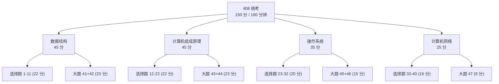
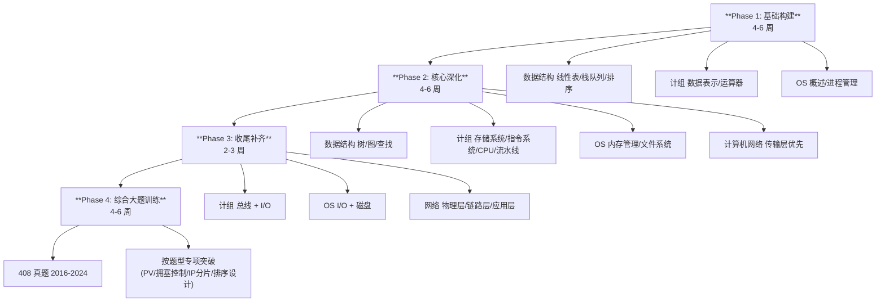

## 408统考索引

> 计算机学科专业基础综合 (408) 全国硕士研究生入学统一考试 — 四科综合索引。
> 本索引覆盖 RootStack 仓库中与 408 考纲对应的四门学科的全部教程文件，
> 标注每个知识点在对应文件中的覆盖程度。

### 408 考试构成

| 科目 | 分值 | 选择题 (1-40) | 综合应用题 (41-47) |
|------|:---:|:---:|:---:|
| 数据结构 | 45 分 | 1-11 题 (22 分) | 41 (算法设计, 13 分) / 42 (结构分析, 10 分) |
| 计算机组成原理 | 45 分 | 12-22 题 (22 分) | 43 (分析/设计, 8 分) / 44 (计算/分析, 15 分) |
| 操作系统 | 35 分 | 23-32 题 (20 分) | 45 (简答/分析, 7 分) / 46 (综合, 8 分) |
| 计算机网络 | 25 分 | 33-40 题 (16 分) | 47 (分析/计算, 9 分) |
| **合计** | **150 分** | **40 题 × 2 分 = 80 分** | **7 大题 = 70 分** |

---

## 一、数据结构 (45 分) — [[../数据结构/DSA学习路线|入口]]

### 1.1 线性表

| 408 考点 | 对应文件 | 覆盖度 |
|----------|---------|:---:|
| 线性表的定义与基本操作 | [[../数据结构/D_容器_Container|D 容器]] — 连续存储 vs 节点存储 | 完整 |
| 顺序存储结构 (顺序表) | [[../数据结构/A_数组_Array|A 数组]] — 寻址公式、静态/动态数组 | 完整 |
| 链式存储结构 (单链表/双链表/循环链表) | [[../数据结构/E_链表_LinkedList|E 链表]] — 三种形态、插入删除 | 完整 |
| 顺序表与链表的比较 | [[../数据结构/D_容器_Container|D 容器]] — CPU 缓存与空间局部性分析 | 完整 |
| 线性表的应用 | [[../数据结构/D_容器_Container|D 容器]] — vector 扩容均摊分析 | 完整 |

### 1.2 栈、队列和数组

| 408 考点 | 对应文件 | 覆盖度 |
|----------|---------|:---:|
| 栈的基本概念 | [[../数据结构/F_栈_Stack|F 栈]] — LIFO、操作表 | 完整 |
| 栈的顺序存储与链式存储 | [[../数据结构/F_栈_Stack|F 栈]] — 数组实现 / 链表实现 | 完整 |
| 栈的应用 (括号匹配/表达式求值/递归) | [[../数据结构/F_栈_Stack|F 栈]] — 调用栈、栈溢出 | 完整 |
| 队列的基本概念 | [[../数据结构/G_队列_Queue|G 队列]] — FIFO、操作表 | 完整 |
| 循环队列 | [[../数据结构/G_队列_Queue|G 队列]] — 取模运算、假溢出、满判定 | 完整 |
| 双端队列 | [[../数据结构/G_队列_Queue|G 队列]] — deque 分段连续存储 | 完整 |
| 队列的链式存储 | [[../数据结构/G_队列_Queue|G 队列]] — 链表队列 | 完整 |
| 栈和队列的应用 | [[../数据结构/F_栈_Stack|F 栈]] + [[../数据结构/G_队列_Queue|G 队列]] | 完整 |
| 特殊矩阵的压缩存储 (对称/三角/对角) | [[../数据结构/C_稀疏矩阵_SparseMatrix|C 稀疏矩阵]] — 数组索引映射 | 部分 |
| 稀疏矩阵 (三元组/十字链表) | [[../数据结构/C_稀疏矩阵_SparseMatrix|C 稀疏矩阵]] — COO/CSR 详解 | 完整 |

### 1.3 串

| 408 考点 | 对应文件 | 覆盖度 |
|----------|---------|:---:|
| 串的定义与基本操作 | [[../数据结构/B_字符串_String|B 字符串]] — C 风格 vs Pascal 风格 | 完整 |
| 串的模式匹配 (暴力) | [[../数据结构/B_字符串_String|B 字符串]] — BF 算法 | 完整 |
| KMP 算法 (next 数组、匹配过程) | [[../数据结构/B_字符串_String|B 字符串]] — 前缀函数推导、自动机 | 完整 |
| KMP 的改进与优化 | [[../算法/字符串扩展/Trie字典树|算法 字符串扩展]] — AC 自动机 (扩展) | 超纲 |

### 1.4 树与二叉树

| 408 考点 | 对应文件 | 覆盖度 |
|----------|---------|:---:|
| 树的基本概念 | [[../数据结构/J_树_Tree_BST_AVL|J 树 BST AVL]] — 术语体系 (深度/高度/层) | 完整 |
| 二叉树的定义与性质 | [[../数据结构/J_树_Tree_BST_AVL|J 树 BST AVL]] — 二叉树定义 | 完整 |
| 二叉树的顺序存储与链式存储 | [[../数据结构/J_树_Tree_BST_AVL|J 树 BST AVL]] | 完整 |
| 二叉树的遍历 (前/中/后/层序) | [[../数据结构/J_树_Tree_BST_AVL|J 树 BST AVL]] — 四种遍历详解 | 完整 |
| 线索二叉树 | — | 缺 |
| 树的存储结构 (双亲/孩子/孩子兄弟) | [[../数据结构/J_树_Tree_BST_AVL|J 树 BST AVL]] | 部分 |
| 树与二叉树的转换 | — | 缺 |
| 森林的遍历 | — | 缺 |
| 哈夫曼树与哈夫曼编码 | — | 缺 |
| 并查集及其应用 | [[../数据结构/O_并查集_UnionFind|O 并查集]] — 路径压缩、按秩合并 | 完整 |
| 二叉排序树 (BST) | [[../数据结构/J_树_Tree_BST_AVL|J 树 BST AVL]] — BST 插入/查找/删除 | 完整 |
| 平衡二叉树 (AVL) | [[../数据结构/J_树_Tree_BST_AVL|J 树 BST AVL]] — AVL 四种旋转 | 完整 |
| 红黑树 (概念与性质) | [[../数据结构/K_红黑树_RedBlackTree|K 红黑树]] — 五个性质、插入删除 | 超纲 |

### 1.5 图

| 408 考点 | 对应文件 | 覆盖度 |
|----------|---------|:---:|
| 图的基本概念 (顶点/边/度/路径/连通) | [[../数据结构/S_图_Graph|S 图]] — 图的分类 | 完整 |
| 图的存储 (邻接矩阵/邻接表) | [[../数据结构/S_图_Graph|S 图]] — 两种存储对比 | 完整 |
| 图的遍历 (BFS/DFS) | [[../数据结构/S_图_Graph|S 图]] — BFS/DFS 对比表格 | 完整 |
| 最小生成树 (Prim/Kruskal) | [[../数据结构/S_图_Graph|S 图]] + [[../算法/图论/最小生成树|算法 最小生成树]] | 完整 |
| 最短路径 (Dijkstra) | [[../数据结构/S_图_Graph|S 图]] — 正确性证明、复杂度分析 | 完整 |
| 最短路径 (Floyd) | [[../数据结构/T_图的高级算法_AdvancedGraph|T 图高级算法]] — Floyd-Warshall | 完整 |
| 拓扑排序 | [[../数据结构/T_图的高级算法_AdvancedGraph|T 图高级算法]] — Kahn/DFS 两种写法 | 完整 |
| 关键路径 (AOE 网) | — | 缺 |
| 有向无环图 (DAG) | [[../数据结构/T_图的高级算法_AdvancedGraph|T 图高级算法]] — 拓扑排序 | 部分 |

### 1.6 查找

| 408 考点 | 对应文件 | 覆盖度 |
|----------|---------|:---:|
| 查找的基本概念 | [[../数据结构/J_树_Tree_BST_AVL|J 树 BST AVL]] | 完整 |
| 顺序查找 | [[../算法/算法技巧/暴力枚举|算法 暴力枚举]] | 部分 |
| 折半查找 (二分查找) | [[../算法/算法技巧/二分查找|算法 二分查找]] — 详细实现与分析 | 完整 |
| 分块查找 | — | 缺 |
| B 树及其基本操作 (插入/删除) | [[../数据结构/M_B树_BTree|M B 树]] — 定义、高度分析、插入/删除 | 完整 |
| B+ 树的基本概念 | [[../数据结构/M_B树_BTree|M B 树]] — B+ 树章节 | 完整 |
| 散列表 (哈希表) | [[../数据结构/N_哈希表_HashTable|N 哈希表]] — 哈希函数、冲突解决 | 完整 |
| 散列函数 (除留余数法/乘法哈希等) | [[../数据结构/N_哈希表_HashTable|N 哈希表]] — 乘法哈希、DJB2 | 完整 |
| 冲突处理 (链地址法/开放地址法) | [[../数据结构/N_哈希表_HashTable|N 哈希表]] — 两种方法详解 | 完整 |
| 查找效率分析 (平均查找长度 ASL) | [[../数据结构/N_哈希表_HashTable|N 哈希表]] — 装载因子、rehash | 部分 |
| 串的匹配 (KMP 在查找中的应用) | [[../数据结构/B_字符串_String|B 字符串]] | 完整 |

### 1.7 排序

| 408 考点 | 对应文件 | 覆盖度 |
|----------|---------|:---:|
| 排序的基本概念 (稳定性/内排vs外排) | [[../数据结构/H_排序_八大排序_Sorting|H 八大排序]] — 稳定性表格、比较下界 | 完整 |
| 插入排序 (直接插入/折半插入) | [[../数据结构/H_排序_八大排序_Sorting|H 八大排序]] | 完整 |
| 希尔排序 | [[../数据结构/H_排序_八大排序_Sorting|H 八大排序]] | 完整 |
| 冒泡排序 | [[../数据结构/H_排序_八大排序_Sorting|H 八大排序]] — 优化、流程图 | 完整 |
| 快速排序 | [[../数据结构/H_排序_八大排序_Sorting|H 八大排序]] — 枢轴选择、优化 | 完整 |
| 简单选择排序 | [[../数据结构/H_排序_八大排序_Sorting|H 八大排序]] | 完整 |
| 堆排序 | [[../数据结构/H_排序_八大排序_Sorting|H 八大排序]] + [[../数据结构/I_堆_Heap|I 堆]] | 完整 |
| 二路归并排序 | [[../数据结构/H_排序_八大排序_Sorting|H 八大排序]] | 完整 |
| 基数排序 | [[../数据结构/H_排序_八大排序_Sorting|H 八大排序]] | 完整 |
| 各种排序算法的比较 (时间/空间/稳定) | [[../数据结构/H_排序_八大排序_Sorting|H 八大排序]] — 总览表 | 完整 |
| 外部排序 (多路归并/败者树/置换选择) | — | 缺 |

### 1.8 已覆盖知识点清单 (408 大纲对照)

**完整覆盖** (共 38 个考点): 线性表全部、栈队列全部、串的模式匹配全部、二叉树定义与遍历、BST/AVL、图存储与遍历、最小生成树、Dijkstra、拓扑排序、B 树/B+ 树、哈希表、八大排序对比与实现

**部分覆盖** (共 5 个考点): 特殊矩阵压缩 (仅有稀疏矩阵、缺对称/三角/对角矩阵的一维映射公式)、树与二叉树的转换/森林遍历、DAG 关键路径、分块查找、ASL 分析

**缺** (共 5 个考点): 线索二叉树、树/森林与二叉树的转换、哈夫曼树与哈夫曼编码、关键路径 (AOE)、外部排序

### 1.9 超纲内容 (不在 408 大纲但存在于本教程的知识)

| 文件 | 超纲内容 | 学习价值 |
|------|---------|---------|
| [[../数据结构/C_稀疏矩阵_SparseMatrix|C 稀疏矩阵]] | COO/CSR 格式的工程细节、密度分析 | 加深对数组存储的理解 |
| [[../数据结构/K_红黑树_RedBlackTree|K 红黑树]] | 红黑树插入/删除的旋转与染色 | 理解 C++ std::map 底层、CFS 调度 |
| [[../数据结构/L_字典树_Trie|L 字典树]] | Trie / 01-Trie | 字符串集合查找、最大异或对 |
| [[../数据结构/O_并查集_UnionFind|O 并查集]] | 路径压缩、按秩合并 (超出 408 深度) | Kruskal 算法基础、图连通性 |
| [[../数据结构/P_跳表_SkipList|P 跳表]] | 跳表 (概率性平衡) | Redis zset 底层、无锁数据结构 |
| [[../数据结构/Q_线段树_SegmentTree|Q 线段树]] | 区间查询/修改 | 算法竞赛 |
| [[../数据结构/R_树状数组_BIT|R 树状数组]] | 前缀和在线更新 | 算法竞赛 |
| [[../数据结构/T_图的高级算法_AdvancedGraph|T 图高级算法]] | Bellman-Ford、Tarjan SCC、网络流 Dinic | 算法竞赛、高级图论 |

---

## 二、计算机组成原理 (45 分) — [[../计算机原理/计算机原理_索引|入口]]

### 2.1 计算机系统概述

| 408 考点 | 对应文件 | 覆盖度 |
|----------|---------|:---:|
| 计算机发展历程 | — | 缺 |
| 计算机系统层次结构 (硬件/软件) | [[../计算机原理/C_CPU架构|C CPU 架构]] — Von Neumann 架构 | 完整 |
| 计算机硬件的基本组成 (五部件) | [[../计算机原理/C_CPU架构|C CPU 架构]] — CU/ALU/寄存器/内存 | 完整 |
| 计算机软件的分类 | [[../操作系统/A_操作系统概述|OS A 概述]] — 用户态/内核态 | 部分 |
| 计算机的工作过程 (取指-译码-执行) | [[../计算机原理/C_CPU架构|C CPU 架构]] + [[../计算机原理/H_CPU数据通路与控制器|H 数据通路]] | 完整 |
| 计算机性能指标 (CPI/MIPS/MFLOPS/加速比) | [[../计算机原理/I_流水线与指令流水|I 流水线]] — 量化参数与公式 | 完整 |

### 2.2 数据的表示和运算

| 408 考点 | 对应文件 | 覆盖度 |
|----------|---------|:---:|
| 进位计数制与转换 | [[../计算机原理/A_数据表示|A 数据表示]] | 部分 |
| 真值与机器数 | [[../计算机原理/A_数据表示|A 数据表示]] | 部分 |
| 原码/反码/补码/移码 | [[../计算机原理/A_数据表示|A 数据表示]] — 补码详解 | 部分 |
| 定点数的表示与运算 | [[../计算机原理/A_数据表示|A 数据表示]] — 整数 + [[../计算机原理/J_运算方法与运算器|J 运算器]] — 加法器 | 完整 |
| 浮点数的表示 (IEEE 754) | [[../计算机原理/A_数据表示|A 数据表示]] — s/E/M 格式、特殊值 | 完整 |
| 浮点数的加减运算 | [[../计算机原理/J_运算方法与运算器|J 运算器]] — IEEE 754 浮点运算 | 完整 |
| ALU 的结构与功能 | [[../计算机原理/J_运算方法与运算器|J 运算器]] — 半加器/全加器/行波进位 | 完整 |
| 串行进位与并行进位 (先行进位 CLA) | [[../计算机原理/J_运算方法与运算器|J 运算器]] — 超前进位加法器 | 完整 |
| 算术逻辑单元 (ALU) | [[../计算机原理/J_运算方法与运算器|J 运算器]] — 补码加减/移位/Booth 乘法 | 完整 |

### 2.3 存储系统

| 408 考点 | 对应文件 | 覆盖度 |
|----------|---------|:---:|
| 存储系统的层次结构 | [[../计算机原理/D_内存层次结构|D 内存层次结构]] — 金字塔模型 | 完整 |
| SRAM 与 DRAM | [[../计算机原理/D_内存层次结构|D 内存层次结构]] — 6T SRAM vs 1T1C DRAM | 完整 |
| ROM (掩膜/PROM/EPROM/Flash) | — | 缺 |
| 存储芯片与存储器扩展 | — | 缺 |
| 主存与 CPU 的连接 | [[../计算机原理/F_总线系统|F 总线系统]] — 地址/数据/控制总线 | 部分 |
| Cache 的基本原理 | [[../计算机原理/B_缓存层级|B 缓存层级]] — Cache Line、命中/缺失 | 完整 |
| Cache 与主存的映射 (直接/全关联/组关联) | [[../计算机原理/B_缓存层级|B 缓存层级]] — 关联度分析 | 完整 |
| Cache 的替换算法 (LRU/RAND/FIFO) | [[../计算机原理/B_缓存层级|B 缓存层级]] — 写策略 | 部分 |
| Cache 的写策略 (写直达/写回) | [[../计算机原理/B_缓存层级|B 缓存层级]] — 写策略说明 | 完整 |
| 虚拟存储器 (页式/段式/段页式) | [[../计算机原理/D_内存层次结构|D 内存层次结构]] — TLB + [[../操作系统/F_内存管理|OS F 内存]] | 完整 |
| TLB (快表) | [[../操作系统/F_内存管理|OS F 内存管理]] — TLB 详解 | 完整 |

### 2.4 指令系统

| 408 考点 | 对应文件 | 覆盖度 |
|----------|---------|:---:|
| 指令的基本格式 (操作码+地址码) | [[../计算机原理/E_指令集体系结构|E 指令集体系结构]] | 完整 |
| 定长操作码/扩展操作码 | [[../计算机原理/E_指令集体系结构|E 指令集体系结构]] | 部分 |
| 寻址方式 (立即/直接/间接/寄存器/变址等) | [[../计算机原理/E_指令集体系结构|E 指令集体系结构]] — 五种寻址模式 + 基址变址偏移 | 完整 |
| 有效地址的计算 | [[../计算机原理/E_指令集体系结构|E 指令集体系结构]] | 完整 |
| CISC 与 RISC | [[../计算机原理/E_指令集体系结构|E 指令集体系结构]] — CISC vs RISC 对比表 | 完整 |
| 常见指令类型 (数据传送/算术/逻辑/转移) | [[../计算机原理/E_指令集体系结构|E 指令集体系结构]] | 部分 |

### 2.5 中央处理器 (CPU)

| 408 考点 | 对应文件 | 覆盖度 |
|----------|---------|:---:|
| CPU 的功能与基本结构 | [[../计算机原理/C_CPU架构|C CPU 架构]] — Von Neumann + 流水线概念 | 完整 |
| 指令执行过程 (取指/译码/执行/访存/写回) | [[../计算机原理/H_CPU数据通路与控制器|H 数据通路]] — 五阶段分解 | 完整 |
| 数据通路 (单总线/双总线/三总线) | [[../计算机原理/H_CPU数据通路与控制器|H 数据通路]] — 三种总线结构 | 完整 |
| 控制器的功能与工作原理 | [[../计算机原理/H_CPU数据通路与控制器|H 数据通路]] | 完整 |
| 硬布线控制器 (组合逻辑) | [[../计算机原理/H_CPU数据通路与控制器|H 数据通路]] | 部分 |
| 微程序控制器 | — | 缺 |
| 指令流水线的基本概念 | [[../计算机原理/C_CPU架构|C CPU 架构#指令流水线]] + [[../计算机原理/I_流水线与指令流水|I 流水线]] | 完整 |
| 五级流水线 (IF/ID/EX/MEM/WB) | [[../计算机原理/I_流水线与指令流水|I 流水线]] — 时空图、量化参数 | 完整 |
| 流水线冒险 (结构/数据/控制) | [[../计算机原理/C_CPU架构|C CPU 架构#流水线冒险]] + [[../计算机原理/I_流水线与指令流水|I 流水线]] | 完整 |
| 数据前推 (Forwarding) | [[../计算机原理/I_流水线与指令流水|I 流水线]] | 完整 |
| 分支预测 | [[../计算机原理/C_CPU架构|C CPU 架构#分支预测]] | 完整 |
| 超标量与动态调度 | [[../计算机原理/I_流水线与指令流水|I 流水线]] | 部分 |

### 2.6 总线

| 408 考点 | 对应文件 | 覆盖度 |
|----------|---------|:---:|
| 总线的基本概念 | [[../计算机原理/F_总线系统|F 总线系统]] — 数据/地址/控制总线 | 完整 |
| 总线分类 (片内/系统/通信) | [[../计算机原理/F_总线系统|F 总线系统]] — 三种分类详解 | 完整 |
| 总线性能指标 (宽度/频率/带宽) | [[../计算机原理/F_总线系统|F 总线系统]] — 带宽计算公式 | 完整 |
| 总线仲裁 (集中式/分布式) | [[../计算机原理/F_总线系统|F 总线系统]] — 仲裁方式 | 完整 |
| 总线操作与定时 (同步/异步/半同步/分离) | [[../计算机原理/F_总线系统|F 总线系统]] — 定时方式 | 完整 |
| 总线标准 (PCI/PCIe/USB 等) | [[../计算机原理/F_总线系统|F 总线系统]] — 总线类型总表 | 完整 |

### 2.7 输入/输出系统

| 408 考点 | 对应文件 | 覆盖度 |
|----------|---------|:---:|
| I/O 接口的功能与结构 | [[../计算机原理/G_输入输出系统|G I/O 系统]] — I/O 接口内部寄存器 | 完整 |
| I/O 端口的编址 (独立/统一) | [[../计算机原理/G_输入输出系统|G I/O 系统]] — PMIO vs MMIO 详解 | 完整 |
| 程序查询方式 (轮询) | [[../计算机原理/G_输入输出系统|G I/O 系统]] — 程序查询方式 | 完整 |
| 中断方式 | [[../计算机原理/G_输入输出系统|G I/O 系统]] — 中断处理完整流程 | 完整 |
| DMA 方式 | [[../计算机原理/G_输入输出系统|G I/O 系统]] — DMA 控制器与传输 | 完整 |
| 通道方式 | — | 缺 |

### 2.8 已覆盖/缺知识点总结 (计组)

**完整覆盖**: 五部件组成、数据通路、流水线全部、缓存层次、总线全部、I/O 方式 (查询/中断/DMA)、指令格式与寻址、CISC vs RISC、定点/浮点表示、加法器/ALU

**部分覆盖**: 原码/反码/移码 (仅重点讲补码)、Cache 替换算法 (LRU 深度不足)、扩展操作码、微程序控制器、硬布线控制器细节、主存与 CPU 连接

**缺**: 计算机发展历程、进位计数制转换系统讲解、原码/反码/移码系统讲解、ROM 分类、存储器芯片与扩展、微程序控制器完整设计、通道方式

---

## 三、操作系统 (35 分) — [[../操作系统/操作系统_索引|入口]]

### 3.1 操作系统概述

| 408 考点 | 对应文件 | 覆盖度 |
|----------|---------|:---:|
| 操作系统的概念与特征 (并发/共享/虚拟/异步) | [[../操作系统/A_操作系统概述|A 概述]] — 核心职责 | 完整 |
| 操作系统的发展与分类 | — | 缺 |
| 操作系统的运行环境 (用户态/内核态) | [[../操作系统/A_操作系统概述|A 概述]] — 用户态与内核态 | 完整 |
| 中断与异常 | [[../操作系统/A_操作系统概述|A 概述]] — 中断/异常/陷入 | 完整 |
| 系统调用 | [[../操作系统/A_操作系统概述|A 概述]] — 系统调用列表 | 完整 |
| 内核类型 (宏内核/微内核) | [[../操作系统/A_操作系统概述|A 概述]] — 内核类型对比 | 完整 |
| 操作系统启动过程 | [[../操作系统/A_操作系统概述|A 概述]] — BIOS/UEFI/GRUB/init | 完整 |

### 3.2 进程管理

| 408 考点 | 对应文件 | 覆盖度 |
|----------|---------|:---:|
| 进程的概念与特征 | [[../操作系统/B_进程管理|B 进程管理]] — 进程定义、PCB | 完整 |
| 进程的状态与转换 | [[../操作系统/B_进程管理|B 进程管理]] — 状态转换图 (含僵尸态) | 完整 |
| 进程控制 (创建/终止/阻塞/唤醒) | [[../操作系统/B_进程管理|B 进程管理]] — fork/exec | 完整 |
| 进程通信 (共享存储/消息传递/管道) | [[../操作系统/I_进程间通信|I 进程间通信]] — 七种 IPC 对比 | 完整 |
| 线程的概念与多线程模型 | [[../操作系统/C_线程与并发|C 线程与并发]] — 进程 vs 线程、1:1/N:1/M:N | 完整 |
| 处理机调度概念与层次 | [[../操作系统/D_CPU调度|D CPU 调度]] — 调度时机 | 完整 |
| 调度算法 (FCFS/SJF/优先级/RR/多级队列/多级反馈) | [[../操作系统/D_CPU调度|D CPU 调度]] — FCFS/SJF/RR/MLFQ | 完整 |
| 进程同步与互斥 (临界区/互斥/信号量) | [[../操作系统/E_同步与死锁|E 同步与死锁]] — 临界区、信号量、PV 操作 | 完整 |
| 经典同步问题 (生产者-消费者/读者写者/哲学家) | [[../操作系统/E_同步与死锁|E 同步与死锁]] — 生产者-消费者 | 部分 |
| 死锁的概念、必要条件、预防与避免 | [[../操作系统/E_同步与死锁|E 同步与死锁]] — 死锁/银行家算法 | 完整 |
| 银行家算法 | [[../操作系统/E_同步与死锁|E 同步与死锁]] | 完整 |

### 3.3 内存管理

| 408 考点 | 对应文件 | 覆盖度 |
|----------|---------|:---:|
| 内存管理的概念与功能 | [[../操作系统/F_内存管理|F 内存管理]] | 完整 |
| 连续分配 (单一/固定/动态分区) | [[../操作系统/F_内存管理|F 内存管理]] | 部分 |
| 分页存储管理 (页表/地址变换) | [[../操作系统/F_内存管理|F 内存管理]] — 四级页表、地址转换 | 完整 |
| 分段存储管理 | — | 缺 |
| 段页式存储管理 | — | 缺 |
| 虚拟内存的基本概念 | [[../操作系统/F_内存管理|F 内存管理]] — 虚拟内存 | 完整 |
| 请求分页管理方式 | [[../操作系统/F_内存管理|F 内存管理]] — 缺页中断流程 | 完整 |
| 页面置换算法 (OPT/FIFO/LRU/CLOCK) | [[../操作系统/F_内存管理|F 内存管理]] — 页面置换 | 部分 |
| 抖动与工作集 | — | 缺 |
| 内存分配器底层 (malloc/free) | [[../操作系统/G_内存分配器|G 内存分配器]] — ptmalloc、bin 体系 | 超纲 |

### 3.4 文件管理

| 408 考点 | 对应文件 | 覆盖度 |
|----------|---------|:---:|
| 文件系统的基本概念 | [[../操作系统/H_文件系统|H 文件系统]] — VFS、inode | 完整 |
| 文件的逻辑结构与物理结构 (顺序/链接/索引) | [[../操作系统/H_文件系统|H 文件系统]] — 直接块/间接块 | 完整 |
| 目录结构 (单级/两级/树形/无环图) | [[../操作系统/H_文件系统|H 文件系统]] — 目录、硬链接/软链接 | 完整 |
| 文件共享 (硬链接/软链接) | [[../操作系统/H_文件系统|H 文件系统]] — 硬链接 vs 软链接 | 完整 |
| 文件保护 | — | 缺 |
| 文件系统实现 (空闲空间管理) | — | 缺 |
| 磁盘的组织与管理 (磁盘调度) | [[../操作系统/J_IO管理|J I/O 管理]] — 磁盘调度算法 | 完整 |

### 3.5 输入输出(I/O)管理

| 408 考点 | 对应文件 | 覆盖度 |
|----------|---------|:---:|
| I/O 管理概述 (设备分类/控制器) | [[../操作系统/J_IO管理|J I/O 管理]] — 块/字符/网络设备 | 完整 |
| I/O 控制方式 (程序/中断/DMA/通道) | [[../操作系统/J_IO管理|J I/O 管理]] — 四种方式详解 | 完整 |
| 缓冲区管理 (单缓冲/双缓冲/循环缓冲) | [[../操作系统/J_IO管理|J I/O 管理]] | 完整 |
| SPOOLing 假脱机技术 | [[../操作系统/J_IO管理|J I/O 管理]] | 完整 |
| I/O 软件层次结构 | [[../操作系统/J_IO管理|J I/O 管理]] | 完整 |
| 磁盘调度算法 (FCFS/SSTF/SCAN/C-SCAN) | [[../操作系统/J_IO管理|J I/O 管理]] | 完整 |

### 3.6 已覆盖/缺知识点总结 (OS)

**完整覆盖**: 进程状态转换、PCB、上下文切换、fork/exec、线程模型、调度算法 (FCFS/SJF/RR/MLFQ/CFS)、信号量与 PV 操作、死锁与银行家、分页机制与四级页表、TLB、缺页中断、VFS/inode、硬链接/软链接、文件描述符、I/O 控制方式、磁盘调度、SPOOLing

**部分覆盖**: 经典同步问题 (仅生产者-消费者、缺读者写者与哲学家)、连续分配方式 (细节不足)、页面置换算法 (需补充 CLOCK)、文件保护与空闲空间管理

**缺**: OS 发展史与分类、分段/段页式存储管理、抖动与工作集

**超纲**: ptmalloc 内存分配器 ([[../操作系统/G_内存分配器|G 内存分配器]])

---

## 四、计算机网络 (25 分) — [[../计算机网络/计算机网络_索引|入口]]

### 4.1 计算机网络体系结构

| 408 考点 | 对应文件 | 覆盖度 |
|----------|---------|:---:|
| 计算机网络的概念、组成与功能 | [[../计算机网络/A_体系结构|A 体系结构]] — 三网合一 | 完整 |
| 计算机网络的分类 (LAN/MAN/WAN) | [[../计算机网络/A_体系结构|A 体系结构]] — 拓扑/技术/范围分类 | 完整 |
| 计算机网络的性能指标 (速率/带宽/时延/RTT/吞吐量) | [[../计算机网络/A_体系结构|A 体系结构]] — 性能指标详解 | 完整 |
| OSI 七层模型 | [[../计算机网络/A_体系结构|A 体系结构]] — OSI vs TCP/IP 对比 | 完整 |
| TCP/IP 四层模型 | [[../计算机网络/A_体系结构|A 体系结构]] | 完整 |
| 协议、接口、服务等概念 | [[../计算机网络/A_体系结构|A 体系结构]] | 完整 |

### 4.2 物理层

| 408 考点 | 对应文件 | 覆盖度 |
|----------|---------|:---:|
| 通信基础 (信源/信道/信号) | [[../计算机网络/B_物理层|B 物理层]] — 通信系统模型 | 完整 |
| 奈奎斯特定理 (无噪声信道) | [[../计算机网络/B_物理层|B 物理层]] — Nyquist 公式 + 例题 | 完整 |
| 香农定理 (有噪声信道) | [[../计算机网络/B_物理层|B 物理层]] — Shannon 公式 + 例题 | 完整 |
| 编码与调制 (NRZ/曼彻斯特/差分曼彻斯特) | [[../计算机网络/B_物理层|B 物理层]] — 基带/带通传输 | 完整 |
| 电路交换/报文交换/分组交换 | [[../计算机网络/B_物理层|B 物理层]] — 交换方式对比 | 完整 |
| 数据报与虚电路 | [[../计算机网络/B_物理层|B 物理层]] — 数据报 vs 虚电路 | 完整 |
| 传输介质 (双绞线/光纤/无线) | [[../计算机网络/B_物理层|B 物理层]] | 完整 |
| 物理层设备 (中继器/集线器) | [[../计算机网络/B_物理层|B 物理层]] | 完整 |

### 4.3 数据链路层

| 408 考点 | 对应文件 | 覆盖度 |
|----------|---------|:---:|
| 数据链路层的功能 | [[../计算机网络/C_数据链路层|C 数据链路层]] | 完整 |
| 组帧 (字符计数/字符填充/零比特填充/违规编码) | [[../计算机网络/C_数据链路层|C 数据链路层]] — 四种组帧方法 | 完整 |
| 差错控制 (奇偶校验/CRC/海明码) | [[../计算机网络/C_数据链路层|C 数据链路层]] — CRC 计算 | 完整 |
| 流量控制与可靠传输 (停等/GBN/SR) | [[../计算机网络/C_数据链路层|C 数据链路层]] — 三种协议 | 完整 |
| 介质访问控制 (信道划分/随机访问/轮询) | [[../计算机网络/C_数据链路层|C 数据链路层]] — MAC 子层 | 完整 |
| ALOHA / CSMA / CSMA/CD | [[../计算机网络/C_数据链路层|C 数据链路层]] — CSMA/CD 详解 | 完整 |
| CSMA/CA | [[../计算机网络/C_数据链路层|C 数据链路层]] | 完整 |
| 局域网 (以太网/MAC地址/交换机) | [[../计算机网络/C_数据链路层|C 数据链路层]] — 802.3、交换机 | 完整 |
| 广域网 (PPP 协议) | [[../计算机网络/C_数据链路层|C 数据链路层]] — PPP/LCP/NCP | 完整 |
| VLAN | [[../计算机网络/C_数据链路层|C 数据链路层]] | 完整 |

### 4.4 网络层

| 408 考点 | 对应文件 | 覆盖度 |
|----------|---------|:---:|
| 网络层的功能 (路由与转发) | [[../计算机网络/D_网络层|D 网络层]] — 数据平面 vs 控制平面 | 完整 |
| 路由算法 (静态/动态) | [[../计算机网络/D_网络层|D 网络层]] | 完整 |
| IPv4 地址与子网划分 | [[../计算机网络/D_网络层|D 网络层]] — IP 分类、子网掩码、CIDR | 完整 |
| CIDR (无分类编址) | [[../计算机网络/D_网络层|D 网络层]] — 路由聚合 | 完整 |
| ARP 协议 | [[../计算机网络/D_网络层|D 网络层]] — ARP 请求/响应 | 完整 |
| IP 数据报格式与分片 | [[../计算机网络/D_网络层|D 网络层]] — IPv4 头部字段、分片计算 | 完整 |
| ICMP 协议 | [[../计算机网络/D_网络层|D 网络层]] | 完整 |
| DHCP 协议 | [[../计算机网络/D_网络层|D 网络层]] | 完整 |
| NAT | [[../计算机网络/D_网络层|D 网络层]] | 完整 |
| IPv6 | [[../计算机网络/D_网络层|D 网络层]] | 完整 |
| 路由协议 (RIP/OSPF/BGP) | [[../计算机网络/D_网络层|D 网络层]] — 距离向量 vs 链路状态 | 完整 |
| IP 组播 | [[../计算机网络/D_网络层|D 网络层]] | 完整 |
| 移动 IP | — | 缺 |

### 4.5 传输层

| 408 考点 | 对应文件 | 覆盖度 |
|----------|---------|:---:|
| 传输层的功能 (端到端/复用分用) | [[../计算机网络/E_传输层|E 传输层]] — 核心功能表 | 完整 |
| 端口与套接字 | [[../计算机网络/E_传输层|E 传输层]] — 端口范围、五元组 | 完整 |
| UDP 协议 (头部/校验和) | [[../计算机网络/E_传输层|E 传输层]] — UDP 头部 + 校验和计算 | 完整 |
| TCP 报文段格式 (序号/确认号/窗口/标志位) | [[../计算机网络/E_传输层|E 传输层]] — TCP 头部详解 | 完整 |
| TCP 连接管理 (三次握手/四次挥手) | [[../计算机网络/E_传输层|E 传输层]] — 连接状态机、TIME_WAIT | 完整 |
| TCP 可靠传输 (序号确认/超时重传) | [[../计算机网络/E_传输层|E 传输层]] — 可靠传输机制 | 完整 |
| TCP 流量控制 (滑动窗口 rwnd) | [[../计算机网络/E_传输层|E 传输层]] — 流量控制 | 完整 |
| TCP 拥塞控制 (慢开始/拥塞避免/快重传/快恢复) | [[../计算机网络/E_传输层|E 传输层]] — 拥塞控制四阶段 | 完整 |

### 4.6 应用层

| 408 考点 | 对应文件 | 覆盖度 |
|----------|---------|:---:|
| 网络应用模型 (C/S / P2P) | [[../计算机网络/F_应用层|F 应用层]] — C/S vs P2P | 完整 |
| DNS 域名系统 (层次/解析/缓存) | [[../计算机网络/F_应用层|F 应用层]] — DNS 详解 | 完整 |
| FTP 文件传输协议 | [[../计算机网络/F_应用层|F 应用层]] — FTP 控制连接/数据连接 | 完整 |
| 电子邮件 (SMTP/POP3/IMAP/MIME) | [[../计算机网络/F_应用层|F 应用层]] — 电子邮件系统 | 完整 |
| HTTP 协议 | [[../计算机网络/F_应用层|F 应用层]] — HTTP/1.1、HTTP/2、HTTPS | 完整 |
| WWW (万维网) | [[../计算机网络/F_应用层|F 应用层]] | 完整 |

### 4.7 已覆盖/缺知识点总结 (计算机网络)

**完整覆盖**: 六层体系全部考纲内容，包括 OSI/TCP/IP、物理层双定理计算、数据链路层组帧/CRC/CSMA/CD、网络层 IPv4/子网/CIDR/路由协议/IP分片、传输层 TCP/UDP 全部、应用层 DNS/HTTP/FTP/电子邮件

**部分覆盖**: 移动 IP

**缺**: 无明显缺失。计算机网络是四个模块中 408 考纲覆盖率最高的科目。

---

## 五、408 大题类型与覆盖统计

### 5.1 常见大题题型

| 科目 | 常见题型 | 教程是否有详解 | 备注 |
|------|---------|:---:|------|
| **DS** | 算法设计 (线性表/树/图) | 完整 | [[../算法/算法技巧/]] 系列有大量 LeetCode 例题 |
| **DS** | B+ 树插入/删除过程 | 完整 | [[../数据结构/M_B树_BTree|M B 树]] 有完整 B+ 树内容 |
| **DS** | 哈希表构造与 ASL 计算 | 完整 | [[../数据结构/N_哈希表_HashTable|N 哈希表]] |
| **DS** | 排序算法对比 (时间/空间/稳定) | 完整 | [[../数据结构/H_排序_八大排序_Sorting|H 八大排序]] |
| **DS** | 图 (最小生成树/最短路径/拓扑排序) | 完整 | [[../数据结构/S_图_Graph|S 图]] |
| **计组** | Cache 映射与命中率计算 | 完整 | [[../计算机原理/B_缓存层级|B 缓存层级]] |
| **计组** | 流水线时空图/CPI/加速比 | 完整 | [[../计算机原理/I_流水线与指令流水|I 流水线]] |
| **计组** | 浮点数 (IEEE 754) 表示与运算 | 完整 | [[../计算机原理/A_数据表示|A 数据表示]] + [[../计算机原理/J_运算方法与运算器|J 运算器]] |
| **计组** | 数据通路与控制器分析 | 完整 | [[../计算机原理/H_CPU数据通路与控制器|H 数据通路]] |
| **计组** | 总线带宽计算 | 完整 | [[../计算机原理/F_总线系统|F 总线系统]] |
| **计组** | 指令格式/寻址方式分析 | 完整 | [[../计算机原理/E_指令集体系结构|E 指令集体系结构]] |
| **OS** | PV 操作 (信号量同步) | 完整 | [[../操作系统/E_同步与死锁|E 同步与死锁]] |
| **OS** | 银行家算法 (死锁避免) | 完整 | [[../操作系统/E_同步与死锁|E 同步与死锁]] |
| **OS** | 页面置换 (FIFO/LRU/OPT/CLOCK) | 部分 | [[../操作系统/F_内存管理|F 内存管理]] (CLOCK 需补充) |
| **OS** | 磁盘调度 (SSTF/SCAN/C-SCAN) | 完整 | [[../操作系统/J_IO管理|J I/O 管理]] |
| **OS** | 页表与地址转换 | 完整 | [[../操作系统/F_内存管理|F 内存管理]] |
| **网络** | IP 分片计算 | 完整 | [[../计算机网络/D_网络层|D 网络层]] |
| **网络** | 子网划分与 CIDR | 完整 | [[../计算机网络/D_网络层|D 网络层]] |
| **网络** | 路由表更新 (RIP/OSPF) | 完整 | [[../计算机网络/D_网络层|D 网络层]] |
| **网络** | TCP 拥塞控制窗口计算 | 完整 | [[../计算机网络/E_传输层|E 传输层]] |
| **网络** | TCP 序号/确认号/窗口计算 | 完整 | [[../计算机网络/E_传输层|E 传输层]] |
| **网络** | 奈奎斯特/香农定理计算 | 完整 | [[../计算机网络/B_物理层|B 物理层]] — 含工作示例 |

---

## 六、推荐复习路径

**Phase 1 (4-6 周) — 基础构建**:
- 数据结构：数组 → 链表 → 栈 → 队列 → 排序 (八大排序一口气学完，后续复习不用回头)
- 计组：数据表示 (数制/补码/IEEE 754) → 运算方法与运算器 (加法器/Booth 乘法)
- OS：概述 (用户态/内核态/中断) → 进程管理 (PCB/状态转换/fork)

**Phase 2 (4-6 周) — 核心深化**:
- 数据结构：树 → BST/AVL → 堆 → 哈希表 → B 树/B+ 树 → 图
- 计组：缓存层级 → 内存层次结构 → 指令集 → CPU 数据通路 → 流水线 (408 计组核心)
- OS：线程与并发 → CPU 调度 → 同步与死锁 (PV 操作是 408 必考大题) → 内存管理 (页表/TLB/缺页)
- 网络：**传输层优先** (TCP 连接/拥塞控制/流量控制是 408 压轴题重点) → 网络层 (IP/子网/路由)

**Phase 3 (2-3 周) — 收尾补齐**:
- 计组：总线系统 → 输入输出系统 (DMA 是交叉考点)
- OS：文件系统 → I/O 管理 → 磁盘调度
- 网络：体系结构 → 物理层 → 数据链路层 → 应用层 (这些层以选择题为主)
- 补齐缺项：线索二叉树/哈夫曼树/外部排序/通道方式 (可通过补充资料)

**Phase 4 (4-6 周) — 综合大题训练**:
- 真题 2016-2024 (至少 2 遍)
- 按题型专项突破：PV 操作、TCP 拥塞控制窗口计算、IP 分片、Cache 命中率、流水线加速比、排序算法设计、B+ 树构造、寻址方式分析

---

## 七、交叉模块知识点

408 考试中部分知识点跨科目出现，需联合复习：

| 交叉知识点 | 涉及科目与文件 | 说明 |
|-----------|--------------|------|
| **DMA** | 计组 [[../计算机原理/G_输入输出系统|G I/O 系统]] + OS [[../操作系统/J_IO管理|J I/O 管理]] | 硬件 DMA 控制器原理 (计组) + 内核 DMA 传输编程接口 (OS) |
| **中断** | 计组 [[../计算机原理/G_输入输出系统|G I/O 系统]] + OS [[../操作系统/A_操作系统概述|A 概述]] + [[../操作系统/B_进程管理|B 进程管理]] | 硬件中断处理流程 (计组) + 中断向量表/中断处理函数 (OS) |
| **虚拟内存 / TLB** | OS [[../操作系统/F_内存管理|F 内存管理]] + 计组 [[../计算机原理/D_内存层次结构|D 内存层次]] | 页表/TLB (OS 侧) + TLB 在缓存层次中的位置 (计组侧) |
| **Cache** | 计组 [[../计算机原理/B_缓存层级|B 缓存层级]] + DS [[../数据结构/D_容器_Container|D 容器]] | Cache 结构与映射 (计组) + 连续存储 vs 节点存储的空间局部性 (DS) |
| **指令流水线** | 计组 [[../计算机原理/I_流水线与指令流水|I 流水线]] + [[../计算机原理/C_CPU架构|C CPU 架构]] | 五级流水/冒险/数据前推 (I) + 分支预测/乱序执行 (C) |
| **I/O 控制方式** | 计组 [[../计算机原理/G_输入输出系统|G I/O 系统]] + OS [[../操作系统/J_IO管理|J I/O 管理]] | 程序查询/中断/DMA 硬件实现 (计组) + I/O 软件层次/SPOOLing (OS) |
| **总线 vs 设备控制器** | 计组 [[../计算机原理/F_总线系统|F 总线系统]] + OS [[../操作系统/J_IO管理|J I/O 管理]] | 总线仲裁与定时 (计组) + 设备控制器接口 (OS) |
| **多核与缓存一致性** | DS [[../数据结构/D_容器_Container|D 容器]] + OS [[../操作系统/C_线程与并发|C 线程与并发]] | 伪共享 (DS) + MESI 协议 (OS) |
| **系统调用** | OS [[../操作系统/A_操作系统概述|A 概述]] + 计组 [[../计算机原理/E_指令集体系结构|E 指令集体系结构]] | OS 侧 syscall 语义 + 计组侧 `syscall` 指令在 ISA 中的实现 |

---

## 八、后续计划

### 8.1 408 真题与练习题 (TBD)

408 真题与练习题将在独立目录中组织，内容包括：

- **历年真题**: 分科目、分章节刷题，每道题标注考查的知识点
- **大题专项训练**: 针对 7 大综合应用题类型的专题练习
- **解析与验证**: 每道题附详细解析，计算类题目提供 Python/C 验证代码
- **错题本**: 按 408 考纲知识点分类的错题追踪

> 本索引负责知识点到教程文件的映射，题目练习将另建目录（如 `408题库/`），此处留作后续对接。

### 8.2 待补充的考纲缺口

| 缺项 | 所属科目 | 优先级 | 计划 |
|------|---------|:---:|------|
| 线索二叉树 + 哈夫曼树 | DS | 高 | 新建 K2 / 补充到 J 树文件中 |
| 关键路径 (AOE) | DS | 中 | 补充到 T 图高级算法或 S 图中 |
| 外部排序 | DS | 中 | 补充到 H 排序中 |
| 分段/段页式存储 | OS | 高 | 补充到 F 内存管理中 |
| 页面置换 CLOCK 算法 + 抖动 | OS | 中 | 补充到 F 内存管理中 |
| 微程序控制器 | 计组 | 中 | 补充到 H 数据通路 |
| 原码/反码/移码系统讲解 | 计组 | 低 | 补充到 A 数据表示 |
| ROM 分类 + 存储器扩展 | 计组 | 低 | 新建或补充到 D 内存层次 |

---

## 九、快速链接

### 9.1 四科入口

| 科目 | 入口文件 | 文件数 | 分值 |
|------|---------|:---:|:---:|
| 数据结构 | [[../数据结构/DSA学习路线|DSA 学习路线]] | 21 个文件 | 45 分 |
| 计算机组成原理 | [[../计算机原理/计算机原理_索引|计算机原理 索引]] | 10 个文件 + 索引 | 45 分 |
| 操作系统 | [[../操作系统/操作系统_索引|操作系统 索引]] | 10 个文件 + 索引 | 35 分 |
| 计算机网络 | [[../计算机网络/计算机网络_索引|计算机网络 索引]] | 6 个文件 + 索引 | 25 分 |

### 9.2 核心公式/表格速查

| 主题 | 文件 | 关键内容 |
|------|------|---------|
| 八大排序对比表 | [[../数据结构/H_排序_八大排序_Sorting|H 排序]] | 时间/空间/稳定性表格 |
| 图的遍历与算法 | [[../数据结构/S_图_Graph|S 图]] | DFS/BFS/Dijkstra/Kruskal/Prim |
| IEEE 754 浮点数 | [[../计算机原理/A_数据表示|A 数据表示]] | s/E/M 格式、特殊值 |
| 流水线加速比公式 | [[../计算机原理/I_流水线与指令流水|I 流水线]] | S = n×k / (k+n-1) |
| 总线带宽公式 | [[../计算机原理/F_总线系统|F 总线系统]] | 带宽 = 宽度/8 × 频率 × 次数 |
| PMIO vs MMIO | [[../计算机原理/G_输入输出系统|G I/O 系统]] | 独立编址 vs 统一编址 |
| 进程状态转换 | [[../操作系统/B_进程管理|B 进程管理]] | 五状态图 |
| 调度算法对比 | [[../操作系统/D_CPU调度|D CPU 调度]] | FCFS/SJF/RR/MLFQ/CFS |
| 四级页表结构 | [[../操作系统/F_内存管理|F 内存管理]] | PGD/PUD/PMD/PTE |
| OSI vs TCP/IP | [[../计算机网络/A_体系结构|A 体系结构]] | 七层 vs 四层对比 |
| 奈奎斯特公式 | [[../计算机网络/B_物理层|B 物理层]] | C = 2W·log₂V |
| 香农公式 | [[../计算机网络/B_物理层|B 物理层]] | C = W·log₂(1+S/N) |
| CRC 计算 | [[../计算机网络/C_数据链路层|C 数据链路层]] | 模 2 除法 |
| IPv4 头部字段 | [[../计算机网络/D_网络层|D 网络层]] | 分片计算 (MF/DF/Offset) |
| TCP 头部字段 | [[../计算机网络/E_传输层|E 传输层]] | 序号/确认号/窗口/标志位 |
| TCP 拥塞控制 | [[../计算机网络/E_传输层|E 传输层]] | 慢开始/拥塞避免/快重传/快恢复 |

### 9.3 相关辅助模块

| 模块 | 入口 | 与 408 的关系 |
|------|------|-------------|
| C 语言教程 | [[../c语言教程/c目录|C 语言教程]] | 数据结构代码实现 (408 算法题可用 C/C++/Java) |
| 汇编基础 | [[../汇编基础/ASM_01_寄存器与指令基础|汇编基础]] | 计组指令系统/数据通路/Calling Convention |
| 算法专题 | [[../算法/算法技巧/|算法技巧]] | DS 算法题的代码模板与 LeetCode 训练 |
| Linux 内核 | [[../内核/系统内核/01_C语言与操作系统|系统内核]] | OS 实现细节 (远超 408 深度，辅助理解) |
