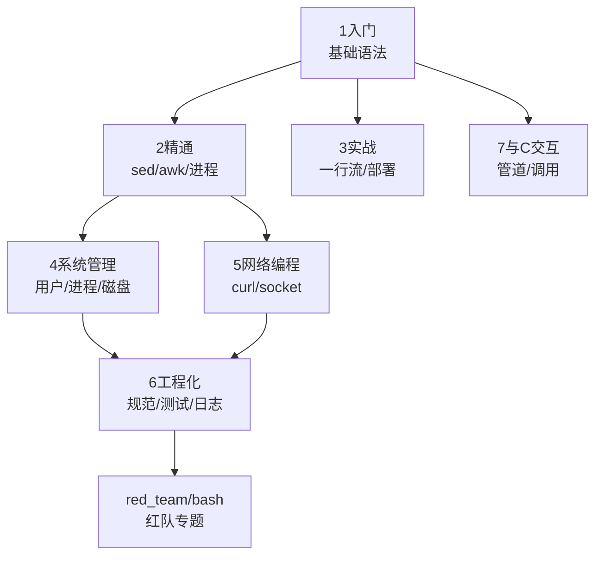

# Bash 脚本教程

> 以 C 作为出发点，用 C 的视角理解 Bash。

---

## 学习方式

每条学习步骤遵循三步法：

1. **通读概念** — 理解语法、命令、机制的原理
2. **动手实验** — 在终端中逐行运行示例，观察输出
3. **写脚本** — 将零散命令组合成可复用的脚本

> 每章建议 1-2 天完成。

---

## 章节总览



---

## 与其他教程的关系

| 教程 | 关系 |
|------|------|
| [[../c语言教程/c目录\|C语言教程]] | 前置：理解变量、内存、系统调用后学Bash事半功倍 |
| [[../python/python目录\|Python教程]] | 对标：同为脚本语言，Bash偏系统/管道，Python偏通用/数据 |
| [[../rust/rust目录\|Rust教程]] | 互补：Bash做胶水，Rust写性能关键模块 |
| [[../red_team/bash/bash红队总目录\|红队Bash]] | 扩展：Bash安全攻防方向 |

---

## 章节列表

### Phase 1 — 入门基础

| 顺序 | 文件 | 主题 |
|:----:|------|------|
| 0 | [[1入门/00_环境搭建与第一个脚本\|环境搭建]] | 安装Bash、编辑器、第一个脚本 |
| 1 | [[1入门/01_shell本质：bash在系统中的位置\|Shell本质]] | bash在操作系统中的位置、shell家族 |
| 2 | [[1入门/02_变量与数据类型：字符串_整数_数组\|变量与类型]] | 变量声明、类型、作用域 |
| 3 | [[1入门/03_输入输出：echo_read_printf\|输入输出]] | echo/read/printf/heredoc |
| 4 | [[1入门/04_条件判断：if_case_test\|条件判断]] | if/elif/case/test/[[ ]] |
| 5 | [[1入门/05_循环：for_while_until\|循环]] | for/while/until/break/continue |
| 6 | [[1入门/06_函数：定义_参数_返回值\|函数]] | 定义/参数/返回值/局部变量 |
| 7 | [[1入门/07_字符串操作：切片_替换_匹配\|字符串操作]] | 切片/替换/匹配/长度 |
| 8 | [[1入门/08_数组：索引数组_关联数组\|数组]] | 索引数组/关联数组/遍历 |

### Phase 2 — 精通

| 顺序 | 文件 | 主题 |
|:----:|------|------|
| 9 | [[2精通/01_进程与信号：trap_前后台_信号处理\|进程与信号]] | 前后台/trap/信号/作业控制 |
| 10 | [[2精通/02_管道与重定向：tee_xargs_exec\|管道与重定向]] | 管道/重定向/xargs/exec |
| 11 | [[2精通/03_正则表达式：grep_sed_awk中的正则\|正则表达式]] | BRE/ERE/PCRE/grep/sed/awk |
| 12 | [[2精通/04_sed流编辑器：增删改查_多行处理\|sed]] | 替换/删除/插入/多行/地址 |
| 13 | [[2精通/05_awk文本处理：字段分割_数组_END块\|awk]] | 字段/模式/数组/BEGIN-END |
| 14 | [[2精通/06_调试与性能：set_-x_shellcheck_profiling\|调试与性能]] | set -x/shellcheck/profiling |
| 15 | [[2精通/07_子shell与命令替换：执行上下文\|子shell]] | $()/``/子shell/进程替换 |
| 16 | [[2精通/08_高级参数展开：${var:-default}_模式匹配\|参数展开]] | 默认值/模式匹配/替换 |
| 17 | [[2精通/09_陷阱与错误处理：errtrap_exittrap\|错误处理]] | trap ERR/EXIT/ERRTRAP |

### Phase 3 — 实战

| 顺序 | 文件 | 主题 |
|:----:|------|------|
| 18 | [[3实战/01_一行流：系统管理速查\|一行流]] | 常用命令组合/系统管理 |
| 19 | [[3实战/02_日志分析：从日志文件提取统计\|日志分析]] | awk/grep分析日志 |
| 20 | [[3实战/03_批量文件处理：重命名_转换_压缩\|批量处理]] | find+xargs/批量操作 |
| 21 | [[3实战/04_自动化部署脚本：模板与最佳实践\|部署脚本]] | 模板/错误处理/日志 |
| 22 | [[3实战/05_bash_vs_python：何时用哪个\|Bash vs Python]] | 场景对比/选型指南 |

### Phase 4 — 系统管理

| 顺序 | 文件 | 主题 |
|:----:|------|------|
| 23 | [[4系统管理/01_用户与权限管理：useradd_chmod_sudo\|用户权限]] | useradd/chmod/sudo |
| 24 | [[4系统管理/02_进程管理：ps_top_kill_systemd\|进程管理]] | ps/top/kill/systemd |
| 25 | [[4系统管理/03_磁盘与文件系统：df_du_mount_lvm\|磁盘]] | df/du/mount/lvm |
| 26 | [[4系统管理/04_网络配置：ip_iptables_nftables\|网络配置]] | ip/iptables/nftables |
| 27 | [[4系统管理/05_定时任务：crontab_anacron_systemd-timer\|定时任务]] | crontab/systemd timer |
| 28 | [[4系统管理/06_服务管理：systemd_unit文件编写\|服务管理]] | systemd unit编写 |

### Phase 5 — 网络编程

| 顺序 | 文件 | 主题 |
|:----:|------|------|
| 29 | [[5网络编程/01_网络工具：curl_wget_nc_nmap\|网络工具]] | curl/wget/nc/nmap |
| 30 | [[5网络编程/02_bash中的socket编程：dev_tcp\|Socket编程]] | /dev/tcp/文件描述符 |
| 31 | [[5网络编程/03_HTTP请求与API调用\|HTTP与API]] | curl调用REST API |
| 32 | [[5网络编程/04_文件传输：scp_rsync_ftp\|文件传输]] | scp/rsync/sftp |

### Phase 6 — 工程化

| 顺序 | 文件 | 主题 |
|:----:|------|------|
| 33 | [[6工程化/01_脚本规范：Google_Shell_Style_Guide要点\|脚本规范]] | Google Shell Style Guide |
| 34 | [[6工程化/02_可移植性：POSIX兼容_bashisms\|可移植性]] | POSIX/bashisms |
| 35 | [[6工程化/03_测试：bats_单元测试框架\|测试]] | bats框架 |
| 36 | [[6工程化/04_日志框架：标准化日志输出\|日志框架]] | 日志级别/格式 |
| 37 | [[6工程化/05_配置管理：配置文件解析_环境变量\|配置管理]] | 配置文件/环境变量 |

### Phase 7 — 与C交互

| 顺序 | 文件 | 主题 |
|:----:|------|------|
| 38 | [[7与C交互/01_在bash中调用C程序\|调用C程序]] | 系统调用/exec |
| 39 | [[7与C交互/02_通过管道与C程序通信\|管道通信]] | stdin/stdout管道 |
| 40 | [[7与C交互/03_用bash封装C工具链\|封装工具链]] | 编译/测试自动化 |

---

## 学习节奏建议

```
Phase 1 (3-5天): 入门基础 — 变量、条件、循环、函数
Phase 2 (5-7天): 精通 — sed/awk/正则/进程管理
Phase 3 (2-3天): 实战 — 一行流/日志分析/部署
Phase 4 (3-4天): 系统管理 — 用户/进程/磁盘/网络
Phase 5 (2-3天): 网络编程 — curl/socket/HTTP
Phase 6 (2-3天): 工程化 — 规范/测试/日志
Phase 7 (1-2天): 与C交互 — 管道/调用
```