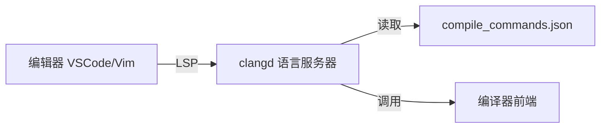

# 编辑器与IDE推荐

建议先阅读：[[01_下载与安装]]

## 原理

IDE/编辑器通过**语言服务器协议（LSP）**与编译器后端通信，提供代码补全、诊断、跳转等功能。LSP 由微软提出，将语言分析逻辑与编辑器 UI 解耦：



clangd 是 LLVM 项目的 LSP 服务器，使用 Clang 的前端分析代码，因此其错误诊断与编译器完全一致。clangd 依赖 `compile_commands.json` 获取每个源文件的编译选项（头文件路径、宏定义等）。

CMake 生成该文件的方式：
```bash
cmake -DCMAKE_EXPORT_COMPILE_COMMANDS=ON -B build
ln -s build/compile_commands.json .
```

---

## 语法

### VSCode 配置

必装插件：**C/C++** (Microsoft), **clangd**, **CMake Tools**

`.vscode/tasks.json`：编译任务，`Ctrl+Shift+B` 触发
`.vscode/launch.json`：调试配置，`F5` 触发，`preLaunchTask` 指定先编译后调试
`.vscode/c_cpp_properties.json`：IntelliSense 配置（编译器路径、C++ 标准）

| 快捷键 | 功能 |
|--------|------|
| `Ctrl+Shift+B` | 编译 |
| `F5` | 调试 |
| `F9` | 断点切换 |
| `F10` | 单步跳过 |
| `F11` | 单步进入 |
| `F12` | 跳转到定义 |
| `Ctrl+P` | 快速打开文件 |

### Visual Studio

Windows 旗舰 IDE。安装时勾选"使用 C++ 的桌面开发"工作负载。

| 快捷键 | 功能 |
|--------|------|
| `F5` | 调试 |
| `Ctrl+F5` | 无调试运行 |
| `F9` | 断点 |
| `F10` | 单步跳过 |
| `Shift+F11` | 跳出函数 |

> Community 版对个人/学生/开源项目免费，功能与付费版相同。

### CLion

JetBrains 出品，CMake 原生集成。学生可申请免费 License。

| 快捷键 | 功能 |
|--------|------|
| `Shift+F6` | 重命名重构 |
| `Ctrl+Alt+V` | 提取变量 |
| `Ctrl+Alt+M` | 提取函数 |
| `Double Shift` | 全局搜索 |

### Vim/Neovim

终端编辑器，SSH 远程开发首选。通过 coc.nvim + clangd 实现 IDE 级补全。

```bash
sudo apt install neovim clangd
```

核心配置：安装 vim-plug 插件管理器，安装 `coc.nvim` 插件，执行 `:CocInstall coc-clangd`。

> Vim 学习曲线陡峭，初学者建议从 VSCode 开始。

### 在线编译器

| 工具 | 特点 |
|------|------|
| [Compiler Explorer](https://godbolt.org) | 实时汇编输出，对比多编译器多版本 |
| [Wandbox](https://wandbox.org) | 多语言支持，Boost 库 |
| [OnlineGDB](https://www.onlinegdb.com) | 在线调试（断点、单步） |

---

## 实践

1. 在 VSCode 中配置 tasks.json 和 launch.json，实现一键编译+调试。
2. 在 [godbolt.org](https://godbolt.org) 输入一段简单的循环求和代码，分别用 `-O0`、`-O2`、`-O3` 查看汇编差异。

**工具选择建议**：
| 场景 | 推荐 |
|------|------|
| 初学者入门 | VSCode |
| Windows 大型项目 | Visual Studio |
| CMake 跨平台项目 | CLion |
| SSH 远程开发 | Neovim |
| 快速测试/查看汇编 | Godbolt |

力扣: Hello,World! 练习 (用所选编辑器的编译调试功能完成)

AI 自检提示：询问 AI "VSCode 中 tasks.json 和 launch.json 各负责什么，如何关联"。
