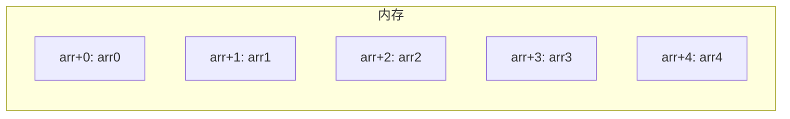

# 数组基础

建议先阅读：[[08_循环结构]]

## 原理

### 内存布局

数组在内存中是**连续存储**的一块区域。`int arr[5]` 在栈上分配 20 字节（5 × sizeof(int)），arr[0] 在最低地址，arr[4] 在最高地址。



`arr[i]` 在底层等价于 `*(arr + i)`——编译器将下标访问转为"首地址 + 偏移量 × sizeof(元素)"的指针运算。

二维数组按**行优先**（row-major）连续存储：
```cpp
int m[2][3] = {{1,2,3},{4,5,6}};
// 内存: 1 2 3 4 5 6 (连续)
```
`m[i][j]` 的地址 = `m + (i * cols + j) * sizeof(int)`。

### 退化现象

数组名在大多数表达式中**退化为指向首元素的指针**。这是 C/C++ 的类型系统特性：
```cpp
int arr[10];
int* p = arr; // 退化
// sizeof(arr) = 40, sizeof(p) = 8
```

函数参数中的数组写法完全是语法糖：
```cpp
void f(int arr[]) {}  // 等价于 void f(int* arr) {}
void f(int arr[10]) {} // 同样是 int* arr，10 被忽略
```

因此函数内 `sizeof(arr)` 返回指针大小而非数组大小，必须额外传递长度参数。

### 越界与安全

C++ 不检查数组越界——`arr[10]` 访问的是起始地址 +10×sizeof(元素) 处的内存，可能读写到相邻变量、返回地址或程序数据。这是缓冲区溢出的根源，也是很多安全漏洞的起因。

---

## 语法

### 一维数组

```cpp
int a[5];                      // 未初始化
int b[5] = {1, 2, 3, 4, 5};   // 完整初始化
int c[5] = {1, 2};             // 部分初始化：{1,2,0,0,0}
int d[] = {10, 20, 30};        // 自动推导大小为 3
int e[5] = {};                 // 全部初始化为 0
```

> C++ 标准要求数组大小必须为编译期常量。VLA（变长数组）是 C99 特性，非标准 C++。

### 二维数组

```cpp
int m[3][4] = {
    {1, 2, 3, 4},
    {5, 6, 7, 8},
    {9, 10, 11, 12}
};

// 声明时可省略第一维，不可省略第二维
int n[][3] = {{1,2,3}, {4,5,6}}; // 合法
// int n[][] = ... // 错误
```

### 数组参数传递

```cpp
void printArray(const int arr[], int size) {
    for (int i = 0; i < size; i++) {
        std::cout << arr[i] << ' ';
    }
}
```
> 用 `const` 修饰使函数承诺不修改数组内容，既安全又清晰。

### C 风格字符串

```cpp
char s1[] = "Hello";    // 自动添加 '\0'，sizeof = 6
char s2[20] = "World";  // 固定大小
```

`"Hello"` 在内存中占 6 字节：`H e l l o \0`。`strlen(s1)` 返回 5（不含 `\0`）。

### std::array (C++11)

```cpp
#include <array>
std::array<int, 5> arr = {1, 2, 3, 4, 5};

arr.size();    // 元素个数
arr.front();   // 首元素
arr.back();    // 末元素
arr.at(3);     // 带边界检查的下标访问
arr.fill(0);   // 所有元素填充为 0
```

> `std::array` 封装原生数组，零额外开销，支持迭代器和 STL 接口。相比原生数组的优点：可直接赋值、可作为函数返回值、支持 `size()` 方法。

---

## 详解：数组对比

### C 数组 vs std::array

| 特性 | C 风格数组 `int a[5]` | `std::array<int,5>` |
|------|----------------------|---------------------|
| 赋值 | `memcpy` 或循环 | 直接 `=` 赋值 |
| 大小 | `sizeof(a)/sizeof(a[0])` | `.size()` |
| 越界检查 | 无 | `.at()` 有 |
| 作为返回值 | 不能（退化为指针） | 可以 |
| 传参 | 退化为指针，丢失大小 | 完整类型信息 |
| 与 STL 兼容 | 否 | 是（有迭代器） |
| 额外内存开销 | 无 | 无 |

```cpp
// C 数组的坑
void fill(int arr[], int size) {
    // sizeof(arr) == 8 (指针大小)，不是 40!
    for (int i = 0; i < size; i++) arr[i] = 0;
}

// std::array 安全
void fill(std::array<int,5>& arr) {
    // sizeof(arr) == 20，完整的类型信息
    arr.fill(0);
}
```

### C 数组 vs std::vector

| 特性 | C 风格数组 | `std::vector<int>` |
|------|-----------|-------------------|
| 大小 | 编译期固定 | 运行时可变 |
| 内存位置 | 栈 | 堆（数据在堆上） |
| 动态扩容 | 不能 | `push_back` 自动扩容 |
| 性能 | 最快（无间接寻址） | 略慢（指针间接访问） |
| 适用场景 | 大小已知且固定 | 需要动态调整 |

---

## 详解：多维数组内存布局

### 行优先 vs 列优先

C/C++ 使用**行优先**（row-major）存储。Java 也是行优先，Fortran 使用列优先。

```cpp
// 行优先: m[2][3]
// 内存: [0,0] [0,1] [0,2] [1,0] [1,1] [1,2]
//       ← 第 0 行 →   ← 第 1 行 →

int m[2][3] = {{1,2,3}, {4,5,6}};
// 地址: m[0][0] 在最低地址
//       m[1][2] 在最高地址
```

### 手动模拟动态二维数组

```cpp
// 方式一: 指针数组（每行独立分配，内存不连续）
int* rows[3];
rows[0] = new int[4];
rows[1] = new int[4];
rows[2] = new int[4];
// 释放: 逐行 delete[] 再 delete[] rows

// 方式二: 一维数组模拟（连续内存，推荐）
int* flat = new int[3 * 4]; // 12 个元素连续
// 访问: flat[i * cols + j]
delete[] flat;
```

### 多维数组传参

```cpp
// 必须指定除第一维外的所有维度
void process(int m[][4], int rows) { ... }

// 或者用指针（丧失多维语义）
void process(int* m, int rows, int cols) {
    // 访问: m[i * cols + j]
}
```

---

## 详解：变长数组（VLA）与替代方案

VLA 是 C99 引入的特性，允许用变量指定数组大小：

```c
// C99 合法:
int n = 10;
int arr[n]; // VLA

// C++ 标准不允许 VLA（GCC 作为扩展允许）
```

C++ 的替代方案：

```cpp
#include <vector>

// 方案一: vector（推荐）
int n = 10;
std::vector<int> v(n);     // 动态大小
v[0] = 42;                  // 支持下标访问
v.push_back(100);           // 可动态增长

// 方案二: alloca（栈上分配，非标准）
int* p = (int*)alloca(n * sizeof(int)); // 不需要释放

// 方案三: unique_ptr
auto p = std::make_unique<int[]>(n); // 堆上分配，自动释放
```

---

## 详解：数组名退化的深入理解

### 退化条件

数组名在以下情况下退化为指针：
1. 赋值给指针变量
2. 作为函数参数传递
3. 参与指针运算

数组名**不退化**的情况：
1. `sizeof` 运算符
2. `&` 取地址运算符
3. 字符串字面量初始化字符数组

```cpp
int arr[5] = {1, 2, 3, 4, 5};

// 不退化的情况
sizeof(arr);        // 20: 整个数组大小
&arr;               // int(*)[5]: 数组指针
char s[] = "Hello"; // 不退化: sizeof(s) = 6

// 退化的情况
int* p = arr;       // arr 退化为 int*
int* q = &arr[0];   // 等价
```

### 退化的危害

```cpp
// 危险: 丢失数组大小信息
void process(int arr[]) {
    // 无法知道 arr 的实际大小!
    // 必须额外传 size 参数
}

// 安全: 使用 std::array
void process(std::array<int, 5>& arr) {
    arr.size(); // 安全: 5
}
```

---

## 实践

```cpp
// 逆序 (双指针原地)
void reverse(int arr[], int size) {
    for (int i = 0; i < size / 2; i++) {
        int temp = arr[i];
        arr[i] = arr[size - 1 - i];
        arr[size - 1 - i] = temp;
    }
}

// 冒泡排序
for (int i = 0; i < size - 1; i++)
    for (int j = 0; j < size - 1 - i; j++)
        if (arr[j] > arr[j + 1])
            std::swap(arr[j], arr[j + 1]);

// 二分查找 (数组必须有序)
int binarySearch(int arr[], int size, int target) {
    int left = 0, right = size - 1;
    while (left <= right) {
        int mid = left + (right - left) / 2;
        if (arr[mid] == target) return mid;
        else if (arr[mid] < target) left = mid + 1;
        else right = mid - 1;
    }
    return -1;
}

// 旋转数组 (力扣189)
void rotate(int arr[], int size, int k) {
    k %= size;
    std::reverse(arr, arr + size - k);
    std::reverse(arr + size - k, arr + size);
    std::reverse(arr, arr + size);
}
```

## 力扣练习

| 题号 | 题目 | 链接 | 知识点 |
|------|------|------|--------|
| 1 | 两数之和 | https://leetcode.cn/problems/two-sum/ | 数组遍历、哈希表 |
| 26 | 删除有序数组中的重复项 | https://leetcode.cn/problems/remove-duplicates-from-sorted-array/ | 双指针、原地操作 |
| 27 | 移除元素 | https://leetcode.cn/problems/remove-element/ | 双指针 |
| 35 | 搜索插入位置 | https://leetcode.cn/problems/search-insert-position/ | 二分查找 |
| 53 | 最大子数组和 | https://leetcode.cn/problems/maximum-subarray/ | 动态规划、Kadane算法 |
| 56 | 合并区间 | https://leetcode.cn/problems/merge-intervals/ | 排序、区间合并 |
| 66 | 加一 | https://leetcode.cn/problems/plus-one/ | 数组运算、进位处理 |
| 88 | 合并两个有序数组 | https://leetcode.cn/problems/merge-sorted-array/ | 双指针、有序合并 |
| 136 | 只出现一次的数字 | https://leetcode.cn/problems/single-number/ | 位运算、异或 |
| 189 | 轮转数组 | https://leetcode.cn/problems/rotate-array/ | 三次翻转法 |
| 283 | 移动零 | https://leetcode.cn/problems/move-zeroes/ | 双指针 |
| 238 | 除自身以外数组的乘积 | https://leetcode.cn/problems/product-of-array-except-self/ | 前缀积、后缀积 |
| 485 | 最大连续1的个数 | https://leetcode.cn/problems/max-consecutive-ones/ | 数组遍历 |

