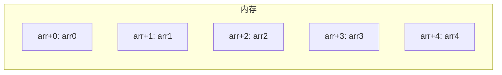

# 数组基础

建议先阅读：[[08_循环结构]]

## 原理

### 内存布局

数组在内存中是**连续存储**的一块区域。`int arr[5]` 在栈上分配 20 字节（5 × sizeof(int)），arr[0] 在最低地址，arr[4] 在最高地址。



`arr[i]` 在底层等价于 `*(arr + i)`——编译器将下标访问转为"首地址 + 偏移量 × sizeof(元素)"的指针运算。

二维数组按**行优先**（row-major）连续存储：
```cpp
int m[2][3] = {{1,2,3},{4,5,6}};
// 内存: 1 2 3 4 5 6 (连续)
```
`m[i][j]` 的地址 = `m + (i * cols + j) * sizeof(int)`。

### 退化现象

数组名在大多数表达式中**退化为指向首元素的指针**。这是 C/C++ 的类型系统特性：
```cpp
int arr[10];
int* p = arr;      // 退化
// sizeof(arr) = 40, sizeof(p) = 8
```

函数参数中的数组写法完全是语法糖：
```cpp
void f(int arr[]) {}     // 等价于 void f(int* arr) {}
void f(int arr[10]) {}   // 同样是 int* arr，10 被忽略
```

因此函数内 `sizeof(arr)` 返回指针大小而非数组大小，必须额外传递长度参数。

### 越界与安全

C++ 不检查数组越界——`arr[10]` 访问的是起始地址 +10×sizeof(元素) 处的内存，可能读写到相邻变量、返回地址或程序数据。这是缓冲区溢出的根源，也是很多安全漏洞的起因。

---

## 语法

### 一维数组

```cpp
int a[5];                    // 未初始化
int b[5] = {1, 2, 3, 4, 5}; // 完整初始化
int c[5] = {1, 2};           // 部分初始化：{1,2,0,0,0}
int d[] = {10, 20, 30};      // 自动推导大小为 3
int e[5] = {};               // 全部初始化为 0
```

> C++ 标准要求数组大小必须为编译期常量。VLA（变长数组）是 C99 特性，非标准 C++。

### 二维数组

```cpp
int m[3][4] = {
    {1, 2, 3, 4},
    {5, 6, 7, 8},
    {9, 10, 11, 12}
};

// 声明时可省略第一维，不可省略第二维
int n[][3] = {{1,2,3}, {4,5,6}};  // 合法
// int n[][] = ...   // 错误
```

### 数组参数传递

```cpp
void printArray(const int arr[], int size) {
    for (int i = 0; i < size; i++) {
        std::cout << arr[i] << ' ';
    }
}
```
> 用 `const` 修饰使函数承诺不修改数组内容，既安全又清晰。

### C 风格字符串

```cpp
char s1[] = "Hello";          // 自动添加 '\0'，sizeof = 6
char s2[20] = "World";        // 固定大小
```

`"Hello"` 在内存中占 6 字节：`H e l l o \0`。`strlen(s1)` 返回 5（不含 `\0`）。

### std::array (C++11)

```cpp
#include <array>
std::array<int, 5> arr = {1, 2, 3, 4, 5};

arr.size();       // 元素个数
arr.front();      // 首元素
arr.back();       // 末元素
arr.at(3);        // 带边界检查的下标访问
```

> `std::array` 封装原生数组，零额外开销，支持迭代器和 STL 接口。相比原生数组的优点：可直接赋值、可作为函数返回值、支持 `size()` 方法。

---

## 实践

```cpp
// 逆序 (双指针原地)
void reverse(int arr[], int size) {
    for (int i = 0; i < size / 2; i++) {
        int temp = arr[i];
        arr[i] = arr[size - 1 - i];
        arr[size - 1 - i] = temp;
    }
}

// 冒泡排序
for (int i = 0; i < size - 1; i++)
    for (int j = 0; j < size - 1 - i; j++)
        if (arr[j] > arr[j + 1])
            std::swap(arr[j], arr[j + 1]);
```

力扣:
力扣: 数列求和题 (循环累加，可用数组存储)
力扣: 简单数组操作题 (数组逆序输出)
力扣: 数组计数题 (数组计数)

AI 自检提示：询问 AI "为什么函数参数中的 `int arr[]` 和 `int* arr` 完全等价，并解释数组名退化为指针的底层原因"。
