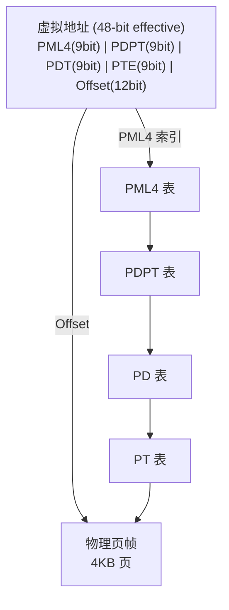
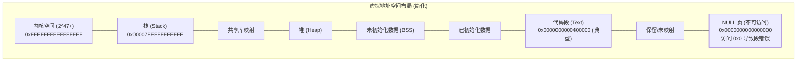
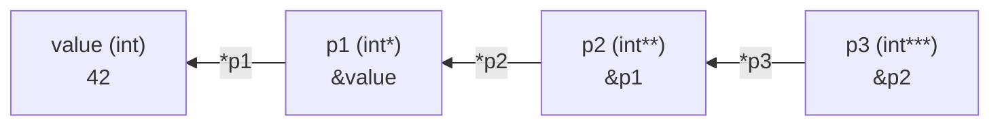
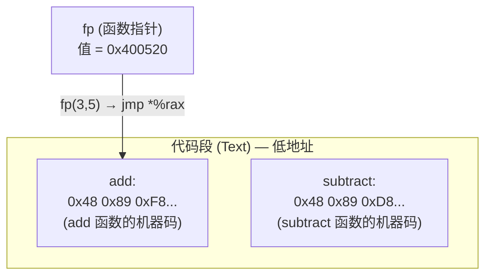

# 指针与引用  (Pointers & References)
---

##  章节概述

>  **本章是推荐学习路线的真正起点**。指针是所有后续章节（动态内存、this 指针、虚表、汇编底层）的基石，无需任何前置章节即可开始。建议同时打开 [[../汇编基础/ASM_01_寄存器与指令基础|汇编参考：寄存器与指令基础]] 对照阅读，理解指针在硬件层面究竟是什么。

指针（Pointer）与引用（Reference）是 C++ 中最强大也最令人困惑的语言特性。指针
赋予了程序员直接操作内存地址的能力——这是 C++ 高性能和系统级编程的根基。引用
则在指针的基础上提供了更安全、更自然的别名语义。

本章从 CPU 的物理寻址机制出发，逐层深入 MMU 虚拟内存转换、汇编层面的指针操作、
编译器的符号解析，再到 C++ 语言层面的指针与引用的全部语法特性。最后通过五个
精心设计的生活场景案例和十个思考计算题目，帮助读者从"会用指针"进阶到"理解指针
在硬件上到底发生了什么"。

**为何指针与引用是 C/C++ 的灵魂？**
- 操作系统内核、驱动程序、嵌入式固件全部依赖指针操作物理地址
- STL 容器、智能指针、多态虚函数表全部构建在指针之上
- 高性能计算中的零拷贝、内存池、DMA 操作本质是指针的技巧
- 理解指针是理解计算机体系结构的钥匙

---
###  第一节: 基础示例代码 + 计算机底层原理
---

1.1 指针的基本概念：地址、解引用与取地址
-----------------------------------------------------

指针是一个**变量**，其值是**另一个变量的内存地址**。通过指针，我们可以间接访问
（读/写）目标内存位置的数据。

```cpp
#include <iostream>

int main() {
    int value = 42;        // 一个普通的 int 变量
    int* ptr = &value;     // ptr 存储的是 value 的地址

    std::cout << "value 的值: " << value << std::endl;       // 42
    std::cout << "value 的地址: " << &value << std::endl;   // 例如: 0x7ffc8f3a2b4c
    std::cout << "ptr 的值(即value的地址): " << ptr << std::endl; // 同上
    std::cout << "ptr 的地址: " << &ptr << std::endl;       // ptr 本身的地址
    std::cout << "通过 ptr 解引用: " << *ptr << std::endl;  // 42

    // 通过指针修改原变量的值
    *ptr = 100;
    std::cout << "修改后 value = " << value << std::endl;   // 100

    return 0;
}
```

核心三要素：
- `&value` — 取地址运算符，获取变量在内存中的地址
- `int* ptr` — 声明一个指向 int 类型的指针变量
- `*ptr` — 解引用运算符，通过指针访问其指向的内存位置

1.2 引用的基本概念：别名与绑定
-----------------------------------------------------

引用（Reference）是已存在变量的**别名**。一旦引用被初始化绑定到一个变量，它就
**永远**代表那个变量，不能重新绑定到其他变量。

```cpp
#include <iostream>

int main() {
    int original = 10;
    int& ref = original;   // ref 是 original 的别名

    std::cout << "original: " << original << std::endl;  // 10
    std::cout << "ref: " << ref << std::endl;             // 10

    ref = 20;  // 修改 ref 就是修改 original
    std::cout << "修改 ref 后 original: " << original << std::endl; // 20

    std::cout << "original 地址: " << &original << std::endl;
    std::cout << "ref 地址: " << &ref << std::endl;  // 与 original 相同!

    // int& ref2;  // 错误! 引用必须在定义时初始化
    // ref = otherVar; // 这不是重新绑定, 而是赋值!

    return 0;
}
```

引用与指针的关键区别：

| 特性 | 指针 | 引用 |
|------|------|------|
| 初始化 | 可以不初始化（危险） | 必须初始化 |
| 重新绑定 | 可以指向不同对象 | 不能重新绑定 |
| 空值 | 可以为 nullptr | 不存在"空引用" |
| 语法 | 用 * 解引用 | 直接使用，像原变量 |
| 取自身地址 | &ptr 得到指针变量地址 | &ref 得到被引用变量地址 |
| 多级 | 有二级甚至多级指针 | 没有引用的引用 |
| sizeof | 返回指针本身大小 | 返回被引用类型大小 |

1.3 CPU 架构层面的指针：物理寻址与虚拟内存
---------------------------------------------------------------

要真正理解指针，必须先理解计算机如何定位内存。从 CPU 到内存的数据通路如下：

**物理地址 (Physical Address) 寻址流程：**

```mermaid
graph LR
    CPU["CPU<br/>寄存器<br/>执行指令: MOV RAX, &#91;0x1000&#93;"]
    MMU["内存控制器<br/>(MMU)"]
    RAM["RAM<br/>物理内存"]
    CPU -->|"地址总线(Address Bus)"| MMU
    MMU -->|"数据总线(Data Bus)"| CPU
    MMU --> RAM
```



现代操作系统使用**虚拟内存**机制，用户程序中的所有指针值都是**虚拟地址（Virtual
Address）**，并非物理内存的实际地址。CPU 内的 **MMU (Memory Management Unit，内存
管理单元)** 负责将虚拟地址实时转换为物理地址。

**虚拟地址到物理地址的转换流程（x86-64 四级页表）：**



> 每次转换需要 4 次内存访问，因此 CPU 使用 TLB (Translation Lookaside Buffer) 缓存最近的转换结果。

```cpp
// 验证：用户空间程序看到的都是虚拟地址
#include <iostream>
#include <unistd.h>
#include <sys/types.h>

int global_var = 42;

int main() {
    int stack_var = 100;
    int* heap_var = new int(200);

    // `new int(200)` 在汇编层做了什么？
    //   1. call malloc(4) — 从堆分配 4 字节
    //   2. mov [rax], 200 — 直接写入值（int 无构造函数）
    // 如果是 `new MyClass(args)` 则还会多一步 `call MyClass::MyClass(args)`。
    // 完整四种 new 类型的汇编分解见 [[04_动态内存#new 对不同类型的汇编层分解]]。

    std::cout << "=== 所有地址都是虚拟地址 ===" << std::endl;
    std::cout << "代码段 (main):    " << (void*)main << std::endl;
    std::cout << "数据段 (global):  " << &global_var << std::endl;
    std::cout << "栈 (stack_var):   " << &stack_var << std::endl;
    std::cout << "堆 (heap_var):    " << heap_var << std::endl;

    // 这些地址在 64 位 Linux 下通常表现为:
    // 代码段: 0x55xxxxxxxxxx (低端)
    // 堆:    0x55xxxxxxxxxx 或 0x7fxxxxxxxx (高端)
    // 栈:    0x7fxxxxxxxxxx 或 0x7ffxxxxxxxxx (最高端)
    // 每个进程看到的地址空间是独立的——都是虚拟地址！

    // 两个不同进程中的相同虚拟地址映射到完全不同的物理地址
    // 这是操作系统实现进程隔离的基础

    delete heap_var;
    return 0;
}
```

1.4 汇编层面的指针：CPU 寻址模式
-----------------------------------------------------

在汇编语言中，指针操作对应不同的**寻址模式（Addressing Mode）**：

```asm
; x86-64 AT&T 语法示例

; 假设 C++ 代码: int* ptr = &value; int x = *ptr;

; 1. 立即寻址 (Immediate) — 操作数在指令中
    movl $42, -4(%rbp)       ; 将立即数 42 存入栈上变量 value

; 2. 寄存器寻址 (Register Direct) — 操作数在寄存器中
    movl %eax, %ebx           ; 寄存器间拷贝

; 3. 直接寻址 (Direct / Absolute) — 操作数地址在指令中
    movl 0x601030, %eax       ; 从固定地址读取

; 4. 寄存器间接寻址 (Register Indirect) — 这就是指针!
    leaq -4(%rbp), %rax       ; 将 value 的地址加载到 rax (即 &value)
    movl (%rax), %ecx         ; 通过 rax 中的地址读取值 (即 *ptr)

; 5. 基址+变址寻址 (Base + Index) — 指针算术
    movl (%rax, %rcx, 4), %edx ; 读取 *(rax + rcx*4), 即 ptr[i]
```

让我们用实际的 C++ 代码结合汇编输出来验证：

```cpp
// pointer_asm.cpp
int main() {
    int arr[5] = {10, 20, 30, 40, 50};
    int* ptr = arr;        // ptr = &arr[0]
    int x = *ptr;          // x = arr[0]
    int y = *(ptr + 2);    // y = arr[2]
    int z = ptr[3];        // z = arr[3], ptr[n] 等价于 *(ptr+n)
    return x + y + z;
}
```

编译并查看汇编：
```bash
$ g++ -std=c++17 -O0 -S pointer_asm.cpp -o pointer_asm.s
# 或使用 objdump
$ g++ -std=c++17 -O0 -g pointer_asm.cpp -o pointer_asm
$ objdump -d -S pointer_asm | less
```

关键汇编片段解读（x86-64）：
```asm
; int arr[5] = {10, 20, 30, 40, 50};  → 在栈上分配 20 字节
    movl   $10, -32(%rbp)    ; arr[0]
    movl   $20, -28(%rbp)    ; arr[1]
    movl   $30, -24(%rbp)    ; arr[2]
    movl   $40, -20(%rbp)    ; arr[3]
    movl   $50, -16(%rbp)    ; arr[4]

; int* ptr = arr;  → 加载 arr 的基地址
    leaq   -32(%rbp), %rax   ; LEA = Load Effective Address, 即 &arr[0]
    movq   %rax, -8(%rbp)    ; 将地址存入 ptr

; int y = *(ptr + 2);  → 指针算术
    movq   -8(%rbp), %rax    ; 加载 ptr 的值(地址)到 rax
    addq   $8, %rax          ; rax += 2 * sizeof(int) = 8
    movl   (%rax), %eax      ; 从计算出的地址读取值
    movl   %eax, -12(%rbp)   ; 存入 y

; int z = ptr[3];  → 下标运算, 等价于 *(ptr+3)
    movq   -8(%rbp), %rax    ; 加载 ptr
    movl   12(%rax), %eax    ; 从 ptr + 12 偏移处读取 (3*sizeof(int))
    movl   %eax, -16(%rbp)   ; 存入 z
```

**核心结论：C++ 中的指针操作 `*(ptr + N)` 在汇编层面被翻译为 `基址 + N*sizeof(T)` 的变址寻址。**

1.5 指针的大小与体系结构
-----------------------------------------------------

指针的大小取决于目标平台的**地址总线宽度**（或更准确地说，寻址空间大小）：

```cpp
#include <iostream>
#include <cstdint>

struct Empty {};

int main() {
    std::cout << "=== 指针大小 (不取决于指向的类型) ===" << std::endl;
    std::cout << "char*:    " << sizeof(char*)    << " 字节" << std::endl;
    std::cout << "int*:     " << sizeof(int*)     << " 字节" << std::endl;
    std::cout << "double*:  " << sizeof(double*)  << " 字节" << std::endl;
    std::cout << "void*:    " << sizeof(void*)    << " 字节" << std::endl;
    std::cout << "Empty*:   " << sizeof(Empty*)   << " 字节" << std::endl;
    std::cout << "int**:    " << sizeof(int**)    << " 字节" << std::endl;

    // 32 位系统: 全部输出 4 字节 (32 bit = 2^32 = 4GB 寻址空间)
    // 64 位系统: 全部输出 8 字节 (64 bit = 2^64 = 16EB 寻址空间,
    //             实际使用 48 位虚拟地址)

    // 函数指针可能与其他指针大小不同（在某些架构上）
    std::cout << "函数指针: " << sizeof(void(*)()) << " 字节" << std::endl;

    // 成员函数指针通常比普通指针大（需要存储 this 偏移和虚表信息）
    struct Demo { void func() {} };
    std::cout << "成员函数指针: " << sizeof(void(Demo::*)()) << " 字节" << std::endl;

    return 0;
}
```

| 体系结构 | 指针大小 | 最大寻址空间 | 典型场景 |
|----------|---------|-------------|---------|
| 16-bit (x86实模式) | 2 字节 | 1MB (段式寻址) | DOS, 早期嵌入式 |
| 32-bit (IA-32) | 4 字节 | 4GB | 老旧 Windows/Linux |
| 64-bit (x86-64) | 8 字节 | 256TB (实际48bit) | 现代桌面/服务器 |
| ARM Cortex-M | 4 字节 | 4GB | 嵌入式 MCU |

1.6 大小端 (Endianness) 对指针解引用的影响
--------------------------------------------------------------

对于多字节类型（如 int），内存中的字节排列顺序由 CPU 的端序决定：

```cpp
#include <iostream>
#include <cstdint>
#include <iomanip>

int main() {
    uint32_t value = 0x12345678;
    uint8_t* bytePtr = reinterpret_cast<uint8_t*>(&value);

    std::cout << "原始值: 0x" << std::hex << value << std::dec << std::endl;
    std::cout << "字节序列: ";

    for (int i = 0; i < 4; ++i) {
        std::cout << "0x" << std::hex
                  << static_cast<int>(bytePtr[i]) << " ";
    }
    std::cout << std::dec << std::endl;

    // 小端 (Little Endian, x86/ARM 默认):
    //   输出: 0x78 0x56 0x34 0x12
    //   低位字节在低地址

    // 大端 (Big Endian, 网络字节序, 某些嵌入式):
    //   输出: 0x12 0x34 0x56 0x78
    //   高位字节在低地址

    // 通过指针可以检测当前系统的端序:
    uint16_t test = 0x0001;
    if (*reinterpret_cast<uint8_t*>(&test) == 0x01) {
        std::cout << "本系统是小端序 (Little Endian)" << std::endl;
    } else {
        std::cout << "本系统是大端序 (Big Endian)" << std::endl;
    }

    return 0;
}
```

端序对指针操作的影响：
- 用 `char*` / `uint8_t*` 逐字节遍历 int 数据时，得到的序列取决于端序
- 网络编程中需要使用 htonl/ntohl 等函数进行字节序转换
- 二进制文件的跨平台读写必须考虑端序

1.7 指针的类型与类型安全
-----------------------------------------------------

为什么指针需要类型？不同类型的指针有什么区别？

```cpp
#include <iostream>

int main() {
    int value = 0x00414243;  // 字节: 00 41 42 43 = "ABC\0" (小端: 43 42 41 00)
    int* intPtr = &value;
    char* charPtr = reinterpret_cast<char*>(&value);

    // 同样的地址, 不同的类型指针, 解引用得到不同的结果
    std::cout << "*intPtr = " << *intPtr << std::endl;  // 整数值
    std::cout << "*charPtr = " << *charPtr << std::endl; // 第一个字节作为字符

    // 指针加法的步长取决于指向的类型!
    std::cout << "intPtr:     " << intPtr << std::endl;
    std::cout << "intPtr + 1: " << (intPtr + 1)
              << " (偏移 +" << sizeof(int) << " 字节)" << std::endl;

    std::cout << "charPtr:     " << (void*)charPtr << std::endl;
    std::cout << "charPtr + 1: " << (void*)(charPtr + 1)
              << " (偏移 +" << sizeof(char) << " 字节)" << std::endl;

    // 类型的作用：
    // 1. 确定解引用的字节数 (sizeof(T))
    // 2. 确定指针算术的步长 (ptr + N = 地址 + N * sizeof(T))
    // 3. 提供类型安全检查（编译器层面）

    return 0;
}
```

1.8 空指针与空指针常量：`NULL`、0、`nullptr`
--------------------------------------------------------------------

C++ 历史上出现过多种空指针表示方式，C++11 统一使用 `nullptr`：

```cpp
#include <iostream>

void foo(int) {
    std::cout << "foo(int) 被调用" << std::endl;
}

void foo(char*) {
    std::cout << "foo(char*) 被调用" << std::endl;
}

int main() {
    // ==== 三种空指针表示方式 ====

    // 1. NULL (C 遗留, 通常是 #define NULL 0 或 ((void*)0))
    char* p1 = NULL;     // 可行, 但不够类型安全

    // 2. 字面量 0 (C++ 早期习惯)
    char* p2 = 0;        // 可行, 但容易混淆

    // 3. nullptr (C++11 标准, 推荐)
    char* p3 = nullptr;  // 最安全!

    // nullptr 的关键优势: 类型安全
    foo(NULL);    // 调用哪个? 如果 NULL 是 0, 调用 foo(int)!
    foo(nullptr); // 明确调用 foo(char*)

    // nullptr 的类型是 std::nullptr_t, 可以隐式转换为任意指针类型
    // 但不能隐式转换为整型
    std::nullptr_t np = nullptr;
    // int x = nullptr;  // 错误! nullptr 不能转换为 int

    // delete nullptr 是安全的 (什么都不做)
    int* p4 = nullptr;
    delete p4;    // OK, 无操作
    delete[] p4;  // OK, 无操作

    return 0;
}
```

**底层原理：nullptr 的物理表示**
在 x86-64 架构上，nullptr 的值是 `0x0`。虚拟地址空间的第一页（地址 0-4095）
被操作系统标记为不可访问，任何对地址 0 的访问都会触发 **SIGSEGV（段错误）**。
这就是"解引用空指针导致程序崩溃"的底层原因。



1.9 栈指针与堆指针的生命周期
-----------------------------------------------------

不同的指针指向不同内存区域，其生命周期和安全性完全不同：

```cpp
#include <iostream>

int* createDanglingStackPtr() {
    int local = 100;
    return &local;  // 危险! 返回局部变量的地址
    // 函数返回后, local 所在的栈帧被销毁, 地址变为"悬挂指针"
}

int* createHeapPtr() {
    int* p = new int(200);
    return p;  // 安全! 堆内存不随函数返回而释放
    // 但调用者必须记得 delete p
}

int global_arr[3] = {1, 2, 3};

int main() {
    // === 栈指针 ===
    int stackVar = 10;
    int* stackPtr = &stackVar;
    std::cout << "栈指针(有效): " << *stackPtr << std::endl;
    // stackPtr 离开此作用域之前都有效

    // === 堆指针 ===
    int* heapPtr = createHeapPtr();
    std::cout << "堆指针: " << *heapPtr << std::endl;
    delete heapPtr;  // 必须手动释放!
    // heapPtr 现在变为悬挂指针(虽然还存着一个地址,但该地址已被释放)
    // *heapPtr = 30; // 未定义行为!

    // === 悬挂指针 ===
    int* dangling = createDanglingStackPtr();
    // std::cout << *dangling << std::endl;  // 未定义行为! 可能崩溃,可能输出垃圾值

    // === 全局/静态区指针 ===
    int* globalPtr = global_arr;  // 指向全局数据段, 程序运行期间一直有效
    std::cout << "全局指针: " << *globalPtr << std::endl;

    return 0;
}
```

内存区域对比：

| 内存区域 | 生命周期 | 指针安全性 | 分配/释放 |
|---------|---------|-----------|----------|
| 代码段 | 程序运行期间 | 安全（只读） | 自动 |
| 全局/静态区 | 程序运行期间 | 安全 | 自动 |
| 栈 | 函数调用期间 | 函数结束后指针失效 | 自动 |
| 堆 | 手动控制 | 易出错（泄漏/悬挂） | 手动 new/delete |
| 匿名 mmap | 手动控制 | 易出错 | 手动 mmap/munmap |

1.10 引用的底层实现：引用的本质是指针
------------------------------------------------------------------

虽然语法上引用表现为别名，但在编译器的底层实现中，引用实质上就是**自带解引用的
const 指针**：

```cpp
#include <iostream>

// C++ 代码
void demo() {
    int a = 10;
    int& ref = a;    // 引用
    int* ptr = &a;   // 指针

    ref = 20;        // 等价于 *ptr = 20
    int b = ref;     // 等价于 int b = *ptr
}
```

同一函数的两种实现的汇编对比：

```cpp
// 版本 A: 使用引用
int addRef(int& x, int& y) {
    return x + y;
}

// 版本 B: 使用指针
int addPtr(int* x, int* y) {
    return *x + *y;
}
```

编译后在 x86-64 下生成的汇编代码**完全相同**：

```asm
; addRef 和 addPtr 产生完全相同的机器码!
addRef(int&, int&):
    movl    (%rdi), %eax    ; 通过 rdi 中的地址读第一个参数
    addl    (%rsi), %eax    ; 加上 rsi 中的地址指向的值
    ret

addPtr(int*, int*):
    movl    (%rdi), %eax    ; 通过 rdi 中的地址读第一个参数
    addl    (%rsi), %eax    ; 加上 rsi 中的地址指向的值
    ret
; 完全一致! 引用就是语法糖包装的指针
```

但引用的"零开销"也有例外——当引用作为类成员或跨函数传递时，编译器会分配空间：

```cpp
#include <iostream>

struct Holder {
    int& ref;  // 引用成员
    Holder(int& r) : ref(r) {}
};

int main() {
    int x = 42;
    Holder h(x);

    std::cout << "sizeof(Holder) = " << sizeof(Holder) << std::endl;
    // 输出: 8 (64位系统)
    // 引用成员实际占用一个指针的大小!

    std::cout << "x 的地址: " << &x << std::endl;
    // 反汇编可以发现: h.ref 内部存储的就是 x 的地址

    return 0;
}
```

**结论：引用在概念上是别名，在实现上是指针。语言语法保证了引用的安全性（不可为空、
不可重新绑定），但底层机制完全相同。**

---

###  小节练习

> [!question] 选择题 1
> 以下代码执行后，输出结果是什么？
> ```cpp
> int a = 5;
> int* p = &a;
> *p = *p + 10;
> std::cout << a;
> ```
> - [ ] A. 5
> - [ ] B. 10
> - [ ] C. 15
> - [ ] D. 未定义行为
>
> > [!success]- 点击查看答案
> > 正确答案: C
> > 
> > **解析**: `*p` 解引用得到 `a` 的值 5，加 10 后为 15，再通过 `*p` 写回 `a`，所以 `a` 变为 15。

> [!question] 选择题 2
> 在 64 位系统上，`sizeof(int*)` 和 `sizeof(double*)` 的值分别是？
> - [ ] A. 4 和 8
> - [ ] B. 8 和 8
> - [ ] C. 4 和 4
> - [ ] D. 8 和 16
>
> > [!success]- 点击查看答案
> > 正确答案: B
> > 
> > **解析**: 在 64 位系统上，所有指针类型的大小都是 8 字节（64 位地址空间），与所指向的类型无关。

> [!question] 选择题 3
> 以下哪个操作会导致未定义行为？
> - [ ] A. `int* p = nullptr; if(p) { *p = 1; }`
> - [ ] B. `int x = 10; int* p = &x; p = nullptr;`
> - [ ] C. `int* p = nullptr; *p = 42;`
> - [ ] D. `int a = 5; int& r = a; r = 10;`
>
> > [!success]- 点击查看答案
> > 正确答案: C
> > 
> > **解析**: 对空指针解引用是未定义行为。选项 A 有 `if(p)` 守卫所以不会解引用空指针；B 只是将指针设为空，不解引用；D 是正常的引用操作。

> [!question] 选择题 4
> `int arr[5] = {10, 20, 30, 40, 50};` 若 `int* p = arr;`，则 `*(p + 3)` 的值是？
> - [ ] A. 10
> - [ ] B. 30
> - [ ] C. 40
> - [ ] D. 编译错误
>
> > [!success]- 点击查看答案
> > 正确答案: C
> > 
> > **解析**: `p` 指向 `arr[0]`，`p + 3` 指向 `arr[3]`，解引用后得到 `arr[3]` 的值 40。指针算术以所指类型的大小为步长。

> [!question] 选择题 5
> 以下关于取地址运算符 `&` 的描述，正确的是？
> - [ ] A. `&` 只能用于变量，不能用于数组元素
> - [ ] B. `&` 返回的值类型是 `int`
> - [ ] C. 对同一变量多次取地址，每次结果可能不同
> - [ ] D. `&` 返回变量在内存中的起始地址
>
> > [!success]- 点击查看答案
> > 正确答案: D
> > 
> > **解析**: `&` 运算符返回操作数在内存中的起始地址。它可以用于数组元素（A 错）；返回值是指针类型而非 `int`（B 错）；在变量生命周期内，地址不变（C 错）。

> [!question] 判断题 1
> 引用一旦初始化绑定到某个变量后，不能重新绑定到另一个变量。（ ）
> - [ ]  正确
> - [ ]  错误
>
> > [!success]- 点击查看答案
> > 答案: 正确
> > 
> > **解析**: C++ 引用在初始化时绑定目标，之后对引用的任何赋值操作都是修改被引用对象的值，而非重新绑定。

> [!question] 判断题 2
> 指针变量本身也有地址，可以用 `&` 获取指针的地址（即指向指针的指针）。（ ）
> - [ ]  正确
> - [ ]  错误
>
> > [!success]- 点击查看答案
> > 答案: 正确
> > 
> > **解析**: 指针也是变量，存储在内存中，因此有自己的地址。`int** pp = &p;` 就是指向指针的指针（二级指针）。

> [!question] 判断题 3
> `int* p;` 声明后不初始化，`p` 的值一定是 `nullptr`。（ ）
> - [ ]  正确
> - [ ]  错误
>
> > [!success]- 点击查看答案
> > 答案: 错误
> > 
> > **解析**: 未初始化的局部指针变量的值是不确定的（垃圾值），并非自动为 `nullptr`。只有全局/静态指针变量才会被零初始化。

> [!question] 判断题 4
> 对指针 `p` 进行 `p + 1` 运算，地址值恰好增加 1 个字节。（ ）
> - [ ]  正确
> - [ ]  错误
>
> > [!success]- 点击查看答案
> > 答案: 错误
> > 
> > **解析**: 指针算术以所指类型的大小为步长。若 `p` 是 `int*`，则 `p + 1` 地址增加 `sizeof(int)`（通常 4 字节），而非 1 字节。

> [!question] 判断题 5
> 引用在底层实现上通常就是一个指针，编译器会自动处理解引用。（ ）
> - [ ]  正确
> - [ ]  错误
>
> > [!success]- 点击查看答案
> > 答案: 正确
> > 
> > **解析**: 引用在语义上是别名，但编译器通常将其实现为一个常量指针（地址不可变），对引用的访问在底层就是对指针的自动解引用。

---


---
###  第二节: 所有用法大全（标准库/关键字/函数）
---

本节全面列举 C++ 中指针与引用相关的所有用法，涵盖 C++98 到 C++20 的标准特性。

2.1 基本指针声明与初始化
-----------------------------------------------------

```cpp
// 基本声明
int* p1;              // 指向 int 的指针（未初始化，危险！）
int *p2;              // 同样的含义，* 靠近类型还是变量名是风格问题
int * p3;             // 也是合法的

// 推荐风格：类型名* 变量名（强调类型）
int* p4 = nullptr;    // C++11 推荐初始化方式
int* p5 = NULL;       // C 习惯（不推荐）
int* p6 = 0;          // 老式写法（不推荐）

// 一次声明多个指针（容易出错的地方）
int* a, b;            // a 是指针, b 是 int! 不是两个指针!
int *c, *d;           // 两个都是指针
int* e = nullptr, *f = nullptr;  // 清晰写法: 两个都是指针

// 指向常量的指针 vs 常量指针
const int* p7;        // 指向常量 int 的指针 (不能通过 p7 修改目标)
int const* p8;        // 同上, const 在 int 后面也一样
int* const p9 = nullptr; // 常量指针 (p9 本身不能修改, 但可以修改目标)
const int* const p10 = nullptr; // 两者都是常量

// 多级指针
int** pp1;            // 指向 int* 的指针
int*** pp2;           // 指向 int** 的指针
```

2.2 指针运算 (`+`, `-`, `++`, `--`, 下标 `[]`)
------------------------------------------------------------------

```cpp
#include <iostream>

int main() {
    int arr[6] = {10, 20, 30, 40, 50, 60};
    int* p = arr;         // p 指向 arr[0]
    int* q = &arr[3];     // q 指向 arr[3]

    // ==== 加减整数 (步长 = sizeof(T)) ====
    std::cout << "*p = " << *p << std::endl;       // 10
    std::cout << "*(p+2) = " << *(p + 2) << std::endl; // 30
    p++;   // p 现在指向 arr[1]
    std::cout << "p++ 后 *p = " << *p << std::endl; // 20
    p += 2; // p 现在指向 arr[3]
    std::cout << "p+=2 后 *p = " << *p << std::endl; // 40

    // ==== 指针相减 (得到元素个数, 类型为 ptrdiff_t) ====
    std::ptrdiff_t diff = q - p;  // q 指向 arr[3], p 指向 arr[3] → diff = 0... 让我们重新来
    p = arr;
    diff = q - p;         // arr[3] - arr[0] = 3 个元素
    std::cout << "q - p = " << diff << " 个元素" << std::endl;

    // 地址差值(字节) vs 元素差值
    std::cout << "地址差值: "
              << reinterpret_cast<char*>(q) - reinterpret_cast<char*>(p)
              << " 字节" << std::endl;  // 3 * sizeof(int) = 12

    // ==== 下标运算符 (语法糖) ====
    p = arr;
    std::cout << "p[2] = " << p[2] << std::endl;  // 等价于 *(p+2) = 30
    std::cout << "2[p] = " << 2[p] << std::endl;  // 等价于 *(2+p), 可编译但不要这样写!

    // ==== 指针比较 ====
    int* low = &arr[0];
    int* high = &arr[5];
    if (low < high) {
        std::cout << "低地址指针小于高地址指针" << std::endl;
    }

    // ==== 指针不能相加, 不能乘除 ====
    // p + q;   // 错误! 两个指针相加无意义
    // p * 2;   // 错误!
    // p / 2;   // 错误!

    return 0;
}
```

2.3 const 与指针的组合（四种组合）
------------------------------------------------------------

这是指针知识中最容易混淆的地方，必须精确掌握：

```cpp
#include <iostream>

int main() {
    int value = 100;
    int other = 200;

    // ============ 四种 const + 指针的组合 ============

    // 1. 指向常量的指针 (pointer to const)
    //    不能通过指针修改目标, 但指针本身可以指向别处
    const int* p1 = &value;
    // *p1 = 300;     // 错误! 不能通过 p1 修改 value
    p1 = &other;      // OK! 可以让 p1 指向 other
    std::cout << "*p1 = " << *p1 << std::endl; // 200

    // 2. 常量指针 (const pointer)
    //    可以通过指针修改目标, 但指针本身不能指向别处
    int* const p2 = &value;
    *p2 = 300;        // OK! 修改 value
    // p2 = &other;   // 错误! p2 不能重新指向
    std::cout << "value = " << value << std::endl; // 300

    // 3. 指向常量的常量指针 (const pointer to const)
    //    既不能通过指针修改目标, 指针本身也不能改
    const int* const p3 = &value;
    // *p3 = 400;     // 错误!
    // p3 = &other;   // 错误!
    std::cout << "*p3 = " << *p3 << std::endl; // 300

    // 4. 普通指针 (可以修改目标, 也能指向别处)
    int* p4 = &value;
    *p4 = 400;        // OK
    p4 = &other;      // OK

    // ============ 记忆技巧: 从右向左读 ============
    // const int* p:     p 是  指针 → 指向 int → int 是 const
    // int const* p:     p 是  指针 → 指向 const int
    // int* const p:     p 是  const → 指针 → 指向 int

    return 0;
}
```

2.4 void 指针（泛型指针）
-----------------------------------------------------

```cpp
#include <iostream>
#include <cstring>

int main() {
    int    intVal = 42;
    double dblVal = 3.14;
    char   chrVal = 'A';

    // void* 可以指向任意类型
    void* vp1 = &intVal;
    void* vp2 = &dblVal;
    void* vp3 = &chrVal;

    // 但不能直接解引用或做算术运算
    // *vp1 = 100;    // 错误! void* 不知道目标类型
    // vp1++;         // 错误! void* 不知道步长

    // 必须强制转换回具体类型才能使用
    int* ip = static_cast<int*>(vp1);
    *ip = 100;
    std::cout << "intVal = " << intVal << std::endl; // 100

    // void* 的典型应用场景:
    // 1. malloc/free 的返回值 (返回 void*)
    // 2. memcpy/memset 的参数 (接受 void*)
    // 3. 回调函数的上下文参数 (void* userdata)
    // 4. C 风格泛型容器 (不推荐, C++ 用模板代替)

    // memcpy 示例: 泛型内存复制
    int src[5] = {1, 2, 3, 4, 5};
    int dst[5];
    std::memcpy(dst, src, sizeof(src));  // void* 参数接受任意类型

    // C++17 中有 std::byte 可作为更安全的泛型字节指针

    return 0;
}
```

2.5 多级指针（指针的指针）
-----------------------------------------------------

```cpp
#include <iostream>

void allocateInt(int** pp) {
    *pp = new int(500);  // 通过二级指针修改一级指针
}

int main() {
    int value = 42;
    int* p1 = &value;       // 一级指针
    int** p2 = &p1;         // 二级指针: 指向 p1
    int*** p3 = &p2;        // 三级指针: 指向 p2

    // 每一级都需要一次解引用
    std::cout << "value = " << value << std::endl;      // 42
    std::cout << "*p1   = " << *p1 << std::endl;        // 42
    std::cout << "**p2  = " << **p2 << std::endl;       // 42
    std::cout << "***p3 = " << ***p3 << std::endl;      // 42

    // 通过多级指针修改原始数据
    **p2 = 100;
    std::cout << "**p2 = 100 → value = " << value << std::endl; // 100

    // 典型场景 1: 函数需要修改外部指针的值
    int* ptr = nullptr;
    allocateInt(&ptr);  // 传入一级指针的地址 (= 二级指针)
    std::cout << "*ptr = " << *ptr << std::endl; // 500
    delete ptr;

    // 典型场景 2: 动态二维数组
    int rows = 3, cols = 4;
    int** matrix = new int*[rows];
    for (int i = 0; i < rows; ++i) {
        matrix[i] = new int[cols];
        for (int j = 0; j < cols; ++j) {
            matrix[i][j] = i * cols + j;
        }
    }

    std::cout << "matrix[1][2] = " << matrix[1][2] << std::endl; // 1*4+2 = 6

    // 清理
    for (int i = 0; i < rows; ++i) delete[] matrix[i];
    delete[] matrix;

    // 典型场景 3: C 风格命令行参数
    // int main(int argc, char** argv)
    // argv 是 char** 类型: 指向字符串指针数组的指针

    return 0;
}
```

多级指针的内存布局：


2.6 函数指针
-----------------------------------------------------

函数指针存储的是函数的入口地址（即代码段中函数第一条指令的地址）。

```cpp
#include <iostream>
#include <functional>

// 普通函数
int add(int a, int b) { return a + b; }
int subtract(int a, int b) { return a - b; }
int multiply(int a, int b) { return a * b; }

// 以函数指针为参数的函数
int compute(int x, int y, int (*operation)(int, int)) {
    return operation(x, y);
}

// 返回函数指针的函数
int (*getOperation(char op))(int, int) {
    switch (op) {
        case '+': return add;
        case '-': return subtract;
        case '*': return multiply;
        default:  return nullptr;
    }
}

int main() {
    // ==== 1. 函数指针声明 ====
    // 声明: int (*fp)(int, int);  解读: fp 是指针 → 指向函数 → 接受(int,int) → 返回int
    int (*fp)(int, int) = add;     // &add 也可以，函数名会自动转换为函数指针

    // ==== 2. 通过函数指针调用 ====
    int result = fp(3, 5);         // 隐式解引用调用 (推荐)
    // 等价于: int result = (*fp)(3, 5);  // 显式解引用调用
    std::cout << "3 + 5 = " << result << std::endl; // 8

    // ==== 3. 函数指针重赋值 ====
    fp = subtract;
    std::cout << "10 - 3 = " << fp(10, 3) << std::endl; // 7

    // ==== 4. 函数指针作为参数 (回调模式) ====
    std::cout << "compute(4, 2, add): " << compute(4, 2, add) << std::endl;       // 6
    std::cout << "compute(4, 2, multiply): " << compute(4, 2, multiply) << std::endl; // 8

    // ==== 5. 函数指针数组 ====
    int (*operations[3])(int, int) = {add, subtract, multiply};
    for (int i = 0; i < 3; ++i) {
        std::cout << "operation[" << i << "](10, 4) = " << operations[i](10, 4) << std::endl;
    }

    // ==== 6. typedef / using 简化函数指针 ====
    typedef int (*BinaryOp)(int, int);       // C 风格
    using BinaryOp2 = int (*)(int, int);     // C++11 风格 (推荐)

    BinaryOp2 op = add;
    std::cout << "using 简化: " << op(6, 7) << std::endl;

    // ==== 7. C++ 风格的替代方案 ====
    // std::function: 更通用、更安全的可调用对象包装器
    std::function<int(int, int)> func = add;
    std::cout << "std::function: " << func(6, 7) << std::endl;

    // 7.1 Lambda 表达式
    auto lambda = [](int a, int b) -> int { return a + b; };
    std::function<int(int, int)> func2 = lambda;

    return 0;
}
```

函数指针的底层原理：



> 调用 fp(3,5) 时：
> 1. CPU 将 fp 的值 (0x400520) 加载到指令指针寄存器 (RIP/EIP)
> 2. CPU 从 0x400520 开始取指令并执行
> 3. 相当于一个间接跳转: `jmp *%rax`

2.7 成员指针（Pointer to Member）
------------------------------------------------------------------

指向类的非静态成员的指针。这是 C++ 中最少被理解但非常强大的特性。

```cpp
#include <iostream>
#include <string>

class Employee {
public:
    std::string name;
    int id;
    double salary;

    Employee(const std::string& n, int i, double s)
        : name(n), id(i), salary(s) {}

    void promote(double raise) {
        salary += raise;
        std::cout << name << " 涨薪到 " << salary << std::endl;
    }

    double calculateBonus(double rate) const {
        return salary * rate;
    }
};

int main() {
    Employee alice("Alice", 1001, 50000.0);
    Employee bob("Bob", 1002, 60000.0);

    // ==== 1. 数据成员指针 ====
    // 声明: double Employee::* → "指向 Employee 中 double 成员的指针"
    double Employee::* salaryPtr = &Employee::salary;
    std::string Employee::* namePtr = &Employee::name;

    // 使用: 对象.*成员指针  或  对象指针->*成员指针
    std::cout << "Alice's salary: " << alice.*salaryPtr << std::endl;
    std::cout << "Bob's name: " << bob.*namePtr << std::endl;

    alice.*salaryPtr = 55000.0;  // 通过成员指针修改
    std::cout << "Alice's new salary: " << alice.salary << std::endl;

    // ==== 2. 成员函数指针 ====
    // 声明: void (Employee::*)() → "指向 Employee 中返回 void 无参函数的指针"
    void (Employee::* promotePtr)(double) = &Employee::promote;
    double (Employee::* bonusPtr)(double) const = &Employee::calculateBonus;

    (alice.*promotePtr)(5000.0);
    std::cout << "Alice bonus: " << (bob.*bonusPtr)(0.15) << std::endl;

    // 通过对象指针使用
    Employee* pEmp = &bob;
    (pEmp->*promotePtr)(3000.0);

    // ==== 3. 成员指针的类型别名 ====
    using SalaryMember = double Employee::*;
    using PromoteFunc = void (Employee::*)(double);

    SalaryMember salMem = &Employee::salary;
    PromoteFunc proFunc = &Employee::promote;

    // ==== 4. 成员指针的实际应用: 泛型属性访问 ====
    // 可以用成员指针实现"按属性排序"等功能

    return 0;
}
```

**成员指针的底层原理：**
- 数据成员指针存储的是该成员在类对象中的**字节偏移量**
- 成员函数指针存储的是函数的实际地址以及 this 指针的调整信息
- 在有虚继承的情况下，成员指针的大小可能更大（需要存储虚基类偏移）

2.8 数组与指针的关系（数组名退化为指针）
------------------------------------------------------------------

```cpp
#include <iostream>

int main() {
    int arr[5] = {10, 20, 30, 40, 50};

    // ==== 1. 数组名隐式退化为指针 ====
    int* p = arr;    // arr 退化为 &arr[0]
    // 但注意: arr 和 p 并不完全等价!

    std::cout << "arr = " << arr << " (退化后的地址)" << std::endl;
    std::cout << "&arr[0] = " << &arr[0] << std::endl;
    std::cout << "p = " << p << std::endl;
    // 三者输出相同地址

    // ==== 2. 关键区别 ====
    std::cout << "sizeof(arr) = " << sizeof(arr) << std::endl; // 20 (5*4)
    std::cout << "sizeof(p)   = " << sizeof(p) << std::endl;   // 8 (指针大小)

    // arr 是数组类型, 不能被赋值
    // arr = &arr[1];  // 错误! 数组名不是可修改的左值
    p = &arr[1];       // OK! 指针可以重新赋值

    // ==== 3. 对数组取地址 ====
    int (*arrPtr)[5] = &arr;  // 指向"包含5个int的数组"的指针
    // arrPtr + 1 的偏移量是 sizeof(arr) = 20 字节!
    std::cout << "&arr:     " << &arr << std::endl;
    std::cout << "&arr + 1: " << (&arr + 1) << " (偏移 +" << sizeof(arr) << " 字节)" << std::endl;

    // ==== 4. 数组引用 ====
    int (&arrRef)[5] = arr;   // arrRef 是 arr 的引用
    arrRef[0] = 100;           // 修改 arr[0]
    std::cout << "arr[0] = " << arr[0] << std::endl; // 100

    // 可以用于模板推导数组大小
    // template<typename T, size_t N>
    // size_t arraySize(T (&)[N]) { return N; }

    // ==== 5. 二维数组与指针 ====
    int matrix[2][3] = {{1, 2, 3}, {4, 5, 6}};

    // matrix 退化为 int (*)[3]: 指向"包含3个int的数组"的指针
    int (*rowPtr)[3] = matrix;
    std::cout << "matrix[1][2] = " << rowPtr[1][2] << std::endl; // 6

    // 扁平化访问: 将二维数组当作一维数组
    int* flat = &matrix[0][0];
    std::cout << "flat[4] = " << flat[4] << std::endl; // matrix[1][1] = 5

    return 0;
}
```

2.9 左值引用 (Lvalue Reference) `T&`
--------------------------------------------------------------

```cpp
#include <iostream>
#include <string>

// 左值引用作为函数参数: 避免拷贝, 允许修改
void modifyWithRef(int& x) {
    x *= 2;  // 修改直接影响原变量
}

// 左值引用作为返回值: 支持链式操作
class Counter {
    int count = 0;
public:
    Counter& increment() { ++count; return *this; }
    Counter& decrement() { --count; return *this; }
    int value() const { return count; }
};

// 左值引用绑定到左值
int main() {
    int a = 10;
    int& refA = a;     // refA 绑定到左值 a

    modifyWithRef(a);
    std::cout << "a = " << a << std::endl; // 20

    // int& refBad = 10;  // 错误! 左值引用不能绑定到右值(字面量)
    const int& crefOk = 10; // 但 const 左值引用可以绑定到右值!

    Counter c;
    c.increment().increment().decrement();
    std::cout << "count = " << c.value() << std::endl; // 1

    // 左值引用必须初始化
    // int& refUninit;  // 错误!

    return 0;
}
```

2.10 右值引用 (Rvalue Reference) `T&&` (C++11)
----------------------------------------------------------------------

右值引用是实现**移动语义**和**完美转发**的基础。

```cpp
#include <iostream>
#include <cstring>
#include <utility>  // std::move

class Buffer {
    char* data;
    size_t size;
public:
    // 普通构造
    Buffer(const char* s) : size(std::strlen(s) + 1), data(new char[size]) {
        std::strcpy(data, s);
        std::cout << "构造: " << data << std::endl;
    }

    // 拷贝构造 (深拷贝, 昂贵!)
    Buffer(const Buffer& other) : size(other.size), data(new char[size]) {
        std::strcpy(data, other.data);
        std::cout << "拷贝构造: " << data << std::endl;
    }

    // 移动构造 (窃取资源, 极快!)
    Buffer(Buffer&& other) noexcept
        : data(other.data), size(other.size) {
        other.data = nullptr;  // 将源对象置空, 防止双重释放
        other.size = 0;
        std::cout << "移动构造" << std::endl;
    }

    ~Buffer() { delete[] data; }

    const char* c_str() const { return data ? data : "(empty)"; }
};

Buffer createBuffer() {
    Buffer temp("temporary");
    return temp;  // 返回临时对象, 触发移动语义 (或 RVO)
}

int main() {
    // ==== 右值引用绑定 ====
    int&& rvRef = 42;          // 右值引用绑定到右值(字面量)
    rvRef = 100;               // 可以修改 (虽然它绑定的是右值)

    int x = 10;
    // int&& bad = x;          // 错误! 右值引用不能直接绑定到左值
    int&& ok = std::move(x);   // std::move 将左值转换为右值

    // ==== 移动语义演示 ====
    Buffer b1("Hello World");
    Buffer b2 = std::move(b1); // 调用移动构造函数
    std::cout << "b1: " << b1.c_str() << std::endl; // (empty)
    std::cout << "b2: " << b2.c_str() << std::endl; // Hello World

    Buffer b3 = createBuffer(); // 移动构造 (或 RVO 优化掉)

    // ==== 左值右值的区分 ====
    // 左值: 有名字、有地址、可以取 & 的表达式
    // 右值: 临时的、将要销毁的、不能取 & 的表达式

    int var = 100;         // var 是左值
    // 100 是右值 (纯右值 prvalue)
    // std::move(var) 是右值 (将亡值 xvalue)
    // "hello" 是左值 (字符串字面量是左值! 存储在数据段)

    return 0;
}
```

2.11 转发引用 (Forwarding Reference / 万能引用)
------------------------------------------------------------------

当 `T&&` 出现在模板参数推导或 `auto&&` 中时，它不是右值引用，而是**转发引用**。

```cpp
#include <iostream>
#include <utility>

// 转发引用: T&& 在模板中, T 被推导
template<typename T>
void wrapper(T&& arg) {
    // arg 可以是左值引用, 也可以是右值引用!
    // 使用 std::forward 保持原始值类别
    process(std::forward<T>(arg));
}

// 左值版本
void process(int& x) {
    std::cout << "process(int&): left value, x = " << x << std::endl;
    x = 999;  // 可以修改
}

// 右值版本
void process(int&& x) {
    std::cout << "process(int&&): right value, x = " << x << std::endl;
}

template<typename T>
void forwardDemo(T&& param) {
    std::cout << "forwardDemo 内部: ";
    process(std::forward<T>(param));  // 完美转发
}

int main() {
    int a = 42;

    forwardDemo(a);            // T 推导为 int&,  param 是 int&,  转发为左值
    forwardDemo(100);          // T 推导为 int,   param 是 int&&, 转发为右值
    forwardDemo(std::move(a)); // T 推导为 int,   param 是 int&&, 转发为右值

    std::cout << "a 最终值: " << a << std::endl;

    // auto&& 也是转发引用
    auto&& autoRef1 = a;        // auto 推导为 int&,  autoRef1 是 int&
    auto&& autoRef2 = 200;      // auto 推导为 int,   autoRef2 是 int&&

    return 0;
}
```

2.12 引用折叠规则 (Reference Collapsing)
--------------------------------------------------------------

当多级引用出现时，C++ 遵循以下折叠规则：

```cpp
// 引用折叠规则: 只有右值的折叠仍为右值，其他都是左值
// T&   &   → T&      (左值 + 左值 = 左值)
// T&   &&  → T&      (左值 + 右值 = 左值)
// T&&  &   → T&      (右值 + 左值 = 左值)
// T&&  &&  → T&&     (右值 + 右值 = 右值)

#include <iostream>
#include <type_traits>

// 演示: std::move 的实现原理
template<typename T>
typename std::remove_reference<T>::type&& myMove(T&& arg) noexcept {
    // 当 T = int& 时:
    //   T&& = int& && = int&        (引用折叠)
    //   返回值: remove_reference<int&>::type&& = int&&
    //   static_cast<int&&>(arg) = 将左值转为右值引用
    using ReturnType = typename std::remove_reference<T>::type&&;
    return static_cast<ReturnType>(arg);
}

// 演示: std::forward 的实现原理
template<typename T>
T&& myForward(typename std::remove_reference<T>::type& arg) noexcept {
    return static_cast<T&&>(arg);
}

int main() {
    int a = 10;
    int& lref = a;
    int&& rref = std::move(a);

    // 验证引用折叠
    // decltype(lref)  → int&
    // decltype(rref)  → int&&

    // decltype(myMove(a))  → int&& (a 是左值, 但 move 返回右值引用)
    // decltype(myMove(10)) → int&& (10 是右值, move 返回右值引用)

    auto&& x = 42;   // auto 推导为 int, x 是 int&&
    auto&& y = x;    // auto 推导为 int&, y 是 int& (x 是左值, 虽然类型是右值引用)

    std::cout << "y = " << y << std::endl; // 42

    return 0;
}
```

2.13 std::ref 与 std::cref
--------------------------------------------------------------

创建引用包装器对象，允许引用按值传递。在线程、std::bind、std::async 中广泛使用。

```cpp
#include <iostream>
#include <functional>
#include <thread>
#include <vector>

void increment(int& x) {
    ++x;
}

int main() {
    int value = 0;

    // std::ref 创建引用包装器
    auto refWrapper = std::ref(value);
    refWrapper.get() = 10;  // 通过 get() 获取引用
    std::cout << "value = " << value << std::endl; // 10

    // std::cref 创建 const 引用包装器
    auto crefWrapper = std::cref(value);
    // crefWrapper.get() = 20;  // 错误! const 引用不能修改

    // 场景1: std::bind 中使用引用
    auto boundFunc = std::bind(increment, std::ref(value));
    boundFunc();
    std::cout << "value after bind: " << value << std::endl; // 11
    // 如果不使用 std::ref, bind 会拷贝 value, 原变量不受影响

    // 场景2: std::thread 中使用引用
    std::thread t(increment, std::ref(value));
    t.join();
    std::cout << "value after thread: " << value << std::endl; // 12

    // 场景3: std::reference_wrapper 可以存储在容器中
    // (不能直接 vector<int&>, 但可以 vector<std::reference_wrapper<int>>)
    std::vector<std::reference_wrapper<int>> refVec;
    int a = 1, b = 2, c = 3;
    refVec.push_back(std::ref(a));
    refVec.push_back(std::ref(b));
    refVec.push_back(std::ref(c));
    for (auto& r : refVec) { r.get() *= 10; }
    std::cout << "a=" << a << " b=" << b << " c=" << c << std::endl; // 10, 20, 30

    return 0;
}
```

2.14 智能指针总览
---------------------------------------------------

虽然第三章有详述，这里给出快速对照表：

```cpp
#include <memory>
#include <iostream>

class Resource {
public:
    Resource(int id) : id_(id) { std::cout << "Resource " << id_ << " 创建" << std::endl; }
    ~Resource()               { std::cout << "Resource " << id_ << " 销毁" << std::endl; }
    void use() const          { std::cout << "Resource " << id_ << " 使用中" << std::endl; }
private:
    int id_;
};

int main() {
    // 1. unique_ptr: 独占所有权, 不能拷贝, 可以移动
    //    sizeof(unique_ptr<T>) == sizeof(T*) (默认删除器时零开销!)
    auto up1 = std::make_unique<Resource>(1);
    // auto up2 = up1;          // 错误! 不能拷贝
    auto up2 = std::move(up1);  // OK! 移动后 up1 为 nullptr
    up2->use();

    // 2. shared_ptr: 共享所有权, 引用计数
    //    sizeof(shared_ptr<T>) == 2 * sizeof(T*) (指针+控制块指针)
    auto sp1 = std::make_shared<Resource>(2);
    {
        auto sp2 = sp1;                     // 引用计数 +1
        std::cout << "引用计数: " << sp1.use_count() << std::endl; // 2
    }
    std::cout << "引用计数: " << sp1.use_count() << std::endl; // 1

    // 3. weak_ptr: 不增加引用计数的观察者
    std::weak_ptr<Resource> wp = sp1;
    if (auto sp = wp.lock()) {  // 提升为 shared_ptr
        sp->use();
    }
    sp1.reset();  // 释放
    if (wp.expired()) {
        std::cout << "weak_ptr 已过期" << std::endl;
    }

    return 0;
}
```

2.15 指针类型转换 (C++ 风格转换)
-----------------------------------------------------------------

```cpp
#include <iostream>

class Base {
public:
    virtual ~Base() = default;  // 多态基类必须有虚析构函数
    virtual void speak() { std::cout << "Base" << std::endl; }
    int baseData = 1;
};

class Derived : public Base {
public:
    void speak() override { std::cout << "Derived" << std::endl; }
    void derivedOnly() { std::cout << "Derived only method" << std::endl; }
    int derivedData = 2;
};

int main() {
    // ==== 1. static_cast: 编译时类型转换 ====
    // 用于相关类型间的转换 (有继承关系、基本类型)
    double d = 3.14;
    int i = static_cast<int>(d);  // 浮点数转整数

    Derived derived;
    Base* basePtr = static_cast<Base*>(&derived);  // 向上转换 (安全)
    // Derived* dp = static_cast<Derived*>(basePtr); // 向下转换 (不安全, 不检查!)

    // ==== 2. dynamic_cast: 运行时类型安全的向下转换 ====
    // 仅适用于多态类型 (有虚函数的类)
    Derived* dp = dynamic_cast<Derived*>(basePtr);
    if (dp) {
        dp->derivedOnly();  // 转换成功
    }

    Base plainBase;
    Derived* badCast = dynamic_cast<Derived*>(&plainBase);
    if (!badCast) {
        std::cout << "dynamic_cast 检测到转换失败, 返回 nullptr" << std::endl;
    }

    // dynamic_cast 对引用类型转换失败时抛出 std::bad_cast
    try {
        Base& baseRef = plainBase;
        Derived& derivedRef = dynamic_cast<Derived&>(baseRef);
    } catch (const std::bad_cast& e) {
        std::cout << "bad_cast: " << e.what() << std::endl;
    }

    // ==== 3. const_cast: 移除或添加 const/volatile 限定 ====
    const int constVal = 100;
    // constVal = 200;  // 错误!
    int* modifiable = const_cast<int*>(&constVal);
    *modifiable = 200;  // 危险! 修改声明为 const 的变量是未定义行为
    // 仅当底层数据本身不是 const 时才能安全使用

    // 合法用法: 去除函数参数的 const (与遗留 API 交互)
    void legacyFunc(char* str);  // 旧 API 接受非 const, 但实际不修改
    const char* msg = "hello";
    legacyFunc(const_cast<char*>(msg));  // 如果确定 legacyFunc 不修改, 则安全

    // ==== 4. reinterpret_cast: 任意的位模式转换 ====
    // 最危险! 绕过所有类型系统
    int value = 0x41424344;
    char* charPtr = reinterpret_cast<char*>(&value);
    for (int i = 0; i < 4; ++i) {
        std::cout << charPtr[i];  // 打印 "DCBA" (小端序)
    }
    std::cout << std::endl;

    // 指针和整数的互转 (用于嵌入式、序列化等底层场景)
    std::uintptr_t addr = reinterpret_cast<std::uintptr_t>(&value);
    int* recovered = reinterpret_cast<int*>(addr);
    std::cout << "恢复的值: " << *recovered << std::endl;

    return 0;
}
```

四种转换对比：

| 转换 | 用途 | 运行时检查 | 安全性 |
|------|------|-----------|-------|
| static_cast | 相关类型转换、上行转换 | 无 | 中 |
| dynamic_cast | 多态类型的下行转换 | 有 | 高 |
| const_cast | 添加/移除 const | 无 | 低 |
| reinterpret_cast | 任意位模式转换 | 无 | 极低 |
| C 风格 (Type)expr | 混合以上 + 隐式转换 | 无 | 极低 (不推荐) |

2.16 指针与引用的选择指南
--------------------------------------------------------------

```cpp
// ============== 使用指针的场景 ==============
// 1. 需要表示"没有值" (nullptr)
void optionalParam(int* ptr = nullptr);  // 参数可选

// 2. 需要重新绑定到不同对象
int a = 1, b = 2;
int* p = &a;
p = &b;  // 指针可以重新指向

// 3. 需要指针算术 (遍历数组)
int arr[] = {1, 2, 3, 4, 5};
for (int* p = arr; p != arr + 5; ++p) { /* ... */ }

// 4. 多级间接访问
int** matrix;  // 动态二维数组

// 5. 与 C API 交互
FILE* fp = fopen("file.txt", "r");

// ============== 使用引用的场景 ==============
// 1. 函数参数 (避免拷贝, 保证非空)
void processData(const std::string& data);  // 不修改
void modifyData(std::string& data);         // 会修改

// 2. 返回值 (链式调用)
std::ostream& operator<<(std::ostream& os, const MyClass& obj);

// 3. 范围 for 循环中修改元素
for (auto& elem : vec) { elem *= 2; }

// 4. 拷贝构造/赋值运算符的常量引用参数
MyClass(const MyClass& other);
MyClass& operator=(const MyClass& other);
```

2.17 this 指针概览
--------------------------------------------------------------

**`this` 就是指向当前对象的指针**。每个非静态成员函数在被调用时，编译器会自动将调用对象的地址作为第一个隐式参数传入——这个参数在 C++ 语法层面命名为 `this`。

```cpp
class Point {
    int x, y;
public:
    Point(int a, int b) : x(a), y(b) {}

    void print() const {          // 编译后等价于: void print(const Point* this)
        // this 指向调用 print() 的那个对象
        std::cout << "(" << this->x << ", " << this->y << ")" << std::endl;
    }
};

int main() {
    Point p(3, 4);
    p.print();
    // 编译器转换为: Point::print(&p);
    // 汇编层:       lea rdi, [rsp+?]  ; rdi = &p = this
    //               call Point::print
}
```

**汇编层传递方式**：
- Linux/macOS（System V ABI）：`this` → rdi 寄存器
- Windows（Microsoft x64 ABI）：`this` → rcx 寄存器
- `this` 的类型是 `T* const`（指针本身不可改；const 成员函数中为 `const T* const`）

>  **完整 this 指针用法大全（13 种用法 + 全部原理讲解）见** → [[05_面向对象(一)类与对象基础#2.5 this指针的更多用法]]，涵盖链式调用、C 回调桥接、模板依赖名称、构造/析构中的虚函数行为、成员函数指针绑定等全部场景。
>  **this 的隐式 vs 显式使用（何时可以不写 this->，何时必须写）见** → [[05_面向对象(一)类与对象基础#this 的隐式使用 vs 显式使用]]

2.18 vptr 虚函数表指针概览
--------------------------------------------------------------

**vptr（Virtual Pointer）是指向虚函数表（vtable）的指针**，由编译器自动在包含虚函数的类的对象中插入。它存在于对象内存布局的最前端（偏移 0 处），是实现 C++ 运行时多态的硬件级机制。

```cpp
class Animal {
public:
    virtual void speak() { }     // 有虚函数 → 编译器在 Animal 对象中插入 vptr
    // Animal 对象内存布局: [vptr 8B] [成员变量...]
};

class Dog : public Animal {
public:
    void speak() override { }
    // Dog 对象内存布局:    [vptr 8B] [Animal部分] [Dog成员变量...]
    //                      ↑ 指向 Dog 的 vtable（不同于 Animal 的 vtable）
};

// 多态的本质——通过 vptr 在运行时跳转到正确的函数：
// Animal* p = new Dog();
// p->speak();
// 汇编层: mov rax, [p]        ; rax = vptr (对象首8字节)
//         mov rax, [rax]      ; rax = vtable[0] → Dog::speak 的地址
//         mov rdi, p          ; rdi = this
//         call rax            ; 调用 Dog::speak()
```

**vptr 与普通指针的关键区别**：

| | 普通指针（如 `int*`） | 成员函数指针 | vptr |
|:---|:---|:---|:---|
| 谁管理 | 程序员显式声明赋值 | 程序员显式声明赋值 | 编译器自动插入和更新 |
| 存储内容 | 某个对象的绝对地址 | 函数地址 + this 偏移 | vtable 的地址（函数指针数组的首地址） |
| 占用空间 | 8 字节（64位） | 16~32 字节 | 8 字节（64位），在对象内部 |
| 修改时机 | 任意时刻 | 任意时刻 | 构造/析构期间逐级切换 |

> 在 `sizeof` 计算中，vptr 是对象实际占用空间的组成部分。每定义一个虚函数就多了一个 vtable 槽位，但 vptr 本身始终只占 8 字节。关于多重继承、虚继承下多 vptr 的布局，以及构造/析构期间 vptr 的切换时间线，见 [[07_面向对象(三)多态与虚函数]] 的完整讲解。

---

###  小节练习

> [!question] 选择题 1
> 以下哪种智能指针允许多个指针共享同一个对象的所有权？
> - [ ] A. `std::unique_ptr`
> - [ ] B. `std::shared_ptr`
> - [ ] C. `std::weak_ptr`
> - [ ] D. `std::auto_ptr`
>
> > [!success]- 点击查看答案
> > 正确答案: B
> > 
> > **解析**: `std::shared_ptr` 使用引用计数实现共享所有权，多个 `shared_ptr` 可以指向同一对象。`unique_ptr` 是独占所有权；`weak_ptr` 不拥有所有权；`auto_ptr` 已在 C++17 中移除。

> [!question] 选择题 2
> 以下函数指针声明正确的是？
> - [ ] A. `int* func(int, int);`
> - [ ] B. `int (*func)(int, int);`
> - [ ] C. `int *(func)(int, int);`
> - [ ] D. `(*int) func(int, int);`
>
> > [!success]- 点击查看答案
> > 正确答案: B
> > 
> > **解析**: 函数指针的声明语法为 `返回类型 (*指针名)(参数列表)`。选项 A 声明的是一个返回 `int*` 的普通函数；C 和 D 语法错误。

> [!question] 选择题 3
> `const int* p` 与 `int* const p` 的区别是？
> - [ ] A. 两者完全相同
> - [ ] B. 前者指针不可变，后者指向的值不可变
> - [ ] C. 前者指向的值不可通过 p 修改，后者指针本身不可修改
> - [ ] D. 两者都不能修改指向的值
>
> > [!success]- 点击查看答案
> > 正确答案: C
> > 
> > **解析**: `const int* p`（指向常量的指针）：不能通过 `p` 修改所指向的 `int` 值，但 `p` 本身可以指向其他地址。`int* const p`（常量指针）：`p` 本身不可修改（不能指向别处），但可以通过 `p` 修改所指的值。

> [!question] 选择题 4
> 以下代码的输出是什么？
> ```cpp
> int arr[] = {1, 2, 3, 4, 5};
> int* p = arr;
> std::cout << p[2] << " " << *(p + 4);
> ```
> - [ ] A. 2 4
> - [ ] B. 3 5
> - [ ] C. 2 5
> - [ ] D. 3 4
>
> > [!success]- 点击查看答案
> > 正确答案: B
> > 
> > **解析**: `p[2]` 等价于 `*(p + 2)` 即 `arr[2] = 3`；`*(p + 4)` 即 `arr[4] = 5`。所以输出 `3 5`。

> [!question] 选择题 5
> 关于右值引用 `int&&`，以下说法正确的是？
> - [ ] A. 右值引用只能绑定到左值
> - [ ] B. 右值引用延长临时对象的生命周期
> - [ ] C. 右值引用不能用于函数参数
> - [ ] D. 右值引用和左值引用在底层实现上完全不同
>
> > [!success]- 点击查看答案
> > 正确答案: B
> > 
> > **解析**: 右值引用可以绑定到右值（临时对象），并延长其生命周期至引用的作用域结束。右值引用不能直接绑定左值（A 错）；可以用于函数参数实现移动语义（C 错）；底层实现上两者都是指针/地址（D 错）。

> [!question] 判断题 1
> `std::unique_ptr` 可以被拷贝，但不能被移动。（ ）
> - [ ]  正确
> - [ ]  错误
>
> > [!success]- 点击查看答案
> > 答案: 错误
> > 
> > **解析**: 恰恰相反，`std::unique_ptr` 禁止拷贝（拷贝构造和拷贝赋值被删除），但支持移动（通过 `std::move` 转移所有权）。

> [!question] 判断题 2
> 数组名在大多数表达式中会隐式退化（decay）为指向首元素的指针。（ ）
> - [ ]  正确
> - [ ]  错误
>
> > [!success]- 点击查看答案
> > 答案: 正确
> > 
> > **解析**: 数组名在表达式中（除了 `sizeof`、`&` 和字符串字面量初始化数组的情况外）会退化为指向其第一个元素的指针。

> [!question] 判断题 3
> 引用必须在声明时初始化，不能先声明后绑定。（ ）
> - [ ]  正确
> - [ ]  错误
>
> > [!success]- 点击查看答案
> > 答案: 正确
> > 
> > **解析**: C++ 标准要求引用必须在声明时初始化。`int& r;` 不指定初始值会导致编译错误，这与指针不同（指针可以先声明后赋值）。

> [!question] 判断题 4
> `std::weak_ptr` 可以直接解引用访问对象。（ ）
> - [ ]  正确
> - [ ]  错误
>
> > [!success]- 点击查看答案
> > 答案: 错误
> > 
> > **解析**: `std::weak_ptr` 没有 `operator*` 或 `operator->`，不能直接解引用。必须先调用 `lock()` 获取一个 `shared_ptr`，然后通过该 `shared_ptr` 访问对象。

> [!question] 判断题 5
> 函数指针可以指向 lambda 表达式，前提是该 lambda 没有捕获任何变量。（ ）
> - [ ]  正确
> - [ ]  错误
>
> > [!success]- 点击查看答案
> > 答案: 正确
> > 
> > **解析**: 无捕获的 lambda 可以隐式转换为对应签名的函数指针。一旦 lambda 有捕获（如 `[&]` 或 `[=]`），它就是一个有状态的闭包对象，不能转换为普通函数指针。

---


---
###  第三节: 实用代码案例（生活场景举例）
---

案例一：共享内存日志系统 —— 指针操作原始内存
------------------------------------------------------------------

**生活场景：** 多个处理模块需要向同一块共享日志缓冲区写入信息。使用指针直接操作
预分配的原始内存区域，实现高效的无拷贝日志记录。

本案例展示：指针运算、void* 转换、placement new、内存对齐、环形缓冲区。

```cpp
#include <iostream>
#include <cstring>
#include <cstdint>
#include <atomic>
#include <thread>
#include <chrono>

namespace Logger {

    constexpr size_t BUFFER_SIZE = 1024;        // 1KB 环形缓冲区
    constexpr size_t MAX_MSG_LEN = 128;

    // 消息头部
    struct LogEntry {
        uint32_t length;      // 消息长度 (不含头部)
        uint32_t timestamp;   // 相对时间戳 (毫秒)
        char     level;       // I=Info, W=Warning, E=Error
        char     padding[3];  // 对齐填充
        // 后面紧跟实际消息内容
    };

    // 环形日志缓冲区
    class RingBuffer {
    private:
        alignas(64) char buffer[BUFFER_SIZE];   // 缓存行对齐
        std::atomic<size_t> writePos{0};         // 原子写位置
        size_t readPos = 0;                      // 读位置 (单读者, 不用原子)

    public:
        // 写入一条日志 (返回是否写入成功)
        bool write(char level, const char* msg) {
            size_t msgLen = std::strlen(msg);
            if (msgLen > MAX_MSG_LEN) msgLen = MAX_MSG_LEN;

            size_t totalSize = sizeof(LogEntry) + msgLen;
            size_t pos = writePos.load(std::memory_order_relaxed);

            // 计算新的写位置 (环形)
            size_t newPos = pos + totalSize;

            // 检查是否追上读位置 (缓冲区满)
            if (newPos - readPos > BUFFER_SIZE - totalSize) {
                return false;  // 缓冲区满
            }

            // 环形寻址: 对 BUFFER_SIZE 取模
            size_t offset = pos % BUFFER_SIZE;

            // 处理跨边界写入 (消息可能被切分成两部分)
            if (offset + totalSize > BUFFER_SIZE) {
                // 消息跨边界, 先写入后半部分到缓冲区开头
                size_t firstPart = BUFFER_SIZE - offset;
                if (firstPart >= sizeof(LogEntry)) {
                    // 头部在第一个部分完整
                    writeEntry(offset, level, msg, msgLen);
                } else {
                    // 头部也被切开了, 直接将整个消息放在缓冲区开头
                    offset = 0;
                    writePos.store(pos + BUFFER_SIZE - offset, std::memory_order_release);
                    pos = writePos.load(std::memory_order_acquire);
                    offset = pos % BUFFER_SIZE;
                }
            }

            writeEntry(offset, level, msg, msgLen);
            writePos.store(pos + totalSize, std::memory_order_release);
            return true;
        }

        // 读取并打印所有未读日志
        void drain() {
            while (readPos < writePos.load(std::memory_order_acquire)) {
                size_t offset = readPos % BUFFER_SIZE;

                // 使用指针直接解析内存布局
                LogEntry* entry = reinterpret_cast<LogEntry*>(buffer + offset);

                // 提取消息体
                char* msgBody = buffer + offset + sizeof(LogEntry);
                // 注意: 消息可能跨边区, 这里简化处理假设不跨边

                const char* levelStr = "?";
                switch (entry->level) {
                    case 'I': levelStr = "INFO";  break;
                    case 'W': levelStr = "WARN";  break;
                    case 'E': levelStr = "ERROR"; break;
                }

                std::cout << "[" << levelStr << "][" << entry->timestamp << "ms] "
                          << std::string(msgBody, entry->length) << std::endl;

                readPos += sizeof(LogEntry) + entry->length;
            }
        }

    private:
        void writeEntry(size_t offset, char level, const char* msg, size_t msgLen) {
            // placement: 直接在 buffer 上构造 LogEntry
            LogEntry* entry = new (buffer + offset) LogEntry;
            entry->length = static_cast<uint32_t>(msgLen);
            entry->timestamp = static_cast<uint32_t>(
                std::chrono::duration_cast<std::chrono::milliseconds>(
                    std::chrono::steady_clock::now().time_since_epoch()
                ).count() % 1000000
            );
            entry->level = level;

            // 利用 memcpy 通过指针高效复制消息内容
            std::memcpy(buffer + offset + sizeof(LogEntry), msg, msgLen);
        }
    };

} // namespace Logger


// ========== 演示代码 ==========
int main() {
    Logger::RingBuffer logBuffer;

    std::cout << "╔══════════════════════════════════╗" << std::endl;
    std::cout << "║   共 享 内 存 日 志 系 统       ║" << std::endl;
    std::cout << "╚══════════════════════════════════╝\n" << std::endl;

    // 模拟多个模块写入日志
    auto moduleA = [&]() {
        for (int i = 0; i < 5; ++i) {
            logBuffer.write('I', "ModuleA: Processing item...");
            logBuffer.write('I', "ModuleA: Item processed.");
            std::this_thread::sleep_for(std::chrono::milliseconds(10));
        }
    };

    auto moduleB = [&]() {
        for (int i = 0; i < 5; ++i) {
            logBuffer.write('W', "ModuleB: Resource usage high!");
            std::this_thread::sleep_for(std::chrono::milliseconds(15));
        }
    };

    auto moduleC = [&]() {
        for (int i = 0; i < 3; ++i) {
            logBuffer.write('E', "ModuleC: Connection timeout!");
            std::this_thread::sleep_for(std::chrono::milliseconds(20));
        }
    };

    std::thread t1(moduleA);
    std::thread t2(moduleB);
    std::thread t3(moduleC);

    t1.join(); t2.join(); t3.join();

    std::cout << "\n=== 日志输出 ===" << std::endl;
    logBuffer.drain();

    return 0;
}
```

知识点融入：
- `reinterpret_cast` 用于类型擦除和恢复
- 指针算术实现环形缓冲区寻址
- `placement new` 在原始内存上构造对象
- `std::memcpy` 通过 void* 实现泛型内存复制
- `alignas` 控制内存对齐
- 原子 `writePos` 配合指针操作实现无锁并发


案例二：命令行计算器 —— 函数指针实现分发
--------------------------------------------------------------------

**生活场景：** 编写一个命令行计算器，支持加减乘除幂等多种运算。使用函数指针数组
或函数指针映射来实现操作分发，体现了策略模式和命令模式的底层实现。

本案例展示：函数指针数组、函数指针映射、回调模式、左右值引用参数。

```cpp
#include <iostream>
#include <map>
#include <string>
#include <cmath>
#include <sstream>
#include <functional>

namespace Calculator {

    // 1. 使用纯函数指针的方式 (C 风格)
    using BinaryOperation = double (*)(double, double);

    double add(double a, double b)      { return a + b; }
    double subtract(double a, double b) { return a - b; }
    double multiply(double a, double b) { return a * b; }
    double divide(double a, double b)   {
        if (b == 0.0) {
            std::cerr << "错误: 除数不能为零!" << std::endl;
            return 0.0;
        }
        return a / b;
    }
    double power(double a, double b)    { return std::pow(a, b); }

    // 函数指针数组: 通过索引调用
    BinaryOperation funcArray[] = {add, subtract, multiply, divide, power};
    const char* funcNames[] = {"+", "-", "*", "/", "^"};
    const int FUNC_COUNT = 5;

    // 函数指针映射: 通过字符串调用
    std::map<std::string, BinaryOperation> funcMap = {
        {"+", add}, {"-", subtract}, {"*", multiply}, {"/", divide}, {"^", power}
    };

    // 2. 使用 std::function 的方式 (C++ 风格, 更通用)
    //    std::function 可以包装函数指针、lambda、函数对象、成员函数等
    std::map<std::string, std::function<double(double, double)>> advancedMap;

    void initAdvancedMap() {
        advancedMap["+"] = add;
        advancedMap["-"] = subtract;
        advancedMap["*"] = multiply;
        advancedMap["/"] = divide;
        advancedMap["^"] = power;
        advancedMap["max"] = [](double a, double b) { return std::max(a, b); };
        advancedMap["min"] = [](double a, double b) { return std::min(a, b); };
        advancedMap["hypot"] = [](double a, double b) { return std::hypot(a, b); };
    }

    // 计算器引擎: 接收函数指针
    double calculate(double a, double b, BinaryOperation op) {
        return op(a, b);
    }

    // 使用引用避免参数拷贝
    double calculateBySymbol(const std::string& symbol, double a, double b) {
        auto it = funcMap.find(symbol);
        if (it != funcMap.end()) {
            return it->second(a, b);  // it->second 是函数指针
        }
        std::cerr << "未知运算符: " << symbol << std::endl;
        return 0.0;
    }

    // 返回函数指针的函数 (高阶函数)
    BinaryOperation getOperation(const std::string& symbol) {
        auto it = funcMap.find(symbol);
        return (it != funcMap.end()) ? it->second : nullptr;
    }

} // namespace Calculator


int main() {
    using namespace Calculator;
    initAdvancedMap();

    std::cout << "╔══════════════════════════════════╗" << std::endl;
    std::cout << "║   命 令 行 计 算 器             ║" << std::endl;
    std::cout << "╚══════════════════════════════════╝\n" << std::endl;

    // ==== 方式1: 直接通过函数指针调用 ====
    {
        BinaryOperation op = add;
        std::cout << "add(10, 5) = " << op(10, 5) << std::endl;
        op = power;
        std::cout << "power(2, 8) = " << op(2, 8) << std::endl;
    }

    // ==== 方式2: 函数指针数组 ====
    {
        std::cout << "\n--- 函数指针数组遍历 ---" << std::endl;
        for (int i = 0; i < FUNC_COUNT; ++i) {
            std::cout << "12 " << funcNames[i] << " 5 = "
                      << funcArray[i](12, 5) << std::endl;
        }
    }

    // ==== 方式3: 字符串调度 ====
    {
        std::cout << "\n--- 字符串调度 ---" << std::endl;
        std::cout << "100 / 3 = " << calculateBySymbol("/", 100, 3) << std::endl;
        std::cout << "2 ^ 10  = " << calculateBySymbol("^", 2, 10) << std::endl;
    }

    // ==== 方式4: 返回函数指针的高阶函数 ====
    {
        std::cout << "\n--- 高阶函数返回函数指针 ---" << std::endl;
        BinaryOperation op = getOperation("*");
        if (op) {
            std::cout << "7 * 8 = " << calculate(7, 8, op) << std::endl;
        }
    }

    // ==== 方式5: std::function (支持 lambda) ====
    {
        std::cout << "\n--- std::function 扩展 ---" << std::endl;
        std::cout << "max(10, 20) = " << advancedMap["max"](10, 20) << std::endl;
        std::cout << "min(10, 20) = " << advancedMap["min"](10, 20) << std::endl;
        std::cout << "直角三角斜边 (3,4) = " << advancedMap["hypot"](3, 4) << std::endl;
    }

    // ==== 交互式演示 ====
    {
        std::cout << "\n--- 交互式计算 ---" << std::endl;
        struct TestCase {
            double a, b;
            const char* op;
        } tests[] = {
            {15, 7,  "+"}, {100, 23, "-"}, {6, 9, "*"}, {81, 9, "/"}, {3, 4, "^"}
        };

        for (const auto& t : tests) {
            std::cout << t.a << " " << t.op << " " << t.b << " = "
                      << calculateBySymbol(t.op, t.a, t.b) << std::endl;
        }
    }

    return 0;
}
```

知识点融入：
- 纯函数指针声明: `double (*)(double, double)`
- using 类型别名简化函数指针
- 函数指针数组和映射
- 高阶函数: 函数返回函数指针
- `std::function` 作为通用可调用对象包装器
- Lambda 表达式搭配函数指针

案例三：图书管理系统的链表实现
---------------------------------------------------------------

**生活场景：** 图书馆需要管理图书信息，支持按书名添加、查找、删除、遍历。使用
自己 new 出来的链表节点（而非 STL 容器），深刻体会指针操作在数据结构中的角色。

本案例展示：`new/delete` 动态分配、链表节点指针操作、`nullptr` 边界判断、双指针删除技巧。

```cpp
#include <iostream>
#include <string>
#include <iomanip>

namespace Library {

    struct Book {
        std::string isbn;
        std::string title;
        std::string author;
        int year;
        bool available;

        Book(const std::string& i, const std::string& t,
             const std::string& a, int y)
            : isbn(i), title(t), author(a), year(y), available(true) {}
    };

    // 双向链表节点
    struct Node {
        Book data;
        Node* prev;
        Node* next;

        Node(const Book& b) : data(b), prev(nullptr), next(nullptr) {}
    };

    // 图书链表管理类
    class BookList {
    private:
        Node* head;   // 头节点指针
        Node* tail;   // 尾节点指针
        size_t count; // 节点计数

        // 辅助: 通过 ISBN 查找节点 (返回节点指针的指针, 便于删除操作)
        Node** findByISBN(const std::string& isbn) {
            Node** indirect = &head;
            while (*indirect) {
                if ((*indirect)->data.isbn == isbn) {
                    return indirect;
                }
                indirect = &(*indirect)->next;
            }
            return nullptr;  // 返回 nullptr 表示未找到
        }

    public:
        BookList() : head(nullptr), tail(nullptr), count(0) {}

        ~BookList() {
            clear();
        }

        // 禁止拷贝
        BookList(const BookList&) = delete;
        BookList& operator=(const BookList&) = delete;

        // 添加图书 (尾部追加)
        void append(const Book& book) {
            Node* newNode = new Node(book);
            if (!head) {
                head = tail = newNode;
            } else {
                tail->next = newNode;   // 旧尾节点的 next 指向新节点
                newNode->prev = tail;   // 新节点的 prev 指向旧尾节点
                tail = newNode;         // 更新尾节点
            }
            ++count;
            std::cout << "  [+] 已添加: " << book.title
                      << " (ISBN: " << book.isbn << ")" << std::endl;
        }

        // 按 ISBN 删除 (用双指针技巧优雅处理)
        bool remove(const std::string& isbn) {
            Node** indirect = &head;  // 二级指针, 指向当前节点的"link from"

            while (*indirect) {
                if ((*indirect)->data.isbn == isbn) {
                    Node* toDelete = *indirect;

                    // 更新前驱节点的 next 或 head
                    *indirect = toDelete->next;

                    // 更新后继节点的 prev
                    if (toDelete->next) {
                        toDelete->next->prev = toDelete->prev;
                    } else {
                        tail = toDelete->prev;  // 删除的是尾节点
                    }

                    std::cout << "  [-] 已删除: " << toDelete->data.title << std::endl;
                    delete toDelete;
                    --count;
                    return true;  // 找到并删除
                }
                indirect = &(*indirect)->next;
            }
            std::cerr << "  [!] 未找到 ISBN: " << isbn << std::endl;
            return false;
        }

        // 按书名模糊搜索 (返回第一个匹配)
        const Book* searchByTitle(const std::string& keyword) const {
            for (Node* cur = head; cur; cur = cur->next) {
                if (cur->data.title.find(keyword) != std::string::npos) {
                    return &cur->data;  // 返回数据指针
                }
            }
            return nullptr;  // 未找到
        }

        // 正向遍历
        void printForward() const {
            std::cout << "\n┌───────────────────────────────────────────────────────┐" << std::endl;
            std::cout << "│ ISBN         │ 书名                │ 作者      │ 年份 │" << std::endl;
            std::cout << "├──────────────┼─────────────────────┼───────────┼──────┤" << std::endl;

            int idx = 1;
            for (Node* cur = head; cur; cur = cur->next, ++idx) {
                std::cout << "│ " << std::left
                          << std::setw(12) << cur->data.isbn << " │ "
                          << std::setw(19) << cur->data.title << " │ "
                          << std::setw(9)  << cur->data.author << " │ "
                          << std::setw(4)  << cur->data.year << " │"
                          << std::endl;
            }
            std::cout << "└──────────────┴─────────────────────┴───────────┴──────┘" << std::endl;
            std::cout << "共 " << count << " 本书" << std::endl;
        }

        // 反向遍历 (展示双向链表特性)
        void printReverse() const {
            std::cout << "\n=== 反向遍历 (从尾到头) ===" << std::endl;
            for (Node* cur = tail; cur; cur = cur->prev) {
                std::cout << "  " << cur->data.title
                          << " — " << cur->data.author << std::endl;
            }
        }

        // 获取统计
        size_t size() const { return count; }
        bool empty() const { return head == nullptr; }

        // 清空链表
        void clear() {
            Node* cur = head;
            while (cur) {
                Node* next = cur->next;
                delete cur;
                cur = next;
            }
            head = tail = nullptr;
            count = 0;
        }

        // 链表反转 (就地反转, 仅调试链表指针操作技巧)
        void reverse() {
            if (!head || !head->next) return;  // 0或1个节点, 无需反转

            Node* cur = head;
            Node* temp = nullptr;

            while (cur) {
                // 交换每个节点的 prev 和 next 指针
                temp = cur->prev;
                cur->prev = cur->next;
                cur->next = temp;
                cur = cur->prev;  // 因为 prev 和 next 已交换, 所以用 prev 前进
            }

            // 交换 head 和 tail
            if (temp) {
                tail = head;
                head = temp->prev;
            }
        }
    };

} // namespace Library


int main() {
    using namespace Library;

    std::cout << "╔══════════════════════════════════╗" << std::endl;
    std::cout << "║   图 书 管 理 系 统             ║" << std::endl;
    std::cout << "╚══════════════════════════════════╝\n" << std::endl;

    BookList library;

    // 添加图书
    std::cout << "=== 入库新书 ===" << std::endl;
    library.append(Book("978-7-111-1001", "C++ Primer", "Stanley Lippman", 2012));
    library.append(Book("978-7-111-1002", "Effective C++", "Scott Meyers", 2005));
    library.append(Book("978-7-111-1003", "The C++ Standard Library", "Nicolai Josuttis", 2012));
    library.append(Book("978-7-111-1004", "Clean Code", "Robert Martin", 2008));
    library.append(Book("978-7-111-1005", "Design Patterns", "Gang of Four", 1994));
    library.append(Book("978-7-111-1006", "Introduction to Algorithms", "CLRS", 2009));

    // 正向遍历
    library.printForward();

    // 反向遍历
    library.printReverse();

    // 搜索图书
    std::cout << "\n=== 搜索图书 ===" << std::endl;
    const Book* found = library.searchByTitle("C++");
    if (found) {
        std::cout << "找到: " << found->title << " by " << found->author << std::endl;
    }

    // 删除图书
    std::cout << "\n=== 删除图书 ===" << std::endl;
    library.remove("978-7-111-1003");
    library.remove("978-7-111-9999");  // 不存在的 ISBN

    library.printForward();

    // 链表反转
    std::cout << "\n=== 链表反转 ===" << std::endl;
    library.reverse();
    library.printForward();

    return 0;
}
```

知识点融入：
- `new/delete` 动态分配链表节点
- 原始指针操作：`head->next = newNode; newNode->prev = tail;`
- `nullptr` 用作终止条件和空值判断
- 二级指针 (Node**) 实现优雅的链表删除（Linus Torvalds 风格）
- 函数返回指针用于搜索
- 双向链表中的指针双向维护

案例四：插件架构 —— 函数指针 + 动态库加载（进阶）
-------------------------------------------------------------------------

**生活场景：** 图像处理软件支持插件机制，用户下载的滤镜插件(.so文件)能在运行时
被动态加载。使用函数指针和 `dlopen` 实现跨模块的函数调用。

```cpp
#include <iostream>
#include <string>
#include <map>
#include <memory>
#include <dlfcn.h>   // Linux 动态加载 (Windows 用 LoadLibrary)
#include <functional>

// ============================================================
// 插件接口定义 (纯虚基类)
// ============================================================
struct Image {
    int width, height;
    unsigned char* pixels;
    Image(int w, int h) : width(w), height(h), pixels(new unsigned char[w * h * 3]) {}
    ~Image() { delete[] pixels; }
};

// 滤镜插件基类
class FilterPlugin {
public:
    virtual ~FilterPlugin() = default;
    virtual const char* name() const = 0;
    virtual void apply(Image& img) = 0;
};

// 插件创建的 C 接口 (用于跨模块加载)
extern "C" {
    typedef FilterPlugin* (*CreatePluginFunc)();
    typedef void (*DestroyPluginFunc)(FilterPlugin*);
}

namespace Plugin {

    // 内置滤镜: 灰度
    class GrayscaleFilter : public FilterPlugin {
    public:
        const char* name() const override { return "Grayscale"; }
        void apply(Image& img) override {
            std::cout << "  [Grayscale] 应用灰度滤镜..." << std::endl;
            // 简化: 实际应遍历像素做灰度转换
        }
    };

    // 内置滤镜: 模糊
    class BlurFilter : public FilterPlugin {
    public:
        const char* name() const override { return "Blur"; }
        void apply(Image& img) override {
            std::cout << "  [Blur] 应用模糊滤镜..." << std::endl;
        }
    };

    // 内置滤镜: 锐化
    class SharpenFilter : public FilterPlugin {
    public:
        const char* name() const override { return "Sharpen"; }
        void apply(Image& img) override {
            std::cout << "  [Sharpen] 应用锐化滤镜..." << std::endl;
        }
    };

    // 插件管理器
    class PluginManager {
    private:
        // 已加载的插件 (名字 → 插件实例)
        std::map<std::string, std::unique_ptr<FilterPlugin>> plugins;
        // 已加载的动态库句柄
        std::map<std::string, void*> loadedLibs;

    public:
        // 注册内置插件
        void registerBuiltin(std::unique_ptr<FilterPlugin> plugin) {
            std::string name = plugin->name();
            plugins[name] = std::move(plugin);
            std::cout << "[PluginManager] 注册内置插件: " << name << std::endl;
        }

        // 从 .so 文件加载外部插件
        bool loadFromFile(const std::string& filename) {
            // 打开动态库
            void* handle = dlopen(filename.c_str(), RTLD_NOW);
            if (!handle) {
                std::cerr << "加载失败: " << dlerror() << std::endl;
                return false;
            }

            // 使用函数指针获取创建函数
            CreatePluginFunc createFunc =
                reinterpret_cast<CreatePluginFunc>(dlsym(handle, "createPlugin"));

            if (!createFunc) {
                std::cerr << "未找到 createPlugin 符号: " << dlerror() << std::endl;
                dlclose(handle);
                return false;
            }

            // 创建插件实例
            FilterPlugin* plugin = createFunc();
            if (!plugin) {
                std::cerr << "createPlugin 返回 nullptr" << std::endl;
                dlclose(handle);
                return false;
            }

            std::string name = plugin->name();
            plugins[name] = std::unique_ptr<FilterPlugin>(plugin);
            loadedLibs[name] = handle;

            std::cout << "[PluginManager] 加载外部插件: " << name
                      << " (来自 " << filename << ")" << std::endl;
            return true;
        }

        // 使用函数指针调用插件
        void applyFilter(const std::string& filterName, Image& img) {
            auto it = plugins.find(filterName);
            if (it != plugins.end()) {
                // 通过基类指针调用虚函数 (多态)
                it->second->apply(img);
            } else {
                std::cerr << "未找到滤镜: " << filterName << std::endl;
            }
        }

        // 列出所有可用滤镜
        void listFilters() const {
            std::cout << "\n=== 可用滤镜 ===" << std::endl;
            for (const auto& [name, plugin] : plugins) {
                std::cout << "  - " << name << std::endl;
            }
        }

        ~PluginManager() {
            // 先释放插件 (必须在 dlclose 之前)
            plugins.clear();

            // 关闭动态库
            for (auto& [name, handle] : loadedLibs) {
                dlclose(handle);
                std::cout << "[PluginManager] 卸载: " << name << std::endl;
            }
        }
    };

} // namespace Plugin


int main() {
    using namespace Plugin;

    std::cout << "╔══════════════════════════════════╗" << std::endl;
    std::cout << "║   插 件 式 滤 镜 系 统          ║" << std::endl;
    std::cout << "╚══════════════════════════════════╝\n" << std::endl;

    PluginManager pm;

    // 注册内置滤镜
    pm.registerBuiltin(std::make_unique<GrayscaleFilter>());
    pm.registerBuiltin(std::make_unique<BlurFilter>());
    pm.registerBuiltin(std::make_unique<SharpenFilter>());

    // 列出滤镜
    pm.listFilters();

    // 模拟图片处理
    Image photo(1920, 1080);

    std::cout << "\n=== 处理图片 ===" << std::endl;
    pm.applyFilter("Grayscale", photo);
    pm.applyFilter("Sharpen", photo);

    // 尝试加载外部插件 (演示目的)
    std::cout << "\n=== 尝试加载外部插件 ===" << std::endl;
    // pm.loadFromFile("./plugins/sepia.so");  // 实际使用需要取消注释

    return 0;
}
```

知识点融入：
- 函数指针类型定义: `typedef FilterPlugin* (*CreatePluginFunc)();`
- `reinterpret_cast` 将 `dlsym` 返回的 `void*` 转为函数指针
- 虚函数表 (vtable) 实现运行时多态
- 通过函数指针实现跨动态库的函数调用
- `std::unique_ptr` 管理动态库对象的生命周期
- `extern "C"` 防止 C++ 的名称修饰, 确保符号名一致

案例五：内存池 (Memory Pool) —— 高级指针操作综合
--------------------------------------------------------------------

**生活场景：** 游戏引擎中每帧需要分配大量小对象（子弹、粒子等），频繁的 new/delete
会导致性能瓶颈和内存碎片。通过实现一个固定大小的内存池，展示指针在内存管理中的
高级应用。

本案例展示：placement new、指针算术、空闲链表、对齐控制、原始内存操作。

```cpp
#include <iostream>
#include <cstdint>
#include <cstring>
#include <vector>
#include <cassert>

template<typename T, size_t BlockSize = 4096>
class MemoryPool {
private:
    // 每个内存块
    struct Block {
        alignas(T) unsigned char data[BlockSize * sizeof(T)];
        Block* next;
    };

    Block* blockHead;       // 块链表头
    T* freeList;            // 空闲节点链表 (复用对象空间存储链表指针)

    // 分配一个新内存块
    void allocateBlock() {
        Block* newBlock = new Block;
        newBlock->next = blockHead;
        blockHead = newBlock;

        // 将新块中的所有槽位加入空闲链表
        T* slots = reinterpret_cast<T*>(newBlock->data);
        for (size_t i = 0; i < BlockSize; ++i) {
            // 关键技巧: 使用对象的内存空间存储空闲链表的 next 指针
            T** nextPtr = reinterpret_cast<T**>(&slots[i]);
            *nextPtr = freeList;
            freeList = &slots[i];
        }
    }

public:
    MemoryPool() : blockHead(nullptr), freeList(nullptr) {}

    ~MemoryPool() {
        while (blockHead) {
            Block* next = blockHead->next;
            delete blockHead;
            blockHead = next;
        }
    }

    // 禁止拷贝
    MemoryPool(const MemoryPool&) = delete;
    MemoryPool& operator=(const MemoryPool&) = delete;

    // 从池中分配一个对象
    T* allocate() {
        if (!freeList) {
            allocateBlock();
        }

        // 从空闲链表头部取出一个槽位
        T* result = freeList;
        freeList = *reinterpret_cast<T**>(freeList);
        return result;  // 返回的是原始内存, 调用者需用 placement new 构造
    }

    // 将对象归还给池
    void deallocate(T* ptr) {
        if (!ptr) return;

        // 先调用析构函数清理
        ptr->~T();

        // 将槽位放回空闲链表头部
        T** nextPtr = reinterpret_cast<T**>(ptr);
        *nextPtr = freeList;
        freeList = ptr;
    }

    // 使用池构造一个对象
    template<typename... Args>
    T* create(Args&&... args) {
        T* ptr = allocate();
        return new (ptr) T(std::forward<Args>(args)...);
    }

    // 销毁对象并归还内存
    void destroy(T* ptr) {
        deallocate(ptr);
    }
};

// ========== 演示用的游戏对象 ==========
struct Particle {
    float x, y, z;         // 位置
    float vx, vy, vz;      // 速度
    float life;             // 剩余生命
    bool active;

    Particle() : x(0), y(0), z(0), vx(0), vy(0), vz(0), life(0), active(false) {
        // 注意: 内存池中对象的构造函数需要被 placement new 调用
    }

    Particle(float px, float py, float pz,
             float vx_, float vy_, float vz_,
             float life_)
        : x(px), y(py), z(pz)
        , vx(vx_), vy(vy_), vz(vz_)
        , life(life_), active(true)
    {
        static int count = 0;
        if (++count <= 3) {
            std::cout << "  [构造] Particle(" << x << "," << y << "," << z
                      << ") life=" << life << std::endl;
        }
    }

    ~Particle() {
        if (active) {
            // 只在调试时输出前几个
        }
    }

    void update(float dt) {
        if (!active) return;
        x += vx * dt;
        y += vy * dt;
        z += vz * dt;
        life -= dt;
        if (life <= 0) active = false;
    }
};


int main() {
    std::cout << "╔══════════════════════════════════╗" << std::endl;
    std::cout << "║   内 存 池 (Memory Pool)         ║" << std::endl;
    std::cout << "╚══════════════════════════════════╝\n" << std::endl;

    // 创建一个粒子对象的内存池 (每块 8 个对象)
    MemoryPool<Particle, 8> particlePool;

    std::cout << "=== 从内存池分配粒子 ===" << std::endl;

    // 批量创建粒子
    std::vector<Particle*> particles;
    for (int i = 0; i < 20; ++i) {
        particles.push_back(
            particlePool.create(
                static_cast<float>(i * 10),  // x
                0.0f,                         // y
                0.0f,                         // z
                static_cast<float>(i * 2),    // vx
                0.5f,                         // vy
                0.0f,                         // vz
                5.0f - i * 0.2f              // life
            )
        );
    }
    std::cout << "已创建 " << particles.size() << " 个粒子" << std::endl;

    // 模拟几帧的更新
    std::cout << "\n=== 模拟更新 (3帧) ===" << std::endl;
    for (int frame = 0; frame < 3; ++frame) {
        int activeCount = 0;
        for (auto& p : particles) {
            p->update(0.016f);  // ~60fps, dt = 16ms
            if (p->active) ++activeCount;
        }
        std::cout << "帧 " << (frame + 1) << ": 活跃粒子数 = " << activeCount << std::endl;
    }

    // 清理过期的粒子 (归还内存池)
    std::cout << "\n=== 清理过期粒子 ===" << std::endl;
    auto it = particles.begin();
    while (it != particles.end()) {
        if (!(*it)->active) {
            particlePool.destroy(*it);
            it = particles.erase(it);
        } else {
            ++it;
        }
    }
    std::cout << "剩余粒子数: " << particles.size() << std::endl;

    // 回收剩余粒子
    for (auto& p : particles) {
        particlePool.destroy(p);
    }
    particles.clear();

    std::cout << "\n=== 内存池将自动释放所有内存块 ===" << std::endl;
    return 0;
}
```

知识点融入：
- `reinterpret_cast` 用于操作原始内存中的字节
- 指针类型擦除与恢复技巧
- 空闲链表使用对象自身空间存储 next 指针（union 技巧的变体）
- `placement new` 在预分配内存上构造对象
- 手动调用析构函数清理资源
- `alignas(T)` 确保内存对齐
- `std::forward` 完美转发构造参数

---

###  小节练习

> [!question] 选择题 1
> 在实现一个内存池时，使用 `placement new` 的主要目的是？
> - [ ] A. 自动释放内存
> - [ ] B. 在已分配的内存上构造对象，避免重复分配
> - [ ] C. 让对象在栈上分配
> - [ ] D. 替代 `std::malloc` 进行内存分配
>
> > [!success]- 点击查看答案
> > 正确答案: B
> > 
> > **解析**: `placement new` 不分配内存，而是在指定的已有内存地址上调用构造函数。内存池预先分配大块内存，然后用 `placement new` 在其中构造对象，避免频繁调用系统分配器。

> [!question] 选择题 2
> 使用 `void*` 进行类型擦除后，恢复原始类型的正确方式是？
> - [ ] A. `dynamic_cast<T*>(void_ptr)`
> - [ ] B. `static_cast<T*>(void_ptr)`
> - [ ] C. `reinterpret_cast<T*>(void_ptr)`
> - [ ] D. `const_cast<T*>(void_ptr)`
>
> > [!success]- 点击查看答案
> > 正确答案: B
> > 
> > **解析**: 将 `void*` 转回原始类型指针应使用 `static_cast`，这是标准推荐的安全方式。`dynamic_cast` 不能用于 `void*` 到具体类型的转换；`reinterpret_cast` 虽然也能工作，但 `static_cast` 更规范且有编译期检查。

> [!question] 选择题 3
> 在环形缓冲区中使用指针，当写指针到达缓冲区末尾时，正确的回绕方式是？
> - [ ] A. `write_ptr = buffer_start + (write_ptr - buffer_start + 1) % capacity`
> - [ ] B. `write_ptr++` 后不做任何处理
> - [ ] C. `write_ptr = nullptr`
> - [ ] D. `write_ptr = write_ptr - capacity` 无条件执行
>
> > [!success]- 点击查看答案
> > 正确答案: A
> > 
> > **解析**: 通过取模运算 `% capacity` 可以将超出范围的偏移回绕到缓冲区开头。选项 B 会越界；C 会丢失位置信息；D 只在恰好到达末尾时正确，其他情况会出错。

> [!question] 选择题 4
> 使用 `std::shared_ptr` 管理共享资源时，如何避免循环引用导致的内存泄漏？
> - [ ] A. 使用裸指针替代其中一方的 `shared_ptr`
> - [ ] B. 将其中一方改为 `std::weak_ptr`
> - [ ] C. 手动调用 `delete`
> - [ ] D. 使用 `std::unique_ptr` 替代所有 `shared_ptr`
>
> > [!success]- 点击查看答案
> > 正确答案: B
> > 
> > **解析**: `std::weak_ptr` 不增加引用计数，打破循环引用。裸指针（A）虽然也能打破循环但失去了智能指针的安全保障；手动 `delete`（C）违背了 RAII 原则；全用 `unique_ptr`（D）无法实现共享所有权。

> [!question] 选择题 5
> 对通过 `placement new` 构造的对象，释放时应该？
> - [ ] A. 直接调用 `delete ptr`
> - [ ] B. 先手动调用析构函数 `ptr->~T()`，再释放底层内存（如果需要）
> - [ ] C. 调用 `std::free(ptr)`
> - [ ] D. 什么都不做，等程序结束自动回收
>
> > [!success]- 点击查看答案
> > 正确答案: B
> > 
> > **解析**: `placement new` 不分配内存，所以不能用 `delete`（会尝试释放内存）。正确做法是手动调用析构函数销毁对象，然后由内存池或分配器负责底层内存的回收。

> [!question] 判断题 1
> 使用 `alignas(T)` 可以保证分配的内存满足类型 `T` 的对齐要求。（ ）
> - [ ]  正确
> - [ ]  错误
>
> > [!success]- 点击查看答案
> > 答案: 正确
> > 
> > **解析**: `alignas(T)` 指定变量或类型的对齐方式为 `T` 的对齐要求（`alignof(T)`）。这确保内存地址是对齐值的整数倍，满足硬件访问要求。

> [!question] 判断题 2
> 在共享内存日志系统中，可以安全地在不同进程间传递指向堆对象的裸指针。（ ）
> - [ ]  正确
> - [ ]  错误
>
> > [!success]- 点击查看答案
> > 答案: 错误
> > 
> > **解析**: 不同进程有独立的虚拟地址空间，一个进程中的堆地址在另一个进程中没有意义。共享内存中应使用偏移量而非绝对指针来引用数据。

> [!question] 判断题 3
> `std::forward` 用于完美转发，能保持参数的值类别（左值/右值属性）不变。（ ）
> - [ ]  正确
> - [ ]  错误
>
> > [!success]- 点击查看答案
> > 答案: 正确
> > 
> > **解析**: `std::forward<T>(arg)` 根据模板参数 `T` 的推导结果，将参数按原始值类别转发：如果原始实参是左值，转发为左值；如果是右值，转发为右值。这是实现完美转发的核心机制。

> [!question] 判断题 4
> 在对象池中使用空闲链表时，可以利用未使用对象自身的内存空间存储 next 指针。（ ）
> - [ ]  正确
> - [ ]  错误
>
> > [!success]- 点击查看答案
> > 答案: 正确
> > 
> > **解析**: 当对象处于空闲状态时，其内存未被使用，可以用 union 或 reinterpret_cast 将对象空间的前几个字节当作 next 指针，这样无需额外分配空间来维护空闲链表。

> [!question] 判断题 5
> 对 `nullptr` 调用 `delete` 是安全的，不会导致未定义行为。（ ）
> - [ ]  正确
> - [ ]  错误
>
> > [!success]- 点击查看答案
> > 答案: 正确
> > 
> > **解析**: C++ 标准明确规定 `delete nullptr` 是合法的空操作（no-op），不会有任何副作用。这使得析构函数和清理代码无需在 `delete` 前检查指针是否为空。

---


---
###  第四节: 思考与计算题目
---

【题目一】指针解引用与端序
------------------------------------------------------------------

给定如下代码:
```cpp
#include <iostream>
#include <cstdint>

int main() {
    uint32_t value = 0x0A0B0C0D;
    uint8_t* p = reinterpret_cast<uint8_t*>(&value);

    std::cout << std::hex << static_cast<int>(p[0]) << std::endl;
    std::cout << std::hex << static_cast<int>(*(p + 2)) << std::endl;
}
```

**在 x86-64 小端序机器上, 输出是什么？为什么？**

> 提示: 小端序将最低有效字节存储在最低地址。`0x0A0B0C0D` 在内存中从低到高存储为:
> `0D 0C 0B 0A`。因此 p[0] = 0x0D, *(p+2) = 0x0B。


【题目二】指针算术与类型步长
------------------------------------------------------------------

```cpp
int arr[3][4] = {{1,2,3,4}, {5,6,7,8}, {9,10,11,12}};
int* p1 = &arr[0][0];
int (*p2)[4] = arr;

// 表达式求值:
// p1 + 5 指向哪个元素？
// *(*(p2 + 1) + 2) 的值是多少？
// (p2 + 2) - p2 的值是多少(元素个数)？
```

> 答案:
> - `p1 + 5` → `&arr[0][5]` → 由于 arr[0] 只有 4 个元素, 实际指向 arr[1][1], 值为 6
> - `*(*(p2 + 1) + 2)` → p2+1 指向 arr[1] (第二个含4个int的数组), +2 偏移到第三个元素 → arr[1][2] = 7
> - `(p2 + 2) - p2` = 2 (两个含4个int数组的距离)


【题目三】const 与指针的组合辨析
------------------------------------------------------------------

```cpp
int a = 10, b = 20;

// 对于以下每种声明, 判断哪些操作是合法的:
const int* p1 = &a;          // A
int const* p2 = &a;          // B
int* const p3 = &a;          // C
const int* const p4 = &a;    // D

// 操作:
// 1. *p1 = 30;    合法吗?
// 2. p1 = &b;      合法吗?
// 3. *p3 = 30;     合法吗?
// 4. p3 = &b;      合法吗?
// 5. *p4 = 30;     合法吗?
// 6. p4 = &b;      合法吗?
// 7. A 和 B 有什么区别?
```

> 答案:
> 1. 非法 — `const int*` 不能通过指针修改目标
> 2. 合法 — 指针本身不是 const, 可以重新指向
> 3. 合法 — `int* const` 可以修改目标 (目标不是 const)
> 4. 非法 — const 指针不能重新指向
> 5. 非法 — 目标和指针本身都是 const
> 6. 非法 — 同上
> 7. A 和 B 完全相同, `const int*` 和 `int const*` 等价


【题目四】引用折叠推导
------------------------------------------------------------------

```cpp
template<typename T>
void func(T&& param) { /* ... */ }

int x = 42;
const int cx = 100;

// 对于以下每次调用, 写出 T 被推导为什么类型, param 的实际类型是什么:
// func(x);
// func(cx);
// func(42);
// func(std::move(x));
// func(std::move(cx));
```

> 答案:
> - `func(x)`          → T = int&,       param = int&
> - `func(cx)`         → T = const int&, param = const int&
> - `func(42)`         → T = int,        param = int&&
> - `func(std::move(x))` → T = int,      param = int&&
> - `func(std::move(cx))` → T = const int, param = const int&&


【题目五】函数指针类型辨析
------------------------------------------------------------------

```cpp
// 请解读以下复杂声明的含义:
// 1. int (*fp1)(int, int);
// 2. int (*fp2[5])(int, int);
// 3. int (*(*fp3))(int, int);
// 4. int (*(*fp4[3]))(int, int);
// 5. int (*fp5(int))(int, int);

// 提示: 使用"右-左"法则或顺时针螺旋法则解读 C 声明
```

> 答案:
> 1. fp1 是指针 → 指向函数 → 接受(int,int) → 返回 int
> 2. fp2 是数组 → 5个元素 → 每个是指针 → 指向函数 → 接受(int,int) → 返回 int
> 3. fp3 是指针 → 指向指针 → 指向函数 → 接受(int,int) → 返回 int
> 4. fp4 是数组 → 3个元素 → 每个是指针 → 指向指针 → 指向函数 → 接受(int,int) → 返回 int
> 5. fp5 是函数 → 接受(int) → 返回指针 → 指向函数 → 接受(int,int) → 返回 int


【题目六】悬挂指针与内存安全
------------------------------------------------------------------

```cpp
#include <iostream>

int* func1() {
    int x = 10;
    return &x;     // (1)
}

int* func2() {
    int* p = new int(20);
    return p;      // (2)
}

int& func3() {
    int x = 30;
    return x;      // (3)
}

int main() {
    int* p1 = func1();
    // *p1 = ???     // (4)

    int* p2 = func2();
    std::cout << *p2 << std::endl;  // (5)

    int& r = func3();
    // std::cout << r << std::endl;  // (6)

    return 0;
}
```

**问题:**
- (1) `func1` 返回的指针有什么问题？
- (4) `*p1` 的值会是什么？
- (3) `func3` 返回的引用有什么问题？
- (5) 处是否有内存泄漏？如何修复？

> 答案:
> - (1) 返回的是局部变量 `x` 的地址, 函数返回后 `x` 的栈帧被销毁, 指针变成悬挂指针
> - (4) 未定义行为! 可能输出垃圾值, 可能输出 10, 可能崩溃。取决于栈是否被覆盖
> - (3) 同样返回了局部变量的引用, 悬挂引用同样是未定义行为
> - (5) 有内存泄漏! `func2` 返回的 `new int(20)` 没有对应的 `delete`。应添加 `delete p2;`


【题目七】成员指针偏移计算
------------------------------------------------------------------

```cpp
#include <iostream>

struct Data {
    char a;       // 1 字节, 偏移 0
    int b;        // 4 字节, 偏移 4 (对齐后)
    char c;       // 1 字节, 偏移 8
    double d;     // 8 字节, 偏移 16 (对齐到 8)
};

// 求出 sizeof(Data) 的值, 并解释内存布局。
// 如果调换成员顺序为: double d, int b, char a, char c, sizeof 是多少?
```

> 答案 (64位系统):
> 原始布局: sizeof = 24 字节
>   offset 0:  a (1B) + padding(3B)
>   offset 4:  b (4B)
>   offset 8:  c (1B) + padding(7B)
>   offset 16: d (8B)
>   = 24B, 对齐到最大对齐值 8 的倍数 
>
> 调换后 (d,b,a,c):
>   offset 0:  d (8B)
>   offset 8:  b (4B)
>   offset 12: a (1B) + c (1B) + padding(2B)
>   = 16B, 更紧凑!


【题目八】指针类型转换与未定义行为
------------------------------------------------------------------

```cpp
int main() {
    int value = 0x12345678;

    // 场景 A
    short* sp = reinterpret_cast<short*>(&value);
    *sp = 0;  // 修改前 2 字节

    // 场景 B
    const int cv = 100;
    int* mp = const_cast<int*>(&cv);
    *mp = 200;

    // 场景 C
    char buffer[sizeof(double)];
    double* dp = reinterpret_cast<double*>(buffer);
    *dp = 3.14;

    // 问题: 以上三个场景中, 哪些是合法的? 哪些是未定义行为? 为什么?
}
```

> 答案:
> - 场景 A: **合法**。`reinterpret_cast` 加上解引用是允许的 (符合 strict aliasing 规则的例外, `short*` 访问 `int` 是合法的 non-aliasing 访问)。但需注意端序。
> - 场景 B: **未定义行为**。`const_cast` 去掉 const 后修改一个真正声明为 `const` 的变量是 UB。编译器可能将 `cv` 放在只读段, 修改会触发段错误。如果底层数据本身不是 const (如通过 const 引用传递的非 const 变量), 则安全。
> - 场景 C: **未定义行为**。`buffer` 的对齐可能不满足 `double` 的要求 (double 通常需要 8 字节对齐, char 数组默认对齐为 1)。未对齐的访问在某些平台上会导致硬件异常。


【题目九】引用作为函数参数的底层实现
----------------------------------------------------------------------

```cpp
#include <iostream>

void byPointer(int* p) { ++(*p); }
void byReference(int& r) { ++r; }

// 问题:
// 1. 这两个函数生成的汇编代码有何异同?
// 2. 以下调用: byReference(*((int*)nullptr)); 会发生什么? 为什么?
// 3. 为什么说"引用不能为空"是语言规则的保证, 而不是物理上不可能?
```

> 答案:
> 1. 在开启优化的情况下, 两者生成的汇编代码完全一致 (都是通过寄存器间接寻址, 对目标+1)
> 2. `*((int*)nullptr)` 对空指针解引用, 产生未定义行为。如果编译器不检查 (通常不检查), 向函数传递地址 0, 函数内部尝试访问地址 0 导致段错误
> 3. C++ 标准规定引用必须绑定到有效对象。编译器不会检查引用是否为 null (因为无需检查)。但在物理层面, 一个引用内部存的地址完全可能是 0 (例如有人用 `*((int*)nullptr)` 创建引用)。这是标准禁止但物理上可能发生的。


【题目十】综合题：智能指针控制块布局
------------------------------------------------------------------

```cpp
#include <memory>
#include <iostream>

class Widget {
    int data[100];
public:
    Widget() { std::cout << "Widget 构造" << std::endl; }
    ~Widget() { std::cout << "Widget 析构" << std::endl; }
};

int main() {
    // 问题:
    // 1. sizeof(std::unique_ptr<Widget>) 是多少? 为什么?
    // 2. sizeof(std::shared_ptr<Widget>) 是多少? 为什么?
    // 3. std::make_shared 和 new 创建 shared_ptr 在内存布局上有什么区别?

    auto up = std::make_unique<Widget>();
    std::cout << "sizeof(unique_ptr): " << sizeof(up) << std::endl;

    auto sp1 = std::make_shared<Widget>();
    auto sp2 = std::shared_ptr<Widget>(new Widget());
    std::cout << "sizeof(shared_ptr): " << sizeof(sp1) << std::endl;
}
```

> 答案:
> 1. `sizeof(unique_ptr<Widget>)` = **8 字节** (64位系统)。unique_ptr 默认删除器不占空间 (空基类优化), 所以只存一个原始指针。
> 2. `sizeof(shared_ptr<Widget>)` = **16 字节** (64位系统)。shared_ptr 内部存储两个指针: 指向对象的指针 + 指向控制块的指针。
> 3. `make_shared` 将对象和控制块分配在同一块连续内存中 (一次分配), 效率更高, 缓存局部性更好。`new Widget()` 需要两次分配: 一次 new Widget, 一次分配控制块。此外, 如果使用 `new Widget()` 创建, 当 shared_ptr 构造失败时可能泄漏 (因为 new 已执行但 shared_ptr 还没接管)。`make_shared` 是异常安全的。


---

> **指针与引用是 C++ 中最核心的概念。** 指针赋予了你直接操作硬件的能力,
> 引用提供了安全且自然的间接访问。理解它们从 CPU 寄存器到 C++ 语法的完整链路,
> 是成为 C++ 高手的必经之路。
>
> 建议结合以下工具深入理解:
> - `objdump -d` 查看汇编代码, 验证指针操作的实际指令
> - `gdb` 断点调试, 观察指针值的变化和内存布局
> - `valgrind --tool=memcheck` 检测指针引起的各种内存错误
> - 尝试自己实现一个简化版的内存分配器, 体会原始内存管理的本质
>
> **记住: 指针不难, 它只是地址; 引用不神秘, 它是被包装的指针。**

---
###  章节测试
---

> [!question] 判断题 1
> 指针变量存储的是另一个变量的内存地址。 （ ）
> - [ ]  正确
> - [ ]  错误
>
> > [!success]- 点击查看答案
> > 答案: 正确
> > 
> > **解析**: 指针是一个变量，其值是另一个变量的内存地址。通过解引用操作符(*)可以间接访问该地址上存储的数据。

> [!question] 判断题 2
> 引用一旦初始化绑定到某个变量后，就不能再绑定到其他变量。 （ ）
> - [ ]  正确
> - [ ]  错误
>
> > [!success]- 点击查看答案
> > 答案: 正确
> > 
> > **解析**: 引用必须在声明时初始化，且一旦绑定就不能重新绑定。对引用的赋值操作修改的是被引用对象的值，而非改变引用本身的绑定。

> [!question] 判断题 3
> 在64位系统上，所有类型的指针（int*、double*、char*）大小都是8字节。 （ ）
> - [ ]  正确
> - [ ]  错误
>
> > [!success]- 点击查看答案
> > 答案: 正确
> > 
> > **解析**: 指针存储的是内存地址。在64位系统上，地址空间为64位(8字节)，因此所有指针类型的大小都是8字节，与它所指向的数据类型无关。

> [!question] 判断题 4
> 空指针(nullptr)可以被安全地解引用。 （ ）
> - [ ]  正确
> - [ ]  错误
>
> > [!success]- 点击查看答案
> > 答案: 错误
> > 
> > **解析**: 解引用空指针是未定义行为，通常导致段错误(SIGSEGV)崩溃。使用指针前必须检查是否为 nullptr。

> [!question] 判断题 5
> const int* p 表示指针 p 本身不能被修改（不能指向其他地址）。 （ ）
> - [ ]  正确
> - [ ]  错误
>
> > [!success]- 点击查看答案
> > 答案: 错误
> > 
> > **解析**: `const int* p` 表示 p 指向的值不能通过 p 修改（底层const），但 p 本身可以指向其他地址。`int* const p` 才是指针本身不可修改（顶层const）。

> [!question] 判断题 6
> 数组名在大多数表达式中会退化为指向首元素的指针。 （ ）
> - [ ]  正确
> - [ ]  错误
>
> > [!success]- 点击查看答案
> > 答案: 正确
> > 
> > **解析**: 数组名在大多数上下文中隐式转换为指向首元素的指针。例外情况包括：sizeof(arr) 返回整个数组大小、&arr 获取数组指针、decltype(arr) 保留数组类型。

> [!question] 判断题 7
> std::unique_ptr 允许多个指针同时拥有同一个对象的所有权。 （ ）
> - [ ]  正确
> - [ ]  错误
>
> > [!success]- 点击查看答案
> > 答案: 错误
> > 
> > **解析**: unique_ptr 实现独占所有权语义，同一时刻只能有一个 unique_ptr 拥有对象。所有权可以通过 std::move 转移，但不能拷贝。多个指针共享所有权应使用 shared_ptr。

> [!question] 判断题 8
> 引用在底层实现上通常就是一个指针，但编译器保证它不会为空。 （ ）
> - [ ]  正确
> - [ ]  错误
>
> > [!success]- 点击查看答案
> > 答案: 正确
> > 
> > **解析**: 引用在汇编层面通常实现为指针（存储地址），但C++语言保证引用必须绑定到有效对象，不存在空引用（合法情况下）。这使引用比指针更安全。

> [!question] 判断题 9
> 指针运算 p+1 总是使地址增加1个字节。 （ ）
> - [ ]  正确
> - [ ]  错误
>
> > [!success]- 点击查看答案
> > 答案: 错误
> > 
> > **解析**: 指针算术是按所指类型大小为单位的。int* p 执行 p+1 时，地址增加 sizeof(int)（通常4字节）。char* p 执行 p+1 才增加1字节。

> [!question] 判断题 10
> make_shared 比直接 new + shared_ptr 构造更高效且更安全。 （ ）
> - [ ]  正确
> - [ ]  错误
>
> > [!success]- 点击查看答案
> > 答案: 正确
> > 
> > **解析**: make_shared 将对象和控制块分配在一块连续内存中（一次分配），效率更高且缓存友好。此外它是异常安全的——避免了 new 成功但 shared_ptr 构造失败导致的内存泄漏。

> [!question] 选择题 1
> 以下声明中，哪个是"指向常量的指针"？
> - [ ] A. int* const p;
> - [ ] B. const int* p;
> - [ ] C. int const* const p;
> - [ ] D. int** p;
>
> > [!success]- 点击查看答案
> > 正确答案: B
> > 
> > **解析**: `const int* p`（等价于 `int const* p`）是指向常量的指针：不能通过 p 修改所指值，但 p 可以指向其他地址。`int* const p` 是常量指针：p 不能改变指向。

> [!question] 选择题 2
> 以下代码输出什么？
> ```cpp
> int arr[] = {10, 20, 30, 40, 50};
> int* p = arr + 2;
> std::cout << *p;
> ```
> - [ ] A. 10
> - [ ] B. 20
> - [ ] C. 30
> - [ ] D. 40
>
> > [!success]- 点击查看答案
> > 正确答案: C
> > 
> > **解析**: arr 指向首元素(arr[0]=10)，arr+2 指向第3个元素(arr[2]=30)。指针加2表示跳过2个 int 大小的距离，解引用得到 30。

> [!question] 选择题 3
> 关于悬垂指针(dangling pointer)，以下哪项正确？
> - [ ] A. 指向 nullptr 的指针
> - [ ] B. 指向已释放内存的指针
> - [ ] C. 指向栈内存的指针
> - [ ] D. 指向常量的指针
>
> > [!success]- 点击查看答案
> > 正确答案: B
> > 
> > **解析**: 悬垂指针是指向已经释放（delete/free）的内存或已经离开作用域的局部变量的指针。访问悬垂指针是未定义行为。应该在 delete 后将指针置为 nullptr。

> [!question] 选择题 4
> 函数参数使用引用传递相比指针传递的优势是？
> - [ ] A. 性能更好
> - [ ] B. 语法更简洁且不需要判空
> - [ ] C. 占用内存更少
> - [ ] D. 支持动态绑定
>
> > [!success]- 点击查看答案
> > 正确答案: B
> > 
> > **解析**: 引用不能为空（语言保证），调用时不需要取地址符(&)，函数内不需要解引用(*)，代码更简洁清晰。性能上引用和指针基本相同（底层实现相似）。

> [!question] 选择题 5
> `int** pp` 表示什么？
> - [ ] A. 指向int数组的指针
> - [ ] B. 指向int指针的指针（二级指针）
> - [ ] C. int的引用的引用
> - [ ] D. 两个int指针
>
> > [!success]- 点击查看答案
> > 正确答案: B
> > 
> > **解析**: `int** pp` 是二级指针（指针的指针）：pp 存储的是一个 int* 变量的地址。常用于函数中修改调用者的指针变量、二维数组的动态分配等场景。

> [!question] 选择题 6
> 以下哪种智能指针可能导致循环引用(circular reference)问题？
> - [ ] A. std::unique_ptr
> - [ ] B. std::shared_ptr
> - [ ] C. std::weak_ptr
> - [ ] D. 裸指针
>
> > [!success]- 点击查看答案
> > 正确答案: B
> > 
> > **解析**: shared_ptr 通过引用计数管理生命周期。如果两个 shared_ptr 互相引用，引用计数永远不会降为0，导致内存泄漏。解决方案是用 weak_ptr 打破循环。

> [!question] 选择题 7
> 右值引用 `int&& r` 主要用于什么目的？
> - [ ] A. 创建常量引用
> - [ ] B. 实现移动语义，避免不必要的拷贝
> - [ ] C. 创建指向堆内存的引用
> - [ ] D. 绑定到左值
>
> > [!success]- 点击查看答案
> > 正确答案: B
> > 
> > **解析**: 右值引用(C++11)的核心目的是实现移动语义：将即将销毁的临时对象的资源"窃取"过来，避免深拷贝。这是 std::move、移动构造函数和移动赋值的基础。

> [!question] 选择题 8
> this 指针的类型在 `class Foo` 的非const成员函数中是？
> - [ ] A. Foo*
> - [ ] B. const Foo*
> - [ ] C. Foo&
> - [ ] D. Foo** 
>
> > [!success]- 点击查看答案
> > 正确答案: A
> > 
> > **解析**: 在非const成员函数中，this 的类型是 `Foo*`（指向非const对象的指针）。在 const 成员函数中，this 的类型是 `const Foo*`。this 始终是一个指针，不是引用。

> [!question] 选择题 9
> 以下哪种操作会导致未定义行为？
> - [ ] A. 将 nullptr 赋给指针
> - [ ] B. 比较两个指针是否相等
> - [ ] C. delete 同一块内存两次
> - [ ] D. 将指针转为 void*
>
> > [!success]- 点击查看答案
> > 正确答案: C
> > 
> > **解析**: double free（重复释放）是未定义行为，可能导致堆损坏、程序崩溃或安全漏洞。其他选项都是合法操作。使用智能指针可以避免此问题。

> [!question] 选择题 10
> `std::weak_ptr` 的主要作用是什么？
> - [ ] A. 比 shared_ptr 更快
> - [ ] B. 观察 shared_ptr 管理的对象但不增加引用计数
> - [ ] C. 替代 unique_ptr
> - [ ] D. 管理栈上的对象
>
> > [!success]- 点击查看答案
> > 正确答案: B
> > 
> > **解析**: weak_ptr 是对 shared_ptr 管理对象的非拥有性引用，不增加引用计数。可以通过 lock() 尝试获取 shared_ptr。主要用于打破循环引用和实现缓存等场景。

---

###  动手练习题

**练习1: 实现一个简化版的 unique_ptr**

手动实现 `MyUniquePtr<T>` 智能指针类：
- 构造函数接受裸指针
- 析构函数自动 delete
- 禁用拷贝构造和拷贝赋值
- 实现移动构造和移动赋值
- 重载 `*` 和 `->` 运算符
- 实现 reset()、release()、get() 方法
- 编写测试验证无内存泄漏（可用 valgrind）

**练习2: 用指针实现双向链表**

使用裸指针实现一个双向链表类：
- 支持头部/尾部插入和删除
- 支持按值查找和按位置访问
- 实现反转链表操作
- 实现深拷贝（拷贝构造函数和赋值运算符）
- 析构函数正确释放所有节点
- 使用迭代器模式遍历链表

**练习3: 实现函数指针回调系统**

使用函数指针和 std::function 实现一个事件系统：
- 支持注册多个回调函数（同一事件可有多个处理器）
- 支持普通函数指针、Lambda、成员函数指针
- 支持取消注册（通过ID）
- 触发事件时依次调用所有注册的回调
- 对比 C 风格函数指针和 C++11 std::function 的使用方式
- 讨论函数指针在虚函数表(vtable)中的应用
