 ##   C++ 深化教程：第四章 面向对象 (一) —— 类与对象基础
---

【 本章目标】
  1. 掌握类的定义、访问控制(public/private/protected)
  2. 理解构造函数和析构函数的工作机制（含默认/带参/拷贝/委托/移动）
  3. 深入理解对象内存布局、this指针等底层原理
  4. 熟练使用static、const、常数据成员、mutable、explicit、inline、=default/=delete等进阶关键字
  5. 掌握移动构造、Rule of Five、析构虚函数、引用成员、值/指针/引用传递对比等全部用法
  6. 通过5个生活场景案例综合运用所学知识

---

                            === 第一节：基础示例代码 + 计算机底层原理 ===
---

一、类定义与访问控制：基础示例
------------------------------------

在C++中，类是面向对象编程的核心。一个类将数据（成员变量）和操作数据的函数（成员函数）封装在一起。

【示例1-1】一个简单的BankAccount类：

```cpp
#include <iostream>
#include <string>

class BankAccount {
public:    // 公有成员：外部可以直接访问
    // 构造函数 初始化对象用
    BankAccount(const std::string& owner, double initialBalance)
        : ownerName(owner), balance(initialBalance) {
        std::cout << "Account created for " << ownerName << std::endl;
    }

    // 公有成员函数：提供对外接口
    void deposit(double amount) {
        if (amount > 0) {
            balance += amount;
            std::cout << "Deposited: " << amount << std::endl;
        }
    }

    bool withdraw(double amount) {
        if (amount > 0 && amount <= balance) {
            balance -= amount;
            std::cout << "Withdrawn: " << amount << std::endl;
            return true;
        }
        return false;
    }

    double getBalance() const {   // const成员函数：不修改成员变量
        return balance;
    }

private:   // 私有成员：外部无法直接访问
    std::string ownerName;
    double balance;
    int internalID;   // 内部ID，外部无需知道
};

int main() {
    BankAccount acc("Alice", 1000.0);  //这个叫做实例化
    acc.deposit(500.0);
    acc.withdraw(200.0);  //每个函数都是独立的栈帧，所以定义函数里的变量不共享
    std::cout << "Balance: " << acc.getBalance() << std::endl;
    // acc.balance = 10000;  // 编译错误！balance是private的
    return 0;
}
```

访问控制说明：
  public    — 类的用户（外部代码）可以访问
  private   — 只有类自身的成员函数可以访问（默认访问级别，class关键字）
  protected — 类自身和派生类可以访问（详见 [[06_面向对象(二)继承]]）
 > 这里先提前说一下构造函数，构造函数与类名同名，无返回值，在对象创建的时候自动调用，其原理是当编译器检测到一个要创建的对象，去找匹配的构造函数，如果匹配到无参的那个就调用它，这叫做“重载决议”。***构造函数的主要作用是初始化对象，可以让对象在创建的时候保证合理初始化正确，如果一个类没有默认构造函数（无参数一般构造函数）编译器当检测到实例化的时候会自动生成并调用默认构造函数，此时如果类里面有未初始化的变量，变量就会随机分配地址变成随机值，如果同时在类里使用const关键字的话，编译器就会报错

【示例1-2】构造函数与析构函数：

```cpp
#include <iostream>
#include <cstring>

class Message {
private:
    char* content;     // 动态分配的字符数组
    size_t length;
    static int msgCount;  // 静态成员变量

public:
    // 默认构造函数
    Message() : content(nullptr), length(0) {
        msgCount++;
        std::cout << "Default constructor: empty message created" << std::endl;
    }

    // 带参构造函数
    Message(const char* msg) : length(std::strlen(msg)) {
        content = new char[length + 1];
        std::strcpy(content, msg);
        msgCount++;
        std::cout << "Parameterized constructor: \"" << content << "\"" << std::endl;
    }

    // 拷贝构造函数——深拷贝
    Message(const Message& other) : length(other.length) {
        content = new char[length + 1];
        std::strcpy(content, other.content);
        msgCount++;
        std::cout << "Copy constructor" << std::endl;
    }

    // 析构函数
    ~Message() {
        delete[] content;
        msgCount--;
        std::cout << "Destructor: message destroyed" << std::endl;
    }

    void print() const {
        if (content)
            std::cout << "Message: " << content << std::endl;
        else
            std::cout << "Message: (empty)" << std::endl;
    }

    static int getCount() { return msgCount; }
};

int Message::msgCount = 0;  // 静态成员变量类外定义

int main() {
    Message m1("Hello, World!");  // 带参构造
    Message m2(m1);               // 拷贝构造
    Message m3;                   // 默认构造
    m1.print();
    m2.print();
    m3.print();
    std::cout << "Live messages: " << Message::getCount() << std::endl;
    return 0;
}
// 三个对象的析构函数在此处自动调用（按构造的逆序）
```

---

二、计算机底层原理：对象内存布局
------------------------------------

【原理2-1】对象内存布局——声明顺序、对齐与填充

### 声明顺序

非静态成员变量按声明顺序依次排列，先声明者在低地址。编译器不重排顺序。成员函数与静态成员不参与此排列。

### 什么在对象内部？

对象内仅存储非静态成员变量，以及有虚函数时编译器隐式插入的 vptr。其余均不在对象内：

| 内容 | 占对象空间？ | 存储位置 |
|:-----|:------------|:---------|
| 非静态成员变量 | 是 | 对象内存，按声明顺序 |
| vptr（有虚函数时） | 是（8B） | 对象最前端，偏移 0 |
| 构造函数 / 析构函数 | 否 | `.text` |
| 普通成员函数 / 虚函数 | 否 | `.text`（虚函数经 vptr 间接调用） |
| 静态成员变量 | 否 | `.data` / `.bss` |
| 静态成员函数 | 否 | `.text` |

> 汇编知识预备：内存分段及各段存储内容见 [[../汇编基础/ASM_03_C++在汇编层的体现]]。

### 内存对齐核心法则

$$
\text{当前偏移} \ \% \ \text{类型大小} = 0
$$

不满足时插入 padding 使偏移为类型大小的整数倍。对象总大小也须是最大对齐值的整数倍（末位可能补 padding）。

64 位 Linux（LP64）常见类型对齐：

| 类型                                          | 大小  | 对齐  |
| :------------------------------------------ | :-- | :-- |
| `char`                                      | 1   | 1   |
| `short`                                     | 2   | 2   |
| `int` / `float`                             | 4   | 4   |
| `long` / `long long` / `double` / 指针 / vptr | 8   | 8   |

> 不同平台类型大小与对齐有差异，详见 [cppreference: Fundamental types](https://en.cppreference.com/w/cpp/language/types)。

### 综合示例

以下单个类囊括所有情况——普通成员、指针、静态成员、虚函数、构造与析构函数：

```cpp
class LayoutDemo {
    char   flag;        // 1B — 非静态成员，在对象内
    double value;       // 8B — 非静态成员，在对象内
    int    id;          // 4B — 非静态成员，在对象内
    short  category;    // 2B — 非静态成员，在对象内
    void*  extra;       // 8B — 指针成员，在对象内
    static int counter; // 静态成员 — 不在对象内
public:
    LayoutDemo();            // 构造函数 — 不在对象内
    ~LayoutDemo();           // 析构函数 — 不在对象内
    virtual void process();  // 虚函数 → 产生 vptr(8B)，在对象内
    void report() const;     // 普通成员函数 — 不在对象内
    static int getCounter(); // 静态成员函数 — 不在对象内
};
int LayoutDemo::counter = 0;
```

对象内共 6 项：vptr + flag + value + id + category + extra。其余均不在对象内。

**逐步推导（64 位 Linux，基地址偏移为 0）：**

| 步骤 | 内容 | 大小 | 当前位置 + 待补padding | 补后偏移 % 大小 |
|:-----|:-----|:-----|:-----------------------|:----------------|
| — | `counter`（static） | — | 不占对象空间 | — |
| — | 构造函数 / 析构函数 | — | 不占对象空间 | — |
| — | `report()` / `getCounter()` | — | 不占对象空间 | — |
| 1 | vptr（虚函数隐式插入） | 8 | 0 + 0 | 0 % 8 = 0 |
| 2 | `flag` (char) | 1 | 8 + 0 | 8 % 1 = 0 |
| 3 | `value` (double) | 8 | 9 + 7 | 16 % 8 = 0 |
| 4 | `id` (int) | 4 | 24 + 0 | 24 % 4 = 0 |
| 5 | `category` (short) | 2 | 28 + 0 | 28 % 2 = 0 |
| 6 | `extra` (void*) | 8 | 30 + 2 | 32 % 8 = 0 |
| 7 | 尾部对齐 | — | 40 + 0 | 40 % 8 = 0 |

> 步骤3：偏移9不整除8，补7字节。步骤6：偏移30不整除8，补2字节。末尾40整除8，无需尾部填充。

**内存布局模型图：**

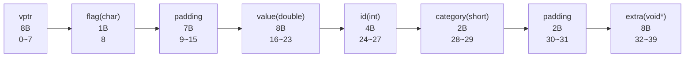

> **sizeof(LayoutDemo) = 40 bytes**

### 减少内存浪费

按对齐要求降序声明成员（大类型在前）可减少 padding。更完整的 `alignof` / `alignas` 用法见第二节用法大全。

---

### 内存对齐综合练习题

> **题目**：在 64 位 Linux 系统上，分析以下类的内存布局，选择正确的 `sizeof` 值。

```cpp
class TestPad {
private:
    static int counter;     // 静态成员变量（不占对象空间）
    char  id;               // 1 字节
    double score;           // 8 字节
    int   age;              // 4 字节
    short level;            // 2 字节
public:
    virtual void display(); // 虚函数 -> 编译器隐式插入 vptr
    static int getCounter() { return counter; }
};
int TestPad::counter = 0;
```

> **请选出 `sizeof(TestPad)` 的正确值：**
>
> A. **24** — 误区：忘记虚函数带来 vptr 指针，错误地按无虚函数的类计算
>
> B. **30** — 误区：考虑到了 vptr 和内部填充，但遗漏了对象末尾的尾部 padding
>
> C. **32** — 正确
>
> D. **36** — 误区：错误地将 `static int counter`（4 字节）也计入对象大小

> [!NOTE]- 答案与解析（点击展开）
>
> **正确答案：C（sizeof = 32）**
>
> **逐步推导（64位系统，默认对齐 8 字节）：**
>
> | 步骤 | 内容 | 大小 | 当前位置 + 待补padding | 补后偏移 % 大小 |
> |:-----|:-----|:-----|:-----------------------|:----------------|
> | 0 | `static counter` | — | 静态成员不占对象空间 | — |
> | 1 | vptr（编译器插入） | 8 | 0 + 0 | 0 % 8 = 0 |
> | 2 | `id` (char) | 1 | 8 + 0 | 8 % 1 = 0 |
> | 3 | `score` (double) | 8 | 9 + 7 | 16 % 8 = 0 |
> | 4 | `age` (int) | 4 | 24 + 0 | 24 % 4 = 0 |
> | 5 | `level` (short) | 2 | 28 + 0 | 28 % 2 = 0 |
> | 6 | 尾部对齐 | — | 30 + 2 | 32 % 8 = 0 |
>
> **内存布局模型图（箭头表示地址从低到高）：**
>
> ```mermaid
> flowchart LR
>     vptr["vptr<br/>8 bytes<br/>offset 0~7"]
>     id["id (char)<br/>1 byte<br/>offset 8"]
>     pad7["padding<br/>7 bytes<br/>offset 9~15"]
>     score["score (double)<br/>8 bytes<br/>offset 16~23"]
>     age["age (int)<br/>4 bytes<br/>offset 24~27"]
>     level["level (short)<br/>2 bytes<br/>offset 28~29"]
>     pad2["padding<br/>2 bytes<br/>offset 30~31"]
>     vptr --> id --> pad7 --> score --> age --> level --> pad2
> ```
>
> **各选项解析：**
> - **A (24)**：遗漏 vptr。`id(1)+pad(7)+score(8)+age(4)+level(2)+pad(2)=24`，但忘了有虚函数时有 8 字节 vptr。
> - **B (30)**：遗漏尾部 padding。`8+1+7+8+4+2=30`，但 30 % 8 != 0，还需要 2 字节尾部填充，故是 32。
> - **C (32)**：`vptr(8)+id(1)+pad(7)+score(8)+age(4)+level(2)+pad(2)=32`，计算完整。
> - **D (36)**：把 `static int counter`（4 字节）当作对象成员计入：`32 + 4 = 36`，但实际上静态成员存储在全局数据段，不属于任何对象。
>
> **三个关键知识点：**
> 1. **静态成员变量不占用对象空间**（存储在全局数据段 `.data` / `.bss`）
> 2. **虚函数带来 vptr**（8 字节，64 位系统），位于对象内存布局的最前端
> 3. **每个成员偏移必须是其类型大小的整数倍**，对象总大小必须是最大对齐值的整数倍

【原理2-2】sizeof运算符验证对象大小

```cpp
#include <iostream>

class Demo {
public:
    int a;      // 4
    char b;     // 1
    double c;   // 8
    short d;    // 2
    // 成员函数不增加对象大小！
    void func() { a = 10; }
    void func2() { b = 'x'; }
};

class Empty {};  // 空类

int main() {
    std::cout << "sizeof(Demo): " << sizeof(Demo) << std::endl;   // 输出24
    std::cout << "sizeof(Empty): " << sizeof(Empty) << std::endl; // 输出1
    // 空类大小为1字节，因为C++保证每个对象必须有唯一地址
    // 这个1字节不存储任何数据，仅用于地址区分
    return 0;
}
```

对象大小计算要点：
  1. 非静态成员变量才占用对象空间
  2. 成员函数不占用对象空间（代码在代码段中，所有对象共享）
  3. 静态成员变量不占用对象空间（在全局数据段中）
  4. 虚函数会增加一个vptr（虚函数表指针），通常8字节（64位系统）
      ——详见 [[07_面向对象(三)多态与虚函数]]

【原理2-3】this指针——成员函数的隐式参数

>  [cppreference: this](https://en.cppreference.com/w/cpp/language/this) — 权威参考，建议同步打开对照阅读。

每个非静态成员函数都隐含地接收一个指向当前对象的指针，名为this。

```cpp
class Point {
private:
    int x, y;
public:
    Point(int x, int y) {
        // this->x 指成员变量，x 指参数
        this->x = x;   // 等价于 Point::x = x
        this->y = y;
    }

    Point& setX(int x) {
        this->x = x;          // 区分成员变量和参数
        return *this;         // 返回对象自身，支持链式调用
    }

    Point& setY(int y) {
        this->y = y;
        return *this;
    }
};

int main() {
    Point p(3, 4);
    p.setX(10).setY(20);  // 链式调用：p.setX(10)返回p自身
    return 0;
}
```

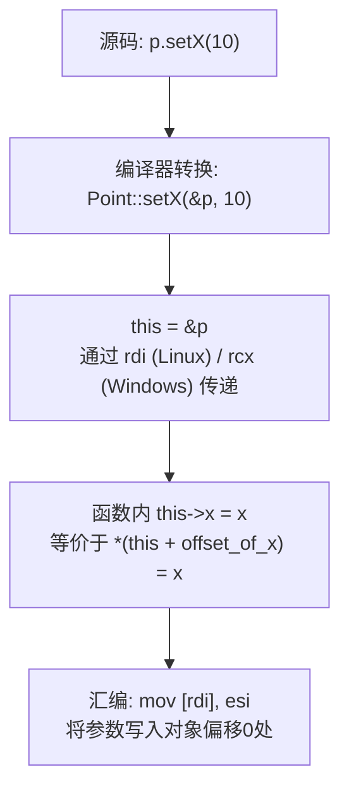

this指针的工作机制（底层）：

  调用 p.setX(10) 时，编译器将其转换为：
      setX(&p, 10);    // `this` = &p

  在成员函数内部：
      `this`->x = x;     // 通过this指针访问成员变量

  编译后的汇编伪代码：
      mov rax, rdi          ; rdi = this指针（第一个参数）
      mov [rax], esi        ; 将参数值写入 `this`->x（偏移0处）
      ret

  调用约定说明：
  - 在x86-64 System V ABI（Linux）中，this指针通过rdi寄存器传递
  - 在x86-64 Microsoft ABI（Windows）中，this指针通过rcx寄存器传递
  - this指针本质上就是成员函数的第一个隐式参数

  rdi 与 rcx 的区别源于两种 ABI 对函数参数寄存器的分配策略不同：
  - **System V ABI**（Linux/macOS/BSD）：整数/指针参数依次使用 rdi, rsi, rdx, rcx, r8, r9 传递。第一个参数进 rdi，恰好 this 作为隐式第一参数，自然地由 rdi 承载。
  - **Microsoft x64 ABI**（Windows）：整数/指针参数依次使用 rcx, rdx, r8, r9 传递，超出4个才入栈。第一参数进 rcx，因此 this 由 rcx 承载。
  - 两种 ABI 下返回值的传递方式一致：整数/指针类返回值均通过 rax 返回（如上例中 `mov rax, rdi` 将 this 返回）。

   这意味着同一份 C++ 源码在不同平台编译后，this 的传递寄存器不同，但语义完全等价。理解这一差异有助于阅读跨平台汇编，也解释了为何 ABI 不兼容的目标文件无法混链。

> 汇编知识预备：[[../汇编基础/ASM_02_栈与调用约定]]（调用约定详解）、[[../汇编基础/ASM_01_寄存器与指令基础]]（寄存器与指令速查）。

>  **官方参考**：[cppreference: this pointer](https://en.cppreference.com/w/cpp/language/this) — 了解 this 的完整规范，包括类型推导、cv 限定、`this` 在成员函数中的隐式/显式用法；[cppreference: member functions](https://en.cppreference.com/w/cpp/language/member_functions) — const/volatile/&/&& 限定的成员函数完整说明。养成查阅一手资料的习惯，比任何二手教程都可靠。

### this 的隐式使用 vs 显式使用

`this` 在成员函数内部有两种使用方式——"你不写编译器替你写"（隐式）和"你必须亲手写"（显式）。理解这个区别是看懂 C++ 名称查找规则的关键。

【隐式使用——编译器自动补 `this->`】

当你直接写成员名时，编译器会在前面补上 `this->`：

```cpp
class Widget {
    int value;
public:
    Widget(int v) : value(v) {}

    int getValue() const {
        return value;        // 隐式 this：编译器自动转换为 return this->value;
    }

    void update() {
        value = 100;         // 隐式 this：编译器自动转换为 this->value = 100;
        getValue();          // 隐式 this：编译器自动转换为 this->getValue();
    }

    void callOther() {
        anotherFunc();       // 隐式 this —— 只要 anotherFunc 是本类的成员函数
    }

    void anotherFunc() { }
};
```

汇编层面，隐式和显式完全等价——都生成 `mov eax, [rdi]`（rdi = this，偏移 0 处 = value）：

```cpp
// Widget::getValue() const
//   return value;           // 隐式 this
//   编译后：
//   mov eax, [rdi]          ; rdi 就是 this，读 this->value
//   ret
```

【显式使用——必须亲手写 `this->` 的情况】

以下场景编译器**无法**自动补 `this->`，必须显式写出：

**1. 成员变量与参数/局部变量同名时（名称遮掩）**

```cpp
class Point {
    int x, y;           // 成员变量
public:
    Point(int x, int y) {      // 参数名与成员名相同
        // x = x;              //  错误：编译器将两边都理解为参数 x，结果什么都没做
        this->x = x;           //  显式 this：左边是成员，右边是参数
        this->y = y;           //  同上
    }

    void setX(int x) {
        this->x = x;           // 必须显式——局部参数 x 遮掩了成员 x
    }

    void setY(int y) {
        // y = y;              // 仅仅把参数赋值给自己，成员没变
        this->y = y;           // 正确
    }
};
```

> **名称遮掩规则**：C++ 的名称查找从最近的作用域开始向外查找。参数/局部变量在成员函数的作用域最内层，优先于类成员。因此同名时成员被"遮掩"——只有通过 `this->` 才能突破遮掩。

**2. 模板依赖名称——基类依赖模板参数时**

```cpp
template <typename T>
class Base {
protected:
    T data;
    void helper() { }
};

template <typename T>
class Derived : public Base<T> {
public:
    void process() {
        // data = T{};         //  编译错误！编译器不认为 data 来自 Base<T>
        this->data = T{};    //  必须显式 this——两阶段查找规则要求
        this->helper();      //  同理
    }
};
```

原因：`Base<T>` 是依赖名称（dependent name），编译器在第一阶段（模板定义时）无法确定 `T` 是什么，因此默认不在依赖基类中查找——必须用 `this->` 或 `Base<T>::` 显式告知。

**3. 链式调用返回自身**

```cpp
class Chain {
    int v;
public:
    Chain& inc()  { ++v; return *this; }  // 显式：返回 this 解引用
    Chain* ptr()  { return this; }        // 显式：返回 this 裸指针
};
```

这里 `this` 本身是显式的——没法隐式，因为不存在"隐式返回自己"的语法。

**4. 比较两个对象是否为同一个**

```cpp
bool isSameAs(const Widget& other) const {
    return this == &other;     // 必须显式——没有 this 无法获取"自己的地址"
}
```

**5. 将自身传入外部函数**

```cpp
void externalFunction(const Widget* w);

void memberFunc() {
    externalFunction(this);    // 必须显式——将 this 作为实参传递
}
```

【显式 / 隐式判定规则速查表】

| 场景 | 不写 `this->` 可以吗？ | 原因 |
|:-----|:-----|:------|
| `value = 10;`（无同名局部变量） |  可以（隐式） | 编译器在类作用域中找到 value，自动加 this-> |
| `int value; value = 10;`（有同名局部） |  必须显式 | 局部变量遮掩了成员，编译器优先绑到局部变量 |
| `this->value = x;`（参数同名） |  必须显式 | 参数与成员同名，必须用 this-> 区分 |
| `Base<T>::helper();`（依赖基类） |  必须显式 | 两阶段查找不在依赖基类中查找 |
| `return *this;` |  必须显式 | 返回自身没有隐式语法 |
| `return value;`（成员 getter） |  可以（隐式） | 编译器自动处理 |
| `otherFunc();`（调用同类函数） |  可以（隐式） | 编译器自动补 this->otherFunc() |

> **核心原则**：C++ 的设计哲学是"能用隐式就用隐式，让代码简洁；被遮掩了才用显式，让意图明确"。如果你看到代码中到处都在写 `this->`，要么是作者的个人习惯，要么是该类所处的继承/模板场景迫使必须这样做。

【原理2-4】构造函数初始化顺序

```cpp
#include <iostream>

class Member {
public:
    Member(const char* name) : name_(name) {
        std::cout << "Member " << name_ << " constructed" << std::endl;
    }
private:
    const char* name_;
};

class Container {
private:
    Member m1;    // 第一个声明的成员
    Member m2;    // 第二个声明的成员
    const int id;
public:
    // 初始化列表中的顺序不重要！实际初始化顺序 = 成员声明顺序！
    Container() : m2("second"), m1("first"), id(42) {
        std::cout << "Container constructed" << std::endl;
    }
};

int main() {
    Container c;
    // 输出：
    // Member first constructed    ← m1先初始化（尽管初始化列表中m2在前）
    // Member second constructed   ← m2后初始化
    // Container constructed
    return 0;
}
```

关键规则：
  1. 成员变量按照它们在类中声明的顺序初始化，与初始化列表的顺序无关
  2. 基类子对象先于成员变量初始化（详见 [[06_面向对象(二)继承]]）
  3. const成员和引用成员必须在初始化列表中初始化
  4. 初始化列表的执行先于构造函数体

为什么必须遵循声明顺序？
  因为对象析构是初始化的逆序，编译器需要保证确定的构造/析构顺序。
  如果按照初始化列表的顺序构造，析构时无法保证正确的逆序。

>  *构造函数不同初始化方式的底层区别*
>  1. 有两种初始化方式Member{const char* name}:name_(name){}这是直接初始化还有一种Member(){name=name_}这是使用默认初始化之后再进行赋值（很少用，直接初始化已经满足所有需求，我感觉这种用法应该被淘汰掉了）
>  2.  直接初始化，比如Foo():x(5),s("hello"){}，基础类型 int x： 直接往对象内存中x 的位置写入5,一次mov指令，类类型 string s： 直接调用string（const char*)构造函数，在s的内存位置构造对象，一次函数调用
>  3. 而Foo(){x=5;s="hello";}是先默认初始化，就是对x不赋值，这个时候x被随机分配地址，赋予垃圾值，然后再执行x=5进行赋值，mov写入，在基础类型上，开销差别很小，没必要在意。但是对于类类型，指针之类的，默认初始化会在s的内存位置构造一个空字符串，在执行s="hello"的时候，调用operator=可能涉及：分配新内存，拷贝，释放旧空字符串的内存，两次函数调用+一次二外的内存分配和释放，开销会明显增大。
>  4. 另外，如果成员变量的内存空间在进入构造函数体之前已经分配好了，初始化列表直接在已分配的内存上构造；而构造函数体只能对已经构造完成的对象做赋值。同时，const/引用成员，在进行函数体内赋值会因为造成语义冲突（const不允许改变值）。

【原理2-4B】构造函数的底层调用机制——何时触发、汇编层发生了什么
-----------------------------------------------------------------

### 构造函数在哪些情况下被调用？

构造函数不是由用户显式调用的，而是由编译器在**对象创建的一瞬间**自动插入的。以下是所有会触发构造函数调用的场景：

```cpp
#include <iostream>
#include <string>

class Tracker {
    std::string label;
public:
    Tracker(const std::string& lbl) : label(lbl) {
        std::cout << "[构造] " << label << " (this=" << this << ")" << std::endl;
    }
    Tracker(const Tracker& other) : label(other.label + "(副本)") {
        std::cout << "[拷贝构造] " << label << " (this=" << this << ")" << std::endl;
    }
    ~Tracker() {
        std::cout << "[析构]   " << label << " (this=" << this << ")" << std::endl;
    }
};

Tracker globalObj("全局对象");      // ① 全局/静态对象：main之前构造

static Tracker staticObj("静态全局"); // ② 静态全局对象

Tracker* createOnHeap() {
    return new Tracker("堆对象");     // ③ new 表达式：先在堆上分配内存，再调用构造函数
}

Tracker createAndReturn() {
    Tracker local("函数内局部");       // ④ 局部栈对象：声明时构造
    return local;                     // ⑤ 返回值：可能触发拷贝构造（或移动构造/NRVO优化）
}

void func(Tracker param) {           // ⑥ 值传递参数：形参通过拷贝构造创建
    std::cout << "函数体内" << std::endl;
}

int main() {
    std::cout << "\n===== main 开始 =====" << std::endl;

    Tracker a("main中的a");           // ④ 栈对象——声明即构造

    Tracker b = a;                   // ⑤ 拷贝初始化：触发拷贝构造函数

    Tracker c = Tracker("显式临时");  // ⑥ 临时对象 + 拷贝（可能被编译器优化省略）

    Tracker* p = createOnHeap();     // ③ new：堆分配 + 构造函数

    func(a);                         // ⑥ 值传递：拷贝构造形参

    Tracker& ref = a;                // ⑦ 引用：不调用构造函数！（引用只是别名）

    Tracker* ptr = &a;               // ⑧ 指针：不调用构造函数！（指针只是存地址）

    Tracker d(std::move(a));         // ⑨ 移动构造（如果定义了的话，否则回退到拷贝构造）

    delete p;                        // delete：先析构，再释放堆内存

    std::cout << "\n===== main 结束 =====" << std::endl;
    return 0;
}
// ⑩ 程序退出时：全局/静态对象析构（构造的逆序）
```

**构造函数触发场景速查表**：

| 场景      | 代码示例                     | 调用的构造函数 | 内存来源       |
| :------ | :----------------------- | :------ | :--------- |
| 栈对象声明   | `Widget w;`              | 默认构造    | 栈（rsp 偏移）  |
| 栈对象带参   | `Widget w(1,2);`         | 带参构造    | 栈          |
| new 表达式 | `new Widget(args)`       | 带参构造    | 堆（malloc）  |
| 拷贝初始化   | `Widget w2 = w1;`        | 拷贝构造    | 栈/堆        |
| 值传递参数   | `void f(Widget w)`       | 拷贝构造    | 栈（参数区）     |
| 值返回     | `return local;`          | 拷贝/移动构造 | 调用者栈/寄存器   |
| 临时对象    | `Widget()` / `Widget(1)` | 默认/带参构造 | 栈（临时区）     |
| 全局/静态对象 | `static Widget w;`       | 默认构造    | .data/.bss |
| 容器操作    | `v.push_back(w)`         | 拷贝/移动构造 | 容器的堆内存     |
| 初始化列表   | `: member(args)`         | 带参构造    | 外层对象的空间内   |
| 引用绑定    | `Widget& r = w;`         | **不调用** | —          |
| 指针赋值    | `Widget* p = &w;`        | **不调用** | —          |
 
### 汇编层发生了什么？

从汇编角度，构造函数的调用过程可以分为以下几步：

```cpp
// C++ 源代码：
//   Widget w(42, "hello");
//
// 编译器将其转换为以下汇编级步骤（x86-64 System V ABI）：

// ===== 第1步：分配对象内存空间（栈上） =====
    sub  rsp, 32              ; 为 Widget 在栈上预留 32 字节
                              ; （rsp 现在指向 Widget 对象的起始地址）

// ===== 第2步：将对象的地址作为 this 指针传入 rdi =====
    lea  rdi, [rsp]           ; rdi = &w（this 指针 = 对象首地址）

// ===== 第3步：将构造函数的参数传入后续寄存器 =====
    mov  esi, 42              ; rsi = 第一个参数（int a = 42）
    lea  rdx, [rip+.Lstr]     ; rdx = 第二个参数（const char* = "hello"）

// ===== 第4步：调用构造函数 =====
    call Widget::Widget(int, const char*)
    ;           ↓
    ; Widget::Widget 内部：
    ;   mov  [rdi], esi         ; 初始化列表：将 42 写入 this->a（偏移 0 处）
    ;   lea  rax, [rip+.Lstr]   ; 将字符串地址加载到 rax
    ;   mov  [rdi+8], rax       ; 将字符串指针写入 this->name（偏移 8 处）
    ;   ; ... 构造函数体中的其他代码 ...
    ;   ret                     ; 返回（无返回值，void）

// ===== 第5步：构造完成，对象已就绪 =====
    ; 此时 [rsp] 开始的 32 字节已经是一个构造完成的 Widget 对象
```

**new 表达式的汇编层**：

```cpp
// C++ 源代码：
//   Widget* p = new Widget(10);

    mov  edi, 24              ; 参数1：Widget 的大小 = 24 字节 → 传给 operator new
    call operator new          ; 调用 operator new（底层通常是 malloc）
                               ; rax = 堆上分配的内存地址

    mov  rdi, rax              ; rdi = this = 堆地址
    mov  esi, 10               ; rsi = 构造参数
    call Widget::Widget(int)   ; 在堆内存上构造对象

    mov  [rbp-8], rax          ; p = 堆地址（保存到局部变量）
```

**拷贝构造的汇编层**：

```cpp
// C++ 源代码：
//   Widget a(5);
//   Widget b = a;   // 调用拷贝构造 Widget::Widget(const Widget&)

    ; 先构造 a
    lea  rdi, [rsp]            ; rdi = &a
    mov  esi, 5
    call Widget::Widget(int)

    ; 再拷贝构造 b
    lea  rdi, [rsp + 24]       ; rdi = &b（目标对象的地址 = this）
    lea  rsi, [rsp]            ; rsi = &a（源对象的地址 = 拷贝来源）
    call Widget::Widget(const Widget&)
    ;     ↓ Widget 拷贝构造函数内部：
    ;     mov  eax, [rsi]       ; 读源对象的第一个 int 成员
    ;     mov  [rdi], eax       ; 写入目标对象
    ;     mov  rax, [rsi+8]     ; 读源对象的指针成员
    ;     mov  [rdi+8], rax     ; 浅拷贝：仅复制指针值（危险！见深拷贝章节）
    ;     ret
```

**关键汇编层要点总结**：

| 要点 | 说明 |
|:-----|:-----|
| `this` = rdi | 构造函数也是成员函数，`this` 指针通过 rdi 传递（Linux x86-64 System V ABI） |
| 构造即函数调用 | 构造函数在汇编层面就是一个普通的函数调用（`call`），只是名称为 `ClassName::ClassName` |
| 内存先于构造 | 对象的存储空间（栈或堆）在调用构造函数**之前**已经分配好了 |
| 构造是对已分配内存的初始化 | 构造函数的作用是对这块预分配的内存进行初始化（写入有意义的值），不是分配内存 |
| 无返回值 | 构造函数声明无返回值，底层确实不通过 rax 返回值，但通过 rdi 指向的内存来"输出"结果 |
| NRVO/RVO 优化 | 编译器可以将局部对象直接构造在调用者的返回槽中，省略拷贝。此时不会调用拷贝构造函数 |

> 汇编知识预备：System V ABI 参数传递规则见 [[../汇编基础/ASM_01_寄存器与指令基础]]（第1参数 rdi，第2参数 rsi，第3参数 rdx），调用约定与栈帧见 [[../汇编基础/ASM_02_栈与调用约定]]（call/ret、栈帧布局、红区/影子空间）。

【原理2-5】成员函数调用约定深入

考虑以下代码：

```cpp
class Calculator {
    int value;
public:
    Calculator(int v) : value(v) {}
    int add(int x) { return value + x; }      // 非const成员函数
    int get() const { return value; }          // const成员函数
    static int version() { return 1; }         // 静态成员函数
};

// 调用时的底层对应关系：
int main() {
    Calculator calc(10);

    int r1 = calc.add(5);
    // 编译器转换为: int r1 = Calculator::add(&calc, 5);
    // 函数签名实际是: int add(Calculator* this, int x)

    int r2 = calc.get();
    // 编译器转换为: int r2 = Calculator::get(&calc);
    // const成员函数对应的this是: const Calculator* this

    int v = Calculator::version();
    // 静态函数无this指针，直接调用: int v = Calculator::version();

    return 0;
}
```

类型修饰与this指针的关系：
  - 非const成员函数：this类型为 T* const（指针本身不可改，指向内容可改）
  - const成员函数：   this类型为 const T* const（指针和内容都不可改）
  - 这就是const成员函数不能修改成员变量的根本原因

> 关于 `const T*`（指向常量的指针）与 `T* const`（常量指针）的详细辨析，参见 [[03_指针与引用#2.3 const 与指针的组合（四种组合）]]。

【原理2-6】虚函数指针（vptr）预留给对象空间的说明

如果一个类包含虚函数，编译器会在对象内存布局的最前面插入一个vptr：

```cpp
class Base {
    int data;
public:
    virtual void func() {}   // 有虚函数 → 包含vptr
};

class NoVirtual {
    int data;
public:
    void func() {}           // 无虚函数 → 无vptr
};

// sizeof(Base) == 16 (vptr=8字节 + int=4字节 + padding=4字节)
// sizeof(NoVirtual) == 4  (只有int成员)

// vptr指向虚函数表(vtable)，vtable中存储所有虚函数的地址
// vtable位于只读数据段(.rodata)，所有同类对象共享同一个vtable
```

> 详见 [[07_面向对象(三)多态与虚函数]]。虚表在汇编层的体现见 [[../汇编基础/ASM_03_C++在汇编层的体现]]。

---

                            === 第二节：所有用法大全（标准库/关键字/函数） ===
---

2.1 class vs struct 的区别
------------------------------------

```cpp
// class: 默认访问级别为 private
class C {
    int a;          // private（默认）
public:
    int b;          // public
};

// struct: 默认访问级别为 public
struct S {
    int a;          // public（默认）
private:
    int b;          // private
};

// 除此之外，class和struct在C++中几乎完全相同
// 都可以有成员函数、构造函数、析构函数、继承等

// 约定俗成：
// struct 用于简单的数据聚合（POD类型）
// class  用于有封装逻辑的复杂类型
```

2.2 构造函数大全
------------------------------------

【默认构造函数】
没有参数（或所有参数都有默认值）的构造函数。

```cpp
class Widget {
    int id;
public:
    Widget() : id(0) { }              // 默认构造函数
    Widget(int i = 0) : id(i) { }     // 也是默认构造函数（参数有默认值）
};
// 注意：如果类中没有任何构造函数，编译器会自动生成默认构造函数
// 一旦定义了任何构造函数，编译器就不再自动生成
```

【带参构造函数】

```cpp
class Point {
    int x, y;
public:
    Point(int xVal, int yVal) : x(xVal), y(yVal) { }
    // 也可用构造函数体赋值，但效率较低：
    // Point(int xVal, int yVal) { x = xVal; y = yVal; }
};
```

【拷贝构造函数】
用同类型对象初始化新对象时调用。若未自定义，编译器自动生成**浅拷贝**（逐成员复制）。

### 浅拷贝 vs 深拷贝

**浅拷贝（Shallow Copy）**：逐字节复制成员的值。对于指针成员，仅复制指针值（地址），不复制指针指向的数据。结果是两个对象内的指针指向同一块堆内存。

**深拷贝（Deep Copy）**：不仅复制指针，还为新对象分配独立内存并将源数据完整复制过去。两个对象拥有各自独立的堆内存，互不干扰。

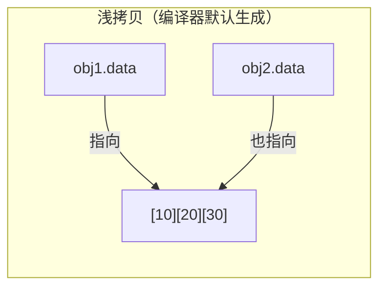
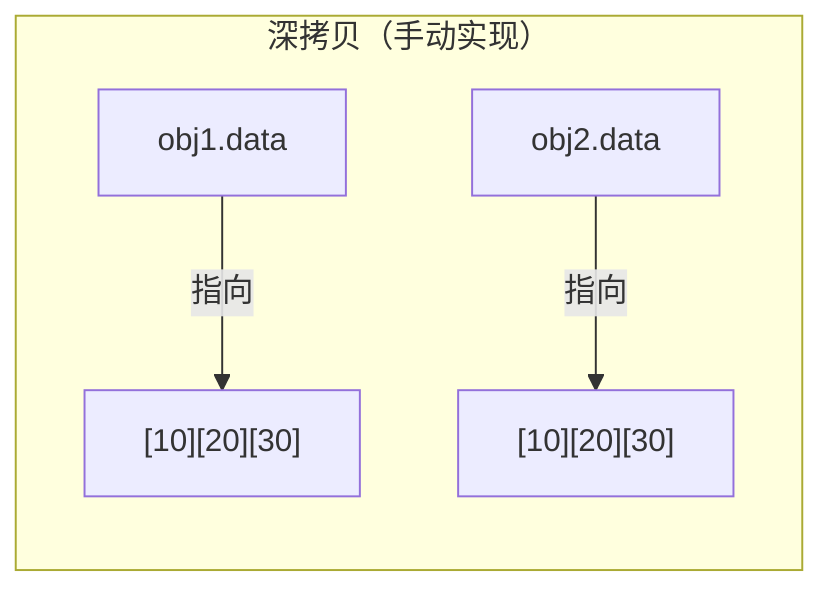

> 若类包含指向动态内存的裸指针，编译器默认的浅拷贝会导致 double-free 崩溃。必须手动实现深拷贝。若使用 `std::string`、`std::vector`、`std::unique_ptr` 等 RAII 类型，它们的拷贝构造已正确实现，无需额外处理。详见 [[04_动态内存]] 和 [[03_指针与引用]]。

```cpp
#include <iostream>
#include <cstring>

//  浅拷贝示例——包含隐患
class ShallowString {
    char* buffer;
public:
    ShallowString(const char* s)
        : buffer(new char[std::strlen(s) + 1]) {
        std::strcpy(buffer, s);
    }
    // 未定义拷贝构造 → 编译器生成浅拷贝
    // 两个 ShallowString 的 buffer 指向同一地址 → 析构时 double-free
    ~ShallowString() { delete[] buffer; }
    const char* get() const { return buffer; }
};

//  深拷贝示例——安全
class DeepString {
    char* buffer;
public:
    DeepString(const char* s)
        : buffer(new char[std::strlen(s) + 1]) {
        std::strcpy(buffer, s);
    }
    // 深拷贝：分配新内存，复制内容
    DeepString(const DeepString& other)
        : buffer(new char[std::strlen(other.buffer) + 1]) {
        std::strcpy(buffer, other.buffer);
    }
    ~DeepString() { delete[] buffer; }
    const char* get() const { return buffer; }
};

int main() {
    DeepString s1("hello");
    DeepString s2(s1);   // 深拷贝：s2.buffer 独立于 s1.buffer
    // 两个对象各自拥有独立的堆内存，析构安全

    // ShallowString a("test");
    // ShallowString b(a);  // 浅拷贝 → 析构时 crash!
    return 0;
}
```


>我这里又有了新的关于深拷贝到理解。其实不用记上面这个繁杂的例子。深拷贝基本原理或者说思路是在构造函数里，给指针成员new一块新内存，再把源对象指向的内容逐个复制进这一块新内存，使得两个对象各自拥有独立的资源。

那么可以尝试一下的简化思路。
```cpp
#inlude<iostream>
using namespace std;
class Box{
  private:
   int *data_; 这个指针就是用来分配和指向新内存的
   size_t size_; 这个size代表了元素，并不一定要size,之所以使用是因为这是一个通用实例
  public:
    Box(size_t newsize_):data_(new int[newsize_]),size_(newsize_){}
        //这里的data_(new int[newsize_])结果相当于 data_ = new int[newsize_];意思就是用data_指针在堆上分配（new）一块新的内存存放容纳newsize_个int的连续内存，并返回指向这块内存第一个元素的指针，把这个指针存进data_
    Box(cosnt Box& other):data_(new int(other.size_)),size_(other.size_){
      for(size i=0;i<size_;++i)data_[i]=other.data_[i];
    }
    //这里的意思就是逐个将other里的内容，复制到本对象内，使用for循环的方式
}
```
```cpp
```
### 何时需要深拷贝？何时浅拷贝足够？

| 场景 | 拷贝方式 | 说明 |
|:-----|:--------|:-----|
| 成员全是值类型（int, double, char[...]等） | 浅拷贝（默认即可） | 无指针/动态资源，逐位复制安全 |
| 成员含 `std::string`, `std::vector`, `std::shared_ptr` | 浅拷贝（默认即可） | STL 容器已实现正确的拷贝语义 |
| 成员含 `std::unique_ptr` | 不可拷贝 | 需自定义移动或改用 `shared_ptr` |
| 成员含裸指针（拥有堆内存） | **必须深拷贝** | 否则 double-free，见上例 |
| 成员含文件句柄/锁/套接字等非内存资源 | **必须深拷贝或禁止拷贝** | 需复制资源或 `= delete` 拷贝构造 |

### 调用时机

```cpp
// Buffer b2(b1);        // 直接初始化 → 拷贝构造
// Buffer b3 = b1;       // 拷贝初始化 → 拷贝构造
// void func(Buffer b);  // 值传递参数 → 拷贝构造
// Buffer func() { return b; } // 返回值 → 拷贝构造（可能被RVO优化掉）
```

【委托构造函数 (C++11)】
一个构造函数调用同类中的另一个构造函数。

```cpp
class Employee {
    std::string name;
    int id;
    double salary;
public:
    // 主构造函数
    Employee(const std::string& n, int i, double s)
        : name(n), id(i), salary(s) { }

    // 委托给主构造函数
    Employee(const std::string& n, int i)
        : Employee(n, i, 0.0) { }         // 只提供姓名和工号，薪资默认0

    Employee(const std::string& n)
        : Employee(n, 0, 0.0) { }         // 只提供姓名

    Employee()
        : Employee("Unknown", 0, 0.0) { } // 无参，全部默认

    void print() const {
        std::cout << name << " (ID:" << id << ") $" << salary << std::endl;
    }
};

// 使用：
// Employee e1("Alice", 1001, 50000.0);  // 主构造
// Employee e2("Bob", 1002);             // 委托构造
// Employee e3("Charlie");              // 委托构造
// Employee e4;                          // 委托构造
```

️ 注意：使用委托构造时，初始化列表中不能有其他成员初始化器。同一个成员被初始化两次会有歧义。
即 `Employee(const std::string& n) : name(n), Employee(n, 0, 0.0) {}` 是错误的！

【移动构造函数 (C++11)】
用同类型右值（将亡对象）初始化新对象时调用。"窃取"源对象的资源而非复制，避免深拷贝的高昂开销。

```cpp
#include <iostream>
#include <cstring>

class Buffer {
    char* data;
    size_t size;
public:
    Buffer(const char* s) : size(std::strlen(s)), data(new char[size + 1]) {
        std::strcpy(data, s);
        std::cout << "[构造] 分配 " << size + 1 << " 字节" << std::endl;
    }

    // 拷贝构造——深拷贝（完整复制数据）
    Buffer(const Buffer& other) : size(other.size), data(new char[size + 1]) {
        std::strcpy(data, other.data);
        std::cout << "[拷贝构造] 深拷贝 " << size + 1 << " 字节" << std::endl;
    }

    // 移动构造——只"窃取"指针，不复制数据
    Buffer(Buffer&& other) noexcept
        : data(other.data), size(other.size) {
        other.data = nullptr;   // 将源对象置空，避免double-free
        other.size = 0;
        std::cout << "[移动构造] 仅窃取指针，零拷贝" << std::endl;
    }

    ~Buffer() {
        delete[] data;
        if (data) std::cout << "[析构] 释放内存" << std::endl;
    }
};

Buffer createBuffer() {
    Buffer tmp("temporary data");
    return tmp;  // 触发移动构造（如果编译器不做 NRVO 优化）
}

int main() {
    Buffer a("hello world");     // 带参构造
    Buffer b = a;                // 拷贝构造——深拷贝
    Buffer c = std::move(a);     // 移动构造——窃取 a 的资源
    // 此后 a 处于"有效但未指定"状态（a.data == nullptr）

    Buffer d = createBuffer();   // 移动构造——窃取返回的临时对象
    return 0;
}
```

**移动构造的汇编层——零拷贝的本质：**

```cpp
// 拷贝构造：Buffer(const Buffer& other)
//   第1步：分配新内存
//     call operator new[]        ; 系统调用，分配堆内存
//   第2步：复制数据
//     rep movsb                  ; 逐字节拷贝（循环）
//   第3步：两条指令搞定源对象指针
//     mov  rax, [rbp-XX]         ; 读源 ptr
//     mov  [rdi+0], rax          ; 写目标 ptr
//
// 移动构造：Buffer(Buffer&& other)
//   mov  rax, [rsi+0]            ; 读源 obj.data 指针值
//   mov  [rdi+0], rax            ; 写入目标 obj.data = 源指针
//   mov  qword [rsi+0], 0        ; 源 obj.data = nullptr
//   mov  rax, [rsi+8]            ; 读源 obj.size
//   mov  [rdi+8], rax            ; 写入目标 obj.size
//
// 拷贝：O(n) 时间 + O(n) 内存分配（n = 数据大小）
// 移动：O(1) 时间 + 0 内存分配（仅几条 mov 指令）
```

> 移动语义将"深拷贝"降级为"浅拷贝"，但通过将源对象置空来保证安全。这是 C++11 最重要的性能优化机制之一。详见 [[04_动态内存]]。

### 何时使用哪种构造函数——决策速查表

| 使用场景 | 代码示例 | 调用哪个构造函数 | 关键特征 |
|:-----|:-----|:-----|:-----|
| 创建新对象（空） | `Widget w;` | 默认构造函数 | 无参数，用于"空壳"创建 |
| 创建新对象（有参） | `Widget w(1, 2.0);` | 带参构造函数 | 传入数据初始化 |
| 用已有对象复制 | `Widget w2(w1);` | 拷贝构造函数 | 深拷贝/浅拷贝，源对象不变 |
| 用临时对象"窃取" | `Widget w3(std::move(w1));` | 移动构造函数 | 零拷贝，源对象置空 |
| 返回值（函数内） | `return local;` | 移动构造（优先）或拷贝构造 | NRVO 可能完全消除构造调用 |
| 值传递参数 | `void f(Widget w)` | 拷贝/移动构造 | 传入时构造形参 |
| 减少重复代码 | 委托给主构造函数 | 委托构造函数 | C++11，链式调用同类构造 |
| 禁止拷贝 | `= delete` | 无——编译时报错 | 独占资源类（如 unique_ptr） |
| 显式声明默认 | `= default` | 编译器生成的默认版本 | 语义清晰，与自定义其他构造并存 |

**设计原则：Rule of Five（五法则）**

如果类需要自定义以下任一项，通常需要全部定义五项：

```cpp
析构函数          ─┐
拷贝构造函数       ├── 资源管理五件套
拷贝赋值运算符      │   （缺一不可）
移动构造           │
移动赋值          ─┘
```

示例中案例5（MyString）完整实现了五法则。详见 [[#2.5 案例5：从零实现自定义字符串类（MyString）]]。

规则简化版：
- 类不管理资源 → 使用编译器默认的即可（Rule of Zero）
- 类管理堆内存/文件/锁 → 实现五法则（Rule of Five）
- 不想被拷贝 → `= delete` 拷贝操作，保留移动

2.3 析构函数：底层原理
------------------------------------

```cpp
class FileHandler {
    FILE* file;
public:
    FileHandler(const char* filename) {
        file = fopen(filename, "r");
    }

    // 析构函数——自动清理资源
    ~FileHandler() {
        if (file) {
            fclose(file);
            std::cout << "File closed" << std::endl;
        }
    }
    // 析构函数的特点：
    // 1. 不接受参数，没有返回值
    // 2. 每个类只能有一个析构函数
    // 3. 对象离开作用域时自动调用
    // 4. 析构顺序 = 构造顺序的逆序
};

// 析构函数的调用时机：
// 1. 栈对象离开作用域
// 2. delete 释放堆对象
// 3. 临时对象生命周期结束
// 4. 程序结束时全局/静态对象析构
```

### 析构函数为什么不能继承？

析构函数在语法上确实可以被派生类"继承"（C++ 标准：析构函数是特殊的成员函数，所有类都有析构函数）。但**语义上**，基类的析构逻辑只负责基类自己分配的资源，不能替代派生类的清理工作。

```cpp
class Base {
    int* basePtr;
public:
    Base() : basePtr(new int(0)) {}
    virtual ~Base() { delete basePtr; }  // 只清理 Base 自己的内存
};

class Derived : public Base {
    int* derivedPtr;
public:
    Derived() : derivedPtr(new int(0)) {}
    ~Derived() override {               // 只负责自己，基类的析构会自动调用
        delete derivedPtr;
        // 不需要写 delete basePtr——Base::~Base() 会自动被调用
    }
};
```

**底层原理——析构链的自动调用：**

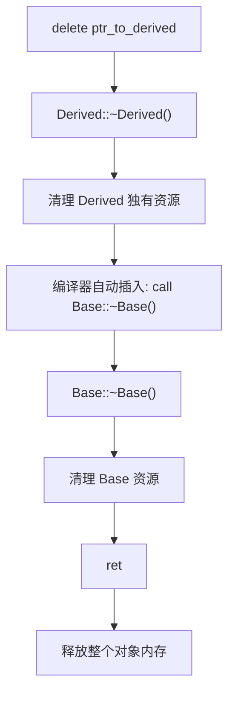

编译器在派生类析构函数**执行完函数体后**自动插入对基类析构的调用。所以程序员不需要手动调用基类析构——这是编译器保证的"析构链"。析构函数不继承的本质原因是：每个类需要"析构自己负责的那部分"，编译器通过自动生成调用链来保证完整清理。

### 析构函数为什么不能重载？

析构函数不接受参数，没有返回值，也不能被重载：

```cpp
class Foo {
public:
    ~Foo();             // 唯一允许的析构函数
    // ~Foo(int x);     //  编译错误！析构不能有参数
    // 为什么？因为析构函数的调用时机由编译器决定（离开作用域、delete），
    // 程序员无法选择"用哪个参数的版本来析构"。
    // 接受参数的重载 = 语义矛盾——"请按某种方式销毁"意味着可以选，
    // 但对象的销毁是确定的、唯一的、不可协商的。
};
```

**底层原因**：析构函数在汇编层只是 `call Foo::~Foo()`——调用方（栈展开 / delete / 临时对象生命周期结束）**不传递任何参数**给析构函数。如果允许多种重载版本，调用方无法知道该选哪个。因此标准规定每个类只能有唯一一个无参析构函数。

### 析构函数为什么可以是虚函数？

**必须**是虚函数——当通过基类指针 `delete` 派生类对象时：

```cpp
class Base {
public:
    ~Base() { std::cout << "~Base" << std::endl; }         //  非虚析构
};

class Derived : public Base {
    int* data = new int[100];
public:
    ~Derived() { delete[] data; std::cout << "~Derived" << std::endl; }
    // 如果 ~Base 不是 virtual，这个析构函数可能永远不会被调用！
};

Base* p = new Derived();
delete p;  // 只调用了 ~Base()！Derived::data 泄漏了 400 字节！
```

**底层原理——虚析构与 vtable：**

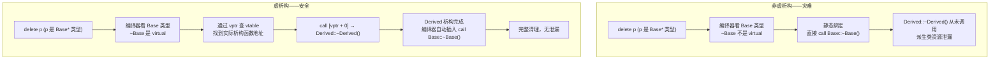

汇编对比：

```cpp
// 非虚析构 delete p (Base*)：
//   call Base::~Base          ; 静态绑定——永远是 Base 的析构

// 虚析构   delete p (Base*)：
//   mov rax, [rdi]             ; rdi = p → 读 vptr
//   call [rax]                 ; 调用 vtable[0] → 实际是 Derived::~Derived()
//   ; Derived::~Derived 内部最后会调用 Base::~Base()
```

**经验法则**：只要一个类可能被用作基类（被继承），就将析构函数声明为 `virtual`。只有明确知道某个类不会是基类时（如 `final` 类、值语义类），才保留非虚析构。

> 虚函数表、vptr、多态调用的完整讲解见 [[07_面向对象(三)多态与虚函数]]；构造/析构中 vptr 的切换时间线见本章 [[#构造析构中的this]]。

### 引用成员——类中声明引用类型的数据成员

类可以拥有引用类型的成员变量。引用成员必须在初始化列表中初始化，且一旦绑定就无法更改指向。

```cpp
#include <iostream>

class ReferenceDemo {
    int& ref;              // 引用成员——必须初始化
    const int& cref;       // const 引用成员——可以绑定到临时对象
public:
    // 引用成员必须在初始化列表中绑定
    ReferenceDemo(int& r, const int& cr) : ref(r), cref(cr) {}

    void modify(int val) {
        ref = val;         // 修改的是 ref 所引用的外部变量！
    }

    int getRef()  const { return ref; }
    int getCref() const { return cref; }
};

int main() {
    int x = 10, y = 20;
    ReferenceDemo demo(x, y);
    std::cout << demo.getRef() << std::endl;   // 10

    demo.modify(100);
    std::cout << x << std::endl;               // 100——外部变量被修改

    // ReferenceDemo d2;      //  没有默认构造——引用成员必须初始化
    // ReferenceDemo& ref2 = demo;  // 可以（引用绑定到对象）
    return 0;
}
```

### 引用对象的几种方式：值传递 vs 指针传递 vs 引用传递——底层全面对比

C++ 中"访问/传递一个对象"有五种基本方式，每种在底层对应不同的汇编行为：

| 方式 | 语法 | 调用方 | 被调方内部 | 汇编层 | 开销 |
|:-----|:-----|:-----|:-----|:-----|:-----|
| **值传递** | `void f(T obj)` | `f(a)` | `obj` 是独立副本 | `memcpy` 整个对象 | 高（拷贝） |
| **指针传递** | `void f(T* p)` | `f(&a)` | `p->x` | `lea rdi, [rsp+X]; call f` | 8字节 |
| **引用传递** | `void f(T& r)` | `f(a)` | `r.x` | 汇编层与指针**完全相同** | 8字节 |
| **const 引用** | `void f(const T& r)` | `f(a)` | 只读访问 `r.x` | 与指针相同 + 编译期 const 检查 | 8字节 |
| **右值引用** | `void f(T&& r)` | `f(std::move(a))` | 窃取资源 | 与指针相同 + 所有权标记 | 8字节 |

**汇编层证据——引用 = 语法糖包装的指针：**

```cpp
// C++ 源码：
void byPointer(int* p)  { *p = 42; }
void byReferece(int& r) {  r = 42; }

// 编译后（x86-64）——两条函数生成完全相同的指令：
// byPointer:
//   mov dword [rdi], 42    ; rdi = p → 写 *p
//   ret
// byReference:
//   mov dword [rdi], 42    ; rdi = r → 写 r（地址来自 rdi）
//   ret
```

引用和指针在汇编层完全等价（都通过地址传递），区别仅在编译器前端：
- 指针：语法显式、可为空、可重新绑定、有 `*` 和 `->` 操作符
- 引用：语法简洁、不可为空、不可重新绑定、使用方式与值对象一致

**五种方式的选择决策树：**

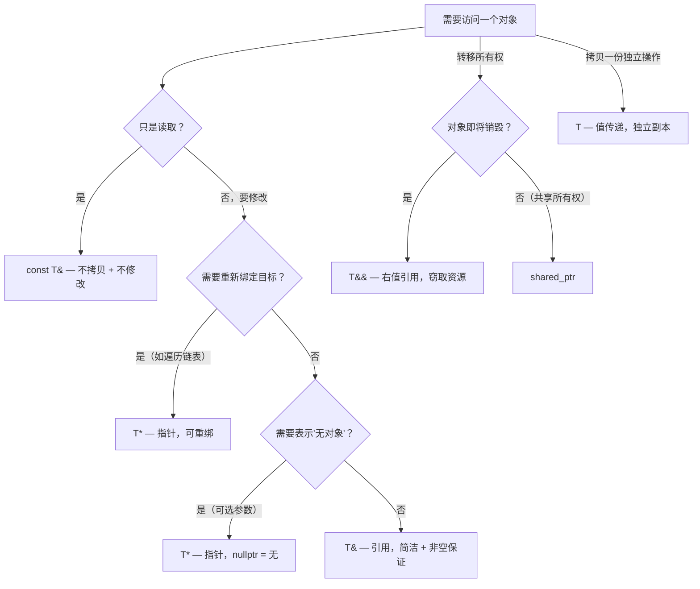


```cpp

2.4 成员初始化列表 vs 构造函数体内赋值
------------------------------------

```cpp
#include <iostream>
#include <string>
#include <chrono>

class Inefficient {
    std::string name;
    int value;
public:
    // 构造函数体内赋值：成员先默认初始化，再赋值（两步操作）
    Inefficient(const std::string& n, int v) {
        name = n;     // 1. name先执行默认构造（空串）
                      // 2. 再执行赋值操作（拷贝n的内容）
        value = v;    // 对于基本类型，赋值和初始化效率相同
    }
};

class Efficient {
    std::string name;
    int value;
public:
    // 初始化列表：成员直接初始化（一步到位）
    Efficient(const std::string& n, int v)
        : name(n), value(v) { }  // name直接调用拷贝构造，无需默认+赋值
};

// 必须使用初始化列表的情况：
class MustUseInitList {
    const int MAX_SIZE;       // const成员必须初始化
    int& ref;                 // 引用成员必须初始化
    std::string name;
public:
    MustUseInitList(int max, int& r, const std::string& n)
        : MAX_SIZE(max), ref(r), name(n) { }
    // 以下写法错误：
    // MustUseInitList(int max) {
    //     MAX_SIZE = max;    // 错误：const成员不能赋值
    // }
};
```

效率对比总结：
  初始化列表：   成员 → 直接构造（如调用拷贝构造）
  函数体赋值：   成员 → 默认构造 → 赋值操作（多一步）
   对于基本类型（int, double等）：效率相同
   对于类类型（string, vector等）：初始化列表明显更优

### 成员子对象——类中包含另一个类的对象作为成员

当一个类的成员变量是另一个类的实例时，这个成员变量称为**成员子对象**（member subobject）。
它与"基类子对象"（继承时 base class subobject）是两个不同的概念：
- 成员子对象：通过组合（composition）包含在类内部的另一个对象
- 基类子对象：通过继承（inheritance）嵌入派生类的基类部分

```cpp
#include <iostream>
#include <string>

class Engine {
public:
    Engine(const std::string& type) {
        std::cout << "Engine 构造: " << type << std::endl;
    }
    ~Engine() { std::cout << "Engine 析构" << std::endl; }
};

class Wheel {
    int id;
public:
    Wheel(int i) : id(i) {
        std::cout << "Wheel " << id << " 构造" << std::endl;
    }
    ~Wheel() { std::cout << "Wheel " << id << " 析构" << std::endl; }
};

class Car {
    Engine engine;          // 成员子对象（组合）
    Wheel  frontLeft;       // 成员子对象
    Wheel  frontRight;      // 成员子对象
    std::string brand;      // 成员子对象（std::string 也是一个类）

public:
    Car(const std::string& b)
        : engine("V8"),          // 显式调用 Engine 的带参构造
          frontLeft(1),           // 显式调用 Wheel 的带参构造
          frontRight(2),          // 显式调用 Wheel 的带参构造
          brand(b)                // 显式调用 string 的带参构造
    {
        std::cout << "Car 构造函数体执行" << std::endl;
        // 此时所有成员子对象已经构造完毕，可以直接使用
    }

    ~Car() {
        std::cout << "Car 析构函数体执行" << std::endl;
        // 此函数体执行完毕后，编译器按声明的逆序调用各成员的析构函数
    }
};
```

**成员子对象的构造/析构顺序规则：**

1. 成员子对象**按声明的顺序**调用构造函数，与初始化列表中写的顺序**无关**
2. 析构函数按照声明的**逆序**调用（后声明的先析构）
3. 如果初始化列表中**没有显式初始化某个成员子对象**，编译器会调用它的**默认构造函数**
4. 如果该成员子对象**没有默认构造函数**，且初始化列表中也没有显式初始化它 → 编译错误

```cpp
// Car 对象的完整构造顺序：
//   第1步: Car 构造函数被调用
//   第2步: 初始化列表执行 → engine("V8")     ← 第一个声明的成员
//         第3步: frontLeft(1)                ← 第二个
//         第4步: frontRight(2)               ← 第三个
//         第5步: brand(b)                    ← 第四个
//   第6步: Car 构造函数体执行
//
//   输出：
//     Engine 构造: V8
//     Wheel 1 构造
//     Wheel 2 构造
//     Car 构造函数体执行
//
// Car 对象的完整析构顺序（和构造完全相反）：
//   Car 析构函数体执行
//   Wheel 2 析构
//   Wheel 1 析构
//   Engine 析构
```

**默认构造 vs 显式初始化——常见陷阱：**

```cpp
class Logger {
public:
    Logger(const std::string& file) { /* ... */ }
    // 只有带参构造函数，没有默认构造函数！
};

class Application {
    Logger log;    // 成员子对象——没有在初始化列表中初始化

public:
    Application() {
        //  编译错误！Logger 没有默认构造函数，
        // 且初始化列表中没有显式初始化 log
    }
};

// 修正：在初始化列表中显式初始化
// Application() : log("app.log") { }
```

**成员子对象 vs 基类子对象的构造顺序：**

继承和组合同时存在时，完整构造顺序为：

```cpp
1. 基类构造函数（按继承列表声明顺序）
2. 成员子对象构造函数（按成员声明顺序）
3. 本类构造函数体
```

析构顺序正好相反：本类析构体 → 成员子对象析构（逆序）→ 基类析构（逆序）。

> 基类子对象的详细讨论见 [[06_面向对象(二)继承]]。

2.5 this指针的更多用法
------------------------------------

**链式调用（Method Chaining）**

返回 `*this` 的引用使调用可以串联。这在 Builder 模式、流操作（`cout << a << b`）、赋值链（`a = b = c`）中无处不在。

```cpp
class Chain {
    int val;
public:
    Chain(int v) : val(v) { }

    Chain& increment() { ++val; return *this; }
    Chain& multiply(int factor) { val *= factor; return *this; }

    int getVal() const { return val; }
};
```

链式调用的执行流程：

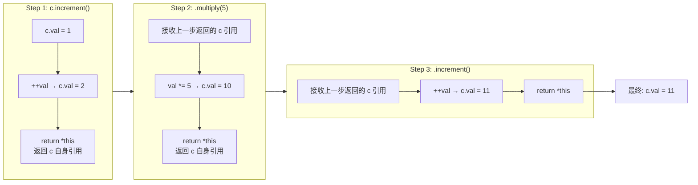

```cpp
int main() {
    Chain c(1);
    c.increment().multiply(5).increment();  // ((1+1)*5)+1 = 11

    // 等价于分步写:
    // c.increment();       // c.val = 2
    // c.multiply(5);       // c.val = 10
    // c.increment();       // c.val = 11
    return 0;
}
```

> **关键点**：返回类型必须是 `Chain&`（引用）而非 `Chain`（值）。返回值会创建临时副本，后续 `.multiply(5)` 操作的是副本而非原对象，链式调用将失效。

**const 成员函数与 this**

const 成员函数中 `this` 的类型变为 `const T* const`——既不能修改对象，也不能让 this 指向别处。

```cpp
class ConstDemo {
    int value;
public:
    ConstDemo(int v) : value(v) {}

    // 非 const 函数：this 类型为 ConstDemo* const
    ConstDemo& setValue(int v) {
        this->value = v;    // 可以修改成员
        return *this;
    }

    // const 函数：this 类型为 const ConstDemo* const
    int getValue() const {
        // this->value = 10;  // 错误！const 函数不能修改成员
        return this->value;   // 可以读取
    }

    // const 函数中 this 指针本身的类型
    void demoThisType() const {
        const ConstDemo* p = this;   // this 可隐式转为 const T*
        // ConstDemo* p2 = this;     // 错误！不能丢掉 const
    }
};
```

**const 重载**

同名函数可同时提供 const 和非 const 版本，编译器根据调用对象的 constness 自动选择：

```cpp
class Accessor {
    int data[100];
public:
    // 非 const 版本：返回可修改引用
    int& at(size_t i) {
        return data[i];
    }
    // const 版本：返回只读引用
    const int& at(size_t i) const {
        return data[i];
    }
};

void demo() {
    Accessor a;
    a.at(0) = 42;          // 调用非 const 版本，可以赋值

    const Accessor& ref = a;
    // ref.at(0) = 42;     // 错误！调用 const 版本，返回 const int&
    int x = ref.at(0);     // 没问题，只读访问
}
```

**其他用法**

```cpp
class Utility {
    int id;
public:
    Utility(int i) : id(i) {}

    // 比较是否同一对象
    bool isSameObject(const Utility& other) const {
        return this == &other;
    }

    // 自赋值保护（拷贝赋值运算符的经典模式）
    Utility& operator=(const Utility& other) {
        if (this != &other) {
            id = other.id;
        }
        return *this;
    }

    // delete this（仅当对象由 new 分配时安全）
    void destroy() {
        delete this;  // 调用后对象消亡，不能再访问任何成员
    }
};
```

this指针的使用场景总结：
  1. 区分成员变量和参数同名的情况（`this->x = x`）
  2. 返回 `*this` 以支持链式调用（返回 `T&`）
  3. 返回对象自身的指针/引用
  4. 判断参数是否为当前对象自身（`this == &other`）
  5. 自赋值保护（`if (this != &other)`）
  6. 在模板中获取派生类的类型（CRTP 模式，参见 [[08_面向对象(四)运算符重载]]）
  7. const 重载：根据调用对象的 constness 选择不同版本

### 构造/析构函数中 this 与虚函数调用的特殊行为

在构造和析构期间，vptr 处于"正在被更新"的过渡状态。此时通过 `this` 调用虚函数，不会发生多态分发——始终调用**当前类自己**的版本，而非派生类的覆盖版本。

```cpp
#include <iostream>

class Base {
public:
    Base() {
        // 此时 vptr 指向 Base 的 vtable（Derived 的部分尚未构造）
        this->report();   // 调用的是 Base::report()，不是 Derived::report()
        std::cout << "  (构造中 this=" << this << ")" << std::endl;
    }

    virtual void report() const {
        std::cout << "Base::report()";
    }

    virtual ~Base() {
        // 此时 vptr 又恢复为 Base 的 vtable（Derived 的析构已执行完毕）
        this->report();   // 同样调用 Base::report()
        std::cout << "  (析构中 this=" << this << ")" << std::endl;
    }
};

class Derived : public Base {
public:
    Derived() {
        // 此时 vptr 已更新为 Derived 的 vtable
        this->report();
        std::cout << "  (Derived 构造中 this=" << this << ")" << std::endl;
    }

    void report() const override {
        std::cout << "Derived::report()";
    }

    ~Derived() {
        this->report();
        std::cout << "  (Derived 析构中 this=" << this << ")" << std::endl;
    }
};

int main() {
    Derived d;
    // 输出顺序：
    // Base::report()  (构造中 this=0x7fff...)  ← Base 构造时 vptr 指向 Base vtable
    // Derived::report()  (Derived 构造中 this=0x7fff...) ← Derived 构造时 vptr 已切换
    // ... main 结束 ...
    // Derived::report()  (Derived 析构中 this=0x7fff...) ← 先析构 Derived
    // Base::report()  (析构中 this=0x7fff...)          ← vptr 回退到 Base vtable
}
```

**原理——vptr 的构造/析构时间线：**

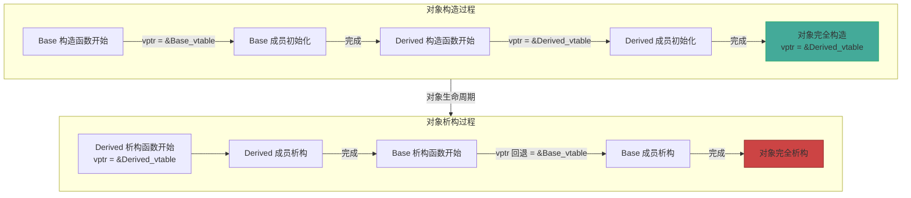

> 汇编知识预备：vptr 的汇编层切换机制见 [[07_面向对象(三)多态与虚函数]] 和 [[../汇编基础/ASM_03_C++在汇编层的体现]]。核心原理：构造/析构时编译器插入的 vptr 赋值指令是逐级执行的，每一级构造函数开始时将 vptr 指向本级的 vtable。

### this 作为 C 回调的桥梁（static + void* 模式）

C++ 成员函数有隐含的 `this` 参数，而 C API 的回调函数通常只接受 `void*` 上下文参数。将二者桥接是混合编程的核心技巧。

```cpp
#include <iostream>
#include <pthread.h>

class Worker {
private:
    int id;
    int progress;

    // ═══ 核心：真正的线程入口（非静态成员函数，有 this） ═══
    void run() {
        for (int i = 0; i <= 100; i += 20) {
            progress = i;
            std::cout << "[Worker " << id << "] 进度: " << progress << "%"
                      << " (this=" << this << ")" << std::endl;
            // 模拟工作...
        }
    }

public:
    Worker(int _id) : id(_id), progress(0) {}

    // ═══ 第一步：静态包装函数——与 C 回调签名兼容 ═══
    static void* threadFunc(void* arg) {
        Worker* self = static_cast<Worker*>(arg);  // void* → Worker*
        self->run();       // ← 通过 this 调用真正的成员函数
        return nullptr;
    }

    void start() {
        // ═══ 第二步：将 this 作为 void* 传给 C API ═══
        pthread_t t;
        pthread_create(&t, nullptr, threadFunc, this);  // this → void*
        //                       静态函数^       ^——this 在这里作为上下文传递
        pthread_join(t, nullptr);
    }
};

int main() {
    Worker w(42);
    w.start();
    return 0;
}
```

**原理——回调桥接的三步模式：**

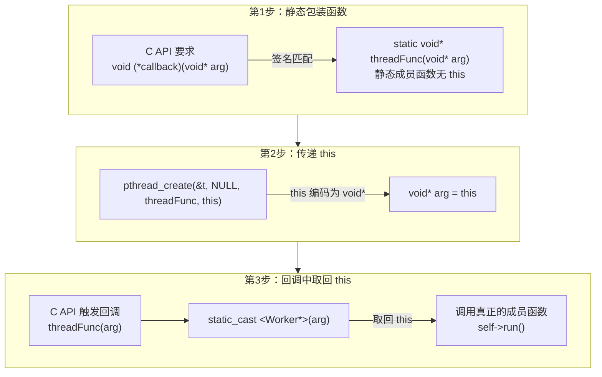

这个模式不仅用于 pthread，还广泛用于：
- `qsort(base, nmemb, size, compare)` → `this` 传入 `static int cmp(const void*, const void*)`
- `signal(SIGINT, handler)` → 通过全局变量或 `sigaction` 的 `sa_sigaction` 传递上下文
- GUI 框架的事件循环 → Win32 `SetWindowLongPtr(hwnd, GWLP_USERDATA, (LONG_PTR)this)`
- 任何接受 `void* userdata` 参数的 C 库回调

> 汇编知识预备：`pthread_create` 最终触发 `clone` 系统调用。新线程获得独立的栈空间，但 `this` 指针的值（地址）与创建线程看到的完全相同——因为对象在堆/数据段上，地址空间是线程共享的。详见 [[../汇编基础/04_控制流与系统调用]]。

### 模板依赖名称中必须写 this->

在类模板中，当基类依赖于模板参数时，编译器对基类成员的名称查找规则会发生变化——必须显式写 `this->` 或 `Base<T>::` 来声明"我知道这个名字来自基类"。

```cpp
#include <iostream>

// 普通继承——不写 this-> 也没问题，因为基类不依赖模板参数
class NormalBase {
protected:
    int value = 42;
};
class NormalDerived : public NormalBase {
public:
    void print() {
        std::cout << value;  //  编译器知道 value 来自 NormalBase
    }
};

// ═══ 模板继承——不写 this-> 会编译失败 ═══
template <typename T>
class Base {
protected:
    T data;
public:
    void reset() { data = T(); }
};

template <typename T>
class Derived : public Base<T> {
public:
    void process() {
        // data = T{};         //  编译错误！编译器不认为 data 来自 Base<T>
                                //    它会在全局作用域查找 data → 找不到 → 报错

        this->data = T{};      //  显式告诉编译器：data 是基类成员
        this->reset();         //  同理，reset() 也需要 this->

        // 也可以写：
        // Base<T>::data = T{};
        // Base<T>::reset();
    }
};

int main() {
    Derived<int> d;
    d.process();
    return 0;
}
```

**原理——两阶段名称查找（Two-Phase Name Lookup）：**

编译器对模板的处理分两个阶段：

| 阶段 | 时机 | 做什么 | 对 this 的影响 |
|:-----|:-----|:------|:------|
| 第一阶段 | 模板**定义**时 | 查找不依赖模板参数的名称 | 不涉及（此时 `T` 未知） |
| 第二阶段 | 模板**实例化**时 | 检查依赖名称 + 实例化完整代码 | 需要 `this->` 以明确查找范围 |

当写 `Base<T>` 时，`T` 是模板参数，所以 `Base<T>` 是一个"依赖名称"（dependent name）。编译器在第一阶段无法确定 `Base<T>` 的具体内容——因为用户可能对某个 `T` 做了 `Base<T>` 的特化。因此它**默认不查找**依赖基类中的名称，除非你用 `this->` 或 `Base<T>::` 明确告诉它。

```cpp
// 如果允许不写 this->，就会出现以下歧义：
template <typename T>
class Derived : public Base<T> {
    void process() {
        reset();  // 这是调用 Base<T>::reset() 还是 ::reset()（全局函数）？
                  // 编译器在第一阶段看到 reset，无法判断，因此规则强制要求 this->
    }
};
```

> 这是一个保护机制——防止依赖基类的成员和全局名称之间产生歧义。规则本身很简单：**只要基类是模板依赖的，访问基类成员就加 `this->`**。

### 返回 this 裸指针

链式调用返回的是 `*this` 的引用（`T&`）；有时需要返回**裸指针** `this` 本身（不是 `*this`），用于工厂模式、容器插入等场景。

```cpp
#include <iostream>
#include <list>

class Node {
    int value;
public:
    Node(int v) : value(v) {}

    int getValue() const { return value; }

    // 返回 this 指针——让调用者拿到对象本身的地址
    Node* getPtr() {
        return this;        // 返回指向自己的裸指针
    }

    const Node* getPtr() const {
        return this;        // const 版本返回 const Node*
    }

    // 典型用法：将自己注册到外部容器中
    Node* registerInto(std::list<Node*>& registry) {
        registry.push_back(this);  // 将 this 指针存入链表
        return this;               // 同时返回 this 以支持链式调用
    }

    static void printAll(const std::list<Node*>& registry) {
        for (const Node* n : registry) {
            std::cout << n->value << " (this=" << n << ")" << std::endl;
        }
    }
};

int main() {
    Node a(10), b(20), c(30);

    std::list<Node*> reg;
    a.registerInto(reg)->getPtr();   // 注册 + 链式拿到自己指针
    b.registerInto(reg);
    c.registerInto(reg);

    Node::printAll(reg);
    // 输出：
    // 10 (this=0x7fff...a的地址)
    // 20 (this=0x7fff...b的地址)
    // 30 (this=0x7fff...c的地址)

    return 0;
}
```

**`return this` vs `return *this`——汇编层的区别：**

```cpp
// T*  func() { return this; }
// 汇编：
//   mov rax, rdi      ; 把 this 指针值直接返回（一个地址值）
//   ret

// T&  func() { return *this; }
// 汇编：
//   mov rax, rdi      ; 同样把 this 指针值返回
//   ret
//   ↑ 从汇编看，二者完全一样——都是将 rdi 的值复制到 rax
//     区别仅在 C++ 类型系统层面：一个是指针类型(T*)，一个是引用类型(T&)
```

> **本质**：`this` 是一个指针值（对象的地址）。`return this` 返回这个地址，`return *this` 先解引用再返回引用——但在底层，引用本质上也是通过地址实现的。区别仅在于调用方的语法：`obj.getPtr()` 拿到的是指针 → 用 `->` 访问；`obj.getRef()` 拿到的是引用 → 用 `.` 访问。

### this 的地址用于调试与日志

在排查多对象交互的 bug 时，打印 `this` 值可以区分"究竟哪个对象在执行这段代码"。

```cpp
#include <iostream>
#include <cstdio>     // printf
#include <sstream>

class Tracked {
    std::string name;
    static int aliveCount;
public:
    Tracked(const std::string& n) : name(n) {
        aliveCount++;
        // printf 直接输出 this 的十六进制地址
        printf("[构造] name=%-10s this=%p  存活=%d\n",
               name.c_str(), this, aliveCount);
    }

    ~Tracked() {
        aliveCount--;
        printf("[析构] name=%-10s this=%p  存活=%d\n",
               name.c_str(), this, aliveCount);
    }

    void doWork() const {
        // 使用 C++ 流输出 this
        std::cout << "[doWork] name=" << name
                  << " this=" << this << std::endl;
        //                  ^^^^ 流会自动将 this 格式化为十六进制
    }
};

int Tracked::aliveCount = 0;

void verifySame(const Tracked& a, const Tracked& b) {
    printf("a=%p  b=%p  ", &a, &b);
    if (&a == &b) {
        printf("→ 是同一个对象\n");
    } else {
        printf("→ 不同对象（相差 %td 字节）\n",
               reinterpret_cast<const char*>(&a) -
               reinterpret_cast<const char*>(&b));
    }
    // 注：只有同一数组内的两个元素，指针相减才有定义的语义
    // 这里仅作调试用
}

int main() {
    Tracked t1("Alpha");
    Tracked t2("Beta");

    t1.doWork();
    t2.doWork();

    verifySame(t1, t1);  // 同一个对象
    verifySame(t1, t2);  // 不同对象

    return 0;
}
```

输出示例：
```cpp
[构造] name=Alpha      this=0x7ffc1a2b3c40  存活=1
[构造] name=Beta       this=0x7ffc1a2b3c80  存活=2
[doWork] name=Alpha this=0x7ffc1a2b3c40
[doWork] name=Beta this=0x7ffc1a2b3c80
a=0x7ffc1a2b3c40  b=0x7ffc1a2b3c40  → 是同一个对象
a=0x7ffc1a2b3c40  b=0x7ffc1a2b3c80  → 不同对象（相差 64 字节）
[析构] name=Beta       this=0x7ffc1a2b3c80  存活=1
[析构] name=Alpha      this=0x7ffc1a2b3c40  存活=0
```

**this 地址的调试价值：**
- `printf("%p", this)` — 确认析构/构造的匹配关系（B 析构之后再析构 A）
- `sizeof` 推断 — 如果两个同类对象地址相差某固定值，很可能就是 `sizeof(T)` + 对齐
- 多线程调试 — 通过 `this` 确认某个回调是否在预期的对象上执行
- 内存泄漏排查 — 结合 valgrind，发现"被泄漏对象的 this 值与某次构造日志中的 this 值一致"

> **注意**：`this` 的值 = 对象首地址。对于有虚函数的类，`this` = vptr 的地址（vptr 在偏移 0 处）。因此打印 `this` 实际上也是在打印 vptr 所在的地址。

### this 与成员函数指针的结合调用

成员函数指针不能独立调用——必须绑定到一个具体对象（即提供 `this`）。这个过程揭示了 `this` 的根本角色。

```cpp
#include <iostream>

class Button {
    std::string label;
public:
    Button(const std::string& lbl) : label(lbl) {}

    void click()    { std::cout << label << " 被点击 (this=" << this << ")" << std::endl; }
    void dblClick() { std::cout << label << " 被双击 (this=" << this << ")" << std::endl; }
    void rightClick(){ std::cout << label << " 右键菜单 (this=" << this << ")" << std::endl; }
};

// 定义一个事件类型：成员函数指针 + 调用它的对象
using Event = void (Button::*)();   // 成员函数指针类型

void dispatch(const Button& btn, Event ev) {
    (btn.*ev)();   // 通过对象 .* 调用成员函数指针
    //  ↑ 这就是在提供 this！
}

int main() {
    Button btnOK("确定按钮");
    Button btnCancel("取消按钮");

    Event events[] = {&Button::click, &Button::dblClick, &Button::rightClick};

    for (Event ev : events) {
        dispatch(btnOK, ev);     // this = &btnOK
        dispatch(btnCancel, ev); // this = &btnCancel
    }
    return 0;
}
```

**原理——成员函数指针调用的底层：**

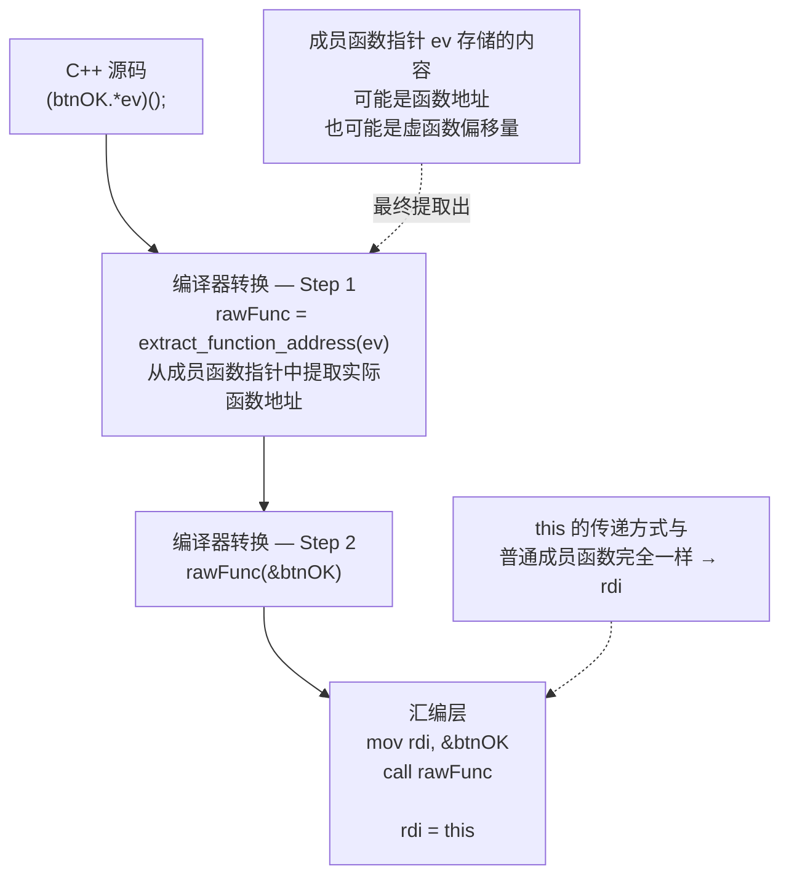

> 成员指针（`.*` / `->*`）的完整语法与跳转表用法详见本章 [[#2.17 成员指针（.* 和 ->* 操作符）]]；虚函数表与成员函数指针的关系见 [[07_面向对象(三)多态与虚函数]]。

### this 指针用法完整补充总结

| 用法 | 语法 | 本质 | 章节 |
|:-----|:-----|:-----|:------|
| 区分成员与参数 | `this->x = x` | 通过显式解引用区分作用域 | [[#原理2-3]] |
| 链式调用 | `return *this;` | 返回引用避免拷贝 | [[#链式调用]] |
| const 成员函数 | `void f() const` | this 类型变为 `const T* const` | [[#const 成员函数与 this]] |
| const 重载 | 同名 const + 非 const | 编译器根据对象 constness 选择 | [[#const 重载]] |
| 自赋值保护 | `if (this != &other)` | 比较地址防止自我操作 | [[#其他用法]] |
| 对象身份判断 | `this == &other` | 判断是否同一个对象 | [[#其他用法]] |
| delete this | `delete this` | 自销毁（仅限 new 分配的对象） | [[#其他用法]] |
| 构造/析构中虚函数 | `this->virtual()` | vptr 处于过渡状态，不分发到派生类 | [[#构造析构中的this]] |
| C 回调桥接 | `static + void* + this` | 将 this 编码为 void* 传给 C API | [[#this 作为 C 回调的桥梁]] |
| 模板依赖名称 | `this->baseMember` | 两阶段查找需显式指明来源 | [[#模板依赖名称中必须写 this-]] |
| 返回裸指针 | `return this;` | 返回对象地址，工厂/注册模式 | [[#返回 this 裸指针]] |
| 调试输出 | `printf("%p", this)` | 打印对象地址追踪生命周期 | [[#this 的地址用于调试与日志]] |
| 绑定成员函数指针 | `(obj.*mfp)()` | 将 this 显式绑定到成员函数指针 | [[#this 与成员函数指针的结合调用]] |

> 以上所有用法依赖于同一个底层事实：**`this` 是编译器自动传递给每个非静态成员函数的第一个隐式参数，其值恒等于调用该函数的对象的地址**。汇编层通过 rdi（System V）或 rcx（Microsoft x64）传递。

---

> ** 即时练习**

> **选择题1**：以下链式调用代码存在什么问题？

```cpp
class Bad {
    int v;
public:
    Bad inc() { ++v; return *this; }  // 注意：返回 Bad 而非 Bad&
    int get() const { return v; }
};
Bad b; b.inc().inc();
```

> A. 编译错误　B. 第二个 `inc()` 在临时对象上调用，不影响 b　C. b.v 最终等于 2　D. 运行时报错

> [!NOTE]- 答案
> **B**。`inc()` 返回 `Bad`（值类型），产生临时副本。第二个 `.inc()` 修改的是该临时副本，`b` 本身只被修改了一次。正确做法是返回 `Bad&`。详解：初始b.v=0;return this 返回的是函数本身的返回类型，因为类型是Bad值类型，所以在b.inc()的时候，编译器会自动拷贝构造一个tmp()，此时b.v=1返回的是tmp.v=1。第二次.inc()是对tmp()进行操作因此tmp.v进行+1,而不是b.v+1,在进程结束的时候tmp也会跟着结束，所以最终返回结果还是b.v=1。如果使用b&的话，因为引用类型不产生拷贝，所以在第二次inc()的时候会找到原来的地址，修改的还是同一个对象。

> **判断题1**：const 成员函数中，`this` 的类型是 `const T* const`，因此不能通过 `this` 调用其他非 const 成员函数。 （ ）

> [!NOTE]- 答案
> **正确**。const 成员函数中 `this` 是 `const T*`，若调用非 const 成员函数相当于丢掉 const 限定，编译器会报错。

> **判断题2**：`delete this` 是安全的，因为 C++ 标准保证对象生命周期由程序员控制。 （ ）

> [!NOTE]- 答案
> **错误**。`delete this` 仅在对象由 `new` 分配且调用后不再访问任何成员时才安全。栈对象或全局对象上调用 `delete this` 导致未定义行为。绝大多数场景下应避免使用。

---

2.6 const成员函数与常数据成员
------------------------------------

### 为什么 `const` 要放在 `()` 之后？

```cpp
class Foo {
public:
    int  getValue()        { return val; }   // 非const成员函数
    int  getValue() const  { return val; }   // const成员函数——const 在 () 之后
    //              ^^^^^
    //              为什么不是 const int getValue() ？
};
```

**答案：因为这里的 `const` 修饰的不是返回值，而是 `this` 指针。**

C++ 的成员函数在编译时会被重写——编译器在参数列表最前面插入一个隐式的 `this` 参数。`const` 放在 `()` 之后，语法上意味着它修饰的是这个隐式参数，而不是返回值：

```cpp
C++ 源码：                    编译器转换后的等效签名：

int  getValue()               →  int  getValue(Foo* this);           // this 类型: Foo*
int  getValue() const         →  int  getValue(const Foo* this);     // this 类型: const Foo*
//              ^^^^^                              ^^^^^^
//              const 修饰 this → 承诺"这个函数不修改 *this"
```

如果 `const` 放在返回值前面（`const int getValue()`），它修饰的是返回值类型（返回一个不可修改的整数），对于值返回来说几乎没有实际意义。只有放在 `()` 之后，它才作用于 `this`，这才是 `const` 成员函数的真正含义。

**汇编层的证据——const 和非 const 完全一样，只是调用方的检查不同：**

```cpp
// getValue() 非 const：            getValue() const：
//   mov eax, [rdi]    ; 读this->val   mov eax, [rdi]    ; 读this->val（完全一样的指令！）
//   ret                                ret
//
// 区别不在函数体内，而在调用方：
//   const Foo obj;
//   obj.getValue();     ← 编译器检查：getValue() 是 const 的吗？是 → 放行
//   obj.setValue(5);    ← 编译器检查：setValue() 是 const 的吗？不是 → 报错
//
// "const" 是一个编译期承诺——函数体内不写修改操作，编译器在调用方做权限检查。
// 可执行文件里没有"const 检查指令"——const 是纯编译时概念。
```

### const 成员函数的规则

```cpp
#include <iostream>
#include <string>

class Sensor {
private:
    std::string id;
    double temperature;
    mutable int readCount;  // mutable: 即使在const函数中也可以修改

public:
    Sensor(const std::string& sensorId)
        : id(sensorId), temperature(0.0), readCount(0) { }

    void setTemperature(double t) {
        temperature = t;  // 非const函数可以修改任何成员
    }

    // const成员函数——this 类型为 const Sensor*
    double getTemperature() const {
        readCount++;      // 可以修改 mutable 成员
        // temperature = 0;  //  错误！const 函数不能修改非 mutable 成员
        return temperature;
    }

    // const重载——根据调用对象的constness自动选择
    std::string& getID() {
        std::cout << "Non-const getID called" << std::endl;
        return id;
    }

    const std::string& getID() const {
        std::cout << "Const getID called" << std::endl;
        return id;
    }

    int getReadCount() const { return readCount; }
};

int main() {
    Sensor s("TEMP001");
    s.setTemperature(25.5);

    std::cout << "Temp: " << s.getTemperature() << std::endl;
    std::cout << "ReadCount: " << s.getReadCount() << std::endl;

    // const对象只能调用const成员函数
    const Sensor cs("TEMP002");
    std::cout << "Temp: " << cs.getTemperature() << std::endl;
    // cs.setTemperature(30.0);  //  错误！const对象不能调用非const函数

    // const重载测试
    s.getID();   // 调用非const版本
    cs.getID();  // 调用const版本

    return 0;
}
```

**const 成员函数的关键规则：**

| 规则 | 说明 |
|:-----|:-----|
| const 对象 | 只能调用 const 成员函数，不能调用非 const 成员函数 |
| 非 const 对象 | 两者都能调用；存在 const 重载时优先匹配非 const 版本 |
| const 函数内 | 不能修改非 mutable 成员，不能调用非 const 成员函数 |
| 汇编层 | const 和非 const 函数生成的指令完全相同——"const"是编译期承诺 |

> 关于 `const T*` 与 `T* const` 的辨析（this 的两种 const 类型），详见 [[03_指针与引用#2.3 const 与指针的组合（四种组合）]]。

### 常数据成员（const 成员变量）

除了常成员函数，类的成员变量也可以声明为 `const`——这样的成员一旦初始化就**永远不可修改**。

```cpp
#include <iostream>
#include <string>

class ImmutableConfig {
    const int    maxConnections;    // 常数据成员——构造后不可改
    const std::string serverName;   // 常数据成员
    double timeout;                 // 普通成员，可以改

public:
    // 常数据成员必须在初始化列表中初始化
    ImmutableConfig(int max, const std::string& name, double t)
        : maxConnections(max), serverName(name), timeout(t) { }

    //  任何函数都不能修改 const 成员
    // void setMax(int m) { maxConnections = m; }  // 编译错误！

    int getMax()        const { return maxConnections; }
    const std::string& getServer() const { return serverName; }
    double getTimeout()       const { return timeout; }

    void setTimeout(double t) { timeout = t; }  // 非 const 成员可以修改
};

int main() {
    ImmutableConfig cfg(100, "api.example.com", 30.0);
    std::cout << cfg.getMax() << " " << cfg.getServer() << std::endl;
    cfg.setTimeout(60.0);  // OK——timeout 不是 const

    // cfg.maxConnections = 200;  //  编译错误！const 成员不可修改
    return 0;
}
```

**`const` 成员变量的核心要点：**

| 项目 | 说明 |
|:-----|:-----|
| 必须用初始化列表 | `const` 成员**必须**在初始化列表中初始化，不能在构造函数体内赋值 |
| 禁止任何修改 | 任何成员函数（包括非 const）都不能修改 `const` 成员 |
| C++11 NSDMI | 可以用类内初始化器：`const int max = 100;`（语法同 NSDMI，见 [[#2.13 类内成员初始化器 (NSDMI, C++11)]]） |
| 对象级 const | `const` 成员是对象级别的——不同的对象可以有**不同的值**（不像 `static` 是所有对象共享） |

**常成员函数 vs 常数据成员对比：**

| | 常成员函数 `f() const` | 常数据成员 `const int x;` |
|:---|:---|:---|
| 修饰谁 | `this` 指针（隐式参数） | 成员变量本身 |
| const 位置 | 在 `()` 之后 | 在类型前面 |
| 承诺什么 | 函数不修改 `*this` | 该成员值在对象生命周期内不变 |
| 初始化 | 不需要（函数无初始化概念） | 必须在初始化列表或 NSDMI 中 |
| 汇编层 | 函数体指令无区别，约束在编译期 | 变量存入 `.rodata` 段或受编译器写保护 |

### mutable——const 规则的"逃生口"

有时需要"大多数情况下不修改对象，但需要更新统计/缓存/锁"。`mutable` 允许在 const 成员函数中修改特定成员：

```cpp
class Cache {
    mutable int accessCount = 0;   // mutable → const 函数可以改
    mutable bool dirty = false;    // 标记缓存是否过期
    double data;

public:
    double getData() const {
        accessCount++;             // OK——mutable
        if (dirty) {
            // const_cast<Cache*>(this)->recompute(); // 不推荐的写法
            dirty = false;         // OK——mutable
        }
        return data;
    }
};
```

mutable 的典型场景：引用计数、读写锁（`mutable std::mutex`）、缓存标记、调试日志。核心原则：mutable 成员**不影响对象的逻辑常量性**。

> **总结**：`const` 在 `()` 之后 → 修饰 this 指针为 `const T*`（`this` 本身是隐含参数，位于参数列表之前，因此 `const` 要放在 `()` 的右边）。这是理解 const 成员函数一切行为的根。

2.7 static成员变量和静态成员函数
------------------------------------

```cpp
#include <iostream>

class Product {
private:
    std::string name;
    double price;

    static int totalProducts;     // 静态成员变量声明
    static double totalRevenue;   // 静态成员变量声明

public:
    Product(const std::string& n, double p) : name(n), price(p) {
        totalProducts++;
        totalRevenue += p;
    }

    ~Product() {
        totalProducts--;
    }

    // 静态成员函数——只能访问静态成员
    static int getTotalProducts() { return totalProducts; }
    static double getTotalRevenue() { return totalRevenue; }
    static double getAveragePrice() {
        if (totalProducts == 0) return 0.0;
        return totalRevenue / totalProducts;
    }

    // 静态成员函数中没有this指针！
    // 因此不能访问非静态成员
    // static void printName() { std::cout << name; }  // 错误！
};

// 静态成员变量必须在类外定义（分配存储空间）
int Product::totalProducts = 0;
double Product::totalRevenue = 0.0;

int main() {
    Product p1("Laptop", 999.99);
    Product p2("Phone", 699.99);
    Product p3("Tablet", 399.99);

    // 通过类名访问静态成员（推荐）
    std::cout << "Total products: " << Product::getTotalProducts() << std::endl;
    std::cout << "Total revenue: $" << Product::getTotalRevenue() << std::endl;
    std::cout << "Average price: $" << Product::getAveragePrice() << std::endl;

    // 也可以通过对象访问（不推荐）
    // std::cout << p1.getTotalProducts() << std::endl;  // 可以但不好

    return 0;
}
```

static成员底层原理：
  - 静态成员变量存储在全局数据段（.data或.bss），不属于任何对象
  - 静态成员变量的生命周期是整个程序运行期间
  - 静态成员函数没有this指针，因此是真正的"类级函数"
  - C++17起，静态成员变量可用inline在类内定义：
    `static inline int count = 0;  // C++17起可以在类内初始化`

### 静态成员函数可以类外定义吗？

**可以。** 静态成员函数既可以在类内定义，也可以在类外定义。与静态成员**变量**不同，静态成员**函数**没有"必须在类外定义"的要求——这是因为函数体本身只是代码段中的指令，不存在"分配存储空间"的问题。

```cpp
#include <iostream>

class Logger {
private:
    static int logCount;           // 静态成员变量——类内声明

public:
    // 方式一：类内定义（隐式 inline）
    static void info(const char* msg) {
        std::cout << "[INFO] " << msg << std::endl;
        logCount++;
    }

    // 方式二：类内声明——只写原型，不加函数体
    static void warn(const char* msg);
    static void error(const char* msg);
    static int  getLogCount();

    // 注意：非静态成员函数同样支持类内声明 + 类外定义
    // 这对静态 vs 非静态是一致的，没有特殊限制
};

// ====== 静态成员函数的类外定义 ======
// 关键：类外定义时****不加 static 关键字****！
// static 只在类内的声明处出现一次。

void Logger::warn(const char* msg) {       // 注意：前面没有 static
    std::cout << "[WARN] " << msg << std::endl;
    logCount++;
}

void Logger::error(const char* msg) {      // 注意：前面没有 static
    std::cout << "[ERROR] " << msg << std::endl;
    logCount++;
}

int Logger::getLogCount() {               // 注意：前面没有 static
    return logCount;
}

// ====== 静态成员变量仍需类外定义（C++17之前，或不用inline） ======
int Logger::logCount = 0;                  // 变量：必须类外定义（有 static 也不在此写）

int main() {
    Logger::info("服务器启动");     // 类内定义的 → OK
    Logger::warn("磁盘使用率 85%"); // 类外定义的 → 同样 OK
    Logger::error("连接超时");      // 类外定义的 → 同样 OK

    std::cout << "总日志数: " << Logger::getLogCount() << std::endl;  // 3
    return 0;
}
```

**为什么类外定义不加 `static`？**

`static` 关键字在不同上下文中含义不同：
- 在**类内**：`static` 表示该成员属于类而非对象（类级成员）
- 在**类外**（文件作用域）：`static` 表示内部链接（文件私有），限制函数/变量只能在当前翻译单元内访问

如果在类外定义时加上 `static`，编译器会将其解释为"该函数是文件私有的普通函数"，不再是类的成员函数——这完全改变了语义，导致链接错误：

```cpp
//  错误写法：
static void Logger::warn(const char* msg) { ... }
// static 在这里被解释为"内部链接的普通函数"，
// 但 `Logger::warn` 这个限定名又要求它是类成员——语义矛盾，编译失败
```

### 静态成员变量 vs 静态成员函数——定义规则对比

| | 静态成员变量 | 静态成员函数 |
|:---|:---|:---|
| 类内声明 | `static int count;`（不分配空间） | `static void func();`（声明原型） |
| 类内定义 | C++17 `static inline int count = 0;` | `static void func() { ... }`（隐式 inline） |
| 类外定义 | **必须**（C++17之前）：`int Foo::count = 0;` | **可选**：`void Foo::func() { ... }` |
| 类外是否写 `static` | 不写 | 不写 |
| 底层原因 | 变量需要一处唯一的存储空间（ODR规则） | 函数体只需存在于代码段一次，类似普通函数 |

> **一句话总结**：静态成员变量默认"类内声明、类外定义"（C++17 inline 可合并）；静态成员函数可在类内也可在类外定义，和普通成员函数一样——关键区别在于**类外定义时不要重复写 `static`**。

### 静态成员变量可以在构造函数中初始化吗？

**不能。** 这是初学者极易混淆的问题。构造函数的职责是为**某个对象实例**的成员做初始化，而静态成员属于**整个类**，不属于任何对象。把静态成员的初始化放在构造函数中，逻辑上就不对——每创建一个对象，静态成员就被重置一次，完全失去了"类级共享"的意义。

【语法层面的限制】

```cpp
class Counter {
    static int count;        // 类内声明
public:
    //  错误：初始化列表不能包含静态成员
    // Counter() : count(0) { }   // 编译错误！count 不是非静态成员

    // ️ 可以编译通过，但语义错误：
    Counter() {
        count = 0;           // 每创建一个对象就把 count 重置为 0
    }                        // p1,p2,p3 创建后 count 始终为 0，完全失去计数功能
};
```

**为什么初始化列表不接受静态成员？**

初始化列表的语法定义就是 `: 非静态成员名(初始值)`。编译器查找类中的非静态成员列表——`count` 是静态的，不在其中，直接报错。这不是"不建议写"而是"根本写不进去"。

【构造函数体中的赋值 vs 初始化】

```cpp
class Product {
    static int total;        // 声明
private:
    std::string name;
public:
    Product(const std::string& n) : name(n) {
        total++;             //  赋值——前提是 total 已在类外正确定义+初始化
    }
    static int getTotal() { return total; }
};

int Product::total = 0;      // ← 真正的初始化发生在这里，只执行一次

int main() {
    Product a("A");           // total: 0→1
    Product b("B");           // total: 1→2
    Product c("C");           // total: 2→3
    // 正确输出 3
}
```

`total++` 可以写在构造函数体内，但这不是初始化，而是**修改一个已经初始化过的变量**。初始值 `0` 来自类外定义那一行——它只执行一次，在 main 之前。

【隐蔽陷阱：构造函数内声明同名局部静态变量】

```cpp
class Counter {
    static int count;           // 类的静态成员声明
public:
    Counter() {
        static int count = 0;   // ️ 这不是类的静态成员！
                                // 这是构造函数内的局部静态变量，作用域仅限于该函数体
        count++;                // 修改的是局部变量，与类成员 Counter::count 毫无关系
    }
};

int Counter::count = 0;         // 类的静态成员——在构造函数中完全没被用到

int main() {
    Counter c1, c2, c3;
    std::cout << Counter::getCount();  // 输出 0——因为构造函数改的是局部变量
}
```

构造函数内部的 `static int count` 声明了一个**函数级局部静态变量**（生命周期是整个程序，但作用域仅在该构造函数内）。它和类的静态成员 `Counter::count` 同名但**完全不是同一个东西**。编译器不会报错，但行为完全错误——属于最隐蔽的 bug。

【正确 vs 错误速查表】

| 写法 | 位置 | 本质 | 编译 | 语义 |
|:-----|:-----|:-----|:----|:-----|
| `int Foo::count = 0;` | 类外 | 唯一一次初始化 |  |  |
| `static inline int count = 0;` | 类内 C++17 | 唯一一次初始化 |  |  |
| `count++` | 构造函数体 | 累加已初始化的值 |  |  （计数场景） |
| `count = 0` | 构造函数体 | 每次构造都重置 |  |  （破坏共享语义） |
| `: count(0)` | 初始化列表 | 尝试初始化静态成员 |  | — |
| `static int count = 0;` | 构造函数体 | 声明了一个同名局部静态变量 |  |  （完全无关的变量） |

> **核心原则**：静态成员变量的初始化 = 在全局作用域中分配唯一一份存储空间。构造函数是"每个对象出生时跑一次"的东西，**没有资格**做这件事。要修改静态成员可以（在构造函数体中赋值），但真正的初始化只能发生在类外定义或 C++17 `static inline` 处。

2.8 explicit关键字（阻止隐式转换）
------------------------------------

```cpp
#include <iostream>

class Dollar {
private:
    double amount;
public:
    // 没有explicit——允许隐式转换
    Dollar(double amt) : amount(amt) {
        std::cout << "Dollar constructed from double: " << amt << std::endl;
    }

    double getAmount() const { return amount; }
};

class ExplicitDollar {
private:
    double amount;
public:
    // 使用explicit——禁止隐式转换
    explicit ExplicitDollar(double amt) : amount(amt) {
        std::cout << "ExplicitDollar constructed from double: " << amt << std::endl;
    }

    double getAmount() const { return amount; }
};

void processDollar(const Dollar& d) {
    std::cout << "Processing: $" << d.getAmount() << std::endl;
}

void processExplicitDollar(const ExplicitDollar& d) {
    std::cout << "Processing: $" << d.getAmount() << std::endl;
}

int main() {
    Dollar d1(99.99);     // 直接构造，OK
    Dollar d2 = 199.99;   // 隐式转换，OK（因为没有explicit）

    processDollar(299.99);  // 隐式转换：double → Dollar，OK
    // 这行代码悄悄地创建了一个临时Dollar对象，可能不是程序员的本意

    ExplicitDollar ed1(99.99);     // 直接构造，OK
    // ExplicitDollar ed2 = 199.99;   // 错误！explicit禁止隐式转换
    // processExplicitDollar(299.99); // 错误！explicit禁止隐式转换

    ExplicitDollar ed3 = ExplicitDollar(199.99);  // 显式转换，OK
    processExplicitDollar(ExplicitDollar(299.99)); // 显式转换，OK

    return 0;
}
```

explicit的建议：
  大多数单参数构造函数都应该加explicit，除非你明确希望支持隐式转换。
  这样可以防止意外的类型转换带来的bug。

explicit也可用于转换运算符（C++11起）：
```cpp
class Wrapper {
    int value;
public:
    Wrapper(int v) : value(v) {}
    explicit operator int() const { return value; }  // 需要显式转换
    operator bool() const { return value != 0; }     // 允许隐式转bool
};

// Wrapper w(42);
// int x = w;         // 错误！explicit operator int()
// int x = int(w);    // OK，显式转换
// int x = static_cast<int>(w); // OK
// if (w) { ... }     // OK，operator bool() 非explicit
```

### 转换构造函数 —— 隐式转换的双刃剑

未被 `explicit` 修饰的**单参数构造函数**就是**转换构造函数**（converting constructor）。它允许编译器将其他类型**隐式转换**为本类类型。

```cpp
class MyInt {
    int val;
public:
    MyInt(int v) : val(v) {}  // ← 转换构造函数（无 explicit，单参数）
    // 允许：MyInt x = 42;     // 42 → MyInt(42) 隐式转换
};

// 这在运算符重载中至关重要——它使得混合类型运算成为可能：
// MyInt a(5);
// MyInt b = a + 10;  // 10 → MyInt(10) 隐式转换 → 成功
// MyInt c = 10 + a;  // 编译错误！10 没有成员 operator+，且无全局 operator+(int, MyInt)
```

转换构造函数的核心使用场景：
- **运算符重载的混合类型运算** — 让自定义类型能与基础类型进行运算（见 [[08_面向对象(四)运算符重载#原理2-6]]）
- **函数参数的类型适配** — `void f(const MyString& s); f("hello");` — C 字符串隐式转为 MyString
- **容器初始化** — `std::vector<MyString> v = {"a", "b", "c"};`

转换构造函数的风险：隐式转换发生在程序员不注意的地方——可能产生临时对象、降低性能、掩盖 bug。这正是 `explicit` 存在的理由——想用转换就显式调用，不想被意外转换就加 `explicit`。

> 转换构造函数与运算符重载的交互机制见 [[08_面向对象(四)运算符重载#原理2-6]]。

2.9 =`default` 和 =`delete` (C++11)
------------------------------------

```cpp
#include <iostream>

// =default: 显式要求编译器生成默认版本
class DefaultDemo {
public:
    DefaultDemo() = default;                        // 默认构造
    DefaultDemo(const DefaultDemo&) = default;      // 拷贝构造
    DefaultDemo& operator=(const DefaultDemo&) = default;  // 拷贝赋值
    ~DefaultDemo() = default;                       // 析构
};

// =delete: 显式禁用某个函数
class NonCopyable {
public:
    NonCopyable() = default;

    // 禁用拷贝构造和拷贝赋值
    NonCopyable(const NonCopyable&) = delete;
    NonCopyable& operator=(const NonCopyable&) = delete;

    // 允许移动
    NonCopyable(NonCopyable&&) = default;
    NonCopyable& operator=(NonCopyable&&) = default;
};

// =delete 还可以用来禁用特定的隐式转换
class OnlyInt {
public:
    OnlyInt(int value) : val(value) {}
    OnlyInt(double) = delete;          // 禁止从double构造
    OnlyInt(char) = delete;            // 禁止从char构造
    // OnlyInt(long) = delete;         // 需要时也可以禁用long

    int getVal() const { return val; }
private:
    int val;
};

int main() {
    NonCopyable obj1;
    // NonCopyable obj2 = obj1;  // 错误：拷贝构造已删除
    // NonCopyable obj3(obj1);   // 错误：拷贝构造已删除

    NonCopyable obj2 = std::move(obj1);  // OK，移动构造

    OnlyInt oi1(42);     // OK
    // OnlyInt oi2(3.14);   // 错误：从double构造已删除
    // OnlyInt oi3('A');    // 错误：从char构造已删除

    return 0;
}
```

=`default` 的应用场景：
  1. 当自定义了其他构造函数，但仍需要编译器生成的默认构造
  2. 显式声明意图，让代码可读性更好
  3. 可以在类外将=default用于定义（将实现放在.cpp文件中）

=`delete` 的应用场景：
  1. 禁止拷贝（单例模式、资源独占类）
  2. 禁止某些不安全的隐式转换
  3. 禁用模板的某些特化（第8章）
  4. 禁止在堆/栈上分配（配合new/delete运算符）

2.10 内联成员函数
------------------------------------

内联（inline）是一种以空间换时间的优化手段：编译器将函数体直接展开到调用点，消除函数调用的压栈/出栈开销。

```cpp
#include <iostream>

class Point {
private:
    int x, y;
public:
    Point(int a, int b) : x(a), y(b) {}

    // 方式一：类内定义（隐式内联）
    // 在类体内部定义的成员函数，编译器自动视为 inline 候选
    int getX() const { return x; }
    int getY() const { return y; }

    // 方式二：类外定义但显式声明 inline
    inline double distance() const;
};

// inline 必须出现在函数定义处（非声明处），通常与类定义放在同一头文件中
inline double Point::distance() const {
    return x * x + y * y;  // 简化：返回平方和
}

// ====== 内联的本质 ======
// 调用 p.getX() 时，编译器可能将其替换为直接访问 p.x，省去 call/ret 指令：
//
//   非内联：              内联展开后等效于：
//   mov rdi, &p           mov eax, [rbp-8]   ; 直接读 p.x
//   call Point::getX
//   ; getX内部: mov eax, [rdi]
//   ;           ret
//
// 内联是一种"请求"而非"命令"——编译器会根据函数体大小、优化级别等因素自行决定。
// GCC/Clang 中 -O0 默认不内联，-O2/-O3 会积极内联（包括未标注 inline 的小函数）。

int main() {
    Point p(3, 4);
    std::cout << "x=" << p.getX() << std::endl;  // 可能被内联展开
    return 0;
}
```

内联的核心要点：
  1. **类内定义 = 隐式 inline**：在类体内部实现的成员函数，编译器自动视为 inline 候选
  2. **inline 关键字**：若类外定义，需加 `inline` 关键字（且应放在头文件中，否则链接报错）
  3. **虚函数可以内联**：当通过对象（非指针/引用）调用虚函数时，编译器可以内联展开
  4. **递归函数通常不内联**：编译器很难对递归函数做内联展开（除非深度极浅的尾递归）
  5. **取函数地址会阻止内联**：若代码中取了某函数的地址，编译器必须生成一个实际函数体
  6. **过度内联的代价**：代码膨胀 → 指令缓存命中率下降，需权衡

> 关于内联的汇编层体现，参见 [[../ASM教程/07_编译原理]] — 了解编译器如何在内联和非内联之间做决策。

2.11 成员函数默认参数与函数重载
------------------------------------

默认参数和函数重载都是 C++ 中实现"同名函数、不同调用方式"的机制，两者可结合使用但有注意事项。

【默认参数】

```cpp
class Rectangle {
    double width, height;
public:
    Rectangle(double w = 1.0, double h = 1.0)  // 构造函数也可以有默认参数
        : width(w), height(h) {}

    // 成员函数带默认参数——默认参数从右向左连续给出
    void setSize(double w, double h = 0.0) {
        width = w;
        height = (h == 0.0) ? w : h;  // 若 h 未提供，设为正方形
    }

    // 注意：默认参数只能在声明处出现一次（要么在类内声明，要么在类外定义）
    void scale(double factor = 2.0);

    double area() const { return width * height; }
};

// 类外定义时，默认参数已经在前面的声明中指定——此处不能再写
void Rectangle::scale(double factor) {  // 不能写成 scale(double factor = 2.0)
    width  *= factor;
    height *= factor;
}
```

【函数重载】

同名函数，参数个数或类型不同，编译器根据实参选择最佳匹配（重载决议）。

```cpp
class Logger {
public:
    // 重载1：无参版本
    void log() {
        std::cout << "[INFO] (empty message)" << std::endl;
    }

    // 重载2：接收 C 风格字符串
    void log(const char* msg) {
        std::cout << "[INFO] " << msg << std::endl;
    }

    // 重载3：接收整数
    void log(int code) {
        std::cout << "[ERROR] Code: " << code << std::endl;
    }

    // 重载4：接收字符串 + 级别
    void log(const char* msg, int level) {
        const char* levels[] = {"DEBUG", "INFO", "WARN", "ERROR"};
        std::cout << "[" << levels[level] << "] " << msg << std::endl;
    }

    // const 重载（本章 2.7 已介绍）也是函数重载的一种形式
    // void log() const 与 void log() 可以是两个不同的函数
};

int main() {
    Logger logger;
    logger.log();               // 调用重载1
    logger.log("服务器启动");    // 调用重载2
    logger.log(404);            // 调用重载3
    logger.log("磁盘空间不足", 3);  // 调用重载4
    return 0;
}
```

【默认参数 vs 重载——二义性问题】

```cpp
class AmbiguityDemo {
public:
    void print(int x) {
        std::cout << "int: " << x << std::endl;
    }

    // 与上面不构成重载——参数类型/个数完全相同
    // void print(int x = 10);  // 错误！只有默认参数不同不算重载

    // 下面两个会在调用 print(42) 时产生歧义：
    void print(int x, double y = 0.0) {
        std::cout << "int+double: " << x << ", " << y << std::endl;
    }
    void print(int x, int y = 0) {
        std::cout << "int+int: " << x << ", " << y << std::endl;
    }
    // print(42);  // 编译错误！ambiguous——两个版本都匹配
};
```

重载决议的核心规则（简化版）：
  1. 候选函数：名字相同且调用点可见的所有函数
  2. 可行函数：参数个数匹配且每个实参可隐式转换到对应形参
  3. 最佳匹配：需要最少隐式转换的那个（若多个同样好 → 歧义报错）

2.12 递归成员函数
------------------------------------

成员函数可以在自身内部调用自己，形成递归。递归必须有终止条件，否则栈溢出。

```cpp
#include <iostream>

class Math {
public:
    // 递归1：阶乘——经典递归
    long long factorial(int n) const {
        if (n <= 1) return 1;          // 终止条件
        return n * factorial(n - 1);   // 递归调用自身
    }

    // 递归2：斐波那契数列（展示递归中的重复计算问题）
    long long fibonacci(int n) const {
        if (n <= 1) return n;          // 终止条件
        return fibonacci(n - 1) + fibonacci(n - 2);  // 两个递归分支
    }

    // 递归3：最大公约数（欧几里得/辗转相除法——尾递归示例）
    int gcd(int a, int b) const {
        if (b == 0) return a;    // 终止条件
        return gcd(b, a % b);    // 尾递归：递归调用是函数的最后一步操作
    }

    // 尾递归 vs 普通递归
    // 尾递归: return func(args...)  ← 编译器可优化为循环，不增加栈深度
    // 普通递归: return n * func(args...) ← 必须先算 func 再乘 n，必须保留栈帧
};

int main() {
    Math math;

    std::cout << "5! = " << math.factorial(5) << std::endl;       // 120
    std::cout << "fib(10) = " << math.fibonacci(10) << std::endl;  // 55
    std::cout << "gcd(48,18) = " << math.gcd(48, 18) << std::endl; // 6

    return 0;
}
```

递归的汇编层开销——每次递归调用都是真实的函数调用，需要压栈帧：

```cpp
// gcd(48, 18) 的递归展开:
gcd(48, 18) → push rbp / mov rbp, rsp / ... / call gcd(18, 12)
gcd(18, 12) → push rbp / mov rbp, rsp / ... / call gcd(12, 6)
gcd(12, 6)  → push rbp / mov rbp, rsp / ... / call gcd(6, 0)
gcd(6, 0)   → push rbp / mov rbp, rsp / ... / mov eax, 6 / ret
            ← ret / ret / ret 逐层返回
```

> 汇编知识预备：栈帧结构与 call/ret 底层机制见 [[../汇编基础/ASM_02_栈与调用约定]]。

递归使用注意事项：
  1. 必须要有终止条件（base case），否则无限递归导致栈溢出
  2. 每次递归都会在栈上分配新的栈帧，深度过大（通常 > 10000）会栈溢出
  3. 尾递归在开优化（-O2）时编译器可能优化为循环（消除栈帧累积）
  4. 递归的可读性通常优于迭代，但空间开销更大
  5. 可使用 `ulimit -s` 查看/设置栈大小（Linux 默认 8MB）

2.13 类内成员初始化器 (NSDMI, C++11)
------------------------------------

C++11 起，可以在声明成员变量时直接给出默认值（Non-Static Data Member Initializer）。

```cpp
#include <iostream>
#include <string>
#include <vector>

class Config {
    // 类内初始化——声明时直接赋值
    int maxConnections = 100;            // 基本类型
    std::string serverName = "localhost";// 类类型（调用拷贝/移动构造）
    double timeout = 30.0;
    bool debug = true;

    // 也可以用花括号初始化
    std::vector<int> ports{80, 443, 8080};

    // const 成员也可以用类内初始化（C++11）
    const int version = 3;

    int computed;  // 未给默认值——构造时必须初始化

public:
    // 默认构造——所有成员使用类内默认值
    Config() {
        std::cout << "Default config: "
                  << maxConnections << " max connections, "
                  << serverName << std::endl;
    }

    // 带参构造——初始化列表的值会覆盖类内默认值
    Config(int mc, const std::string& sn)
        : maxConnections(mc), serverName(sn), timeout(60.0), computed(0) {
        // maxConnections = 由参数 mc 决定（覆盖了类内100）
        // serverName     = 由参数 sn 决定（覆盖了类内"localhost"）
        // timeout        = 60.0（覆盖了类内30.0）
        // debug          = true（保持类内默认值——初始化列表没写它）
        // ports          = {80, 443, 8080}（保持类内默认值）
        // computed       = 0（初始化列表显式给出）
    }

    void print() const {
        std::cout << "maxConnections=" << maxConnections
                  << " server=" << serverName
                  << " timeout=" << timeout
                  << " debug=" << std::boolalpha << debug
                  << " version=" << version
                  << std::endl;
    }
};

int main() {
    Config c1;                 // 全用默认值
    c1.print();

    Config c2(200, "api.example.com");  // 部分覆盖
    c2.print();

    return 0;
}
```

类内初始化器的底层机制：
  - 类内 `int x = 10;` 等价于在**每个构造函数**的初始化列表中隐式添加 `x(10)`
  - 如果构造函数的初始化列表显式写了 `x(xxx)`，则覆盖默认值
  - 可以降低多个构造函数之间的代码重复（不用在每个初始化列表里都写一遍）

2.14 友元函数
------------------------------------

友元函数（friend function）是在类中用 `friend` 关键字声明的**非成员函数**，被授予访问该类 `private` 和 `protected` 成员的特殊权限。

**友元函数的核心特征——与成员函数的本质区别：**

| | 成员函数 | 友元函数 |
|:---|:---|:---|
| 是否属于类 | 是，类作用域内 | 否，是类外的普通函数 |
| 是否有 `this` 指针 | 有，通过 rdi/rcx 隐式传入 | **没有**，无法隐式访问对象 |
| 如何访问私有成员 | 通过 `this->` | 通过函数参数中**显式传入的对象** |
| 调用方式 | `obj.func()` | `func(obj)` —— 对象作为显式参数 |
| 是否用类作用域限定 | 定义时写 `T::func()` | 定义时**不写** `类名::` |
| 能否是另一个类的成员 | 只能属于本类 | **可以**（友元成员函数） |

```cpp
#include <iostream>
#include <string>

class BankAccount {
private:
    std::string owner;
    double balance;

    // ═══ 友元函数声明——在类内部，但有 friend 关键字 ═══
    friend void printBalance(const BankAccount& acc);
    //     ↑ 注意：这里是声明，不是定义。它声明的函数签名等同于：
    //       void printBalance(const BankAccount& acc)
    //       类的 { } 外面才是这个函数真正的作用域

public:
    BankAccount(const std::string& name, double initial)
        : owner(name), balance(initial) {}

    void deposit(double amount) { balance += amount; }
};

// ═══ 友元函数的定义——在类外，不加 friend，不加 BankAccount:: ═══
void printBalance(const BankAccount& acc) {
    //       友元函数通过参数 acc 访问私有成员 ↓
    std::cout << acc.owner << " 的余额: " << acc.balance << std::endl;
    // 注意：这里没有 this！acc.owner 是"通过对象 acc + 偏移量 0"直接寻址
}

int main() {
    BankAccount alice("Alice", 5000.0);
    printBalance(alice);    // 调用方式和普通函数一模一样
    return 0;
}
```

**友元函数的底层原理——为什么没有 this 也能访问私有成员？**

从汇编层面看，友元函数和普通函数**没有任何区别**——它没有通过 rdi 接收 this。编译器在编译时做的唯一一件事是：**在访问权限检查阶段放行它**。

```cpp
// printBalance 被编译后的汇编（x86-64）：
//
// 参数传递（System V ABI）：
//   rdi = &acc（第一个参数，对象地址）
//
// 访问 acc.owner（假设 owner 在偏移 0 处）：
//   mov  rsi, [rdi]        ; 读取 acc + 0 → std::string 的 data 指针
//   call puts              ; 输出
//
// 访问 acc.balance（假设 balance 在偏移 32 处）：
//   movsd xmm0, [rdi+32]   ; 读取 acc + 32 → double
//
// 编译器不生成任何"权限检查指令"——权限是编译时概念，不进运行时
```

**编译器的权限检查流程：**

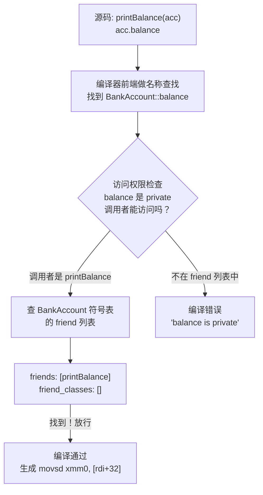

所以"友元"不是运行时机制——可执行文件里根本没有 `friend` 对应的指令。它纯粹是编译器的静态权限检查放行规则。

**多种形式的友元函数：**

```cpp
#include <iostream>

class Engine {
private:
    int horsepower = 200;
    bool running = false;

    // ═══ 形式1：友元全局函数 ═══
    friend void inspect(const Engine& e);

    // ═══ 形式2：另一个类的成员函数作为友元 ═══
    // 只有 Mechanic::repair 能访问 Engine 的私有成员（不是整个 Mechanic 类）
    friend void Mechanic::repair(Engine& e);

    // ═══ 形式3：友元函数模板 ═══
    template <typename T>
    friend bool compare(const T& a, const T& b);

public:
    int getHorsepower() const { return horsepower; }
};

// 友元全局函数的定义
void inspect(const Engine& e) {
    std::cout << "马力: " << e.horsepower              // 访问私有
              << " 运行: " << (e.running ? "是" : "否") // 访问私有
              << std::endl;
}

// 友元函数模板的定义
template <typename T>
bool compare(const T& a, const T& b) {
    return a.horsepower == b.horsepower;  // 可以访问 Engine 的私有
}

int main() {
    Engine e1;
    inspect(e1);                    // 全局函数 → 被授予访问权
    Engine e2;
    // compare(e1, e2);             // 函数模板 → 被授予访问权
    return 0;
}
```

**友元关系三大特性——从底层解释原因：**

| 特性 | 含义 | 底层原因 |
|:-----|:-----|:-----|
| **单向** | A 声明 B 为友元 → B 可访问 A 的 private；但 A 不能访问 B 的 private | 编译器只在 A 的符号表中记录 B 在 friend 列表里，B 的符号表中没有 A |
| **不传递** | A 是 B 的友元，B 是 C 的友元 ≠> A 是 C 的友元 | 每个类的 friend 列表独立维护，不存在沿继承链或友元链的传递遍历 |
| **不继承** | 基类的友元不会自动成为派生类的友元 | 派生类的符号表是独立构建的，不会自动复制基类的 friend 列表 |

友元关系的设计意图是提供**受控的封装突破**——不是为了全面敞开，而是为紧密协作的两个模块开一扇特定的小门。最典型的使用场景是运算符重载（如 `operator<<` 需要左边是 `ostream&` 而非本类对象，无法写成成员函数）。

>  **友元用于运算符重载的完整讲解见** → [[08_面向对象(四)运算符重载]]，涵盖 `operator<<`、`operator>>`、对称运算符的友元实现、以及流运算符为什么必须用友元而不能用成员函数。

2.15 友元类
------------------------------------

除了友元函数，还可以将整个类声明为另一个类的友元：

```cpp
#include <iostream>
#include <string>

// 前向声明
class Secretary;

class Boss {
private:
    std::string password = "admin123";   // 只有 Boss 自己能访问
    double salary = 50000.0;

    void confidentialMeeting() {         // 私有成员函数
        std::cout << "Boss: 机密会议中..." << std::endl;
    }

    friend class Secretary;  // Secretary 是 Boss 的友元类
    // Secretary 的所有成员函数都可以访问 Boss 的 private 成员！
};

class Secretary {
public:
    void accessBossData(const Boss& b) {
        // 友元类可以访问私有成员变量
        std::cout << "秘书查看老板密码: " << b.password << std::endl;
        std::cout << "秘书查看老板工资: " << b.salary << std::endl;
        // 也可以调用私有成员函数
        // b.confidentialMeeting();  // 解除注释即可编译通过
    }
};

int main() {
    Boss boss;
    Secretary secretary;
    secretary.accessBossData(boss);
    return 0;
}
```

友元类的特性：
  1. 友元关系**不传递**：A 是 B 的友元，B 是 C 的友元 ≠> A 是 C 的友元
  2. 友元关系**不继承**：基类的友元不会自动成为派生类的友元
  3. 友元关系**单向**：A 声明 B 为友元，不意味着 A 能访问 B 的私有成员
  4. 友元破坏了封装性，应谨慎使用。常见场景：紧密协作的类（如容器与迭代器）

---

> ** 友元即时练习**

> [!question] 选择题
> 关于友元函数，错误的是？
> - [ ] A. 友元函数不是类的成员函数
> - [ ] B. 友元函数声明时必须使用 friend 关键字
> - [ ] C. 友元函数可以通过对象访问私有成员
> - [ ] D. 友元函数定义时需用类作用域限定符
>
> > [!success]- 点击查看答案
> > 正确答案: D
> > 
> > **解析**: 友元函数不是类的成员，定义时**不能**使用 `类名::` 限定符。A 正确——友元函数是类外函数。B 正确——声明时必须有 `friend`。C 正确——通过参数对象访问私有成员（如 `acc.balance`）。D 错误——`void ClassName::func()` 是成员函数的定义方式，友元函数定义时直接写 `void func()`。

> [!question] 选择题
> 友元关系的特性中正确的是？
> - [ ] A. 友元关系可以继承给派生类
> - [ ] B. 友元关系具有传递性
> - [ ] C. 友元类的所有函数都可访问私有成员
> - [ ] D. 友元关系是单向的
>
> > [!success]- 点击查看答案
> > 正确答案: D
> > 
> > **解析**: 友元关系是单向的——A 声明 B 为友元，B 可访问 A 的私有成员，但 A 不能访问 B 的。A 错误——友元不继承，基类的友元不会自动成为派生类的友元。B 错误——友元不可传递。C 正确描述了友元类的特性，但题目问的是"友元关系的特性"，D 更准确地概括了友元关系的根本属性（单向、不传递、不继承）。注意 C 本身也是对的，但 D 是题目意图考察的核心。

> [!question] 选择题
> 关于友元对封装性的影响，正确的是？
> - [ ] A. 友元增强了类的封装性
> - [ ] B. 友元完全不影响封装性
> - [ ] C. 友元会破坏封装性，需谨慎使用
> - [ ] D. 友元仅破坏公有成员的封装
>
> > [!success]- 点击查看答案
> > 正确答案: C
> > 
> > **解析**: 友元让外部函数/类可以访问本类的 private 成员，本质上突破了封装边界。但不代表完全不能用——它是有意为之的"受控突破"，用于紧密协作的场景。A 错误——恰好相反。B 错误——它确实影响了封装。D 错误——友元影响的是 private/protected 成员，不是 public。

> [!question] 选择题
> 下面对友元的描述错误的是？
> - [ ] A. 关键字 friend 用于声明友元
> - [ ] B. 一个类的成员函数可以是另一个类的友元
> - [ ] C. 友元函数访问对象的成员不受访问特性影响
> - [ ] D. 友元函数通过 this 指针访问对象成员
>
> > [!success]- 点击查看答案
> > 正确答案: D
> > 
> > **解析**: 友元函数**不是成员函数**，没有 `this` 指针。它通过函数参数中显式传入的对象引用来访问成员（如 `void func(const A& obj) { obj.privateVar; }`）。A 正确——`friend` 是声明友元的关键字。B 正确——可以让另一个类的单个成员函数成为友元（如 `friend void Mechanic::repair(Engine& e);`）。C 正确——一旦被声明为友元，该函数可以无视 private/protected 限制。

> [!question] 判断题
> 友元函数是类的成员函数，因此拥有 `this` 指针。 （ ）
> - [ ]  正确
> - [ ]  错误
>
> > [!success]- 点击查看答案
> > 答案: 错误
> > 
> > **解析**: 友元函数的关键特征就是**不是成员函数**。它是在类中用 `friend` 声明的、作用域在类外的普通函数。没有 `this` 指针，不能通过 `this->` 访问成员，必须通过参数中显式传入的对象来访问。汇编层面它不通过 rdi 接收 this，和普通全局函数的调用方式完全一致。

> [!question] 判断题
> 如果类 A 声明类 B 为友元类，那么 A 也可以访问 B 的私有成员。 （ ）
> - [ ]  正确
> - [ ]  错误
>
> > [!success]- 点击查看答案
> > 答案: 错误
> > 
> > **解析**: 友元关系是**单向**的。A 声明 B 为友元 ≠> A 可以访问 B 的私有成员。底层原因：编译器只在 A 的符号表中将 B 加入 friend 列表，B 的符号表中没有 A。除非 B 也声明 `friend class A;`。

2.16 嵌套类（类中类）
------------------------------------

一个类可以定义在另一个类的内部，形成嵌套类。嵌套类是外层类的一个独立类型。

```cpp
#include <iostream>
#include <string>

class List {
private:
    struct Node {          // Node 是 List 的私有嵌套类
        int data;
        Node* next;
        Node(int d) : data(d), next(nullptr) {}
    };

    Node* head;

public:
    List() : head(nullptr) {}

    void push(int value) {
        Node* n = new Node(value);
        n->next = head;
        head = n;
    }

    // 公开嵌套类——供外部使用
    class Iterator {
    private:
        Node* current;  // 嵌套类可以直接访问外部类的私有成员名称（但需通过具体对象访问）

    public:
        Iterator(Node* p) : current(p) {}

        bool hasNext() const { return current != nullptr; }

        int next() {
            int val = current->data;
            current = current->next;
            return val;
        }
    };

    Iterator getIterator() {
        return Iterator(head);
    }

    ~List() {
        while (head) {
            Node* tmp = head;
            head = head->next;
            delete tmp;
        }
    }
};

int main() {
    List list;
    list.push(10);
    list.push(20);
    list.push(30);

    List::Iterator it = list.getIterator();  // 外部类::嵌套类 来访问
    while (it.hasNext()) {
        std::cout << it.next() << " ";  // 30 20 10
    }
    std::cout << std::endl;

    return 0;
}
```

嵌套类的要点：
  1. 嵌套类是一个**独立**的类，只是名字在外层类的作用域中（`Outer::Inner`）
  2. 嵌套类本身**不包含**外层类的指针，也不能直接访问外层类的非静态成员
  3. 嵌套类可以访问外层类的私有成员**类型名**（如 Node*），但需通过具体对象才能访问成员变量
  4. 常用于迭代器、节点等与外层类紧密相关的辅助类
  5. C++11 起嵌套类也可以访问外层类的私有成员（标准修订）

2.17 成员指针（.* 和 ->* 操作符）
------------------------------------

成员指针是一种特殊的指针类型，指向类的某个成员（变量或函数），而不是指向具体对象。

【指向成员变量的指针】

```cpp
#include <iostream>

class Data {
public:
    int x;
    double y;
    const char* name;
};

int main() {
    // 声明一个"指向 Data 类中某个 int 成员"的指针
    int Data::*ptrToX = &Data::x;     // ptrToX 记录的是 x 在 Data 中的偏移量
    double Data::*ptrToY = &Data::y;  // ptrToY 记录的是 y 的偏移量

    Data d1{100, 3.14, "Alpha"};
    Data d2{200, 2.71, "Beta"};

    // 通过对象使用 .*  通过对象指针使用 ->*
    std::cout << "d1.*ptrToX = " << d1.*ptrToX << std::endl;  // 100
    std::cout << "d2.*ptrToY = " << d2.*ptrToY << std::endl;  // 2.71

    Data* p = &d2;
    std::cout << "p->*ptrToX  = " << p->*ptrToX << std::endl;  // 200

    return 0;
}
```

【指向成员函数的指针】

```cpp
#include <iostream>

class Calculator {
public:
    int add(int a, int b)      const { return a + b; }
    int sub(int a, int b)      const { return a - b; }
    int multiply(int a, int b) const { return a * b; }
    int divide(int a, int b)   const { return b != 0 ? a / b : 0; }
};

// 成员函数指针的类型声明语法：返回类型 (类名::*指针名)(参数列表)
// 使用 typedef/using 可以大幅简化
using CalcFunc = int (Calculator::*)(int, int) const;

int compute(const Calculator& calc, CalcFunc func, int a, int b) {
    return (calc.*func)(a, b);  // 通过对象 .* 调用成员函数指针
}

int main() {
    Calculator calc;

    CalcFunc op = &Calculator::add;
    std::cout << "add(10, 5) = " << compute(calc, op, 10, 5) << std::endl;  // 15

    op = &Calculator::multiply;
    std::cout << "multiply(10, 5) = " << compute(calc, op, 10, 5) << std::endl;  // 50

    // 可以直接调用
    std::cout << "divide(10,3) = " << (calc.*op)(10, 3) << std::endl;

    // 跳转表——用函数指针数组实现状态机
    CalcFunc operations[] = {
        &Calculator::add,
        &Calculator::sub,
        &Calculator::multiply,
        &Calculator::divide
    };

    for (int i = 0; i < 4; i++) {
        std::cout << "op[" << i << "](20, 4) = "
                  << (calc.*operations[i])(20, 4) << std::endl;
    }

    return 0;
}
```

成员指针的汇编层秘密：
  - 成员变量指针存储的是该成员在类中的**字节偏移量**（offset），不是绝对地址
  - 成员函数指针存储的是函数的实际地址（普通指针），但语法上仍需绑定到对象才能调用
  - `obj.*mptr` 的汇编伪代码：`mov eax, [rdi + offset]`（rdi=对象地址, offset=成员指针值）

成员指针的应用场景：
  1. 跳转表 / 回调机制（如上例中的 operations[]）
  2. 工厂模式中的成员函数注册
  3. 简化 switch/if-else 链：将命令映射到成员函数指针
  4. GUI 框架中的事件处理（如按钮点击 → 成员函数）

> 函数指针的更深层讲解（包括回调、系统调用中的函数指针使用）见 [[03_指针与引用]]。

---

                            === 第三节：实用代码案例（生活场景举例） ===
---

案例1：温度转换器（Temperature类）
------------------------------------

【生活场景】天气App需要支持摄氏、华氏、开氏三种温度单位的显示和转换。
使用const成员函数保证获取温度时不修改状态，使用static统计转换次数。

```cpp
#include <iostream>
#include <string>
#include <iomanip>

// ====== 第二章的调试宏（融入前章知识）======
#ifdef DEBUG_MODE
    #define DEBUG_LOG(msg) std::cout << "[DEBUG] " << msg << std::endl
#else
    #define DEBUG_LOG(msg)
#endif

class Temperature {
private:
    double celsius;                    // 内部统一以摄氏温度存储
    static size_t conversionCount;     // 全局转换次数统计

public:
    // 构造函数——默认0度
    Temperature() : celsius(0.0) {
        DEBUG_LOG("Temperature default constructed: 0°C");
    }

    explicit Temperature(double c) : celsius(c) {
        DEBUG_LOG(std::string("Temperature constructed: ") +
                  std::to_string(c) + "°C");
    }

    // 拷贝构造
    Temperature(const Temperature& other) : celsius(other.celsius) {
        DEBUG_LOG("Temperature copy constructed");
    }

    // ========== 温度获取（const成员函数）==========
    double getCelsius() const {
        conversionCount++;
        return celsius;
    }

    double getFahrenheit() const {
        conversionCount++;
        return celsius * 9.0 / 5.0 + 32.0;
    }

    double getKelvin() const {
        conversionCount++;
        return celsius + 273.15;
    }

    // ========== 温度设置 ==========
    void setCelsius(double c) {
        celsius = c;
        DEBUG_LOG(std::string("Set to ") + std::to_string(c) + "°C");
    }

    void setFahrenheit(double f) {
        celsius = (f - 32.0) * 5.0 / 9.0;
        DEBUG_LOG(std::string("Set from Fahrenheit: ") + std::to_string(f) + "°F");
    }

    void setKelvin(double k) {
        celsius = k - 273.15;
        DEBUG_LOG(std::string("Set from Kelvin: ") + std::to_string(k) + "K");
    }

    // ========== 静态成员 ==========
    static size_t getConversionCount() { return conversionCount; }
    static void resetConversionCount() { conversionCount = 0; }

    // ========== 温度比较 ==========
    bool isFreezing() const { return celsius <= 0.0; }
    bool isBoiling() const { return celsius >= 100.0; }

    // ========== 天气描述 ==========
    std::string weatherDescription() const {
        if (celsius < 0)       return "严寒";
        else if (celsius < 10) return "寒冷";
        else if (celsius < 20) return "凉爽";
        else if (celsius < 30) return "温暖";
        else if (celsius < 38) return "炎热";
        else                   return "酷热";
    }
};

// 静态成员变量类外定义
size_t Temperature::conversionCount = 0;

// ========== 演示代码 ==========
int main() {
    // 模拟天气App的温度显示
    Temperature today(28.5);  // 某天28.5°C

    std::cout << "===== 天气App温度显示 =====\n";
    std::cout << "摄氏温度: " << std::fixed << std::setprecision(1)
              << today.getCelsius() << "°C" << std::endl;
    std::cout << "华氏温度: " << today.getFahrenheit() << "°F" << std::endl;
    std::cout << "开氏温度: " << today.getKelvin() << "K" << std::endl;
    std::cout << "天气描述: " << today.weatherDescription() << std::endl;
    std::cout << "是否冰点: " << (today.isFreezing() ? "是" : "否") << std::endl;

    std::cout << "\n===== 国际城市温度 =====\n";

    Temperature tokyo;
    tokyo.setCelsius(22.0);
    std::cout << "东京: " << tokyo.getCelsius() << "°C / "
              << tokyo.getFahrenheit() << "°F" << std::endl;

    Temperature newYork;
    newYork.setFahrenheit(77.0);  // 美国习惯用华氏
    std::cout << "纽约: " << newYork.getCelsius() << "°C / "
              << newYork.getFahrenheit() << "°F" << std::endl;

    Temperature northPole;
    northPole.setKelvin(243.15);  // 科学数据用开氏
    std::cout << "北极: " << northPole.getCelsius() << "°C - "
              << northPole.weatherDescription() << std::endl;

    std::cout << "\n温度读取总次数: " << Temperature::getConversionCount() << std::endl;

    return 0;
}
```

编译方式（如需调试输出）：
  g++ -DDEBUG_MODE -std=c++11 program.cpp -o program

知识点融入：
  - 类的封装（private celsius + public接口）
  - const成员函数（get系列函数不修改状态）
  - static成员变量和函数（转换计数器）
  - explicit构造函数（避免隐式转换）
  - 拷贝构造函数
  - 第二章的预处理宏（DEBUG_LOG）
  - 成员初始化列表

---

案例2：智能闹钟（AlarmClock类）
------------------------------------

【生活场景】手机闹钟App的底层实现。支持多种方式设置时间，
验证时间合法性，能够模拟时间流逝(tick)。

```cpp
#include <iostream>
#include <iomanip>
#include <stdexcept>

// ====== 使用命名空间组织代码（融入第3章知识）======
namespace chrono {

class AlarmClock {
private:
    int hour;
    int minute;
    int second;
    bool isAM;          // true=AM, false=PM (24小时制时忽略)
    bool use24Hour;     // 制式标志

    static int totalAlarms;       // 创建的闹钟总数
    static const int MAX_HOUR_24 = 23;
    static const int MAX_HOUR_12 = 12;
    static const int MAX_MINUTE = 59;
    static const int MAX_SECOND = 59;

    // 时间验证私有辅助函数
    void validateTime(int h, int m, int s, bool is24) {
        if (is24) {
            if (h < 0 || h > MAX_HOUR_24)
                throw std::invalid_argument("Invalid hour for 24-hour format");
        } else {
            if (h < 1 || h > MAX_HOUR_12)
                throw std::invalid_argument("Invalid hour for 12-hour format");
        }
        if (m < 0 || m > MAX_MINUTE)
            throw std::invalid_argument("Invalid minute");
        if (s < 0 || s > MAX_SECOND)
            throw std::invalid_argument("Invalid second");
    }

public:
    // ====== 构造函数重载 ======

    // 默认构造函数——设为00:00:00, 24小时制
    AlarmClock() : hour(0), minute(0), second(0), isAM(true), use24Hour(true) {
        totalAlarms++;
        std::cout << "[构造] 默认闹钟创建: 00:00:00 (24小时制)" << std::endl;
    }

    // 带参构造——24小时制
    AlarmClock(int h, int m, int s)
        : hour(h), minute(m), second(s), isAM(true), use24Hour(true) {
        validateTime(h, m, s, true);
        totalAlarms++;
        std::cout << "[构造] 闹钟创建: " << toString() << std::endl;
    }

    // 带参构造——12小时制
    AlarmClock(int h, int m, int s, bool am)
        : hour(h), minute(m), second(s), isAM(am), use24Hour(false) {
        validateTime(h, m, s, false);
        totalAlarms++;
        std::cout << "[构造] 闹钟创建: " << toString() << std::endl;
    }

    // 拷贝构造函数
    AlarmClock(const AlarmClock& other)
        : hour(other.hour), minute(other.minute), second(other.second),
          isAM(other.isAM), use24Hour(other.use24Hour) {
        totalAlarms++;
        std::cout << "[构造] 闹钟拷贝创建: " << toString() << std::endl;
    }

    // 析构函数
    ~AlarmClock() {
        totalAlarms--;
        std::cout << "[析构] 闹钟销毁: " << toString() << std::endl;
    }

    // ====== 模拟时间流逝 ======
    void tick() {
        second++;
        if (second > MAX_SECOND) {
            second = 0;
            minute++;
            if (minute > MAX_MINUTE) {
                minute = 0;
                if (use24Hour) {
                    hour = (hour + 1) % 24;
                } else {
                    hour++;
                    if (hour > MAX_HOUR_12) {
                        hour = 1;
                    }
                    if (hour == 12 && minute == 0 && second == 0) {
                        isAM = !isAM;  // 越过12点切换上下午
                    }
                }
            }
        }
    }

    // 前进n秒
    void tick(int n) {
        for (int i = 0; i < n; ++i) {
            tick();
        }
    }

    // ====== 时间显示（const成员函数）======
    std::string toString() const {
        std::ostringstream oss;
        oss << std::setfill('0') << std::setw(2) << hour << ":"
            << std::setw(2) << minute << ":"
            << std::setw(2) << second;
        if (!use24Hour) {
            oss << " " << (isAM ? "AM" : "PM");
        }
        return oss.str();
    }

    void display() const {
        std::cout << "当前时间: " << toString() << std::endl;
    }

    // ====== Getter/Setter ======
    int getHour() const   { return hour; }
    int getMinute() const { return minute; }
    int getSecond() const { return second; }
    bool isAMTime() const { return isAM; }
    bool is24HourFormat() const { return use24Hour; }

    void setTime(int h, int m, int s) {
        validateTime(h, m, s, use24Hour);
        hour = h; minute = m; second = s;
    }

    // 转换为总秒数（用于时间比较）
    int totalSeconds() const {
        return hour * 3600 + minute * 60 + second;
    }

    // ====== 静态成员 ======
    static int getTotalAlarms() { return totalAlarms; }

    // ====== 运算符重载（为第7章铺垫）======
    bool operator==(const AlarmClock& other) const {
        return totalSeconds() == other.totalSeconds();
    }

    bool operator<(const AlarmClock& other) const {
        return totalSeconds() < other.totalSeconds();
    }
};

int AlarmClock::totalAlarms = 0;

}  // namespace chrono

// ========== 演示代码 ==========
int main() {
    using namespace chrono;

    std::cout << "===== 闹钟设置演示 =====\n";

    // 多种构造方式
    AlarmClock defaultClock;                          // 默认构造
    AlarmClock morning(7, 0, 0);                     // 24小时制: 07:00:00
    AlarmClock afternoon(3, 30, 0, true);            // 12小时制: 03:30:00 AM
    AlarmClock evening(10, 15, 0, false);            // 12小时制: 10:15:00 PM
    AlarmClock copied(morning);                       // 拷贝构造

    std::cout << "\n所有闹钟时间:\n";
    defaultClock.display();
    morning.display();
    afternoon.display();
    evening.display();
    copied.display();

    std::cout << "\n当前活跃闹钟数量: " << AlarmClock::getTotalAlarms() << std::endl;

    // 时间流逝模拟
    std::cout << "\n===== 时间为7:00的闹钟启动，模拟时间流逝 =====\n";

    AlarmClock stopwatch(6, 59, 50);  // 从6:59:50开始
    std::cout << "起始时间: " << stopwatch.toString() << std::endl;

    for (int i = 0; i < 15; i++) {
        stopwatch.tick();
        std::cout << "Tick " << (i+1) << ": " << stopwatch.toString() << std::endl;
    }

    // 12小时制时间越过12点的测试
    std::cout << "\n===== 12小时制跨12点测试 =====\n";
    AlarmClock amClock(11, 59, 55, true);  // 11:59:55 AM
    for (int i = 0; i < 10; i++) {
        amClock.tick();
        std::cout << "  " << amClock.toString() << std::endl;
    }

    // 比较时间
    std::cout << "\n===== 时间比较 =====\n";
    AlarmClock t1(8, 30, 0);
    AlarmClock t2(9, 0, 0);
    std::cout << "8:30 < 9:00 ? " << (t1 < t2 ? "是" : "否") << std::endl;
    std::cout << "8:30 == 9:00 ? " << (t1 == t2 ? "是" : "否") << std::endl;

    return 0;
}
// 所有局部对象离开作用域时自动调用析构函数
```

知识点融入：
  - 命名空间 chrono 组织代码（第3章）
  - 构造函数重载（默认、带参、拷贝）
  - 析构函数
  - const成员函数
  - static成员变量和函数
  - 时间验证逻辑
  - 运算符重载概念（== 和 <）——为第7章铺垫

---

案例3：银行卡账户系统（BankAccount类）
------------------------------------

【生活场景】ATM机操作的后台系统。封装卡号、余额，使用动态数组存储交易记录，
用unique_ptr管理内存，实现存款/取款/查询功能。

```cpp
#include <iostream>
#include <string>
#include <memory>    // unique_ptr
#include <iomanip>
#include <vector>
#include <sstream>

// ====== 调试宏（第2章知识）======
#ifdef ENABLE_LOGGING
    #define LOG(msg) std::cout << "[LOG] " << msg << std::endl
#else
    #define LOG(msg)
#endif

namespace bank {

// 单条交易记录结构
struct Transaction {
    std::string timestamp;
    std::string type;   // "DEPOSIT", "WITHDRAW", "TRANSFER_IN", "TRANSFER_OUT"
    double amount;
    double balanceAfter;

    Transaction(const std::string& ts, const std::string& tp,
                double amt, double bal)
        : timestamp(ts), type(tp), amount(amt), balanceAfter(bal) {
        LOG("Transaction recorded: " + type + " $" +
            std::to_string(amount));
    }
};

class BankAccount {
private:
    std::string accountNumber;      // 卡号
    std::string ownerName;          // 户主姓名
    double balance;                 // 余额
    // 使用unique_ptr管理动态数组——自动释放内存
    std::unique_ptr<Transaction[]> transactions;
    size_t transactionCount;        // 当前交易记录数
    size_t transactionCapacity;     // 当前容量
    static size_t totalAccounts;    // 系统总账户数
    static double totalBalance;     // 系统总资金

    // 扩展交易记录数组容量
    void expandCapacity() {
        size_t newCapacity = transactionCapacity * 2;
        std::unique_ptr<Transaction[]> newArray(
            new Transaction[newCapacity]);
        // 移动旧数据到新数组
        for (size_t i = 0; i < transactionCount; ++i) {
            newArray[i] = transactions[i];
        }
        transactions = std::move(newArray);
        transactionCapacity = newCapacity;
        LOG("Transaction capacity expanded to " +
            std::to_string(newCapacity));
    }

    // 添加交易记录
    void addTransaction(const std::string& timestamp,
                       const std::string& type, double amount) {
        if (transactionCount >= transactionCapacity) {
            expandCapacity();
        }
        transactions[transactionCount++] =
            Transaction(timestamp, type, amount, balance);
    }

public:
    // ====== 构造函数 ======
    BankAccount(const std::string& accNum, const std::string& owner,
                double initialDeposit)
        : accountNumber(accNum), ownerName(owner),
          balance(initialDeposit),
          transactions(new Transaction[8]),  // 初始容量8
          transactionCount(0),
          transactionCapacity(8) {
        totalAccounts++;
        totalBalance += initialDeposit;
        addTransaction("初始化", "DEPOSIT", initialDeposit);
        LOG("Account created: " + accNum + " (" + owner + ")");
    }

    // 拷贝构造（复制账户）
    BankAccount(const BankAccount& other)
        : accountNumber(other.accountNumber + "_COPY"),
          ownerName(other.ownerName),
          balance(other.balance),
          transactions(new Transaction[other.transactionCapacity]),
          transactionCount(other.transactionCount),
          transactionCapacity(other.transactionCapacity) {
        for (size_t i = 0; i < other.transactionCount; ++i) {
            transactions[i] = other.transactions[i];
        }
        totalAccounts++;
        totalBalance += balance;
        LOG("Account copied: " + accountNumber);
    }

    // 析构函数
    ~BankAccount() {
        totalAccounts--;
        totalBalance -= balance;
        LOG("Account closed: " + accountNumber);
        // unique_ptr自动释放transaction数组内存
    }

    // ====== 存款操作 ======
    bool deposit(double amount) {
        if (amount <= 0) {
            std::cerr << "错误: 存款金额必须为正数" << std::endl;
            return false;
        }
        if (amount > 1000000) {  // 单笔存款上限
            std::cerr << "错误: 单笔存款不能超过100万元" << std::endl;
            return false;
        }
        balance += amount;
        totalBalance += amount;
        addTransaction("即时", "DEPOSIT", amount);
        std::cout << "存款成功! $" << amount
                  << " 当前余额: $" << balance << std::endl;
        return true;
    }

    // ====== 取款操作 ======
    bool withdraw(double amount) {
        if (amount <= 0) {
            std::cerr << "错误: 取款金额必须为正数" << std::endl;
            return false;
        }
        // 验证余额——异常概念的铺垫（第9章将学习完整的异常处理）
        if (amount > balance) {
            std::cerr << "错误: 余额不足! 当前余额: $" << balance
                      << " 取款金额: $" << amount << std::endl;
            return false;
        }
        if (amount > 50000) {  // 单笔取款上限
            std::cerr << "错误: 单笔取款不能超过5万元" << std::endl;
            return false;
        }
        balance -= amount;
        totalBalance -= amount;
        addTransaction("即时", "WITHDRAW", -amount);
        std::cout << "取款成功! $" << amount
                  << " 当前余额: $" << balance << std::endl;
        return true;
    }

    // ====== 转账操作 ======
    bool transfer(BankAccount& target, double amount) {
        if (&target == this) {
            std::cerr << "错误: 不能转账给自己" << std::endl;
            return false;
        }
        if (!withdraw(amount))
            return false;
        target.deposit(amount);
        // 覆盖取款记录的类型
        addTransaction("即时", "TRANSFER_OUT to " + target.accountNumber, -amount);
        target.addTransaction("即时", "TRANSFER_IN from " + accountNumber, amount);
        std::cout << "转账成功! $" << amount
                  << " 从 " << accountNumber << " 到 " << target.accountNumber
                  << std::endl;
        return true;
    }

    // ====== 查询操作（const成员函数）======
    double getBalance() const { return balance; }
    const std::string& getAccountNumber() const { return accountNumber; }
    const std::string& getOwnerName() const { return ownerName; }

    // ====== 打印交易流水 ======
    void printStatement() const {
        std::cout << "\n========== 交易流水 ==========" << std::endl;
        std::cout << "账户: " << accountNumber
                  << " 户主: " << ownerName << std::endl;
        std::cout << "当前余额: $" << std::fixed << std::setprecision(2)
                  << balance << std::endl;
        std::cout << "交易记录数: " << transactionCount << std::endl;
        std::cout << "-------------------------------" << std::endl;

        for (size_t i = 0; i < transactionCount; ++i) {
            std::cout << std::left
                      << "#" << std::setw(3) << (i + 1)
                      << std::setw(18) << transactions[i].type
                      << " $" << std::setw(10) << transactions[i].amount
                      << " 余额: $" << transactions[i].balanceAfter
                      << std::endl;
        }
        std::cout << "===============================" << std::endl;
    }

    // ====== 账户信息摘要 ======
    void printSummary() const {
        std::cout << "[" << accountNumber << "] "
                  << ownerName << " - 余额: $"
                  << balance << " - 交易: " << transactionCount << "笔"
                  << std::endl;
    }

    // ====== 静态成员 ======
    static size_t getTotalAccounts() { return totalAccounts; }
    static double getTotalBalance()  { return totalBalance; }
    static double getAverageBalance() {
        return totalAccounts == 0 ? 0.0 : totalBalance / totalAccounts;
    }
};

// 静态成员定义
size_t BankAccount::totalAccounts = 0;
double BankAccount::totalBalance = 0.0;

}  // namespace bank

// ========== 演示代码：模拟ATM操作 ==========
int main() {
    using namespace bank;

    std::cout << "===== 银行账户系统 =====" << std::endl;

    // 创建账户
    BankAccount alice("6222021001000001", "Alice Wang", 5000.0);
    BankAccount bob("6222021001000002", "Bob Li", 3000.0);
    BankAccount charlie("6222021001000003", "Charlie Zhang", 10000.0);

    std::cout << "\n--- 初始账户概况 ---" << std::endl;
    alice.printSummary();
    bob.printSummary();
    charlie.printSummary();
    std::cout << "系统总账户: " << BankAccount::getTotalAccounts()
              << " | 总资金: $" << BankAccount::getTotalBalance() << std::endl;

    // Alice存款
    std::cout << "\n--- Alice存款 ---" << std::endl;
    alice.deposit(2000.0);
    alice.deposit(500.0);

    // Alice取款
    std::cout << "\n--- Alice取款 ---" << std::endl;
    alice.withdraw(1500.0);
    alice.withdraw(10000.0);  // 余额不足
    alice.withdraw(60000.0);  // 超过单笔限额

    // Alice向Bob转账
    std::cout << "\n--- Alice转账给Bob ---" << std::endl;
    alice.transfer(bob, 1000.0);

    // Charlie取款
    std::cout << "\n--- Charlie取款 ---" << std::endl;
    charlie.withdraw(3000.0);

    // 打印流水
    std::cout << "\n--- 打印Alice的交易流水 ---" << std::endl;
    alice.printStatement();

    std::cout << "\n--- 打印Bob的交易流水 ---" << std::endl;
    bob.printStatement();

    std::cout << "\n--- 打印Charlie的交易流水 ---" << std::endl;
    charlie.printStatement();

    // 系统统计
    std::cout << "\n===== 系统统计 =====" << std::endl;
    std::cout << "总账户数: " << BankAccount::getTotalAccounts() << std::endl;
    std::cout << "总资金: $" << BankAccount::getTotalBalance() << std::endl;
    std::cout << "平均余额: $" << BankAccount::getAverageBalance() << std::endl;

    return 0;
}
// 程序结束时，所有BankAccount对象析构，unique_ptr自动释放内存
```

知识点融入：
  - 类的深度封装（private + public接口）
  - unique_ptr管理动态数组（第3章动态内存）
  - 构造函数（带参、拷贝）、析构函数
  - const成员函数
  - static成员变量和函数
  - this指针（transfer中判断自己转自己）
  - 调试宏（第2章）
  - 命名空间（第3章）
  - 异常概念铺垫（余额不足时cerr输出）

---

案例4：学生成绩档案系统（Student/Course类综合）
------------------------------------

【生活场景】学校教务处需要管理学生信息和课程成绩。
两个类互相配合，使用shared_ptr共享课程数据。

```cpp
#include <iostream>
#include <string>
#include <memory>   // shared_ptr, make_shared
#include <vector>
#include <iomanip>
#include <algorithm>
#include <map>

// ====== 调试宏（第2章）======
#define GRADE_DEBUG 1
#if GRADE_DEBUG
    #define G_LOG(msg) std::cout << "[教务处] " << msg << std::endl
#else
    #define G_LOG(msg)
#endif

namespace school {

// ====== 课程类 ======
class Course {
private:
    std::string courseID;       // 课程编号，如 "MATH101"
    std::string courseName;     // 课程名称，如 "高等数学"
    int credits;                // 学分
    double maxScore;            // 满分（通常100）
    static int totalCourses;    // 全校课程总数

public:
    Course() : courseID("N/A"), courseName("未知"), credits(0), maxScore(100.0) {
        totalCourses++;
        G_LOG("默认课程创建");
    }

    Course(const std::string& id, const std::string& name,
           int cr, double max = 100.0)
        : courseID(id), courseName(name), credits(cr), maxScore(max) {
        totalCourses++;
        G_LOG("课程创建: " + id + " " + name);
    }

    Course(const Course& other)
        : courseID(other.courseID + "(副本)"),
          courseName(other.courseName),
          credits(other.credits),
          maxScore(other.maxScore) {
        totalCourses++;
        G_LOG("课程拷贝: " + courseID);
    }

    ~Course() {
        totalCourses--;
        G_LOG("课程销毁: " + courseID);
    }

    // const成员函数
    const std::string& getID()   const { return courseID; }
    const std::string& getName() const { return courseName; }
    int getCredits()             const { return credits; }
    double getMaxScore()         const { return maxScore; }

    void display() const {
        std::cout << "[" << courseID << "] " << courseName
                  << " (" << credits << "学分, 满分" << maxScore << ")"
                  << std::endl;
    }

    static int getTotalCourses() { return totalCourses; }
};

int Course::totalCourses = 0;

// ====== 学生类 ======
class Student {
private:
    std::string studentID;      // 学号
    std::string name;           // 姓名
    int grade;                  // 年级（1-4）
    std::string major;          // 专业

    // 成绩单：课程ID → 分数
    std::map<std::string, double> scores;

    // 每个学生都持有一个课程表的共享引用（shared_ptr），
    // 所有学生共享同一份课程数据
    std::shared_ptr<std::vector<Course>> courseCatalog;

    static int totalStudents;

    // 计算GPA（4.0制）
    double calculateGPA() const {
        if (scores.empty()) return 0.0;
        double totalGradePoints = 0.0;
        int totalCredits = 0;

        for (const auto& [courseID, score] : scores) {
            // 在课程表中查找课程获取学分
            bool found = false;
            int credits = 0;
            if (courseCatalog) {
                for (const auto& course : *courseCatalog) {
                    if (course.getID() == courseID) {
                        credits = course.getCredits();
                        found = true;
                        break;
                    }
                }
            }
            if (!found) continue;  // 课程不存在于目录中

            // 百分制转4.0制绩点
            double gradePoint;
            if (score >= 90)      gradePoint = 4.0;
            else if (score >= 85) gradePoint = 3.7;
            else if (score >= 80) gradePoint = 3.3;
            else if (score >= 75) gradePoint = 3.0;
            else if (score >= 70) gradePoint = 2.7;
            else if (score >= 65) gradePoint = 2.3;
            else if (score >= 60) gradePoint = 2.0;
            else                  gradePoint = 0.0;  // 挂科

            totalGradePoints += gradePoint * credits;
            totalCredits += credits;
        }

        return totalCredits == 0 ? 0.0 : totalGradePoints / totalCredits;
    }

public:
    Student(const std::string& id, const std::string& n,
            int gr, const std::string& maj,
            std::shared_ptr<std::vector<Course>> catalog)
        : studentID(id), name(n), grade(gr), major(maj),
          courseCatalog(catalog) {
        totalStudents++;
        G_LOG("学生入学: " + id + " " + n + " (" + maj + ")");
    }

    ~Student() {
        totalStudents--;
        G_LOG("学生毕业/退学: " + studentID + " " + name);
    }

    // ====== 录分 ======
    void recordScore(const std::string& courseID, double score) {
        // 验证课程是否存在
        if (courseCatalog) {
            bool courseExists = false;
            double maxScore = 100.0;
            for (const auto& course : *courseCatalog) {
                if (course.getID() == courseID) {
                    courseExists = true;
                    maxScore = course.getMaxScore();
                    break;
                }
            }
            if (!courseExists) {
                std::cerr << "错误: 课程 " << courseID << " 不存在于课程目录中"
                          << std::endl;
                return;
            }
            if (score < 0 || score > maxScore) {
                std::cerr << "错误: 分数 " << score << " 超出有效范围 [0, "
                          << maxScore << "]" << std::endl;
                return;
            }
        }

        scores[courseID] = score;
        G_LOG(name + " (" + studentID + ") " + courseID + ": " +
              std::to_string(score));
    }

    // ====== 查询成绩 ======
    double getScore(const std::string& courseID) const {
        auto it = scores.find(courseID);
        if (it != scores.end()) {
            return it->second;
        }
        return -1.0;  // 未录入
    }

    bool hasScore(const std::string& courseID) const {
        return scores.find(courseID) != scores.end();
    }

    // ====== 排名 ======
    int getRank() const {
        // 简化实现：按平均分排名（如果有多个学生对象可以互相比较）
        return 0;  // 实际排名需要外部管理所有学生
    }

    // ====== 获取信息（const成员函数）======
    const std::string& getID()   const { return studentID; }
    const std::string& getName() const { return name; }
    int getGrade()               const { return grade; }
    const std::string& getMajor() const { return major; }

    double getAverageScore() const {
        if (scores.empty()) return 0.0;
        double total = 0.0;
        for (const auto& [id, score] : scores) {
            total += score;
        }
        return total / scores.size();
    }

    double getGPA() const { return calculateGPA(); }

    // ====== 成绩等级 ======
    std::string getGradeLevel(double score) const {
        if (score >= 90) return "优秀 (A)";
        if (score >= 80) return "良好 (B)";
        if (score >= 70) return "中等 (C)";
        if (score >= 60) return "及格 (D)";
        return "不及格 (F)";
    }

    // ====== 打印成绩单 ======
    void printTranscript() const {
        std::cout << "\n╔═══════════════════════════════════╗" << std::endl;
        std::cout << "║       成  绩  单                  ║" << std::endl;
        std::cout << "╠═══════════════════════════════════╣" << std::endl;
        std::cout << "║ 学号: " << std::left << std::setw(24) << studentID << "║" << std::endl;
        std::cout << "║ 姓名: " << std::setw(24) << name << "║" << std::endl;
        std::cout << "║ 年级: " << grade << "年级 专业: " << std::setw(16)
                  << major << "║" << std::endl;
        std::cout << "╠═══════════════════════════════════╣" << std::endl;

        if (scores.empty()) {
            std::cout << "║   暂无成绩记录                    ║" << std::endl;
        } else {
            for (const auto& [courseID, score] : scores) {
                std::string courseName = courseID;
                if (courseCatalog) {
                    for (const auto& course : *courseCatalog) {
                        if (course.getID() == courseID) {
                            courseName = course.getName();
                            break;
                        }
                    }
                }
                std::cout << "║ " << std::left << std::setw(10) << courseID
                          << std::setw(12) << courseName
                          << std::right << std::setw(7) << score
                          << " " << getGradeLevel(score) << " ║" << std::endl;
            }
        }

        std::cout << "╠═══════════════════════════════════╣" << std::endl;
        std::cout << "║ 平均分: " << std::fixed << std::setprecision(1)
                  << std::setw(24) << getAverageScore() << "║" << std::endl;
        std::cout << "║ GPA: " << std::setw(27)
                  << getGPA() << "║" << std::endl;
        std::cout << "╚═══════════════════════════════════╝" << std::endl;
    }

    static int getTotalStudents() { return totalStudents; }
};

int Student::totalStudents = 0;

}  // namespace school

// ========== 演示代码 ==========
int main() {
    using namespace school;

    // 创建共享课程目录（所有学生共享）
    auto catalog = std::make_shared<std::vector<Course>>();
    catalog->push_back(Course("MATH101", "高等数学", 5, 100));
    catalog->push_back(Course("ENG201",  "大学英语", 3, 100));
    catalog->push_back(Course("CS101",   "C++程序设计", 4, 100));
    catalog->push_back(Course("PHY101",  "大学物理", 4, 100));
    catalog->push_back(Course("HIS101",  "中国近代史", 2, 100));

    std::cout << "===== 全校课程目录 =====" << std::endl;
    for (const auto& course : *catalog) {
        course.display();
    }
    std::cout << "全校课程总数: " << Course::getTotalCourses() << std::endl;

    // 创建学生
    Student alice("2024001", "Alice Wang", 1, "计算机科学", catalog);
    Student bob("2024002", "Bob Li", 1, "计算机科学", catalog);
    Student charlie("2024003", "Charlie Zhang", 1, "数学", catalog);

    std::cout << "\n===== 学生入学完成 =====" << std::endl;
    std::cout << "在校学生总数: " << Student::getTotalStudents() << std::endl;

    // 录分
    std::cout << "\n===== 录入成绩 =====" << std::endl;

    alice.recordScore("MATH101", 95);
    alice.recordScore("ENG201", 88);
    alice.recordScore("CS101", 92);
    alice.recordScore("PHY101", 78);

    bob.recordScore("MATH101", 80);
    bob.recordScore("ENG201", 75);
    bob.recordScore("CS101", 85);
    bob.recordScore("HIS101", 90);

    charlie.recordScore("MATH101", 98);
    charlie.recordScore("PHY101", 95);
    charlie.recordScore("CS101", 90);
    charlie.recordScore("ENG201", 82);

    // 打印成绩单
    alice.printTranscript();
    bob.printTranscript();
    charlie.printTranscript();

    // 统计
    std::cout << "\n===== 教务处统计 =====" << std::endl;
    std::cout << "在校学生: " << Student::getTotalStudents() << std::endl;
    std::cout << "课程总数: " << Course::getTotalCourses() << std::endl;
    std::cout << "\n各学生平均分:" << std::endl;
    std::cout << "  Alice: " << alice.getAverageScore()
              << " (GPA: " << alice.getGPA() << ")" << std::endl;
    std::cout << "  Bob: " << bob.getAverageScore()
              << " (GPA: " << bob.getGPA() << ")" << std::endl;
    std::cout << "  Charlie: " << charlie.getAverageScore()
              << " (GPA: " << charlie.getGPA() << ")" << std::endl;

    return 0;
}
```

知识点融入：
  - 两个类互相配合（Student使用Course）
  - shared_ptr共享课程目录（第3章动态内存）
  - 构造函数、析构函数、const成员函数
  - static成员统计全校数据
  - 命名空间 school
  - 调试宏（第2章）
  - 初始化列表
  - std::map（标准库的使用）

---

案例5：从零实现自定义字符串类（MyString）
------------------------------------

【生活场景】文字编辑器底层需要高效的字符串存储。
从零实现一个字符串类，全面展示Rule of Five（五法则）。

```cpp
#include <iostream>
#include <cstring>
#include <utility>   // std::move, std::swap
#include <cassert>

// ====== 调试宏 ======
#define MYSTRING_DEBUG 1
#if MYSTRING_DEBUG
    #define MSG_LOG(msg) std::cout << "[MyString] " << msg << std::endl
#else
    #define MSG_LOG(msg)
#endif

class MyString {
private:
    char* data;          // 动态分配的字符数组
    size_t length;       // 字符串长度（不含'\0'）
    size_t capacity;     // 当前分配的内存容量

    static size_t totalChars;   // 所有字符串的总字符数
    static int stringCount;     // 当前存活的字符串对象数

    // 重新分配内存
    void reallocate(size_t newCapacity) {
        char* newData = new char[newCapacity + 1];  // +1 for '\0'
        if (data) {
            std::strcpy(newData, data);
            newData[length] = '\0';
        } else {
            newData[0] = '\0';
        }
        delete[] data;
        data = newData;
        capacity = newCapacity;
        MSG_LOG("Reallocated to capacity " + std::to_string(newCapacity));
    }

public:
    // ====== 1. 默认构造函数 ======
    MyString() : data(nullptr), length(0), capacity(0) {
        stringCount++;
        MSG_LOG("Default constructed");
    }

    // ====== 2. 带参构造函数（从C字符串）======
    MyString(const char* str) {
        length = std::strlen(str);
        capacity = length;
        data = new char[capacity + 1];
        std::strcpy(data, str);
        totalChars += length;
        stringCount++;
        MSG_LOG(std::string("Constructed from C-string: \"") + str + "\"");
    }

    // ====== 3. 拷贝构造函数（Rule of Five - 1）======
    MyString(const MyString& other) {
        length = other.length;
        capacity = other.capacity;
        if (other.data) {
            data = new char[capacity + 1];
            std::strcpy(data, other.data);
        } else {
            data = nullptr;
        }
        totalChars += length;
        stringCount++;
        MSG_LOG("Copy constructed");
    }

    // ====== 4. 移动构造函数（Rule of Five - 2）=======
    MyString(MyString&& other) noexcept
        : data(other.data), length(other.length), capacity(other.capacity) {
        // 将源对象置为有效但未指定的状态
        other.data = nullptr;
        other.length = 0;
        other.capacity = 0;
        stringCount++;
        MSG_LOG("Move constructed");
    }

    // ====== 5. 拷贝赋值运算符（Rule of Five - 3）======
    MyString& operator=(const MyString& other) {
        if (this != &other) {
            // 先分配新内存，再释放旧内存（异常安全）
            char* newData = nullptr;
            if (other.data) {
                newData = new char[other.capacity + 1];
                std::strcpy(newData, other.data);
            }
            delete[] data;

            totalChars -= length;
            data = newData;
            length = other.length;
            capacity = other.capacity;
            totalChars += length;
        }
        MSG_LOG("Copy assigned");
        return *this;
    }

    // ====== 6. 移动赋值运算符（Rule of Five - 4）======
    MyString& operator=(MyString&& other) noexcept {
        if (this != &other) {
            delete[] data;
            totalChars -= length;

            data = other.data;
            length = other.length;
            capacity = other.capacity;

            other.data = nullptr;
            other.length = 0;
            other.capacity = 0;
        }
        MSG_LOG("Move assigned");
        return *this;
    }

    // ====== 7. 析构函数（Rule of Five - 5）======
    ~MyString() {
        delete[] data;
        totalChars -= length;
        stringCount--;
        MSG_LOG("Destructed (data@" +
                std::to_string(reinterpret_cast<uintptr_t>(data)) + ")");
    }

    // ====== 基本操作 ======
    // 获取长度
    size_t size() const { return length; }
    size_t getCapacity() const { return capacity; }
    bool empty() const { return length == 0; }

    // 获取C字符串
    const char* c_str() const { return data ? data : ""; }

    // 追加字符串
    MyString& append(const MyString& str) {
        if (str.empty()) return *this;
        size_t newLength = length + str.length;
        if (newLength > capacity) {
            reallocate(newLength * 2);  // 分配2倍空间以减少未来重分配
        }
        std::strcpy(data + length, str.data);
        totalChars += str.length;
        length = newLength;
        return *this;
    }

    MyString& append(const char* str) {
        return append(MyString(str));  // 委托给上面的重载
    }

    // 清空
    void clear() {
        if (data) {
            data[0] = '\0';
        }
        totalChars -= length;
        length = 0;
    }

    // ====== 运算符重载，详见 [[08_面向对象(四)运算符重载与友元]] ======
    // 下标运算符——非const版本
    char& operator[](size_t index) {
        assert(index < length && "Index out of bounds");
        return data[index];
    }

    // 下标运算符——const版本
    const char& operator[](size_t index) const {
        assert(index < length && "Index out of bounds");
        return data[index];
    }

    // 比较运算符
    bool operator==(const MyString& other) const {
        if (length != other.length) return false;
        if (!data && !other.data) return true;
        if (!data || !other.data) return false;
        return std::strcmp(data, other.data) == 0;
    }

    bool operator!=(const MyString& other) const {
        return !(*this == other);
    }

    // 流输出运算符（友元函数，为第7章铺垫）
    friend std::ostream& operator<<(std::ostream& os, const MyString& str) {
        if (str.data) {
            os << str.data;
        }
        return os;
    }

    // ====== 静态成员 ======
    static size_t getTotalChars() { return totalChars; }
    static int getStringCount() { return stringCount; }

    // ====== 实用工具 ======
    // 交换两个字符串
    friend void swap(MyString& a, MyString& b) noexcept {
        using std::swap;
        swap(a.data, b.data);
        swap(a.length, b.length);
        swap(a.capacity, b.capacity);
    }

    // 在指定位置插入字符串
    MyString& insert(size_t pos, const MyString& str) {
        if (pos > length) return *this;
        size_t newLength = length + str.length;
        if (newLength > capacity) {
            char* newData = new char[newLength * 2 + 1];
            std::strncpy(newData, data, pos);
            std::strcpy(newData + pos, str.data);
            std::strcpy(newData + pos + str.length, data + pos);
            delete[] data;
            data = newData;
            capacity = newLength * 2;
        } else {
            // 移动后面的字符
            for (size_t i = length; i >= pos; --i) {
                data[i + str.length] = data[i];
            }
            std::strncpy(data + pos, str.data, str.length);
        }
        totalChars += str.length;
        length = newLength;
        return *this;
    }

    // 取子串
    MyString substr(size_t pos, size_t count) const {
        if (pos >= length) return MyString();
        if (count > length - pos) count = length - pos;
        char* temp = new char[count + 1];
        std::strncpy(temp, data + pos, count);
        temp[count] = '\0';
        MyString result(temp);
        delete[] temp;
        return result;
    }
};

// 静态成员变量初始化
size_t MyString::totalChars = 0;
int MyString::stringCount = 0;

// ========== 演示代码：模拟文本编辑器 ==========
int main() {
    std::cout << "===== 自定义字符串类完整演示 =====\n" << std::endl;

    // 1. 构造
    std::cout << "--- 1. 构造 ---" << std::endl;
    MyString s1("Hello");
    MyString s2(" World");
    MyString s3;  // 空字符串

    std::cout << "s1: " << s1 << " (size=" << s1.size() << ")" << std::endl;
    std::cout << "s2: " << s2 << " (size=" << s2.size() << ")" << std::endl;
    std::cout << "s3: \"" << s3 << "\" (empty=" << s3.empty() << ")" << std::endl;

    // 2. 拷贝构造
    std::cout << "\n--- 2. 拷贝构造 ---" << std::endl;
    MyString s4(s1);
    std::cout << "s4 (copy of s1): " << s4 << std::endl;
    // 修改s1不影响s4（深拷贝）
    s1[0] = 'h';
    std::cout << "After s1[0]='h': s1=" << s1 << " s4=" << s4 << std::endl;

    // 3. 移动构造
    std::cout << "\n--- 3. 移动构造 ---" << std::endl;
    MyString s5(std::move(s2));
    std::cout << "s5 (moved from s2): " << s5 << std::endl;
    std::cout << "s2 after move: \"" << s2 << "\" (empty=" << s2.empty() << ")"
              << std::endl;

    // 4. 拷贝赋值
    std::cout << "\n--- 4. 拷贝赋值 ---" << std::endl;
    s3 = s1;  // s3之前是空字符串
    std::cout << "s3 after copy assignment from s1: " << s3 << std::endl;

    // 5. 移动赋值
    std::cout << "\n--- 5. 移动赋值 ---" << std::endl;
    MyString s6("Temporary String");
    s6 = std::move(s5);
    std::cout << "s6 after move assignment from s5: " << s6 << std::endl;

    // 6. append操作
    std::cout << "\n--- 6. 追加操作 ---" << std::endl;
    MyString s7("C++");
    s7.append(" is ").append("awesome!");
    std::cout << "s7: " << s7 << " (size=" << s7.size()
              << " cap=" << s7.getCapacity() << ")" << std::endl;

    // 7. insert操作
    std::cout << "\n--- 7. 插入操作 ---" << std::endl;
    MyString s8("Hello World!");
    std::cout << "Before insert: " << s8 << std::endl;
    s8.insert(6, MyString("Beautiful "));
    std::cout << "After insert: " << s8 << std::endl;

    // 8. substr操作
    std::cout << "\n--- 8. 子串 ---" << std::endl;
    MyString s9("The quick brown fox");
    MyString sub = s9.substr(4, 5);  // "quick"
    std::cout << "s9: " << s9 << std::endl;
    std::cout << "substr(4, 5): " << sub << std::endl;

    // 9. 下标访问
    std::cout << "\n--- 9. 下标访问 ---" << std::endl;
    MyString s10("Indexable");
    std::cout << "s10: " << s10 << std::endl;
    for (size_t i = 0; i < s10.size(); ++i) {
        std::cout << "  s10[" << i << "] = '" << s10[i] << "'" << std::endl;
    }

    // 10. 统计信息
    std::cout << "\n--- 10. 统计信息 ---" << std::endl;
    std::cout << "存活字符串对象数: " << MyString::getStringCount() << std::endl;
    std::cout << "总字符数: " << MyString::getTotalChars() << std::endl;

    // 11. 文本编辑器模拟
    std::cout << "\n--- 11. 文本编辑器模拟 ---" << std::endl;
    // 编辑器的行缓冲
    MyString line("Welcome to the Text Editor!");
    std::cout << "当前行: " << line << std::endl;

    // 输入新字符
    line.clear();
    line.append("Editing ").append("mode: ").append("Insert");
    std::cout << "编辑后: " << line << std::endl;

    // 删除和替换
    line.clear();
    line.append("Final document content...");
    std::cout << "最终内容: " << line << std::endl;

    return 0;
}
```

Rule of Five 完整演示：
  1. 析构函数                   — `delete` data
  2. 拷贝构造函数                — 深拷贝data
  3. 拷贝赋值运算符              — 先分配新内存再释放旧内存
  4. 移动构造函数                — 窃取源对象的资源
  5. 移动赋值运算符              — 窃取源对象的资源

知识点融入：
  - Rule of Five 完整实现
  - 动态内存管理（new[ ] / `delete`[ ]）
  - 运算符重载  第七章铺垫
  - 友元函数（`operator`<<, swap）
  - static成员变量
  - 调试宏（第2章）
  - std::move、std::swap（第3章）


---
                            === 第四节：main 中的对象创建实战 ===
---

前面大量使用了类定义内部的复杂机制。这一节回到最基础的问题：**在 main 函数中到底怎么创建对象？**
尤其是新手容易混淆的——什么时候用栈对象、什么时候用 new、对象数组怎么创建和赋值。

### 一、new 在 main 中的用法 —— 堆上创建对象

`new` 在堆上分配内存并调用构造函数，返回指向该对象的指针。用完后必须 `delete` 释放（先析构，后释放内存）。

```cpp
class Person {
    std::string name;
    int age;
public:
    Person(const std::string& n, int a) : name(n), age(a) {}
    void introduce() const {
        std::cout << "我是" << name << ", " << age << "岁" << std::endl;
    }
};

int main() {
    // === 栈对象（最常用，离开作用域自动析构） ===
    Person p1("Alice", 25);
    p1.introduce();

    // === 堆对象（new，需手动 delete） ===
    Person* p2 = new Person("Bob", 30);  // new 分配 + 构造
    p2->introduce();                     // 指针用 -> 访问成员
    delete p2;                           // 手动释放
    // 忘记 delete = 内存泄漏
    return 0;
}
```

**栈对象 vs 堆对象速查：**

| | 栈对象 `Person p(...)` | 堆对象 `new Person(...)` |
|:------|:------|:------|
| 内存位置 | 栈（rsp 偏移） | 堆（malloc 分配） |
| 生命周期 | 离开作用域自动析构 | 手动 delete 才析构 |
| 访问方式 | `p.xxx` | `p->xxx` |
| 何时用 | 绝大多数场景 | 需超出作用域存活、多态基类指针 |
| 忘记清理 | 不可能（编译器保证） | 内存泄漏 |

> 堆对象的完整底层机制（operator new 调用 malloc、构造函数通过 rdi 接收 this）见 [[#原理2-4B 构造函数的底层调用机制]]。

### 二、对象数组 —— 三种创建方式

#### 方式1：栈上对象数组（固定大小，自动析构）

**自己动手**：在栈上声明 `Person arr[3]`。要求 Person 有**默认构造函数**，编译器对每个元素调用默认构造。然后用下标循环赋值。如果不希望依赖默认构造，用初始化列表直接初始化。

```cpp
// 需要默认构造
Person arr[3];                      // 3 次默认构造
for (int i = 0; i < 3; i++) {
    arr[i] = Person("User" + std::to_string(i), 20 + i);
}

// 不需要默认构造——初始化列表直接调带参构造
Person arr2[3] = { Person("A", 10), Person("B", 20), Person("C", 30) };
```

**适用场景**：数量在编译期确定、生命周期与当前函数一致。

#### 方式2：堆上动态对象数组（`new[]` / `delete[]`）

**自己动手**：用 `new Person[n]` 创建动态数组，通过指针+下标访问，最后用 `delete[]`（不是 `delete`）释放。

```cpp
int n = 5;
Person* arr = new Person[n];        // n 次默认构造——要求有默认构造函数
arr[0] = Person("Alice", 25);       // 下标赋值
for (Person* p = arr; p < arr + n; ++p) { *p = Person("User", 30); }
delete[] arr;  // n 次析构 + 释放整块内存；误写 delete 则只析构一次
```

#### 方式3：STL 容器（最推荐）

**自己动手**：用 `std::vector<Person>`。`emplace_back` 直接在容器内构造（不需要默认构造），遍历用 `auto&`。容器自动析构——无需手动任何指针操作。

```cpp
#include <vector>
std::vector<Person> people;
people.emplace_back("Alice", 25);   // 原地构造，最高效
people.push_back(Person("Bob", 30));
for (auto& p : people) { p.introduce(); }
// 自动析构——安全省心
```

> vector 的完整用法见 [[容器库/序列容器/vector.md]]。

**三种方式对比：**

| | `T arr[N]` | `new T[n]` | `vector<T>` |
|:------|:------|:------|:------|
| 大小 | 编译期固定 | 运行时确定 | 运行时可变 |
| 内存位置 | 栈 | 堆 | 堆 |
| 自动析构 | 是 | 否 | 是 |
| 需要默认构造 | 是 | 是 | 否（emplace 绕开） |
| 推荐度 | 小批量固定 | 不推荐裸用 | 首选 |

### 三、数组内对象赋值方式速查

| 方式 | 示例 | 适合场景 |
|:------|:------|:------|
| 下标赋值 | `arr[0] = Person(...)` | 逐个修改已知位置 |
| 循环赋值 | `for(int i=0; i<n; i++) arr[i]=...` | 批量赋值 |
| 初始化列表 | `T arr[] = {T(...), T(...)}` | 创建时一次性初始化 |
| 指针遍历 | `for(T* p=arr; p<arr+n; ++p) *p=...` | 动态数组 |
| emplace_back | `v.emplace_back(args...)` | vector 高效原地构造 |
| push_back | `v.push_back(T(...))` | vector 插入已构建对象 |
| setter 方法 | `arr[i].setX(...)` | 修改已有对象个别属性 |


                            === 附：深入理解与实践要点 ===
---

> ** 本章关键知识点速查**：学习本章后若遗忘某些关键字用法，可直接跳转回顾：
> - `this` 指针——链式调用、const 变体、C 回调桥接、模板依赖名 → [[#2.5 this指针的更多用法]]
> - `this` 在构造/析构中的虚函数行为 → [[#构造析构中的this]]
> - `this` 作为 C 回调的桥梁（static + void*） → [[#this 作为 C 回调的桥梁]]
> - `this` 在模板中的依赖名称 → [[#模板依赖名称中必须写 this-]]
> - `this` 与成员函数指针的结合 → [[#this 与成员函数指针的结合调用]]
> - 常成员函数——`const` 在 `()` 之后修饰 this、const 重载 → [[#2.6 const成员函数与常数据成员]]
> - 常数据成员——`const int x;` 初始化列表、对象级不可变 → [[#常数据成员（const 成员变量）]]
> - mutable——const 函数中可修改的"例外"成员 → [[#mutable——const 规则的"逃生口"]]
> - 静态成员变量/函数——类内声明类外定义、类外不加 static → [[#2.7 static成员变量和静态成员函数]]
> - 静态成员初始化 vs 构造函数内赋值 → [[#静态成员变量可以在构造函数中初始化吗]]
> - 浅拷贝 vs 深拷贝的区别与实现 → [[#浅拷贝 vs 深拷贝]]
> - 移动构造——零拷贝、Rule of Five → [[#2.2 构造函数大全]]
> - 构造函数选用决策表 → [[#何时使用哪种构造函数——决策速查表]]
> - 析构虚函数——vptr 分发、不可继承、不可重载 → [[#2.3 析构函数：底层原理]]
> - 引用成员——`int& ref;` 初始化列表绑定 → [[#引用成员——类中声明引用类型的数据成员]]
> - 值/指针/引用传递——汇编等价性 + 决策树 → [[#引用对象的几种方式：值传递 vs 指针传递 vs 引用传递——底层全面对比]]
> - 成员子对象——类中包含类对象成员、构造/析构顺序 → [[#成员子对象——类中包含另一个类的对象作为成员]]
> - new 在 main 中的使用——栈对象 vs 堆对象 → [[#一、new 在 main 中的用法 —— 堆上创建对象]]
> - 对象数组三种创建方式——栈/动态/STL容器 → [[#二、对象数组 —— 三种创建方式]]
> - 数组对象赋值方式速查 → [[#三、数组内对象赋值方式速查]]
> - `explicit` 阻止隐式类型转换 → [[#2.8 explicit关键字（阻止隐式转换）]]
> - `=default` / `=delete` 显式控制编译器行为 → [[#2.9 =default 和 =delete (C++11)]]
> - `inline` 内联函数——类内定义隐式内联，类外定义显式声明 → [[#2.10 内联成员函数]]
> - 默认参数与函数重载——二义性与重载决议 → [[#2.11 成员函数默认参数与函数重载]]
> - 递归成员函数——终止条件与尾递归优化 → [[#2.12 递归成员函数]]
> - 类内成员初始化器 (NSDMI)——声明时直接给默认值 → [[#2.13 类内成员初始化器 (NSDMI, C++11)]]
> - 友元函数——`friend` 声明、非成员函数、无 this → [[#2.14 友元函数]]
> - 友元类——`friend class X;` 整个类授予访问权、单向不传递 → [[#2.15 友元类]]
> - 嵌套类——类中定义类，`Outer::Inner` 语法 → [[#2.16 嵌套类（类中类）]]
> - 成员指针——`.*` / `->*` 操作符、跳转表 → [[#2.17 成员指针（.* 和 ->* 操作符）]]
> - 内存布局与 `sizeof` 推导原理 → [[#综合示例|原理2-1 综合示例]]
> - 对象内存布局基础 → [[#什么在对象内部？]]

一、对象生命周期管理最佳实践
------------------------------------

【RAII原则（资源获取即初始化）】
C++最重要的资源管理原则之一。将资源的生命周期与对象生命周期绑定。
核心思想：把资源的获取和释放分别绑定到对象的构造和析构上。
核心思路可通过以下三步机制来实现：
1. 对象构造  -> 资源获取（打开文件/分配内存/加锁）
2. 对象存活 -> 资源可用 （通过成员方法操作资源）
3. 对象析构 -> 释放资源  （关闭文件/释放内存/解锁)
cpp在内存管理上极为重要，这只是一种内存管理思路，但大多数情况下还是需要人工手动管理内存，最常见的就是指针管理，人工管理出错率很大，大型项目百分之70的debug用在内存优化上，如果对内存生命周期管理感到繁琐可以去试试RUST语言。

```cpp
// 不好的做法——手动管理资源
void badPractice() {
    int* data = new int[100];
    FILE* file = fopen("data.txt", "r");

    if (someError) {
        delete[] data;          // 容易忘记清理！
        fclose(file);
        return;
    }

    // 更多代码...可能在中间return而忘记清理

    delete[] data;
    fclose(file);
}

// 好的做法——RAII
class FileGuard {
    FILE* file;
public:
    explicit FileGuard(const char* name) : file(fopen(name, "r")) {}
    ~FileGuard() { if(file) fclose(file); }
    FILE* get() const { return file; }
    FileGuard(const FileGuard&) = delete;
    FileGuard& operator=(const FileGuard&) = delete;
};

class ArrayGuard {
    int* data;
public:
    explicit ArrayGuard(size_t size) : data(new int[size]) {}
    ~ArrayGuard() { delete[] data; }
    int* get() const { return data; }
};

void goodPractice() {
    ArrayGuard arr(100);
    FileGuard f("data.txt");

    if (someError) {
        return;  // 自动调用~ArrayGuard和~FileGuard清理资源
    }
    // 自动清理，无内存泄漏！
}
```

二、构造函数和析构函数中的异常安全
------------------------------------

构造函数中抛出异常时，已经构造完成的成员和基类子对象会自动析构。
但构造函数体本身不完整执行。

```cpp
#include <iostream>

class Resource {
public:
    Resource(int id) : id_(id) {
        std::cout << "Resource(" << id_ << ") acquired" << std::endl;
        if (id_ < 0) {
            throw std::runtime_error("Invalid resource ID");
        }
    }
    ~Resource() {
        std::cout << "Resource(" << id_ << ") released" << std::endl;
    }
private:
    int id_;
};

class Manager {
    Resource r1;
    Resource r2;
public:
    Manager() : r1(1), r2(2) {  // r1, r2通过初始化列表构造
        std::cout << "Manager constructed" << std::endl;
    }
    // 如果r1构造成功但r2抛异常，r1会自动析构
    // 这样保证了资源不会泄漏
};

// 构造函数中的异常安全建议：
// 1. 在初始化列表中初始化所有成员
// 2. 使用RAII资源管理类（如unique_ptr）而非裸指针
// 3. 不要在本类构造函数中手动释放资源
```

三、C++11/14/17/20 类特性速查
------------------------------------

```cpp
#include <iostream>
#include <string>
#include <memory>

// C++11: 委托构造、默认/删除、移动语义、override/final、explicit转换
// C++14: 无显著类特性变化（主要增强了lambda和constexpr）
// C++17: inline static成员变量、结构化绑定、类模板参数推导(CTAD)
// C++20: 默认比较运算符(<=>)、consteval

class ModernFeatures {
    static inline int s_globalCount = 0;  // C++17: inline static初始化
    std::string name;

public:
    ModernFeatures() = default;                           // C++11: =default
    ModernFeatures(const ModernFeatures&) = delete;       // C++11: =delete
    ModernFeatures(ModernFeatures&&) noexcept = default;  // C++11: 移动构造
    explicit ModernFeatures(const std::string& n)         // C++11: explicit
        : name(n) { s_globalCount++; }

    explicit operator bool() const noexcept {             // C++11: explicit转换
        return !name.empty();                             // + noexcept
    }

    // C++20: 用<=>自动生成比较运算符
    // auto operator<=>(const ModernFeatures&) const = default;

    static int count() { return s_globalCount; }
};
```


---
                       第四章完 —— 继续学习第五章：继承
---

---
###  章节测试
---

> [!question] 判断题 1
> 在 C++ 中，`class` 和 `struct` 的唯一区别是默认的访问控制级别不同。 （ ）
> - [ ]  正确
> - [ ]  错误
>
> > [!success]- 点击查看答案
> > 答案: 正确
> > 
> > **解析**: `class` 默认访问级别为 private，`struct` 默认为 public。除此之外，两者在 C++ 中功能完全相同，都可以有成员函数、构造函数、继承等。

> [!question] 判断题 2
> 成员函数存储在每个对象内部，每个对象都有一份独立的成员函数副本。 （ ）
> - [ ]  正确
> - [ ]  错误
>
> > [!success]- 点击查看答案
> > 答案: 错误
> > 
> > **解析**: 成员函数存储在代码段中，所有同类对象共享同一份代码。成员函数不占用对象的内存空间，只有非静态成员变量才占用对象空间。

> [!question] 判断题 3
> 成员变量的初始化顺序取决于它们在初始化列表中出现的顺序。 （ ）
> - [ ]  正确
> - [ ]  错误
>
> > [!success]- 点击查看答案
> > 答案: 错误
> > 
> > **解析**: 成员变量的初始化顺序取决于它们在类中声明的顺序，而不是初始化列表中的顺序。编译器需要保证确定的构造/析构顺序（析构是构造的逆序）。

> [!question] 判断题 4
> `const` 成员函数中可以修改 `mutable` 修饰的成员变量。 （ ）
> - [ ]  正确
> - [ ]  错误
>
> > [!success]- 点击查看答案
> > 答案: 正确
> > 
> > **解析**: `mutable` 关键字允许在 const 成员函数中修改该成员变量。常见用途包括缓存计算结果、统计访问次数、互斥锁等不影响对象逻辑状态的成员。

> [!question] 判断题 5
> 静态成员变量属于类本身而非某个具体对象，所有对象共享同一份。 （ ）
> - [ ]  正确
> - [ ]  错误
>
> > [!success]- 点击查看答案
> > 答案: 正确
> > 
> > **解析**: 静态成员变量存储在全局数据段中，不属于任何对象实例，所有对象共享同一个静态成员变量。它的生命周期是整个程序运行期间。

> [!question] 判断题 6
> `explicit` 关键字用于禁止构造函数进行隐式类型转换。 （ ）
> - [ ]  正确
> - [ ]  错误
>
> > [!success]- 点击查看答案
> > 答案: 正确
> > 
> > **解析**: 标记为 `explicit` 的单参数构造函数不能用于隐式转换。例如 `explicit Foo(int)` 禁止 `Foo f = 42;` 这样的隐式转换，必须写成 `Foo f(42);` 或 `Foo f = Foo(42);`。

> [!question] 判断题 7
> `this` 指针在静态成员函数中同样可用。 （ ）
> - [ ]  正确
> - [ ]  错误
>
> > [!success]- 点击查看答案
> > 答案: 错误
> > 
> > **解析**: 静态成员函数没有 this 指针，因为它不与任何具体对象关联。静态成员函数可以通过类名直接调用，无需对象实例。

> [!question] 判断题 8
> 如果一个类没有定义任何构造函数，编译器会自动生成一个默认构造函数。 （ ）
> - [ ]  正确
> - [ ]  错误
>
> > [!success]- 点击查看答案
> > 答案: 正确
> > 
> > **解析**: 如果类中没有用户定义的任何构造函数，编译器会隐式生成一个默认构造函数。但一旦用户定义了任何构造函数（包括带参数的），编译器就不再自动生成默认构造函数。

> [!question] 判断题 9
> 使用初始化列表比在构造函数体中赋值更高效，特别是对于类类型的成员。 （ ）
> - [ ]  正确
> - [ ]  错误
>
> > [!success]- 点击查看答案
> > 答案: 正确
> > 
> > **解析**: 初始化列表直接调用成员的拷贝/移动构造函数（一步完成）。而函数体内赋值会先默认构造再赋值（两步操作）。对基本类型效率相同，对 string/vector 等类类型差别明显。

> [!question] 判断题 10
> 空类（没有任何成员变量和虚函数）的 sizeof 为 0。 （ ）
> - [ ]  正确
> - [ ]  错误
>
> > [!success]- 点击查看答案
> > 答案: 错误
> > 
> > **解析**: C++ 标准规定每个对象必须有唯一的地址，因此空类的大小为 1 字节。这 1 字节不存储任何数据，仅用于区分不同对象的地址。

---

> [!question] 选择题 1
> 以下关于 `this` 指针的说法，哪个是正确的？
> - [ ] A. this 的类型在 const 成员函数中是 `T*`
> - [ ] B. this 的类型在非 const 成员函数中是 `T* const`
> - [ ] C. this 是一个可以被修改的指针
> - [ ] D. this 可以指向 nullptr
>
> > [!success]- 点击查看答案
> > 正确答案: B
> > 
> > **解析**: 在非 const 成员函数中，this 的类型是 `T* const`（指针本身不可改，指向的内容可改）。在 const 成员函数中是 `const T* const`。this 是常量指针，不能被修改。

> [!question] 选择题 2
> 关于拷贝构造函数，以下哪种情况会触发调用？
> - [ ] A. `Widget w; w = other;`
> - [ ] B. `Widget w(other);`
> - [ ] C. `Widget w; w.copy(other);`
> - [ ] D. `Widget* w = &other;`
>
> > [!success]- 点击查看答案
> > 正确答案: B
> > 
> > **解析**: `Widget w(other);` 是直接初始化，触发拷贝构造函数。选项 A 是赋值操作（先默认构造再赋值）。选项 C 是普通函数调用。选项 D 是指针赋值。

> [!question] 选择题 3
> 以下类中 sizeof(Obj) 在 64 位系统上的值最可能是多少？
> ```cpp
> class Obj { int a; char b; double c; };
> ```
> - [ ] A. 13
> - [ ] B. 16
> - [ ] C. 24
> - [ ] D. 15
>
> > [!success]- 点击查看答案
> > 正确答案: B
> > 
> > **解析**: `int a` 占 4 字节，`char b` 占 1 字节 + 3 字节对齐填充，`double c` 占 8 字节。总计 4+1+3+8=16 字节。整个对象对齐到最大成员（double，8字节）的倍数，16 已经满足。

> [!question] 选择题 4
> `= delete` 的作用是什么？
> - [ ] A. 删除一个对象
> - [ ] B. 释放内存
> - [ ] C. 显式禁用某个函数
> - [ ] D. 延迟构造
>
> > [!success]- 点击查看答案
> > 正确答案: C
> > 
> > **解析**: `= delete` 显式禁用某个函数，使得调用该函数时会产生编译错误。常用于禁止拷贝（`NonCopyable(const NonCopyable&) = delete;`）或禁止特定的隐式转换。

> [!question] 选择题 5
> 委托构造函数（C++11）的特点是：
> - [ ] A. 一个构造函数调用基类的构造函数
> - [ ] B. 一个构造函数调用同类的另一个构造函数
> - [ ] C. 多个类共用一个构造函数
> - [ ] D. 构造函数可以是虚函数
>
> > [!success]- 点击查看答案
> > 正确答案: B 
> > **解析**: 委托构造函数允许同一个类中的一个构造函数调用另一个构造函数，减少代码重复。注意使用委托构造时，初始化列表中不能有其他成员初始化器。

> [!question] 选择题 6
> 以下代码的输出是什么？
> ```cpp
> class A {
> public:
>     A() { std::cout << "A"; }
>     ~A() { std::cout << "~A"; }
> };
> int main() {
>     A a1;
>     A a2;
>     A a3;
> }
> ```
> - [ ] A. `AAA~A~A~A`
> - [ ] B. `A~AA~AA~A`
> - [ ] C. `AAA`
> - [ ] D. `~A~A~AAAA`
>
> > [!success]- 点击查看答案
> > 正确答案: A
> > 
> > **解析**: 三个对象按顺序构造（输出 AAA），在 main 结束时按构造的逆序析构（输出 ~A~A~A），总输出为 `AAA~A~A~A`。

> [!question] 选择题 7
> 静态成员变量必须在哪里定义（分配存储空间）？
> - [ ] A. 只能在类内部
> - [ ] B. 只能在类外部（类定义之后）
> - [ ] C. 可以在任何函数内部
> - [ ] D. C++17 起可以用 `static inline` 在类内定义
>
> > [!success]- 点击查看答案
> > 正确答案: D
> > 
> > **解析**: 传统上静态成员变量必须在类外定义（如 `int MyClass::count = 0;`）。但 C++17 引入了 `static inline` 语法，允许在类内直接定义和初始化静态成员变量。

> [!question] 选择题 8
> `const` 对象可以调用哪种成员函数？
> - [ ] A. 任何成员函数
> - [ ] B. 只能调用 const 成员函数
> - [ ] C. 只能调用 static 成员函数
> - [ ] D. 不能调用任何函数
>
> > [!success]- 点击查看答案
> > 正确答案: B
> > 
> > **解析**: const 对象只能调用 const 成员函数和 static 成员函数。非 const 成员函数可能修改对象状态，因此 const 对象不能调用它们。严格说 B 最准确（static 函数也可调用，但 B 是最直接的限制规则）。

> [!question] 选择题 9
> 以下哪种情况必须使用成员初始化列表？
> - [ ] A. 初始化 int 类型的成员
> - [ ] B. 初始化 const 成员和引用成员
> - [ ] C. 初始化 static 成员
> - [ ] D. 初始化指针成员
>
> > [!success]- 点击查看答案
> > 正确答案: B
> > 
> > **解析**: `const` 成员和引用成员一旦初始化就不能再赋值，所以只能在初始化列表中初始化。在构造函数体中赋值对它们来说是非法的。static 成员在类外定义。

> [!question] 选择题 10
> 以下代码的问题是什么？
> ```cpp
> class MyClass {
>     char* data;
> public:
>     MyClass(const char* s) { data = new char[strlen(s)+1]; strcpy(data, s); }
>     ~MyClass() { delete[] data; }
> };
> MyClass a("hello");
> MyClass b = a;  // ← 这行有什么问题？
> ```
> - [ ] A. 语法错误
> - [ ] B. 浅拷贝导致双重释放（double free）
> - [ ] C. 内存泄漏
> - [ ] D. 没有问题
>
> > [!success]- 点击查看答案
> > 正确答案: B
> > 
> > **解析**: 没有定义拷贝构造函数，编译器生成的默认拷贝构造进行浅拷贝，使 a.data 和 b.data 指向同一块内存。当 a 和 b 析构时，同一块内存被 delete[] 两次，导致双重释放。应该实现深拷贝的拷贝构造函数。

> [!question] 判断题 11
> 在类体内部定义的成员函数，编译器自动将其视为 inline 候选函数。 （ ）
> - [ ]  正确
> - [ ]  错误
>
> > [!success]- 点击查看答案
> > 答案: 正确
> > 
> > **解析**: 类内定义（class body 内）的成员函数被编译器隐式声明为 inline。这是一种"请求"，编译器最终是否内联取决于函数体大小和优化级别。

> [!question] 判断题 12
> 友元关系是可以传递的：如果 A 是 B 的友元，B 是 C 的友元，则 A 自动成为 C 的友元。 （ ）
> - [ ]  正确
> - [ ]  错误
>
> > [!success]- 点击查看答案
> > 答案: 错误
> > 
> > **解析**: 友元关系不具有传递性。A 是 B 的友元，B 是 C 的友元，不意味着 A 可以访问 C 的私有成员。友元关系是单向且不可传递的。

> [!question] 判断题 13
> 递归成员函数如果写成尾递归形式，在开启编译器优化（-O2）后可能被自动转换为循环，从而消除栈溢出风险。 （ ）
> - [ ]  正确
> - [ ]  错误
>
> > [!success]- 点击查看答案
> > 答案: 正确
> > 
> > **解析**: 尾递归（递归调用是函数最后一步操作）可以被编译器优化为迭代循环（TCO, Tail Call Optimization），不再累积栈帧，消除栈溢出风险。GCC/Clang 在 -O2 及以上会做此优化。

> [!question] 选择题 11
> 以下关于嵌套类的说法，哪个是正确的？
> - [ ] A. 嵌套类自动包含外层类的 this 指针
> - [ ] B. 嵌套类可以直接访问外层类的非静态成员
> - [ ] C. 嵌套类是一个独立的类，只是名字在外层类的作用域中
> - [ ] D. 嵌套类只能定义为 private
>
> > [!success]- 点击查看答案
> > 正确答案: C
> > 
> > **解析**: 嵌套类本质上是一个独立的类，只是其名字位于外层类的作用域中（通过 `Outer::Inner` 访问）。它不包含外层类的 this 指针，也不能直接访问外层类的非静态成员。嵌套类可以用 public/protected/private 三种访问级别。

> [!question] 选择题 12
> 以下关于成员函数指针的语法，哪个是正确的？
> - [ ] A. `int func(Calculator::*ptr)(int, int)` —— 声明一个指针 ptr 指向 Calculator 的成员函数
> - [ ] B. `int (Calculator::*ptr)(int, int)` —— 声明一个指针 ptr 指向 Calculator 的成员函数
> - [ ] C. `int *Calculator::ptr(int, int)` —— 声明一个指针 ptr 指向 Calculator 的成员函数
> - [ ] D. `Calculator::int (*ptr)(int, int)` —— 声明一个指针 ptr 指向 Calculator 的成员函数
>
> > > [!success]- 点击查看答案
> > > 正确答案: B
> > > 
> > > **解析**: 成员函数指针的正确声明语法为：`返回类型 (类名::*指针名)(参数列表)`。括号必不可少——`int (Calculator::*ptr)(int, int)`。选项 A 括号位置错误，C 和 D 语法完全不对。

> [!question] 选择题 13
> 关于类内成员初始化器 (NSDMI)，以下说法错误的是？
> - [ ] A. C++11 起可以在类声明中直接写 `int x = 10;`
> - [ ] B. 如果构造函数初始化列表也对 x 做了初始化，以初始化列表的值为准
> - [ ] C. const 成员变量不能在类内使用 NSDMI
> - [ ] D. NSDMI 可以降低多个构造函数之间的代码重复
>
> > [!success]- 点击查看答案
> > 正确答案: C
> > 
> > **解析**: C++11 起 const 成员变量**可以**使用类内初始化器（如 `const int version = 3;`）。只有当构造函数初始化列表显式初始化该成员时，才会覆盖类内默认值。NSDMI 确实降低了多个构造函数间重复写初始化列表的负担。

---

### ️ 动手练习题

> [!example] 练习题 1：日期类 Date
> **难度**: 
> 
> 实现一个完整的 `Date` 类：
> - 私有成员：year, month, day
> - 默认构造函数（初始化为 2024-01-01）
> - 带参构造函数，验证日期合法性（考虑闰年、每月天数）
> - `explicit` 关键字防止从 int 隐式转换
> - const 成员函数：`getYear()`, `getMonth()`, `getDay()`, `isLeapYear()`, `daysInMonth()`
> - 非 const 成员函数：`setDate(int y, int m, int d)`, `nextDay()`（前进一天）
> - static 成员变量统计创建的 Date 对象总数
> - 实现 `toString()` 返回 "YYYY-MM-DD" 格式字符串
> - 在 main 中测试各种边界情况（月末、年末、闰年 2 月 29 日）

> [!example] 练习题 2：动态字符串栈 StringStack
> **难度**: 
> 
> 实现一个基于动态数组的字符串栈：
> - 使用 `new[]` / `delete[]` 管理内部 `std::string` 数组
> - 自动扩容（capacity 不足时 2 倍增长）
> - 实现 `push(const std::string&)`, `pop()`, `top() const`, `isEmpty() const`, `size() const`
> - 实现正确的拷贝构造函数（深拷贝）和析构函数
> - 使用 `= delete` 禁止赋值操作
> - 添加 mutable 成员 `accessCount` 统计 top() 的调用次数
> - 包含 static 成员统计活跃的 StringStack 实例数
> - 在 main 中模拟浏览器的"后退"功能：将访问过的 URL 入栈，后退时出栈

> [!example] 练习题 3：链式调用 Builder 模式
> **难度**: 
> 
> 实现一个 `HttpRequest` 类，支持链式调用设置请求参数：
> - 私有成员：method, url, body, headers (用 string 数组模拟)
> - 所有 setter 方法返回 `*this` 引用，支持链式调用：
>   ```cpp
>   HttpRequest req;
>   req.setMethod("POST")
>      .setUrl("https://api.example.com/users")
>      .setBody("{\"name\":\"Alice\"}")
>      .addHeader("Content-Type: application/json")
>      .addHeader("Authorization: Bearer token123");
>   ```
> - `send() const` 方法打印完整的请求信息
> - 使用 this 指针判断 `isEqual(const HttpRequest&)` 是否为同一对象
> - 实现 `= default` 析构函数和 `= delete` 拷贝构造
> - 演示 const 正确性：send() 是 const 方法，setter 不是
>
> **要求**: 展示 this 指针在链式调用中的作用机制。

***
##  知识网络
***

- **上一章**: [[03_动态内存]] | **下一章**: [[05_面向对象(二)继承]]
- **返回**: [[目录]]
- **相关**: [[算法/算法技巧/函数结构体]] | [[算法/算法技巧/数组]]
