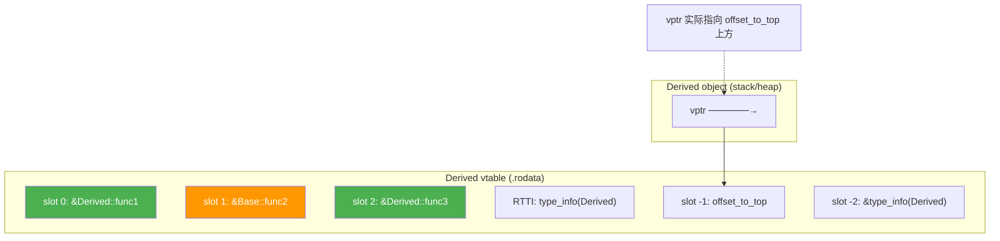

# 面向对象(三)：多态与虚函数

## 原理

### 虚函数表（vtable）的结构

每个包含虚函数的类（或从虚基类派生的类）有一张虚函数表。vtable 是一个函数指针数组，存储在只读数据段（.rodata）。该类的所有对象共享同一张 vtable。

```cpp
Base 对象 Base vtable
┌──────────┐ ┌──────────────────┐
│ vptr ────┼───────────→│ &Base::func1 │ ← slot 0
├──────────┤ │ &Base::func2 │ ← slot 1
│ baseData │ │ &type_info(Base) │ ← RTTI
└──────────┘ └──────────────────┘

Derived 对象 Derived vtable
┌──────────┐ ┌──────────────────┐
│ vptr ────┼───────────→│ &Derived::func1 │ ← slot 0 (重写)
├──────────┤ │ &Base::func2 │ ← slot 1 (未重写)
│ baseData │ │ &Derived::func3 │ ← slot 2 (新增)
├──────────┤ │ &type_info(Derived)│ ← RTTI
│derivedData│ └──────────────────┘
└──────────┘
```

关键事实：
- vptr 位于对象内存的起始位置（偏移 0）
- 每个类只有一张 vtable，所有对象共享
- 非虚函数不在 vtable 中，调用时静态绑定
- vptr 在构造函数执行时初始化——先初始化为基类 vtable，再切换为派生类 vtable

### vtable 的内存布局详解



实际 vtable 的布局比上图更复杂。在 Itanium ABI（Linux/macOS 使用的 ABI）下，vtable 包含：

```
vtable 内存布局（从低地址到高地址）：
┌─────────────────────────────────┐
│ offset_to_top = 0               │  ← 虚基类偏移
│ &type_info(Derived)             │  ← RTTI 信息
├─────────────────────────────────┤
│ &Derived::func1                 │  ← slot 0（offset 0）
│ &Base::func2                    │  ← slot 1（offset 8）
│ &Derived::func3                 │  ← slot 2（offset 16）
└─────────────────────────────────┘
vptr 指向 slot 0（不指向 type_info）
```

### 虚函数调用的汇编路径

```asm
; ptr->func1() — 虚函数调用需要两次内存读
mov rax, [rdi] ; rax = vptr（读 this 前 8 字节）
mov rax, [rax] ; rax = vtable[0]（读 vtable 第一项）
call rax ; 间接跳转到实际函数

; ptr->nonVirtual() — 非虚函数只需一次直接调用
call Base::nonVirtual
```

虚函数调用的开销：额外一次指针解引用 + 无法内联优化。对于热路径中的紧密循环，这个开销可能显著；对于大多数场景可忽略不计。

### 构造/析构期间的 vptr 行为

构造函数中调用的虚函数使用的是**当前类的版本**，不是最终派生类的版本：

```cpp
class Base {
 Base() { virtualFunc(); } // 调用的是 Base::virtualFunc
 virtual void virtualFunc() {}
};
class Derived : public Base {
 Derived() { virtualFunc(); } // 调用的是 Derived::virtualFunc
 void virtualFunc() override {}
};
```

原因：执行 Base 构造函数时，vptr 指向 Base 的 vtable。Base 构造完成后进入 Derived 构造时，vptr 才更新为 Derived 的 vtable。析构过程相反——先切换到 Derived 的 vtable，执行完派生类析构后再切回 Base 的 vtable。

```cpp
// vptr 切换时间线
Widget w; // 构造过程：
// 1. 分配内存
// 2. Base::Base() → vptr = &Base::vtable
//    调用 Base 中的虚函数 → 调用 Base 版本
// 3. Derived::Derived() → vptr = &Derived::vtable
//    调用 Derived 中的虚函数 → 调用 Derived 版本
// 4. 构造完成，vptr 稳定指向 Derived::vtable

// 析构过程：
// 1. ~Derived() → vptr = &Derived::vtable（已经是）
//    执行 Derived 析构体
// 2. ~Base() → vptr = &Base::vtable（切回基类版本）
//    调用虚函数 → 调用 Base 版本（如果此时调用虚函数）
// 3. 释放内存
```

### RTTI 与 type_info 内部实现

vtable 中还存储 type_info 对象，为 `dynamic_cast` 和 `typeid` 提供支撑。`dynamic_cast` 通过查询 vtable 中的 RTTI 信息确定运行时类型，实现安全的向下转型。

```asm
; dynamic_cast<Derived*>(basePtr) 的简化流程
; 1. 读取 vptr → 获取 vtable 地址
; 2. 从 vtable 中读取 type_info
; 3. 遍历继承层级比较类型信息
; 4. 返回调整后的指针或 nullptr
```

```cpp
// type_info 的典型实现结构
struct type_info {
    const char* __type_name; // 类型名称字符串
    // 内部比较逻辑：通过 __type_name 指针地址比较
    // 相同类型共享同一个 type_info 对象
};

// dynamic_cast 的实现流程（简化）：
// 1. 获取源对象的 type_info（从 vtable）
// 2. 获取目标类型的 type_info（编译期已知）
// 3. 在继承图中查找：源类型是否在目标类型的继承链上？
// 4. 如果是，计算指针偏移并返回；否则返回 nullptr

// 禁用 RTTI（-fno-rtti）的影响：
// - dynamic_cast 不可用
// - typeid 不可用
// - vtable 中不存储 type_info
// - 减少二进制体积，但丧失运行时类型检查
```

### CRTP 模式（Curiously Recurring Template Pattern）

CRTP 是一种编译期多态技术，将派生类作为模板参数传递给基类，实现静态多态：

```cpp
// CRTP 基类
template <typename Derived>
class Base {
public:
    void interface() {
        // 静态多态：编译期确定调用 Derived 的实现
        static_cast<Derived*>(this)->implementation();
    }
};

class MyClass : public Base<MyClass> {
public:
    void implementation() {
        std::cout << "MyClass implementation" << std::endl;
    }
};

// 优势：
// 1. 无虚函数开销（零成本抽象）
// 2. 可以内联（编译器知道具体类型）
// 3. 不需要 vtable/vptr

// 实际应用：std::enable_shared_from_this
class Widget : public std::enable_shared_from_this<Widget> {
public:
    std::shared_ptr<Widget> getPtr() {
        return shared_from_this(); // CRTP 提供此方法
    }
};

// CRTP 与虚函数的性能对比：
// 虚函数：运行时查找 vtable → 间接调用 → 不可内联
// CRTP：编译期确定类型 → 直接调用 → 可内联
// 在性能关键路径上 CRTP 可快 2-5 倍
```

### 类型擦除（Type Erasure）

类型擦除是一种将不同类型统一为同一接口的技术，隐藏具体类型信息：

```cpp
// 简单的类型擦除实现
class AnyFunction {
    struct Concept {
        virtual ~Concept() = default;
        virtual void invoke() = 0;
        virtual Concept* clone() const = 0;
    };

    template <typename F>
    struct Model : Concept {
        F func;
        Model(F f) : func(std::move(f)) {}
        void invoke() override { func(); }
        Concept* clone() const override { return new Model(*this); }
    };

    std::unique_ptr<Concept> impl;

public:
    template <typename F>
    AnyFunction(F f) : impl(new Model<F>(std::move(f))) {}

    AnyFunction(const AnyFunction& other) : impl(other.impl->clone()) {}
    AnyFunction& operator=(const AnyFunction& other) {
        impl.reset(other.impl->clone());
        return *this;
    }

    void operator()() { impl->invoke(); }
};

// 使用示例：不同类型的可调用对象统一存储
std::vector<AnyFunction> funcs;
funcs.push_back([]{ std::cout << "lambda1"; });
funcs.push_back([]{ std::cout << "lambda2"; });
// 类型被擦除，但行为通过虚函数保留
```

### 虚函数默认参数的陷阱

默认参数是**静态绑定**的——在编译期根据指针/引用的静态类型决定。虚函数本身是动态绑定的：

```cpp
Base* ptr = new Derived();
ptr->print(10); // 使用 Base::print 的默认参数（10），但调用 Derived::print
// 结论：永远不要在重写的虚函数中改变默认参数值
```

### 纯虚函数与抽象基类设计

```cpp
// 纯虚函数可以有实现（接口分离模式）
class Drawable {
public:
    virtual ~Drawable() = default;
    virtual void draw() const = 0; // 纯虚函数（接口）
protected:
    void logDraw() const { // 纯虚函数带实现
        std::cout << "Drawing..." << std::endl;
    }
};

// 抽象基类作为接口（Interface）
class SortStrategy {
public:
    virtual ~SortStrategy() = default;
    virtual void sort(std::vector<int>& data) = 0;
};

// 具体实现
class QuickSort : public SortStrategy {
public:
    void sort(std::vector<int>& data) override {
        std::sort(data.begin(), data.end());
    }
};

class BubbleSort : public SortStrategy {
public:
    void sort(std::vector<int>& data) override {
        // 冒泡排序实现
    }
};
```

---

## 语法

### virtual 与 override

```cpp
class Base {
public:
 virtual void draw() const { /* ... */ } // 声明虚函数
 virtual std::string name() const = 0; // 纯虚函数
 virtual ~Base() = default; // 虚析构（必须）
};

class Derived : public Base {
public:
 void draw() const override { /* ... */ } // 重写并使用 override 检查
 std::string name() const override { return "Derived"; }
};
```

### 纯虚函数与抽象类

```cpp
class Shape { // 抽象类——不能实例化
public:
 virtual double area() const = 0; // 纯虚函数
 virtual ~Shape() = default;
};
```

纯虚函数可以有实现（`virtual void f() = 0 {}`），派生类可选择调用默认实现。

### final 阻止重写（C++11）

```cpp
class Base {
 virtual void critical() final { /* 不允许被重写 */ }
};
```

### 协变返回类型

```cpp
class Base {
 virtual Base* clone() const { return new Base(*this); }
};
class Derived : public Base {
 Derived* clone() const override { return new Derived(*this); }
 // 返回类型从 Base* 协变为 Derived*
};
```

### dynamic_cast 与 typeid

```cpp
// 对指针：失败返回 nullptr
if (auto* d = dynamic_cast<Derived*>(basePtr)) { d->derivedOnly(); }

// 对引用：失败抛 std::bad_cast
Derived& d = dynamic_cast<Derived&>(*basePtr);

// typeid
if (typeid(*basePtr) == typeid(Derived)) { /* 精确类型判断 */ }
```

---

## 实践

**力扣题目**：力扣数组题（可设计 Student 基类 + 不同评价标准的派生类），力扣排序（抽象比较逻辑）。

**AI 自检**：1) 给 AI 一个包含虚函数的类层次，要求 AI 画出完整的 vtable 布局；2) 问"为什么构造/析构函数中不应该调用虚函数"——要求 AI 从 vptr 切换时间线来说明；3) 给虚函数添加默认参数的危险代码，问 AI 为什么输出不符合预期。

```cpp
class A {
public:
 virtual void f(int x = 10) { cout << "A: " << x << endl; }
};
class B : public A {
public:
 void f(int x = 20) override { cout << "B: " << x << endl; }
};
A* p = new B(); p->f(); // 输出？为什么？
```

**建议先阅读**：[[05_面向对象(一)类与对象基础]] — vptr 在对象布局中的位置；[[06_面向对象(二)继承]] — 派生类对象的完整内存结构；[[../../汇编基础/1基础/03_C++在汇编层的体现]] — 虚调用在汇编层的完整路径。

## 力扣练习

| 题号 | 题目 | 链接 | 知识点 |
|---|---|---|---|
| 208 | 实现 Trie (前缀树) | https://leetcode.cn/problems/implement-trie-prefix-tree/ | 多态设计：TrieNode 接口、虚函数实现 |
| 146 | LRU 缓存 | https://leetcode.cn/problems/lru-cache/ | 策略模式：不同淘汰策略的虚函数设计 |
| 380 | O(1) 时间插入、删除和获取随机元素 | https://leetcode.cn/problems/insert-delete-getrandom-o1/ | 类封装设计、接口抽象 |
| 232 | 用栈实现队列 | https://leetcode.cn/problems/implement-queue-using-sticks/ | 抽象数据类型设计 |
| 460 | LFU 缓存 | https://leetcode.cn/problems/lfu-cache/ | 策略模式：频率分组的抽象接口 |
| 155 | 最小栈 | https://leetcode.cn/problems/min-stack/ | 接口设计：辅助栈的虚函数封装 |
| 341 | 扁平化嵌套列表迭代器 | https://leetcode.cn/problems/flatten-nested-list-iterator/ | 多态接口：NestedInteger 虚函数 |
| 271 | 字符串的编码与解码 | https://leetcode.cn/problems/encode-and-decode-strings/ | 接口抽象：编解码器的虚函数设计 |
| 297 | 二叉树的序列化与反序列化 | https://leetcode.cn/problems/serialize-and-deserialize-binary-tree/ | 设计模式：序列化策略的多态 |
| 355 | 设计推特 | https://leetcode.cn/problems/design-twitter/ | 类继承与接口设计 |
| 348 | 设计井字棋 | https://leetcode.cn/problems/design-tic-tac-toe/ | 类封装与虚函数的使用 |
| 535 | TinyURL 的加密与解压 | https://leetcode.cn/problems/encode-and-decode-tinyurl/ | 设计模式：编码策略的多态接口 |
| 139 | 单词拆分 | https://leetcode.cn/problems/word-break/ | 动态规划中的策略选择（可类比策略模式） |
| 212 | 单词搜索 II | https://leetcode.cn/problems/word-search-ii/ | Trie + 回溯的组合设计 |
