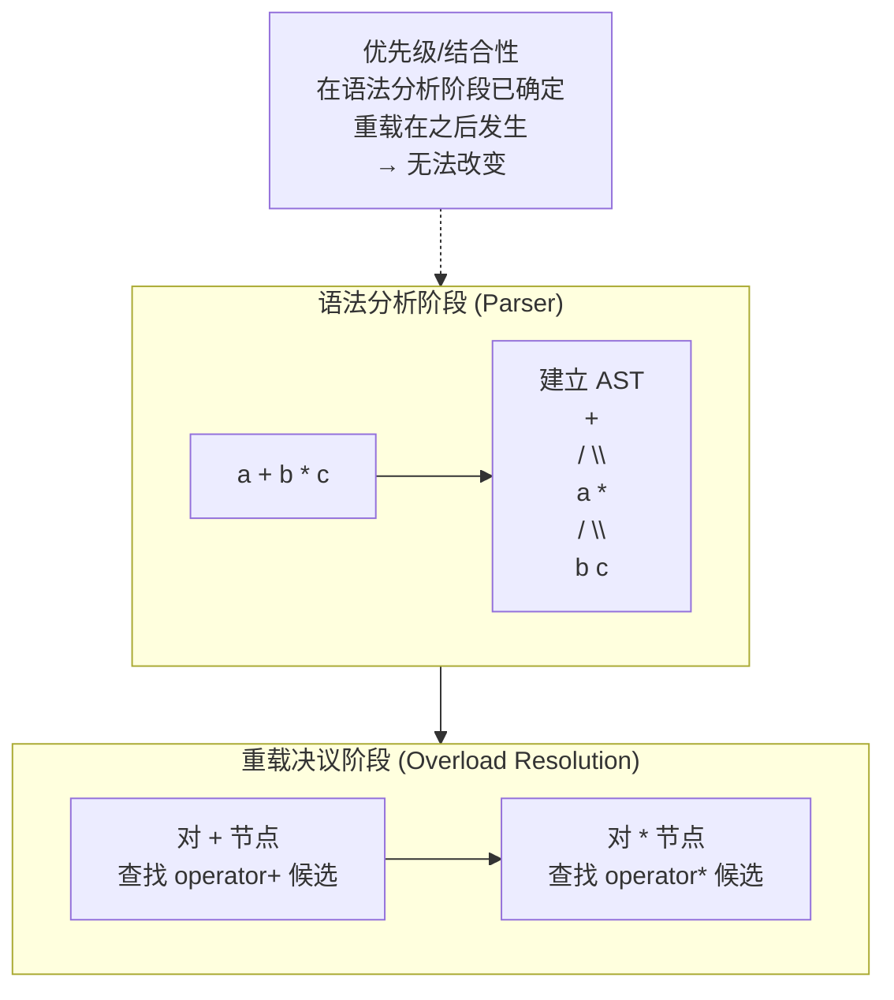

##   C++ 深化教程：第七章 面向对象 (四) —— 运算符重载
---

【 本章目标】
  1. 掌握运算符重载的基本语法和底层原理
  2. 从汇编层理解成员函数重载与友元函数重载的决策依据
  3. 理解返回类型（T/T&/bool/void）的底层判断规则
  4. 掌握前置/后置自增自减的汇编差异和选择原则
  5. 理解优先级/结合性/操作数个数为何不可改变
  6. 掌握转换构造函数、类型转换运算符与重载的双向交互
  7. 理解 ADL（参数依赖查找）如何让运算符跨命名空间工作
  8. 掌握移动语义在运算符重载中的优化作用
  9. 了解C++20太空船运算符
  10. 通过5个生活场景案例综合运用前7章所有知识

---

                            === 第一节：基础示例代码 + 计算机底层原理 ===
---

一、运算符重载基础：函数调用本质
------------------------------------

运算符重载是C++提供的语法糖，它允许程序员为自定义类型定义运算符的行为。
本质上，运算符重载就是函数调用的另一种写法。

【示例1-1】复数类的基本运算符重载：

```cpp
#include <iostream>

class Complex {
private:
    double real;
    double imag;

public:
    Complex(double r = 0.0, double i = 0.0) : real(r), imag(i) { }

    // ====== 成员函数重载运算符 ======

    // operator+ 实际上是 Complex::operator+(const Complex&) 函数
    Complex operator+(const Complex& other) const {
        return Complex(real + other.real, imag + other.imag);
    }

    // operator- : 减法
    Complex operator-(const Complex& other) const {
        return Complex(real - other.real, imag - other.imag);
    }

    // operator* : 乘法 (a+bi)(c+di) = (ac-bd) + (ad+bc)i
    Complex operator*(const Complex& other) const {
        return Complex(
            real * other.real - imag * other.imag,
            real * other.imag + imag * other.real
        );
    }

    // operator== : 相等比较
    bool operator==(const Complex& other) const {
        return real == other.real && imag == other.imag;
    }

    // operator!= : 不等比较
    bool operator!=(const Complex& other) const {
        return !(*this == other);  // 重用 operator==
    }

    // 获取值
    double getReal() const { return real; }
    double getImag() const { return imag; }

    void print() const {
        std::cout << real;
        if (imag >= 0) std::cout << " + " << imag << "i";
        else           std::cout << " - " << -imag << "i";
        std::cout << std::endl;
    }
};

int main() {
    Complex c1(3.0, 4.0);
    Complex c2(1.0, -2.0);

    // 以下两行等价！
    Complex c3 = c1 + c2;          // 语法糖
    Complex c4 = c1.operator+(c2); // 实际调用

    c1.print();  // 3 + 4i
    c2.print();  // 1 - 2i
    c3.print();  // 4 + 2i

    Complex c5 = c1 * c2;  // (3+4i)(1-2i) = 11 - 2i
    c5.print();

    std::cout << "c1 == c2? " << (c1 == c2 ? "yes" : "no") << std::endl;
    std::cout << "c1 != c2? " << (c1 != c2 ? "yes" : "no") << std::endl;

    return 0;
}
```

---

二、计算机底层原理：运算符重载的本质
------------------------------------

【原理2-1】编译器如何匹配运算符重载

当编译器遇到表达式 `a + b` 时，查找候选函数的过程：

1. 候选函数集包括：
   - 成员函数：a.`operator`+(b)  （如果a是类类型）
   - 非成员函数：`operator`+(a, b)（在a或b所在命名空间中查找）
   - 内置运算符（如果操作数是基本类型）

2. 重载决议（Overload Resolution）过程：
   (a) 名称查找：找到所有名为 `operator`+ 的函数
   (b) 模板推导（如果是模板函数）
   (c) 可行性检查：参数数量和类型是否匹配
   (d) 最佳匹配：根据隐式转换的开销选择最佳重载

```cpp
class MyInt {
    int value;
public:
    MyInt(int v) : value(v) {}

    // 成员函数重载
    MyInt operator+(const MyInt& other) const {
        return MyInt(value + other.value);
    }

    // 非成员函数重载（友元）
    friend MyInt operator-(const MyInt& a, const MyInt& b) {
        return MyInt(a.value - b.value);
    }
};

int main() {
    MyInt a(5), b(3);

    // 以下调用匹配过程：
    MyInt c = a + b;
    // 编译器查找：a.operator+(b) → 找到成员函数版本

    MyInt d = a - b;
    // 编译器查找：a.operator-(b) → 没找到成员函数
    // 继续查找：operator-(a, b) → 找到友元函数版本

    // 混合类型运算
    MyInt e = a + 10;
    // 编译器：a.operator+(10) → 10可通过隐式转换变为MyInt(10) → 可行！

    // MyInt f = 10 + a;
    // 编译器：10.operator+(a) → int没有成员operator+
    //         operator+(10, a) → 没找到非成员函数接受int+MyInt
    //         错误！
    // 解决方案：定义非成员函数 operator+(int, const MyInt&)

    return 0;
}
```

【原理2-2】成员函数 vs 友元函数的底层决策

**先看汇编层——两种形式的本质差异：**

成员函数重载在编译后等价于 `T::operator+(const T*)`，`this` 通过 rdi 隐式传入。
友元函数重载等价于全局函数 `operator+(const T&, const T&)`，两个操作数都是显式参数。

```cpp
// C++ 源码：
class X {
    X operator+(const X& other) const;          // 成员形式
    friend X operator-(const X& a, const X& b); // 友元形式
};
X a, b;
X c = a + b;   // → a.operator+(b)  → call X::operator+,  rdi=&a, rsi=&b
X d = a - b;   // → operator-(a, b) → call operator-(X,X), rdi=&a, rsi=&b
```

汇编层来看：

```asm
; === 成员形式 a + b ===
;   X::operator+(const X& other)  →  this 隐式为第一参数 (rdi)
    lea    rdi, [rsp+0]      ; rdi = &a (this)
    lea    rsi, [rsp+32]     ; rsi = &b (显式参数)
    call   X::operator+(const X&)
;   成员函数内部: this->val 通过 [rdi+offset] 访问
;               other.val 通过 [rsi+offset] 访问

; === 友元形式 a - b ===
;   operator-(const X& a, const X& b)  → 两个都是显式参数
    lea    rdi, [rsp+0]      ; rdi = &a (第一参数)
    lea    rsi, [rsp+32]     ; rsi = &b (第二参数)
    call   operator-(X,X)
;   函数内部: a.val 通过 [rdi+offset] 访问
;            b.val 通过 [rsi+offset] 访问
;   和成员形式完全一样的指令！区别仅在于参数的语义标签
```

**决策树——什么时候用友元而不是成员：**

| 场景                           | 选成员      | 选友元    | 底层原因                                  |
| :--------------------------- | :------- | :----- | :------------------------------------ |
| 左操作数确定是 `*this`              | 可        | 可      | 都可以，成员更自然                             |
| 左操作数**不是**本类类型 (如 `5 + obj`) | 不可       | **必须** | 成员函数要求左操作数有对应成员——`int` 没有 `operator+` |
| 需要对称性 (`obj+5` 和 `5+obj`)    | 仅单向      | **必须** | 友元可重载两个版本覆盖双向                         |
| 流运算符 `cout << obj`           | 不可       | **必须** | 左操作数是 `ostream&`，不是本类类型               |
| `= [] () ->`                 | **必须成员** | 不可     | C++ 标准强制规定，语法层面绑定                     |

必须用成员函数的四个运算符（标准强制）：

| 运算符 | 为什么必须是成员 | 如果写成友元 |
|:------|:------|:------|
| `=` (赋值) | 语义上绑定到对象自身 | 编译错误 |
| `[]` (下标) | 需要隐式 `this` 才能有"下标属于哪个对象"的语义 | 编译错误 |
| `()` (函数调用) | 同上 | 编译错误 |
| `->` (成员访问) | 同上 | 编译错误 |

**为什么 `5 + obj` 不能用成员函数？** 因为 `5` 的类型是 `int`，编译器查找 `int::operator+(const X&)` —— `int` 没有这个成员函数。而友元形式 `operator+(int, const X&)` 是一个全局函数，编译器的参数依赖查找（ADL）在 `X` 所在的命名空间中可以找到它。

【原理2-3】运算符重载不会改变优先级、结合性和操作数个数

这是运算符重载最根本的约束——**三个不变**：

**1. 优先级不变** — 运算符的优先级是语法层面固定的，重载函数无法修改。

```cpp
// operator+ 和 operator* 重载后：
Vec c = a + b * 5;
// 永远等价于 a + (b * 5)，不可能是 (a + b) * 5
// 因为 C++ 文法中 * 的优先级高于 +，这发生在语法分析阶段
// 远在重载决议之前——编译器还没决定调用哪个 operator+ 时就已经确定了 AST 结构
```

底层原理：编译器的工作顺序是先做**语法解析**（建立抽象语法树），再做**语义分析**（类型检查+重载决议）。优先级和结合性是语法解析阶段就确定的，操作符重载是语义分析阶段的事。因此重载无法改变语法树的结构。

**2. 结合性不变** — 同优先级运算符的计算方向也不可改变。

```cpp
// operator+ 的结合性是左结合 (left-to-right)
Vec c = a + b + c;
// 永远等价于 (a + b) + c，即 operator+(operator+(a, b), c)
// 不可能是 a + (b + c)

// operator= 的结合性是右结合 (right-to-left)
a = b = c;
// 永远等价于 a = (b = c)，即 a.operator=(b.operator=(c))
```

**结合性在这里的体现是什么？** 当多个相同优先级的运算符相邻出现时，结合性决定括号的隐式方向。例如 `a - b - c` 结合性是左结合 → `(a - b) - c` → 先算 `a - b` 再减 `c`。而赋值 `a = b = c` 是右结合 → `a = (b = c)` → 先把 `c` 赋给 `b`，返回的引用再赋给 `a`。



**3. 操作数个数不变** — 二元运算符永远接收两个操作数，一元运算符永远接收一个。

| 运算符类型 | 成员函数参数数 | 非成员函数参数数 | 操作数总数 |
|:------|:------|:------|:------|
| 一元 (`-`, `!`, `~`, `++`, `--`) | 0 (this 是隐式操作数) | 1 | 1 |
| 二元 (`+`, `-`, `*`, `==`, `<`, `<<`) | 1 (this + 1 显式) | 2 | 2 |
| 三元 `?:` | — | — | **不可重载** |

> 不能把 `operator+` 重载为接收三个参数（`operator+(A,B,C)` 编译错误）；也不能把 `operator!` 重载为接收两个参数。操作数的个数是语法规则的一部分，与优先级/结合性同理——属于语法分析阶段，重载无权干预。

【原理2-4】返回类型的底层判断 —— 值返回 vs 引用返回 vs bool vs void

运算符重载的返回类型不是随意的——必须根据语义对应正确的底层行为：

| 返回类型 | 典型运算符 | 底层行为 | 汇编 |
|:------|:------|:------|:------|
| `T` (值返回) | `+`, `-`, `*`, `/` | 创建新对象，返回拷贝 | `call operator new; call 构造; ret` |
| `T&` (引用返回) | `=`, `+=`, `-=`, `<<`, `>>` | 返回已有对象，无拷贝 | `mov rax, rdi; ret` (直接返回 this) |
| `bool` | `==`, `!=`, `<`, `>`, `!` | 返回比较/判断结果 | `xor eax, eax; cmp/setXX al; ret` |
| `void` | `()` (函数调用), `++` 后置(有时) | 无返回值，仅副作用 | `ret` (无 rax 写入) |

**汇编层的本质区别：**

```asm
; === 返回 T (值类型) —— 产生新对象 ===
; T operator+(const T& other) const
    call  T::T(...)           ; 在返回槽上构造新对象
    mov   rax, [rbp-8]        ; 返回槽地址
    ret
; 调用方必须为返回值准备空间 + 管理生命周期

; === 返回 T& (引用) —— 返回已有对象的别名 ===
; T& operator=(const T& other)
    mov   [rdi], esi          ; 写入值
    mov   rax, rdi            ; 返回 this 指针 (零开销)
    ret
; 调用方收到的就是对象的地址，不需要额外构造

; === 返回 bool —— 条件结果 ===
; bool operator==(const T& other) const
    xor   eax, eax            ; eax = 0 (false)
    mov   ecx, [rdi]
    cmp   ecx, [rsi]
    sete  al                  ; 若相等，al = 1
    ret

; === 返回 void —— 无返回值 ===
; void operator()(int x)
    ...副作用操作...
    ret                       ; rax 无意义
```

**链式调用的关键——返回 `T&`**：`cout << a << b << c` 能链式调用的原因就是 `operator<<` 返回 `ostream&` —— 每次调用返回的是同一个流的引用，下一个 `<<` 继续在这个流上操作。汇编中是 `mov rax, rdi` 配合 `ret`，完全无额外开销。

```cpp
// 错误示例：返回 T 而非 T&
T operator=(const T& other) {
    val = other.val;
    return *this;  // 返回的是*this的拷贝！拷贝的临时对象马上被析构
}
// T a, b, c;
// a = b = c;  // a = 的是 b = c 返回的临时副本，不是 b 本身！
```

> 核心规则：如果不确定返回类型，问自己——这个运算是否产生新值（→ T），还是修改现有对象并返回自身（→ T&），还是返回判断结果（→ bool）。

【原理2-5】前置自增 vs 后置自增的底层区别

```cpp
class Counter {
    int val;
public:
    // 前置 ++x → operator++()  无额外参数
    Counter& operator++() {
        ++val;
        return *this;         // 返回修改后的自身引用
    }

    // 后置 x++ → operator++(int)  有一个未使用的 int 参数
    Counter operator++(int) {
        Counter temp = *this; // 1. 拷贝旧值（有开销！）
        ++val;                // 2. 修改自身
        return temp;          // 3. 返回旧值的拷贝
        //        ^^^^ 返回类型是 Counter（值），不是引用！
    }
};
```

**为什么后置有一个 `int` 参数？** 这不是用来传值的——它是语法层面的标记，专门用来在重载决议中区分前置和后置版本。调用时这个参数由编译器自动传入 `0`，程序员永远不手动传这个参数：

```cpp
Counter c;
++c;       // 调用 operator++()
c++;        // 调用 operator++(0) —— 编译器隐式传入 0
c.operator++();   // 显式调用前置
c.operator++(0);  // 显式调用后置（传任意 int 值）
```

**汇编层对比：**

```asm
; === 前置 ++c ===
; Counter& operator++()
    inc    dword [rdi]         ; 直接自增 this->val (1 条指令)
    mov    rax, rdi            ; 返回 this 指针 (1 条指令)
    ret

; === 后置 c++ ===
; Counter operator++(int)
    mov    eax, [rdi]          ; 保存旧值到 eax
    inc    dword [rdi]         ; 自增 this->val
    ; 如果 Counter 有深拷贝构造，还会多出 new + 拷贝旧值
    ret                        ; 返回旧值 (eax = 旧 this->val)
```

**选择建议：** 除非明确需要"先用旧值再自增"的语义，否则**永远用前置版本**。后置版本多了一次拷贝操作（对于基础类型影响不大，但对于迭代器、智能指针等复杂类型，拷贝构造开销不可忽略）。这也是为什么 STL 中的迭代器标准写法是 `++it` 而非 `it++`。

【原理2-6】转换构造函数与运算符重载的交互

转换构造函数（converting constructor）是指**未被 `explicit` 修饰的单参数构造函数**，它允许编译器将其他类型隐式转换为类对象。这是运算符重载能够"混合类型运算"的关键机制。

```cpp
class Complex {
    double real, imag;
public:
    Complex(double r, double i = 0.0) : real(r), imag(i) {}
    //     ^^^^^^ 单参数构造函数，未加 explicit → 转换构造函数
    //     允许: Complex c = 3.14;  // 隐式转换 double → Complex(3.14, 0.0)

    Complex operator+(const Complex& other) const {
        return Complex(real + other.real, imag + other.imag);
    }
};

Complex a(1.0, 2.0);
Complex b = a + 3.5;   // 为什么能编译？
// 步骤：
//   1. 编译器查找 a.operator+(3.5) → 参数类型不匹配 (double vs const Complex&)
//   2. 尝试隐式转换 3.5 → Complex → 找到转换构造函数 Complex(double) → 可行！
//   3. 转换为: a.operator+(Complex(3.5, 0.0))
```

但是反过来不一定成立：

```cpp
Complex c = 3.5 + a;   // 编译错误！
// 编译器查找: 3.5.operator+(a) → double 没有成员 operator+
//               operator+(3.5, a) → 没有接受 double+Complex 的全局 operator+
// 解决方案：添加友元函数
// friend Complex operator+(double d, const Complex& c) {
//     return Complex(c.real + d, c.imag);
// }
```

**`explicit` 阻止隐式转换的底层：**

```cpp
class SafeInt {
    int val;
public:
    explicit SafeInt(int v) : val(v) {}
    // ^^^^^^ explicit 禁止隐式转换
    SafeInt operator+(const SafeInt& other) const {
        return SafeInt(val + other.val);
    }
};

SafeInt a(5);
// SafeInt b = a + 10;    // 编译错误！10 不能隐式转换为 SafeInt
SafeInt b = a + SafeInt(10);  // 必须显式转换
```

explicit 在编译器的重载决议中表现为"不做隐式转换"——编译器在查找候选函数并尝试参数匹配时，对标记为 explicit 的构造函数跳过隐式转换，只保留显式构造的路径。

> 转换构造函数的完整讲解见 [[05_面向对象(一)类与对象基础#2.2 构造函数大全]] 和 [[05_面向对象(一)类与对象基础#2.8 explicit关键字（阻止隐式转换）]]。

【原理2-7】友元在运算符重载中的角色

友元的最典型用途是实现**左操作数不是本类类型**的运算符——如 `cout << obj`（左操作数是 `ostream&`）、`5 + obj`（左操作数是 `int`）。此时必须用友元（或全局函数）而非成员函数，因为成员函数要求左操作数有对应的成员 `operator`。

友元本身不是运算符重载特有的概念——它是 C++ 的通用访问控制机制。友元的完整讲解（三种声明形式、单向/不传递/不继承特性、底层符号表机制、汇编层权限检查）都在 [[05_面向对象(一)类与对象基础#2.14 友元函数]] 和 [[05_面向对象(一)类与对象基础#2.15 友元类]] 中。

在运算符重载中仅需记住：**需要左操作数是非本类的二元运算符 → 用友元函数；`= [] () ->` → 必须用成员函数（标准强制）**。具体决策逻辑见本章 [[#原理2-2 成员函数 vs 友元函数的底层决策]]。

【原理2-8】类型转换运算符与重载的双向交互 —— 当两个方向都有转换通路时

转换构造函数（`T(U)`）负责 `U → T` 的转换；类型转换运算符（`operator U()`）负责 `T → U` 的转换。当两个方向**同时存在**时，运算符重载的候选集急剧膨胀——可能产生歧义。

```cpp
class Integer {
    int val;
public:
    Integer(int v) : val(v) {}               // 转换构造函数：int → Integer
    operator int() const { return val; }     // 类型转换运算符：Integer → int

    Integer operator+(const Integer& other) const {
        return Integer(val + other.val);
    }
};

Integer a(5);
Integer b(10);
Integer c = a + b;    // OK: 精确匹配 operator+(Integer, Integer)
Integer d = a + 20;   // 两条通路都可以！
//   通路1: 20 → Integer(20)  (转换构造函数) → operator+(Integer, Integer)
//   通路2: a → int(a)        (类型转换) → operator+(int, int) 内置加法 → 结果再转回 Integer
//   编译器选通路1——因为内置运算符要两步转换，自定义重载只要一步

// 但如果去掉 operator+ 重载：
// Integer e = a + 20;   // a→int(a)=5, 5+20=25, 25→Integer(25) —— 借助内置 int 加法！
```

**歧义陷阱——当转换通路对称时：**

```cpp
class A {
public:
    A(int) {}                   // int → A
    operator int() const { return 0; }  // A → int
};
class B {
public:
    B(int) {}                   // int → B
    operator int() const { return 0; }  // B → int
};

A a; B b;
// bool x = a == b;     // 歧义！
// 候选项1: a→int, b→int → 内置 operator==(int, int)
// 候选项2: a→A, b→int→A → 如果 A 有 operator==
// 候选项3: b→B, a→int→B → 如果 B 有 operator==
// 三个候选项同样"好" → 编译错误
```

解决方案：用 `explicit` 控制转换方向——显式转换运算符只允许显式调用：

```cpp
explicit operator int() const { return val; }
// 现在 a + 20 只能走通路1（20→Integer），通路2被 explicit 阻断
```

> 类型转换运算符的完整语法见本章 [[#2.2 类型转换运算符]]。转换构造函数的原理见 [[05_面向对象(一)类与对象基础#2.8 explicit关键字（阻止隐式转换）]]。

【原理2-9】ADL（参数依赖查找）—— 运算符如何跨命名空间被发现

ADL（Argument-Dependent Lookup，也称 Koenig Lookup）是 C++ 查找非成员函数的一条特殊规则：**当函数调用中包含某个命名空间中的类型作为参数时，编译器也会在该命名空间中查找候选函数**。对于运算符重载，ADL 至关重要——因为运算符通常以全局函数形式定义在类所在的命名空间中。

```cpp
namespace Math {
    class Vector {
        double x, y;
    public:
        Vector(double a, double b) : x(a), y(b) {}
        double getX() const { return x; }
        double getY() const { return y; }
    };

    // 全局运算符——在 Math 命名空间内定义
    Vector operator+(const Vector& a, const Vector& b) {
        return Vector(a.getX() + b.getX(), a.getY() + b.getY());
    }
}

int main() {
    Math::Vector a(1, 2), b(3, 4);

    // 这行为什么能编译？我们没写 using namespace Math;
    Math::Vector c = a + b;
    // 答案：ADL！
    // 编译器查找 operator+(Vector, Vector) 的候选：
    //   1. 当前作用域（main）                   → 没找到
    //   2. 全局作用域                             → 没找到
    //   3. 参数类型 Vector 所在的命名空间 Math     → 找到了！
}
```

**为什么运算符依赖 ADL？** 如果不用 ADL，每次使用运算符都需要写 `using` 声明或全限定名——这完全违背了运算符重载的便利初衷：

```cpp
// 没有 ADL 的世界——需要这样写：
Math::Vector c = Math::operator+(a, b);  // 丑陋！
// 有 ADL 的世界——可以自然写：
Math::Vector c = a + b;                   // 自然！
```

**ADL 的底层机制：**

编译器在重载决议时为每个参数类型收集其**关联命名空间**（associated namespaces），包括：
- 类型本身所在的命名空间
- 类型的基类所在的命名空间
- 类型模板参数所在的命名空间

然后在这些关联命名空间中查找候选函数名。对于 `a + b`（a 和 b 都是 `Math::Vector`），编译器自动把 `Math` 加入搜索范围。

> 这就是为什么 `std::cout << "hello"` 能找到 `std::operator<<(ostream&, const char*)` —— `std::cout` 的类型 `ostream` 在 `std` 命名空间中，ADL 自动搜索 `std`。

【原理2-10】移动语义与运算符重载

移动语义（C++11）从根本上改变了运算符重载的效率模式——尤其是赋值运算符和算术表达式链。

**移动赋值运算符：**

```cpp
class Buffer {
    char* data;
    size_t size;
public:
    Buffer(const char* s) : size(strlen(s)), data(new char[size+1]) {
        strcpy(data, s);
    }

    // 拷贝赋值：深拷贝，O(n)
    Buffer& operator=(const Buffer& other) {
        if (this != &other) {
            delete[] data;
            size = other.size;
            data = new char[size + 1];
            strcpy(data, other.data);
        }
        return *this;
    }

    // 移动赋值：窃取指针，O(1)
    Buffer& operator=(Buffer&& other) noexcept {
        if (this != &other) {
            delete[] data;           // 释放自己的旧资源
            data = other.data;       // 窃取对方指针
            size = other.size;
            other.data = nullptr;    // 对方置空
            other.size = 0;
        }
        return *this;
    }
};
```

**汇编对比 —— 移动 vs 拷贝：**

```asm
; === 拷贝赋值 a = b (operator=(const Buffer&)) ===
; 分配新内存 + 逐字节拷贝 → O(n) 时间 + O(n) 空间
    call  operator new[]          ; 系统调用分配
    rep   movsb                   ; 逐字节复制（循环）
    ret

; === 移动赋值 a = std::move(b) (operator=(Buffer&&)) ===
; 仅交换指针 → O(1) 时间 + 0 内存分配
    mov   rax, [rsi]              ; 读源 data 指针
    mov   [rdi], rax              ; 写目标 data = 源指针
    mov   qword [rsi], 0          ; 源 data = nullptr
    ret                           ; 4 条指令，无系统调用
```

**运算符表达式链中的移动优化：**

```cpp
Buffer a("hello"), b(" "), c("world");
Buffer result = a + b + c;
// 如果没有移动语义：每次 + 创建的临时对象都做深拷贝 → 3 次内存分配
// 有了移动语义：临时对象（右值）自动匹配 operator=(Buffer&&) → 零拷贝窃取
// 编译器还可能做 RVO——直接在 result 的位置构造最终对象
```

> 移动构造和移动赋值的完整讲解（包括 Rule of Five、`std::move` vs `std::forward`）见 [[../03_指针与引用]] 和 [[../04_动态内存]]。

---

                            === 第二节：所有用法大全（标准库/关键字/函数） ===
---

2.1 可重载的运算符完整列表
------------------------------------

C++允许重载以下运算符（按类别分类）：

【算术运算符】 +  -  *  /  %

```cpp
class Vector2D {
    double x, y;
public:
    Vector2D(double xv, double yv) : x(xv), y(yv) {}

    Vector2D operator+(const Vector2D& v) const {
        return Vector2D(x + v.x, y + v.y);
    }
    Vector2D operator-(const Vector2D& v) const {
        return Vector2D(x - v.x, y - v.y);
    }
    Vector2D operator*(double scalar) const {
        return Vector2D(x * scalar, y * scalar);
    }
    Vector2D operator/(double scalar) const {
        return Vector2D(x / scalar, y / scalar);
    }
    Vector2D operator%(double scalar) const {
        return Vector2D(std::fmod(x, scalar), std::fmod(y, scalar));
    }
    // 友元对称版本
    friend Vector2D operator*(double scalar, const Vector2D& v) {
        return v * scalar;
    }
};
```

【关系运算符】 ==  !=  <  >  <=  >=

```cpp
class Date {
    int year, month, day;
public:
    Date(int y, int m, int d) : year(y), month(m), day(d) {}

    bool operator==(const Date& other) const {
        return year == other.year &&
               month == other.month && day == other.day;
    }
    bool operator!=(const Date& other) const {
        return !(*this == other);
    }
    bool operator<(const Date& other) const {
        if (year != other.year) return year < other.year;
        if (month != other.month) return month < other.month;
        return day < other.day;
    }
    bool operator>(const Date& other) const {
        return other < *this;  // 重用 <
    }
    bool operator<=(const Date& other) const {
        return !(other < *this);
    }
    bool operator>=(const Date& other) const {
        return !(*this < other);
    }
};
```

【逻辑运算符】 !  &&  ||

```cpp
class Flag {
    bool state;
public:
    Flag(bool s = false) : state(s) {}

    bool operator!() const {           // 逻辑非
        return !state;
    }
    bool operator&&(const Flag& other) const {  // 逻辑与（不推荐重载！）
        return state && other.state;
    }
    bool operator||(const Flag& other) const {  // 逻辑或（不推荐重载！）
        return state || other.state;
    }
    // 注意：重载&&和||会失去短路求值特性！这是常见的陷阱。
    // 例如：if (f1 && f2) — 如果f1是false，f2仍然会被求值。
};
```

【位运算符】 &  |  ^  ~  <<  >>

```cpp
class BitSet {
    unsigned int bits;
public:
    BitSet(unsigned int b = 0) : bits(b) {}

    BitSet operator&(const BitSet& other) const { return BitSet(bits & other.bits); }
    BitSet operator|(const BitSet& other) const { return BitSet(bits | other.bits); }
    BitSet operator^(const BitSet& other) const { return BitSet(bits ^ other.bits); }
    BitSet operator~() const { return BitSet(~bits); }
    BitSet operator<<(int shift) const { return BitSet(bits << shift); }
    BitSet operator>>(int shift) const { return BitSet(bits >> shift); }
};
```

【赋值运算符】 =  +=  -=  *=  /=  %=  &=  |=  ^=  <<=  >>=

```cpp
class Counter {
    int value;
public:
    Counter(int v = 0) : value(v) {}

    Counter& operator=(const Counter& other) {
        if (this != &other) {
            value = other.value;
        }
        return *this;
    }
    Counter& operator+=(const Counter& other) {
        value += other.value;
        return *this;
    }
    Counter& operator-=(const Counter& other) {
        value -= other.value;
        return *this;
    }
    Counter& operator*=(int factor) {
        value *= factor;
        return *this;
    }
    Counter& operator/=(int divisor) {
        value /= divisor;
        return *this;
    }

    int getValue() const { return value; }
};

// 通常使用 += 来实现 +（代码复用）
Counter operator+(const Counter& a, const Counter& b) {
    Counter result(a);
    result += b;
    return result;
}
```

【自增自减运算符】 ++ (前置/后置)  -- (前置/后置)

```cpp
class Iterator {
    int index;
public:
    Iterator(int i = 0) : index(i) {}

    // 前置++: ++it
    Iterator& operator++() {
        ++index;
        return *this;  // 返回修改后的自身
    }

    // 后置++: it++
    // int参数是假的（仅用于区分前置和后置）！
    Iterator operator++(int) {
        Iterator temp(*this);  // 保存旧值
        ++index;
        return temp;   // 返回旧值（注意：返回值不是引用！）
    }

    // 前置--: --it
    Iterator& operator--() {
        --index;
        return *this;
    }

    // 后置--: it--
    Iterator operator--(int) {
        Iterator temp(*this);
        --index;
        return temp;
    }

    int getValue() const { return index; }
};

int main() {
    Iterator it(5);
    Iterator a = ++it;  // a=6, it=6 (前置：先加后赋值)
    Iterator b = it++;  // b=6, it=7 (后置：先赋值后加)

    // 注意：后置自增返回的是值（副本），不是引用
    // it++++;  // 这其实是 (it.operator++(0)).operator++(0)
    // 但第二个++操作的是第一个++返回的临时对象，不是it本身！
    // 因此通常it++++不是预期行为

    // ++++it;  // 这是 (it.operator++()).operator++()
    // 两个++都对it本身操作，正确！

    return 0;
}
```

【下标运算符】 []

```cpp
class Array {
    int* data;
    size_t size;
public:
    Array(size_t s) : size(s), data(new int[s]()) { }
    ~Array() { delete[] data; }

    // 非const版本——可读写
    int& operator[](size_t index) {
        if (index >= size) throw std::out_of_range("Index out of bounds");
        return data[index];
    }

    // const版本——只读
    const int& operator[](size_t index) const {
        if (index >= size) throw std::out_of_range("Index out of bounds");
        return data[index];
    }

    size_t getSize() const { return size; }
};
```

【函数调用运算符】 ()

```cpp
// 函数对象（Functor/Function Object）
class Multiplier {
    int factor;
public:
    Multiplier(int f) : factor(f) { }

    int operator()(int x) const {
        return x * factor;
    }

    int operator()(int x, int y) const {
        return x * y * factor;
    }
};

int main() {
    Multiplier times3(3);
    std::cout << times3(5) << std::endl;     // 输出15
    std::cout << times3(2, 4) << std::endl;  // 输出24

    // 可以像函数一样使用对象！
    return 0;
}
```

【箭头运算符】 ->

```cpp
class SmartPointer {
    int* ptr;
public:
    SmartPointer(int* p) : ptr(p) { }
    ~SmartPointer() { delete ptr; }

    int& operator*()  { return *ptr; }      // 解引用
    int* operator->() { return ptr; }       // 箭头运算符

    // const版本
    const int& operator*() const { return *ptr; }
    const int* operator->() const { return ptr; }
};
```

【new/delete运算符（可作为成员重载）】

```cpp
class Pooled {
public:
    // 重载类的 operator new
    static void* operator new(size_t size) {
        std::cout << "Custom new: allocating " << size << " bytes"
                  << std::endl;
        return ::operator new(size);  // 调用全局new
    }

    // 重载类的 operator delete
    static void operator delete(void* ptr) {
        std::cout << "Custom delete: freeing memory" << std::endl;
        ::operator delete(ptr);
    }

    // 还可以重载数组版本
    static void* operator new[](size_t size) {
        std::cout << "Custom new[]: " << size << " bytes" << std::endl;
        return ::operator new[](size);
    }

    static void operator delete[](void* ptr) {
        std::cout << "Custom delete[]" << std::endl;
        ::operator delete[](ptr);
    }
};
```

2.2 类型转换运算符
------------------------------------

```cpp
class Meter {
    double length;
public:
    Meter(double l) : length(l) { }

    // 隐式转换运算符（不推荐除非必要）
    operator double() const {
        return length;  // 允许 Meter → double 隐式转换
    }

    // 显式转换运算符 (C++11) —— 推荐！
    explicit operator int() const {
        return static_cast<int>(length);
    }

    // bool转换运算符（常用于条件判断）
    explicit operator bool() const {
        return length > 0.0;
    }
};

int main() {
    Meter m(5.5);

    // 隐式转换
    double d = m;  // OK，operator double() 是隐式的

    // 显式转换
    int i = static_cast<int>(m);  // OK，operator int() 是显式的
    // int j = m;  // 错误！operator int() 是explicit的

    // bool转换
    if (m) {  // 在条件上下文中，explicit operator bool() 允许
        std::cout << "Length is positive" << std::endl;
    }

    return 0;
}
```

2.3 字面量运算符 (C++11)
------------------------------------

```cpp
#include <string>

// 自定义字面量后缀
class Distance {
    double meters;
public:
    Distance(double m) : meters(m) { }
    double getMeters() const { return meters; }
};

// 字面量运算符——必须定义在全局命名空间
Distance operator"" _km(long double val) {
    return Distance(val * 1000.0);  // km → m
}

Distance operator"" _m(long double val) {
    return Distance(val);
}

Distance operator"" _cm(long double val) {
    return Distance(val / 100.0);  // cm → m
}

Distance operator"" _mi(long double val) {
    return Distance(val * 1609.344);  // mile → m
}

// 整数版本
Distance operator"" _km(unsigned long long val) {
    return Distance(val * 1000.0);
}

// 字符串版本
std::string operator"" _upper(const char* str, size_t len) {
    std::string result(str, len);
    for (auto& c : result) c = std::toupper(c);
    return result;
}

int main() {
    Distance d1 = 5.0_km;    // 5000 meters
    Distance d2 = 100.0_m;   // 100 meters
    Distance d3 = 150.0_cm;  // 1.5 meters
    Distance d4 = 1.0_mi;    // ~1609.34 meters

    std::cout << "5km = " << d1.getMeters() << "m" << std::endl;

    std::string s = "hello"_upper;  // "HELLO"
    std::cout << s << std::endl;

    return 0;
}
```

2.4 C++20 太空船运算符 (<=>) 简介
------------------------------------

```cpp
#include <compare>
#include <iostream>

#if __cplusplus >= 202002L  // 需要C++20

class Version {
    int major, minor, patch;
public:
    Version(int maj, int min, int pat)
        : major(maj), minor(min), patch(pat) { }

    // C++20：定义 <=> 后，编译器自动生成 ==, !=, <, >, <=, >=！
    auto operator<=>(const Version& other) const = default;
    // 编译器自动比较所有成员变量（按声明顺序）

    // 或者手动实现：
    // std::strong_ordering operator<=>(const Version& other) const {
    //     if (auto cmp = major <=> other.major; cmp != 0) return cmp;
    //     if (auto cmp = minor <=> other.minor; cmp != 0) return cmp;
    //     return patch <=> other.patch;
    // }

    void print() const {
        std::cout << "v" << major << "." << minor << "." << patch;
    }
};

#endif

// 返回类型说明：
// std::strong_ordering  —— 强序（可替代性，如整数）
// std::weak_ordering    —— 弱序（不可替代，如大小写不敏感字符串）
// std::partial_ordering —— 偏序（允许不可比较，如浮点数的NaN）
```

2.5 友元在运算符重载中的应用
------------------------------------

友元函数在运算符重载中的核心应用：当**左操作数不是本类类型**时，必须用友元（或全局函数）。

```cpp
class Point {
    int x, y;
public:
    Point(int xv, int yv) : x(xv), y(yv) {}

    // 流运算符 << 和 >> 必须用友元——左操作数是 ostream& / istream&，不是 Point
    friend std::ostream& operator<<(std::ostream& os, const Point& p);
    friend std::istream& operator>>(std::istream& is, Point& p);

    // 对称运算也需要友元——支持 scalar * point 和 point * scalar
    friend Point operator*(int scalar, const Point& p);
};

std::ostream& operator<<(std::ostream& os, const Point& p) {
    return os << "(" << p.x << ", " << p.y << ")";  // 直接访问私有成员 p.x, p.y
}
```

> 友元不是运算符重载特有的概念——友元函数/友元类/友元成员函数的完整讲解（三种声明形式、单向/不传递/不继承特性、底层符号表机制、汇编层权限检查、练习题）都在 [[05_面向对象(一)类与对象基础#2.14 友元函数]] 和 [[05_面向对象(一)类与对象基础#2.15 友元类]]。此处仅关注友元在运算符重载中的用法。

---

                            === 第三节：实用代码案例（生活场景举例） ===
---

案例1：复数计算器（Complex类）
------------------------------------

【生活场景】电路设计中的阻抗计算。电阻、电感和电容的复数表示。

```cpp
#include <iostream>
#include <cmath>
#include <iomanip>
#include <string>

// ====== 调试宏 ======
#ifdef COMPLEX_DEBUG
    #define CPX_LOG(msg) std::cout << "[Complex] " << msg << std::endl
#else
    #define CPX_LOG(msg)
#endif

namespace math {

class Complex {
private:
    double real;
    double imag;

public:
    Complex(double r = 0.0, double i = 0.0) : real(r), imag(i) {
        CPX_LOG("Complex(" + std::to_string(r) + "," +
                std::to_string(i) + ")");
    }

    // ====== 算术运算符（成员函数）======
    Complex operator+(const Complex& other) const {
        return Complex(real + other.real, imag + other.imag);
    }

    Complex operator-(const Complex& other) const {
        return Complex(real - other.real, imag - other.imag);
    }

    Complex operator*(const Complex& other) const {
        // (a+bi)(c+di) = (ac-bd) + (ad+bc)i
        return Complex(
            real * other.real - imag * other.imag,
            real * other.imag + imag * other.real
        );
    }

    Complex operator/(const Complex& other) const {
        // (a+bi)/(c+di) = ((ac+bd)+(bc-ad)i)/(c^2+d^2)
        double denominator = other.real * other.real +
                             other.imag * other.imag;
        if (denominator == 0.0) {
            throw std::runtime_error("Division by zero complex");
        }
        return Complex(
            (real * other.real + imag * other.imag) / denominator,
            (imag * other.real - real * other.imag) / denominator
        );
    }

    // ====== 赋值运算符 ======
    Complex& operator+=(const Complex& other) {
        real += other.real;
        imag += other.imag;
        return *this;
    }

    Complex& operator-=(const Complex& other) {
        real -= other.real;
        imag -= other.imag;
        return *this;
    }

    Complex& operator*=(const Complex& other) {
        *this = *this * other;  // 重用 operator*
        return *this;
    }

    Complex& operator/=(const Complex& other) {
        *this = *this / other;  // 重用 operator/
        return *this;
    }

    // ====== 一元运算符 ======
    Complex operator-() const {        // 取负
        return Complex(-real, -imag);
    }

    Complex operator+() const {        // 正号（通常不需要）
        return *this;
    }

    // ====== 比较运算符 ======
    bool operator==(const Complex& other) const {
        return real == other.real && imag == other.imag;
    }

    bool operator!=(const Complex& other) const {
        return !(*this == other);
    }

    // ====== 数学运算 ======
    double magnitude() const {
        return std::sqrt(real * real + imag * imag);
    }

    double phase() const {
        return std::atan2(imag, real);
    }

    Complex conjugate() const {
        return Complex(real, -imag);
    }

    // ====== 类型转换 ======
    explicit operator double() const {
        return magnitude();
    }

    // ====== 访问器 ======
    double getReal() const { return real; }
    double getImag() const { return imag; }

    // ====== 友元——流输出/输入 ======
    friend std::ostream& operator<<(std::ostream& os,
                                     const Complex& c) {
        os << c.real;
        if (c.imag >= 0) os << " + " << c.imag;

        else os << " - " << -c.imag;
        os << "i";
        return os;
    }

    friend std::istream& operator>>(std::istream& is, Complex& c) {
        std::cout << "Real part: ";
        is >> c.real;
        std::cout << "Imag part: ";
        is >> c.imag;
        return is;
    }

    // ====== 静态工厂方法 ======
    static Complex fromPolar(double magnitude, double phase) {
        return Complex(magnitude * std::cos(phase),
                       magnitude * std::sin(phase));
    }
};

// ====== 阻抗计算 ======
// 电阻 R → Z = R (纯实数)
// 电感 L → Z = jωL (纯虚数)
// 电容 C → Z = 1/(jωC) = -j/(ωC) (纯虚数)
Complex resistorImpedance(double r) {
    return Complex(r, 0);  // 电阻阻抗是纯实数
}

Complex inductorImpedance(double L, double freq) {
    double omega = 2 * M_PI * freq;  // 角频率
    return Complex(0, omega * L);    // 电感阻抗是纯虚数 ωL
}

Complex capacitorImpedance(double C, double freq) {
    double omega = 2 * M_PI * freq;
    return Complex(0, -1.0 / (omega * C));  // 电容阻抗 = -j/(ωC)
}

}  // namespace math

// ========== 演示代码 ==========
int main() {
    using namespace math;

    std::cout << "===== 复数计算器——电路阻抗计算 =====\n" << std::endl;

    // 基本复数运算
    Complex z1(3, 4);
    Complex z2(1, -2);

    std::cout << "z1 = " << z1 << " (模=" << z1.magnitude()
              << " 相角=" << z1.phase() << " rad)" << std::endl;
    std::cout << "z2 = " << z2 << std::endl;

    std::cout << "\n基本运算:" << std::endl;
    std::cout << "z1 + z2 = " << (z1 + z2) << std::endl;
    std::cout << "z1 - z2 = " << (z1 - z2) << std::endl;
    std::cout << "z1 * z2 = " << (z1 * z2) << std::endl;
    std::cout << "z1 / z2 = " << (z1 / z2) << std::endl;
    std::cout << "-z1 = " << (-z1) << std::endl;
    std::cout << "conj(z1) = " << z1.conjugate() << std::endl;

    // 电路阻抗计算
    std::cout << "\n===== 电路阻抗计算 =====" << std::endl;

    double frequency = 50.0;  // 50Hz 工频

    // 一个电阻R=100Ω 串联 电感L=0.5H 串联 电容C=100μF
    Complex Z_R = resistorImpedance(100);
    Complex Z_L = inductorImpedance(0.5, frequency);
    Complex Z_C = capacitorImpedance(100e-6, frequency);

    std::cout << "电阻 R=100Ω: Z_R = " << Z_R << " Ω" << std::endl;
    std::cout << "电感 L=0.5H: Z_L = " << Z_L << " Ω" << std::endl;
    std::cout << "电容 C=100μF: Z_C = " << Z_C << " Ω" << std::endl;

    // 串联总阻抗
    Complex Z_total = Z_R + Z_L + Z_C;
    std::cout << "\nRLC串联总阻抗: " << Z_total << " Ω" << std::endl;
    std::cout << "阻抗大小: " << Z_total.magnitude() << " Ω" << std::endl;
    std::cout << "阻抗角: " << Z_total.phase() * 180.0 / M_PI << "°" << std::endl;

    // 并联计算 Z_parallel = 1 / (1/Z_R + 1/Z_L + 1/Z_C)
    std::cout << "\nRLC并联总阻抗: " << std::endl;
    Complex Z_parallel = Complex(1) / (
        Complex(1) / Z_R + Complex(1) / Z_L + Complex(1) / Z_C);
    std::cout << "Z_parallel = " << Z_parallel << " Ω" << std::endl;

    // 赋值运算符
    Complex z3(5, 5);
    z3 += Complex(2, -3);
    std::cout << "\nz3 += 2-3i → z3 = " << z3 << std::endl;

    return 0;
}
```

知识点融入：
  - 成员函数重载运算符（+, -, *, /）
  - 赋值运算符（+=, -=, *=, /=）
  - 一元运算符（-, +）
  - 比较运算符（==, !=）
  - 类型转换运算符（`explicit` `operator` double）
  - 友元函数（`operator`<<, `operator`>>）
  - 命名空间 math（第3章）
  - 调试宏（第2章）

---

案例2：分数计算器（Fraction类）
------------------------------------

【生活场景】烹饪食谱的比例换算。如菜谱需要3/4杯面粉，但要做两倍的量。

```cpp
#include <iostream>
#include <numeric>   // std::gcd (C++17) 或自定义
#include <cmath>
#include <stdexcept>
#include <iomanip>

// ====== 调试宏 ======
#define FRAC_DEBUG 0
#if FRAC_DEBUG
    #define FRAC_LOG(msg) std::cout << "[Fraction] " << msg << std::endl
#else
    #define FRAC_LOG(msg)
#endif

// 简单的gcd实现（兼容C++11/14）
namespace {
    int gcd_custom(int a, int b) {
        a = std::abs(a);
        b = std::abs(b);
        while (b != 0) {
            int t = b;
            b = a % b;
            a = t;
        }
        return a ? a : 1;
    }
}

namespace math {

class Fraction {
private:
    int numerator;   // 分子
    int denominator; // 分母（始终为正数）

    // 约分到最简形式
    void simplify() {
        int g = gcd_custom(std::abs(numerator), denominator);
        numerator /= g;
        denominator /= g;
    }

public:
    // ====== 构造函数 ======
    Fraction(int num = 0, int den = 1) : numerator(num), denominator(den) {
        if (den == 0) {
            throw std::invalid_argument("Denominator cannot be zero");
        }
        if (den < 0) {  // 保证分母为正，符号在分子上
            numerator = -numerator;
            denominator = -denominator;
        }
        simplify();
        FRAC_LOG("Fraction(" + std::to_string(num) + "/" +
                 std::to_string(den) + ")");
    }

    // 拷贝构造函数（编译器自动生成即可）
    Fraction(const Fraction&) = default;

    // ====== 算术运算符（成员函数）======
    Fraction operator+(const Fraction& other) const {
        // a/b + c/d = (ad + bc) / bd
        return Fraction(
            numerator * other.denominator + other.numerator * denominator,
            denominator * other.denominator
        );
    }

    Fraction operator-(const Fraction& other) const {
        return Fraction(
            numerator * other.denominator - other.numerator * denominator,
            denominator * other.denominator
        );
    }

    Fraction operator*(const Fraction& other) const {
        return Fraction(
            numerator * other.numerator,
            denominator * other.denominator
        );
    }

    Fraction operator/(const Fraction& other) const {
        if (other.numerator == 0) {
            throw std::runtime_error("Division by zero fraction");
        }
        return Fraction(
            numerator * other.denominator,
            denominator * other.numerator
        );
    }

    // ====== 赋值运算符 ======
    Fraction& operator+=(const Fraction& other) {
        *this = *this + other;
        return *this;
    }

    Fraction& operator-=(const Fraction& other) {
        *this = *this - other;
        return *this;
    }

    Fraction& operator*=(const Fraction& other) {
        *this = *this * other;
        return *this;
    }

    Fraction& operator/=(const Fraction& other) {
        *this = *this / other;
        return *this;
    }

    // ====== 自增自减 ======
    Fraction& operator++() {         // 前置++
        numerator += denominator;
        return *this;
    }

    Fraction operator++(int) {       // 后置++
        Fraction temp(*this);
        numerator += denominator;
        return temp;
    }

    Fraction& operator--() {         // 前置--
        numerator -= denominator;
        return *this;
    }

    Fraction operator--(int) {       // 后置--
        Fraction temp(*this);
        numerator -= denominator;
        return temp;
    }

    // ====== 比较运算符 ======
    bool operator==(const Fraction& other) const {
        return numerator == other.numerator &&
               denominator == other.denominator;
    }

    bool operator!=(const Fraction& other) const {
        return !(*this == other);
    }

    bool operator<(const Fraction& other) const {
        // a/b < c/d 等价于 ad < bc（分母都为正时）
        return numerator * other.denominator <
               other.numerator * denominator;
    }

    bool operator>(const Fraction& other) const {
        return other < *this;
    }

    bool operator<=(const Fraction& other) const {
        return !(other < *this);
    }

    bool operator>=(const Fraction& other) const {
        return !(*this < other);
    }

    // ====== 一元运算符 ======
    Fraction operator-() const {
        return Fraction(-numerator, denominator);
    }

    // ====== 类型转换运算符 ======
    explicit operator double() const {
        return static_cast<double>(numerator) / denominator;
    }

    // 隐式转换为double（方便混合运算）
    // 注意：可能带来出乎意料的行为，使用时需谨慎

    // ====== 访问器 ======
    int getNumerator()   const { return numerator; }
    int getDenominator() const { return denominator; }

    // ====== 友元函数——流输出/输入 ======
    friend std::ostream& operator<<(std::ostream& os,
                                     const Fraction& f) {
        if (f.denominator == 1) {
            os << f.numerator;         // 整数
        } else {
            os << f.numerator << "/" << f.denominator;
        }
        return os;
    }

    friend std::istream& operator>>(std::istream& is, Fraction& f) {
        char slash;
        is >> f.numerator >> slash >> f.denominator;
        if (slash != '/') {
            is.setstate(std::ios::failbit);
        } else {
            f.simplify();
        }
        return is;
    }

    // ====== 实用方法 ======
    double toDouble() const {
        return static_cast<double>(numerator) / denominator;
    }

    std::string toString() const {
        if (denominator == 1) {
            return std::to_string(numerator);
        }
        return std::to_string(numerator) + "/" +
               std::to_string(denominator);
    }
};

// ====== 全局运算符支持混合类型 ======
// 整数 * 分数
Fraction operator*(int n, const Fraction& f) {
    return Fraction(n) * f;
}

// 分数 * 整数（如果是友元或成员，确保对称性）
Fraction operator*(const Fraction& f, int n) {
    return f * Fraction(n);
}

}  // namespace math

// ========== 演示代码：烹饪食谱比例换算 ==========
int main() {
    using namespace math;

    std::cout << "===== \xF0\x9F\x8D\xB3 烹饪食谱分数计算器 =====\n" << std::endl;

    // 创建一些常用分数
    Fraction whole(1);              // 1
    Fraction half(1, 2);            // 1/2
    Fraction quarter(1, 4);         // 1/4
    Fraction threeQuarters(3, 4);   // 3/4
    Fraction third(1, 3);           // 1/3
    Fraction twoThirds(2, 3);       // 2/3

    // 打印分数
    std::cout << "常用分数:" << std::endl;
    std::cout << "  1 = " << whole << std::endl;
    std::cout << "  1/2 = " << half << " = " << half.toDouble() << std::endl;
    std::cout << "  1/4 = " << quarter << " = " << quarter.toDouble() << std::endl;
    std::cout << "  3/4 = " << threeQuarters << " = "
              << threeQuarters.toDouble() << std::endl;
    std::cout << "  1/3 = " << third << " ≈ " << third.toDouble() << std::endl;

    // 食谱换算
    std::cout << "\n===== 食谱比例换算 =====" << std::endl;

    // 原食谱：3/4杯面粉
    Fraction flour(3, 4);
    std::cout << "原食谱需要面粉: " << flour << " 杯" << std::endl;

    // 做两倍的量
    Fraction doubleFlour = flour * 2;
    std::cout << "两倍量需要面粉: " << doubleFlour << " 杯 ("
              << doubleFlour.toDouble() << " 杯)" << std::endl;

    // 做一半的量
    Fraction halfFlour = flour * half;
    std::cout << "一半量需要面粉: " << halfFlour << " 杯 ("
              << halfFlour.toDouble() << " 杯)" << std::endl;

    // 多种配料换算
    std::cout << "\n--- 苹果派完整配方换算 ---" << std::endl;

    Fraction sugar(1, 2);      // 1/2杯糖
    Fraction butter(1, 3);     // 1/3杯黄油
    Fraction apples(5);        // 5个苹果

    std::cout << "原配方:" << std::endl;
    std::cout << "  糖: " << sugar << " 杯" << std::endl;
    std::cout << "  黄油: " << butter << " 杯" << std::endl;
    std::cout << "  苹果: " << apples << " 个" << std::endl;

    // 乘以1.5倍（转换为分数：3/2）
    Fraction scale(3, 2);
    std::cout << "\n乘以 " << scale << " 倍:" << std::endl;
    std::cout << "  糖: " << (sugar * scale) << " 杯" << std::endl;
    std::cout << "  黄油: " << (butter * scale) << " 杯" << std::endl;
    std::cout << "  苹果: " << (apples * scale) << " 个" << std::endl;

    // 比较分数大小（选择较大的配方）
    std::cout << "\n===== 分数比较 =====" << std::endl;
    Fraction recipe1_sugar(3, 4);   // 配方1: 3/4杯
    Fraction recipe2_sugar(2, 3);   // 配方2: 2/3杯

    std::cout << "配方1的糖: " << recipe1_sugar << " 杯" << std::endl;
    std::cout << "配方2的糖: " << recipe2_sugar << " 杯" << std::endl;

    if (recipe1_sugar > recipe2_sugar) {
        std::cout << "配方1的糖更多" << std::endl;
    } else {
        std::cout << "配方2的糖更多" << std::endl;
    }

    // 自增运算演示（每次增加1/n的量）
    std::cout << "\n===== 自增演示 =====" << std::endl;
    Fraction progress(0);
    std::cout << "开始: " << progress << std::endl;
    for (int i = 0; i < 5; i++) {
        ++progress;
        std::cout << "++progress = " << progress << std::endl;
    }

    // 使用>>输入
    std::cout << "\n===== 交互输入 =====" << std::endl;
    Fraction userFraction;
    std::cout << "请输入一个分数(格式: 分子/分母): ";
    // std::cin >> userFraction;
    // std::cout << "你输入了: " << userFraction << std::endl;

    // 综合：多个分数的累加
    std::cout << "\n===== 分数累加 =====" << std::endl;
    Fraction total;
    Fraction ingredients[] = {
        Fraction(1, 2),    // 1/2
        Fraction(1, 3),    // 1/3
        Fraction(1, 4),    // 1/4
        Fraction(1, 8),    // 1/8
        Fraction(3, 4)     // 3/4
    };

    std::cout << "配料总和:" << std::endl;
    for (const auto& ing : ingredients) {
        std::cout << "  + " << ing;
        total += ing;
        std::cout << " = " << total << " (" << total.toDouble() << ")"
                  << std::endl;
    }
    std::cout << "总计: " << total << " (" << total.toDouble() << " 杯)"
              << std::endl;

    return 0;
}
```

知识点融入：
  - 算术运算符重载（+, -, *, /）
  - 赋值运算符（+=, -=, *=, /=）
  - 自增自减（前置/后置 ++, --）
  - 比较运算符（==, !=, <, >, <=, >=）
  - 一元运算符（-）
  - 类型转换（`explicit` `operator` double）
  - 友元函数（`operator`<<, `operator`>>）
  - 全局运算符（整数 * 分数）
  - 命名空间 math
  - 类设计（封装、简化算法自动化）

---

案例3：集合类（IntSet类）
------------------------------------

【生活场景】选课系统——学生已选课程和必修课程的交集计算。
重载集合运算符实现交、并、差等操作。

```cpp
#include <iostream>
#include <memory>
#include <algorithm>
#include <string>
#include <vector>
#include <iomanip>

// ====== 前章知识融入 ======
#define SET_DEBUG 0
#if SET_DEBUG
    #define SET_LOG(msg) std::cout << "[Set] " << msg << std::endl
#else
    #define SET_LOG(msg)
#endif

namespace ds {

class IntSet {
private:
    int* elements;          // 动态数组
    size_t count;           // 当前元素数
    size_t capacity;        // 当前容量
    static int setCount;    // 集合总数

    // 扩展容量
    void expandCapacity() {
        size_t newCap = (capacity == 0) ? 8 : capacity * 2;
        int* newData = new int[newCap];
        for (size_t i = 0; i < count; ++i) {
            newData[i] = elements[i];
        }
        delete[] elements;
        elements = newData;
        capacity = newCap;
        SET_LOG("Capacity expanded to " + std::to_string(newCap));
    }

    // 查找元素是否在集合中
    bool contains(int val) const {
        for (size_t i = 0; i < count; ++i) {
            if (elements[i] == val) return true;
        }
        return false;
    }

    // 查找元素索引
    int findIndex(int val) const {
        for (size_t i = 0; i < count; ++i) {
            if (elements[i] == val) return static_cast<int>(i);
        }
        return -1;
    }

    // 保持数组有序
    void sortElements() {
        std::sort(elements, elements + count);
    }

public:
    // ====== 构造函数 ======
    IntSet() : elements(nullptr), count(0), capacity(0) {
        setCount++;
        SET_LOG("Empty set created");
    }

    IntSet(std::initializer_list<int> init)
        : elements(nullptr), count(0), capacity(0) {
        for (int val : init) {
            this->add(val);  // 使用add方法去重
        }
        setCount++;
        SET_LOG("Set created with " + std::to_string(count) + " elements");
    }

    // 拷贝构造（深拷贝）
    IntSet(const IntSet& other)
        : count(other.count), capacity(other.capacity) {
        elements = new int[capacity];
        for (size_t i = 0; i < count; ++i) {
            elements[i] = other.elements[i];
        }
        setCount++;
        SET_LOG("Set copy constructed");
    }

    // 移动构造
    IntSet(IntSet&& other) noexcept
        : elements(other.elements), count(other.count),
          capacity(other.capacity) {
        other.elements = nullptr;
        other.count = 0;
        other.capacity = 0;
        setCount++;
        SET_LOG("Set move constructed");
    }

    // 析构函数
    ~IntSet() {
        delete[] elements;
        setCount--;
        SET_LOG("Set destroyed");
    }

    // ====== 基本操作 ======
    bool add(int val) {
        if (contains(val)) return false;  // 已存在，不重复添加
        if (count >= capacity) {
            expandCapacity();
        }
        elements[count++] = val;
        return true;
    }

    bool remove(int val) {
        int idx = findIndex(val);
        if (idx == -1) return false;
        // 将最后一个元素移到删除位置
        elements[idx] = elements[count - 1];
        count--;
        return true;
    }

    bool contains_check(int val) const {  // 避免与重载的contains混淆
        return contains(val);
    }

    size_t size() const { return count; }
    bool empty() const { return count == 0; }

    void clear() { count = 0; }

    // ====== 运算符重载：集合操作 ======

    // | 并集
    IntSet operator|(const IntSet& other) const {
        IntSet result(*this);  // 拷贝this
        for (size_t i = 0; i < other.count; ++i) {
            result.add(other.elements[i]);  // add自动去重
        }
        return result;
    }

    // & 交集
    IntSet operator&(const IntSet& other) const {
        IntSet result;
        for (size_t i = 0; i < count; ++i) {
            if (other.contains(elements[i])) {
                result.add(elements[i]);
            }
        }
        return result;
    }

    // - 差集 (this - other: 在this中但不在other中的元素)
    IntSet operator-(const IntSet& other) const {
        IntSet result;
        for (size_t i = 0; i < count; ++i) {
            if (!other.contains(elements[i])) {
                result.add(elements[i]);
            }
        }
        return result;
    }

    // ====== 赋值运算符 ======
    IntSet& operator+=(int val) {
        add(val);
        return *this;
    }

    IntSet& operator+=(const IntSet& other) {
        *this = *this | other;  // 并集赋值
        return *this;
    }

    IntSet& operator-=(int val) {
        remove(val);
        return *this;
    }

    // ====== 比较运算符 ======
    bool operator==(const IntSet& other) const {
        if (count != other.count) return false;
        for (size_t i = 0; i < count; ++i) {
            if (!other.contains(elements[i])) return false;
        }
        return true;
    }

    bool operator!=(const IntSet& other) const {
        return !(*this == other);
    }

    // 子集判断
    bool operator<=(const IntSet& other) const {
        for (size_t i = 0; i < count; ++i) {
            if (!other.contains(elements[i])) return false;
        }
        return true;
    }

    // ====== 下标运算符 ======
    // 访问第index个元素（仅用于遍历，不保证顺序）
    int& operator[](size_t index) {
        if (index >= count) throw std::out_of_range("Index out of range");
        return elements[index];
    }

    const int& operator[](size_t index) const {
        if (index >= count) throw std::out_of_range("Index out of range");
        return elements[index];
    }

    // ====== 函数调用运算符 ======
    size_t operator()() const {
        return count;  // 返回元素个数：如 int n = mySet();
    }

    // ====== 类型转换 ======
    explicit operator bool() const {
        return !empty();  // 非空为true
    }

    // ====== 流输出 ======
    friend std::ostream& operator<<(std::ostream& os, const IntSet& s) {
        os << "{";
        for (size_t i = 0; i < s.count; ++i) {
            if (i > 0) os << ", ";
            os << s.elements[i];
        }
        os << "}";
        return os;
    }

    // ====== 静态成员 ======
    static int getSetCount() { return setCount; }

    // ====== 获取元素列表（用于外部遍历）======
    std::vector<int> toVector() const {
        std::vector<int> v(elements, elements + count);
        return v;
    }
};

int IntSet::setCount = 0;

// 全局运算符：元素 + 集合（添加元素）
IntSet operator+(int val, const IntSet& s) {
    IntSet result(s);
    result += val;
    return result;
}

}  // namespace ds

// ========== 演示代码：选课系统 ==========
int main() {
    using namespace ds;

    std::cout << "===== \xF0\x9F\x93\x9A 选课系统——集合运算 =====\n" << std::endl;

    // 课程用整数ID表示
    // 必修课程
    IntSet requiredCourses = {101, 102, 201, 202, 301, 302};
    // 选修课程池
    IntSet electivePool = {401, 402, 403, 404, 405, 406, 407, 408};

    // 学生选的课程
    IntSet aliceSelected = {101, 102, 201, 401, 403, 405};
    IntSet bobSelected = {101, 102, 201, 202, 401, 402};

    std::cout << "必修课程: " << requiredCourses << std::endl;
    std::cout << "选修课程池: " << electivePool << std::endl;

    // Alice的课程分析
    std::cout << "\n--- Alice的选课分析 ---" << std::endl;
    std::cout << "已选课程: " << aliceSelected << std::endl;

    IntSet aliceRequired = aliceSelected & requiredCourses;
    std::cout << "已选必修课: " << aliceRequired << std::endl;

    IntSet aliceMissingRequired = requiredCourses - aliceSelected;
    std::cout << "漏选必修课: " << aliceMissingRequired << std::endl;

    IntSet aliceElectives = aliceSelected - requiredCourses;
    std::cout << "选修课程: " << aliceElectives << std::endl;

    // Bob的课程分析
    std::cout << "\n--- Bob的选课分析 ---" << std::endl;
    std::cout << "已选课程: " << bobSelected << std::endl;

    IntSet bobMissingRequired = requiredCourses - bobSelected;
    std::cout << "漏选必修课: " << bobMissingRequired << std::endl;

    // 两学生共同选的课
    IntSet commonCourses = aliceSelected & bobSelected;
    std::cout << "\nAlice和Bob共同选的课: " << commonCourses << std::endl;

    // 两学生选课的并集（看看总覆盖了哪些课）
    IntSet allCoursesByStudents = aliceSelected | bobSelected;
    std::cout << "两人选的课(并集): " << allCoursesByStudents << std::endl;

    // 必修达成度
    std::cout << "\n--- 必修达成度 ---" << std::endl;
    std::cout << "Alice: " << aliceRequired.size() << "/"
              << requiredCourses.size() << " 门必修"
              << (aliceRequired <= requiredCourses ? " (子集关系正确)" : "")
              << std::endl;
    std::cout << "Bob: " << (bobSelected & requiredCourses).size()
              << "/" << requiredCourses.size() << " 门必修" << std::endl;

    // 添加新课（运算符重载的+=）
    std::cout << "\n--- Alice补选必修课 ---" << std::endl;
    aliceSelected += 202;  // 补选必修课202
    aliceSelected += 301;  // 补选必修课301
    aliceSelected += 302;  // 补选必修课302
    std::cout << "补选后: " << aliceSelected << std::endl;
    std::cout << "必修课补齐: "
              << (requiredCourses - aliceSelected).size() << " 门未选"
              << std::endl;

    // 学生退课
    std::cout << "\n--- Bob退选选修 ---" << std::endl;
    bobSelected -= 402;
    std::cout << "退课后: " << bobSelected << std::endl;

    // 使用()获取元素个数
    std::cout << "\n--- 统计 ---" << std::endl;
    std::cout << "Alice选课数: " << aliceSelected() << " 门" << std::endl;
    std::cout << "Bob选课数: " << bobSelected() << " 门" << std::endl;
    std::cout << "集合总数: " << IntSet::getSetCount() << std::endl;

    // 判断集合是否为空
    IntSet emptySet;
    std::cout << "\n空集合 bool: " << (emptySet ? "true" : "false") << std::endl;
    std::cout << "非空集合 bool: " << (aliceSelected ? "true" : "false") << std::endl;

    // 下标遍历
    std::cout << "\nAlice的课程列表:" << std::endl;
    for (size_t i = 0; i < aliceSelected.size(); ++i) {
        std::cout << "  课程#" << aliceSelected[i] << std::endl;
    }

    return 0;
}
```

知识点融入：
  - 集合运算符重载（|, &, -）
  - 赋值运算符（+=, -=）
  - 下标运算符（[]）
  - 函数调用运算符（()）
  - 比较运算符（==, !=, <=）
  - 类型转换（`explicit` `operator` bool）
  - 友元函数（`operator`<<）
  - 全局运算符（int + IntSet）
  - 动态数组管理（new/delete）
  - 拷贝构造/移动构造（第4章Rule of Five）
  - static成员（第4章）
  - 命名空间 ds

---

案例4：智能指针简化版（SimplePtr类）
------------------------------------

【生活场景】文件句柄自动管理。重载*、->、bool转换运算符，
实现RAII完整模式。

```cpp
#include <iostream>
#include <cstring>
#include <utility>

#define PTR_DEBUG 1
#if PTR_DEBUG
    #define PTR_LOG(msg) std::cout << "[Ptr] " << msg << std::endl
#else
    #define PTR_LOG(msg)
#endif

namespace smart {

// ====== 简化版智能指针 ======
template <typename T>
class SimplePtr {
private:
    T* ptr;  // 原始指针

public:
    // 构造函数
    explicit SimplePtr(T* p = nullptr) : ptr(p) {
        PTR_LOG("SimplePtr created @" + std::to_string(
            reinterpret_cast<uintptr_t>(ptr)));
    }

    // 析构函数——自动释放资源（RAII核心）
    ~SimplePtr() {
        if (ptr) {
            PTR_LOG("SimplePtr deleting @" + std::to_string(
                reinterpret_cast<uintptr_t>(ptr)));
            delete ptr;
        }
    }

    // 禁止拷贝（unique ownership）
    SimplePtr(const SimplePtr&) = delete;
    SimplePtr& operator=(const SimplePtr&) = delete;

    // 移动构造——转移所有权
    SimplePtr(SimplePtr&& other) noexcept : ptr(other.ptr) {
        other.ptr = nullptr;
        PTR_LOG("SimplePtr moved");
    }

    // 移动赋值
    SimplePtr& operator=(SimplePtr&& other) noexcept {
        if (this != &other) {
            if (ptr) delete ptr;
            ptr = other.ptr;
            other.ptr = nullptr;
            PTR_LOG("SimplePtr move-assigned");
        }
        return *this;
    }

    // ====== 运算符重载 ======

    // operator* ——解引用
    T& operator*() {
        if (!ptr) throw std::runtime_error("Dereferencing null pointer");
        return *ptr;
    }

    const T& operator*() const {
        if (!ptr) throw std::runtime_error("Dereferencing null pointer");
        return *ptr;
    }

    // operator-> ——箭头运算符
    T* operator->() {
        if (!ptr) throw std::runtime_error("Access via null pointer");
        return ptr;
    }

    const T* operator->() const {
        if (!ptr) throw std::runtime_error("Access via null pointer");
        return ptr;
    }

    // operator bool ——判断是否为空（安全的方式）
    explicit operator bool() const {
        return ptr != nullptr;
    }

    // operator! ——取反
    bool operator!() const {
        return ptr == nullptr;
    }

    // ====== 管理方法 ======
    T* get() const { return ptr; }

    T* release() {
        T* temp = ptr;
        ptr = nullptr;
        PTR_LOG("SimplePtr released ownership");
        return temp;
    }

    void reset(T* p = nullptr) {
        if (ptr) delete ptr;
        ptr = p;
        PTR_LOG("SimplePtr reset");
    }

    // ====== 友元 ======
    friend void swap(SimplePtr& a, SimplePtr& b) noexcept {
        std::swap(a.ptr, b.ptr);
    }

    // 友元比较运算符
    friend bool operator==(const SimplePtr& a, std::nullptr_t) {
        return a.ptr == nullptr;
    }

    friend bool operator!=(const SimplePtr& a, std::nullptr_t) {
        return a.ptr != nullptr;
    }

    friend bool operator==(std::nullptr_t, const SimplePtr& a) {
        return a.ptr == nullptr;
    }

    friend bool operator!=(std::nullptr_t, const SimplePtr& a) {
        return a.ptr != nullptr;
    }
};

// ====== 模拟文件句柄类 ======
class FileHandle {
private:
    std::string filename;
    bool isOpen;
    std::string content;

public:
    FileHandle(const std::string& fname)
        : filename(fname), isOpen(true), content("") {
        PTR_LOG("File opened: " + filename);
    }

    ~FileHandle() {
        if (isOpen) {
            close();
        }
        PTR_LOG("File object destroyed: " + filename);
    }

    void write(const std::string& data) {
        if (!isOpen) {
            throw std::runtime_error("File is not open");
        }
        content += data;
        std::cout << "写入文件 " << filename << ": " << data << std::endl;
    }

    std::string read() const {
        return content;
    }

    void close() {
        isOpen = false;
        std::cout << "关闭文件 " << filename << std::endl;
    }

    bool openCheck() const { return isOpen; }
    const std::string& getFilename() const { return filename; }
    size_t getSize() const { return content.size(); }
};

// ====== 模拟数据库连接类 ======
class DatabaseConnection {
private:
    std::string connectionString;
    bool connected;

public:
    DatabaseConnection(const std::string& connStr)
        : connectionString(connStr), connected(true) {
        PTR_LOG("DB connected: " + connStr);
    }

    ~DatabaseConnection() {
        if (connected) disconnect();
    }

    void query(const std::string& sql) {
        std::cout << "执行SQL [" << connectionString << "]: "
                  << sql << std::endl;
    }

    void disconnect() {
        connected = false;
        std::cout << "断开数据库: " << connectionString << std::endl;
    }

    bool isConnected() const { return connected; }
};

}  // namespace smart

// ========== 演示代码 ==========
int main() {
    using namespace smart;

    std::cout << "===== \xF0\x9F\x92\xBE 智能指针——文件/数据库句柄管理 =====\n"
              << std::endl;

    // 1. 基本使用
    {
        std::cout << "--- 1. 基本智能指针 ---" << std::endl;
        SimplePtr<int> p1(new int(42));
        std::cout << "*p1 = " << *p1 << std::endl;
        *p1 = 100;
        std::cout << "修改后 *p1 = " << *p1 << std::endl;

        // 检查非空
        if (p1) {
            std::cout << "p1 非空" << std::endl;
        }
    }  // p1离开作用域，自动delete

    std::cout << std::endl;

    // 2. 文件句柄管理
    {
        std::cout << "--- 2. 文件句柄RAII管理 ---" << std::endl;
        SimplePtr<FileHandle> file(new FileHandle("document.txt"));

        // 使用operator->操作文件
        file->write("Hello, World!\n");
        file->write("This is a test file.\n");

        std::cout << "文件大小: " << file->getSize() << " bytes" << std::endl;
        std::cout << "文件内容: " << file->read();

        // 使用operator*（不常用）
        (*file).write("追加一行\n");

        // 单条件判断
        if (file) {
            std::cout << "\n文件句柄有效，开始关闭..." << std::endl;
        }

        // 手动关闭（可选，析构时也会关闭）
        file->close();

    }  // file离开作用域，自动delete FileHandle → 自动调用~FileHandle()

    std::cout << std::endl;

    // 3. 移动语义
    {
        std::cout << "--- 3. 移动转移所有权 ---" << std::endl;

        SimplePtr<FileHandle> file1(new FileHandle("temp.log"));
        file1->write("Log entry 1\n");

        // 转移到file2（file1变为空）
        SimplePtr<FileHandle> file2(std::move(file1));

        std::cout << "file1 是否为空: " << (!file1 ? "是" : "否") << std::endl;
        std::cout << "file2 是否为空: " << (file2 ? "否" : "是") << std::endl;

        if (file2) {
            file2->write("Log entry 2 (via file2)\n");
        }

        // file1现在为空，操作它会抛异常
        // *file1;  // 错误！

    }  // file2离开作用域，自动delete FileHandle

    std::cout << std::endl;

    // 4. 数据库连接管理
    {
        std::cout << "--- 4. 数据库连接RAII管理 ---" << std::endl;

        SimplePtr<DatabaseConnection> db(
            new DatabaseConnection("mysql://localhost:3306/mydb"));

        // 使用->操作数据库
        db->query("SELECT * FROM users");
        db->query("UPDATE users SET active = 1");

        // reset替换资源
        db.reset(new DatabaseConnection("postgres://localhost:5432/otherdb"));
        db->query("SELECT version()");

    }  // db离开作用域，自动断开连接并释放

    std::cout << std::endl;

    // 5. 与nullptr比较
    {
        std::cout << "--- 5. nullptr比较运算符 ---" << std::endl;

        SimplePtr<int> nullPtr(nullptr);
        SimplePtr<int> validPtr(new int(42));

        if (nullPtr == nullptr) std::cout << "nullPtr == nullptr" << std::endl;
        if (nullptr == nullPtr) std::cout << "nullptr == nullPtr" << std::endl;
        if (validPtr != nullptr) std::cout << "validPtr != nullptr" << std::endl;

        // operator! 
        if (!nullPtr) std::cout << "!nullPtr is true" << std::endl;
        if (!!validPtr) std::cout << "!!validPtr is true" << std::endl;

    }  // validPtr离开作用域，自动delete

    std::cout << "\n===== 演示完成 =====" << std::endl;
    return 0;
}
```

知识点融入：
  - `operator`*（解引用）
  - `operator`->（箭头运算符）
  - `operator` bool（安全类型转换判断）
  - `operator`!（取反）
  - 友元 swap
  - 友元比较运算（与nullptr比较）
  - 移动语义（第4章）
  - RAII模式
  - 模板（第8章铺垫）
  - 命名空间 smart

---

案例5：自定义字符串类完整版（String类）
------------------------------------

【生活场景】文本搜索引擎的索引构建。全面重载运算符的String类。

```cpp
#include <iostream>
#include <cstring>
#include <utility>
#include <algorithm>
#include <iomanip>

// ====== 前7章知识全面融入 ======
#define STR_DEBUG 0
#if STR_DEBUG
    #define STR_LOG(msg) std::cout << "[String] " << msg << std::endl
#else
    #define STR_LOG(msg)
#endif

namespace text {

// ====== 前向声明 ======
class String;
class StringIterator;

// ====== String类 ======
class String {
private:
    char* data;
    size_t length;
    size_t capacity;

    static size_t totalAllocated;

    void ensureCapacity(size_t newCap) {
        if (newCap <= capacity) return;
        size_t newCapacity = (capacity == 0) ? 16 : capacity * 2;
        while (newCapacity < newCap) newCapacity *= 2;

        char* newData = new char[newCapacity + 1];
        if (data) {
            std::memcpy(newData, data, length);
            newData[length] = '\0';
            delete[] data;
        } else {
            newData[0] = '\0';
        }
        totalAllocated -= capacity;
        data = newData;
        capacity = newCapacity;
        totalAllocated += capacity;
        STR_LOG("Capacity expanded to " + std::to_string(capacity));
    }

public:
    // ====== 构造函数 ======
    String() : data(nullptr), length(0), capacity(0) {
        STR_LOG("Default constructed");
    }

    String(const char* str) {
        length = std::strlen(str);
        capacity = length;
        data = new char[capacity + 1];
        std::strcpy(data, str);
        totalAllocated += capacity;
        STR_LOG("Constructed from C-string");
    }

    // 拷贝构造（深拷贝）
    String(const String& other) {
        length = other.length;
        capacity = other.capacity;
        if (other.data) {
            data = new char[capacity + 1];
            std::strcpy(data, other.data);
        } else {
            data = nullptr;
        }
        totalAllocated += capacity;
        STR_LOG("Copy constructed");
    }

    // 移动构造
    String(String&& other) noexcept
        : data(other.data), length(other.length), capacity(other.capacity) {
        other.data = nullptr;
        other.length = 0;
        other.capacity = 0;
        STR_LOG("Move constructed");
    }

    // 析构函数
    ~String() {
        delete[] data;
        totalAllocated -= capacity;
        STR_LOG("Destructed");
    }

    // ====== 拷贝赋值 ======
    String& operator=(const String& other) {
        if (this != &other) {
            delete[] data;
            totalAllocated -= capacity;

            length = other.length;
            capacity = other.capacity;
            if (other.data) {
                data = new char[capacity + 1];
                std::strcpy(data, other.data);
            } else {
                data = nullptr;
            }
            totalAllocated += capacity;
        }
        return *this;
    }

    // ====== 移动赋值 ======
    String& operator=(String&& other) noexcept {
        if (this != &other) {
            delete[] data;
            totalAllocated -= capacity;

            data = other.data;
            length = other.length;
            capacity = other.capacity;

            other.data = nullptr;
            other.length = 0;
            other.capacity = 0;
        }
        return *this;
    }

    // ====== 拼接运算符 ======

    // operator+ 拼接两个字符串
    String operator+(const String& other) const {
        String result;
        result.length = length + other.length;
        result.capacity = result.length;
        result.data = new char[result.capacity + 1];

        if (data) std::strcpy(result.data, data);
        else result.data[0] = '\0';

        if (other.data) std::strcat(result.data, other.data);
        totalAllocated += result.capacity;
        return result;
    }

    // operator+ 拼接C字符串
    String operator+(const char* str) const {
        return *this + String(str);
    }

    // C字符串 + String（全局函数或友元）
    friend String operator+(const char* str, const String& s) {
        return String(str) + s;
    }

    // ====== 追加赋值运算符 ======
    String& operator+=(const String& other) {
        size_t newLength = length + other.length;
        ensureCapacity(newLength);
        if (other.data) {
            std::strcpy(data + length, other.data);
        }
        length = newLength;
        data[length] = '\0';
        return *this;
    }

    String& operator+=(char ch) {
        ensureCapacity(length + 1);
        data[length++] = ch;
        data[length] = '\0';
        return *this;
    }

    String& operator+=(const char* str) {
        return *this += String(str);
    }

    // ====== 下标运算符 ======
    char& operator[](size_t index) {
        if (index >= length) throw std::out_of_range("Index out of range");
        return data[index];
    }

    const char& operator[](size_t index) const {
        if (index >= length) throw std::out_of_range("Index out of range");
        return data[index];
    }

    // ====== 比较运算符 ======
    bool operator==(const String& other) const {
        if (length != other.length) return false;
        if (!data && !other.data) return true;
        return std::strcmp(data ? data : "",
                           other.data ? other.data : "") == 0;
    }

    bool operator!=(const String& other) const { return !(*this == other); }

    bool operator<(const String& other) const {
        if (!data) return other.data != nullptr;
        if (!other.data) return false;
        return std::strcmp(data, other.data) < 0;
    }

    bool operator>(const String& other)  const { return other < *this; }
    bool operator<=(const String& other) const { return !(other < *this); }
    bool operator>=(const String& other) const { return !(*this < other); }

    // ====== 函数调用运算符：取子串 ======
    String operator()(size_t pos, size_t count) const {
        if (pos >= length) return String();
        if (count > length - pos) count = length - pos;

        char* temp = new char[count + 1];
        std::strncpy(temp, data + pos, count);
        temp[count] = '\0';
        String result(temp);
        delete[] temp;
        return result;
    }

    // 函数调用运算符：获取单个字符（与[]不同的语义——更安全可取默认值）
    char operator()(size_t index, char defaultVal) const {
        if (index >= length) return defaultVal;
        return data[index];
    }

    // ====== 类型转换运算符 ======
    operator const char*() const {
        return data ? data : "";
    }

    explicit operator bool() const {
        return length > 0;
    }

    // ====== 访问器 ======
    size_t size() const { return length; }
    size_t getCapacity() const { return capacity; }
    bool empty() const { return length == 0; }
    const char* c_str() const { return data ? data : ""; }

    // ====== 流运算符 ======
    friend std::ostream& operator<<(std::ostream& os, const String& s) {
        if (s.data) os << s.data;
        return os;
    }

    friend std::istream& operator>>(std::istream& is, String& s) {
        char buffer[1024];
        is >> buffer;
        s = String(buffer);
        return is;
    }

    // ====== 静态成员 ======
    static size_t getTotalAllocated() { return totalAllocated; }

    // ====== 查找 ======
    int find(const String& substr) const {
        if (!data || !substr.data || substr.length == 0) return -1;
        const char* pos = std::strstr(data, substr.data);
        return pos ? static_cast<int>(pos - data) : -1;
    }

    bool contains(const String& substr) const {
        return find(substr) != -1;
    }

    // ====== 友元类——迭代器 ======
    friend class StringIterator;
};

size_t String::totalAllocated = 0;

// ====== 字符串迭代器（友元类演示）======
class StringIterator {
private:
    const String& str;
    size_t index;

public:
    explicit StringIterator(const String& s, size_t start = 0)
        : str(s), index(start) { }

    bool hasNext() const { return index < str.length; }

    char next() {
        if (!hasNext()) throw std::out_of_range("No more characters");
        return str.data[index++];  // 直接访问String的私有成员
    }

    char peek() const {
        if (!hasNext()) throw std::out_of_range("No more characters");
        return str.data[index];  // 直接访问私有成员
    }

    void reset() { index = 0; }
    size_t position() const { return index; }
};

}  // namespace text

// ========== 演示代码 ==========
int main() {
    using namespace text;

    std::cout << "===== \xF0\x9F\x93\x9D 文本搜索引擎索引构建 =====\n" << std::endl;

    // 1. 字符串创建和输出
    String title("深入理解C++编程");
    String author("张三");
    String emptyStr;

    std::cout << "书名: " << title << std::endl;
    std::cout << "作者: " << author << std::endl;
    std::cout << "空字符串bool: " << (emptyStr ? "true" : "false") << std::endl;
    std::cout << "书名bool: " << (title ? "true" : "false") << std::endl;

    // 2. 拼接运算
    std::cout << "\n--- 拼接运算 ---" << std::endl;
    String fullRef = author + " 著《" + title + "》";
    std::cout << "完整引用: " << fullRef << std::endl;

    // 3. 追加运算
    std::cout << "\n--- 追加运算 ---" << std::endl;
    String description("本书详细讲解了");
    description += "C++的面向对象编程";
    description += "、";
    description += "模板编程和标准库。";
    std::cout << "描述: " << description << std::endl;

    // 4. 添加单个字符
    String tag;
    tag += 'C'; tag += '+'; tag += '+';
    std::cout << "标签: " << tag << std::endl;

    // 5. 下标访问
    std::cout << "\n--- 下标访问 ---" << std::endl;
    std::cout << "书名逐字打印: ";
    for (size_t i = 0; i < title.size(); ++i) {
        std::cout << title[i] << " ";
    }
    std::cout << std::endl;

    // 6. 比较运算
    std::cout << "\n--- 比较运算 ---" << std::endl;
    String str1("Apple");
    String str2("Banana");
    String str3("Apple");
    String str4("apple");

    std::cout << "\"" << str1 << "\" == \"" << str3 << "\": "
              << (str1 == str3 ? "true" : "false") << std::endl;
    std::cout << "\"" << str1 << "\" < \"" << str2 << "\": "
              << (str1 < str2 ? "true" : "false") << std::endl;
    std::cout << "\"" << str1 << "\" < \"" << str4 << "\": "
              << (str1 < str4 ? "true" : "false")
              << " (ASCII大写字母小于小写)" << std::endl;

    // 7. 子串提取（函数调用运算符）
    std::cout << "\n--- 子串提取 ---" << std::endl;
    String text("The quick brown fox jumps over the lazy dog");
    std::cout << "全文: " << text << std::endl;
    std::cout << "text(4, 5) = " << text(4, 5) << std::endl;   // "quick"
    std::cout << "text(10, 5) = " << text(10, 5) << std::endl; // "brown"
    std::cout << "text(16, 3) = " << text(16, 3) << std::endl; // "fox"
    std::cout << "text(35, 4) = " << text(35, 4) << std::endl; // "lazy"

    // 安全取字符（带默认值）
    std::cout << "text(100, '?') = " << text(100, '?') << std::endl;

    // 8. 查找功能
    std::cout << "\n--- 查找 ---" << std::endl;
    String searchWords[] = { "fox", "lazy", "cat", "dog" };
    for (const auto& word : searchWords) {
        int pos = text.find(word);
        if (pos >= 0) {
            std::cout << "找到了 \"" << word << "\" 在位置 " << pos << std::endl;
        } else {
            std::cout << "未找到 \"" << word << "\"" << std::endl;
        }
    }

    // 9. 类型转换到const char*
    std::cout << "\n--- 类型转换 ---" << std::endl;
    const char* cstr = title;  // operator const char*()
    std::cout << "C字符串长度: " << std::strlen(cstr) << std::endl;

    // 10. 全文搜索模拟
    std::cout << "\n--- 全文搜索模拟 ---" << std::endl;
    String corpus("C++是面向对象编程语言 C++支持继承和多态 C++有运算符重载");
    String keyword("C++");

    int searchPos = 0;
    int occurrence = 0;
    while (true) {
        String searchIn = corpus(searchPos, corpus.size() - searchPos);
        int found = searchIn.find(keyword);
        if (found < 0) break;
        searchPos += found + keyword.size();
        occurrence++;
    }
    std::cout << "\"" << keyword << "\" 出现次数: " << occurrence << std::endl;
    std::cout << "搜索文档长度: " << corpus.size() << " 字符" << std::endl;

    // 11. 迭代器演示（友元类）
    std::cout << "\n--- 迭代器遍历 ---" << std::endl;
    StringIterator it(title);
    std::cout << "逐字符迭代: ";
    while (it.hasNext()) {
        std::cout << it.next() << " ";
    }
    std::cout << std::endl;

    // 12. 内存统计
    std::cout << "\n--- 内存统计 ---" << std::endl;
    std::cout << "总分配容量: " << String::getTotalAllocated() << " bytes"
              << std::endl;
    std::cout << "title容量: " << title.getCapacity() << std::endl;
    std::cout << "description容量: " << description.getCapacity() << std::endl;

    return 0;
}
```

知识点全面融入（前7章）：
  - Rule of Five（第4章）
  - `operator`+ 拼接（成员 + 友元全局）
  - `operator`+= 追加
  - `operator`[] 下标
  - `operator`==, !=, <, >, <=, >= 比较
  - `operator`() 函数调用（子串提取）
  - `operator` const char*() 类型转换
  - `explicit` `operator` bool()
  - 友元函数（`operator`<<, `operator`>>）
  - 友元全局函数（`operator`+ char*）
  - 友元类（StringIterator可访问私有成员）
  - 动态内存管理（第4章）
  - static成员（第4章）
  - 命名空间 text（第3章）
  - 调试宏（第2章）

---

                            === 第四节：课后习题 ===
---

️ 习题：设计一个"时间处理类" TimeSpan
---

【生活场景】
一个视频播放器需要处理视频片段的时长。TimeSpan类表示一段时间长度
（时:分:秒），需要支持时间的加减、比较、流输入输出等操作。

【要求】

1. 类名：TimeSpan
   私有成员：hours, minutes, seconds（均为int）
   - 内部存储规范化：seconds范围[0,59], minutes范围[0,59], hours可为任意值
   - 构造函数自动规范化输入（如75秒 → 1分15秒）

2. 重载运算符（必须实现）：

   (a) 算术运算符：
       `operator`+  (const TimeSpan&) const:    时间相加
       `operator`-  (const TimeSpan&) const:    时间相减（结果不可为负则设为0）
       `operator`+= (const TimeSpan&):          累加
       `operator`-= (const TimeSpan&):          累减

   (b) 自增自减运算符：
       `operator`++():       前置++（增加1秒）
       `operator`++(int):    后置++（增加1秒，返回旧值）
       `operator`--():       前置--（减少1秒）
       `operator`--(int):    后置--（减少1秒，返回旧值）

   (c) 比较运算符：
       `operator`==, !=, <, >, <=, >=

   (d) 流运算符：
       `operator`<<  (`friend` std::ostream&, const TimeSpan&):
           输出格式 "HH:MM:SS"（如 "02:15:30"）
       `operator`>>  (`friend` std::istream&, TimeSpan&):
           从流中输入（格式：时 分 秒）

   (e) 类型转换：
       `explicit` `operator` int() const: 转换为总秒数

3. 辅助函数：
   - void normalize(): 规范化内部表示
   - int totalSeconds() const: 返回总秒数
   - void display() const: 友好显示

4. 友元函数：
   - `operator`<< 和 `operator`>> 必须使用友元
   - 再添加一个友元函数 `operator`*(int scalar, const TimeSpan& ts)
     用于时间乘以整数倍（如 2 * TimeSpan(1,30,0) = 3小时）

5. 在main()中:
   - 创建多个TimeSpan对象
   - 演示所有重载运算符的用法
   - 模拟视频播放器的场景：
     * 一个视频总时长为1小时30分
     * 已经播放了45分20秒
     * 计算剩余时间
     * 快进30秒、后退10秒

【提示】
- normalize()应该在每次可能改变时间的操作后调用
- 时间规范化：totalSeconds → hours = ts/3600, mins = (ts%3600)/60, secs = ts%60
- 前置自增返回引用，后置自增返回值（不是引用！）
- 所有运算符重载中注意const正确性

【预期输出示例】
## == 视频播放器时间管理 ==
视频总时长: 01:30:00 (5400秒)
已播放: 00:45:20 (2720秒)
剩余: 00:44:40 (2680秒)

快进30秒 → 已播放: 00:45:50
后退10秒 → 已播放: 00:45:40

剩余时间少于30分钟? yes
加倍播放速度 → 预计剩余: 00:22:20

【评分要点】
- 算术运算符正确实现 (+, -, +=, -=) (+2分)
- 自增自减正确区分前置/后置 (+2分)
- 比较运算符完整和正确 (+1分)
- 流运算符友元实现正确 (+1分)
- 类型转换explicit正确 (+1分)
- normalize规范化逻辑正确 (+1分)
- friend函数 (`operator`* scalar) (+1分)
- 代码风格和注释 (+1分)
- main函数完整且场景模拟合理 (+2分)
总分：12分

---
               第七章完 —— 恭喜你完成了C++面向对象编程的全部学习！
---

---
###  章节测试
---

> [!question] 判断题 1
> 运算符重载的本质就是函数调用的语法糖，`a + b` 实际上等价于 `a.operator+(b)` 或 `operator+(a, b)`。 （ ）
> - [ ]  正确
> - [ ]  错误
>
> > [!success]- 点击查看答案
> > 答案: 正确
> > 
> > **解析**: 运算符重载就是定义一个名为 `operator+`、`operator<<` 等的函数。编译器将 `a + b` 转换为对应的函数调用形式，本质上就是普通的函数调用。

> [!question] 判断题 2
> 所有 C++ 运算符都可以被重载。 （ ）
> - [ ]  正确
> - [ ]  错误
>
> > [!success]- 点击查看答案
> > 答案: 错误
> > 
> > **解析**: 有些运算符不能被重载：`::`（作用域解析）、`.`（成员访问）、`.*`（成员指针访问）、`?:`（三目运算符）、`sizeof`、`typeid`。

> [!question] 判断题 3
> 友元函数不是类的成员函数，但可以访问类的 private 和 protected 成员。 （ ）
> - [ ]  正确
> - [ ]  错误
>
> > [!success]- 点击查看答案
> > 答案: 正确
> > 
> > **解析**: 友元函数通过 `friend` 关键字在类中声明，虽然不是成员函数（没有 this 指针），但被授予了访问该类所有私有和保护成员的权限。

> [!question] 判断题 4
> `operator<<` 流输出运算符通常应该实现为友元函数而不是成员函数。 （ ）
> - [ ]  正确
> - [ ]  错误
>
> > [!success]- 点击查看答案
> > 答案: 正确
> > 
> > **解析**: 如果 `operator<<` 是成员函数，调用形式为 `obj << cout`，这与习惯用法 `cout << obj` 相反。作为友元函数，左操作数是 ostream&，右操作数是自定义类型，符合直觉。

> [!question] 判断题 5
> 前置自增（`++a`）和后置自增（`a++`）通过参数列表中的哑元 int 参数来区分。 （ ）
> - [ ]  正确
> - [ ]  错误
>
> > [!success]- 点击查看答案
> > 答案: 正确
> > 
> > **解析**: 前置版本声明为 `T& operator++();`，后置版本声明为 `T operator++(int);`（int 是哑元参数，仅用于区分签名）。前置返回引用，后置返回旧值的拷贝。

> [!question] 判断题 6
> 赋值运算符 `operator=` 可以被声明为友元函数。 （ ）
> - [ ]  正确
> - [ ]  错误
>
> > [!success]- 点击查看答案
> > 答案: 错误
> > 
> > **解析**: `operator=`（赋值）、`operator()`（函数调用）、`operator[]`（下标）和 `operator->`（成员访问）必须是非静态成员函数，不能是友元函数或全局函数。

> [!question] 判断题 7
> 类型转换运算符（如 `operator int()`）没有返回类型声明，因为返回类型由运算符名称决定。 （ ）
> - [ ]  正确
> - [ ]  错误
>
> > [!success]- 点击查看答案
> > 答案: 正确
> > 
> > **解析**: 类型转换运算符的声明形式为 `operator TargetType() const;`，不写返回类型，因为它隐含在运算符名称中。例如 `operator int() const { return value; }`。

> [!question] 判断题 8
> C++20 的三路比较运算符（太空船运算符 `<=>`）可以一次性生成所有六种比较运算符。 （ ）
> - [ ]  正确
> - [ ]  错误
>
> > [!success]- 点击查看答案
> > 答案: 正确
> > 
> > **解析**: C++20 的 `operator<=>` 配合 `= default`，编译器可以自动生成 `<`、`>`、`<=`、`>=`、`==`、`!=` 全部六个比较运算符，大大减少样板代码。

> [!question] 判断题 9
> 友元关系是单向的——A 声明 B 为友元，不意味着 A 可以访问 B 的私有成员。 （ ）
> - [ ]  正确
> - [ ]  错误
>
> > [!success]- 点击查看答案
> > 答案: 正确
> > 
> > **解析**: 友元关系是单向的、不可传递的、不可继承的。类 A 声明 B 为友元，意味着 B 可以访问 A 的私有成员，但 A 不能访问 B 的私有成员，除非 B 也声明 A 为友元。

> [!question] 判断题 10
> 重载 `operator+` 时应该返回新对象（按值返回），而不是引用。 （ ）
> - [ ]  正确
> - [ ]  错误
>
> > [!success]- 点击查看答案
> > 答案: 正确
> > 
> > **解析**: `a + b` 应该产生一个新对象，不修改 a 和 b。因此 `operator+` 应该返回一个新的对象（按值返回）。而 `operator+=` 修改自身并返回 `*this` 的引用。

---

> [!question] 选择题 1
> 以下哪个运算符不能被重载？
> - [ ] A. `+`
> - [ ] B. `<<`
> - [ ] C. `::`
> - [ ] D. `[]`
>
> > [!success]- 点击查看答案
> > 正确答案: C
> > 
> > **解析**: 作用域解析运算符 `::` 不能被重载。其他不能重载的还有 `.`、`.*`、`?:`、`sizeof`、`typeid`。

> [!question] 选择题 2
> `a += b` 的典型实现方式是：
> - [ ] A. 先调用 `operator+` 再赋值
> - [ ] B. 直接修改 `a` 并返回 `*this` 引用
> - [ ] C. 创建临时对象
> - [ ] D. 调用 `operator=`
>
> > [!success]- 点击查看答案
> > 正确答案: B
> > 
> > **解析**: `operator+=` 应直接修改左操作数自身并返回 `*this` 引用，避免不必要的临时对象创建。最佳实践是先实现 `operator+=`，然后用它来实现 `operator+`。

> [!question] 选择题 3
> 为什么 `operator<<` 通常实现为友元函数而非成员函数？
> - [ ] A. 成员函数效率更低
> - [ ] B. 如果是成员函数，左操作数必须是自定义类型，导致调用方式变为 `obj << cout`
> - [ ] C. C++ 标准规定必须如此
> - [ ] D. 友元函数可以被继承
>
> > [!success]- 点击查看答案
> > 正确答案: B
> > 
> > **解析**: 成员函数的第一个操作数（左操作数）是 this 指向的对象。如果 `operator<<` 是成员函数，写法变成 `obj.operator<<(cout)`，即 `obj << cout`，这违反了流操作的习惯写法 `cout << obj`。

> [!question] 选择题 4
> 前置自增 `++a` 和后置自增 `a++` 的返回值类型分别是：
> - [ ] A. 都返回值
> - [ ] B. 前置返回引用，后置返回值
> - [ ] C. 前置返回值，后置返回引用
> - [ ] D. 都返回引用
>
> > [!success]- 点击查看答案
> > 正确答案: B
> > 
> > **解析**: 前置版本 `operator++()` 修改对象后返回自身引用（`return *this;`），效率高。后置版本 `operator++(int)` 需要保存旧值、修改对象、返回旧值的拷贝（按值返回），效率略低。

> [!question] 选择题 5
> 以下哪个运算符必须是成员函数？
> - [ ] A. `operator+`
> - [ ] B. `operator<<`
> - [ ] C. `operator=`
> - [ ] D. `operator==`
>
> > [!success]- 点击查看答案
> > 正确答案: C
> > 
> > **解析**: `operator=`、`operator[]`、`operator()`、`operator->` 必须是非静态成员函数。`operator+`、`operator<<`、`operator==` 等可以是成员函数也可以是友元/全局函数。

> [!question] 选择题 6
> 关于 `explicit` 类型转换运算符，以下说法正确的是：
> - [ ] A. 只有使用 static_cast 或显式转换语法才能触发
> - [ ] B. 与普通类型转换运算符效果相同
> - [ ] C. 只能用于 operator bool
> - [ ] D. 不能与 explicit 构造函数同时使用
>
> > [!success]- 点击查看答案
> > 正确答案: A
> > 
> > **解析**: `explicit operator int()` 禁止隐式转换，只能通过 `static_cast<int>(obj)` 或 `int(obj)` 显式触发。但 `explicit operator bool()` 有例外——在 if/while 条件中仍可隐式使用。

> [!question] 选择题 7
> 以下代码中 `friend` 声明的含义是什么？
> ```cpp
> class A {
>     int secret;
>     friend class B;
> };
> ```
> - [ ] A. A 可以访问 B 的私有成员
> - [ ] B. B 可以访问 A 的私有成员
> - [ ] C. A 和 B 互相可以访问对方的私有成员
> - [ ] D. B 继承了 A
>
> > [!success]- 点击查看答案
> > 正确答案: B
> > 
> > **解析**: `friend class B;` 声明 B 为 A 的友元，意味着 B 的所有成员函数都可以访问 A 的 private 和 protected 成员。友元关系是单向的，A 不能因此访问 B 的私有成员。

> [!question] 选择题 8
> 实现 `operator+` 的最佳实践是：
> - [ ] A. 直接从头实现
> - [ ] B. 先实现 `operator+=`，然后用它实现 `operator+`
> - [ ] C. 先实现 `operator+`，然后用它实现 `operator+=`
> - [ ] D. 只实现 `operator+`，不需要 `operator+=`
>
> > [!success]- 点击查看答案
> > 正确答案: B
> > 
> > **解析**: 最佳实践是先实现 `operator+=`（修改自身），然后 `operator+` 利用它：`T operator+(const T& other) const { T result(*this); result += other; return result; }`。这样避免了代码重复。

> [!question] 选择题 9
> 下标运算符 `operator[]` 通常需要提供几个版本？
> - [ ] A. 只需要一个
> - [ ] B. 两个：const 版本和非 const 版本
> - [ ] C. 三个：const、非 const 和 static 版本
> - [ ] D. 取决于参数类型
>
> > [!success]- 点击查看答案
> > 正确答案: B
> > 
> > **解析**: 通常需要两个版本：`T& operator[](size_t i)` 用于可修改的访问，`const T& operator[](size_t i) const` 用于 const 对象的只读访问。

> [!question] 选择题 10
> 以下哪种情况适合使用友元而不是公有接口？
> - [ ] A. 所有外部函数都应该是友元
> - [ ] B. 需要访问私有成员但不适合作为成员函数的运算符（如 `operator<<`）
> - [ ] C. 派生类访问基类成员
> - [ ] D. 静态成员函数访问非静态成员
>
> > [!success]- 点击查看答案
> > 正确答案: B
> > 
> > **解析**: 友元最典型的用途是实现需要访问私有成员但左操作数不是本类类型的运算符（如 `operator<<`、`operator>>`），以及需要对称性的二元运算符（如非成员的 `operator==`）。

---

### ️ 动手练习题

> [!example] 练习题 1：分数类 Fraction
> **难度**: 
> 
> 实现一个 `Fraction`（分数）类，支持完整的算术运算：
> - 私有成员：numerator（分子）、denominator（分母）
> - 构造函数自动约分（使用辗转相除法求 GCD）
> - 成员函数重载：`+`, `-`, `*`, `/`, `+=`, `-=`, `*=`, `/=`
> - 比较运算符：`==`, `!=`, `<`, `>`, `<=`, `>=`
> - 友元函数重载 `operator<<` 和 `operator>>`（输出格式如 "3/4"）
> - 类型转换运算符 `explicit operator double() const`
> - 前置/后置自增（分子+分母，如 3/4 变成 7/4）
> - 在 main 中演示：`Fraction a(1,2), b(1,3); auto c = a + b; std::cout << c;` 输出 "5/6"
>
> **要求**: 确保分母不为0（构造时检查），结果始终保持最简形式。

> [!example] 练习题 2：智能数组类 SafeArray
> **难度**: 
> 
> 实现一个带边界检查的动态数组类：
> - `operator[]` 重载（const 和非 const 两个版本），越界时抛出 std::out_of_range
> - `operator=` 赋值运算符（深拷贝，处理自赋值）
> - `operator==` 和 `operator!=` 比较两个数组内容是否相同
> - `operator+` 拼接两个数组，返回新数组
> - `operator+=` 追加另一个数组到末尾
> - 友元 `operator<<` 输出数组内容，格式如 `[1, 2, 3, 4, 5]`
> - 类型转换 `explicit operator bool()` 判断数组是否非空
> - `operator()` 函数调用运算符，实现切片功能：`arr(2, 5)` 返回下标 2 到 4 的子数组
> - 在 main 中完整测试所有运算符
>
> **要求**: 使用 Rule of Five（析构、拷贝构造、移动构造、拷贝赋值、移动赋值）。

> [!example] 练习题 3：矩阵类 Matrix（综合大练习）
> **难度**: 
> 
> 实现一个 M×N 矩阵类，综合运用本章和前6章所有知识：
> - 使用动态内存（new/delete）存储矩阵数据
> - 命名空间 `LinearAlgebra` 组织代码
> - `operator+`, `operator-` 矩阵加减（维度必须相同，否则抛异常）
> - `operator*` 矩阵乘法（A 的列数必须等于 B 的行数）
> - `operator*` 标量乘法（友元函数实现 `2.0 * matrix`）
> - `operator()` 访问元素 `matrix(i, j)`（const 和非 const 版本）
> - `operator==` 比较两个矩阵
> - 友元 `operator<<` 格式化输出矩阵
> - 静态工厂方法：`Matrix::identity(n)` 生成 n 阶单位矩阵，`Matrix::zeros(m, n)` 生成零矩阵
> - 实现转置 `transpose()` 方法
> - 完整的 Rule of Five
> - 使用预处理器宏实现调试模式（打印矩阵运算过程）
> - 在 main 中演示矩阵运算：创建、加减乘、转置、链式运算
>
> **要求**: 注意 const 正确性，使用 explicit 防止隐式转换，友元函数的合理使用。

***
##  知识网络
***

- **上一章**: [[06_面向对象(三)多态与虚函数]] | **下一章**: [[08_函数模板]]
- **返回**: [[目录]]
- **相关**: [[算法/算法技巧/下标技巧]]
