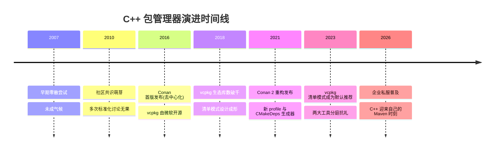
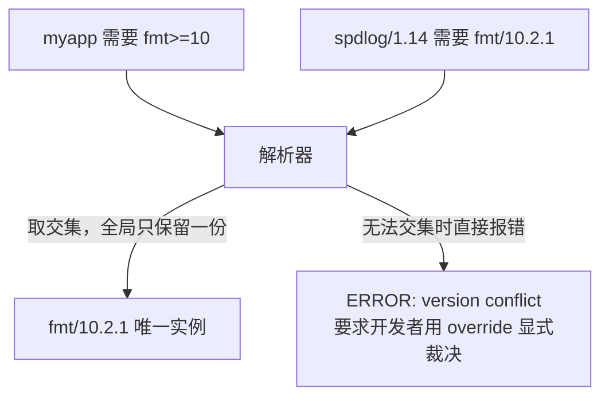

# 包管理器：Conan 与 vcpkg

## 原理

### C++ 依赖管理之痛

Java 有 Maven 中央仓库，JavaScript 有 npm，Rust 有 Cargo——**声明依赖，一条命令拉齐**。C++ 长期没有官方答案，开发者各显神通：

1. **系统包管理器装库**（apt install libboost-dev）：版本由发行版锁定，团队内"我机器上能编"重灾区；
2. **源码拷贝进仓库**（vendor 化）：升级一次库等于一次外科手术；
3. **git submodule**：克隆体验差、版本解析靠人脑；
4. **手写 FetchContent**：能用但每个项目重复造轮子，无二进制缓存、无传递依赖解析。

痛点根源：C++ 没有统一的 ABI 标准（编译器/标准库/STL 版本任一不同即不兼容），二进制分发天然困难；加上平台碎片化（Windows/Linux/macOS × MSVC/GCC/Clang × 静态/动态），问题难度远超 npm。



### 两大主流方案定位

- **vcpkg**：微软背书，目录式注册表（GitHub 上万个 port），与 Visual Studio / MSBuild 深度集成，开箱即用感最强；
- **Conan**：去中心化设计（中央索引 + 任意服务端存制品），Python 写配方表达力强，跨平台与企业级制品管理（Artifactory 私服）支持更完善。

---

## 语法

### vcpkg：安装与 bootstrap

```bash
git clone https://github.com/microsoft/vcpkg.git ~/vcpkg   # 本体只是个工具仓库
~/vcpkg/bootstrap-vcpkg.sh                                  # 下载编译出 vcpkg 可执行文件
~/vcpkg/vcpkg search spdlog                                 # 搜索可用 port
```

### 经典模式 vs 清单模式

经典模式（classic mode）直接全局安装：

```bash
vcpkg install fmt spdlog nlohmann-json    # 装进 vcpkg/installed，所有项目共享
```

缺点：依赖状态记录在 vcpkg 目录而非项目里，换机器无法复现。现代做法是清单模式（manifest mode）——项目根放一份 `vcpkg.json`：

```json
{
  "name": "myapp",
  "version": "1.0.0",
  "dependencies": [
    { "name": "fmt", "version>=": "10.2.1" },
    "spdlog",
    "nlohmann-json"
  ],
  "builtin-baseline": "a1b2c3d4e5f6"
}
```

- `dependencies` 即 pom.xml 的 `<dependencies>`；
- `builtin-baseline` 锁定整个注册表快照（相当于 lockfile 的锚点）；
- 首次 configure 时 CMake 自动触发 vcpkg 安装全部依赖到 `build/vcpkg_installed`，**项目级隔离，互不污染**。

清单模式是当前官方推荐，新项目一律用它。

### triplet 三元组：目标环境描述

triplet 描述"为哪个平台、什么链接方式编译"，本质是一份 CMake 变量预设：

| triplet | 含义 |
|---------|------|
| `x64-linux` | Linux x64 动态链接 |
| `x64-windows` | Windows x64 DLL 动态链接 |
| `x64-windows-static` | Windows x64 全静态链接（MT 运行时） |
| `arm64-osx` | Apple Silicon macOS |

静态/动态的选择会传导给每个依赖库的编译选项——这正是 ABI 问题的工程化解法：**把 ABI 决策显式写进坐标**。同一份 `vcpkg.json` 配不同 triplet 就能产出不同形态的依赖树。

### CMake 一行接入 toolchain 文件

vcpkg 与 CMake 的全部魔法浓缩在一个 toolchain 参数里：

```bash
cmake -B build -DCMAKE_TOOLCHAIN_FILE=$HOME/vcpkg/scripts/buildsystems/vcpkg.cmake
```

toolchain 做了什么：拦截 `find_package`，改从 `vcpkg_installed` 里找；找不到的自动按清单安装再找。之后 CMakeLists.txt 完全不需要感知 vcpkg 的存在：

```cmake
find_package(fmt CONFIG REQUIRED)          # CONFIG 模式加载 fmt 导出的 target
find_package(spdlog CONFIG REQUIRED)
find_package(nlohmann_json CONFIG REQUIRED)

add_executable(myapp main.cpp)
target_link_libraries(myapp PRIVATE
    fmt::fmt
    spdlog::spdlog
    nlohmann_json::nlohmann_json)
```

### Conan 2：conanfile / profile / conan install

Conan 用 Python 语法的配方文件描述依赖，两种载体选其一即可：

```ini
# conanfile.txt —— 声明式，够用党首选
[requires]
fmt/10.2.1
spdlog/1.14.1
nlohmann_json/3.11.3

[generators]
CMakeDeps            # 为每个包生成 *-config.cmake 等 find_package 可消费文件
CMakeToolchain       # 生成 conan_toolchain.cmake（含 ABI/标准库等全局设定）

[layout]
cmake_layout         # 采用社区标准的 build 目录布局
```

复杂需求（条件依赖、自研包）升级为 `conanfile.py`：

```python
from conan import ConanFile

class MyappConan(ConanFile):
    name = "myapp"
    version = "1.0.0"
    settings = "os", "compiler", "build_type", "arch"   # 四元组决定二进制兼容性
    requires = "fmt/10.2.1", "spdlog/1.14.1"

    def requirements(self):
        if self.settings.os == "Windows":
            self.requires("winreg/1.4.1")               # 平台条件依赖
```

profile 是 Conan 对"构建环境"的完整描述（对应 vcpkg 的 triplet 但更细）：

```ini
# ~/.conan2/profiles/default
[settings]
os=Linux
arch=x86_64
compiler=gcc
compiler.version=13
compiler.libcxx=libstdc++11     # 关键项！标准库 ABI 选择
build_type=Release
```

两步走流程：

```bash
pip install conan                       # Conan 本体是 Python 工具
conan profile detect                    # 首次使用自动探测本机生成默认 profile
conan install . --build=missing         # 解析依赖图，缺二进制则本地源码构建
```

`conan install` 执行后产出 `conan_toolchain.cmake` 与一批 `*-config.cmake`，接入 CMake 同样只有一行：

```bash
cmake -B build -DCMAKE_TOOLCHAIN_FILE=build/conan/conan_toolchain.cmake \
      -DCMAKE_BUILD_TYPE=Release
```

CMakeLists.txt 内的 `find_package`/`target_link_libraries` 写法与 vcpkg 方案完全相同——**两大管理器最终都收敛到 CMake 的 config 模式接口上**，这正是现代生态的统一出口。

### vcpkg 与 Conan 对比表

| 维度 | vcpkg | Conan 2 |
|------|-------|---------|
| 背书方 | 微软 | ConanIO（社区+商业版） |
| 仓库模型 | 集中式 GitHub 注册表 | 去中心化（中央索引 + 任意制品库） |
| 配方语言 | CMake port 文件 | Python（表达力强） |
| 环境描述 | triplet | profile（更细粒度） |
| 二进制缓存 | 本地缓存为主，私服需企业方案 | 缓存 + Artifactory/自建服务端成熟 |
| IDE 集成 | Visual Studio 深度绑定 | 通用，靠生成器适配一切构建系统 |
| 上手难度 | 低，MS 用户几乎零配置 | 中，profile 概念需理解 |
| 适合团队 | Windows 为主、中小项目 | 跨平台、大型组织、有私服诉求 |

一句话选型：个人与 Windows 团队用 vcpkg；跨平台大厂、需要二进制私服的用 Conan。

### 私有仓库概念

当公司有内部组件库时，公共仓库无法承载：

- **vcpkg 私有化路径**：fork 注册表仓库做镜像，或用 `vcpkg-configuration.json` 指向自定义 registries；
- **Conan 私服路径**：Artifactory / conan_server 存放二进制包，`conan remote add` 即接入，配合用户认证实现权限分级。

私有仓库解决的不只是"存放"，更是**合规与供应链安全**：所有第三方包经内网代理缓存一次审查后分发，杜绝外网直连带来的投毒风险——这与 Maven 私服 Nexus 的价值完全同构。

### CPM.cmake 一句话

CPM.cmake 是一个几百行的单文件脚本，把 FetchContent 封装出"声明即拉取"体验：`CPMAddPackage("gh:fmtlib/fmt#10.2.1")`。适合不想引入外部工具链、依赖数量少的中小项目；无二进制缓存是它与大牌包管理器的本质差距。

### 传递依赖与版本冲突解析

真实项目的依赖是图不是列表：spdlog 依赖 fmt，你的项目也直接依赖 fmt，两个版本要求不一致怎么办？两大工具的解法同源——**全局唯一化 + 冲突显式上报**：



对比 Maven 的"最近路径优先"静默仲裁，C++ 包管理器选择宁可报错也不猜——因为 ABI 不兼容的两个版本共存于一个进程会直接崩溃，静默仲裁在这里是危险的。遇到冲突时用 `overrides`（vcpkg）或 `conflict`/统一 requires（Conan）手动收敛到同一版本。

### features：可选功能开关

vcpkg 与 Conan 都支持包的 feature（特性）机制，类似 Maven 的 classifier 或 npm 的 optionalDependencies：

```json
{
  "dependencies": [
    { "name": "boost-filesystem", "features": [] },
    { "name": "ffmpeg", "features": ["x264", "openssl"], "default-features": false }
  ]
}
```

```python
# Conan 侧写法
def requirements(self):
    self.requires("opencv/4.9.0")
    self.options["opencv/*"].with_ffmpeg = True     # 打开 opencv 的 ffmpeg 后端
```

按需裁剪能显著缩短首次构建时间（ffmpeg 全特性编译可能超过一小时），也是控制二进制体积的手段。

---

## 实践

实战目标：同一个 CLI 工具项目分别用 vcpkg 和 Conan 引入 **fmt + spdlog + nlohmann-json** 三件套，验证两大方案的收敛性。

### 项目结构

- myapp/
  - CMakeLists.txt （两种方案通用，零修改）
  - main.cpp
  - vcpkg.json （方案 A 的清单）
  - conanfile.txt （方案 B 的配方）

### 共用的 CMakeLists.txt 与 main.cpp

```cmake
cmake_minimum_required(VERSION 3.20)
project(myapp LANGUAGES CXX)

set(CMAKE_CXX_STANDARD 17)
set(CMAKE_CXX_STANDARD_REQUIRED ON)

find_package(fmt CONFIG REQUIRED)
find_package(spdlog CONFIG REQUIRED)
find_package(nlohmann_json CONFIG REQUIRED)

add_executable(myapp main.cpp)
target_link_libraries(myapp PRIVATE
    fmt::fmt spdlog::spdlog nlohmann_json::nlohmann_json)
```

```cpp
// main.cpp —— 三个库各司其职：格式化 / 日志 / JSON 解析
#include <fmt/core.h>
#include <spdlog/spdlog.h>
#include <nlohmann/json.hpp>
#include <string>

using json = nlohmann::json;

int main() {
    // 用 json 构造一条结构化业务数据
    json event = {
        {"user", "alice"},
        {"action", "login"},
        {"ok", true}
    };

    // spdlog 输出日志，fmt 负责其中的格式化片段
    spdlog::info("event={}", event.dump());
    spdlog::warn("retry count: {}/{}", fmt::format("{:>3}", 2), 5);
    return 0;
}
```

### 方案 A：vcpkg 清单模式全流程

```json
{
  "name": "myapp",
  "version-string": "1.0.0",
  "dependencies": [ "fmt", "spdlog", "nlohmann-json" ],
  "builtin-baseline": "<从 vcpkg 仓库取一个 commit hash>"
}
```

```bash
cmake -B build -DCMAKE_TOOLCHAIN_FILE=$HOME/vcpkg/scripts/buildsystems/vcpkg.cmake
cmake --build build && ./build/myapp
```

首次 configure 会自动安装三个依赖到 `build/vcpkg_installed/x64-linux`，全程无需手动干预。

### 方案 B：Conan 2 全流程

```ini
[requires]
fmt/10.2.1
spdlog/1.14.1
nlohmann_json/3.11.3

[generators]
CMakeDeps
CMakeToolchain

[layout]
cmake_layout
```

```bash
conan profile detect                    # 初始化默认 profile
conan install . --build=missing         # 拉取或构建依赖并生成集成文件
cmake --preset conan-release            # Conan 生成的 preset 自动带上 toolchain
cmake --build --preset conan-release
./build/Release/myapp
```

两次运行输出完全一致，证明：**只要库方遵守 config 模式导出规范，消费侧可以自由更换包管理器而代码零改动**。这是现代 C++ 依赖生态最重要的工程性质。

### 最佳实践速查表

| 实践 | 说明 |
|------|------|
| 依赖版本全部锁定 | baseline/tag/revision 缺一不可，禁止浮动到分支 |
| 提交清单文件入库 | vcpkg.json / conanfile.txt 与源码同版本演进 |
| 统一团队 triplet/profile | 收进仓库或脚本，避免成员间 ABI 漂移 |
| CI 缓存依赖目录 | 缓存 vcpkg_installed 或 ~/.conan2/p，提速数分钟到秒级 |
| 第三方只经私服进内网 | 供应链安全的基本盘 |
| 库作者发布双通道 | 同时提供 CMake config 导出与包配方，最大化可被找到 |

---

## 小结

- C++ 依赖之痛源于 ABI 不统一与平台碎片化，包管理器用"环境坐标 + 源码/二进制双轨"工程化绕开；
- vcpkg：bootstrap 安装、清单模式声明依赖、triplet 定 ABI、toolchain 一行接入 CMake；
- Conan 2：conanfile 描述依赖、profile 描述环境、`conan install` 经 CMakeDeps/CMakeToolchain 产出标准 CMake 接口；
- 两者最终都汇入 `find_package(...CONFIG REQUIRED)` 这条统一河道，切换成本低；
- 私服是团队化的必经之路，CPM.cmake 是轻量场景的备胎。

掌握了"库从哪来"，下一章看这些库能做什么：[[cpp教程/cpp第三方库/网络/Web框架实战|Web 框架实战]]。
