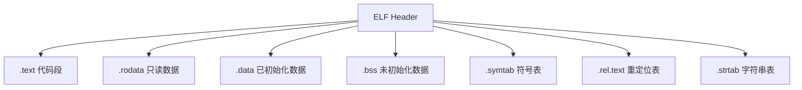

# 第一个C程序 (First C Program)
---

##  章节概述

"Hello, World!" 是每位程序员的第一行代码。本章从最经典的 Hello World 程序出发，逐行解析 C 程序的基本结构：`main()` 函数的签名约定、`#include` 预处理指令、`printf()` 输出函数的用法、编译的四阶段全过程（预处理→编译→汇编→链接）、返回值与退出状态的约定、以及注释的规范使用。学完本章，你将能够独立创建、编译、运行 C 程序，并理解程序从源代码到可执行文件的完整旅程。

> **核心主题**：理解"代码→编译器→机器码→执行"的全流程。本章反复出现的"编译四阶段"是理解 C 语言编译模型的基石，后续所有章节的"宏展开""类型检查""链接错误"等概念都建立在这个基础之上。

---
###  第一节：Hello World 程序逐行解析
---

1.1 完整的 Hello World 程序
----------------------------

```c
#include <stdio.h>

int main() {
    printf("Hello, World!\n");
    return 0;
}
```

这是每个 C 程序员的第一行代码。虽只有 5 行，却包含了 C 程序的所有关键元素。

1.2 `#include <stdio.h>` —— 预处理指令
----------------------------------------

```c
#include <stdio.h>
```

`#include` 是 C 预处理器的指令，**在编译之前**将头文件 `stdio.h` 的全部内容拷贝到当前文件中。

- `<>` 尖括号：在**系统标准头文件目录**中搜索（如 `/usr/include/`）
- `""` 双引号：先在**当前目录**搜索，再到系统目录搜索
- `stdio.h`：Standard Input Output（标准输入输出）头文件，声明了 `printf`、`scanf`、`fopen`、`fgets` 等函数

```c
#include <stdio.h>        // 系统头文件
#include "myheader.h"     // 自定义头文件
#include <math.h>         // 数学函数：sin、cos、sqrt
#include <stdlib.h>       // 标准库：malloc、free、atoi
```

**底层视角**：`#include` 不涉及任何编译或类型检查，它就是一个"文本复制粘贴"操作。当预处理器遇到 `#include <stdio.h>` 时，它读取 `/usr/include/stdio.h` 的全部内容，将其文本插入当前文件。这个过程在"编译四阶段"的第一阶段完成。

1.3 `int main()` —— 程序入口点
-------------------------------

```c
int main() {
    // ...
    return 0;
}
```

`main` 函数是 C 程序的**唯一入口点**。操作系统加载可执行文件后，控制权被转交给 C 运行库（crt0），crt0 初始化堆栈和环境变量后，调用 `main()`。

**main 函数的四种标准形式**：

```c
// 形式1：无参数（C99 及之后，推荐）
int main(void) {
    return 0;
}

// 形式2：无参数（C90 兼容写法）
int main() {
    return 0;
}

// 形式3：带命令行参数
int main(int argc, char *argv[]) {
    return 0;
}

// 形式4：带环境变量（POSIX 扩展）
int main(int argc, char *argv[], char *envp[]) {
    return 0;
}
```

> **关键规则**：
> - `main` 的返回类型必须是 `int`（不是 `void`）
> - `return 0` 表示程序正常退出
> - `return` 非零值表示异常退出（如 `return 1`）
> - 在 C99 标准中，如果 `main` 没有 `return` 语句，编译器会自动插入 `return 0`（仅限 `main` 函数！）

```c
// 演示不同返回值
#include <stdio.h>

int main() {
    printf("This program returns 42.\n");
    return 42;  // 非零返回值，表示异常
}
// 在 shell 中：echo $?  将输出 42
```

1.4 `printf()` —— 格式化输出
-----------------------------

```c
printf("Hello, World!\n");
```

`printf` 是 C 标准库中最重要的输出函数。它将格式化字符串输出到**标准输出**（stdout）。

**格式说明符**：

| 说明符 | 含义 | 示例 |
|--------|------|------|
| `%d` | 有符号十进制整数 | `printf("%d", 42);` → `42` |
| `%u` | 无符号十进制整数 | `printf("%u", 4294967295U);` |
| `%x` / `%X` | 十六进制（小写/大写） | `printf("%x", 255);` → `ff` |
| `%o` | 八进制 | `printf("%o", 8);` → `10` |
| `%f` | 浮点数 | `printf("%f", 3.14);` → `3.140000` |
| `%e` / `%E` | 科学计数法 | `printf("%e", 3.14);` → `3.140000e+00` |
| `%c` | 字符 | `printf("%c", 'A');` → `A` |
| `%s` | 字符串 | `printf("%s", "hello");` → `hello` |
| `%p` | 指针地址 | `printf("%p", (void*)ptr);` |
| `%%` | 百分号本身 | `printf("%%");` → `%` |

**格式修饰符**：

```c
#include <stdio.h>

int main() {
    int n = 42;
    double pi = 3.1415926535;

    // 宽度控制
    printf("|%10d|\n", n);     // |        42|  右对齐，占10位
    printf("|%-10d|\n", n);    // |42        |  左对齐，占10位

    // 精度控制
    printf("%.2f\n", pi);      // 3.14      小数点后2位
    printf("%.5f\n", pi);      // 3.14159   小数点后5位

    // 组合使用
    printf("|%10.2f|\n", pi);  // |      3.14|  总宽度10，精度2

    // 补零
    printf("|%05d|\n", n);     // |00042|     零填充

    // 十六进制
    printf("%#x\n", 255);      // 0xff       带 0x 前缀
    printf("%#X\n", 255);      // 0XFF       大写

    return 0;
}
```

**转义字符**：

| 转义序列 | 含义 | ASCII值 |
|----------|------|---------|
| `\n` | 换行（LF） | 10 |
| `\r` | 回车（CR） | 13 |
| `\t` | 水平制表符 | 9 |
| `\\` | 反斜杠本身 | 92 |
| `\'` | 单引号 | 39 |
| `\"` | 双引号 | 34 |
| `\0` | 空字符（字符串终止符） | 0 |

1.5 `return 0` —— 返回值
-------------------------

```c
return 0;
```

`return` 语句完成两件事：
1. 终止当前函数的执行
2. 将返回值传递给调用者

对于 `main` 函数，返回值被传递给操作系统（通常是 shell）。在 Bash 中，`$?` 变量保存上一个命令的退出状态：

```bash
./hello
echo $?    # 输出 0
```

**标准退出状态约定**：
- `0`（或 `EXIT_SUCCESS`）：程序正常终止
- `1`（或 `EXIT_FAILURE`）：程序异常终止
- 其他非零值：可由程序自定义

```c
#include <stdio.h>
#include <stdlib.h>

int main() {
    int error = 0;

    if (error) {
        printf("Error occurred!\n");
        return EXIT_FAILURE;  // 等价于 return 1
    }

    printf("Success!\n");
    return EXIT_SUCCESS;      // 等价于 return 0
}
```

###  小节练习

> [!question] 选择题 1
> C 程序中 `main` 函数的返回类型必须是什么？
> - [ ] A. `void`
> - [ ] B. `int`
> - [ ] C. `char`
> - [ ] D. 没有要求
>
> > [!success]- 点击查看答案
> > 正确答案: B
> > **解析**: C 语言标准规定 `main` 函数的返回类型必须是 `int`。`void main()` 虽然在某些编译器上能通过，但不是标准 C 写法。

> [!question] 选择题 2
> `printf("%.3f", 3.14159)` 的输出是什么？
> - [ ] A. `3.14`
> - [ ] B. `3.141`
> - [ ] C. `3.142`
> - [ ] D. `3.14159`
>
> > [!success]- 点击查看答案
> > 正确答案: C
> > **解析**: `%.3f` 表示小数点后保留 3 位，第 4 位（5）进行四舍五入。3.14159 保留 3 位小数后为 3.142。

---
###  第二节：编译四阶段详解
---

2.1 阶段概览
-------------

C 语言从源代码到可执行文件，需要经过四个阶段：

```
hello.c  ──▶  hello.i  ──▶  hello.s  ──▶  hello.o  ──▶  hello (可执行文件)
(源文件)    (预处理后)    (汇编代码)    (目标文件)    (可执行文件)
   │            │            │            │            │
   │  预处理     │   编译     │   汇编     │   链接     │
   │  cpp       │   cc1      │   as       │   ld       │
```

```bash
# 完整四步骤演示
gcc -E hello.c -o hello.i   # 步骤1: 预处理
gcc -S hello.i -o hello.s   # 步骤2: 编译
gcc -c hello.s -o hello.o   # 步骤3: 汇编
gcc hello.o -o hello        # 步骤4: 链接

# 一键完成
gcc hello.c -o hello
```

2.2 第一阶段：预处理（Preprocessing）
--------------------------------------

预处理器处理所有以 `#` 开头的指令：

```c
// 演示预处理器行为
#include <stdio.h>          // 展开整个 stdio.h 文件
#define PI 3.14159          // 宏定义
#define SQUARE(x) ((x)*(x)) // 宏函数

int main() {
    double area = PI * SQUARE(5);
    printf("PI = %f, Area = %f\n", PI, area);
    return 0;
}
```

```bash
gcc -E demo.c -o demo.i
# demo.i 可能是数万行代码！
# PI 和 SQUARE(5) 已被文本替换
```

预处理器的具体工作：
- **文件包含**：`#include` → 将头文件内容插入
- **宏展开**：`#define` → 文本替换
- **条件编译**：`#ifdef` / `#ifndef` / `#endif` → 选择性保留代码
- **行号标记**：插入 `#line` 指令供后续编译阶段报错使用

```c
// 条件编译示例
#include <stdio.h>

#define DEBUG 1

int main() {
#ifdef DEBUG
    printf("Debug mode: x = %d\n", 42);  // 当 DEBUG 被定义时才会编译这行
#endif
    printf("Hello\n");
    return 0;
}
```

2.3 第二阶段：编译（Compilation）
---------------------------------

编译器（GCC 中为 `cc1` 程序）将预处理后的 C 代码翻译为**汇编代码**（.s 文件）。

```bash
gcc -S hello.i -o hello.s    # 从预处理文件生成汇编
# 或直接
gcc -S hello.c -o hello.s    # gcc 自动先预处理再编译
```

```
; 一个简单的 hello.c 编译后的汇编代码（x86-64, AT&T语法）
        .section    .rodata
.LC0:
        .string "Hello, World!"
        .text
        .globl  main
        .type   main, @function
main:
        pushq   %rbp
        movq    %rsp, %rbp
        leaq    .LC0(%rip), %rdi      ; 将字符串地址放入 rdi (第一个参数)
        call    puts@PLT              ; 调用 puts（编译器优化了 printf）
        movl    $0, %eax
        popq    %rbp
        ret
```

编译器的工作包括：
- **词法分析**：将源代码分解为 token（关键词、标识符、运算符、字面量）
- **语法分析**：根据 C 语言语法构建抽象语法树（AST）
- **语义分析**：类型检查、作用域检查
- **中间代码生成**：生成 GIMPLE（GCC 的中间表示）
- **优化**：在中间表示层面进行优化（`-O1` / `-O2` / `-O3`）
- **目标代码生成**：生成特定 CPU 架构的汇编代码

> 编译器是 C 语言的"翻译官"，也是理解 C 语言底层行为的关键。汇编语言的详细内容见  和 。

2.4 第三阶段：汇编（Assembly）
------------------------------

汇编器（GCC 中调用 `as`，GNU Assembler）将汇编代码翻译为**机器码**，生成**目标文件**（.o 文件）。

```bash
gcc -c hello.s -o hello.o    # 从汇编文件生成目标文件
```

目标文件包含：
- **机器指令**：CPU 可直接执行的二进制指令
- **数据段**：初始化的全局变量和静态变量
- **符号表**：导出的（`exported`）和未解析的（`unresolved`）符号引用
- **重定位信息**：哪些位置的地址需要在链接时修正

```bash
# 查看目标文件的符号表
objdump -t hello.o

# 查看反汇编
objdump -d hello.o

# 查看文件头信息
readelf -h hello.o
```

**可重定位目标文件（ELF）结构**：



2.5 第四阶段：链接（Linking）
------------------------------

链接器（GCC 中调用 `ld`）将一个或多个目标文件、静态库、动态库合并为一个**可执行文件**。

```bash
gcc hello.o -o hello         # 链接生成可执行文件
```

**链接器的工作**：
1. **符号解析**：将目标文件中对 `printf` 等外部函数的引用解析到 libc 中的实际地址
2. **重定位**：将目标文件中占位符地址替换为实际内存地址
3. **段合并**：将多个 .o 文件的 .text / .data / .bss 段合并

```
目标文件1: main.o       目标文件2: utils.o        C 库: libc.a
┌──────────────┐       ┌──────────────┐       ┌──────────────┐
│ .text (main) │       │ .text (utils)│       │ .text (printf)│
│ 引用 printf  │────┐  │              │       │◄─────────────┘
│ 引用 sqrt    │──┐ │  │              │       │┌─────────────┐
├──────────────┤  │ │  ├──────────────┤       ││ libm.a      │
│ .data        │  │ │  │ .data        │       ││ .text (sqrt) │
└──────────────┘  │ │  └──────────────┘       ││◄────────────┘
                  │ │                         │└─────────────┘
                  ▼ ▼                         ▼
              ┌────────────────────────────────────┐
              │         可执行文件 (hello)          │
              │  .text (main + utils + printf...) │
              │  .data (合并)                      │
              │  符号全部解析完毕                   │
              └────────────────────────────────────┘
```

```bash
# 查看可执行文件依赖的动态库
ldd hello

# 典型输出：
# linux-vdso.so.1
# libc.so.6 => /lib/x86_64-linux-gnu/libc.so.6
# /lib64/ld-linux-x86-64.so.2
```

> 编译原理的深入讲解见 。C++ 的编译过程与 C 完全相同，只是多出了名称修饰（name mangling）等 C++ 特有步骤。

###  小节练习

> [!question] 选择题 1
> C 程序编译中，宏 `#define PI 3.14` 在哪个阶段被替换为 `3.14`？
> - [ ] A. 预处理阶段
> - [ ] B. 编译阶段
> - [ ] C. 汇编阶段
> - [ ] D. 链接阶段
>
> > [!success]- 点击查看答案
> > 正确答案: A
> > **解析**: 宏展开是预处理器的核心工作之一。在编译阶段之前，所有 `#define` 宏都已被替换为对应的文本。编译阶段看到的代码中已经不存在宏名。

> [!question] 选择题 2
> 链接器报错 `undefined reference to 'foo'` 通常意味着什么？
> - [ ] A. `foo` 的声明语法错误
> - [ ] B. `foo` 的类型不匹配
> - [ ] C. 找不到 `foo` 函数的定义（实现）
> - [ ] D. `foo` 被定义了多次
>
> > [!success]- 点击查看答案
> > 正确答案: C
> > **解析**: "undefined reference" 错误发生在链接阶段，表示某个符号被引用（如调用了函数 `foo`），但链接器在所有目标文件和库中都找不到它的定义。

---
###  第三节：注释与代码规范
---

3.1 C 语言注释方式
-------------------

C 语言支持两种注释：

```c
#include <stdio.h>

/*
 * 多行注释（C89 风格）
 * 使用 /* 开始，*/ 结束
 * 不能嵌套！
 */

int main() {
    // 单行注释（C99 风格）
    // 从 // 开始到行尾都是注释
    int x = 42;  // 行尾注释

    printf("x = %d\n", x);
    return 0;  // 返回 0
}
```

注意事项：
- C89 的 `/* */` 注释**不能嵌套**：`/* a /* b */ c */` 会导致 c 后的 `*/` 成为语法错误
- C99 的 `//` 单行注释更安全，推荐作为日常注释方式
- `/** */` 文档注释不是 C 语言标准，但 Doxygen 等工具支持

3.2 注释的最佳实践
-------------------

```c
/**
 * 计算斐波那契数列第 n 项
 * @param n 非负整数，表示位置
 * @return 第 n 项的斐波那契数
 * 时间复杂度: O(2^n)
 */
int fibonacci(int n) {
    // 基准情况
    if (n <= 1) return n;

    // 递归计算
    return fibonacci(n - 1) + fibonacci(n - 2);
}

// 坏注释：重复代码（废话）
// int x = 5;  // 将 x 赋值为 5

// 好注释：解释为什么
int offset = 4;  // 跳过文件头部的 4 字节魔术数字
```

3.3 C 代码风格约定
-------------------

本教程采用以下代码风格（基于 Linux 内核风格）：

```c
#include <stdio.h>
#include <stdlib.h>

// 常量使用大写 + 下划线
#define MAX_SIZE 1024

// 函数名使用小写 + 下划线
int calculate_sum(int arr[], int n) {
    int sum = 0;

    // 缩进使用 4 个空格（或一个 tab 显示为 4 空格）
    for (int i = 0; i < n; i++) {
        sum += arr[i];
    }

    return sum;
}

// 大括号：函数的大括号另起一行，控制流的大括号同行
int main() {
    int arr[] = {1, 2, 3, 4, 5};
    int n = sizeof(arr) / sizeof(arr[0]);

    printf("Sum = %d\n", calculate_sum(arr, n));
    return 0;
}
```

###  小节练习

> [!question] 判断题 1
> C 语言中 `/* */` 注释可以嵌套使用。 （ ）
> - [ ]  正确
> - [ ]  错误
>
> > [!success]- 点击查看答案
> > 答案: 错误
> > **解析**: C 语言的 `/* */` 注释不支持嵌套。当编译器遇到第一个 `*/` 时注释就结束了，后面的 `*/` 会变成语法错误。

---
###  第四节：C 与 C++ 输出的对比
---

4.1 printf vs cout
------------------

| 特性 | C `printf` | C++ `cout` |
|------|-----------|-----------|
| 头文件 | `<stdio.h>` | `<iostream>` |
| 语法 | 函数调用 | 流操作符 |
| 类型安全 | 否（格式串决定） | 是（编译时类型推断） |
| 性能 | 通常更快 | 默认与 stdio 同步，可能更慢 |
| 格式化 | 格式串控制 | 操控器（`setw`、`fixed`） |
| 自定义类型 | 不支持 | 支持（重载 `<<`） |

```c
// C 语言方式
#include <stdio.h>

int main() {
    int age = 25;
    double score = 98.5;
    char name[] = "张三";

    printf("姓名: %s\n", name);
    printf("年龄: %d\n", age);
    printf("成绩: %.1f\n", score);

    // 组合输出
    printf("%s今年%d岁，成绩是%.1f分\n", name, age, score);
    return 0;
}
```

```cpp
// C++ 语言方式（对比参考）
#include <iostream>
#include <iomanip>

int main() {
    int age = 25;
    double score = 98.5;
    std::string name = "张三";

    std::cout << "姓名: " << name << std::endl;
    std::cout << "年龄: " << age << std::endl;
    std::cout << "成绩: " << std::fixed << std::setprecision(1)
              << score << std::endl;
    return 0;
}
```

> C++ 的输入输出体系比 C 更类型安全，但 C 的 `printf` 在小规模输出场景下更简洁。详见 [[../../cpp教程/cpp基础教程/04_第一个程序与输入输出|CPP教程: 第一个程序与输入输出]]。

4.2 C 程序的内存视角
---------------------

下面从汇编角度理解 `printf` 的参数传递：

```c
#include <stdio.h>

int main() {
    int a = 10;
    printf("a = %d\n", a);
    return 0;
}
```

在 x86-64 Linux 系统中，`printf` 的前两个参数分别通过 `rdi` 和 `rsi` 寄存器传递：

```
; 对应的汇编代码（简化）
movl    $10, -4(%rbp)       ; a = 10，存入栈上局部变量
leaq    .LC0(%rip), %rdi    ; 第1参数: 格式字符串地址 → rdi
movl    -4(%rbp), %esi      ; 第2参数: a 的值 → esi
call    printf@PLT           ; 调用 printf
```

> 参数传递约定详见 。

###  小节练习

> [!question] 选择题 1
> 以下关于 C `printf` 的说法正确的是？
> - [ ] A. `printf` 在编译时检查类型匹配
> - [ ] B. `printf` 通过格式串在运行时确定参数类型
> - [ ] C. `printf` 自动推导参数类型
> - [ ] D. `printf` 不需要格式串
>
> > [!success]- 点击查看答案
> > 正确答案: B
> > **解析**: `printf` 是 C 的可变参数函数，其类型检查依赖于格式串。如果用 `%d` 打印 `double` 类型的值，编译器通常只会给出警告（且需启用 `-Wall`），运行时会输出错误结果。这是 C 的 `printf` 与 C++ 的 `cout` 最重要的区别。

---
###  第五节：多文件编译初体验
---

5.1 多文件项目结构
-------------------

```
project/
├── main.c          # 程序入口
├── math_utils.c    # 数学工具函数
├── math_utils.h    # 数学工具函数声明（接口）
└── string_utils.c  # 字符串工具函数
└── string_utils.h  # 字符串工具函数声明
```

```c
// math_utils.h —— 头文件（接口声明）
#ifndef MATH_UTILS_H
#define MATH_UTILS_H

int add(int a, int b);
int multiply(int a, int b);

#endif
```

```c
// math_utils.c —— 实现文件
#include "math_utils.h"

int add(int a, int b) {
    return a + b;
}

int multiply(int a, int b) {
    return a * b;
}
```

```c
// main.c —— 主程序
#include <stdio.h>
#include "math_utils.h"    // 包含自定义头文件

int main() {
    int x = 10, y = 20;
    printf("%d + %d = %d\n", x, y, add(x, y));
    printf("%d * %d = %d\n", x, y, multiply(x, y));
    return 0;
}
```

```bash
# 分步编译
gcc -c main.c -o main.o
gcc -c math_utils.c -o math_utils.o
gcc main.o math_utils.o -o program

# 一键编译
gcc main.c math_utils.c -o program
```

5.2 `#ifndef` / `#define` / `#endif` 头文件保护
----------------------------------------------------

```c
#ifndef MATH_UTILS_H    // 如果未定义 MATH_UTILS_H
#define MATH_UTILS_H    // 定义它

// 头文件内容

#endif                  // 结束条件
```

这种"头文件保护"防止同一个头文件被多次包含导致重复定义错误。在大型项目中，一个头文件可能被多个 .c 文件间接包含，没有保护符号会导致编译错误。

> 多文件编译和模块化管理详见 [[../2深化/09_多文件与模块化]]。

###  小节练习

> [!question] 选择题 1
> `#ifndef` / `#define` / `#endif` 在头文件中的作用是？
> - [ ] A. 加速编译
> - [ ] B. 防止头文件被重复包含
> - [ ] C. 优化代码大小
> - [ ] D. 语法高亮
>
> > [!success]- 点击查看答案
> > 正确答案: B
> > **解析**: 头文件保护（include guard）确保同一个头文件在同一个编译单元中最多被包含一次，避免结构体、函数声明等的重复定义错误。

---

##  章节测试

### 一、判断题（正确选，错误选）

> [!question] 判断题 1
> `main` 函数的参数名 `argc` 和 `argv` 是 C 语言中不可更改的关键字。 （ ）
> - [ ]  正确
> - [ ]  错误
>
> > [!success]- 点击查看答案
> > 答案: 错误
> > **解析**: `argc` 和 `argv` 只是**约定俗成的参数名**，不是 C 关键字。你可以将 `int main(int argc, char *argv[])` 写成 `int main(int count, char *args[])`，效果一样。

> [!question] 判断题 2
> `gcc -E` 命令输出的预处理文件中不包含任何 C 注释。 （ ）
> - [ ]  正确
> - [ ]  错误
>
> > [!success]- 点击查看答案
> > 答案: 正确
> > **解析**: 预处理器会将所有注释替换为空格，所以 `gcc -E` 的输出中不会出现注释。

> [!question] 判断题 3
> `printf` 函数的声明位于 `stdio.h` 头文件中。 （ ）
> - [ ]  正确
> - [ ]  错误
>
> > [!success]- 点击查看答案
> > 答案: 正确
> > **解析**: `printf` 的声明在 `stdio.h`（Standard Input Output）头文件中。这是 C 标准规定的位置。

> [!question] 判断题 4
> C 程序可以不写 `main` 函数，用其他函数作为程序入口。 （ ）
> - [ ]  正确
> - [ ]  错误
>
> > [!success]- 点击查看答案
> > 答案: 错误
> > **解析**: 标准 C 程序必须有一个 `main` 函数作为入口。虽然编译器允许通过链接脚本等方式指定其他入口符号，但这不是标准 C 行为且不推荐。

> [!question] 判断题 5
> 编译器（cc1）在编译阶段会进行类型检查。 （ ）
> - [ ]  正确
> - [ ]  错误
>
> > [!success]- 点击查看答案
> > 答案: 正确
> > **解析**: 类型检查是编译阶段的核心工作之一（语义分析）。预处理阶段不涉及类型检查，汇编阶段处理的是已通过类型检查的汇编代码。

> [!question] 判断题 6
> C 语言中 `#include <file>` 和 `#include "file"` 效果完全相同。 （ ）
> - [ ]  正确
> - [ ]  错误
>
> > [!success]- 点击查看答案
> > 答案: 错误
> > **解析**: `<>` 只在系统目录搜索，`""` 先搜索当前目录再搜索系统目录。两者搜索路径有优先级差异。

> [!question] 判断题 7
> 目标文件（.o）是纯文本文件，可以用文本编辑器直接阅读。 （ ）
> - [ ]  正确
> - [ ]  错误
>
> > [!success]- 点击查看答案
> > 答案: 错误
> > **解析**: 目标文件是二进制格式（ELF 格式），包含机器码、数据、符号表等。需要用 `objdump`、`readelf` 等工具查看，不能直接文本阅读。

> [!question] 判断题 8
> `return` 语句后面的代码仍然会被执行。 （ ）
> - [ ]  正确
> - [ ]  错误
>
> > [!success]- 点击查看答案
> > 答案: 错误
> > **解析**: `return` 语句会立即终止当前函数的执行，返回到调用者。`return` 后面的代码成为"死代码"（dead code），永远不会被执行。

> [!question] 判断题 9
> C 语言中，`//` 注释在 C89 标准中是被支持的。 （ ）
> - [ ]  正确
> - [ ]  错误
>
> > [!success]- 点击查看答案
> > 答案: 错误
> > **解析**: `//` 单行注释是 C99 标准引入的特性。在 C89/C90 标准中，只有 `/* */` 多行注释。不过现代编译器即使在 C89 模式下也通常支持 `//`。

> [!question] 判断题 10
> 链接器（ld）可以将 .c 源文件直接链接为可执行文件。 （ ）
> - [ ]  正确
> - [ ]  错误
>
> > [!success]- 点击查看答案
> > 答案: 错误
> > **解析**: 链接器的输入是目标文件（.o 文件）、静态库（.a 文件）和动态库（.so 文件），不能直接处理 .c 源文件。源文件必须先经过预处理、编译、汇编生成 .o 后才能被链接器处理。

---

### 二、选择题（单项选择题）

> [!question] 选择题 1
> 以下哪个编译选项只进行编译和汇编，不进行链接？
> - [ ] A. `-E`
> - [ ] B. `-S`
> - [ ] C. `-c`
> - [ ] D. `-o`
>
> > [!success]- 点击查看答案
> > 正确答案: C
> > **解析**: `-c` 执行预处理、编译、汇编三个阶段，生成 .o 目标文件但不链接。`-E` 仅预处理，`-S` 生成汇编代码。

> [!question] 选择题 2
> `printf("%05d", 42)` 输出什么？
> - [ ] A. `   42`
> - [ ] B. `42   `
> - [ ] C. `00042`
> - [ ] D. `42000`
>
> > [!success]- 点击查看答案
> > 正确答案: C
> > **解析**: `%05d` 表示总宽度 5，用 0 填充空位，右对齐。42 占 2 位，前面用 3 个 0 填充，结果为 `00042`。

> [!question] 选择题 3
> 以下哪个不是合法的 `main` 函数声明形式？
> - [ ] A. `int main(void)`
> - [ ] B. `int main(int argc, char *argv[])`
> - [ ] C. `int main(int argc, char **argv)`
> - [ ] D. `void main(void)`
>
> > [!success]- 点击查看答案
> > 正确答案: D
> > **解析**: C 语言标准规定 `main` 返回类型必须是 `int`。`void main(void)` 虽然某些编译器接受，但不是标准 C。

> [!question] 选择题 4
> C 语言中程序正常退出的退出状态码约定是？
> - [ ] A. `-1`
> - [ ] B. `0`
> - [ ] C. `1`
> - [ ] D. `255`
>
> > [!success]- 点击查看答案
> > 正确答案: B
> > **解析**: `0` 或 `EXIT_SUCCESS`（定义为 0）表示程序正常退出。非零值（如 `1`、`EXIT_FAILURE`）表示异常退出。这是 POSIX 和 C 标准的约定。

> [!question] 选择题 5
> 编译过程中，语法错误在哪个阶段被检测出来？
> - [ ] A. 预处理
> - [ ] B. 编译
> - [ ] C. 汇编
> - [ ] D. 链接
>
> > [!success]- 点击查看答案
> > 正确答案: B
> > **解析**: 语法检查（语法分析、语义分析）是编译阶段的工作。预处理阶段只做文本替换，不检查语法。链接阶段报的是"符号未定义"等错误。

> [!question] 选择题 6
> 关于 `#include <stdio.h>` 说法正确的是？
> - [ ] A. 它导入了 stdio 库的二进制代码
> - [ ] B. 它搜索当前目录下的 stdio.h
> - [ ] C. 它搜索系统标准目录下的 stdio.h 并插入其文本
> - [ ] D. 它是一个运行时指令
>
> > [!success]- 点击查看答案
> > 正确答案: C
> > **解析**: `#include` 是预处理指令，在编译前将系统头文件的**文本内容**插入到当前文件。它不是导入二进制代码，也不在运行时生效。

> [!question] 选择题 7
> `objdump -d program` 命令显示什么？
> - [ ] A. 程序原代码
> - [ ] B. 程序的反汇编代码
> - [ ] C. 程序的符号表
> - [ ] D. 程序的 ELF 头
>
> > [!success]- 点击查看答案
> > 正确答案: B
> > **解析**: `objdump -d` 反汇编可执行文件中的代码段，显示对应的汇编指令。`-t` 显示符号表，`-h` 显示段头。

> [!question] 选择题 8
> `\n` 转义字符在 ASCII 表中的值是？
> - [ ] A. 0
> - [ ] B. 10
> - [ ] C. 13
> - [ ] D. 32
>
> > [!success]- 点击查看答案
> > 正确答案: B
> > **解析**: `\n`（换行，Line Feed）的 ASCII 值是 10（0x0A）。`\r`（回车，Carriage Return）的 ASCII 值是 13（0x0D）。在 Linux 上文本行以 `\n` 结尾，Windows 上以 `\r\n` 结尾。

> [!question] 选择题 9
> 以下哪个不是 C 标准要求的编译阶段？
> - [ ] A. 预处理
> - [ ] B. 编译
> - [ ] C. 汇编
> - [ ] D. 类型擦除
>
> > [!success]- 点击查看答案
> > 正确答案: D
> > **解析**: C 标准的翻译阶段包括预处理、编译、汇编、链接。C 语言没有"类型擦除"这个概念——它是 Java 等语言的泛型实现技术。

> [!question] 选择题 10
> 以下代码在 GCC 中编译会怎样？
> ```c
> int main() {
>     printf("Hello");
> }
> ```
> - [ ] A. 编译错误，因为没包含 `stdio.h`
> - [ ] B. 编译通过但链接失败
> - [ ] C. 编译通过但产生警告
> - [ ] D. 编译通过且无任何警告
>
> > [!success]- 点击查看答案
> > 正确答案: C
> > **解析**: 没有包含 `stdio.h` 时编译器会对 `printf` 进行隐式函数声明（C90 允许，C99 开始已移除但 GCC 默认宽容处理），并产生 `implicit declaration of function` 警告。程序可以链接成功（libc 自动链接），但这是不好的做法。

---

### ️ 动手练习题

> [!example] 练习题 1：自定义问候程序
> **难度**: 
> 
> 编写一个程序，用 `printf` 输出以下内容：
> ```
> ======================
>   Welcome to C World!
> ======================
> ```
> 要求：
> - 边界用 `=` 符号
> - 文字居中（手动计算空格数，或使用宽度格式）
> - 程序返回 `EXIT_SUCCESS`

> [!example] 练习题 2：编译流程分解
> **难度**: 
> 
> 编写一个含 `#define` 宏、`#include <stdio.h>`、条件编译 `#ifdef` 的 C 程序，然后：
> 1. 用 `gcc -E` 查看预处理后的代码（观察宏展开、头文件内容）
> 2. 用 `gcc -S` 查看汇编代码（尝试辨认 `main` 标签和 `call` 指令）
> 3. 用 `gcc -c` 生成 .o 文件，用 `objdump -d` 查看反汇编
> 4. 对比静态链接和动态链接生成的可执行文件大小
> 
> 洛谷练习：https://www.luogu.com.cn/problem/P1001 （A+B Problem，用 C 语言 `printf` 和 `scanf` 实现）

> [!example] 练习题 3：多文件项目
> **难度**: 
> 
> 创建一个三文件项目：
> - `main.c`：程序入口，接收命令行参数
> - `calc.c` / `calc.h`：提供 `add`、`subtract`、`multiply`、`divide` 函数
> - `display.c` / `display.h`：提供格式化输出函数
> 
> 在 `main` 中根据命令行参数选择执行的操作：
> ```bash
> ./program add 10 20    # 输出 30
> ./program mul 5 6      # 输出 30
> ```
> 编写 Makefile 构建该项目。

> [!example] 练习题 4：汇编层观察
> **难度**: 
> 
> 编写几个简单的 C 函数（加减乘除、条件判断、循环），使用 `gcc -S` 生成汇编代码。对比：
> - `int add(int a, int b) { return a + b; }` 的汇编
> - 带 `if/else` 的函数汇编
> - 带 `for` 循环的函数汇编
> 
> 用注释在汇编代码中标注每条 C 语句对应的汇编指令。参考 。

> [!example] 练习题 5：编译错误与警告练习
> **难度**: 
>
> 洛谷练习：https://www.luogu.com.cn/problem/P1421 （小玉买文具）
> 
> 用 C 语言完成后，尝试以下操作：
> - 故意去掉 `#include <stdio.h>`，观察编译器警告
> - 故意把 `printf` 写成 `Printf`，观察链接错误
> - 故意把 `%d` 写成 `%f` 而传入整数，观察运行时输出
> - 启用 `-Wall -Wextra -Werror`，体会严格警告的好处
