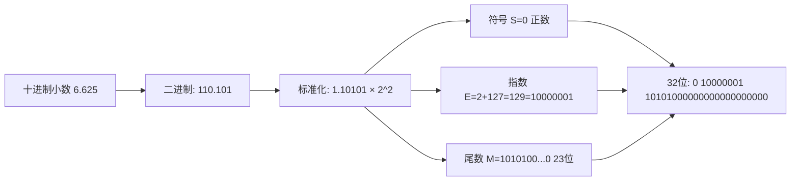

# 变量与数据类型 (Variables & Data Types)
---

##  章节概述

变量是 C 语言存储数据的基本单元，数据类型决定了变量占用多少内存、能存储什么样的值、以及 CPU 如何解释这些位模式。本章从 C 语言的基本数据类型出发，深入讲解 `int`/`short`/`long`/`long long` 的跨平台大小差异、`float`/`double` 的 IEEE 754 浮点表示、`char` 的 ASCII 本质、`signed` vs `unsigned` 的根本区别（C 语言最易出错的陷阱之一）、整型提升规则、隐式/显式类型转换、以及 `const`/`volatile`/`static`/`extern` 等存储类关键字。本章的"底层原理"部分详细展示了每种数据类型在内存中的位布局，为理解后续的指针、数组、结构体内存布局打下坚实基础。

> **核心主题**：理解"变量 = 内存块 + 解释方式"。C 语言的高效源于它让你直接控制内存中每个字节的解读方式——同样的 4 个字节，声明为 `int` 就是有符号整数，声明为 `unsigned int` 就是无符号整数，声明为 `float` 就是 IEEE 754 浮点数。这种"无保护"的灵活性是 C 语言的利刃，也是它最危险的武器。

---
###  第一节：基本数据类型全景
---

1.1 整数类型家族
-----------------

C 语言的整数类型按大小从小到大排列：

| 类型 | C 标准保证的最小位宽 | x86-64 常见大小 | 范围（32位为例） |
|------|-------------------|---------------|----------------|
| `_Bool` | 1 字节 | 1 字节 | 0 或 1 |
| `char` | 1 字节 | 1 字节 | -128 ~ 127 或 0 ~ 255 |
| `short` | 16 位（2 字节） | 2 字节 | -32768 ~ 32767 |
| `int` | 16 位（2 字节） | **4 字节** | -2^31 ~ 2^31-1 |
| `long` | 32 位（4 字节） | **8 字节**（Linux） | **平台相关！** |
| `long long` | 64 位（8 字节） | 8 字节 | -2^63 ~ 2^63-1 |

> **关键陷阱**：`int` 和 `long` 的大小**不是跨平台一致的**！
> - 在 32 位 Linux/Windows 上：`int` = 4 字节，`long` = 4 字节
> - 在 64 位 Linux 上：`int` = 4 字节，`long` = **8 字节**（LP64 模型）
> - 在 64 位 Windows 上：`int` = 4 字节，`long` = **4 字节**（LLP64 模型）
> - `long long` 在所有平台上都是 8 字节

**C 标准对不同模型的定义**：

```
模型     int     long    long long   指针    常见系统
ILP32    32      32      64          32      32位 Linux
LP64     32      64      64          64      64位 Linux/macOS
LLP64    32      32      64          64      64位 Windows
ILP64    64      64      64          64      极少使用
```

1.2 用 `sizeof` 验证
--------------------

```c
#include <stdio.h>

int main() {
    printf("=== 整数类型大小（字节） ===\n");
    printf("_Bool:       %zu\n", sizeof(_Bool));
    printf("char:        %zu\n", sizeof(char));
    printf("short:       %zu\n", sizeof(short));
    printf("int:         %zu\n", sizeof(int));
    printf("long:        %zu\n", sizeof(long));
    printf("long long:   %zu\n", sizeof(long long));

    printf("\n=== 指针类型大小 ===\n");
    printf("char*:       %zu\n", sizeof(char*));
    printf("int*:        %zu\n", sizeof(int*));
    printf("void*:       %zu\n", sizeof(void*));

    return 0;
}
```

> 在你的机器上运行这段代码！结果是理解后续所有"底层原理"的前提。本教程假定你的机器运行的是 64 位 Linux（LP64 模型），即 `long` = 8 字节。

1.3 `<limits.h>` 中的极限值
---------------------------

```c
#include <stdio.h>
#include <limits.h>

int main() {
    printf("INT_MIN:    %d\n", INT_MIN);
    printf("INT_MAX:    %d\n", INT_MAX);
    printf("UINT_MAX:   %u\n", UINT_MAX);
    printf("LLONG_MIN:  %lld\n", LLONG_MIN);
    printf("LLONG_MAX:  %lld\n", LLONG_MAX);
    printf("SCHAR_MIN:  %d\n", SCHAR_MIN);
    printf("SCHAR_MAX:  %d\n", SCHAR_MAX);
    printf("UCHAR_MAX:  %d\n", UCHAR_MAX);

    return 0;
}
```

###  小节练习

> [!question] 选择题 1
> 在 64 位 Linux 上，`sizeof(long)` 的值是？
> - [ ] A. 2
> - [ ] B. 4
> - [ ] C. 8
> - [ ] D. 取决于平台，无法确定
>
> > [!success]- 点击查看答案
> > 正确答案: C
> > **解析**: 64 位 Linux 采用 LP64 数据模型，其中 `long` 为 8 字节（64 位）。但 64 位 Windows 上 `long` 为 4 字节——这是跨平台 C 编程必须注意的陷阱！

> [!question] 选择题 2
> C 标准规定 `int` 的最小位宽是多少？
> - [ ] A. 8 位
> - [ ] B. 16 位
> - [ ] C. 32 位
> - [ ] D. 64 位
>
> > [!success]- 点击查看答案
> > 正确答案: B
> > **解析**: C 标准要求 `int` 至少 16 位（2 字节）。现代平台上 `int` 通常是 32 位，但 C 语言只保证了最低 16 位的下限——这体现了 C "最小保证"的哲学。

---
###  第二节：signed vs unsigned —— C 语言最关键的区分
---

2.1 signed 和 unsigned 的本质区别
----------------------------------

```c
// 同一个 4 字节内存块，不同声明意味着不同的解释方式
int           a = -1;     // 有符号：11111111 11111111 11111111 11111111
unsigned int  b =  1;     // 无符号：00000000 00000000 00000000 00000001

// 如果我们强行把 a 的位模式解读为 unsigned：
unsigned int  c = a;      // c = 4294967295（即 2^32 - 1）
```

`signed` 和 `unsigned` 不是两个不同的"类型"，而是对同样位模式的两种**解释方式**：

```
同一内存字节：11111111 11111111 11111111 11111111
├── 解释为 int（补码）         → -1
└── 解释为 unsigned int（纯二进制）→ 4294967295
```

CPU 在做加法/减法时并不区分 signed/unsigned——加法器对同一组位执行完全相同的运算。区分在于"如何解释结果"和"哪些标志位被设置"。

> 汇编层面：有符号比较使用 `jg`/`jl`（检查 SF 和 OF），无符号比较使用 `ja`/`jb`（检查 CF）。详见 。

2.2 补码（Two's Complement）表示
---------------------------------

C 语言（C99 起）要求有符号整数使用补码表示。

**补码计算规则**：
1. 正数：直接二进制表示
2. 负数：将对应正数按位取反后加 1

```
以 8 位为例：

 5 = 00000101
-5 = 11111010 + 1 = 11111011

验证：5 + (-5) = 00000101 + 11111011 = 00000000 (进位溢出被丢弃) = 0 
```

```c
#include <stdio.h>

int main() {
    int x = 5;
    int y = -5;

    printf(" 5 = 0x%08X\n", x);    // 0x00000005
    printf("-5 = 0x%08X\n", y);    // 0xFFFFFFFB

    // 按位取反后加1
    printf("~5 + 1 = 0x%08X\n", ~5 + 1);  // 0xFFFFFFFB = -5

    return 0;
}
```

2.3 unsigned 的常见陷阱
-----------------------

**陷阱1：回绕（Wraparound）**

```c
#include <stdio.h>
#include <limits.h>

int main() {
    unsigned int u = 0;

    u = u - 1;
    printf("0 - 1 = %u\n", u);          // 4294967295（回绕到最大值）

    u = UINT_MAX;
    u = u + 1;
    printf("UINT_MAX + 1 = %u\n", u);   // 0（回绕到 0）

    return 0;
}
```

**陷阱2：signed 和 unsigned 混合运算**

```c
#include <stdio.h>

int main() {
    int a = -10;
    unsigned int b = 5;

    // 混合运算：int 先提升为 unsigned int
    if (a < b) {
        printf("a < b\n");  // 不会执行！
    } else {
        printf("a > b\n");  // 执行这里！
        // 因为 -10 被转换为 unsigned（4294967286），远大于 5
    }
    return 0;
}
```

**陷阱3：循环条件**

```c
// 典型的"永远为真"的循环——这是 bug！
for (unsigned int i = 10; i >= 0; i--) {
    // i 永远不会小于 0！会无限循环
}

// 正确做法：用有符号类型或以下模式
for (unsigned int i = 10; i-- > 0; ) {  // 先判断再减
    // 执行 10 次
}
```

**陷阱4：size_t 是无符号的**

```c
#include <stdio.h>
#include <string.h>

int main() {
    char str1[] = "hello";
    char str2[] = "world!!";

    // strlen 返回 size_t（无符号类型）
    size_t diff = strlen(str1) - strlen(str2);
    printf("diff = %zu\n", diff);  // 可能是很大的正数！（回绕）
    // 而不是预期的 -2

    return 0;
}
```

2.4 整型字面量的类型
--------------------

```c
#include <stdio.h>

int main() {
    // 默认类型：int
    42;       // int

    // 后缀指定类型
    42U;      // unsigned int
    42L;      // long
    42UL;     // unsigned long
    42LL;     // long long
    42ULL;    // unsigned long long

    // 进制前缀
    0xFF;     // 十六进制（255）
    010;      // 八进制（8）- 注意不要误以为是十进制！
    0b1010;   // 二进制（C23/GCC 扩展）

    // 练习验证
    printf("sizeof(42)    = %zu\n", sizeof(42));
    printf("sizeof(42L)   = %zu\n", sizeof(42L));
    printf("sizeof(42LL)  = %zu\n", sizeof(42LL));
    printf("sizeof(42U)   = %zu\n", sizeof(42U));
    printf("sizeof(42ULL) = %zu\n", sizeof(42ULL));

    return 0;
}
```

###  小节练习

> [!question] 选择题 1
> 以下代码输出什么？
> ```c
> unsigned int u = 0;
> printf("%u\n", --u);
> ```
> - [ ] A. -1
> - [ ] B. 0
> - [ ] C. 4294967295
> - [ ] D. 未定义行为
>
> > [!success]- 点击查看答案
> > 正确答案: C
> > **解析**: `unsigned int` 下溢是定义良好的：0 减 1 在 32 位 unsigned 中回绕为 2^32-1 = 4294967295。无符号整数运算在模 2^n 下定义良好。

---
###  第三节：浮点类型与内存表示
---

3.1 float 和 double
--------------------

| 类型 | 大小 | IEEE 754 标准 | 精度（有效数位） | 范围 |
|------|------|-------------|---------------|------|
| `float` | 4 字节 | 单精度（binary32） | ~7 位十进制 | ±3.4e38 |
| `double` | 8 字节 | 双精度（binary64） | ~15 位十进制 | ±1.7e308 |
| `long double` | 通常 16/10/8 字节 | 扩展精度 | 平台相关 | 平台相关 |

```c
#include <stdio.h>
#include <float.h>

int main() {
    printf("sizeof(float):       %zu\n", sizeof(float));
    printf("sizeof(double):      %zu\n", sizeof(double));
    printf("sizeof(long double): %zu\n", sizeof(long double));

    printf("\nfloat 最小值:  %e\n", FLT_MIN);
    printf("float 最大值:  %e\n", FLT_MAX);
    printf("float 精度:    %d 位十进制\n", FLT_DIG);
    printf("\ndouble 最小值: %e\n", DBL_MIN);
    printf("double 最大值: %e\n", DBL_MAX);
    printf("double 精度:   %d 位十进制\n", DBL_DIG);

    return 0;
}
```

3.2 IEEE 754 浮点数内存布局
----------------------------

**单精度 float（32 位）**：

```
31  30       23  22                     0
┌──┬───────────┬────────────────────────┐
│S │  Exponent │       Mantissa         │
│1 │  8 位     │      23 位             │
└──┴───────────┴────────────────────────┘
 符号位 指数（偏移127） 尾数（隐含1.xxx）
```

**双精度 double（64 位）**：

```
63  62       52  51                                               0
┌──┬───────────┬──────────────────────────────────────────────────┐
│S │  Exponent │                   Mantissa                       │
│1 │  11 位    │                  52 位                           │
└──┴───────────┴──────────────────────────────────────────────────┘
```



> **为什么 `0.1 + 0.2 != 0.3`**：0.1（十进制）在二进制中是无限循环小数 `0.0001100110011...`，float/double 只能截取有限位，造成舍入误差。这是 IEEE 754 的固有特性，不是 C 语言的 bug。

```c
#include <stdio.h>

int main() {
    float a = 0.1f;
    float b = 0.2f;
    float c = 0.3f;

    if (a + b == c) {
        printf("0.1 + 0.2 == 0.3\n");
    } else {
        printf("0.1 + 0.2 != 0.3!\n");
        printf("a+b = %.20f\n", a + b);  // 0.30000001192092895508
        printf("c   = %.20f\n", c);      // 0.30000001192092895508
    }

    // 正确比较方式
    float epsilon = 1e-6f;
    if ((a + b - c) < epsilon && (c - a - b) < epsilon) {
        printf("使用 epsilon 比较: 0.1 + 0.2 ≈ 0.3\n");
    }

    return 0;
}
```

3.3 特殊浮点值
--------------

```c
#include <stdio.h>
#include <math.h>

int main() {
    // 无穷大
    double inf = 1.0 / 0.0;
    printf("1.0/0.0 = %f (isinf: %d)\n", inf, isinf(inf));

    // 负无穷
    double neg_inf = -1.0 / 0.0;
    printf("-1.0/0.0 = %f\n", neg_inf);

    // NaN（非数值）
    double nan = 0.0 / 0.0;
    printf("0.0/0.0 = %f (isnan: %d)\n", nan, isnan(nan));

    // NaN 的特性：NaN != NaN
    if (nan != nan) {
        printf("NaN != NaN — 这是 IEEE 754 的规定\n");
    }

    return 0;
}
```

> 浮点数在嵌入式和内核编程中需要特别注意。Linux 内核默认**不使用浮点数**（为避免保存/恢复 FPU 寄存器的开销）。这是 C 语言底层特性的一个重要体现。

###  小节练习

> [!question] 判断题 1
> `float` 类型能精确表示所有 int 范围内的整数。 （ ）
> - [ ]  正确
> - [ ]  错误
>
> > [!success]- 点击查看答案
> > 答案: 错误
> > **解析**: float 的尾数只有 23 位（约 7 位十进制精度），无法精确表示超过 2^24 的整数。例如 `float f = 16777217;` 可能丢失精度。double 的 52 位尾数可以精确表示 32 位 int 范围内的所有整数。

> [!question] 选择题 1
> `double` 类型占用多少字节？
> - [ ] A. 4
> - [ ] B. 8
> - [ ] C. 16
> - [ ] D. 不确定
>
> > [!success]- 点击查看答案
> > 正确答案: B
> > **解析**: 在几乎所有现代平台上，`double` 都是 IEEE 754 双精度 64 位（8 字节）。这是最稳定的跨平台约定之一（与 `long` 形成鲜明对比）。

---
###  第四节：char 类型与字符本质
---

4.1 char 的三种面目
--------------------

`char` 在 C 语言中有三种不同的身份：

```c
#include <stdio.h>

int main() {
    // 身份1: 字符类型
    char ch = 'A';
    printf("字符: %c\n", ch);

    // 身份2: 小整数类型
    printf("ASCII 值: %d\n", ch);      // 65

    // 身份3: 最小的内存寻址单位（1 字节）
    printf("sizeof(char) = %zu\n", sizeof(char));  // 总是 1
    // sizeof 以 char 为度量单位！

    // char 运算
    char next = ch + 1;
    printf("'A' + 1 = %c (%d)\n", next, next);  // 'B' (66)

    // 大小写转换
    char upper = 'G';
    char lower = upper + ('a' - 'A');  // 等价于 upper + 32
    printf("%c -> %c\n", upper, lower);  // G -> g

    return 0;
}
```

4.2 signed char vs unsigned char
---------------------------------

```c
#include <stdio.h>

int main() {
    // 重要：char 是否有符号是**平台定义**的！
    signed char sc = -128;    // 明确有符号：-128 ~ 127
    unsigned char uc = 255;   // 明确无符号：0 ~ 255
    char c;                   // 可能是有符号的，也可能是无符号的

    // 这就是为什么处理"字节"时应该用 unsigned char
    unsigned char byte = 0xFF;
    printf("unsigned char: %u\n", (unsigned int)byte);  // 255

    // 而 char 可能输出 -1（如果该平台 char 是 signed）
    char maybe_signed = 0xFF;
    printf("char (可能): %d\n", (int)maybe_signed);    // 可能是 -1

    return 0;
}
```

> **最佳实践**：当你操作的是"字节"（内存、二进制数据、文件 I/O）时，使用 `unsigned char`。当你操作的是"字符"（ASCII 文本）时，使用 `char`。

4.3 ASCII 码速查表
-------------------

```c
#include <stdio.h>

int main() {
    printf("常用 ASCII 值:\n");
    printf("'0' = %d, '9' = %d\n", '0', '9');  // 48, 57
    printf("'A' = %d, 'Z' = %d\n", 'A', 'Z');  // 65, 90
    printf("'a' = %d, 'z' = %d\n", 'a', 'z');  // 97, 122
    printf("' ' = %d (空格)\n", ' ');           // 32
    printf("'\\n' = %d (换行)\n", '\n');        // 10
    printf("'\\0' = %d (空字符)\n", '\0');      // 0

    // 打印可打印字符
    printf("\n可打印 ASCII 字符 (32-126):\n");
    for (int i = 32; i < 127; i++) {
        printf("%3d: %c  ", i, (char)i);
        if ((i - 31) % 6 == 0) printf("\n");
    }
    printf("\n");

    return 0;
}
```

###  小节练习

> [!question] 选择题 1
> C 语言中 `char` 类型默认是有符号的还是无符号的？
> - [ ] A. 始终有符号
> - [ ] B. 始终无符号
> - [ ] C. 平台定义（implementation-defined）
> - [ ] D. 取决于编译器选项
>
> > [!success]- 点击查看答案
> > 正确答案: C
> > **解析**: C 标准将 `char` 是否有符号定义为"实现定义"（implementation-defined）。x86 GCC 上 char = signed char，ARM 某些编译器上 char = unsigned char。这就是为什么处理字节数据时应显式使用 `unsigned char`。

---
###  第五节：类型转换和整型提升
---

5.1 隐式类型转换（自动转换）
----------------------------

C 语言在以下情况自动执行类型转换：

**整型提升（Integer Promotion）**：所有比 `int` 小的整数类型（`char`、`short`）在参与运算前会被提升为 `int`（或 `unsigned int`）。

```c
#include <stdio.h>

int main() {
    char a = 'A';    // 1 字节
    char b = 1;      // 1 字节

    // a + b 之前：a 和 b 都被提升为 int（4 字节）
    // sizeof(char + char) = sizeof(int) = 4！
    printf("sizeof(a + b) = %zu\n", sizeof(a + b));  // 4

    short s1 = 100, s2 = 200;
    printf("sizeof(s1 + s2) = %zu\n", sizeof(s1 + s2));  // 4

    return 0;
}
```

**算术转换（Usual Arithmetic Conversions）**：

```c
#include <stdio.h>

int main() {
    // 规则：向"大的"类型转换
    // int + double → double
    printf("sizeof(1 + 1.0) = %zu\n", sizeof(1 + 1.0));  // 8 (double)

    // long + int → long (64位Linux)
    long l = 10;
    int i = 20;
    printf("sizeof(l + i) = %zu\n", sizeof(l + i));  // 8 (long)

    // unsigned > signed 时，int 转 unsigned（危险！）
    int neg = -1;
    unsigned int u = 1;
    if (neg < u) {
        printf("neg < u (不会输出)\n");
    } else {
        printf("neg > u (输出这里！因为 -1 被转为 unsigned)\n");
    }

    return 0;
}
```

**隐式转换的层级（由低到高）**：

```
_Bool → char → short → int → unsigned int → long → unsigned long
→ long long → unsigned long long → float → double → long double
```

5.2 显式类型转换（强制转型）
----------------------------

```c
#include <stdio.h>

int main() {
    int a = 10, b = 3;

    // 整数除法 → 整数（截断）
    printf("10 / 3 = %d\n", a / b);        // 3

    // 浮点除法
    printf("10.0 / 3 = %f\n", 10.0 / 3);   // 3.333333

    // 强制转型
    printf("(double)10 / 3 = %f\n", (double)a / b);  // 3.333333

    // 截断
    double pi = 3.14159;
    int ipi = (int)pi;
    printf("(int)3.14159 = %d\n", ipi);    // 3

    // 指针类型转换（危险！）
    unsigned int u = 0x40490FDB;            // float 3.14159 的位模式
    float *fp = (float*)&u;
    printf("interpret as float: %f\n", *fp); // 类型双关

    return 0;
}
```

> C++ 使用了更安全的 `static_cast` / `reinterpret_cast`，参见 [[../../cpp教程/cpp深化教程/03_指针与引用|CPP教程: 指针与引用]]。

5.3 赋值时的类型转换
--------------------

```c
#include <stdio.h>

int main() {
    // 大类型 → 小类型：截断
    int big = 1000;
    char small = big;  // 只保留低 8 位
    printf("big = %d, (char)big = %d\n", big, small);  // 1000, -24

    // 浮点 → 整数：截断小数部分
    double d = 3.999;
    int n = d;
    printf("(int)3.999 = %d\n", n);  // 3（向零取整，不是四舍五入）

    // 整数 → 浮点：可能丢失精度
    int large = 16777217;
    float f = large;
    printf("int: %d, float: %.0f\n", large, f);  // 16777217, 16777216!
    // 注意！float 无法精确表示 16777217

    return 0;
}
```

###  小节练习

> [!question] 选择题 1
> `sizeof('A' + 1)` 在 C 语言中返回什么？
> - [ ] A. 1（char）
> - [ ] B. 2（short）
> - [ ] C. 4（int）
> - [ ] D. 8（long）
>
> > [!success]- 点击查看答案
> > 正确答案: C
> > **解析**: C 语言中，字符常量 `'A'` 的类型是 `int`（不是 `char`！），`'A' + 1` 也是 `int`，所以 `sizeof` 结果是 4。这与 C++ 不同，C++ 中 `'A'` 是 `char`。

---
###  第六节：存储类与作用域
---

6.1 变量的作用域（Scope）
--------------------------

```c
#include <stdio.h>

// 文件作用域（全局变量）
int global_var = 100;

void test_scope() {
    // 块作用域
    int local_var = 200;

    printf("test_scope: global = %d, local = %d\n", global_var, local_var);

    {
        // 内层块作用域
        int inner = 300;
        printf("内层块: local = %d, inner = %d\n", local_var, inner);

        // 变量遮蔽（shadowing）
        int global_var = 999;  // 遮蔽外层的 global_var
        printf("遮蔽后的 global_var = %d\n", global_var);
    }
    // inner 在这里已经不可见

    printf("离开内层块后 global_var = %d\n", global_var);  // 100
}

int main() {
    test_scope();
    printf("main: global_var = %d\n", global_var);  // 100

    // local_var 不可见！编译错误
    // printf("%d\n", local_var);

    return 0;
}
```

6.2 `static` 关键字（两种含义）
-------------------------------

```c
#include <stdio.h>

// 含义1: 静态全局变量 → 仅本文件可见（内部链接）
static int file_private = 42;

// 含义2: 静态局部变量 → 生命周期 = 整个程序运行期
// 只在第一次调用时初始化
void counter() {
    static int count = 0;  // 只在第一次执行时初始化为 0
    count++;
    printf("计数器: %d\n", count);
}

// 普通局部变量 → 每次调用都重新分配和初始化
void regular_counter() {
    int count = 0;
    count++;
    printf("普通: %d\n", count);
}

int main() {
    counter();          // 1
    counter();          // 2
    counter();          // 3

    regular_counter();  // 1
    regular_counter();  // 1（每次都是1）
    regular_counter();  // 1

    return 0;
}
```

**内存视角**：`static` 局部变量存放在 `.data` 或 `.bss` 段（而非栈上）。这意味着：
- 它的内存地址在整个程序运行期间不变
- 它的初始化发生在程序启动时（在 `main` 之前）
- 函数的每次调用共享同一个内存位置

6.3 `extern` — 跨文件共享变量
------------------------------

```c
// file1.c
#include <stdio.h>

int shared_counter = 0;   // 定义全局变量

void increment() {
    shared_counter++;
}
```

```c
// file2.c
#include <stdio.h>

extern int shared_counter;  // 声明（不定义）外部变量
void increment();            // 声明外部函数

int main() {
    increment();
    increment();
    printf("shared_counter = %d\n", shared_counter);  // 2
    return 0;
}
```

6.4 `const` — 不变量的保证
---------------------------

```c
#include <stdio.h>

int main() {
    // 编译时常量
    const int MAX = 100;

    // MAX = 200;  // 编译错误！const 变量不可修改

    // const 与指针的组合（关键！）
    int x = 10, y = 20;

    // 情况1: 指向常量的指针（不能通过 p1 修改目标）
    const int *p1 = &x;
    // *p1 = 30;   // 错误！不能通过 p1 修改
    p1 = &y;         // 可以！改指针指向

    // 情况2: 常量指针（p2 本身不能被修改）
    int *const p2 = &x;
    *p2 = 30;        // 可以！修改目标
    // p2 = &y;      // 错误！不能改 p2 指向

    // 情况3: 都不可改
    const int *const p3 = &x;

    printf("x=%d, y=%d, *p1=%d, *p2=%d\n", x, y, *p1, *p2);

    return 0;
}
```

> **记忆诀窍**：从变量名向类型方向读 —— `const int *p` 读作"p 是一个指针，指向 const int（内容不可变）"；`int *const p` 读作"p 是一个 const 指针，指向 int（指针不可变）"。const 在 `*` 左边 → 内容不可改，在 `*` 右边 → 指针不可改。

6.5 `volatile` — 告诉编译器"不要优化"
--------------------------------------

```c
#include <stdio.h>

// volatile 告诉编译器：这个变量的值随时可能被外部因素改变
// 编译器不能对它做任何优化假设

volatile int flag = 0;

void hardware_isr() {
    // 模拟硬件中断改变了 flag
    flag = 1;
}

void wait_for_flag() {
    // 没有 volatile，编译器可能优化成：
    //   while (1) { ... }   （认为 flag 始终是 0）
    // 有了 volatile，每次循环都会重新从内存读取 flag
    while (!flag) {
        // 等待硬件设置 flag
    }
    printf("Flag set!\n");
}

int main() {
    // volatile 的典型使用场景：
    // 1. 内存映射 I/O 寄存器
    // 2. 中断服务程序中修改的变量
    // 3. 多线程共享变量（虽然 volatile 不能替代原子操作）

    volatile int sensor_value = 42;
    int x = sensor_value;   // 从内存读取
    int y = sensor_value;   // 再次从内存读取（不能优化为 y = x）

    printf("x=%d, y=%d\n", x, y);
    return 0;
}
```

###  小节练习

> [!question] 判断题 1
> `static` 局部变量的生命周期从它第一次被调用时开始。 （ ）
> - [ ]  正确
> - [ ]  错误
>
> > [!success]- 点击查看答案
> > 答案: 错误
> > **解析**: `static` 局部变量在**程序启动时**就已分配内存并初始化（在 `main` 被调用之前！），而不是第一次调用函数时。它的生命周期是整个程序运行期，只是其作用域限于定义它的函数内部。

> [!question] 选择题 1
> 以下哪种声明表示"指针本身不可修改"？
> - [ ] A. `const int *p`
> - [ ] B. `int const *p`
> - [ ] C. `int *const p`
> - [ ] D. `const int const *p`
>
> > [!success]- 点击查看答案
> > 正确答案: C
> > **解析**: A 和 B 等价——指向常量的指针（内容不可改）。C 中 const 在 `*` 右边，表示常量指针（指针本身不可改）。

---
###  第七节：`#define` vs `const` — 两种常量方式
---

```c
#include <stdio.h>

// #define：预处理宏（文本替换）
#define PI 3.14159
#define MAX(a, b) ((a) > (b) ? (a) : (b))

// const：真正的只读变量
const double E = 2.71828;

int main() {
    // #define 的宏
    printf("PI = %f\n", PI);  // 预处理后变成 printf("PI = %f\n", 3.14159)

    // const 的变量
    printf("E = %f\n", E);

    // 关键区别
    // 1. #define 没有类型，是纯文本替换
    // 2. const 有类型，有内存地址（可以取地址）
    // 3. #define 的作用域是"从定义处到文件结束"
    // 4. const 的作用域符合 C 普通变量规则

    const double *p = &E;  // const 变量可以取地址
    printf("E 的地址: %p\n", (void*)p);

    // &PI;  // 编译错误！宏没有地址

    // 宏的陷阱
    int x = 5, y = 3;
    int z = MAX(x++, y++);  // 展开为 ((x++) > (y++) ? (x++) : (y++))
    // x 和 y 被递增了多次！这是经典的宏陷阱
    printf("x=%d, y=%d, z=%d\n", x, y, z);

    return 0;
}
```

| 特性 | `#define` | `const` |
|------|----------|---------|
| 处理阶段 | 预处理（文本替换） | 编译（语法分析） |
| 类型检查 | 无（纯文本） | 有（类型安全） |
| 内存分配 | 无（无变量） | 有（可能分配存储空间） |
| 作用域 | 文件级（到 `#undef`） | 标准 C 作用域规则 |
| 调试可见 | 不可见（已被替换） | 可见（有变量名和地址） |
| 数组大小 | 可用于声明数组长度 | C90 不可，C99/C11 视为 VLA |

```c
// 数组大小：
#define SIZE 10
int arr1[SIZE];    // OK：预处理后为 int arr1[10];

const int N = 10;
// int arr2[N];    // C90 错误！C99 中这是 VLA（变长数组）
// 如果用 C99，arr2 是 VLA（变长数组），不能作为静态初始化
```

###  小节练习

> [!question] 选择题 1
> 以下哪个说法正确描述了 `#define` 和 `const` 的区别？
> - [ ] A. `#define` 有类型检查，`const` 没有
> - [ ] B. `#define` 发生在编译时，`const` 发生在运行时
> - [ ] C. `#define` 是文本替换，`const` 是有类型的只读变量
> - [ ] D. `#define` 定义的常量可以取地址
>
> > [!success]- 点击查看答案
> > 正确答案: C
> > **解析**: `#define` 是预处理器的文本替换，无类型；`const` 是真正的只读变量，有类型、有地址、遵循作用域规则。A 和 B 的说法正好相反。

---

##  章节测试

### 一、判断题（正确选，错误选）

> [!question] 判断题 1
> C 语言中 `int` 类型在所有平台上都是 4 字节。 （ ）
> - [ ]  正确
> - [ ]  错误
>
> > [!success]- 点击查看答案
> > 答案: 错误
> > **解析**: C 标准只要求 `int` 至少 16 位（2 字节）。虽然现代平台基本都是 4 字节，但在某些嵌入式 DSP 上 `int` 可能是 2 字节或更特殊。这是可移植性必须注意的问题。

> [!question] 判断题 2
> `_Bool` 类型的变量可以存储 0 和 1 之外的值。 （ ）
> - [ ]  正确
> - [ ]  错误
>
> > [!success]- 点击查看答案
> > 答案: 错误
> > **解析**: 当非零值赋给 `_Bool` 时，C 语言自动将其转换为 1。`_Bool b = 42;` 实际上 b 的值是 1。`_Bool` 只有两种可能的值：0 或 1。

> [!question] 判断题 3
> `unsigned int` 类型的变量永远不会是负数。 （ ）
> - [ ]  正确
> - [ ]  错误
>
> > [!success]- 点击查看答案
> > 答案: 正确
> > **解析**: 无符号整数的范围从 0 开始向上。即使赋负值，也会通过模运算回绕为很大的正数。从 C 语言的语义层面，"负数 unsigned"是不存在的。

> [!question] 判断题 4
> `sizeof(char)` 始终为 1。 （ ）
> - [ ]  正确
> - [ ]  错误
>
> > [!success]- 点击查看答案
> > 答案: 正确
> > **解析**: C 标准规定 `sizeof(char)` 始终为 1。`sizeof` 的度量单位就是 `char` 的大小。其他类型的 `sizeof` 值表示"该类型占多少个 char"。

> [!question] 判断题 5
> `double` 类型能精确表示所有 32 位 `int` 范围内的整数。 （ ）
> - [ ]  正确
> - [ ]  错误
>
> > [!success]- 点击查看答案
> > 答案: 正确
> > **解析**: double 的尾数是 52 位，加上隐含的 1 位共 53 位有效精度，完全可以精确表示 -2^53 到 2^53 之间的所有整数（远超 32 位 int 的范围）。

> [!question] 判断题 6
> `volatile` 可以替代互斥锁来实现线程安全。 （ ）
> - [ ]  正确
> - [ ]  错误
>
> > [!success]- 点击查看答案
> > 答案: 错误
> > **解析**: `volatile` 只保证每次读取都从内存而非寄存器读取，它**不能保证原子性**，也不提供任何内存屏障或顺序保证。多线程同步必须使用原子操作或互斥锁。

> [!question] 判断题 7
> C 语言中 `'A'`（字符常量）的类型是 `char`。 （ ）
> - [ ]  正确
> - [ ]  错误
>
> > [!success]- 点击查看答案
> > 答案: 错误
> > **解析**: 在 C 语言中，字符常量 `'A'` 的类型是 **`int`**（不是 `char`）！`sizeof('A')` 返回 4（在 32 位 int 的平台上）。这与 C++ 不同（C++ 中 `'A'` 是 `char`）。

> [!question] 判断题 8
> `const int *p` 和 `int const *p` 的语义相同。 （ ）
> - [ ]  正确
> - [ ]  错误
>
> > [!success]- 点击查看答案
> > 答案: 正确
> > **解析**: 两者完全等价，都是"指向 const int 的指针"。const 修饰的是 `int`（p 指向的内容不可修改），p 本身可以修改。

> [!question] 判断题 9
> 隐式类型转换总是安全的，不会丢失数据。 （ ）
> - [ ]  正确
> - [ ]  错误
>
> > [!success]- 点击查看答案
> > 答案: 错误
> > **解析**: 隐式转换可能丢失数据。如 `int` 赋给 `short` 可能截断，`double` 赋给 `float` 可能丢失精度。更危险的是 `signed` 和 `unsigned` 混合运算时的静默转换。

> [!question] 判断题 10
> `static` 全局变量的作用域限于定义它的文件。 （ ）
> - [ ]  正确
> - [ ]  错误
>
> > [!success]- 点击查看答案
> > 答案: 正确
> > **解析**: `static` 修饰全局变量时赋予它"内部链接"（internal linkage），使该变量只在当前编译单元（.c 文件）内可见，其他文件即使用 `extern` 也无法引用。

---

### 二、选择题（单项选择题）

> [!question] 选择题 1
> 在 64 位 Linux 上，`sizeof(long)` 的值是？
> - [ ] A. 2
> - [ ] B. 4
> - [ ] C. 8
> - [ ] D. 16
>
> > [!success]- 点击查看答案
> > 正确答案: C
> > **解析**: 64 位 Linux 使用 LP64 数据模型，其中 `long` 和指针都是 8 字节（64 位）。但 64 位 Windows（LLP64）上 `long` 仍是 4 字节。

> [!question] 选择题 2
> 以下代码输出什么？
> ```c
> unsigned int u = 5;
> int s = -10;
> printf("%d\n", u + s);
> ```
> - [ ] A. -5
> - [ ] B. 5
> - [ ] C. 未定义行为
> - [ ] D. 结果取决于实现
>
> > [!success]- 点击查看答案
> > 正确答案: A
> > **解析**: `s` 转换为 unsigned 与 `u` 相加，结果为 unsigned，再转换为 `%d` 对应的 int。由于结果值在 int 范围内，输出 -5。但如果用 `%u` 打印，会输出一个巨大的无符号数。

> [!question] 选择题 3
> `<limits.h>` 中定义 `INT_MAX` 的值的宏属于哪个标准头文件？
> - [ ] A. `<stdio.h>`
> - [ ] B. `<limits.h>`
> - [ ] C. `<float.h>`
> - [ ] D. `<stdint.h>`
>
> > [!success]- 点击查看答案
> > 正确答案: B
> > **解析**: `INT_MAX`、`INT_MIN`、`UINT_MAX` 等整数极限宏定义在 `<limits.h>` 中。`<float.h>` 定义的是 `FLT_MAX`、`DBL_MIN` 等浮点极限。`<stdint.h>` 定义固定宽度整数类型（如 `int32_t`）。

> [!question] 选择题 4
> 以下哪个后缀表示 `unsigned long long` 字面量？
> - [ ] A. `L`
> - [ ] B. `UL`
> - [ ] C. `ULL`
> - [ ] D. `LU`
>
> > [!success]- 点击查看答案
> > 正确答案: C
> > **解析**: `ULL` 或 `ull` 表示 `unsigned long long`。`L` = long，`U` = unsigned，`UL` = unsigned long。`LU` 虽然可以，但不是常规写法。

> [!question] 选择题 5
> `int a = 5, b = 2; double c = a / b;` 中 `c` 的值是？
> - [ ] A. 2.5
> - [ ] B. 2.0
> - [ ] C. 3.0
> - [ ] D. 编译错误
>
> > [!success]- 点击查看答案
> > 正确答案: B
> > **解析**: `a / b` 是两个 `int` 的除法，结果是 `int` 类型的 2（整数除法截断），然后再将 2 转换为 `double` 类型的 2.0 赋给 `c`。要得到 2.5 需要写成 `(double)a / b`。

> [!question] 选择题 6
> 以下哪种方式可以避免 `float` 浮点比较时的精度误差？
> - [ ] A. 使用 `>` 代替 `==`
> - [ ] B. 使用 epsilon 容差比较
> - [ ] C. 先转换为 `int` 再比较
> - [ ] D. 使用 `!` 运算符
>
> > [!success]- 点击查看答案
> > 正确答案: B
> > **解析**: 浮点数比较的推荐模式是 `fabs(a - b) < epsilon`，其中 epsilon 是一个很小的正数（如 1e-6）。直接用 `==` 比较浮点数通常是不可靠的，因为舍入误差会导致两个"应该相等"的值不完全相等。

> [!question] 选择题 7
> 以下代码中 `x` 的类型和值是什么？
> ```c
> const volatile int x = 100;
> ```
> - [ ] A. 普通常量
> - [ ] B. 常量，但不能被优化
> - [ ] C. 可变变量
> - [ ] D. 语法错误
>
> > [!success]- 点击查看答案
> > 正确答案: B
> > **解析**: `const volatile` 表示变量在 C 语言层面不可修改（`const`），但其值可能被外部因素随时改变（`volatile`）。它的典型用途是声明只读的硬件寄存器——程序不能写它，但每次读都必须从实际硬件地址读取。

> [!question] 选择题 8
> 以下哪个声明中，`p` 是一个指向整型常量的指针？
> - [ ] A. `int *const p;`
> - [ ] B. `const int *p;`
> - [ ] C. `int const *const p;`
> - [ ] D. `*const int p;`
>
> > [!success]- 点击查看答案
> > 正确答案: B
> > **解析**: `const int *p`（或 `int const *p`）表示 `*p` 是 const（指向的内容不可通过 `p` 修改），但 `p` 本身可以指向别处。`int *const p` 表示 `p` 是 const（指针本身不可变）。

> [!question] 选择题 9
> `float f = 1.0;` 中写出 `1.0f` 而非 `1.0` 更好，原因是？
> - [ ] A. `1.0` 是语法错误
> - [ ] B. `1.0` 默认是 `double`，编译器需要从 `double` 到 `float` 的隐式转换
> - [ ] C. `1.0` 占内存更大
> - [ ] D. `1.0f` 更美观
>
> > [!success]- 点击查看答案
> > 正确答案: B
> > **解析**: 不加后缀的浮点字面量（如 `1.0`）默认为 `double` 类型。赋值给 `float` 变量时会发生隐式转换（可能触发警告）。加 `f` 后缀（`1.0f`）直接生成 `float` 字面量。

> [!question] 选择题 10
> `char ch = 255;` 在 `signed char` 的平台上（如 x86），`printf("%d", ch);` 输出什么？
> - [ ] A. 255
> - [ ] B. -1
> - [ ] C. 0
> - [ ] D. 取决于编译器
>
> > [!success]- 点击查看答案
> > 正确答案: B
> > **解析**: 在 signed char 平台上，char 的范围是 -128~127。255 的位模式是 11111111，解释为 signed char 时就是 -1（补码表示）。这就是为什么处理字节数据应该用 `unsigned char`。

---

### ️ 动手练习题

> [!example] 练习题 1：类型信息展示器
> **难度**: 
> 
> 编写程序输出所有基本类型的：
> - 类型名称
> - `sizeof` 大小
> - 最小值（使用 `<limits.h>` 和 `<float.h>` 宏）
> - 最大值
> 
> 用 `printf` 格式化输出表格。包含 `_Bool`、`char`、`signed char`、`unsigned char`、
> `short`、`unsigned short`、`int`、`unsigned int`、`long`、`unsigned long`、
> `long long`、`unsigned long long`、`float`、`double`、`long double`。

> [!example] 练习题 2：补码计算器
> **难度**: 
> 
> 编写程序验证补码表示：
> 1. 输入一个整数，输出其 32 位二进制表示
> 2. 用位操作验证"取反加1"的补码计算规则
> 3. 输出该整数的十六进制表示
> 4. 用同样的位模式，以 `unsigned int` 输出其值
> 
> 力扣练习：力扣进制转换题

> [!example] 练习题 3：类型转换陷阱实验
> **难度**: 
> 
> 编写程序展示以下类型转换场景的结果和潜在问题：
> 1. `int` 和 `unsigned int` 的混合比较
> 2. `double` 到 `int` 的截断（0.5、1.5、-1.5 分别转换为何值？）
> 3. `long long` 到 `int` 可能的数据丢失（溢出后结果是什么？）
> 4. 大 `int` 转为 `float` 的精度丢失（16777216 + 1 还在吗？）
> 5. 浮点数的 epsilon 比较（`0.1 + 0.2 == 0.3`？）
> 
> 在每个场景中都用注释说明"为什么是这个结果"。

> [!example] 练习题 4：作用域与生命周期实验
> **难度**: 
> 
> 编写多文件项目（至少两个 .c 文件）：
> 1. 一个文件定义 `static` 全局变量，验证另一个文件无法访问它
> 2. 使用 `extern` 声明共享全局变量
> 3. 使用 `static` 局部变量实现一个函数调用计数器
> 4. 观察 `static` 局部变量的初始化和持久性
> 
> 力扣练习：力扣字符串处理题

> [!example] 练习题 5：位模式解释实验
> **难度**: 
> 
> 力扣练习：力扣状态机题
> 
> 完成后额外实验：
> 1. 使用 `union` 或指针类型转换，将同一个 4 字节内存分别解释为 `int`、`unsigned int`、`float`
> 2. 手动构造一个 IEEE 754 浮点数的位模式（符号位 = 0，指数 = 01111110，尾数 = 1000...0），用它代表 `float` 解析出来是 0.75，验证是否正确
> 3. 观察 `int` 的 -1 和 `float` 的 NaN 在位模式上的关系
