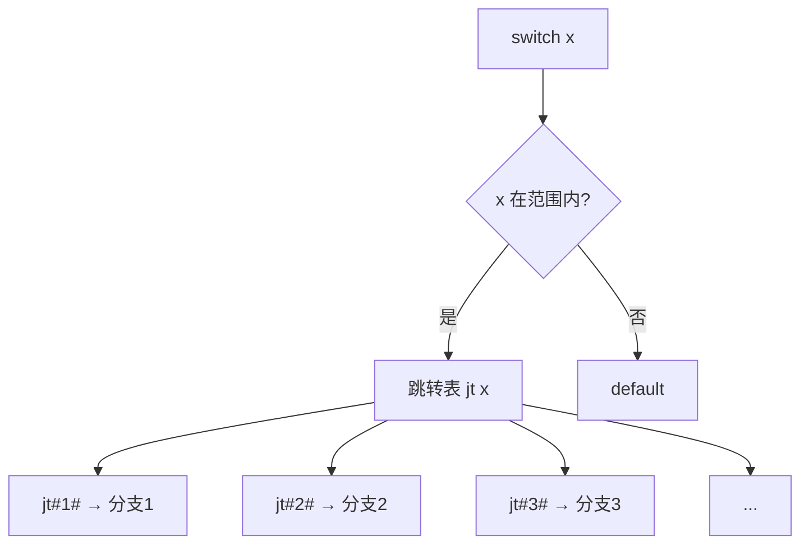

# 条件语句 (Conditional Statements)
---

##  章节概述

条件语句是程序"决策"的核心——根据不同的条件执行不同的代码分支。C 语言提供了 `if/else if/else` 链和 `switch/case` 两种条件分支机制。本章从基础语法出发，深入讲解短路求值（条件链的底层优化基础）、`if` 嵌套、悬空 `else` 问题、`switch` 的 fall-through 特性及 `break` 的关键作用、常见陷阱（特别是 `==` vs `=` 和 `signed`/`unsigned` 比较），最后从汇编层面（`cmp` + 条件跳转）解释条件语句的底层工作原理。掌握条件语句后，建议阅读 [[../../算法/算法技巧/分支|CPP: 分支算法]] 了解更丰富的条件判断算法模式。

> **核心主题**：条件语句的本质是"改变程序计数器（PC）的走向"。CPU 通过 `cmp` 指令设置标志位，然后用条件跳转指令（`je`、`jne`、`jg`、`jl` 等）决定下一条指令的地址。理解这套机制是理解程序控制流的基石。

---
###  第一节：if 语句和 if/else 链
---

1.1 基本 `if` 语法
-------------------

```c
#include <stdio.h>

int main() {
    int score = 85;

    // 形式1: 单独 if
    if (score >= 90) {
        printf("优秀\n");
    }

    // 形式2: if / else
    if (score >= 60) {
        printf("及格\n");
    } else {
        printf("不及格\n");
    }

    // 形式3: if / else if / else 链
    if (score >= 90) {
        printf("A 等级\n");
    } else if (score >= 80) {
        printf("B 等级\n");
    } else if (score >= 70) {
        printf("C 等级\n");
    } else if (score >= 60) {
        printf("D 等级\n");
    } else {
        printf("F 等级（不及格）\n");
    }

    // 注意：条件会按顺序检查，首个匹配的被执行

    return 0;
}
```

1.2 单语句 if 与花括号
----------------------

```c
#include <stdio.h>

int main() {
    int x = 10;

    // 如果 if 体只有一条语句，花括号可以省略
    if (x > 0)
        printf("正数\n");

    // 但这是常见的 bug 来源！
    if (x > 0)
        printf("第一行\n");
        printf("第二行\n");  // 这行不属于 if！始终会被执行！

    // 推荐做法：始终使用花括号
    if (x > 0) {
        printf("始终用花括号\n");
        printf("避免 bug\n");
    }

    // 悬空 else 问题
    int a = 5, b = 10;
    // 这个 else 属于哪个 if？
    if (a > 0)
        if (b > 0)
            printf("a 和 b 都是正数\n");
    else
        printf("a 不是正数\n");  // 注意！这个 else 属于内层 if (b > 0)
    // C 语言规定：else 与最近的未匹配 if 配对

    // 用花括号消除歧义
    if (a > 0) {
        if (b > 0) {
            printf("都是正数\n");
        }
    } else {
        printf("a 不是正数\n");
    }

    return 0;
}
```

1.3 条件表达式中的陷阱
-----------------------

```c
#include <stdio.h>

int main() {
    int x = 0;

    // 陷阱1：赋值 vs 比较（C 语言最著名的 bug）
    if (x = 10) {       // 本意是 x == 10
        printf("x = %d（条件为真，因为赋值返回 10，10 非 0）\n", x);
    }

    // 防御措施：常量放左边
    if (10 == x) {      // 如果写成 10 = x，编译错误
        printf("安全写法\n");
    }

    // 陷阱2：浮点比较
    double d = 0.1 + 0.2;
    if (d == 0.3) {     // 可能为假！
        printf("0.1+0.2 == 0.3\n");
    }
    // 浮点比较应使用 epsilon
    if ((d - 0.3) < 0.000001 && (0.3 - d) < 0.000001) {
        printf("约等于 0.3\n");
    }

    // 陷阱3：signed/unsigned 比较
    int s = -1;
    unsigned int u = 1;
    if (s < u) {        // 通常为假！（-1 → 4294967295 unsigned）
        printf("s < u\n");
    } else {
        printf("s > u（因为 -1 变为很大的 unsigned）\n");
    }

    return 0;
}
```

1.4 汇编视角：if 如何变成跳转
------------------------------

```c
// C 代码
if (x >= 10) {
    y = 1;
} else {
    y = 0;
}
```

对应的 x86-64 汇编（AT&T 语法，简化）：
```asm
    cmpl    $9, -4(%rbp)     ; 比较 x 和 9（注意：>= 10 等价于 > 9）
    jle     .L_else          ; 如果 x <= 9 就跳转到 else
    movl    $1, -8(%rbp)     ; y = 1
    jmp     .L_end
.L_else:
    movl    $0, -8(%rbp)     ; y = 0
.L_end:
```

> `cmp` 指令本质是执行减法但不保存结果，只设置标志寄存器。`jle`（Jump if Less or Equal）检查标志位决定跳转。汇编层面：**条件就是跳转**。详见 。

###  小节练习

> [!question] 选择题 1
> 以下代码的 else 属于哪个 if？
> ```c
> if (a) if (b) c=1; else d=2;
> ```
> - [ ] A. 外层 if (a)
> - [ ] B. 内层 if (b)
> - [ ] C. 编译错误
> - [ ] D. 取决于编译器
>
> > [!success]- 点击查看答案
> > 正确答案: B
> > **解析**: C 语言规定 `else` 与**最近的未匹配的 if** 配对。"悬空 else"问题——代码的缩进与实际语义不一致时的经典陷阱。

> [!question] 判断题 1
> C 语言的 `if` 条件必须是一个布尔类型 (`_Bool`) 的表达式。 （ ）
> - [ ]  正确
> - [ ]  错误
>
> > [!success]- 点击查看答案
> > 答案: 错误
> > **解析**: C 语言 `if` 的条件可以是任何标量表达式——值为 0 表示假，非 0 表示真。这是 C 灵活性的体现，也是很多隐性 bug 的来源（如 `if (x = 10)` 始终为真）。

---
###  第二节：switch/case 语句
---

2.1 基本 switch 语法
---------------------

```c
#include <stdio.h>

int main() {
    int day = 3;

    switch (day) {
        case 1:
            printf("星期一\n");
            break;
        case 2:
            printf("星期二\n");
            break;
        case 3:
            printf("星期三\n");
            break;
        case 4:
            printf("星期四\n");
            break;
        case 5:
            printf("星期五\n");
            break;
        case 6:
        case 7:
            printf("周末！\n");
            break;
        default:
            printf("无效的天数\n");
            break;
    }

    return 0;
}
```

2.2 Fall-through（贯穿）特性
-----------------------------

```c
#include <stdio.h>

int main() {
    // switch 的 case 没有自动 break
    // 执行完一个 case 后会"贯穿"到下一个 case

    int num = 2;
    switch (num) {
        case 1:
            printf("1 ");
            // 没有 break！会继续执行 case 2
        case 2:
            printf("2 ");
            // 继续贯穿
        case 3:
            printf("3\n");
            break;  // 终于 break
        case 4:
            printf("4\n");
            break;
    }
    // 输出：2 3

    // 利用 fall-through 实现多个值共享代码
    int month = 6;
    switch (month) {
        case 12:
        case 1:
        case 2:
            printf("冬季\n");
            break;
        case 3:
        case 4:
        case 5:
            printf("春季\n");
            break;
        case 6:
        case 7:
        case 8:
            printf("夏季\n");
            break;
        case 9:
        case 10:
        case 11:
            printf("秋季\n");
            break;
        default:
            printf("无效月份\n");
            break;
    }

    return 0;
}
```

2.3 switch 与 if/else 的底层对比
---------------------------------

```c
#include <stdio.h>

int main() {
    int x = 3;

    // switch 适用于"等值比较"场景
    // 编译器可能将其优化为跳转表（jump table）

    switch (x) {
        case 1: printf("一"); break;
        case 2: printf("二"); break;
        case 3: printf("三"); break;
        case 4: printf("四"); break;
        case 5: printf("五"); break;
        default: printf("?");
    }
    printf("\n");

    // 等价的 if/else 链（更灵活，但可能更慢）
    if (x == 1) {
        printf("一");
    } else if (x == 2) {
        printf("二");
    } else if (x == 3) {
        printf("三");
    } else if (x == 4) {
        printf("四");
    } else if (x == 5) {
        printf("五");
    } else {
        printf("?");
    }
    printf("\n");

    return 0;
}
```

**底层原理**：当 case 值连续且密集时（如 1,2,3,4,5），编译器将 switch 编译为**跳转表**：



跳转表是一个地址数组，编译器直接用 `x` 作为索引查找目标地址，O(1) 跳转。这是 switch 相比多层 if/else 链（O(n)）在性能上的核心优势。

2.4 switch 的限制和注意事项
----------------------------

```c
#include <stdio.h>

int main() {
    // 限制1：switch 的表达式必须是整数类型
    int x = 10;
    // 以下不行：
    // double d = 3.14;
    // switch (d) { ... }     // 编译错误！浮点数不行
    // char s[] = "hello";
    // switch (s) { ... }     // 编译错误！字符串不行

    // 限制2：case 值必须是编译时常量
    const int a = 1;
    switch (x) {
        case 1:          // OK：字面量
            break;
        // case a:       // 编译错误！a 不是编译时常量表达式（C 语言中）
            // break;
        case 5 + 3:      // OK：常量表达式
            break;
        case 'A':        // OK：字符常量是整数
            break;
    }

    // 限制3：case 值不能重复
    // case 1:           // 编译错误！与上面的 case 1 重复

    // 限制4：可以在 switch 中定义变量，但需用花括号
    switch (x) {
        case 1: {
            int local = 42;  // OK：在花括号内
            printf("%d\n", local);
            break;
        }
        case 2:
            // int local = 100;  // 编译错误！需要花括号
            break;
    }

    return 0;
}
```

###  小节练习

> [!question] 选择题 1
> switch 语句中忘记写 `break` 会导致什么？
> - [ ] A. 编译错误
> - [ ] B. 运行时错误
> - [ ] C. 执行"贯穿"到下一个 case
> - [ ] D. 直接跳出 switch
>
> > [!success]- 点击查看答案
> > 正确答案: C
> > **解析**: switch 的 case 标签只是"入口点"，执行会一直穿过程序直到遇到 `break` 或 `switch` 结束。这个特性称为 fall-through，有时是特意利用的（如下一季），有时是 bug。

> [!question] 判断题 1
> switch 语句的 case 值可以是浮点数。 （ ）
> - [ ]  正确
> - [ ]  错误
>
> > [!success]- 点击查看答案
> > 答案: 错误
> > **解析**: switch 表达式必须是整数类型（char、short、int、long、enum 等），case 值也必须是整数常量表达式。浮点数和字符串不能用于 switch。

---
###  第三节：短路求值与条件优化
---

3.1 短路求值详解
-----------------

```c
#include <stdio.h>
#include <stdbool.h>

// 侧面效应函数
int expensive_check1() {
    printf("expensive_check1() 被调用\n");
    return 0;  // 失败
}

int expensive_check2() {
    printf("expensive_check2() 被调用\n");
    return 1;  // 成功
}

int main() {
    // 短路求值1：&&
    // 左侧为假 → 跳过右侧 → 节省开销
    if (expensive_check1() && expensive_check2()) {
        printf("都成功\n");
    }
    // 输出：
    // expensive_check1() 被调用
    // （expensive_check2 没有被调用！）

    // 短路求值2：||
    if (expensive_check2() || expensive_check1()) {
        printf("至少一个成功\n");
    }
    // 输出：
    // expensive_check2() 被调用
    // （expensive_check1 没有被调用！）

    return 0;
}
```

3.2 利用短路求值写安全代码
---------------------------

```c
#include <stdio.h>
#include <stddef.h>

int main() {
    // 安全检查模式1：先检查指针再解引用
    int arr[] = {1, 2, 3};
    int *p = arr;

    if (p != NULL && *p > 0) {
        printf("*p = %d 是正数\n", *p);
    }

    // 如果把 *p > 0 放在前面，p 为 NULL 时会崩溃
    // if (*p > 0 && p != NULL)  ← 危险！段错误

    // 安全检查模式2：先检查索引再访问数组
    int i = 5;
    if (i >= 0 && i < 3 && arr[i] > 0) {  // i=5 超范围
        printf("arr[%d] > 0\n", i);
    } else {
        printf("索引无效或值非正\n");
    }

    // 安全检查模式3：先检查除数
    int a = 10, b = 0;
    if (b != 0 && a / b > 1) {
        printf("商大于 1\n");
    } else {
        printf("除数为零，跳过除法\n");
    }

    return 0;
}
```

3.3 条件表达式作为值
---------------------

```c
#include <stdio.h>

int main() {
    // 条件表达式的结果可以直接用于赋值
    int a = 10, b = 20;
    int max = (a > b) ? a : b;
    printf("max = %d\n", max);

    // 可以在数组下标中使用
    int arr[] = {100, 200};
    int idx = (a > b);  // 0 或 1
    printf("arr[idx] = %d\n", arr[idx]);

    // 可以在计算中使用
    int discount = (a > 100) ? 20 : 0;
    printf("折扣: %d%%\n", discount);

    return 0;
}
```

###  小节练习

> [!question] 选择题 1
> 以下代码中 `func()` 会被调用几次？
> ```c
> if (0 && func()) { ... }
> ```
> - [ ] A. 0 次
> - [ ] B. 1 次
> - [ ] C. 2 次
> - [ ] D. 未定义
>
> > [!success]- 点击查看答案
> > 正确答案: A
> > **解析**: `&&` 短路求值：左侧 `0` 为假，整个表达式结果已确定为假，右侧 `func()` 永远不会被调用。

---
###  第四节：条件语句的实际应用模式
---

4.1 范围判断与分段函数
-----------------------

```c
#include <stdio.h>

int main() {
    int x;
    printf("输入成绩: ");
    scanf("%d", &x);

    // 分段函数处理
    if (x < 0 || x > 150) {
        printf("无效分数\n");
    } else if (x >= 140) {
        printf("评级: S\n");
    } else if (x >= 120) {
        printf("评级: A\n");
    } else if (x >= 90) {
        printf("评级: B\n");
    } else if (x >= 60) {
        printf("评级: C\n");
    } else {
        printf("评级: D（不合格）\n");
    }

    // 注意顺序！从高到低判断，否则逻辑错误
    // 如果写作 if (x >= 60) ... else if (x >= 90)
    // 90 分的同学会被评为 C

    return 0;
}
```

4.2 闰年判断
------------

```c
#include <stdio.h>
#include <stdbool.h>

int main() {
    int year;

    printf("输入年份: ");
    scanf("%d", &year);

    // 闰年规则：
    // 1. 能被 4 整除但不能被 100 整除
    // 2. 或者能被 400 整除
    int is_leap = (year % 4 == 0 && year % 100 != 0) || (year % 400 == 0);

    if (is_leap) {
        printf("%d 年是闰年\n", year);
    } else {
        printf("%d 年不是闰年\n", year);
    }

    return 0;
}
```

4.3 三角形判断
--------------

```c
#include <stdio.h>

int main() {
    int a, b, c;
    printf("输入三边长度: ");
    scanf("%d %d %d", &a, &b, &c);

    // 三角形存在条件：任意两边之和大于第三边
    if (a + b <= c || a + c <= b || b + c <= a) {
        printf("不能构成三角形\n");
    } else if (a == b && b == c) {
        printf("等边三角形\n");
    } else if (a == b || b == c || a == c) {
        if (a * a + b * b == c * c ||
            a * a + c * c == b * b ||
            b * b + c * c == a * a) {
            printf("等腰直角三角形\n");
        } else {
            printf("等腰三角形\n");
        }
    } else if (a * a + b * b == c * c ||
               a * a + c * c == b * b ||
               b * b + c * c == a * a) {
        printf("直角三角形\n");
    } else {
        printf("普通三角形\n");
    }

    return 0;
}
```

4.4 条件运算符的链式使用
-------------------------

```c
#include <stdio.h>

int main() {
    int num = 42;

    // 链式三元（可读性差，不推荐嵌套过多）
    const char *type =
        num > 0 ? "正数" :
        num < 0 ? "负数" : "零";
    printf("分类: %s\n", type);

    // 三元运算符作为函数参数
    printf("%d 是%s\n", num, num % 2 == 0 ? "偶数" : "奇数");

    // 注意：三元运算符的两个分支类型必须兼容
    int a = 10;
    double result = (a > 5) ? 1.5 : a;  // 返回 double（a 被提升）
    printf("result = %f\n", result);

    return 0;
}
```

###  小节练习

> [!question] 选择题 1
> 以下闰年判断逻辑缺少了什么？
> ```c
> int is_leap = (year % 4 == 0) && (year % 100 != 0);
> ```
> - [ ] A. 还需要判断 `year % 400 == 0`
> - [ ] B. 还需要判断 `year > 0`
> - [ ] C. 还需要判断 `year % 1000 == 0`
> - [ ] D. 逻辑正确无需补充
>
> > [!success]- 点击查看答案
> > 正确答案: A
> > **解析**: 闰年的完整规则是：(能被 4 整除且不能被 100 整除)**或**(能被 400 整除)。缺少第二个条件会导致 2000 年等整百年被误判为非闰年。

---
###  第五节：条件语句在汇编层的实现
---

5.1 if/else 的汇编表示
-----------------------

```c
// C 代码
int max(int a, int b) {
    if (a > b) {
        return a;
    } else {
        return b;
    }
}
```

对应的 x86-64 汇编（简化版）：
```asm
max:
    cmpl    %esi, %edi      ; 比较 a (%edi) 和 b (%esi)
    jle     .L_return_b     ; 如果 a <= b，跳转
    movl    %edi, %eax      ; eax = a (return a)
    ret
.L_return_b:
    movl    %esi, %eax      ; eax = b (return b)
    ret
```

**编译器优化**：编译器有时使用**条件传送**（`cmov`）指令避免分支，提高效率：

```asm
; 优化版本（使用 cmovge — Conditional MOVe if Greater or Equal）
max_optimized:
    movl    %edi, %eax      ; eax = a (先假设 a 是答案)
    cmpl    %edi, %esi      ; 比较 b 和 a
    cmovg   %esi, %eax      ; 如果 b > a，eax = b
    ret
```

> 分支预测失败是 CPU 性能的重大瓶颈。条件传送指令（`cmov`）消除了分支，现代编译器会尝试将简单的 if/else 优化为条件传送。详见 。

5.2 switch 的跳转表
--------------------

```c
// C 代码
int get_priority(char c) {
    switch (c) {
        case 'A': return 1;
        case 'B': return 2;
        case 'C': return 3;
        default:  return 0;
    }
}
```

对应的优化汇编（伪代码）：
```asm
; 跳转表 jt = { .L1, .L2, .L3 }
get_priority:
    subl    $'A', %edi       ; 将 'A' 映射为 0
    cmpl    $2, %edi         ; 检查是否在 0..2 范围内
    ja      .L_default       ; 超出范围 → default
    movq    jt(,%rdi,8), %rax
    jmp     *%rax            ; 间接跳转至目标
.L1:
    movl    $1, %eax
    ret
.L2:
    movl    $2, %eax
    ret
.L3:
    movl    $3, %eax
    ret
.L_default:
    movl    $0, %eax
    ret

.section .rodata
jt:
    .quad .L1
    .quad .L2
    .quad .L3
```

###  小节练习

> [!question] 选择题 1
> 汇编中的 `cmov`（条件传送）指令相比传统的条件跳转有什么优势？
> - [ ] A. 能够处理更复杂的条件
> - [ ] B. 避免分支预测失败带来的性能损失
> - [ ] C. 生成更小的代码
> - [ ] D. 支持浮点数比较
>
> > [!success]- 点击查看答案
> > 正确答案: B
> > **解析**: `cmov` 指令根据条件选择性地执行数据移动，不改变程序执行流程。它避免了分支指令带来的分支预测失败惩罚（通常 10-20 个时钟周期），在简单赋值场景下比传统 if/else 更高效。

---

##  章节测试

### 一、判断题（正确选，错误选）

> [!question] 判断题 1
> `if (x = 5)` 在 C 语言中是一个编译错误。 （ ）
> - [ ]  正确
> - [ ]  错误
>
> > [!success]- 点击查看答案
> > 答案: 错误
> > **解析**: `if (x = 5)` 语法合法——这是赋值表达式，返回赋的值 5（非零），所以条件始终为真。这是 C 语言最著名的陷阱之一。`gcc -Wall` 会对此产生警告。

> [!question] 判断题 2
> switch 语句的 default 标签必须放在最后。 （ ）
> - [ ]  正确
> - [ ]  错误
>
> > [!success]- 点击查看答案
> > 答案: 错误
> > **解析**: `default` 可以放在 switch 块中的任何位置（甚至在最前面），但通常约定放在最后。位置不影响语义——只有没有 case 匹配时才会执行 default。

> [!question] 判断题 3
> `else` 总是与最近的未匹配的 `if` 配对。 （ ）
> - [ ]  正确
> - [ ]  错误
>
> > [!success]- 点击查看答案
> > 答案: 正确
> > **解析**: C 语言标准的著名规则——"悬空 else 问题"。else 与最近的不带 else 的 if 配对，与缩进无关。

> [!question] 判断题 4
> switch 语句中每个 case 后必须写 `break`。 （ ）
> - [ ]  正确
> - [ ]  错误
>
> > [!success]- 点击查看答案
> > 答案: 错误
> > **解析**: `break` 在 switch 中**不是强制**的。省略 break 会导致 fall-through（贯穿到下一个 case），有时这是特意利用的特性（如多个 case 共享代码），但更多是遗忘导致的 bug。

> [!question] 判断题 5
> `if (0)` 中的代码永远不会被执行，编译器会将其优化掉。 （ ）
> - [ ]  正确
> - [ ]  错误
>
> > [!success]- 点击查看答案
> > 答案: 正确
> > **解析**: `if (0)` 中的代码是"死代码"（dead code），编译器在优化级别下会将其完全删除。很多项目中用 `if (0)` 配合条件编译来临时禁用代码块。

> [!question] 判断题 6
> C 语言中 `if` 条件中不能使用赋值表达式。 （ ）
> - [ ]  正确
> - [ ]  错误
>
> > [!success]- 点击查看答案
> > 答案: 错误
> > **解析**: 赋值表达式的返回值就是赋的值，可以合法地用在 if 条件中。如 `if ((fp = fopen("file", "r")) != NULL)` 是常见的模式——在条件中完成赋值并检查。

> [!question] 判断题 7
> switch 比多层 if/else 链在 case 值密集时性能更好，因为编译器可能生成跳转表。 （ ）
> - [ ]  正确
> - [ ]  错误
>
> > [!success]- 点击查看答案
> > 答案: 正确
> > **解析**: 当 case 值连续且密集时，编译器将 switch 编译为跳转表——O(1) 时间找到目标分支。而多层 if/else 链是 O(n) 的线性查找。

> [!question] 判断题 8
> `if (x)` 等价于 `if (x != 0)`。 （ ）
> - [ ]  正确
> - [ ]  错误
>
> > [!success]- 点击查看答案
> > 答案: 正确
> > **解析**: C 语言中 0 为假，非 0 为真。`if (x)` 在 x 非零时执行，`if (x != 0)` 在 x 非零时执行，两者语义完全等价。

> [!question] 判断题 9
> switch 语句的条件表达式可以是字符串类型。 （ ）
> - [ ]  正确
> - [ ]  错误
>
> > [!success]- 点击查看答案
> > 答案: 错误
> > **解析**: switch 表达式必须是整数类型（或能隐式转换为整数的类型）。字符串不能用于 switch——C 语言没有字符串 switch 特性。

> [!question] 判断题 10
> `if (a < b < c)` 能正确判断 a 小于 b 且 b 小于 c。 （ ）
> - [ ]  正确
> - [ ]  错误
>
> > [!success]- 点击查看答案
> > 答案: 错误
> > **解析**: `a < b < c` 被解析为 `(a < b) < c`。`(a < b)` 返回 0 或 1，然后与 c 比较。这与数学中的"a < b < c"完全不同！正确写法是 `a < b && b < c`。

---

### 二、选择题（单项选择题）

> [!question] 选择题 1
> 以下代码输出什么？
> ```c
> int x = 5;
> if (x = 3) printf("A");
> else printf("B");
> ```
> - [ ] A. A
> - [ ] B. B
> - [ ] C. 编译错误
> - [ ] D. 未定义行为
>
> > [!success]- 点击查看答案
> > 正确答案: A
> > **解析**: `x = 3` 是赋值表达式，返回值 3（非零），条件为真，输出 A。`x` 的值也变成了 3。

> [!question] 选择题 2
> switch 语句中 case 后面不能接什么？
> - [ ] A. 整数常量
> - [ ] B. 字符常量
> - [ ] C. 变量
> - [ ] D. 枚举常量
>
> > [!success]- 点击查看答案
> > 正确答案: C
> > **解析**: case 值必须是编译时常量表达式（整数常量、字符常量、枚举常量、常量表达式如 `2+3` 等）。变量值不行——C 的 switch 不是动态分支匹配。

> [!question] 选择题 3
> `int x = 0; if (x++) printf("A");` 输出什么？
> - [ ] A. A
> - [ ] B. 无输出
> - [ ] C. 未定义行为
> - [ ] D. 编译错误
>
> > [!success]- 点击查看答案
> > 正确答案: B
> > **解析**: `x++` 返回 x 的原始值（0），然后自增为 1。条件是 0（假），所以不进入 if 体。x 最终为 1。

> [!question] 选择题 4
> 以下代码属于未定义行为的是？
> - [ ] A. `if (0) printf("dead");`
> - [ ] B. `if (x = 5) printf("assigned");`
> - [ ] C. `if (x++ + ++x) printf("seq");`
> - [ ] D. `if (x == 5) printf("eq");`
>
> > [!success]- 点击查看答案
> > 正确答案: C
> > **解析**: `x++ + ++x` 在一个表达式中两次修改 `x`，中间没有序列点，导致未定义行为。A 是死代码（合法），B 是赋值（合法但有警告），D 正常。

> [!question] 选择题 5
> 以下哪个 switch 用法是正确的？
> - [ ] A. `switch (3.14) { case 3.14: ... }`
> - [ ] B. `switch (x) { case 1.0: ... }`
> - [ ] C. `switch (x) { case x: ... }`
> - [ ] D. `switch (x) { case 'A': ... }`
>
> > [!success]- 点击查看答案
> > 正确答案: D
> > **解析**: `case 'A'` 合法——字符常量本质是 int 类型。A 和 B 使用浮点数（非法），C 使用变量（非法）。

> [!question] 选择题 6
> 闰年判断 `(y%4==0 && y%100!=0) || y%400==0` 中，2100 年的结果是？
> - [ ] A. 闰年
> - [ ] B. 非闰年
> - [ ] C. 不确定
> - [ ] D. 错误
>
> > [!success]- 点击查看答案
> > 正确答案: B
> > **解析**: 2100 能被 4 整除，也能被 100 整除，但不能被 400 整除。第一个括号为假（`2100%100==0` → 不满足 `!=0`），第二个条件 `2100%400==200 !=0` 也为假。结果为假——非闰年。

> [!question] 选择题 7
> 哪个不是避免 `if (x = 10)` 陷阱的有效方法？
> - [ ] A. 启用 `-Wall` 编译选项
> - [ ] B. 用 BFS 代码检查工具
> - [ ] C. 使用 `if (10 == x)` 常量在左的写法
> - [ ] D. 使用 `if ((x = 10))` 额外括号
>
> > [!success]- 点击查看答案
> > 正确答案: D
> > **解析**: 额外括号 `if ((x = 10))` 通常用于告诉编译器"我知道这是赋值，别警告"，但副作用是如果这确实是 bug，警告会被抑制。常量在左（`10 == x`）是更好的防御手段——如果写成 `10 = x` 编译阶段就报错。

> [!question] 选择题 8
> 以下代码输出什么？
> ```c
> int a = 5;
> if (a > 3) printf("1");
> if (a > 4) printf("2");
> if (a > 5) printf("3");
> else printf("4");
> ```
> - [ ] A. 12
> - [ ] B. 124
> - [ ] C. 1
> - [ ] D. 14
>
> > [!success]- 点击查看答案
> > 正确答案: B
> > **解析**: 注意这三个 if 是**独立**的！第一个 if → 输出 1。第二个 if → 输出 2。第三个 if → 条件为假，执行 else → 输出 4。所以输出 "124"。

> [!question] 选择题 9
> `if (a > b) max = a; else max = b;` 的等价三目写法是？
> - [ ] A. `max = (a > b) ? a : b;`
> - [ ] B. `max = (a > b) ? b : a;`
> - [ ] C. `(a > b) ? max = a : max = b;`
> - [ ] D. `max = (a > b) : a ? b;`
>
> > [!success]- 点击查看答案
> > 正确答案: A
> > **解析**: 三元运算符 `?:` 的语法是 `condition ? true_val : false_val`。当 a > b 时取 a（较大者），否则取 b。A 正确。

> [!question] 选择题 10
> 在 x86-64 汇编中，`cmp eax, ebx` 后 `jg` 指令的跳转条件是什么？
> - [ ] A. ZF=1（等于）
> - [ ] B. CF=1（有进位）
> - [ ] C. SF=OF 且 ZF=0（有符号大于）
> - [ ] D. OF=1（溢出）
>
> > [!success]- 点击查看答案
> > 正确答案: C
> > **解析**: `jg`（Jump if Greater）检查有符号比较的结果。`SF == OF` 且 `ZF == 0` 表示"不小于等于"，即"大于"。这与 `ja`（无符号大于，检查 CF=0 且 ZF=0）不同。

---

### ️ 动手练习题

> [!example] 练习题 1：成绩等级判定
> **难度**: 
> 
> 编写程序，输入一个分数（0-100）：
> - 90-100: A
> - 80-89: B
> - 70-79: C
> - 60-69: D
> - 0-59: F
> 
> 要求：使用 if/else if/else 链，不足 0 或超过 100 输出"无效分数"。
> 
> 力扣练习：力扣简单条件判断题
>
> 相关：力扣几何判断题

> [!example] 练习题 2：月份天数计算器
> **难度**: 
> 
> 编写程序，输入年份和月份，输出该月天数：
> - 大月（1,3,5,7,8,10,12）：31 天
> - 小月（4,6,9,11）：30 天
> - 二月：闰年 29 天，平年 28 天
> 
> 要求：使用 switch 语句处理月份（利用 fall-through 特性），用 if 处理闰年判断。
> 
> 力扣练习：力扣周期判断题

> [!example] 练习题 3：简易计算器
> **难度**: 
> 
> 编写程序，读入 `操作数1 运算符 操作数2` 格式的表达式：
> - 支持 `+` `-` `*` `/` 四种运算符
> - 使用 switch 根据运算符选择运算
> - 除法时检查除数是否为零
> - 使用 if/else 判断运算结果并格式化输出
> 
> 力扣练习：力扣条件逻辑题
>
> 相关：力扣条件分类题

> [!example] 练习题 4：汇编层分析
> **难度**: 
> 
> 编写几个包含不同条件语句的函数：
> 1. 简单的 `max(a, b)` 用 if/else
> 2. 含多个 case 紧密排列的 switch（1,2,3,4,5）
> 3. 含散乱 case 的 switch（1, 100, 500, 999）
> 
> 使用 `gcc -S -O2` 生成汇编代码并观察：
> - if/else 是否被优化为 `cmov` 指令？
> - 密集 switch 是否生成了跳转表？
> - 稀疏 switch 是否被编译为二分查找？
> 
> 参考 。

> [!example] 练习题 5：条件机模拟
> **难度**: 
> 
> 力扣练习：力扣排序题
> 
> 完成后额外任务：
> 1. 用 if 语句（不使用数组或排序算法）实现对 4 个数的排序
> 2. 思考：n 个数用纯 if 排序，代码量如何增长？与学完数组后的排序算法对比有何感受？
> 
> 参考 [[../../算法/算法技巧/分支|CPP: 分支算法]] 了解更多分支与算法结合的模式。
