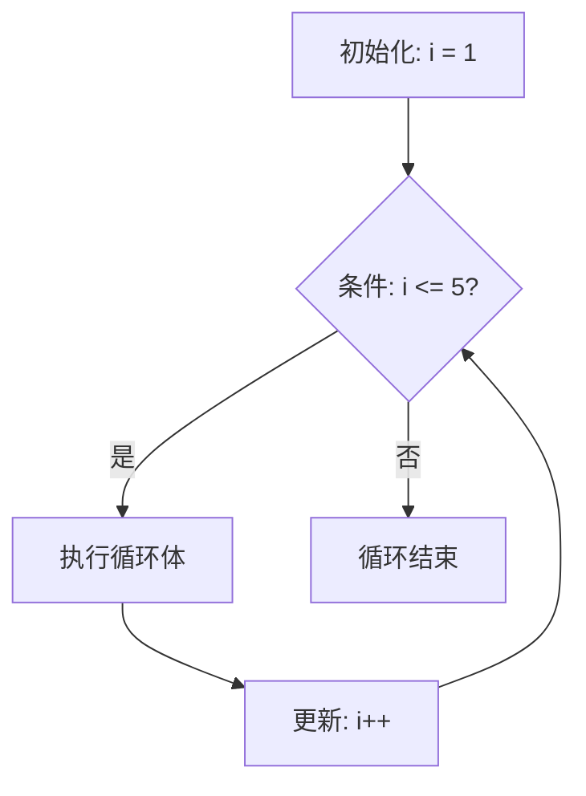

# 循环结构 (Loop Structures)
---

##  章节概述

循环是程序重复执行代码块的核心机制，也是算法的基础（如遍历、搜索、累加）。C 语言提供了三种循环结构：`for`（计数循环）、`while`（先判断后执行）、`do-while`（先执行后判断）。本章逐一讲解三种循环的语法和适用场景，深入讨论 `break`（跳出循环）和 `continue`（跳过本次迭代）的控制流，以及无限循环、循环优化（循环提升/循环展开/减少内存访问）等进阶话题。最后从汇编层面展示循环指令模式（`cmp` + `jmp` 回跳），帮助建立"C 循环 → 汇编回跳"的心智模型。学完本章后，建议阅读 [[../../算法/算法技巧/循环|CPP: 循环算法]] 了解更丰富的循环算法模式。

> **核心主题**：循环本质是"条件跳转 + 计数器更新"。CPU 没有"循环"这一原语——循环是条件判断和跳转的组合。理解循环的汇编实现是理解"为什么某些循环写法更快"的钥匙。

---
###  第一节：for 循环详解
---

1.1 for 循环语法结构
--------------------

```c
#include <stdio.h>

int main() {
    // for 循环三要素：
    // for (初始化; 条件; 更新) { 循环体 }

    // 基本用法：打印 1 到 5
    for (int i = 1; i <= 5; i++) {
        printf("%d ", i);
    }
    printf("\n");  // 1 2 3 4 5

    // 三要素的执行顺序：
    // 1. 初始化（仅执行一次，循环开始前）
    // 2. 条件检查（每次迭代前）
    // 3. 循环体（条件为真时执行）
    // 4. 更新（每次循环体执行完后）
    // 5. 回到第 2 步

    // 三要素都可以省略（省略条件 = 永远为真）
    // for (;;) { }  等价于 while(1) { } — 无限循环

    return 0;
}
```

1.2 for 循环的执行轨迹可视化
-----------------------------



1.3 for 循环的各种变体
-----------------------

```c
#include <stdio.h>

int main() {
    // 变体1：多个初始化变量和更新
    for (int i = 0, j = 10; i < j; i++, j -= 2) {
        printf("i=%d, j=%d\n", i, j);
    }

    // 变体2：省省略初始化和更新（在循环体内处理）
    int k = 0;
    for (; k < 5; ) {
        printf("%d ", k);
        k++;
    }
    printf("\n");

    // 变体3：倒序循环
    for (int i = 5; i >= 1; i--) {
        printf("%d ", i);
    }
    printf("\n");

    // 变体4：步长不为 1
    for (int i = 0; i <= 20; i += 5) {
        printf("%d ", i);  // 0 5 10 15 20
    }
    printf("\n");

    // 变体5：C99 中在 for 内声明变量（推荐，限制作用域）
    // C90 不允许，C99 及以后允许
    for (int i = 0; i < 3; i++) {
        printf("%d ", i);
    }
    // i 在这里不可见（C99 语义）

    return 0;
}
```

1.4 for 循环常见错误
---------------------

```c
#include <stdio.h>

int main() {
    // 错误1：分号误用（经典 bug）
    // for 后面多了分号 = 空循环体！
    for (int i = 0; i < 3; i++);  // ← 多了一个分号！
        printf("只输出一次！\n");

    // 正确写法
    for (int i = 0; i < 3; i++) {
        printf("输出 %d 次\n", i + 1);
    }

    // 错误2：溢出导致无限循环
    // 如果 i 是 signed char，范围 -128~127
    // for (signed char i = 0; i < 200; i++) { ... }
    // i 永远不会超过 127 → 无限循环

    // 错误3：浮点数作为循环变量
    // for (float f = 0.0; f != 1.0; f += 0.1) { ... }
    // 由于浮点精度误差，f 可能永远不会精确等于 1.0
    // 应该使用整数计数：for (int i = 0; i < 10; i++) { float f = i * 0.1f; }

    // 错误4：循环中修改循环变量
    for (int i = 0; i < 10; i++) {
        if (i == 3) i = 7;  // 不推荐！会导致难以预料的跳变
        printf("%d ", i);    // 0 1 2 3 8 9
    }
    printf("\n");

    return 0;
}
```

###  小节练习

> [!question] 选择题 1
> 以下 for 循环执行多少次？
> ```c
> for (int i = 0; i < 5; i++);
> ```
> - [ ] A. 0 次
> - [ ] B. 5 次
> - [ ] C. 无限次
> - [ ] D. 编译错误
>
> > [!success]- 点击查看答案
> > 正确答案: B
> > **解析**: 注意 `for (int i = 0; i < 5; i++);` 后面有一个分号——这是一个**空循环体**。循环本体（空语句）执行了 5 次。它下面缩进的 `printf` 并不属于循环体。

> [!question] 判断题 1
> for 循环的三个部分（初始化、条件、更新）都可以省略。 （ ）
> - [ ]  正确
> - [ ]  错误
>
> > [!success]- 点击查看答案
> > 答案: 正确
> > **解析**: `for (;;)` 是合法的无限循环——三个部分全部省略。省略条件部分时默认为"始终为真"（非 0）。

---
###  第二节：while 和 do-while 循环
---

2.1 while 循环
---------------

```c
#include <stdio.h>

int main() {
    // while 语法：
    // while (条件) { 循环体 }
    // 先检查条件，后执行循环体（可能一次都不执行）

    int count = 1;
    while (count <= 5) {
        printf("%d ", count);
        count++;
    }
    printf("\n");  // 1 2 3 4 5

    // while 适用于迭代次数不确定的场景
    // 例如：读取文件直到 EOF
    int sum = 0, num;
    printf("输入数字（0 结束）: ");
    scanf("%d", &num);
    while (num != 0) {
        sum += num;
        printf("当前和: %d, 继续输入（0 结束）: ", sum);
        scanf("%d", &num);
    }
    printf("最终和: %d\n", sum);

    return 0;
}
```

2.2 do-while 循环
------------------

```c
#include <stdio.h>

int main() {
    // do-while 语法：
    // do { 循环体 } while (条件);
    // 先执行循环体，后检查条件（至少执行一次）

    int attempts = 0;
    int password;

    do {
        printf("请输入密码: ");
        scanf("%d", &password);
        attempts++;
    } while (password != 1234 && attempts < 3);

    if (password == 1234) {
        printf("密码正确！\n");
    } else {
        printf("尝试次数用完！\n");
    }

    // do-while 的典型场景：
    // 1. 至少需要执行一次的操作（如密码输入）
    // 2. 游戏循环（至少运行一帧）
    // 3. 验证用户输入合法性

    return 0;
}
```

2.3 while 与 do-while 的适用场景对比
--------------------------------------

```c
#include <stdio.h>

int main() {
    int x = 10;

    // while：先判断后执行
    // 如果条件开始就为假，循环体一次都不执行
    printf("while 循环: ");
    while (x < 5) {
        printf("这行不会被打印\n");
    }
    printf("（无输出）\n");

    // do-while：先执行后判断
    // 即使条件开始就为假，循环体至少执行一次
    printf("do-while 循环: ");
    do {
        printf("这行至少被执行一次\n");
    } while (x < 5);

    return 0;
}
```

2.4 循环的汇编表示
-------------------

```c
// C 代码
int sum_for(int n) {
    int sum = 0;
    for (int i = 1; i <= n; i++) {
        sum += i;
    }
    return sum;
}
```

对应 x86-64 汇编（简化）：
```asm
sum_for:
    movl    $0, %eax        ; sum = 0（eax）
    movl    $1, %edx        ; i = 1（edx）
    cmpl    %edi, %edx      ; 比较 i 和 n
    jg      .L_done         ; 如果 i > n，跳转到结束
.L_loop:
    addl    %edx, %eax      ; sum += i
    addl    $1, %edx        ; i++
    cmpl    %edi, %edx      ; 再次比较
    jle     .L_loop         ; 如果 i <= n，跳回循环
.L_done:
    ret
```

> 汇编层面的循环就是"条件跳转 + 回跳"。`for`、`while`、`do-while` 在汇编中结构相同（只是跳转位置不同）。详见 。

###  小节练习

> [!question] 选择题 1
> do-while 循环体至少执行多少次？
> - [ ] A. 0 次
> - [ ] B. 1 次
> - [ ] C. 取决于条件
> - [ ] D. 无限次
>
> > [!success]- 点击查看答案
> > 正确答案: B
> > **解析**: do-while 先执行循环体后检查条件，所以循环体**至少执行一次**。这是它与 while 的核心区别。

---
###  第三节：break 和 continue
---

3.1 break —— 跳出循环
----------------------

```c
#include <stdio.h>
#include <stdbool.h>

int main() {
    // break 立即终止整个循环（不再进行本次迭代的剩余代码）
    // 也不进行下一次迭代

    printf("查找第一个能被 7 整除的数: ");
    for (int i = 1; i <= 100; i++) {
        if (i % 7 == 0) {
            printf("%d\n", i);  // 打印 7
            break;              // 找到就退出
        }
    }

    // break 在嵌套循环中只跳出最内层
    printf("嵌套循环中的 break:\n");
    for (int i = 1; i <= 3; i++) {
        for (int j = 1; j <= 3; j++) {
            if (i == 2 && j == 2) {
                break;  // 只跳出内层 j 循环
            }
            printf("(%d,%d) ", i, j);
        }
        printf("\n");
    }
    // 输出: (1,1) (1,2) (1,3) (2,1) (3,1) (3,2) (3,3)

    return 0;
}
```

3.2 continue —— 跳过本次迭代
-----------------------------

```c
#include <stdio.h>

int main() {
    // continue 跳过本次迭代的剩余代码，直接进入下一次迭代的条件检查

    printf("打印奇数（跳过偶数）: ");
    for (int i = 1; i <= 10; i++) {
        if (i % 2 == 0) {
            continue;  // 偶数 → 跳过 printf，直接 i++
        }
        printf("%d ", i);  // 1 3 5 7 9
    }
    printf("\n");

    // continue 与 while 配合时的陷阱
    printf("while + continue: ");
    int i = 0;
    while (i < 10) {
        i++;
        if (i % 2 == 0) {
            continue;  // 跳过 printf，但 i++ 在 continue 前面，没问题！
        }
        printf("%d ", i);
    }
    printf("\n");

    // 如果在 while 中使用 continue，务必确保更新逻辑在 continue 之前
    // 否则可能产生无限循环：
    printf("危险示例（不要运行）: ");
    // int j = 0;
    // while (j < 10) {
    //     if (j % 2 == 0) {
    //         continue;  // 跳过 j++！→ 无限循环
    //     }
    //     j++;
    // }

    return 0;
}
```

3.3 break 和 continue 的可读性考虑
------------------------------------

```c
#include <stdio.h>

int main() {
    int arr[] = {1, 2, 3, 4, 5, 6, 7, 8, 9, 10};
    int n = 10;
    int target = 7;

    // 线性查找 —— break 是自然的用法
    int found_index = -1;
    for (int i = 0; i < n; i++) {
        if (arr[i] == target) {
            found_index = i;
            break;
        }
    }
    printf("找到目标 %d 在索引 %d\n", target, found_index);

    // 过滤打印 —— continue 是自然的用法
    printf("跳过 3 的倍数: ");
    for (int i = 0; i < n; i++) {
        if (arr[i] % 3 == 0) {
            continue;
        }
        printf("%d ", arr[i]);
    }
    printf("\n");

    return 0;
}
```

###  小节练习

> [!question] 选择题 1
> 在嵌套循环中，`break` 语句会跳出几层循环？
> - [ ] A. 所有循环
> - [ ] B. 最内层循环
> - [ ] C. 最外层循环
> - [ ] D. 两层循环
>
> > [!success]- 点击查看答案
> > 正确答案: B
> > **解析**: `break` 只能跳出**最内层**包含它的循环（或 switch 语句）。要跳出外层循环，需要额外的标志变量或使用 C 特有的 `goto`（极少数合理场景之一）。

---
###  第四节：循环优化基础
---

4.1 循环提升（Loop Hoisting）
------------------------------

将循环中**不变的计算**提到循环外部：

```c
#include <stdio.h>
#include <string.h>

int main() {
    char str[] = "Hello, C Language!";

    // 不好的写法：每次循环都计算 strlen
    printf("不优化: ");
    for (int i = 0; i < strlen(str); i++) {
        printf("%c", str[i]);
    }
    printf("\n");
    // strlen 在每次迭代都被调用 → O(n²) 复杂度！

    // 优化写法：将 strlen 提升到循环外
    printf("优化后: ");
    int len = strlen(str);  // 只计算一次
    for (int i = 0; i < len; i++) {
        printf("%c", str[i]);
    }
    printf("\n");

    return 0;
}
```

其他循环提升示例：

```c
// 不优化：每条循环都做乘法
int sum_bad(int n) {
    int sum = 0;
    int scale = 100;
    for (int i = 0; i < n; i++) {
        sum += i * scale;  // 乘法在循环内
    }
    return sum;
}

// 优化后：乘法提到循环外（虽然现代编译器常自动优化）
int sum_good(int n) {
    int sum = 0;
    // 数学等价变换
    return (n - 1) * n / 2 * 100;
}
```

4.2 循环展开（Loop Unrolling）
-------------------------------

```c
#include <stdio.h>

// 普通循环
int sum_normal(int arr[], int n) {
    int sum = 0;
    for (int i = 0; i < n; i++) {
        sum += arr[i];
    }
    return sum;
}

// 手动 4 路展开（减少循环分支和计数器更新开销）
int sum_unrolled4(int arr[], int n) {
    int sum = 0;
    int i;

    // 主循环：每次处理 4 个元素
    for (i = 0; i <= n - 4; i += 4) {
        sum += arr[i] + arr[i + 1] + arr[i + 2] + arr[i + 3];
    }

    // 处理剩余不足 4 个的元素
    for (; i < n; i++) {
        sum += arr[i];
    }

    return sum;
}
```

> 现代编译器（GCC `-O2` 及以上）会自动进行循环展开，手动展开仅在不允许优化 (-O0) 或确有性能关键代码时才需要。

4.3 减少循环中的内存访问
--------------------------

```c
#include <stdio.h>

int arr[1000][1000];

// 缓存友好的循环（按行访问 — row-major）
void cache_friendly() {
    int sum = 0;
    for (int i = 0; i < 1000; i++) {
        for (int j = 0; j < 1000; j++) {
            sum += arr[i][j];  // 访问连续内存 → 缓存命中率高
        }
    }
}

// 缓存不友好的循环（按列访问）
void cache_unfriendly() {
    int sum = 0;
    for (int j = 0; j < 1000; j++) {
        for (int i = 0; i < 1000; i++) {
            sum += arr[i][j];  // 跳跃访问 → 大量缓存缺失
        }
    }
}
// 在大型数组上，cache_friendly 可能比 cache_unfriendly 快数倍！
```

> 循环优化涉及寄存器分配、指令调度、向量化（SIMD）等高级话题。`-O2` / `-O3` 编译器优化已经非常成熟。学习循环优化主要是为了**理解编译器对你的代码做了什么**，而非手动取代编译器。

###  小节练习

> [!question] 选择题 1
> 对于数组 `int arr[1000][1000]`，以下哪个循环的缓存性能最好？
> - [ ] A. `for (j=0; j<1000; j++) for (i=0; i<1000; i++) sum += arr[i][j];`
> - [ ] B. `for (i=0; i<1000; i++) for (j=0; j<1000; j++) sum += arr[i][j];`
> - [ ] C. 两者一样
> - [ ] D. 取决于编译器
>
> > [!success]- 点击查看答案
> > 正确答案: B
> > **解析**: C 编译器采用行主序（row-major）存储多维数组。B 按行访问（内层遍历 j → 访问 `arr[i][j]`，即连续的地址），缓存命中率高。A 按列访问，每次跳跃一行 → 大量缓存缺失。

---
###  第五节：循环与嵌套循环实战
---

5.1 打印图形
------------

```c
#include <stdio.h>

int main() {
    // 打印矩形
    printf("5×5 矩形:\n");
    for (int i = 0; i < 5; i++) {
        for (int j = 0; j < 5; j++) {
            printf("* ");
        }
        printf("\n");
    }

    // 打印直角三角形
    printf("\n直角三角形:\n");
    for (int i = 1; i <= 5; i++) {
        for (int j = 1; j <= i; j++) {
            printf("* ");
        }
        printf("\n");
    }

    // 打印九九乘法表
    printf("\n九九乘法表:\n");
    for (int i = 1; i <= 9; i++) {
        for (int j = 1; j <= i; j++) {
            printf("%d×%d=%-2d ", j, i, i * j);
        }
        printf("\n");
    }

    return 0;
}
```

5.2 质数判断
-------------

```c
#include <stdio.h>
#include <stdbool.h>
#include <math.h>

bool is_prime(int n) {
    if (n <= 1) return false;
    if (n <= 3) return true;
    if (n % 2 == 0 || n % 3 == 0) return false;

    // 只需检查到 sqrt(n)，且跳过偶数
    for (int i = 5; i * i <= n; i += 6) {
        if (n % i == 0 || n % (i + 2) == 0) {
            return false;
        }
    }
    return true;
}

int main() {
    printf("1~100 之间的质数: ");
    int count = 0;
    for (int n = 1; n <= 100; n++) {
        if (is_prime(n)) {
            printf("%d ", n);
            count++;
        }
    }
    printf("\n共有 %d 个质数\n", count);

    return 0;
}
```

5.3 最大公约数（辗转相除法）
------------------------------

```c
#include <stdio.h>

int gcd(int a, int b) {
    while (b != 0) {
        int temp = b;
        b = a % b;
        a = temp;
    }
    return a;
}

int main() {
    printf("GCD(48, 36) = %d\n", gcd(48, 36));   // 12
    printf("GCD(17, 5)  = %d\n", gcd(17, 5));    // 1
    printf("GCD(100, 40) = %d\n", gcd(100, 40)); // 20
    return 0;
}
```

5.4 数字反转
------------

```c
#include <stdio.h>

int reverse_number(int n) {
    int reversed = 0;
    while (n != 0) {
        reversed = reversed * 10 + n % 10;
        n /= 10;
    }
    return reversed;
}

int main() {
    // 数字反转
    int num = 12345;
    printf("%d 反转后: %d\n", num, reverse_number(num));

    // 判断回文数
    int pal = 12121;
    if (pal == reverse_number(pal)) {
        printf("%d 是回文数\n", pal);
    } else {
        printf("%d 不是回文数\n", pal);
    }

    return 0;
}
```

###  小节练习

> [!question] 选择题 1
> 以下代码输出什么？
> ```c
> int x = 0;
> for (int i = 0; i < 5; i++) {
>     x += i;
>     if (i == 3) break;
> }
> printf("%d\n", x);
> ```
> - [ ] A. 10
> - [ ] B. 6
> - [ ] C. 3
> - [ ] D. 0
>
> > [!success]- 点击查看答案
> > 正确答案: B
> > **解析**: i 的值依次为 0, 1, 2, 3。x = 0+0+1+2+3 = 6。i=3 时执行 break 退出循环，i=4 不执行。

---
###  第六节：循环的汇编实现与性能
---

6.1 三种循环的汇编等价性
--------------------------

```c
// for 循环
int sum_for(int n) {
    int s = 0;
    for (int i = 0; i < n; i++) s += i;
    return s;
}

// while 循环
int sum_while(int n) {
    int s = 0, i = 0;
    while (i < n) { s += i; i++; }
    return s;
}

// 这三者在汇编层面生成**几乎完全相同**的代码！
// 差异仅在跳转指令的位置和初始化部分
```

```
for 的汇编模式:          while 的汇编模式:
  init                     init
  ┌─────┐                  ┌─────┐
  │ cmp  │  ← 条件检查       │ cmp  │  ← 先检查（可能0次）
  │ jxx  │                  │ jxx  │
  │ body │                  │ body │
  │ inc  │                  │ inc  │
  │ jmp  │  → 回跳          │ jmp  │  → 回跳
  └─────┘                  └─────┘

do-while 汇编模式:
  init
  ┌─────┐
  │ body │  ← 先执行（至少1次）
  │ inc  │
  │ cmp  │  ← 后检查
  │ jxx  │  → 回跳
  └─────┘
```

6.2 分支预测对循环的影响
--------------------------

```c
#include <stdio.h>
#include <time.h>

// CPU 的分支预测器会对循环的"继续"分支产生强预测
// 因为循环在大多数迭代中都是"继续"（而非退出）

// 排序数组 vs 随机数组的分支预测差异
// 这个经典示例展示分支预测的性能影响：
int count_above_threshold(int arr[], int n, int threshold) {
    int count = 0;
    for (int i = 0; i < n; i++) {
        if (arr[i] > threshold) {
            count++;
        }
    }
    return count;
}
// 当 arr 已排序时，分支预测准确率极高，性能更好
// 当 arr 随机时，分支预测失败约 50%，性能下降
```

> 分支预测器是 CPU 微架构的核心。当循环次数较大时，预测器会"学习"到"跳回"的模式并获得极高准确性。最终的退出跳转会因"意外"导致一次分支预测失败，这在大量迭代中可以忽略。

6.3 无限循环的模式
------------------

```c
#include <stdio.h>
#include <stdbool.h>

// 几种无限循环写法（在汇编层面等价）
int main() {
    // 写法1: while(1)
    int count = 0;
    while (1) {
        if (count >= 5) break;
        printf("while(1): %d\n", count++);
    }

    // 写法2: for(;;)
    count = 0;
    for (;;) {
        if (count >= 5) break;
        printf("for(;;): %d\n", count++);
    }

    // 写法3: while(true) — 需要 <stdbool.h>
    count = 0;
    while (true) {
        if (count >= 5) break;
        printf("while(true): %d\n", count++);
    }

    // 汇编层面三者完全等价：
    //     jmp .L_loop    ; 无条件回跳

    return 0;
}
```

###  小节练习

> [!question] 判断题 1
> `for`、`while`、`do-while` 在汇编层面有本质区别。 （ ）
> - [ ]  正确
> - [ ]  错误
>
> > [!success]- 点击查看答案
> > 答案: 错误
> > **解析**: 三种循环在汇编层面都是"条件检查 + 条件跳转 + 回跳"，结构本质上相同。编译器生成的代码几乎没有区别（do-while 少一次条件检查但始终至少执行一次）。

---

##  章节测试

### 一、判断题（正确选，错误选）

> [!question] 判断题 1
> `for (;;)` 是 C 语言中合法的无限循环写法。 （ ）
> - [ ]  正确
> - [ ]  错误
>
> > [!success]- 点击查看答案
> > 答案: 正确
> > **解析**: `for` 的三个部分都可以省略。省略条件时默认为真（非 0），产生无限循环。`for (;;)` 和 `while (1)` 在语义上等价。

> [!question] 判断题 2
> `continue` 语句会终止整个循环。 （ ）
> - [ ]  正确
> - [ ]  错误
>
> > [!success]- 点击查看答案
> > 答案: 错误
> > **解析**: `continue` 只跳过本次迭代的剩余代码，直接进入下一次迭代的条件检查。终止整个循环的是 `break`。

> [!question] 判断题 3
> 在 `while` 循环中，循环体可能一次也不执行。 （ ）
> - [ ]  正确
> - [ ]  错误
>
> > [!success]- 点击查看答案
> > 答案: 正确
> > **解析**: `while` 先检查条件，如果初始条件就为假，循环体一次都不执行。这是 while 和 do-while 的差异。

> [!question] 判断题 4
> 用 `float` 类型变量作为循环计数器是安全可靠的做法。 （ ）
> - [ ]  正确
> - [ ]  错误
>
> > [!success]- 点击查看答案
> > 答案: 错误
> > **解析**: 浮点数存在精度误差，`for (float f = 0.0; f != 1.0; f += 0.1)` 可能永远不会精确等于 1.0，导致无限循环或无结果的跳变。应使用整数计数。

> [!question] 判断题 5
> `break` 可以用于跳出 `if` 语句。 （ ）
> - [ ]  正确
> - [ ]  错误
>
> > [!success]- 点击查看答案
> > 答案: 错误
> > **解析**: `break` 只能用于循环（`for`、`while`、`do-while`）和 `switch` 语句。不能用于跳出 `if` 语句。

> [!question] 判断题 6
> 在嵌套循环中使用 `break` 会跳出所有嵌套层次。 （ ）
> - [ ]  正确
> - [ ]  错误
>
> > [!success]- 点击查看答案
> > 答案: 错误
> > **解析**: `break` 只跳出包含它的**最内层**循环（或 switch）。要跳出外层循环，需要标志变量或使用 `goto`。

> [!question] 判断题 7
> `for (int i = 0; i < strlen(s); i++)` 的时间复杂度是 O(n)。 （ ）
> - [ ]  正确
> - [ ]  错误
>
> > [!success]- 点击查看答案
> > 答案: 错误
> > **解析**: `strlen(s)` 每次迭代都扫描整个字符串计算长度，每次 O(n)。加上 n 次迭代，总复杂度为 O(n²)。应该将 `strlen` 结果缓存到变量中。

> [!question] 判断题 8
> C99 中，在 `for` 语句的初始化部分声明的变量在 for 循环体外仍然可见。 （ ）
> - [ ]  正确
> - [ ]  错误
>
> > [!success]- 点击查看答案
> > 答案: 错误
> > **解析**: C99 中 `for (int i = 0; ...)` 声明的 `i` 的作用域限于 for 语句本身（包括条件、更新和循环体）。循环结束后 i 不可见。这是 C99 引入的改进。

> [!question] 判断题 9
> 辗转相除法（欧几里得算法）计算 GCD 的时间复杂度是 O(log n)。 （ ）
> - [ ]  正确
> - [ ]  错误
>
> > [!success]- 点击查看答案
> > 答案: 正确
> > **解析**: 辗转相除法每次迭代至少将较大数减半，迭代次数约为 O(log(min(a,b)))，是计算 GCD 的最优算法。

> [!question] 判断题 10
> 编译器（`-O2`）能自动将循环中的不变计算外提（循环提升）。 （ ）
> - [ ]  正确
> - [ ]  错误
>
> > [!success]- 点击查看答案
> > 答案: 正确
> > **解析**: 现代编译器的优化能力非常强大，"循环不变代码外提"（LICM）是 `-O2` 的基本优化之一。但依赖编译器优化不是放松代码质量的借口——编写意图清晰的代码才是正道。

---

### 二、选择题（单项选择题）

> [!question] 选择题 1
> 以下哪个循环体至少执行一次？
> - [ ] A. `for (int i = 0; i < 0; i++) {...}`
> - [ ] B. `while (0) {...}`
> - [ ] C. `do {...} while (0);`
> - [ ] D. `for (; 0;) {...}`
>
> > [!success]- 点击查看答案
> > 正确答案: C
> > **解析**: do-while 先执行循环体，然后检查条件。即使条件是 0（假），循环体也已经执行了一次。其它三个循环都是先检查条件：A 条件一开始就是假，B 条件始终假，D 省略条件时默认为非 0 但这里显式写了 0。

> [!question] 选择题 2
> 以下代码输出什么？
> ```c
> int i = 10;
> while (i --> 0) {
>     printf("%d", i);
> }
> ```
> - [ ] A. `109876543210`
> - [ ] B. `9876543210`
> - [ ] C. `10987654321`
> - [ ] D. 编译错误
>
> > [!success]- 点击查看答案
> > 正确答案: B
> > **解析**: `i --> 0` 被解析为 `(i--) > 0`（不是 `i-- > 0` 的特殊运算符）。第一次 i=10 比较时 `10 > 0` 为真，然后 i 减为 9，输出 9。当 i 从 1 减为 0 时，`1 > 0` 为真，输出 0。最终输出 9 8 7 6 5 4 3 2 1 0。

> [!question] 选择题 3
> `for (int i = 0; i < 5; i++); printf("done");` 这段代码会输出几次 done？
> - [ ] A. 0 次
> - [ ] B. 1 次
> - [ ] C. 5 次
> - [ ] D. 编译错误
>
> > [!success]- 点击查看答案
> > 正确答案: B
> > **解析**: `for` 语句后面多了一个分号，这是一个空循环体。循环执行 5 次（什么也不做），结束后 `printf("done")` 执行一次。注意 `printf` 的缩进虽然看起来在循环内，但实际不在——经典的"分号陷阱"。

> [!question] 选择题 4
> 判断质数的最优化方法是？
> - [ ] A. 循环遍历 2 到 n-1
> - [ ] B. 循环遍历 2 到 n/2
> - [ ] C. 循环遍历 2 到 sqrt(n)
> - [ ] D. 循环遍历 2 到 sqrt(n)，跳步 6k±1
>
> > [!success]- 点击查看答案
> > 正确答案: D
> > **解析**: 6k±1 法则：所有质数（>=5）都是 6k±1 的形式。结合 sqrt(n) 的搜索上限，可以将检查次数从 O(n) 降至 O(√n/3)。

> [!question] 选择题 5
> 以下关于 `continue` 的说法正确的是？
> - [ ] A. continue 退出整个循环
> - [ ] B. continue 跳过本次迭代剩余部分，进入下一次迭代
> - [ ] C. continue 只能在 for 循环中使用
> - [ ] D. continue 等同于 `break`
>
> > [!success]- 点击查看答案
> > 正确答案: B
> > **解析**: `continue` 跳过当前迭代的剩余代码，直接进入下一个迭代周期。在 for 中会先执行更新表达式，在 while 中直接检查条件。它不是退出循环（那是 break）。

> [!question] 选择题 6
> 以下循环能正确计算 1+2+...+100 的是？
> - [ ] A. `int sum, i; for (i=0; i<=100; i++) sum += i;`
> - [ ] B. `int sum = 0, i = 1; for (; i <= 100; i++) sum += i;`
> - [ ] C. `int sum = 0; while (int i = 1; i <= 100; i++) sum += i;`
> - [ ] D. `int sum = 0; do { sum += i; i++; } while (i <= 100);`
>
> > [!success]- 点击查看答案
> > 正确答案: B
> > **解析**: A 中 sum 未初始化，结果不确定。C 语法错误。D 中 i 未初始化。B 正确初始化了 sum=0 和 i=1，累加 1 到 100。

> [!question] 选择题 7
> 辗转相除法求 GCD(48, 18) 的迭代过程是？
> - [ ] A. (48,18)→(18,12)→(12,6)→(6,0)→结果 6
> - [ ] B. (48,18)→(30,18)→(12,18)→(12,6)→结果 6
> - [ ] C. (48,18)→(18,30)→(30,12)→结果 12
> - [ ] D. (48,18)→(30,12)→(18,12)→结果 6
>
> > [!success]- 点击查看答案
> > 正确答案: A
> > **解析**: 辗转相除法：48 % 18 = 12 → (18, 12)；18 % 12 = 6 → (12, 6)；12 % 6 = 0 → (6, 0)。当余数为 0 时，较小的数 6 即为 GCD。

> [!question] 选择题 8
> 以下哪种循环写法最容易导致无限循环？
> - [ ] A. `for (int i = 0; i < n; i++)`
> - [ ] B. `while (n--)`
> - [ ] C. `for (unsigned int i = n; i >= 0; i--)`
> - [ ] D. `do { x++; } while (x < n);`
>
> > [!success]- 点击查看答案
> > 正确答案: C
> > **解析**: `unsigned int` 永远不会小于 0。当 `i = 0` 时执行 `i--`，i 回绕为最大的 unsigned（如 4294967295），条件 `i >= 0` 始终为真 → 无限循环。这是 C 语言中最常见的循环 bug 之一。

> [!question] 选择题 9
> 在 x86-64 汇编中，for 循环的"回跳"通常使用什么指令？
> - [ ] A. `call`
> - [ ] B. `ret`
> - [ ] C. `jmp` 或 `jxx`
> - [ ] D. `int`
>
> > [!success]- 点击查看答案
> > 正确答案: C
> > **解析**: 循环的回跳本质是条件跳转（`jxx`，如 `jle`、`jne`）或无条件的 `jmp`。`call` 用于函数调用，`ret` 用于返回，`int` 用于触发系统中断/系统调用。

> [!question] 选择题 10
> `for (int i = 0; i < 10; i++) { if (i == 5) break; }` 执行后 i 的值是？
> - [ ] A. 4
> - [ ] B. 5
> - [ ] C. 6
> - [ ] D. i 不在作用域中
>
> > [!success]- 点击查看答案
> > 正确答案: D
> > **解析**: C99 中 for 语句内声明的 I 作用域限于 for 循环。循环结束后 i 不在作用域中，试图读取 i 是编译错误。题目故意设置这一陷阱——不能看到 i=5 被 break 就认为可以输出 i。

---

### ️ 动手练习题

> [!example] 练习题 1：水仙花数
> **难度**: 
> 
> 编写程序找出所有的"水仙花数"（三位数，各位数字的立方和等于自身，如 153 = 1³+5³+3³）。
> 使用 for 循环遍历 100-999，用 while 循环提取每一位。
> 
> 力扣练习：力扣循环遍历题

> [!example] 练习题 2：斐波那契数列
> **难度**: 
> 
> 编写程序输出斐波那契数列的前 n 项：
> - 用 while 循环实现迭代版本
> - 用 for 循环实现数组缓存版本
> - 对比两种实现在 n=40 时的执行时间
> - 实现一个利用变量交换的 O(n) 空间 O(1) 版本
> 
> 力扣练习：力扣斐波那契题

> [!example] 练习题 3：数字规律探索
> **难度**: 
> 
> 力扣练习：
> - 力扣模拟算法题
> - 力扣简单数学题
> - 力扣数字操作题
> 
> 每题用 C 语言完成，要求：
> 1. 注释标注循环的不变量
> 2. 确认没有使用浮点数作为循环变量
> 3. 验证 unsigned 和 signed 的使用是否正确

> [!example] 练习题 4：循环与汇编
> **难度**: 
> 
> 编写以下函数，使用 `gcc -S -O2` 生成汇编代码：
> 1. `int sum_for(int n)` — for 循环累加
> 2. `int sum_while(int n)` — while 循环累加
> 3. `int sum_goto(int n)` — 用 goto 模拟循环
> 
> 对比三者的汇编代码：
> - 它们是否生成了相同的指令序列？
> - 哪一个少了一条条件检查指令？
> - 观察编译器如何选择寄存器（eax/edx/esi）
> 
> 参考 。

> [!example] 练习题 5：循环中的性能陷阱
> **难度**: 
> 
> 编写两个版本的矩阵乘法（1000×1000 int 矩阵）：
> 1. 版本 A：标准三层嵌套，i-k-j 顺序
> 2. 版本 B：标准三层嵌套，i-j-k 顺序
> 
> 用 `clock()` 计时比较两种写法的性能差异：
> - 为什么相差数倍？（缓存行/局部性原理）
> - 思考编译器 -O2 优化能否逆转这种差异
> 
> 参考 [[../../算法/算法技巧/循环|CPP: 循环算法]] 了解更多循环优化模式。
