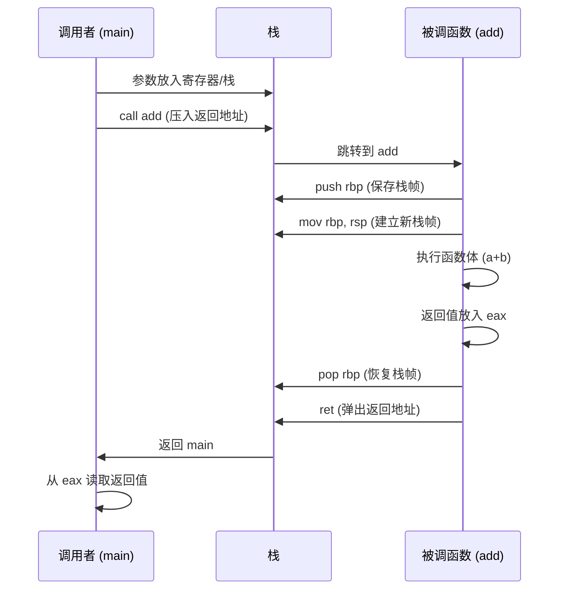
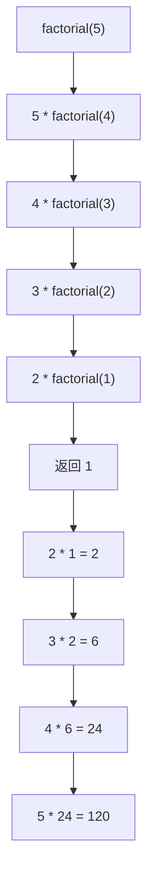

# 函数 (Functions)
---

## 章节概述

函数是 C 程序的基本构建块，是代码复用和模块化设计的最小单元。本章从声明与定义的差异开始，深入讲解参数传递的"值传递"本质（C 语言只有值传递！）、返回值的机制（通过 `eax/rax` 寄存器）、`void` 函数的特殊语义、递归的原理和风险、静态函数（`static`）的模块封装性、内联函数（`inline`）的性能优化、`main` 函数的 `argc/argv` 参数解析、可变参数函数的实现原理。本章还从汇编层面展示函数调用全过程的栈帧机制（`call`/`ret`/`push rbp`），帮助你理解"函数调用到底在 CPU 层面发生了什么"。

> **核心主题**：函数调用 = 栈帧操作 + 参数传递 + 跳转与返回。`call` 压入返回地址，`ret` 弹出返回地址。理解栈帧就理解了 C 语言的全部调用语义——局部变量、参数、递归、缓冲区溢出——本质上都源自栈的布局。

---
### 第一节：函数的声明、定义与调用
---

1.1 声明 vs 定义
-----------------

```c
#include <stdio.h>

// 函数声明（原型 — prototype）：告诉编译器函数的"签名"
// 返回值类型 + 函数名 + 参数类型列表
int add(int a, int b); // 声明
int multiply(int, int); // 声明（参数名可省略）

// 函数定义（实现）：包含函数体
int add(int a, int b) {
 return a + b;
}

// 声明可以出现多次，定义只能出现一次
int multiply(int x, int y) {
 return x * y;
}

int main() {
 int result = add(3, 5);
 printf("3 + 5 = %d\n", result);
 printf("3 * 5 = %d\n", multiply(3, 5));
 return 0;
}
```

**声明 vs 定义**：

| | 声明（Declaration） | 定义（Definition） |
|:--|:--|:--|
| 目的 | 告诉编译器函数存在 | 提供函数的实际实现 |
| 包含函数体 | 否 | 是 |
| 出现次数 | 可以多次 | **只能一次**（ODR规则） |
| 位置 | 头文件或源文件顶部 | 源文件中 |
| 等价于 | 接口（interface） | 实现（implementation） |

1.2 函数原型的必要性
---------------------

```c
#include <stdio.h>

// 没有函数原型 → 隐式声明（C90 遗毒）
// 编译器假设函数返回 int，参数任意
// gcc -Wall 会警告：implicit declaration of function

// 正确做法：始终提供函数原型
double calculate_circle_area(double radius); // 声明

int main() {
 double area = calculate_circle_area(5.0);
 printf("面积: %f\n", area);
 return 0;
}

double calculate_circle_area(double radius) { // 定义
 return 3.14159 * radius * radius;
}
```

> C99 移除了隐式函数声明，但 GCC 默认仍接受（带警告）。始终使用 `-Wall -Wextra -Werror=implicit-function-declaration`。

1.3 函数调用的汇编过程
------------------------

```c
// C 代码
int add(int a, int b) {
 return a + b;
}

int main() {
 int result = add(3, 5); // ← 这个调用背后发生了什么？
 return 0;
}
```



简化汇编代码：
```asm
; 调用方 (main)
 movl $5, %esi ; 第2参数 → esi
 movl $3, %edi ; 第1参数 → edi
 call add ; 压入返回地址，跳转到 add
 movl %eax, -4(%rbp) ; result = 返回值

; 被调用方 (add)
add:
 pushq %rbp ; 保存 main 的栈帧基址
 movq %rsp, %rbp ; 建立 add 的栈帧
 movl %edi, -4(%rbp) ; 保存参数 a (edi)
 movl %esi, -8(%rbp) ; 保存参数 b (esi)
 movl -4(%rbp), %eax ; eax = a
 addl -8(%rbp), %eax ; eax += b (返回值在 eax)
 popq %rbp ; 恢复 main 的栈帧
 ret ; 弹出返回地址，返回 main
```

> 函数调用的完整栈帧机制，特别是 x86-64 System V ABI 的寄存器传参约定，详见 。C++ 的成员函数调用唯一的区别是多传递了一个 `this` 指针作为隐式第一参数。

### 小节练习

> [!question] 选择题 1
> 函数声明和函数定义的根本区别是？
> - [ ] A. 声明可以在任何位置，定义必须在文件末尾
> - [ ] B. 声明不包含函数体，定义包含函数体
> - [ ] C. 声明必须有参数名，定义可以省略
> - [ ] D. 没有区别
>
> > [!success]- 点击查看答案
> > 正确答案: B
> > **解析**: 声明（原型）只描述函数签名，不包含函数体（花括号内容）。定义包含实际的函数体实现——这才是"声明 vs 定义"的根本区别。

> [!question] 判断题 1
> 同一个函数在一个源文件中可以有多个定义。 （ ）
> - [ ] 正确
> - [ ] 错误
>
> > [!success]- 点击查看答案
> > 答案: 错误
> > **解析**: 根据"唯一定义规则"（One Definition Rule），每个函数在整个程序中只能有一个定义（实现）。可以有多个声明，但定义只能有一个。

---
### 第二节：参数传递 —— C 语言只有值传递
---

2.1 值传递的本质
-----------------

**C 语言只有一种参数传递方式：值传递（pass by value）。**

```c
#include <stdio.h>

// 值传递：函数接收的是实参的**副本**
void modify_value(int x) {
 x = 100; // 修改的是副本
 printf("modify_value 内部: x = %d\n", x);
}

// 指针传递：传递的是**地址值的副本**
// 但通过地址可以修改原始数据
void modify_pointer(int *p) {
 *p = 100; // 通过指针修改原始数据
 printf("modify_pointer 内部: *p = %d\n", *p);

 // 但这还是值传递——p 本身是地址值的副本
 p = NULL; // 不影响外部指针！
 printf("p = %p (设为 NULL，不影响外部)\n", (void*)p);
}

int main() {
 int a = 42;
 printf("原始: a = %d\n", a);

 modify_value(a);
 printf("modify_value 后: a = %d (未改变！)\n", a);

 modify_pointer(&a);
 printf("modify_pointer 后: a = %d (已改变！)\n", a);

 return 0;
}
```

2.2 "指针模拟引用"的经典模式
-----------------------------

```c
#include <stdio.h>

// 模式1：通过指针修改外部变量
void swap(int *a, int *b) {
 int temp = *a;
 *a = *b;
 *b = temp;
}

// 模式2：通过指针返回多个值
void get_min_max(int arr[], int n, int *min, int *max) {
 *min = arr[0];
 *max = arr[0];
 for (int i = 1; i < n; i++) {
 if (arr[i] < *min) *min = arr[i];
 if (arr[i] > *max) *max = arr[i];
 }
}

// 模式3：通过指针避免大结构体的复制
struct LargeData {
 int data[1000];
};

void process(struct LargeData *data) { // 传递指针（8 字节）
 data->data[0] = 42;
 // 如果按值传递，需要复制 4000 字节！
}

int main() {
 // 交换
 int x = 10, y = 20;
 swap(&x, &y);
 printf("交换后: x=%d, y=%d\n", x, y);

 // 多个返回值
 int arr[] = {5, 2, 9, 1, 7, 3};
 int min_val, max_val;
 get_min_max(arr, 6, &min_val, &max_val);
 printf("最小值: %d, 最大值: %d\n", min_val, max_val);

 return 0;
}
```

> C++ 提供了"引用"（`&`）作为参数传递的语法糖，底层同样是传递地址。详见 [[../../cpp教程/cpp深化教程/03_指针与引用|CPP教程: 指针与引用]]。

2.3 传递数组参数 —— 实则传递指针
---------------------------------

```c
#include <stdio.h>

// 以下三种声明**完全等价**——都是传递 int*
void func1(int arr[]);
void func2(int arr[10]); // 10 被编译器忽略！
void func3(int *arr);

// 数组参数 = 指针参数
void print_array(int *arr, int size) {
 for (int i = 0; i < size; i++) {
 printf("%d ", arr[i]);
 }
 printf("\n");
}

int main() {
 int arr[] = {1, 2, 3, 4, 5};
 int size = sizeof(arr) / sizeof(arr[0]);

 printf("sizeof(arr) 在 main 中: %zu\n", sizeof(arr)); // 20 (5*4)
 print_array(arr, size); // 传递数组名 = 传递首元素地址

 return 0;
}

// sizeof 陷阱展示
void sizeof_trap(int arr[]) {
 printf("sizeof(arr) 在函数内: %zu\n", sizeof(arr)); // 8 (指针大小！)
 // 无法通过 sizeof 获取数组大小！
}
```

### 小节练习

> [!question] 选择题 1
> C 语言中传递数组给函数时，实际上传递的是什么？
> - [ ] A. 数组的全部内容（复制）
> - [ ] B. 指向数组第一个元素的指针
> - [ ] C. 数组的大小信息
> - [ ] D. 数组的第一个元素的值
>
> > [!success]- 点击查看答案
> > 正确答案: B
> > **解析**: 数组作为函数参数时，数组名"退化"（decay）为指向首元素的指针。这也是为什么函数内无法用 `sizeof(arr)` 获取数组大小（它获取的是指针大小）。需要额外传递元素数量。

---
### 第三节：返回值与 return 机制
---

3.1 返回值机制
---------------

```c
#include <stdio.h>

// 返回值通过寄存器传递（x86-64: eax/rax）
int get_answer() {
 return 42;
}

// void 函数没有返回值（return 可以省略）
void print_message(const char *msg) {
 printf("%s\n", msg);
 // return; // 可选
}

// 返回指针时注意：不能返回局部变量的地址！
int *bad_return() {
 int local = 42;
 return &local; // 危险！返回了栈上的地址！
 // 函数返回后 local 的栈空间被回收，该地址变成"悬空指针"
}

// 正确：返回静态变量或堆上分配的内存
int *good_return_static() {
 static int val = 42; // 静态变量不在栈上
 return &val; // 安全
}

// 也可以返回参数中传入的指针（调用者的变量）
int *good_return_param(int *p) {
 *p = 42;
 return p; // 安全，返回的是调用者提供的地址
}

int main() {
 int answer = get_answer();
 printf("答案: %d\n", answer);

 // 忽略返回值（合法，但可能丢失错误信息）
 get_answer();

 // 返回局部变量地址的后果
 // int *p = bad_return();
 // printf("%d\n", *p); // 未定义行为！可能崩溃，可能输出随机值

 int *safe = good_return_static();
 printf("safe: %d\n", *safe); // 42

 int val;
 int *safe2 = good_return_param(&val);
 printf("safe2: %d\n", *safe2); // 42

 return 0;
}
```

3.2 返回结构体（按值返回大对象）
--------------------------------

```c
#include <stdio.h>

typedef struct {
 int x;
 int y;
} Point;

// 返回结构体——按值返回
// 编译器通过隐藏的指针参数实现（在 x86-64 上）
Point create_point(int x, int y) {
 Point p;
 p.x = x;
 p.y = y;
 return p; // 返回整个结构体的副本
}

int main() {
 Point p1 = create_point(10, 20);
 printf("Point: (%d, %d)\n", p1.x, p1.y);
 return 0;
}

// 汇编层面：返回大结构体时，编译器隐式传入一个指向
// 调用方分配的空间的指针作为额外参数
// 函数体将结果写入该空间
```

### 小节练习

> [!question] 判断题 1
> 函数可以返回指向其局部变量的指针。 （ ）
> - [ ] 正确
> - [ ] 错误
>
> > [!success]- 点击查看答案
> > 答案: 错误
> > **解析**: 返回局部变量的地址是严重的 bug。函数返回后局部变量的栈空间被回收，指针变成"悬空指针"（dangling pointer）。使用它会导致未定义行为。

> [!question] 判断题 2
> `void` 函数中也可以使用 `return;` 语句。 （ ）
> - [ ] 正确
> - [ ] 错误
>
> > [!success]- 点击查看答案
> > 答案: 正确
> > **解析**: `return;`（无返回值）在 void 函数中是合法的，用于提前退出函数。`return` 后面不能带表达式。

---
### 第四节：递归 —— 函数调用自身
---

4.1 递归的基本原理
-------------------

递归 = 函数直接或间接调用自身。每次调用创建新的栈帧，直到达到基准条件（base case）。

```c
#include <stdio.h>

// 递归计算阶乘
// n! = n * (n-1)! with 0! = 1
long long factorial(int n) {
 // 基准条件（停止递归）
 if (n <= 1) {
 return 1;
 }
 // 递归步骤
 return n * factorial(n - 1);
}

int main() {
 printf("5! = %lld\n", factorial(5));

 // 注意：递归深度受栈大小限制
 // 栈溢出 → 段错误（segmentation fault）
 // printf("100000! = %lld\n", factorial(100000)); // 栈溢出！

 return 0;
}
```



4.2 递归 vs 迭代
-----------------

```c
#include <stdio.h>

// 递归版斐波那契（简洁但低效——指数时间）
int fib_recursive(int n) {
 if (n <= 1) return n;
 return fib_recursive(n - 1) + fib_recursive(n - 2);
}

// 迭代版斐波那契（线性时间）
int fib_iterative(int n) {
 if (n <= 1) return n;

 int prev2 = 0; // F(n-2)
 int prev1 = 1; // F(n-1)
 int current;

 for (int i = 2; i <= n; i++) {
 current = prev1 + prev2;
 prev2 = prev1;
 prev1 = current;
 }
 return current;
}

// 尾递归版斐波那契（可被编译器优化为迭代）
int fib_tail(int n, int a, int b) {
 if (n == 0) return a;
 if (n == 1) return b;
 return fib_tail(n - 1, b, a + b);
}

int main() {
 printf("递归 fib(10) = %d\n", fib_recursive(10));
 printf("迭代 fib(10) = %d\n", fib_iterative(10));
 printf("尾递归 fib(10) = %d\n", fib_tail(10, 0, 1));

 // 递归 vs 迭代性能对比
 // fib_recursive(40) ≈ 2.5 秒（~2^40 call）
 // fib_iterative(40) ≈ 0.0001 秒（40 次迭代）
 return 0;
}
```

**递归 vs 迭代对比**：

| | 递归 | 迭代 |
|:--|:--|:--|
| 代码清晰度 | 更接近数学定义 | 更显式的步骤 |
| 空间开销 | 每层调用一个栈帧 → O(n) | 常数 O(1) |
| 栈溢出风险 | 深度大时有风险 | 无风险 |
| 尾递归优化 | GCC -O2 会优化为迭代 | 始终是迭代 |

4.3 递归的汇编表现
-------------------

```asm
; factorial 的递归汇编（简化）
factorial:
 cmpl $1, %edi ; if (n <= 1)
 jg .L_recurse
 movl $1, %eax ; return 1
 ret
.L_recurse:
 pushq %rbx ; 保存 n（因为递归后 n 还需要用）
 movl %edi, %ebx ; ebx = n
 subl $1, %edi ; n - 1
 call factorial ; 调用 factorial(n-1)
 imull %ebx, %eax ; eax = n * factorial(n-1)
 popq %rbx ; 恢复 n
 ret
```

> 每次 `call factorial` 都会压入新的栈帧。当递归深度过大时，栈空间耗尽 → **栈溢出**。Linux 默认栈大小约 8MB，大约能容纳约数万层递归。

4.4 著名的递归问题
-------------------

```c
#include <stdio.h>

// 汉诺塔问题
void hanoi(int n, char from, char to, char aux) {
 if (n == 1) {
 printf("移动盘 1 从 %c 到 %c\n", from, to);
 return;
 }
 hanoi(n - 1, from, aux, to);
 printf("移动盘 %d 从 %c 到 %c\n", n, from, to);
 hanoi(n - 1, aux, to, from);
}

// 全排列生成
void swap_char(char *a, char *b) {
 char temp = *a;
 *a = *b;
 *b = temp;
}

void permute(char str[], int l, int r) {
 if (l == r) {
 printf("%s\n", str);
 return;
 }
 for (int i = l; i <= r; i++) {
 swap_char(&str[l], &str[i]);
 permute(str, l + 1, r);
 swap_char(&str[l], &str[i]); // 回溯
 }
}

int main() {
 printf("汉诺塔 (3层):\n");
 hanoi(3, 'A', 'C', 'B');

 printf("\n全排列 (\"AB\"):\n");
 char str[] = "AB";
 permute(str, 0, 1);

 return 0;
}
```

### 小节练习

> [!question] 选择题 1
> 以下是尾递归的是？
> - [ ] A. `return n * factorial(n - 1);`
> - [ ] B. `return factorial(n - 1, acc * n);`
> - [ ] C. `return fib(n-1) + fib(n-2);`
> - [ ] D. `return 1 + count(n-1);`
>
> > [!success]- 点击查看答案
> > 正确答案: B
> > **解析**: 尾递归要求递归调用是函数的最后一步操作（return 的表达式就是递归调用本身）。B 满足条件（返回的是 factorial 调用的结果），GCC -O2 可将其优化为迭代。A 在递归返回后还要乘以 n，C 需要保存结果相加，D 需要加 1——都不是尾递归。

---
### 第五节：函数的高级特性
---

5.1 static 函数（内部链接）
----------------------------

```c
// util.c —— 模块内部
#include <stdio.h>

// static 函数：只在当前翻译单元（.c 文件）可见
// 其他 .c 文件不能调用它（即使声明了 extern）
static int internal_helper(int x) {
 return x * x;
}

// 公开接口
int calculate(int x) {
 return internal_helper(x) + 10; // 内部使用 helper
}
```

```c
// main.c
#include <stdio.h>

// extern int internal_helper(int x); // 会链接错误！找不到符号
int calculate(int x); // 只声明公开接口

int main() {
 printf("calculate(5) = %d\n", calculate(5));
 // printf("helper = %d\n", internal_helper(5)); // 链接错误
 return 0;
}
```

5.2 inline 函数
----------------

```c
#include <stdio.h>

// inline 提示编译器将函数体直接嵌入调用处（避免调用开销）
// 适用于短小、频繁调用的函数
static inline int max(int a, int b) {
 return (a > b) ? a : b;
}

static inline int square(int x) {
 return x * x;
}

int main() {
 int x = 5, y = 10;
 printf("max = %d\n", max(x, y)); // 可能被内联为 (x > y) ? x : y
 printf("square = %d\n", square(x)); // 可能被内联为 x * x

 // 内联 vs 宏：内联有类型检查，宏是纯文本替换
 // 宏陷阱
 printf("MACRO: %d\n", 5 * square(3 + 1)); // 如果 square 是宏...
 // 宏展开：5 * 3 + 1 * 3 + 1 = 15 + 3 + 1 = 19
 // 内联函数：5 * ((3+1) * (3+1)) = 5 * 16 = 80

 return 0;
}
```

> `inline` 只是对编译器的**建议**，编译器可能无视它。GCC 中 `-O2` 级别下编译器会自动内联小函数，即使没有 `inline` 关键字。

5.3 main 函数的参数（argc / argv）
-----------------------------------

```c
#include <stdio.h>
#include <string.h>
#include <stdlib.h>

int main(int argc, char *argv[]) {
 printf("参数个数 (argc): %d\n", argc);

 // argv[0] 始终是程序名称
 printf("程序名: %s\n", argv[0]);

 // 遍历所有参数
 for (int i = 0; i < argc; i++) {
 printf("argv[%d] = \"%s\"\n", i, argv[i]);
 }

 // 解析整数参数
 if (argc > 1) {
 int num = atoi(argv[1]);
 printf("第一个参数的整数值: %d\n", num);
 }

 return 0;
}

// 运行示例:
// $ ./program hello 42 world
// 参数个数 (argc): 4
// argv[0] = "./program"
// argv[1] = "hello"
// argv[2] = "42"
// argv[3] = "world"
```

5.4 可变参数函数简介
---------------------

```c
#include <stdio.h>
#include <stdarg.h>

// 可变参数函数：参数数量和类型不固定
// 必须至少有一个命名参数！

// 自定义的简单 printf 替代（接受可变数量的 int 参数）
void print_ints(int count, ...) {
 va_list args; // 声明参数列表
 va_start(args, count); // 初始化：从 count 之后开始提取

 for (int i = 0; i < count; i++) {
 int val = va_arg(args, int); // 提取下一个 int 参数
 printf("%d ", val);
 }
 printf("\n");

 va_end(args); // 清理
}

// 计算可变数量 int 的和
int sum(int count, ...) {
 va_list args;
 va_start(args, count);

 int total = 0;
 for (int i = 0; i < count; i++) {
 total += va_arg(args, int);
 }

 va_end(args);
 return total;
}

int main() {
 print_ints(3, 10, 20, 30);
 print_ints(5, 1, 2, 3, 4, 5);

 printf("sum(3, 1, 2, 3) = %d\n", sum(3, 1, 2, 3));
 printf("sum(4, 5, 5, 5, 5) = %d\n", sum(4, 5, 5, 5, 5));

 return 0;
}
```

> `printf` 和 `scanf` 就是典型的可变参数函数。详细的 x86-64 可变参数调用约定请参考 。

### 小节练习

> [!question] 选择题 1
> `static` 函数与普通函数的区别是？
> - [ ] A. static 函数运行更快
> - [ ] B. static 函数只能在定义它的文件中使用
> - [ ] C. static 函数不能有返回值
> - [ ] D. static 函数会自动内联
>
> > [!success]- 点击查看答案
> > 正确答案: B
> > **解析**: `static` 修饰函数时表示"内部链接"（internal linkage），该函数只在当前翻译单元（.c 文件）内可见。这是 C 语言实现模块封装的主要手段——隐藏内部实现细节。

---

## 章节测试

### 一、判断题（正确选，错误选）

> [!question] 判断题 1
> C 语言支持引用参数传递（pass by reference）。 （ ）
> - [ ] 正确
> - [ ] 错误
>
> > [!success]- 点击查看答案
> > 答案: 错误
> > **解析**: C 语言**只有值传递**。所谓的"引用传递"是通过传递指针（地址的副本）来模拟的——函数内部通过指针修改原始数据。C++ 提供了真正的引用传递（`&` 参数），底层同样是传递地址。

> [!question] 判断题 2
> 函数内部用 `sizeof` 获取数组参数的大小是可靠的做法。 （ ）
> - [ ] 正确
> - [ ] 错误
>
> > [!success]- 点击查看答案
> > 答案: 错误
> > **解析**: 数组作为函数参数时退化为指针，`sizeof(arr)` 获取的是指针大小（通常 8 字节），而非数组大小。需要额外传递数组元素数量。

> [!question] 判断题 3
> 递归函数可以替代所有的迭代（循环）实现。 （ ）
> - [ ] 正确
> - [ ] 错误
>
> > [!success]- 点击查看答案
> > 答案: 正确
> > **解析**: 从计算理论角度，递归和迭代是图灵等价的——任何可以用迭代解决的问题都能用递归实现，反之亦然。但在实践中，递归可能因栈深度受限而不可行。

> [!question] 判断题 4
> `void` 函数不能使用 `return;` 语句。 （ ）
> - [ ] 正确
> - [ ] 错误
>
> > [!success]- 点击查看答案
> > 答案: 错误
> > **解析**: `return;`（不带表达式）在 void 函数中合法，用于提前退出函数。

> [!question] 判断题 5
> `static` 局部变量存储在栈上。 （ ）
> - [ ] 正确
> - [ ] 错误
>
> > [!success]- 点击查看答案
> > 答案: 错误
> > **解析**: `static` 局部变量存储在 `.data` 或 `.bss` 段（全局/静态数据区），不在栈上。它的生命周期是整个程序运行期，而非函数调用期。

> [!question] 判断题 6
> `inline` 关键字强制编译器内联该函数。 （ ）
> - [ ] 正确
> - [ ] 错误
>
> > [!success]- 点击查看答案
> > 答案: 错误
> > **解析**: `inline` 只是对编译器的**建议**（hint）。编译器可以忽略请求，也可以在没有 `inline` 关键字时主动内联。现代编译器（-O2 级别）的内联决策主要基于函数大小和调用频率。

> [!question] 判断题 7
> 尾递归可以被编译器优化为迭代。 （ ）
> - [ ] 正确
> - [ ] 错误
>
> > [!success]- 点击查看答案
> > 答案: 正确
> > **解析**: 尾递归（递归调用是函数的最后一个操作）可以被编译器优化为跳转（而不是 call）——使用同样的栈帧空间，避免栈增长。GCC 在 `-O2` 和 `-foptimize-sibling-calls` 下实现此优化。

> [!question] 判断题 8
> `argc` 的值至少是 1。 （ ）
> - [ ] 正确
> - [ ] 错误
>
> > [!success]- 点击查看答案
> > 答案: 正确
> > **解析**: `argc` 至少为 1，因为 `argv[0]` 始终是程序名称（即使没有任何命令行参数）。这是 C 标准和 POSIX 的保证。

> [!question] 判断题 9
> 在函数内声明的 `static` 局部变量每次函数调用时都重新初始化。 （ ）
> - [ ] 正确
> - [ ] 错误
>
> > [!success]- 点击查看答案
> > 答案: 错误
> > **解析**: `static` 局部变量只在**程序启动时初始化一次**（在 `main` 之前）。后续的函数调用不会重新初始化它，而是保留上一次的值。

> [!question] 判断题 10
> 函数指针是 C 语言中最高效的回调机制。 （ ）
> - [ ] 正确
> - [ ] 错误
>
> > [!success]- 点击查看答案
> > 答案: 正确
> > **解析**: 函数指针本质上是一个地址，调用时通过 `call *reg` 间接跳转，开销极小（通常只比直接调用多一次内存加载）。C 标准库的 `qsort`、`bsearch`、信号处理等都用函数指针实现回调。

---

### 二、选择题（单项选择题）

> [!question] 选择题 1
> 以下哪项正确描述了 `void func(int arr[])` 的参数类型？
> - [ ] A. 一个 int 类型数组
> - [ ] B. 一个 int 类型指针
> - [ ] C. 一个 int 类型数组的拷贝
> - [ ] D. 取决于编译器
>
> > [!success]- 点击查看答案
> > 正确答案: B
> > **解析**: C 语言中，数组形参被自动调整为指针（array-to-pointer decay）。`void func(int arr[])` 等价于 `void func(int *arr)`。方括号中的数字（如 `int arr[10]`）被编译器忽略。

> [!question] 选择题 2
> 以下代码输出什么？
> ```c
> int f(int n) { if (n == 0) return 0; return n + f(n - 1); }
> printf("%d\n", f(5));
> ```
> - [ ] A. 0
> - [ ] B. 5
> - [ ] C. 15
> - [ ] D. 120
>
> > [!success]- 点击查看答案
> > 正确答案: C
> > **解析**: 递归计算 1+2+3+4+5 = 15。基准条件 n==0 返回 0，层层叠加返回。

> [!question] 选择题 3
> 以下哪个函数调用会导致栈溢出的风险最大？
> - [ ] A. 尾递归版阶乘（n=1000）
> - [ ] B. 普通递归版阶乘（n=1000）
> - [ ] C. 迭代版阶乘（n=1000）
> - [ ] D. 三者风险相同
>
> > [!success]- 点击查看答案
> > 正确答案: B
> > **解析**: 普通递归每层创建一个新栈帧，1000 层很可能超过默认栈大小（~8MB）。尾递归如果被优化为迭代（-O2），不会增加栈帧。迭代始终只使用常量栈空间。

> [!question] 选择题 4
> `int add(int a, int b);` 中，`a` 和 `b` 这两个名字
> - [ ] A. 是强制性的
> - [ ] B. 可以省略
> - [ ] C. 只能在函数体内使用
> - [ ] D. 必须与定义中的名字一致
>
> > [!success]- 点击查看答案
> > 正确答案: B
> > **解析**: 函数声明（原型）中的参数名可以省略，如 `int add(int, int);` 完全合法。参数名在声明中仅起文档作用。但在定义中必须有参数名（除非是 C23 的省略格式）。

> [!question] 选择题 5
> 在 x86-64 Linux 上，`int add(int a, int b)` 的返回值存储在哪里？
> - [ ] A. 栈上
> - [ ] B. `rdi` 寄存器
> - [ ] C. `rax` 寄存器
> - [ ] D. `rsp` 寄存器
>
> > [!success]- 点击查看答案
> > 正确答案: C
> > **解析**: x86-64 System V ABI 规定整数返回值通过 `rax`/`eax` 寄存器返回。参数通过 `rdi`、`rsi`、`rdx`、`rcx`、`r8`、`r9` 依次传递。详见 。

> [!question] 选择题 6
> `stack overflow`（栈溢出）发生的原因通常是？
> - [ ] A. 使用了太多的全局变量
> - [ ] B. 递归深度过大或局部数组过大
> - [ ] C. 使用了太多的 malloc
> - [ ] D. CPU 过热
>
> > [!success]- 点击查看答案
> > 正确答案: B
> > **解析**: 每次函数调用分配栈帧（包含局部变量和保存的寄存器），当递归深度过大或函数内有超大局部数组时，栈空间（Linux 默认 ~8MB）耗尽→栈溢出（段错误）。

> [!question] 选择题 7
> 以下关于 `va_arg` 用于提取可变参数的代码中，正确的是？
> - [ ] A. `int x = va_arg(args, double);`
> - [ ] B. `int x = va_arg(args, int);`
> - [ ] C. `int x = va_arg(args);`
> - [ ] D. `int x = va_arg(args, "int");`
>
> > [!success]- 点击查看答案
> > 正确答案: B
> > **解析**: `va_arg(args, type)` 的第二个参数是**类型名**，不是字符串。A 类型不匹配（期望 int 但说 double），C 缺少类型参数，D 传入字符串而非类型。

> [!question] 选择题 8
> 以下关于 `inline` 的说法正确的是？
> - [ ] A. inline 函数不能有循环
> - [ ] B. inline 函数体必须在调用处可见（通常放在头文件中）
> - [ ] C. inline 函数不能有超过 3 个参数
> - [ ] D. inline 函数不能返回 void
>
> > [!success]- 点击查看答案
> > 正确答案: B
> > **解析**: 编译器要内联函数，必须在调用点看到函数体——所以 inline 函数的定义通常放在头文件中（或使用 `static inline`）。A/C/D 都是误解：inline 函数没有这些限制。

> [!question] 选择题 9
> 以下哪个是函数指针的声明？
> - [ ] A. `int *func(int);`
> - [ ] B. `int (*func)(int);`
> - [ ] C. `int *func[int];`
> - [ ] D. `int (*func)[10];`
>
> > [!success]- 点击查看答案
> > 正确答案: B
> > **解析**: `int (*func)(int)` 声明了一个指针 `func`，指向接受 `int` 返回 `int` 的函数。A 声明了一个返回 `int*` 的函数（`*` 是返回值类型的一部分）。D 是指向 int[10] 的数组指针。

> [!question] 选择题 10
> 以下代码输出什么？
> ```c
> void f(void) { static int c = 0; printf("%d", ++c); }
> int main() { f(); f(); f(); return 0; }
> ```
> - [ ] A. `000`
> - [ ] B. `111`
> - [ ] C. `123`
> - [ ] D. `333`
>
> > [!success]- 点击查看答案
> > 正确答案: C
> > **解析**: `static int c` 在第一次调用时初始化为 0，后续调用保留上次值。三次调用分别输出 1、2、3。

---

### 动手练习题

> [!example] 练习题 1：递归与迭代对比
> **难度**: 简单
> 
> 分别用递归和迭代实现以下函数，并比较 `n=40` 时的执行时间：
> 1. 阶乘 `factorial(n)`
> 2. 斐波那契 `fibonacci(n)`
> 3. 2 的幂 `power(n)` (return 2^n)
> 
> 哪个函数递归和迭代的性能差距最大？为什么？

> [!example] 练习题 2：汉诺塔动画
> **难度**: 简单
> 
> 实现汉诺塔问题的递归解法，输出每一步的移动（从哪个柱子到哪个柱子）。
> 对于 n=1,2,3,4 输出移动步骤和总步数。验证总步数 = 2^n - 1。
> 
> 力扣练习：力扣递归经典题

> [!example] 练习题 3：命令行参数解析
> **难度**: 简单
> 
> 编写一个 C 程序，通过命令行参数实现一个小计算器：
> ```
> $ ./calc add 10 20 → 30
> $ ./calc sub 50 20 → 30
> $ ./calc mul 5 6 → 30
> $ ./calc div 100 3 → 33
> ```
> 使用 `argc/argv`、`atoi`、`strcmp`。

> [!example] 练习题 4：递归到迭代的转换
> **难度**: 简单
> 
> 将以下递归函数转换为迭代：
> 1. 二分查找（递归版 → 迭代版）
> 2. 快速排序的 partition 循环
> 3. 树的深度优先遍历（用栈模拟递归）
> 
> 力扣练习：力扣递推题
>
> 相关：力扣斐波那契题

> [!example] 练习题 5：汇编栈帧实验
> **难度**: 简单
> 
> 编写一个包含多层嵌套调用的 C 程序：
> ```
> main → funcA → funcB → funcC
> ```
> 每个函数都有局部变量。使用 `gcc -S -O0 -fno-omit-frame-pointer` 生成汇编代码：
> 1. 追踪栈帧的建立（`push rbp; mov rbp, rsp`）和销毁（`pop rbp; ret`）
> 2. 观察参数在寄存器中的流动
> 3. 观察局部变量在栈上的相对偏移（rbp - N）
> 4. 用 mermaid 画出整个调用栈的布局图
> 
> 参考 。
