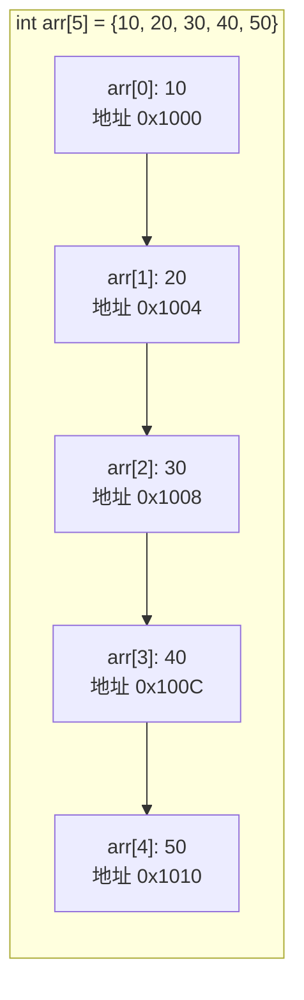
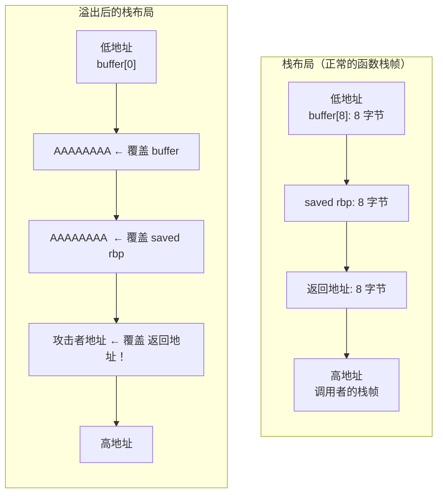

# 数组 (Arrays)
---

##  章节概述

数组是 C 语言中组织同类型数据的核心机制——连续排列的内存块，通过下标快速访问。本章从一维数组的声明与初始化出发，深入二维和高维数组的内存布局（行主序 row-major），讲解变长数组（VLA，C99 特性）、数组退化为指针的核心概念（array-to-pointer decay）、数组越界的危险（C 语言不进行边界检查！）、多维数组在栈和堆上的内存分配，最后通过 mermaid 图表和汇编代码展示数组寻址的底层机制（`base + index * sizeof(element)`）。理解数组在内存中的真实布局是理解指针、结构体、动态内存管理的基础。

> **核心主题**：数组 = 连续内存块 + 首地址 + 偏移计算。CPU 通过 `[base + offset * scale]` 寻址模式实现数组访问——这也是为什么数组下标从 0 开始（偏移量 = 下标 × 元素大小）。C 语言不进行边界检查，意味着代码安全完全依赖程序员自律。

---
###  第一节：一维数组
---

1.1 声明、初始化、访问
-----------------------

```c
#include <stdio.h>

int main() {
    // 声明（未初始化 → 内容不确定）
    int arr1[5];

    // 声明 + 初始化列表
    int arr2[5] = {10, 20, 30, 40, 50};

    // 部分初始化（剩余元素自动置 0）
    int arr3[5] = {1, 2};  // {1, 2, 0, 0, 0}

    // 自动推导长度
    int arr4[] = {1, 2, 3, 4, 5, 6};  // 长度为 6

    // 全零初始化
    int arr5[100] = {0};

    // C99 指定初始化器（designated initializer）
    int arr6[10] = {[2] = 5, [7] = 9};
    // arr6 = {0, 0, 5, 0, 0, 0, 0, 9, 0, 0}

    // 访问和修改
    arr2[0] = 100;          // 修改第一个元素
    int x = arr2[3];        // 读取第四个元素

    // 遍历
    for (int i = 0; i < 5; i++) {
        printf("arr2[%d] = %d\n", i, arr2[i]);
    }

    return 0;
}
```

1.2 数组在内存中的布局
-----------------------



```
内存地址（假设 arr 起始于 0x1000）：
0x1000: 0A 00 00 00  ← arr[0] = 10
0x1004: 14 00 00 00  ← arr[1] = 20
0x1008: 1E 00 00 00  ← arr[2] = 30
0x100C: 28 00 00 00  ← arr[3] = 40
0x1010: 32 00 00 00  ← arr[4] = 50

每个 int 占 4 字节 (sizeof(int) = 4)
地址递增步长 = sizeof(int) = 4
```

**关键公式**：
```
arr[i] 的地址 = arr (基地址) + i × sizeof(元素类型)
```

1.3 数组名 = 指向首元素的指针（但不能被赋值）
-----------------------------------------------

```c
#include <stdio.h>

int main() {
    int arr[5] = {10, 20, 30, 40, 50};

    // arr 的类型是 int[5]（长度为 5 的 int 数组）
    // 但在大多数表达式中，arr 退化为 int*（指向首元素）

    printf("arr     = %p\n", (void*)arr);
    printf("&arr[0] = %p\n", (void*)&arr[0]);
    // 两者地址相同！

    printf("*arr    = %d\n", *arr);       // 10 (arr[0])
    printf("*(arr+2) = %d\n", *(arr + 2)); // 30 (arr[2])

    // arr 可以参与指针运算但不可被赋值
    int *p = arr;    // OK：指针 p 指向 arr 首元素
    // arr = p;      // 编译错误！数组名不是可修改的左值

    // 字符串字面量是特殊情况
    char str[] = "hello";   // OK：在栈上分配数组并拷贝字符串
    // str = "world";       // 编译错误！数组名不可被赋值

    return 0;
}
```

1.4 指针算术与数组下标的关系
-----------------------------

```c
#include <stdio.h>

int main() {
    int arr[] = {10, 20, 30, 40, 50};

    // arr[i] 等价于 *(arr + i)
    // 实际上，C 标准定义了 E1[E2] 等价于 (*((E1)+(E2)))
    // 这意味着...

    printf("arr[2]  = %d\n", arr[2]);    // 30
    printf("*(arr+2) = %d\n", *(arr+2)); // 30

    // 甚至以下写法也是合法的（但不要这样写！）：
    printf("2[arr]  = %d\n", 2[arr]);    // 30！

    // 遍历数组的两种等价写法
    // 写法1：下标访问
    for (int i = 0; i < 5; i++) {
        printf("%d ", arr[i]);
    }
    printf("\n");

    // 写法2：指针遍历
    for (int *p = arr; p < arr + 5; p++) {
        printf("%d ", *p);
    }
    printf("\n");

    return 0;
}
```

###  小节练习

> [!question] 选择题 1
> `int arr[5] = {1, 2};` 之后，`arr[3]` 的值是？
> - [ ] A. 未定义（垃圾值）
> - [ ] B. 0
> - [ ] C. 2
> - [ ] D. 编译错误
>
> > [!success]- 点击查看答案
> > 正确答案: B
> > **解析**: C 语言规定，部分初始化列表中的剩余元素自动初始化为 0。`arr = {1, 2, 0, 0, 0}`。

> [!question] 判断题 1
> `int arr[5]; arr = (int[]){1,2,3,4,5};` 可以给数组赋值。 （ ）
> - [ ]  正确
> - [ ]  错误
>
> > [!success]- 点击查看答案
> > 答案: 错误
> > **解析**: 数组名不是可修改的左值，不能放在赋值运算符左侧。这段代码是编译错误。复合字面量（C99）确实存在，但不能用于重新赋值数组名。正确做法是用 `memcpy` 或逐个元素赋值。

---
###  第二节：多维数组
---

2.1 二维数组的声明和初始化
----------------------------

```c
#include <stdio.h>

int main() {
    // 声明二维数组
    int matrix1[3][4];  // 3 行 4 列，未初始化

    // 完全初始化
    int matrix2[3][4] = {
        {1, 2, 3, 4},     // 第0行
        {5, 6, 7, 8},     // 第1行
        {9, 10, 11, 12}   // 第2行
    };

    // 部分初始化
    int matrix3[3][4] = {
        {1, 2},           // 第0行: {1, 2, 0, 0}
        {5},              // 第1行: {5, 0, 0, 0}
        {}                // 第2行: {0, 0, 0, 0}
    };

    // 平坦初始化（按行主序填充）
    int matrix4[3][4] = {1, 2, 3, 4, 5, 6, 7, 8, 9, 10, 11, 12};

    // 自动推导第一维长度
    int matrix5[][4] = {
        {1, 2, 3, 4},
        {5, 6, 7, 8},
        {9, 10, 11, 12}
    };  // 自动得出 3 行
    // 注意：第二维必须指定！编译器需要知道每行有多少列

    // 访问元素
    printf("matrix2[1][2] = %d\n", matrix2[1][2]);  // 7

    return 0;
}
```

2.2 二维数组的内存布局（行主序 Row-Major）
--------------------------------------------

```mermaid
graph TD
    subgraph "int matrix#91;3#93;#91;4#93; 内存布局"
        direction LR
        M0["0x1000<br/>matrix#91;0#93;#91;0#93; = 1"]
        M1["0x1004<br/>matrix#91;0#93;#91;1#93; = 2"]
        M2["0x1008<br/>matrix#91;0#93;#91;2#93; = 3"]
        M3["0x100C<br/>matrix#91;0#93;#91;3#93; = 4"]
        M4["0x1010<br/>matrix#91;1#93;#91;0#93; = 5"]
        M5["0x1014<br/>matrix#91;1#93;#91;1#93; = 6"]
        M6["0x1018<br/>matrix#91;1#93;#91;2#93; = 7"]
        M7["0x101C<br/>matrix#91;1#93;#91;3#93; = 8"]
        M8["0x1020<br/>matrix#91;2#93;#91;0#93; = 9"]
        M9["0x1024<br/>matrix#91;2#93;#91;1#93; = 10"]
        M10["0x1028<br/>matrix#91;2#93;#91;2#93; = 11"]
        M11["0x102C<br/>matrix#91;2#93;#91;3#93; = 12"]
    end
    M0 --> M1 --> M2 --> M3 --> M4 --> M5 --> M6 --> M7 --> M8 --> M9 --> M10 --> M11
```



C 语言采用**行主序**（Row-Major Order）：同一行的元素存储在连续的内存位置中。

```
matrix[i][j] 的地址 = matrix + (i × 列数 + j) × sizeof(element)
                   = matrix + (i × 4 + j) × 4
```

```c
#include <stdio.h>

int main() {
    int matrix[3][4] = {
        {1, 2, 3, 4},
        {5, 6, 7, 8},
        {9, 10, 11, 12}
    };

    // 证明二维数组在内存中是连续的一维数组
    int *p = (int*)matrix;  // 或 &matrix[0][0]
    printf("平坦遍历: ");
    for (int i = 0; i < 12; i++) {
        printf("%d ", p[i]);
    }
    printf("\n");  // 1 2 3 4 5 6 7 8 9 10 11 12

    // 等价于
    printf("matrix[%d][%d] 的替代写法:\n", 1, 2);
    // matrix[i][j] = *(*(matrix + i) + j)
    printf("*(*(matrix+1)+2) = %d\n", *(*(matrix + 1) + 2));

    return 0;
}
```

2.3 三维数组和更高维
---------------------

```c
#include <stdio.h>

int main() {
    // 三维数组：层 × 行 × 列
    int cube[2][3][4] = {
        {  // 第0层
            {1, 2, 3, 4},        // 第0层第0行
            {5, 6, 7, 8},        // 第0层第1行
            {9, 10, 11, 12}      // 第0层第2行
        },
        {  // 第1层
            {13, 14, 15, 16},
            {17, 18, 19, 20},
            {21, 22, 23, 24}
        }
    };

    printf("cube[1][2][3] = %d\n", cube[1][2][3]);  // 24

    // 内存布局：仍然是行主序的延伸
    // cube[layer][row][col] 的偏移 =
    //   layer × (rows × cols) + row × cols + col
    // = cube + (layer * 12 + row * 4 + col) * 4

    // 验证连续内存
    int count = 0;
    for (int l = 0; l < 2; l++)
        for (int r = 0; r < 3; r++)
            for (int c = 0; c < 4; c++)
                printf("%d ", cube[l][r][c] == ++count ? cube[l][r][c] : -1);
    printf("\n");  // 1..24 continuum

    return 0;
}
```

2.4 多维数组作为函数参数
-------------------------

```c
#include <stdio.h>

// 传递二维数组 —— 必须指定所有维（除了第一维）
void print_matrix(int rows, int cols, int matrix[][4]) {
    for (int i = 0; i < rows; i++) {
        for (int j = 0; j < cols; j++) {
            printf("%3d ", matrix[i][j]);
        }
        printf("\n");
    }
}

// 等价的指针版本
void print_matrix_ptr(int rows, int cols, int *matrix) {
    for (int i = 0; i < rows; i++) {
        for (int j = 0; j < cols; j++) {
            // 手动计算偏移
            printf("%3d ", matrix[i * cols + j]);
        }
        printf("\n");
    }
}

int main() {
    int mat[3][4] = {
        {1, 2, 3, 4},
        {5, 6, 7, 8},
        {9, 10, 11, 12}
    };

    printf("二维数组版本:\n");
    print_matrix(3, 4, mat);

    printf("\n指针版本:\n");
    print_matrix_ptr(3, 4, &mat[0][0]);

    return 0;
}
```

###  小节练习

> [!question] 选择题 1
> `int arr[3][4]` 在内存中占多少字节（64 位系统）？
> - [ ] A. 12 字节
> - [ ] B. 24 字节
> - [ ] C. 48 字节
> - [ ] D. 96 字节
>
> > [!success]- 点击查看答案
> > 正确答案: C
> > **解析**: 3 行 × 4 列 = 12 个 int 元素。每个 int 占 4 字节（64 位 Linux）。共 12 × 4 = 48 字节。数组内元素是连续存储的，没有行列之间的额外填充。

> [!question] 选择题 2
> 二维数组传参时，下面哪个函数声明是正确的？
> - [ ] A. `void func(int arr[][])`
> - [ ] B. `void func(int arr[3][])`
> - [ ] C. `void func(int arr[][4])`
> - [ ] D. `void func(int arr[3][4])`
>
> > [!success]- 点击查看答案
> > 正确答案: C、D
> > **解析**: 传递二维数组时，除第一维外，所有其他维的大小必须指定。编译器需要知道每行多少个元素才能计算 `arr[i][j]` 的地址。C 省略第一维是可以的，D 全部指定也可以。

---
###  第三节：变长数组（VLA — Variable Length Array）
---

3.1 VLA 的概念（C99 特性）
----------------------------

VLA（变长数组）允许在**运行时**确定数组的大小，数组长度可以是一个变量（非编译时常量）。

```c
#include <stdio.h>

int main() {
    int n;
    printf("输入数组大小: ");
    scanf("%d", &n);

    // VLA：数组大小在运行时确定
    int arr[n];  // 在栈上分配 n 个 int

    // 初始化和使用
    for (int i = 0; i < n; i++) {
        arr[i] = i * 10;
    }

    for (int i = 0; i < n; i++) {
        printf("%d ", arr[i]);
    }
    printf("\n");

    // sizeof VLA：在运行时计算
    printf("sizeof(arr) = %zu 字节\n", sizeof(arr));
    // 运行时计算为 n * sizeof(int)

    return 0;
}
```

3.2 VLA 的限制和风险
---------------------

```c
#include <stdio.h>

int main() {
    int n;

    // 限制1：不能初始化（因为大小在编译时未知）
    // int arr[n] = {0};  // 编译错误！

    // 正确：声明后手动清空或逐个赋值
    n = 10;
    int arr[n];
    for (int i = 0; i < n; i++) arr[i] = i;

    // 限制2：不能作为全局数组（全局变量必须在编译时确定大小）

    // 风险1：栈溢出
    // 如果 n = 100000000，arr 占 ~400MB，远超栈大小 → 段错误
    // printf("输入 n: ");
    // scanf("%d", &n);
    // int huge[n];  // 可能是栈溢出！

    // 风险2：C11 将 VLA 变为可选特性
    // 部分编译器（如 MSVC）不支持 VLA

    // 风险3：VLA 作为函数参数的类型与指针相同
    void process(int rows, int cols, int mat[rows][cols]) {
        // 实际上 mat 仍然是指针
        for (int i = 0; i < rows; i++) {
            for (int j = 0; j < cols; j++) {
                mat[i][j] = i * cols + j;
            }
        }
    }

    int rows = 3, cols = 4;
    int matrix[3][4];
    process(rows, cols, matrix);

    return 0;
}
```

3.3 VLA vs 动态内存分配
------------------------

| 特性 | VLA | malloc/free |
|------|-----|-------------|
| 内存位置 | 栈（stack） | 堆（heap） |
| 生存期 | 函数内（出作用域自动释放） | 手动管理（直到 free） |
| 最大大小 | 受栈大小限制（~8MB） | 受系统内存限制（GB 级） |
| 性能 | 极快（仅移动栈指针） | 较慢（需要堆管理） |
| 可移植性 | C99 可选 | 始终可用（C89 起） |
| 可返回 | 否（函数返回后栈被回收） | 是 |

```c
#include <stdio.h>
#include <stdlib.h>

// VLA 版本 —— 数组在函数返回后即消失
void fill_vla(int n) {
    int arr[n];
    for (int i = 0; i < n; i++) arr[i] = i;
    // arr 在这里被销毁
}

// malloc 版本 —— 数组持续存在直到 free
int *fill_malloc(int n) {
    int *arr = (int*)malloc(n * sizeof(int));
    if (arr == NULL) return NULL;
    for (int i = 0; i < n; i++) arr[i] = i;
    return arr;  // 安全返回，调用者负责 free
}

int main() {
    int *arr = fill_malloc(5);
    for (int i = 0; i < 5; i++) printf("%d ", arr[i]);
    printf("\n");
    free(arr);  // 必须释放
    return 0;
}
```

> 关于动态内存管理（`malloc`/`free`）的详细讲解见 [[../2深化/03_动态内存管理]]。

###  小节练习

> [!question] 判断题 1
> VLA（变长数组）在 C11 标准中是强制性要求。 （ ）
> - [ ]  正确
> - [ ]  错误
>
> > [!success]- 点击查看答案
> > 答案: 错误
> > **解析**: C99 引入 VLA 作为强制特性，但 C11 将 VLA 降级为**可选特性**（编译器可以定义 `__STDC_NO_VLA__` 表示不支持）。MSVC 就不支持 VLA。编写可移植代码时建议用 `malloc` 代替 VLA。

---
###  第四节：数组越界与缓冲区溢出
---

4.1 C 语言不进行边界检查
-------------------------

```c
#include <stdio.h>

int main() {
    int arr[5] = {1, 2, 3, 4, 5};

    // 越界写入 —— C 不报错！
    arr[5] = 999;    // 写入了不属于 arr 的内存
    arr[10] = 888;   // 可能覆盖其他变量或返回地址！

    // 越界读取 —— C 不报错！
    printf("arr[5] = %d\n", arr[5]);  // 读取未知内存
    printf("arr[10] = %d\n", arr[10]); // 可能读取到其他变量的值

    // 后果：
    // 1. 未定义行为（UB）——可能崩溃，可能静默产生错误结果
    // 2. 覆盖邻近变量
    // 3. 覆盖返回地址（最危险！→ 安全漏洞的基础）

    int secret = 42;
    int buffer[4] = {0};
    // buffer[-1] 可能访问到 secret（取决于栈布局）
    printf("secret 附近的内存: buffer[-1] = %d\n", buffer[-1]);

    return 0;
}
```

4.2 缓冲区溢出是安全漏洞的根源
-------------------------------

```c
#include <stdio.h>
#include <string.h>

// 经典的安全漏洞示例（仅作教学用途）
void vulnerable(char *input) {
    char buffer[8];  // 只有 8 字节的缓冲区
    strcpy(buffer, input);  // 如果 input 长于 8 字节 → 溢出！
    printf("buffer: %s\n", buffer);
    // 溢出的数据会覆盖栈上的其他内容（包括返回地址！）
}

int main() {
    // safe: "hello" 只有 6 字节（含 \0）
    vulnerable("hello");

    // 危险！这个输入如果被攻击者控制，可能覆盖返回地址
    // 导致任意代码执行（buffer overflow exploit）
    // vulnerable("AAAAAAAAAAAAAAAAAAAAAAAA");

    return 0;
}
```



> 缓冲区溢出是 C 语言最著名的安全问题，也是 Rust 语言设计的核心动力之一。安全编程实践见本教程第二部分；Rust 的内存安全方案见 。

###  小节练习

> [!question] 选择题 1
> C 语言中访问数组越界时会发生什么？
> - [ ] A. 编译错误
> - [ ] B. 运行时异常（如 Java 的 ArrayIndexOutOfBoundsException）
> - [ ] C. 未定义行为（UB）——结果不可预测
> - [ ] D. 自动返回 0
>
> > [!success]- 点击查看答案
> > 正确答案: C
> > **解析**: C 语言为了性能不进行运行时边界检查。越界访问导致未定义行为：可能看似正常（读取到相邻变量），可能段错误，可能被攻击者利用。这是 C 语言最核心的安全风险。

---
###  第五节：数组在汇编层的寻址
---

5.1 数组寻址的汇编指令
-----------------------

```c
// C 代码
int sum_array(int arr[], int n) {
    int sum = 0;
    for (int i = 0; i < n; i++) {
        sum += arr[i];
    }
    return sum;
}
```

对应 x86-64 汇编（`-O2` 优化，简化版）：
```asm
sum_array:
    testl   %esi, %esi       ; 检查 n 是否 ≤ 0
    jle     .L_ret_zero
    leal    -1(%rsi), %eax   ; eax = n - 1
    leaq    4(%rdi,%rax,4), %rdx  ; 计算结束地址
    movl    $0, %eax         ; sum = 0
.L_loop:
    addl    (%rdi), %eax     ; sum += *rdi (arr[i])
    addq    $4, %rdi         ; rdi += 4 (指针前移一个 int)
    cmpq    %rdx, %rdi       ; 是否已到数组末尾？
    jne     .L_loop
    ret
.L_ret_zero:
    xorl    %eax, %eax
    ret
```

**关键汇编寻址模式**：

| 寻址模式 | 示例 | 含义 | C 等效 |
|---------|------|------|--------|
| 基址+偏移 | `mov -8(%rbp), %eax` | 访问 `rbp - 8` 处的值 | 局部变量 |
| 基址+索引 | `mov (%rdi,%rax,4), %edx` | 访问 `rdi + rax×4` | `arr[i]` |
| 基址+索引+偏移 | `mov 16(%rdi,%rax,8), %ecx` | 访问 `rdi + rax×8 + 16` | `struct_arr[i].field` |

```asm
; arr[i] 的寻址：
; arr 在 rdi 中，i 在 rax 中
movl    (%rdi, %rax, 4), %eax   ; eax = arr[i]
;                ^^^^
;                比例因子 = sizeof(int)

; 等价于: eax = *(arr + i * 4)

; arr[i][j] 的寻址（假设每行 4 列，即 col=4）：
; arr 在 rdi 中，i 在 rax 中，j 在 rcx 中
; 地址 = arr + (i * 4 + j) * 4 = arr + i * 16 + j * 4
leal    (%rcx, %rax, 4), %edx   ; edx = (i * 4 + j)   ; 注意：这里 i*4 因为 col=4
movl    (%rdi, %rdx, 4), %eax   ; eax = arr[i][j]
```

> 数组寻址的本质是通过 `Scale-Index-Base`（SIB）字节编码实现的高效地址计算。详细汇编寻址模式见 。

5.2 数组在循环中的栈遍历
--------------------------

```c
// C 代码
int main() {
    int arr[5] = {10, 20, 30, 40, 50};
    int sum = 0;
    for (int i = 0; i < 5; i++) {
        sum += arr[i];
    }
    return sum;
}
```

栈帧布局（`-O0`，简化）：
```
        ┌─────────────────────┐  高地址
        │   返回地址           │  rbp + 8
        ├─────────────────────┤
rbp →   │   旧的 rbp           │
        ├─────────────────────┤
        │   arr[4] = 50       │  rbp - 4
        │   arr[3] = 40       │  rbp - 8
        │   arr[2] = 30       │  rbp - 12
        │   arr[1] = 20       │  rbp - 16
        │   arr[0] = 10       │  rbp - 20
        ├─────────────────────┤
        │   sum = 0           │  rbp - 24
        ├─────────────────────┤
        │   i = 0             │  rbp - 28
        ├─────────────────────┤
rsp →   │   (低地址)          │
        └─────────────────────┘
```

###  小节练习

> [!question] 选择题 1
> 在 x86-64 汇编中，`movl (%rdi,%rax,4), %eax` 这条指令的 C 语言等价代码是？
> - [ ] A. `eax = rdi + rax * 4;`
> - [ ] B. `eax = *(int*)(rdi + rax * 4);`
> - [ ] C. `eax = rdi[rax];`
> - [ ] D. `eax = &rdi[rax];`
>
> > [!success]- 点击查看答案
> > 正确答案: B
> > **解析**: `(%rdi, %rax, 4)` 是 x86 的 SIB 寻址：计算地址 `rdi + rax × 4`，然后将该地址处的值加载到 eax。比例因子 4 对应 `sizeof(int)`，等价于 `arr[rax]` 或 `*(arr + rax)`。

---

##  章节测试

### 一、判断题（正确选，错误选）

> [!question] 判断题 1
> `int arr[10];` 声明中，`arr` 本身是一个可修改的指针变量。 （ ）
> - [ ]  正确
> - [ ]  错误
>
> > [!success]- 点击查看答案
> > 答案: 错误
> > **解析**: `arr` 是数组名，不是一个独立的指针变量。它**不可修改**（不能放在赋值左侧），但在表达式上下文会"退化"为指向首元素的指针。`arr` 没有独立的存储位置——它编译为数组首地址的常量。

> [!question] 判断题 2
> `arr[i]` 和 `*(arr + i)` 是完全等价的。 （ ）
> - [ ]  正确
> - [ ]  错误
>
> > [!success]- 点击查看答案
> > 答案: 正确
> > **解析**: C 标准明确规定：`E1[E2]` 等价于 `(*((E1)+(E2)))`。所以 `arr[i]` 和 `*(arr+i)` 在语义上完全相同。这也是 `i[arr]` 写法的理论基础（虽然不推荐使用）。

> [!question] 判断题 3
> C 语言运行时会自动检查数组越界。 （ ）
> - [ ]  正确
> - [ ]  错误
>
> > [!success]- 点击查看答案
> > 答案: 错误
> > **解析**: C 语言不进行任何运行时边界检查——这是为了性能（每个数组访问都做检查将显著降低性能）。程序员自己负责确保索引在合法范围内。

> [!question] 判断题 4
> 二维数组 `int arr[3][4]` 在内存中按行主序（row-major）存储。 （ ）
> - [ ]  正确
> - [ ]  错误
>
> > [!success]- 点击查看答案
> > 答案: 正确
> > **解析**: C/C++ 语言规范要求二维数组按行主序存储：同一行的元素连续排列，第 i 行的最后一个元素与第 i+1 行的第一个元素相邻。这与 Fortran 的列主序相反。

> [!question] 判断题 5
> `int arr[5] = {0};` 只把 arr[0] 初始化为 0，其他元素未初始化。 （ ）
> - [ ]  正确
> - [ ]  错误
>
> > [!success]- 点击查看答案
> > 答案: 错误
> > **解析**: 如果初始化列表的元素少于数组长度，剩余元素被自动初始化为 0。`{0}` 等价于 `{0, 0, 0, 0, 0}`。

> [!question] 判断题 6
> VLA（变长数组）可以用于声明全局变量。 （ ）
> - [ ]  正确
> - [ ]  错误
>
> > [!success]- 点击查看答案
> > 答案: 错误
> > **解析**: 全局变量和静态变量必须在链接时确定地址和大小，VLA 的大小在运行时才知道，因此只能用于局部变量（在栈上分配）。

> [!question] 判断题 7
> 多维数组作为函数参数时，除第一维外，其他所有维度大小必须指定。 （ ）
> - [ ]  正确
> - [ ]  错误
>
> > [!success]- 点击查看答案
> > 答案: 正确
> > **解析**: 编译器需要知道每行有多少元素才能计算 `arr[i][j]` 的偏移。第一维在编译时不需要（因为计算偏移时第一维只影响 i×cols），其他维必须指定。

> [!question] 判断题 8
> `sizeof(arr)` 在函数内部能正确计算作为参数传递的数组的大小。 （ ）
> - [ ]  正确
> - [ ]  错误
>
> > [!success]- 点击查看答案
> > 答案: 错误
> > **解析**: 函数内的数组参数已退化为指针，`sizeof(arr)` 返回指针大小（通常 8 字节），而非原始数组大小。这是 C 语言最常见的陷阱之一。

> [!question] 判断题 9
> C 语言中 `int w[10];` 后 `sizeof(w)` 返回 `10 * sizeof(int)`，即 40（假设 int=4）。 （ ）
> - [ ]  正确
> - [ ]  错误
>
> > [!success]- 点击查看答案
> > 答案: 正确
> > **解析**: 在声明数组的同一作用域内，`sizeof(w)` 仍能正确获取数组的总字节数（数组名还没有退化为指针）。用 `sizeof(w) / sizeof(w[0])` 可以得到元素个数。

> [!question] 判断题 10
> 数组在复制时（如 `arr2 = arr1`）会将所有元素复制到新数组。 （ ）
> - [ ]  正确
> - [ ]  错误
>
> > [!success]- 点击查看答案
> > 答案: 错误
> > **解析**: C 语言的数组不支持整体赋值。`arr2 = arr1` 是编译错误（数组名不可修改）。复制数组需要用 `memcpy(arr2, arr1, sizeof(arr1))` 或循环逐个元素复制。

---

### 二、选择题（单项选择题）

> [!question] 选择题 1
> `int arr[3][4]` 中 `arr[1][2]` 的地址偏移是？
> - [ ] A. `arr + (1 + 2) * 4`
> - [ ] B. `arr + (1 * 3 + 2) * 4`
> - [ ] C. `arr + (1 * 4 + 2) * 4`
> - [ ] D. `arr + (2 * 3 + 1) * 4`
>
> > [!success]- 点击查看答案
> > 正确答案: C
> > **解析**: 行主序下，`arr[1][2]` 先跳过第 0 行（4 个元素），再到第 1 行的第 2 个元素。偏移 = `(1 * 4 + 2) * sizeof(int)` = 6 * 4 = 24。

> [!question] 选择题 2
> 以下哪个声明合法？
> - [ ] A. `int arr[];`（全局）
> - [ ] B. `int arr[0];`（全局）
> - [ ] C. `int arr[] = {1,2,3};`（全局）
> - [ ] D. `int arr[.5];`
>
> > [!success]- 点击查看答案
> > 正确答案: C
> > **解析**: C 可以自动推导大小（`int arr[] = {1,2,3}` 等价于 `int arr[3]`）。A 错误（无推导信息的无大小数组），B 零长度数组非标准 C（GCC 扩展），D 语法错误。

> [!question] 选择题 3
> 以下代码输出什么？
> ```c
> int arr[] = {10, 20, 30, 40};
> int *p = arr;
> printf("%d\n", *(p + 2));
> ```
> - [ ] A. 10
> - [ ] B. 20
> - [ ] C. 30
> - [ ] D. 40
>
> > [!success]- 点击查看答案
> > 正确答案: C
> > **解析**: `p` 指向 `arr[0]`，`p + 2` 指向 `arr[2]` → `*(p+2) = 30`。

> [!question] 选择题 4
> 以下关于 VLA 的说法正确的是？
> - [ ] A. VLA 在 C89 标准中就已存在
> - [ ] B. VLA 的内存来自堆
> - [ ] C. VLA 的大小可以在运行时确定
> - [ ] D. VLA 可以用初始化列表 `= {0}`
>
> > [!success]- 点击查看答案
> > 正确答案: C
> > **解析**: VLA 是 C99 特性，大小在运行时确定，内存在栈上分配（不是堆），不能用初始化列表——因为大小编译时未知。

> [!question] 选择题 5
> 数组越界写入最严重的后果是？
> - [ ] A. 编译错误
> - [ ] B. 运行时打印错误信息
> - [ ] C. 覆盖返回地址导致任意代码执行
> - [ ] D. 自动被操作系统阻止
>
> > [!success]- 点击查看答案
> > 正确答案: C
> > **解析**: 栈上的缓冲区溢出可以覆盖返回地址，攻击者可以通过精心构造的输入劫持程序控制流，执行任意代码。这是历史上最严重的软件安全漏洞类别（CWE-121）。

> [!question] 选择题 6
> `int arr[3][4][5]` 在内存中元素个数是？
> - [ ] A. 12
> - [ ] B. 20
> - [ ] C. 35
> - [ ] D. 60
>
> > [!success]- 点击查看答案
> > 正确答案: D
> > **解析**: 三维数组大小 = 3 × 4 × 5 = 60 个 int 元素。内存中所有 60 个元素连续排列。

> [!question] 选择题 7
> 以下数组中哪个不能自动推导长度？
> - [ ] A. `int a[] = {1, 2, 3};`
> - [ ] B. `int b[][3] = {{1,2,3}, {4,5,6}};`
> - [ ] C. `int c[][3] = {};`
> - [ ] D. `int d[3][] = {{1,2}, {3,4}};`
>
> > [!success]- 点击查看答案
> > 正确答案: D
> > **解析**: 只有**第一维**可以省略。`int d[3][]` 省略了第二维而非第一维，是错误的——编译器无法推断每行有多少列。

> [!question] 选择题 8
> `int arr[5]; printf("%zu", sizeof arr / sizeof arr[0]);` 输出什么？
> - [ ] A. 4
> - [ ] B. 5
> - [ ] C. 20
> - [ ] D. 不确定
>
> > [!success]- 点击查看答案
> > 正确答案: B
> > **解析**: `sizeof(arr) = 20`（5 × 4 字节），`sizeof(arr[0]) = 4`（1 个 int），`20 / 4 = 5`——正确获取了元素个数。

> [!question] 选择题 9
> 以下哪项是正确的三维数组 `cube[2][3][4]` 的内存偏移公式？
> - [ ] A. `cube + (l * 3 + r * 2 + c) * 4`
> - [ ] B. `cube + (l * 12 + r * 4 + c) * 4`
> - [ ] C. `cube + (l + r + c) * 4`
> - [ ] D. `cube + (l * 3 * 4 + r * 4 + c) * 4`
>
> > [!success]- 点击查看答案
> > 正确答案: D
> > **解析**: 三维数组偏移 = `l × (3×4) + r × 4 + c` = `l×12 + r×4 + c` 个元素。B 的 `12` 和 `4` 缺少了 `×4` 的单位（元素数 vs 字节数）。更准确地说是元素偏移含 `sizeof(int)`。

> [!question] 选择题 10
> 在 x86-64 汇编中访问 `arr[i]` 时，比例因子 scale 的值取决于什么？
> - [ ] A. 数组的首地址
> - [ ] B. 索引 i 的值
> - [ ] C. 数组元素的 sizeof（元素类型大小）
> - [ ] D. 数组长度
>
> > [!success]- 点击查看答案
> > 正确答案: C
> > **解析**: SIB 寻址中的 scale（比例因子）取决于 `sizeof(元素类型)`：1/2/4/8 对应 char/short/int/long。编译器在生成指令时根据数据类型选择正确的 scale。

---

### ️ 动手练习题

> [!example] 练习题 1：矩阵转置
> **难度**: 
> 
> 编写程序对 N×M 矩阵进行转置（行列互换）：
> - 输入矩阵大小和元素
> - 输出转置后的矩阵（M×N）
> - 必须在原矩阵上"原地"转置（或使用额外数组）
> - 观察转置前后内存中的元素排列变化
> 
> 洛谷练习：https://www.luogu.com.cn/problem/P5727 （矩阵转置）

> [!example] 练习题 2：二维数组的综合操作
> **难度**: 
> 
> 编写一个对学生成绩表的管理程序：
> - 使用二维数组存储 5 个学生的 4 门课成绩
> - 计算每个学生的总分和平均分
> - 计算每门课的最高分、最低分、平均分
> - 按总分排序（需要交换整行数据）
> 
> 洛谷练习：
> - https://www.luogu.com.cn/problem/P5728 （旗鼓相当的对手）
> - https://www.luogu.com.cn/problem/P5729 （工艺品制作）

> [!example] 练习题 3：杨辉三角
> **难度**: 
> 
> 用二维数组生成并打印杨辉三角的前 N 行：
> - 使用 VLA 根据输入的 N 动态分配
> - 或者使用固定大小 + 限制 N ≤ 最大大小
> - 观察每一行的对称性
> - 使用 `%6d` 格式化输出使其美观
> 
> 洛谷练习：https://www.luogu.com.cn/problem/P5730 （杨辉三角）

> [!example] 练习题 4：汇编层数组访问
> **难度**: 
> 
> 编写以下函数并用 `gcc -S -O2` 生成汇编：
> 1. `int sum_arr(int *arr, int n)` — 指针遍历累加
> 2. `int sum_arr_idx(int arr[], int n)` — 下标遍历累加
> 3. `int sum_matrix(int rows, int cols, int mat[][4])` — 二维数组累加
> 
> 比较汇编代码：
> - 下标遍历和指针遍历的汇编是否相同？
> - 观察二维数组的地址计算指令（`lea` + SIB）
> - 验证 `sizeof` 被编译为立即数
> 
> 参考 。

> [!example] 练习题 5：矩阵乘法
> **难度**: 
> 
> 洛谷练习：https://www.luogu.com.cn/problem/P5731 （矩阵乘法）
> 
> 用 C 语言实现后，额外实验：
> 1. 实现三种循环顺序（i-j-k, i-k-j, j-i-k）的矩阵乘法
> 2. 用 `clock()` 计时，对 500×500 矩阵比较三种顺序的性能差异
> 3. 解释为什么循环顺序影响性能（缓存局部性 / cache locality）
> 4. 尝试使用 `-O2` 编译，观察编译器是否自动变换循环顺序
