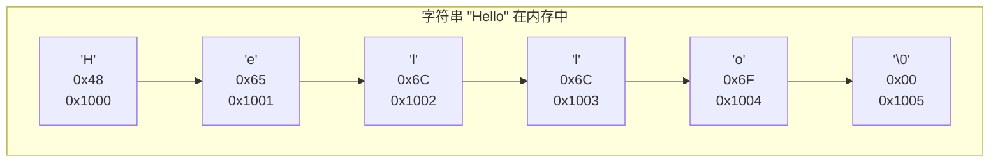

# 字符串 (Strings in C)
---

##  章节概述

C 语言没有"字符串类型"——字符串是用 `'\0'`（空字符）终止的字符数组。这一朴素的设计是 C 语言的标志性特征之一：它给了程序员完全的控制权，但也将缓冲区安全的重任完全交给程序员。本章从 C 风格字符串的本质出发，深入讲解 `char[]` vs `char*` 的微妙差异（编译时常量的存储位置）、`<string.h>` 中最核心的字符串函数族及其安全变体（`strncpy`、`strncat`、`snprintf`）、格式化输入输出（`sprintf`/`sscanf`）的用法和陷阱、`gets` 函数的彻底废除（永远不要用！）、宽字符（`wchar_t`）概述，以及从汇编层面展示字符串操作的本质——逐字节比较/复制直到遇到 `\0`。

> **核心主题**：C 字符串 = 字符数组 + 终结符 `'\0'`。`'\0'` 的存在使字符串操作可以用**线性扫描**实现（遍历直到遇到 0），但这也导致了两个致命问题：(1) 忘记 `'\0'` 导致越界读取，(2) 没有长度信息导致操作 O(n)。

---
###  第一节：C 风格字符串的本质
---

1.1 字符串即字符数组
---------------------

```c
#include <stdio.h>

int main() {
    // 字符串的三种声明方式

    // 方式1：字符数组（栈上分配，可修改）
    char str1[] = "Hello";
    // 等价于 char str1[] = {'H', 'e', 'l', 'l', 'o', '\0'};

    // 方式2：字符指针指向字面量（只读！）
    char *str2 = "Hello";
    // str2 指向 .rodata 段中的字符串字面量

    // 方式3：手动构造
    char str3[6];
    str3[0] = 'H'; str3[1] = 'e'; str3[2] = 'l';
    str3[3] = 'l'; str3[4] = 'o'; str3[5] = '\0';

    printf("str1: %s\n", str1);
    printf("str2: %s\n", str2);
    printf("str3: %s\n", str3);

    return 0;
}
```

1.2 `char[]` vs `char*` —— 关键区别
-------------------------------------

```mermaid
graph LR
    subgraph "char str1#91;#93; = #34;Hello#34;"
        direction TB
        S1["栈上数组<br/>str1 有独立存储<br/>{'H','e','l','l','o','\0'}<br/>可修改: str1#91;0#93; = 'h' "]
    end
    subgraph "char *str2 = #34;Hello#34;"
        direction TB
        S2["栈上指针 str2 →<br/>只读 .rodata 段<br/>#34;Hello#34;"<br/>不可修改: str2#91;0#93; = 'h'  UB"]
    end
```

```c
#include <stdio.h>
#include <string.h>

int main() {
    // 可修改的数组
    char arr[] = "Hello";
    arr[0] = 'h';        // 合法！修改栈上的副本
    printf("arr: %s\n", arr);  // "hello"

    // 不可修改的字面量
    char *ptr = "Hello";
    // ptr[0] = 'h';      // 未定义行为！试图修改只读内存
    // 大多数系统上会导致段错误

    // 可以修改指针指向
    ptr = "World";       // 合法！ptr 本身在栈上，可改
    printf("ptr: %s\n", ptr);  // "World"

    // 注意 sizeof 的区别
    printf("sizeof(arr) = %zu (数组，含 \\0)\n", sizeof(arr));  // 6
    printf("sizeof(ptr) = %zu (指针)\n", sizeof(ptr));          // 8

    printf("strlen(arr) = %zu\n", strlen(arr));  // 5（不含 \0）
    printf("strlen(ptr) = %zu\n", strlen(ptr));  // 5

    return 0;
}
```

1.3 字符串字面量的存储位置
----------------------------

```c
#include <stdio.h>

int main() {
    // 相同的字符串字面量可能共享同一个存储位置
    // （字符串池 — string pooling，GCC 默认开启）
    char *p1 = "Hello";
    char *p2 = "Hello";

    printf("p1 = %p\n", (void*)p1);
    printf("p2 = %p\n", (void*)p2);
    // p1 == p2 可能为真！（取决于编译器优化）

    // 数组版本不会共享
    char a1[] = "Hello";
    char a2[] = "Hello";
    printf("&a1 = %p\n", (void*)a1);
    printf("&a2 = %p\n", (void*)a2);
    // &a1 != &a2（各在栈上独立分配）

    // 字符串字面量在 .rodata 段（只读数据段）
    // 可执行文件中的字符串常量通常存储在此处

    return 0;
}
```

1.4 字符串的内存表示
---------------------



```
printf 遇到 '\0' 停止输出
strlen 遇到 '\0' 停止计数
strcpy 遇到 '\0' 停止复制

所有 C 字符串函数都依赖 '\0' 作为结束标志
如果忘记 '\0'，函数会继续扫描后面的内存
```

###  小节练习

> [!question] 选择题 1
> 以下哪个声明中的字符串可以被修改？
> - [ ] A. `char *s = "hello";`
> - [ ] B. `const char *s = "hello";`
> - [ ] C. `char s[] = "hello";`
> - [ ] D. 以上都可以
>
> > [!success]- 点击查看答案
> > 正确答案: C
> > **解析**: `char s[]` 在栈上分配字符数组并从字面量拷贝内容，该数组可修改。`char *s` 指向只读的字符串字面量（在 .rodata 段），修改它导致未定义行为。

> [!question] 判断题 1
> `strlen("Hello")` 返回值是 6。 （ ）
> - [ ]  正确
> - [ ]  错误
>
> > [!success]- 点击查看答案
> > 答案: 错误
> > **解析**: `strlen` 返回字符串中字符的数量，**不包括**结尾的 `'\0'`。`"Hello"` 有 5 个字符，`strlen` 返回 5。`sizeof("Hello")` 才返回 6（包含 `'\0'`）。

---
###  第二节：<string.h> 核心函数
---

2.1 strlen — 计算字符串长度
----------------------------

```c
#include <stdio.h>
#include <string.h>

int main() {
    const char *s = "Hello, World!";
    printf("strlen(\"%s\") = %zu\n", s, strlen(s));  // 13

    // strlen 返回 size_t（无符号整数）
    // 时间复杂度 O(n) —— 必须遍历直到 \0

    // 手动实现 strlen
    size_t my_strlen(const char *s) {
        const char *p = s;
        while (*p) p++;       // 遍历直到 \0
        return p - s;         // 指针差 = 字符数
    }
    printf("my_strlen = %zu\n", my_strlen(s));

    return 0;
}
```

2.2 strcpy / strncpy — 字符串复制
----------------------------------

```c
#include <stdio.h>
#include <string.h>

int main() {
    char src[] = "Hello, World!";
    char dest1[50];       // 足够大
    char dest2[10];       // 不够大！

    // strcpy：危险！不检查目标缓冲区大小
    strcpy(dest1, src);
    printf("dest1: %s\n", dest1);

    // strncpy：安全版本，指定最大复制长度
    // 注意：strncpy 不保证 null 终止！
    strncpy(dest2, src, sizeof(dest2) - 1);
    dest2[sizeof(dest2) - 1] = '\0';  // 手动保证终止
    printf("dest2: %s\n", dest2);     // "Hello, Wo"

    // strncpy 的行为：
    // 1. 复制至多 n 个字符
    // 2. 如果源字符串长度 < n，用 \0 填充剩余空间
    // 3. 如果源字符串长度 >= n，**不添加 \0**！

    char buf[5];
    strncpy(buf, "abc", sizeof(buf));
    // buf = {'a', 'b', 'c', '\0', '\0'}
    // strncpy 填充零直到 n

    return 0;
}
```

2.3 strcat / strncat — 字符串拼接
----------------------------------

```c
#include <stdio.h>
#include <string.h>

int main() {
    char buf[50] = "Hello";

    // strcat：危险！不检查目标缓冲区
    strcat(buf, " World");  // buf = "Hello World"
    strcat(buf, "!");       // buf = "Hello World!"
    printf("buf: %s\n", buf);

    // strncat：安全版本
    // 始终保证 null 终止（最多复制 n 个字符 + \0）
    char small[10] = "AB";
    strncat(small, "CDEFGHIJKLMNOP", sizeof(small) - strlen(small) - 1);
    // small = "ABCDEFGHI\0" (9个字符 + \0)
    printf("small: %s\n", small);

    // strncat 的行为：
    // 1. 复制至多 n 个字符，然后自动追加 \0
    // 2. n = dest_size - strlen(dest) - 1
    // 3. 比 strncpy 更安全（始终 null 终止）

    return 0;
}
```

2.4 strcmp / strncmp — 字符串比较
-----------------------------------

```c
#include <stdio.h>
#include <string.h>

int main() {
    // strcmp 返回值：
    //   0: 相等
    //  <0: s1 字典序小于 s2
    //  >0: s1 字典序大于 s2

    printf("strcmp(\"abc\", \"abc\") = %d\n", strcmp("abc", "abc"));  // 0
    printf("strcmp(\"abc\", \"abd\") = %d\n", strcmp("abc", "abd"));  // <0
    printf("strcmp(\"abd\", \"abc\") = %d\n", strcmp("abd", "abc"));  // >0
    printf("strcmp(\"abc\", \"ab\")  = %d\n", strcmp("abc", "ab"));   // >0

    // 常见的比较用法
    if (strcmp("yes", "yes") == 0) {
        printf("相等\n");
    }

    // 错误用法（比较的是地址，不是内容！）
    // if ("abc" == "abc") { ... }  // 可能相等，可能不等

    // strncmp：只比较前 n 个字符
    printf("strncmp(\"abcdef\", \"abcxyz\", 3) = %d\n",
           strncmp("abcdef", "abcxyz", 3));  // 0

    return 0;
}
```

2.5 strchr / strstr — 查找子串
---------------------------------

```c
#include <stdio.h>
#include <string.h>

int main() {
    const char *s = "Hello, World!";

    // strchr：查找字符首次出现的位置
    char *p1 = strchr(s, 'o');
    if (p1) {
        printf("'o' 在位置 %ld: %s\n", p1 - s, p1);  // "o, World!"
    }

    // strrchr：查找字符最后一次出现的位置
    char *p2 = strrchr(s, 'o');
    if (p2) {
        printf("最后一个 'o' 在位置 %ld: %s\n", p2 - s, p2);  // "orld!"
    }

    // strstr：查找子串
    char *p3 = strstr(s, "World");
    if (p3) {
        printf("\"World\" 在位置 %ld: %s\n", p3 - s, p3);  // "World!"
    }

    // strstr 可用于检查字符串是否包含某内容
    if (strstr(s, "Hello") != NULL) {
        printf("s 包含 \"Hello\"\n");
    }

    return 0;
}
```

2.6 其他有用的 string.h 函数
-------------------------------

```c
#include <stdio.h>
#include <string.h>

int main() {
    // memcpy：复制指定字节数（不检查 \0）
    int src[] = {1, 2, 3, 4, 5};
    int dest[5];
    memcpy(dest, src, sizeof(src));
    printf("memcpy: %d %d %d\n", dest[0], dest[1], dest[2]);

    // memset：用指定值填充内存
    int buf[10];
    memset(buf, 0, sizeof(buf));    // 全清零
    char str[20];
    memset(str, '-', 19);           // 填充 '-'
    str[19] = '\0';
    printf("memset: %s\n", str);

    // memcmp：比较指定字节数的内存
    int a1[] = {1, 2, 3};
    int a2[] = {1, 2, 4};
    printf("memcmp: %d\n", memcmp(a1, a2, sizeof(a1)));  // <0

    // memchr：在内存中查找字节
    unsigned char data[] = {0x12, 0x34, 0x56, 0x78};
    void *found = memchr(data, 0x56, sizeof(data));
    if (found) printf("找到 0x56\n");

    // strtok：字符串分割
    char input[] = "apple,banana,orange,grape";
    char *token = strtok(input, ",");
    while (token != NULL) {
        printf("token: %s\n", token);
        token = strtok(NULL, ",");
    }
    // 注意：strtok 会修改原始字符串（插入 \0）

    return 0;
}
```

###  小节练习

> [!question] 选择题 1
> `strncpy(dest, "Hello", 3)` 之后 `dest` 的内容是？
> - [ ] A. `"Hel\0"`
> - [ ] B. `"Hel"`（没有 `\0`）
> - [ ] C. `"He\0"`
> - [ ] D. `"Hello"`
>
> > [!success]- 点击查看答案
> > 正确答案: B
> > **解析**: `strncpy` 复制最多 3 个字符但不能保证 null 终止。如果源长度 ≥ n，不添加 `\0`。结果 `dest` = `{'H','e','l'}` 后没有 `\0`，因此字符串未终止——这是 `strncpy` 最著名的陷阱。

---
###  第三节：格式化字符串处理
---

3.1 sprintf — 格式化输出到字符串
---------------------------------

```c
#include <stdio.h>

int main() {
    char buffer[100];

    // sprintf：与 printf 相同但输出到字符串而非控制台
    int age = 25;
    double salary = 12345.67;
    char name[] = "张三";

    sprintf(buffer, "姓名: %s, 年龄: %d, 工资: %.2f", name, age, salary);
    printf("%s\n", buffer);

    // 字符串拼接
    char result[50];
    sprintf(result, "%s %s %d", "Hello", "World", 2024);
    printf("%s\n", result);  // "Hello World 2024"

    // 数值转字符串
    char num_str[20];
    sprintf(num_str, "%d", 12345);
    printf("数字字符串: %s\n", num_str);

    // 十六进制转字符串
    char hex_str[20];
    sprintf(hex_str, "0x%08X", 0xABCD);
    printf("十六进制: %s\n", hex_str);  // "0x0000ABCD"

    return 0;
}
```

3.2 snprintf — 安全的 sprintf
-------------------------------

```c
#include <stdio.h>

int main() {
    char buf[10];

    // snprintf：指定最大写入字节数（包括 \0）
    int written = snprintf(buf, sizeof(buf), "%s", "Hello, World!");
    printf("buf = \"%s\"\n", buf);          // "Hello, Wo"
    printf("实际写入 = %d\n", written);      // 13（完整字符串需要的长度）

    // snprintf 始终保证 null 终止（即使截断）
    // 返回值是"如果缓冲区够大会写入的字符数"

    // 安全的用法模式
    char safe_buf[20];
    snprintf(safe_buf, sizeof(safe_buf), "Value: %d", 12345);
    printf("safe: %s\n", safe_buf);

    // 检查是否截断
    int ret = snprintf(buf, sizeof(buf), "Very long text here");
    if (ret >= (int)sizeof(buf)) {
        printf("输出被截断！需要 %d 字节，只有 %zu 字节\n",
               ret + 1, sizeof(buf));
    }

    return 0;
}
```

3.3 sscanf — 从字符串解析数据
-------------------------------

```c
#include <stdio.h>

int main() {
    // sscanf：与 scanf 相同但从字符串读取

    // 解析整数和浮点数
    const char *data = "25 98.5 张三";
    int age;
    double score;
    char name[20];

    sscanf(data, "%d %lf %s", &age, &score, name);
    printf("年龄: %d, 成绩: %.1f, 姓名: %s\n", age, score, name);

    // 解析特定格式
    const char *date = "2024-01-15";
    int year, month, day;
    sscanf(date, "%d-%d-%d", &year, &month, &day);
    printf("%d年%d月%d日\n", year, month, day);

    // 解析十六进制
    unsigned int hex_val;
    sscanf("0xABCD", "%x", &hex_val);
    printf("hex 0xABCD = %u (dec)\n", hex_val);

    // 跳过不需要的字段
    int x, y;
    sscanf("point(10, 20)", "point(%d, %d)", &x, &y);
    printf("x=%d, y=%d\n", x, y);

    // 返回值 = 成功赋值的参数个数
    int ret = sscanf("hello 123", "%d %s", &age, name);
    printf("成功解析 %d 个参数\n", ret);  // 1（只解析了 name）
    // age 未被赋值（无效），name = "123"

    return 0;
}
```

###  小节练习

> [!question] 选择题 1
> `snprintf(buf, 5, "%s", "abcdef")` 之后 `buf` 的内容和返回值是？
> - [ ] A. `"abcd\0"`, 返回 4
> - [ ] B. `"abcd\0"`, 返回 6
> - [ ] C. `"abcd"`, 返回 4
> - [ ] D. `"abcdef\0"`, 返回 6
>
> > [!success]- 点击查看答案
> > 正确答案: B
> > **解析**: `snprintf` 最多写入 `size - 1` 个字符（第 5 个位置留给 `\0`），所以 `buf = "abcd\0"`。但返回值是完整格式化字符串的**长度**（6），表示"如果缓冲区够大会写入 6 个字符"。

---
###  第四节：缓冲区溢出 —— C 字符串的头号杀手
---

4.1 被宣告死刑的 `gets()`
--------------------------

```c
#include <stdio.h>

// gets() 是 C 语言历史上最危险的函数！
// 它从 stdin 读取直到换行符，但不检查缓冲区大小
// C11 标准将它从标准库中**彻底移除**

// gets() 的替换方案：fgets()
int main() {
    char buf[20];

    // fgets：安全读取，指定最大字符数
    printf("输入一行: ");
    if (fgets(buf, sizeof(buf), stdin) != NULL) {
        // fgets 会保留换行符（如果缓冲区够大）
        // 去掉尾部换行符
        size_t len = strlen(buf);
        if (len > 0 && buf[len - 1] == '\n') {
            buf[len - 1] = '\0';
        }
        printf("读取到: \"%s\"\n", buf);
    }

    return 0;
}
```

4.2 常见的不安全模式 vs 安全替代方案
--------------------------------------

```c
#include <stdio.h>
#include <string.h>

int main() {
    char dest[10];
    char src[] = "This is a very long string";

    // 不安全：strcpy(dest, src);
    // 改用：strncpy + 手动终止
    strncpy(dest, src, sizeof(dest) - 1);
    dest[sizeof(dest) - 1] = '\0';
    printf("安全复制: \"%s\"\n", dest);

    // 不安全：strcat(dest, src);
    // 改用：strncat
    char buf[10] = "AB";
    strncat(buf, "CDEFGHIJK", sizeof(buf) - strlen(buf) - 1);
    printf("安全拼接: \"%s\"\n", buf);

    // 不安全：sprintf(dest, "%s", src);
    // 改用：snprintf
    snprintf(dest, sizeof(dest), "%s", "Very long input data");
    printf("安全格式化: \"%s\"\n", dest);

    // 不安全：scanf("%s", buf);
    // 改用：指定最大宽度
    char input[10];
    // scanf("%9s", input);  // 最多读 9 个字符（留 1 个给 \0）

    return 0;
}
```

4.3 汇编视角：字符串操作的实现
--------------------------------

```c
// strlen 的手动实现（等价于 glibc 的对应实现）
size_t my_strlen(const char *s) {
    const char *p = s;
    while (*p != '\0') p++;
    return p - s;
}
```

对应的 x86-64 汇编（GCC `-O2` 的 `strlen` 实现思路）：
```asm
my_strlen:
    movq    %rdi, %rax      ; rax = s (保存起始地址)
    movq    %rdi, %rdx      ; rdx = s
    ; 逐字节扫描直到 \0
.L_loop:
    movzbl  (%rdx), %ecx    ; 加载一个字节到 ecx
    addq    $1, %rdx        ; 指针 +1
    testb   %cl, %cl        ; 检查是否为零
    jne     .L_loop
    subq    %rax, %rdx      ; rdx = 末尾地址 - 起始地址
    leaq    -1(%rdx), %rax  ; 减去 1（回到 \0 前）
    ret
```

> glibc 中的 `strlen` 使用了 SSE/AVX 向量化指令一次检查 16/32 字节，比逐字节扫描快数倍。这体现了 C 标准库在实现层面的极致优化。

###  小节练习

> [!question] 判断题 1
> `gets()` 函数可以安全地读取用户输入。 （ ）
> - [ ]  正确
> - [ ]  错误
>
> > [!success]- 点击查看答案
> > 答案: 错误
> > **解析**: `gets()` 无法限制读取的字节数，必然存在缓冲区溢出风险。C11 标准已将其从标准库中移除。始终使用 `fgets()` 替代。

---
###  第五节：宽字符与 Unicode 简介
---

5.1 wchar_t 和宽字符串
-----------------------

```c
#include <stdio.h>
#include <wchar.h>
#include <locale.h>

int main() {
    // 设置本地化环境（支持 Unicode 输出）
    setlocale(LC_ALL, "");

    // 宽字符类型：wchar_t（通常 4 字节，Linux）
    wchar_t wch = L'中';

    // 宽字符串（L 前缀）
    wchar_t wstr[] = L"你好，世界！";

    // 宽字符串输出
    wprintf(L"宽字符: %lc\n", wch);
    wprintf(L"宽字符串: %ls\n", wstr);

    // 宽字符串函数（<wchar.h>）
    wprintf(L"宽字符串长度: %zu\n", wcslen(wstr));

    // 注意：Windows 上 wchar_t 是 2 字节（UTF-16）
    // Linux/macOS 上通常是 4 字节（UTF-32）
    printf("sizeof(wchar_t) = %zu\n", sizeof(wchar_t));

    return 0;
}
```

5.2 C11 的 char16_t 和 char32_t（Unicode 支持改进）
-----------------------------------------------------

```c
#include <stdio.h>
#include <uchar.h>

int main() {
    // C11 引入的明确宽度 Unicode 字符类型
    char16_t c16 = u'中';   // UTF-16 字符
    char32_t c32 = U'中';   // UTF-32 字符

    // Unicode 字符串字面量
    char16_t s16[] = u"Hello 世界";   // UTF-16 编码
    char32_t s32[] = U"Hello 世界";   // UTF-32 编码

    // UTF-8 字符串（C 的默认编码）
    char s8[] = u8"Hello 世界";  // UTF-8 编码（char 类型）

    printf("UTF-8 字符串: %s\n", s8);

    return 0;
}
```

> 完整的 Unicode 支持在 C 语言中仍然是一个挑战。实际项目中常用 libicu 或手动 UTF-8 解析。Rust 语言从语言层面提供了完整的 Unicode 支持（如 `char` 类型保证 4 字节有效 Unicode）。

###  小节练习

> [!question] 选择题 1
> Linux x86-64 上 `sizeof(wchar_t)` 通常是多少？
> - [ ] A. 1 字节
> - [ ] B. 2 字节
> - [ ] C. 4 字节
> - [ ] D. 8 字节
>
> > [!success]- 点击查看答案
> > 正确答案: C
> > **解析**: Linux/macOS 上 `wchar_t` 通常是 4 字节（UTF-32 编码），但 Windows 上是 2 字节（UTF-16 编码）。这是 C 语言可移植性中的另一个不跨平台点。

---

##  章节测试

### 一、判断题（正确选，错误选）

> [!question] 判断题 1
> C 语言中字符串字面量的类型是 `char*`。 （ ）
> - [ ]  正确
> - [ ]  错误
>
> > [!success]- 点击查看答案
> > 答案: 错误
> > **解析**: 字符串字面量的类型是 `char[N]`（字符数组），其中 N 是长度+1（含 `\0`）。它可以退化为 `char*` 用于大多数上下文，但类型本质上是数组。`sizeof("hello")` 返回 6（数组大小），而不是指针大小。

> [!question] 判断题 2
> `strlen("")` 返回 0。 （ ）
> - [ ]  正确
> - [ ]  错误
>
> > [!success]- 点击查看答案
> > 答案: 正确
> > **解析**: 空字符串 `""` 只包含一个 `'\0'`。`strlen` 返回 `'\0'` 之前的字符数，所以返回 0。`sizeof("")` 返回 1（只有 `'\0'` 一个字节）。

> [!question] 判断题 3
> `char s[10]; strcpy(s, "hello");` 是完全安全的。 （ ）
> - [ ]  正确
> - [ ]  错误
>
> > [!success]- 点击查看答案
> > 答案: 正确
> > **解析**: `"hello"` 只有 6 字节（含 `\0`），小于 `s` 的 10 字节，不会溢出。安全不安全取决于源字符串长度是否小于目标缓冲区大小。

> [!question] 判断题 4
> `strcmp` 比较两个字符串时，区分大小写。 （ ）
> - [ ]  正确
> - [ ]  错误
>
> > [!success]- 点击查看答案
> > 答案: 正确
> > **解析**: `strcmp` 区分大小写（case-sensitive）。`strcmp("ABC", "abc")` 返回非零（不相等）。不区分大小写的比较需要使用 `strcasecmp`（POSIX 扩展，非 C 标准）。

> [!question] 判断题 5
> `sprintf` 和 `snprintf` 功能完全相同，只是名字不同。 （ ）
> - [ ]  正确
> - [ ]  错误
>
> > [!success]- 点击查看答案
> > 答案: 错误
> > **解析**: `sprintf` 不限制输出长度，极易导致缓冲区溢出。`snprintf` 接受额外的 `size` 参数限制最大写入字节数并始终 null 终止。始终使用 `snprintf`。

> [!question] 判断题 6
> C 语言中 `strncpy` 总是确保目标字符串 null 终止。 （ ）
> - [ ]  正确
> - [ ]  错误
>
> > [!success]- 点击查看答案
> > 答案: 错误
> > **解析**: 如果源字符串长度 ≥ n，`strncpy` 不会添加 `'\0'`。这是 `strncpy` 最臭名昭著的陷阱——它并非 `strcpy` 的"安全版"，而是一个固定宽度字段填充函数。始终手动添加 null 终止。

> [!question] 判断题 7
> `fgets(buf, n, stdin)` 会在读入不足 n-1 字符时保留行尾换行符。 （ ）
> - [ ]  正确
> - [ ]  错误
>
> > [!success]- 点击查看答案
> > 答案: 正确
> > **解析**: `fgets` 读取直到换行符（含）或达到 `n-1` 字符或 EOF。如果一行长度 < `n-1`，换行符会被存储在 `buf` 中。通常需要用 `buf[strcspn(buf, "\n")] = '\0'` 手动去除。

> [!question] 判断题 8
> `strtok` 可以安全地用于多线程环境。 （ ）
> - [ ]  正确
> - [ ]  错误
>
> > [!success]- 点击查看答案
> > 答案: 错误
> > **解析**: `strtok` 使用静态内部缓冲区记录解析位置，**不可重入**（not reentrant）——多线程中使用会导致数据竞争。应使用 `strtok_r`（POSIX）或 `strtok_s`（C11 Annex K）的线程安全版本。

> [!question] 判断题 9
> `char s[] = "abc"; s = "def";` 是合法的。 （ ）
> - [ ]  正确
> - [ ]  错误
>
> > [!success]- 点击查看答案
> > 答案: 错误
> > **解析**: 数组名不是可修改的左值，不能放在等号左侧。要改变数组内容必须逐个元素赋值或使用 `strcpy(s, "def")`。

> [!question] 判断题 10
> `printf("%s", NULL)` 在行为上是定义良好的。 （ ）
> - [ ]  正确
> - [ ]  错误
>
> > [!success]- 点击查看答案
> > 答案: 错误
> > **解析**: 将 `NULL` 作为 `%s` 的参数是**未定义行为**。大多数实现会打印 `"(null)"` 或崩溃段错误。GCC glibc 会打印 `"(null)"`，但依赖此行为不可移植。

---

### 二、选择题（单项选择题）

> [!question] 选择题 1
> 以下哪个声明创建的字符串**不能**被修改？
> - [ ] A. `char s[] = "hello";`
> - [ ] B. `char s[10] = "hello";`
> - [ ] C. `char *s = "hello";`
> - [ ] D. `char s[6]; strcpy(s, "hello");`
>
> > [!success]- 点击查看答案
> > 正确答案: C
> > **解析**: `char *s = "hello"` 指向只读的字符串字面量（通常在 `.rodata` 段）。A、B、D 都在栈上分配了可写的字符数组。

> [!question] 选择题 2
> `strlen("Hello\0World")` 返回值是？
> - [ ] A. 5
> - [ ] B. 11
> - [ ] C. 10
> - [ ] D. 6
>
> > [!success]- 点击查看答案
> > 正确答案: A
> > **解析**: `strlen` 在遇到第一个 `'\0'` 时就停止计数，所以只有"Hello"被计数，返回 5。`"World"` 在 `'\0'` 后面，被忽略。

> [!question] 选择题 3
> `char s[6] = "Hello"; printf("%zu", sizeof(s));` 输出什么？
> - [ ] A. 5
> - [ ] B. 6
> - [ ] C. 4
> - [ ] D. 不确定
>
> > [!success]- 点击查看答案
> > 正确答案: B
> > **解析**: `sizeof(s)` 返回数组的声明大小（6 字节），不是字符串长度。5 个字符 + 1 个 `'\0'`。

> [!question] 选择题 4
> `strcmp("apple", "banana")` 的返回值？
> - [ ] A. 0
> - [ ] B. 正数
> - [ ] C. 负数
> - [ ] D. 不确定
>
> > [!success]- 点击查看答案
> > 正确答案: C
> > **解析**: `'a'` (97) < `'b'` (98)，所以 `strcmp` 返回负数。具体负数值取决于实现（通常是 -1 或差值），但符号始终为负。

> [!question] 选择题 5
> 以下哪个函数总是保证 null 终止目标字符串？
> - [ ] A. `strcpy`
> - [ ] B. `strncpy`
> - [ ] C. `strncat`
> - [ ] D. `memcpy`
>
> > [!success]- 点击查看答案
> > 正确答案: C
> > **解析**: `strncat` 始终追加 `'\0'`（最多写入 `n+1` 个字符：n 个数据字符 + `'\0'`）。`strncpy` 不保证！`strcpy` 不能防止溢出。`memcpy` 不关心 `'\0'`。

> [!question] 选择题 6
> 解析字符串 `"3.14 42 hello"` 中的三个值，最适合的 `sscanf` 格式串是？
> - [ ] A. `"%d %d %s"`
> - [ ] B. `"%f %d %s"`
> - [ ] C. `"%s %s %s"`
> - [ ] D. `"%f %f %s"`
>
> > [!success]- 点击查看答案
> > 正确答案: B
> > **解析**: `3.14` 是浮点数用 `%f`，`42` 是整数用 `%d`，`hello` 是字符串用 `%s`。

> [!question] 选择题 7
> `sprintf` 相比 `snprintf` 的主要风险是？
> - [ ] A. 速度更慢
> - [ ] B. 不支持浮点数
> - [ ] C. 不限制输出长度，可能导致缓冲区溢出
> - [ ] D. 只能输出到 stdout
>
> > [!success]- 点击查看答案
> > 正确答案: C
> > **解析**: `sprintf` 不检查缓冲区大小，无法防止溢出——这是缓冲区溢出安全漏洞的主要来源。`snprintf` 通过限制写入字节数解决这个问题。

> [!question] 选择题 8
> `memcpy(dest, src, 5)` 和 `strncpy(dest, src, 5)` 的主要区别是？
> - [ ] A. 没有区别
> - [ ] B. memcpy 在遇到 `\0` 时停止
> - [ ] C. strncpy 会检查 `\0` 并填充 0，memcpy 只复制指定字节
> - [ ] D. memcpy 更慢
>
> > [!success]- 点击查看答案
> > 正确答案: C
> > **解析**: `memcpy` 是纯粹的内存复制——复制指定数量的字节，不检查内容。`strncpy` 遇到源中的 `'\0'` 后会用 `'\0'` 填充剩余空间，且不保证 null 终止。

> [!question] 选择题 9
> 以下代码的 bug 是什么？
> ```c
> char *p = malloc(strlen("hello"));
> strcpy(p, "hello");
> ```
> - [ ] A. malloc 参数错误，缺少 `+1` 给 `\0`
> - [ ] B. 应该用 `calloc` 而不是 `malloc`
> - [ ] C. 没有检查 malloc 返回值
> - [ ] D. strcpy 参数顺序反了
>
> > [!success]- 点击查看答案
> > 正确答案: A
> > **解析**: `strlen("hello")` = 5，但 `strcpy` 需要复制 `\0`，总共需要 6 字节。`malloc(5)` 分配的空间不够存放终止符，导致缓冲区溢出。正确写法是 `malloc(strlen("hello") + 1)`。

> [!question] 选择题 10
> 以下关于 C 语言字符串的说法错误的是？
> - [ ] A. 字符串以 `'\0'` 结束
> - [ ] B. `strlen` 的计算复杂度是 O(1)
> - [ ] C. 字符串是字符数组
> - [ ] D. 字符串字面量存储在只读内存中
>
> > [!success]- 点击查看答案
> > 正确答案: B
> > **解析**: `strlen` 需要从字符串开头扫描直到遇到 `'\0'`，时间复杂度为 O(n)。C 字符串不存储长度信息——这是一个基本设计特性，也是性能上需要注意的地方。

---

### ️ 动手练习题

> [!example] 练习题 1：字符串处理工具集
> **难度**: 
> 
> 手动实现以下 `string.h` 函数（不调用标准库）：
> 1. `my_strlen` — 返回字符串长度
> 2. `my_strcpy` — 复制字符串
> 3. `my_strcat` — 拼接字符串
> 4. `my_strcmp` — 比较字符串
> 5. `my_strchr` — 查找字符
> 
> 用测试用例验证你的实现与标准库一致。
> 
> 洛谷练习：https://www.luogu.com.cn/problem/P5734 （文字处理软件）

> [!example] 练习题 2：回文判断
> **难度**: 
> 
> 编写程序判断一个字符串是否是回文串（忽略大小写和空格）：
> - `"A man a plan a canal Panama"` → 回文（忽略空格）
> - `"racecar"` → 回文
> - `"hello"` → 不是回文
> 
> 扩展：判断一个句子中最长的回文单词。
> 
> 洛谷练习：https://www.luogu.com.cn/problem/P5735 （回文判断）

> [!example] 练习题 3：字符串解析器
> **难度**: 
> 
> 编写一个简单的 CSV 解析器：
> - 读入一行字符串 `"张三,20,计算机,98.5"`
> - 用 `strtok` 分割字段
> - 解析并输出每个字段的类型和值
> 
> 用 `strchr` 实现手动的字符串分割版本（不依赖 `strtok`）。
> 
> 洛谷练习：
> - https://www.luogu.com.cn/problem/P5736 （数字反转加强版）
> - https://www.luogu.com.cn/problem/P5737 （垂直柱状图）

> [!example] 练习题 4：安全字符串库
> **难度**: 
> 
> 实现一个"安全字符串"库，提供以下函数：
> 1. `safe_strcpy(dest, dest_size, src)` — 始终 null 终止
> 2. `safe_strcat(dest, dest_size, src)` — 始终 null 终止且不溢出
> 3. `safe_sprintf(dest, dest_size, format, ...)` — 安全的格式化
> 
> 每个函数返回 `-1` 表示截断，`0` 表示成功。编写单元测试验证边界条件。

> [!example] 练习题 5：汇编层分析
> **难度**: 
> 
> 使用 `gcc -S -O2` 生成以下函数的汇编代码：
> 1. `size_t strlen_simple(const char *s)` — 逐字节扫描版
> 2. `char *strcpy_simple(char *dest, const char *src)`
> 
> 观察：
> - `strlen` 生成的是逐字节循环还是使用了 `repne scasb`（x86 字符串扫描指令）？
> - 编译器是否自动内联了这些简单实现？
> - `-O2` 和 `-O0` 的汇编差异有多大？
> 
> 参考 [[../cpp深化教程/基础教程/11_字符串基础|CPP教程: 字符串基础]] 对比 C++ 的 `std::string` 类。
