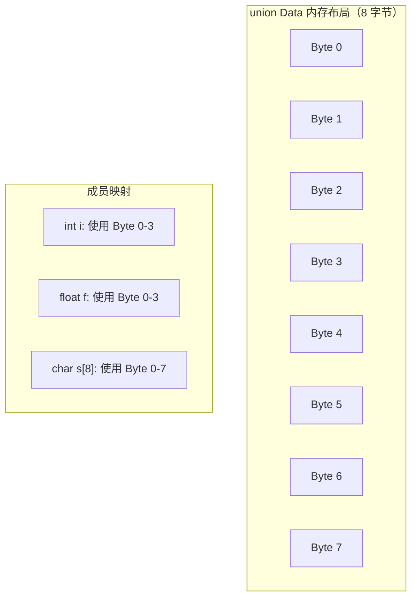

# 结构体与联合体 (Structs, Unions & Enums)
---

##  章节概述

结构体（`struct`）是 C 语言组织异构数据的聚合工具——将不同数据类型的变量组合成一个逻辑整体。联合体（`union`）则让多个成员共享同一块内存，是 C 语言实现"类型双关"（type punning）和节省内存的关键机制。枚举（`enum`）为整数常量提供有意义的名称。本章从 struct 的基本定义和成员访问出发，深入讲解 `typedef` 的类型别名、结构体的内存对齐（alignment）和填充（padding）——这是理解内存布局和 `sizeof` 结果的关键底层概念——以及联合体的内存共享原理、枚举的整数本质和位域（bit-field）的精细内存控制。最后从汇编层面展示结构体成员相对于基址的偏移寻址（`base + offset`），建立完整的内存布局心智模型。

> **核心主题**：struct = 内存布局的艺术。理解 padding 就理解了为什么你的 `sizeof(struct)` 比想象中大；理解 alignment 就理解了 CPU 访问内存的效率瓶颈。本章内容直接关联后续的面向对象模拟（[[../2深化/07_面向对象C编程]]）和数据结构实现（[[|]]）。

---
###  第一节：结构体定义与使用
---

1.1 struct 的基本语法
---------------------

```c
#include <stdio.h>
#include <string.h>

// 定义结构体类型
struct Student {
    char name[32];
    int age;
    double score;
};  // 注意分号！

int main() {
    // 声明结构体变量
    struct Student s1;

    // 初始化（按声明顺序）
    strcpy(s1.name, "张三");
    s1.age = 20;
    s1.score = 95.5;

    // 声明 + 初始化（C99 指定初始化器）
    struct Student s2 = {
        .name = "李四",
        .age = 22,
        .score = 88.0
    };

    // 顺序初始化（不推荐，可读性差）
    struct Student s3 = {"王五", 19, 92.0};

    // 成员访问：点运算符
    printf("姓名: %s, 年龄: %d, 成绩: %.1f\n",
           s1.name, s1.age, s1.score);

    // 结构体赋值（整体复制，包括数组成员）
    struct Student s4 = s1;  // 栈上 memcpy
    s4.name[0] = 'A';         // 修改副本不影响原值
    printf("s1.name = %s, s4.name = %s\n", s1.name, s4.name);

    return 0;
}
```

1.2 指向结构体的指针（箭头运算符）
-----------------------------------

```c
#include <stdio.h>
#include <stdlib.h>

struct Point {
    int x;
    int y;
};

int main() {
    struct Point p1 = {10, 20};

    // 指向结构体的指针
    struct Point *ptr = &p1;

    // 两种访问方式（等价）
    printf("(*ptr).x = %d\n", (*ptr).x);   // 解引用 + 点运算
    printf("ptr->x  = %d\n", ptr->x);       // 箭头运算（推荐）
    printf("ptr->y  = %d\n", ptr->y);

    // 通过指针修改成员
    ptr->x = 100;
    ptr->y = 200;
    printf("修改后: (%d, %d)\n", p1.x, p1.y);

    // 堆上分配结构体
    struct Point *heap_p = malloc(sizeof(struct Point));
    if (heap_p) {
        heap_p->x = 50;
        heap_p->y = 60;
        printf("堆上: (%d, %d)\n", heap_p->x, heap_p->y);
        free(heap_p);
    }

    return 0;
}
```

1.3 结构体数组
--------------

```c
#include <stdio.h>

struct Book {
    char title[50];
    int pages;
    double price;
};

int main() {
    // 结构体数组
    struct Book library[3] = {
        {"C 语言程序设计", 450, 59.9},
        {"算法导论", 1312, 128.0},
        {"编译原理", 800, 89.0}
    };

    // 遍历
    for (int i = 0; i < 3; i++) {
        printf("《%s》%d页 ¥%.1f\n",
               library[i].title,
               library[i].pages,
               library[i].price);
    }

    // 修改
    library[0].price = 49.9;
    strcpy(library[2].title, "深入理解计算机系统");

    // 结构体数组在内存中的布局：
    // 每个结构体元素连续排列
    printf("\nsizeof(struct Book) = %zu\n", sizeof(struct Book));
    printf("数组总大小 = %zu\n", sizeof(library));
    // library[i] 的地址 = library + i * sizeof(struct Book)

    return 0;
}
```

###  小节练习

> [!question] 选择题 1
> 访问结构体指针 `p` 指向的成员 `x`，正确的语法是？
> - [ ] A. `p.x`
> - [ ] B. `p->x`
> - [ ] C. `*p.x`
> - [ ] D. `&p.x`
>
> > [!success]- 点击查看答案
> > 正确答案: B
> > **解析**: 结构体指针使用 `->`（箭头运算符）访问成员。`p->x` 等价于 `(*p).x`。`.` 用于直接的结构体变量。

> [!question] 判断题 1
> 两个相同类型的结构体变量可以直接用 `=` 赋值（整体复制）。 （ ）
> - [ ]  正确
> - [ ]  错误
>
> > [!success]- 点击查看答案
> > 答案: 正确
> > **解析**: C 语言中相同结构体类型的变量支持整体赋值（`s1 = s2`），编译器会执行等同于 `memcpy` 的操作。但注意：如果结构体包含指针成员，只有**指针值**被复制（浅拷贝）。

---
###  第二节：typedef 与结构体
---

2.1 typedef 的基本用法
-----------------------

```c
#include <stdio.h>

// 方式1：先定义 struct，再用 typedef 取别名
struct Point {
    int x;
    int y;
};
typedef struct Point Point_t;

// 方式2：定义 + typedef 合一（最常见）
typedef struct {
    int x;
    int y;
} Point;  // 这里 Point 是类型别名，不是 struct 标签

// 方式3：同时有标签和别名
typedef struct Vector {
    int x;
    int y;
    int z;
} Vector;

int main() {
    // 使用时不需要写 struct 关键字
    Point p1 = {10, 20};
    Vector v1 = {1, 2, 3};

    // 如果需要前向引用（链表），必须保留标签
    typedef struct Node {
        int data;
        struct Node *next;  // 这里必须用 struct Node
    } Node;

    Node head = {42, NULL};
    printf("Node data: %d\n", head.data);

    return 0;
}
```

2.2 链表节点 —— typedef + 自引用结构体
----------------------------------------

```c
#include <stdio.h>
#include <stdlib.h>

// 链表节点（自引用结构体）—— 必须保留 struct 标签
typedef struct ListNode {
    int value;
    struct ListNode *next;  // 不能写 ListNode *next！typedef 还没完成
} ListNode;

// 创建新节点
ListNode *create_node(int value) {
    ListNode *node = malloc(sizeof(ListNode));
    if (node) {
        node->value = value;
        node->next = NULL;
    }
    return node;
}

// 打印链表
void print_list(ListNode *head) {
    for (ListNode *p = head; p != NULL; p = p->next) {
        printf("[%d] -> ", p->value);
    }
    printf("NULL\n");
}

int main() {
    ListNode *head = create_node(1);
    head->next = create_node(2);
    head->next->next = create_node(3);

    print_list(head);

    // 清理内存
    while (head) {
        ListNode *next = head->next;
        free(head);
        head = next;
    }

    return 0;
}
```

> 链表的完整实现在 [[../3数据结构/02_链表]] 中详细展开。

###  小节练习

> [!question] 选择题 1
> 以下自引用结构体定义正确的是？
> - [ ] A. `typedef struct { int d; Node *n; } Node;`
> - [ ] B. `typedef struct Node { int d; struct Node *n; } Node;`
> - [ ] C. `typedef struct { int d; struct Node *n; } Node;`
> - [ ] D. `typedef Node { int d; Node *n; };`
>
> > [!success]- 点击查看答案
> > 正确答案: B
> > **解析**: 自引用结构体需要 struct 标签，因为 `typedef` 别名在定义完成后才生效。在结构体内部必须使用 `struct Node`（标签名），不能使用 `Node`（别名）。

---
###  第三节：内存对齐与填充（Memory Alignment & Padding）
---

3.1 什么是内存对齐
-------------------

CPU 访问内存时，对齐的数据比不对齐的数据更快（甚至必须对齐）。对齐规则：
- `char` 可以在任意地址（对齐 1 字节）
- `short` 必须对齐到 2 的倍数地址
- `int` 必须对齐到 4 的倍数地址
- `double` 必须对齐到 8 的倍数地址（x86-64）

```c
#include <stdio.h>

int main() {
    printf("=== 基本类型的对齐要求 ===\n");
    printf("_Alignof(char)      = %zu\n", _Alignof(char));      // 1
    printf("_Alignof(short)     = %zu\n", _Alignof(short));     // 2
    printf("_Alignof(int)       = %zu\n", _Alignof(int));       // 4
    printf("_Alignof(long)      = %zu\n", _Alignof(long));      // 8
    printf("_Alignof(float)     = %zu\n", _Alignof(float));     // 4
    printf("_Alignof(double)    = %zu\n", _Alignof(double));    // 8
    printf("_Alignof(long long) = %zu\n", _Alignof(long long)); // 8

    return 0;
}
```

3.2 结构体填充（Padding）
--------------------------

编译器在结构体成员之间和结构体末尾插入不可见的填充字节，以确保每个成员满足其对齐要求。

```c
#include <stdio.h>
#include <stddef.h>

// 案例1：未优化的布局（浪费空间）
struct BadLayout {
    char  a;    // 1B, offset 0
    // padding 3B (offset 1 不整除 4)
    int   b;    // 4B, offset 4
    char  c;    // 1B, offset 8
    // padding 7B (让结构体大小整除最大对齐 8)
    double d;   // 8B, offset 16
};
// sizeof(BadLayout) = 24 字节！（padding 占了 10 字节）

// 案例2：优化后的布局（节省空间）
struct GoodLayout {
    double d;   // 8B, offset 0
    int   b;    // 4B, offset 8
    char  a;    // 1B, offset 12
    char  c;    // 1B, offset 13
    // padding 2B (让结构体大小整除 8)
};
// sizeof(GoodLayout) = 16 字节！（节省 8 字节）

int main() {
    printf("sizeof(BadLayout)  = %zu\n", sizeof(struct BadLayout));
    printf("sizeof(GoodLayout) = %zu\n", sizeof(struct GoodLayout));

    // 用 offsetof 查看每个成员的偏移
    printf("\n=== BadLayout 偏移 ===\n");
    printf("offsetof(a) = %zu\n", offsetof(struct BadLayout, a));  // 0
    printf("offsetof(b) = %zu\n", offsetof(struct BadLayout, b));  // 4
    printf("offsetof(c) = %zu\n", offsetof(struct BadLayout, c));  // 8
    printf("offsetof(d) = %zu\n", offsetof(struct BadLayout, d));  // 16

    printf("\n=== GoodLayout 偏移 ===\n");
    printf("offsetof(d) = %zu\n", offsetof(struct GoodLayout, d));  // 0
    printf("offsetof(b) = %zu\n", offsetof(struct GoodLayout, b));  // 8
    printf("offsetof(a) = %zu\n", offsetof(struct GoodLayout, a));  // 12
    printf("offsetof(c) = %zu\n", offsetof(struct GoodLayout, c));  // 13

    return 0;
}
```

3.3 内存布局可视化
------------------



```mermaid
graph TD
    subgraph "BadLayout (24 字节)"
        direction LR
        B0["offset 0<br/>a (char) 1B"]
        B1["offset 1-3<br/>PADDING 3B"]
        B2["offset 4-7<br/>b (int) 4B"]
        B3["offset 8<br/>c (char) 1B"]
        B4["offset 9-15<br/>PADDING 7B"]
        B5["offset 16-23<br/>d (double) 8B"]
    end
    B0 --> B1 --> B2 --> B3 --> B4 --> B5

    subgraph "GoodLayout (16 字节)"
        direction LR
        G0["offset 0-7<br/>d (double) 8B"]
        G1["offset 8-11<br/>b (int) 4B"]
        G2["offset 12<br/>a (char) 1B"]
        G3["offset 13<br/>c (char) 1B"]
        G4["offset 14-15<br/>PADDING 2B"]
    end
    G0 --> G1 --> G2 --> G3 --> G4
```

**对齐规则总结**：
1. 每个成员的偏移必须是其**对齐要求**（alignment）的倍数
2. 结构体的总大小必须是其**最大成员对齐要求**的倍数（含结构体末尾的填充）
3. 成员排列顺序影响结构体的总大小
4. `_Alignas(N)` 可以手动指定对齐（C11）

3.4 手动控制对齐
------------------

```c
#include <stdio.h>
#include <stddef.h>

// C11 _Alignas 指定对齐
struct AlignedExample {
    char c;
    _Alignas(16) int x;   // x 的对齐要求是 16 字节
};

// GCC 扩展：__attribute__((packed)) 取消对齐（节省空间但可能影响性能）
struct __attribute__((packed)) Packed {
    char  a;
    int   b;
    char  c;
    double d;
};
// sizeof(Packed) = 14（完全没有 padding！）
// 但访问 b 和 d 很慢（不对齐的访问）

// 编译指示（pragma pack）
#pragma pack(push, 1)     // 设为 1 字节对齐
struct PackedByPragma {
    char  a;
    int   b;     // 没有 padding，offset = 1
    double d;    // 没有 padding，offset = 5
};
#pragma pack(pop)         // 恢复默认对齐
// sizeof = 13

int main() {
    printf("sizeof(AlignedExample) = %zu\n", sizeof(struct AlignedExample));
    printf("sizeof(Packed)         = %zu\n", sizeof(struct Packed));
    printf("sizeof(PackedByPragma)  = %zu\n", sizeof(struct PackedByPragma));
    return 0;
}
```

> 对齐和填充是 C 语言"深入底层"的典型体现。C++ 的 struct 与 class 在内存布局上与 C struct 完全相同（多出了 vtable 指针）。比较见 [[../../cpp教程/cpp深化教程/4.5_struct结构体|CPP教程: struct结构体]]。

###  小节练习

> [!question] 选择题 1
> x86-64 上，`struct { char a; int b; }` 的大小是？
> - [ ] A. 5 字节
> - [ ] B. 6 字节
> - [ ] C. 8 字节
> - [ ] D. 12 字节
>
> > [!success]- 点击查看答案
> > 正确答案: C
> > **解析**: char (1B, offset 0) + padding (3B) + int (4B, offset 4) = 8 字节。结构体总大小需整除最大对齐值（4），8 满足条件。

> [!question] 选择题 2
> 减少结构体填充的最佳方法是？
> - [ ] A. 使用 `#pragma pack(1)`
> - [ ] B. 按对齐要求从大到小排列成员
> - [ ] C. 全部使用 char 类型
> - [ ] D. 使用 `__attribute__((packed))`
>
> > [!success]- 点击查看答案
> > 正确答案: B
> > **解析**: 将对齐要求最大的成员放在最前面可以最小化填充。A 和 D 虽然能减少大小，但会导致未对齐的内存访问（性能损失甚至在某些架构上崩溃）。

---
###  第四节：联合体（union）
---

4.1 union 的基本概念
---------------------

联合体所有成员共享同一块内存，任何时候只有一个成员是"活跃"的。

```c
#include <stdio.h>

// 联合体的大小 = 最大成员的大小
union Data {
    int   i;    // 4 字节
    float f;    // 4 字节
    char  s[8]; // 8 字节
};

int main() {
    union Data d;
    printf("sizeof(union Data) = %zu\n", sizeof(d));  // 8

    // 写入 i，覆盖了前 4 字节
    d.i = 42;
    printf("d.i = %d\n", d.i);

    // 写入 f，覆盖了前 4 字节（i 的值丢失）
    d.f = 3.14f;
    printf("d.f = %f\n", d.f);
    printf("d.i = %d（被覆盖后的垃圾值）\n", d.i);

    // 写入字符串（最多 7 个字符 + \0）
    strcpy(d.s, "Hello");
    printf("d.s = %s\n", d.s);

    return 0;
}
```



4.2 union 的典型应用
---------------------

```c
#include <stdio.h>
#include <string.h>

// 应用1：类型双关（Type Punning）—— 重新解释位模式
union FloatInt {
    float f;
    unsigned int u;
};

void show_float_bits(float value) {
    union FloatInt fi;
    fi.f = value;
    printf("float %f 的位模式: 0x%08X\n", value, fi.u);
}

// 应用2：变体记录（Tagged Union）
enum DataType { TYPE_INT, TYPE_FLOAT, TYPE_STRING };

struct Variant {
    enum DataType type;
    union {
        int i_val;
        double f_val;
        char s_val[32];
    } data;
};

void print_variant(struct Variant v) {
    switch (v.type) {
        case TYPE_INT:
            printf("整数: %d\n", v.data.i_val);
            break;
        case TYPE_FLOAT:
            printf("浮点: %f\n", v.data.f_val);
            break;
        case TYPE_STRING:
            printf("字符串: %s\n", v.data.s_val);
            break;
    }
}

// 应用3：寄存器访问（嵌入式常用）
// 32 位寄存器可以整体访问，也可以按位域访问
union Register {
    unsigned int full;
    struct {
        unsigned int enable   : 1;   // bit 0
        unsigned int mode     : 2;   // bit 1-2
        unsigned int speed    : 2;   // bit 3-4
        unsigned int reserved : 27;  // bit 5-31
    } bits;
};

int main() {
    // 类型双关演示
    show_float_bits(3.14f);
    show_float_bits(-1.0f);

    // 变体记录演示
    struct Variant v1 = {TYPE_INT, .data.i_val = 42};
    struct Variant v2 = {TYPE_FLOAT, .data.f_val = 3.14};
    struct Variant v3 = {TYPE_STRING, .data.s_val = "Hello"};
    print_variant(v1);
    print_variant(v2);
    print_variant(v3);

    // 寄存器访问演示
    union Register reg;
    reg.full = 0;
    reg.bits.enable = 1;
    reg.bits.mode = 3;
    printf("寄存器值: 0x%08X\n", reg.full);

    return 0;
}
```

> C++ 使用 `std::variant`（C++17）提供了类型安全的变体类型，而 C 语言需要手动维护标签变量。`union` 的基本思想在 C++ 中仍然用于底层内存操作。

###  小节练习

> [!question] 选择题 1
> `union { char c; int i; double d; }` 占用多少字节？
> - [ ] A. 1
> - [ ] B. 4
> - [ ] C. 8
> - [ ] D. 13
>
> > [!success]- 点击查看答案
> > 正确答案: C
> > **解析**: union 的大小等于其最大成员的大小（`double` = 8 字节），加上可能的末尾填充以确保对齐。所有成员共享从偏移 0 开始的同一个内存块。

---
###  第五节：枚举（enum）与位域（bit-field）
---

5.1 enum 枚举类型
------------------

```c
#include <stdio.h>

// 枚举：为整数常量提供有意义的名称
enum Color {
    RED,      // 0
    GREEN,    // 1
    BLUE      // 2
};

// 手动指定值
enum Status {
    OK = 200,
    NOT_FOUND = 404,
    SERVER_ERROR = 500,
    UNKNOWN     // 501（自动递增前一个值）
};

// 二进制位标志
enum Permissions {
    READ    = 1 << 0,  // 0b001 = 1
    WRITE   = 1 << 1,  // 0b010 = 2
    EXECUTE = 1 << 2   // 0b100 = 4
};

int main() {
    // enum 变量本质是整数
    enum Color c = RED;
    printf("RED = %d\n", c);

    // enum 可以用在 switch 中
    enum Color favorite = BLUE;
    switch (favorite) {
        case RED:   printf("红色\n"); break;
        case GREEN: printf("绿色\n"); break;
        case BLUE:  printf("蓝色\n"); break;
    }

    // 位标志组合
    int my_perms = READ | WRITE;  // 3
    printf("权限: %d\n", my_perms);
    if (my_perms & READ) {
        printf("有读权限\n");
    }

    // 遍历枚举
    for (enum Color col = RED; col <= BLUE; col++) {
        printf("Color %d\n", col);
    }

    return 0;
}
```

5.2 位域（Bit-field）
-----------------------

位域允许精确控制结构体成员占用的位数，常用于协议头和硬件寄存器。

```c
#include <stdio.h>
#include <string.h>

// 位域示例：IPv4 数据包头（简化版）
struct IPv4Header {
    unsigned int version     : 4;   // 4 位
    unsigned int ihl         : 4;   // 4 位（首部长度）
    unsigned int dscp        : 6;   // 6 位（服务类型）
    unsigned int ecn         : 2;   // 2 位
    unsigned int total_length: 16;  // 16 位
};

// 位域示例：CPU 状态寄存器
struct StatusRegister {
    unsigned int carry     : 1;  // bit 0
    unsigned int zero      : 1;  // bit 1
    unsigned int sign      : 1;  // bit 2
    unsigned int overflow  : 1;  // bit 3
    unsigned int           : 4;  // 未命名位域（占位，跳过 bit 4-7）
    unsigned int interrupt : 1;  // bit 8
};

int main() {
    // 位域结构体大小
    printf("sizeof(IPv4Header)     = %zu\n", sizeof(struct IPv4Header));
    printf("sizeof(StatusRegister) = %zu\n", sizeof(struct StatusRegister));

    // 使用位域
    struct IPv4Header header;
    memset(&header, 0, sizeof(header));
    header.version = 4;      // IPv4
    header.ihl = 5;          // 最小头长度（5 × 4 = 20 字节）
    header.total_length = 1500;

    printf("version = %u, ihl = %u, total_length = %u\n",
           header.version, header.ihl, header.total_length);

    // 状态寄存器
    struct StatusRegister sr = {0};
    sr.carry = 1;
    sr.zero = 0;
    // 位域可以用作位掩码的标志替代
    printf("carry=%u, zero=%u\n", sr.carry, sr.zero);

    // 位域的汇编访问：
    // 编译器将位域操作翻译为位掩码 + 移位
    // header.version = 4 → 需要读取、掩码、移位、写回
    // 比单独的结构体成员访问稍慢

    return 0;
}
```

5.3 位域的局限和注意事项
--------------------------

```c
#include <stdio.h>

int main() {
    // 局限1：不能对位域取地址（没有独立的地址）
    struct {
        unsigned int flag : 1;
    } s;

    // unsigned int *p = &s.flag;  // 编译错误！
    // 因为位域可能跨字节边界，没有独立的地址

    // 局限2：位域的大小和排列是"实现定义"的
    // 在不同编译器/平台上可能不同（大端/小端）

    // 局限3：位域不能用于数组
    // struct { unsigned int arr[3] : 4; };  // 编译错误

    // 局限4：不能做 sizeof 获取位宽（sizeof 返回的是包含类型的大小）
    printf("sizeof unsigned int: %zu\n", sizeof(unsigned int));

    return 0;
}
```

###  小节练习

> [!question] 选择题 1
> 枚举 `enum { A, B = 5, C, D = 2, E };` 中 E 的值是？
> - [ ] A. 0
> - [ ] B. 3
> - [ ] C. 6
> - [ ] D. 7
>
> > [!success]- 点击查看答案
> > 正确答案: B
> > **解析**: A=0(默认), B=5, C=6(自动+1), D=2, E=3(D 之后自动+1)。

---
###  第六节：结构体在汇编层面的访问
---

6.1 结构体成员的汇编寻址
--------------------------

```c
// C 代码
struct Point {
    int x;   // offset 0
    int y;   // offset 4
};

void set_point(struct Point *p, int x, int y) {
    p->x = x;
    p->y = y;
}
```

对应 x86-64 汇编（简化）：
```asm
set_point:
    movl    %esi, (%rdi)       ; p->x = x
    ; %rdi = p (基址), %esi = x
    ; (%rdi) = *p = p->x（offset 0）

    movl    %edx, 4(%rdi)      ; p->y = y
    ; 4(%rdi) = *(p + 4) = p->y（offset 4）
    ret
```

**结构体成员访问的关键**：编译器将 `p->member` 翻译为 `*(base + offset)` 的寻址模式。

6.2 复杂结构体的寻址
---------------------

```c
struct Inner {
    int a;       // offset 0
    double b;    // offset 8 (padding 4)
};  // sizeof = 16

struct Outer {
    char c;       // offset 0
    // padding 7
    struct Inner inner;  // offset 8
    int d;        // offset 24
};  // sizeof = 32 (末尾 padding 4)

// C 代码
void set_inner_b(struct Outer *o, double val) {
    o->inner.b = val;
}
```

汇编：
```asm
set_inner_b:
    ; o->inner.b 的偏移 = offsetof(struct Outer, inner) + offsetof(struct Inner, b)
    ;                  = 8 + 8 = 16
    movsd   %xmm0, 16(%rdi)   ; o->inner.b = val (8 字节浮点)
    ret
```

> `offsetof` 宏在编译时计算成员的字节偏移，是结构体操作的基础。汇编层面的间接寻址详细讨论见 。

###  小节练习

> [!question] 选择题 1
> `struct { char a; int b; char c; }` 中 `c` 的偏移是？
> - [ ] A. 1
> - [ ] B. 5
> - [ ] C. 8
> - [ ] D. 9
>
> > [!success]- 点击查看答案
> > 正确答案: C
> > **解析**: a 在 offset 0 (1B)，b 必须 4 字节对齐 → padding 3B → b 在 offset 4 (4B)，c 在 offset 8 (1B)。offsetof(c) = 8。

---

##  章节测试

### 一、判断题（正确选，错误选）

> [!question] 判断题 1
> C 语言中 `struct` 和 `class` 的区别是 struct 不能有成员函数。 （ ）
> - [ ]  正确
> - [ ]  错误
>
> > [!success]- 点击查看答案
> > 答案: 错误
> > **解析**: C 语言根本没有 `class` 关键字！`class` 是 C++ 的概念。在 C++ 中 struct 也可以有成员函数，struct 与 class 的唯一区别是默认访问级别不同（struct 默认 public，class 默认 private）。

> [!question] 判断题 2
> 结构体成员在内存中一定按声明的顺序排列。 （ ）
> - [ ]  正确
> - [ ]  错误
>
> > [!success]- 点击查看答案
> > 答案: 正确
> > **解析**: C 语言标准保证结构体成员的内存地址按声明顺序递增——第一个成员地址最低，后续成员地址依次增加。但成员之间可能有填充。

> [!question] 判断题 3
> union 的所有成员可以同时持有有效值。 （ ）
> - [ ]  正确
> - [ ]  错误
>
> > [!success]- 点击查看答案
> > 答案: 错误
> > **解析**: union 的所有成员共享同一块内存，写入一个成员会覆盖其他成员。任何时候只有一个成员是"活跃"的（存放有意义的值）。读取非活跃成员会得到未指定值。

> [!question] 判断题 4
> `sizeof(struct)` 总是等于所有成员 `sizeof` 之和。 （ ）
> - [ ]  正确
> - [ ]  错误
>
> > [!success]- 点击查看答案
> > 答案: 错误
> > **解析**: 由于对齐要求，结构体中会有填充字节。`sizeof(struct)` 等于成员大小之和加填充字节。例如 `struct { char a; int b; }` 的 sizeof 是 8，而成员大小之和是 5。

> [!question] 判断题 5
> 枚举类型的变量在内存中存储的是字符串（枚举名）。 （ ）
> - [ ]  正确
> - [ ]  错误
>
> > [!success]- 点击查看答案
> > 答案: 错误
> > **解析**: 枚举变量存储的是整数值（通常是 int）。枚举名只是编译时的符号，不进入运行时。`sizeof(enum E) = sizeof(int)`（通常 4 字节）。

> [!question] 判断题 6
> 位域（bit-field）成员不能使用 `sizeof` 运算符。 （ ）
> - [ ]  正确
> - [ ]  错误
>
> > [!success]- 点击查看答案
> > 答案: 正确
> > **解析**: 位域没有独立的地址（不能取 `&`），也不能使用 `sizeof` 获取其位宽。可以对其"包含类型"使用 sizeof。

> [!question] 判断题 7
> `typedef struct { int x; } Point;` 之后 `Point` 就是 `struct Point` 的别名。 （ ）
> - [ ]  正确
> - [ ]  错误
>
> > [!success]- 点击查看答案
> > 答案: 错误
> > **解析**: 该结构体没有标签（tag），所以 `struct Point` 不是一个合法的类型名。`Point` 是匿名结构体的类型别名。如果需要同时有标签和别名，需要写 `typedef struct Point { ... } Point;`。

> [!question] 判断题 8
> 结构体的整体赋值 `s1 = s2` 使用的是浅拷贝（只复制指针值）。 （ ）
> - [ ]  正确
> - [ ]  错误
>
> > [!success]- 点击查看答案
> > 答案: 正确
> > **解析**: 结构体整体赋值执行逐字节复制（memcpy 语义）。如果结构体包含指针成员，复制的是指针值（地址），两个结构体的该指针指向同一块内存——这是浅拷贝的含义。修改 `s1.ptr` 指向的内容也会影响 `s2.ptr`。

> [!question] 判断题 9
> 联合体可以用来判断系统是大端还是小端（端序检测）。 （ ）
> - [ ]  正确
> - [ ]  错误
>
> > [!success]- 点击查看答案
> > 答案: 正确
> > **解析**: `union { int i; char c; } u; u.i = 1;` 后，如果 `u.c == 1` 则为小端（低字节在低地址），如果 `u.c == 0` 则为大端。这是经典的端序检测方法。

> [!question] 判断题 10
> `_Alignas` 可以要求某个成员的偏移少于其自然对齐。 （ ）
> - [ ]  正确
> - [ ]  错误
>
> > [!success]- 点击查看答案
> > 答案: 错误
> > **解析**: `_Alignas` 只能**增大**对齐要求，不能减小。减小对齐（如将 int 改为 2 字节对齐）需要 `#pragma pack` 或 `__attribute__((packed))`，且可能产生错误对齐访问。

---

### 二、选择题（单项选择题）

> [!question] 选择题 1
> 访问结构体指针 `p` 的成员 `name`，最简洁的写法是？
> - [ ] A. `(*p).name`
> - [ ] B. `p.name`
> - [ ] C. `p->name`
> - [ ] D. `*p.name`
>
> > [!success]- 点击查看答案
> > 正确答案: C
> > **解析**: `p->name` 和 `(*p).name` 等价，箭头运算符专门为结构体指针设计，更简洁。`p.name` 需要 p 是结构体变量（不是指针），`*p.name` 是未定义行为（`.` 优先级高于 `*`）。

> [!question] 选择题 2
> x86-64 上 `struct { double a; char b; }` 的大小是？
> - [ ] A. 9
> - [ ] B. 12
> - [ ] C. 16
> - [ ] D. 17
>
> > [!success]- 点击查看答案
> > 正确答案: C
> > **解析**: double (8B, offset 0) + char (1B, offset 8) + 填充 7B = 16B。总大小必须能被最大对齐值 (8) 整除，所以末尾填充 7 字节。

> [!question] 选择题 3
> `offsetof(struct S, member)` 返回什么？
> - [ ] A. member 的大小
> - [ ] B. member 在结构体中的字节偏移
> - [ ] C. 结构体总大小
> - [ ] D. member 的对齐值
>
> > [!success]- 点击查看答案
> > 正确答案: B
> > **解析**: `offsetof`（定义在 `<stddef.h>`）返回指定成员在结构体中的字节偏移量——从结构体首地址到该成员首地址的距离。

> [!question] 选择题 4
> 以下关于 union 的说法哪项正确？
> - [ ] A. union 可以有多个活跃成员
> - [ ] B. union 的大小是全部成员大小之和
> - [ ] C. union 的所有成员起始于同一地址
> - [ ] D. union 不能包含结构体成员
>
> > [!success]- 点击查看答案
> > 正确答案: C
> > **解析**: union 的核心特性——所有成员从偏移 0 开始，共享同一块内存。只有 C 正确。A 错（只能一个活跃），B 错（大小为最大成员），D 错（可以包含结构体）。

> [!question] 选择题 5
> 自引用结构体在定义 `next` 成员时，必须使用什么？
> - [ ] A. typedef 别名
> - [ ] B. struct 标签
> - [ ] C. void 指针
> - [ ] D. 无所谓
>
> > [!success]- 点击查看答案
> > 正确答案: B
> > **解析**: 在结构体定义内部，`typedef` 别名还未生效，必须用 `struct 标签名` 来声明自引用指针。例如 `struct Node { int d; struct Node *next; }`;。

> [!question] 选择题 6
> `enum { X = 2, Y, Z = 6, W };` 中 W 的值是？
> - [ ] A. 3
> - [ ] B. 4
> - [ ] C. 5
> - [ ] D. 7
>
> > [!success]- 点击查看答案
> > 正确答案: D
> > **解析**: X=2, Y=3（+1）, Z=6, W=7（Z 之后 +1）。枚举值的默认规则：首个为 0，后续成员默认 = 前一个成员值 + 1。

> [!question] 选择题 7
> `union { int i; char c[4]; } u; u.i = 0x01020304;` 在小端机器上 `u.c[0]` 的值是？
> - [ ] A. 0x01
> - [ ] B. 0x02
> - [ ] C. 0x03
> - [ ] D. 0x04
>
> > [!success]- 点击查看答案
> > 正确答案: D
> > **解析**: 小端存储：低字节存储在低地址。0x01020304 的字节序为 04 03 02 01（从低地址到高地址）。c[0] 是地址最低字节 → 0x04。

> [!question] 选择题 8
> 以下哪个声明同时创建了结构体标签和 typedef 别名？
> - [ ] A. `struct Point { int x,y; } typedef Point;`
> - [ ] B. `typedef struct Point { int x,y; } Point;`
> - [ ] C. `typedef { int x,y; } Point;`
> - [ ] D. `struct typedef Point { int x,y; };`
>
> > [!success]- 点击查看答案
> > 正确答案: B
> > **解析**: B 同时创建了 struct 标签 `Point`（可用于自引用）和类型别名 `Point`（使用时不需要 struct 关键字）。C 是匿名结构体（无标签）。

> [!question] 选择题 9
> 在 x86-64 上，`struct { int a; } s;` 的 `&s.a` 与 `&s` 的关系是？
> - [ ] A. `&s.a > &s`
> - [ ] B. `&s.a == &s`
> - [ ] C. `&s.a < &s`
> - [ ] D. 不确定
>
> > [!success]- 点击查看答案
> > 正确答案: B
> > **解析**: C 标准规定，指向结构体的指针和其第一个成员的指针在数值上相等（interconvertible）。`a` 是第一个成员（offset 0），所以 `&s.a == (int*)&s`。

> [!question] 选择题 10
> 汇编访问 `ptr->member`（offset = 8）最可能的指令是？
> - [ ] A. `mov (%rdi), %eax`
> - [ ] B. `mov 8(%rdi), %eax`
> - [ ] C. `lea 8(%rdi), %eax`
> - [ ] D. `add $8, %rdi`
>
> > [!success]- 点击查看答案
> > 正确答案: B
> > **解析**: `8(%rdi)` 是"基址 + 偏移 8"的寻址模式，直接访问 `rdi + 8` 处的内存，等价于 `ptr->member`（偏移 8 字节的成员）。A 是访问 offset 0（第一个成员），C 是加载地址而非值，D 是修改指针而非访问值。

---

### ️ 动手练习题

> [!example] 练习题 1：学生成绩管理系统
> **难度**: 
> 
> 定义一个 `Student` 结构体（姓名、学号、3 门课成绩），实现：
> 1. 输入 5 名学生的信息
> 2. 计算每个学生的总分和平均分
> 3. 按总分降序排序（需要交换整个结构体）
> 4. 用表格形式对齐输出（使用宽度格式化）
> 
> 力扣练习：力扣数组题

> [!example] 练习题 2：联合体端序检测
> **难度**: 
> 
> 使用 union 编写程序检测：
> 1. 你的系统是大端还是小端
> 2. `float` 和 `int` 的位模式对比
> 3. 用 union 实现一个简单的类型转换器（int ↔ float ↔ 4 个 unsigned char）
> 
> 力扣练习：力扣数组比较题

> [!example] 练习题 3：内存对齐实验
> **难度**: 
> 
> 定义多个包含不同类型成员的结构体，用 `sizeof` 和 `offsetof` 观察：
> 1. 相同成员、不同顺序的结构体大小差异
> 2. `_Alignas` 对结构体大小的影响
> 3. `#pragma pack(1)` 对结构体大小的影响
> 4. 绘制每个结构体的内存布局图（ASCII 图）

> [!example] 练习题 4：位域实现 IPv4 包头解析
> **难度**: 
> 
> 用位域结构体实现一个简化的 IPv4 数据包头解析器：
> 1. 用位域定义 IPv4 包头结构（版本、IHL、DSCP、ECN、总长度、TTL、协议等字段）
> 2. 从原始字节序列中解析出包头（使用 union 将字节数组映射为结构体）
> 3. 打印每个字段的值
> 4. 观察大端和小端下的差异
> 
> 力扣练习：力扣位操作题

> [!example] 练习题 5：变体标签结构体
> **难度**: 
> 
> 用 enum + union 实现一个简单的变体类型系统：
> 1. 定义一个 `Value` 结构体，包含一个 enum 类型标签和一个 union
> 2. 支持 int、double、char* 三种类型
> 3. 实现 `print_value()` 函数打印任意类型的值
> 4. 实现 `Value add(Value a, Value b)` 在类型匹配时执行加法
> 5. 类型不匹配时通过标签进行错误处理
> 
> 参考 [[../../cpp教程/cpp深化教程/4.5_struct结构体|CPP教程: struct结构体]] 了解 C++ 中 `std::variant` 的类型安全变体机制。
