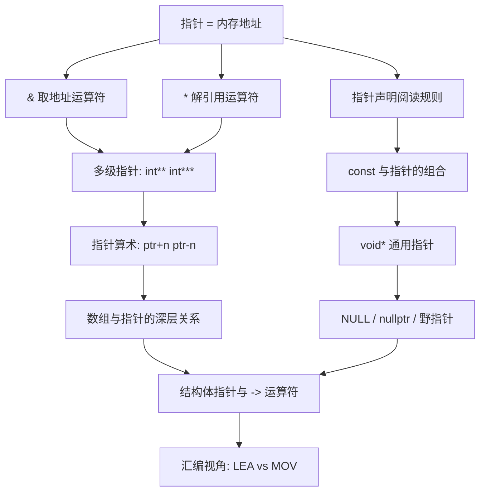
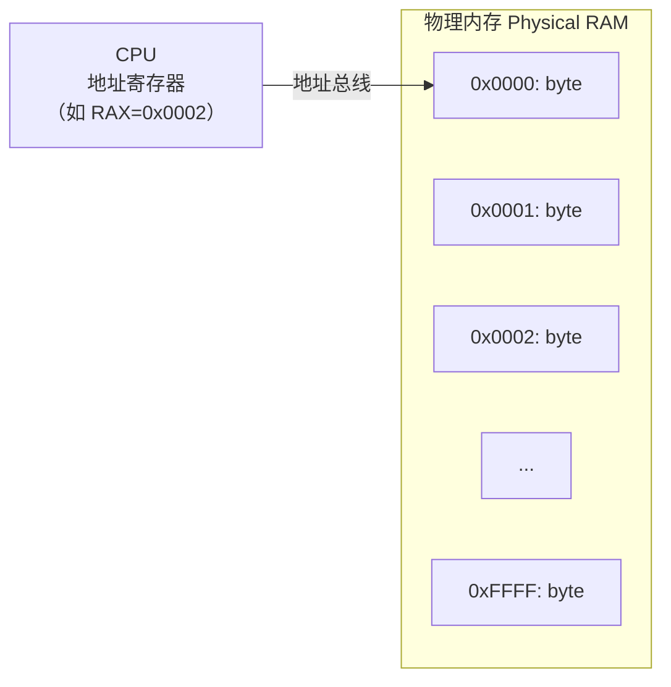
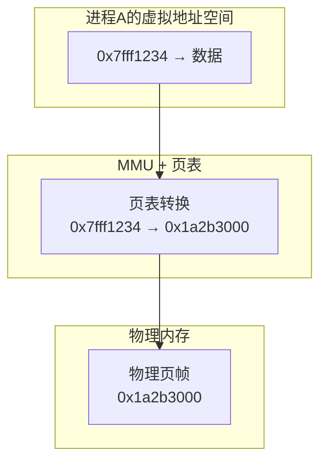
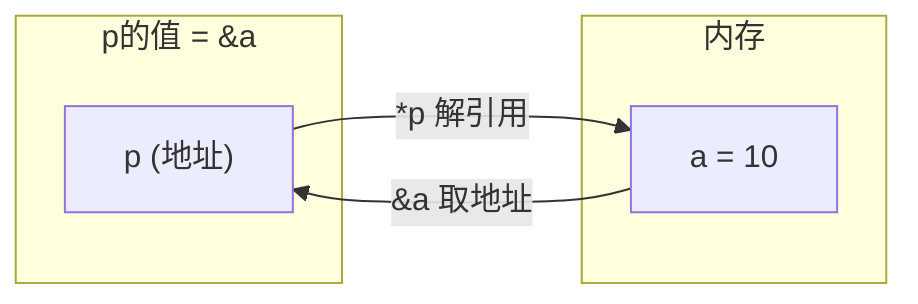
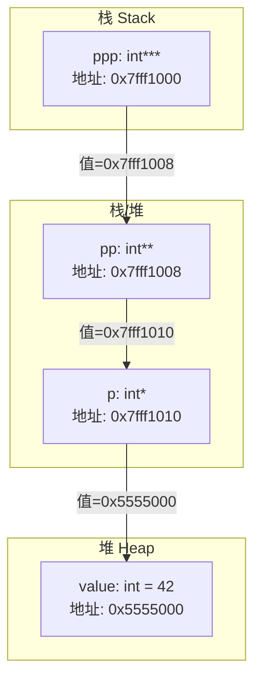
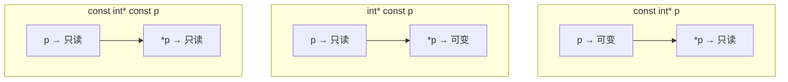
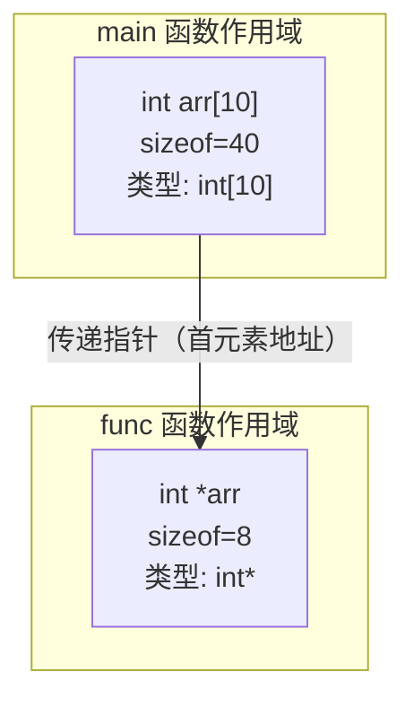
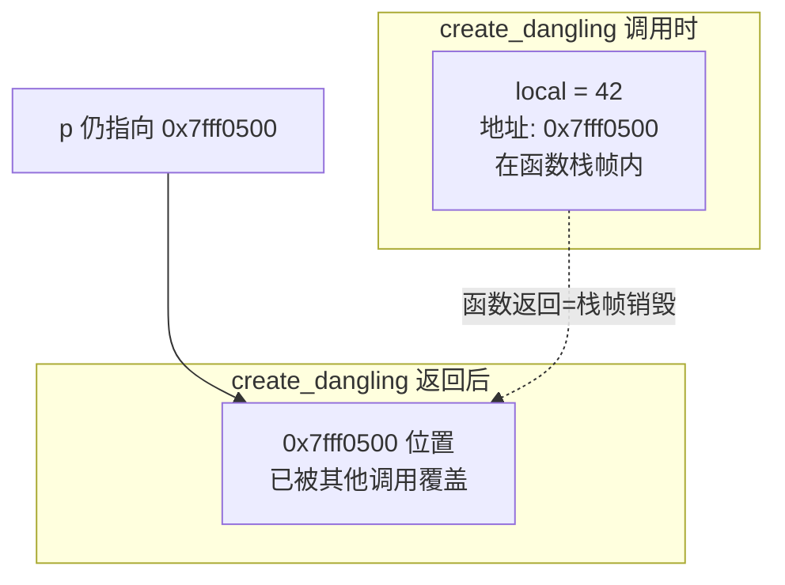
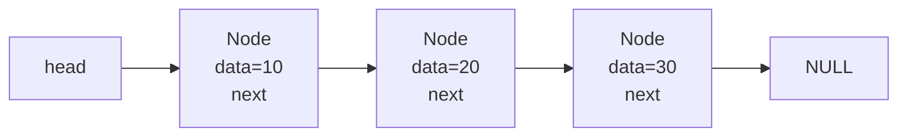

# 指针深度剖析  (Pointers Deep Dive)
---

##  章节概述

>  **这是 C 语言深化教程的核心章节**。指针是 C 语言的灵魂——它赋予了程序员直接操控内存的能力，也是 C 语言能够编写操作系统、嵌入式固件、高性能计算的根本原因。本章从 CPU 的物理寻址机制出发，逐层深入到汇编层面的指针操作，再到 C 语言层面指针的全部语法特性。建议同时打开 [[../ASM教程/01_体系结构与寄存器|ASM: 体系结构与寄存器]] 和 [[../ASM教程/02_指令集与寻址|ASM: 指令集与寻址]] 对照阅读。

指针（Pointer）是一个**变量**，其值是**另一个变量的内存地址**。这句话看似简单，但背后蕴含了计算机体系结构的核心思想：冯·诺依曼架构中，内存是一个巨大的字节数组，每个字节有一个唯一的编号（地址）。指针就是这个编号的载体。

与 C++ 不同，C 语言**没有引用（Reference）**。C 只有指针——这既是 C 的简洁之处，也是 C 程序员必须直面内存管理的根源。理解指针是理解 [[../cpp深化教程/03_指针与引用|CPP: 指针与引用]] 中引用语法的前提——引用本质上是"语法糖化的常量指针"。

### 本章知识地图



---
###  第一节: 指针的物理本质——CPU 如何访问内存
---

#### 1.1 内存即字节数组——地址的物理含义

从 CPU 的角度看，物理内存就是一片连续编号的字节序列。早期的 8086 使用 20 位地址总线（1MB 寻址空间），现代 x86-64 使用 48 位虚拟地址（256TB 用户空间）。无论哪种架构，核心概念不变：**每个字节有一个编号，这个编号就是地址**。



```c
// 概念验证：每个字节有独立地址
#include <stdio.h>

int main() {
    char c1 = 'A', c2 = 'B', c3 = 'C';
    // 栈上连续声明的 char 通常地址连续
    printf("c1 地址: %p\n", (void*)&c1);
    printf("c2 地址: %p\n", (void*)&c2);
    printf("c3 地址: %p\n", (void*)&c3);
    // 在大多数平台上，你会发现它们相差1字节
    return 0;
}
```

>  **关键洞察**: `&` 运算符的本质是 CPU 的 `LEA`（Load Effective Address）指令。当你写 `int* p = &x;` 时，编译器生成 `leaq -4(%rbp), %rax`，将栈上局部变量 x 的有效地址加载到寄存器 rax 中。

#### 1.2 虚拟内存——用户程序看到的世界

现代操作系统使用虚拟内存机制。`printf("%p")` 打印的地址**从来不是物理地址**——它是经过 MMU（Memory Management Unit）翻译的虚拟地址。



```c
// 验证：不同区域的地址范围
#include <stdio.h>
#include <stdlib.h>

int global_init = 42;      // .data 段
int global_zero;            // .bss 段
const int rodata = 100;    // .rodata 段

int main() {
    int stack_var = 10;                    // 栈
    int* heap_var = malloc(sizeof(int));   // 堆
    *heap_var = 20;

    printf("=== 所有地址均为虚拟地址 ===\n");
    printf(".text  (函数):   %p\n", (void*)main);
    printf(".rodata(const):   %p\n", (void*)&rodata);
    printf(".data  (已初始化): %p\n", (void*)&global_init);
    printf(".bss   (未初始化): %p\n", (void*)&global_zero);
    printf("stack  (栈):      %p\n", (void*)&stack_var);
    printf("heap   (堆):      %p\n", (void*)heap_var);

    free(heap_var);
    return 0;
}
```

编译并运行：
```bash
gcc -o mem_layout mem_layout.c
./mem_layout
# 典型输出（具体值因 ASLR 变化）:
# .text  (函数):   0x5573a2c01189
# .rodata(const):  0x5573a2c02008
# .data  (已初始化): 0x5573a2c04010
# .bss   (未初始化): 0x5573a2c04014
# stack  (栈):      0x7ffd4a3b2e4c
# heap   (堆):      0x5573a404a260
```

观察规律：代码段/数据段在低地址（`0x55...`），栈在高地址（`0x7f...`），堆介于两者之间。详见 [[2深化/02_内存模型与布局|内存模型与布局]]。

#### 1.3 汇编视角——指针操作的 CPU 指令

C 语言的指针操作最终翻译为少数几条关键汇编指令：

```c
int x = 42;
int *p = &x;   // 取地址
int y = *p;    // 解引用
*p = 100;      // 通过指针写入
```

对应 x86-64 汇编（AT&T 语法）:

```asm
# int x = 42;
movl    $42, -4(%rbp)       # 将立即数42写入栈上位置（即变量x）

# int *p = &x;
leaq    -4(%rbp), %rax      # LEA: 将x的地址加载到rax（不访问内存！）
movq    %rax, -16(%rbp)     # 将地址存入变量p

# int y = *p;
movq    -16(%rbp), %rax     # 加载p的值（即x的地址）到rax
movl    (%rax), %eax        # 寄存器间接寻址：读取rax指向的内存
movl    %eax, -20(%rbp)     # 存入变量y

# *p = 100;
movq    -16(%rbp), %rax     # 加载p的值
movl    $100, (%rax)        # 将100写入rax指向的内存位置
```

>  **关键区分——LEA vs MOV**:
> - `LEA` (Load Effective Address): 计算地址，**不访问内存**。对应 C 的 `&` 运算符。
> - `MOV` with brackets: 真正访问内存。对应 C 的 `*` 运算符。
> - 详见 [[../ASM教程/02_指令集与寻址|ASM: 指令集与寻址]] 中的寻址模式详解。

**小练习**: 写出以下 C 代码对应的汇编伪代码：
```c
int arr[3] = {10, 20, 30};
int *p = &arr[1];
int val = *(p + 1);
```

<details>
<summary>点击查看答案</summary>

```asm
# int arr[3] = {10, 20, 30};
movl    $10, -32(%rbp)   # arr[0]
movl    $20, -28(%rbp)   # arr[1]
movl    $30, -24(%rbp)   # arr[2]

# int *p = &arr[1];
leaq    -28(%rbp), %rax   # arr[1]的地址 (arr起始-32 + 4字节偏移)
movq    %rax, -8(%rbp)

# int val = *(p + 1);
movq    -8(%rbp), %rax    # 加载p的值
movl    4(%rax), %eax     # 基址+偏移量4字节 = arr[2] = 30
movl    %eax, -12(%rbp)
```
</details>

---
###  第二节: & 和 * —— 指针的核心运算符
---

#### 2.1 &（取地址运算符）

`&` 是**一元**运算符（不是按位与），返回操作数的内存地址。

```c
int a = 10;
int *p = &a;    // p 现在存储的是 a 的地址
```

**`&` 可以使用在哪些对象上？**
- 变量（包括数组元素、结构体成员）
- 结构体实例
- 函数（函数名本身就是地址，但 &func 也合法）

**不能取地址的**: 寄存器变量（`register` 关键字）、位域成员、字面常量（`&42` 非法）。

> ️ **常见错误**: 对数组名使用 `&arr` 得到的是**数组指针**（类型是 `int (*)[N]`），不是 `int*`。详见 [[2深化/01_指针深度剖析#5.3 sizeof 差异与数组指针|sizeof 差异与数组指针]]。

#### 2.2 *（解引用运算符）

`*` 也是一元运算符，用于**通过指针访问其指向的内存位置**。

```c
int a = 10;
int *p = &a;
*p = 20;        // 写入: 将20写入p指向的内存（即a的位置）
printf("%d", *p); // 读取: 从p指向的内存读出值（现在为20）
printf("%d", a);  // a 也是20——*p 就是 a
```

**汇编本质**: `*p` 对应 `mov (%rax), %eax`（寄存器间接寻址），CPU 将 rax 的值作为地址，通过地址总线读取该地址的数据。

>  **危险操作——解引用未初始化指针**:
> ```c
> int *p;     // p 的值是随机垃圾
> *p = 42;    // 未定义行为！写入随机地址，可能导致段错误
> ```

#### 2.3 & 和 * 的互逆关系

```c
int a = 10;
int *p = &a;

// & 和 * 互为逆运算：
// *(&a) == a      —— 取地址再解引用 = 原值
// &(*p) == p      —— 解引用再取地址 = 原指针（前提：p非NULL）
```



**小练习**: 以下代码输出什么？
```c
int x = 5;
int *p = &x;
int **pp = &p;
printf("%d\n", **pp);
printf("%p\n", (void*)*pp);
printf("%p\n", (void*)&x);
```

---
###  第三节: 指针声明——右左法则阅读
---

#### 3.1 螺旋阅读法（Clockwise/Spiral Rule）

C 语言的类型声明语法以"声明模仿使用"为设计原则。指针声明看起来复杂，但遵循**右左法则**即可高效阅读：

> 从标识符开始，向右遇到什么就读什么；遇到右括号或行尾就向左转，遇到左括号再向右转。直到读完整个声明。

```
        int      *       p      [3]     ;
方向:             ←      →      ←
解读:           指向int    p    是3个元素的数组
结论: p 是一个包含3个元素的数组，每个元素是指向 int 的指针
```

```c
// 示例1: int *p
// 从p开始向右: 遇到;向左: 遇到* (指针), 向左: 遇到int
// 结论: p 是一个指向 int 的指针

// 示例2: int *p[3]
// 从p开始向右: 遇到[3] (数组), 向左: 遇到* (指针), 向左: 遇到int
// 结论: p 是一个包含3个元素的数组，每个元素是指向 int 的指针
//       即"指针数组"

// 示例3: int (*p)[3]
// 从p开始向右: 遇到), 向左: 遇到* (指针), 跳出括号向右: 遇到[3] (数组)
//           向左: 遇到int
// 结论: p 是一个指针，指向一个包含3个 int 的数组
//       即"数组指针"

// 示例4: int *(*p[5])(int, char*)
// 从p开始: [5]→数组, *→指针, ( )→函数, *→指针, int→返回int
// 参数: int, char*
// 结论: p 是一个包含5个元素的数组，每个元素是一个函数指针，
//       指向的函数参数为 (int, char*)，返回 int*
```

#### 3.2 实践练习表

| 声明 | 读法 |
|------|------|
| `int *p` | p 是指向 int 的指针 |
| `int **p` | p 是指向"指向 int 的指针"的指针 |
| `int *p[5]` | p 是包含5个"指向 int 的指针"的数组 |
| `int (*p)[5]` | p 是指向包含5个 int 的数组的指针 |
| `int *p()` | p 是返回 int* 的函数 |
| `int (*p)()` | p 是指向返回 int 的函数的指针 |
| `int *(*p[3])(int)` | p 是包含3个函数指针的数组，函数参数 int，返回 int* |
| `const int *p` | p 是指向 const int 的指针 |
| `int * const p` | p 是 const 指针，指向 int |
| `void (*signal(int, void(*)(int)))(int)` | signal 是函数(参数int和函数指针)，返回函数指针 |

```c
// 最后一行是经典的 signal 函数声明
// 等价于使用 typedef 拆解:
typedef void (*sighandler_t)(int);
sighandler_t signal(int signum, sighandler_t handler);
```

**小练习**: 使用右左法则解读以下声明：
```c
char *(*(*arr[4])())[10];
```

<details>
<summary>点击查看答案</summary>

从 arr 开始: `[4]`→数组, `*`→指针, `()`→函数, `*`→指针, `[10]`→数组, `*`→指针, `char`→char
结论: arr 是包含4个元素的数组，每个元素是一个函数指针，指向的函数无参数、返回一个指针，该指针指向包含10个元素的数组，数组元素是 char*。
</details>

---
###  第四节: 多级指针（int**, int***）
---

#### 4.1 为什么需要多级指针

一级指针修改值，二级指针修改一级指针本身（即修改指针的指向）。

```c
#include <stdio.h>
#include <stdlib.h>

// 错误示范：想修改调用者的指针
void bad_alloc(int *p, int val) {
    p = malloc(sizeof(int));  // 只修改了局部副本！
    *p = val;
}
// 调用者传入的指针 p 仍然是原值——内存泄漏！

// 正确做法：使用二级指针
void good_alloc(int **p, int val) {
    *p = malloc(sizeof(int));  // 修改调用者的指针变量
    **p = val;                 // 修改堆上分配的值
}

int main() {
    int *ptr = NULL;
    good_alloc(&ptr, 42);
    printf("ptr = %p, *ptr = %d\n", (void*)ptr, *ptr);  // 有效输出
    free(ptr);
    return 0;
}
```

#### 4.2 多级指针的内存模型



```c
int value = 42;
int *p = &value;      // 一级指针
int **pp = &p;        // 二级指针：存储 p 的地址
int ***ppp = &pp;     // 三级指针：存储 pp 的地址

printf("value = %d\n", ***ppp);  // 三重解引用，输出 42
// ***ppp = *(*(*ppp)) = *(*(pp)) = *(p) = value
```

#### 4.3 典型应用场景

| 场景 | 指针级别 | 示例 |
|------|----------|------|
| 动态分配一维数组 | `int*` | `int *arr = malloc(n * sizeof(int));` |
| 动态分配二维数组（指针数组） | `int**` | `int **mat = malloc(rows * sizeof(int*));` |
| 函数内修改外部指针 | `int**` | 如上 good_alloc |
| 动态分配三维数组 | `int***` | 极少使用，考虑用一维数组模拟 |
| argv 参数 | `char**` | `int main(int argc, char **argv)` |

```c
// argv 是二级指针的本质
// argv → [char*] → [char*] → [char*] → NULL
//          ↓          ↓          ↓
//         "./a.out"  "arg1"     "arg2"

int main(int argc, char **argv) {
    for (int i = 0; i < argc; i++) {
        printf("argv[%d] = %s\n", i, argv[i]);
        // argv[i] 等价于 *(argv + i)
    }
    return 0;
}
```

**小练习**: 写出一个函数 `free_2d_array(int **arr, int rows)` 正确释放一个动态分配的二维数组（每一行也是独立分配的）。

<details>
<summary>点击查看答案</summary>

```c
void free_2d_array(int **arr, int rows) {
    for (int i = 0; i < rows; i++) {
        free(arr[i]);   // 先释放每一行
    }
    free(arr);          // 再释放行指针数组
}
```
</details>

---
###  第五节: void* 通用指针
---

#### 5.1 void* 的定义

`void*` 是 C 语言的"通用指针类型"。它可以存储任何类型的地址，但不能直接解引用。

```c
int a = 10;
double b = 3.14;
char c = 'Z';

void *vp;
vp = &a;   // OK: int* → void* 隐式转换
vp = &b;   // OK: double* → void* 隐式转换
vp = &c;   // OK: char* → void* 隐式转换

// *vp = 20;   // 编译错误！void* 不知道指向多大内存
// vp + 1;      // 也非法，不知道步长
```

#### 5.2 为什么 C 允许而 C++ 不允许隐式 void* → T* 转换

```c
// C 语言：void* 到任何指针类型的转换都是隐式的
void *malloc(size_t size);
int *p = malloc(sizeof(int));  // C中合法，不需要强制类型转换！

// C++ 语言：必须显式转换
// int *p = malloc(sizeof(int));  // C++ 编译错误
// int *p = (int*)malloc(sizeof(int));  // 需要强制转换
```

> 这是 C/C++ 的重要语言分歧点。[[../cpp深化教程/03_指针与引用|CPP: 指针与引用]] 中会讨论 C++ 的 `static_cast` 和更严格的类型系统。C++ 禁止隐式转换是为了类型安全。

#### 5.3 void* 的核心应用：通用接口

```c
// qsort 使用 void* 实现通用排序
void qsort(void *base, size_t nmemb, size_t size,
           int (*compar)(const void *, const void *));

// 回调函数中使用 void* 通用参数
typedef void (*callback_t)(void *userdata);

int compare_ints(const void *a, const void *b) {
    int ia = *(const int *)a;   // 回调内转换回具体类型
    int ib = *(const int *)b;
    return (ia > ib) - (ia < ib);
}

int arr[] = {5, 2, 8, 1, 9};
qsort(arr, 5, sizeof(int), compare_ints);
// qsort 不知道排序的是什么类型——void* 提供了这种通用性
```

#### 5.4 汇编视角

`void*` 在汇编层面就是一个普通的 64 位（或 32 位）地址值。编译器不为 `void*` 生成不同的代码，只是**类型检查层面**禁止了解引用和算术操作。

```asm
# void *vp = &a;
leaq    -4(%rbp), %rax     # 取 a 的地址（同 int*）
movq    %rax, -16(%rbp)    # 存入 vp（同 int*）
# 汇编层面毫无区别——void* 只是编译器的"类型遗忘"
```

**小练习**: 实现一个 `generic_swap(void *a, void *b, size_t size)` 函数，可以交换任意类型的两个变量。

---
###  第六节: const 与指针——三条黄金法则
---

`const` 与指针的组合是 C 语言中最容易混淆的语法点。记住 **const 修饰它左边的内容** 原则：

#### 6.1 const int* p（指向常量的指针）

```c
const int *p;        // 等价于 int const *p;
// const 在 * 左边 → 修饰 *p（被指向的内容不可修改）

int a = 10, b = 20;
p = &a;              // OK: p 本身可以变化
p = &b;              // OK: 可以指向别的地址
// *p = 30;          // 错误! 不能通过 p 修改值
a = 30;              // OK: 可以直接修改 a
```

**内存模型**：指针变量 p 存储在可写内存，指向的内存只读（通过 p 访问时）。

#### 6.2 int* const p（常量指针）

```c
int *const p = &a;
// const 在 * 右边 → 修饰 p（指针本身不可修改）

*p = 30;             // OK: 可以通过 p 修改值
// p = &b;           // 错误! p 不能再指向其他地址
```

**内存模型**：指针变量 p 本身是只读的，指向的内存可写。

#### 6.3 const int* const p（指向常量的常量指针）

```c
const int *const p = &a;
// 两个 const: *左边修饰内容，*右边修饰指针本身

// *p = 30;          // 错误! 不能修改内容
// p = &b;           // 错误! 不能修改指针指向
a = 30;              // OK: 直接修改原变量仍然可以
```



#### 6.4 const 与函数参数

```c
// 传指针 + const 是最常见的惯用法
size_t strlen(const char *str);  // 承诺不修改字符串内容
//   参数是 const char*：告诉调用者"我只读不写"

// 传结构体时用 const 指针避免拷贝
void print_student(const struct Student *s);
//   const 保证函数内部不会修改 s 指向的结构体

// const 返回值
const int *get_value(void);  // 返回指向常量的指针
//   防止调用者通过返回值修改内部数据
```

>  C 语言的 const 与 C++ 的 const 有细微差异。在 C 中，`const int n = 10;` 不一定是编译期常量（不能用作数组大小），而 C++ 中默认是编译期常量。详见 [[../cpp深化教程/03_指针与引用|CPP: 指针与引用]]。

**小练习**: 以下哪些赋值是合法的？

```c
const int a = 10;
int b = 20;
const int *p1 = &a;
const int *p2 = &b;    // 合法吗？
int *p3 = &a;          // 合法吗？
int *const p4 = &b;
p4 = &a;               // 合法吗？
```

<details>
<summary>点击查看答案</summary>

- `const int *p2 = &b;` —— **合法**。int* 隐式转换为 const int*（增加 const 限定是安全的）。
- `int *p3 = &a;` —— **不合法**。const int* 不能隐式转换为 int*（这将移除 const 保护）。
- `p4 = &a;` —— **不合法**。p4 是 const 指针，不能改变指向。且即使允许，&a 是 const int*，也不能赋给 int*。
</details>

---
###  第七节: 指针算术——以类型大小为步长
---

#### 7.1 核心规则

指针算术不是简单的地址加减——**步长 = sizeof(指向类型)**。

```c
int *p = (int*)0x1000;

// p + 1 意味着地址增加 sizeof(int) 字节（通常是4）
printf("%p\n", (void*)(p + 1));  // 输出 0x1004

// p + n 意味着地址增加 n * sizeof(int) 字节
printf("%p\n", (void*)(p + 3));  // 输出 0x100c

double *dp = (double*)0x1000;
printf("%p\n", (void*)(dp + 1));  // 输出 0x1008（sizeof(double)=8）

char *cp = (char*)0x1000;
printf("%p\n", (void*)(cp + 1));  // 输出 0x1001（sizeof(char)=1）
```

#### 7.2 汇编层面的指针算术

```asm
# int *p;  p = p + 3;
# 假设 p 在 %rax 中
leaq    12(%rax), %rax    # 3 * sizeof(int) = 3 * 4 = 12

# char *cp; cp = cp + 3;
leaq    3(%rcx), %rcx     # 3 * sizeof(char) = 3 * 1 = 3
# 注意：编译器可能用 addq 代替 leaq 进行简单算术
```

#### 7.3 指针相减

两个**同类型**指针相减，结果是它们之间相差的**元素个数**（不是字节数）。

```c
int arr[] = {10, 20, 30, 40, 50};
int *p1 = &arr[1];  // 指向 20
int *p2 = &arr[4];  // 指向 50

ptrdiff_t diff = p2 - p1;     // diff = 3（3个元素间距）
// 不是 12 字节！即使每个 int 4 字节，结果是 3

// 如果想知道字节差：
ptrdiff_t byte_diff = (char*)p2 - (char*)p1;  // = 12
```

> `ptrdiff_t` 是 `<stddef.h>` 中定义的有符号整数类型，用于存储指针差值。

#### 7.4 指针比较

```c
int arr[5];
int *p1 = &arr[1];
int *p2 = &arr[3];

if (p1 < p2) printf("p1 在 p2 前面\n");  // 合法
if (p2 > p1) printf("p2 在 p1 后面\n");  // 合法
// 但只能是同一数组（或同一分配块）内的指针比较有意义
```

#### 7.5 void* 不能做算术

```c
void *vp = malloc(100);
// vp + 1;     // 错误! 不知道步长
// 类型不同导致步长不同，这就是类型系统存在的意义
char *cp = vp;
cp = cp + 1;     // OK: 步长 = sizeof(char) = 1
```

**小练习**: 
```c
short arr[] = {1, 2, 3, 4, 5, 6, 7, 8};
short *p = arr + 2;
// 问: *(p + 3) 的值是？p[-1] 的值是？
```

---
###  第八节: 数组与指针——最深的渊源
---

这是 C 语言设计中最核心也最容易被误解的部分。

#### 8.1 数组名退化为指针（Array Decay）

> **核心规则**: 在大多数表达式上下文中，数组名会**隐式转换（退化）**为指向其首元素的指针。

```c
int arr[5] = {10, 20, 30, 40, 50};
int *p = arr;       // arr 退化为 &arr[0]

// 以下四行完全等价：
printf("%d\n", arr[2]);    // 30
printf("%d\n", *(arr + 2)); // 30
printf("%d\n", p[2]);      // 30
printf("%d\n", *(p + 2));  // 30
```

`arr[i]` 在编译器内部被转换为 `*(arr + i)`。这就是为什么 C 允许 `i[arr]` 这种奇怪写法（不推荐）：

```c
// arr[2] 等价于 *(arr + 2) 等价于 *(2 + arr) 等价于 2[arr]
printf("%d\n", 2[arr]);  // 合法但不推荐！输出30
```

#### 8.2 数组名何时不退化

三个例外情况，数组名保持其数组类型：

```c
int arr[5];

// 例外1: sizeof(arr) — 返回整个数组的字节数
printf("%zu\n", sizeof(arr));   // 20 (= 5 * sizeof(int))
// 如果 arr 退化为指针，sizeof 会返回 8（指针大小）

// 例外2: &arr — 取数组地址，类型是 int (*)[5]（数组指针）
int (*parr)[5] = &arr;   // parr 是指向整个数组的指针
// &arr 的类型是 int(*)[5]，不是 int**

// 例外3: 字符串字面量初始化
char str[] = "hello";    // str 是数组（可修改），不是指针
// char *str = "hello";  // 这是指针（指向只读内存）
```

#### 8.3 sizeof 差异——最经典的混淆

```c
void func(int arr[]) {     // 等价于 void func(int *arr)
    printf("%zu\n", sizeof(arr));  // 输出 8（指针大小！），不是数组大小
}

int main() {
    int arr[10];
    printf("%zu\n", sizeof(arr));  // 输出 40（10*4），是数组大小
    func(arr);                     // 传入的是指针，不是数组
    return 0;
}
```

>  **关键**: 函数参数中的 `int arr[]` 就是 `int *arr`——这是语法糖，参数传递的永远是**指针**，而非数组本身。



#### 8.4 字符数组 vs 字符指针

```c
// 方式1: 数组——在栈上，可修改
char buf1[] = "hello";
buf1[0] = 'H';           // OK: 修改栈上的数组

// 方式2: 指针——指向 .rodata 段的字符串字面量，不可修改
char *buf2 = "hello";
// buf2[0] = 'H';        // 段错误! .rodata 段是只读的
// 更好的写法:
const char *buf3 = "hello";  // 用 const 保护
```

**汇编视角**:

```asm
# char buf1[] = "hello";
# 编译器在栈上分配6字节，用立即数或从.rodata复制
movabsq $0x6f6c6c6568, %rax   # "hello\0" 的小端编码
movq    %rax, -16(%rbp)

# char *buf2 = "hello";
# 编译器将"hello"放在.rodata段，buf2只是一个指向它的指针
leaq    .LC0(%rip), %rax      # .LC0是.rodata中"hello"的地址
movq    %rax, -8(%rbp)
```

#### 8.5 函数参数的数组语法糖

```c
// 以下四种声明完全等价——都是 int *arr
void f1(int arr[10]);
void f2(int arr[]);
void f3(int arr[5]);    // 5 被编译器忽略
void f4(int *arr);

// 但多维数组的第二维及以后必须指定大小
void g1(int mat[][5]);   // OK: 第二维必须知道
void g2(int (*mat)[5]);  // 等价写法
// void g3(int mat[][]); // 错误! 无法计算步长
```

#### 8.6 汇编层面的数组访问

```c
int arr[5] = {10, 20, 30, 40, 50};
int x = arr[3];
```

```asm
# arr 在栈上 -32(%rbp) 起始
# arr[3] = *(arr + 3) = *(基址 + 3 * sizeof(int))
movl    -20(%rbp), %eax    # -32 + 3*4 = -20
movl    %eax, -36(%rbp)    # 存入 x
```

所有数组访问最终都翻译为**基址+偏移量**的寻址模式。详见 [[../ASM教程/02_指令集与寻址|ASM: 指令集与寻址]]。

**小练习**: 
```c
void print_size(int arr[]) {
    printf("sizeof(arr) = %zu\n", sizeof(arr));
}
int main() {
    int data[100];
    printf("sizeof(data) = %zu\n", sizeof(data));
    print_size(data);
}
// 问: 两次 printf 分别输出什么？为什么？
```

---
###  第九节: NULL 指针、野指针与悬空指针
---

#### 9.1 NULL 指针

`NULL` 是一个**保证不指向任何有效内存**的特殊值。在大多数平台上，NULL 的数值是 0。

```c
#include <stddef.h>  // NULL 定义在此

int *p = NULL;       // 明确表示"当前不指向任何有效对象"

// 安全地解引用检查
if (p != NULL) {
    *p = 42;         // 只在 p 有效时才解引用
}

// 等价写法
if (p) {             // 非空指针为真
    *p = 42;
}
```

> ️ NULL 指针解引用导致**段错误（Segmentation Fault）**——操作系统检测到访问无效地址 (0x0)，发送 SIGSEGV 信号终止进程。

#### 9.2 C23 的 nullptr

C23 标准引入了 `nullptr` 常量（与 C++11 对齐）：

```c
// C23 (需要 -std=c2x 编译器标志)
#include <stddef.h>
int *p = nullptr;     // 替代 NULL
// nullptr 类型是 nullptr_t，比 NULL（整数0）更类型安全
```

> 与 [[../cpp深化教程/03_指针与引用|CPP: 指针与引用]] 中 C++ 的 nullptr 一致。C++11 引入 nullptr 是为了解决 NULL（即 0）在重载决议中的歧义问题。

#### 9.3 野指针（Wild Pointer）

**野指针**：未初始化的指针，其值是栈上的随机垃圾值。

```c
int *p;        // 危险！p 的值是随机的
// *p = 42;    // 向随机地址写入——未定义行为
// 可能：段错误、静默破坏其他数据、或"碰巧"正常工作

// 最佳实践：声明时立即初始化
int *p = NULL;   // 或 int *p = &valid_var;
```

#### 9.4 悬空指针（Dangling Pointer）

**悬空指针**：指向已释放内存的指针。

```c
int *p = malloc(sizeof(int));
*p = 42;
free(p);       // 内存已释放
// p 现在是悬空指针！
// *p = 10;    // 未定义行为——使用已释放内存

// 防止悬空指针的方法: free 后立即置 NULL
free(p);
p = NULL;      // 明确标记为无效
// if (p) *p = 10;  // 不会执行
```

更隐蔽的情况——返回局部变量的地址：

```c
int *create_dangling(void) {
    int local = 42;
    return &local;   // 危险！返回栈变量的地址
}                    // local 在此后失效

int *p = create_dangling();
// *p 现在是悬空指针！栈帧已销毁，该内存可能被覆盖
```



**小练习**: 找出以下代码中的所有指针问题：
```c
int *p1;
int *p2 = malloc(10 * sizeof(int));
p2[10] = 5;
free(p2);
*p2 = 3;
int *p3 = p1 + 5;
```

---
###  第十节: 结构体指针与 -> 运算符
---

#### 10.1 为什么用指针传递结构体

C 语言函数参数是**值传递**。如果按值传递结构体，整个结构体被拷贝到栈上——对于大型结构体，这极其低效。

```c
struct Point {
    double x, y, z;
    char name[64];
};

// 低效：拷贝整个结构体（约80字节）
void print_by_value(struct Point p) {
    printf("(%f, %f, %f)\n", p.x, p.y, p.z);
}

// 高效：只拷贝一个指针（8字节）
void print_by_pointer(const struct Point *p) {
    printf("(%f, %f, %f)\n", p->x, p->y, p->z);
}
```

#### 10.2 -> 运算符

`p->member` 是 `(*p).member` 的语法糖：

```c
struct Point pt = {1.0, 2.0, 3.0, "origin"};
struct Point *pp = &pt;

// 以下两行完全等价
printf("%f\n", (*pp).x);    // 先解引用，再访问成员
printf("%f\n", pp->x);      // 箭头运算符，推荐写法

// -> 的优先级高于 &
// 所以 &pp->x 等价于 &(pp->x)，取成员 x 的地址
```

**汇编视角**:

```asm
# struct Point *pp; double z = pp->z;
# 假设 pp 在 -8(%rbp)，z 成员偏移量为 16（跳过 x 和 y 各8字节）
movq    -8(%rbp), %rax      # 加载 pp（即结构体地址）
movsd   16(%rax), %xmm0     # 基址+偏移16字节 = z 成员
movsd   %xmm0, -24(%rbp)    # 存入 z
```

#### 10.3 自引用结构体（链表节点）

```c
// 链表节点——自引用结构体的经典范例
struct Node {
    int data;
    struct Node *next;   // 指向同类型结构体的指针
};

// 遍历链表
void traverse(struct Node *head) {
    struct Node *current = head;
    while (current != NULL) {
        printf("%d -> ", current->data);
        current = current->next;
    }
    printf("NULL\n");
}
```



#### 10.4 typedef 与结构体指针的陷阱

```c
typedef struct Node {
    int data;
    struct Node *next;    // 此时还不能用 Node *next
} Node;                   // typedef 在这里才完成

// 常见模式：在结构体内使用 struct 标记名，外部使用 typedef 别名
```

**小练习**: 实现一个函数 `insert_after(struct Node *node, int data)`，在指定节点后插入新节点。

---
###  第十一节: 综合案例——指针所有知识点的融合
---

#### 11.1 动态二维数组

```c
#include <stdio.h>
#include <stdlib.h>

int **create_matrix(int rows, int cols) {
    int **mat = malloc(rows * sizeof(int *));
    if (!mat) return NULL;
    for (int i = 0; i < rows; i++) {
        mat[i] = malloc(cols * sizeof(int));
        if (!mat[i]) {
            // 部分分配失败，需要回滚已分配的内存
            for (int j = 0; j < i; j++) free(mat[j]);
            free(mat);
            return NULL;
        }
    }
    return mat;
}

void free_matrix(int **mat, int rows) {
    for (int i = 0; i < rows; i++) free(mat[i]);
    free(mat);
}

int main() {
    int rows = 3, cols = 4;
    int **mat = create_matrix(rows, cols);

    // 双层指针访问
    for (int i = 0; i < rows; i++)
        for (int j = 0; j < cols; j++)
            mat[i][j] = i * cols + j;
    // mat[i][j] 等价于 *(*(mat + i) + j)

    free_matrix(mat, rows);
    return 0;
}
```

#### 11.2 汇编验证完整示例

```bash
# 编译并查看汇编
gcc -S -o matrix.s matrix.c
# 查看 lea 和 mov 指令的数量
grep -E '(lea|mov)' matrix.s | wc -l
```

关键观察：
- `mat[i]` 生成一次间接寻址（加载行指针）
- `mat[i][j]` 生成两次间接寻址（先加载行指针，再加载元素）
- 每次 `*` 解引用对应一次 `mov (%rax), ...` 指令

---

##  章节测试

###  判断题（每题1分，共10分）

> [!question] 判断题 1
> C 语言中的指针变量存储的是另一个变量的值，而不是地址。 （ ）
> - [ ]  正确
> - [ ]  错误
>
> > [!success]- 点击查看答案
> > 答案: 错误
> >
> > **解析**: 指针变量存储的是另一个变量（或内存位置）的地址，不是值。指针的值 = 地址。

> [!question] 判断题 2
> `int *p` 中，p 本身的类型是 `int*`，大小在 64 位系统上是 8 字节。 （ ）
> - [ ]  正确
> - [ ]  错误
>
> > [!success]- 点击查看答案
> > 答案: 正确
> >
> > **解析**: 指针本身是一个变量，在 64 位系统上 sizeof(任何指针类型) == 8，在 32 位系统上是 4。

> [!question] 判断题 3
> `void *vp; vp++;` 是合法的 C 代码。 （ ）
> - [ ]  正确
> - [ ]  错误
>
> > [!success]- 点击查看答案
> > 答案: 错误
> >
> > **解析**: void* 不能做算术运算，因为编译器不知道 sizeof(void) 是多少。GCC 扩展允许 void* 算术（步长为1字节），但这不是标准 C。

> [!question] 判断题 4
> `const int *p` 表示指针 p 本身不能被修改。 （ ）
> - [ ]  正确
> - [ ]  错误
>
> > [!success]- 点击查看答案
> > 答案: 错误
> >
> > **解析**: `const int *p` 表示不能通过 p 修改所指内容。p 本身可以指向其他地址。`int *const p` 才是指针本身不可修改。

> [!question] 判断题 5
> 数组名在几乎所有表达式中都会退化为指向首元素的指针。 （ ）
> - [ ]  正确
> - [ ]  错误
>
> > [!success]- 点击查看答案
> > 答案: 正确
> >
> > **解析**: 三个例外：sizeof(arr)、&arr、字符串字面量初始化数组。其余情况数组名退化为首元素指针。

> [!question] 判断题 6
> 在 64 位 x86 系统上，`char *p; p = p + 3;` 将使地址增加 3 个字节。 （ ）
> - [ ]  正确
> - [ ]  错误
>
> > [!success]- 点击查看答案
> > 答案: 正确
> >
> > **解析**: char 的大小是 1 字节，p+3 增加 3*sizeof(char)=3 字节。如果 p 是 int*，p+3 增加 3*sizeof(int)=12 字节。

> [!question] 判断题 7
> `int **pp` 表示一个二维数组。 （ ）
> - [ ]  正确
> - [ ]  错误
>
> > [!success]- 点击查看答案
> > 答案: 错误
> >
> > **解析**: `int**` 是指向指针的指针。虽然常用来管理动态二维数组，但它不是二维数组本身。真正的二维数组 `int arr[3][4]` 类型是 `int[3][4]`，会退化为 `int (*)[4]`（数组指针），不是 `int**`。

> [!question] 判断题 8
> `p->member` 和 `(*p).member` 总是等价的。 （ ）
> - [ ]  正确
> - [ ]  错误
>
> > [!success]- 点击查看答案
> > 答案: 正确
> >
> > **解析**: 这是 C 语言标准规定的等价关系。`->` 是解引用加成员访问的语法糖。

> [!question] 判断题 9
> `free(p)` 之后 p 自动变为 NULL。 （ ）
> - [ ]  正确
> - [ ]  错误
>
> > [!success]- 点击查看答案
> > 答案: 错误
> >
> > **解析**: free 不修改指针变量本身，p 仍然保存原来的地址（现在是悬空指针）。必须手动 `p = NULL;`。

> [!question] 判断题 10
> C 语言有引用（reference）类型。 （ ）
> - [ ]  正确
> - [ ]  错误
>
> > [!success]- 点击查看答案
> > 答案: 错误
> >
> > **解析**: C 语言只有指针，没有引用。引用是 C++ 的特性。这也是 C 和 C++ 的重要区别之一。详见 [[../cpp深化教程/03_指针与引用|CPP: 指针与引用]]。

###  选择题（每题2分，共10题）

> [!question] 选择题 1
> 以下哪个声明表示"指向包含5个int的数组的指针"？
> - [ ] A. `int *p[5];`
> - [ ] B. `int (*p)[5];`
> - [ ] C. `int **p;`
> - [ ] D. `int *p;`
>
> > [!success]- 点击查看答案
> > 正确答案: B
> >
> > **解析**: `int (*p)[5]` 用括号将 `*p` 绑定在一起，表示 p 是一个指针，指向 int[5] 数组。A 是包含5个 int* 的数组。C 是指向 int* 的指针。

> [!question] 选择题 2
> 以下代码输出什么？
> ```c
> int arr[] = {10, 20, 30, 40, 50};
> int *p = arr + 3;
> printf("%d", p[-1]);
> ```
> - [ ] A. 10
> - [ ] B. 20
> - [ ] C. 30
> - [ ] D. 40
>
> > [!success]- 点击查看答案
> > 正确答案: C
> >
> > **解析**: p 指向 arr[3] (值为40)。p[-1] 等价于 *(p-1)，即 arr[2] = 30。负下标在指针运算中完全合法。

> [!question] 选择题 3
> `const int *const p` 表示什么？
> - [ ] A. p 是指向常量的指针，p 本身也可变
> - [ ] B. p 是常量指针，指向的内容可修改
> - [ ] C. p 是常量指针，指向的内容也是常量
> - [ ] D. p 不是常量，但指向的内容是常量
>
> > [!success]- 点击查看答案
> > 正确答案: C
> >
> > **解析**: 第一个 const 修饰 int（指向的内容不可修改），第二个 const 修饰 *（在 * 右边，修饰 p，指针本身不可修改）。

> [!question] 选择题 4
> 关于悬空指针（dangling pointer），以下哪项正确？
> - [ ] A. 指向 NULL 的指针
> - [ ] B. 指向已释放内存的指针
> - [ ] C. 指向栈上变量的指针
> - [ ] D. 未初始化的指针
>
> > [!success]- 点击查看答案
> > 正确答案: B
> >
> > **解析**: 悬空指针指向已经 free() 释放或已经离开作用域（栈帧销毁）的内存。A 是 NULL 指针，D 是野指针。

> [!question] 选择题 5
> 在 x86-64 上，`sizeof(void*)` 的值是？
> - [ ] A. 1
> - [ ] B. 4
> - [ ] C. 8
> - [ ] D. 取决于指向的类型
>
> > [!success]- 点击查看答案
> > 正确答案: C
> >
> > **解析**: 在 64 位系统上，所有指针类型（int*、char*、void*、struct*）大小都是 8 字节。指针存储的是地址，地址大小由架构决定（64 位系统 = 8 字节）。

> [!question] 选择题 6
> 将 `void*` 转换为 `int*` 在 C 语言中：
> - [ ] A. 需要显式强制类型转换
> - [ ] B. 自动隐式转换，不需要强制类型转换
> - [ ] C. 是编译错误
> - [ ] D. 只在 C99 之后合法
>
> > [!success]- 点击查看答案
> > 正确答案: B
> >
> > **解析**: 在 C 语言中，void* 可以隐式转换为任何类型的指针，对应的，任何类型指针也可隐式转为 void*。这是 C 与 C++ 的关键区别之一（C++ 禁止 void* 的隐式转换）。

> [!question] 选择题 7
> 以下代码的汇编指令中，哪条对应 `*p = 42`？
> ```c
> int x;
> int *p = &x;
> *p = 42;
> ```
> - [ ] A. `leaq -4(%rbp), %rax`
> - [ ] B. `movl $42, (%rax)`
> - [ ] C. `movl $42, %eax`
> - [ ] D. `jmp *%rax`
>
> > [!success]- 点击查看答案
> > 正确答案: B
> >
> > **解析**: `movl $42, (%rax)` 使用寄存器间接寻址，将 42 写入 rax 寄存器值指向的内存位置。A 是取地址（&），C 是将立即数写入寄存器，D 是间接跳转。

> [!question] 选择题 8
> 以下代码有什么问题？
> ```c
> char *str = "hello";
> str[0] = 'H';
> ```
> - [ ] A. 没有问题
> - [ ] B. 编译错误
> - [ ] C. 运行时可能段错误（修改只读内存）
> - [ ] D. 内存泄漏
>
> > [!success]- 点击查看答案
> > 正确答案: C
> >
> > **解析**: 字符串字面量 "hello" 存储在 .rodata 只读数据段。str 指向这段只读内存，试图修改会导致段错误。应使用 `char str[] = "hello";` 在栈上分配可修改的副本。

> [!question] 选择题 9
> `int *p = NULL;` 之后 `*p` 的行为是：
> - [ ] A. 返回 0
> - [ ] B. 返回随机值
> - [ ] C. 导致段错误（Segmentation Fault）
> - [ ] D. 编译错误
>
> > [!success]- 点击查看答案
> > 正确答案: C
> >
> > **解析**: NULL 通常为地址 0，该地址在现代操作系统中被标记为不可访问。解引用 NULL 指针触发段错误，操作系统发送 SIGSEGV 信号终止进程。

> [!question] 选择题 10
> 以下正确的指针声明阅读结果是？
> ```c
> int *(*fp)(int, char*);
> ```
> - [ ] A. fp 是函数，返回 int*
> - [ ] B. fp 是指向返回 int 的函数的指针，参数是 int 和 char*
> - [ ] C. fp 是指向返回 int* 的函数的指针，参数是 int 和 char*
> - [ ] D. fp 是数组，元素是函数指针
>
> > [!success]- 点击查看答案
> > 正确答案: C
> >
> > **解析**: 应用右左法则：fp 的左边是 *（指针），右边是 (int, char*)（函数），再左边是 *（返回指针），再左边是 int。所以 fp 是函数指针，函数参数 (int, char*)，返回 int*。

---

###  编程练习题

> [!example] 练习 1：实现动态数组
> **难度**: 
>
> 实现一个动态数组（类似简易 std::vector）：
> - 结构体 `DynArray` 包含：`int *data`, `size_t size`, `size_t capacity`
> - `dynarray_init(DynArray *da, size_t initial_capacity)` — 初始化
> - `dynarray_push(DynArray *da, int value)` — 尾部添加，自动扩容（×2）
> - `dynarray_get(DynArray *da, size_t index)` — 获取元素
> - `dynarray_set(DynArray *da, size_t index, int value)` — 设置元素
> - `dynarray_free(DynArray *da)` — 释放所有内存
> - 使用 `assert` 进行边界检查
> - 用 valgrind 验证无内存泄漏

> [!example] 练习 2：指针排序
> **难度**: 
>
> 不使用下标运算符 `[]`，纯用指针算术实现冒泡排序：
> - `void bubble_sort(int *arr, size_t n)` — 只允许使用 `*p`, `*(p+i)`, `p++` 等指针操作
> - `void swap(int *a, int *b)` — 交换两个整数
> - 测试：对随机数组排序并验证
> - 查看编译后的汇编代码，对比 `arr[i]` 和 `*(arr+i)` 生成的指令是否相同

> [!example] 练习 3：字符串函数实现
> **难度**: 
>
> 纯用指针实现标准库字符串函数（不使用下标）：
> - `size_t my_strlen(const char *s)` — 字符串长度
> - `char *my_strcpy(char *dest, const char *src)` — 字符串拷贝
> - `char *my_strcat(char *dest, const char *src)` — 字符串连接
> - `int my_strcmp(const char *s1, const char *s2)` — 字符串比较
> - `char *my_strchr(const char *s, int c)` — 字符查找
> - 每个函数只能使用 `const char *` 参数，用指针自增遍历
> - 与标准库版本对比输出结果

---

##  知识网络

- **同系列下一章**: [[2深化/02_内存模型与布局|内存模型与布局]] — 理解指针所指向的不同内存区域
- **同系列相关**: [[2深化/03_动态内存管理|动态内存管理]] — malloc/free 与指针
- **同系列相关**: [[2深化/04_函数指针与回调|函数指针与回调]] — 指针指向代码
- **汇编参考**: [[../ASM教程/01_体系结构与寄存器|ASM: 体系结构与寄存器]] — CPU 寄存器与地址
- **汇编参考**: [[../ASM教程/02_指令集与寻址|ASM: 指令集与寻址]] — LEA、MOV、间接寻址
- **汇编参考**: [[../ASM教程/03_栈与函数|ASM: 栈与函数]] — 栈指针与栈帧
- **C++ 对比**: [[../cpp深化教程/03_指针与引用|CPP: 指针与引用]] — C++ 在指针之上增加的引用、智能指针
- **Rust 对比**: [[../Rust教程/README|Rust教程]] — Rust 的所有权系统如何从根本上消除了悬空指针和野指针
