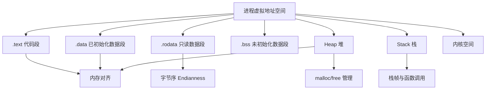
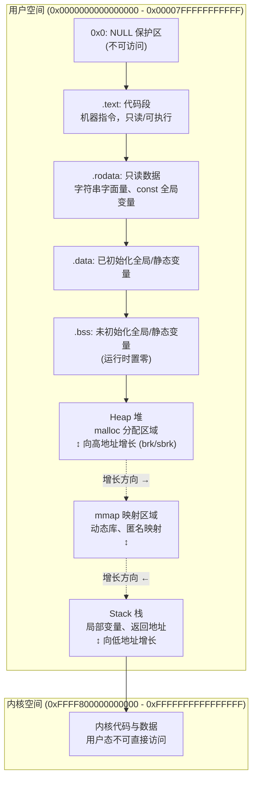
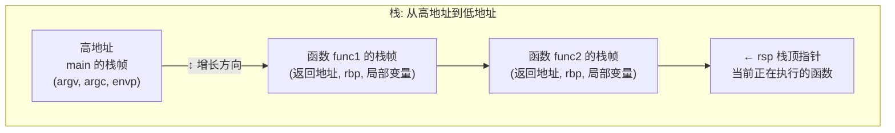
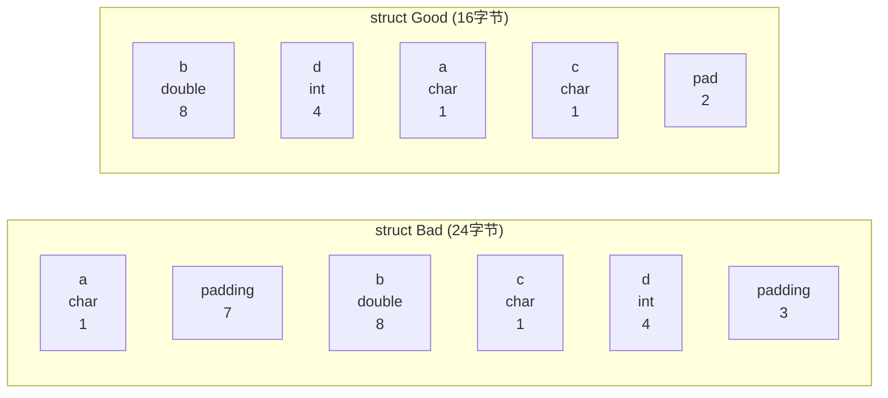

# 内存模型与布局 (Memory Model & Layout)
---

## 章节概述

> 本章从"程序运行时，内存里到底长什么样"这个根本问题出发，深入剖析 C 语言程序的内存布局。理解内存布局是理解指针行为、段错误原因、栈溢出、堆碎片化等一切底层问题的前提。建议同时阅读 和 。

每个 C 程序在运行时，操作系统为其分配一个**独立的虚拟地址空间**。这个空间被划分为多个段（Segment），每个段有不同的用途和访问权限。本章将从虚拟地址空间的完整布局开始，逐一剖析每个内存段，然后深入内存对齐、字节序等底层细节。

### 本章知识地图



---
### 第一节: 虚拟地址空间全景图
---

#### 1.1 64 位 Linux 进程的完整地址空间



> **关键观察**:
> - 栈和堆**相向增长**，中间是 mmap 区域——这种设计最大化可用内存
> - 地址空间的实际布局受到**ASLR**（地址空间布局随机化）影响，每次运行地址不同
> - 用户空间和内核空间的分界线取决于架构：x86-64 通常是 `0x00007FFFFFFFFFFF` / `0xFFFF800000000000`

#### 1.2 用代码验证各段的地址范围

```c
#include <stdio.h>
#include <stdlib.h>
#include <unistd.h>

// 全局变量——不同初始化状态的段
int global_init = 42; // .data
int global_zero; // .bss
const int global_const = 100; // .rodata
static int static_var = 99; // .data (static 只影响链接可见性)

const char *msg = "Hello"; // msg 在 .data, "Hello" 在 .rodata

int main(int argc, char **argv) {
 int stack_var = 10; // stack
 static int local_static = 50; // .data
 int *heap_var = malloc(sizeof(int)); // heap
 *heap_var = 20;

 printf("=== 虚拟地址空间布局 ===\n");
 printf(".text (main 函数): %18p\n", (void*)main);
 printf(".rodata (const 全局): %18p\n", (void*)&global_const);
 printf(".rodata (字符串字面量): %18p\n", (void*)msg);
 printf(".data (已初始化全局): %18p\n", (void*)&global_init);
 printf(".data (静态变量): %18p\n", (void*)&static_var);
 printf(".data (局部静态): %18p\n", (void*)&local_static);
 printf(".bss (未初始化全局): %18p\n", (void*)&global_zero);
 printf("heap (malloc): %18p\n", (void*)heap_var);
 printf("stack (局部变量): %18p\n", (void*)&stack_var);
 printf("stack (argv): %18p\n", (void*)argv);

 // 查看 /proc/self/maps 中的实际映射
 printf("\n=== /proc/self/maps 内容 ===\n");
 char cmd[64];
 snprintf(cmd, sizeof(cmd), "cat /proc/%d/maps", getpid());
 system(cmd);

 free(heap_var);
 return 0;
}
```

> 编译运行此程序，你会看到：
> - `.text`、`.rodata`、`.data`、`.bss` 地址接近（都在可执行文件加载区域内）
> - `heap` 地址比 .bss 高
> - `stack` 地址在最高区域（接近 0x7ffff...）
> - ASLR 导致每次运行地址都不同

#### 1.3 用 objdump/readelf 检验段

```bash
# 查看所有段（sections）
objdump -h a.out

# 查看更详细的信息
readelf -S a.out

# 查看段到段的映射（sections → segments）
readelf -l a.out

# 查看符号表
nm a.out

# 典型输出解读:
# Section .text: 代码段，flags = AX (Alloc + Execute)
# Section .rodata: 只读数据，flags = A (Alloc)
# Section .data: 已初始化数据，flags = WA (Write + Alloc)
# Section .bss: 未初始化数据，flags = WA, 但文件中不占空间
```

---
### 第二节: .text 代码段
---

#### 2.1 代码段的特点

`.text` 段包含编译后的机器指令。其权限是**读+执行（r-x）**，通常不包含写权限——这防止了自我修改代码（self-modifying code）和代码注入攻击。

```c
// 函数指针指向 .text 段
void hello(void) {
 printf("Hello\n");
}

// 试图修改代码段 → 段错误
void attempt_modify_code(void) {
 char *code = (char*)hello;
 // code[0] = 0x90; // 段错误! .text 是只读的（W^X 原则）
}
```

#### 2.2 汇编视角

```asm
# objdump -d a.out 可以看到 .text 段的内容:
# Disassembly of section .text:

# 0000000000001149 <main>:
# 1149: 55 push %rbp
# 114a: 48 89 e5 mov %rsp,%rbp
# 114d: 48 83 ec 10 sub $0x10,%rsp
# ...
```

> 每个函数的机器码按顺序排列在 `.text` 段中。函数指针的值就是 `.text` 段中的地址。详见 [[04_函数指针与回调|函数指针与回调]]。

---
### 第三节: .rodata 只读数据段
---

#### 3.1 什么数据进入 .rodata

```c
// 以下内容在 .rodata 段:
const int global_c = 100; // const 全局变量
const char *str = "world"; // "world" 在 .rodata, str 指针本身在 .data
char *bad_str = "hello"; // "hello" 在 .rodata（但指针不是const）

// 代码中的字符串字面量:
printf("format string\n"); // "format string\n" 在 .rodata

// 大数组如果标记为 const:
const int table[] = {1, 2, 3, 4, 5}; // 在 .rodata
```

```c
// 常见陷阱：修改字符串字面量
char *s = "hello";
s[0] = 'H'; // 段错误! "hello" 在 .rodata

// 正确做法：在栈上分配可修改的副本
char s[] = "hello"; // s 在栈上，从 .rodata 复制初始化
s[0] = 'H'; // OK
```

**汇编证据**:

```asm
# char *s = "hello";
# 汇编: "hello" 在 .rodata 标记为 .LC0
.section .rodata
.LC0:
 .string "hello"

# char s[] = "hello";
# 汇编: 在栈上分配6字节，从 .LC0 复制（或直接用立即数）
movabsq $0x6f6c6c6568, %rax # "hello" 的小端编码
movq %rax, -16(%rbp)
```

---
### 第四节: .data 已初始化数据段
---

#### 4.1 .data 的内容

`.data` 段存放**已初始化的**全局变量和静态变量（包括局部 static）。这些变量的初始值在可执行文件中以二进制形式存储。

```c
int global_a = 42; // .data
static int global_b = 100; // .data (static 只影响符号可见性)
const char *msg = "hi"; // msg 指针在 .data, "hi" 在 .rodata

void func(void) {
 static int call_count = 0; // .data (但名字在编译时被 mangled)
 call_count++;
}
```

**检查 .data 段**:

```bash
# 查看 .data 段的内容
objdump -s -j .data a.out

# 输出示例:
# Contents of section .data:
# 4020 2a000000 64000000 08204000 00000000 *...d.... @.....
# ^^^^ ^^^^ ^^^^^^^^
# global_a global_b msg指针的值
# =42=0x2a =100=0x64 =0x402008 (.rodata中"hi"的地址)
```

---
### 第五节: .bss 未初始化数据段
---

#### 5.1 .bss 的神奇特性

`.bss`（Block Started by Symbol）段存放**未初始化的**全局变量和静态变量。关键特性：**在可执行文件中不占空间**——只记录大小，加载时由操作系统分配并清零。

```c
int global_uninit; // .bss
static int static_uninit; // .bss

// 显式初始化为 0 的变量在某些编译器中也进入 .bss
int explicit_zero = 0; // 可能进入 .bss（优化）

// 大型未初始化数组
int large_buffer[1000000]; // .bss: 文件中不占4MB, 加载时分配
```

```bash
# 验证 .bss 不占文件空间
ls -l a.out # 查看文件大小
size a.out # 查看各段大小
# text data bss dec hex filename
# 1515 600 16 2131 853 a.out
# bss 的 16 字节说明有2个未初始化的 int (2*4=8) 加上对齐填充
```

> **为什么 .bss 要设计成这样？**
> 1. 减少可执行文件体积（大型数组只有声明没有初始值时，不在文件中重复存储零）
> 2. 加载时由操作系统一次性清零（通过 mmap 的匿名映射 + copy-on-write）
> 3. 历史原因：早期的 BSS 段来自 IBM 704 汇编器的一条伪指令

---
### 第六节: Heap 堆——动态内存区域
---

#### 6.1 堆的结构和增长方式

堆用于 `malloc`/`calloc`/`realloc` 分配的动态内存。堆从低地址向高地址增长（通过 `brk`/`sbrk` 系统调用扩展程序断点）。


```c
#include <stdio.h>
#include <stdlib.h>
#include <unistd.h>

int main() {
 printf("初始 program break: %p\n", sbrk(0));

 int *p1 = malloc(1024); // 分配 1KB
 printf("第一次 malloc 后: %p\n", sbrk(0));

 int *p2 = malloc(1024*1024); // 分配 1MB
 printf("第二次 malloc 后: %p\n", sbrk(0));

 free(p1);
 free(p2);
 // 注意: free 通常不会缩小 program break（内存不归还给OS）
 printf("free 后: %p\n", sbrk(0));

 return 0;
}
```

> **注意**: 大块内存（通常 >128KB）的 malloc 使用 `mmap` 而非 `brk`，释放时会立即归还给操作系统。详见 [[03_动态内存管理|动态内存管理]]。

#### 6.2 堆碎片化

```c
// 碎片化示例
void *a = malloc(100);
void *b = malloc(100);
void *c = malloc(100);
free(b); // b 释放了，但中间留下100字节的空洞
// malloc(150) 可能失败——即使总空闲200字节，但没有连续150字节的块
```

碎片化的详细分析和解决方法见 [[03_动态内存管理|动态内存管理]]。

---
### 第七节: Stack 栈——自动变量的家园
---

#### 7.1 栈的结构和增长方向

栈从高地址向**低地址增长**（在 x86/x86-64 上）。每次函数调用创建一个新的**栈帧（Stack Frame）**，存储局部变量、返回地址、保存的寄存器等。



#### 7.2 栈帧内部结构（x86-64）

```
高地址
┌─────────────────────┐
│ 调用者的 rbp │ ← 被保存的调用者的栈帧基址
├─────────────────────┤
│ 返回地址 │ ← call 指令压入的 rip
├─────────────────────┤
│ 局部变量 1 │
├─────────────────────┤
│ 局部变量 2 │
├─────────────────────┤
│ 被调用者保存寄存器 │ ← rbx, r12-r15 等
├─────────────────────┤
│ 函数参数（超出6个时） │
├─────────────────────┤
│ ... 红色区域 ... │ ← 128字节的"红色区域"(System V ABI)
├─────────────────────┤
│ ← rsp │ ← 当前栈顶
└─────────────────────┘
低地址
```

```c
// 观察栈帧信息
#include <stdio.h>

void func2(int x) {
 int local = x * 2;
 printf("func2: &local = %p, &x = %p\n",
 (void*)&local, (void*)&x);
 // x（参数）地址比 local 高（参数在栈帧上方）
}

void func1(int a) {
 int b = a + 1;
 printf("func1: &b = %p, &a = %p\n", (void*)&b, (void*)&a);
 func2(b);
}

int main() {
 int m = 10;
 printf("main: &m = %p\n", (void*)&m);
 func1(m);
 return 0;
}
// 输出观察: main 地址 > func1 地址 > func2 地址（栈向下增长）
```

#### 7.3 汇编视角：函数序言和尾声

```asm
# C 代码: void func(void) { int x = 42; }
# 汇编（x86-64 AT&T 语法）:

# 函数序言 (prologue):
pushq %rbp # 保存调用者的 rbp
movq %rsp, %rbp # 建立新的栈帧基址
subq $16, %rsp # 为局部变量分配空间

# 函数体:
movl $42, -4(%rbp) # int x = 42; (x 在 rbp-4 位置)

# 函数尾声 (epilogue):
leave # 等价于 mov %rbp,%rsp; pop %rbp
ret # 弹出返回地址并跳转
```

> 详细栈帧分析参见 。

#### 7.4 栈溢出

栈的大小是有限的（Linux 默认 8MB）。递归过深或大型局部数组会导致栈溢出。

```c
// 危险: 在栈上分配大型数组
void danger(void) {
 char huge_buffer[10 * 1024 * 1024]; // 10MB > 默认栈大小 8MB
 // 这会导致栈溢出——段错误
}

// 危险: 无限递归
void infinite_recursion(void) {
 int x; // 每次调用消耗栈空间
 infinite_recursion(); // 最终栈溢出
}

// 查看栈大小限制
// $ ulimit -s
// 8192 (KB)
```

```bash
# 可以用 ulimit 调整栈大小
ulimit -s unlimited # 不限制（不推荐）
ulimit -s 16384 # 设为 16MB

# 或者在编译时通过链接器设置
# gcc -Wl,-stack_size -Wl,0x2000000 ...
```

---
### 第八节: 内存对齐（Alignment）
---

#### 8.1 为什么需要内存对齐

CPU 从内存读取数据时不是按字节读，而是按**字（word）**或**缓存行（cache line）**读取。如果数据跨越了自然边界，CPU 需要两次内存访问来组装数据——这就是 **misaligned access** 的代价。某些架构（如旧版 ARM）甚至直接拒绝非对齐访问。

```
对齐访问（4字节 int 在地址 0x1000，4整除）:
┌──────┬──────┬──────┬──────┐
│ 0x1000│ 0x1001│ 0x1002│ 0x1003│ ← 一次内存读取
└──────┴──────┴──────┴──────┘

非对齐访问（4字节 int 在地址 0x1001）:
┌──────┬──────┬──────┬──────┬──────┐
│ 0x1000│ 0x1001│ 0x1002│ 0x1003│ 0x1004│
└──────┴──────┴──────┴──────┴──────┘
 ← 需要两次读取 + 移位 + 合并 →
```

#### 8.2 对齐规则

| 类型 | sizeof | 对齐要求 |
|------|--------|----------|
| char | 1 | 1 字节对齐 |
| short | 2 | 2 字节对齐 |
| int | 4 | 4 字节对齐 |
| long | 8 | 8 字节对齐 |
| float | 4 | 4 字节对齐 |
| double | 8 | 8 字节对齐 |
| void* | 8 | 8 字节对齐 |
| long double | 16 | 16 字节对齐 |

结构体的对齐规则：**每个成员的偏移量必须是对其类型对齐要求的倍数。结构体的总大小必须是最大对齐要求的倍数。**

```c
#include <stdio.h>
#include <stddef.h> // offsetof 宏

// 糟糕的布局: 24 字节
struct Bad {
 char a; // 1 字节, offset 0
 // padding 7 字节
 double b; // 8 字节, offset 8 (必须是8的倍数)
 char c; // 1 字节, offset 16
 // padding 7 字节 (结构体总大小=24, 是8的倍数)
 int d; // 4 字节, offset 20
 // padding 0
};

// 优化的布局: 16 字节
struct Good {
 double b; // 8 字节, offset 0
 int d; // 4 字节, offset 8
 char a; // 1 字节, offset 12
 char c; // 1 字节, offset 13
 // padding 2 字节 (总大小16, 是8的倍数)
};

int main() {
 printf("sizeof(Bad) = %zu\n", sizeof(struct Bad)); // 24
 printf("sizeof(Good) = %zu\n", sizeof(struct Good)); // 16
 printf("offsetof(Bad, b) = %zu\n", offsetof(struct Bad, b)); // 8
 printf("offsetof(Bad, d) = %zu\n", offsetof(struct Bad, d)); // 20
 return 0;
}
```



#### 8.3 alignas 和 alignof（C11）

```c
#include <stdalign.h> // C11

// alignof: 查询类型的对齐要求
printf("alignof(int) = %zu\n", alignof(int)); // 4
printf("alignof(double) = %zu\n", alignof(double)); // 8

// alignas: 指定对齐
alignas(64) int cache_line_aligned; // 64字节对齐（用于缓存行优化）

// 结构体的 alignas
struct alignas(32) AlignedStruct { // 整个结构体 32 字节对齐
 int x;
 double y;
};
```

> `alignas` 只能增大对齐（不能减小），且必须是 2 的幂。在嵌入式和高性能计算中，对齐对于 SIMD 指令（需要 16/32 字节对齐）和 cache line 优化至关重要。

#### 8.4 动态内存的对齐

```c
// malloc 保证返回的指针对所有基本类型都对齐（通常是16字节）
int *p = malloc(sizeof(int)); // 在 x86-64 上保证至少16字节对齐

// 需要特殊对齐时用 aligned_alloc (C11) 或 posix_memalign (POSIX)
#include <stdlib.h>
void *p = aligned_alloc(64, 1024); // 64字节对齐，分配1024字节
// 或
void *p2;
posix_memalign(&p2, 64, 1024); // POSIX 版本
```

---
### 第九节: 字节序——大小端之争
---

#### 9.1 大端和小端的定义

**字节序（Endianness）** 决定了多字节数据在内存中的字节排列顺序。

| | 大端 (Big-Endian) | 小端 (Little-Endian) |
|------|------|------|
| 规则 | 高位字节在低地址 | 低位字节在低地址 |
| 直观性 | 与人类阅读顺序一致 | 与数学低位在前一致 |
| 典型架构 | SPARC, PowerPC, 网络字节序 | x86, x86-64, ARM (默认) |
| 数字 0x12345678 | 0x12 0x34 0x56 0x78 | 0x78 0x56 0x34 0x12 |


#### 9.2 检测本机字节序

```c
#include <stdio.h>

int main() {
 // 方法1: 利用类型双关
 unsigned int x = 0x12345678;
 unsigned char *p = (unsigned char*)&x;

 printf("int 0x12345678 在内存中的字节序列:\n");
 for (int i = 0; i < 4; i++) {
 printf(" 地址 %p: 0x%02x\n", (void*)(p+i), p[i]);
 }

 if (p[0] == 0x78) {
 printf("→ 小端 (Little-Endian)\n");
 } else if (p[0] == 0x12) {
 printf("→ 大端 (Big-Endian)\n");
 }

 // 方法2: 联合体技巧
 union {
 unsigned int i;
 unsigned char c[4];
 } u = {0x01020304};
 printf("联合体方式: %s\n", u.c[0] == 0x04 ? "小端" : "大端");

 return 0;
}
// 在 x86-64 上输出: 小端
```

#### 9.3 字节序对 C 编程的实际影响

```c
// 场景1: 网络编程——必须转换字节序
#include <arpa/inet.h>
uint32_t host_val = 0x12345678;
uint32_t net_val = htonl(host_val); // 转为大端（网络字节序）
uint32_t back_val = ntohl(net_val); // 转回主机字节序

// 场景2: 二进制文件读写——跨平台兼容
// 写入文件时必须约定字节序:
void write_int32_bigendian(FILE *f, int32_t val) {
 uint32_t net = htonl((uint32_t)val);
 fwrite(&net, sizeof(net), 1, f);
}

// 场景3: 位域在不同字节序平台上的表现不同
struct Flags {
 unsigned int flag1 : 1; // 小端: 最低位; 大端: 最高位
 unsigned int flag2 : 1;
 unsigned int flag3 : 1;
 unsigned int reserved : 29;
};
// 此结构体在不同字节序平台上内存布局完全不同！
```

> **重要**: 字节序问题在跨平台开发、网络编程、嵌入式系统中是常见的 bug 来源。永远不要假设目标平台是小端——即使 x86 占据了绝大部分市场。

---
### 第十节: 内存屏障与编译器重排
---

#### 10.1 编译器优化的危险

编译器为了提高性能，可能重排内存操作。在单线程中这是安全的（as-if 规则），但在多线程/信号处理/Memory-Mapped I/O 中会导致灾难。

```c
#include <signal.h>
#include <stdatomic.h> // C11 原子操作

volatile sig_atomic_t flag = 0; // volatile 告诉编译器每次都从内存读取

void handler(int sig) {
 flag = 1; // 信号处理器中修改
}

int main() {
 signal(SIGINT, handler);
 while (!flag) {
 // 不加 volatile, 编译器可能优化为:
 // mov flag, %eax; loop: test %eax,%eax; jz loop
 // 永远看不到 handler 的修改!
 }
 printf("检测到信号\n");
 return 0;
}
```

> `volatile` 禁止编译器优化该变量的访问（强制每次读写都访问内存），但它**不提供原子性**——在多线程环境中，仍需使用 `_Atomic` 或互斥锁。

#### 10.2 内存屏障

```c
// C11 原子操作提供内存序
atomic_int ready = 0;
int data = 0;

// 线程1 (写者):
void writer(void) {
 data = 42;
 atomic_store_explicit(&ready, 1, memory_order_release);
 // release 语义: 保证 data = 42 在 ready = 1 之前对其他线程可见
}

// 线程2 (读者):
void reader(void) {
 while (atomic_load_explicit(&ready, memory_order_acquire) == 0)
 ;
 // acquire 语义: 保证看到 ready = 1 时, data = 42 也可见
 printf("data = %d\n", data); // 保证输出 42
}
```

> 内存序（memory order）是 C11 并发模型的核心，详见 `<stdatomic.h>`。汇编层面的屏障指令包括 `mfence`（x86）和 `dmb`（ARM）。

---
### 第十一节: 综合实战——用 gdb 探索内存
---

```bash
# 编译调试版本
gcc -g -O0 -o memory_explore memory.c

# 启动 gdb
gdb ./memory_explore

# 在 gdb 中:
(gdb) info proc mappings # 查看完整内存映射
(gdb) info files # 查看段信息
(gdb) p &global_init # 查看变量地址
(gdb) info registers # 查看寄存器
(gdb) x/16xb &global_init # 以16进制查看内存
(gdb) disas main # 反汇编 main 函数

# 查看栈帧
(gdb) bt # 回溯
(gdb) info frame # 当前帧信息
(gdb) info locals # 局部变量
```

完整 gdb 调试指南参考 [[03_动态内存管理|动态内存管理]] 中的调试部分。

---

## 章节测试

### 判断题（共10题）

> [!question] 判断题 1
> `.bss` 段的数据在可执行文件中占用磁盘空间。 （ ）
> - [ ] 正确
> - [ ] 错误
>
> > [!success]- 点击查看答案
> > 答案: 错误
> >
> > **解析**: .bss 段只记录需要的大小，实际不占用可执行文件的磁盘空间。加载时由操作系统分配物理内存并清零。

> [!question] 判断题 2
> 栈从高地址向低地址增长。 （ ）
> - [ ] 正确
> - [ ] 错误
>
> > [!success]- 点击查看答案
> > 答案: 正确
> >
> > **解析**: 在 x86/x86-64 架构上，栈确实向低地址增长。`push` 指令会减小 rsp。

> [!question] 判断题 3
> `const int x = 42;` 在全局作用域中定义的 x 存储在 `.data` 段。 （ ）
> - [ ] 正确
> - [ ] 错误
>
> > [!success]- 点击查看答案
> > 答案: 错误
> >
> > **解析**: const 全局变量存储在 `.rodata`（只读数据段），不是 `.data`。`.data` 存储可写的已初始化全局变量。

> [!question] 判断题 4
> 在 x86-64 上，malloc 返回的指针至少保证 16 字节对齐。 （ ）
> - [ ] 正确
> - [ ] 错误
>
> > [!success]- 点击查看答案
> > 答案: 正确
> >
> > **解析**: System V ABI 要求 malloc 返回 16 字节对齐的指针，以便兼容 SSE 指令（需要 16 字节对齐的 movaps 指令）。

> [!question] 判断题 5
> 联合体（union）的大小等于其最大成员的大小。 （ ）
> - [ ] 正确
> - [ ] 错误
>
> > [!success]- 点击查看答案
> > 答案: 正确
> >
> > **解析**: 联合体的所有成员共享同一块内存，其大小等于最大成员的大小（加上可能的对齐填充）。这决定了 `sizeof(union)` 的结果。

> [!question] 判断题 6
> x86 架构使用大端字节序。 （ ）
> - [ ] 正确
> - [ ] 错误
>
> > [!success]- 点击查看答案
> > 答案: 错误
> >
> > **解析**: x86/x86-64 使用小端（Little-Endian）字节序。网络协议（TCP/IP）使用大端，SPARC/PowerPC 使用大端。

> [!question] 判断题 7
> `static` 局部变量存储在栈上。 （ ）
> - [ ] 正确
> - [ ] 错误
>
> > [!success]- 点击查看答案
> > 答案: 错误
> >
> > **解析**: static 局部变量存储在 `.data` 或 `.bss` 段（取决于是否初始化），与全局变量的存储位置相同。它的生命周期是整个程序运行期间，不是函数调用期间。

> [!question] 判断题 8
> 内存对齐只影响性能，不影响正确性。 （ ）
> - [ ] 正确
> - [ ] 错误
>
> > [!success]- 点击查看答案
> > 答案: 错误
> >
> > **解析**: 在 x86 上确实只影响性能（硬件会自动处理非对齐访问），但在某些架构（旧版 ARM、SPARC）上，非对齐访问会导致硬件异常（bus error），程序直接崩溃。

> [!question] 判断题 9
> 函数内的局部变量存储在堆上。 （ ）
> - [ ] 正确
> - [ ] 错误
>
> > [!success]- 点击查看答案
> > 答案: 错误
> >
> > **解析**: 局部变量（非 static）存储在栈上。堆上存储的是通过 malloc/calloc/realloc 分配的内存。

> [!question] 判断题 10
> `volatile` 关键字确保多线程访问变量的原子性。 （ ）
> - [ ] 正确
> - [ ] 错误
>
> > [!success]- 点击查看答案
> > 答案: 错误
> >
> > **解析**: volatile 只确保每次读写都访问内存（禁止编译器优化和缓存），不提供原子性保证。多线程原子操作需要使用 `_Atomic`（C11）或互斥锁。

### 选择题（共10题）

> [!question] 选择题 1
> 在 x86-64 Linux 上，以下哪个地址范围通常属于用户空间？
> - [ ] A. `0xFFFF800000000000` 及以上
> - [ ] B. `0x00007FFFFFFFFFFF` 及以下
> - [ ] C. `0x8000000000000000` 及以上
> - [ ] D. `0xFFFFFFFFFFFFFFFF`
>
> > [!success]- 点击查看答案
> > 正确答案: B
> >
> > **解析**: 在 x86-64 Linux 上，用户空间是 0x0 到 0x00007FFFFFFFFFFF，内核空间是 0xFFFF800000000000 到 0xFFFFFFFFFFFFFFFF。中间是巨大的"空洞"（non-canonical 地址）。

> [!question] 选择题 2
> 以下变量中，哪一个存储在 `.rodata` 段？
> - [ ] A. `int x = 10;`（全局变量）
> - [ ] B. `char *s = "world";` 中的 s
> - [ ] C. `const int y = 20;`（全局变量）
> - [ ] D. `static int z = 30;`
>
> > [!success]- 点击查看答案
> > 正确答案: C
> >
> > **解析**: C (`const int y = 20;`) 是 const 全局变量，进入 `.rodata`。A 进入 `.data`。B 中 s（指针本身）进入 `.data`，"world" 进入 `.rodata`。D 进入 `.data`。

> [!question] 选择题 3
> 以下结构体在 x86-64 上的 sizeof 是？
> ```c
> struct S {
> char a;
> int b;
> char c;
> };
> ```
> - [ ] A. 6
> - [ ] B. 8
> - [ ] C. 12
> - [ ] D. 16
>
> > [!success]- 点击查看答案
> > 正确答案: C
> >
> > **解析**: `char a` offset 0 (1B), padding 3B, `int b` offset 4 (4B), `char c` offset 8 (1B), padding 3B 使总大小为12（最大对齐为4的倍数）。布局: [a][_][_][_][b][b][b][b][c][_][_][_]。

> [!question] 选择题 4
> 数字 `0xDEADBEEF` 在小端机器上的内存排列是：
> - [ ] A. DE AD BE EF
> - [ ] B. EF BE AD DE
> - [ ] C. DE AD BE EF 或 EF BE AD DE（取决于编译器）
> - [ ] D. 随机排列
>
> > [!success]- 点击查看答案
> > 正确答案: B
> >
> > **解析**: 小端意味着最低位字节在最低地址。0xDEADBEEF 的最低字节是 0xEF，所以内存排列为 EF BE AD DE。

> [!question] 选择题 5
> 以下哪个工具可以查看可执行文件各段的大小？
> - [ ] A. `ldd`
> - [ ] B. `size`
> - [ ] C. `nm`
> - [ ] D. `strace`
>
> > [!success]- 点击查看答案
> > 正确答案: B
> >
> > **解析**: `size` 命令显示 text/data/bss 段的大小。`ldd` 显示动态库依赖，`nm` 显示符号表，`strace` 追踪系统调用。

> [!question] 选择题 6
> 以下哪个操作最容易导致栈溢出？
> - [ ] A. malloc(100MB)
> - [ ] B. 在函数内声明 `char buf[100*1024*1024];`
> - [ ] C. 声明全局数组 `char buf[100*1024*1024];`
> - [ ] D. 使用 calloc
>
> > [!success]- 点击查看答案
> > 正确答案: B
> >
> > **解析**: 函数内声明的大型局部数组分配在栈上，默认栈大小仅 8MB，100MB 远超限制，导致栈溢出。C 在 .bss 段，由 OS 加载时分配，不受栈大小限制。

> [!question] 选择题 7
> `offsetof(struct S, member)` 宏定义在哪个头文件中？
> - [ ] A. `<stdio.h>`
> - [ ] B. `<stdlib.h>`
> - [ ] C. `<stddef.h>`
> - [ ] D. `<string.h>`
>
> > [!success]- 点击查看答案
> > 正确答案: C
> >
> > **解析**: `offsetof` 宏定义在 `<stddef.h>`。它返回成员在结构体中的字节偏移量，利用编译器内置函数实现。

> [!question] 选择题 8
> 关于 `volatile` 关键字，以下哪项正确？
> - [ ] A. 保证多线程读写安全
> - [ ] B. 防止编译器优化掉对该变量的访问
> - [ ] C. 保证原子性操作
> - [ ] D. 将变量放在 .rodata 段
>
> > [!success]- 点击查看答案
> > 正确答案: B
> >
> > **解析**: volatile 告诉编译器"每次读写这个变量都必须从内存中读取，不要优化到寄存器中"。它不提供原子性（多线程安全需要 `_Atomic` 或锁），不改变变量的存储位置。

> [!question] 选择题 9
> 在 C 语言中，字符串字面量 `"hello"` 存储在哪里？
> - [ ] A. 栈
> - [ ] B. 堆
> - [ ] C. `.data` 段
> - [ ] D. `.rodata` 段
>
> > [!success]- 点击查看答案
> > 正确答案: D
> >
> > **解析**: 字符串字面量是只读的，存储在 `.rodata` 段。试图修改字符串字面量（如 `char *s = "hello"; s[0] = 'H';`）会导致段错误。

> [!question] 选择题 10
> 函数调用时，栈帧中第一个被压入的内容通常是：
> - [ ] A. 局部变量
> - [ ] B. 调用者的 rbp（栈帧基址）
> - [ ] C. 返回地址
> - [ ] D. 函数参数
>
> > [!success]- 点击查看答案
> > 正确答案: C
> >
> > **解析**: `call` 指令自动将返回地址（下一条指令的地址）压入栈中。这是硬件级别的操作。然后函数序言中 `push %rbp` 保存调用者的栈帧基址。

---

### 编程练习题

> [!example] 练习 1：内存布局探测器
> **难度**: 简单
>
> 编写程序打印所有内存段的典型地址：
> - 打印 main 函数地址（.text）
> - 打印全局已初始化/未初始化变量地址（.data/.bss）
> - 打印 const 全局变量地址（.rodata）
> - 打印局部变量地址（stack）
> - 打印 malloc 分配的地址（heap）
> - 多次运行观察 ASLR 效果
> - 读取 `/proc/self/maps` 验证你的观察
> - 使用 `objdump -h` 和 `size` 检查编译后的程序

> [!example] 练习 2：结构体内存布局分析
> **难度**: 简单
>
> 实现一个结构体布局分析工具：
> - 定义多个不同成员排列的结构体
> - 使用 `sizeof` 和 `offsetof` 输出每个成员的偏移量和总大小
> - 画出内存布局图（用 ASCII 或 mermaid）
> - 优化成员排列使结构体最小
> - 验证 `__attribute__((packed))` 的效果（GCC 扩展）
> - 比较 `#pragma pack(1)` 的效果

> [!example] 练习 3：字节序检测与转换
> **难度**: 简单
>
> 实现一个完整的字节序工具库：
> - 检测本机字节序
> - 实现 `htonl/ntohl/htons/ntohs` 的纯 C 版本（使用位操作，不调用库函数）
> - 实现 `write_int32_le(FILE*, int32_t)` 和 `read_int32_le(FILE*)` 用于小端文件
> - 实现 `write_int32_be(FILE*, int32_t)` 和 `read_int32_be(FILE*)` 用于大端文件
> - 测试：写入一个文件，用 hexdump 验证字节序，再读回验证数据正确
> - 处理不同大小的整数类型（int16_t, int32_t, int64_t）

---

## 知识网络

- **前置章节**: [[01_指针深度剖析|指针深度剖析]] — 理解指针才能理解内存地址
- **同系列后续**: [[03_动态内存管理|动态内存管理]] — 堆内存管理的深入讨论
- **汇编参考**: — MMU、虚拟内存物理实现
- **汇编参考**: — 栈帧的汇编细节
- **汇编参考**: — ELF 格式的段与节
- **汇编参考**: — CPU 架构与寄存器
- **C++ 对比**: [[../../cpp教程/cpp深化教程/03_指针与引用|CPP: 指针与引用]] — C++ 的对象内存布局 vtable
- **C++ 对比**: [[../../cpp教程/cpp深化教程/05_面向对象(一)类与对象基础|CPP: 类与对象基础]] — 类对象的内存布局
