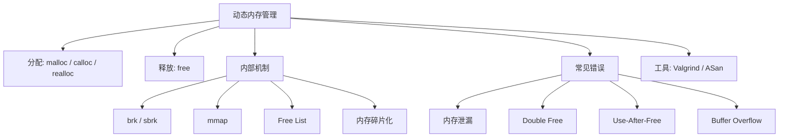
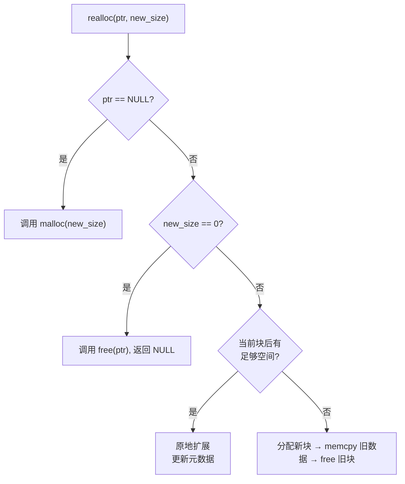
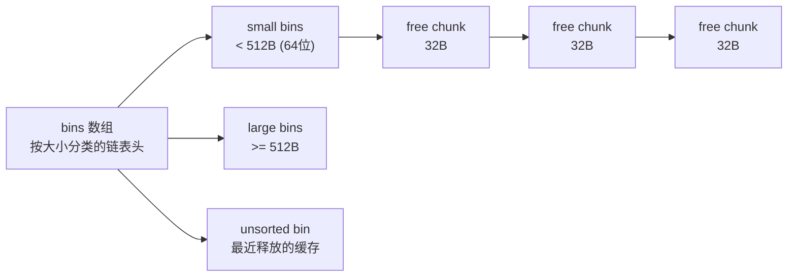

# 动态内存管理  (Dynamic Memory Management)
---

##  章节概述

>  栈上的自动变量随函数调用而生、随函数返回而亡。但许多场景需要**跨函数生存、运行时决定大小**的内存——这就是动态内存（堆内存）的用武之地。本章深入 malloc/free 的内部机制、常见错误及其排查方法，并从零实现一个简易内存分配器。建议先阅读 [[02_内存模型与布局|内存模型与布局]] 理解堆在虚拟地址空间中的位置。

C 语言的动态内存管理函数只有四个——`malloc`、`calloc`、`realloc`、`free`——极其简洁，但也因此把所有的责任（和风险）交给了程序员。与 [[../../cpp教程/cpp深化教程/04_动态内存|CPP: 动态内存]] 中的 `new`/`delete` 和智能指针不同， 更是从语言层面消灭了悬空指针和内存泄漏——理解 C 的原始机制是理解所有这些高级抽象的前提。

### 本章知识地图



---
###  第一节: 四大内存函数精讲
---

#### 1.1 malloc — Memory Allocate

```c
#include <stdlib.h>

void *malloc(size_t size);
// 分配 size 字节的未初始化内存
// 成功：返回指向分配内存的指针（至少基本对齐）
// 失败：返回 NULL
```

```c
// 标准用法
int *arr = malloc(100 * sizeof(int));
if (arr == NULL) {
    // 必须检查返回值！内存不足时 malloc 返回 NULL
    perror("malloc failed");
    exit(EXIT_FAILURE);
}
// 使用 arr...
free(arr);
```

**为什么用 `sizeof(int)` 而不是硬编码 4？**
```c
// 坏写法: 假设 int 是 4 字节
int *p = malloc(100 * 4);  // 在 int=2 字节的平台上分配不足

// 好写法: 让编译器计算
int *p = malloc(100 * sizeof(int));  // 始终正确

// 更好: 使用解引用
int *p = malloc(100 * sizeof(*p));   // 如果类型改变，自动调整
```

>  `sizeof(*p)` 模式: `sizeof(*p)` 等于 `sizeof(int)`，但如果将来 `p` 的类型改为 `long*`，这个表达式自动调整——**自文档化且防重构错误**。

#### 1.2 calloc — Clear Allocate

```c
void *calloc(size_t nmemb, size_t size);
// 分配 nmemb * size 字节，并将内存清零
// 相当于 malloc + memset(0)

int *arr = calloc(100, sizeof(int));  // 所有元素初始化为 0
// 等价于:
// int *arr = malloc(100 * sizeof(int));
// memset(arr, 0, 100 * sizeof(int));
```

**calloc 的优势**:
1. **零初始化**：避免读取未初始化内存的未定义行为
2. **溢出检查**：calloc 会检查 `nmemb * size` 是否溢出，溢出了返回 NULL
3. **懒分配**：某些 OS 上 calloc 利用 COW（Copy-On-Write）只在实际写入时才分配物理页

> 与 [[../../cpp教程/cpp深化教程/04_动态内存|CPP: 动态内存]] 中 `new int[100]()` 的零初始化语义类似。

#### 1.3 realloc — Reallocate

```c
void *realloc(void *ptr, size_t new_size);
// 调整已分配内存块的大小
// ptr == NULL 时等效于 malloc(new_size)
// new_size == 0 时行为是实现定义的（可能等效于 free(ptr)）

int *arr = malloc(10 * sizeof(int));
// ... 使用 arr，发现需要更多空间 ...
int *tmp = realloc(arr, 20 * sizeof(int));
if (tmp == NULL) {
    // realloc 失败时，原内存块仍然有效！
    free(arr);  // 必须处理失败情况
    exit(EXIT_FAILURE);
}
arr = tmp;  // 成功后才覆盖原指针
```

> ️ **关键技巧**: 不要直接 `arr = realloc(arr, size)`——如果 realloc 失败返回 NULL，你丢失了原指针，造成内存泄漏。总是使用临时变量。

```c
//  危险写法
arr = realloc(arr, 20 * sizeof(int));

//  安全写法
void *tmp = realloc(arr, 20 * sizeof(int));
if (tmp) arr = tmp;
else { /* 处理失败 */ }
```

**realloc 的内部操作**:



#### 1.4 free — 释放内存

```c
void free(void *ptr);
// 释放之前 malloc/calloc/realloc 分配的内存
// ptr == NULL 时什么都不做（安全）

int *p = malloc(100);
free(p);        // 释放内存
p = NULL;       // 防止悬空指针（最佳实践）
```

>  **free 的必要性**: 不像 Java/Go/Python，C 没有垃圾回收（GC）。忘记 free 会导致**内存泄漏**——内存在程序退出前永远不会被回收。

---
###  第二节: malloc 内部原理
---

#### 2.1 两种内存获取方式


```c
#include <unistd.h>
#include <stdio.h>
#include <stdlib.h>

int main() {
    printf("初始 brk: %p\n", sbrk(0));

    // 小分配 → 使用 brk
    void *p1 = malloc(1024);
    printf("1KB 后 brk: %p\n", sbrk(0));

    // 大分配 → 使用 mmap (不改变 brk)
    void *p2 = malloc(1024 * 1024);  // 1MB
    printf("1MB 后 brk: %p\n", sbrk(0));   // brk 不变!

    free(p1);
    free(p2);
    // 注意: free(p1) 通常不会缩小 brk
    return 0;
}
```

#### 2.2 malloc chunk 结构

glibc 的 malloc 使用巧妙的数据结构管理堆内存。每个已分配或空闲的内存块前有一个**chunk header**：

```
┌──────────────┐ ← 返回给用户的指针 (mem)
│ prev_size    │ (前一个 chunk 的大小，当前一个空闲时)
│ size         │ (本 chunk 的大小 + 标志位)
│ fd (next)    │ (空闲时用于 free list)
│ bk (prev)    │ (空闲时用于 free list)
│ user data...  │
│ ...          │
└──────────────┘
```

```c
// 概念代码（非实际 glibc 源码）:
struct malloc_chunk {
    size_t prev_size;    // 前一个 chunk 的大小
    size_t size;         // 本 chunk 大小 | flags (最低3位)
    // flags: bit 0 = PREV_INUSE (前一个 chunk 是否在使用)
    //        bit 1 = IS_MMAPPED (是否是 mmap 分配的)
    //        bit 2 = NON_MAIN_ARENA

    // 以下字段仅在空闲 chunk 中存在
    struct malloc_chunk *fd;  // 前向指针 (free list)
    struct malloc_chunk *bk;  // 后向指针 (free list)

    // 大块还有:
    struct malloc_chunk *fd_nextsize;
    struct malloc_chunk *bk_nextsize;
};
```

>  **对齐要求**: chunk size 总是 16 字节（64 位）或 8 字节（32 位）的倍数。最低 3 位用作标识位。

#### 2.3 Free List（空闲链表）

释放的 chunk 不立即归还操作系统，而是加入**空闲链表**，供后续 malloc 重用：



> malloc 首先检查 free list 中是否有合适大小的空闲块（**first-fit** 或 **best-fit** 策略），没有才通过 brk/mmap 向操作系统申请新内存。

#### 2.4 内存碎片化

```c
// 碎片化演示
void demonstrate_fragmentation(void) {
    void *a = malloc(256);
    void *b = malloc(256);
    void *c = malloc(256);
    void *d = malloc(256);

    free(b);  // 释放第二个块
    free(c);  // 释放第三个块
    // 现在有 512 字节的空闲内存，但分散在两个 256 字节的块中

    // malloc(512) 可能失败！
    // 两个 256B 的空闲块不连续，无法合并（中间被 a 和 d 分隔）
    void *e = malloc(512);  // 可能需要扩展 brk
}
```


---
###  第三节: 常见错误与排查
---

#### 3.1 内存泄漏（Memory Leak）

```c
void leak_example(void) {
    int *p = malloc(100 * sizeof(int));  // 分配内存
    // 使用 p...
    // 忘记 free(p) —— 内存泄漏!
    return;
    // 函数返回后，p 被销毁，但分配的内存仍然占用
    // 每个泄漏的字节在程序退出前都无法被重用
}

void subtle_leak(void) {
    int *p = malloc(100 * sizeof(int));
    p = malloc(200 * sizeof(int));  // 重新赋值——第一个100int泄漏!
    free(p);  // 只释放了第二个
}
```

#### 3.2 双重释放（Double Free）

```c
int *p = malloc(100);
free(p);
free(p);  // 未定义行为! 双重释放
// 可能导致: 堆损坏、程序崩溃、安全漏洞

// 防护措施
free(p);
p = NULL;      // 下次 free(NULL) 是安全的
```

**为什么 double free 危险?** 第一次 free 将内存归还 free list，chunk 的 fd/bk 指针被修改。第二次 free 基于被污染的 chunk 操作 free list，导致链表损坏。

#### 3.3 释放后使用（Use-After-Free）

```c
int *p = malloc(sizeof(int));
*p = 42;
free(p);
*p = 100;      // 未定义行为! 释放后使用
// 该内存可能已被其他分配重用！
// 写入可能破坏不相关的变量！
```

```c
// 更隐蔽的 use-after-free
struct Node {
    int data;
    struct Node *next;
};

struct Node *n1 = malloc(sizeof(struct Node));
struct Node *n2 = malloc(sizeof(struct Node));
n1->next = n2;
free(n1);
// n1->next 是悬空指针，但 n1->next->data 可能"碰巧"可用
// 如果 n1 的内存被另一个 malloc 重用为 int* 呢？
```

#### 3.4 缓冲区溢出（Buffer Overflow）

```c
int *arr = malloc(10 * sizeof(int));
for (int i = 0; i <= 10; i++) {    // 错误！ i <= 10 越界
    arr[i] = i;                      // arr[10] 写入越界！
}
// 可能破坏相邻 chunk 的 header → 导致 free() 时崩溃
```

**堆溢出的杀伤力**: 堆上相邻分配的是 chunk header（包含 size 和 fd/bk），溢出可能覆盖这些元数据，导致后续 malloc/free 操作执行攻击者控制的内存写入。

---
###  第四节: 调试工具——Valgrind 与 AddressSanitizer
---

#### 4.1 Valgrind Memcheck

Valgrind 是 C/C++ 内存调试的"黄金标准"。

```bash
# 编译（带调试信息，关闭优化以获得准确行号）
gcc -g -O0 -o myprogram myprogram.c

# 运行 Valgrind
valgrind --leak-check=full ./myprogram

# 典型输出:
# ==12345== Invalid write of size 4
# ==12345==    at 0x401234: main (myprogram.c:15)
# ==12345==  Address 0x5204064 is 0 bytes after a block of size 40 alloc'd
# ==12345==    at 0x4C2FB0F: malloc (vg_replace_malloc.c:299)
# ==12345==    by 0x401210: main (myprogram.c:10)

# ==12345== 40 bytes in 1 blocks are definitely lost
# ==12345==    at 0x4C2FB0F: malloc (vg_replace_malloc.c:299)
# ==12345==    by 0x401210: main (myprogram.c:10)
```

**Valgrind 检测的错误类型**:

| 错误类型 | 描述 | Valgrind 术语 |
|----------|------|---------------|
| 堆缓冲区溢出 | 写入超出分配范围 | Invalid write |
| 堆缓冲区读越界 | 读取超出分配范围 | Invalid read |
| 释放后使用 | free 后仍然访问 | Invalid read/write |
| 双重释放 | free 同一个指针两次 | Invalid free |
| 内存泄漏 | 分配的内存未释放 | definitely/indirectly lost |
| 未初始化值使用 | 依赖未写入的内存 | Conditional jump depends on uninitialised |

#### 4.2 AddressSanitizer (ASan)

ASan 是编译器内置的内存错误检测器，比 Valgrind 快 2-5 倍（但增加约 2 倍内存开销）。

```bash
# 编译时启用 ASan
gcc -fsanitize=address -g -O0 -o myprogram myprogram.c

# 直接运行，错误会被自动报告
./myprogram

# 输出示例:
# =================================================================
# ==12345==ERROR: AddressSanitizer: heap-buffer-overflow
# READ of size 4 at 0x60200000eff4 thread T0
#     #0 0x401234 in main myprogram.c:15
# 0x60200000eff4 is located 0 bytes to the right of 40-byte region
# =================================================================
```

**Valgrind vs ASan 对比**:

| 特性 | Valgrind | AddressSanitizer |
|------|----------|------------------|
| 速度 | 慢（~20x 减速） | 较快（~2x 减速） |
| 需要重编译 | 否（二进制插桩） | 是（编译时插桩） |
| 内存泄漏检测 |  优秀 |  可用（-fsanitize=leak） |
| 栈溢出检测 |  |  |
| 全局变量溢出 |  |  |
| 精确度 | 高 | 高 |

> 建议两者都使用——日常开发用 ASan（快），提交前用 Valgrind 做完整检查。

#### 4.3 实战调试示例

```c
// buggy.c — 包含多种内存错误
#include <stdlib.h>

int main() {
    // 错误1: 缓冲区溢出
    int *arr = malloc(5 * sizeof(int));
    arr[5] = 42;  // 写入 arr[5] — 越界!

    // 错误2: 内存泄漏
    int *leaked = malloc(100);

    // 错误3: 释放后使用
    int *p = malloc(sizeof(int));
    *p = 10;
    free(p);
    *p = 20;      // 释放后使用!

    free(arr);    // 可能因 chunk header 损坏而崩溃
    return 0;
}
```

```bash
# 使用 ASan 检测
gcc -fsanitize=address -g -O0 -o buggy buggy.c
./buggy
# ASan 会精确报告每种错误的位置和原因
```

---
###  第五节: 实现简易内存分配器
---

理解 malloc 的最好方式是亲手实现一个。以下是基于 Free List 的简易分配器：

```c
#include <unistd.h>
#include <stddef.h>
#include <stdint.h>

// 内存块头
typedef struct block {
    size_t size;           // 块大小（不含 header）
    int free;              // 1=空闲, 0=已分配
    struct block *next;    // 下一个空闲块
} block_t;

#define BLOCK_SIZE sizeof(block_t)
#define ALIGN 8  // 8字节对齐

// 空闲链表头
static block_t *free_list = NULL;

// 对齐到 ALIGN 的倍数
static size_t align(size_t size) {
    return (size + ALIGN - 1) & ~(ALIGN - 1);
}

// 查找合适的空闲块 (first-fit)
static block_t *find_free_block(block_t **last, size_t size) {
    block_t *current = free_list;
    while (current && !(current->free && current->size >= size)) {
        *last = current;
        current = current->next;
    }
    return current;
}

// 从操作系统获取新内存
static block_t *request_space(block_t *last, size_t size) {
    block_t *block = sbrk(0);  // 当前 program break
    void *request = sbrk(size + BLOCK_SIZE);
    if (request == (void*)-1) return NULL;  // sbrk 失败

    // 更新上一个块
    if (last) last->next = block;

    block->size = size;
    block->next = NULL;
    block->free = 0;
    return block;
}

void *my_malloc(size_t size) {
    if (size == 0) return NULL;

    size_t aligned = align(size);
    block_t *block;

    if (!free_list) {
        // 第一次分配: 创建空闲链表
        block = request_space(NULL, aligned);
        if (!block) return NULL;
        free_list = block;
    } else {
        block_t *last = free_list;
        block = find_free_block(&last, aligned);
        if (!block) {
            // 无合适的空闲块，向 OS 申请
            block = request_space(last, aligned);
            if (!block) return NULL;
        } else {
            // 找到可用空闲块
            block->free = 0;
            // 如果剩余空间够大，考虑分裂
            if (block->size > aligned + BLOCK_SIZE + ALIGN) {
                // 分裂逻辑（此处简化省略）
            }
        }
    }

    return (void*)(block + 1);  // 返回 header 之后的数据区域
}

void my_free(void *ptr) {
    if (!ptr) return;

    // 从数据指针找回 header
    block_t *block = (block_t*)ptr - 1;
    block->free = 1;

    // 简化实现：不合并相邻空闲块
}

// 测试
int main() {
    int *a = my_malloc(100 * sizeof(int));
    char *b = my_malloc(256);
    my_free(a);
    int *c = my_malloc(50 * sizeof(int));
    // c 应该重用 a 释放的空间
    my_free(b);
    my_free(c);
    return 0;
}
```

>  **扩展方向**:
> 1. 合并相邻空闲块（coalescing）
> 2. 实现 realloc
> 3. 使用 mmap 处理大块分配
> 4. 添加边界标记（boundary tag）以支持双向合并

---
###  第六节: 与 C++ 和 Rust 的对比
---

#### 6.1 C vs C++ 动态内存

| 特性 | C | C++ |
|------|----|-----|
| 分配 | `malloc`/`calloc`/`realloc` | `new`/`new[]` |
| 释放 | `free` | `delete`/`delete[]` |
| 构造函数 | 不调用 | `new` 自动调用 |
| 零初始化 | `calloc` | `new T()` 或 `{}` |
| 智能指针 | 无 | `unique_ptr`, `shared_ptr` |

```c
// C 方式
struct Point *p = malloc(sizeof(struct Point));
p->x = 10; p->y = 20;
free(p);
```

```cpp
// C++ 方式 — 详见 [[../../cpp教程/cpp深化教程/04_动态内存|CPP: 动态内存]]
Point *p = new Point(10, 20);   // 构造 + 分配一步完成
delete p;                        // 析构 + 释放

// 或使用智能指针避免手动 delete
auto p = std::make_unique<Point>(10, 20);
// 自动释放, 无需 delete
```

#### 6.2 Rust 的所有权系统——从根源消除内存错误

C 的所有内存错误（泄漏、double free、use-after-free）在 Rust 中几乎是编译期错误：

```rust
// Rust — 所有权系统保证内存安全
// 无需 malloc/free, 编译器追踪所有权
let v = vec![1, 2, 3];   // 堆分配
// v 离开作用域时自动释放（RAII + 所有权）
// 不能 double free（所有权转移后原变量失效）
// 不能 use-after-free（借用检查器保证引用有效）
```

> Rust 的设计哲学是从根源解决问题——与其用工具检测内存错误，不如让编译器证明程序的内存安全。详见 。

---

##  章节测试

###  判断题（共10题）

> [!question] 判断题 1
> `malloc(0)` 的行为是未定义的。 （ ）
> - [ ]  正确
> - [ ]  错误
>
> > [!success]- 点击查看答案
> > 答案: 错误
> >
> > **解析**: `malloc(0)` 是合法调用，行为是实现定义的——可能返回 NULL，也可能返回一个不可解引用的非 NULL 指针（可以被 free）。它不是未定义行为。

> [!question] 判断题 2
> `calloc` 分配的内存被初始化为全零。 （ ）
> - [ ]  正确
> - [ ]  错误
>
> > [!success]- 点击查看答案
> > 答案: 正确
> >
> > **解析**: calloc 将分配的内存每个字节都设置为 0。这是 calloc 与 malloc 的主要区别。浮点数或指针的零值表示可能不是全零位模式（但几乎所有现代架构上都是），标准保证整数成员为 0。

> [!question] 判断题 3
> `free(NULL)` 是安全的，什么都不做。 （ ）
> - [ ]  正确
> - [ ]  错误
>
> > [!success]- 点击查看答案
> > 答案: 正确
> >
> > **解析**: 根据 C 标准，`free(NULL)` 是安全的空操作。良好的实践是 free 后将指针设为 NULL，避免悬空指针问题。

> [!question] 判断题 4
> 内存泄漏一定导致程序崩溃。 （ ）
> - [ ]  正确
> - [ ]  错误
>
> > [!success]- 点击查看答案
> > 答案: 错误
> >
> > **解析**: 小量内存泄漏可能不会立即导致崩溃——程序可能在耗尽内存前正常退出。但长期运行的服务器程序中，持续泄漏最终会耗尽内存导致 OOM Killer 杀死进程。

> [!question] 判断题 5
> `realloc(ptr, 0)` 完全等价于 `free(ptr)`。 （ ）
> - [ ]  正确
> - [ ]  错误
>
> > [!success]- 点击查看答案
> > 答案: 错误
> >
> > **解析**: `realloc(ptr, 0)` 的行为是实现定义的。它可能等效于 `free(ptr)` 并返回 NULL，也可能返回非 NULL 的零大小指针。应避免依赖 `realloc(ptr, 0)` 的行为。

> [!question] 判断题 6
> 堆上分配的内存比栈上分配更快。 （ ）
> - [ ]  正确
> - [ ]  错误
>
> > [!success]- 点击查看答案
> > 答案: 错误
> >
> > **解析**: 栈分配只需移动栈指针（一条 sub 指令），极快。堆分配需要遍历 free list、可能调用系统调用（brk/mmap），涉及复杂的数据结构操作，通常比栈分配慢几个数量级。

> [!question] 判断题 7
> Valgrind 不需要重新编译程序就能工作。 （ ）
> - [ ]  正确
> - [ ]  错误
>
> > [!success]- 点击查看答案
> > 答案: 正确
> >
> > **解析**: Valgrind 通过二进制插桩（运行时动态翻译）工作，不需要重新编译。但为了获得准确的行号信息，建议编译时带 `-g` 调试符号。

> [!question] 判断题 8
> 分配小型对象（如 4 字节 int）时，堆实际消耗的内存等于 4 字节。 （ ）
> - [ ]  正确
> - [ ]  错误
>
> > [!success]- 点击查看答案
> > 答案: 错误
> >
> > **解析**: 每个 malloc 分配都有 chunk header（通常 16 字节在 64 位系统上）和对齐开销。一个 4 字节的 malloc 实际消耗至少 16+8=24 字节（取决于 allocator 实现和最小 chunk 大小）。

> [!question] 判断题 9
> `malloc` 返回的内存内容是零初始化的。 （ ）
> - [ ]  正确
> - [ ]  错误
>
> > [!success]- 点击查看答案
> > 答案: 错误
> >
> > **解析**: malloc 不初始化内存，其内容是未定义的（可能是之前分配的遗留数据）。需要零初始化应使用 calloc 或在分配后手动 memset。

> [!question] 判断题 10
> `int *p = malloc(5); free(p + 1);` 是合法的。 （ ）
> - [ ]  正确
> - [ ]  错误
>
> > [!success]- 点击查看答案
> > 答案: 错误
> >
> > **解析**: free 的参数必须是 malloc/calloc/realloc 返回的原始指针值（或其副本）。`p+1` 不是原始指针，free 无法找到对应的 chunk header。这是未定义行为。

###  选择题（共10题）

> [!question] 选择题 1
> `int *p = malloc(sizeof(int));` 分配的内存在哪个段？
> - [ ] A. .data
> - [ ] B. .bss
> - [ ] C. 栈
> - [ ] D. 堆
>
> > [!success]- 点击查看答案
> > 正确答案: D
> >
> > **解析**: malloc 在堆上分配内存，堆位于 .bss 段之上，通过 brk() 或 mmap() 扩展。

> [!question] 选择题 2
> 以下哪种情况 valgrind 会报告 "Invalid read"？
> - [ ] A. 读取未初始化的局部变量
> - [ ] B. 读取 malloc 分配但未写入的内存
> - [ ] C. 读取已 free 的内存
> - [ ] D. B 和 C
>
> > [!success]- 点击查看答案
> > 正确答案: C
> >
> > **解析**: Valgrind 的 "Invalid read" 指读取了不应该访问的内存（释放后、越界等）。读取未初始化的变量被报告为 "Conditional jump depends on uninitialised value"。

> [!question] 选择题 3
> `realloc` 可能执行的操作为？
> - [ ] A. 总是原地扩展
> - [ ] B. 总是分配新块 + 拷贝
> - [ ] C. 原地扩展或分配新块 + 拷贝，取决于可用空间
> - [ ] D. 总是先 free 再 malloc
>
> > [!success]- 点击查看答案
> > 正确答案: C
> >
> > **解析**: realloc 首先检查当前块后面是否有足够的空闲空间。如果有，原地扩展（不移动数据）；如果没有，分配新块、拷贝旧数据、释放旧块。

> [!question] 选择题 4
> 以下代码有什么问题？
> ```c
> void *p = malloc(100);
> void *q = p;
> free(p);
> free(q);
> ```
> - [ ] A. 没有问题
> - [ ] B. p 是悬空指针
> - [ ] C. double free
> - [ ] D. 内存泄漏
>
> > [!success]- 点击查看答案
> > 正确答案: C
> >
> > **解析**: p 和 q 指向同一块内存。第一次 free(p) 释放内存，第二次 free(q) 尝试释放同一地址——double free，未定义行为。

> [!question] 选择题 5
> malloc 内部用于管理小块内存的系统调用是？
> - [ ] A. write
> - [ ] B. mmap
> - [ ] C. brk/sbrk
> - [ ] D. read
>
> > [!success]- 点击查看答案
> > 正确答案: C
> >
> > **解析**: glibc malloc 对小内存（通常 < 128KB）使用 brk/sbrk 扩展 program break，对大内存使用 mmap（匿名映射）。参见 。

> [!question] 选择题 6
> 防止悬空指针最有效的方法是？
> - [ ] A. 使用 volatile
> - [ ] B. free 后立即将指针设为 NULL
> - [ ] C. 使用 calloc 代替 malloc
> - [ ] D. 不用指针
>
> > [!success]- 点击查看答案
> > 正确答案: B
> >
> > **解析**: `free(p); p = NULL;` 确保后续访问 p 时至少是空指针解引用（立即可检测的段错误），而不是使用已释放的悬空内存（未定义行为且难以调试）。

> [!question] 选择题 7
> 以下哪个工具内置于 GCC/Clang，运行时开销最小？
> - [ ] A. Valgrind
> - [ ] B. GDB
> - [ ] C. AddressSanitizer
> - [ ] D. strace
>
> > [!success]- 点击查看答案
> > 正确答案: C
> >
> > **解析**: AddressSanitizer（ASan）是编译器级别的插桩，整合在 GCC/Clang 中（`-fsanitize=address`）。它比 Valgrind 快约 2-5 倍，且能检测栈溢出和全局变量溢出。

> [!question] 选择题 8
> 堆碎片的"外部碎片"指的是？
> - [ ] A. 已分配块内部的未使用空间
> - [ ] B. 空闲块之间的总空间足够、但没有一个块单独够大
> - [ ] C. 堆空间不够大
> - [ ] D. chunk header 占用的空间
>
> > [!success]- 点击查看答案
> > 正确答案: B
> >
> > **解析**: 外部碎片指空闲内存总量足够，但被分散为多个小块，无法满足一个连续的大请求。"内部碎片"指已分配块内部因对齐等原因浪费的空间。

> [!question] 选择题 9
> 关于 `calloc(10, sizeof(int))` 和 `malloc(10 * sizeof(int))` + `memset`，哪个正确？
> - [ ] A. 两者完全等价
> - [ ] B. calloc 可能更高效（OS 级零页优化）
> - [ ] C. malloc 更快
> - [ ] D. calloc 有溢出检查，malloc 没有
>
> > [!success]- 点击查看答案
> > 正确答案: B
> >
> > **解析**: calloc 可以利用 OS 级别的写时复制（COW）零页——分配映射到同一块全零物理页，直到实际写入时才分配真正的物理内存。此外 calloc 会检查 nmemb * size 的溢出。所以 B 和 D 都是 calloc 的优势，但 B 是"可能更高效"的正确表述。

> [!question] 选择题 10
> 以下操作不导致未定义行为的是？
> - [ ] A. `int *p = malloc(4); p[1] = 5;`
> - [ ] B. `int *p = malloc(sizeof(int)); free(p); *p = 5;`
> - [ ] C. `int *p = NULL; *p = 5;`
> - [ ] D. `int *p = malloc(sizeof(int)); *p = 5; free(p);`
>
> > [!success]- 点击查看答案
> > 正确答案: D
> >
> > **解析**: D 是规范的内存使用流程。A 是缓冲区溢出（分配1个int但写入第2个）。B 是 use-after-free。C 是空指针解引用（段错误）。

---

###  编程练习题

> [!example] 练习 1：内存泄漏检测器
> **难度**: 
>
> 实现一个简单的内存使用追踪器：
> - 用宏或包装函数重载 malloc/calloc/realloc/free
> - 每次分配记录文件名、行号、指针地址、大小
> - 每次释放从记录中移除
> - 程序退出时打印所有未释放的分配（内存泄漏报告）
> - 用链表或哈希表管理记录
> - 编译时通过 `-include` 或宏替换无缝替换标准函数

> [!example] 练习 2：动态字符串库
> **难度**: 
>
> 实现一个动态字符串（类似简易 std::string）：
> - 结构体 `String` 包含 `char *data`, `size_t length`, `size_t capacity`
> - `string_new(const char *init)` — 创建字符串
> - `string_append(String *s, const char *suffix)` — 追加
> - `string_insert(String *s, size_t pos, const char *sub)` — 插入
> - `string_free(String *s)` — 释放
> - 自动扩容策略：容量不足时翻倍
> - 用 valgrind 和 AddressSanitizer 验证无泄漏

> [!example] 练习 3：Ring Buffer 实现
> **难度**: 
>
> 实现一个环形缓冲区（FIFO 队列）：
> - `RingBuf` 结构体：`char *buffer`, `size_t head`, `size_t tail`, `size_t capacity`
> - `rb_create(size_t capacity)` — 分配缓冲区
> - `rb_write(RingBuf *rb, const char *data, size_t len)` — 写入（可能阻塞或覆盖）
> - `rb_read(RingBuf *rb, char *data, size_t len)` — 读取
> - `rb_free(RingBuf *rb)` — 释放
> - 正确处理 head/tail 环绕
> - 报告缓冲区满/空状态

---

##  知识网络

- **前置章节**: [[01_指针深度剖析|指针深度剖析]] — 指针是动态内存的基础
- **前置章节**: [[02_内存模型与布局|内存模型与布局]] — 堆在地址空间中的位置
- **汇编参考**:  — mmap/brk 系统调用详情
- **C++ 对比**: [[../../cpp教程/cpp深化教程/04_动态内存|CPP: 动态内存]] — new/delete、智能指针
- **Rust 对比**:  — 所有权系统如何消除内存错误
