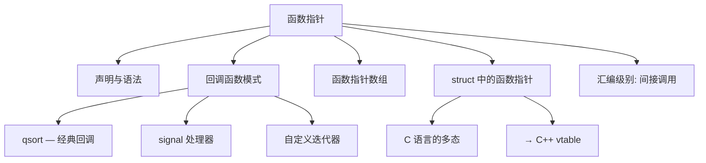
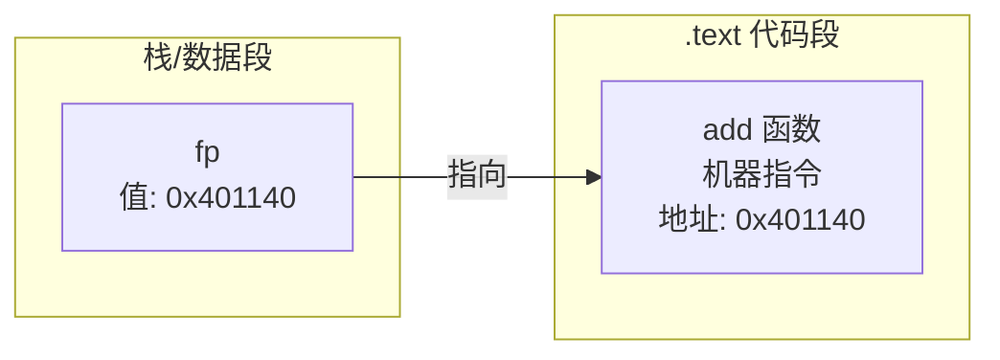
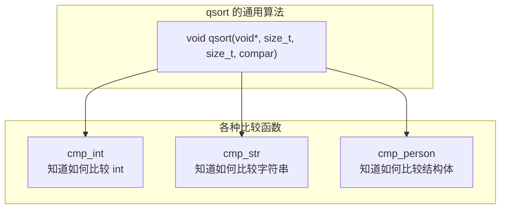
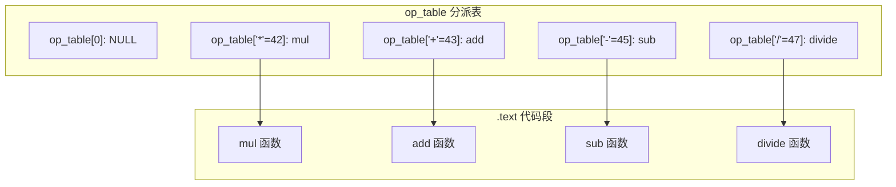

# 函数指针与回调 (Function Pointers & Callbacks)
---

## 章节概述

> 函数指针是 C 语言中实现高阶编程模式的基石。通过函数指针，C 可以在运行时选择要执行的代码，实现回调（callback）、策略模式、插件架构等。理解函数指针也是理解 C++ 虚函数表（vtable）的前提——虚函数的底层实现就是函数指针表。建议对照阅读 [[01_指针深度剖析|指针深度剖析]] 中的指针声明规则和 中的函数调用机制。

与数据指针指向内存中的数据不同，**函数指针指向 `.text` 段中的机器指令**。调用函数指针等于执行 `call *%rax` 这样的间接跳转指令——CPU 跳转到指针值指定的地址开始执行。

### 本章知识地图



---
### 第一节: 函数指针的声明与使用
---

#### 1.1 声明语法

函数指针的声明是 C 语言中最复杂的语法之一，但遵循右左法则即可破解：

```c
// 普通函数
int add(int a, int b) {
 return a + b;
}

// 函数指针声明: 返回类型 (*指针名)(参数类型列表)
int (*fp)(int, int); // fp 是指向函数的指针，函数参数 (int, int)，返回 int

// 赋值
fp = add; // 等价于 fp = &add;
// 函数名自动退化为函数指针（类似数组名退化为指针）

// 调用
int result = fp(3, 4); // 等价于 (*fp)(3, 4);
// result = 7
```



#### 1.2 类型阅读练习

```c
// 1. 基础函数指针
int (*fp1)(int, int); // 指向 int(int,int) 函数的指针

// 2. 返回指针的函数指针
int *(*fp2)(int, double); // 指向 int*(int,double) 函数的指针

// 3. 函数指针作为参数
void apply(int (*func)(int), int arr[], size_t n);
// apply 接受一个函数指针作为参数

// 4. 返回函数指针的函数
int (*get_op(char op))(int, int);
// get_op 是函数，参数 char op，返回 int(*)(int,int)

// 5. 函数指针数组
int (*ops[4])(int, int); // 包含4个函数指针的数组
```

对于第 4 条 `int (*get_op(char op))(int, int)`，使用右左法则：
- 从 `get_op` 开始向右：`(char op)` → 函数，参数是 char
- 向左：`*` → 返回指针（但被括号包围）
- 向右：`(int, int)` → 该指针指向函数，参数 (int, int)
- 向左：`int` → 返回 int
- 结论：`get_op` 是一个函数，参数 char，返回一个函数指针，该函数指针指向参数 (int,int)、返回 int 的函数。

#### 1.3 typedef 简化函数指针类型

```c
// 原始写法——难以阅读
int (*fp)(int, int);
void (*signal_h)(int);

// 使用 typedef
typedef int (*binary_op_t)(int, int); // 定义二元运算类型
typedef void (*sighandler_t)(int); // 定义信号处理器类型

// 使用
binary_op_t fp = add; // 清晰！
sighandler_t handler = my_handler; // 清晰！

// get_op 现在几乎可读
typedef int (*binary_op_t)(int, int);
binary_op_t get_op(char op); // 返回函数指针的函数
```

> **命名约定**: 将函数指针 typedef 命名为以 `_t` 结尾的类型名，参数含义一目了然。这个技巧在大型 C 项目（如 Linux 内核）中无处不在。

#### 1.4 汇编视角——间接调用

```c
int add(int a, int b) { return a + b; }

int main() {
 int (*fp)(int, int) = add;
 int result = fp(3, 4);
 return 0;
}
```

```asm
# 对应的 x86-64 汇编

# int (*fp)(int, int) = add;
leaq add(%rip), %rax # 将 add 函数的地址加载到 rax
movq %rax, -8(%rbp) # 存入 fp 变量（栈上）

# int result = fp(3, 4);
movq -8(%rbp), %rax # 加载 fp 的值（函数地址）
movl $4, %esi # 第二个参数
movl $3, %edi # 第一个参数
call *%rax # 间接调用 —— 跳转到 rax 中的地址
movl %eax, -12(%rbp) # 存入 result
```

> **关键指令 `call *%rax`**: 星号 `*` 表示间接调用——CPU 读取 rax 寄存器的值作为目标地址，将返回地址压栈，然后跳转。相比之下，`call add` 是直接调用，目标地址编译时就确定。这是动态多态的硬件基础。详见 。

---
### 第二节: 回调函数——qsort 深度剖析
---

#### 2.1 qsort 的接口设计

`qsort` 是 C 标准库中最经典的函数指针应用——它通过回调函数让排序算法与数据类型解耦：

```c
#include <stdlib.h>

void qsort(void *base, // 待排序数组基地址
 size_t nmemb, // 元素个数
 size_t size, // 每个元素的大小 (字节)
 int (*compar)(const void *, const void *)); // 比较函数

// compar 规则:
// 返回 < 0: a 应排在 b 前面
// 返回 = 0: a 和 b 相等
// 返回 > 0: a 应排在 b 后面
```

#### 2.2 完整示例：多类型排序

```c
#include <stdio.h>
#include <stdlib.h>
#include <string.h>

// 整数比较（升序）
int cmp_int_asc(const void *a, const void *b) {
 int ia = *(const int *)a;
 int ib = *(const int *)b;
 return (ia > ib) - (ia < ib); // 安全的差值法，避免溢出
}

// 整数比较（降序）
int cmp_int_desc(const void *a, const void *b) {
 return cmp_int_asc(b, a); // 复用升序，参数交换
}

// 字符串比较
int cmp_str(const void *a, const void *b) {
 // a 和 b 是指向 char* 的指针（即 char**）
 const char *sa = *(const char *const *)a;
 const char *sb = *(const char *const *)b;
 return strcmp(sa, sb);
}

// 浮点数比较
int cmp_double(const void *a, const void *b) {
 double da = *(const double *)a;
 double db = *(const double *)b;
 if (da < db) return -1;
 if (da > db) return 1;
 return 0;
}

// 结构体按年龄排序
struct Person {
 char name[32];
 int age;
};

int cmp_person_age(const void *a, const void *b) {
 const struct Person *pa = a;
 const struct Person *pb = b;
 return (pa->age > pb->age) - (pa->age < pb->age);
}

int main() {
 // 整数排序
 int nums[] = {5, 2, 9, 1, 5, 6};
 size_t n = sizeof(nums) / sizeof(nums[0]);
 qsort(nums, n, sizeof(int), cmp_int_asc);

 printf("升序排序: ");
 for (size_t i = 0; i < n; i++) printf("%d ", nums[i]);
 printf("\n");

 // 字符串排序
 const char *names[] = {"Zebra", "Apple", "Monkey", "Banana"};
 size_t m = sizeof(names) / sizeof(names[0]);
 qsort(names, m, sizeof(char *), cmp_str);

 printf("字符串排序: ");
 for (size_t i = 0; i < m; i++) printf("%s ", names[i]);
 printf("\n");

 // 结构体排序
 struct Person people[] = {
 {"Alice", 30}, {"Bob", 25}, {"Charlie", 35}
 };
 qsort(people, 3, sizeof(struct Person), cmp_person_age);
 printf("按年龄排序后: %s(%d) %s(%d) %s(%d)\n",
 people[0].name, people[0].age,
 people[1].name, people[1].age,
 people[2].name, people[2].age);

 return 0;
}
```

#### 2.3 为什么 qsort 能比手写排序更有用



qsort 的核心逻辑是"如何排序"（分区、递归、选择pivot），这部分与数据类型无关。比较函数提供"两个元素谁大谁小"的知识——这就是**策略模式**在 C 中的体现。

> 与 C++ 对比：C++ 的 `std::sort` 使用模板（编译期多态）实现同样效果，通常比 qsort 快（比较函数可内联）。详见 [[../../cpp教程/cpp深化教程/05_面向对象(一)类与对象基础|CPP: 类与对象基础]]。

---
### 第三节: 更多回调场景
---

#### 3.1 信号处理——SIGINT 处理器

```c
#include <stdio.h>
#include <signal.h>
#include <unistd.h>

volatile sig_atomic_t g_keep_running = 1;

void sigint_handler(int sig) {
 // 信号处理器中只能使用异步信号安全的函数
 g_keep_running = 0;
 // printf 不是异步信号安全的（这里仅作演示）
 write(STDOUT_FILENO, "\n收到 SIGINT，准备退出...\n", 33);
}

int main() {
 // 注册信号处理器
 // signal 的第二个参数是函数指针: void (*)(int)
 sighandler_t old = signal(SIGINT, sigint_handler);
 if (old == SIG_ERR) {
 perror("signal");
 return 1;
 }

 printf("按 Ctrl+C 触发 SIGINT\n");
 while (g_keep_running) {
 write(STDOUT_FILENO, ".", 1);
 sleep(1);
 }
 printf("\n正常退出\n");
 return 0;
}
```

> `signal` 函数的声明本身就是一个函数指针的极端案例：`void (*signal(int sig, void (*func)(int)))(int);` —— 返回一个函数指针的函数。

#### 3.2 自定义迭代器

```c
// 对数组的每个元素应用回调
void for_each(int *arr, size_t n, void (*fn)(int *)) {
 for (size_t i = 0; i < n; i++) {
 fn(&arr[i]);
 }
}

// 带上下文的回调
typedef void (*element_callback)(int value, void *userdata);

void for_each_ctx(int *arr, size_t n, element_callback cb, void *ctx) {
 for (size_t i = 0; i < n; i++) {
 cb(arr[i], ctx);
 }
}

// 使用回调计算总和
typedef struct {
 int sum;
 int count;
} stats_t;

void accumulate(int value, void *userdata) {
 stats_t *st = (stats_t *)userdata;
 st->sum += value;
 st->count++;
}

int main() {
 int arr[] = {1, 2, 3, 4, 5, 6, 7, 8, 9, 10};
 stats_t stats = {0, 0};

 for_each_ctx(arr, 10, accumulate, &stats);
 printf("总和: %d, 平均值: %.2f\n",
 stats.sum, (double)stats.sum / stats.count);
 return 0;
}
```

#### 3.3 事件注册系统

```c
#include <stdio.h>
#include <string.h>

#define MAX_LISTENERS 10

typedef void (*event_handler)(const char *event_name, void *data);

struct EventSystem {
 const char *event_name;
 event_handler handlers[MAX_LISTENERS];
 int handler_count;
};

void event_system_register(struct EventSystem *es, event_handler h) {
 if (es->handler_count < MAX_LISTENERS) {
 es->handlers[es->handler_count++] = h;
 }
}

void event_system_fire(struct EventSystem *es, void *data) {
 for (int i = 0; i < es->handler_count; i++) {
 es->handlers[i](es->event_name, data);
 }
}
```

---
### 第四节: 函数指针数组——分派表
---

#### 4.1 计算器——分派表示例

```c
#include <stdio.h>

// 四种运算
int add(int a, int b) { return a + b; }
int sub(int a, int b) { return a - b; }
int mul(int a, int b) { return a * b; }
int divide(int a, int b) { return b != 0 ? a / b : 0; }

// 函数指针数组（分派表）
typedef int (*operation_t)(int, int);
operation_t ops[256] = {0}; // 用字符索引

// 或者直接初始化
operation_t op_table[] = {
 ['+'] = add,
 ['-'] = sub,
 ['*'] = mul,
 ['/'] = divide,
};

int calculate(char op, int a, int b) {
 // 替代冗长的 if-else 或 switch
 if (op_table[op]) {
 return op_table[op](a, b);
 }
 printf("未知运算符: %c\n", op);
 return 0;
}

int main() {
 printf("3 + 4 = %d\n", calculate('+', 3, 4));
 printf("10 - 6 = %d\n", calculate('-', 10, 6));
 printf("7 * 8 = %d\n", calculate('*', 7, 8));
 printf("15 / 3 = %d\n", calculate('/', 15, 3));
 return 0;
}
```



#### 4.2 状态机实现

```c
#include <stdio.h>

// 状态机状态
typedef enum { STATE_IDLE, STATE_RUNNING, STATE_PAUSED, STATE_STOPPED } state_t;

// 状态处理器类型
typedef state_t (*state_handler)(int event);

// 各状态的处理函数
state_t idle_handler(int event) {
 printf("[IDLE] event=%d\n", event);
 if (event == 1) return STATE_RUNNING;
 return STATE_IDLE;
}

state_t running_handler(int event) {
 printf("[RUNNING] event=%d\n", event);
 if (event == 2) return STATE_PAUSED;
 if (event == 3) return STATE_STOPPED;
 return STATE_RUNNING;
}

state_t paused_handler(int event) {
 printf("[PAUSED] event=%d\n", event);
 if (event == 1) return STATE_RUNNING;
 if (event == 3) return STATE_STOPPED;
 return STATE_PAUSED;
}

state_t stopped_handler(int event) {
 printf("[STOPPED] event=%d\n", event);
 return STATE_STOPPED;
}

int main() {
 // 状态分派表
 state_handler state_table[] = {
 [STATE_IDLE] = idle_handler,
 [STATE_RUNNING] = running_handler,
 [STATE_PAUSED] = paused_handler,
 [STATE_STOPPED] = stopped_handler,
 };

 state_t current = STATE_IDLE;
 int events[] = {1, 2, 1, 3};
 for (int i = 0; events[i]; i++) {
 current = state_table[current](events[i]);
 }
 printf("最终状态: %d\n", current);
 return 0;
}
```

> 分派表将 O(1) 查找性能与代码清晰性结合。这是 Linux 内核中系统调用表、文件操作表等核心机制的基础。详见 [[07_面向对象C编程|面向对象C编程]]。

---
### 第五节: 结构体中的函数指针——C 的"方法"
---

#### 5.1 在结构体中嵌入函数指针

```c
#include <stdio.h>
#include <stdlib.h>
#include <string.h>

// "类"定义：结构体 + 函数指针
typedef struct {
 char *buffer;
 size_t length;
 size_t capacity;

 // "方法"——函数指针成员
 void (*append)(struct DynamicString *self, const char *str);
 void (*clear)(struct DynamicString *self);
 void (*destroy)(struct DynamicString *self);
} DynamicString;

// 方法实现
void ds_append(DynamicString *self, const char *str) {
 size_t add_len = strlen(str);
 if (self->length + add_len + 1 > self->capacity) {
 self->capacity = (self->length + add_len + 1) * 2;
 self->buffer = realloc(self->buffer, self->capacity);
 }
 strcpy(self->buffer + self->length, str);
 self->length += add_len;
}

void ds_clear(DynamicString *self) {
 self->buffer[0] = '\0';
 self->length = 0;
}

void ds_destroy(DynamicString *self) {
 free(self->buffer);
 free(self);
}

// "构造函数"
DynamicString *ds_new(const char *initial) {
 DynamicString *ds = malloc(sizeof(DynamicString));
 if (!ds) return NULL;

 ds->length = strlen(initial);
 ds->capacity = ds->length + 16;
 ds->buffer = malloc(ds->capacity);
 strcpy(ds->buffer, initial);

 // 绑定"方法"
 ds->append = ds_append;
 ds->clear = ds_clear;
 ds->destroy = ds_destroy;

 return ds;
}

int main() {
 DynamicString *s = ds_new("Hello");
 s->append(s, " World"); // 类似 obj.method()
 s->append(s, "!");
 printf("内容: %s\n", s->buffer); // Hello World!
 s->destroy(s);
 return 0;
}
```

> 注意 `s->append(s, ...)` 的参数重复——第一个参数 `s` 传了两次。这就是为什么 C++ 发明了隐式 `this` 指针：将 `s->append(s, "World")` 简化为 `s->append("World")`。详见 [[../../cpp教程/cpp深化教程/05_面向对象(一)类与对象基础|CPP: 类与对象基础]]。

#### 5.2 虚函数表的前身

```c
// 每个"对象"携带指向其"虚函数表"的指针
// 这是 C++ 多态的纯 C 等价实现

struct Animal {
 const char *name;
 // 虚函数
 void (*speak)(struct Animal *self);
};

void dog_speak(struct Animal *self) {
 printf("%s 说: 汪汪!\n", self->name);
}

void cat_speak(struct Animal *self) {
 printf("%s 说: 喵喵!\n", self->name);
}

struct Animal *create_dog(void) {
 struct Animal *a = malloc(sizeof(struct Animal));
 a->name = "Dog";
 a->speak = dog_speak;
 return a;
}

struct Animal *create_cat(void) {
 struct Animal *a = malloc(sizeof(struct Animal));
 a->name = "Cat";
 a->speak = cat_speak;
 return a;
}
// 完整的 OOP 实现见 [[07_面向对象C编程|面向对象C编程]]
```

---
### 第六节: 综合案例——插件系统
---

```c
#include <stdio.h>
#include <string.h>
#include <stdlib.h>

// 插件接口
typedef struct {
 const char *name;
 void (*init)(void);
 int (*process)(int input);
 void (*cleanup)(void);
} Plugin;

#define MAX_PLUGINS 16

// 插件管理器
typedef struct {
 Plugin plugins[MAX_PLUGINS];
 int count;
} PluginManager;

void pm_register(PluginManager *pm, Plugin p) {
 if (pm->count < MAX_PLUGINS) {
 pm->plugins[pm->count++] = p;
 }
}

void pm_init_all(PluginManager *pm) {
 for (int i = 0; i < pm->count; i++) {
 printf("初始化插件: %s\n", pm->plugins[i].name);
 pm->plugins[i].init();
 }
}

int pm_process_all(PluginManager *pm, int input) {
 int result = input;
 for (int i = 0; i < pm->count; i++) {
 result = pm->plugins[i].process(result);
 }
 return result;
}

// 具体插件实现
void double_init(void) { printf(" Double 插件启动\n"); }
int double_process(int input) { return input * 2; }

void inc_init(void) { printf(" Increment 插件启动\n"); }
int inc_process(int input) { return input + 1; }

int main() {
 PluginManager pm = {0};

 Plugin double_plugin = {"Double", double_init, double_process, NULL};
 Plugin inc_plugin = {"Increment", inc_init, inc_process, NULL};

 pm_register(&pm, double_plugin);
 pm_register(&pm, inc_plugin);

 pm_init_all(&pm);
 int result = pm_process_all(&pm, 5);
 printf("处理结果: %d (预期: (5*2)+1 = 11)\n", result);
 return 0;
}
```

---

## 章节测试

### 判断题（共10题）

> [!question] 判断题 1
> 函数名在表达式中会自动退化为函数指针。 （ ）
> - [ ] 正确
> - [ ] 错误
>
> > [!success]- 点击查看答案
> > 答案: 正确
> >
> > **解析**: 类似数组名退化为首元素指针，函数名在大多数上下文（赋值、传参数、比较）中退化为函数指针。例外：`sizeof(func)` 非法，`&func` 得到函数指针。

> [!question] 判断题 2
> `int (*fp)(int)` 表示 fp 是返回 int 的函数。 （ ）
> - [ ] 正确
> - [ ] 错误
>
> > [!success]- 点击查看答案
> > 答案: 错误
> >
> > **解析**: `int (*fp)(int)` 表示 fp 是指向函数的指针，该函数参数 int、返回 int。`int fp(int)` 才是 fp 是函数。

> [!question] 判断题 3
> 函数指针调用时必须使用 `(*fp)(args)` 语法。 （ ）
> - [ ] 正确
> - [ ] 错误
>
> > [!success]- 点击查看答案
> > 答案: 错误
> >
> > **解析**: `fp(args)` 和 `(*fp)(args)` 都是合法的。`fp(args)` 更简洁，且 C 标准支持。两者在汇编层面生成相同的代码。

> [!question] 判断题 4
> `qsort` 的比较函数返回真/假表示 a 是否小于 b。 （ ）
> - [ ] 正确
> - [ ] 错误
>
> > [!success]- 点击查看答案
> > 答案: 错误
> >
> > **解析**: qsort 的比较函数返回 int：<0 表示 a 在 b 前，=0 表示相等，>0 表示 a 在 b 后。不是布尔值。

> [!question] 判断题 5
> 信号处理函数中可以安全地调用 `printf`。 （ ）
> - [ ] 正确
> - [ ] 错误
>
> > [!success]- 点击查看答案
> > 答案: 错误
> >
> > **解析**: `printf` 不是异步信号安全的——它内部使用锁和缓冲区。信号处理器中只应调用 `write`、`_exit` 等异步信号安全函数，或修改 `volatile sig_atomic_t` 标志。

> [!question] 判断题 6
> typedef 可以用于简化函数指针声明。 （ ）
> - [ ] 正确
> - [ ] 错误
>
> > [!success]- 点击查看答案
> > 答案: 正确
> >
> > **解析**: `typedef int (*op_t)(int, int);` 定义一个函数指针类型的别名，之后 `op_t fp;` 声明变量。

> [!question] 判断题 7
> 函数指针可以指向任何函数，无论参数和返回类型是否匹配。 （ ）
> - [ ] 正确
> - [ ] 错误
>
> > [!success]- 点击查看答案
> > 答案: 错误
> >
> > **解析**: 函数指针赋值需要类型兼容——参数类型和返回类型必须匹配。错误类型的赋值会引发编译警告（`-Wincompatible-pointer-types`），且通过错误类型调用是未定义行为。

> [!question] 判断题 8
> `call *%rax` 指令实现的是间接函数调用。 （ ）
> - [ ] 正确
> - [ ] 错误
>
> > [!success]- 点击查看答案
> > 答案: 正确
> >
> > **解析**: `call *%rax` 是 x86-64 的间接调用指令——CPU 跳转到 rax 寄存器值所指定的地址执行。这是函数指针和虚函数调用的底层实现。`call func`（无星号）是直接调用。

> [!question] 判断题 9
> 函数指针数组可以用作分派表（dispatch table），替代大型 switch 语句。 （ ）
> - [ ] 正确
> - [ ] 错误
>
> > [!success]- 点击查看答案
> > 答案: 正确
> >
> > **解析**: 函数指针数组在已知索引时提供 O(1) 的分派时间，且代码更简洁。Linux 内核的系统调用表 (sys_call_table) 就是函数指针数组的经典应用。

> [!question] 判断题 10
> 结构体中的函数指针成员与 C++ 的成员函数完全相同。 （ ）
> - [ ] 正确
> - [ ] 错误
>
> > [!success]- 点击查看答案
> > 答案: 错误
> >
> > **解析**: C++ 成员函数有隐式 this 指针、访问控制、继承和多态支持。C 结构体中的函数指针只是普通函数指针，需要手动传递对象指针作为第一个参数（`self`），且每个对象实例都有一份函数指针拷贝（除非使用共享的 vtable 模式）。

### 选择题（共10题）

> [!question] 选择题 1
> `int (*arr[5])(double)` 声明的是什么？
> - [ ] A. 返回 int* 的函数，参数 double
> - [ ] B. 指向 int(double) 的函数指针
> - [ ] C. 包含5个函数指针的数组，每个函数参数 double、返回 int
> - [ ] D. 函数返回包含5个 int 的数组
>
> > [!success]- 点击查看答案
> > 正确答案: C
> >
> > **解析**: 应用右左法则：arr[5]→数组，*→指针，(double)→函数，int→返回 int。所以 arr 是包含5个元素的数组，每个元素是函数指针，指向参数 (double)、返回 int 的函数。

> [!question] 选择题 2
> 以下 qsort 比较函数为什么是错误的？
> ```c
> int cmp(const void *a, const void *b) {
> return *(int*)a - *(int*)b;
> }
> ```
> - [ ] A. 语法错误
> - [ ] B. 当差值溢出 int 范围时行为错误
> - [ ] C. 参数类型错误
> - [ ] D. 没有错误
>
> > [!success]- 点击查看答案
> > 正确答案: B
> >
> > **解析**: 两个 int 的差值可能溢出 int 范围（如 `INT_MAX - (-1)` 溢出）。安全写法：`return (*(int*)a > *(int*)b) - (*(int*)a < *(int*)b);`。

> [!question] 选择题 3
> `signal` 函数的返回类型是什么？
> - [ ] A. void
> - [ ] B. int
> - [ ] C. void(*)(int)
> - [ ] D. int(*)(void)
>
> > [!success]- 点击查看答案
> > 正确答案: C
> >
> > **解析**: `signal(int sig, void (*handler)(int))` 返回类型是 `void (*)(int)`——即先前的信号处理器（或 `SIG_ERR`）。这允许保存旧处理器以便恢复。

> [!question] 选择题 4
> 以下代码的输出是？
> ```c
> int add(int a, int b) { return a + b; }
> int mul(int a, int b) { return a * b; }
> int main() {
> int (*ops[])(int, int) = {add, mul};
> printf("%d\n", ops[1](ops[0](2, 3), 4));
> }
> ```
> - [ ] A. 9
> - [ ] B. 20
> - [ ] C. 14
> - [ ] D. 编译错误
>
> > [!success]- 点击查看答案
> > 正确答案: B
> >
> > **解析**: `ops[0](2, 3)` 调用 add(2,3) = 5。`ops[1](5, 4)` 调用 mul(5,4) = 20。

> [!question] 选择题 5
> 以下声明中，哪个是"返回函数指针的函数"？
> - [ ] A. `void (*f)(int);`
> - [ ] B. `void *f(int);`
> - [ ] C. `void (*f(int))(int);`
> - [ ] D. `void f(int (*)(int));`
>
> > [!success]- 点击查看答案
> > 正确答案: C
> >
> > **解析**: C 是 f 是函数（参数 int），返回 `void (*)(int)`（函数指针）。A 是函数指针变量。B 是返回 void* 的函数。D 是接受函数指针为参数的函数。

> [!question] 选择题 6
> 分派表（dispatch table）相比 switch 语句的主要优势是？
> - [ ] A. 更少的内存占用
> - [ ] B. O(1) 时间复杂度和更好的扩展性
> - [ ] C. 更少的代码行数
> - [ ] D. 支持更多分支
>
> > [!success]- 点击查看答案
> > 正确答案: B
> >
> > **解析**: 分派表通过一次数组索引+间接跳转完成分支选择（O(1)），而大型 switch 在编译器未优化为跳转表时可能是 O(log n) 或 O(n)。此外分派表可以在运行时动态增删，扩展性更好。

> [!question] 选择题 7
> C 语言和 C++ 虚函数的主要底层区别是什么？
> - [ ] A. 没有区别
> - [ ] B. C++ 虚函数通过 vtable 实现，C 需要手动编写
> - [ ] C. C 语言不支持函数指针
> - [ ] D. C 的调用更快
>
> > [!success]- 点击查看答案
> > 正确答案: B
> >
> > **解析**: C++ 编译器自动为有虚函数的类生成 vtable（虚函数指针数组），并通过 vptr 实现动态分派。C 语言需要程序员手动创建函数指针表、在每个对象中存储 vtable 指针、手动传递 this 指针。详见 [[07_面向对象C编程|面向对象C编程]]。

> [!question] 选择题 8
> 结构体中每个实例存储一份函数指针的缺点是什么？
> - [ ] A. 代码复用困难
> - [ ] B. 每个实例占用额外的指针内存
> - [ ] C. 调用语法冗长
> - [ ] D. 以上都是
>
> > [!success]- 点击查看答案
> > 正确答案: D
> >
> > **解析**: 每个实例存函数指针消耗额外内存（每个方法一个指针），而 C++ 的 vtable 模式只存一个 vptr（指向共享的静态 vtable），显著减少内存开销。

> [!question] 选择题 9
> 关于 `void *userdata` 在回调中的角色，正确的是？
> - [ ] A. 它提供类型安全
> - [ ] B. 它允许将上下文（状态）传递给回调函数
> - [ ] C. 它是回调必须返回的值
> - [ ] D. 它等同于 this 指针
>
> > [!success]- 点击查看答案
> > 正确答案: B
> >
> > **解析**: userdata 是一个万能上下文指针，允许调用者传递任意状态给回调函数，解决了纯函数指针"无法携带状态"的限制。这在 `pthread_create`、GUI 事件处理等场景中十分常见。

> [!question] 选择题 10
> 间接跳转 `call *%rax` 在 CPU 内部会发生什么？
> - [ ] A. CPU 先读取 rax 的值，再跳转到该地址
> - [ ] B. CPU 直接跳转到 rax 寄存器所在地址
> - [ ] C. CPU 忽略 rax，跳转到固定地址
> - [ ] D. 与 `call func` 完全相同
>
> > [!success]- 点击查看答案
> > 正确答案: A
> >
> > **解析**: `call *%rax` 中 `*` 表示"间接"——CPU 读取 rax 寄存器的值（这个值是一个内存地址），将返回地址压栈，然后跳转到该地址。这与 `call func`（目标地址在指令中编码）不同。

---

### 编程练习题

> [!example] 练习 1：通用排序框架
> **难度**: 简单
>
> 基于 qsort 模式实现自己版本的通用排序：
> - `void my_sort(void *base, size_t n, size_t size, int (*cmp)(const void*, const void*))`
> - 实现冒泡排序和插入排序两个版本
> - 用函数指针选择排序算法
> - 支持 int、double、char* 和自定义结构体的排序
> - 与标准库 qsort 对比性能

> [!example] 练习 2：表达式求值器
> **难度**: 简单
>
> 使用函数指针数组实现后缀表达式求值器：
> - 支持 `+ - * /` 运算符（用函数指针数组映射）
> - 支持扩展运算符（如 `^` 幂运算）通过注册接口添加
> - 使用栈存储中间结果
> - 解析字符串输入（空格分隔的 token）
> - 示例：输入 `"3 4 + 5 *"`（即 (3+4)*5）输出 35

> [!example] 练习 3：简易 GTK 式信号系统
> **难度**: 简单
>
> 实现一个类似 GTK 的信号/回调系统：
> - `Signal` 类型：存储回调函数列表
> - `signal_connect(Signal *s, void (*callback)(void*), void *userdata)` — 注册回调
> - `signal_emit(Signal *s)` — 触发所有回调
> - `signal_disconnect(Signal *s, void (*callback)(void*))` — 注销指定回调
> - 创建按钮 widget 示例：按下按钮触发所有已连接的信号回调

---

## 知识网络

- **前置章节**: [[01_指针深度剖析|指针深度剖析]] — 指针声明规则（右左法则）
- **同系列相关**: [[07_面向对象C编程|面向对象C编程]] — 函数指针构造虚函数表
- **汇编参考**: — call/ret 指令和间接调用
- **汇编参考**: — 间接寻址模式
- **C++ 对比**: [[../../cpp教程/cpp深化教程/05_面向对象(一)类与对象基础|CPP: 类与对象基础]] — 成员函数与 this 指针
- **C++ 对比**: [[../../cpp教程/cpp深化教程/07_面向对象(三)多态与虚函数|CPP: 多态与虚函数]] — vtable 的 C 语言等价实现
