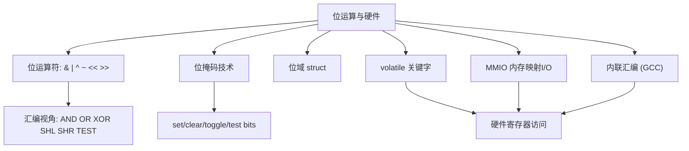
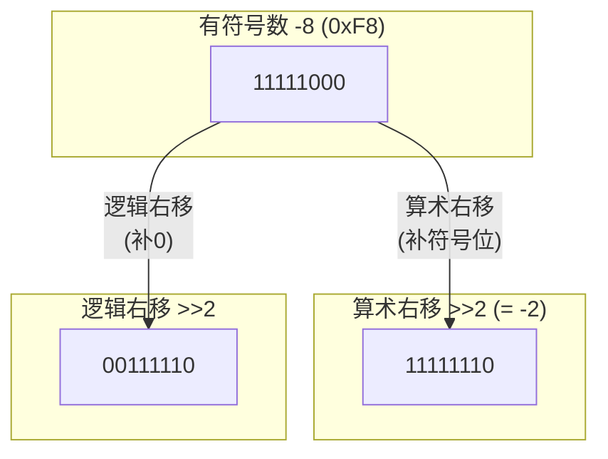
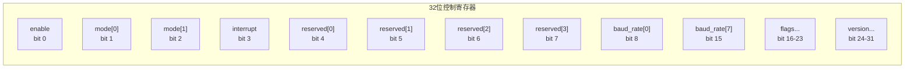
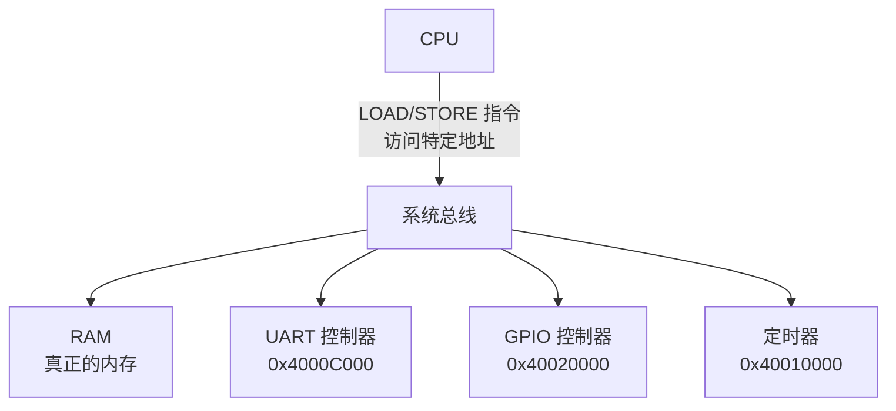

# 位运算与硬件操作 (Bitwise Operations & Hardware Interaction)
---

## 章节概述

> 位运算是 C 语言最接近硬件的特性之一。所有高级语言的布尔运算、乘除法优化、加密算法，最终都翻译为 CPU 的 AND/OR/XOR/SHIFT 指令。本章从 CPU 的逻辑门出发，深入位运算符的底层实现，然后延伸到 `volatile` 关键字、内存映射 I/O（MMIO）和 GCC 内联汇编——这些是嵌入式开发和操作系统内核的必备技能。建议同时阅读 中的位操作指令和 中的 MMIO。

位运算之所以重要，不只是因为它们是高效的——**有些操作只有位运算才能实现**。标志位的设置、硬件寄存器的操控、协议头的解析、加密算法，都依赖精确到位的操作。

### 本章知识地图



---
### 第一节: 六大位运算符深度解析
---

#### 1.1 位运算真值表

C 语言提供六种位运算符，它们逐位操作整型操作数：

| 运算符 | 名称 | 真值表 |
|--------|------|--------|
| `&` | 按位与 | `1&1=1`, `1&0=0`, `0&1=0`, `0&0=0` |
| `\|` | 按位或 | `1\|1=1`, `1\|0=1`, `0\|1=1`, `0\|0=0` |
| `^` | 按位异或 | `1^1=0`, `1^0=1`, `0^1=1`, `0^0=0` |
| `~` | 按位取反 | `~1=0`, `~0=1` (一元运算符) |
| `<<` | 左移 | 左移 n 位，右侧补 0 |
| `>>` | 右移 | 右移 n 位（无符号数补0，有符号数实现定义） |

```c
unsigned char a = 0b11001100; // 204
unsigned char b = 0b10101010; // 170

printf("a & b = 0x%02X\n", a & b); // 0x88 = 0b10001000
printf("a | b = 0x%02X\n", a | b); // 0xEE = 0b11101110
printf("a ^ b = 0x%02X\n", a ^ b); // 0x66 = 0b01100110
printf("~a = 0x%02X\n", (unsigned char)~a); // 0x33 = 0b00110011
printf("a << 1 = 0x%02X\n", a << 1); // 0x98 = 0b10011000
printf("b >> 2 = 0x%02X\n", b >> 2); // 0x2A = 0b00101010
```

#### 1.2 汇编视角——CPU 的位操作指令

C 语言的位运算符几乎直接对应 CPU 指令：

```c
unsigned int x = 0x0F;
unsigned int y = 0x36;
unsigned int r;

r = x & y; // r = 0x06
r = x | y; // r = 0x3F
r = x ^ y; // r = 0x39
r = ~x; // r = 0xFFFFFFF0 (32位取反)
r = x << 2; // r = 0x3C
r = y >> 1; // r = 0x1B
```

对应的 x86-64 汇编:

```asm
# r = x & y;
movl -4(%rbp), %eax # 加载 x
andl -8(%rbp), %eax # AND 指令: eax = eax & y
movl %eax, -12(%rbp) # 存入 r

# r = x | y;
movl -4(%rbp), %eax
orl -8(%rbp), %eax # OR 指令

# r = x ^ y;
movl -4(%rbp), %eax
xorl -8(%rbp), %eax # XOR 指令

# r = ~x;
movl -4(%rbp), %eax
notl %eax # NOT 指令

# r = x << 2;
movl -4(%rbp), %eax
sall $2, %eax # SHL (Shift Arithmetic Left) 指令

# r = y >> 1;
movl -8(%rbp), %eax
shrl $1, %eax # SHR (Shift Logical Right) 指令
```

> **TEST 指令的特殊性**: `testl %eax, %eax` 是 `andl %eax, %eax` 但**只影响标志位，不修改目标寄存器**。编译器用 TEST 实现 `if (x & mask)` 判断，避免破坏 x 的值。

#### 1.3 有符号数右移的陷阱

```c
int x = -8; // 二进制补码: ...11111000
int y = x >> 2; // 实现定义！GCC/Clang: 算术右移 → -2
 // 某些平台: 逻辑右移 → 一个很大的正数

unsigned int ux = (unsigned int)-8; // 0xFFFFFFF8
unsigned int uy = ux >> 2; // 逻辑右移 → 0x3FFFFFFE
// 无符号数右移一定是逻辑右移（补0），这是标准保证的！

printf("有符号右移: %d\n", y); // GCC 上: -2
printf("无符号右移: %u\n", uy); // 1073741822
```



> **最佳实践**: 位运算总是使用**无符号类型** (`unsigned int`, `uint32_t` 等)。有符号数的位操作是实现定义的，不可移植。

---
### 第二节: 位掩码——位的操控艺术
---

#### 2.1 位掩码的四种基本操作

```c
#include <stdint.h>

// 设定位 (Set): 将指定位设为 1
#define SET_BIT(reg, bit) ((reg) |= (1U << (bit)))

// 清除位 (Clear): 将指定位设为 0
#define CLEAR_BIT(reg, bit) ((reg) &= ~(1U << (bit)))

// 翻转位 (Toggle): 反转指定位
#define TOGGLE_BIT(reg, bit) ((reg) ^= (1U << (bit)))

// 测试位 (Test): 检查指定位是否为 1
#define TEST_BIT(reg, bit) (((reg) >> (bit)) & 1U)

// 获取多位域的值
#define GET_FIELD(reg, mask, shift) (((reg) & (mask)) >> (shift))

// 设置多位域的值
#define SET_FIELD(reg, mask, shift, val) \
 ((reg) = ((reg) & ~(mask)) | (((val) << (shift)) & (mask)))
```

```c
uint32_t flags = 0;

// 演示每种操作
SET_BIT(flags, 3); // flags: ...00001000
SET_BIT(flags, 7); // flags: ...10001000
printf("After set: 0x%08X\n", flags);

TOGGLE_BIT(flags, 3); // flags: ...10000000 (位3从1变0)
printf("After toggle: 0x%08X\n", flags);

printf("Bit 7 is %s\n", TEST_BIT(flags, 7) ? "set" : "not set");
printf("Bit 3 is %s\n", TEST_BIT(flags, 3) ? "set" : "not set");

CLEAR_BIT(flags, 7); // flags: ...00000000
printf("After clear: 0x%08X\n", flags);
```

#### 2.2 实用位操作技巧

```c
// 判断是否为 2 的幂
// 如果 x 是 2 的幂，x & (x-1) == 0（且 x != 0）
int is_power_of_two(unsigned int x) {
 return x && !(x & (x - 1));
}
// 原理: 8 = 00001000, 7 = 00000111, 8 & 7 = 0

// 计算二进制中 1 的个数 (Brian Kernighan 算法)
int popcount(unsigned int x) {
 int count = 0;
 while (x) {
 x &= x - 1; // 清除最低位的 1
 count++;
 }
 return count;
}
// 每次循环: x = x & (x-1) 消除最低的一个 1 位

// 取最低位的 1
#define LOWBIT(x) ((x) & (-(x)))
// 原理: -x = ~x + 1, x & (-x) 只保留最低位的 1
// 例如 x=0b101100, -x=0b010100, x & -x = 0b000100

// 对齐到 2 的幂的倍数 (向上对齐)
size_t align_up(size_t x, size_t alignment) {
 return (x + alignment - 1) & ~(alignment - 1);
}
// 例如 align_up(13, 8) = 16, align_up(17, 16) = 32

// 交换两个数（不用临时变量）
void swap_xor(int *a, int *b) {
 *a ^= *b;
 *b ^= *a;
 *a ^= *b;
}
// 原理: a'=a^b, b'=b^(a^b)=a, a''=(a^b)^a=b
// 注意: a 和 b 指向同一地址时会出bug
```

#### 2.3 汇编对应——按位测试

```c
// C 语言测试位
if (flags & (1U << 5)) {
 // 执行某操作
}
```

```asm
# 汇编实现 (GCC)
movl flags(%rip), %eax # 加载 flags
testl $32, %eax # flags & 0x20 (1<<5)
je .L_skip # 如果为零跳转
# 执行某操作的代码
.L_skip:
```

> `test` 指令比 `and` 更好——只设置标志位，不修改原值。这正是 `TEST_BIT` 宏应该生成的内容。

---
### 第三节: 结构体位域
---

#### 3.1 位域的语法

位域允许在结构体中按位定义成员，对于打包标志和解析硬件寄存器位非常有用：

```c
#include <stdio.h>
#include <stdint.h>

// 32 位控制寄存器
struct ControlReg {
 uint32_t enable : 1; // 位 0: 使能
 uint32_t mode : 2; // 位 1-2: 模式 (0-3)
 uint32_t interrupt : 1; // 位 3: 中断使能
 uint32_t reserved : 4; // 位 4-7: 保留
 uint32_t baud_rate : 8; // 位 8-15: 波特率分频
 uint32_t flags : 8; // 位 16-23: 标志位
 uint32_t version : 8; // 位 24-31: 版本号
};

int main() {
 struct ControlReg reg = {0};
 reg.enable = 1;
 reg.mode = 2; // 0b10
 reg.interrupt = 1;
 reg.baud_rate = 52; // 最大值 255 (8位)
 reg.version = 0x12;

 printf("sizeof(reg) = %zu\n", sizeof(reg)); // 通常 4 (32位)

 // 获取整个寄存器的值
 uint32_t *reg_val = (uint32_t*)&reg;
 printf("寄存器值 = 0x%08X\n", *reg_val);
 return 0;
}
```



#### 3.2 位域的局限和陷阱

```c
// 位域的可移植性问题

// 1. 布局顺序依赖字节序和编译器
struct Flags {
 unsigned int a : 1;
 unsigned int b : 1;
 unsigned int c : 1;
};
// 小端机器: a 在最低位; 大端机器: a 在最高位
// 不同编译器可能有不同的填充策略

// 2. 不能对位域取地址
// &reg.enable // 编译错误! 位域没有独立地址

// 3. 跨越类型的位域
struct Mixed {
 uint32_t a : 16;
 uint32_t b : 16;
 // 如果改用 uint8_t c : 8; 可能强制新的存储单元
};

// 4. 性能开销: 读写位域通常需要读-改-写周期
reg.enable = 0;
// 编译为: 读取整个32位值 → 清除bit0 → 写回32位值
// 这比单纯的位运算宏慢，但代码更可读
```

> **位域 vs 位掩码宏**: 位域可读性更好，适合协议解析和配置结构；位掩码宏具有确定性的内存布局，适合硬件寄存器操作和跨平台代码。

---
### 第四节: volatile 关键字与硬件寄存器
---

#### 4.1 volatile 的语义

`volatile` 告诉编译器：**每次访问这个变量都必须从内存读取/写入，不要优化到寄存器中**。这是访问硬件寄存器的必备关键字。

```c
// volatile 的三种典型场景:

// 1. 内存映射 I/O 寄存器
volatile uint32_t *uart_status = (volatile uint32_t *)0x4000C000;
while (!(*uart_status & 0x20)) {
 // 等待 UART 发送就绪
 // 不加 volatile: 编译器可能优化为只读一次，死循环！
}

// 2. 信号处理器中的标志
volatile sig_atomic_t flag = 0;
void handler(int sig) { flag = 1; }

// 3. setjmp/longjmp 中的变量
volatile int progress = 0;
```

```c
// 实验: 验证 volatile 对生成代码的影响

int normal = 0;
volatile int vol = 0;

void test_loop() {
 while (normal == 0) { /* do work */ }
 // 编译器优化后: 可能只读一次 normal，变成死循环或直接跳过

 while (vol == 0) { /* do work */ }
 // 编译器: 每次循环都从内存读取 vol
}
```

生成的汇编对比:

```asm
# while (normal == 0) — 糟糕的优化
 movl normal(%rip), %eax # 只加载一次
.L_loop1:
 testl %eax, %eax # 测试寄存器中的值（永远不变）
 je .L_loop1 # 死循环！

# while (vol == 0) — 正确的代码
.L_loop2:
 movl vol(%rip), %eax # 每次循环都重新加载
 testl %eax, %eax
 je .L_loop2 # 可以退出
```

#### 4.2 volatile 不提供的保证

```c
// volatile 不是多线程同步原语！
volatile int counter = 0;

// 线程 A
void thread_a(void) {
 counter++; // 不是原子操作!
 // counter++ 实际是: 读 → 加1 → 写 (三个指令)
 // 线程 B 可能在这之间读取到中间状态
}

// 需要原子操作时使用 C11 _Atomic
#include <stdatomic.h>
atomic_int safe_counter = 0;
// safe_counter++ 是原子操作 (lock xaddl 指令)
```

> `volatile` ≠ `_Atomic`。volatile 只禁用编译器优化，不提供原子性。详见 C11 标准的 `<stdatomic.h>`。

---
### 第五节: 内存映射 I/O (MMIO) 基础
---

#### 5.1 MMIO 的概念

CPU 通过**内存地址**访问外设寄存器——这些不是真正的 RAM 内存，而是映射到外设硬件寄存器的地址空间。对某个地址的读/写操作被总线路由到相应的外设控制器。



```c
// 典型 MMIO 用法 (以 STM32 伪代码为例)

// 定义外设基地址
#define UART_BASE 0x4000C000UL
#define GPIOA_BASE 0x40020000UL
#define TIM2_BASE 0x40000000UL

// 定义寄存器指针 (volatile 必须!)
#define UART_SR ((volatile uint32_t *)(UART_BASE + 0x00)) // 状态寄存器
#define UART_DR ((volatile uint32_t *)(UART_BASE + 0x04)) // 数据寄存器
#define UART_BRR ((volatile uint32_t *)(UART_BASE + 0x08)) // 波特率寄存器
#define UART_CR1 ((volatile uint32_t *)(UART_BASE + 0x0C)) // 控制寄存器1

// 初始化 UART
void uart_init(uint32_t baud) {
 *UART_BRR = SystemCoreClock / baud;
 *UART_CR1 |= (1 << 3) // 发送使能
 | (1 << 2) // 接收使能
 | (1 << 13); // UART 使能
}

// 发送字符
void uart_putc(char c) {
 // 等待发送寄存器空 (TXE 位)
 while (!(*UART_SR & (1 << 7)))
 ; // 轮询

 *UART_DR = c; // 写入数据寄存器
}

// 接收字符
char uart_getc(void) {
 // 等待接收非空 (RXNE 位)
 while (!(*UART_SR & (1 << 5)))
 ; // 轮询

 return (char)(*UART_DR & 0xFF);
}
```

#### 5.2 MMIO 在 Linux 上的演示

```c
// 在 Linux 用户空间演示 MMIO 概念
// 使用 /dev/mem 访问物理地址（需要 root 权限）
// 或使用 mmap 映射硬件寄存器区域

#include <stdio.h>
#include <stdlib.h>
#include <fcntl.h>
#include <sys/mman.h>
#include <unistd.h>

// 模拟的硬件寄存器地址（实际不会工作，仅为概念演示）
#define FAKE_REG_BASE 0x10000000

int main() {
 int fd = open("/dev/mem", O_RDWR | O_SYNC);
 if (fd < 0) {
 perror("open /dev/mem (需要 root)");
 return 1;
 }

 // 将物理地址映射到进程虚拟地址空间
 volatile uint32_t *reg = mmap(
 NULL, 4096,
 PROT_READ | PROT_WRITE,
 MAP_SHARED,
 fd, FAKE_REG_BASE
 );

 if (reg == MAP_FAILED) {
 perror("mmap");
 close(fd);
 return 1;
 }

 // 读寄存器
 uint32_t val = reg[0];
 printf("寄存器[0] = 0x%08X\n", val);

 // 写寄存器
 reg[1] = 0xDEADBEEF;

 munmap((void*)reg, 4096);
 close(fd);
 return 0;
}
```

> **安全警告**: 在真实系统中使用 `/dev/mem` 操作物理内存极度危险——可能损坏硬件、导致系统崩溃。上述代码仅在嵌入式开发板或虚拟机中用于教学目的。

---
### 第六节: GCC 内联汇编入门
---

#### 6.1 基础语法

内联汇编允许在 C 代码中直接插入汇编指令，用于无法用纯 C 表达的操作（如读取特定寄存器、执行特殊指令）：

```c
// GCC 扩展内联汇编语法:
// asm volatile(
// "指令模板"
// : 输出操作数列表
// : 输入操作数列表
// : 破坏(clobber)列表
// );
```

```c
#include <stdio.h>
#include <stdint.h>

// 1. 读取 CPU 时间戳计数器 (RDTSC 指令，仅 x86)
uint64_t read_tsc(void) {
 uint32_t low, high;
 asm volatile (
 "rdtsc"
 : "=a" (low), "=d" (high) // 输出: eax → low, edx → high
 );
 return ((uint64_t)high << 32) | low;
}

// 2. 内联 NOP (空操作)
void nop_example(void) {
 asm volatile ("nop"); // 插入一个 NOP 指令
}

// 3. 读取栈指针 (RSP)
void *get_stack_pointer(void) {
 void *sp;
 asm volatile (
 "movq %%rsp, %0"
 : "=r" (sp) // 输出到任意通用寄存器
 );
 return sp;
}

// 4. 内存屏障 (防止编译器重排内存访问)
#define barrier() asm volatile ("" ::: "memory")

// 5. 禁用/启用中断 (内核代码，仅示例)
static inline void cli(void) {
 asm volatile ("cli" ::: "memory");
}
static inline void sti(void) {
 asm volatile ("sti" ::: "memory");
}

int main() {
 printf("栈指针: %p\n", get_stack_pointer());
 printf("时间戳: %lu\n", read_tsc());
 return 0;
}
```

#### 6.2 约束（Constraints）说明

| 约束 | 含义 | 架构 |
|------|------|------|
| `"r"` | 任意通用寄存器 | 通用 |
| `"a"` | eax/rax 寄存器 | x86 |
| `"b"` | ebx/rbx 寄存器 | x86 |
| `"c"` | ecx/rcx 寄存器 | x86 |
| `"d"` | edx/rdx 寄存器 | x86 |
| `"m"` | 内存操作数 | 通用 |
| `"i"` | 立即数 | 通用 |
| `"=r"` | 输出到寄存器 | 通用 |
| `"+r"` | 输入/输出寄存器 | 通用 |

```c
// 约束组合示例: 原子加法
int atomic_add(volatile int *ptr, int val) {
 int result;
 asm volatile (
 "lock; xaddl %0, %1" // lock 前缀保证原子性
 : "=r" (result), "+m" (*ptr)
 : "0" (val)
 : "memory"
 );
 return result;
}
```

> 完整的内联汇编教程参见 。

---
### 第七节: 综合案例——GPIO 控制 LED
---

```c
#include <stdint.h>
#include <stdbool.h>

// 模拟 STM32 风格的 GPIO 控制
// 实际地址依赖于具体芯片，此处为概念演示

#define GPIOA_BASE 0x40020000UL

// GPIO 寄存器定义
typedef struct {
 volatile uint32_t MODER; // 模式寄存器 (偏移 0x00)
 volatile uint32_t OTYPER; // 输出类型 (偏移 0x04)
 volatile uint32_t OSPEEDR; // 输出速度 (偏移 0x08)
 volatile uint32_t PUPDR; // 上下拉 (偏移 0x0C)
 volatile uint32_t IDR; // 输入数据 (偏移 0x10)
 volatile uint32_t ODR; // 输出数据 (偏移 0x14)
 volatile uint32_t BSRR; // 置位/复位 (偏移 0x18)
 volatile uint32_t LCKR; // 锁定 (偏移 0x1C)
 volatile uint32_t AFRL; // 复用功能低 (偏移 0x20)
 volatile uint32_t AFRH; // 复用功能高 (偏移 0x24)
} GPIO_TypeDef;

#define GPIOA ((GPIO_TypeDef *)GPIOA_BASE)

// 位掩码辅助宏
#define GPIO_PIN_5 (1U << 5)

// 初始化 PA5 为推挽输出 (连接 LED)
void led_init(void) {
 // 清除 MODER[11:10] 位，然后设为 01 (通用输出模式)
 GPIOA->MODER &= ~(0x3U << 10); // 清除 PA5 模式位
 GPIOA->MODER |= (0x1U << 10); // 设为输出模式

 // 设输出类型为推挽 (0)
 GPIOA->OTYPER &= ~GPIO_PIN_5;

 // 初始输出低电平 (LED 灭)
 GPIOA->ODR &= ~GPIO_PIN_5;
}

// LED 亮
void led_on(void) {
 GPIOA->BSRR = GPIO_PIN_5; // BSRR 写1置位 (原子操作)
}

// LED 灭
void led_off(void) {
 GPIOA->BSRR = (GPIO_PIN_5 << 16); // BSRR高16位写1复位 (原子操作)
}

// LED 翻转
void led_toggle(void) {
 GPIOA->ODR ^= GPIO_PIN_5; // 异或翻转
}

// 简单延时 (忙等)
void delay_ms(uint32_t ms) {
 // 实际使用系统定时器; 此处简化
 for (volatile uint32_t i = 0; i < ms * 4000; i++)
 ;
}

int main(void) {
 led_init();

 while (1) {
 led_on();
 delay_ms(500);
 led_off();
 delay_ms(500);
 // LED 以 1Hz 频率闪烁
 }
 return 0;
}
```

---

## 章节测试

### 判断题（共10题）

> [!question] 判断题 1
> `x & (1 << n)` 用于测试 x 的第 n 位是否为 1。 （ ）
> - [ ] 正确
> - [ ] 错误
>
> > [!success]- 点击查看答案
> > 答案: 正确
> >
> > **解析**: 如果结果非零，说明第 n 位为 1。等价于 `(x >> n) & 1`。

> [!question] 判断题 2
> `x ^= (1 << n)` 的效果是将第 n 位设为 1。 （ ）
> - [ ] 正确
> - [ ] 错误
>
> > [!success]- 点击查看答案
> > 答案: 错误
> >
> > **解析**: XOR 是翻转（toggle）操作。如果第 n 位是 0，XOR 1 变为 1；如果第 n 位是 1，XOR 1 变为 0。设置位用 `x |= (1 << n)`。

> [!question] 判断题 3
> 有符号整数的右移行为是标准 C 定义的。 （ ）
> - [ ] 正确
> - [ ] 错误
>
> > [!success]- 点击查看答案
> > 答案: 错误
> >
> > **解析**: 有符号负数的右移是**实现定义**的。GCC 使用算术右移（补符号位），但其他编译器可能使用逻辑右移（补 0）。位运算应使用无符号类型。

> [!question] 判断题 4
> `volatile` 关键字保证多线程访问的原子性。 （ ）
> - [ ] 正确
> - [ ] 错误
>
> > [!success]- 点击查看答案
> > 答案: 错误
> >
> > **解析**: volatile 只禁用编译器优化（确保每次从内存读写），不提供原子性保证。多线程原子操作需要使用 `_Atomic`（C11）或互斥锁。

> [!question] 判断题 5
> 结构体位域可以跨不同底层类型存储。 （ ）
> - [ ] 正确
> - [ ] 错误
>
> > [!success]- 点击查看答案
> > 答案: 错误
> >
> > **解析**: 使用不同底层类型的位域会导致编译器插入填充，无法保证连续打包。为获得可预测的布局，应使用相同的底层类型。

> [!question] 判断题 6
> `~0` 的值总是 `-1`。 （ ）
> - [ ] 正确
> - [ ] 错误
>
> > [!success]- 点击查看答案
> > 答案: 错误
> >
> > **解析**: `~0` 在有符号 int 中是 -1（补码表示），但 `~(unsigned int)0` 是 `UINT_MAX`。结果取决于操作数的类型和宽度。

> [!question] 判断题 7
> `asm volatile ("nop");` 在 GCC 内联汇编中插入一个空操作指令。 （ ）
> - [ ] 正确
> - [ ] 错误
>
> > [!success]- 点击查看答案
> > 答案: 正确
> >
> > **解析**: NOP 是空操作指令（0x90）。在内联汇编中插入 NOP 通常用于微调时序或作为调试标记点。volatile 防止被优化掉。

> [!question] 判断题 8
> MMIO 中的外设寄存器地址与 RAM 地址在物理上是相同的总线访问。 （ ）
> - [ ] 正确
> - [ ] 错误
>
> > [!success]- 点击查看答案
> > 答案: 错误
> >
> > **解析**: 虽然使用相同的 LOAD/STORE 指令，但地址总线解码器将不同地址范围路由到不同设备。`0x4000C000` 可能路由到 UART 控制器而非 RAM 芯片。CPU 层面透明，硬件层面完全不同。

> [!question] 判断题 9
> `x & (x - 1)` 用于检测 x 是否为 2 的幂（x > 0）。 （ ）
> - [ ] 正确
> - [ ] 错误
>
> > [!success]- 点击查看答案
> > 答案: 正确
> >
> > **解析**: 对于 2 的幂，`x & (x - 1) == 0`（因为二进制中只有一个 1 位）。需额外检查 `x != 0`。x=0 时 `0 & (-1) = 0`，会被误判为 2 的幂。

> [!question] 判断题 10
> 位运算 `& | ^` 的优先级高于 `== !=`。 （ ）
> - [ ] 正确
> - [ ] 错误
>
> > [!success]- 点击查看答案
> > 答案: 错误
> >
> > **解析**: 位运算 `& | ^` 的优先级**低于**关系运算符 `== !=`。这就是为什么 `if (flags & MASK == 1)` 被解析为 `if (flags & (MASK == 1))`——几乎永远是 bug。应使用括号：`if ((flags & MASK) == 1)`。

### 选择题（共10题）

> [!question] 选择题 1
> 要将一个字节的 bit3 清零，应使用：
> - [ ] A. `x |= (1 << 3)`
> - [ ] B. `x &= ~(1 << 3)`
> - [ ] C. `x ^= (1 << 3)`
> - [ ] D. `x &= (1 << 3)`
>
> > [!success]- 点击查看答案
> > 正确答案: B
> >
> > **解析**: `~(1 << 3)` 生成 `...11110111` 掩码（bit3 为 0），`x & mask` 将 bit3 清零，其他位不变。

> [!question] 选择题 2
> `0x0F ^ 0x3C` 的结果是：
> - [ ] A. 0x3F
> - [ ] B. 0x33
> - [ ] C. 0x0C
> - [ ] D. 0x30
>
> > [!success]- 点击查看答案
> > 正确答案: B
> >
> > **解析**: 0x0F = 0000_1111, 0x3C = 0011_1100。XOR: 1^0=1, 1^0=1, 1^1=0, 1^1=0, 0^1=1, 0^1=1, 0^0=0, 0^0=0。结果: 0011_0011 = 0x33。

> [!question] 选择题 3
> 以下哪个指令是 x86 中实现 `if (x & mask)` 最有效的方式？
> - [ ] A. `andl mask, %eax`
> - [ ] B. `testl mask, %eax`
> - [ ] C. `cmpl mask, %eax`
> - [ ] D. `xorl mask, %eax`
>
> > [!success]- 点击查看答案
> > 正确答案: B
> >
> > **解析**: test 指令与 and 效果相同（按位与并设置标志位），但**不修改目标寄存器**。如果后续仍需 x 的值，test 省去了保存/恢复的操作。

> [!question] 选择题 4
> `uint32_t x = 0x12345678; x = (x >> 16) | (x << 16);` 后 x 的值是：
> - [ ] A. 0x12345678
> - [ ] B. 0x56781234
> - [ ] C. 0x78563412
> - [ ] D. 0x34127856
>
> > [!success]- 点击查看答案
> > 正确答案: B
> >
> > **解析**: x >> 16 = 0x00001234, x << 16 = 0x56780000（32位截断）。OR 后 = 0x56781234。这是常见的"交换高低16位"操作。

> [!question] 选择题 5
> `volatile` 关键字的正确用途是：
> - [ ] A. 优化代码性能
> - [ ] B. 防止编译器优化掉对该变量的内存访问
> - [ ] C. 保证多线程数据安全
> - [ ] D. 将变量放到只读段
>
> > [!success]- 点击查看答案
> > 正确答案: B
> >
> > **解析**: volatile 的核心语义是"每次读写都从内存中获取，不要缓存到寄存器"。它用于硬件寄存器、信号处理器标志、setjmp/longjmp 保护的变量。

> [!question] 选择题 6
> 位域的主要缺点不包括：
> - [ ] A. 不能取地址
> - [ ] B. 跨平台布局不一致
> - [ ] C. 读-改-写性能开销
> - [ ] D. 不能在结构体中使用
>
> > [!success]- 点击查看答案
> > 正确答案: D
> >
> > **解析**: 位域可以在、且通常在结构体中使用。其缺点包括：无法取地址（无独立地址）、跨平台/跨编译器布局不确定、读写涉及 RMW 操作。

> [!question] 选择题 7
> `x << 3` 在正整数上等价于：
> - [ ] A. `x * 3`
> - [ ] B. `x * 8`
> - [ ] C. `x * 6`
> - [ ] D. `x / 8`
>
> > [!success]- 点击查看答案
> > 正确答案: B
> >
> > **解析**: 左移 1 位等于乘以 2。左移 3 位等于乘以 2³ = 8。编译器常用 `leaq (,%rax,8), %rax` 替代乘法指令。

> [!question] 选择题 8
> GCC 内联汇编中 `"=r"` 约束的含义是：
> - [ ] A. 输入操作数，使用任意通用寄存器
> - [ ] B. 输出操作数，使用任意通用寄存器
> - [ ] C. 输入操作数，使用 eax 寄存器
> - [ ] D. 内存操作数
>
> > [!success]- 点击查看答案
> > 正确答案: B
> >
> > **解析**: `"="` 表示输出操作数（只写），`"r"` 表示可以使用任意通用寄存器。`"+r"` 表示输入/输出（读写）。

> [!question] 选择题 9
> 以下哪个内联汇编约束表示"clobber 内存"？
> - [ ] A. `"cc"`
> - [ ] B. `"memory"`
> - [ ] C. `"r"`
> - [ ] D. `"=&r"`
>
> > [!success]- 点击查看答案
> > 正确答案: B
> >
> > **解析**: `: "memory"` 在 clobber 列表中告诉编译器：此汇编代码可能读写任意内存位置。编译器不会跨此语句优化内存操作。`"cc"` 表示修改标志寄存器。

> [!question] 选择题 10
> 在 MMIO 中，以下代码为什么可能出错？
> ```c
> uint32_t *gpio_out = (uint32_t *)0x40020014;
> *gpio_out |= (1 << 5); // 设置 bit 5
> ```
> - [ ] A. 地址错误
> - [ ] B. 应该是 volatile 指针
> - [ ] C. `|=` 会执行读-改-写，可能触发副作用
> - [ ] D. B 和 C 都是
>
> > [!success]- 点击查看答案
> > 正确答案: D
> >
> > **解析**: 缺少 volatile 编译器可能优化掉访问。`|=` 执行读-改-写，对某些硬件寄存器（写1清零等）副作用危险。应使用 BSRR（原子置位/复位）寄存器。

---

### 编程练习题

> [!example] 练习 1：位操作工具库
> **难度**: 简单
>
> 实现完整的位操作宏/函数库：
> - `set_bits(reg, mask)` — 设置掩码指定的位
> - `clear_bits(reg, mask)` — 清除掩码指定的位
> - `toggle_bits(reg, mask)` — 翻转掩码指定的位
> - `extract_bits(value, offset, width)` — 提取位段
> - `deposit_bits(value, offset, width, new_val)` — 写入位段
> - `rotate_left(value, n)` 和 `rotate_right(value, n)` — 循环移位
> - `reverse_bits(value)` — 位反转
> - 编写单元测试验证每个函数

> [!example] 练习 2：硬件寄存器模拟器
> **难度**: 简单
>
> 使用位域实现一个外设寄存器模拟：
> - 定义 UART 控制/状态/数据寄存器结构
> - 实现 `uart_init(int baud)` 配置
> - 实现 `uart_write(const char *data, size_t len)` 发送
> - 实现 `uart_read(char *buf, size_t len)` 接收（用环形缓冲模拟）
> - 用 `volatile` 标记所有寄存器
> - 不使用操作系统调用，纯内存模拟

> [!example] 练习 3：简易虚拟 CPU
> **难度**: 简单
>
> 使用位运算解析和执行指令：
> - 指令格式: `[opcode:4bit][reg1:2bit][reg2:2bit][imm:8bit]` = 16位
> - 操作码: ADD(0), SUB(1), AND(2), OR(3), XOR(4), MOV(5), LOAD(6), STORE(7)
> - R0-R3 四个通用寄存器
> - 实现指令提取、解码、执行循环
> - 使用位域或位掩码宏提取各字段

---

## 知识网络

- **汇编参考**: — AND/OR/XOR/SHL/SHR/TEST 指令
- **汇编参考**: — MMIO 的硬件实现
- **汇编参考**: — 完整的内联汇编教程
- **同系列相关**: [[02_内存模型与布局|内存模型与布局]] — 地址空间与 MMIO 定位
- **同系列相关**: [[06_编译链接与ELF|编译链接与ELF]] — 链接器脚本中的内存布局
