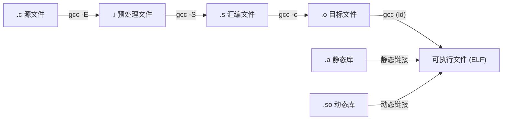
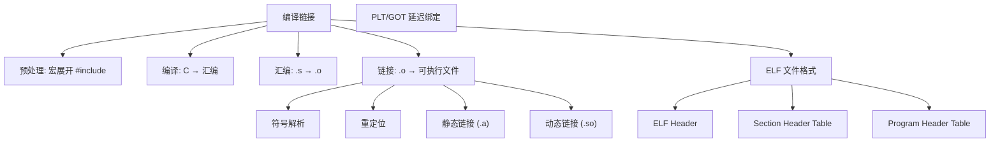
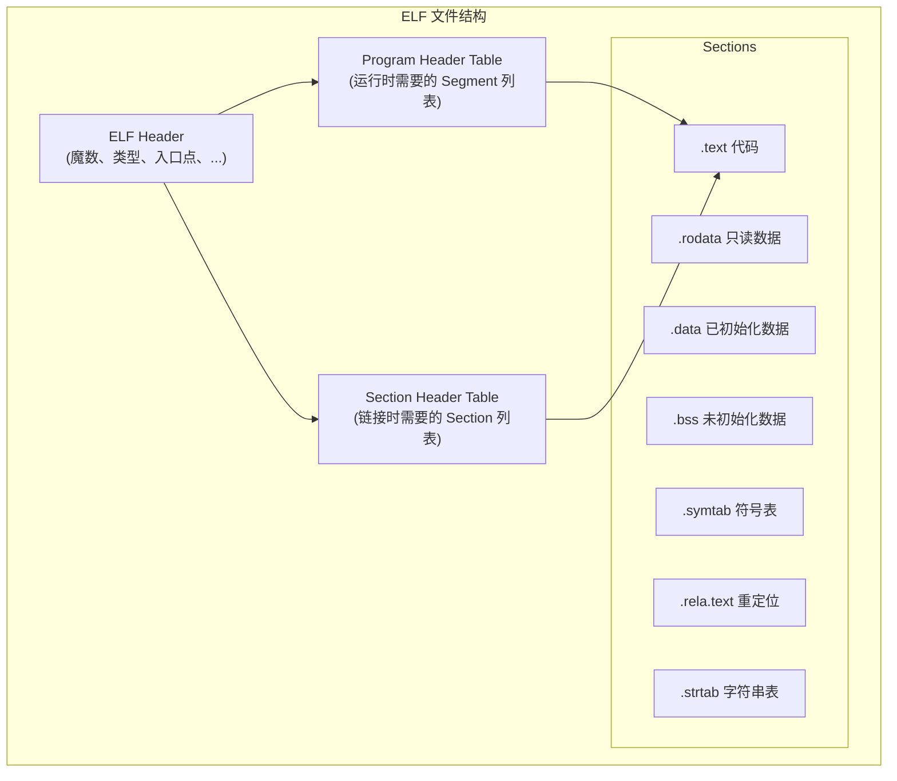
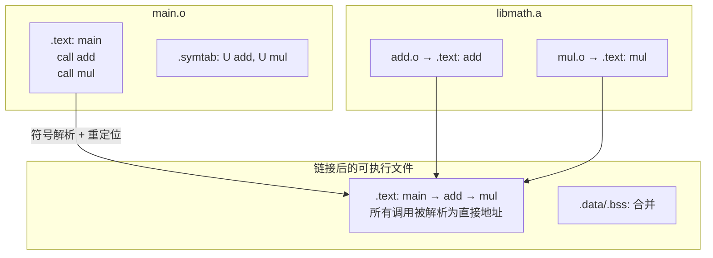
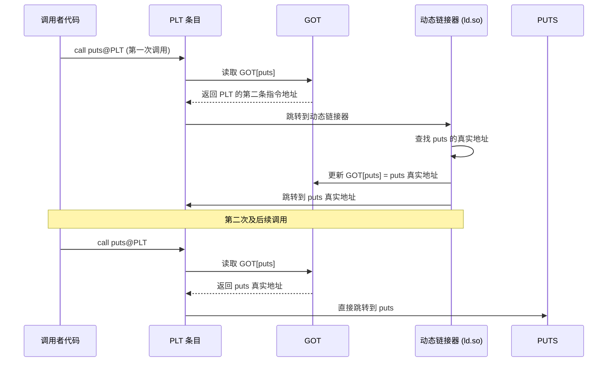

# 编译链接与ELF (Compilation, Linking & ELF)
---

## 章节概述

> 从 C 源代码到可执行程序，中间经历了预处理、编译、汇编、链接四个阶段。理解这个流水线是理解符号解析、链接错误、动态库加载、ASLR 等一切高级概念的基础。同时，ELF（Executable and Linkable Format）是 Linux 系统上可执行文件、目标文件、共享库和核心转储的统一格式。本章将手把手展示每个阶段的实际输出，并用 readelf/objdump/nm 等工具深入分析 ELF 内部结构。建议同时阅读 和 。



### 本章知识地图



---
### 第一节: 编译流水线全流程
---

#### 1.1 四阶段详解

让我们用同一个源文件观察四个阶段的输出：

```c
// hello.c
#include <stdio.h>

#define MSG "Hello, World!"
#define SQUARE(x) ((x) * (x))

int main() {
 printf("%s\n", MSG);
 int result = SQUARE(5);
 return result;
}
```

**阶段 1: 预处理 (Preprocessing)**

```bash
gcc -E hello.c -o hello.i

# hello.i 的内容:
# 1. #include <stdio.h> 被展开（stdio.h 的内容插入此处，通常几千行）
# 2. #define MSG 被文本替换
# 3. #define SQUARE(x) 被宏展开
# 4. 注释被移除
# 5. 条件编译 (#ifdef/#ifndef) 被处理
```

预处理文件中 `printf("%s\n", MSG)` 变成 `printf("%s\n", "Hello, World!")`，`SQUARE(5)` 变成 `((5) * (5))`。

```bash
# 只处理宏展开，不处理 #include
gcc -E -P hello.c # -P 移除行标记
```

**阶段 2: 编译 (Compilation)**

```bash
gcc -S hello.i -o hello.s

# 或直接从 .c 编译到 .s
gcc -S hello.c -o hello.s
```

生成的 hello.s (x86-64 AT&T 语法):

```asm
 .file "hello.c"
 .text
 .section .rodata
.LC0:
 .string "Hello, World!"
 .text
 .globl main
 .type main, @function
main:
.LFB0:
 pushq %rbp
 movq %rsp, %rbp
 subq $16, %rsp
 leaq .LC0(%rip), %rax # 加载字符串地址
 movq %rax, %rdi # 第一个参数
 call puts@PLT # printf 被优化为 puts
 movl $25, -4(%rbp) # SQUARE(5) = 25 在编译期算出!
 movl -4(%rbp), %eax
 leave
 ret
```

> 观察到 `SQUARE(5)` 被编译期常量折叠为 25。`printf` 因为没有格式化参数被优化为 `puts`。

**阶段 3: 汇编 (Assembly)**

```bash
gcc -c hello.s -o hello.o

# 或直接从 .c 到 .o
gcc -c hello.c -o hello.o
```

`.o` 文件是二进制 ELF 格式，包含机器码、数据和符号表：

```bash
# 查看目标文件头
readelf -h hello.o

# 查看 section 列表
readelf -S hello.o

# 查看符号表
nm hello.o
# 输出:
# 0000000000000000 T main ← T = .text 中定义的全局符号
# U puts ← U = 未定义，需要链接
# U _GLOBAL_OFFSET_TABLE_
```

```bash
# 反汇编目标文件
objdump -d hello.o

# hello.o: file format elf64-x86-64
# Disassembly of section .text:
# 0000000000000000 <main>:
# 0: 55 push %rbp
# 1: 48 89 e5 mov %rsp,%rbp
# 4: 48 83 ec 10 sub $0x10,%rsp
# 8: 48 8d 3d 00 00 00 00 lea 0x0(%rip),%rdi ← 地址为0! 待重定位
# f: e8 00 00 00 00 call 0 <main+0x14> ← 地址为0! 待重定位
```

> **重定位条目**: 注意 `.o` 文件中调用 `puts` 的地址是临时占位符 (0x00)。链接器负责填充正确的地址。`readelf -r hello.o` 显示重定位信息。

**阶段 4: 链接 (Linking)**

```bash
gcc hello.o -o hello

# 或一步到位
gcc hello.c -o hello

# 查看最终的可执行文件
readelf -h hello # ELF 头
readelf -d hello # 动态链接信息
ldd hello # 动态库依赖
```

链接后 `objdump -d hello` 显示地址都被正确填充了。

#### 1.2 各阶段命令速查表

| 阶段 | 命令 | 输入 | 输出 |
|------|------|------|------|
| 预处理 | `gcc -E hello.c -o hello.i` | .c | .i (文本) |
| 编译 | `gcc -S hello.c -o hello.s` | .c/.i | .s (文本) |
| 汇编 | `gcc -c hello.s -o hello.o` | .s | .o (ELF) |
| 链接 | `gcc hello.o -o hello` | .o | 可执行文件 (ELF) |
| 静态库创建 | `ar rcs libfoo.a foo.o bar.o` | .o | .a (静态库) |
| 动态库创建 | `gcc -shared -fPIC -o libfoo.so foo.c` | .c | .so (动态库) |

---
### 第二节: ELF 文件格式深度解析
---

#### 2.1 ELF 整体结构



#### 2.2 ELF Header (64 位)

```bash
readelf -h /bin/ls
```

```
ELF Header:
 Magic: 7f 45 4c 46 02 01 01 00 00 00 00 00 00 00 00 00
 Class: ELF64
 Data: 2's complement, little endian
 Version: 1 (current)
 OS/ABI: UNIX - System V
 Type: DYN (Position-Independent Executable file)
 Machine: Advanced Micro Devices X86-64
 Entry point address: 0x5850
 Start of program headers: 64 (bytes into file)
 Start of section headers: 133000
 Flags: 0x0
 Size of this header: 64 (bytes)
 Size of program headers: 56 (bytes)
 Number of program headers: 11
 Size of section headers: 64 (bytes)
 Number of section headers: 28
 Section header string table index: 27
```

```c
// ELF64 Header 结构体 (概念)
typedef struct {
 unsigned char e_ident[16]; // 魔数 + 类别信息
 uint16_t e_type; // ET_REL(.o), ET_EXEC, ET_DYN(.so/PIE)
 uint16_t e_machine; // EM_X86_64, EM_ARM, ...
 uint32_t e_version;
 uint64_t e_entry; // 程序入口点虚拟地址
 uint64_t e_phoff; // Program Header 表偏移
 uint64_t e_shoff; // Section Header 表偏移
 uint32_t e_flags;
 uint16_t e_ehsize; // ELF Header 大小
 uint16_t e_phentsize; // Program Header 表项大小
 uint16_t e_phnum; // Program Header 表项数量
 uint16_t e_shentsize; // Section Header 表项大小
 uint16_t e_shnum; // Section Header 表项数量
 uint16_t e_shstrndx; // Section 名称字符串表的索引
} Elf64_Ehdr;
```

#### 2.3 Sections vs Segments

**Sections** (节) — 供链接器使用，在目标文件 (.o) 中：
- `.text`：机器指令
- `.data`：已初始化数据
- `.bss`：未初始化数据
- `.rodata`：只读数据
- `.symtab`：符号表
- `.strtab`：字符串表
- `.rela.text`：.text 段的重定位条目

**Segments** (段) — 供加载器 (loader) 使用，在可执行文件/共享库中：

```bash
readelf -l hello
```

```
Program Headers:
 Type Offset VirtAddr PhysAddr
 FileSiz MemSiz Flags Align
 PHDR 0x0000000000000040 0x0000000000000040 0x0000000000000040
 0x0000000000000268 0x0000000000000268 R 0x8
 INTERP 0x00000000000002a8 0x00000000000002a8 0x00000000000002a8
 0x000000000000001c 0x000000000000001c R 0x1
 [Requesting program interpreter: /lib64/ld-linux-x86-64.so.2]
 LOAD 0x0000000000000000 0x0000000000000000 0x0000000000000000
 0x0000000000000658 0x0000000000000658 R 0x1000
 LOAD 0x0000000000001000 0x0000000000001000 0x0000000000001000
 0x00000000000001e5 0x00000000000001e5 R E 0x1000 ← text
 LOAD 0x0000000000002000 0x0000000000002000 0x0000000000002000
 0x0000000000000124 0x0000000000000124 R 0x1000 ← rodata
 LOAD 0x0000000000002df0 0x0000000000003df0 0x0000000000003df0
 0x0000000000000230 0x0000000000000238 RW 0x1000 ← data+bss
```

> **关键**: 一个 LOAD segment 可以包含多个 section。例如第二个 LOAD (R E) 通常包含 `.text`、`.plt` 等多个 section。加载器按 Page 粒度（通常 4KB）mmap 这些 segment。

---
### 第三节: 符号表与符号解析
---

#### 3.1 符号类型

```bash
nm hello.o
```

| 符号类型 | 含义 |
|----------|------|
| `T` | .text 中的全局符号（函数） |
| `t` | .text 中的本地符号（static 函数） |
| `D` | .data 中的全局符号 |
| `d` | .data 中的本地符号 |
| `B` | .bss 中的全局符号 |
| `b` | .bss 中的本地符号 |
| `U` | 未定义符号（需要其他文件提供） |
| `W` | 弱符号（weak） |
| `R` | .rodata 中的全局符号 |
| `r` | .rodata 中的本地符号 |

#### 3.2 extern vs static 链接属性

```c
// file1.c
int global_var = 42; // 全局符号 'D'
static int private_var = 10; // 内部链接 'd'

void public_func(void) { // 全局符号 'T'
 // ...
}

static void private_func(void) { // 内部链接 't'
 // ...
}

// file2.c
extern int global_var; // 引用 file1.c 的符号 'U'
// extern int private_var; // 链接错误! private_var 是 static
```

```bash
# 验证符号
gcc -c file1.c -o file1.o
gcc -c file2.c -o file2.o
nm file1.o | grep -E '(global|private)'
# 0000000000000000 D global_var
# 0000000000000000 d private_var
# 0000000000000000 T public_func
# 0000000000000000 t private_func

nm file2.o | grep global
# U global_var ← 未定义
```

#### 3.3 弱符号

```c
// 弱符号: 可以被同名的强符号覆盖
__attribute__((weak)) void debug_log(const char *msg) {
 // 默认实现: 什么都不做
}

// 如果其他地方定义了强版本, 优先使用强版本
// void debug_log(const char *msg) { printf("[DEBUG] %s\n", msg); }
```

弱符号在库函数中很常见——提供默认实现，允许用户覆盖。

---
### 第四节: 静态链接
---

#### 4.1 静态库创建和使用

```c
// mathlib.h
#ifndef MATHLIB_H
#define MATHLIB_H
int add(int a, int b);
int mul(int a, int b);
#endif

// add.c
#include "mathlib.h"
int add(int a, int b) { return a + b; }

// mul.c
#include "mathlib.h"
int mul(int a, int b) { return a * b; }
```

```bash
# 1. 编译为目标文件
gcc -c add.c mul.c

# 2. 创建静态库
ar rcs libmath.a add.o mul.o
# r = 替换, c = 创建, s = 索引

# 3. 查看静态库内容
ar t libmath.a
# add.o
# mul.o

# 4. 使用静态库
gcc main.c -L. -lmath -o main
# -L. : 在当前目录搜索库
# -lmath : 链接 libmath.a
```

#### 4.2 静态链接的内部过程



```bash
# 观察链接前后的符号差异
nm main.o
# U add
# 0000000000000000 T main
# U mul

nm main # 静态链接后
# 0000000000001169 T add
# 0000000000001149 T main
# 0000000000001179 T mul
# 所有 U (未定义) 符号都被解析为具体地址
```

---
### 第五节: 动态链接与 PLT/GOT
---

#### 5.1 动态库创建

```bash
# 创建位置无关的动态库
gcc -shared -fPIC -o libmath.so add.c mul.c

# 使用动态库
gcc main.c -L. -lmath -o main_dyn

# 运行时需要设置库搜索路径
LD_LIBRARY_PATH=. ./main_dyn
```

> `-fPIC` (Position Independent Code) 是关键——生成的代码可以在任意内存地址运行，不依赖绝对地址。

#### 5.2 PLT/GOT 延迟绑定机制

动态库的地址在**运行时**才能确定。PLT (Procedure Linkage Table) 和 GOT (Global Offset Table) 实现了**延迟绑定**——函数地址在第一次调用时才解析：



```bash
# 查看 PLT 条目
objdump -d -j .plt main_dyn

# 查看 GOT 条目
readelf -r main_dyn | grep GLOB_DAT

# 查看动态链接的符号
readelf --dyn-syms main_dyn

# 运行时调试动态链接
LD_DEBUG=all ./main_dyn 2>&1 | less
```

#### 5.3 汇编级别的 PLT/GOT

```asm
# 调用 puts@PLT:
call puts@PLT

# PLT 条目 (puts):
# .plt section:
puts@PLT:
 jmpq *GOT[puts](%rip) # 间接跳转: 通过 GOT 跳转到真实地址
 pushq $index # 压入索引 (用于解析)
 jmpq .PLT0 # 跳转到公共解析器

# PLT0 (公共解析器入口):
.PLT0:
 pushq GOT[1](%rip) # 压入 link_map 指针
 jmpq *GOT[2](%rip) # 跳转到 _dl_runtime_resolve
```

---
### 第六节: 实用工具大全
---

| 工具 | 用途 | 常用选项 |
|------|------|----------|
| `readelf -h` | ELF 头信息 | `-S` sections, `-l` segments, `-r` 重定位, `-s` 符号表 |
| `readelf -d` | 动态段信息 | `--dyn-syms` 动态符号 |
| `objdump -d` | 反汇编 | `-s` 完整内容, `-t` 符号, `-h` section头 |
| `nm` | 列出符号 | `-D` 动态符号, `-u` 仅未定义, `-g` 仅全局 |
| `ldd` | 显示动态库依赖 | `-v` 详细信息, `-r` 重定位 |
| `size` | 段大小统计 | `-A` System V格式, `-B` BSD格式 |
| `strip` | 去除符号表 | `--strip-all` 完全去除 |
| `strings` | 提取可打印字符串 | |
| `file` | 识别文件类型 | |
| `ar` | 创建/管理静态库 | `t` 列出, `x` 提取 |

```bash
# 一站式分析脚本
analyze_elf() {
 echo "=== File Type ==="
 file "$1"
 echo "=== ELF Header ==="
 readelf -h "$1" | head -20
 echo "=== Sections ==="
 readelf -S "$1" | head -30
 echo "=== Symbols (global) ==="
 nm -g "$1" | head -20
 echo "=== Dynamic Dependencies ==="
 ldd "$1" 2>/dev/null || echo " (静态链接或目标文件)"
}
```

---
### 第七节: 综合案例——分析一个完整程序
---

```c
// proj/main.c
#include <stdio.h>
#include "calc.h"

int main() {
 int a = 10, b = 20;
 printf("add(%d,%d) = %d\n", a, b, add(a, b));
 printf("mul(%d,%d) = %d\n", a, b, mul(a, b));
 return 0;
}

// proj/calc.h
#ifndef CALC_H
#define CALC_H
int add(int a, int b);
int mul(int a, int b);
#endif

// proj/calc.c
#include "calc.h"
static int internal_helper(int x) { return x; }
int add(int a, int b) { return internal_helper(a + b); }
int mul(int a, int b) { return a * b; }
```

```bash
# 完整分析流程
cd proj

# 1. 预处理
gcc -E main.c -o main.i
wc -l main.i # 观察 include 展开后的行数（通常数千行）

# 2. 编译到汇编
gcc -S calc.c -o calc.s
cat calc.s # 观察 static 函数被重命名为 .L 前缀
 # 观察 .globl add 和 .globl mul

# 3. 汇编到目标文件
gcc -c calc.c main.c
nm calc.o # T add, T mul, t internal_helper
nm main.o # T main, U add, U mul, U printf

# 4. 链接
gcc calc.o main.o -o program

# 5. 深入分析最终二进制
readelf -S program # 查看所有 section
objdump -d program # 反汇编（观察 add/mul 被解析为直接 call）
nm program | grep -E '(add|mul|main)' # 全局符号都有地址了
ldd program # 查看依赖的动态库（libc.so.6 等）
size program # text data bss 大小统计
```

---

## 章节测试

### 判断题（共10题）

> [!question] 判断题 1
> 预处理阶段只处理 `#include` 和 `#define`，不处理注释。 （ ）
> - [ ] 正确
> - [ ] 错误
>
> > [!success]- 点击查看答案
> > 答案: 错误
> >
> > **解析**: 预处理阶段处理 `#include`、`#define`（宏展开）、`#ifdef`/`#if`（条件编译）、`#pragma`，并且**移除注释**（替换为空格）。

> [!question] 判断题 2
> 目标文件 (.o) 中所有函数调用的地址在汇编阶段就已确定。 （ ）
> - [ ] 正确
> - [ ] 错误
>
> > [!success]- 点击查看答案
> > 答案: 错误
> >
> > **解析**: 目标文件中跨文件的函数调用地址是未确定的（重定位条目中的临时值 0x0）。只有在链接阶段，链接器解析所有符号后，才填充正确的地址。

> [!question] 判断题 3
> `nm` 输出的符号类型 `T` 表示该符号在 .text 段中定义。 （ ）
> - [ ] 正确
> - [ ] 错误
>
> > [!success]- 点击查看答案
> > 答案: 正确
> >
> > **解析**: `T` = Text section, global symbol。小写 `t` 表示 local (static) text symbol。

> [!question] 判断题 4
> `ldd` 可以将静态库链接到可执行文件中。 （ ）
> - [ ] 正确
> - [ ] 错误
>
> > [!success]- 点击查看答案
> > 答案: 错误
> >
> > **解析**: `ldd` (List Dynamic Dependencies) 是用来查看**已链接**程序的动态库依赖的工具，不是链接器。链接器是 `ld`（由 gcc 间接调用）。

> [!question] 判断题 5
> ELF 文件的魔数是 `0x7F 'E' 'L' 'F'`。 （ ）
> - [ ] 正确
> - [ ] 错误
>
> > [!success]- 点击查看答案
> > 答案: 正确
> >
> > **解析**: ELF 文件以 4 字节魔数开始：`0x7F` `'E'` `'L'` `'F'`（`\x7fELF`）。这允许 `file` 命令快速识别 ELF 文件。

> [!question] 判断题 6
> `static` 函数不能被其他 .c 文件中的代码调用。 （ ）
> - [ ] 正确
> - [ ] 错误
>
> > [!success]- 点击查看答案
> > 答案: 正确
> >
> > **解析**: `static` 函数具有内部链接（internal linkage），其符号不出现在全局符号表中（nm 中标记为 `t` 而非 `T`），其他编译单元无法引用。

> [!question] 判断题 7
> Section Header Table 在可执行文件中是必需的，移除它程序无法运行。 （ ）
> - [ ] 正确
> - [ ] 错误
>
> > [!success]- 点击查看答案
> > 答案: 错误
> >
> > **解析**: 运行时只需要 Program Header Table（Segments 描述）。Section Header Table 仅供链接器和调试器使用，可以用 `strip` 移除，程序仍可正常运行。

> [!question] 判断题 8
> `-fPIC` 生成的代码可以在任意地址运行。 （ ）
> - [ ] 正确
> - [ ] 错误
>
> > [!success]- 点击查看答案
> > 答案: 正确
> >
> > **解析**: Position Independent Code (PIC) 使用 PC 相对寻址（如 `lea .LC0(%rip), %rax`）和 GOT 访问全局变量，不依赖固定的绝对地址。这是动态库的必备要求。

> [!question] 判断题 9
> 动态库 (.so) 在链接时被完整复制到可执行文件中。 （ ）
> - [ ] 正确
> - [ ] 错误
>
> > [!success]- 点击查看答案
> > 答案: 错误
> >
> > **解析**: 动态库在链接时只记录依赖关系（NEEDED 条目），实际的库代码在**运行时**由动态链接器 ld.so 加载到进程地址空间。只有静态库 (.a) 在链接时被复制。

> [!question] 判断题 10
> ELF 中的 `.bss` 段在文件中占用的空间为零。 （ ）
> - [ ] 正确
> - [ ] 错误
>
> > [!success]- 点击查看答案
> > 答案: 正确
> >
> > **解析**: .bss 在文件中标记为 NOBITS 类型，只记录需要的大小，不实际占用文件空间。加载时由操作系统分配内存并清零。

### 选择题（共10题）

> [!question] 选择题 1
> `gcc -E` 命令会停止在编译流程的哪个阶段？
> - [ ] A. 编译后
> - [ ] B. 预处理后
> - [ ] C. 汇编后
> - [ ] D. 链接后
>
> > [!success]- 点击查看答案
> > 正确答案: B
> >
> > **解析**: `-E` 只运行预处理阶段（展开 #include、宏、条件编译），输出 .i 文件。`-S` 输出汇编 (.s)，`-c` 输出目标文件 (.o)。

> [!question] 选择题 2
> 以下哪个命令可以显示目标文件中未定义的符号？
> - [ ] A. `objdump -d file.o`
> - [ ] B. `nm -u file.o`
> - [ ] C. `readelf -S file.o`
> - [ ] D. `file file.o`
>
> > [!success]- 点击查看答案
> > 正确答案: B
> >
> > **解析**: `nm -u` 列出所有未定义符号（U 类型）。`objdump -d` 反汇编，`readelf -S` 显示 section 信息，`file` 显示文件类型。

> [!question] 选择题 3
> 动态链接中的 PLT 代表什么？
> - [ ] A. Program Loading Table
> - [ ] B. Procedure Linkage Table
> - [ ] C. Position Lookup Table
> - [ ] D. Pre-Linked Table
>
> > [!success]- 点击查看答案
> > 正确答案: B
> >
> > **解析**: PLT = Procedure Linkage Table（过程链接表）。它提供对动态链接函数的间接调用支持，配合 GOT (Global Offset Table) 实现延迟绑定。

> [!question] 选择题 4
> 创建一个位置无关的动态库需要使用的 GCC 选项是：
> - [ ] A. `-static -fPIC`
> - [ ] B. `-shared -fPIC`
> - [ ] C. `-dynamic -fPIC`
> - [ ] D. `-c -fPIC`
>
> > [!success]- 点击查看答案
> > 正确答案: B
> >
> > **解析**: `-shared` 生成共享库 (.so)，`-fPIC` 生成位置无关代码。完整命令：`gcc -shared -fPIC -o libfoo.so foo.c`。

> [!question] 选择题 5
> ELF 文件中，哪个段包含只读的全局常量数据？
> - [ ] A. .text
> - [ ] B. .data
> - [ ] C. .rodata
> - [ ] D. .bss
>
> > [!success]- 点击查看答案
> > 正确答案: C
> >
> > **解析**: .rodata (Read-Only Data) 包含 const 全局变量和字符串字面量。该段映射为只读内存页，尝试写入会导致段错误。

> [!question] 选择题 6
> `nm` 输出中，符号类型 `t`（小写）和 `T`（大写）的区别是？
> - [ ] A. `t` 在 .text，`T` 在 .data
> - [ ] B. `t` 是局部符号，`T` 是全局符号
> - [ ] C. `t` 是弱符号，`T` 是强符号
> - [ ] D. 没有区别
>
> > [!success]- 点击查看答案
> > 正确答案: B
> >
> > **解析**: 大写 = 全局符号（可被其他文件引用），小写 = 局部符号（仅在当前编译单元可见）。`T` = 全局 text，`t` = 局部 text。

> [!question] 选择题 7
> 以下哪个是静态库文件 (.a) 的创建和管理工具？
> - [ ] A. ld
> - [ ] B. tar
> - [ ] C. ar
> - [ ] D. nm
>
> > [!success]- 点击查看答案
> > 正确答案: C
> >
> > **解析**: `ar` (archiver) 用于创建和管理静态库。`ar rcs libfoo.a foo.o bar.o` 创建静态库，`ar t libfoo.a` 列出内容。

> [!question] 选择题 8
> 对于以下两个文件：
> ```c
> // a.c: int x = 10;
> // b.c: int x;
> ```
> 链接时哪个 x 会被使用？
> - [ ] A. 两个 x 冲突，链接失败
> - [ ] B. a.c 的 x (显式初始化，强符号)
> - [ ] C. b.c 的 x
> - [ ] D. 随机选择一个
>
> > [!success]- 点击查看答案
> > 正确答案: B
> >
> > **解析**: 已初始化的全局变量是"强符号"，未初始化的全局变量是"弱符号"（C 语义中的暂定定义）。链接器选择强符号。这是 C 的 tentative definition 规则。

> [!question] 选择题 9
> GOT (Global Offset Table) 的主要作用是？
> - [ ] A. 存储全局变量名称
> - [ ] B. 存储全局数据符号的运行时地址
> - [ ] C. 存储函数参数
> - [ ] D. 替代栈
>
> > [!success]- 点击查看答案
> > 正确答案: B
> >
> > **解析**: GOT 是一个指针表，每个表项存储一个全局符号（变量或函数）的运行时地址。PIC 代码通过 GOT 间接访问全局符号，避免硬编码绝对地址。GOT 项由动态链接器在加载时或延迟绑定时填充。

> [!question] 选择题 10
> 使用 `strip` 命令移除符号表后的程序：
> - [ ] A. 无法运行
> - [ ] B. 可以运行但 gdb 调试困难
> - [ ] C. 运行速度更快
> - [ ] D. 变成静态链接
>
> > [!success]- 点击查看答案
> > 正确答案: B
> >
> > **解析**: strip 移除调试符号和局部符号表，减小文件体积。程序仍可正常运行（运行时依赖的是 dynamic symbols，不会被 strip 移除），但 gdb 无法显示函数名和变量名。

---

### 编程练习题

> [!example] 练习 1：编译流水线分析
> **难度**: 简单
>
> 对一个多文件 C 项目执行全流程分析：
> - 编写至少 3 个 .c 文件 + 1 个 .h 头文件
> - 包含全局变量、static 变量、extern 声明
> - 用 `gcc -E/-S/-c` 分步处理每个文件
> - 对比 .s 文件中 static vs global 函数的汇编差异
> - 用 `nm` 分析每个 .o 的符号表
> - 用 `readelf -r` 分析重定位条目
> - 分别做静态链接和动态链接，对比最终二进制

> [!example] 练习 2：实现简易链接器
> **难度**: 简单
>
> 实现一个最简化的静态链接器：
> - 解析 ELF 目标文件（.o）的符号表和重定位表
> - 解决符号引用：将 U 符号匹配到 T/D/B 符号
> - 合并各 .o 的 section
> - 对需要重定位的地址执行重定位计算（R_X86_64_PC32 等）
> - 输出一个可工作的 ELF 可执行文件
> - 可用 mmap 读取 ELF，只支持最简单的情况

> [!example] 练习 3：LD_PRELOAD 实验
> **难度**: 简单
>
> 使用 `LD_PRELOAD` 拦截标准库函数：
> - 编写自己的 `malloc`/`free` 包装函数（记录分配/释放日志）
> - 编译为共享库 `libmemtrace.so`
> - 使用 `LD_PRELOAD=./libmemtrace.so ./program` 运行
> - 验证拦截成功（对比有/无 LD_PRELOAD 的输出）
> - 研究 `dlsym(RTLD_NEXT, "malloc")` 获取原始函数
> - 编写报告说明 LD_PRELOAD 的安全意义（类似 Windows DLL 劫持）

---

## 知识网络

- **汇编参考**: — 完整编译原理覆盖
- **汇编参考**: — 机器指令编码
- **同系列相关**: [[09_多文件与模块化|多文件与模块化]] — 多文件编译与 Makefile
- **同系列相关**: [[02_内存模型与布局|内存模型与布局]] — ELF section 在内存中的映射
- **C++ 对比**: [[../../cpp教程/cpp深化教程/02_预处理器|CPP: 预处理器]] — C/C++ 预处理对比
