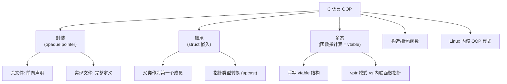
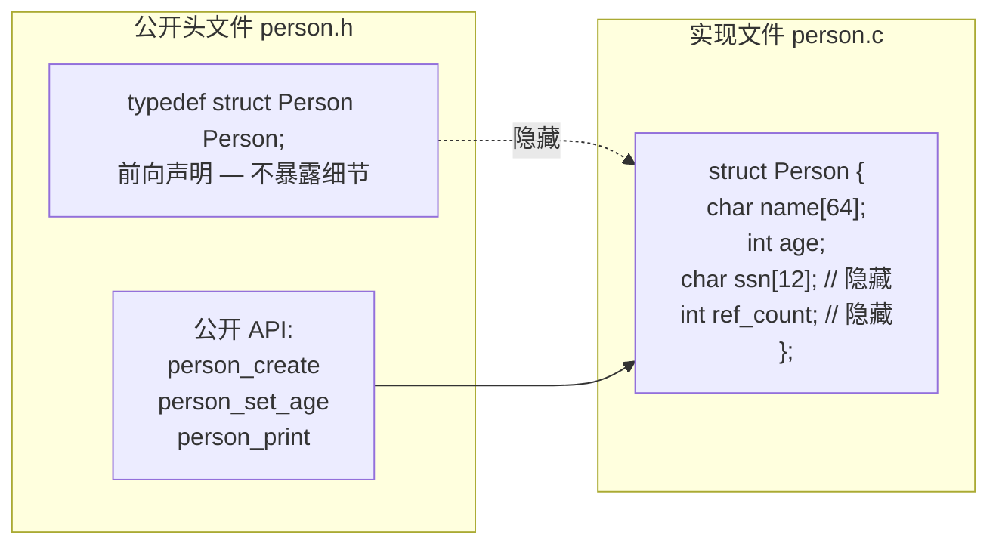
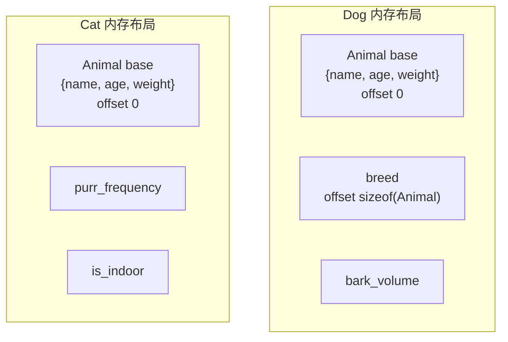
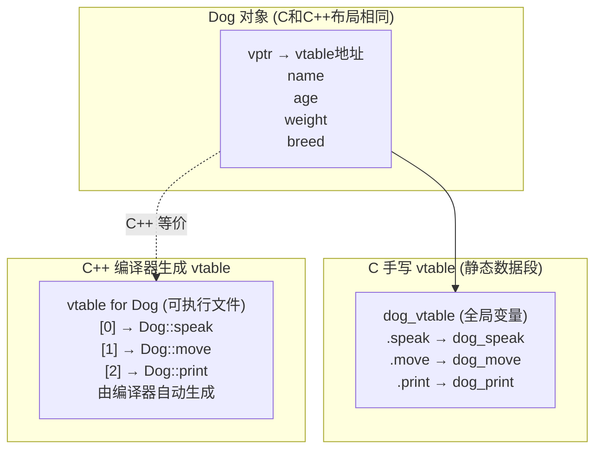
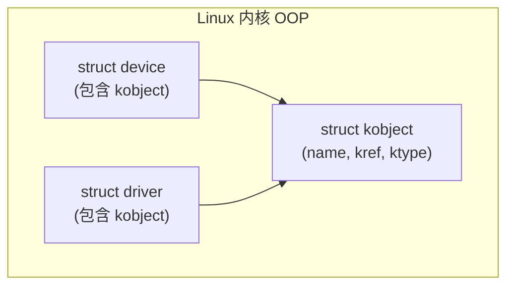
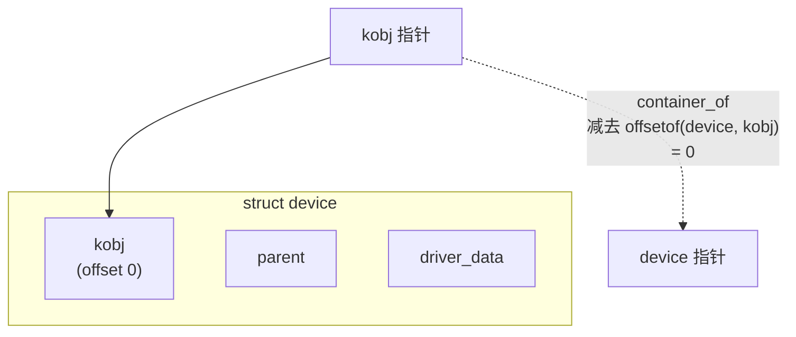

# 面向对象C编程  (Object-Oriented Programming in C)
---

##  章节概述

>  C 语言没有 class 关键字，不等于 C 不能做面向对象编程。恰恰相反——C++ 的类、继承、多态、虚函数，编译器在底层全部翻译成了**C 语言可以手写的结构体和函数指针**。本章将展示如何用纯 C 实现封装、继承、多态这些 OOP 核心特性，并揭示它们与 C++ 编译结果的对应关系。理解本章后，C++ 的 OOP 在你眼中将只是"语法糖"。

本章的核心思想是：**OOP 是一种设计范式，不是语言特性**。Linux 内核、GTK+、CPython 等大型 C 项目都使用本章描述的模式。建议同时阅读 [[04_函数指针与回调|函数指针与回调]] 理解函数指针，以及 [[../../cpp教程/cpp深化教程/05_面向对象(一)类与对象基础|CPP: 类与对象基础]]、[[../../cpp教程/cpp深化教程/06_面向对象(二)继承|CPP: 继承]] 和 [[../../cpp教程/cpp深化教程/07_面向对象(三)多态与虚函数|CPP: 多态与虚函数]] 对比 C++ 的等价特性。

### 本章知识地图



---
###  第一节: 封装——信息隐藏与不透明指针
---

#### 1.1 问题：C 结构体的公开性

```c
//  坏设计: 所有细节暴露给使用者
// person.h
struct Person {
    char name[64];
    int age;
    double salary;        // 用户可以看到甚至篡改内部数据
    char ssn[12];         // 敏感信息完全暴露
    int internal_id;
    // ... 100个内部字段
};

// 使用者可以:
// person.salary = -100000;   // 直接破坏数据
// strcpy(person.ssn, "fake");  // 绕过安全检查
```

#### 1.2 解决方案：不透明指针（Opaque Pointer / Handle Pattern）

```c
// ===== person.h (公开头文件) =====
#ifndef PERSON_H
#define PERSON_H

// 前向声明——使用者不知道结构体内部有什么
typedef struct Person Person;

// "公共方法"——只暴露接口，不暴露实现
Person *person_create(const char *name, int age);
void person_destroy(Person *p);

// 访问器 (getter) —— 控制数据的读写
const char *person_get_name(const Person *p);
int person_get_age(const Person *p);
void person_set_age(Person *p, int new_age);
double person_get_salary(const Person *p);
void person_set_salary(Person *p, double new_salary);

// 业务方法
void person_print(const Person *p);
int person_compare_by_age(const Person *a, const Person *b);

#endif
```

```c
// ===== person.c (实现文件) =====
#include "person.h"
#include <stdio.h>
#include <stdlib.h>
#include <string.h>
#include <assert.h>

// 结构体的完整定义——仅在此文件可见
struct Person {
    char name[64];
    int age;
    double salary;
    char ssn[12];          // 外界完全不可见
    int internal_id;
    int reference_count;   // 内部引用计数
};

// 静态内部函数——实现细节
static int next_id(void) {
    static int id = 0;
    return ++id;
}

Person *person_create(const char *name, int age) {
    Person *p = malloc(sizeof(Person));
    if (!p) return NULL;

    strncpy(p->name, name, sizeof(p->name) - 1);
    p->name[sizeof(p->name) - 1] = '\0';
    p->age = age;
    p->salary = 0.0;
    memset(p->ssn, 0, sizeof(p->ssn));
    p->internal_id = next_id();
    p->reference_count = 1;

    return p;
}

void person_destroy(Person *p) {
    if (!p) return;
    // 复杂的清理逻辑对外界透明
    memset(p, 0, sizeof(Person));  // 清除敏感数据
    free(p);
}

const char *person_get_name(const Person *p) {
    assert(p != NULL);
    return p->name;
}

int person_get_age(const Person *p) {
    assert(p != NULL);
    return p->age;
}

void person_set_age(Person *p, int new_age) {
    assert(p != NULL);
    assert(new_age >= 0 && new_age <= 150);  // 数据验证
    p->age = new_age;
}

double person_get_salary(const Person *p) {
    assert(p != NULL);
    return p->salary;
}

void person_set_salary(Person *p, double new_salary) {
    assert(p != NULL);
    assert(new_salary >= 0);   // 防止非法数据
    p->salary = new_salary;
}

void person_print(const Person *p) {
    assert(p != NULL);
    printf("Person #%d: %s, 年龄 %d, 薪资 %.2f\n",
           p->internal_id, p->name, p->age, p->salary);
}

int person_compare_by_age(const Person *a, const Person *b) {
    return (a->age > b->age) - (a->age < b->age);
}
```

```c
// ===== main.c (使用者代码) =====
#include "person.h"

int main() {
    Person *alice = person_create("Alice", 30);
    Person *bob = person_create("Bob", 25);

    person_set_salary(alice, 75000.0);
    person_set_salary(bob, 68000.0);

    person_print(alice);
    person_print(bob);

    printf("按年龄比较: %d\n", person_compare_by_age(alice, bob));

    //  编译错误（如果尝试访问内部字段）:
    // alice->age = 999;           // 编译错误！Person 定义不可见
    // printf("%s\n", alice->ssn); // 无法访问敏感信息

    person_destroy(alice);
    person_destroy(bob);
    return 0;
}
```



>  **对应 C++ 特性**: 不透明指针 + 访问器函数 = C++ 的 `private` 成员 + `public` 成员函数。区别在于 C 完全靠约定和编译期的类型遮蔽。详见 [[../../cpp教程/cpp深化教程/05_面向对象(一)类与对象基础|CPP: 类与对象基础]]。

---
###  第二节: 继承——结构体嵌入
---

#### 2.1 通过嵌入实现"是一个"关系

C 实现继承的核心技巧：**将"父类"结构体作为"子类"结构体的第一个成员**。这使得子类指针可以安全地转换为父类指针（upcast）。

```c
// ===== animal.h =====
#ifndef ANIMAL_H
#define ANIMAL_H

// "基类" — Animal
typedef struct {
    const char *name;
    int age;
    double weight;
} Animal;

void animal_init(Animal *a, const char *name, int age, double weight);
void animal_print(const Animal *a);
const char *animal_get_name(const Animal *a);

#endif
```

```c
// ===== animal.c =====
#include "animal.h"
#include <stdio.h>
#include <string.h>

void animal_init(Animal *a, const char *name, int age, double weight) {
    a->name = name;
    a->age = age;
    a->weight = weight;
}

void animal_print(const Animal *a) {
    printf("Animal: %s, 年龄 %d, 体重 %.1f kg\n",
           a->name, a->age, a->weight);
}

const char *animal_get_name(const Animal *a) {
    return a->name;
}
```

```c
// ===== dog.h =====
#ifndef DOG_H
#define DOG_H
#include "animal.h"

// "派生类" — Dog "继承" Animal
typedef struct {
    Animal base;        //  父类作为第一个成员

    // 子类特有成员
    const char *breed;  // 品种
    int bark_volume;    // 叫声大小
} Dog;

void dog_init(Dog *d, const char *name, int age, double weight,
              const char *breed, int bark_volume);
void dog_bark(const Dog *d);
void dog_print(const Dog *d);

#endif
```

```c
// ===== dog.c =====
#include "dog.h"
#include <stdio.h>

void dog_init(Dog *d, const char *name, int age, double weight,
              const char *breed, int bark_volume) {
    animal_init(&d->base, name, age, weight);  // 调用父类"构造函数"
    d->breed = breed;
    d->bark_volume = bark_volume;
}

void dog_bark(const Dog *d) {
    printf("%s: ", d->base.name);
    for (int i = 0; i < (d->bark_volume / 10); i++)
        printf("汪");
    printf("!\n");
}

void dog_print(const Dog *d) {
    animal_print(&d->base);   // 调用父类方法
    printf("  品种: %s, 叫声等级: %d\n", d->breed, d->bark_volume);
}
```

```c
// ===== cat.h =====
#ifndef CAT_H
#define CAT_H
#include "animal.h"

typedef struct {
    Animal base;        //  同样的嵌入模式
    int purr_frequency; // 呼噜频率
    bool is_indoor;     // 室内猫？
} Cat;

void cat_init(Cat *c, const char *name, int age, double weight,
              bool indoor);
void cat_purr(const Cat *c);
void cat_print(const Cat *c);

#endif
```

```c
// ===== 使用示例 =====
int main() {
    Dog my_dog;
    dog_init(&my_dog, "Buddy", 3, 25.0, "Golden Retriever", 8);

    Cat my_cat;
    cat_init(&my_cat, "Whiskers", 2, 4.5, true);

    // 向上转型 (upcast) — 关键技巧！
    Animal *animals[2];
    animals[0] = (Animal *)&my_dog;  // Dog* → Animal*
    animals[1] = (Animal *)&my_cat;  // Cat* → Animal*

    // 统一的父类接口
    for (int i = 0; i < 2; i++) {
        animal_print(animals[i]);  // 多态调用（但只能调用 Animal 方法）
    }

    // 调用子类特有方法
    dog_bark(&my_dog);
    cat_purr(&my_cat);

    return 0;
}
```



>  **为什么放在第一个成员**: `(Animal*)&my_dog` 是安全且零开销的类型转换——`&my_dog` 和 `&my_dog.base` 指向相同的地址（因为 base 在偏移 0）。这就是 C++ 继承的底层机制：派生类对象的内存起始处就是基类子对象。

---
###  第三节: 多态——手写虚函数表
---

#### 3.1 问题：如何实现统一的 speak() 接口

在第二节中，`animal_print` 只能访问 Animal 通用信息。如何让 Dog 叫 "汪汪"、Cat 叫 "喵喵" ——使用同一个函数接口但不同实现？答案：**函数指针表（vtable）**。

```c
// ===== animal_v2.h =====
#ifndef ANIMAL_V2_H
#define ANIMAL_V2_H
#include <stdio.h>

// 前向声明
typedef struct AnimalV2 AnimalV2;

// 虚函数表（vtable）结构
typedef struct {
    void (*speak)(const AnimalV2 *self);
    void (*move)(const AnimalV2 *self, double distance);
    void (*print)(const AnimalV2 *self);
} AnimalVTable;

// 基类结构体
struct AnimalV2 {
    const AnimalVTable *vtable;  //  vtable 指针 (vptr)
    const char *name;
    int age;
    double weight;
};

// "构造函数"
void animal_v2_init(AnimalV2 *a, const AnimalVTable *vt,
                    const char *name, int age, double weight);

// 通过 vtable 调用的"虚函数"包装
static inline void animal_speak(const AnimalV2 *a) {
    a->vtable->speak(a);
}

static inline void animal_move(const AnimalV2 *a, double distance) {
    a->vtable->move(a, distance);
}

static inline void animal_print_v2(const AnimalV2 *a) {
    a->vtable->print(a);
}

#endif
```

```c
// ===== animal_v2.c =====
#include "animal_v2.h"

// 默认实现
static void default_speak(const AnimalV2 *self) {
    printf("[动物 %s 发出叫声]\n", self->name);
}

static void default_move(const AnimalV2 *self, double distance) {
    printf("%s 移动了 %.1f 米\n", self->name, distance);
}

static void default_print(const AnimalV2 *self) {
    printf("Animal: %s, 年龄 %d, 体重 %.1f kg\n",
           self->name, self->age, self->weight);
}

// 默认虚函数表
static const AnimalVTable animal_default_vtable = {
    .speak = default_speak,
    .move  = default_move,
    .print = default_print,
};

void animal_v2_init(AnimalV2 *a, const AnimalVTable *vt,
                    const char *name, int age, double weight) {
    a->vtable = vt ? vt : &animal_default_vtable;
    a->name = name;
    a->age = age;
    a->weight = weight;
}
```

```c
// ===== dog_v2.h =====
#ifndef DOG_V2_H
#define DOG_V2_H
#include "animal_v2.h"

typedef struct {
    AnimalV2 base;         // "继承"
    const char *breed;
} DogV2;

void dog_v2_init(DogV2 *d, const char *name, int age, double weight,
                 const char *breed);

// 获取 Dog 的虚函数表
const AnimalVTable *dog_v2_get_vtable(void);

#endif
```

```c
// ===== dog_v2.c =====
#include "dog_v2.h"

// Dog 特有的虚函数实现
static void dog_speak(const AnimalV2 *self) {
    printf("%s 说: 汪汪汪!\n", self->name);
}

static void dog_move(const AnimalV2 *self, double distance) {
    printf("%s 欢快地跑了 %.1f 米\n", self->name, distance);
}

static void dog_print(const AnimalV2 *self) {
    const DogV2 *dog = (const DogV2 *)self;  // 向下转型
    printf("Dog: %s (%s), 年龄 %d, 体重 %.1f kg\n",
           self->name, dog->breed, self->age, self->weight);
}

//  Dog 的虚函数表 — 通过函数指针指向具体实现
static const AnimalVTable dog_vtable = {
    .speak = dog_speak,
    .move  = dog_move,
    .print = dog_print,
};

const AnimalVTable *dog_v2_get_vtable(void) {
    return &dog_vtable;
}

void dog_v2_init(DogV2 *d, const char *name, int age, double weight,
                 const char *breed) {
    animal_v2_init(&d->base, &dog_vtable, name, age, weight);
    d->breed = breed;
}
```

```c
// ===== cat_v2.c =====
#include "animal_v2.h"

typedef struct {
    AnimalV2 base;
    bool is_indoor;
} CatV2;

static void cat_speak(const AnimalV2 *self) {
    printf("%s 说: 喵~\n", self->name);
}

static void cat_move(const AnimalV2 *self, double distance) {
    if (((const CatV2 *)self)->is_indoor)
        printf("%s 慵懒地伸了个懒腰，拒绝了出门\n", self->name);
    else
        printf("%s 优雅地走了 %.1f 米\n", self->name, distance);
}

static void cat_print(const AnimalV2 *self) {
    const CatV2 *cat = (const CatV2 *)self;
    printf("Cat: %s, %s, 年龄 %d, 体重 %.1f kg\n",
           self->name, cat->is_indoor ? "室内猫" : "室外猫",
           self->age, self->weight);
}

static const AnimalVTable cat_vtable = {
    .speak = cat_speak,
    .move  = cat_move,
    .print = cat_print,
};

// 公共初始化
void cat_v2_init(CatV2 *c, const char *name, int age, double weight,
                 bool indoor) {
    animal_v2_init(&c->base, &cat_vtable, name, age, weight);
    c->is_indoor = indoor;
}
```

```c
// ===== 多态使用示例 =====
int main() {
    DogV2 my_dog;
    dog_v2_init(&my_dog, "Buddy", 3, 25.0, "Golden Retriever");

    CatV2 my_cat;
    cat_v2_init(&my_cat, "Whiskers", 2, 4.5, true);

    //  真正的多态 — 通过基类指针调用
    AnimalV2 *zoo[2];
    zoo[0] = &my_dog.base;   // upcast
    zoo[1] = &my_cat.base;

    // 相同的接口，不同的行为！
    for (int i = 0; i < 2; i++) {
        animal_speak(zoo[i]);       // Dog → 汪汪汪, Cat → 喵~
        animal_move(zoo[i], 10.0);   // Dog 欢快跑, Cat 拒绝
        animal_print_v2(zoo[i]);     // 各自的 print 实现
        printf("---\n");
    }

    return 0;
}
```

#### 3.2 C vtable vs C++ vtable 对比



| 特性 | C (手写) | C++ (编译器) |
|------|----------|-------------|
| vtable 创建 | 手动定义全局结构体 | 编译器自动生成 |
| vptr 赋值 | 构造函数中手动设置 | 编译器自动插入 |
| 虚函数调用 | `obj->vtable->func(obj)` | `obj->func()`（编译器翻译为前者） |
| this 指针 | 手动传递 `self` | 隐式 `this` 参数 |
| 类型安全 | 靠约定和类型转换 | 编译期检查 |
| 析构函数 | 手动调用 | 编译器自动调用链 |
| 纯虚函数 | 设为 NULL 或错误处理 | `= 0` 语法 |

>  **核心洞察**: C++ 的虚函数机制并没有硬件层面的新特性——就是函数指针表 + 间接调用。所有"魔法"都是编译器的语法糖。这也是为什么理解 C 的 vtable 实现后，C++ 的面向对象变得透明。详见 [[../../cpp教程/cpp深化教程/07_面向对象(三)多态与虚函数|CPP: 多态与虚函数]]。

#### 3.3 汇编层面的间接调用

```c
// animal_speak(zoo[0]) 被翻译为:
// zoo[0]->vtable->speak(zoo[0])
```

```asm
# x86-64 汇编实现:
movq    -48(%rbp), %rax        # 加载 zoo[0] (即对象指针)
movq    (%rax), %rdx            # 加载 vptr (对象的前8字节)
movq    -48(%rbp), %rax         # 重新加载对象指针
movq    %rax, %rdi              # 第一个参数 = this/self 指针
call    *(%rdx)                 #  间接调用 vtable[0] (speak)
# 这是 C++ 虚函数调用的核心—— call *(%rdx)
```

---
###  第四节: 构造与析构——对象生命周期管理
---

#### 4.1 构造函数和析构函数模式

```c
// 完整的对象生命周期管理
typedef struct {
    // 虚函数表
    const struct ObjectVTable *vtable;

    // 引用计数（可选，用于共享所有权）
    int ref_count;

    // 类型标识（RTTI 的 C 语言等价）
    const char *type_name;
} Object;

// 通用方法
void object_retain(Object *obj) { obj->ref_count++; }
void object_release(Object *obj) {
    if (--obj->ref_count == 0) {
        // 调用实际的析构函数
        obj->vtable->destroy(obj);
        free(obj);
    }
}
```

```c
// ===== 对象工厂模式 =====
// 每个类型提供 create/destroy 配对

// 形状层次结构
typedef struct Shape {
    const struct ShapeVTable *vtable;
    double x, y;  // 位置
    int color;    // 颜色
} Shape;

typedef struct {
    void (*draw)(const Shape *self);
    double (*area)(const Shape *self);
    void (*destroy)(Shape *self);
} ShapeVTable;

// 圆形
typedef struct {
    Shape base;
    double radius;
} Circle;

// 矩形
typedef struct {
    Shape base;
    double width, height;
} Rectangle;

// 构造函数示例
Circle *circle_create(double x, double y, double radius) {
    Circle *c = malloc(sizeof(Circle));
    if (!c) return NULL;

    // 初始化基类
    shape_init(&c->base, &circle_vtable, x, y);
    c->radius = radius;
    return c;
}

void circle_destroy(Circle *c) {
    // 子类特有的清理
    free(c);
    // 如果基类也需要清理，先调用基类的清理逻辑
}
```

---
###  第五节: Linux 内核中的 OOP 模式
---

#### 5.1 文件操作表——vtable 的经典应用

Linux 内核中 `struct file_operations` 是 C 语言多态的教科书级实现：

```c
// 简化的内核文件操作表（来自 <linux/fs.h> 概念）
struct file_operations {
    struct module *owner;
    loff_t (*llseek)(struct file *, loff_t, int);
    ssize_t (*read)(struct file *, char __user *, size_t, loff_t *);
    ssize_t (*write)(struct file *, const char __user *, size_t, loff_t *);
    int (*open)(struct inode *, struct file *);
    int (*release)(struct inode *, struct file *);
    // ... 更多方法
};

// 不同文件系统实现各自的 file_operations
// ext4 文件系统:
const struct file_operations ext4_file_operations = {
    .llseek     = ext4_file_llseek,
    .read       = ext4_file_read,
    .write      = ext4_file_write,
    .open       = ext4_file_open,
    .release    = ext4_file_release,
};

// proc 文件系统:
const struct file_operations proc_file_operations = {
    .read       = proc_file_read,
    .write      = proc_file_write,
    .open       = proc_file_open,
    // 没有 llseek → 使用默认（generic_file_llseek）
};

// 设备文件:
const struct file_operations chrdev_fops = {
    .read       = chrdev_read,
    .write      = chrdev_write,
    .open       = chrdev_open,
    .release    = chrdev_release,
};
// 上层代码统一调用: file->f_op->read(file, buf, count, pos)
```

#### 5.2 kobject——内核对象模型

```c
// 简化的内核对象模型
struct kobject {
    const char *name;
    struct kobject *parent;
    struct kref kref;            // 引用计数
    struct kobj_type *ktype;     //  "类型" — 类似 vtable
};

struct kobj_type {
    void (*release)(struct kobject *kobj);
    const struct sysfs_ops *sysfs_ops;
    struct attribute **default_attrs;
};

// 使用嵌入实现"继承"
struct device {
    struct kobject kobj;  //  嵌套的基对象
    struct device *parent;
    void *driver_data;
    // ... 设备特有的成员
};
```



#### 5.3 container_of——向下转型的魔法

```c
// container_of: 从成员指针推导出容器指针
// 这是内核中从基类到派生类的类型转换宏

#define container_of(ptr, type, member) \
    ((type *)((char *)(ptr) - offsetof(type, member)))

// 使用示例:
static void my_release(struct kobject *kobj) {
    // 从 kobject 指针找回包含它的 device 结构体
    struct device *dev = container_of(kobj, struct device, kobj);
    // 现在可以访问 dev 的特有成员
    free(dev->driver_data);
    free(dev);
}
```



#### 5.4 工作示例：自定义文件系统操作

```c
#include <stdio.h>
#include <stdlib.h>
#include <string.h>

// 模拟内核的文件操作多态
typedef struct {
    ssize_t (*read)(void *ctx, char *buf, size_t count);
    ssize_t (*write)(void *ctx, const char *buf, size_t count);
    void (*close)(void *ctx);
} file_ops_t;

// 内存文件
typedef struct {
    file_ops_t ops;
    char *data;
    size_t size;
    size_t capacity;
} mem_file_t;

// 网络套接字文件
typedef struct {
    file_ops_t ops;
    int socket_fd;
    char remote_addr[64];
} socket_file_t;

// mem_file 实现
static ssize_t mem_read(void *ctx, char *buf, size_t count) {
    mem_file_t *mf = ctx;
    if (count > mf->size) count = mf->size;
    memcpy(buf, mf->data, count);
    return count;
}

static ssize_t mem_write(void *ctx, const char *buf, size_t count) {
    mem_file_t *mf = ctx;
    if (mf->size + count > mf->capacity) {
        mf->capacity = (mf->size + count) * 2;
        mf->data = realloc(mf->data, mf->capacity);
    }
    memcpy(mf->data + mf->size, buf, count);
    mf->size += count;
    return count;
}

static void mem_close(void *ctx) {
    mem_file_t *mf = ctx;
    free(mf->data);
    free(mf);
}

mem_file_t *mem_file_create(void) {
    mem_file_t *mf = calloc(1, sizeof(mem_file_t));
    mf->ops.read = mem_read;
    mf->ops.write = mem_write;
    mf->ops.close = mem_close;
    mf->capacity = 256;
    mf->data = malloc(mf->capacity);
    return mf;
}

// 统一的文件接口——多态！
ssize_t file_read(void *file, char *buf, size_t count) {
    file_ops_t *ops = (file_ops_t *)file;
    return ops->read(file, buf, count);
}

ssize_t file_write(void *file, const char *buf, size_t count) {
    file_ops_t *ops = (file_ops_t *)file;
    return ops->write(file, buf, count);
}

void file_close(void *file) {
    file_ops_t *ops = (file_ops_t *)file;
    ops->close(file);
}
```

---

##  章节测试

###  判断题（共10题）

> [!question] 判断题 1
> C 语言无法实现面向对象编程。 （ ）
> - [ ]  正确
> - [ ]  错误
>
> > [!success]- 点击查看答案
> > 答案: 错误
> >
> > **解析**: C 可以通过不透明指针（封装）、结构体嵌入（继承）、函数指针表（多态）实现 OOP 的所有核心特性。Linux 内核、GTK+ 等项目都是 C 语言 OOP 的成功典范。

> [!question] 判断题 2
> 不透明指针（opaque pointer）模式需要把结构体的完整定义放在头文件中。 （ ）
> - [ ]  正确
> - [ ]  错误
>
> > [!success]- 点击查看答案
> > 答案: 错误
> >
> > **解析**: 不透明指针的核心是头文件中只有前向声明 `typedef struct Foo Foo;`，完整定义放在 .c 实现文件中。使用者只能通过 API 函数操作对象。

> [!question] 判断题 3
> 将父类结构体放在子类结构体的第一个成员是为了实现安全的指针类型转换。 （ ）
> - [ ]  正确
> - [ ]  错误
>
> > [!success]- 点击查看答案
> > 答案: 正确
> >
> > **解析**: `(Parent*)&child` 安全地将子类指针转为父类指针，因为父类成员的偏移量为 0，&child 和 &child.parent 指向相同地址。这正是 C++ 继承的内存布局。

> [!question] 判断题 4
> C 语言手写的虚函数表与 C++ 编译器生成的虚函数表在底层原理上完全不同。 （ ）
> - [ ]  正确
> - [ ]  错误
>
> > [!success]- 点击查看答案
> > 答案: 错误
> >
> > **解析**: 底层原理完全相同——都是函数指针数组 + 间接调用 `call *(%reg)`。区别仅在于 C++ 编译器自动生成 vtable 和管理 vptr，而 C 需要手动完成。

> [!question] 判断题 5
> `container_of` 宏使用 `offsetof` 从成员指针推导出容器结构体指针。 （ ）
> - [ ]  正确
> - [ ]  错误
>
> > [!success]- 点击查看答案
> > 答案: 正确
> >
> > **解析**: `container_of(ptr, type, member)` 通过 `(char*)ptr - offsetof(type, member)` 计算。这是 Linux 内核的核心模式，类似于 C++ 的 `static_cast`（从基类到派生类的向下转型）。

> [!question] 判断题 6
> C 语言的构造函数需要手动调用，C++ 的构造函数由编译器自动调用。 （ ）
> - [ ]  正确
> - [ ]  错误
>
> > [!success]- 点击查看答案
> > 答案: 正确
> >
> > **解析**: C 的"构造函数"是普通函数（如 `xxx_create()`），必须显式调用。C++ 编译器在对象创建时自动生成构造函数的调用代码。这是 OOP 的语法糖差异。

> [!question] 判断题 7
> 每个对象实例都存储一份函数指针表的拷贝。 （ ）
> - [ ]  正确
> - [ ]  错误
>
> > [!success]- 点击查看答案
> > 答案: 错误
> >
> > **解析**: 每个对象只存储一个 vptr（指向共享的静态 vtable）。如果函数指针直接嵌入结构体（非 vptr 模式），则每个实例都有一份拷贝，浪费内存。vtable 是静态的，所有同类型对象共享一个实例。

> [!question] 判断题 8
> Linux 内核使用面向对象的编程风格。 （ ）
> - [ ]  正确
> - [ ]  错误
>
> > [!success]- 点击查看答案
> > 答案: 正确
> >
> > **解析**: Linux 内核大量使用 OOP 模式——`file_operations`（vtable）、`kobject`（基类）、`container_of`（向下转型）、引用计数等，只是全部用 C 语言实现。Linus Torvalds 以反对 C++ 闻名，但内核本身就是 OOP 的最佳实践。

> [!question] 判断题 9
> 虚函数调用在汇编层面是一次直接跳转（direct jump）。 （ ）
> - [ ]  正确
> - [ ]  错误
>
> > [!success]- 点击查看答案
> > 答案: 错误
> >
> > **解析**: 虚函数调用是间接跳转（`call *(%rax)`）——先通过 vptr 加载 vtable 基址，再加方法偏移获取函数地址，最后间接调用。直接调用（`call func`）在编译时确定目标，无法实现多态。

> [!question] 判断题 10
> C 语言可以实现运行时类型识别（RTTI）。 （ ）
> - [ ]  正确
> - [ ]  错误
>
> > [!success]- 点击查看答案
> > 答案: 正确
> >
> > **解析**: 可以在基类中加入 `const char *type_name` 字段（字符串标识）或枚举类型 ID，在构造函数中设置，提供 `get_type()` 函数。这是 C++ `typeid` 和 `dynamic_cast` 的 C 语言等价实现。

###  选择题（共10题）

> [!question] 选择题 1
> 不透明指针（opaque pointer）模式的主要目的是？
> - [ ] A. 提高运行速度
> - [ ] B. 实现信息隐藏和封装
> - [ ] C. 减少内存使用
> - [ ] D. 简化编译
>
> > [!success]- 点击查看答案
> > 正确答案: B
> >
> > **解析**: 不透明指针的核心是信息隐藏——使用者不知道结构体的内部成员，只能通过 API 函数操作。这等效于 C++ 的 private 成员。它还使得实现可以自由修改而不影响调用者（ABI 兼容）。

> [!question] 选择题 2
> 结构体嵌入实现继承时，父类放在第一个成员的原因是？
> - [ ] A. 编译更快
> - [ ] B. 使得父/子类指针指向相同地址
> - [ ] C. 语法更简洁
> - [ ] D. 节省内存
>
> > [!success]- 点击查看答案
> > 正确答案: B
> >
> > **解析**: 当父类在偏移 0 时，`(Parent*)&child == &child.parent`，向上转型（upcast）是零开销的和类型安全的。这也是 C++ 编译器使用的相同内存布局。

> [!question] 选择题 3
> C++ 虚函数表的大小由什么决定？
> - [ ] A. 对象的数量
> - [ ] B. 虚函数的数量（每个类一个 vtable）
> - [ ] C. 对象的成员变量数量
> - [ ] D. 继承深度
>
> > [!success]- 点击查看答案
> > 正确答案: B
> >
> > **解析**: vtable 是每个类一个，大小由虚函数的数量决定。每个对象只有一个 vptr（8 字节在 64 位系统上），所有同类型对象共享同一个 vtable。这与本章手写的静态结构体模式完全一致。

> [!question] 选择题 4
> `container_of` 宏的 `offsetof` 部分来自哪个头文件？
> - [ ] A. `<stdlib.h>`
> - [ ] B. `<stdio.h>`
> - [ ] C. `<stddef.h>`
> - [ ] D. `<string.h>`
>
> > [!success]- 点击查看答案
> > 正确答案: C
> >
> > **解析**: `offsetof(type, member)` 定义在 `<stddef.h>`，返回成员在结构体中的字节偏移量。它是 container_of 的核心，利用了编译器的内置函数。

> [!question] 选择题 5
> 以下哪种是 C 语言中实现"虚函数"的最佳模式？
> - [ ] A. switch/case 根据类型分发
> - [ ] B. 每个对象存储函数指针数组（vtable）
> - [ ] C. 每个对象直接存储函数指针
> - [ ] D. if/else 链判断
>
> > [!success]- 点击查看答案
> > 正确答案: B
> >
> > **解析**: vtable 模式（每个对象一个 vptr 指向共享的静态函数指针表）是最佳实践。A/D 添加新类型需修改现有代码（违反开闭原则），C 每个实例都浪费内存存储重复的指针。

> [!question] 选择题 6
> 在 C 语言 OOP 中，子类"覆盖"父类方法是通过什么实现的？
> - [ ] A. 修改父类结构体
> - [ ] B. 在子类的 vtable 中替换对应函数指针
> - [ ] C. 使用 `#define` 重新定义
> - [ ] D. C 语言无法实现方法覆盖
>
> > [!success]- 点击查看答案
> > 正确答案: B
> >
> > **解析**: 子类创建自己的 vtable，将需要覆盖的函数指针指向子类实现的函数，保留不覆盖的函数指针指向父类实现。这与 C++ 编译器的做法完全相同。

> [!question] 选择题 7
> Linux 内核中 `struct file_operations` 体现了什么模式？
> - [ ] A. 单例模式
> - [ ] B. 策略模式 / vtable 多态
> - [ ] C. 工厂模式
> - [ ] D. 观察者模式
>
> > [!success]- 点击查看答案
> > 正确答案: B
> >
> > **解析**: `file_operations` 是典型的 vtable 模式——不同文件系统（ext4/proc/sysfs）提供不同的 `read`/`write`/`open` 实现，上层 VFS 通过 `file->f_op->read()` 统一调用。这是策略模式和多态的统一体现。

> [!question] 选择题 8
> 以下汇编指令实现了什么？
> ```asm
> movq (%rdi), %rax    ; rdi = 对象指针
> call *16(%rax)       ; 调用 vtable[2]
> ```
> - [ ] A. 直接调用静态函数
> - [ ] B. 间接调用 vtable 中的第三个虚函数
> - [ ] C. 构造函数的调用
> - [ ] D. 析构函数
>
> > [!success]- 点击查看答案
> > 正确答案: B
> >
> > **解析**: `(%rdi)` 加载 vptr（对象第一个成员），`16(%rax)` 是 vtable+16 的偏移（每个指针 8 字节，所以索引 2），`call *...` 间接调用。这是 C++ 虚函数调用的核心汇编。

> [!question] 选择题 9
> C 语言 OOP 相比 C++ OOP 的主要局限是？
> - [ ] A. 无法实现封装
> - [ ] B. 无法实现多态
> - [ ] C. 编译器不提供语法层面的检查和自动代码生成
> - [ ] D. 无法实现继承
>
> > [!success]- 点击查看答案
> > 正确答案: C
> >
> > **解析**: C 可以手动实现所有 OOP 特性，但编译器不提供访问控制检查（private 靠约定）、自动 vtable 生成、隐式 this 指针、RAII 析构等语法支持。这些都需要程序员手动管理和遵守。

> [!question] 选择题 10
> 在 C 中，以下哪个操作实现的是 C++ 中的向下转型（downcast）？
> - [ ] A. `(Parent*)child_ptr`
> - [ ] B. `container_of(base_ptr, ChildType, base_member)`
> - [ ] C. `(ChildType)base_value`
> - [ ] D. `&base_ptr->member`
>
> > [!success]- 点击查看答案
> > 正确答案: B
> >
> > **解析**: `container_of` 从基类成员指针恢复出包含它的子类结构体指针——这正是 C++ 中 `static_cast<ChildType*>(base_ptr)` 或 `dynamic_cast` 的 C 语言等价实现。

---

###  编程练习题

> [!example] 练习 1：实现形状类层次结构
> **难度**: 
>
> 使用 vtable 模式实现完整的形状层次结构：
> - 基类 `Shape`：虚函数 `draw()`, `area()`, `perimeter()`
> - 派生类 `Circle`（半径）, `Rectangle`（宽高）, `Triangle`（三边）
> - 每个形状有位置 `(x, y)` 和颜色
> - 实现 `shape_create_circle()`, `shape_create_rectangle()` 等工厂函数
> - 实现通用函数 `draw_all_shapes(Shape **shapes, int n)` 遍历并绘制所有形状
> - 添加 `clone()` 虚函数实现深拷贝
> - 正确管理内存（create/destroy 配对）

> [!example] 练习 2：实现引用计数智能指针
> **难度**: 
>
> 实现类似 `std::shared_ptr` 的引用计数系统：
> - 基础类型 `RefCounted` 包含 `int ref_count` 和 `void (*destroy)(void*)`
> - `ref_retain(void *obj)` 增加引用计数
> - `ref_release(void *obj)` 减少引用计数，为 0 时调用 destroy
> - 应用到练习 1 的形状系统：多个 `Shape *` 指针可以共享同一个对象
> - 演示正确的生命周期管理
> - 对比 std::shared_ptr 的线程安全问题

> [!example] 练习 3：GUI 控件系统
> **难度**: 
>
> 实现一个简易 GUI 控件层次结构（参考 GTK+ 的设计）：
> - 基类 `Widget`：`draw()`, `resize()`, `handle_event()` 虚函数
> - `Container`（继承 Widget，含子控件列表）：`add()`, `remove()`
> - `Button`（继承 Widget）：点击事件、文字
> - `Label`（继承 Widget）：显示文字
> - `Window`（继承 Container）：标题栏
> - 实现事件分发：从顶层窗口向下传递到目标控件
> - 实现 draw 的递归绘制（从根容器递归到所有子控件）
> - 在终端以 ASCII 字符绘制控件

---

##  知识网络

- **前置章节**: [[04_函数指针与回调|函数指针与回调]] — 函数指针是 vtable 的基础
- **前置章节**: [[01_指针深度剖析|指针深度剖析]] — 结构体指针与 -> 运算符
- **C++ 对比**: [[../../cpp教程/cpp深化教程/05_面向对象(一)类与对象基础|CPP: 类与对象基础]] — C++ 类的语法糖
- **C++ 对比**: [[../../cpp教程/cpp深化教程/06_面向对象(二)继承|CPP: 继承]] — 继承的内存布局对应
- **C++ 对比**: [[../../cpp教程/cpp深化教程/07_面向对象(三)多态与虚函数|CPP: 多态与虚函数]] — 虚函数表机制对比
- **汇编参考**:  — call 指令与间接调用
- **Rust 参考**:  — Rust 的 trait 系统对比 C 的 vtable
