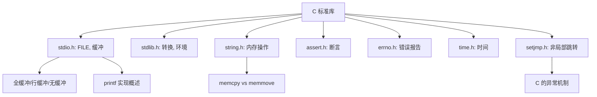
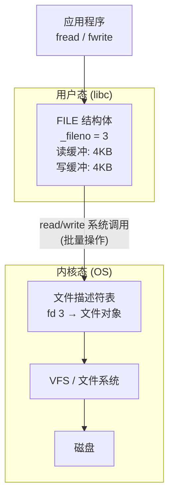
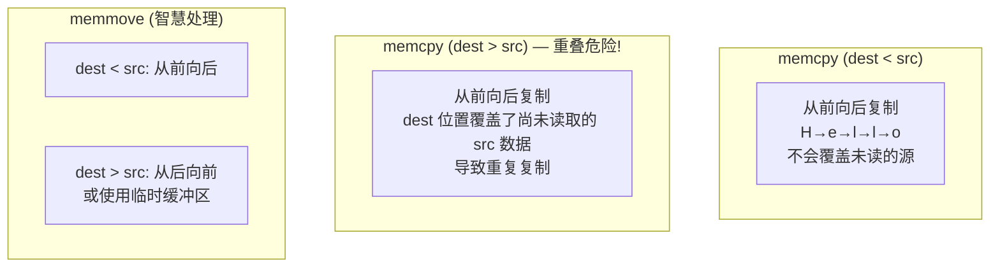

# 标准库深度  (C Standard Library Deep Dive)
---

##  章节概述

>  C 标准库是 C 语言的"操作系统抽象层"——它提供了跨平台的 I/O、字符串处理、内存操作、数学计算等基础功能。但与高级语言的"电池内置"不同，C 标准库非常精简，很多功能（如网络、线程）需要借助 POSIX 或第三方库。本章深入剖析 stdio 的缓冲机制、string.h 中 memcpy/memmove 的区别、以及 setjmp/longjmp 这个 C 语言版的"异常处理"。建议对照  理解标准库底层如何使用系统调用。

### 本章知识地图



---
###  第一节: stdio.h — 文件 I/O 的底层真相
---

#### 1.1 FILE 结构体——操作系统文件描述符的包装

C 的 `FILE*` 是对 POSIX 文件描述符（整数 `fd`）的高级封装，增加了用户态缓冲区、错误标志、EOF 指示等功能。

```c
// FILE 结构体的概念示意（实际实现因 libc 而异）
struct _IO_FILE {
    int _fileno;           //  底层的 POSIX 文件描述符

    // 读缓冲区
    char *_IO_read_ptr;    // 当前读位置
    char *_IO_read_end;    // 读缓冲区末尾
    char *_IO_read_base;   // 读缓冲区基址
    char *_IO_buf_base;    // 缓冲区基址

    // 写缓冲区
    char *_IO_write_ptr;
    char *_IO_write_end;
    char *_IO_write_base;

    // 标志位
    int _flags;            // _IO_EOF_SEEN, _IO_ERR_SEEN 等
    int _fileno_bak;       // 备份的文件描述符
    // ...
};
typedef struct _IO_FILE FILE;
```



#### 1.2 缓冲区机制

`setvbuf` 控制缓冲策略：

```c
#include <stdio.h>

int main() {
    // 1. 全缓冲（默认，用于文件）
    FILE *fp = fopen("test.txt", "w");
    char buf[1024];
    setvbuf(fp, buf, _IOFBF, sizeof(buf));  // 完全缓冲

    // 2. 行缓冲（stdout 默认，遇到 \n 或缓冲满时输出）
    setvbuf(stdout, NULL, _IOLBF, 0);

    // 3. 无缓冲（stderr 默认，每次写入立即输出）
    setvbuf(stderr, NULL, _IONBF, 0);

    // 强制刷新
    fflush(fp);      // 将所有缓冲数据写入操作系统
    // 对应内核中的 fsync()/fdatasync() ?? 不对，fflush 只到内核缓冲区
    // 要保证落盘还需要 fsync(fileno(fp))

    fclose(fp);
    return 0;
}
```

| 缓冲模式 | 触发写入条件 | 适用场景 |
|----------|-------------|---------|
| `_IOFBF` 全缓冲 | 缓冲区满（通常4KB或8KB） | 磁盘文件 |
| `_IOLBF` 行缓冲 | 遇到 `\n` 或缓冲区满 | 终端 (stdout) |
| `_IONBF` 无缓冲 | 每次写入立即输出 | 错误流 (stderr) |

>  **性能意义**: 用户态缓冲区避免了每次 `fprintf`/`fwrite` 都触发昂贵的系统调用（syscall）。512 次 `fputc` 可能只触发 1 次 `write` 系统调用。

#### 1.3 printf 系列实现概述

```c
// printf 的调用链（简化）
printf(format, ...)
  → vfprintf(stdout, format, args)
    → 解析格式字符串 '%d', '%s', '%x', '%f' ...
      → 调用对应的转换函数
        → 将结果写入 FILE 的写缓冲区
          → 缓冲区满时调用 write(fd, buf, len)
```

```c
// printf 内部转换的核心（概念代码）
static int format_integer(char *buf, int value, int base) {
    static const char digits[] = "0123456789ABCDEF";
    char tmp[32];
    int i = 0;
    unsigned int u = (value < 0 && base == 10) ? -value : value;
    int negative = (value < 0 && base == 10);

    do {
        tmp[i++] = digits[u % base];
        u /= base;
    } while (u);

    int pos = 0;
    if (negative) buf[pos++] = '-';
    while (i > 0) buf[pos++] = tmp[--i];
    return pos;
}
```

> 真正的 `printf` 远比这复杂（处理宽度、精度、填充、对齐、浮点数格式化、locale），但核心原理不变：**格式化 → 写缓冲区 → 系统调用**。

---
###  第二节: string.h — 内存与字符串操作
---

#### 2.1 memcpy vs memmove——重叠问题的经典案例

```c
#include <string.h>

void *memcpy(void *dest, const void *src, size_t n);
// 从 src 复制 n 字节到 dest
// ️ 源和目标区域不能重叠！重叠行为未定义

void *memmove(void *dest, const void *src, size_t n);
// 安全处理重叠——如同使用了临时缓冲区
```

```c
// 重叠问题的演示
char buf[20] = "Hello World!";

// memcpy 在重叠时可能出错:
memcpy(buf + 6, buf, 5);   // 想把 "Hello" 复制到 "World" 的位置
// 可能结果: "Hello Hello!" 或 "Hello Hellol" — 取决于实现和方向

// memmove 正确处理:
memmove(buf + 6, buf, 5);  // 保证 "Hello Hello!"
```

**为什么会有区别？**



```c
// 手动实现 memmove 的核心逻辑
void *my_memmove(void *dest, const void *src, size_t n) {
    unsigned char *d = dest;
    const unsigned char *s = src;

    if (d < s) {
        // 目标在源前面: 从前向后复制（安全，不会覆盖）
        for (size_t i = 0; i < n; i++) d[i] = s[i];
    } else if (d > s) {
        // 目标在源后面: 从后向前复制（避免覆盖未读的源）
        for (size_t i = n; i > 0; i--) d[i - 1] = s[i - 1];
    }
    // d == s 时什么都不做

    return dest;
}
```

汇编层面，高效的实现使用 SIMD 指令（SSE/AVX 的 `movdqu`/`movdqa` 或 REP MOVS）：

```asm
# glibc 的 memcpy 使用:
# - 小数据: mov 指令
# - 中等数据: rep movsb (增强 REP MOVSB, ERMSB)
# - 大数据: 非临时存储 (movntdq) 绕过缓存
```

#### 2.2 memcmp 和 memset

```c
void *memset(void *s, int c, size_t n);
// 将 s 的前 n 个字节设置为 c (转为 unsigned char)

int memcmp(const void *s1, const void *s2, size_t n);
// 逐字节比较 s1 和 s2 的前 n 字节
// 返回: <0 若 s1 < s2, 0 若相等, >0 若 s1 > s2
```

```c
// memset 的编译器优化
int arr[100];
memset(arr, 0, sizeof(arr));  // 编译器常将其优化为内联指令

// memcmp 用于比较任意二进制数据
struct Packet {
    uint32_t magic;
    uint16_t length;
    uint8_t data[256];
};

struct Packet p1, p2;
if (memcmp(&p1, &p2, sizeof(p1)) == 0) {
    // 逐字节完全相等——包括填充字节！
}
// ️ 注意: memcmp 比较包含 padding 字节，其值未定义
// 结构体比较应逐个字段比较
```

#### 2.3 字符串函数的安全性

```c
// ️ 不安全的函数 (容易缓冲区溢出)
strcpy(dest, src);      // 不检查 dest 大小
strcat(dest, src);      // 不检查 dest 大小
gets(buf);              // 已从 C11 移除！

//  安全的替代 (C11 Annex K / POSIX)
strncpy(dest, src, n);       // 最多复制 n 字符
strncat(dest, src, n);       // 最多追加 n 字符
snprintf(buf, n, "%s", src); // 格式化到指定大小

// 或使用长度感知的设计
size_t strlcpy(char *dst, const char *src, size_t size);  // BSD
size_t strlcat(char *dst, const char *src, size_t size);  // BSD
```

---
###  第三节: stdlib.h — 转换与环境
---

#### 3.1 字符串转数值

```c
// 简单转换 (无错误检测)
int atoi(const char *nptr);        // "42" → 42, 错误返回 0
long atol(const char *nptr);
double atof(const char *nptr);

// 健壮转换 (有错误检测)
long strtol(const char *nptr, char **endptr, int base);
double strtod(const char *nptr, char **endptr);

// 使用示例
const char *str = "  123abc";
char *end;
long val = strtol(str, &end, 10);
// val = 123, end 指向 "abc"
// 检查: 如果 end == str，说明没有解析到任何数字
// 检查: 如果 errno == ERANGE，说明溢出
```

#### 3.2 程序控制

```c
#include <stdlib.h>

// 正常退出
exit(EXIT_SUCCESS);   // 等同 exit(0)
exit(EXIT_FAILURE);   // 等同 exit(1)

// atexit: 注册退出时调用的清理函数
void cleanup1(void) { printf("清理1\n"); }
void cleanup2(void) { printf("清理2\n"); }

int main() {
    atexit(cleanup1);
    atexit(cleanup2);   // 后注册的先调用！
    printf("程序运行中...\n");
    return 0;
}
// 输出:
// 程序运行中...
// 清理2      ← 后注册先调用 (栈顺序)
// 清理1

// 执行外部命令
system("ls -la");      // 调用 /bin/sh 执行命令
// ️ 安全警告: system 有命令注入风险
```

---
###  第四节: assert.h, errno.h, time.h
---

#### 4.1 assert——调试期断言

```c
#include <assert.h>

int divide(int a, int b) {
    assert(b != 0);        // 调试版: 条件为假则终止程序
    // 在 NDEBUG 定义后，assert 变为空语句——零开销
    return a / b;
}

// 编译:
// gcc -DNDEBUG → 禁用所有 assert (发布版)
// gcc (默认)   → assert 启用 (调试版)
```

#### 4.2 errno——线程安全的错误码

```c
#include <errno.h>
#include <string.h>
#include <stdio.h>

int main() {
    FILE *fp = fopen("nonexistent.txt", "r");
    if (!fp) {
        // errno 是线程局部变量 (C11)
        printf("errno = %d\n", errno);       // 2 (ENOENT)
        printf("错误信息: %s\n", strerror(errno));  // "No such file or directory"
        perror("fopen");  // 自动打印 "fopen: No such file or directory\n"
    }
    return 0;
}

// 常见 errno 值
// EACCES (13): 权限不足
// EEXIST (17): 文件已存在
// EINVAL (22): 无效参数
// ENOMEM (12): 内存不足
// EAGAIN (11): 资源暂时不可用（非阻塞 I/O）
```

#### 4.3 time.h 基础

```c
#include <time.h>
#include <stdio.h>

int main() {
    // Unix 时间戳
    time_t now = time(NULL);
    printf("Unix 时间戳: %ld\n", now);

    // 转换为本地时间字符串
    printf("本地时间: %s", ctime(&now));  // "Tue Jun 16 10:30:00 2026\n"

    // 分解时间
    struct tm *local = localtime(&now);
    printf("%d-%02d-%02d %02d:%02d:%02d\n",
           local->tm_year + 1900,  // 从1900年开始
           local->tm_mon + 1,       // 0-11
           local->tm_mday,
           local->tm_hour,
           local->tm_min,
           local->tm_sec);

    // 格式化时间
    char buf[64];
    strftime(buf, sizeof(buf), "%Y-%m-%d %H:%M:%S", local);
    printf("格式化: %s\n", buf);
    return 0;
}
```

---
###  第五节: setjmp/longjmp — C 语言的"异常处理"
---

#### 5.1 基本概念

`setjmp`/`longjmp` 提供**非局部跳转**——从深层嵌套的函数中直接跳回之前保存的上下文。这类似于异常处理中的 `throw`，但没有类型化的异常对象。

```c
#include <setjmp.h>
#include <stdio.h>

jmp_buf env;

void inner_function(void) {
    printf("进入 inner_function\n");
    longjmp(env, 1);             // ← "抛出异常"，跳回 setjmp
    printf("永远不会执行到\n");    // 此代码不会执行
}

int main() {
    int ret = setjmp(env);       //  保存当前上下文（跳转目标）
    if (ret == 0) {
        // 第一次通过 setjmp 返回 0
        printf("开始执行\n");
        inner_function();
    } else {
        // longjmp 跳转到此处，ret = longjmp 的第二个参数
        printf("捕获到异常，ret = %d\n", ret);
    }
    return 0;
}
// 输出:
// 开始执行
// 进入 inner_function
// 捕获到异常，ret = 1
```

#### 5.2 longjmp 的汇编实现

```asm
# setjmp 保存的上下文包括:
# - rbx, rbp, r12-r15 (被调用者保存寄存器)
# - rsp (栈指针)
# - rip (指令指针 / 返回地址)

# longjmp 恢复这些寄存器:
movq    saved_rbx(%rdi), %rbx
movq    saved_rbp(%rdi), %rbp
movq    saved_rsp(%rdi), %rsp
movq    saved_rip(%rdi), %rax   # 跳转的目标地址
jmp     *%rax                    # 跳回 setjmp 位置
```

#### 5.3 内存泄漏陷阱

```c
// ️ 危险: longjmp 跳过栈展开，不调用局部变量的析构
// C 没有析构函数，但需要注意已分配的资源

void dangerous(void) {
    jmp_buf env;
    char *buffer = malloc(1024);   // 分配内存

    if (setjmp(env) == 0) {
        // buffer 在栈上（指针变量本身），longjmp 不会破坏它
        // 但如果 longjmp 发生在 free 之前...
        longjmp(env, 1);           // 内存泄漏！buffer 永远不会被 free
    } else {
        free(buffer);              // 这条路径跳转到这里
    }
}

// 安全实践: 使用 volatile 标记可能被 longjmp 影响的变量
void safer(void) {
    jmp_buf env;
    volatile char *buffer = NULL;  //  volatile 防止编译器优化

    buffer = malloc(1024);
    if (setjmp(env) != 0) {
        if (buffer) free((void*)buffer);
        return;
    }
    // ... 可能触发 longjmp 的代码 ...
    free((void*)buffer);
}
```

#### 5.4 实际应用场景

```c
// 实现类似 try-catch 的宏（概念）
#define TRY  if (setjmp(exception_env) == 0)
#define CATCH else
#define THROW longjmp(exception_env, 1)

jmp_buf exception_env;

int parse_config(const char *filename) {
    FILE *fp = fopen(filename, "r");
    if (!fp) THROW;

    char line[256];
    while (fgets(line, sizeof(line), fp)) {
        if (line[0] == '#') continue;      // 注释
        if (strlen(line) > 200) THROW;     // 行太长
        // 解析逻辑...
    }

    fclose(fp);
    return 0;
}

int main() {
    TRY {
        parse_config("config.txt");
        printf("配置解析成功\n");
    } CATCH {
        printf("配置解析失败\n");
    }
    return 0;
}
```

> ️ setjmp/longjmp 是底层机制，使用不当容易产生难以调试的 bug。C++ 的异常处理在底层也使用类似机制（但编译器自动管理栈展开和析构函数调用）。详见  中关于非局部跳转的更多细节。

---

##  章节测试

###  判断题（共10题）

> [!question] 判断题 1
> `FILE*` 是对操作系统文件描述符的封装，内部包含用户态缓冲区和 POSIX fd。 （ ）
> - [ ]  正确
> - [ ]  错误
>
> > [!success]- 点击查看答案
> > 答案: 正确
> >
> > **解析**: `FILE` 结构体（通常为 `struct _IO_FILE`）内部包含文件描述符 `_fileno`、读写缓冲区指针集合、标志位等。它位于用户态 libc 中，底层通过 `read`/`write` 系统调用与内核交互。

> [!question] 判断题 2
> `fflush(fp)` 保证数据写入磁盘。 （ ）
> - [ ]  正确
> - [ ]  错误
>
> > [!success]- 点击查看答案
> > 答案: 错误
> >
> > **解析**: `fflush` 只将 libc 用户态缓冲区的数据写入内核缓冲区（通过 `write` 系统调用）。要保证落盘，还需要 `fsync(fileno(fp))`。

> [!question] 判断题 3
> `memcpy` 可以安全地用于源和目标内存区域有重叠的情况。 （ ）
> - [ ]  正确
> - [ ]  错误
>
> > [!success]- 点击查看答案
> > 答案: 错误
> >
> > **解析**: `memcpy` 不处理重叠。重叠内存应使用 `memmove`，它根据源和目标的相对位置选择正序或逆序复制，或使用临时缓冲区。

> [!question] 判断题 4
> `strncpy` 总是以 `\0` 结尾目标字符串。 （ ）
> - [ ]  正确
> - [ ]  错误
>
> > [!success]- 点击查看答案
> > 答案: 错误
> >
> > **解析**: `strncpy` 在源字符串长度 >= n 时**不会**添加 `\0` 终止符，导致目标不是有效的 C 字符串。这是一个常见的陷阱。`snprintf` 总是以 `\0` 结尾。

> [!question] 判断题 5
> `errno` 在 C11 中是线程局部变量（thread-local）。 （ ）
> - [ ]  正确
> - [ ]  错误
>
> > [!success]- 点击查看答案
> > 答案: 正确
> >
> > **解析**: C11 规定 errno 是线程局部的——每个线程有自己的 errno 副本。这通过宏 `#define errno (*__errno_location())` 实现，该函数返回当前线程的 errno 地址。

> [!question] 判断题 6
> `setjmp` 保存的上下文包括局部变量的值。 （ ）
> - [ ]  正确
> - [ ]  错误
>
> > [!success]- 点击查看答案
> > 答案: 错误
> >
> > **解析**: `setjmp` 保存的是寄存器上下文（rbp, rsp, rip, rbx, r12-r15 等），不保存局部变量的值。局部变量在 `longjmp` 后的值是不确定的，除非声明为 `volatile`。

> [!question] 判断题 7
> `atexit` 注册的清理函数在程序正常终止（exit 或 main return）时被调用。 （ ）
> - [ ]  正确
> - [ ]  错误
>
> > [!success]- 点击查看答案
> > 答案: 正确
> >
> > **解析**: `atexit` 注册的函数在程序调用 `exit()` 或从 main 返回时按注册的**相反顺序**依次调用。`abort()` 或 `_exit()` 不会调用 atexit 函数。

> [!question] 判断题 8
> `assert(expr)` 在定义了 `NDEBUG` 后仍然有效。 （ ）
> - [ ]  正确
> - [ ]  错误
>
> > [!success]- 点击查看答案
> > 答案: 错误
> >
> > **解析**: 当 `NDEBUG` 被定义时，`assert` 宏展开为空操作 `((void)0)`——完全从程序中移除。因此 `assert` 中不应有副作用的表达式。

> [!question] 判断题 9
> `printf` 被优化为 `puts` 是编译器的合法行为。 （ ）
> - [ ]  正确
> - [ ]  错误
>
> > [!success]- 点击查看答案
> > 答案: 正确
> >
> > **解析**: 当 `printf("string\n")` 没有格式化占位符时，编译器可以将它优化为更高效的 `puts("string")`（puts 不需要解析格式字符串）。这是 as-if 规则的合法应用。

> [!question] 判断题 10
> `longjmp` 可以跳转到已经返回的函数中的 setjmp 位置。 （ ）
> - [ ]  正确
> - [ ]  错误
>
> > [!success]- 点击查看答案
> > 答案: 错误
> >
> > **解析**: `longjmp` 跳转到已经返回的函数（栈帧已被销毁）是未定义行为。`setjmp` 所在的函数必须在调用栈上仍然存活。这是 C 标准要求的。

###  选择题（共10题）

> [!question] 选择题 1
> stderr 的默认缓冲模式是？
> - [ ] A. 全缓冲 (_IOFBF)
> - [ ] B. 行缓冲 (_IOLBF)
> - [ ] C. 无缓冲 (_IONBF)
> - [ ] D. 取决于实现
>
> > [!success]- 点击查看答案
> > 正确答案: C
> >
> > **解析**: stderr 默认是无缓冲的——每条错误信息需要立即输出，不等待缓冲区满。这确保即使程序崩溃，错误信息也已经输出。

> [!question] 选择题 2
> `memcmp` 比较的是什么？
> - [ ] A. 字符串的字典序
> - [ ] B. 逐字节的二进制值
> - [ ] C. 整数大小
> - [ ] D. 结构体字段
>
> > [!success]- 点击查看答案
> > 正确答案: B
> >
> > **解析**: `memcmp` 逐字节比较内存区域（按 unsigned char 比较），与数据类型无关。它不会在 `\0` 处停止，比较的是精确的二进制内容。

> [!question] 选择题 3
> `strtol("0x1A", NULL, 0)` 返回什么？
> - [ ] A. 0
> - [ ] B. 26
> - [ ] C. 1
> - [ ] D. 错误
>
> > [!success]- 点击查看答案
> > 正确答案: B
> >
> > **解析**: `base=0` 使 strtol 自动检测基数：`0x` 开头为 16 进制。0x1A = 1*16 + 10 = 26。`0` 开头为 8 进制，其他为 10 进制。

> [!question] 选择题 4
> `perror("open")` 输出什么？
> - [ ] A. 仅 "open"
> - [ ] B. "open" 后跟 errno 对应的错误信息
> - [ ] C. errno 的值
> - [ ] D. 程序退出
>
> > [!success]- 点击查看答案
> > 正确答案: B
> >
> > **解析**: `perror(s)` 输出 `s + ": " + strerror(errno) + "\n"`。例如 `perror("open")` 输出 `open: Permission denied\n`。

> [!question] 选择题 5
> 以下代码的输出是？
> ```c
> jmp_buf env;
> void f() { longjmp(env, 42); }
> int main() {
>     volatile int x = 0;
>     int ret = setjmp(env);
>     if (ret == 0) { x = 10; f(); }
>     else printf("ret=%d x=%d\n", ret, x);
> }
> ```
> - [ ] A. ret=1 x=0
> - [ ] B. ret=42 x=10
> - [ ] C. ret=0 x=10
> - [ ] D. ret=42 x=0
>
> > [!success]- 点击查看答案
> > 正确答案: B
> >
> > **解析**: `setjmp` 第一次返回 0，设置 x=10 后调用 f()。`longjmp` 回到 setjmp，ret=42。x 是 volatile，保证 longjmp 后保留 10。非 volatile 的自动变量值在 longjmp 后是不确定的。

> [!question] 选择题 6
> `memset(ptr, -1, 4)` 后，`ptr`（uint32_t*）指向的值是？
> - [ ] A. -1
> - [ ] B. 0xFFFFFFFF
> - [ ] C. 0x01010101
> - [ ] D. 0x00000001
>
> > [!success]- 点击查看答案
> > 正确答案: B
> >
> > **解析**: `memset` 按**字节**设置。`-1` 转为 unsigned char 是 0xFF。4 个字节各被设为 0xFF，所以 uint32_t 值为 0xFFFFFFFF。注意：`memset` 不能用于设置多字节模式。

> [!question] 选择题 7
> libc 的 printf 底层最终使用的系统调用是？
> - [ ] A. printf 是系统调用
> - [ ] B. open
> - [ ] C. write
> - [ ] D. mmap
>
> > [!success]- 点击查看答案
> > 正确答案: C
> >
> > **解析**: `printf` 格式化字符串后将结果写入 FILE 的缓冲区。当缓冲区满或遇到换行符（行缓冲），libc 调用 `write(fd, buf, len)` 系统调用将数据交给内核。`printf` 不是系统调用，是库函数。

> [!question] 选择题 8
> `strerror(errno)` 返回的字符串存储在哪里？
> - [ ] A. 栈上
> - [ ] B. 堆上
> - [ ] C. 静态存储区（线程安全版本可能使用线程局部存储）
> - [ ] D. 文件系统中
>
> > [!success]- 点击查看答案
> > 正确答案: C
> >
> > **解析**: `strerror` 返回的字符串通常存储在库的静态数据区。C11 提供了线程安全的 `strerror_r` 替代。不应修改或释放返回的字符串。

> [!question] 选择题 9
> 以下哪个函数在 C11 中被移除？
> - [ ] A. scanf
> - [ ] B. gets
> - [ ] C. printf
> - [ ] D. fread
>
> > [!success]- 点击查看答案
> > 正确答案: B
> >
> > **解析**: `gets()` 在 C11 标准中被正式移除，因为它无法限制输入长度，是缓冲区溢出安全漏洞的经典来源。应使用 `fgets(buf, sizeof(buf), stdin)`。

> [!question] 选择题 10
> `double atof("1.2e3")` 返回什么值？
> - [ ] A. 1.2
> - [ ] B. 1200.0
> - [ ] C. 0.0
> - [ ] D. 编译错误
>
> > [!success]- 点击查看答案
> > 正确答案: B
> >
> > **解析**: `atof` 支持科学计数法。`1.2e3 = 1.2 × 10³ = 1200.0`。`atof` 在解析错误时返回 0.0，无法区分 "0.0" 和解析失败——这就是推荐使用 `strtod` 的原因。

---

###  编程练习题

> [!example] 练习 1：实现简化版 printf
> **难度**: 
>
> 实现 `my_printf(const char *format, ...)` 支持：
> - `%d` — 有符号十进制整数
> - `%x` — 十六进制（小写）
> - `%s` — 字符串
> - `%c` — 字符
> - `%%` — 百分号本身
> - 使用 `va_list`/`va_start`/`va_arg`/`va_end` (来自 `<stdarg.h>`)
> - 将结果直接写入 stdout（用 putchar 或 write）
> - 与标准 printf 对比输出

> [!example] 练习 2：内存调试器
> **难度**: 
>
> 实现内存泄露检测工具：
> - 使用 `#define` 重新定义 `malloc`、`calloc`、`realloc`、`free` 为 `dbg_malloc` 等
> - 每次分配记录文件名（`__FILE__`）、行号（`__LINE__`）、大小、指针地址
> - 每次释放从记录中移除
> - 使用 `atexit` 注册退出时打印未释放的内存块（泄露报告）
> - 使用一个简单的链表或哈希表存储分配记录

> [!example] 练习 3：try-catch 模拟
> **难度**: 
>
> 使用 `setjmp`/`longjmp` 实现异常处理框架：
> - 定义 `Exception` 结构体：错误码、错误消息、文件名、行号
> - 实现 `TRY/CATCH/THROW` 宏
> - `THROW(code, msg)` 使用 `__FILE__` 和 `__LINE__` 填充异常信息
> - 支持嵌套 TRY/CATCH
> - 每个 CATCH 块可以决定是否重新抛出
> - 实现资源保护：在 TRY 块中注册清理函数（类似 finally）

---

##  知识网络

- **汇编参考**:  — write/read 系统调用机制
- **汇编参考**:  — longjmp 的寄存器恢复
- **同系列相关**: [[03_动态内存管理|动态内存管理]] — malloc 内部机制
- **同系列相关**: [[01_指针深度剖析|指针深度剖析]] — memcpy 中的指针操作
