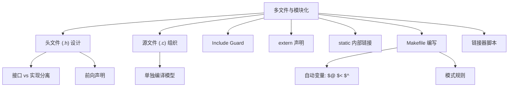
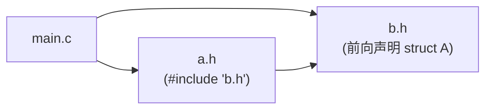
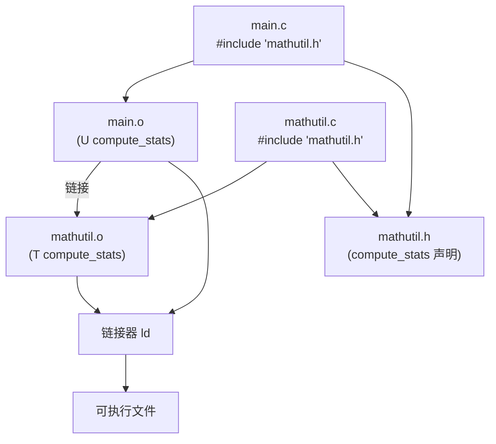

# 多文件与模块化  (Multi-file Projects & Modularization)
---

##  章节概述

>  真正的工程从来不是单文件程序。将代码合理分割为多个源文件、用头文件定义接口、用 Makefile 自动化构建——这是 C 程序员的基本功。本章从 include guard 机制到链接器脚本，系统讲解 C 项目的模块化组织和构建系统。建议同时阅读 [[06_编译链接与ELF|编译链接与ELF]] 理解链接器的工作原理，以及  中的多文件编译流程。

### 本章知识地图



---
###  第一节: 头文件与接口设计
---

#### 1.1 头文件的角色

头文件 (.h) 是模块的**公开接口**——声明类型、函数原型、宏，但不包含实现（除了 inline 函数和宏）。

```c
// ===== mathutil.h =====
// 好的头文件: 自包含、有 guard、最小化依赖
#ifndef MATHUTIL_H
#define MATHUTIL_H

#include <stddef.h>   // 只包含头文件自己需要的

// 类型声明
typedef struct {
    double mean;
    double stddev;
} Stats;

// 函数原型 — 接口契约
Stats compute_stats(const double *data, size_t n);
double clamp(double value, double min, double max);
int gcd(int a, int b);

#endif /* MATHUTIL_H */
```

```c
// ===== mathutil.c =====
#include "mathutil.h"  //  首先包含自己的头文件（检查自包含性）
#include <math.h>       // 实现需要的额外头文件
#include <stdlib.h>

// static: 内部实现细节，不对外暴露
static double square(double x) {
    return x * x;
}

Stats compute_stats(const double *data, size_t n) {
    Stats s = {0.0, 0.0};
    if (n == 0) return s;

    // 计算均值
    double sum = 0.0;
    for (size_t i = 0; i < n; i++) sum += data[i];
    s.mean = sum / n;

    // 计算标准差
    if (n > 1) {
        double sq_sum = 0.0;
        for (size_t i = 0; i < n; i++)
            sq_sum += square(data[i] - s.mean);
        s.stddev = sqrt(sq_sum / (n - 1));
    }
    return s;
}

double clamp(double value, double min, double max) {
    if (value < min) return min;
    if (value > max) return max;
    return value;
}

int gcd(int a, int b) {
    while (b) {
        int t = b;
        b = a % b;
        a = t;
    }
    return a;
}
```

>  **头文件自包含性**: 每个 `.c` 文件首先 include 自己的 `.h` 文件。这确保头文件不依赖意外的 include 顺序，所有需要的类型和声明都已被 include。

#### 1.2 头文件设计原则

| 原则 | 说明 |
|------|------|
| **Include Guard** | 每个头文件用 `#ifndef`/`#define` 或 `#pragma once` |
| **自包含** | 头文件可以独立编译（包含所有需要的 #include） |
| **最小化** | 只声明公开接口，不暴露实现细节 |
| **无定义** | 头文件中不含函数定义或变量定义（inline 和模板除外） |
| **const 正确** | 不修改的参数用 `const` 限定 |

---
###  第二节: Include Guard 与编译模型
---

#### 2.1 Include Guard 的必要性

```c
// 场景: 循环依赖或重复包含
// a.h 需要 b.h 的声明, b.h 也需要 a.h 的声明

// ===== a.h =====
#ifndef A_H
#define A_H
#include "b.h"         // a.h 依赖 b.h

typedef struct { int x; } A;

// 前向声明解决循环依赖
struct B;               // 声明 B 是一个结构体类型
void a_use_b(const struct B *b);

#endif
```



如果没有 include guard，`b.h` 会被包含两次（一次通过 `a.h`，一次直接在 `main.c`），导致重复定义错误。

```c
// ===== 两种 guard 方式 =====
// 传统方式:
#ifndef MY_HEADER_H
#define MY_HEADER_H
// ... 头文件内容 ...
#endif

// 现代方式 (非标准但广泛支持):
#pragma once
// ... 头文件内容 ...
// GCC, Clang, MSVC 都支持
```

>  `#pragma once` 更简洁且避免了宏名冲突，但不是 ISO C 标准的一部分。大型项目（LLVM, Chromium）广泛使用。

#### 2.2 单独编译模型



每个 `.c` 文件被**独立编译**为 `.o` 文件。链接器负责解析跨文件的符号引用。这就是为什么：
1. 修改一个 `.c` 只需重新编译该文件
2. 头文件变更导致所有包含它的文件重新编译
3. 声明 (`extern`) 只需要在头文件中出现一次

---
###  第三节: extern 和 static 的链接属性
---

#### 3.1 extern — 跨文件共享

```c
// ===== config.h =====
#ifndef CONFIG_H
#define CONFIG_H

extern int global_debug_level;    // 声明（不分配存储）
extern const char *app_name;       // 声明

void config_init(void);

#endif

// ===== config.c =====
#include "config.h"

// 定义（分配存储）——必须在恰好一个 .c 文件中
int global_debug_level = 0;
const char *app_name = "MyApp";

void config_init(void) {
    global_debug_level = 1;
}

// ===== main.c =====
#include "config.h"   // 获得访问权
#include <stdio.h>

int main() {
    config_init();
    printf("Debug: %d, App: %s\n", global_debug_level, app_name);
    return 0;
}
```

>  **extern 默认规则**: 在文件作用域，`int x;`（无初始化）是**暂定定义**，等价于 `extern int x = 0;`。如果有同名的初始化定义，暂定定义变为 extern 声明。多个未初始化的同名定义在链接时合并。

#### 3.2 static — 限制作用域

```c
// static 在文件作用域: 内部链接——仅当前编译单元可见

// ===== module_a.c =====
static int counter = 0;      // 仅在 module_a.c 可见
static void helper(void) {   // 仅在 module_a.c 可见
    counter++;
}
void public_api(void) {      // 全局可见
    helper();
}

// ===== module_b.c =====
static int counter = 100;    // 与 module_a.c 的 counter 完全独立！
// 它们是不同的变量，只是名字相同
```

| 关键字 | 链接属性 | 可见范围 | 存储位置 |
|--------|----------|----------|----------|
| (无 static) | 外部链接 | 所有编译单元 | .data / .bss |
| static | 内部链接 | 本编译单元 | .data / .bss |
| 函数内 static | 无链接 | 本函数 | .data / .bss |
| extern | 外部链接 | 所有编译单元 | (声明) |

---
###  第四节: Makefile 编写实战
---

#### 4.1 最简单的 Makefile

```makefile
# 目标: 依赖
# <TAB>命令

program: main.o mathutil.o config.o
	gcc main.o mathutil.o config.o -o program -lm

main.o: main.c mathutil.h config.h
	gcc -c main.c -o main.o

mathutil.o: mathutil.c mathutil.h
	gcc -c mathutil.c -o mathutil.o

config.o: config.c config.h
	gcc -c config.c -o config.o

clean:
	rm -f *.o program
```

#### 4.2 进阶——使用变量和自动变量

```makefile
# Makefile 进阶版

CC       = gcc
CFLAGS   = -Wall -Wextra -std=c11 -g -O2
LDFLAGS  = -lm
TARGET   = program
SOURCES  = $(wildcard *.c)
OBJECTS  = $(SOURCES:.c=.o)
DEPS     = $(OBJECTS:.o=.d)

# 默认目标
all: $(TARGET)

# 链接
$(TARGET): $(OBJECTS)
	$(CC) $^ $(LDFLAGS) -o $@
#   $^ = 所有依赖 (main.o mathutil.o config.o)
#   $@ = 目标名 (program)

# 自动生成依赖
%.o: %.c
	$(CC) $(CFLAGS) -MMD -MP -c $< -o $@
#   $< = 第一个依赖 (对应的 .c 文件)
#   -MMD -MP: 自动生成 .d 依赖文件

# 包含自动生成的依赖
-include $(DEPS)

# 清理
clean:
	rm -f $(OBJECTS) $(DEPS) $(TARGET)

# 伪目标
.PHONY: all clean
```

**Makefile 自动变量速查表**:

| 变量 | 含义 | 示例 |
|------|------|------|
| `$@` | 当前目标名 | program |
| `$<` | 第一个依赖 | main.c |
| `$^` | 所有依赖（去重） | main.o mathutil.o config.o |
| `$?` | 所有比目标新的依赖 | (只有修改过的文件) |
| `$*` | 不含后缀的目标名 | main |

#### 4.3 模式规则与静态模式规则

```makefile
# 模式规则 (Pattern Rule): 从 .c 生成 .o
%.o: %.c
	$(CC) $(CFLAGS) -c $< -o $@

# 静态模式规则 (Static Pattern Rule): 只对指定文件生效
$(OBJECTS): %.o: %.c
	$(CC) $(CFLAGS) -c $< -o $@
```

#### 4.4 完整项目 Makefile 模板

```makefile
# ============================================
# 通用 C 项目 Makefile 模板
# ============================================

# 编译器和标志
CC       = gcc
CFLAGS   = -Wall -Wextra -Wpedantic -std=c11
DBGFLAGS = -g -O0 -fsanitize=address
RELFLAGS = -O2 -DNDEBUG
LDFLAGS  =

# 如果 make DEBUG=1
ifdef DEBUG
    CFLAGS += $(DBGFLAGS)
else
    CFLAGS += $(RELFLAGS)
endif

# 目录
SRCDIR   = src
OBJDIR   = build
BINDIR   = bin
INCDIR   = include

TARGET   = $(BINDIR)/myapp

SOURCES  = $(wildcard $(SRCDIR)/*.c)
OBJECTS  = $(patsubst $(SRCDIR)/%.c, $(OBJDIR)/%.o, $(SOURCES))
DEPS     = $(OBJECTS:.o=.d)

CFLAGS  += -I$(INCDIR)

# 构建
all: $(TARGET)

$(TARGET): $(OBJECTS) | $(BINDIR)
	$(CC) $^ $(LDFLAGS) -o $@

$(OBJDIR)/%.o: $(SRCDIR)/%.c | $(OBJDIR)
	$(CC) $(CFLAGS) -MMD -MP -c $< -o $@

# 创建目录
$(OBJDIR) $(BINDIR):
	mkdir -p $@

# 测试
test: $(TARGET)
	./$(TARGET) --test

# 包含依赖
-include $(DEPS)

# 清理
clean:
	rm -rf $(OBJDIR) $(BINDIR)

.PHONY: all clean test
```

---
###  第五节: 循环依赖与解决方案
---

#### 5.1 问题场景

```c
// === 循环依赖问题 ===

// list.h 需要 node.h
// node.h 需要 list.h
// → 死循环！

// 解决方案: 前向声明 + 将实现移到 .c 文件

// ===== node.h =====
#ifndef NODE_H
#define NODE_H

// 前向声明 — 不需要知道 List 的完整定义
struct List;
typedef struct List List;

typedef struct Node {
    int data;
    struct Node *next;
    List *owner;           // 只需要指针，前向声明足够
} Node;

void node_init(Node *n, int data, List *owner);

#endif
```

```c
// ===== list.h =====
#ifndef LIST_H
#define LIST_H

// 前向声明
struct Node;
typedef struct Node Node;

typedef struct List {
    Node *head;
    Node *tail;
    int size;
} List;

void list_init(List *l);
void list_append(List *l, int data);
void list_remove(List *l, Node *n);

#endif
```

>  **关键规则**: 如果只需要类型的**指针**，前向声明就够用——不需要包含完整的头文件。将 `#include` 尽可能地放在 `.c` 文件中而非 `.h` 文件中。

---
###  第六节: 链接器脚本简介
---

链接器脚本 (.ld) 控制可执行文件的内存布局，在嵌入式系统和内核开发中至关重要。

```ld
/* simple.ld — 链接器脚本示例 */
OUTPUT_FORMAT("elf64-x86-64")
OUTPUT_ARCH(i386:x86-64)
ENTRY(_start)

SECTIONS
{
    /* 从 1MB 开始加载（典型的引导加载器约定） */
    . = 1M;

    /* 代码段 */
    .text : {
        *(.text)        /* 所有 .text section */
        *(.text.*)
    }

    /* 只读数据 */
    .rodata : {
        *(.rodata)
        *(.rodata.*)
    }

    /* 已初始化数据 */
    .data : {
        *(.data)
        *(.data.*)
    }

    /* 未初始化数据 (不占文件空间) */
    .bss : {
        *(.bss)
        *(.bss.*)
        *(COMMON)
    }

    /* 定义符号，供 C 代码使用 */
    _end = .;
}
```

```c
// C 代码中使用链接器定义的外部符号
extern char _end[];    // 不是指针，是地址！

void *get_heap_start(void) {
    return (void*)_end;   // _end 指向 .bss 结束 = 堆开始
}
```

链接器脚本的典型用途：
- 嵌入式系统：将代码放在 Flash ROM，数据放在 RAM
- 内核开发：精确控制内核加载地址
- 引导程序：确保入口点在固定地址

详见  中关于链接器脚本的完整讨论。

---
###  第七节: 综合项目——模块化计算器
---

```bash
# 项目结构
calc/
├── Makefile
├── include/
│   ├── calc.h
│   ├── parser.h
│   └── stack.h
├── src/
│   ├── main.c
│   ├── calc.c
│   ├── parser.c
│   └── stack.c
└── test/
    └── test_calc.c
```

```c
// ===== include/calc.h =====
#ifndef CALC_H
#define CALC_H

typedef enum {
    OP_ADD, OP_SUB, OP_MUL, OP_DIV,
    OP_NONE
} Operation;

double calculate(double a, double b, Operation op);
const char *op_name(Operation op);

#endif
```

```c
// ===== include/stack.h =====
#ifndef STACK_H
#define STACK_H
#include <stddef.h>
#include <stdbool.h>

typedef struct Stack Stack;  // 不透明指针

Stack *stack_create(size_t capacity);
void stack_destroy(Stack *s);
bool stack_push(Stack *s, double value);
bool stack_pop(Stack *s, double *value);
bool stack_top(const Stack *s, double *value);
bool stack_is_empty(const Stack *s);
size_t stack_size(const Stack *s);

#endif
```

```c
// ===== src/stack.c =====
#include "stack.h"
#include <stdlib.h>
#include <assert.h>

struct Stack {
    double *data;
    size_t capacity;
    size_t top;
};

Stack *stack_create(size_t capacity) {
    Stack *s = malloc(sizeof(Stack));
    if (!s) return NULL;
    s->data = malloc(capacity * sizeof(double));
    if (!s->data) { free(s); return NULL; }
    s->capacity = capacity;
    s->top = 0;
    return s;
}

void stack_destroy(Stack *s) {
    if (!s) return;
    free(s->data);
    free(s);
}

bool stack_push(Stack *s, double value) {
    if (s->top >= s->capacity) return false;
    s->data[s->top++] = value;
    return true;
}

bool stack_pop(Stack *s, double *value) {
    if (s->top == 0) return false;
    *value = s->data[--s->top];
    return true;
}

bool stack_top(const Stack *s, double *value) {
    if (s->top == 0) return false;
    *value = s->data[s->top - 1];
    return true;
}

bool stack_is_empty(const Stack *s) {
    return s->top == 0;
}

size_t stack_size(const Stack *s) {
    return s->top;
}
```

```c
// ===== src/parser.c =====
#include "parser.h"
#include "calc.h"
#include "stack.h"
#include <stdio.h>
#include <stdlib.h>
#include <string.h>
#include <ctype.h>

// RPN 求值: "3 4 + 5 *" → 35
double evaluate_rpn(const char *expr) {
    Stack *s = stack_create(256);
    char *token, *saveptr;
    char *buf = strdup(expr);  // 可修改的副本

    token = strtok_r(buf, " ", &saveptr);
    while (token) {
        if (isdigit(token[0]) || (token[0] == '-' && isdigit(token[1]))) {
            stack_push(s, atof(token));
        } else {
            double b, a;
            stack_pop(s, &b);
            stack_pop(s, &a);
            Operation op = OP_NONE;
            switch (token[0]) {
                case '+': op = OP_ADD; break;
                case '-': op = OP_SUB; break;
                case '*': op = OP_MUL; break;
                case '/': op = OP_DIV; break;
                default:
                    fprintf(stderr, "未知运算符: %c\n", token[0]);
                    stack_destroy(s);
                    free(buf);
                    return 0.0;
            }
            stack_push(s, calculate(a, b, op));
        }
        token = strtok_r(NULL, " ", &saveptr);
    }

    double result;
    stack_pop(s, &result);
    stack_destroy(s);
    free(buf);
    return result;
}
```

```makefile
# ===== Makefile =====
CC       = gcc
CFLAGS   = -Wall -Wextra -std=c11 -g -O2 -Iinclude
LDFLAGS  = -lm
TARGET   = calc

SRCDIR   = src
OBJDIR   = build

SOURCES  = $(wildcard $(SRCDIR)/*.c)
OBJECTS  = $(patsubst $(SRCDIR)/%.c, $(OBJDIR)/%.o, $(SOURCES))

$(TARGET): $(OBJECTS)
	$(CC) $^ $(LDFLAGS) -o $@

$(OBJDIR)/%.o: $(SRCDIR)/%.c | $(OBJDIR)
	$(CC) $(CFLAGS) -c $< -o $@

$(OBJDIR):
	mkdir -p $(OBJDIR)

clean:
	rm -rf $(OBJDIR) $(TARGET)

.PHONY: clean
```

```bash
# 构建与运行
make
./calc "3 4 + 5 *"     # 输出: 35
./calc "10 2 / 3 +"    # 输出: 8
make clean
```

---

##  章节测试

###  判断题（共10题）

> [!question] 判断题 1
> 头文件 (.h) 中允许包含函数定义。 （ ）
> - [ ]  正确
> - [ ]  错误
>
> > [!success]- 点击查看答案
> > 答案: 错误
> >
> > **解析**: 头文件中不应包含非 inline 的函数定义，否则每个包含此头文件的 .c 文件都会生成一份函数代码，链接时出现"多重定义"错误。声明放在 .h，定义放在 .c。

> [!question] 判断题 2
> `#pragma once` 是 ISO C 标准的一部分。 （ ）
> - [ ]  正确
> - [ ]  错误
>
> > [!success]- 点击查看答案
> > 答案: 错误
> >
> > **解析**: `#pragma once` 不是标准 C/C++，但被 GCC、Clang、MSVC 等主流编译器支持。标准方式是 `#ifndef`/`#define`/`#endif` 宏守卫。

> [!question] 判断题 3
> `static` 函数只能在其定义的编译单元中被调用。 （ ）
> - [ ]  正确
> - [ ]  错误
>
> > [!success]- 点击查看答案
> > 答案: 正确
> >
> > **解析**: `static` 函数具有内部链接（nm 中标记为 `t`），符号不暴露给链接器，其他 .c 文件无法引用。这是实现信息隐藏的重要手段。

> [!question] 判断题 4
> Makefile 中命令必须以 4 个空格开头。 （ ）
> - [ ]  正确
> - [ ]  错误
>
> > [!success]- 点击查看答案
> > 答案: 错误
> >
> > **解析**: Makefile 的命令必须以**制表符（TAB）**开头，不能是空格。这是 make 语法的硬性要求。错误使用空格会导致 "missing separator" 错误。

> [!question] 判断题 5
> `$<` 在 Makefile 中表示所有依赖。 （ ）
> - [ ]  正确
> - [ ]  错误
>
> > [!success]- 点击查看答案
> > 答案: 错误
> >
> > **解析**: `$<` 表示**第一个**依赖。`$^` 表示所有依赖。`$@` 表示目标名。这些是 Makefile 的自动变量。

> [!question] 判断题 6
> 链接器脚本（.ld）用于控制可执行文件的内存布局。 （ ）
> - [ ]  正确
> - [ ]  错误
>
> > [!success]- 点击查看答案
> > 答案: 正确
> >
> > **解析**: 链接器脚本精确控制各 section 在内存中的排列、起始地址、对齐方式等。在嵌入式系统中，Flash 和 RAM 有不同的地址范围，必须通过链接器脚本指定。

> [!question] 判断题 7
> 修改头文件后，只需重新链接，不需要重新编译。 （ ）
> - [ ]  正确
> - [ ]  错误
>
> > [!success]- 点击查看答案
> > 答案: 错误
> >
> > **解析**: 头文件被包含在 .c 中（通过 `#include`）。修改头文件 = 修改了所有包含它的 .c 文件的源代码。这些文件都需要重新编译。

> [!question] 判断题 8
> `extern int x;` 既声明变量又分配存储空间。 （ ）
> - [ ]  正确
> - [ ]  错误
>
> > [!success]- 点击查看答案
> > 答案: 错误
> >
> > **解析**: `extern int x;` 仅是**声明**，不分配存储空间。真正的**定义**（分配存储）发生在：`int x = 0;` 或没有 extern 的 `int x;`。

> [!question] 判断题 9
> 前向声明 `struct Node;` 后就可以使用 `sizeof(struct Node)`。 （ ）
> - [ ]  正确
> - [ ]  错误
>
> > [!success]- 点击查看答案
> > 答案: 错误
> >
> > **解析**: 前向声明只是告诉编译器"Node 是一个结构体类型"，但不提供其大小。`sizeof(struct Node)` 需要完整定义。这也是不透明指针模式的核心——使用者无法知道结构体大小，必须通过 API 操作。

> [!question] 判断题 10
> 每个 `.c` 文件被独立编译为目标文件，链接器负责解析跨文件符号引用。 （ ）
> - [ ]  正确
> - [ ]  错误
>
> > [!success]- 点击查看答案
> > 答案: 正确
> >
> > **解析**: 这是 C 的"单独编译"模型。每个 `.c` 独立编译为 `.o`，生成自己的符号表（定义的 `T/D` 和未定义的 `U`）。链接器合并所有 `.o`，解析所有 `U` 符号。

###  选择题（共10题）

> [!question] 选择题 1
> 以下哪种 include guard 是标准 C 方式？
> - [ ] A. `#pragma once`
> - [ ] B. `#ifndef X_H` / `#define X_H` / `#endif`
> - [ ] C. `#once`
> - [ ] D. `#include protect`
>
> > [!success]- 点击查看答案
> > 正确答案: B
> >
> > **解析**: ISO C 标准方式使用条件编译宏。`#pragma once` 是编译器扩展，虽然广泛支持但不是标准。

> [!question] 选择题 2
> Makefile 中的 `$@` 代表什么？
> - [ ] A. 所有依赖
> - [ ] B. 第一个依赖
> - [ ] C. 当前目标
> - [ ] D. 所有比目标新的依赖
>
> > [!success]- 点击查看答案
> > 正确答案: C
> >
> > **解析**: `$@` 是代表当前构建目标名。这在模式规则中特别有用：`%.o: %.c ; gcc -c $< -o $@` 中，$@ 是 .o 文件名。

> [!question] 选择题 3
> 以下哪个是正确的 `extern` 使用方式？
> - [ ] A. 在头文件声明变量同时初始化: `extern int x = 5;`
> - [ ] B. 在头文件声明: `extern int x;`，在 .c 定义: `int x = 5;`
> - [ ] C. 在每个 .c 文件中都定义变量
> - [ ] D. 不需要 extern，每个文件直接写 `int x;`
>
> > [!success]- 点击查看答案
> > 正确答案: B
> >
> > **解析**: `extern` 声明必须放在头文件（宣告变量的存在），而实际定义（分配存储）必须放在恰好一个 `.c` 文件中。多个定义会导致链接错误。

> [!question] 选择题 4
> `static int helper(void)` 在文件作用域的含义是？
> - [ ] A. 函数只在当前函数中可见
> - [ ] B. 函数只在当前编译单元（.c 文件）中可见
> - [ ] C. 函数只读
> - [ ] D. 函数存储在栈上
>
> > [!success]- 点击查看答案
> > 正确答案: B
> >
> > **解析**: 文件作用域的 `static` 表示内部链接——符号只在当前 `.c` 文件（编译单元）中可见。这是信息隐藏的标准方式，函数不会是全局符号表中的 `T`，而是 `t`。

> [!question] 选择题 5
> 在 Makefile 中使用 `=` 和 `:=` 的区别是？
> - [ ] A. 没有区别
> - [ ] B. `=` 是递归展开，`:=` 是立即展开
> - [ ] C. `=` 是立即展开，`:=` 是递归展开
> - [ ] D. `=` 只能在目标规则中使用
>
> > [!success]- 点击查看答案
> > 正确答案: B
> >
> > **解析**: `=`（递归展开）在每次使用时才展开变量值；`:=`（简单展开）在定义时立即展开。`?=` 仅在变量未设置时赋值。`+=` 追加值。

> [!question] 选择题 6
> 以下哪种情况需要前向声明？
> - [ ] A. 两个结构体互相包含（如 Node 包含 List 指针，List 包含 Node 指针）
> - [ ] B. 一个结构体包含另一个结构体作为值成员
> - [ ] C. 函数调用
> - [ ] D. 变量赋值
>
> > [!success]- 点击查看答案
> > 正确答案: A
> >
> > **解析**: 当两个结构体互相引用时（循环依赖），前向声明允许一个结构体使用另一个的指针类型，而不需要完整定义。作为值成员则需要完整定义。

> [!question] 选择题 7
> 链接器脚本中 `ENTRY(_start)` 的作用是？
> - [ ] A. 定义程序终止点
> - [ ] B. 定义程序的入口点
> - [ ] C. 定义第一个全局变量
> - [ ] D. 定义启动函数
>
> > [!success]- 点击查看答案
> > 正确答案: B
> >
> > **解析**: `ENTRY` 指定程序的入口地址（第一条执行的指令）。在 Linux 上通常是 `_start`（来自 crt0），而不是 `main`。`_start` 由 C 运行时初始化库提供，它会调用 `main`。

> [!question] 选择题 8
> `gcc -Iinclude` 的 `-I` 选项的作用是？
> - [ ] A. 忽略警告
> - [ ] B. 添加 include 搜索路径
> - [ ] C. 生成头文件依赖
> - [ ] D. 内联函数
>
> > [!success]- 点击查看答案
> > 正确答案: B
> >
> > **解析**: `-I<dir>` 将 `<dir>` 添加到 `#include "..."` 的搜索路径。`#include "calc.h"` 会在当前目录和 `-I` 指定的目录中搜索。

> [!question] 选择题 9
> 一个项目包含 `main.c`（调用 `helper()`）和 `helper.c`（定义 `helper()`）。以下哪个编译命令能正确生成可执行文件？
> - [ ] A. `gcc main.c -o prog`
> - [ ] B. `gcc helper.c -o prog`
> - [ ] C. `gcc main.c helper.c -o prog`
> - [ ] D. `gcc -c main.c helper.c -o prog`
>
> > [!success]- 点击查看答案
> > 正确答案: C
> >
> > **解析**: 需要同时编译两个源文件并链接。A 会因 helper 未定义而链接失败。B 缺少 main。D 的 `-c` 只编译不链接。

> [!question] 选择题 10
> `.PHONY` 目标在 Makefile 中的作用是？
> - [ ] A. 标记文件为只读
> - [ ] B. 告诉 make 这些不是文件名，是伪目标
> - [ ] C. 创建隐藏目标
> - [ ] D. 优化构建速度
>
> > [!success]- 点击查看答案
> > 正确答案: B
> >
> > **解析**: `.PHONY: clean all` 告诉 make 这些目标不代表文件。即使存在名为 "clean" 的文件，`make clean` 仍始终执行对应的命令。没有 `.PHONY` 声明，make 会比较目标文件和依赖的时间戳。

---

###  编程练习题

> [!example] 练习 1：构建多文件项目
> **难度**: 
>
> 组织一个完整的模块化 C 项目：
> - `src/` 目录：至少 4 个 `.c` 文件（使用不同模块）
> - `include/` 目录：每个模块一个头文件
> - 使用不透明指针封装一个模块的内部实现
> - 使用 `static` 隐藏模块内部函数
> - 编写 Makefile，支持 `make`, `make clean`, `make debug`
> - 自动生成依赖性（使用 `-MMD -MP`）
> - 使用 `objdump` 和 `nm` 分析链接前后的符号变化

> [!example] 练习 2：实现动态库加载
> **难度**: 
>
> 实现一个基于共享库的插件系统：
> - 定义插件接口（头文件）
> - 编译两个不同的 `.so` 插件（如 `adder.so` 和 `multiplier.so`）
> - 主程序使用 `dlopen`/`dlsym`/`dlclose` 动态加载插件
> - 运行时选择加载哪个插件
> - 演示热插拔——程序运行期间切换插件
> - 编译命令：`gcc -shared -fPIC -o libplugin.so plugin.c`

> [!example] 练习 3：链接器脚本实验
> **难度**: 
>
> 编写自定义链接器脚本：
> - 定义一个特殊的 `.my_section` section
> - 使用 `__attribute__((section(".my_section")))` 将函数放入该 section
> - 通过链接器脚本定义起始/结束符号（如 `__my_section_start`, `__my_section_end`）
> - 在 C 代码中遍历这些符号，实现自动注册机制
> - 应用：实现一个自动注册的测试框架（每个测试函数注册自己）

---

##  知识网络

- **前置章节**: [[06_编译链接与ELF|编译链接与ELF]] — 链接器的工作原理
- **汇编参考**:  — 完整编译流程
- **同系列相关**: [[03_动态内存管理|动态内存管理]] — 模块间内存管理和所有权
- **C++ 对比**: [[../../cpp教程/cpp深化教程/02_预处理器|CPP: 预处理器]] — 头文件与命名空间
