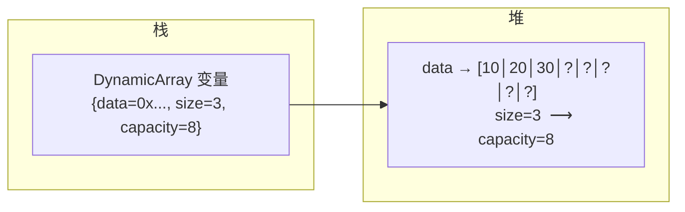
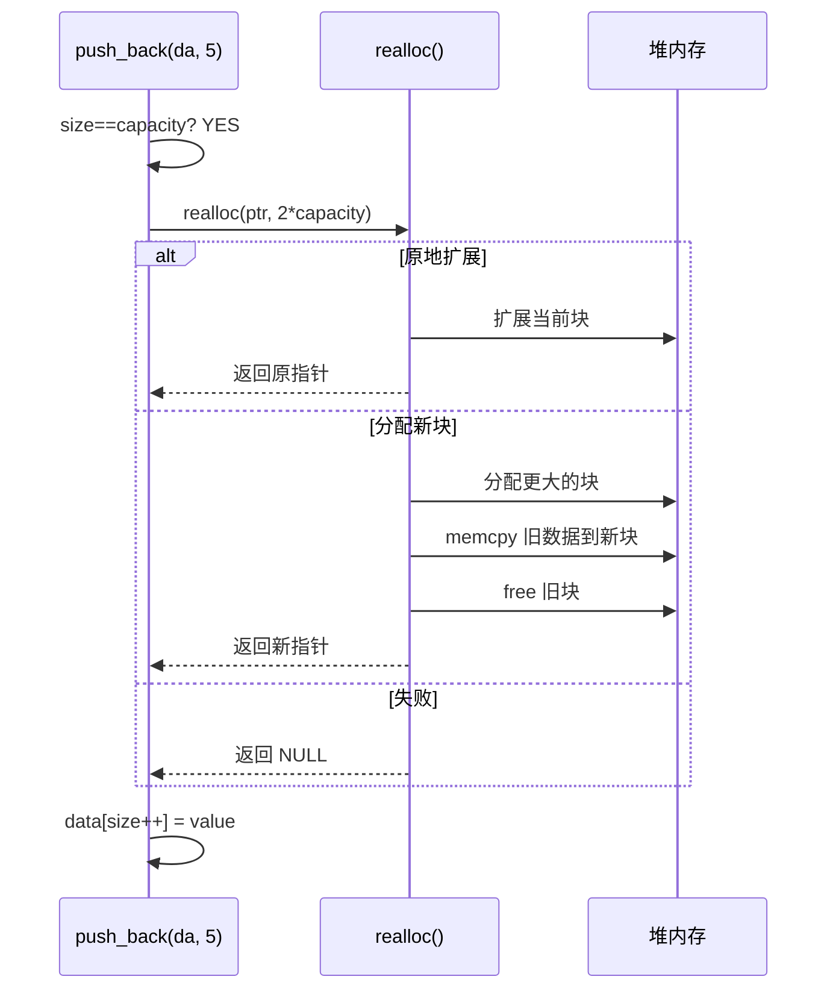
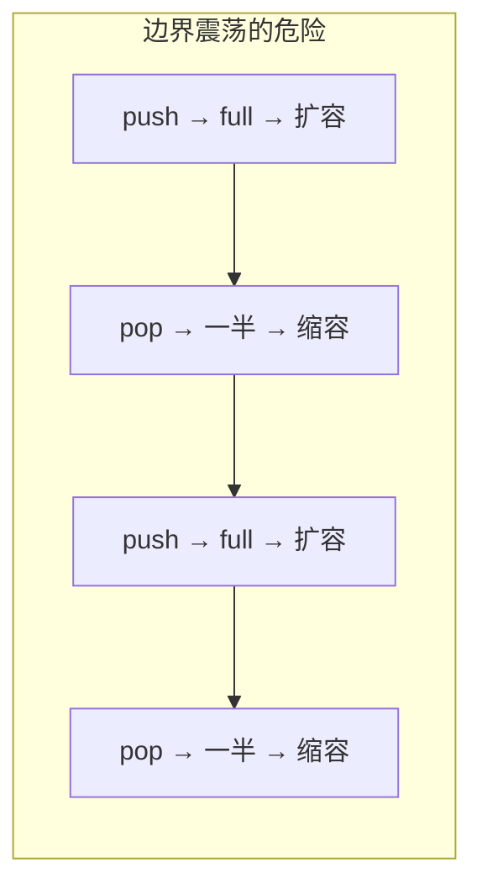
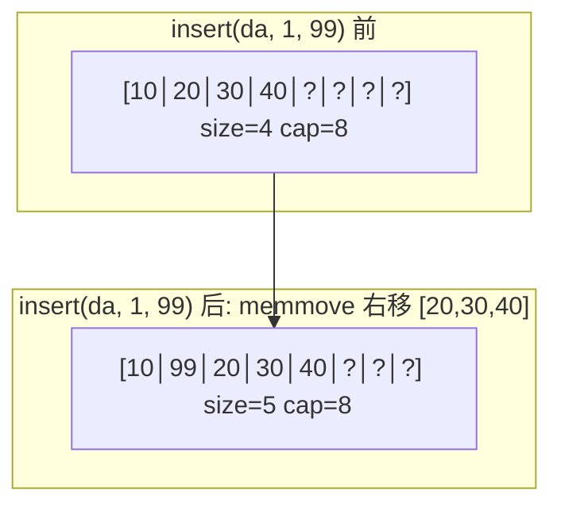

# 动态数组  (Dynamic Array / Vector)
title: ""
---

##  章节概述

动态数组（Dynamic Array）是最基础也是最常用的数据结构之一。它是一段连续的内存区域，
支持动态增长——当容量不足时自动扩容。C++中的 `std::vector`、Java中的 `ArrayList`、
Python中的 `list`，底层都是动态数组。

本节侧重底层实现与内存理解，与 [[../../cpp教程/容器库/容器库索引|容器库索引]]|CPP教程对应章节]] 形成互补——CPP教程侧重STL使用与算法优化，本教程侧重手动实现与内存本质。你将亲手用C语言实现一个完整的动态数组，深入理解 `realloc()` 的工作原理、扩容策略对性能的影响、以及数组在内存中的真实布局。

> 在CPP教程中对应章节侧重 `std::vector` 的STL用法与迭代器操作，本节侧重底层 `malloc/realloc/free` 的内存管理实现。

---

---
###  第一节: 动态数组的基本结构
---

### 1.1 什么是动态数组？

静态数组在编译时确定大小，无法在运行时改变：

```c
int arr[100];  // 编译时固定为100个int，无法扩容
```

动态数组在堆上分配内存，通过跟踪 `size`（当前元素数）和 `capacity`（已分配空间），
在需要时自动扩容：

```c
typedef struct {
    int *data;      // 指向堆上数据的指针
    size_t size;    // 当前元素个数
    size_t capacity; // 已分配的元素容量
} DynamicArray;
```

**内存布局**: `data` 指向堆上连续分配的 `capacity * sizeof(int)` 字节，其中前 `size` 个位置
存储有效元素，剩余 `capacity - size` 个位置是预留空间。



> 关于栈与堆的区别，参见 [[../2深化/03_动态内存管理|动态内存管理]] 和 。

---

### 1.2 初始化函数

```c
#include <stdlib.h>
#include <string.h>
#include <stdio.h>

#define INITIAL_CAPACITY 4

DynamicArray* da_create() {
    DynamicArray *da = (DynamicArray*)malloc(sizeof(DynamicArray));
    if (!da) {
        fprintf(stderr, "Failed to allocate DynamicArray struct\n");
        return NULL;
    }
    da->data = (int*)malloc(INITIAL_CAPACITY * sizeof(int));
    if (!da->data) {
        fprintf(stderr, "Failed to allocate data buffer\n");
        free(da);
        return NULL;
    }
    da->size = 0;
    da->capacity = INITIAL_CAPACITY;
    return da;
}
```

**要点分析**:
1. 结构体本身也在堆上分配（`malloc(sizeof(DynamicArray))`）
2. 数据缓冲区独立分配（`malloc(INITIAL_CAPACITY * sizeof(int))`）
3. 如果数据分配失败，必须先释放已分配的结构体内存（避免内存泄漏）
4. 初始容量设为4可以避免过于频繁的小规模扩容

> **练习 1.2.1**: 修改 `INITIAL_CAPACITY` 为 0，然后实现"惰性分配"策略——在第一次 `push_back` 时才分配内存。

---

### 1.3 销毁函数

```c
void da_destroy(DynamicArray *da) {
    if (da) {
        free(da->data);   // 先释放数据缓冲区
        free(da);         // 再释放结构体本身
    }
}
```

**关键细节**: 释放顺序必须与分配顺序相反——先分配的后释放。如果先 `free(da)`，则 `da->data` 指针变成非法的悬空指针，无法再访问。

**内存泄漏检查**:

```c
void da_destroy_safe(DynamicArray *da) {
    if (!da) return;
    if (da->data) {
        free(da->data);
        da->data = NULL;   // 防止 double-free
    }
    da->size = 0;
    da->capacity = 0;
    free(da);
    da = NULL;            // 调用者仍需自己置空外部指针
}
```

> **练习 1.3.1**: 编写一个宏 `#define DA_FREE(da) do { da_destroy(da); (da) = NULL; } while(0)` 以便安全释放并置空。

---

---
###  第二节: 核心操作实现
---

### 2.1 push_back —— 在末尾添加元素

这是动态数组最核心的操作。当 `size == capacity` 时触发扩容。

```c
#include <stdbool.h>

#define GROWTH_FACTOR 2

static bool da_resize(DynamicArray *da, size_t new_capacity) {
    int *new_data = (int*)realloc(da->data, new_capacity * sizeof(int));
    if (!new_data) {
        fprintf(stderr, "realloc failed: cannot expand to %zu elements\n", new_capacity);
        return false;  // 原数据仍在 da->data 中，未丢失
    }
    da->data = new_data;
    da->capacity = new_capacity;
    return true;
}

bool da_push_back(DynamicArray *da, int value) {
    if (da->size == da->capacity) {
        size_t new_capacity = da->capacity * GROWTH_FACTOR;
        if (!da_resize(da, new_capacity)) {
            return false;
        }
    }
    da->data[da->size] = value;
    da->size++;
    return true;
}
```

**`realloc()` 深入分析**:

`realloc(ptr, new_size)` 的行为：
1. **原地扩展**: 如果当前块后有足够空闲空间，则直接扩展，返回原指针
2. **分配新块**: 如果原地不够，则分配新块、复制旧数据、释放旧块、返回新指针
3. **失败**: 返回 `NULL`，但旧块仍有效（不会自动释放）

这就是为什么我们不能写 `da->data = realloc(da->data, ...)` —— 如果 `realloc` 失败返回 `NULL`，原指针被覆盖，造成内存泄漏。



> 关于 `realloc` 的底层汇编实现，参见 。

---

### 2.2 扩容策略分析: 2x vs 1.5x

C语言标准库不规定扩容因子，我们需要自己选择：

| 策略 | 优点 | 缺点 |
|------|------|------|
| 2x 倍增 | 实现简单，push_back 均摊 O(1) | 内存浪费可能达到50% |
| 1.5x 增长 | 内存利用率更高 | 扩容次数更多 |
| 固定增量 (+k) | 无 | 均摊复杂度退化为 O(n) |

**为什么固定增量是 O(n)？**

假设每次扩容 +10：
- 插入 n 个元素需要 n/10 次扩容
- 每次扩容复制 i*10 个元素
- 总复制次数：0+10+20+...+(n-10) = Θ(n²)
- 均摊每次 push_back 需要 Θ(n)

而 2x 倍增：
- 插入 n 个元素需要 log₂(n/C₀) 次扩容
- 总复制次数：C₀ + 2C₀ + 4C₀ + ... + n ≈ 2n
- 均摊 O(1)

```c
// 1.5x 增长策略
static bool da_resize_golden(DynamicArray *da) {
    //  避免溢出：先检查
    if (da->capacity > SIZE_MAX / 3 * 2) {
        return false;
    }
    size_t new_capacity = da->capacity + (da->capacity >> 1); // capacity * 1.5
    return da_resize(da, new_capacity);
}
```

> **练习 2.2.1**: 实现一个自适应策略：capacity < 1024 时用 2x，capacity >= 1024 时用 1.5x。分析这样做的好处。

---

### 2.3 pop_back —— 删除末尾元素

```c
int da_pop_back(DynamicArray *da) {
    if (da->size == 0) {
        fprintf(stderr, "pop_back on empty array\n");
        return 0;  // 错误值
    }
    da->size--;
    return da->data[da->size];
}
```

**注意**: `pop_back` 不释放内存。元素只是"逻辑删除"——减小 `size` 即可。
这是性能考虑：频繁的释放和重新分配开销太大。

如果确实需要缩容（shrink），可以在 `size < capacity/4` 时收缩到 `capacity/2`：

```c
if (da->size > 0 && da->size < da->capacity / 4) {
    size_t new_capacity = da->capacity / 2;
    if (new_capacity < INITIAL_CAPACITY)
        new_capacity = INITIAL_CAPACITY;
    da_resize(da, new_capacity);
}
```

**为什么是 capacity/4 触发、capacity/2 收缩？**

这是经典的"滞后缩容"策略，避免"边界震荡"——如果恰好在边界反复 push/pop，
不滞后的话每次都会触发 realloc，导致性能灾难。



> **练习 2.3.1**: 实现 `da_shrink_to_fit()` 函数，将 `capacity` 精确缩减为 `size`。

---

### 2.4 insert —— 在指定位置插入

```c
bool da_insert(DynamicArray *da, size_t index, int value) {
    if (index > da->size) {
        fprintf(stderr, "insert index %zu out of range [0, %zu]\n", index, da->size);
        return false;
    }
    // 需要扩容吗？
    if (da->size == da->capacity) {
        size_t new_capacity = da->capacity * GROWTH_FACTOR;
        if (!da_resize(da, new_capacity)) {
            return false;
        }
    }
    // 将 [index, size-1] 的元素后移一位
    // 使用 memmove 而不是 memcpy —— 因为源和目的可能重叠
    memmove(&da->data[index + 1], &da->data[index],
            (da->size - index) * sizeof(int));
    da->data[index] = value;
    da->size++;
    return true;
}
```

**`memmove` vs `memcpy`**:

`memcpy` 假设源和目的区域不重叠，编译器可能使用 SIMD 指令优化；
`memmove` 处理重叠情况（先复制到临时缓冲区或从后往前复制），稍慢但安全。



**时间复杂度**: `insert` 在内部位置插入需要 O(n) 的元素移动，这是数组结构固有的代价。
这也是为什么频繁插入/删除的场景下，链表可能是更好的选择（见下一章 [[02_链表|链表]]）。

> **练习 2.4.1**: 实现 `da_insert_sorted(DynamicArray *da, int value)`，在保持数组升序的前提下插入新元素（假设原数组已排序）。

---

### 2.5 erase —— 删除指定位置的元素

```c
int da_erase(DynamicArray *da, size_t index) {
    if (index >= da->size) {
        fprintf(stderr, "erase index %zu out of range [0, %zu)\n", index, da->size);
        return 0;
    }
    int removed = da->data[index];
    // 将 [index+1, size-1] 的元素前移一位
    memmove(&da->data[index], &da->data[index + 1],
            (da->size - index - 1) * sizeof(int));
    da->size--;

    // 考虑缩容
    if (da->size > 0 && da->size < da->capacity / 4) {
        size_t new_capacity = da->capacity / 2;
        if (new_capacity < INITIAL_CAPACITY)
            new_capacity = INITIAL_CAPACITY;
        da_resize(da, new_capacity);
    }
    return removed;
}
```

> **练习 2.5.1**: 实现 `da_erase_range(DynamicArray *da, size_t start, size_t end)` 批量删除 [start, end) 区间内的元素。

---

---
###  第三节: 高级操作与泛型化
---

### 3.1 查找、排序与去重

```c
// 线性查找
int da_find(const DynamicArray *da, int value) {
    for (size_t i = 0; i < da->size; i++) {
        if (da->data[i] == value)
            return (int)i;
    }
    return -1;
}

// 冒泡排序（简单但 O(n²)）
void da_sort_bubble(DynamicArray *da) {
    for (size_t i = 0; i < da->size; i++) {
        for (size_t j = 0; j < da->size - i - 1; j++) {
            if (da->data[j] > da->data[j + 1]) {
                int tmp = da->data[j];
                da->data[j] = da->data[j + 1];
                da->data[j + 1] = tmp;
            }
        }
    }
}
```

> 更高效的排序需要 `qsort`（C标准库），用法见 [[../../c语言教程/2深化/04_函数指针与回调|函数指针与回调]]。

---

### 3.2 用 void* 实现泛型动态数组

C没有模板，但我们可以用 `void*` 和元素大小实现泛型：

```c
typedef struct {
    void *data;
    size_t elem_size;   // 每个元素的大小
    size_t size;
    size_t capacity;
} GDynamicArray;

GDynamicArray* gda_create(size_t elem_size) {
    GDynamicArray *gda = (GDynamicArray*)malloc(sizeof(GDynamicArray));
    if (!gda) return NULL;
    gda->data = malloc(INITIAL_CAPACITY * elem_size);
    if (!gda->data) { free(gda); return NULL; }
    gda->elem_size = elem_size;
    gda->size = 0;
    gda->capacity = INITIAL_CAPACITY;
    return gda;
}

bool gda_push_back(GDynamicArray *gda, const void *elem) {
    if (gda->size == gda->capacity) {
        size_t new_cap = gda->capacity * 2;
        void *new_data = realloc(gda->data, new_cap * gda->elem_size);
        if (!new_data) return false;
        gda->data = new_data;
        gda->capacity = new_cap;
    }
    // 按字节复制元素到正确位置
    char *dest = (char*)gda->data + gda->size * gda->elem_size;
    memcpy(dest, elem, gda->elem_size);
    gda->size++;
    return true;
}

void* gda_get(const GDynamicArray *gda, size_t index) {
    if (index >= gda->size) return NULL;
    return (char*)gda->data + index * gda->elem_size;
}
```

**泛型版本的核心技巧**: 将所有数据视为字节流，通过 `(char*)` 进行指针算术。
C程序中很多"泛型"实现都是这样做的——本质上就是自己实现 C++ 模板在编译期做的事情。

> **练习 3.2.1**: 为泛型动态数组实现 `gda_insert` 和 `gda_erase` 函数。

---

### 3.3 与 C++ std::vector 的对照

| 特性 | C 手动实现 | C++ std::vector |
|------|-----------|----------------|
| 类型安全 | 需 void* 或为每种类型写新代码 | 模板，编译时类型检查 |
| 内存管理 | 手动 malloc/free/realloc | 自动（RAII） |
| 构造函数 | da_create() | vector 构造函数 |
| 析构函数 | da_destroy() | 自动调用 |
| 迭代器 | 手动指针运算 | 封装的 iterator 类型 |
| 扩容策略 | 手动选择 | 实现定义（通常1.5x或2x） |
| 异常安全 | 用返回值表示失败 | 异常机制 |
| 移动语义 | 手动 memcpy + 置空 | std::move（零开销） |

**核心理解**: C 的实现让你看清 `std::vector` 内部到底在做什么。每一行 `malloc`，每一次 `memmove`，
都是 `push_back`、`insert` 在汇编层面做的事情。这就是本教程的价值——不是替代 C++，而是理解 C++。

> 关于 vector 的 STL 用法，详见 [[../../cpp教程/容器库/容器库索引|容器库索引]]|CPP: vector]]。

---

---
###  第四节: 内存布局深入与调试
---

### 4.1 打印动态数组的内存信息

```c
void da_debug_print(const DynamicArray *da) {
    printf("=== DynamicArray Debug ===\n");
    printf("  Address of struct: %p\n", (void*)da);
    printf("  Address of data:   %p\n", (void*)da->data);
    printf("  Size:              %zu\n", da->size);
    printf("  Capacity:          %zu\n", da->capacity);
    printf("  Memory used:       %zu bytes (data only)\n",
           da->capacity * sizeof(int));
    printf("  Garbage bytes:     %zu bytes (capacity - size)\n",
           (da->capacity - da->size) * sizeof(int));
    printf("  Elements:          [");
    for (size_t i = 0; i < da->size; i++) {
        printf("%d", da->data[i]);
        if (i + 1 < da->size) printf(", ");
    }
    printf("]\n");
    // 打印未初始化区域（调试用，实际读取未初始化内存是UB）
    if (da->capacity > da->size) {
        printf("  Raw bytes after size: ");
        unsigned char *raw = (unsigned char*)&da->data[da->size];
        for (size_t i = 0; i < 16 && i < (da->capacity - da->size) * sizeof(int); i++) {
            printf("%02x ", raw[i]);
        }
        printf("\n");
    }
}
```

> **练习 4.1.1**: 编写一个程序，将 100 万个随机整数 push_back 到动态数组，在每次扩容时打印 size/capacity/地址，观察 realloc 的行为模式。

---

### 4.2 大O复杂度总结

| 操作 | 时间复杂度 | 备注 |
|------|-----------|------|
| push_back | 均摊 O(1) | 扩容时 O(n) |
| pop_back | O(1) | 可能缩容 |
| insert | O(n) | 需要移动元素 |
| erase | O(n) | 需要移动元素 |
| operator[] | O(1) | 随机访问 |
| find | O(n) | 线性搜索 |

> **练习 4.2.1**: 为什么 `operator[]` 是 O(1)？从汇编角度解释：已知基址和元素大小，通过 `[base + index * sizeof(int)]` 计算地址，详见 。

---

---
###  第五节: 实战 —— 合并两个有序数组
---

LeetCode经典问题：合并两个升序数组。

```c
DynamicArray* da_merge_sorted(const int *arr1, size_t len1,
                               const int *arr2, size_t len2) {
    DynamicArray *result = da_create();
    if (!result) return NULL;

    // 预分配精确大小的空间，避免扩容
    if (result->capacity < len1 + len2) {
        da_resize(result, len1 + len2);
    }

    size_t i = 0, j = 0;
    while (i < len1 && j < len2) {
        if (arr1[i] <= arr2[j]) {
            result->data[result->size++] = arr1[i++];
        } else {
            result->data[result->size++] = arr2[j++];
        }
    }
    // 处理剩余元素
    while (i < len1) result->data[result->size++] = arr1[i++];
    while (j < len2) result->data[result->size++] = arr2[j++];

    return result;
}
```

**优化分析**: 预分配精确大小的空间（`len1 + len2`），避免了中间过程的扩容。
这是 C 相对于高级语言的优势——可以精确控制内存分配时机和大小。

> **练习 5.0.1**: 修改代码，结果直接写入 `arr1` 的尾部（假设 `arr1` 有足够空间）。这就是 LeetCode 88 题的本质。

---

---
##  章节测试
---

###  判断题（10题）

> [!question] 判断题 1
> 动态数组的 `size` 和 `capacity` 总是相等。
> > [!FAQ]- 点击查看答案
> > **错误**。`size` 是当前元素个数，`capacity` 是已分配空间大小。正常情况下 `size <= capacity`。

> [!question] 判断题 2
> `realloc(NULL, size)` 的行为等价于 `malloc(size)`。
> > [!FAQ]- 点击查看答案
> > **正确**。如果传给 `realloc` 的指针是 `NULL`，它等价于 `malloc(size)`。这是标准规定的行为。

> [!question] 判断题 3
> `realloc` 失败时会自动释放原来的内存块。
> > [!FAQ]- 点击查看答案
> > **错误**。`realloc` 失败返回 `NULL` 但原内存块仍有效，不会被自动释放。这是常见的 C 语言陷阱。

> [!question] 判断题 4
> 2x 倍增扩容策略的均摊时间复杂度是 O(1)。
> > [!FAQ]- 点击查看答案
> > **正确**。通过均摊分析，2x 倍增下每次 push_back 的均摊操作次数是常数。

> [!question] 判断题 5
> `memmove` 和 `memcpy` 功能完全相同，只是名字不同。
> > [!FAQ]- 点击查看答案
> > **错误**。`memcpy` 假设源和目标不重叠，`memmove` 处理重叠情况。重叠时 `memcpy` 是未定义行为。

> [!question] 判断题 6
> 动态数组的 `pop_back` 操作应该总是释放末尾元素占用的内存。
> > [!FAQ]- 点击查看答案
> > **错误**。频繁释放和重新分配开销大，通常只做逻辑删除。可以使用滞后缩容策略（如 size < capacity/4 时收缩）。

> [!question] 判断题 7
> 在 C 中实现泛型动态数组必须使用 `void*` 并手动管理元素大小。
> > [!FAQ]- 点击查看答案
> > **正确**。C 没有模板，泛型通常通过 `void*` + `memcpy` 实现，或使用宏展开。

> [!question] 判断题 8
> 动态数组的 `insert` 在头部插入时复杂度为 O(1)。
> > [!FAQ]- 点击查看答案
> > **错误**。头部插入需要将所有元素后移一位，复杂度为 O(n)。

> [!question] 判断题 9
> 动态数组内存在栈上分配。
> > [!FAQ]- 点击查看答案
> > **错误**。动态数组的缓冲区在堆上分配（通过 `malloc`/`realloc`），只有结构体变量本身可能在栈上。

> [!question] 判断题 10
> 当 `realloc` 找不到足够大的连续空间时会返回 NULL，但原数据仍在原处。
> > [!FAQ]- 点击查看答案
> > **正确**。`realloc` 在找不到更大的连续空间时返回 NULL，原来的内存块保持有效。

---

###  选择题（10题）

> [!question] 选择题 1
> 以下关于动态数组扩容的描述，正确的是？
> - [ ] A. 每次 push_back 都会重新分配内存
> - [ ] B. 扩容时新容量总是比旧容量大一倍
> - [ ] C. 扩容通常发生在 size == capacity 时
> - [ ] D. 扩容只能在初始化时进行
>
> > [!FAQ]- 点击查看答案
> > **正确答案: C**
> >
> > **解析**: 扩容触发条件是 `size == capacity`，即当前没有预留空间时。A 错误因为不一定每次都扩容；B 错误因为增长因子可以自定义（1.5x、2x等）；D 错误因为扩容可以在任何时刻发生。

> [!question] 选择题 2
> 以下代码有什么问题？
> ```c
> int *p = malloc(10 * sizeof(int));
> p = realloc(p, 10000000000 * sizeof(int));
> ```
> - [ ] A. 没有问题
> - [ ] B. 如果 realloc 失败，原来的 10 个 int 的内存泄漏
> - [ ] C. realloc 不能用于扩大内存
> - [ ] D. malloc 返回的指针不能传给 realloc
>
> > [!FAQ]- 点击查看答案
> > **正确答案: B**
> >
> > **解析**: 如果 `realloc` 失败返回 NULL，`p` 被覆盖为 NULL，原来的 10 个 int 的内存无法再被释放，造成内存泄漏。正确写法：`int *tmp = realloc(p, ...); if (tmp) p = tmp;`

> [!question] 选择题 3
> 初始容量为 4，使用 2x 倍增策略，插入 100 个元素需要几次扩容？
> - [ ] A. 4 次
> - [ ] B. 5 次
> - [ ] C. 25 次
> - [ ] D. 50 次
>
> > [!FAQ]- 点击查看答案
> > **正确答案: B**
> >
> > **解析**: 容量序列：4 → 8 → 16 → 32 → 64 → 128。从 4 到 128 经历了 5 次扩容（4→8, 8→16, 16→32, 32→64, 64→128）。

> [!question] 选择题 4
> 动态数组在中间位置 `insert` 时使用 `memmove` 而不是 `memcpy` 的原因是？
> - [ ] A. memmove 更快
> - [ ] B. 源和目标内存区域可能重叠
> - [ ] C. memcpy 不存在于 C 标准中
> - [ ] D. memmove 可以自动扩容
>
> > [!FAQ]- 点击查看答案
> > **正确答案: B**
> >
> > **解析**: 当把 `[index, size-1]` 的元素后移时，源区域和目标区域重叠（目标起始地址在源区域内部）。`memcpy` 在重叠时行为未定义，必须使用 `memmove`。

> [!question] 选择题 5
> 滞后缩容策略中，`size < capacity/4` 时收缩到 `capacity/2`，其主要目的是？
> - [ ] A. 节省更多内存
> - [ ] B. 避免边界震荡导致的频繁 realloc
> - [ ] C. 让数组运行更快
> - [ ] D. 减少代码行数
>
> > [!FAQ]- 点击查看答案
> > **正确答案: B**
> >
> > **解析**: 如果 `size < capacity/2` 就缩容，在边界反复 push/pop 会导致每次操作都触发 realloc（震荡）。使用 1/4 的阈值留出缓冲空间避免这种情况。

> [!question] 选择题 6
> 固定增量扩容（每次+10）插入 n 个元素的均摊复杂度是？
> - [ ] A. O(1)
> - [ ] B. O(log n)
> - [ ] C. O(n)
> - [ ] D. O(n²)
>
> > [!FAQ]- 点击查看答案
> > **正确答案: C**
> >
> > **解析**: 固定增量扩容的均摊复杂度是 O(n)。插入 n 个元素需要 n/k 次扩容，每次复制 i*k 个元素，总复制次数为 Θ(n²)，均摊为 Θ(n)。

> [!question] 选择题 7
> 以下关于动态数组和普通数组的说法，正确的是？
> - [ ] A. 动态数组不能通过下标随机访问
> - [ ] B. 普通数组的大小可以在运行时改变
> - [ ] C. 动态数组的底层仍然是连续内存
> - [ ] D. 动态数组的元素存储在栈上
>
> > [!FAQ]- 点击查看答案
> > **正确答案: C**
> >
> > **解析**: 动态数组的底层是堆上分配的连续内存，因此支持 O(1) 的随机访问（A错）。普通数组大小编译时确定（B错）。动态数组数据在堆上（D错）。

> [!question] 选择题 8
> `void*` 指针进行算术运算时，需要先转换为 `char*` 的原因是什么？
> - [ ] A. void* 不能指向任何类型
> - [ ] B. char* 的步长是 1 字节，可以进行精确的字节偏移
> - [ ] C. 编译器规定只能对 char* 做运算
> - [ ] D. void* 是只读指针
>
> > [!FAQ]- 点击查看答案
> > **正确答案: B**
> >
> > **解析**: `void*` 的指向类型未确定，C 标准不允许对 `void*` 做算术运算（GCC 扩展允许但应避免）。`char*` 步长为 1 字节，可以进行任意字节偏移。

> [!question] 选择题 9
> 在 64 位系统上，`sizeof(DynamicArray)` 是多少？
> - [ ] A. 8 字节
> - [ ] B. 16 字节
> - [ ] C. 24 字节
> - [ ] D. 不确定
>
> > [!FAQ]- 点击查看答案
> > **正确答案: C**
> >
> > **解析**: 64位系统下，指针 8 字节 + `size_t` 8 字节 + `size_t` 8 字节 = 24 字节。但也要考虑结构体对齐，本题情况恰好对齐。

> [!question] 选择题 10
> 以下哪种场景动态数组优于链表？
> - [ ] A. 频繁在头部插入删除
> - [ ] B. 需要频繁随机访问
> - [ ] C. 不确定元素数量且需大量插入
> - [ ] D. 需要频繁合并两个序列
>
> > [!FAQ]- 点击查看答案
> > **正确答案: B**
> >
> > **解析**: 动态数组的绝对优势是 O(1) 随机访问。A 场景链表 O(1) vs 数组 O(n)；C/D 场景取决于具体操作模式。

---

###  编程大题

> [!note] 编程题 1：实现完整的动态数组库
> **要求**：
> 1. 将本章所有函数整合为一个 `darray.h` / `darray.c` 库
> 2. 支持泛型（`void*`），元素大小由用户指定
> 3. 实现：create, destroy, push_back, pop_back, insert, erase, get, set, find, sort(qsort), clear, shrink_to_fit, reserve
> 4. 编写单元测试覆盖所有操作
> 5. 在 sort 中支持用户自定义比较函数（函数指针）
>
> **提示**: 参考 C++ `std::vector` 的接口设计

> [!note] 编程题 2：大整数运算
> **要求**：
> 1. 用动态数组存储大整数的每一位（十进制或任意进制）
> 2. 实现大整数加法、减法、乘法
> 3. 支持正负数
> 4. 处理进位和借位
>
> **提示**: 低精度使用 `int` 每位存储 0-9（简单但低效），高精度版本每位可以存 0-9999（万进制）。

> [!note] 编程题 3：LRU 缓存（结合动态数组）
> **要求**：
> 1. 用动态数组实现一个 LRU（最近最少使用）缓存
> 2. 支持 `get(key)` 和 `put(key, value)` 操作
> 3. 容量满时自动淘汰最久未使用的元素
> 4. 分析动态数组做 LRU 的时间复杂度（O(n)）以及如何优化（→ 哈希表+链表 → O(1)）
>
> **提示**: 这是学习后续章节（哈希表+链表）的引子。

### 推荐练习题（力扣）

| 知识点 | 题目建议 |
|------|--------|
| 数组操作 | 力扣简单数组题 |
| 数组反转 | 力扣简单数组操作 |
| 数组遍历 | 力扣简单遍历题 |
| 数组计数 | 力扣数组计数 |
| 数组比较 | 力扣数组比较 |

---

***
##  知识网络
***

- **下一章**: [[02_链表|链表]] | **返回**: 
- **CPP对照**: [[../../cpp教程/容器库/容器库索引|容器库索引]]|CPP: vector]] | [[../../数据结构/A_容器_Container|CPP: 容器]]
- **相关**: [[../2深化/03_动态内存管理|动态内存管理]] | [[../2深化/01_指针深度剖析|指针深度剖析]]
- **ASM**:  | 
