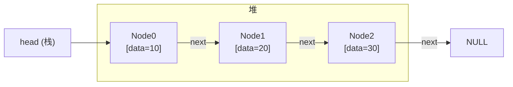
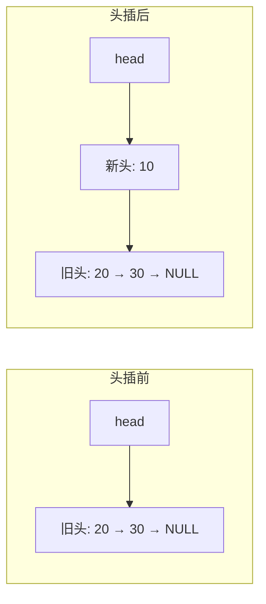
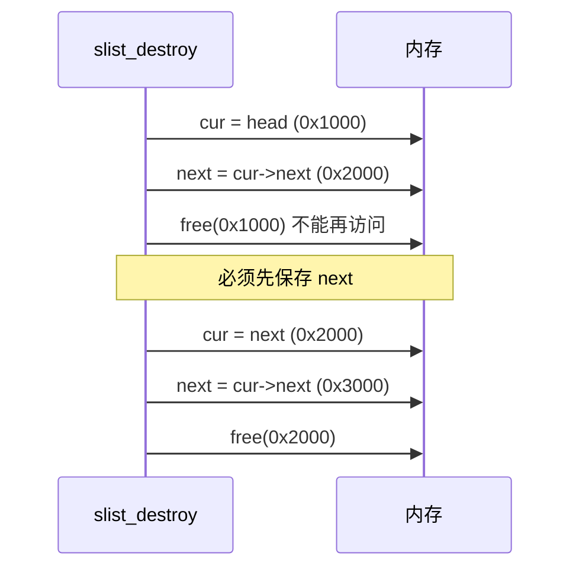
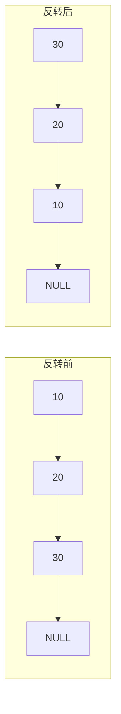
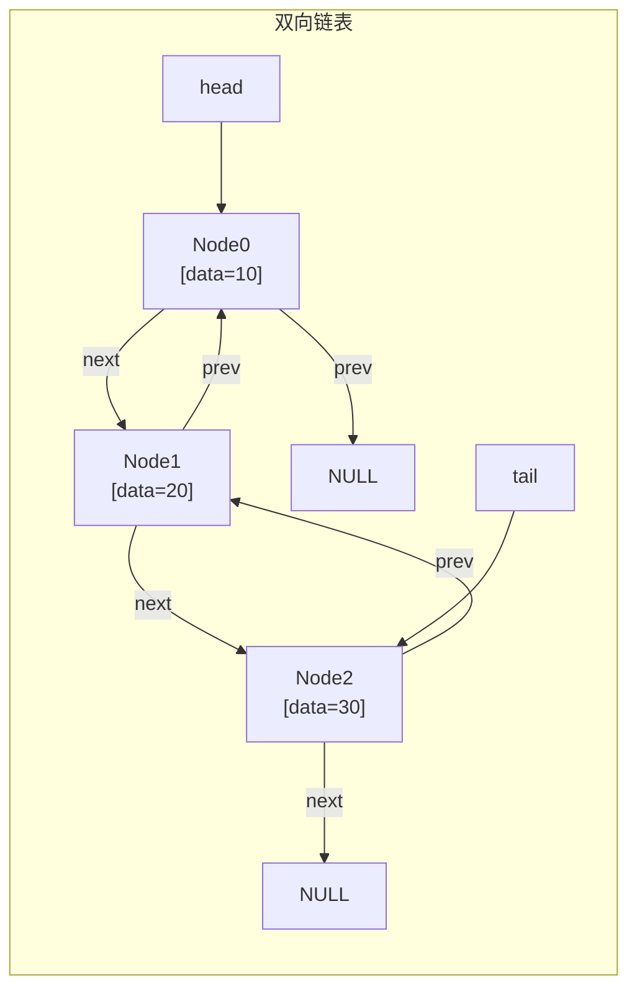
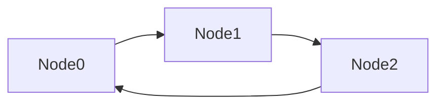
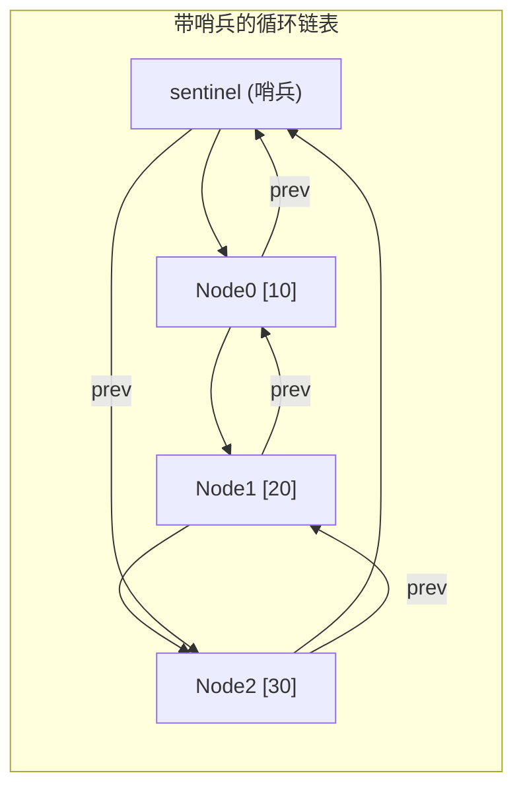
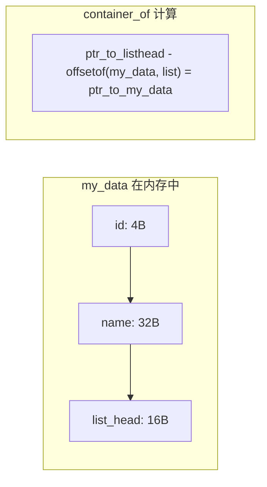

# 链表  (Linked List)

---

##  章节概述

链表（Linked List）是一种非连续存储的线性数据结构，每个节点通过指针链接到下一个节点。
与数组不同，链表不要求元素连续存放，插入和删除操作只需要修改指针，无需移动数据。

本节侧重底层实现与内存理解，与 [[../../数据结构/D_链表_LinkedList|CPP教程对应章节]] 形成互补——CPP教程侧重 `std::list`/`std::forward_list` 的STL使用与迭代器操作，本教程侧重手动管理节点内存、指针链接、以及理解链表的真实内存布局。你还将学习Linux内核中著名的侵入式链表（intrusive linked list）模式。

> 在CPP教程中对应章节侧重 STL 的 list/forward_list 用法与迭代器，本节侧重手动 malloc/free 节点、指针操作与内存布局。

---

---
###  第一节: 单向链表 —— 最基础的链式结构
---

### 1.1 节点结构与创建

单向链表每个节点包含数据和指向下一个节点的指针：

```c
#include <stdlib.h>
#include <stdio.h>
#include <stdbool.h>

typedef struct SNode {
    int data;
    struct SNode *next;
} SNode;
```

**内存布局**: 每个节点独立分配在堆上，通过 `next` 指针串联。与数组的连续内存不同，
链表节点散布在堆的各个位置。



> 对比数组：数组 `[10,20,30]` 在一条连续内存上，链表 `10→20→30` 散布各处。详见 [[../2深化/03_动态内存管理|动态内存管理]]。

---

### 1.2 头插法 —— O(1)

```c
SNode* slist_prepend(SNode *head, int value) {
    SNode *new_node = (SNode*)malloc(sizeof(SNode));
    if (!new_node) {
        fprintf(stderr, "malloc failed\n");
        return head;
    }
    new_node->data = value;
    new_node->next = head;   // 新节点指向原来的头
    return new_node;          // 返回新的头
}
```

**指针关系变化**:



> **练习 1.2.1**: 为什么头插法返回新头指针？如果参数是 `SNode** head`（二级指针），如何实现？

---

### 1.3 尾插法 —— O(n)

```c
SNode* slist_append(SNode *head, int value) {
    SNode *new_node = (SNode*)malloc(sizeof(SNode));
    if (!new_node) return head;
    new_node->data = value;
    new_node->next = NULL;

    if (head == NULL) {
        return new_node;  // 空链表，新节点就是头
    }

    // 遍历到最后一个节点
    SNode *cur = head;
    while (cur->next != NULL) {
        cur = cur->next;
    }
    cur->next = new_node;
    return head;
}
```

**优化 —— 带尾指针的单链表**:

尾插法的 O(n) 开销来自于找尾节点。如果常用尾插，可以维护一个尾指针：

```c
typedef struct {
    SNode *head;
    SNode *tail;
} SListWithTail;

void slist_tail_append(SListWithTail *list, int value) {
    SNode *new_node = (SNode*)malloc(sizeof(SNode));
    new_node->data = value;
    new_node->next = NULL;

    if (list->tail) {
        list->tail->next = new_node;
    } else {
        list->head = new_node;  // 空链表
    }
    list->tail = new_node;
}
```

> **练习 1.3.1**: 实现带尾指针的 `slist_tail_prepend`（头插），分析是否需要修改尾指针。

---

### 1.4 查找、删除与销毁

```c
// 查找 —— 返回节点指针
SNode* slist_find(SNode *head, int value) {
    SNode *cur = head;
    while (cur != NULL) {
        if (cur->data == value)
            return cur;
        cur = cur->next;
    }
    return NULL;
}

// 删除指定值的第一个节点
SNode* slist_remove(SNode *head, int value) {
    if (head == NULL) return NULL;

    // 头节点特殊处理
    if (head->data == value) {
        SNode *new_head = head->next;
        free(head);
        return new_head;
    }

    // 找前驱
    SNode *prev = head;
    SNode *cur = head->next;
    while (cur != NULL) {
        if (cur->data == value) {
            prev->next = cur->next;
            free(cur);
            return head;
        }
        prev = cur;
        cur = cur->next;
    }
    return head;  // 未找到
}

// 销毁整条链表 —— 必须逐个释放
void slist_destroy(SNode *head) {
    SNode *cur = head;
    while (cur != NULL) {
        SNode *next = cur->next;  // 先保存下一个节点地址
        free(cur);
        cur = next;
    }
}
```

**销毁链表的内存陷阱**: 不能先 free(current) 再访问 current->next——`free` 后的内存已不可访问。



> **练习 1.4.1**: 实现 `slist_remove_all(SNode *head, int value)` 删除链表中所有等于 value 的节点。

---

### 1.5 反转单向链表 —— 经典面试题

```c
SNode* slist_reverse(SNode *head) {
    SNode *prev = NULL;
    SNode *cur = head;
    SNode *next;

    while (cur != NULL) {
        next = cur->next;      // 1. 暂存下一个
        cur->next = prev;      // 2. 反转指针
        prev = cur;            // 3. 前驱前进
        cur = next;            // 4. 当前前进
    }
    return prev;  // 新的头节点
}
```

**指针变化图解**:



> 反转链表涉及指针三步操作，可以从汇编角度理解：每次迭代修改一个 `next` 寄存器指向的值，参见 。

> **练习 1.5.1**: 实现递归版本的链表反转。分析递归版本的栈深度是否安全。

---

---
###  第二节: 双向链表
---

### 2.1 节点结构

双向链表每个节点有两个指针：前驱 `prev` 和后继 `next`。

```c
typedef struct DNode {
    int data;
    struct DNode *prev;
    struct DNode *next;
} DNode;

typedef struct {
    DNode *head;
    DNode *tail;
    size_t size;
} DList;
```



---

### 2.2 双向链表的优势

双向链表的代价是每个节点多 8 字节（64位），但换来的是：

1. **O(1) 尾删**：可以直接通过 tail->prev 找到新的尾
2. **O(1) 前向遍历与删除**：给定节点的指针，可以 O(1) 找到前驱并删除
3. **插入/删除不再需要"找前驱"**：这在单向链表中是 O(n) 的

```c
DList* dlist_create() {
    DList *list = (DList*)malloc(sizeof(DList));
    if (!list) return NULL;
    list->head = NULL;
    list->tail = NULL;
    list->size = 0;
    return list;
}

// O(1) 删除指定节点（因为可以访问 prev）
void dlist_remove_node(DList *list, DNode *node) {
    if (!node) return;

    if (node->prev)
        node->prev->next = node->next;
    else
        list->head = node->next;  // 删除的是头

    if (node->next)
        node->next->prev = node->prev;
    else
        list->tail = node->prev;  // 删除的是尾

    free(node);
    list->size--;
}

// O(1) 头插
void dlist_push_front(DList *list, int value) {
    DNode *node = (DNode*)malloc(sizeof(DNode));
    if (!node) return;
    node->data = value;
    node->prev = NULL;
    node->next = list->head;

    if (list->head)
        list->head->prev = node;
    else
        list->tail = node;  // 空链表，新节点也是尾

    list->head = node;
    list->size++;
}

// O(1) 尾插
void dlist_push_back(DList *list, int value) {
    DNode *node = (DNode*)malloc(sizeof(DNode));
    if (!node) return;
    node->data = value;
    node->next = NULL;
    node->prev = list->tail;

    if (list->tail)
        list->tail->next = node;
    else
        list->head = node;  // 空链表，新节点也是头

    list->tail = node;
    list->size++;
}
```

> **练习 2.2.1**: 实现 `dlist_insert_before(DList *list, DNode *ref, int value)` 在 ref 节点前插入新节点。

---

### 2.3 双向链表的销毁

与单向链表类似，逐个释放：

```c
void dlist_destroy(DList *list) {
    if (!list) return;
    DNode *cur = list->head;
    while (cur) {
        DNode *next = cur->next;
        free(cur);
        cur = next;
    }
    free(list);
}
```

> **练习 2.3.1**: 为什么在双向链表中也可以像单向链表一样用 `next` 遍历销毁？遍历销毁时访问 `prev` 是否有意义？

---

---
###  第三节: 循环链表与哨兵节点
---

### 3.1 循环单链表

尾节点的 `next` 指向头节点，形成一个环：

```c
typedef struct {
    SNode *head;  // 可以指向任意节点
} CircularList;
```



循环链表的好处：从任意节点出发都能遍历整条链表，不需要区分"头"和"尾"。

```c
// 在 head 节点后插入
void clist_insert_after(SNode *node, int value) {
    SNode *new_node = (SNode*)malloc(sizeof(SNode));
    new_node->data = value;
    new_node->next = node->next;
    node->next = new_node;
}

// 遍历（需要一个终止条件）
void clist_print(SNode *head) {
    if (!head) return;
    SNode *cur = head;
    do {
        printf("%d ", cur->data);
        cur = cur->next;
    } while (cur != head);
    printf("\n");
}
```

> **练习 3.1.1**: 实现约瑟夫环（Josephus problem）——n个人围成一圈，每次数到m的人出列，求最后剩下的人的编号。用循环链表实现。

---

### 3.2 带哨兵节点的双向循环链表

这是一个非常优雅的设计——用一个不存数据的"哨兵节点"（sentinel/dummy node）简化边界条件：

```c
typedef struct {
    DNode sentinel;  // 哨兵节点，不存数据
    size_t size;
} SentinelList;
```

初始化时，哨兵节点的 `prev` 和 `next` 都指向自己：

```c
void sentinel_list_init(SentinelList *list) {
    list->sentinel.prev = &list->sentinel;
    list->sentinel.next = &list->sentinel;
    list->size = 0;
}
```

**为什么哨兵节点能简化代码？**

普通双向链表在空表、删除头、删除尾时需要特殊的 `if` 判断。
哨兵节点让每个有效节点永远有前驱和后继（即使是空表，哨兵也存在）。

```c
// 哨兵链表: 尾部插入，代码极其简洁
void sentinel_push_back(SentinelList *list, int value) {
    DNode *node = (DNode*)malloc(sizeof(DNode));
    node->data = value;

    // 始终在 sentinel 之前（即尾部）插入
    node->next = &list->sentinel;
    node->prev = list->sentinel.prev;
    list->sentinel.prev->next = node;
    list->sentinel.prev = node;
    list->size++;
}

// 删除节点 —— 也极其简洁
void sentinel_remove(DNode *node) {
    node->prev->next = node->next;
    node->next->prev = node->prev;
    free(node);
}
```

注意：上面的 `sentinel_remove` 不需要知道链表结构体，因为每个节点都有完整的 `prev` 和 `next`！



> **练习 3.2.1**: 为哨兵链表实现 `sentinel_find`、`sentinel_push_front`、`sentinel_pop_back`。

---

---
###  第四节: Linux 内核链表 —— 侵入式链表模式
---

### 4.1 侵入式 vs 非侵入式

我们前面实现的链表是"非侵入式"（non-intrusive）的——节点 `struct` 本身就是链表节点：

```c
struct DNode { int data; DNode *prev; DNode *next; };
```

但 Linux 内核使用的是"侵入式"（intrusive）链表——链表指针嵌入到"宿主"结构体中：

```c
// Linux 内核风格（简化版）
struct list_head {
    struct list_head *prev;
    struct list_head *next;
};

struct my_data {
    int id;
    char name[32];
    struct list_head list;  // 嵌入的链表节点
};
```

```mermaid
graph TB
    subgraph "非侵入式: DNode 就是节点"
        dn1["DNode\n{data=10, prev, next}"]
        dn2["DNode\n{data=20, prev, next}"]
    end
    subgraph "侵入式: list_head 嵌入在 my_data 中"
        md1["my_data\n{id=1, name=\"Alice\"\n◉ list_head}"]
        md2["my_data\n{id=2, name=\"Bob\"\n◉ list_head}"]
    end
```

**侵入式链表的优势**:
1. 节点不拥有数据——同一个数据对象可以同时挂在多个链表中
2. 不需要为每个数据类型重写链表代码——链表操作只操作 `list_head`
3. 零额外分配——`list_head` 是宿主结构体的一部分，不需要单独 `malloc`

**侵入式链表的代价**:
1. 需要从 `list_head` 指针反推出宿主结构体指针（`container_of` 宏）
2. 代码理解门槛更高

---

### 4.2 container_of 宏 —— 侵入式链表的核心技巧

```c
#include <stddef.h>  // offsetof

// 从成员指针反推出包含该成员的结构体指针
#define container_of(ptr, type, member) \
    ((type *)((char *)(ptr) - offsetof(type, member)))
```

**原理**: 已知成员在结构体中的偏移量（`offsetof`），用成员地址减去偏移量，即得结构体地址。



> `offsetof` 的原理和汇编表示，参见 [[../2深化/01_指针深度剖析|指针深度剖析]]。

---

### 4.3 简化的内核链表实现

```c
// ===== list.h =====
typedef struct list_head {
    struct list_head *prev;
    struct list_head *next;
} list_head_t;

#define LIST_HEAD_INIT(name) { &(name), &(name) }
#define LIST_HEAD(name) list_head_t name = LIST_HEAD_INIT(name)

static inline void INIT_LIST_HEAD(list_head_t *list) {
    list->prev = list;
    list->next = list;
}

// 在 prev 和 next 之间插入
static inline void __list_add(list_head_t *new_node,
                               list_head_t *prev,
                               list_head_t *next) {
    next->prev = new_node;
    new_node->next = next;
    new_node->prev = prev;
    prev->next = new_node;
}

static inline void list_add(list_head_t *new_node, list_head_t *head) {
    __list_add(new_node, head, head->next);  // 头插
}

static inline void list_add_tail(list_head_t *new_node, list_head_t *head) {
    __list_add(new_node, head->prev, head);  // 尾插
}

static inline void __list_del(list_head_t *prev, list_head_t *next) {
    next->prev = prev;
    prev->next = next;
}

static inline void list_del(list_head_t *entry) {
    __list_del(entry->prev, entry->next);
}

static inline int list_empty(const list_head_t *head) {
    return head->next == head;
}

// 遍历宏
#define list_for_each(pos, head) \
    for (pos = (head)->next; pos != (head); pos = pos->next)

#define list_entry(ptr, type, member) \
    container_of(ptr, type, member)

#define list_for_each_entry(pos, head, member) \
    for (pos = list_entry((head)->next, typeof(*pos), member); \
         &pos->member != (head); \
         pos = list_entry(pos->member.next, typeof(*pos), member))
```

---

### 4.4 使用侵入式链表

```c
struct student {
    int id;
    char name[32];
    int score;
    list_head_t list;  // 嵌入每个 student 中
};

int main() {
    LIST_HEAD(student_list);  // 初始化链表头

    // 添加三个学生
    struct student s1 = {1, "Alice", 95};
    struct student s2 = {2, "Bob",   87};
    struct student s3 = {3, "Charlie", 92};

    list_add_tail(&s1.list, &student_list);
    list_add_tail(&s2.list, &student_list);
    list_add_tail(&s3.list, &student_list);

    // 遍历
    struct student *entry;
    list_for_each_entry(entry, &student_list, list) {
        printf("ID=%d, Name=%s, Score=%d\n",
               entry->id, entry->name, entry->score);
    }

    // 删除 Bob
    list_del(&s2.list);

    return 0;
}
```

**关键观察**: `student` 结构体可以在栈上也可以全局分配（本例在栈上），不需要 `malloc`。
但这意味着 student 的生命周期由外部管理——链表只持有这些对象的"弱引用"。

> **练习 4.4.1**: 实现 `list_for_each_entry_safe` —— 安全遍历宏（允许在遍历过程中删除当前节点）。

> 关于 C++ 中 `std::list` 如何实现，参见 [[../../cpp教程/容器库/序列容器/list|CPP: list/forward_list]]。

---

---
###  第五节: 链表性能分析与适用场景
---

### 5.1 复杂度对比

| 操作 | 单向链表 | 双向链表 | 动态数组 |
|------|---------|---------|---------|
| 头插 | O(1) | O(1) | O(n) |
| 尾插（已知tail） | O(1) | O(1) | 均摊 O(1) |
| 中间插入 | O(n)找位置+O(1)插入 | O(n)找位置+O(1)插入 | O(n)移动 |
| 删除已知节点 | O(n)找前驱 | O(1) | O(n)移动 |
| 随机访问 | O(n) | O(n) | **O(1)** |
| 内存开销 | 8B/节点（64bit） | 16B/节点（64bit） | 0B额外开销 |

### 5.2 内存碎片与缓存

数组在**内存连续**，CPU 缓存友好（空间局部性）；链表节点**散布堆中**，每次访问下一个节点都可能触发 cache miss。

```c
// 演示链表的内存散落
void show_scattered_memory(SNode *head) {
    printf("Nodes scattered in memory:\n");
    SNode *cur = head;
    while (cur) {
        printf("  addr=%p, data=%d, next=%p (delta=%td)\n",
               (void*)cur, cur->data, (void*)cur->next,
               (char*)cur->next - (char*)cur);
        cur = cur->next;
    }
}
// 典型输出: delta 可能是几百或几千字节的随机值
```

> 关于 CPU 缓存和内存局部性，参见 。

---

### 5.3 链表的正确使用场景

**适合链表的场景**:
- 频繁进行插入/删除且不关心随机访问
- 无法预知元素数量（不需要像数组那样预分配）
- 需要稳定的元素地址（数组扩容时地址会变）

**不适合链表的场景**:
- 需要频繁随机访问
- 内存紧张（节点额外内存开销大）
- 对缓存性能有要求的大规模数据

> **练习 5.3.1**: 编写一个程序，分别用链表和动态数组实现相同的大规模插入操作（10万元素，在头部插入），对比时间。尝试解释结果差异的原因。

---

---
##  章节测试
---

###  判断题（10题）

> [!question] 判断题 1
> 单向链表的头插法时间复杂度是 O(n)。
> > [!FAQ]- 点击查看答案
> > **错误**。头插法只需修改新节点的 next 指向原头节点，时间复杂度 O(1)。

> [!question] 判断题 2
> 双向链表比单向链表多占用一倍的指针内存。
> > [!FAQ]- 点击查看答案
> > **正确**。单向链表每个节点一个指针（next），双向链表两个指针（prev + next），在 64 位系统中每个节点多 8 字节。

> [!question] 判断题 3
> 链表的元素在内存中是连续存放的。
> > [!FAQ]- 点击查看答案
> > **错误**。链表的每个节点独立分配在堆上，内存地址不连续。这是链表与数组的本质区别。

> [!question] 判断题 4
> 销毁链表时可以一次性 `free(head)` 释放所有节点。
> > [!FAQ]- 点击查看答案
> > **错误**。每个节点都是独立 `malloc` 的，必须逐个 `free`。一次性 `free(head)` 只释放头节点，其余节点造成内存泄漏。

> [!question] 判断题 5
> 带哨兵节点的链表可以消除边界条件的特殊判断。
> > [!FAQ]- 点击查看答案
> > **正确**。哨兵节点确保每个有效节点始终有前驱和后继，空表时哨兵的 prev 和 next 都指向自己，简化了插入和删除代码。

> [!question] 判断题 6
> Linux 内核的 `list_head` 是侵入式链表的实现。
> > [!FAQ]- 点击查看答案
> > **正确**。`list_head` 嵌入在宿主结构体中，链表操作只操作 `list_head` 节点，通过 `container_of` 宏反推宿主结构体。

> [!question] 判断题 7
> 侵入式链表中的节点不需要单独 `malloc`。
> > [!FAQ]- 点击查看答案
> > **正确**。`list_head` 是宿主结构体的成员，宿主结构体的内存由外部管理（可以是栈上、全局区或堆上），链表本身不负责内存分配。

> [!question] 判断题 8
> 循环单链表从任意节点出发都能遍历所有元素。
> > [!FAQ]- 点击查看答案
> > **正确**。循环链表的尾节点指向头节点形成环，从任意节点出发沿着 next 都能走回原点，遍历所有元素。

> [!question] 判断题 9
> `container_of` 宏利用的是 C 语言中结构体成员地址与结构体首地址之间的固定偏移关系。
> > [!FAQ]- 点击查看答案
> > **正确**。已知成员地址和成员在结构体中的偏移量（`offsetof`），相减即得结构体首地址。

> [!question] 判断题 10
> 链表的查找操作时间复杂度为 O(log n)。
> > [!FAQ]- 点击查看答案
> > **错误**。链表不支持二分查找（无法 O(1) 访问中间元素），查找必须线性遍历，时间复杂度为 O(n)。

---

###  选择题（10题）

> [!question] 选择题 1
> 在单向链表中删除已知 `cur` 指针指向的节点，需要什么额外信息？
> - [ ] A. 不需要，直接 free(cur)
> - [ ] B. 需要 cur 的前驱节点的指针
> - [ ] C. 需要链表的头指针
> - [ ] D. 需要链表的长度
>
> > [!FAQ]- 点击查看答案
> > **正确答案: B**
> >
> > **解析**: 单向链表删除节点需要修改前驱的 `next` 指针绕过被删节点。如果没有前驱的指针，需要从头遍历找到前驱，这是 O(n) 的。双向链表则可以直接通过 `cur->prev` 找到前驱。

> [!question] 选择题 2
> 以下代码有什么问题？
> ```c
> void destroy(SNode *head) {
>     SNode *cur = head;
>     while (cur) {
>         free(cur);
>         cur = cur->next;  // 问题在哪？
>     }
> }
> ```
> - [ ] A. 没有循环终止条件
> - [ ] B. free(cur) 后访问 cur->next 是未定义行为
> - [ ] C. 需要检查 head 是否为 NULL
> - [ ] D. free 的参数类型错误
>
> > [!FAQ]- 点击查看答案
> > **正确答案: B**
> >
> > **解析**: `free(cur)` 后，`cur` 指向的内存已被释放，再访问 `cur->next` 属于 use-after-free，是未定义行为。正确做法是先用临时变量保存 `next` 再释放。

> [!question] 选择题 3
> 在 64 位系统中，一个双向链表节点（不含数据）占用多少额外内存？
> - [ ] A. 4 字节
> - [ ] B. 8 字节
> - [ ] C. 16 字节
> - [ ] D. 24 字节
>
> > [!FAQ]- 点击查看答案
> > **正确答案: C**
> >
> > **解析**: 64位系统指针为 8 字节，双向链表节点有两个指针（prev 和 next），额外开销 8 + 8 = 16 字节。

> [!question] 选择题 4
> 以下关于头插法和尾插法的描述，正确的是？
> - [ ] A. 头插法会改变元素插入顺序，尾插法保持插入顺序
> - [ ] B. 头插法和尾插法都是 O(n)
> - [ ] C. 尾插法始终是 O(1)
> - [ ] D. 头插法比尾插法慢
>
> > [!FAQ]- 点击查看答案
> > **正确答案: A**
> >
> > **解析**: 头插法后插入的元素在链表头部，因此遍历顺序与插入顺序相反。尾插法遍历顺序与插入顺序一致。B 错（头插 O(1)），C 错（不含尾指针的单链表尾插是 O(n)）。

> [!question] 选择题 5
> Linux 内核使用侵入式链表的主要原因是？
> - [ ] A. 节省内存
> - [ ] B. 一个数据对象可以同时出现在多个链表中
> - [ ] C. 它比非侵入式链表更快
> - [ ] D. 不需要写遍历代码
>
> > [!FAQ]- 点击查看答案
> > **正确答案: B**
> >
> > **解析**: 侵入式链表的核心优势是数据对象和链表节点解耦——同一个数据对象可以嵌入多个 `list_head`，从而同时挂载在多个不同用途的链表中（如进程同时挂在运行队列、等待队列等）。

> [!question] 选择题 6
> `offsetof(type, member)` 宏返回的是什么？
> - [ ] A. 结构体的大小
> - [ ] B. 成员的大小
> - [ ] C. 成员在结构体中的字节偏移量
> - [ ] D. 结构体的内存地址
>
> > [!FAQ]- 点击查看答案
> > **正确答案: C**
> >
> > **解析**: `offsetof`（定义在 `<stddef.h>`）返回成员在结构体中的字节偏移量。例如 `offsetof(struct my_data, list)` 返回 `sizeof(id) + sizeof(name)` 的字节数。

> [!question] 选择题 7
> 在带哨兵的双向循环链表中，空链表时哨兵节点的 prev 和 next 分别指向？
> - [ ] A. prev=NULL, next=NULL
> - [ ] B. prev=head, next=head
> - [ ] C. prev=sentinel, next=sentinel（都指向自己）
> - [ ] D. prev=NULL, next=sentinel
>
> > [!FAQ]- 点击查看答案
> > **正确答案: C**
> >
> > **解析**: 空链表时哨兵节点的 `prev` 和 `next` 都指向自己（`head->prev = head; head->next = head`）。这样编写插入删除代码时不需要特殊处理空表情况。

> [!question] 选择题 8
> 反转单向链表的迭代算法中，核心操作是什么？
> - [ ] A. 交换相邻节点的数据
> - [ ] B. 逐个修改节点的 next 指针，使其指向前一个节点
> - [ ] C. 从尾到头重新构建链表
> - [ ] D. 使用栈暂存所有节点
>
> > [!FAQ]- 点击查看答案
> > **正确答案: B**
> >
> > **解析**: 反转链表的核心是遍历时修改每个节点的 `next` 指针，使其指向前一个节点（最初为 NULL）。需要三个指针 prev/cur/next 协同工作。

> [!question] 选择题 9
> 约瑟夫环问题最适合使用哪种数据结构？
> - [ ] A. 动态数组
> - [ ] B. 单向链表
> - [ ] C. 循环单向链表
> - [ ] D. 哈希表
>
> > [!FAQ]- 点击查看答案
> > **正确答案: C**
> >
> > **解析**: 约瑟夫环是典型的环形结构——n 个人围成一圈，每次数到 m 的人出列。循环单链表天然适合此问题，因为从尾节点可以直接回到头节点继续计数。

> [!question] 选择题 10
> 以下关于链表和数组的选择，最合理的建议是？
> - [ ] A. 任何时候都应该用数组，因为链表有指针开销
> - [ ] B. 需要大量随机访问时用数组，需要频繁头插/删除时用链表
> - [ ] C. 链表始终比数组快
> - [ ] D. 数组的内存碎片比链表严重
>
> > [!FAQ]- 点击查看答案
> > **正确答案: B**
> >
> > **解析**: 数组 O(1) 随机访问，链表 O(n)；链表 O(1) 头插/给定节点删除，数组 O(n)。没有万能的数据结构，要根据操作特征选择。

---

###  编程大题

> [!note] 编程题 1：实现完整双向链表库
> **要求**：
> 1. 实现带哨兵节点的泛型双向循环链表（类似 Linux 内核 `list.h`）
> 2. 支持 `list_add`, `list_add_tail`, `list_del`, `list_empty`
> 3. 实现 `list_for_each`, `list_for_each_entry`, `list_for_each_entry_safe` 宏
> 4. 用此链表实现一个简单的任务调度器（任务有 id、priority、status）
> 5. 任务可以插入不同优先级队列，演示同一个 task 挂在多个链表中的能力
>
> **提示**: 参考 Linux 内核 `include/linux/list.h`

> [!note] 编程题 2：两个大数相加（用链表表示）
> **要求**：
> 1. 用单链表表示大整数（每位存储一个十进制数字，从低位到高位）
> 2. 实现两个大数的加法（模拟手工竖式加法）
> 3. 处理进位
> 4. 输出结果链表
>
> **提示**: 实际上用数组表示大数更方便（随机访问），此题旨在加深对链表遍历的理解。

> [!note] 编程题 3：LRU 缓存（双向链表 + 哈希表 = O(1)）
> **要求**：
> 1. 用双向链表维护访问顺序（最近使用的在头部，最久未使用的在尾部）
> 2. 用哈希表（或简单数组）做 key→节点指针的映射
> 3. `get(key)`: 如果存在，将节点移到链表头部，返回值；否则返回 -1
> 4. `put(key, value)`: 如果存在更新值并移到头部；如果不存在，在头部插入；容量满时删除尾部节点
> 5. 要求所有操作 O(1)（需要结合下一章哈希表的内容）
>
> **提示**: 本练习需要结合 [[05_哈希表|哈希表]] 的知识，可以先实现一个简化版（用线性搜索 key），后续优化。

###  推荐练习题（洛谷）

| 题号 | 题目 | 难度 | 知识点 |
|------|------|------|--------|
| [P1996](https://www.luogu.com.cn/problem/P1996) | 约瑟夫问题 | 入门 | 循环链表 |
| [P1160](https://www.luogu.com.cn/problem/P1160) | 队列安排 | 普及- | 双向链表 |
| [P1540](https://www.luogu.com.cn/problem/P1540) | 机器翻译 | 普及- | 队列（链表实现） |
| [P2058](https://www.luogu.com.cn/problem/P2058) | 海港 | 普及 | 链表+队列 |

---

***
##  知识网络
***

- **上一章**: [[01_动态数组|动态数组]] | **下一章**: [[03_栈|栈]] | **返回**: 
- **CPP对照**: [[../../数据结构/D_链表_LinkedList|CPP: 链表]] | [[../../cpp教程/容器库/序列容器/list|CPP: list/forward_list]]
- **相关**: [[../2深化/01_指针深度剖析|指针深度剖析]] | [[../2深化/03_动态内存管理|动态内存管理]]
- **ASM**: 
