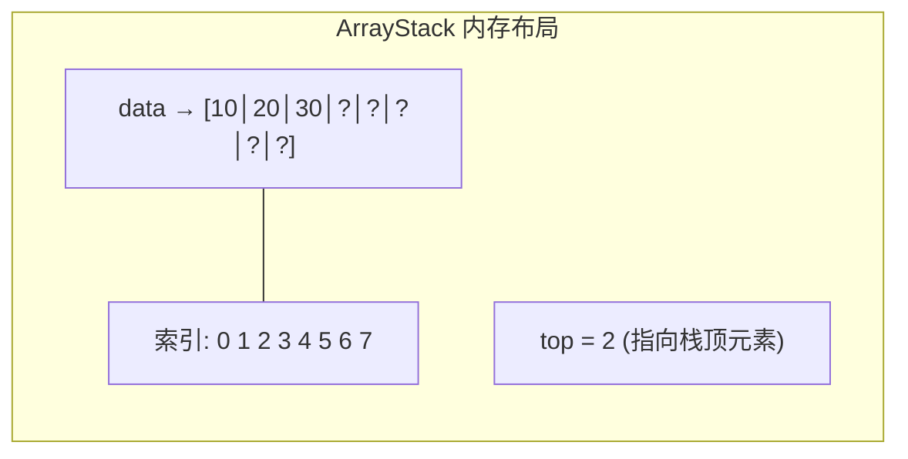
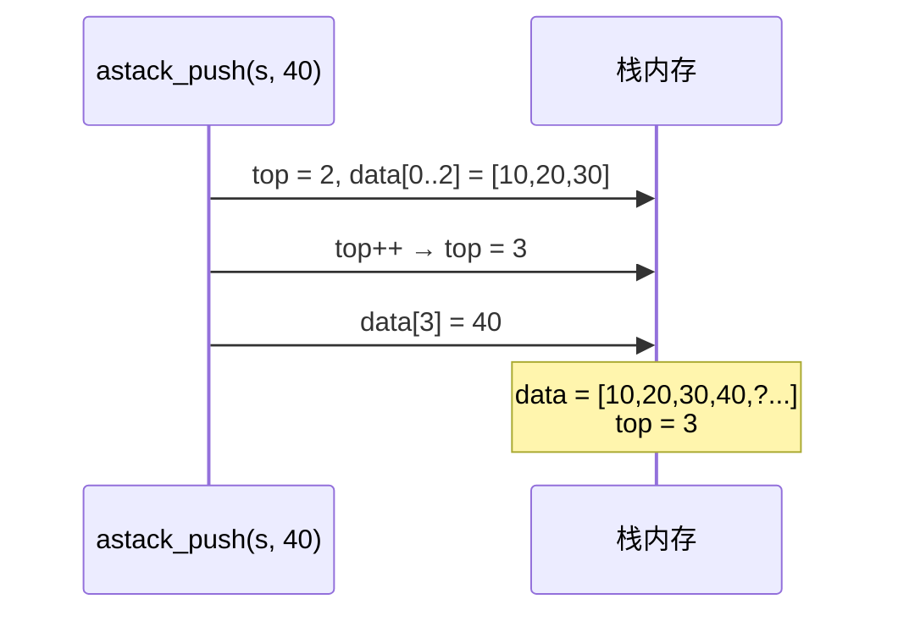
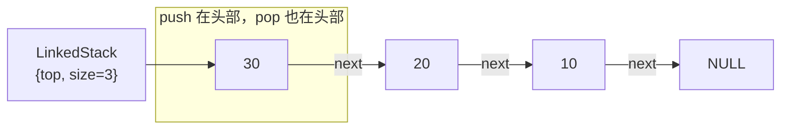
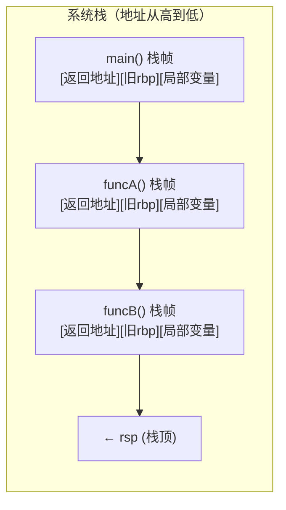
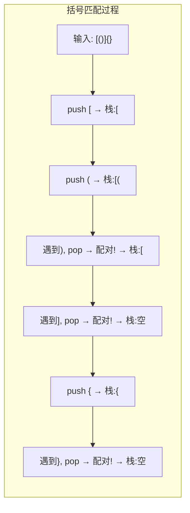
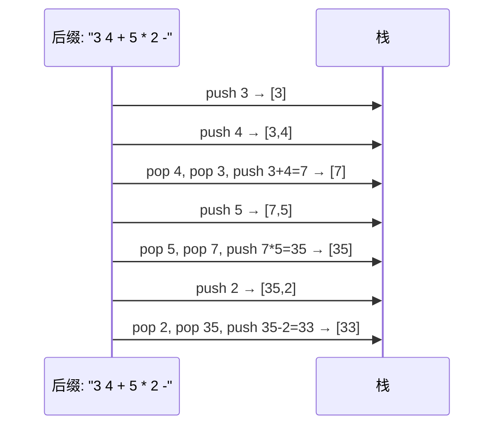

# 栈  (Stack)

---

##  章节概述

栈（Stack）是最简单的数据结构之一，遵循"后进先出"（LIFO, Last In First Out）原则。
虽然结构简单，但栈在计算机科学中无处不在——从函数调用的硬件实现到表达式求值、
括号匹配、撤销操作，几乎每个程序都在使用栈。

本节侧重底层实现与内存理解，与 [[../../数据结构/B_栈_Stack|CPP教程对应章节]] 形成互补——CPP教程侧重 `std::stack` 的 STL 使用与适配器模式，本教程侧重用 C 手动实现两种底层结构（数组栈和链式栈），深入理解栈帧的内存本质。

> 在CPP教程中对应章节侧重 `std::stack` 的 STL 使用和适配器模式，本节侧重手动实现数组栈与链式栈、以及理解栈在硬件层面的物理实现。

---

---
###  第一节: 数组栈实现
---

### 1.1 结构定义与初始化

数组栈用动态数组作为底层存储，栈顶对应数组末尾：

```c
#include <stdlib.h>
#include <stdio.h>
#include <stdbool.h>
#include <string.h>

#define STACK_INIT_CAP 8

typedef struct {
    int *data;      // 堆上的数组
    int top;        // 栈顶索引（-1 表示空栈）
    int capacity;   // 数组容量
} ArrayStack;

ArrayStack* astack_create() {
    ArrayStack *s = (ArrayStack*)malloc(sizeof(ArrayStack));
    if (!s) return NULL;
    s->data = (int*)malloc(STACK_INIT_CAP * sizeof(int));
    if (!s->data) {
        free(s);
        return NULL;
    }
    s->top = -1;
    s->capacity = STACK_INIT_CAP;
    return s;
}
```

**`top` 索引的含义**: `top == -1` 时栈为空；`top` 始终指向栈顶元素（最后一个有效元素的位置）。



---

### 1.2 push —— 压栈

```c
bool astack_push(ArrayStack *s, int value) {
    // 栈满？扩容
    if (s->top + 1 == s->capacity) {
        int new_cap = s->capacity * 2;
        int *new_data = (int*)realloc(s->data, new_cap * sizeof(int));
        if (!new_data) return false;
        s->data = new_data;
        s->capacity = new_cap;
    }
    s->top++;
    s->data[s->top] = value;
    return true;
}
```

**push 操作过程**（用 mermaid 展示栈变化）:



---

### 1.3 pop —— 弹栈

```c
int astack_pop(ArrayStack *s) {
    if (s->top == -1) {
        fprintf(stderr, "astack_pop: empty stack\n");
        return 0;
    }
    int value = s->data[s->top];
    s->top--;
    return value;
}
```

**注意**: `pop` 不修改 `data[top+1]` 的值，只是逻辑上缩小栈。该位置的数据仍存在于内存中，
但已不属于栈。这类似于动态数组的 `pop_back`。

---

### 1.4 peek 与辅助操作

```c
int astack_peek(const ArrayStack *s) {
    if (s->top == -1) {
        fprintf(stderr, "astack_peek: empty stack\n");
        return 0;
    }
    return s->data[s->top];
}

bool astack_is_empty(const ArrayStack *s) {
    return s->top == -1;
}

int astack_size(const ArrayStack *s) {
    return s->top + 1;
}

void astack_destroy(ArrayStack *s) {
    if (s) {
        free(s->data);
        free(s);
    }
}
```

> **练习 1.4.1**: 实现 `astack_clear(ArrayStack *s)` —— 清空栈但不释放内存（仅设置 top = -1）。

> **练习 1.4.2**: 为数组栈添加 `astack_min(ArrayStack *s)` —— O(1) 获取最小值。提示：需要维护一个辅助栈。两个栈的同步关系如何管理？

---

---
###  第二节: 链式栈实现
---

### 2.1 节点结构与基本操作

链式栈用单向链表实现，栈顶对应链表头部：

```c
typedef struct StackNode {
    int data;
    struct StackNode *next;
} StackNode;

typedef struct {
    StackNode *top;  // 指向栈顶节点（链表头）
    int size;
} LinkedStack;
```



---

### 2.2 链式栈的实现

```c
LinkedStack* lstack_create() {
    LinkedStack *s = (LinkedStack*)malloc(sizeof(LinkedStack));
    if (!s) return NULL;
    s->top = NULL;
    s->size = 0;
    return s;
}

bool lstack_push(LinkedStack *s, int value) {
    StackNode *node = (StackNode*)malloc(sizeof(StackNode));
    if (!node) return false;
    node->data = value;
    node->next = s->top;   // 新节点指向原栈顶
    s->top = node;         // 栈顶更新为新节点
    s->size++;
    return true;
}

int lstack_pop(LinkedStack *s) {
    if (s->top == NULL) {
        fprintf(stderr, "lstack_pop: empty stack\n");
        return 0;
    }
    StackNode *old_top = s->top;
    int value = old_top->data;
    s->top = old_top->next;
    free(old_top);
    s->size--;
    return value;
}

int lstack_peek(const LinkedStack *s) {
    if (s->top == NULL) {
        fprintf(stderr, "lstack_peek: empty stack\n");
        return 0;
    }
    return s->top->data;
}

void lstack_destroy(LinkedStack *s) {
    if (!s) return;
    StackNode *cur = s->top;
    while (cur) {
        StackNode *next = cur->next;
        free(cur);
        cur = next;
    }
    free(s);
}
```

**数组栈 vs 链式栈**:

| 特性 | 数组栈 | 链式栈 |
|------|--------|--------|
| push 时间 | 均摊 O(1) | O(1) |
| pop 时间 | O(1) | O(1) |
| 内存开销 | 可能有预留空间 | 每节点额外 8B |
| 空间局部性 | 好（连续内存） | 差（散布） |
| 最大容量 | realloc 可扩展 | 受限于可用内存 |
| 实现复杂度 | 需要扩容逻辑 | 需要节点管理 |

> **练习 2.2.1**: 如果用一个单向链表但以尾插法实现栈（即 push 在尾部，pop 也在尾部），分析其时间复杂度，说明为什么不可行。

---

---
###  第三节: 函数调用栈 —— 栈的物理实现
---

### 3.1 系统栈与栈帧

C/C++ 程序的函数调用在底层由**系统栈**（Call Stack）实现，它是栈数据结构在硬件层面最
直接的物理体现。每次函数调用时，CPU 在系统栈上分配一个**栈帧**（Stack Frame），包含：

- 函数参数（部分通过寄存器传递）
- 返回地址（函数返回后下一条指令的地址）
- 保存的寄存器（如旧的 `rbp` 值）
- 局部变量



> 关于 CPU 如何使用 `rsp`/`rbp` 寄存器管理栈帧，以及 `push`/`pop`/`call`/`ret` 指令的细节，
> 详见 。

---

### 3.2 栈溢出（Stack Overflow）实验

```c
// 危险！仅用于教学演示
// 系统栈默认大小通常为 8MB（Linux）
// 递归过深或局部变量过大都会导致栈溢出

#include <stdio.h>

void dangerous_recursion(int depth) {
    char huge_array[1000000];  // 1MB 局部变量！
    printf("depth=%d, array addr=%p\n", depth, (void*)huge_array);
    dangerous_recursion(depth + 1);
}

// 运行此函数一般只能递归 7-8 次就会崩溃（Segmentation Fault）
```

**栈溢出 vs 堆溢出对比**:

| 类型 | 存储位置 | 原因 | 现象 |
|------|---------|------|------|
| 栈溢出 | 系统栈（~8MB） | 递归过深/大局部变量 | 段错误（SIGSEGV） |
| 堆溢出 | 堆（受虚拟内存限制） | 写入超过 malloc 大小的数据 | 可能破坏堆结构，行为未定义 |

> **练习 3.2.1**: 编写程序，通过 `ulimit -s` 修改栈大小，观察同一个递归函数能递归到不同深度的行为。

---

### 3.3 递归的栈帧消耗

每次递归调用都分配新的栈帧。如果递归深度不确定，应使用循环或尾递归优化：

```c
// 普通递归：每层分配栈帧
int factorial_recursive(int n) {
    if (n <= 1) return 1;
    return n * factorial_recursive(n - 1);  // 乘法在递归返回后执行
}

// 循环版本：无额外栈帧
int factorial_iterative(int n) {
    int result = 1;
    for (int i = 2; i <= n; i++)
        result *= i;
    return result;
}
```

> 关于尾递归优化的汇编原理，参见 。

---

---
###  第四节: 栈的经典应用
---

### 4.1 括号匹配

```c
#include <stdbool.h>
#include <string.h>

bool is_matching_pair(char open, char close) {
    return (open == '(' && close == ')') ||
           (open == '[' && close == ']') ||
           (open == '{' && close == '}');
}

bool check_brackets(const char *expr) {
    ArrayStack *s = astack_create();
    if (!s) return false;

    for (int i = 0; expr[i] != '\0'; i++) {
        char ch = expr[i];
        if (ch == '(' || ch == '[' || ch == '{') {
            astack_push(s, ch);
        } else if (ch == ')' || ch == ']' || ch == '}') {
            if (astack_is_empty(s)) {
                astack_destroy(s);
                return false;  // 多了右括号
            }
            char top = (char)astack_pop(s);
            if (!is_matching_pair(top, ch)) {
                astack_destroy(s);
                return false;  // 不匹配
            }
        }
    }
    bool result = astack_is_empty(s);  // 栈为空说明全部匹配
    astack_destroy(s);
    return result;
}
```

**算法正确性分析**: 成对的括号在栈中正好抵消。遍历结束后如果栈为空，说明所有左括号都找到了配对。
如果中途栈为空时遇到右括号，说明右括号多了；如果遍历完栈非空，说明左括号多了。



> **练习 4.1.1**: 扩展括号匹配，支持 `<` 和 `>` 括号。

---

### 4.2 后缀表达式（逆波兰表达式）求值

后缀表达式把运算符放在操作数之后，不需要括号就能表达优先级：

```
中缀: (3 + 4) * 5 - 2
后缀: 3 4 + 5 * 2 -
```

```c
#include <ctype.h>

int eval_rpn(const char *tokens) {
    ArrayStack *s = astack_create();
    if (!s) return 0;

    const char *p = tokens;
    while (*p) {
        // 跳过空格
        while (*p == ' ') p++;

        if (isdigit(*p)) {
            // 读取完整数字
            int num = 0;
            while (isdigit(*p)) {
                num = num * 10 + (*p - '0');
                p++;
            }
            astack_push(s, num);
        } else if (*p == '+' || *p == '-' || *p == '*' || *p == '/') {
            int b = astack_pop(s);  // 第二个操作数
            int a = astack_pop(s);  // 第一个操作数
            int result;
            switch (*p) {
                case '+': result = a + b; break;
                case '-': result = a - b; break;
                case '*': result = a * b; break;
                case '/': result = a / b; break;  // 简化，不考虑除零
                default:  result = 0;
            }
            astack_push(s, result);
            p++;
        }
    }

    int result = astack_pop(s);
    astack_destroy(s);
    return result;
}
```



> **练习 4.2.1**: 实现中缀表达式转后缀表达式（调度场算法 Shunting-yard Algorithm）。

---

### 4.3 中缀表达式求值（双栈法）

使用两个栈：操作数栈和运算符栈：

```c
int precedence(char op) {
    switch (op) {
        case '+': case '-': return 1;
        case '*': case '/': return 2;
        default: return 0;
    }
}

int apply_op(int a, int b, char op) {
    switch (op) {
        case '+': return a + b;
        case '-': return a - b;
        case '*': return a * b;
        case '/': return a / b;
        default:  return 0;
    }
}

int evaluate_infix(const char *expr) {
    ArrayStack *num_stack = astack_create();
    ArrayStack *op_stack = astack_create();

    // ... 实现双栈算法，处理数字、运算符、括号
    // 详细实现留给读者作为练习

    int result = astack_pop(num_stack);
    astack_destroy(num_stack);
    astack_destroy(op_stack);
    return result;
}
```

> **练习 4.3.1**: 完成上面的 `evaluate_infix` 实现。要求能正确处理括号、运算符优先级，以及负数。

---

---
###  第五节: 单调栈
---

单调栈是一种特殊用途的栈——栈内元素始终保持单调递增或递减。

### 5.1 下一个更大元素问题

```c
// 对于数组 arr 中的每个元素，找出其右侧第一个比它大的元素
// 使用单调递减栈
#include <stdlib.h>

int* next_greater_element(const int *arr, int n) {
    int *result = (int*)malloc(n * sizeof(int));
    int *stack = (int*)malloc(n * sizeof(int));  // 存索引
    int top = -1;

    for (int i = 0; i < n; i++) {
        // 当前元素比栈顶元素大 → 找到答案
        while (top >= 0 && arr[i] > arr[stack[top]]) {
            result[stack[top]] = arr[i];
            top--;
        }
        stack[++top] = i;  // 当前索引入栈
    }
    // 栈中剩余元素没有更大的
    while (top >= 0) {
        result[stack[top]] = -1;
        top--;
    }
    free(stack);
    return result;
}
```

> **练习 5.1.1**: 实现"每日温度"问题——给定温度数组，对每一天，输出需要等待几天才会有更高的温度。

---

---
##  章节测试
---

###  判断题（10题）

> [!question] 判断题 1
> 栈是一种 FIFO（先进先出）的数据结构。
> > [!FAQ]- 点击查看答案
> > **错误**。栈是 LIFO（后进先出）。FIFO（先进先出）是队列的特性。

> [!question] 判断题 2
> 数组实现的栈，push 操作的均摊时间复杂度是 O(1)。
> > [!FAQ]- 点击查看答案
> > **正确**。数组栈的 push 在扩容时虽然需要 O(n)，但通过 2x 扩容策略，均摊复杂度为 O(1)。

> [!question] 判断题 3
> 链式栈的 push 操作需要遍历整条链找到尾部。
> > [!FAQ]- 点击查看答案
> > **错误**。链式栈将栈顶放在链表头部，push 直接头插，时间复杂度 O(1)。

> [!question] 判断题 4
> 函数调用栈是操作系统的概念，与数据结构中的"栈"无关。
> > [!FAQ]- 点击查看答案
> > **错误**。函数调用栈正是栈数据结构在硬件层面的物理实现——每次函数调用等价于 push 栈帧，返回等价于 pop 栈帧。

> [!question] 判断题 5
> pop 操作后必须将弹出的内存清零。
> > [!FAQ]- 点击查看答案
> > **错误**。pop 只需减小栈顶索引（数组栈）或释放节点（链式栈），不需要清零旧数据。清零操作是性能浪费且不必要。

> [!question] 判断题 6
> 后缀表达式的运算符不需要考虑优先级。
> > [!FAQ]- 点击查看答案
> > **正确**。后缀表达式的顺序已经隐含了运算优先级，求值时只需按顺序遇到运算符就弹出两个操作数计算即可。

> [!question] 判断题 7
> 递归本质上是利用系统栈来保存状态。
> > [!FAQ]- 点击查看答案
> > **正确**。每次递归调用在系统栈上分配一个新的栈帧，保存参数、局部变量和返回地址，这与显式使用栈数据结构的逻辑等价。

> [!question] 判断题 8
> 单调栈中的元素始终保持升序或降序排列。
> > [!FAQ]- 点击查看答案
> > **正确**。单调栈在入栈时会弹出破坏单调性的元素，确保栈内元素始终保持单调。

> [!question] 判断题 9
> 括号匹配算法需要在遇到右括号时检查栈是否为空。
> > [!FAQ]- 点击查看答案
> > **正确**。如果栈为空时遇到右括号，说明右括号多了（没有匹配的左括号），应该返回 false。

> [!question] 判断题 10
> 用数组实现栈比用链表实现栈总是更优。
> > [!FAQ]- 点击查看答案
> > **错误**。各有优劣。数组栈缓存友好但有扩容开销和预留空间浪费；链式栈无扩容开销但没有缓存局部性且每节点有额外指针开销。

---

###  选择题（10题）

> [!question] 选择题 1
> C语言中，以下代码运行后栈中元素是什么？
> ```c
> push(1); push(2); pop(); push(3);
> ```
> - [ ] A. [1, 2, 3]
> - [ ] B. [1, 3]
> - [ ] C. [3, 1]
> - [ ] D. [2, 3]
>
> > [!FAQ]- 点击查看答案
> > **正确答案: B**
> >
> > **解析**: push(1)→[1]; push(2)→[1,2]; pop()→[1]; push(3)→[1,3]。栈按插入顺序自底向上排列。

> [!question] 选择题 2
> 在 x86-64 架构中，`push rax` 指令执行后，哪个寄存器会发生变化？
> - [ ] A. 只有 rax
> - [ ] B. rsp（栈指针）减少 8
> - [ ] C. rsp 增加 8
> - [ ] D. rbp
>
> > [!FAQ]- 点击查看答案
> > **正确答案: B**
> >
> > **解析**: x86 栈向低地址增长，`push` 先将 `rsp` 减 8（腾出空间），再将值写入 `[rsp]`。详见 。

> [!question] 选择题 3
> 用数组实现栈时，`top` 索引通常初始化为？
> - [ ] A. 0
> - [ ] B. -1
> - [ ] C. 1
> - [ ] D. capacity - 1
>
> > [!FAQ]- 点击查看答案
> > **正确答案: B**
> >
> > **解析**: `top = -1` 表示栈为空。push 时先 `top++` 再赋值；pop 时先取值再 `top--`。另一种常见约定是 `top = 0`（top 指向下一个空位）。

> [!question] 选择题 4
> 后缀表达式 `5 1 2 + 4 * + 3 -` 的计算结果是？
> - [ ] A. 10
> - [ ] B. 14
> - [ ] C. 20
> - [ ] D. 0
>
> > [!FAQ]- 点击查看答案
> > **正确答案: B**
> >
> > **解析**: push 5→[5]; push 1→[5,1]; push 2→[5,1,2]; + →1+2=3 →[5,3]; push 4→[5,3,4]; * →3*4=12 →[5,12]; + →5+12=17 →[17]; push 3→[17,3]; - →17-3=14 →[14]。

> [!question] 选择题 5
> 以下哪个场景最适合使用栈？
> - [ ] A. 按顺序处理打印任务
> - [ ] B. 函数调用和返回
> - [ ] C. CPU 就绪队列调度
> - [ ] D. 网络数据包的 FIFO 缓冲
>
> > [!FAQ]- 点击查看答案
> > **正确答案: B**
> >
> > **解析**: 函数调用要求最后调用的函数最先返回（LIFO），这正是栈的特征。A/C/D 都是 FIFO 场景，应使用队列。

> [!question] 选择题 6
> 递归函数 `int fib(int n) { if (n<=1) return n; return fib(n-1)+fib(n-2); }` 计算 fib(5) 时，系统栈的最大深度是？
> - [ ] A. 3
> - [ ] B. 5
> - [ ] C. 6
> - [ ] D. 15
>
> > [!FAQ]- 点击查看答案
> > **正确答案: C**
> >
> > **解析**: 递归树中最深路径是 fib(5)→fib(4)→fib(3)→fib(2)→fib(1)→fib(0)，深度为 6。

> [!question] 选择题 7
> 链式栈中，每个节点的 next 指针指向？
> - [ ] A. 栈顶的下一个待压入元素
> - [ ] B. 当前节点之前压入的元素（栈中位于自己下方的元素）
> - [ ] C. 一个随机节点
> - [ ] D. NULL
>
> > [!FAQ]- 点击查看答案
> > **正确答案: B**
> >
> > **解析**: 链式栈以链表头为栈顶，push 在头部插入，新节点的 next 指向原栈顶（即之前压入的元素）。这样 pop 时直接取头部即可。

> [!question] 选择题 8
> 在 64 位系统上，一个存储 100 个 int 的链式栈的内存总开销（含所有指针）约为？
> - [ ] A. 400 字节
> - [ ] B. 800 字节
> - [ ] C. 1200 字节
> - [ ] D. 2400 字节
>
> > [!FAQ]- 点击查看答案
> > **正确答案: C**
> >
> > **解析**: 每个节点 = 4B(data) + 8B(next) + 对齐填充≈16B。100 个节点 ≈ 1600 字节（含对齐）。实际开销约为数据量的 3-4 倍。相比之下，数组栈只需 400B 数据 + 24B 元数据。

> [!question] 选择题 9
> 在单调递减栈中，当新元素 7 要入栈，当前栈为 [5, 3, 1]（栈顶在右），执行后的栈是？
> - [ ] A. [7, 5, 3, 1]
> - [ ] B. [5, 3, 1, 7]
> - [ ] C. []
> - [ ] D. [7]
>
> > [!FAQ]- 点击查看答案
> > **正确答案: D**
> >
> > **解析**: 单调递减栈要求栈内元素严格递减。新元素 7 比栈顶 1 大，弹出 1；比新的栈顶 3 大，弹出 3；比 5 大，弹出 5。栈空后压入 7。最终栈为 [7]。

> [!question] 选择题 10
> 为什么数组栈的 pop 操作不需要 realloc 缩容？
> - [ ] A. 因为 realloc 不能缩小内存
> - [ ] B. 因为缩容需要 O(n) 时间
> - [ ] C. 通常没必要，频繁缩容会降低性能，且栈可能很快再次增长
> - [ ] D. 因为缩容后发现错误无法恢复
>
> > [!FAQ]- 点击查看答案
> > **正确答案: C**
> >
> > **解析**: 栈的大小经常波动，pop 后频繁 realloc 缩容会导致性能灾难（类似于动态数组中的"边界震荡"）。大多数应用场景下预留空间是可接受的。

---

###  编程大题

> [!note] 编程题 1：实现支持 O(1) 获取最小值的栈（Min Stack）
> **要求**：
> 1. 用辅助栈实现：主栈存数据，辅助栈（min_stack）栈顶始终为主栈中当前所有元素的最小值
> 2. 支持 push、pop、top、getMin，均 O(1)
> 3. 分析两种实现方式的优劣：
>    - 方式A：辅助栈存完整的最小值序列（每个 push 都压入新的最小值）
>    - 方式B：辅助栈只在最小值发生变化时 push，pop 时比较主栈和辅助栈栈顶
>
> **提示**: 洛谷 P1449 类似题目。

> [!note] 编程题 2：使用栈实现完整的表达式计算器
> **要求**：
> 1. 支持四则运算 +、-、*、/ 和括号
> 2. 支持多位数和空格
> 3. 支持负数（区分减号和负号）
> 4. 完善的错误处理（除零、括号不匹配、非法字符）
>
> **提示**: 使用双栈法（操作数栈 + 运算符栈），参考调度场算法。

> [!note] 编程题 3：用栈模拟递归——汉诺塔问题
> **要求**：
> 1. 不使用递归，用栈模拟汉诺塔问题的求解过程
> 2. 栈帧结构包含：n、源柱、目标柱、辅助柱、当前步骤
> 3. 输出详细的移动步骤
> 4. 与递归版本对比，分析两者的栈内存消耗
>
> **提示**: 这演示了"任何递归都可以用栈消除"的原理。

###  推荐练习题（洛谷）

| 题号 | 题目 | 难度 | 知识点 |
|------|------|------|--------|
| [P1449](https://www.luogu.com.cn/problem/P1449) | 后缀表达式 | 入门 | 栈、后缀表达式求值 |
| [P1739](https://www.luogu.com.cn/problem/P1739) | 表达式括号匹配 | 入门 | 栈、括号匹配 |
| [P1981](https://www.luogu.com.cn/problem/P1981) | 表达式求值 | 普及- | 栈、表达式解析 |
| [P5788](https://www.luogu.com.cn/problem/P5788) | 单调栈模板 | 普及 | 单调栈 |
| [P1165](https://www.luogu.com.cn/problem/P1165) | 日志分析 | 普及- | 栈 |

---

***
##  知识网络
***

- **上一章**: [[02_链表|链表]] | **下一章**: [[04_队列|队列]] | **返回**: 
- **CPP对照**: [[../../数据结构/B_栈_Stack|CPP: 栈]] | [[../../cpp教程/容器库/适配器/stack|CPP: stack]]
- **相关**: [[../2深化/01_指针深度剖析|指针深度剖析]] | [[../2深化/03_动态内存管理|动态内存管理]]
- **ASM**:  | 
