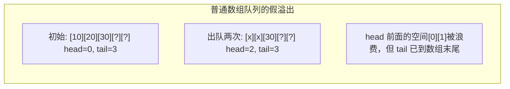
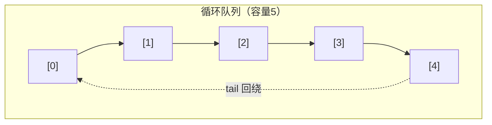
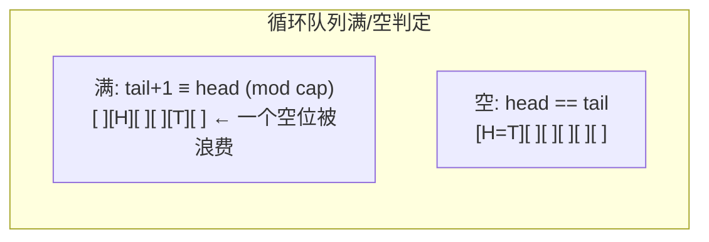
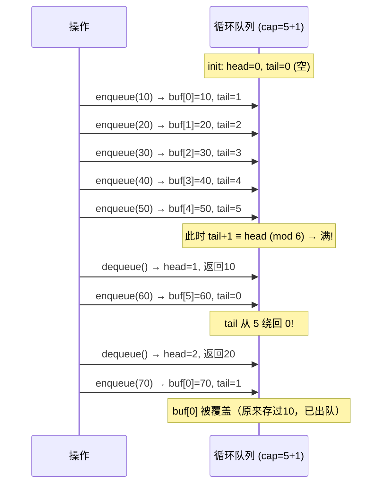
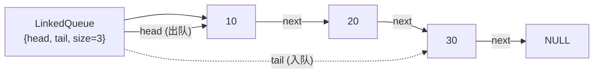
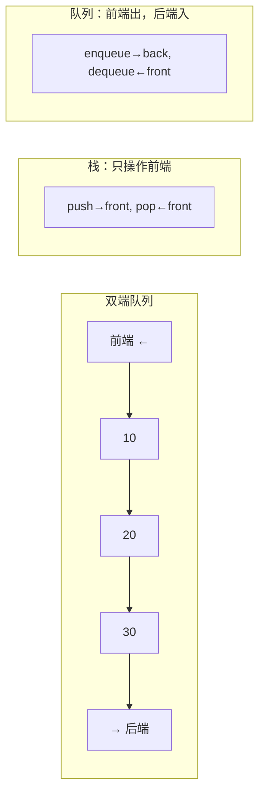
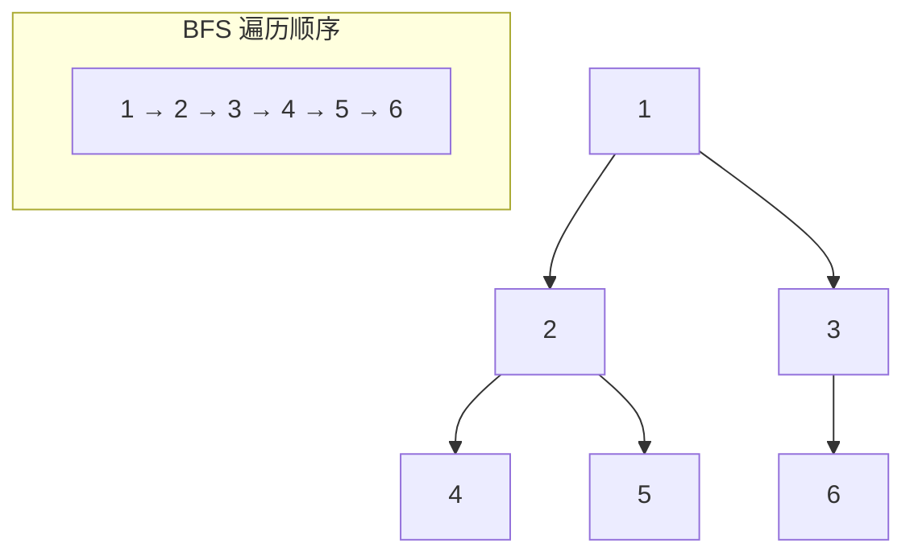

# 队列 (Queue)
title: ""
---

## 章节概述

队列（Queue）是一种受限的线性数据结构，遵循"先进先出"（FIFO, First In First Out）原则。
元素从一端（队尾）入队，从另一端（队首）出队。队列在操作系统内核、网络协议栈、并发编程中有着极其重要的地位。

本节侧重底层实现与内存理解，与 [[../../数据结构/G_队列_Queue|CPP教程对应章节]] 形成互补——CPP教程侧重 `std::queue`/`std::deque` 的STL使用与适配器模式，本教程侧重用C手动实现多种队列结构，特别是内核编程中至关重要的**环形缓冲区**（Circular Buffer / Ring Buffer）。

> 在CPP教程中对应章节侧重 `std::queue` 的STL使用和 BFS 算法应用，本节侧重手动实现数组循环队列、链式队列、以及理解环形缓冲区在大规模系统中的内存优势。

---

---
### 第一节: 数组循环队列 —— 内核级的实现
---

### 1.1 为什么需要循环队列？

最简单的队列实现：用数组，head 指向队首，tail 指向队尾。出队时 head 后移。

问题：出队后前面的空间被浪费——"假溢出"。



**循环队列**（Circular Queue / Ring Buffer）通过取模操作让 tail 回绕到数组开头：



---

### 1.2 循环队列的 C 实现

核心技巧：用固定大小数组 + head/tail 索引 + 取模操作实现环绕。

```c
#include <stdlib.h>
#include <stdio.h>
#include <stdbool.h>
#include <string.h>

#define CQUEUE_CAP 16 // 队列容量（实际存 CQUEUE_CAP-1 个元素）

typedef struct {
 int *buffer;
 int head; // 队首索引
 int tail; // 队尾索引（指向下一个空位）
 int capacity;
} CircularQueue;

CircularQueue* cqueue_create(int capacity) {
 CircularQueue *q = (CircularQueue*)malloc(sizeof(CircularQueue));
 if (!q) return NULL;
 // 多分配一个位置用于区分空/满
 q->buffer = (int*)malloc((capacity + 1) * sizeof(int));
 if (!q->buffer) {
 free(q);
 return NULL;
 }
 q->head = 0;
 q->tail = 0;
 q->capacity = capacity + 1; // 实际容量
 return q;
}

bool cqueue_is_empty(const CircularQueue *q) {
 return q->head == q->tail;
}

bool cqueue_is_full(const CircularQueue *q) {
 return (q->tail + 1) % q->capacity == q->head;
}

int cqueue_size(const CircularQueue *q) {
 return (q->tail - q->head + q->capacity) % q->capacity;
}
```

**区分空和满的三种方式**:

| 方法 | 原理 | 代价 |
|------|------|------|
| 浪费一个位置 | tail+1 == head 时判定为满 | 少存一个元素 |
| 额外标志位 | 用 size 字段跟踪元素数量 | 多 4 字节开销 |
| 取模后比较 | 记录上一次操作是 push/pop | 复杂 |

本实现采用第一种（浪费一个位置），这也是 Linux 内核 `kfifo` 的标准做法。



---

### 1.3 enqueue 和 dequeue

```c
bool cqueue_enqueue(CircularQueue *q, int value) {
 if (cqueue_is_full(q)) {
 fprintf(stderr, "cqueue_enqueue: queue is full\n");
 return false;
 }
 q->buffer[q->tail] = value;
 q->tail = (q->tail + 1) % q->capacity;
 return true;
}

int cqueue_dequeue(CircularQueue *q) {
 if (cqueue_is_empty(q)) {
 fprintf(stderr, "cqueue_dequeue: queue is empty\n");
 return 0;
 }
 int value = q->buffer[q->head];
 q->head = (q->head + 1) % q->capacity;
 return value;
}

int cqueue_front(const CircularQueue *q) {
 if (cqueue_is_empty(q)) return 0;
 return q->buffer[q->head];
}

void cqueue_destroy(CircularQueue *q) {
 if (q) {
 free(q->buffer);
 free(q);
 }
}
```

**循环队列的 push/pop 过程**:



> **练习 1.3.1**: 实现一个**动态扩容的循环队列**——当队列满时，自动分配更大的 buffer，
> 将元素复制到新 buffer 中（注意：复制后 head 在 0 位置）。

---

### 1.4 生产者-消费者模式

循环队列是实现生产者-消费者模型的核心数据结构。linux 内核的 `kfifo` 和许多
无锁数据结构都基于循环队列。

```c
// 单生产者、单消费者的简化模型
#include <pthread.h>

typedef struct {
 CircularQueue *queue;
 pthread_mutex_t mutex;
 pthread_cond_t not_empty;
 pthread_cond_t not_full;
} ProducerConsumer;

// 生产者（线程安全）
bool pc_produce(ProducerConsumer *pc, int value) {
 pthread_mutex_lock(&pc->mutex);
 while (cqueue_is_full(pc->queue)) {
 pthread_cond_wait(&pc->not_full, &pc->mutex); // 等待非满
 }
 bool ok = cqueue_enqueue(pc->queue, value);
 pthread_cond_signal(&pc->not_empty); // 通知消费者
 pthread_mutex_unlock(&pc->mutex);
 return ok;
}

// 消费者（线程安全）
int pc_consume(ProducerConsumer *pc) {
 pthread_mutex_lock(&pc->mutex);
 while (cqueue_is_empty(pc->queue)) {
 pthread_cond_wait(&pc->not_empty, &pc->mutex); // 等待非空
 }
 int value = cqueue_dequeue(pc->queue);
 pthread_cond_signal(&pc->not_full); // 通知生产者
 pthread_mutex_unlock(&pc->mutex);
 return value;
}
```

> 无锁（lock-free）环形缓冲区的原理涉及内存序和 CAS 操作，参见 。

> **练习 1.4.1**: 移除 `pthread` 依赖，实现一个**单生产者单消费者**的无锁环形缓冲区（使用 `volatile` 或 `_Atomic` 类型）。

---

---
### 第二节: 链式队列实现
---

### 2.1 结构定义

链式队列维护 head 和 tail 两个指针，入队操作 tail，出队操作 head：

```c
typedef struct QNode {
 int data;
 struct QNode *next;
} QNode;

typedef struct {
 QNode *head; // 队首（出队位置）
 QNode *tail; // 队尾（入队位置）
 int size;
} LinkedQueue;
```



---

### 2.2 链式队列实现

```c
LinkedQueue* lqueue_create() {
 LinkedQueue *q = (LinkedQueue*)malloc(sizeof(LinkedQueue));
 if (!q) return NULL;
 q->head = NULL;
 q->tail = NULL;
 q->size = 0;
 return q;
}

bool lqueue_enqueue(LinkedQueue *q, int value) {
 QNode *node = (QNode*)malloc(sizeof(QNode));
 if (!node) return false;
 node->data = value;
 node->next = NULL;

 if (q->tail == NULL) {
 // 空队列
 q->head = node;
 q->tail = node;
 } else {
 q->tail->next = node; // 原队尾的后继指向新节点
 q->tail = node; // 更新队尾
 }
 q->size++;
 return true;
}

int lqueue_dequeue(LinkedQueue *q) {
 if (q->head == NULL) {
 fprintf(stderr, "lqueue_dequeue: empty queue\n");
 return 0;
 }
 QNode *old_head = q->head;
 int value = old_head->data;
 q->head = old_head->next;
 if (q->head == NULL) {
 q->tail = NULL; // 队列变空了
 }
 free(old_head);
 q->size--;
 return value;
}

int lqueue_front(const LinkedQueue *q) {
 if (q->head == NULL) return 0;
 return q->head->data;
}

void lqueue_destroy(LinkedQueue *q) {
 if (!q) return;
 QNode *cur = q->head;
 while (cur) {
 QNode *next = cur->next;
 free(cur);
 cur = next;
 }
 free(q);
}
```

> **练习 2.2.1**: 链式队列的 enqueue 和 dequeue 都是 O(1)。如果改成无需维护 tail 指针（每次 enqueue 遍历到尾），复杂度会变为多少？

---

---
### 第三节: 双端队列（Deque）
---

### 3.1 概念与实现

双端队列（Deque, Double-Ended Queue）两端都可以插入和删除，是栈和队列的超集：

```c
// 用双向链表实现双端队列
typedef struct {
 DNode *head; // 前端
 DNode *tail; // 后端
 int size;
} Deque;

void deque_push_front(Deque *dq, int value);
void deque_push_back(Deque *dq, int value);
int deque_pop_front(Deque *dq);
int deque_pop_back(Deque *dq);
int deque_front(const Deque *dq);
int deque_back(const Deque *dq);
```

双端队列的四个基本操作：

| 操作 | 等价于 | 复杂度 |
|------|--------|--------|
| push_front | 栈的 push（前端） | O(1) |
| push_back | 队列的 enqueue | O(1) |
| pop_front | 队列的 dequeue | O(1) |
| pop_back | 栈的 pop | O(1) |



> **练习 3.1.1**: 用数组实现双端队列（循环数组版本）。提示：需要处理前端 push/pop 时的索引环绕。

---

---
### 第四节: 队列的应用
---

### 4.1 广度优先搜索（BFS）

队列是 BFS 的核心数据结构。与 DFS（栈/递归）不同，BFS 逐层扩展：

```c
#define MAX_NODES 100

// 图的邻接表表示
typedef struct {
 int neighbors[MAX_NODES];
 int neighbor_count;
} GraphNode;

void bfs(GraphNode *graph, int n, int start) {
 int *visited = (int*)calloc(n, sizeof(int));
 CircularQueue *q = cqueue_create(n);

 visited[start] = 1;
 cqueue_enqueue(q, start);

 while (!cqueue_is_empty(q)) {
 int u = cqueue_dequeue(q);
 printf("%d ", u);

 for (int i = 0; i < graph[u].neighbor_count; i++) {
 int v = graph[u].neighbors[i];
 if (!visited[v]) {
 visited[v] = 1;
 cqueue_enqueue(q, v);
 }
 }
 }

 cqueue_destroy(q);
 free(visited);
}
```

BFS 中队列的作用：保证访问顺序是"先发现先访问"（FIFO），实现逐层遍历。



> BFS 与图算法的更多内容，参见 [[08_图|图]] 章节和 [[../../数据结构/S_图_Graph|CPP: 图]]。

---

### 4.2 滑动窗口最大值（单调队列）

```c
// 用双端队列维护窗口内的递减序列
// 队首始终是当前窗口的最大值
#include <stdlib.h>

int* max_sliding_window(const int *nums, int n, int k, int *return_size) {
 *return_size = n - k + 1;
 int *result = (int*)malloc((*return_size) * sizeof(int));
 int *deque = (int*)malloc(n * sizeof(int)); // 存索引
 int head = 0, tail = 0; // 模拟双端队列

 for (int i = 0; i < n; i++) {
 // 移除窗口外的元素（从队首）
 if (head < tail && deque[head] < i - k + 1) {
 head++;
 }
 // 维护单调递减：移除所有小于当前元素的索引（从队尾）
 while (head < tail && nums[deque[tail - 1]] < nums[i]) {
 tail--;
 }
 deque[tail++] = i; // 当前索引入队
 // 窗口形成后记录结果
 if (i >= k - 1) {
 result[i - k + 1] = nums[deque[head]];
 }
 }

 free(deque);
 return result;
}
```

> **练习 4.2.1**: 实现"长度最小的子数组"——找出和 ≥ target 的最短连续子数组的长度（滑动窗口 + 队列）。

---

### 4.3 二叉树层次遍历

```c
typedef struct TreeNode {
 int val;
 struct TreeNode *left;
 struct TreeNode *right;
} TreeNode;

void level_order_traversal(TreeNode *root) {
 if (!root) return;

 LinkedQueue *q = lqueue_create();
 lqueue_enqueue(q, (int)(intptr_t)root); // 存指针（危险但演示用）

 while (q->size > 0) {
 TreeNode *node = (TreeNode*)(intptr_t)lqueue_dequeue(q);
 printf("%d ", node->val);

 if (node->left)
 lqueue_enqueue(q, (int)(intptr_t)node->left);
 if (node->right)
 lqueue_enqueue(q, (int)(intptr_t)node->right);
 }
 lqueue_destroy(q);
}
```

> 更多树的遍历，参见 [[06_树与二叉树|树与二叉树]]。

---

---
## 章节测试
---

### 判断题（10题）

> [!question] 判断题 1
> 队列是一种 LIFO（后进先出）的数据结构。
> > [!FAQ]- 点击查看答案
> > **错误**。队列是 FIFO（先进先出）。LIFO（后进先出）是栈的特性。

> [!question] 判断题 2
> 循环队列通过取模操作实现头尾指针的环绕。
> > [!FAQ]- 点击查看答案
> > **正确**。循环队列的核心机制就是 `(head+1) % capacity` 和 `(tail+1) % capacity` 实现索引环绕。

> [!question] 判断题 3
> 循环队列通常浪费一个数组位置用于区分空和满状态。
> > [!FAQ]- 点击查看答案
> > **正确**。这是最常见的做法——`tail+1 == head` 表示满，`head == tail` 表示空，代价是少存一个元素。

> [!question] 判断题 4
> 链式队列的 enqueue 和 dequeue 操作都是 O(1)。
> > [!FAQ]- 点击查看答案
> > **正确**。因为有 head 和 tail 双指针，enqueue 在 tail 处 O(1) 插入，dequeue 在 head 处 O(1) 删除。

> [!question] 判断题 5
> BFS（广度优先搜索）的核心数据结构是栈。
> > [!FAQ]- 点击查看答案
> > **错误**。BFS 使用队列确保逐层访问。DFS（深度优先搜索）才使用栈（或递归）。

> [!question] 判断题 6
> 双端队列（Deque）只允许在一端操作。
> > [!FAQ]- 点击查看答案
> > **错误**。双端队列两端都可以插入和删除操作。它同时具备栈和队列的能力。

> [!question] 判断题 7
> 生产者-消费者模型可以用循环队列实现。
> > [!FAQ]- 点击查看答案
> > **正确**。循环队列是生产者-消费者模型的经典实现——生产者入队（enqueue），消费者出队（dequeue）。

> [!question] 判断题 8
> 链式队列中的每个节点都需要维护指向队首的指针。
> > [!FAQ]- 点击查看答案
> > **错误**。链式队列节点只需 `next` 指针（单向链表），不像双向链表那样需要 `prev`。队列的 enqueue 只在尾部、dequeue 只在头部。

> [!question] 判断题 9
> 循环队列比链式队列更适合内核编程，因为它无需动态内存分配。
> > [!FAQ]- 点击查看答案
> > **正确**。循环队列使用固定大小数组，在初始化时一次性分配，之后无 malloc/free，避免了内核上下文中内存分配可能失败的问题。Linux 内核的 `kfifo` 正是循环队列。

> [!question] 判断题 10
> 滑动窗口最大值问题使用单调队列可以在 O(n) 时间内解决。
> > [!FAQ]- 点击查看答案
> > **正确**。每个元素最多入队出队各一次，总时间复杂度 O(n)。

---

### 选择题（10题）

> [!question] 选择题 1
> 循环队列容量为 5（浪费 1 个位置），head=2, tail=0，队列中有几个元素？
> - [ ] A. 0
> - [ ] B. 3
> - [ ] C. 4
> - [ ] D. 5
>
> > [!FAQ]- 点击查看答案
> > **正确答案: C**
> >
> > **解析**: `size = (tail - head + capacity) % capacity = (0 - 2 + 6) % 6 = 4`。实际存储位置为索引 2、3、4、5，共 4 个元素。

> [!question] 选择题 2
> 循环队列容量 6，浪费 1 个位置，最大能存储多少个元素？
> - [ ] A. 4
> - [ ] B. 5
> - [ ] C. 6
> - [ ] D. 7
>
> > [!FAQ]- 点击查看答案
> > **正确答案: B**
> >
> > **解析**: 容量为 6（即实际分配 7 个位置），浪费一个区分空/满，最多存储 7-1-?=5 个元素。等等，容量参数意义需要明确。如果 capacity=6 表示数组有 7 个槽（capacity+1），则最多存 6 个。但按题设浪费一个位置，所以是 5 个。

> [!question] 选择题 3
> 以下操作序列，最终队列中的元素是？（从左到右为 front 到 back）
> ```c
> enqueue(1); enqueue(2); dequeue(); enqueue(3); enqueue(4); dequeue();
> ```
> - [ ] A. [1, 2, 3]
> - [ ] B. [3, 4]
> - [ ] C. [4, 3]
> - [ ] D. [2, 3]
>
> > [!FAQ]- 点击查看答案
> > **正确答案: B**
> >
> > **解析**: enq(1)→[1]; enq(2)→[1,2]; deq()→[2]; enq(3)→[2,3]; enq(4)→[2,3,4]; deq()→[3,4]。

> [!question] 选择题 4
> 链式队列没有 tail 指针（只有 head）时，enqueue 的时间复杂度是？
> - [ ] A. O(1)
> - [ ] B. O(log n)
> - [ ] C. O(n)
> - [ ] D. O(n²)
>
> > [!FAQ]- 点击查看答案
> > **正确答案: C**
> >
> > **解析**: 只有 head 指针时，enqueue 需要从头遍历到链表尾部，每次 enqueue 耗时 O(n)。

> [!question] 选择题 5
> 以下哪种数据结构最适合实现 CPU 的就绪进程队列？
> - [ ] A. 栈
> - [ ] B. 堆（二叉堆）
> - [ ] C. 队列
> - [ ] D. 哈希表
>
> > [!FAQ]- 点击查看答案
> > **正确答案: C**
> >
> > **解析**: CPU 就绪队列遵循先来先服务（FCFS）原则，FIFO 正好是队列的特性。但注意：现代操作系统的多级就绪队列会结合优先级（使用优先队列 = 堆）。

> [!question] 选择题 6
> 在 BFS 中，使用队列而不是栈的原因是？
> - [ ] A. 队列比栈快
> - [ ] B. 队列保证逐层访问（先发现的节点先处理）
> - [ ] C. 队列占用内存更少
> - [ ] D. 栈不支持 BFS
>
> > [!FAQ]- 点击查看答案
> > **正确答案: B**
> >
> > **解析**: BFS 要求"先发现的节点先处理"（FIFO），这样才能实现按层遍历。如果用栈，会变成 DFS（深度优先）。

> [!question] 选择题 7
> 循环队列在以下哪种场景下最有优势？
> - [ ] A. 需要随机访问元素
> - [ ] B. 固定大小的流式数据缓冲
> - [ ] C. 需要频繁扩容
> - [ ] D. 排序数据
>
> > [!FAQ]- 点击查看答案
> > **正确答案: B**
> >
> > **解析**: 循环队列用固定大小内存实现无分配/释放的 FIFO 缓冲，特别适合网络数据包缓冲、音频流缓冲等场景。内核编程大量使用循环队列正是因为这个原因。

> [!question] 选择题 8
> 关于循环队列和动态数组队列，以下说法正确的是？
> - [ ] A. 循环队列总是比动态数组队列好
> - [ ] B. 动态数组队列不存在假溢出问题
> - [ ] C. 循环队列避免了假溢出，但容量固定
> - [ ] D. 动态数组队列出队时不需要移动元素
>
> > [!FAQ]- 点击查看答案
> > **正确答案: C**
> >
> > **解析**: 循环队列的核心优势就是避免了假溢出（通过回绕）。但代价是容量固定（除非实现动态扩容版本）。动态数组队列如果用简单的 head 后移策略，会出现假溢出。

> [!question] 选择题 9
> 双端队列 deque 可以用以下哪种数据结构实现所有操作均为 O(1)？
> - [ ] A. 数组
> - [ ] B. 单向链表
> - [ ] C. 双向链表
> - [ ] D. 二叉搜索树
>
> > [!FAQ]- 点击查看答案
> > **正确答案: C**
> >
> > **解析**: 双端队列需要两端都能 O(1) 插入和删除。双向链表天然支持（头尾都有 prev/next）。数组（循环版本）也可以实现 O(1) 双端操作，但需要处理更多的边界情况。

> [!question] 选择题 10
> 在 Linux 内核中，`kfifo` 数据结构的特点是什么？
> - [ ] A. 使用链表实现，支持动态扩容
> - [ ] B. 使用循环数组，无锁，固定大小
> - [ ] C. 使用红黑树，支持优先级
> - [ ] D. 使用哈希表，支持 O(1) 查找
>
> > [!FAQ]- 点击查看答案
> > **正确答案: B**
> >
> > **解析**: Linux 内核的 `kfifo` 是循环缓冲区实现，使用固定大小数组，通过巧妙的取模运算实现高效的 FIFO 操作。它的特点是简洁、高效、适合内核环境。

---

### 编程大题

> [!note] 编程题 1：实现动态扩容的循环队列
> **要求**：
> 1. 当队列满时，自动扩容为原来的 2 倍
> 2. 扩容时将元素复制到新 buffer，确保 head 在新 buffer 的 0 位置
> 3. 实现全部标准队列操作
> 4. 编写测试用例：交替 enqueue/dequeue 大量元素，验证循环和扩容逻辑
>
> **提示**: 扩容时注意——旧 buffer 中从 head 到 tail 的元素可能跨过数组末尾，复制时需要"摊平"到新 buffer 中。

> [!note] 编程题 2：用队列实现栈
> **要求**：
> 1. 只用队列（可以是 1 个或 2 个）的标准操作实现栈
> 2. push：将元素加入栈顶
> 3. pop：弹出栈顶元素
> 4. 分析时间复杂度：push O(?), pop O(?) — 可以选一种实现为 O(n)，另一种为 O(1)
>
> **提示**: 用两个队列可以互相倒腾实现 LIFO。亦可用一个队列：push 时先 enqueue 新元素，再将前面所有元素 dequeue 再 enqueue。

> [!note] 编程题 3：消息队列（Message Queue）系统
> **要求**：
> 1. 实现一个线程安全的消息队列（支持多生产者多消费者）
> 2. 每条消息包含 type（类型）、priority（优先级）、data（数据）字段
> 3. 支持按优先级出队（高优先级先出）
> 4. 支持超时机制：消费者等待超过指定时间后返回超时错误
> 5. 使用 pthread 的 mutex 和 condition variable
>
> **提示**: 实现优先级消息队列需要结合 [[07_堆|二叉堆/优先队列]] 的知识。

### 推荐练习题（力扣）

| 知识点 | 题目建议 |
|------|--------|
| 队列模拟 | 力扣队列 |
| 队列模拟 | 力扣约瑟夫环 |
| 单调队列 | 力扣滑动窗口 |
| 单调队列 | 力扣滑动窗口 |
| 单调队列+前缀和 | 力扣单调队列 |

---

***
## 知识网络
***

- **上一章**: [[03_栈|栈]] | **下一章**: [[05_哈希表|哈希表]] | **返回**: 
- **CPP对照**: [[../../数据结构/G_队列_Queue|CPP: 队列]] | [[../../cpp教程/容器库/适配器/queue|CPP: queue]]
- **相关**: [[../2深化/01_指针深度剖析|指针深度剖析]] | [[../2深化/03_动态内存管理|动态内存管理]]
- **ASM**: | 
