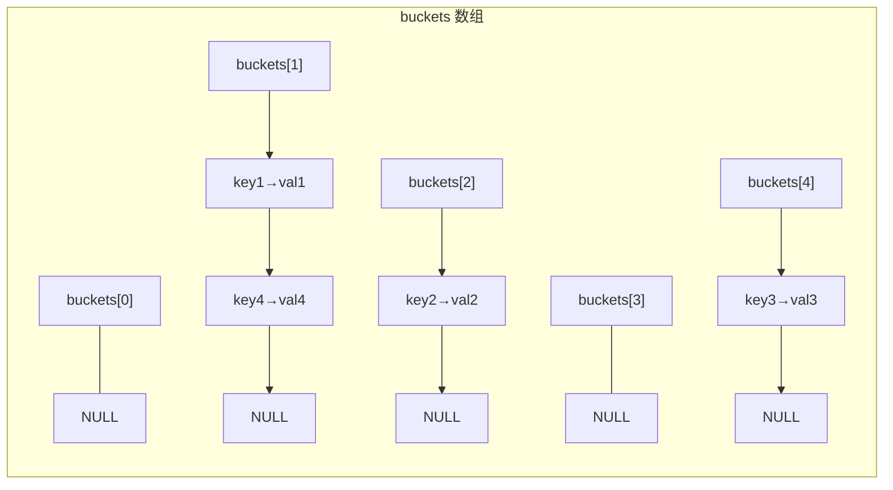
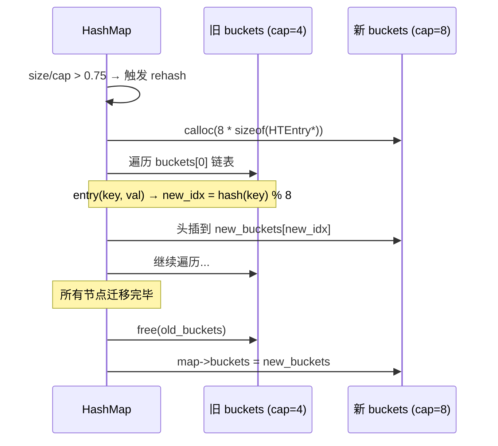
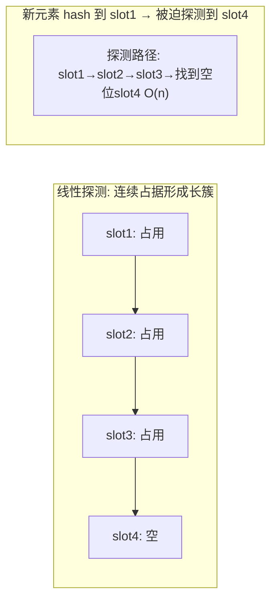

# 哈希表  (Hash Table)
title: ""
---

##  章节概述

哈希表（Hash Table）是最强大的 O(1) 查找数据结构。它通过哈希函数将键映射到数组索引，
以空间换时间，实现平均 O(1) 的插入、删除和查找。C++ 中的 `unordered_map`/`unordered_set`、
Python 的 `dict`/`set`、Java 的 `HashMap`/`HashSet`，底层都是哈希表。

本节侧重底层实现与内存理解，与 [[../../数据结构/G_哈希表_HashTable|CPP教程对应章节]] 形成互补——CPP教程侧重 `unordered_map` 的 STL 使用与自定义哈希，本教程侧重手动实现链地址法和开放地址法哈希表、理解哈希函数设计、负载因子与 rehashing 策略。

> 在CPP教程中对应章节侧重 `unordered_map`/`unordered_set` 的 STL 用法，本节侧重从零实现哈希表——哈希函数设计、冲突解决策略、以及动态扩容机制。

---

---
###  第一节: 哈希函数设计
---

### 1.1 什么是好的哈希函数？

哈希函数将任意长度的输入映射为固定范围内的整数。好的哈希函数需要：
1. **确定性**: 相同输入总产生相同输出
2. **均匀性**: 输出在值域中均匀分布（降低冲突）
3. **雪崩效应**: 输入的微小变化导致输出的巨大变化
4. **高效性**: 计算速度快

```c
#include <stdlib.h>
#include <stdio.h>
#include <stdint.h>
#include <string.h>

// 差的哈希函数（仅取第一个字符）
size_t bad_hash(const char *key) {
    return (size_t)key[0];
    // 问题: "apple"和"ant"哈希值相同，"book"和"banana"也相同
}

// 简单求和哈希
size_t sum_hash(const char *key) {
    size_t hash = 0;
    for (; *key; key++) {
        hash += *key;
    }
    return hash;
    // 问题: "abc"和"cba"哈希值相同（交换律不满足雪崩）
}
```

> **练习 1.1.1**: 为什么"仅取第一个字符"是最差的哈希函数之一？如果用来存英文单词，最多有多少种不同的哈希值？

---

### 1.2 DJB2 哈希算法

DJB2 是哈希表之父 Daniel J. Bernstein 设计的经典哈希函数，简单且高效：

```c
// DJB2 哈希: 初始值 5381，每次乘以 33 再加字符
size_t djb2_hash(const char *key) {
    size_t hash = 5381;
    int c;
    while ((c = *key++)) {
        hash = ((hash << 5) + hash) + c;  // hash * 33 + c
    }
    return hash;
}
```

**为什么初始值是 5381，乘数是 33？**

DJB2 是经验性哈希，5381 和 33 通过大量测试被验证能产生良好的分布。
`33 = 2^5 + 1`，所以 `hash * 33 = (hash << 5) + hash`，只需一次移位和一次加法，
比通用乘法快。

---

### 1.3 FNV-1a 哈希算法

FNV-1a (Fowler-Noll-Vo) 是另一个广泛使用的哈希算法：

```c
// FNV-1a 哈希（64位）
uint64_t fnv1a_hash(const char *key, size_t len) {
    uint64_t hash = 14695981039346656037ULL;  // FNV offset basis
    uint64_t prime = 1099511628211ULL;         // FNV prime

    for (size_t i = 0; i < len; i++) {
        hash ^= (uint8_t)key[i];  // XOR 当前字节
        hash *= prime;             // 乘以素数
    }
    return hash;
}
```

FNV-1a 的核心思想：**XOR 后乘以大素数**，实现雪崩效应。

---

### 1.4 哈希函数性能对比测试

```c
#include <time.h>

#define TEST_SIZE 100000

void test_hash_distribution(const char **keys, int n, int table_size) {
    int *bucket_counts = (int*)calloc(table_size, sizeof(int));
    int collisions = 0;

    for (int i = 0; i < n; i++) {
        size_t h = djb2_hash(keys[i]) % table_size;
        if (bucket_counts[h] > 0) collisions++;
        bucket_counts[h]++;
    }

    printf("Hash distribution test:\n");
    printf("  Keys: %d, Table size: %d\n", n, table_size);
    printf("  Collisions: %d (%.2f%%)\n",
           collisions, 100.0 * collisions / n);
    printf("  Max bucket depth: ");

    int max_depth = 0, empty_buckets = 0;
    for (int i = 0; i < table_size; i++) {
        if (bucket_counts[i] > max_depth) max_depth = bucket_counts[i];
        if (bucket_counts[i] == 0) empty_buckets++;
    }
    printf("%d\n", max_depth);
    printf("  Empty buckets: %d (%.2f%%)\n",
           empty_buckets, 100.0 * empty_buckets / table_size);

    free(bucket_counts);
}
```

> **练习 1.4.1**: 实现 `sdbm_hash`（另一种经典哈希函数，`hash = c + (hash << 6) + (hash << 16) - hash`），与 DJB2 对比分布质量。

---

---
###  第二节: 链地址法哈希表
---

### 2.1 数据结构设计

链地址法（Separate Chaining）：每个桶维护一个链表，冲突的键值对放入同一桶的链表中：

```c
typedef struct HTEntry {
    char *key;           // 键（动态分配）
    int value;
    struct HTEntry *next; // 冲突链
} HTEntry;

typedef struct {
    HTEntry **buckets;   // 桶数组（指针数组）
    size_t capacity;     // 桶数量
    size_t size;         // 当前元素数量
} HashMap;
```



每个 `buckets[i]` 指向该桶的链表头（冲突链）。空桶为 `NULL`。

---

### 2.2 初始化与销毁

```c
#define HM_INIT_CAP 16
#define HM_LOAD_FACTOR 0.75

HashMap* hm_create() {
    HashMap *map = (HashMap*)malloc(sizeof(HashMap));
    if (!map) return NULL;

    map->capacity = HM_INIT_CAP;
    map->size = 0;
    map->buckets = (HTEntry**)calloc(map->capacity, sizeof(HTEntry*));
    if (!map->buckets) {
        free(map);
        return NULL;
    }
    return map;
}

void hm_destroy(HashMap *map) {
    if (!map) return;
    // 释放每个桶的链表
    for (size_t i = 0; i < map->capacity; i++) {
        HTEntry *entry = map->buckets[i];
        while (entry) {
            HTEntry *next = entry->next;
            free(entry->key);   // 释放 key
            free(entry);         // 释放节点
            entry = next;
        }
    }
    free(map->buckets);
    free(map);
}
```

**内存管理要点**:
1. `buckets` 是指针数组（`HTEntry**`），用 `calloc` 分配并初始化为 NULL
2. 每个 `HTEntry` 节点独立 `malloc`，`key` 也被独立分配（存储键的副本）
3. 销毁时必须遍历每个桶的每条链，释放 key 和节点本身

---

### 2.3 put —— 插入/更新

```c
// 获取桶索引
static size_t hm_bucket_index(const HashMap *map, const char *key) {
    return djb2_hash(key) % map->capacity;
}

// 在链表中查找 key
static HTEntry* hm_find_in_bucket(HTEntry *head, const char *key) {
    HTEntry *cur = head;
    while (cur) {
        if (strcmp(cur->key, key) == 0) {
            return cur;
        }
        cur = cur->next;
    }
    return NULL;
}

bool hm_put(HashMap *map, const char *key, int value) {
    size_t idx = hm_bucket_index(map, key);

    // 检查是否已存在（更新）
    HTEntry *existing = hm_find_in_bucket(map->buckets[idx], key);
    if (existing) {
        existing->value = value;
        return true;
    }

    // 插入新节点
    HTEntry *new_entry = (HTEntry*)malloc(sizeof(HTEntry));
    if (!new_entry) return false;
    new_entry->key = strdup(key);  // 复制 key
    if (!new_entry->key) {
        free(new_entry);
        return false;
    }
    new_entry->value = value;
    new_entry->next = map->buckets[idx];  // 头插
    map->buckets[idx] = new_entry;
    map->size++;
    return true;
}
```

**头插 vs 尾插**: 头插 O(1)（不用遍历），尾插 O(n)（需要先找到链表尾）。

---

### 2.4 get —— 查找

```c
bool hm_get(const HashMap *map, const char *key, int *out_value) {
    size_t idx = hm_bucket_index(map, key);
    HTEntry *found = hm_find_in_bucket(map->buckets[idx], key);
    if (found) {
        *out_value = found->value;
        return true;
    }
    return false;
}
```

---

### 2.5 remove —— 删除

```c
bool hm_remove(HashMap *map, const char *key) {
    size_t idx = hm_bucket_index(map, key);
    HTEntry *cur = map->buckets[idx];
    HTEntry *prev = NULL;

    while (cur) {
        if (strcmp(cur->key, key) == 0) {
            if (prev) {
                prev->next = cur->next;
            } else {
                map->buckets[idx] = cur->next;  // 删除链表头
            }
            free(cur->key);
            free(cur);
            map->size--;
            return true;
        }
        prev = cur;
        cur = cur->next;
    }
    return false;  // 未找到
}
```

> **练习 2.5.1**: 为什么删除链表中部的节点需要 prev 指针？如果这是一个双向链表（冲突链用双向链表），删除是否会简化？

---

---
###  第三节: 负载因子与 Rehashing
---

### 3.1 负载因子

负载因子 `load_factor = size / capacity`。

- **load_factor < 0.5**: 冲突少，链表短，性能好，但空间利用率低
- **load_factor > 1.0**: 链地址法仍能工作（每个链平均长度 > 1），但查找变慢
- **load_factor = 0.75**: Java HashMap 默认值，是时间与空间的折衷

对于链地址法，查找的期望时间复杂度是 O(1 + load_factor)。
当 load_factor = 0.75 时，期望链表长度为 0.75，大多数查找只需一次比较。

```c
#define HM_LOAD_FACTOR 0.75

static bool hm_needs_resize(const HashMap *map) {
    return (double)map->size / map->capacity > HM_LOAD_FACTOR;
}
```

---

### 3.2 Rehashing —— 动态扩容

Rehashing 的过程：分配更大的桶数组 → 重新计算每个 key 的哈希值 → 放入新桶。

```c
static bool hm_resize(HashMap *map, size_t new_capacity) {
    HTEntry **new_buckets = (HTEntry**)calloc(new_capacity, sizeof(HTEntry*));
    if (!new_buckets) return false;

    // 遍历所有旧桶
    for (size_t i = 0; i < map->capacity; i++) {
        HTEntry *entry = map->buckets[i];
        while (entry) {
            HTEntry *next = entry->next;
            // 重新计算新桶位置
            size_t new_idx = djb2_hash(entry->key) % new_capacity;
            // 头插到新桶
            entry->next = new_buckets[new_idx];
            new_buckets[new_idx] = entry;
            entry = next;
        }
    }

    free(map->buckets);
    map->buckets = new_buckets;
    map->capacity = new_capacity;
    return true;
}

// 改进的 put —— 包含 rehashing
bool hm_put_safe(HashMap *map, const char *key, int value) {
    if (hm_needs_resize(map)) {
        if (!hm_resize(map, map->capacity * 2)) {
            return false;  // rehash 失败，但原数据仍有效
        }
    }
    return hm_put(map, key, value);
}
```

**Rehashing 细节**:
1. Rehashing 是 O(n) 操作（需要遍历所有节点），但由于触发频率低（负载因子阈值），均摊复杂度为 O(1)
2. 使用 2x 扩容保证均摊 O(1)
3. 扩容期间内存峰值约为原表的 3 倍（旧表 + 新表 + 节点本身）



> **练习 3.2.1**: 在 rehash 时，如果想避免内存峰值过高（3x），可以采用"增量 rehash"（incremental rehash）——每次操作只迁移少量的桶。实现一个简化版的增量 rehash。

---

---
###  第四节: 开放地址法哈希表
---

### 4.1 原理与结构

开放地址法（Open Addressing）不使用链表，冲突时在桶数组中寻找下一个空位。
所有元素直接存储在桶数组中：

```c
typedef enum {
    SLOT_EMPTY,
    SLOT_OCCUPIED,
    SLOT_DELETED   // 墓碑标记
} SlotStatus;

typedef struct {
    char *key;
    int value;
    SlotStatus status;
} OASlot;

typedef struct {
    OASlot *slots;
    size_t capacity;
    size_t size;
} OAHashMap;
```

**墓碑（Tombstone）标记**: 删除时不能简单置空（否则会破坏探测链），需要标记为 DELETED。

---

### 4.2 线性探测（Linear Probing）

最简单的探测策略：`idx = (hash(key) + i) % capacity`

```c
OAHashMap* oahm_create(size_t capacity) {
    OAHashMap *map = (OAHashMap*)malloc(sizeof(OAHashMap));
    if (!map) return NULL;
    map->capacity = capacity;
    map->size = 0;
    map->slots = (OASlot*)calloc(capacity, sizeof(OASlot));
    if (!map->slots) { free(map); return NULL; }
    // 所有 slots.status 默认为 SLOT_EMPTY (0)
    return map;
}

bool oahm_put(OAHashMap *map, const char *key, int value) {
    if (map->size >= map->capacity) {
        return false;  // 简化：满则失败（实际应 rehash）
    }

    size_t idx = djb2_hash(key) % map->capacity;
    size_t first_deleted = (size_t)-1;  // 记录遇到的第一个墓碑

    for (size_t i = 0; i < map->capacity; i++) {
        size_t probe = (idx + i) % map->capacity;

        if (map->slots[probe].status == SLOT_EMPTY) {
            // 使用第一个墓碑或这个空位
            size_t target = (first_deleted != (size_t)-1) ? first_deleted : probe;
            map->slots[target].key = strdup(key);
            map->slots[target].value = value;
            map->slots[target].status = SLOT_OCCUPIED;
            map->size++;
            return true;
        }

        if (map->slots[probe].status == SLOT_OCCUPIED &&
            strcmp(map->slots[probe].key, key) == 0) {
            map->slots[probe].value = value;  // 更新
            return true;
        }

        if (map->slots[probe].status == SLOT_DELETED &&
            first_deleted == (size_t)-1) {
            first_deleted = probe;
        }
    }
    return false;  // 表满
}
```

**线性探测的问题 —— 一次聚集（Primary Clustering）**:



当连续 slot 被占据时，落入该区域的任何 key 都需要穿过整个簇才能找到空位。

---

### 4.3 二次探测（Quadratic Probing）

二次探测使用 `idx = (hash(key) + c1*i + c2*i²) % capacity` 减少一次聚集：

```c
size_t quadratic_probe(size_t hash_val, size_t i, size_t capacity) {
    return (hash_val + i + i * i) % capacity;  // c1=1, c2=1
}
```

二次探测避免了一次聚集，但引入**二次聚集**（相同哈希值的 key 探测序列相同）。

> **练习 4.3.1**: 为什么开放地址法中需要墓碑标记？如果不使用墓碑，直接置为空，会出现什么问题？画图说明。

---

### 4.4 链地址法 vs 开放地址法

| 特性 | 链地址法 | 开放地址法 |
|------|---------|-----------|
| 内存效率 | 链表节点有额外开销 | 槽直接存数据，省内存 |
| 缓存性能 | 差（链表散布） | **好**（连续数组） |
| load_factor | 可 > 1.0 | 必须 < 1.0 |
| 删除操作 | 简单（从链表中移除） | 需要墓碑标记 |
| 实现复杂度 | 较简单 | 删除逻辑复杂 |
| 适用场景 | 通用场景 | 内存敏感/缓存敏感 |

> **练习 4.4.1**: 对于小型键值对（key+value ≤ 16字节），为什么开放地址法通常快于链地址法？（提示：考虑 CPU 缓存行）

---

---
###  第五节: 泛型哈希表与高级话题
---

### 5.1 泛型哈希表（void* 键和值）

```c
typedef size_t (*hash_func_t)(const void *key);
typedef bool (*key_eq_func_t)(const void *a, const void *b);

typedef struct {
    void *key;
    void *value;
    struct GHTEntry *next;
} GHTEntry;

typedef struct {
    GHTEntry **buckets;
    size_t capacity;
    size_t size;
    size_t key_size;      // 键的大小（用于 memcpy）
    size_t value_size;    // 值的大小
    hash_func_t hash_func;
    key_eq_func_t eq_func;
} GHashMap;

// 泛型 put
bool ghm_put(GHashMap *map, const void *key, const void *value) {
    size_t idx = map->hash_func(key) % map->capacity;

    GHTEntry *cur = map->buckets[idx];
    while (cur) {
        if (map->eq_func(cur->key, key)) {
            memcpy(cur->value, value, map->value_size);  // 更新
            return true;
        }
        cur = cur->next;
    }

    // 插入新节点...
}
```

> **练习 5.1.1**: 完成泛型哈希表的完整实现，包括 `ghm_get`、`ghm_remove`、`ghm_destroy` 和 rehash 功能。

---

### 5.2 哈希表 vs 有序映射的性能分析

| 操作 | 哈希表（平均） | 二叉搜索树 |
|------|-------------|-----------|
| 插入 | O(1) | O(log n) |
| 删除 | O(1) | O(log n) |
| 查找 | O(1) | O(log n) |
| 有序遍历 | O(n log n) | **O(n)** |
| 范围查询 | O(n) | **O(log n + k)** |
| 最坏情况 | O(n) | O(log n) |

哈希表 O(1) 是平均情况——最坏情况下所有 key 冲突到同一个桶，退化为 O(n)。
这就是为什么好的哈希函数至关重要。

> 关于二叉搜索树及其 O(log n) 的有序操作，参见 [[06_树与二叉树|树与二叉树]]。

---

---
##  章节测试
---

###  判断题（10题）

> [!question] 判断题 1
> 哈希表查找一个不存在的 key，平均时间复杂度是 O(1)。
> > [!FAQ]- 点击查看答案
> > **正确**。在负载因子合理的链地址法哈希表中，通过哈希函数直接定位桶，然后遍历短链表确认不存在，期望复杂度为 O(1 + load_factor) ≈ O(1)。

> [!question] 判断题 2
> 负载因子 = 0.5 意味着表中一半的桶是空的。
> > [!FAQ]- 点击查看答案
> > **错误**。负载因子 = size / capacity，size=0.5*capacity 意味着总共有这么多元素，但不代表一半桶是空的——因为冲突可能让某些桶有多个元素。

> [!question] 判断题 3
> DJB2 哈希算法中，`hash = (hash << 5) + hash + c` 等价于 `hash = hash * 33 + c`。
> > [!FAQ]- 点击查看答案
> > **正确**。`(hash << 5) + hash = 32*hash + hash = 33*hash`。位运算比乘法更快（在现代 CPU 上差距已不大，但仍是经典优化）。

> [!question] 判断题 4
> 链地址法哈希表的负载因子可以超过 1.0。
> > [!FAQ]- 点击查看答案
> > **正确**。链地址法每个桶可以存储多个元素（通过链表），因此容量为 1 的哈希表也能存储 n 个元素（虽然退化为单链表）。

> [!question] 判断题 5
> 开放地址法哈希表中删除了一个元素后，可以直接将该槽标记为空。
> > [!FAQ]- 点击查看答案
> > **错误**。开放地址法需要墓碑标记。如果直接置空，后续的探测链会被中断，导致某些本应找到的元素查找失败。

> [!question] 判断题 6
> Rehashing 过程中，旧表中所有 key 的哈希值需要重新计算。
> > [!FAQ]- 点击查看答案
> > **正确**。因为桶索引是 `hash(key) % capacity`，capacity 改变后，即使 hash(key) 值本身不变，桶索引也会改变。但通常不会重新计算哈希值本身，只是重新取模。

> [!question] 判断题 7
> 哈希表总是比二叉搜索树快。
> > [!FAQ]- 点击查看答案
> > **错误**。哈希表在等值查找上快（O(1) vs O(log n)），但二叉搜索树在范围查询、有序遍历上有绝对优势。二者适用于不同场景。

> [!question] 判断题 8
> 二次探测能完全消除一次聚集。
> > [!FAQ]- 点击查看答案
> > **正确**。二次探测的步长随探测次数增长（i²），不会像线性探测那样形成连续的占据簇。但仍存在二次聚集（相同哈希值的 key 探测路径相同）。

> [!question] 判断题 9
> 哈希表键的类型必须是可哈希的——对于 C 语言，`int` 可以直接做键，`char*` 需要字符串哈希函数。
> > [!FAQ]- 点击查看答案
> > **正确**。`int` 可以将其本身作为哈希值（`(size_t)key`）。对于结构体或字符串，需要设计专门的哈希函数来产生均匀分布的哈希值。

> [!question] 判断题 10
> 使用 `calloc` 分配桶数组比 `malloc` 好，因为 `calloc` 将桶指针初始化为 NULL。
> > [!FAQ]- 点击查看答案
> > **正确**。`calloc` 将分配的内存清零，指针被初始化为 NULL。如果用 `malloc`，需要手动 `memset` 或逐个赋 NULL。

---

###  选择题（10题）

> [!question] 选择题 1
> DJB2 哈希的乘数 33 在二进制运算中可表示为？
> - [ ] A. `(hash << 4) + hash`
> - [ ] B. `(hash << 5) + hash`
> - [ ] C. `(hash << 6) - hash`
> - [ ] D. `(hash << 8) + hash`
>
> > [!FAQ]- 点击查看答案
> > **正确答案: B**
> >
> > **解析**: `33 = 32 + 1 = 2^5 + 1`，因此 `hash * 33 = hash * (32+1) = (hash << 5) + hash`。

> [!question] 选择题 2
> 负载因子为 0.75，容量为 16 的链地址法哈希表中，平均链表长度约为？
> - [ ] A. 0.25
> - [ ] B. 0.75
> - [ ] C. 1.0
> - [ ] D. 1.5
>
> > [!FAQ]- 点击查看答案
> > **正确答案: B**
> >
> > **解析**: 平均链表长度 = load_factor = size / capacity = 0.75。即平均每个桶有 0.75 个节点。查找期望比较次数 ≈ 0.75 + 1 ≈ 1.75（1次哈希+0.75次链表遍历）。

> [!question] 选择题 3
> 链地址法哈希表中，如果所有 key 都冲突到同一个桶，查找时间复杂度变为？
> - [ ] A. O(1)
> - [ ] B. O(log n)
> - [ ] C. O(n)
> - [ ] D. O(n²)
>
> > [!FAQ]- 点击查看答案
> > **正确答案: C**
> >
> > **解析**: 所有元素都冲突到同一个桶，该桶变成一条 n 个节点的链表。查找需要 O(n) 遍历整条链表。这是哈希表的最坏情况。

> [!question] 选择题 4
> 开放地址法哈希表中，线性探测 `(hash + i) % cap` 的主要问题是？
> - [ ] A. 实现太复杂
> - [ ] B. 一次聚集（Primary Clustering）
> - [ ] C. 需要额外的内存存储链表
> - [ ] D. 不支持删除操作
>
> > [!FAQ]- 点击查看答案
> > **正确答案: B**
> >
> > **解析**: 线性探测容易形成一次聚集——连续的占据槽形成长簇，任何落入簇内的 key 都需要遍历整个簇才能找到空位。

> [!question] 选择题 5
> 开放地址法的"墓碑"（DELETED 标记）用于什么目的？
> - [ ] A. 装饰代码
> - [ ] B. 标记被删除的槽，保持探测链完整性
> - [ ] C. 记录被删除 key 的哈希值
> - [ ] D. 增加内存使用
>
> > [!FAQ]- 点击查看答案
> > **正确答案: B**
> >
> > **解析**: 开放地址法中，删除不能直接置空（会中断探测链，导致后续元素"消失"）。墓碑标记表示"这里曾有过元素，探测时可以经过，插入时可以复用"。

> [!question] 选择题 6
> 以下哪种哈希函数具有最佳的雪崩效应？
> - [ ] A. `hash = key[0]`
> - [ ] B. `hash = sum of all bytes`
> - [ ] C. FNV-1a（XOR 后乘以大素数）
> - [ ] D. `hash = key_length`
>
> > [!FAQ]- 点击查看答案
> > **正确答案: C**
> >
> > **解析**: FNV-1a 通过 XOR 混合每个字节，再乘以大素数进行扩散，具有很好的雪崩效应——输入的任何微小变化都会导致输出的巨大变化。A、B、D 的哈希冲突率都极高。

> [!question] 选择题 7
> `strdup()` 函数的作用是？
> - [ ] A. 返回字符串的长度
> - [ ] B. 在栈上创建字符串副本
> - [ ] C. `malloc` + `strcpy` 的组合，在堆上复制字符串
> - [ ] D. 比较两个字符串
>
> > [!FAQ]- 点击查看答案
> > **正确答案: C**
> >
> > **解析**: `strdup()`（POSIX 标准）等价于 `malloc(strlen(s)+1)` 然后 `strcpy`。虽然方便，但返回的内存需要手动 `free`。它不是 ANSI C 标准函数，但在大多数平台上可用。

> [!question] 选择题 8
> Rehashing 后新桶的容量通常是旧桶容量的多少倍？
> - [ ] A. 1.5 倍
> - [ ] B. 2 倍
> - [ ] C. 固定增加 16
> - [ ] D. 取决于负载因子
>
> > [!FAQ]- 点击查看答案
> > **正确答案: B**
> >
> > **解析**: 与动态数组类似，哈希表使用 2x 扩容来保证均摊 O(1) 的插入复杂度。Java 的 HashMap、Python 的 dict 都采用 2x 策略。

> [!question] 选择题 9
> 哈希表在处理 1000 万条键值对时，如果负载因子为 0.75，大约需要多少个桶？
> - [ ] A. 750 万
> - [ ] B. 1000 万
> - [ ] C. 1333 万
> - [ ] D. 2000 万
>
> > [!FAQ]- 点击查看答案
> > **正确答案: C**
> >
> > **解析**: capacity = size / load_factor = 1000 万 / 0.75 ≈ 1333 万。实际应用中桶数量通常为 2 的幂次（方便取模优化），所以可能是 2^24 = 1677 万。

> [!question] 选择题 10
> 以下关于链地址法和开放地址法的比较，正确的是？
> - [ ] A. 开放地址法总比链地址法好
> - [ ] B. 链地址法对缓存更友好
> - [ ] C. 开放地址法不需要墓碑标记
> - [ ] D. 开放地址法的数据局部性更好（连续数组）
>
> > [!FAQ]- 点击查看答案
> > **正确答案: D**
> >
> > **解析**: 开放地址法所有数据存储在连续数组中，CPU 缓存命中率高。链地址法的链表节点散布堆中，缓存不友好。但开放地址法需要墓碑标记（C错）且负载因子不能超过1.0。

---

###  编程大题

> [!note] 编程题 1：实现完整的链地址法哈希表库
> **要求**：
> 1. 支持泛型键和值（`void*`）
> 2. 用户提供哈希函数、键比较函数、键/值复制和释放函数
> 3. 实现 put、get、remove、size、clear、destroy
> 4. 自动 rehash（负载因子阈值可配置）
> 5. 迭代器支持：遍历所有键值对
>
> **提示**: 模仿 C++ `unordered_map` 的接口设计（但用函数指针替代模板）。

> [!note] 编程题 2：实现开放地址法哈希表（含墓碑处理）
> **要求**：
> 1. 使用二次探测
> 2. 正确处理墓碑——插入时优先复用墓碑，查找时穿透墓碑继续探测
> 3. 支持 rehash（包含墓碑清理）
> 4. 对比链地址法和开放地址法在 100 万元素插入/查找/删除上的性能差异
>
> **提示**: 如果墓碑过多（比如超过 50%），可以在 rehash 时统一清理。

> [!note] 编程题 3：词频统计器
> **要求**：
> 1. 读取文本文件，统计每个单词出现的频率
> 2. 忽略大小写和标点符号
> 3. 用哈希表存储 word → count 的映射
> 4. 输出前 N 个最高频单词（需用到排序或 [[07_堆|堆]]）
> 5. 对比自己实现的哈希表与 C++ `unordered_map` 的性能
>
> **提示**: 这是经典的"大数据"面试题，结合哈希表和堆的知识。

### 推荐练习题（力扣）

| 知识点 | 题目建议 |
|------|--------|
| 哈希表去重 | 力扣哈希表 |
| 哈希表、字符串处理 | 力扣哈希表 |
| 哈希表冲突处理 | 力扣哈希表 |
| 哈希表 + 排序 | 力扣哈希表 |

---

***
##  知识网络
***

- **上一章**: [[04_队列|队列]] | **下一章**: [[06_树与二叉树|树与二叉树]] | **返回**: 
- **CPP对照**: [[../../数据结构/G_哈希表_HashTable|CPP: 哈希表]] | [[../../cpp教程/容器库/无序容器/unordered_set|CPP: unordered_set/map]]
- **相关**: [[../2深化/01_指针深度剖析|指针深度剖析]] | [[../2深化/03_动态内存管理|动态内存管理]]
- **ASM**: 
