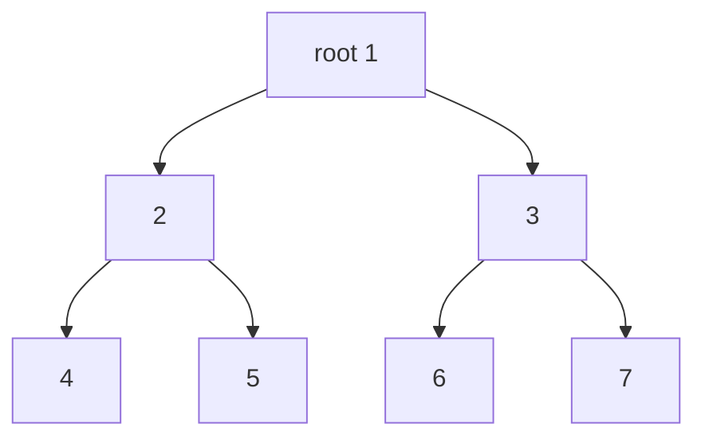
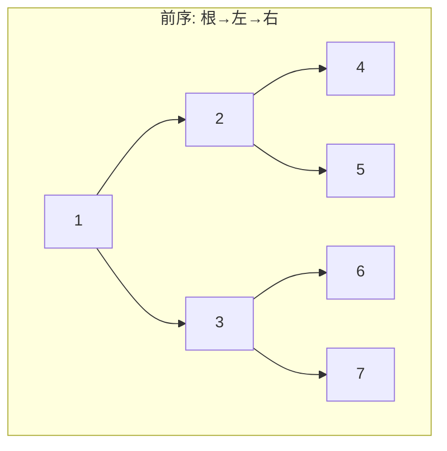
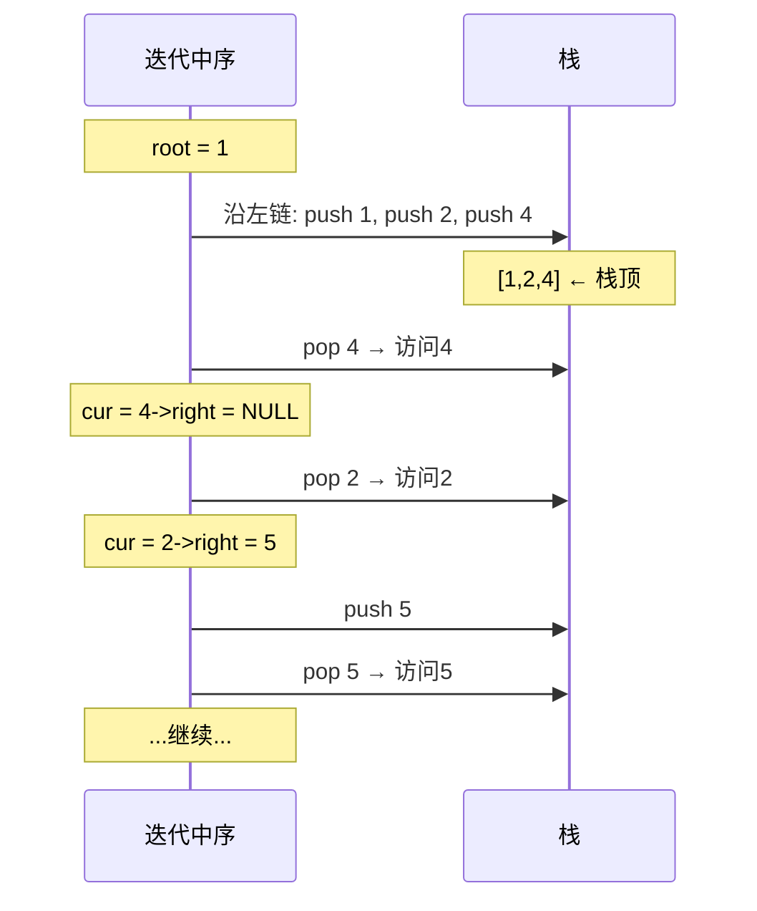
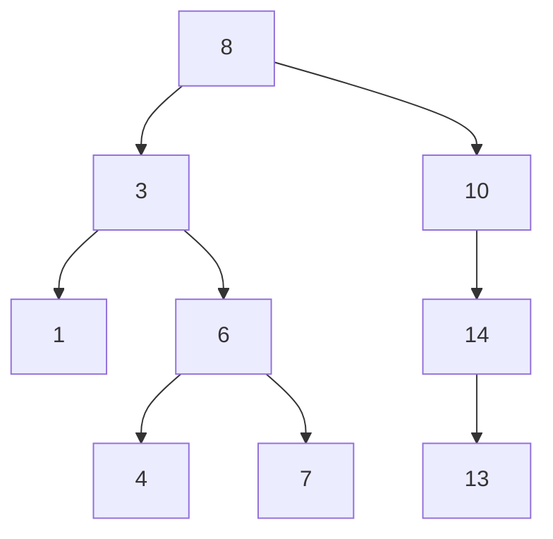
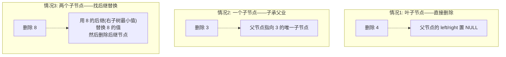
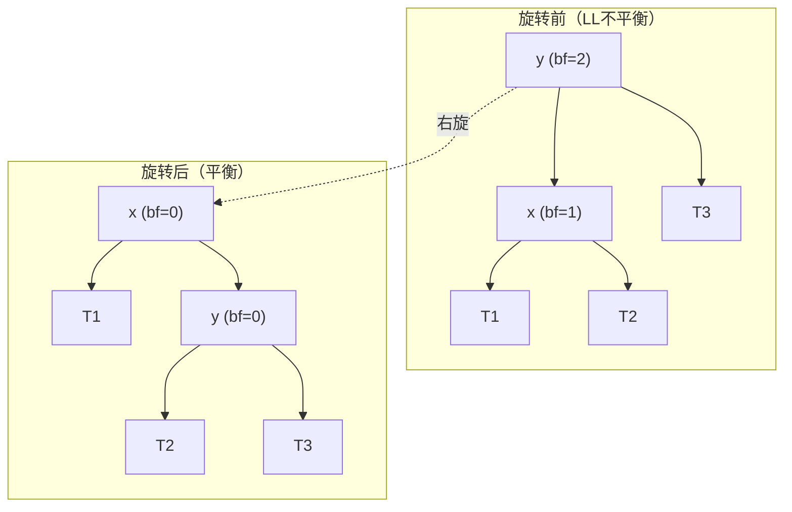
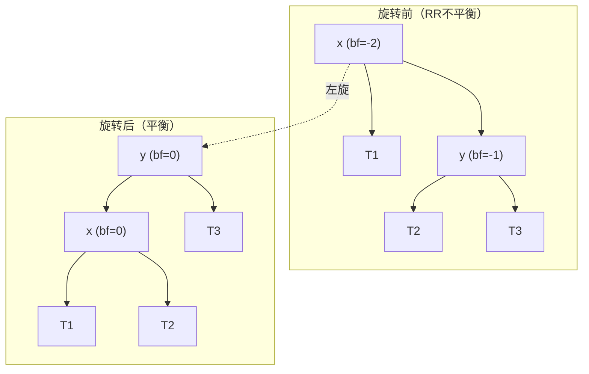
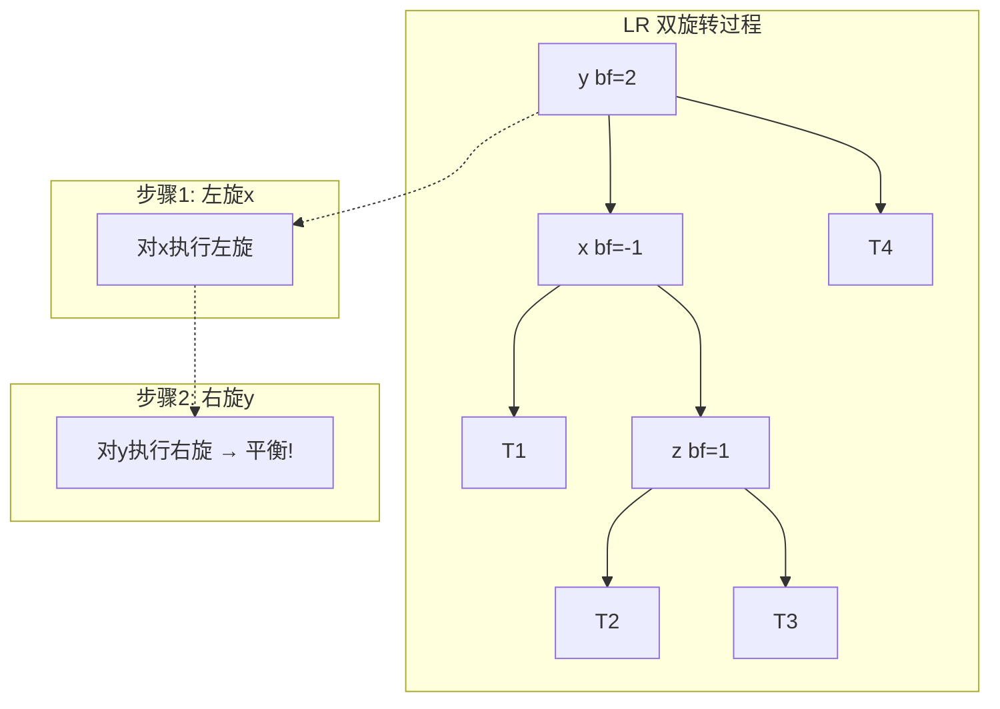
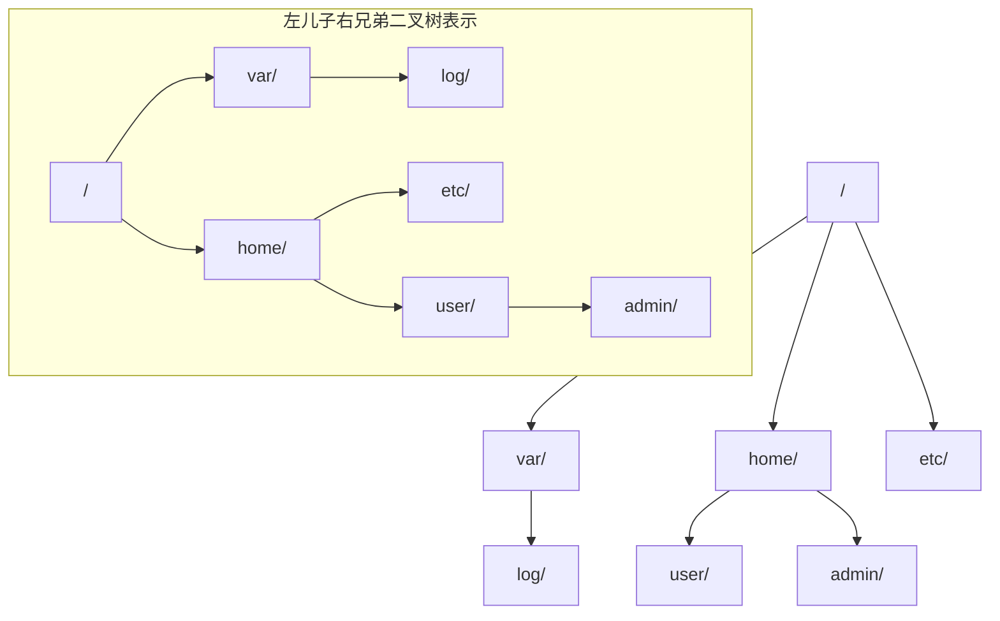
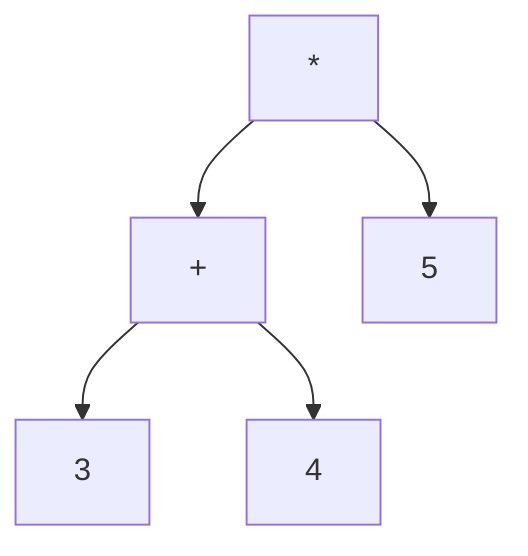

# 树与二叉树 (Tree & Binary Tree)
title: ""
---

## 章节概述

树（Tree）是一种层次化的非线性数据结构，每个节点可以有零个或多个子节点。二叉树是
最常见的树结构变体，每个节点最多有两个子节点。树在计算机科学中无处不在——文件系统、
数据库索引、编译器的抽象语法树、网络路由表等。

本节侧重底层实现与内存理解，与 [[../../数据结构/J_树_Tree_BST_AVL|CPP教程对应章节]] 形成互补——CPP教程侧重 `std::set`/`std::map`（基于红黑树）的STL使用、迭代器语义和算法，本教程侧重手动实现二叉搜索树和AVL树的插入/删除/旋转，深刻理解树节点间的指针关系。

> 在CPP教程中对应章节侧重 `std::set`/`std::map` 的 STL 用法与红黑树特性，本节侧重手动实现 BST 和 AVL 树——亲手操作每个节点的 `left`/`right` 指针与旋转。

---

---
### 第一节: 二叉树的基本概念与结构
---

### 1.1 二叉树的节点定义

```c
#include <stdlib.h>
#include <stdio.h>
#include <stdbool.h>

typedef struct TreeNode {
 int val;
 struct TreeNode *left;
 struct TreeNode *right;
} TreeNode;
```

**内存布局**: 每个节点在堆上独立分配。节点间通过 `left` 和 `right` 指针连接——
本质上是一个有向无环图（DAG）的特殊形式。



3 个节点间的关系：`root->left->val == 2`，`root->right->right->val == 7`。

---

### 1.2 二叉树的创建与基本操作

```c
TreeNode* treenode_create(int val) {
 TreeNode *node = (TreeNode*)malloc(sizeof(TreeNode));
 if (!node) return NULL;
 node->val = val;
 node->left = NULL;
 node->right = NULL;
 return node;
}

// 手动构建一棵树（用于测试）
TreeNode* build_sample_tree() {
 TreeNode *root = treenode_create(1);
 root->left = treenode_create(2);
 root->right = treenode_create(3);
 root->left->left = treenode_create(4);
 root->left->right = treenode_create(5);
 root->right->left = treenode_create(6);
 root->right->right = treenode_create(7);
 return root;
}

// 计算节点数 —— 递归
int tree_size(const TreeNode *root) {
 if (!root) return 0;
 return 1 + tree_size(root->left) + tree_size(root->right);
}

// 计算高度 —— 递归
int tree_height(const TreeNode *root) {
 if (!root) return 0;
 int left_h = tree_height(root->left);
 int right_h = tree_height(root->right);
 return 1 + (left_h > right_h ? left_h : right_h);
}

// 释放所有节点（后序遍历）
void tree_destroy(TreeNode *root) {
 if (!root) return;
 tree_destroy(root->left);
 tree_destroy(root->right);
 free(root);
}
```

> **练习 1.2.1**: 为什么树的销毁使用后序遍历？如果用前序遍历（先 free 根节点），会出现什么问题？

---

### 1.3 树遍历：递归版

三种标准遍历方式，区别在于访问根节点的时机：

```c
// 前序遍历: 根 → 左 → 右
void preorder(const TreeNode *root) {
 if (!root) return;
 printf("%d ", root->val);
 preorder(root->left);
 preorder(root->right);
}

// 中序遍历: 左 → 根 → 右
void inorder(const TreeNode *root) {
 if (!root) return;
 inorder(root->left);
 printf("%d ", root->val);
 inorder(root->right);
}

// 后序遍历: 左 → 右 → 根
void postorder(const TreeNode *root) {
 if (!root) return;
 postorder(root->left);
 postorder(root->right);
 printf("%d ", root->val);
}
```

对上面 sample tree 的结果：
- 前序: 1, 2, 4, 5, 3, 6, 7
- 中序: 4, 2, 5, 1, 6, 3, 7
- 后序: 4, 5, 2, 6, 7, 3, 1



---

---
### 第二节: 迭代遍历 —— 显式用栈
---

### 2.1 迭代前序遍历

递归遍历用系统栈，迭代版本显式用自定义栈：

```c
// 需要包含之前实现的栈（这里用简单数组模拟）
#define MAX_STACK 1000

void preorder_iterative(TreeNode *root) {
 if (!root) return;

 TreeNode *stack[MAX_STACK];
 int top = -1;
 stack[++top] = root;

 while (top >= 0) {
 TreeNode *node = stack[top--];
 printf("%d ", node->val);

 // 先压右再压左（因为栈是LIFO）
 if (node->right) stack[++top] = node->right;
 if (node->left) stack[++top] = node->left;
 }
}
```

**为什么先压右后压左？** 栈是后进先出——后压入的左子节点先弹出，实现"先左后右"的访问顺序。

---

### 2.2 迭代中序遍历 —— 经典的"左链入栈"法

```c
void inorder_iterative(TreeNode *root) {
 TreeNode *stack[MAX_STACK];
 int top = -1;
 TreeNode *cur = root;

 while (cur || top >= 0) {
 // 沿左链一路到底
 while (cur) {
 stack[++top] = cur;
 cur = cur->left;
 }
 // 弹出栈顶并访问
 cur = stack[top--];
 printf("%d ", cur->val);
 // 转向右子树
 cur = cur->right;
 }
}
```

**算法精髓**: 先沿左子深入到底（将经过的节点压栈），然后弹出最后入栈的那个（最左深的节点），
访问后转向其右子。



---

### 2.3 迭代后序遍历 —— 双栈法

后序遍历最复杂，经典解法使用两个栈：

```c
void postorder_iterative(TreeNode *root) {
 if (!root) return;

 TreeNode *stack1[MAX_STACK], *stack2[MAX_STACK];
 int top1 = -1, top2 = -1;

 stack1[++top1] = root;
 while (top1 >= 0) {
 TreeNode *node = stack1[top1--];
 stack2[++top2] = node;

 if (node->left) stack1[++top1] = node->left;
 if (node->right) stack1[++top1] = node->right;
 }

 // stack2 中自顶向下恰好是后序遍历顺序
 while (top2 >= 0) {
 printf("%d ", stack2[top2--]->val);
 }
}
```

**双栈法原理**: Stack1 实现"根→右→左"的顺序（调整了压栈顺序），Stack2 将其反转得到"左→右→根"。

> **练习 2.3.1**: 实现单栈后序遍历（更节省空间但更复杂）。

> 关于系统栈与自定义栈的对比——递归 vs 迭代，参见 。

---

---
### 第三节: 二叉搜索树（BST）
---

### 3.1 BST 定义与搜索

**二叉搜索树**（Binary Search Tree）满足：对任意节点，左子树所有值 ≤ 节点值 ≤ 右子树所有值。



BST 的查找等价于二分查找：每次比较决定走左子树还是右子树。

```c
TreeNode* bst_search(TreeNode *root, int val) {
 TreeNode *cur = root;
 while (cur) {
 if (val == cur->val) return cur;
 if (val < cur->val)
 cur = cur->left;
 else
 cur = cur->right;
 }
 return NULL; // 未找到
}

// 递归版
TreeNode* bst_search_recursive(TreeNode *root, int val) {
 if (!root || root->val == val) return root;
 if (val < root->val)
 return bst_search_recursive(root->left, val);
 else
 return bst_search_recursive(root->right, val);
}
```

> **练习 3.1.1**: 为什么 BST 的有序遍历（中序）输出的是升序序列？写出证明思路。

---

### 3.2 BST 插入

```c
TreeNode* bst_insert(TreeNode *root, int val) {
 if (!root) return treenode_create(val);

 if (val < root->val) {
 root->left = bst_insert(root->left, val);
 } else if (val > root->val) {
 root->right = bst_insert(root->right, val);
 }
 // val == root->val: 不插入重复值（也可根据需求处理）

 return root;
}

// 迭代版
TreeNode* bst_insert_iterative(TreeNode *root, int val) {
 TreeNode *new_node = treenode_create(val);
 if (!new_node) return root;

 if (!root) return new_node;

 TreeNode *cur = root;
 while (1) {
 if (val < cur->val) {
 if (!cur->left) {
 cur->left = new_node;
 break;
 }
 cur = cur->left;
 } else if (val > cur->val) {
 if (!cur->right) {
 cur->right = new_node;
 break;
 }
 cur = cur->right;
 } else {
 free(new_node); // 重复，释放新节点
 break;
 }
 }
 return root;
}
```

> **练习 3.2.1**: 如果 BST 插入的元素是递增序列（1, 2, 3, 4, 5...），得到的 BST 是什么形状？这会导致什么问题？

---

### 3.3 BST 删除 —— 三种情况

```c
// 找右子树的最小节点（后继）
TreeNode* bst_min_node(TreeNode *node) {
 while (node && node->left) {
 node = node->left;
 }
 return node;
}

TreeNode* bst_delete(TreeNode *root, int val) {
 if (!root) return NULL;

 if (val < root->val) {
 root->left = bst_delete(root->left, val);
 } else if (val > root->val) {
 root->right = bst_delete(root->right, val);
 } else {
 // 找到了删除目标

 // 情况1: 叶子节点
 if (!root->left && !root->right) {
 free(root);
 return NULL;
 }
 // 情况2: 只有一个子节点
 else if (!root->left) {
 TreeNode *temp = root->right;
 free(root);
 return temp;
 }
 else if (!root->right) {
 TreeNode *temp = root->left;
 free(root);
 return temp;
 }
 // 情况3: 有两个子节点
 else {
 // 找后继（右子树最小节点）
 TreeNode *successor = bst_min_node(root->right);
 root->val = successor->val; // 用后继的值替换
 // 递归删除后继节点
 root->right = bst_delete(root->right, successor->val);
 }
 }
 return root;
}
```

**三种删除情况图解**:



> **练习 3.3.1**: 实现 BST 删除的前驱版本（用左子树的最大节点替代）。分析前驱和后继两种策略在树退化为链表时的性能差异。

---

---
### 第四节: AVL 树 —— 自平衡二叉搜索树
---

### 4.1 为什么需要平衡？

BST 在最坏情况下（插入有序序列）退化为链表，操作复杂度从 O(log n) 退化为 O(n)。
AVL 树通过维护"平衡因子"（左子树高度 - 右子树高度）来保证树的高度始终为 O(log n)。

```c
// AVL 节点
typedef struct AVLNode {
 int val;
 int height; // 以本节点为根的子树高度
 struct AVLNode *left;
 struct AVLNode *right;
} AVLNode;

int avl_height(const AVLNode *node) {
 return node ? node->height : 0;
}

int avl_balance_factor(const AVLNode *node) {
 return node ? avl_height(node->left) - avl_height(node->right) : 0;
}

void avl_update_height(AVLNode *node) {
 if (node) {
 int hl = avl_height(node->left);
 int hr = avl_height(node->right);
 node->height = 1 + (hl > hr ? hl : hr);
 }
}
```

---

### 4.2 四种旋转

不平衡分为四种情况，对应四种旋转：

| 情况 | 条件 | 旋转 |
|------|------|------|
| LL（左-左） | 左子树的左边插入 | 右旋 |
| RR（右-右） | 右子树的右边插入 | 左旋 |
| LR（左-右） | 左子树的右边插入 | 先左旋左子，再右旋根 |
| RL（右-左） | 右子树的左边插入 | 先右旋右子，再左旋根 |

---

### 4.3 右旋（LL 情况）

```c
// 右旋：左子节点"升上来"成为新的根
AVLNode* avl_rotate_right(AVLNode *y) {
 AVLNode *x = y->left;
 AVLNode *T2 = x->right; // x 的右子树（需要挂到 y 的左子）

 // 执行旋转
 x->right = y;
 y->left = T2;

 // 更新高度（顺序重要：先子后父）
 avl_update_height(y);
 avl_update_height(x);

 return x; // 新的根
}
```

**右旋过程**:



---

### 4.4 左旋（RR 情况）

```c
AVLNode* avl_rotate_left(AVLNode *x) {
 AVLNode *y = x->right;
 AVLNode *T2 = y->left;

 y->left = x;
 x->right = T2;

 avl_update_height(x);
 avl_update_height(y);

 return y;
}
```



---

### 4.5 LR 和 RL 旋转（双旋转）

```c
// LR: 先在左子做左旋，再在根做右旋
AVLNode* avl_rotate_left_right(AVLNode *node) {
 node->left = avl_rotate_left(node->left);
 return avl_rotate_right(node);
}

// RL: 先在右子做右旋，再在根做左旋
AVLNode* avl_rotate_right_left(AVLNode *node) {
 node->right = avl_rotate_right(node->right);
 return avl_rotate_left(node);
}
```



---

### 4.6 完整的 AVL 插入

```c
AVLNode* avl_insert(AVLNode *node, int val) {
 // 1. 标准 BST 插入
 if (!node) {
 AVLNode *new_node = (AVLNode*)malloc(sizeof(AVLNode));
 new_node->val = val;
 new_node->height = 1;
 new_node->left = new_node->right = NULL;
 return new_node;
 }

 if (val < node->val) {
 node->left = avl_insert(node->left, val);
 } else if (val > node->val) {
 node->right = avl_insert(node->right, val);
 } else {
 return node; // 不插入重复值
 }

 // 2. 更新高度
 avl_update_height(node);

 // 3. 检查平衡因子并旋转
 int bf = avl_balance_factor(node);

 // LL 情况
 if (bf > 1 && val < node->left->val) {
 return avl_rotate_right(node);
 }
 // RR 情况
 if (bf < -1 && val > node->right->val) {
 return avl_rotate_left(node);
 }
 // LR 情况
 if (bf > 1 && val > node->left->val) {
 return avl_rotate_left_right(node);
 }
 // RL 情况
 if (bf < -1 && val < node->right->val) {
 return avl_rotate_right_left(node);
 }

 return node; // 已平衡
}
```

**关键理解**: 旋转不改变 BST 的性质（左小右大），只改变树的形状（高度）。
旋转操作只修改少量指针，时间复杂度 O(1)。

> **练习 4.6.1**: 实现 AVL 树的删除操作。AVL 删除比插入更复杂——可能删除后某个节点需要多次旋转才能恢复平衡。

---

---
### 第五节: 树的实际应用
---

### 5.1 在 C 中模拟文件系统树

```c
typedef struct FSNode {
 char *name;
 int is_directory; // 0=文件, 1=目录
 struct FSNode *parent;
 struct FSNode *first_child;
 struct FSNode *next_sibling; // 左儿子右兄弟表示法
} FSNode;

// 左儿子右兄弟: 将任意树表示为二叉树
// first_child 指向第一个孩子
// next_sibling 指向下一个兄弟
```



> **练习 5.1.1**: 实现 `fs_find()` —— 在文件系统树中按路径查找节点（如 `/home/user/docs`）。

---

### 5.2 表达式树

```c
// 表达式树的节点
typedef struct ExprNode {
 char op; // 运算符: '+', '-', '*', '/' 或 '\0' 表示数字
 int value; // 数字值（op='\0'时有效）
 struct ExprNode *left;
 struct ExprNode *right;
} ExprNode;

// 后序遍历计算表达式树的值
int expr_eval(const ExprNode *root) {
 if (!root->left && !root->right) { // 叶子 = 数字
 return root->value;
 }
 int left_val = expr_eval(root->left);
 int right_val = expr_eval(root->right);
 switch (root->op) {
 case '+': return left_val + right_val;
 case '-': return left_val - right_val;
 case '*': return left_val * right_val;
 case '/': return left_val / right_val;
 default: return 0;
 }
}
```

表达式 `(3 + 4) * 5` 的表达式树：



> **练习 5.2.1**: 实现将后缀表达式转换为表达式树（非递归，用栈）。

---

---
## 章节测试
---

### 判断题（10题）

> [!question] 判断题 1
> 二叉树中每个节点最多有两个子节点。
> > [!FAQ]- 点击查看答案
> > **正确**。这是二叉树的定义——每个节点最多有两个子节点（左子节点和右子节点）。

> [!question] 判断题 2
> BST 的中序遍历结果一定是升序的。
> > [!FAQ]- 点击查看答案
> > **正确**。BST 定义左子树 ≤ 根 ≤ 右子树，中序遍历（左→根→右）恰好按升序访问所有节点。

> [!question] 判断题 3
> AVL 树的平衡因子必须在 [-1, 0, 1] 范围内。
> > [!FAQ]- 点击查看答案
> > **正确**。AVL 树要求任意节点的左右子树高度差不超过 1，即平衡因子 ∈ {-1, 0, 1}。

> [!question] 判断题 4
> 树的高度和节点数 n 的关系是 O(n)。
> > [!FAQ]- 点击查看答案
> > **错误**。平衡树的高度为 O(log n)，只有退化为链表的极端情况才 O(n)。AVL 树和红黑树保证 O(log n)。

> [!question] 判断题 5
> BST 的查找操作平均时间复杂度是 O(log n)，最坏是 O(n)。
> > [!FAQ]- 点击查看答案
> > **正确**。对于平衡的 BST，查找经过树高 log n 次比较；但如果树退化为链表（如有序插入），最坏需要 O(n)。

> [!question] 判断题 6
> 先序（preorder）遍历等价于 DFS，也等价于 BFS。
> > [!FAQ]- 点击查看答案
> > **错误**。先序是 DFS 的一种（深度优先），但 BFS（广度优先）需要队列，与先序完全不同。

> [!question] 判断题 7
> 删除 AVL 树节点后，可能需要进行多次旋转才能恢复平衡。
> > [!FAQ]- 点击查看答案
> > **正确**。AVL 删除的递归回溯过程中，每一层都可能破坏平衡。插入最多需要一次旋转，删除可能需要 O(log n) 次旋转。

> [!question] 判断题 8
> 迭代中序遍历中，栈的最大深度等于树的高度。
> > [!FAQ]- 点击查看答案
> > **正确**。"左链入栈"法沿左链一路到底，栈中最多同时存储沿左链的所有节点，其数量等于树的高度。

> [!question] 判断题 9
> 后序遍历释放树是唯一安全的方式——因为释放父节点前必须先释放子节点。
> > [!FAQ]- 点击查看答案
> > **正确**。如果先释放父节点，则通过父节点访问子节点的路径就会断裂，无法释放子节点（内存泄漏）。后序遍历保证子节点在父节点之前释放。

> [!question] 判断题 10
> 表达式树的后序遍历结果恰好是中缀表达式。
> > [!FAQ]- 点击查看答案
> > **错误**。表达式树的后序遍历结果是后缀表达式（逆波兰表达式）。中序遍历结果是中缀表达式（但可能缺少括号）。

---

### 选择题（10题）

> [!question] 选择题 1
> 一棵包含 15 个节点的完全二叉树，其高度是多少？
> - [ ] A. 3
> - [ ] B. 4
> - [ ] C. 5
> - [ ] D. 15
>
> > [!FAQ]- 点击查看答案
> > **正确答案: B**
> >
> > **解析**: 完全二叉树高度 = floor(log₂n) + 1。log₂15 ≈ 3.9。节点数：第1层1个，第2层2个，第3层4个，第4层8个 = 15。所以高度为 4。

> [!question] 选择题 2
> 向空的 BST 依次插入 5, 3, 7, 2, 4, 6, 8 后，树的高度是？
> - [ ] A. 2
> - [ ] B. 3
> - [ ] C. 4
> - [ ] D. 7
>
> > [!FAQ]- 点击查看答案
> > **正确答案: B**
> >
> > **解析**: 插入顺序产生一棵相对平衡的树：根 5，左子树 3→[2,4]，右子树 7→[6,8]。高度为 3（根→3→2 或 根→7→8）。

> [!question] 选择题 3
> AVL 树中，对于 LL 不平衡（bf=2, 左子的 bf=1），应执行什么操作？
> - [ ] A. 左旋
> - [ ] B. 右旋
> - [ ] C. 先左旋再右旋
> - [ ] D. 先右旋再左旋
>
> > [!FAQ]- 点击查看答案
> > **正确答案: B**
> >
> > **解析**: LL = 左-左，即左子树的左侧插入导致的不平衡，需要一次右旋即可恢复平衡。

> [!question] 选择题 4
> 在 64 位系统上，一个 `TreeNode`（含 val/left/right+填充）占用多少字节？
> - [ ] A. 16
> - [ ] B. 20
> - [ ] C. 24
> - [ ] D. 32
>
> > [!FAQ]- 点击查看答案
> > **正确答案: C**
> >
> > **解析**: int(4B)+padding(4B)=8B，两个指针各 8B，总共 8+8+8=24B。如果加入 height（AVL树），再加 4B + padding 4B = 32B。

> [!question] 选择题 5
> 寻找 BST 中某个节点的"前驱"（preorder predecessor），正确的方法是？
> - [ ] A. 右子树的最小值
> - [ ] B. 左子树的最大值
> - [ ] C. 父节点
> - [ ] D. 右子树的最大值
>
> > [!FAQ]- 点击查看答案
> > **正确答案: B**
> >
> > **解析**: 中序遍历中，前驱是比当前节点小的最大值，在左子树的最右节点。后继是比当前节点大的最小值，在右子树的最左节点。

> [!question] 选择题 6
> 以下哪种说法是正确的？
> - [ ] A. 所有二叉树都是 BST
> - [ ] B. 所有 BST 都是 AVL 树
> - [ ] C. AVL 树是一种自平衡 BST
> - [ ] D. BST 总是 O(log n) 查找
>
> > [!FAQ]- 点击查看答案
> > **正确答案: C**
> >
> > **解析**: AVL 树是添加了平衡条件的 BST（左右高度差 ≤ 1）。不是所有二叉树都满足 BST 顺序（A错）。不是所有 BST 都平衡（B错）。BST 最坏 O(n)（D错）。

> [!question] 选择题 7
> 后序遍历"4 5 2 6 7 3 1"中，1 是什么节点？
> - [ ] A. 某个叶子节点
> - [ ] B. 根节点
> - [ ] C. 某个左子节点
> - [ ] D. 无法确定
>
> > [!FAQ]- 点击查看答案
> > **正确答案: B**
> >
> > **解析**: 后序遍历最后访问的节点是根节点。所以这个序列对应的树根是 1。

> [!question] 选择题 8
> 一棵高度为 h 的满二叉树有多少个节点？
> - [ ] A. h
> - [ ] B. 2^h
> - [ ] C. 2^h - 1
> - [ ] D. h^2
>
> > [!FAQ]- 点击查看答案
> > **正确答案: C**
> >
> > **解析**: 满二叉树每层节点数为 1, 2, 4, ..., 2^(h-1)。总节点数 = 2^0 + 2^1 + ... + 2^(h-1) = 2^h - 1。

> [!question] 选择题 9
> AVL 旋转后需要更新高度的顺序是？
> - [ ] A. 先父后子
> - [ ] B. 先子后父
> - [ ] C. 无所谓
> - [ ] D. 同时更新
>
> > [!FAQ]- 点击查看答案
> > **正确答案: B**
> >
> > **解析**: 旋转后，原来的父节点变成了子节点，原来的子节点变成了新的父节点。必须先更新新子节点（原父节点）的高度，再更新新父节点（原子节点）的高度，因为新父节点的高度依赖新子节点的高度。

> [!question] 选择题 10
> 二叉搜索树退化为链表时，删除一个节点的复杂度是多少？
> - [ ] A. O(1)
> - [ ] B. O(log n)
> - [ ] C. O(n)
> - [ ] D. O(n²)
>
> > [!FAQ]- 点击查看答案
> > **正确答案: C**
> >
> > **解析**: 退化为链表后，查找要删除的节点需要 O(n)。找到后删除本身是 O(1)（修改父节点的指针），但整体还是 O(n)。

---

### 编程大题

> [!note] 编程题 1：实现完整的 AVL 树库
> **要求**：
> 1. 实现 AVL 树的 insert、delete、search、min、max
> 2. 实现四种旋转（LL, RR, LR, RL）
> 3. 实现增量式高度更新
> 4. 实现 `is_balanced()` 函数——遍历整棵树验证平衡条件
> 5. 实现 `print_tree()` —— 递归打印树结构（带缩进，显示每个节点的值和高度）
>
> **提示**: 删除操作比插入复杂——删除后每个回溯的祖先节点都可能需要旋转。

> [!note] 编程题 2：基于 BST 实现简单的 key-value 数据库
> **要求**：
> 1. 节点存储 `char *key` 和 `int value`
> 2. 支持插入、查找、删除、范围查询（给定 [low, high] 返回所有在此范围内的 key-value）
> 3. 范围查询利用 BST 中序遍历的升序特性
> 4. 讨论为什么不直接用 AVL 树？（提示：AVL 删除的多次旋转比 BST 费时，对于读多写少的场景 BST 可能更快？）
>
> **提示**: 范围查询是 BST 相对于哈希表的绝对优势所在。

> [!note] 编程题 3：实现并对比三种自平衡树
> **要求**：
> 1. 分别实现 AVL 树和最简单的"替罪羊树"（Scapegoat Tree，不平衡时暴力重建子树）
> 2. 两种树接收相同的 100 万随机插入序列
> 3. 对比：总旋转次数（AVL）、总重建次数（替罪羊树）、最终树高度、插入总耗时
> 4. 分析结果并解释为什么实际工程中常用红黑树而不是 AVL 树
>
> **提示**: 红黑树比 AVL 树旋转更少（但平衡度稍差），更适合写密集型应用。

### 推荐练习题（力扣）

| 知识点 | 题目建议 |
|------|--------|
| 二叉树、递归 | 力扣二叉树 |
| 二叉树遍历 | 力扣二叉树遍历 |
| 中序+后序求先序 | 力扣二叉树重构 |
| 前序+中序求后序 | 力扣二叉树重构 |
| BST、平衡树 | 力扣平衡树 |
| 对顶堆+BST | 力扣堆 |

---

***
## 知识网络
***

- **上一章**: [[05_哈希表|哈希表]] | **下一章**: [[07_堆|堆]] | **返回**: 
- **CPP对照**: [[../../数据结构/J_树_Tree_BST_AVL|CPP: 树/BST/AVL]] | [[../../数据结构/K_红黑树_RedBlackTree|CPP: 红黑树]]
- **相关**: [[../2深化/01_指针深度剖析|指针深度剖析（指针关系）]] | [[../2深化/03_动态内存管理|动态内存管理（树节点分配）]]
- **ASM**: 
