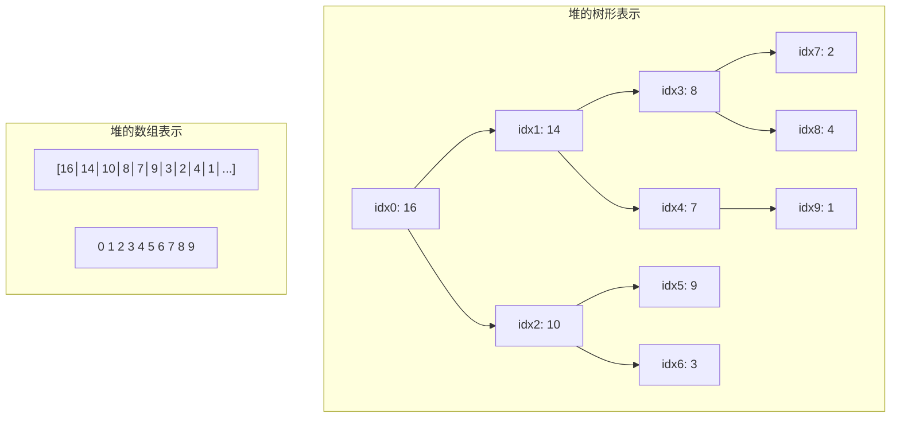
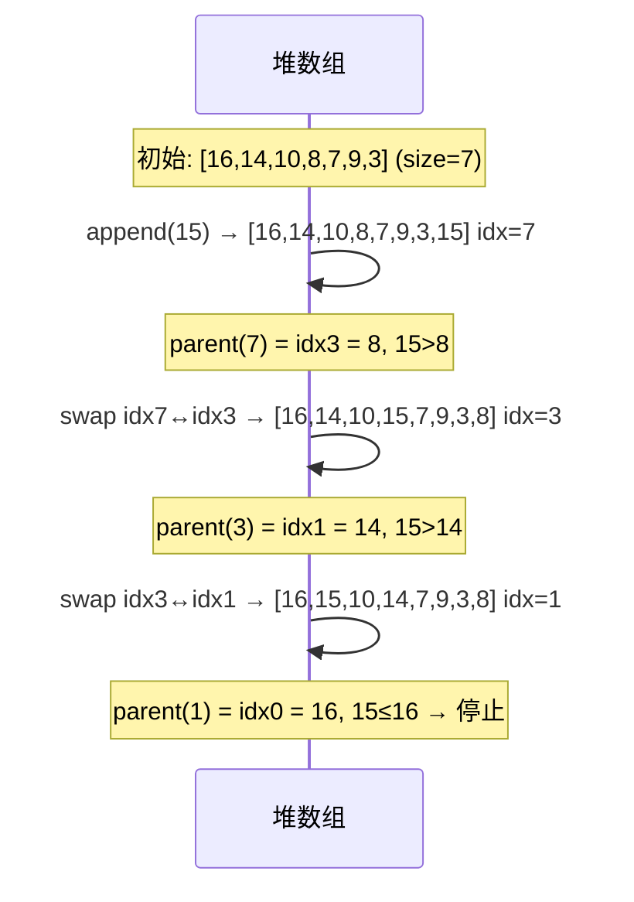
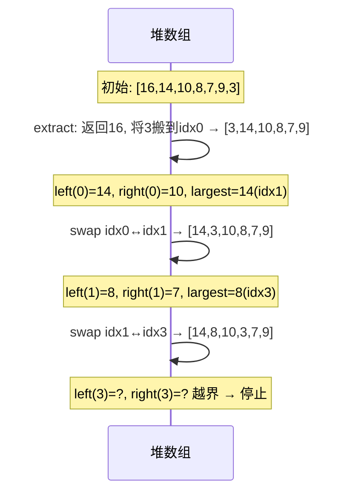
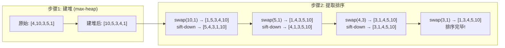
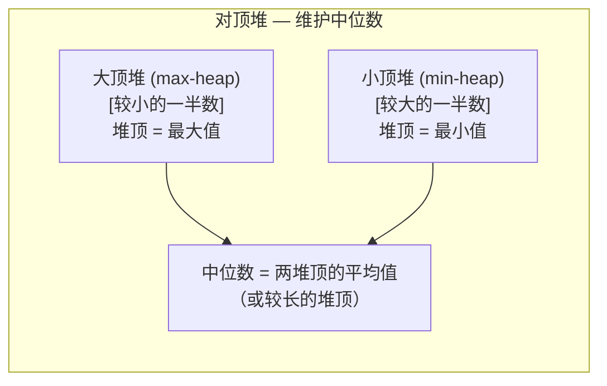

# 堆  (Heap / Priority Queue)
title: ""
---

##  章节概述

堆（Heap）是一种特殊的完全二叉树，满足"堆性质"——每个节点的值都不小于（或不大于）
其子节点的值。堆虽然是一棵树，但最精妙的地方在于它可以用**数组**紧凑存储，
无需指针，极大节省内存并提高缓存命中率。

本节侧重底层实现与内存理解，与 [[../../数据结构/I_堆_Heap|CPP教程对应章节]] 形成互补——CPP教程侧重 `std::priority_queue` 的 STL 使用、自定义比较器与算法，本教程侧重手动实现二叉堆的数组存储、sift-up/sift-down 操作、以及堆在优先队列和排序中的应用。

> 在CPP教程中对应章节侧重 `std::priority_queue` 的 STL 用法与自定义比较器，本节侧重用纯数组手动实现堆——无指针、无 malloc（节点层面），理解堆的本质。

---

---
###  第一节: 堆的数组表示 —— 为什么可以用数组？
---

### 1.1 完全二叉树与数组索引

堆是一棵**完全二叉树**——除了最后一层，每层都是满的，且最后一层的节点从左到右填充。
这种结构可以用数组紧凑存储：



**父/子索引关系**（从 0 开始的索引）:

| 关系 | 公式 |
|------|------|
| 父节点索引 | `parent(i) = (i - 1) / 2` |
| 左子节点索引 | `left(i) = 2 * i + 1` |
| 右子节点索引 | `right(i) = 2 * i + 2` |

**为什么二叉堆可以无指针存储？**

完全二叉树的性质保证了数组中不存在"空洞"——前 n 个位置始终代表一棵有效树。
不需要 `left`/`right` 指针，索引即逻辑关系。这比二叉搜索树每个节点节省 16 字节（两个指针）。

> 关于数组索引到地址的汇编转换 `[base + index * size]`，参见 。

---

### 1.2 堆的结构定义

```c
#include <stdlib.h>
#include <stdio.h>
#include <stdbool.h>

#define MAX_HEAP_SIZE 1024

typedef struct {
    int *data;       // 堆的数组
    int size;        // 当前元素个数
    int capacity;    // 数组容量
} MaxHeap;

MaxHeap* heap_create(int capacity) {
    MaxHeap *heap = (MaxHeap*)malloc(sizeof(MaxHeap));
    if (!heap) return NULL;
    heap->data = (int*)malloc(capacity * sizeof(int));
    if (!heap->data) {
        free(heap);
        return NULL;
    }
    heap->size = 0;
    heap->capacity = capacity;
    return heap;
}

void heap_destroy(MaxHeap *heap) {
    if (heap) {
        free(heap->data);
        free(heap);
    }
}

bool heap_is_empty(const MaxHeap *heap) { return heap->size == 0; }

int heap_peek(const MaxHeap *heap) {
    if (heap->size == 0) return 0;
    return heap->data[0];  // 堆顶始终在索引 0
}
```

> **练习 1.2.1**: 证明对于完全二叉树的任意节点 i（索引从 0 开始），其父节点索引 `(i-1)/2` 确实指向它在树中的父节点。用索引的二进制表示来分析。

---

---
###  第二节: 核心操作 —— Sift-up 与 Sift-down
---

### 2.1 sift-up（上滤）—— 用于 insert

新元素插入到数组末尾（完全二叉树的最后一个位置），然后与父节点比较，
如果大于父节点就交换，不断向上"浮"：

```c
static void heap_sift_up(MaxHeap *heap, int idx) {
    while (idx > 0) {
        int parent = (idx - 1) / 2;
        if (heap->data[idx] <= heap->data[parent]) {
            break;  // 已满足堆性质
        }
        // 交换
        int tmp = heap->data[idx];
        heap->data[idx] = heap->data[parent];
        heap->data[parent] = tmp;
        idx = parent;
    }
}

bool heap_insert(MaxHeap *heap, int value) {
    if (heap->size >= heap->capacity) {
        return false;  // 堆满（可动态扩容，略）
    }
    heap->data[heap->size] = value;
    heap_sift_up(heap, heap->size);
    heap->size++;
    return true;
}
```

**sift-up 过程示例**（插入 15）:



---

### 2.2 sift-down（下滤）—— 用于 extract

取出堆顶元素（index 0）后，把最后一个元素搬到堆顶，然后向下调整：

```c
static void heap_sift_down(MaxHeap *heap, int idx) {
    while (1) {
        int largest = idx;
        int left = 2 * idx + 1;
        int right = 2 * idx + 2;

        if (left < heap->size && heap->data[left] > heap->data[largest])
            largest = left;
        if (right < heap->size && heap->data[right] > heap->data[largest])
            largest = right;

        if (largest == idx) break;  // 已满足堆性质

        // 交换
        int tmp = heap->data[idx];
        heap->data[idx] = heap->data[largest];
        heap->data[largest] = tmp;
        idx = largest;
    }
}

int heap_extract(MaxHeap *heap) {
    if (heap->size == 0) return 0;

    int root_val = heap->data[0];
    heap->data[0] = heap->data[heap->size - 1];  // 最后一个元素搬到根
    heap->size--;
    if (heap->size > 0) {
        heap_sift_down(heap, 0);
    }
    return root_val;
}
```

**sift-down 过程示例**（extract 后调整）:



> **练习 2.2.1**: 实现一个**最小堆**（MinHeap）版本的 insert 和 extract。需要修改比较条件。

---

### 2.3 堆构建 —— 批量建堆（Heapify）

给定一个无序数组，在 O(n) 时间内构建堆：

```c
// O(n) 建堆 —— 从最后一个非叶节点开始，依次 sift-down
void heap_build(MaxHeap *heap, const int *arr, int n) {
    if (n > heap->capacity) n = heap->capacity;
    for (int i = 0; i < n; i++) {
        heap->data[i] = arr[i];
    }
    heap->size = n;

    // 从最后一个非叶节点开始：parent(n-1)
    for (int i = (n - 2) / 2; i >= 0; i--) {
        heap_sift_down(heap, i);
    }
}
```

**为什么建堆是 O(n)？**

直觉上每个节点 sift-down 是 O(log n)，n 个节点似乎应该是 O(n log n)。
然而：

- 约 n/2 的节点在最后一层（叶子），sift-down 代价为 0
- 约 n/4 的节点在倒数第 2 层，代价为 1
- 约 n/8 的节点在倒数第 3 层，代价为 2
- ...

总代价 = Σ (n/2^(h+1)) × h = O(n)

> 详细数学推导超出本节范围，核心直觉：大多数节点是叶子，不需要调整。

> **练习 2.3.1**: 实现 `heap_is_valid(heap)` 函数 —— 遍历堆验证每个节点都满足堆性质。

---

---
###  第三节: 堆排序
---

### 3.1 堆排序算法

堆排序是原地排序算法，O(n log n)，不需要额外数组空间：

```c
void heap_sort(int *arr, int n) {
    // 1. 建堆（在 arr 原地构建最大堆）
    for (int i = (n - 2) / 2; i >= 0; i--) {
        int idx = i;
        while (1) {
            int largest = idx;
            int left = 2 * idx + 1;
            int right = 2 * idx + 2;
            if (left < n && arr[left] > arr[largest]) largest = left;
            if (right < n && arr[right] > arr[largest]) largest = right;
            if (largest == idx) break;
            int tmp = arr[idx]; arr[idx] = arr[largest]; arr[largest] = tmp;
            idx = largest;
        }
    }

    // 2. 逐个提取最大值放到数组末尾
    for (int i = n - 1; i > 0; i--) {
        // swap(堆顶, 末尾)
        int tmp = arr[0];
        arr[0] = arr[i];
        arr[i] = tmp;

        // 重新调整堆（范围缩小到 i）
        int idx = 0;
        while (1) {
            int largest = idx;
            int left = 2 * idx + 1;
            int right = 2 * idx + 2;
            if (left < i && arr[left] > arr[largest]) largest = left;
            if (right < i && arr[right] > arr[largest]) largest = right;
            if (largest == idx) break;
            tmp = arr[idx]; arr[idx] = arr[largest]; arr[largest] = tmp;
            idx = largest;
        }
    }
}
```

**堆排序过程图解**:



---

### 3.2 堆排序与其他排序的对比

| 算法 | 时间（平均） | 空间 | 稳定性 | 原地 |
|------|------------|------|--------|------|
| 堆排序 | O(n log n) | O(1) | 不稳定 | 是 |
| 快排 | O(n log n) | O(log n) | 不稳定 | 是 |
| 归并排序 | O(n log n) | O(n) | 稳定 | 否 |
| 插入排序 | O(n²) | O(1) | 稳定 | 是 |

堆排序的优势在于 O(1) 额外空间 + O(n log n) 确定性时间复杂度（不像快排有 O(n²) 最坏情况）。
但堆排序的缓存不友好（跳跃访问），通常比快排慢。

> **练习 3.2.1**: 为什么堆排序不稳定？举例说明。提示：考虑值相等的元素在建堆过程中的位置变化。

---

---
###  第四节: 优先队列应用
---

### 4.1 Top-K 问题

"找出最大的 K 个数"——用小顶堆维护前 K 个最大值：

```c
#include <string.h>

// 用小顶堆（MinHeap）解决 Top-K 问题
void top_k(const int *arr, int n, int k) {
    if (k <= 0 || k > n) return;

    // 用前 k 个元素建最小堆
    int *min_heap = (int*)malloc(k * sizeof(int));
    memcpy(min_heap, arr, k * sizeof(int));
    for (int i = (k - 2) / 2; i >= 0; i--) {
        // sift-down on min_heap
        int idx = i;
        while (1) {
            int smallest = idx;
            int left = 2 * idx + 1, right = 2 * idx + 2;
            if (left < k && min_heap[left] < min_heap[smallest]) smallest = left;
            if (right < k && min_heap[right] < min_heap[smallest]) smallest = right;
            if (smallest == idx) break;
            int tmp = min_heap[idx]; min_heap[idx] = min_heap[smallest]; min_heap[smallest] = tmp;
            idx = smallest;
        }
    }

    // 处理剩余 n-k 个元素
    for (int i = k; i < n; i++) {
        if (arr[i] > min_heap[0]) {
            min_heap[0] = arr[i];
            // sift-down
            int idx = 0;
            while (1) {
                int smallest = idx;
                int left = 2 * idx + 1, right = 2 * idx + 2;
                if (left < k && min_heap[left] < min_heap[smallest]) smallest = left;
                if (right < k && min_heap[right] < min_heap[smallest]) smallest = right;
                if (smallest == idx) break;
                int tmp = min_heap[idx]; min_heap[idx] = min_heap[smallest]; min_heap[smallest] = tmp;
                idx = smallest;
            }
        }
    }

    printf("Top %d elements: ", k);
    for (int i = 0; i < k; i++) printf("%d ", min_heap[i]);
    printf("\n");

    free(min_heap);
}
```

**算法分析**: 堆大小保持 k，每处理一个元素只需 O(log k) 的 sift-down。
总复杂度 O(n log k)，当 k << n 时远优于排序的 O(n log n)。

---

### 4.2 动态维护中位数 —— 对顶堆

使用两个堆：大顶堆存小数，小顶堆存大数：

```c
typedef struct {
    MaxHeap *max_heap;  // 存较小的一半（左边）
    MaxHeap *min_heap;  // 存较大的一半（右边）—— 实际上用 MinHeap 更合适
} MedianFinder;

// 初始化：大小堆各分配 n/2+1 容量
// insert 逻辑：
//   如果 num <= max_heap 堆顶 → 插入 max_heap
//   否则 → 插入 min_heap
//   然后平衡两个堆使 size 差 ≤ 1
// 中位数：
//   如果两个堆等大 → (max_top + min_top) / 2.0
//   如果 max 多一个 → max_top
```



> **练习 4.2.1**: 完整实现对顶堆 `MedianFinder`。要求支持 `addNum` 和 `findMedian`。

---

### 4.3 优先级任务调度器

```c
typedef struct {
    int priority;  // 优先级（值越大越优先）
    int task_id;
    char description[64];
} Task;

typedef struct {
    Task *tasks;
    int size;
    int capacity;
    // ... 与 MaxHeap 相同的结构
} TaskPriorityQueue;
```

> **练习 4.3.1**: 基于堆实现一个任务调度器，支持 `add_task(priority, desc)` 和 `execute_next()`。

---

---
##  章节测试
---

###  判断题（10题）

> [!question] 判断题 1
> 堆必须用树结构（带 left/right 指针）来实现。
> > [!FAQ]- 点击查看答案
> > **错误**。二叉堆最具优势的特性就是可以用数组紧凑存储，通过索引关系表达父子关系，无需指针。

> [!question] 判断题 2
> 对于索引为 i（从 0 开始）的节点，其左子节点索引为 `2*i+1`。
> > [!FAQ]- 点击查看答案
> > **正确**。对于 0-indexed 堆，左子节点 = 2i+1，右子节点 = 2i+2。如果采用 1-indexed，则为 2i 和 2i+1。

> [!question] 判断题 3
> 最大堆中，任意节点的值都不大于其子节点。
> > [!FAQ]- 点击查看答案
> > **错误**。最大堆中父节点 ≥ 子节点（不小于）。最小堆才是父节点 ≤ 子节点（不大于）。

> [!question] 判断题 4
> sift-up 操作用于在堆中插入新元素后恢复堆性质。
> > [!FAQ]- 点击查看答案
> > **正确**。新元素插在数组末尾，通过 sift-up 与父节点反复比较交换，向上找到正确位置。

> [!question] 判断题 5
> 堆排序的空间复杂度是 O(n)。
> > [!FAQ]- 点击查看答案
> > **错误**。堆排序是原地排序，只需要 O(1) 的额外空间（几个临时变量），不需要额外的数组。

> [!question] 判断题 6
> 从无序数组构建堆（heapify）的时间复杂度是 O(n log n)。
> > [!FAQ]- 点击查看答案
> > **错误**。自底向上的建堆（从最后一个非叶节点开始 sift-down）时间复杂度为 O(n)，因为大多数节点是叶子。

> [!question] 判断题 7
> 堆排序是不稳定的排序算法。
> > [!FAQ]- 点击查看答案
> > **正确**。堆排序的交换操作可能改变相同元素的相对顺序，因此是不稳定的。

> [!question] 判断题 8
> 用大小为 k 的最小堆可以找出前 K 个最大元素。
> > [!FAQ]- 点击查看答案
> > **正确**。维护 k 个元素的最小堆，堆顶是这 k 个中最小的（即第 k 大的门槛）。新元素若比堆顶大，则替换并调整。

> [!question] 判断题 9
> 堆中最后一个非叶节点的索引是 `size/2`。
> > [!FAQ]- 点击查看答案
> > **错误**。对于 0-indexed 堆，最后一个非叶节点是 `parent(size-1) = (size-2)/2 = size/2 - 1`。对于 1-indexed 堆，是 `size/2`。

> [!question] 判断题 10
> sift-down 操作的时间复杂度是 O(log n)。
> > [!FAQ]- 点击查看答案
> > **正确**。sift-down 最坏情况是从根沉到底部，高度为 log n，每层常数时间比较和交换。

---

###  选择题（10题）

> [!question] 选择题 1
> 索引为 5 的节点，其父节点、左子节点、右子节点的索引分别是？
> - [ ] A. 2, 10, 11
> - [ ] B. 2, 11, 12
> - [ ] C. 3, 11, 12
> - [ ] D. 2, 11, 13
>
> > [!FAQ]- 点击查看答案
> > **正确答案: B**
> >
> > **解析**: parent = (5-1)/2 = 2，left = 2*5+1 = 11，right = 2*5+2 = 12。

> [!question] 选择题 2
> 最大堆 [50, 30, 40, 20, 10] 中，插入 45 后的堆是？
> - [ ] A. [50, 45, 40, 20, 10, 30]
> - [ ] B. [50, 30, 45, 20, 10, 40]
> - [ ] C. [50, 45, 30, 20, 10, 40]
> - [ ] D. [45, 50, 40, 30, 20, 10]
>
> > [!FAQ]- 点击查看答案
> > **正确答案: A**
> >
> > **解析**: 45 插在末尾 idx5，parent(5)=2=40，45>40 交换→[50,30,45,20,10,40]。parent(2)=0=50，45≤50 停止。

> [!question] 选择题 3
> extract（取堆顶）后，堆的大小会？
> - [ ] A. 不变
> - [ ] B. 减少 1
> - [ ] C. 减少 2
> - [ ] D. 取决于堆的类型
>
> > [!FAQ]- 点击查看答案
> > **正确答案: B**
> >
> > **解析**: extract 返回堆顶元素，把最后一个元素搬到堆顶，size--。堆的大小减少 1。

> [!question] 选择题 4
> 堆排序中，升序排列应使用什么类型的堆？
> - [ ] A. 最小堆
> - [ ] B. 最大堆
> - [ ] C. 任意堆
> - [ ] D. 需要两个堆
>
> > [!FAQ]- 点击查看答案
> > **正确答案: B**
> >
> > **解析**: 最大堆的堆顶是最大值。每次 extract 最大值放到数组末尾，完成后数组自然升序。如果用最小堆，会得到降序排列。

> [!question] 选择题 5
> 对顶堆（双堆）维护中位数，如果当前元素数为偶数，中位数等于？
> - [ ] A. 大顶堆的堆顶
> - [ ] B. 小顶堆的堆顶
> - [ ] C. 两个堆顶的平均值
> - [ ] D. 无法确定
>
> > [!FAQ]- 点击查看答案
> > **正确答案: C**
> >
> > **解析**: 偶数个元素时，两个堆大小相等，中位数是两个堆顶（较小半的最大值 + 较大半的最小值）的平均值。

> [!question] 选择题 6
> 当堆用数组实现，大小为 n 时，有多少个叶子节点？
> - [ ] A. n/2
> - [ ] B. n - n/2
> - [ ] C. n/2
> - [ ] D. n/2 + 1
>
> > [!FAQ]- 点击查看答案
> > **正确答案: B**
> >
> > **解析**: 非叶节点数为 floor(n/2)（在 0-indexed 中是 (n-2)/2+1 ≈ n/2）。叶子节点数 = n - 非叶节点数 ≈ n - n/2 ≈ ceil(n/2)。

> [!question] 选择题 7
> 关于建堆（heapify）的时间复杂度，以下说法正确的是？
> - [ ] A. O(n log n) 因为每个节点都要 sift-down
> - [ ] B. O(n) 因为大多数节点是叶子，sift-down 代价低
> - [ ] C. O(log n) 因为堆高度是 log n
> - [ ] D. O(n²) 因为在最坏情况下
>
> > [!FAQ]- 点击查看答案
> > **正确答案: B**
> >
> > **解析**: 自底向上建堆是 O(n)。约 n/2 个叶子代价为 0，n/4 代价为 1，n/8 代价为 2... 总代价收敛于 O(n)。

> [!question] 选择题 8
> 优先队列（Priority Queue）最底层的数据结构通常是？
> - [ ] A. 数组
> - [ ] B. 链表
> - [ ] C. 二叉堆
> - [ ] D. 哈希表
>
> > [!FAQ]- 点击查看答案
> > **正确答案: C**
> >
> > **解析**: 优先队列要求 O(log n) 插入和 O(log n) 取最值，二叉堆完美满足这两个需求。C++ `std::priority_queue` 默认底层就是二叉堆。

> [!question] 选择题 9
> 存储 1000 个元素的二叉堆，数组索引 0 到 999，堆的高度是？
> - [ ] A. 8
> - [ ] B. 9
> - [ ] C. 10
> - [ ] D. 1000
>
> > [!FAQ]- 点击查看答案
> > **正确答案: C**
> >
> > **解析**: 高度 h 满足 2^h - 1 ≥ 1000。2^10 - 1 = 1023 ≥ 1000，所以高度为 10（层数）或 9（边数，取决于定义）。

> [!question] 选择题 10
> 堆排序与快速排序相比，堆排序的主要优势是？
> - [ ] A. 更稳定
> - [ ] B. 确定性的 O(n log n) 时间复杂度（无 O(n²) 退化）
> - [ ] C. 更节约空间
> - [ ] D. 在实际中基本总是更快
>
> > [!FAQ]- 点击查看答案
> > **正确答案: B**
> >
> > **解析**: 堆排序的 O(n log n) 是确定性的，不像快排有 O(n²) 的最坏情况。但实际中快排通常更快（缓存友好）。两者空间都是 O(1) 级。

---

###  编程大题

> [!note] 编程题 1：实现完整的泛型二叉堆
> **要求**：
> 1. 支持最大堆和最小堆（通过比较函数指针切换）
> 2. 支持任意类型（`void*` + element_size）
> 3. 实现所有操作：create、destroy、insert、extract、peek、size、is_empty、heapify
> 4. 支持动态扩容（2x 策略）
> 5. 用函数指针支持自定义比较器
>
> **提示**: 泛型堆的核心是用 `memcpy` 移动元素，比较时通过函数指针回调。

> [!note] 编程题 2：堆排序的实战性能对比
> **要求**：
> 1. 实现堆排序、快速排序、归并排序
> 2. 对 100 万个随机整数排序，记录时间
> 3. 对"几乎有序"的 100 万个整数排序，记录时间
> 4. 分析为什么堆排序在实践中通常比快排慢（缓存不命中、分支预测等）
> 5. 尝试优化堆排序（如减少分支、缓存友好的布局调整）
>
> **提示**: 用 `clock()` 或 `gettimeofday()` 计时。

> [!note] 编程题 3：基于堆的优先级任务调度器
> **要求**：
> 1. 任务包含：tid、priority（0-255）、arrival_time、burst_time
> 2. 实现三种调度算法：
>    - 先来先服务（FCFS，用队列）
>    - 最短作业优先（SJF，用最小堆按 burst_time）
>    - 优先级调度（用最大堆按 priority）
> 3. 读取任务文件，输出每种算法的调度序列和平均等待时间
>
> **提示**: 可以用对顶堆或二叉堆配合链表实现多级反馈队列调度。

### 推荐练习题（力扣）

| 知识点 | 题目建议 |
|------|--------|
| 最小堆 | 力扣堆 |
| 贪心+堆 | 力扣哈夫曼 |
| 对顶堆 | 力扣数据流中位数 |
| 对顶堆 | 力扣堆 |
| 堆、多路归并 | 力扣堆 |

---

***
##  知识网络
***

- **上一章**: [[06_树与二叉树|树与二叉树]] | **下一章**: [[08_图|图]] | **返回**: 
- **CPP对照**: [[../../数据结构/I_堆_Heap|CPP: 堆]] | [[../../cpp教程/容器库/适配器/priority_queue|CPP: priority_queue]]
- **相关**: [[../2深化/01_指针深度剖析|指针深度剖析]] | [[../2深化/03_动态内存管理|动态内存管理]]
- **ASM**: 
