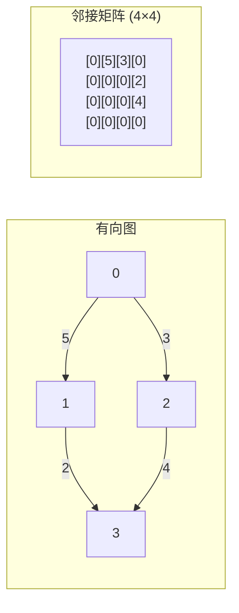
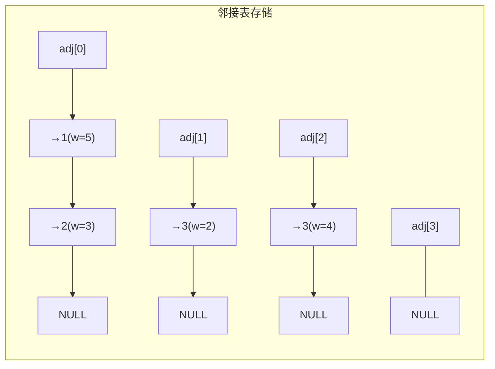
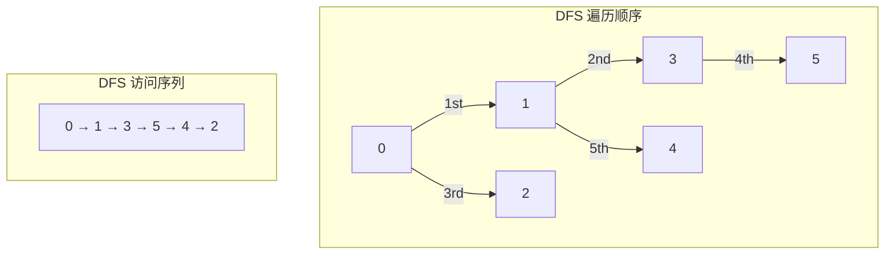
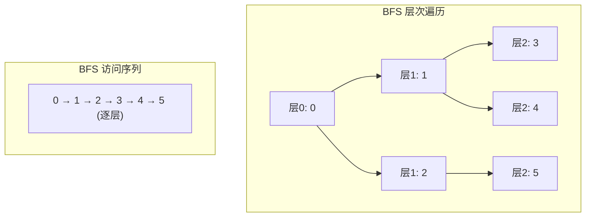
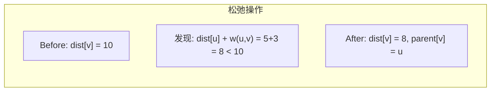
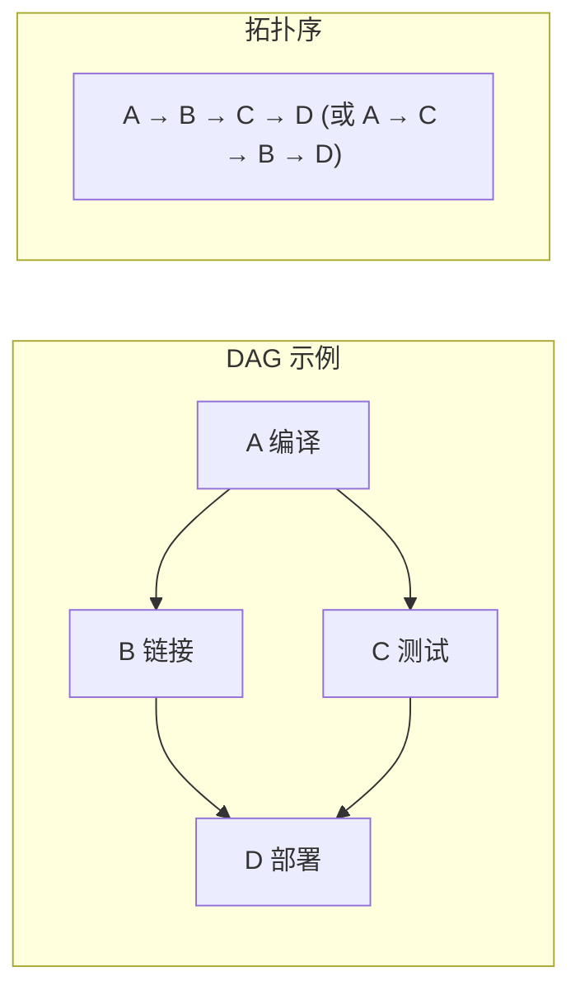
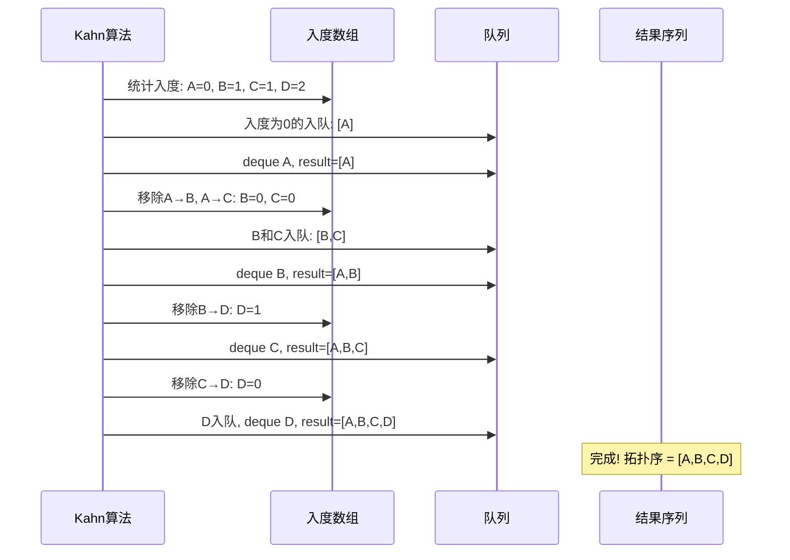

# 图 (Graph)
title: ""
---

## 章节概述

图（Graph）是最通用、最灵活的数据结构——节点（顶点）通过边连接，可以表示任意复杂的关系。
从社交网络、地图导航到编译器的依赖分析，图无处不在。

本节侧重底层实现与内存理解，与 [[../../数据结构/S_图_Graph|CPP教程对应章节]] 形成互补——CPP教程侧重图的 STL 表示（`vector<vector<int>>`）、算法模板与竞赛优化，本教程侧重手动实现邻接矩阵和邻接表、BFS/DFS 的底层细节、以及大型图的内存管理策略。

> 在CPP教程中对应章节侧重图的 STL 表示和算法模板，本节侧重手动构建邻接矩阵/邻接表、理解边与顶点的内存关系、以及在大规模图中管理内存。

---

---
### 第一节: 图的表示 —— 邻接矩阵 vs 邻接表
---

### 1.1 邻接矩阵

邻接矩阵用一个 n×n 的二维数组表示图：`matrix[i][j] != 0` 表示从 i 到 j 存在边。

```c
#include <stdlib.h>
#include <stdio.h>
#include <stdbool.h>
#include <string.h>
#include <limits.h>

#define INF INT_MAX

typedef struct {
 int **matrix; // n×n 矩阵（matrix[i][j] = 权重，0=无边）
 int n; // 顶点数
 bool directed; // 有向图？
} AdjMatrix;

AdjMatrix* am_create(int n, bool directed) {
 AdjMatrix *g = (AdjMatrix*)malloc(sizeof(AdjMatrix));
 if (!g) return NULL;
 g->n = n;
 g->directed = directed;

 g->matrix = (int**)malloc(n * sizeof(int*));
 if (!g->matrix) { free(g); return NULL; }
 for (int i = 0; i < n; i++) {
 g->matrix[i] = (int*)calloc(n, sizeof(int));
 if (!g->matrix[i]) {
 for (int j = 0; j < i; j++) free(g->matrix[j]);
 free(g->matrix); free(g);
 return NULL;
 }
 }
 return g;
}

void am_add_edge(AdjMatrix *g, int u, int v, int weight) {
 if (u < 0 || u >= g->n || v < 0 || v >= g->n) return;
 g->matrix[u][v] = weight;
 if (!g->directed) {
 g->matrix[v][u] = weight; // 无向图对称
 }
}

void am_destroy(AdjMatrix *g) {
 if (!g) return;
 for (int i = 0; i < g->n; i++) free(g->matrix[i]);
 free(g->matrix);
 free(g);
}
```



**邻接矩阵的内存分析**:

| 顶点数 | 矩阵大小 | 内存（int） | 内存（MB） |
|--------|---------|------------|-----------|
| 1,000 | 1K×1K | 4 MB | ~4 MB |
| 10,000 | 10K×10K | 400 MB | ~381 MB |
| 100,000 | 100K×100K | 40 GB | 不可行 |

对于稀疏图（边数 << n²），矩阵大量空间浪费在存 0 上。

---

### 1.2 邻接表 —— 稀疏图的最佳选择

邻接表为每个顶点维护一个链表/动态数组，存储该顶点的所有邻居：

```c
typedef struct Edge {
 int to; // 目标顶点
 int weight; // 边权
 struct Edge *next; // 下一个邻居
} Edge;

typedef struct {
 Edge **adj; // adj[i] 指向顶点 i 的邻居链表头
 int n;
 bool directed;
} AdjList;
```



```c
AdjList* al_create(int n, bool directed) {
 AdjList *g = (AdjList*)malloc(sizeof(AdjList));
 if (!g) return NULL;
 g->n = n;
 g->directed = directed;
 g->adj = (Edge**)calloc(n, sizeof(Edge*));
 if (!g->adj) { free(g); return NULL; }
 return g;
}

void al_add_edge(AdjList *g, int u, int v, int weight) {
 Edge *e = (Edge*)malloc(sizeof(Edge));
 e->to = v;
 e->weight = weight;
 e->next = g->adj[u]; // 头插
 g->adj[u] = e;

 if (!g->directed) {
 Edge *rev = (Edge*)malloc(sizeof(Edge));
 rev->to = u;
 rev->weight = weight;
 rev->next = g->adj[v];
 g->adj[v] = rev;
 }
}

void al_destroy(AdjList *g) {
 if (!g) return;
 for (int i = 0; i < g->n; i++) {
 Edge *cur = g->adj[i];
 while (cur) {
 Edge *next = cur->next;
 free(cur);
 cur = next;
 }
 }
 free(g->adj);
 free(g);
}
```

**相邻表空间复杂度**: O(n + m)，其中 m 是边数。对于稀疏图远优于 O(n²) 的邻接矩阵。

> **练习 1.2.1**: 实现邻接表的 `al_has_edge(g, u, v)` —— 检查边是否存在。分析为什么邻接表检查边存在是 O(degree(u)) 而不是 O(1)。

---

### 1.3 邻接矩阵 vs 邻接表 详细对比

| 特性 | 邻接矩阵 | 邻接表 |
|------|---------|--------|
| 空间 | O(n²) | O(n + m) |
| 检查边 (u,v) | **O(1)** | O(degree(u)) |
| 遍历邻居 | O(n) | **O(degree(u))** |
| 添加边 | O(1) | O(1) 头插 |
| 删除边 | O(1) | O(degree(u)) 找前驱 |
| 适合场景 | 稠密图 (m≈n²) | 稀疏图 (m<<n²) |
| 缓存友好 | 中等 | 差（链表） |

对于大多数实际图（稀疏图），邻接表是默认选择。

> **练习 1.3.1**: 实现一个混合表示——邻接表用动态数组替代链表（`int **neighbors` + `int *degrees`），以获得更好的缓存性能。这种表示在竞赛编程中非常常见。

---

---
### 第二节: 深度优先搜索（DFS）
---

### 2.1 DFS 的基本实现

```c
// 邻接表的 DFS（递归版）
void dfs_recursive(const AdjList *g, int u, bool *visited) {
 visited[u] = true;
 printf("%d ", u);

 Edge *e = g->adj[u];
 while (e) {
 if (!visited[e->to]) {
 dfs_recursive(g, e->to, visited);
 }
 e = e->next;
 }
}

// 外部调用
void dfs_traverse(const AdjList *g, int start) {
 bool *visited = (bool*)calloc(g->n, sizeof(bool));
 dfs_recursive(g, start, visited);
 free(visited);
}
```



---

### 2.2 迭代 DFS（显式栈）

```c
#define MAX_V 10000

void dfs_iterative(const AdjList *g, int start) {
 bool *visited = (bool*)calloc(g->n, sizeof(bool));
 int *stack = (int*)malloc(g->n * sizeof(int));
 int top = -1;

 stack[++top] = start;

 while (top >= 0) {
 int u = stack[top--];
 if (visited[u]) continue;
 visited[u] = true;
 printf("%d ", u);

 // 将邻居压栈（反向压入以保证访问顺序与递归一致）
 // 这里简化直接正序压入
 Edge *e = g->adj[u];
 while (e) {
 if (!visited[e->to]) {
 stack[++top] = e->to;
 }
 e = e->next;
 }
 }

 free(stack);
 free(visited);
}
```

> **练习 2.2.1**: 为什么迭代 DFS 中需要 `if (visited[u]) continue` 检查？画出没有该检查时会出现什么情况。

---

### 2.3 DFS 应用：连通分量（Connected Components）

```c
int count_components(const AdjList *g) {
 bool *visited = (bool*)calloc(g->n, sizeof(bool));
 int components = 0;

 for (int i = 0; i < g->n; i++) {
 if (!visited[i]) {
 components++;
 dfs_recursive(g, i, visited); // 标记整个连通分量为已访问
 }
 }

 free(visited);
 return components;
}
```

> **练习 2.3.1**: 修改上述代码，不仅计数连通分量，还输出每个连通分量包含哪些顶点。

---

### 2.4 递归 DFS 的栈深度问题

对于大型连通图（如链状图），递归 DFS 深度可能达到 n，导致系统栈溢出：

```c
// 安全版本：限制递归深度
#define MAX_DFS_DEPTH 10000
static int dfs_depth = 0;

bool dfs_safe(const AdjList *g, int u, bool *visited) {
 if (dfs_depth++ > MAX_DFS_DEPTH) {
 fprintf(stderr, "DFS depth exceeded, switch to iterative\n");
 dfs_depth--;
 return false;
 }

 visited[u] = true;
 Edge *e = g->adj[u];
 while (e) {
 if (!visited[e->to]) {
 if (!dfs_safe(g, e->to, visited)) return false;
 }
 e = e->next;
 }
 dfs_depth--;
 return true;
}
```

> 关于栈溢出的硬件原理，参见 。

---

---
### 第三节: 广度优先搜索（BFS）
---

### 3.1 BFS 基本实现

```c
#include "queue.h" // 假设已有 CircularQueue 实现

void bfs(const AdjList *g, int start) {
 bool *visited = (bool*)calloc(g->n, sizeof(bool));
 int *queue = (int*)malloc(g->n * sizeof(int));
 int head = 0, tail = 0;

 visited[start] = true;
 queue[tail++] = start;

 while (head < tail) {
 int u = queue[head++];
 printf("%d ", u);

 Edge *e = g->adj[u];
 while (e) {
 if (!visited[e->to]) {
 visited[e->to] = true;
 queue[tail++] = e->to;
 }
 e = e->next;
 }
 }

 free(queue);
 free(visited);
}
```



**BFS vs DFS 核心区别**:

| | BFS | DFS |
|---|-----|-----|
| 核心结构 | 队列（FIFO） | 栈（LIFO） |
| 访问顺序 | 逐层扩展 | 深入到底再回溯 |
| 最短路径 | 无权图**天然找到** | 需要比较所有路径 |
| 内存 | 可能存储整层（O(w)） | 存储路径深度（O(h)） |
| 栈溢出风险 | 低（用自有队列） | 高（递归用系统栈） |

---

### 3.2 BFS 应用：无权图最短路径

BFS 在无权图中天然找到最短路径（按层扩展，第 k 层访问的距离就是 k）：

```c
int bfs_shortest_path(const AdjList *g, int start, int target) {
 if (start == target) return 0;

 bool *visited = (bool*)calloc(g->n, sizeof(bool));
 int *dist = (int*)malloc(g->n * sizeof(int));
 for (int i = 0; i < g->n; i++) dist[i] = -1;

 int *queue = (int*)malloc(g->n * sizeof(int));
 int head = 0, tail = 0;

 visited[start] = true;
 dist[start] = 0;
 queue[tail++] = start;

 while (head < tail) {
 int u = queue[head++];
 if (u == target) break;

 Edge *e = g->adj[u];
 while (e) {
 if (!visited[e->to]) {
 visited[e->to] = true;
 dist[e->to] = dist[u] + 1;
 queue[tail++] = e->to;
 }
 e = e->next;
 }
 }

 int result = dist[target];
 free(queue);
 free(dist);
 free(visited);
 return result;
}
```

> **练习 3.2.1**: 修改最短路径代码，不仅返回距离，还输出完整路径（使用 `parent[]` 数组追溯）。

---

---
### 第四节: 最短路径 —— Dijkstra 算法
---

### 4.1 带权图的最短路径

对于带权图（非负权重），Dijkstra 算法使用优先队列（[[07_堆|最小堆]]）实现贪心：

```c
typedef struct {
 int vertex;
 int distance;
} PQNode;

// 简化版 Dijkstra（O(V²) 版本，适用于稠密图）
void dijkstra_simple(int **matrix, int n, int start, int *dist) {
 bool *visited = (bool*)calloc(n, sizeof(bool));

 // 初始化距离
 for (int i = 0; i < n; i++) dist[i] = INF;
 dist[start] = 0;

 for (int count = 0; count < n; count++) {
 // 找未访问中距离最小的顶点
 int u = -1;
 int min_dist = INF;
 for (int i = 0; i < n; i++) {
 if (!visited[i] && dist[i] < min_dist) {
 min_dist = dist[i];
 u = i;
 }
 }

 if (u == -1) break; // 所有可达点已访问
 visited[u] = true;

 // 松弛（relax）操作
 for (int v = 0; v < n; v++) {
 if (!visited[v] && matrix[u][v] != 0 &&
 dist[u] + matrix[u][v] < dist[v]) {
 dist[v] = dist[u] + matrix[u][v];
 }
 }
 }

 free(visited);
}
```

**松弛操作**（Relaxation）是 Dijkstra 的核心：

```
if (dist[u] + weight(u,v) < dist[v]) {
 dist[v] = dist[u] + weight(u,v);
}
```

这意味着"通过 u 走到 v 比当前已知的最短路径更短"。



---

### 4.2 堆优化 Dijkstra（O((V+E) log V)）

```c
// 使用最小堆，堆中存储 (vertex, distance) 对
void dijkstra_heap(const AdjList *g, int start, int *dist) {
 for (int i = 0; i < g->n; i++) dist[i] = INF;
 dist[start] = 0;

 // 使用自己实现的优先队列（最小堆）
 // 简化示意：用 visited 数组避免重复处理
 bool *visited = (bool*)calloc(g->n, sizeof(bool));

 // 这里需要实际的最小堆实现
 // 核心循环:
 // while (heap_not_empty) {
 // u = heap_extract_min();
 // if (visited[u]) continue;
 // visited[u] = true;
 // for each neighbor v of u:
 // if (dist[u] + weight < dist[v]) {
 // dist[v] = dist[u] + weight;
 // heap_insert(v, dist[v]);
 // }
 // }

 free(visited);
 // 完整实现留给读者作为编程练习
}
```

> **练习 4.2.1**: 完成带堆优化的 Dijkstra 算法，输出从 start 到所有顶点的最短路径。

---

---
### 第五节: 拓扑排序
---

### 5.1 什么是拓扑排序？

拓扑排序用于有向无环图（DAG），将所有顶点排列成一个线性序列，
使得每条边的起点在终点之前。



---

### 5.2 Kahn 算法 —— BFS 版本

```c
// 返回拓扑序，通过 return_size 返回长度
// 如果图有环，返回 NULL
int* topological_sort(const AdjList *g, int *return_size) {
 // 1. 统计每个顶点的入度（in-degree）
 int *in_degree = (int*)calloc(g->n, sizeof(int));
 for (int u = 0; u < g->n; u++) {
 Edge *e = g->adj[u];
 while (e) {
 in_degree[e->to]++;
 e = e->next;
 }
 }

 // 2. 所有入度为 0 的顶点入队
 int *queue = (int*)malloc(g->n * sizeof(int));
 int head = 0, tail = 0;
 for (int i = 0; i < g->n; i++) {
 if (in_degree[i] == 0) {
 queue[tail++] = i;
 }
 }

 // 3. BFS 遍历
 int *result = (int*)malloc(g->n * sizeof(int));
 int idx = 0;

 while (head < tail) {
 int u = queue[head++];
 result[idx++] = u;

 // 移除 u 的所有出边
 Edge *e = g->adj[u];
 while (e) {
 in_degree[e->to]--;
 if (in_degree[e->to] == 0) {
 queue[tail++] = e->to;
 }
 e = e->next;
 }
 }

 free(in_degree);
 free(queue);

 // 如果处理的顶点数 < 总顶点数，说明图有环
 if (idx < g->n) {
 free(result);
 *return_size = 0;
 return NULL;
 }

 *return_size = idx;
 return result;
}
```

**Kahn 算法流程**:



> **练习 5.2.1**: 实现 DFS 版本的拓扑排序（后序逆序法）。

---

### 5.3 环检测

Kahn 算法天然支持环检测：如果最终处理的顶点数 < n，说明图中存在环。

```c
bool has_cycle(const AdjList *g) {
 int return_size;
 int *result = topological_sort(g, &return_size);
 if (result) free(result);
 return result == NULL;
}
```

> **练习 5.3.1**: 实现 DFS 版本的环检测（三色标记法：白=未访问，灰=访问中，黑=已完成）。

---

---
## 章节测试
---

### 判断题（10题）

> [!question] 判断题 1
> 邻接矩阵的空间复杂度是 O(n²)，邻接表的空间复杂度是 O(n + m)。
> > [!FAQ]- 点击查看答案
> > **正确**。邻接矩阵需要 n×n 的矩阵，O(n²)；邻接表只需存储边，O(n+m)（n 个链表头 + m 条边节点）。

> [!question] 判断题 2
> DFS 使用队列作为辅助数据结构。
> > [!FAQ]- 点击查看答案
> > **错误**。DFS 使用栈（递归用系统栈，迭代用显式栈）。BFS 才使用队列。

> [!question] 判断题 3
> BFS 在无权图中天然能找到最短路径。
> > [!FAQ]- 点击查看答案
> > **正确**。BFS 按层扩展，第 k 层访问的顶点到起点的最短距离就是 k。这是 BFS 最重要的性质之一。

> [!question] 判断题 4
> Dijkstra 算法适用于包含负权边的图。
> > [!FAQ]- 点击查看答案
> > **错误**。Dijkstra 假设所有边非负，遇到负权边可能得到错误结果。负权边需要 Bellman-Ford 或 SPFA 算法。

> [!question] 判断题 5
> 拓扑排序只能应用于有向无环图（DAG）。
> > [!FAQ]- 点击查看答案
> > **正确**。如果图中有环，不存在合法的拓扑序（会形成循环依赖）。

> [!question] 判断题 6
> 邻接表检查边 (u,v) 是否存在的时间复杂度是 O(1)。
> > [!FAQ]- 点击查看答案
> > **错误**。邻接表需要遍历顶点 u 的邻居链表，复杂度 O(degree(u))。邻接矩阵检查边才是 O(1)。

> [!question] 判断题 7
> Kahn 算法通过维护入度数组实现拓扑排序。
> > [!FAQ]- 点击查看答案
> > **正确**。Kahn 算法统计每个顶点的入度，每次将入度为 0 的顶点输出，并减少其邻居的入度。

> [!question] 判断题 8
> Dijkstra 算法的本质是贪心算法——每次选择距离起点最近的未处理顶点。
> > [!FAQ]- 点击查看答案
> > **正确**。Dijkstra 每次从未处理顶点中选择 dist 最小的，这在非负权图中保证了最优子结构。

> [!question] 判断题 9
> 稀疏图使用邻接矩阵比邻接表更节约内存。
> > [!FAQ]- 点击查看答案
> > **错误**。对于稀疏图（边数 m << n²），邻接矩阵 O(n²) 空间远大于邻接表 O(n+m)。比如 10 万顶点 50 万边的图，矩阵需要 40GB，邻接表只需要约 24MB。

> [!question] 判断题 10
> 递归 DFS 在大型图上可能导致栈溢出。
> > [!FAQ]- 点击查看答案
> > **正确**。递归 DFS 的深度 = 图的最长路径，在链状图或深度较大的图中可能超过系统栈大小（默认 8MB），导致段错误。解决方法是使用迭代 DFS。

---

### 选择题（10题）

> [!question] 选择题 1
> 一个有 n 个顶点的无向完全图有多少条边？
> - [ ] A. n
> - [ ] B. n²
> - [ ] C. n(n-1)/2
> - [ ] D. n(n-1)
>
> > [!FAQ]- 点击查看答案
> > **正确答案: C**
> >
> > **解析**: 无向完全图中每对顶点之间都有一条边。边数 = C(n,2) = n(n-1)/2。

> [!question] 选择题 2
> 对于存储一个 n=1000, m=5000 的稀疏图，邻接表大约需要多少内存？
> - [ ] A. 4KB
> - [ ] B. 100KB
> - [ ] C. 400KB
> - [ ] D. 4MB
>
> > [!FAQ]- 点击查看答案
> > **正确答案: B**
> >
> > **解析**: 邻接表：1000 个指针数组头 × 8B = 8KB；5000 条无向边 × 2 × 16B = 160KB（每条边 2 个节点，每节点 12-16B）。总计约 100-200KB 量级。邻接矩阵则需要 4MB。

> [!question] 选择题 3
> BFS 遍历以下什么数据结构作为辅助？
> - [ ] A. 栈
> - [ ] B. 队列
> - [ ] C. 堆
> - [ ] D. 哈希表
>
> > [!FAQ]- 点击查看答案
> > **正确答案: B**
> >
> > **解析**: BFS 使用队列实现逐层遍历——先发现的节点先处理（FIFO）。如果用栈，就变成 DFS 了。

> [!question] 选择题 4
> 在 Dijkstra 算法中，松弛操作（Relaxation）的作用是？
> - [ ] A. 删除不需要的边
> - [ ] B. 通过新发现的路由尝试缩短已知的最短距离
> - [ ] C. 压缩图的存储空间
> - [ ] D. 增加图中的顶点数量
>
> > [!FAQ]- 点击查看答案
> > **正确答案: B**
> >
> > **解析**: 松弛操作检查 `dist[u] + weight(u,v) < dist[v]`，即"通过 u 到 v 是否比当前已知的更快"。如果是，则更新 dist[v]。

> [!question] 选择题 5
> 拓扑排序用于解决什么类型的问题？
> - [ ] A. 最短路径问题
> - [ ] B. 循环依赖检测和任务排序
> - [ ] C. 网络流问题
> - [ ] D. 模式匹配问题
>
> > [!FAQ]- 点击查看答案
> > **正确答案: B**
> >
> > **解析**: 拓扑排序将有向无环图（DAG）中的顶点排列为线性序列，保证边的方向一致。典型应用包括编译依赖解析、课程安排、任务调度等。

> [!question] 选择题 6
> 邻接表中删除边 (u,v) 的时间复杂度是？
> - [ ] A. O(1)
> - [ ] B. O(degree(u))
> - [ ] C. O(n)
> - [ ] D. O(m)
>
> > [!FAQ]- 点击查看答案
> > **正确答案: B**
> >
> > **解析**: 邻接表用链表存储邻居，删除边需要遍历 u 的邻居链表找到 v 的节点并移除（可能需要找前驱）。复杂度 O(degree(u))。

> [!question] 选择题 7
> 用 Dijkstra 从顶点 A 出发，已知 dist[B]=3, dist[C]=5。若存在边 B→C 权重 1，松弛后 dist[C] 变为？
> - [ ] A. 5
> - [ ] B. 4
> - [ ] C. 3
> - [ ] D. 6
>
> > [!FAQ]- 点击查看答案
> > **正确答案: B**
> >
> > **解析**: dist[B] + weight(B,C) = 3 + 1 = 4 < 5，所以 dist[C] 被更新为 4。

> [!question] 选择题 8
> 连通分量（Connected Component）算法使用的是什么遍历方式？
> - [ ] A. DFS 或 BFS 均可
> - [ ] B. 只能 DFS
> - [ ] C. 只能 BFS
> - [ ] D. 只能 Dijkstra
>
> > [!FAQ]- 点击查看答案
> > **正确答案: A**
> >
> > **解析**: 连通分量只需从每个未访问的顶点出发遍历整个连通区域，DFS 和 BFS 都能完整遍历一个连通分量。两者在功能上等价。

> [!question] 选择题 9
> 一个有向图存在拓扑排序的充要条件是？
> - [ ] A. 图是连通的
> - [ ] B. 图中没有环（DAG）
> - [ ] C. 图有偶数个顶点
> - [ ] D. 图中每个顶点都有至少一条入边
>
> > [!FAQ]- 点击查看答案
> > **正确答案: B**
> >
> > **解析**: 拓扑排序只存在于有向无环图（DAG）。如果存在环，则会产生循环依赖，无法排出一个合法的线性顺序。

> [!question] 选择题 10
> 在实际工程中，大多数图（社交网络、Web 图、地图）是？
> - [ ] A. 稠密图
> - [ ] B. 稀疏图
> - [ ] C. 完全图
> - [ ] D. 二分图
>
> > [!FAQ]- 点击查看答案
> > **正确答案: B**
> >
> > **解析**: 实际中的大多数图是稀疏的——每个顶点的度数远小于 n。社交网络中人均好友数有限，道路交叉口连接的道路数有限。因此邻接表是实际工程中的默认选择。

---

### 编程大题

> [!note] 编程题 1：实现完整的图库
> **要求**：
> 1. 同时支持邻接矩阵和邻接表两种表示
> 2. 实现相同的操作接口：add_edge, remove_edge, has_edge, get_neighbors, degree
> 3. 实现图的序列化（保存到文件）和反序列化（从文件读取）
> 4. 实现 DFS、BFS、Dijkstra、拓扑排序
> 5. 编写测试用例：随机生成图并验证算法的正确性
>
> **提示**: 用函数指针表实现多态——为每种图表示创建一个操作表。

> [!note] 编程题 2：迷宫求解
> **要求**：
> 1. 读取 n×m 的迷宫（0=通路, 1=墙壁）
> 2. 将迷宫转换为图（每个格子是顶点，相邻通路之间有边）
> 3. 用 BFS 找最短路径
> 4. 用 DFS 找所有路径
> 5. 可视化输出路径
>
> **提示**: 迷宫可以表示为网格图（Grid Graph），顶点数 = n×m，每个顶点最多 4 个邻居。

> [!note] 编程题 3：课程安排系统（拓扑排序应用）
> **要求**：
> 1. 输入课程列表和先修关系（如"数据结构"需要先修"C语言"）
> 2. 使用拓扑排序输出一个合法的选课顺序
> 3. 检测是否存在循环依赖（如 A 依赖 B，B 依赖 A）并报告
> 4. 如果有多种合法顺序，输出所有可能（使用回溯法）
> 5. 支持按照学期分配课程（每学期最多 K 门课）
>
> **提示**: 这是经典的大学排课问题，多个大学和企业面试都以此为基础出题。

### 推荐练习题（力扣）

| 知识点 | 题目建议 |
|------|--------|
| BFS/DFS 基础 | 力扣图遍历 |
| 反向图 + DFS | 力扣图遍历 |
| 拓扑排序 | 力扣拓扑排序 |
| Dijkstra 堆优化 | 力扣最短路径 |
| SPFA/Bellman-Ford | 力扣最短路径 |
| 拓扑排序 + DP | 力扣拓扑排序 |

---

***
## 知识网络
***

- **上一章**: [[07_堆|堆]] | **下一章**: [[09_高级数据结构|高级数据结构]] | **返回**: 
- **CPP对照**: [[../../数据结构/S_图_Graph|CPP: 图]] | [[../../数据结构/T_图的高级算法_AdvancedGraph|CPP: 图的高级算法]]
- **相关**: [[04_队列|队列（BFS用）]] | [[07_堆|堆（Dijkstra优先队列用）]] | [[03_栈|栈（DFS用）]]
- **ASM**: 
