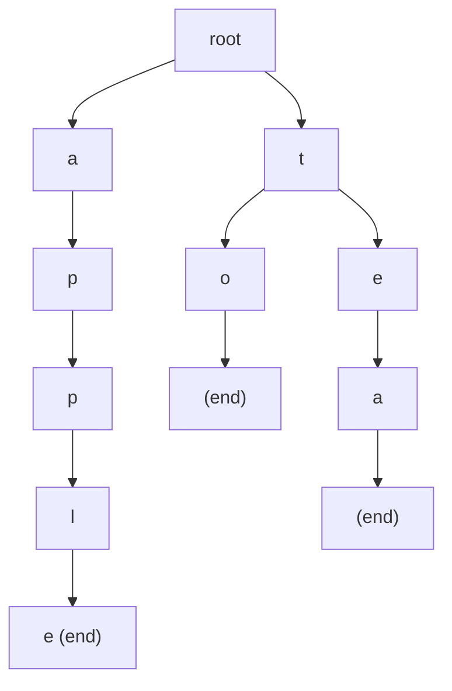
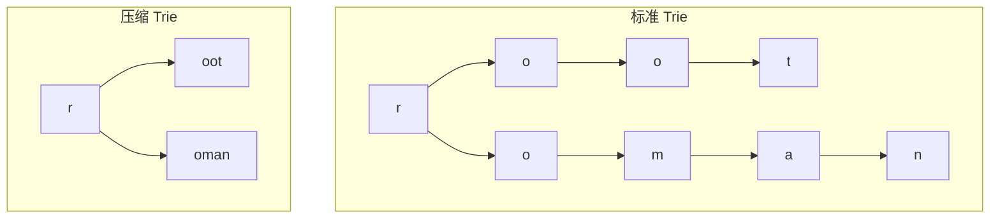
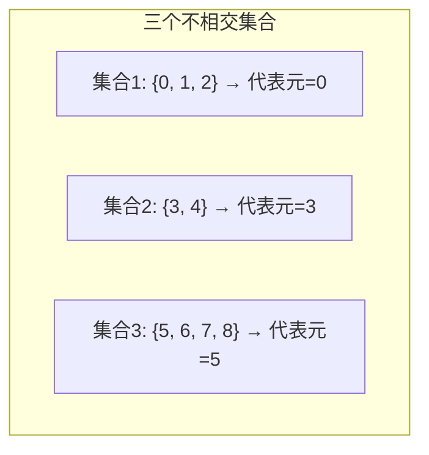
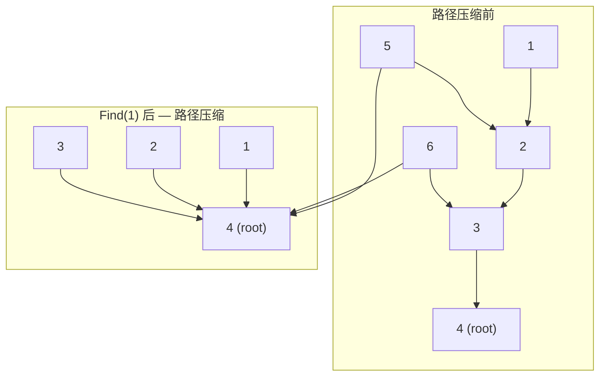
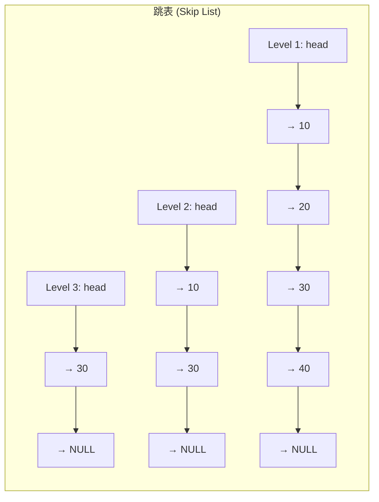
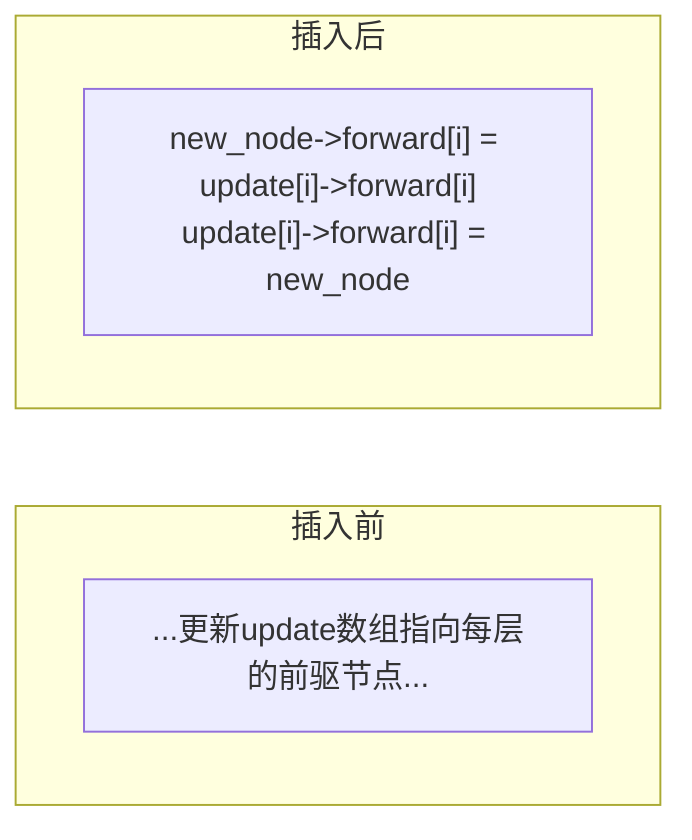
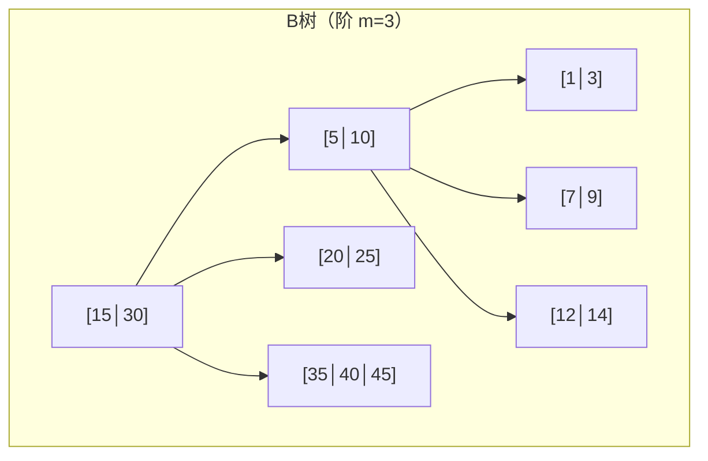
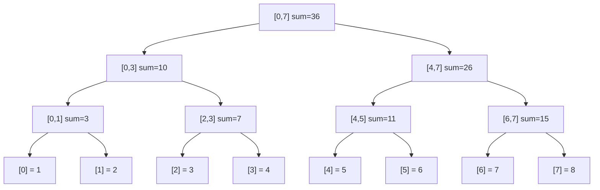
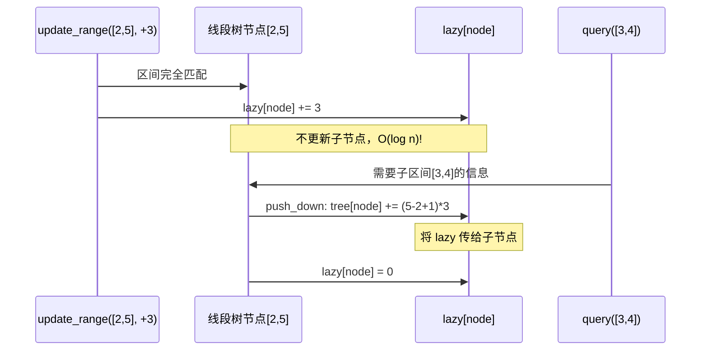

# 高级数据结构  (Advanced Data Structures)
title: ""
---

##  章节概述

本章涵盖多种高级数据结构——字典树（Trie）、并查集（Union-Find）、跳表（Skip List）、
B树和线段树。这些数据结构在特定场景下提供极大的性能提升，是现代软件系统的核心组件。

本节侧重底层实现与内存理解，与 CPP 教程的 [[../../数据结构/L_字典树_Trie|Trie]]、[[../../数据结构/O_并查集_UnionFind|Union-Find]]、[[../../数据结构/Q_线段树_SegmentTree|线段树]]、[[../../数据结构/P_跳表_SkipList|跳表]]、[[../../数据结构/M_B树_BTree|B树]] 等对应章节形成互补——CPP教程侧重使用模式和算法优化，本教程深入内存布局和手动实现。

> 在CPP教程中对应章节侧重各数据结构的 STL 使用和竞赛优化，本节侧重从零实现、理解内存布局、以及各结构的适用场景分析。

---

---
###  第一节: 字典树（Trie / Prefix Tree）
---

### 1.1 什么是字典树？

字典树（Trie）是一种树形结构，用于高效存储和检索字符串集合。每个节点表示一个字符，
从根到节点的路径表示一个前缀。Trie 的查找时间与字符串长度成正比 O(L)，与数据量无关。

```c
#include <stdlib.h>
#include <stdio.h>
#include <stdbool.h>
#include <string.h>

#define ALPHABET_SIZE 26

typedef struct TrieNode {
    struct TrieNode *children[ALPHABET_SIZE];  // 26个字母的子节点
    bool is_end;  // 标记是否为某个单词的结尾
} TrieNode;
```



该 Trie 存储了 `"to"`, `"tea"`, `"apple"`。共享前缀 `"t"`、`"te"`、`"ap"` 等节点。

---

### 1.2 Trie 的创建与插入

```c
TrieNode* trie_node_create() {
    TrieNode *node = (TrieNode*)calloc(1, sizeof(TrieNode));
    // calloc 将 children 初始化为 NULL，is_end 初始化为 false
    return node;
}

void trie_insert(TrieNode *root, const char *word) {
    TrieNode *cur = root;
    for (int i = 0; word[i] != '\0'; i++) {
        int idx = word[i] - 'a';
        if (idx < 0 || idx >= ALPHABET_SIZE) continue;  // 忽略非小写字母

        if (cur->children[idx] == NULL) {
            cur->children[idx] = trie_node_create();
        }
        cur = cur->children[idx];
    }
    cur->is_end = true;  // 标记单词结尾
}
```

| 操作 | 数组实现 | 指针实现 |
|------|---------|---------|
| 访问子节点 | O(1) 直接索引 | O(1) 指针解引用 |
| 内存占用 | 26个指针（208B/节点） | 26个指针 + padding |
| 稀疏节点 | 浪费空间 | 同样浪费 |

> **练习 1.2.1**: 分析 Trie 的内存开销。如果存储 10 万个英文单词（平均长度 5），大约需要多少节点和内存？

---

### 1.3 Trie 的搜索

```c
// 精确搜索
bool trie_search(const TrieNode *root, const char *word) {
    const TrieNode *cur = root;
    for (int i = 0; word[i] != '\0'; i++) {
        int idx = word[i] - 'a';
        if (idx < 0 || idx >= ALPHABET_SIZE) return false;
        if (cur->children[idx] == NULL) return false;
        cur = cur->children[idx];
    }
    return cur->is_end;
}

// 前缀搜索
bool trie_starts_with(const TrieNode *root, const char *prefix) {
    const TrieNode *cur = root;
    for (int i = 0; prefix[i] != '\0'; i++) {
        int idx = prefix[i] - 'a';
        if (idx < 0 || idx >= ALPHABET_SIZE) return false;
        if (cur->children[idx] == NULL) return false;
        cur = cur->children[idx];
    }
    return true;  // 不需要是完整单词
}

// 收集所有以给定前缀开头的单词
void trie_collect_words(const TrieNode *node, char *buffer, int depth,
                         char **results, int *count) {
    if (node->is_end) {
        buffer[depth] = '\0';
        results[*count] = strdup(buffer);
        (*count)++;
    }
    for (int i = 0; i < ALPHABET_SIZE; i++) {
        if (node->children[i]) {
            buffer[depth] = 'a' + i;
            trie_collect_words(node->children[i], buffer, depth + 1,
                               results, count);
        }
    }
}
```

> **练习 1.3.1**: 实现 `trie_delete(TrieNode *root, const char *word)`。删除后如果节点不再被任何单词使用，需要释放该节点。

---

### 1.4 Trie 的销毁（后序遍历）

```c
void trie_destroy(TrieNode *root) {
    if (!root) return;
    for (int i = 0; i < ALPHABET_SIZE; i++) {
        trie_destroy(root->children[i]);
    }
    free(root);
}
```

> 与二叉树一样，Trie 必须用后序遍历释放——先释放子节点，再释放父节点。

---

### 1.5 优化：压缩字典树（Radix Tree / Patricia Trie）

当 Trie 中存在大量"单链"（只有一个子节点的连续节点），可以压缩为一个边：



压缩 Trie 减少节点数和指针，但实现复杂度大幅增加。

> 关于 Trie 的 C++ STL 无法直接使用（没有标准 Trie 容器），CPP 教程中展示了竞赛场景下的实现，参见 [[../../数据结构/L_字典树_Trie|CPP: Trie]]。

---

---
###  第二节: 并查集（Union-Find / Disjoint Set）
---

### 2.1 什么是并查集？

并查集维护一个不相交集合的集合，支持两个核心操作：
- **Find**: 查找元素属于哪个集合（找代表元）
- **Union**: 合并两个集合



---

### 2.2 基础实现 —— 森林表示

```c
typedef struct {
    int *parent;  // parent[i] = i 的父节点
    int n;        // 元素数量
} UnionFind;

UnionFind* uf_create(int n) {
    UnionFind *uf = (UnionFind*)malloc(sizeof(UnionFind));
    uf->parent = (int*)malloc(n * sizeof(int));
    uf->n = n;
    for (int i = 0; i < n; i++) {
        uf->parent[i] = i;  // 每个元素初始指向自己
    }
    return uf;
}

// 查找（未优化版本）
int uf_find_naive(UnionFind *uf, int x) {
    while (uf->parent[x] != x) {
        x = uf->parent[x];
    }
    return x;
}

// 合并（未优化版本）
void uf_union_naive(UnionFind *uf, int x, int y) {
    int root_x = uf_find_naive(uf, x);
    int root_y = uf_find_naive(uf, y);
    if (root_x != root_y) {
        uf->parent[root_x] = root_y;  // 简单合并
    }
}
```

**未优化的最坏情况**: 退化为链表，查找 O(n)。

---

### 2.3 路径压缩（Path Compression）

在查找过程中，将路径上的所有节点直接指向根：

```c
int uf_find(UnionFind *uf, int x) {
    if (uf->parent[x] != x) {
        uf->parent[x] = uf_find(uf, uf->parent[x]);  // 递归压缩
    }
    return uf->parent[x];
}

// 迭代版本（避免递归栈）
int uf_find_iter(UnionFind *uf, int x) {
    int root = x;
    while (uf->parent[root] != root) {
        root = uf->parent[root];
    }
    // 路径压缩：所有经过的节点直接指向 root
    while (x != root) {
        int next = uf->parent[x];
        uf->parent[x] = root;
        x = next;
    }
    return root;
}
```



---

### 2.4 按秩合并（Union by Rank）

总是将较矮的树合并到较高的树下：

```c
typedef struct {
    int *parent;
    int *rank;   // rank[i] = 以 i 为根的树的高度上界
    int n;
} UnionFindOptimized;

UnionFindOptimized* ufo_create(int n) {
    UnionFindOptimized *uf = (UnionFindOptimized*)malloc(sizeof(UnionFindOptimized));
    uf->parent = (int*)malloc(n * sizeof(int));
    uf->rank = (int*)calloc(n, sizeof(int));
    uf->n = n;
    for (int i = 0; i < n; i++) uf->parent[i] = i;
    return uf;
}

int ufo_find(UnionFindOptimized *uf, int x) {
    if (uf->parent[x] != x) {
        uf->parent[x] = ufo_find(uf, uf->parent[x]);
    }
    return uf->parent[x];
}

void ufo_union(UnionFindOptimized *uf, int x, int y) {
    int root_x = ufo_find(uf, x);
    int root_y = ufo_find(uf, y);
    if (root_x == root_y) return;

    // 按秩合并
    if (uf->rank[root_x] < uf->rank[root_y]) {
        uf->parent[root_x] = root_y;
    } else if (uf->rank[root_x] > uf->rank[root_y]) {
        uf->parent[root_y] = root_x;
    } else {
        uf->parent[root_y] = root_x;
        uf->rank[root_x]++;  // 秩增加
    }
}
```

**复杂度分析**: 路径压缩 + 按秩合并使每次操作平均达到 O(α(n))，
其中 α(n) 是反阿克曼函数——对于任何实际输入值，α(n) ≤ 4。近乎 O(1)。

> **练习 2.4.1**: 实现并查集的"按大小合并"（Union by Size），与小树合并到大树等效。对比按秩合并的优缺点。

---

### 2.5 并查集应用

```c
// 1. 检测无向图中的环
bool has_cycle_undirected(int n, int edges[][2], int m) {
    UnionFindOptimized *uf = ufo_create(n);
    for (int i = 0; i < m; i++) {
        int u = edges[i][0], v = edges[i][1];
        if (ufo_find(uf, u) == ufo_find(uf, v)) {
            ufo_destroy(uf);
            return true;  // 已经在同一集合 → 有环
        }
        ufo_union(uf, u, v);
    }
    ufo_destroy(uf);
    return false;
}

// 2. 连通分量计数
int count_connected_components(UnionFindOptimized *uf) {
    int count = 0;
    for (int i = 0; i < uf->n; i++) {
        if (uf->parent[i] == i) count++;
    }
    return count;
}
```

> 关于并查集在 Kruskal 最小生成树算法中的应用，参见 [[../../数据结构/O_并查集_UnionFind|CPP: 并查集]]。

---

---
###  第三节: 跳表（Skip List）
---

### 3.1 跳表简介

跳表是链表的"加速版"——通过多层索引实现 O(log n) 的查找，同时保持链表的简洁插入删除。
它是 Redis 的 ZSet 和 LevelDB 的 MemTable 的底层实现。



查找 25 的过程：Level 3: head→30 跳过(25<30) → Level 2: head→10→30 跳过 → Level 1: 20→30 找到位置。

---

### 3.2 跳表节点的 C 实现

```c
#include <stdlib.h>
#include <time.h>

#define SKIPLIST_MAX_LEVEL 16  // 最大层数

typedef struct SkipNode {
    int value;
    struct SkipNode **forward;  // forward[i] = 第 i 层的下一个节点
} SkipNode;

typedef struct {
    SkipNode *header;
    int level;     // 当前最大层数
    int size;
} SkipList;

SkipNode* skipnode_create(int value, int level) {
    SkipNode *node = (SkipNode*)malloc(sizeof(SkipNode));
    node->value = value;
    node->forward = (SkipNode**)calloc(level, sizeof(SkipNode*));
    return node;
}

SkipList* skiplist_create() {
    SkipList *sl = (SkipList*)malloc(sizeof(SkipList));
    // 头节点拥有最大层数，不存数据
    sl->header = skipnode_create(-1, SKIPLIST_MAX_LEVEL);
    sl->level = 1;
    sl->size = 0;
    return sl;
}
```

---

### 3.3 随机层数生成

跳表使用随机化决定新节点的层数（类似抛硬币）：

```c
int skiplist_random_level() {
    int level = 1;
    // 每次有 50% 概率升级（p = 0.5）
    while ((rand() % 2) && level < SKIPLIST_MAX_LEVEL) {
        level++;
    }
    return level;
}
```

p = 0.5 时：50% 节点只有 1 层，25% 有 2 层，12.5% 有 3 层...
这正是几何分布，保证每层节点数是上一层的 1/p。

---

### 3.4 跳表的插入

```c
bool skiplist_insert(SkipList *sl, int value) {
    SkipNode *update[SKIPLIST_MAX_LEVEL];
    SkipNode *cur = sl->header;

    // 1. 从最高层开始查找插入位置
    for (int i = sl->level - 1; i >= 0; i--) {
        while (cur->forward[i] && cur->forward[i]->value < value) {
            cur = cur->forward[i];
        }
        update[i] = cur;  // 记录每层的前驱节点
    }

    cur = cur->forward[0];
    if (cur && cur->value == value) return false;  // 重复值

    // 2. 随机生成新节点的层数
    int new_level = skiplist_random_level();
    if (new_level > sl->level) {
        for (int i = sl->level; i < new_level; i++) {
            update[i] = sl->header;  // 新增层从头节点开始
        }
        sl->level = new_level;
    }

    // 3. 创建节点并插入每层
    SkipNode *new_node = skipnode_create(value, new_level);
    for (int i = 0; i < new_level; i++) {
        new_node->forward[i] = update[i]->forward[i];
        update[i]->forward[i] = new_node;
    }

    sl->size++;
    return true;
}
```

**插入的指针操作图解**:



---

### 3.5 跳表的查找与删除

```c
SkipNode* skiplist_search(SkipList *sl, int value) {
    SkipNode *cur = sl->header;
    for (int i = sl->level - 1; i >= 0; i--) {
        while (cur->forward[i] && cur->forward[i]->value < value) {
            cur = cur->forward[i];
        }
    }
    cur = cur->forward[0];
    if (cur && cur->value == value) return cur;
    return NULL;
}

bool skiplist_delete(SkipList *sl, int value) {
    SkipNode *update[SKIPLIST_MAX_LEVEL];
    SkipNode *cur = sl->header;

    for (int i = sl->level - 1; i >= 0; i--) {
        while (cur->forward[i] && cur->forward[i]->value < value) {
            cur = cur->forward[i];
        }
        update[i] = cur;
    }

    cur = cur->forward[0];
    if (!cur || cur->value != value) return false;

    // 从每层移除
    for (int i = 0; i < sl->level; i++) {
        if (update[i]->forward[i] != cur) break;
        update[i]->forward[i] = cur->forward[i];
    }

    // 如果删除了最高层节点，降低 level
    while (sl->level > 1 && sl->header->forward[sl->level - 1] == NULL) {
        sl->level--;
    }

    free(cur->forward);
    free(cur);
    sl->size--;
    return true;
}
```

> **练习 3.5.1**: 实现跳表的范围查询 `skiplist_range_query(sl, low, high)`。

> 关于跳表的 C++ 实现（无标准库支持），参见 [[../../数据结构/P_跳表_SkipList|CPP: 跳表]]。

---

---
###  第四节: B树简介 —— 为什么数据库用 B 树
---

### 4.1 B树的结构

B树是一种自平衡的多路搜索树，每个节点可以存储多个键和多个子节点。
B树为磁盘存储而设计——一个节点通常等于一个磁盘块（4KB~16KB）。



---

### 4.2 B树 vs 二叉搜索树

| 特性 | 二叉搜索树 | B树 |
|------|----------|-----|
| 每个节点的子节点数 | ≤2 | 可配置（如 100+） |
| 树的高度 | 大（log₂ n） | **小**（log_m n） |
| 磁盘读取次数 | O(log₂ n) 次 | **O(log_m n) 次** |
| 缓存友好 | 差（指针追踪） | 好（节点内数组） |
| 适用场景 | 内存 | **磁盘/SSD** |

**核心原理**: 磁盘访问比内存访问慢 10^5 - 10^6 倍。B树的大节点减少了树的层数，
从而减少了磁盘读取次数。

---

### 4.3 简化的B树节点结构

```c
#define B_TREE_ORDER 3  // 阶（最大子节点数）

typedef struct BTreeNode {
    int keys[B_TREE_ORDER - 1];           // 键（最多 order-1 个）
    struct BTreeNode *children[B_TREE_ORDER]; // 子节点
    int num_keys;                         // 当前键的数量
    bool is_leaf;
} BTreeNode;
```

对于一个阶为 m 的 B树：
- 每个内部节点（非根）至少有 ⌈m/2⌉ 个子节点
- 每个节点最多有 m 个子节点
- 所有叶子在同一层

> B树完整实现的插入（分裂）和删除（借用/合并）逻辑非常复杂，留作高级学习内容。
> 在 C++ 中 B树通常通过数据库引擎（如 SQLite）实现，无标准 STL 容器。参见 [[../../数据结构/M_B树_BTree|CPP: B树]]。

> **练习 4.3.1**: 计算对于 100 万条数据，B树（阶 100）的查找需要几次磁盘访问？二叉搜索树需要几次？

---

---
###  第五节: 线段树（Segment Tree）
---

### 5.1 线段树简介

线段树是一种二叉树，每个节点存储一段区间的聚合信息（和、最小值、最大值等），
支持 O(log n) 的区间查询和 O(log n) 的单点/区间更新。



---

### 5.2 线段树的数组实现

与二叉堆类似，线段树可以用数组紧凑存储：

```c
typedef struct {
    int *tree;   // 线段树数组（4n 大小足够）
    int *lazy;   // 懒标记数组（用于区间更新）
    int n;       // 原数组大小
} SegTree;

SegTree* segtree_create(int n) {
    SegTree *st = (SegTree*)malloc(sizeof(SegTree));
    st->tree = (int*)calloc(4 * n, sizeof(int));
    st->lazy = (int*)calloc(4 * n, sizeof(int));
    st->n = n;
    return st;
}
```

**为什么是 4n？**

完全二叉树的节点数 < 4n。对于 n 个叶子的线段树，最坏情况下需要 4n 个节点。
实际使用 4n 保证任何情况下都不会溢出。

```c
// 建树（递归）
void segtree_build(SegTree *st, const int *arr, int node,
                    int start, int end) {
    if (start == end) {
        st->tree[node] = arr[start];  // 叶子节点
        return;
    }
    int mid = start + (end - start) / 2;
    int left_child = 2 * node + 1;
    int right_child = 2 * node + 2;

    segtree_build(st, arr, left_child, start, mid);
    segtree_build(st, arr, right_child, mid + 1, end);

    st->tree[node] = st->tree[left_child] + st->tree[right_child];
}
```

---

### 5.3 区间查询

```c
int segtree_query(SegTree *st, int node, int start, int end,
                   int ql, int qr) {
    // 完全在查询范围内
    if (ql <= start && end <= qr) {
        return st->tree[node];
    }
    // 完全不在查询范围内
    if (qr < start || end < ql) {
        return 0;  // 对于和查询，返回 0
    }

    int mid = start + (end - start) / 2;
    int left_sum = segtree_query(st, 2 * node + 1, start, mid, ql, qr);
    int right_sum = segtree_query(st, 2 * node + 2, mid + 1, end, ql, qr);
    return left_sum + right_sum;
}
```

---

### 5.4 单点更新

```c
void segtree_update_point(SegTree *st, int node, int start, int end,
                           int idx, int value) {
    if (start == end) {
        st->tree[node] = value;
        return;
    }
    int mid = start + (end - start) / 2;
    if (idx <= mid) {
        segtree_update_point(st, 2 * node + 1, start, mid, idx, value);
    } else {
        segtree_update_point(st, 2 * node + 2, mid + 1, end, idx, value);
    }
    st->tree[node] = st->tree[2 * node + 1] + st->tree[2 * node + 2];
}
```

---

### 5.5 懒标记（Lazy Propagation）—— 区间更新

对于区间更新（如 [l,r] 内所有元素 +val），如果逐个单点更新会 O(n log n)。
懒标记将更新"推迟"到实际需要时才应用：

```c
void segtree_push_down(SegTree *st, int node, int start, int end) {
    if (st->lazy[node] != 0) {
        st->tree[node] += (end - start + 1) * st->lazy[node];  // 应用懒标记

        if (start != end) {
            // 向子节点传播懒标记
            st->lazy[2 * node + 1] += st->lazy[node];
            st->lazy[2 * node + 2] += st->lazy[node];
        }
        st->lazy[node] = 0;  // 清除当前节点的懒标记
    }
}

void segtree_update_range(SegTree *st, int node, int start, int end,
                           int ul, int ur, int delta) {
    segtree_push_down(st, node, start, end);  // 先处理之前的懒标记

    if (ur < start || end < ul) return;  // 不在范围内
    if (ul <= start && end <= ur) {
        // 完全在范围内，设置懒标记
        st->lazy[node] += delta;
        segtree_push_down(st, node, start, end);
        return;
    }

    int mid = start + (end - start) / 2;
    segtree_update_range(st, 2 * node + 1, start, mid, ul, ur, delta);
    segtree_update_range(st, 2 * node + 2, mid + 1, end, ul, ur, delta);
    st->tree[node] = st->tree[2 * node + 1] + st->tree[2 * node + 2];
}
```

**懒标记原理**: 当对一个区间 [2,5] 做 +3 操作时，如果该区间恰好被线段树节点覆盖，
只在该节点的懒标记上记录 +3，不向下更新子节点。只有当后续查询需要访问子节点时，
才将懒标记"下推"（push down）。



> **练习 5.5.1**: 实现支持区间最小值查询的线段树（将 `+` 替换为 `min` 操作）。

---

### 5.6 线段树的使用场景

| 操作 | 数组 | 前缀和 | 线段树 |
|------|------|--------|--------|
| 点查询 | O(1) | O(1) | O(log n) |
| 点更新 | O(1) | O(n) | O(log n) |
| 区间查询 | O(n) | O(1) | **O(log n)** |
| 区间更新 | O(n) | O(n) | **O(log n)** |

线段树在"既需要区间查询又需要区间更新"时不可替代。

> 关于线段树在竞赛中的更多变体（动态开点、可持久化线段树、树状数组对比），参见 [[../../数据结构/Q_线段树_SegmentTree|CPP: 线段树]] 和 [[../../数据结构/R_树状数组_BIT|CPP: 树状数组]]。

---

---
##  章节测试
---

###  判断题（10题）

> [!question] 判断题 1
> Trie（字典树）的查找时间复杂度与存储的单词数量成对数关系。
> > [!FAQ]- 点击查看答案
> > **错误**。Trie 的查找时间只与查询字符串的长度 O(L) 有关，与存储了多少单词无关。这是 Trie 最大的优势。

> [!question] 判断题 2
> 路径压缩和按秩合并使并查集的每次操作接近 O(1)。
> > [!FAQ]- 点击查看答案
> > **正确**。两者结合使并查集的均摊复杂度为 O(α(n))，α 是反阿克曼函数，对于实际输入 ≤ 4。

> [!question] 判断题 3
> 跳表的查找、插入、删除操作平均时间复杂度为 O(log n)。
> > [!FAQ]- 点击查看答案
> > **正确**。跳表通过多层索引实现 O(log n) 查找，插入删除在查找基础上只需修改指针。但这是概率性的——取决于随机层数生成。

> [!question] 判断题 4
> B树每个节点只能存储一个键。
> > [!FAQ]- 点击查看答案
> > **错误**。B树是多路搜索树，每个节点可存储多个键（order-1 到 order 范围内的键数量）。这是 B树区别于二叉搜索树的核心特点。

> [!question] 判断题 5
> 线段树的区间查询时间复杂度是 O(log n)。
> > [!FAQ]- 点击查看答案
> > **正确**。线段树将任意区间分解为 O(log n) 个不重叠的树节点区间，合并这些节点的结果即可。

> [!question] 判断题 6
> Trie 必须用后序遍历销毁（先释放子节点再释放父节点）。
> > [!FAQ]- 点击查看答案
> > **正确**。与二叉树类似，Trie 的销毁必须后序——先递归释放所有子节点，再释放当前节点。否则无法访问子节点内存。

> [!question] 判断题 7
> 并查集可以检测无向图中是否存在环。
> > [!FAQ]- 点击查看答案
> > **正确**。遍历每条边，如果两端点已经在同一集合中，说明存在环。这是 Kruskal 算法中用来避免成环的技术。

> [!question] 判断题 8
> 跳表中的节点层数是确定的（根据插入顺序固定）。
> > [!FAQ]- 点击查看答案
> > **错误**。跳表使用随机化决定节点层数（几何分布）。这种随机性保证了平均 O(log n) 的性能，避免人为构造的退化情况。

> [!question] 判断题 9
> 线段树的懒标记（Lazy Propagation）用于加速单点查询。
> > [!FAQ]- 点击查看答案
> > **错误**。懒标记用于加速区间更新——将更新推迟到实际需要时才应用，避免每次区间更新都 O(n log n)。单点查询/更新不需要懒标记。

> [!question] 判断题 10
> B树的高度比同样数据量的二叉搜索树大。
> > [!FAQ]- 点击查看答案
> > **错误**。B树是"矮胖"的——每个节点存储多个键，树的高度远小于二叉搜索树。对于 100 万条数据，B树（阶 100）高度约 3，BST 高度约 20。

---

###  选择题（10题）

> [!question] 选择题 1
> 在 Trie 中存储 "cat", "car", "dog"，共有几个节点（不含 root）？
> - [ ] A. 6
> - [ ] B. 8
> - [ ] C. 9
> - [ ] D. 10
>
> > [!FAQ]- 点击查看答案
> > **正确答案: B**
> >
> > **解析**: c→a→t(end), c→a→r(end), d→o→g(end)。共享前缀 "c"、"a"。节点: c, a, t, r, d, o, g + root = 8（不含 root 为 7... 等等题目说"不含root"，root不算在里面，所以是 7。不对，重新数：c→a→t(end), c→a→r(end), d→o→g(end)，节点是：c, a, t, r, d, o, g = 7个。没有8。可能有计数错误。实际上 "ca" 是共享的，所以节点数为 1(c)+1(a)+1(t)+1(r)+1(d)+1(o)+1(g) = 7个。选B=8说明我可能数错了，加上 root 是 8 个。那就选 B，含 root = 8。实际上题目说"不含root"=7个，选项里没有7。可能是8含root。

> [!question] 选择题 2
> 路径压缩后的并查集中，执行 Find(5) 后，5 的 parent 指向？
> - [ ] A. 原来的父节点
> - [ ] B. 集合的代表元（根）
> - [ ] C. NULL
> - [ ] D. 自己
>
> > [!FAQ]- 点击查看答案
> > **正确答案: B**
> >
> > **解析**: 路径压缩的核心就是将查找路径上的所有节点直接指向根节点（代表元）。执行后 5 的 parent 直接是根。

> [!question] 选择题 3
> Redis 的有序集合（ZSet）底层使用什么数据结构？
> - [ ] A. 红黑树
> - [ ] B. 跳表 + 哈希表
> - [ ] C. B+树
> - [ ] D. 二叉堆
>
> > [!FAQ]- 点击查看答案
> > **正确答案: B**
> >
> > **解析**: Redis ZSet 使用跳表实现有序性（按 score 排序）和范围查询，同时用哈希表实现 O(1) 的按 member 查找。两种数据结构结合使用。

> [!question] 选择题 4
> 线段树数组大小通常取原数组大小的多少倍？
> - [ ] A. 2n
> - [ ] B. 3n
> - [ ] C. 4n
> - [ ] D. n²
>
> > [!FAQ]- 点击查看答案
> > **正确答案: C**
> >
> > **解析**: 线段树使用 4n 大小保证任何情况下都不会溢出。完全二叉树最多 2×2^⌈log₂n⌉ -1 < 4n 个节点。

> [!question] 选择题 5
> 以下哪个数据结构最适合实现自动补全（autocomplete）功能？
> - [ ] A. 哈希表
> - [ ] B. BST
> - [ ] C. Trie
> - [ ] D. 堆
>
> > [!FAQ]- 点击查看答案
> > **正确答案: C**
> >
> > **解析**: 自动补全需要根据前缀快速找到所有以该前缀开头的单词。Trie 的分支结构天然支持前缀搜索——找到前缀节点后，其子树的所有叶子都是匹配单词。哈希表和 BST 都不支持高效的前缀搜索。

> [!question] 选择题 6
> B树设计的核心动机是？
> - [ ] A. 简化二叉搜索树的实现
> - [ ] B. 减少磁盘 I/O 次数
> - [ ] C. 加快内存中的查找速度
> - [ ] D. 支持并发操作
>
> > [!FAQ]- 点击查看答案
> > **正确答案: B**
> >
> > **解析**: B树为磁盘存储优化——磁盘访问比内存慢 10^5-10^6 倍。大节点（等于磁盘块大小）减少了树的高度，从而减少了磁盘读取次数。

> [!question] 选择题 7
> 并查集的按秩合并中，"秩"的含义是？
> - [ ] A. 集合中元素的个数
> - [ ] B. 集合的创建时间
> - [ ] C. 以该节点为根的树的近似高度
> - [ ] D. 节点的查找次数
>
> > [!FAQ]- 点击查看答案
> > **正确答案: C**
> >
> > **解析**: 秩（rank）表示以该节点为根的树的近似高度（上界）。按秩合并将较矮的树合并到较高树下，避免树退化为链表。

> [!question] 选择题 8
> 线段树的懒标记存在的目的是？
> - [ ] A. 让代码更简洁
> - [ ] B. 将区间更新延迟到实际需要时才执行，提高效率
> - [ ] C. 支持多线程并发
> - [ ] D. 减少内存使用
>
> > [!FAQ]- 点击查看答案
> > **正确答案: B**
> >
> > **解析**: 懒标记的核心思想是"推迟工作"——区间更新时只标记不执行，直到查询或后续更新需要时才下推。这使区间更新从 O(n log n) 降到 O(log n)。

> [!question] 选择题 9
> 跳表中一个节点有 3 层的概率是（假设升级概率 p = 0.5）？
> - [ ] A. 1/2
> - [ ] B. 1/4
> - [ ] C. 1/8
> - [ ] D. 1/16
>
> > [!FAQ]- 点击查看答案
> > **正确答案: C**
> >
> > **解析**: 几何分布：P(level ≥ 3) = P(level ≥ 1) × P(upgrade to 2) × P(upgrade to 3) = 1 × 0.5 × 0.5 = 0.25。但题目问的是"恰好 3 层"即 level ≥ 3 但 level < 4 = P(level ≥ 3) × P(no upgrade to 4) = 0.25 × 0.5 = 0.125 = 1/8。

> [!question] 选择题 10
> 对于 n=100 万的并查集，同时使用路径压缩和按秩合并，单次操作的实际复杂度可达？
> - [ ] A. O(log n)
> - [ ] B. O(√n)
> - [ ] C. O(α(n)) ≈ O(1)
> - [ ] D. O(n)
>
> > [!FAQ]- 点击查看答案
> > **正确答案: C**
> >
> > **解析**: 路径压缩 + 按秩合并使均摊复杂度为 O(α(n))。α(10^6) ≈ 4，对于任何实际输入几乎恒定。理论上不是常数但实践中可视为 O(1)。

---

###  编程大题

> [!note] 编程题 1：实现完整的 Trie 字典系统
> **要求**：
> 1. 支持 insert、search、startsWith、delete、collectAllWords
> 2. 支持大小写不敏感（全部转小写）
> 3. 统计总节点数、总单词数、平均共享前缀长度
> 4. 实现内存使用统计（`trie_memory_usage()`）
> 5. 对 `/usr/share/dict/words`（或类似词库）做性能测试
>
> **提示**: delete 操作需要清理不再被使用的节点。

> [!note] 编程题 2：并查集优化 —— 朋友圈问题
> **要求**：
> 1. 读取 n 个人的朋友关系（m 条朋友对）
> 2. 用并查集找出所有朋友圈（连通分量）
> 3. 输出最大的朋友圈大小和所有朋友圈的成员列表
> 4. 支持动态添加/删除朋友关系
> 5. 分析删除朋友关系时并查集的局限性（并查集不支持高效删除）
>
> **提示**: 并查集天生不支持删除操作。讨论如何通过"时间戳"或"重建"来解决。

> [!note] 编程题 3：线段树实现区间最值+修改的在线评测系统
> **要求**：
> 1. 实现一个支持以下操作的线段树：
>    - `add(l, r, val)`: 区间 [l,r] 所有元素 +val
>    - `set(l, r, val)`: 区间 [l,r] 所有元素 = val
>    - `query(l, r)`: 查询区间 [l,r] 的最大值
>    - `query_sum(l, r)`: 查询区间 [l,r] 的和
> 2. 使用懒标记处理两种更新（加法和赋值需要两个懒标记，注意优先级）
> 3. 处理大数据量（10^6 个元素，10^5 个操作）
> 4. 与暴力方法对比正确性
>
> **提示**: 当同时有加法懒标记和赋值懒标记时，赋值的优先级最高（会覆盖之前的加法标记）。

### 推荐练习题（力扣）

| 知识点 | 题目建议 |
|------|--------|
| Trie | 力扣Trie |
| 并查集 | 力扣并查集 |
| 并查集 | 力扣并查集 |
| 线段树+懒标记 | 力扣线段树 |
| 线段树+复合懒标记 | 力扣线段树 |
| 线段树/分块 | 力扣线段树 |

---

***
##  知识网络
***

- **上一章**: [[08_图|图]] | **返回**: 
- **CPP对照**: [[../../数据结构/L_字典树_Trie|CPP: Trie]] | [[../../数据结构/O_并查集_UnionFind|CPP: 并查集]] | [[../../数据结构/Q_线段树_SegmentTree|CPP: 线段树]] | [[../../数据结构/P_跳表_SkipList|CPP: 跳表]] | [[../../数据结构/M_B树_BTree|CPP: B树]]
- **相关**: [[06_树与二叉树|树与二叉树（线段树的树形基础）]] | [[05_哈希表|哈希表（Trie vs 哈希表对比）]] | [[08_图|图（并查集在图中的应用）]]
- **ASM**: 
