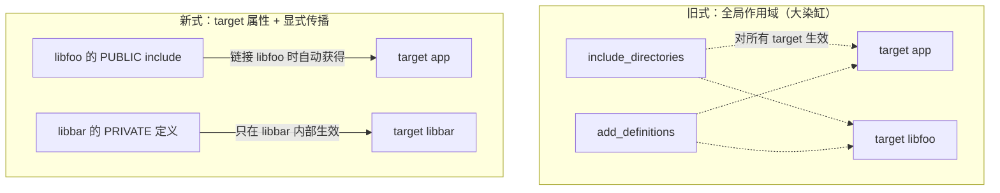
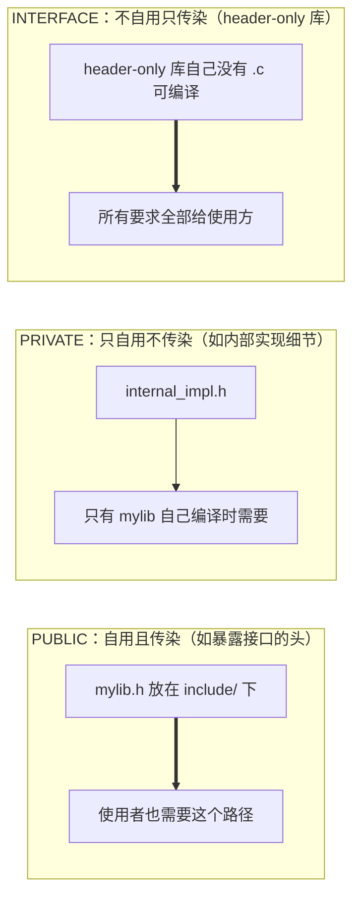

# CMake 深入：现代 target-based 构建体系

## 章节概述

CMake 本身不是编译器，而是**构建系统生成器**——它把 `CMakeLists.txt` 翻译成平台对应的构建脚本（Linux 生成 Makefile，Windows 生成 Visual Studio 工程）。本节不讲零散语法，而是围绕现代 CMake 的核心思想展开：**一切围绕 target（目标）**，抛弃全局变量式的旧写法。

> 学习建议：先跑通最后的实战项目，再回头理解每一行命令的语义。CMake 的知识碎片化严重，一个完整可运行的项目是最好的锚点。

与 Java 世界对照：Maven 用 `pom.xml` 描述依赖与构建生命周期，CMake 扮演类似角色但更底层、更自由，参见 [[java/3工程化/01_Maven构建|Maven 构建]]。

---

### 第一节: 为什么抛弃"全局变量式"CMake

---

### 1.1 旧写法的三大痛点

2010 年前后网上流传的 CMake 教程几乎全是这种写法：

```cmake
# 旧式写法（已过时，仅作反面教材）
cmake_minimum_required(VERSION 2.8)
project(demo)

include_directories(/usr/local/include)      # 全局头文件路径
link_directories(/usr/local/lib)             # 全局库搜索路径
add_definitions(-DDEBUG_MODE)                # 全局宏定义
set(CMAKE_CXX_FLAGS "${CMAKE_CXX_FLAGS} -g") # 手动拼编译选项字符串
file(GLOB SOURCES *.c)                       # 通配符收集源文件

add_executable(demo ${SOURCES})
```

这种写法的问题：

1. **污染全局**：`include_directories` 对之后定义的所有 target 生效。A 库需要的头文件路径会泄漏给 B 库，两个库的头文件同名时直接编译错误。
2. **依赖关系靠猜**：`target_link_libraries(app foo)` 之后，`app` 到底继承了什么编译条件？没人说得清，全凭开发者脑内模拟。
3. **无法复用**：第三方库安装后如何让使用方正确链接？旧式做法只能写文档让人手动 `include_directories`，十个人能配错八次。

---

### 1.2 现代写法：一切皆 target

现代 CMake（3.x 起，推荐 3.16+）的核心原则：

- **每个属性都挂在 target 上**，而不是全局作用域；
- **依赖即传播**：`target_link_libraries` 不只是"链接一个库"，而是把对方的全部使用要求（头文件路径、宏、编译选项）自动传播过来；
- **不手拼 flags**：用 `target_compile_options`/`target_compile_definitions` 等语义化命令；
- **不用 file(GLOB)**：源文件是显式列出的，新增文件必须重新 configure，避免增量构建漏编。



一句话总结：**旧式 CMake 问"全局有哪些配置"，新式 CMake 问"这个 target 需要什么"。**

---

### 第二节: 骨架三件套与最小工程

---

### 2.1 最小可运行骨架

```cmake
# CMakeLists.txt —— 每个"源码目录"一份，从根目录开始递归处理
cmake_minimum_required(VERSION 3.16)   # 声明最低版本，决定策略行为，必须写在最前
project(hello_c
    VERSION 1.0.0                      # 项目版本号，对应变量 PROJECT_VERSION
    DESCRIPTION "hello in modern cmake"
    LANGUAGES C                        # 只启用 C 编译器，C++ 项目写 CXX
)

add_executable(hello main.c)           # 声明一个可执行文件 target，由 main.c 编出
```

三个要点：

1. `cmake_minimum_required` 必须是第一条命令，它影响 CMake 行为兼容性策略；
2. `project()` 不是可有可无的注释性声明——它初始化编译器检测和大量内部变量；
3. `LANGUAGES C` 能显著加快首次 configure（跳过无关编译器探测）。

### 2.2 标准构建流程

```bash
# 推荐使用构建目录与源码目录分离（out-of-source build）
cmake -B build -S .          # -S 源码目录, -B 构建目录：configure 阶段
cmake --build build          # 实际编译，等价于进入 build 目录执行 make
./build/hello                # 运行产物
```

`build/` 目录可以随时整体删除重建，这就是 out-of-source 的好处：源码树永远干净。

---

### 第三节: 三种传播方向 PRIVATE / PUBLIC / INTERFACE

---

### 3.1 使用要求（Usage Requirements）

现代 CMake 中，链接一个 target 会传播两类信息：

- **自身需要**：编译我自己时要用的头文件路径、宏；
- **使用方需要**：别人链接我时也要用的东西。

三种关键字精确控制"要不要传染给别人"：

| 关键字 | 自己编译 | 自己链接 | 使用方编译 | 使用方链接 |
|--------|---------|---------|-----------|-----------|
| `PRIVATE` | 需要 | 需要 | 不传播 | 不传播 |
| `PUBLIC` | 需要 | 需要 | **传播** | **传播** |
| `INTERFACE` | 不需要 | 不需要 | **传播** | **传播** |

### 3.2 传播方向图解



### 3.3 判断口诀

- 头文件出现在**我导出的公开头**里 → `PUBLIC`；
- 头文件只出现在 `.c` 内部实现里 → `PRIVATE`；
- 我根本没有源文件（纯头文件库）→ `INTERFACE`。

```cmake
# libmath 的 CMakeLists.txt 示例片段
add_library(math STATIC src/add.c src/mul.c)

target_include_directories(math
    PUBLIC  ${CMAKE_CURRENT_SOURCE_DIR}/include   # math.h 在公开头中被 #include，必须传播
    PRIVATE ${CMAKE_CURRENT_SOURCE_DIR}/src       # internal.h 只在实现中用，不外泄
)

target_compile_definitions(math PRIVATE MATH_INTERNAL=1)  # 内部调试宏不传染

target_link_libraries(math PUBLIC m)  # 链接 libm；若 math.h 用到了数学函数声明也应 PUBLIC
```

常见错误：把所有东西都写成 PUBLIC。后果是依赖链上的编译定义互相覆盖、头文件路径层层叠加，最终回到"大染缸"时代。

---

### 第四节: find_package 引入系统依赖

---

### 4.1 工作机制

`find_package(OpenSSL)` 并不是去下载 OpenSSL，而是在**本机已安装的位置搜索**，成功后加载 `FindOpenSSL.cmake` 模块或 OpenSSL 自带的配置文件，创建 **imported target**（如 `OpenSSL::SSL`）。找不到时报 configure 错误，提示用户先安装。

```bash
# Debian/Ubuntu 安装开发包（含头文件）
sudo apt install libssl-dev
```

```cmake
# 在 CMakeLists.txt 中查找 OpenSSL，REQUIRED 表示找不到直接报错终止
find_package(OpenSSL REQUIRED)

add_executable(tls_client tls_client.c)

# 链接 imported target：头文件路径、宏、附加库全部自动就位
target_link_libraries(tls_client PRIVATE OpenSSL::SSL)
```

注意链接的是 `OpenSSL::SSL` 这种**带命名空间的 target 名**，而不是裸的 `-lssl`。前者自带元数据（比如 Windows 下还自动补 `OpenSSL::Crypto`），后者退回原始模式。

### 4.2 常见 find_package 一览

| 包 | 目标名 | Linux 开发包 |
|----|--------|-------------|
| OpenSSL | `OpenSSL::SSL` `OpenSSL::Crypto` | libssl-dev |
| zlib | `ZLIB::ZLIB` | zlib1g-dev |
| pthread | `Threads::Threads` | 无需（libc 自带） |
| CURL | `CURL::libcurl` | libcurl4-openssl-dev |

pthread 是特例，需要先 `find_package(Threads REQUIRED)`，这也是多线程程序的标准接入方式。

---

### 第五节: FetchContent 自动下载依赖

---

### 5.1 从"手动装库"到"拉包即用"

`find_package` 的痛点是依赖**必须预先装好**——换一台机器就要重装一遍。Java 开发者早已习惯 Maven 中央仓库：改一行 `pom.xml`，构建时自动下载。CMake 的 `FetchContent` 提供了类似体验：**configure 阶段自动 clone 源码并纳入本次构建**。

```cmake
include(FetchContent)   # CMake 3.11+ 内置模块

FetchContent_Declare(
    cjson
    GIT_REPOSITORY https://github.com/DaveGamble/cJSON.git
    GIT_TAG        v1.7.18        # 锁定 tag：保证所有人拉到同一份代码
)
FetchContent_MakeAvailable(cjson)   # 下载并 add_subdirectory 进来

add_executable(json_demo json_demo.c)
target_link_libraries(json_demo PRIVATE cjson)   # 直接当普通 target 用
```

体验对比：

| 维度 | Maven | FetchContent |
|------|-------|--------------|
| 依赖描述 | pom.xml 单文件 | CMakeLists.txt 内嵌 |
| 下载物 | 二进制 jar | **源码**（本地参与编译） |
| 版本锁定 | pom 坐标+版本 | GIT_TAG |
| 私服 | Nexus/Artifactory 常态 | 需自行镜像仓库地址 |
| 速度 | 快（二进制缓存） | 首次较慢（clone 全仓库） |

FetchContent 更接近 Maven 的"源码 shade 进来"而非纯依赖管理。大型项目应配合缓存目录（`FETCHCONTENT_BASE_DIR`）避免重复下载。

---

### 第六节: add_library 与 install/export

---

### 6.1 三种库形态

```cmake
add_library(mylib STATIC src/a.c)   # 静态库 libmylib.a，链入使用者
add_library(mylib SHARED src/a.c)   # 动态库 libmylib.so，运行期加载
add_library(mylib INTERFACE)        # 纯头文件库，无需编译任何东西
```

选择依据：静态库部署简单（单文件产物）、启动快；动态库节省内存、可独立升级，但要处理好 ABI 兼容。初学阶段发布独立库优先 STATIC。

### 6.2 install 规则

```cmake
install(TARGETS mylib
    ARCHIVE DESTINATION lib           # 静态库装到 <prefix>/lib
    LIBRARY DESTINATION lib           # 动态库装到 <prefix>/lib
)
install(DIRECTORY include/ DESTINATION include)   # 公开头文件整体拷贝
install(EXPORT mylibTargets
    FILE mylibTargets.cmake
    NAMESPACE mylib::                 # 导出名带命名空间：mylib::mylib
    DESTINATION lib/cmake/mylib
)
```

执行 `cmake --install build --prefix /tmp/myinstall` 后，使用方就能对安装结果再次 `find_package(mylib)`。`EXPORT` 生成的 targets 文件记录了 target 元数据，这正是现代 CMake 生态互相咬合的关键齿轮。

---

### 第七节: CTest 测试集成

---

```cmake
enable_testing()                          # 打开测试开关，必须在根 CMakeLists 调用
add_subdirectory(tests)
```

tests/CMakeLists.txt：

```cmake
add_executable(test_hash test_hash.c)     # 一个断言式测试程序
target_link_libraries(test_hash PRIVATE mylib)

add_test(NAME hash_basic COMMAND test_hash)              # 注册为一条测试用例
add_test(NAME hash_stress COMMAND test_hash stress)      # 可传参区分场景
set_tests_properties(hash_stress PROPERTIES TIMEOUT 30)  # 设置超时保护
```

```bash
ctest --test-dir build          # 运行全部测试
ctest --test-dir build -R hash  # 按名字过滤
ctest --test-dir build --output-on-failure   # 失败时打印完整输出
```

CTest 与 CI 天然契合：GitHub Actions 里一句 `ctest --test-dir build --output-on-failure` 即完成回归验证，退出码非零则流水线失败。

---

### 第八节: Debug / Release 与构建类型

---

`CMAKE_BUILD_TYPE` 决定优化级别和调试信息，单配置生成器（Makefile/Ninja）下在 configure 阶段指定：

| 类型 | 典型 flags | 用途 |
|------|-----------|------|
| `Debug` | `-g`（GCC 默认追加 `-O0`） | 日常开发、调试 |
| `Release` | `-O3 -DNDEBUG` | 发布性能版，去掉 assert |
| `RelWithDebInfo` | `-O2 -g -DNDEBUG` | 性能版但保留符号，线上排障首选 |
| `MinSizeRel` | `-Os -DNDEBUG` | 嵌入式/体积敏感 |

```bash
cmake -B build-debug -DCMAKE_BUILD_TYPE=Debug
cmake -B build-release -DCMAKE_BUILD_TYPE=Release
```

实践约定：**不要在自己的 CMakeLists 里硬编码默认优化级别**，交给 `CMAKE_BUILD_TYPE`；确需默认值时用 `if(NOT CMAKE_BUILD_TYPE)` 兜底设为 Release。`-DNDEBUG` 会让 `assert()` 失效，这是 Release 下 assert "消失"的原因。

---

### 第九节: 常用变量速查表

---

| 变量 | 含义 |
|------|------|
| `PROJECT_SOURCE_DIR` | 最近一次 project() 所在的源码目录 |
| `CMAKE_CURRENT_SOURCE_DIR` | 当前正在处理的 CMakeLists.txt 所在目录 |
| `CMAKE_CURRENT_BINARY_DIR` | 当前 target 对应的构建输出目录 |
| `CMAKE_BUILD_TYPE` | 构建类型 Debug/Release 等 |
| `CMAKE_INSTALL_PREFIX` | install 的根前缀，默认 /usr/local |
| `CMAKE_C_COMPILER` | 使用的 C 编译器 |
| `CMAKE_EXPORT_COMPILE_COMMANDS` | 导出 compile_commands.json 供编辑器用 |

经验法则：引用**源码内路径**一律基于 `CMAKE_CURRENT_SOURCE_DIR` 相对定位，绝不写绝对路径。

### 与 Maven 的概念映射表

| 概念 | Maven | 现代 CMake |
|------|-------|-----------|
| 构建脚本 | pom.xml | CMakeLists.txt |
| 依赖坐标 | groupId:artifactId | find_package / FetchContent 名 |
| 依赖范围 scope | compile/test/provided | PUBLIC/PRIVATE/INTERFACE |
| 多模块 | `<modules>` 聚合 | add_subdirectory 树 |
| 单测框架 | JUnit + surefire | 任意框架 + CTest |
| 打包发布 | mvn deploy | CPack / install+export |

---

## 第十节: 实战 —— lib + app 双目录项目从零到 install

---

### 10.1 目录结构（嵌套列表表示）

- mystack/
  - CMakeLists.txt （根：项目元信息 + enable_testing）
  - lib/
    - CMakeLists.txt （静态库 target + install/export）
    - include/
      - mystack.h （公开 API 头）
    - src/
      - stack.c （内部实现）
  - tests/
    - CMakeLists.txt （CTest 用例注册）
    - test_stack.c
  - apps/
    - CMakeLists.txt （可执行 demo）
    - main.c

### 10.2 根 CMakeLists.txt

```cmake
cmake_minimum_required(VERSION 3.16)
project(mystack VERSION 1.0.0 LANGUAGES C)

# 库目标：子目录负责定义 target，这里只做聚合
add_subdirectory(lib)

# 测试开关：放在 add_subdirectory(tests) 之前
enable_testing()
add_subdirectory(tests)

# 应用程序
add_subdirectory(apps)

# 安装规则也统一放根部，便于一处查看
install(TARGETS mystack_lib
    ARCHIVE DESTINATION lib
)
install(DIRECTORY lib/include/ DESTINATION include)
```

### 10.3 lib/CMakeLists.txt

```cmake
add_library(mystack_lib STATIC src/stack.c)

target_include_directories(mystack_lib
    PUBLIC  ${CMAKE_CURRENT_SOURCE_DIR}/include   # mystack.h 属于公开 API
)

target_compile_features(mystack_lib PUBLIC c_std_11)  # 要求使用者也有 C11 环境
```

### 10.4 apps/main.c 与 tests

```c
// apps/main.c —— 使用方视角：只认 mystack.h，不知道内部结构
#include <stdio.h>
#include "mystack.h"

int main(void) {
    Stack s;
    stack_init(&s);
    for (int i = 1; i <= 5; i++) {
        stack_push(&s, i * i);          // 入栈 1,4,9,16,25
    }
    int v;
    while (stack_pop(&s, &v)) {
        printf("%d ", v);               // 期望输出 25 16 9 4 1
    }
    printf("\n");
    return 0;
}
```

```c
// tests/test_stack.c —— 断言式最小测试，返回非零即失败
#include <assert.h>
#include "mystack.h"

int main(void) {
    Stack s;
    stack_init(&s);
    assert(stack_is_empty(&s));         // 新栈应为空

    stack_push(&s, 42);
    int v = 0;
    assert(stack_pop(&s, &v));
    assert(v == 42);                    // 后进先出
    assert(!stack_pop(&s, &v));         // 空栈 pop 应失败
    return 0;
}
```

```cmake
# tests/CMakeLists.txt
add_executable(test_stack test_stack.c)
target_link_libraries(test_stack PRIVATE mystack_lib)
add_test(NAME stack_core COMMAND test_stack)
```

### 10.5 全流程验证

```bash
cmake -B build -DCMAKE_BUILD_TYPE=Debug
cmake --build build
ctest --test-dir build --output-on-failure   # 全绿后安装
cmake --install build --prefix /tmp/mystack-install
# /tmp/mystack-install/lib/libmystack.a 与 include/mystack.h 就位
```

---

## 小结

- 现代 CMake 的灵魂是 target-based：属性挂在 target 上，依赖通过 PUBLIC/PRIVATE/INTERFACE 显式传播；
- find_package 用本机已装库，FetchContent 自动拉源码，二者覆盖不同交付形态；
- install + export 让你的库成为生态的一等公民，被下游 find_package 消费；
- CTest 让测试成为构建的一部分，Debug/Release 由 CMAKE_BUILD_TYPE 统一管控；
- 心智模型上它对应 Java 的 Maven，但更贴近编译细节，参见 [[java/3工程化/01_Maven构建|Maven 构建]] 对照学习。

下一章我们把这套构建升级为完整的开源级工程规范：[[c语言教程/4工程化/02_C项目工程化|C 项目工程化]]。
