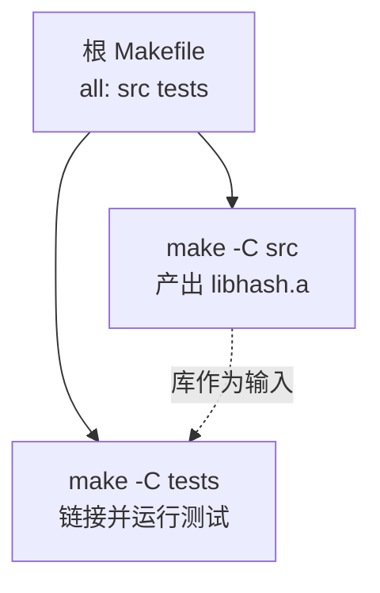

# C 项目工程化：从源码文件到可发布开源库

## 章节概述

会写 C 代码和会做 C 工程是两回事。本章把散落的工程技能串成一条完整流水线：**标准目录结构 → Makefile 进阶 → 头文件规范 → 版本管理 → 静态分析 → 格式化 → CI → 打包发布 → 文档生成**，最后用实战把 [[c语言教程/3数据结构/05_哈希表|哈希表]] 改造成一个可发布的独立库。

> 前置知识：建议先读 [[c语言教程/4工程化/01_CMake深入|CMake 深入]] 了解构建体系全貌；本章以 Makefile 为主线（很多老牌 C 项目如 redis/sqlite 仍以 Makefile 为入口），CMake 作为补充。

---

### 第一节: 开源 C 项目的标准目录结构

---

### 1.1 目录职责（嵌套列表表示）

- project-root/
  - src/ （核心实现代码，每个 .c 文件对应一个功能模块）
    - hash.c
    - util.c
  - include/ （对外公开头文件，安装时整体拷贝；内部头放 src/ 不导出）
    - hash.h
  - tests/ （单元测试，每个模块一个 test_*.c）
    - test_hash.c
  - docs/ （设计文档、doxygen 生成的 API 手册输出目录）
  - bin/ （构建产物可执行文件，gitignore 掉）
  - build/ （构建中间目录，gitignore 掉）
  - examples/ （使用示例，比文档更能说明 API 用法）
  - Makefile （构建入口，支持 make / make test / make install）
  - README.md
  - LICENSE
  - .clang-format （格式化配置）
  - .github/workflows/ci.yml （CI 流水线）

### 1.2 三条铁律

1. **src 与 include 分离**：公开头进 `include/`，私有头留在 `src/`，从物理结构上强制 API 边界；
2. **构建产物不进版本库**：`bin/`、`build/`、`*.o`、`*.a` 全部写入 `.gitignore`；
3. **tests 独立成目录**：测试与被测代码同权，CI 里一等公民对待。

对比 Linux 内核、redis、curl 的仓库布局会发现它们都遵循这套约定——目录结构本身就是文档。

---

### 第二节: Makefile 进阶

---

### 2.1 变量与惯用命名

```makefile
# ===== 基础变量区 =====
CC      := gcc                    # := 立即展开赋值；= 是递归展开（用到才算）
CFLAGS  ?= -Wall -Wextra -std=c11 # ?= 未定义时才赋值，允许命令行覆盖
LDFLAGS := -lpthread
BUILD   := build                  # 中间产物统一收口到 build/
SRCS    := $(wildcard src/*.c)    # 收集所有源文件
OBJS    := $(SRCS:src/%.c=$(BUILD)/%.o)   # 替换引用：src/x.c -> build/x.o
TARGET  := $(BUILD)/libhash.a     # 最终产物：静态库
```

四种赋值符速记：

| 符号 | 语义 | 场景 |
|------|------|------|
| `=` | 递归展开（延迟求值） | 引用后定义的变量 |
| `:=` | 立即展开 | 性能敏感、避免无限递归 |
| `?=` | 空则赋值 | 可被环境变量覆盖的默认值 |
| `+=` | 追加 | 多处累积 flags |

### 2.2 模式规则与自动变量

```makefile
# 模式规则：% 是通配 stem。所有 build/*.o 都按此规则生成，无需逐个写
$(BUILD)/%.o: src/%.c
	@mkdir -p $(dir $@)
	$(CC) $(CFLAGS) -c $< -o $@        # $< 第一个依赖(即 src/%.c) $@ 目标文件

$(TARGET): $(OBJS)
	ar rcs $@ $^                        # $^ 全部依赖(去重)  rcs=替换+创建+索引
```

自动变量五件套：

- `$@` 当前规则的目标文件名；
- `$<` 第一个前置依赖（模式规则中就是那个 `.c`）;
- `$^` 所有前置依赖（已去重、空格分隔）；
- `$*` 模式匹配到的 stem（不含扩展名部分）；
- `$(@D)` 目标所在目录。

### 2.3 伪目标与常用入口

```makefile
.PHONY: all clean test install format check
# .PHONY 声明这些名字不是真实文件：防止同名文件存在导致 make 拒绝执行，
# 同时允许并行 make 时各伪目标正确调度

all: $(TARGET)                          # 默认目标必须放在第一条规则位置

clean:
	rm -rf $(BUILD)

test: $(TARGET)
	$(CC) $(CFLAGS) tests/test_hash.c -Iinclude $(TARGET) -o $(BUILD)/test_hash
	./$(BUILD)/test_hash

install: $(TARGET)
	install -d $(PREFIX)/include $(PREFIX)/lib   # PREFIX 可覆盖，默认见下
	install include/hash.h $(PREFIX)/include/
	install $(TARGET) $(PREFIX)/lib/

PREFIX ?= /usr/local
```

### 2.4 子目录递归 make

项目变大后按模块拆分 Makefile，根目录只负责下钻：

```makefile
# 根 Makefile
SUBDIRS = src tests examples

.PHONY: all $(SUBDIRS)
all: $(SUBDIRS)

$(SUBDIRS):
	$(MAKE) -C $@          # -C 切到子目录再执行其 Makefile
```



注意：递归 make 的缺点是子构建间依赖关系表达弱（需要靠顺序声明保证），大型新项目更倾向单一非递归 Makefile 或直接用 CMake。

---

### 第三节: 头文件规范

---

### 3.1 Include Guard vs #pragma once

```c
// 方式一：经典 Include Guard（唯一标准，所有编译器支持）
#ifndef MYLIB_HASH_H       // 名字规范：<项目>_<路径>_<文件>_H，全局唯一
#define MYLIB_HASH_H

size_t hash_djb2(const char *key);

#endif /* MYLIB_HASH_H */
```

```c
// 方式二：编译器扩展（MSVC/GCC/Clang 均支持，但非 ISO C 标准）
#pragma once
```

| 维度 | Include Guard | #pragma once |
|------|---------------|--------------|
| 标准性 | C89 起标准 | 编译器扩展 |
| 出错方式 | 宏名撞车（低概率） | 文件多路径/软链时可能重复包含或漏保护 |
| 维护成本 | 改文件名要同步改宏 | 零维护 |

工程建议：**对外发布的头文件用 Include Guard**，团队内部代码可用 `#pragma once` 换取省事。

### 3.2 最小包含原则

头文件里只 `#include` **接口所需**的头，实现所需的一律放进 `.c`：

```c
// hash.h —— 只需要 size_t，所以只包含 stddef.h
#include <stddef.h>
typedef struct HashMap HashMap;          // 不透明指针：连结构体定义都不暴露
HashMap *hash_create(void);
void     hash_destroy(HashMap *m);
```

收益：编译防火墙——修改内部实现不会引发下游重新编译；同时缩短了每个翻译单元的依赖链。配合**不透明指针**（opaque pointer）手法，还能把 struct 细节完全藏进 .c，这是 C 语言实现信息隐藏的标准姿势。

---

### 第四节: 版本管理：语义化版本 + git tag

---

语义化版本 `MAJOR.MINOR.PATCH`：

- MAJOR：破坏性变更（删函数、改签名、改行为）；
- MINOR：向后兼容的新增；
- PATCH：纯 bug 修复。

```bash
git tag -a v1.0.0 -m "首个稳定版" && git push origin v1.0.0   # 附注标签
git tag -l "v*"                                               # 列出全部版本
```

发布纪律：tag 一旦推送不可移动；MAJOR >= 1 后才承诺兼容性；CHANGELOG.md 按 Keep a Changelog 格式记录每个版本的变更条目。下游用户看到 `v2.3.1` 就能立刻判断能否安全升级。

---

### 第五节: 静态分析与格式化

---

### 5.1 cppcheck 与 clang-tidy

```bash
cppcheck --enable=all --error-exitcode=1 \
         -Iinclude src/            # 发现问题让退出码非零，方便接 CI
```

```bash
clang-tidy src/hash.c -- -Iinclude -std=c11
# 常用检查：bugprone-* clang-analyzer-* readability-* modernize-*
```

两者分工：cppcheck 零配置开箱即用，抓空指针解引用、内存泄漏、越界这类硬伤；clang-tidy 基于 AST 能力更强（含 Clang Static Analyzer 全套检查器），但需要编译数据库（`compile_commands.json`）才能精确分析。

### 5.2 clang-format 统一代码风格

```yaml
# .clang-format —— 提交进仓库，全团队风格自动一致
BasedOnStyle: LLVM           # 以内置风格为底
IndentWidth: 4               # 缩进 4 空格
ColumnLimit: 100             # 行宽上限
PointerAlignment: Right      # char *p 星号贴变量
AllowShortFunctionsOnASingleLine: None
SortIncludes: CaseSensitive
```

```bash
clang-format -i src/*.c include/*.h    # -i 原地修改
```

争论缩进用几个空格是浪费生命，配置一次然后让机器裁决。

---

### 第六节: GitHub Actions CI 实战

---

`.github/workflows/ci.yml`，一条流水线完成编译、测试、sanitizer 三件事：

```yaml
name: ci
on: [push, pull_request]

jobs:
  build-test:
    runs-on: ubuntu-latest
    steps:
      - uses: actions/checkout@v4

      - name: 编译并运行测试
        run: |
          make clean all
          make test

      - name: AddressSanitizer 内存检测
        run: |
          gcc -fsanitize=address,undefined -g -Wall -Wextra \
              -Iinclude tests/test_hash.c src/*.c -o build/test_asan
          ./build/test_asan          # 有越界/UAF/泄漏会在此步报错失败

      - name: 静态分析
        run: |
          sudo apt-get install -y cppcheck
          cppcheck --enable=warning --error-exitcode=1 -Iinclude src/
```

sanitizer 说明：`-fsanitize=address` 抓堆越界、use-after-free、double-free 和泄漏；`-fsanitize=undefined` 抓有符号溢出、移位越界等未定义行为。二者运行时开销约 2x/1.x，只在 CI 与调试开启，发布版绝不带。这一步能拦截绝大多数内存类 bug 于合入之前。

---

### 第七节: 发布打包 tarball + SHA256

---

```bash
VERSION=1.0.0
git archive --format=tar.gz --prefix="myhash-${VERSION}/" \
    -o "myhash-${VERSION}.tar.gz" v${VERSION}   # 从 tag 导出干净源码包

sha256sum myhash-${VERSION}.tar.gz > myhash-${VERSION}.tar.gz.sha256

# 使用者校验完整性：
sha256sum -c myhash-${VERSION}.tar.gz.sha256
```

要点：

1. 用 `git archive` 而非打包工作目录，避免混入未提交文件和 `.git`；
2. `--prefix` 让解压后得到带版本号的顶层目录，防止"解包炸弹";
3. SHA256 校验文件随发布件一起分发，用户下载后先验签再用。

---

### 第八节: Doxygen 注释与文档生成

---

Doxygen 解析特定格式的注释自动产出 HTML/PDF API 手册：

```c
/**
 * @brief  向哈希表插入键值对（键会被复制）。
 *
 * @param  map    目标哈希表，不允许为 NULL。
 * @param  key    以 NUL 结尾的字符串键。
 * @param  value  整型值。
 * @return 成功返回 true；内存分配失败返回 false。
 *
 * @note   若键已存在则更新其值。
 */
bool hash_put(HashMap *map, const char *key, int value);
```

```bash
sudo apt install doxygen graphviz   # graphviz 供调用图使用
doxygen -g Doxyfile                 # 生成默认配置
# Doxyfile 关键项：PROJECT_NAME、INPUT=src include、RECURSIVE=YES、EXTRACT_ALL=YES
doxygen Doxyfile                    # 输出 html/index.html
```

纪律：注释写在头文件的声明处（使用者看的地方），`.c` 里只留实现说明。

---

## 第九节: 实战 —— 把哈希表改造成可发布独立库

---

目标：将 [[c语言教程/3数据结构/05_哈希表|哈希表]] 的实现整理为 `libmyhash`，全套工程化设施齐备。

### 9.1 目录落地

- myhash/
  - include/myhash.h （公开 API：Include Guard + 最小包含 + 不透明类型）
  - src/hash.c （DJB2/put/get/remove/rehash 实现）
  - src/util.c （strdup 兼容封装等工具函数）
  - tests/test_hash.c （断言式测试）
  - Makefile
  - .clang-format
  - .github/workflows/ci.yml
  - README.md LICENSE

### 9.2 公开头文件 include/myhash.h

```c
#ifndef MYHASH_HASH_H
#define MYHASH_HASH_H          /* 经典 Include Guard，宏名含项目前缀 */

#include <stdbool.h>
#include <stddef.h>

#ifdef __cplusplus
extern "C" {                   /* 允许 C++ 项目直接链接本库 */
#endif

/* 不透明句柄：结构体定义藏在 src/hash.c，使用方只能通过函数操作 */
typedef struct HashMap HashMap;

HashMap *hash_create(size_t initial_capacity);   /* 创建指定初始容量的表 */
void     hash_destroy(HashMap *map);             /* 释放全部节点与表本身 */
bool     hash_put(HashMap *map, const char *key, int value);
bool     hash_get(const HashMap *map, const char *key, int *out_value);
bool     hash_remove(HashMap *map, const char *key);
size_t   hash_size(const HashMap *map);

#ifdef __cplusplus
}
#endif
#endif /* MYHASH_HASH_H */
```

相比教程原版的三点改造：结构体改为不透明句柄隐藏细节；API 加 `extern "C"` 支持 C++ 互操作；错误通道统一为 bool 返回值。

### 9.3 Makefile（整合本章全部技巧）

```makefile
CC      := gcc
CFLAGS  ?= -Wall -Wextra -Werror -std=c11 -O2
BUILD   := build
SRCS    := $(wildcard src/*.c)
OBJS    := $(SRCS:src/%.c=$(BUILD)/%.o)
LIB     := $(BUILD)/libmyhash.a
PREFIX  ?= /usr/local

.PHONY: all clean test check format install dist

all: $(LIB)

$(BUILD)/%.o: src/%.c include/myhash.h     # 显式声明头依赖，改头必重编
	@mkdir -p $(dir $@)
	$(CC) $(CFLAGS) -Iinclude -c $< -o $@

$(LIB): $(OBJS)
	ar rcs $@ $^

test: $(LIB)
	$(CC) $(CFLAGS) -Iinclude tests/test_hash.c $(LIB) -o $(BUILD)/test_hash
	./$(BUILD)/test_hash

check:                                     # 静态分析入口
	cppcheck --enable=warning --error-exitcode=1 -Iinclude src/

format:
	clang-format -i src/*.c include/*.h tests/*.c

install: $(LIB)
	install -d $(DESTDIR)$(PREFIX)/include $(DESTDIR)$(PREFIX)/lib
	install -m 644 include/myhash.h $(DESTDIR)$(PREFIX)/include/
	install -m 644 $(LIB) $(DESTDIR)$(PREFIX)/lib/

dist:                                      # 从 git tag 导出发布包并生成校验
	git archive --format=tar.gz --prefix=myhash-$$(git describe --tags)/ \
	    -o myhash.tar.gz HEAD
	sha256sum myhash.tar.gz > myhash.tar.gz.sha256

clean:
	rm -rf $(BUILD)
```

### 9.4 测试文件骨架

```c
// tests/test_hash.c —— 断言失败即进程非零退出，天然对接任何 CI
#include <assert.h>
#include <string.h>
#include "myhash.h"

int main(void) {
    HashMap *m = hash_create(16);
    assert(m != NULL);

    assert(hash_put(m, "apple", 1));       // 新增成功
    int v = 0;
    assert(hash_get(m, "apple", &v) && v == 1);

    assert(hash_put(m, "apple", 100));     // 同键更新
    assert(hash_get(m, "apple", &v) && v == 100);

    for (int i = 0; i < 200; i++) {        // 大量插入触发 rehash 路径
        char key[32];
        snprintf(key, sizeof(key), "k%d", i);
        assert(hash_put(m, key, i));
    }
    assert(hash_size(m) == 201);

    assert(hash_remove(m, "apple"));       // 删除后不可查
    assert(!hash_get(m, "apple", &v));

    hash_destroy(m);                       // ASan 下无泄漏即通过
    return 0;
}
```

### 9.5 发布验证清单

```bash
make clean all test check     # 本地全绿
git tag -a v1.0.0 -m "release" && git push origin v1.0.0
make dist                     # 得到 myhash-1.0.0.tar.gz 与 .sha256
```

至此，这个只有几百行代码的哈希表库具备了与知名开源 C 库同构的工程外壳：标准目录、一键构建、CI 门禁、内存安全检测、版本化发布、API 文档。

---

## 小结

- 目录结构即架构：src/include/tests/docs/bin 各司其职，产物永不入库；
- Makefile 进阶三板斧：模式规则消灭重复、自动变量 `$@ $< $^` 简化命令、`.PHONY` 保证伪目标可靠；
- 头文件是 API 合同：Include Guard 防重入，最小包含 + 不透明指针建立编译防火墙；
- 语义化版本 + git tag 给下游稳定预期；cppcheck/clang-tidy/sanitizer 在 CI 里当门神；
- `git archive` + SHA256 是最小可行的发布方案，Doxygen 补齐文档闭环。

想用更现代的构建系统管理同类项目，回到 [[c语言教程/4工程化/01_CMake深入|CMake 深入]] 即可将本章实战平移过去。
