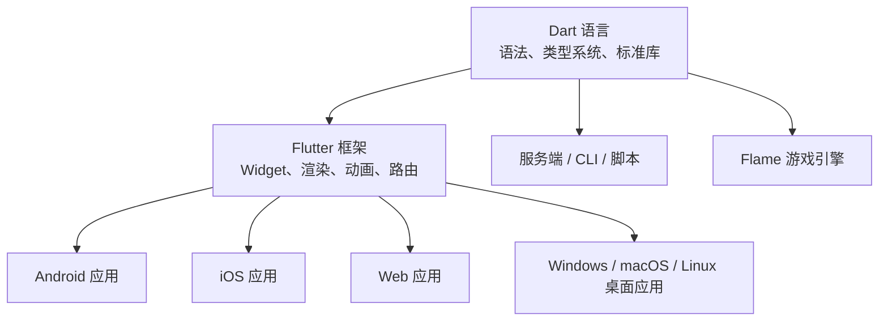
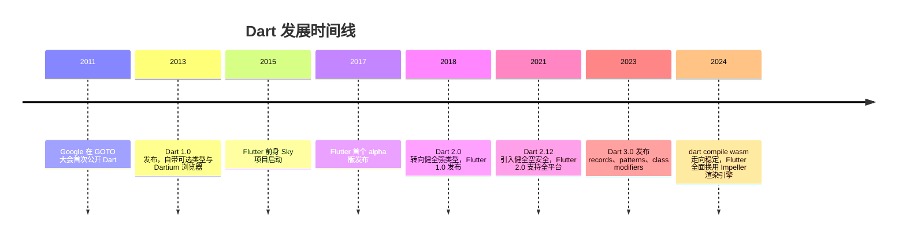
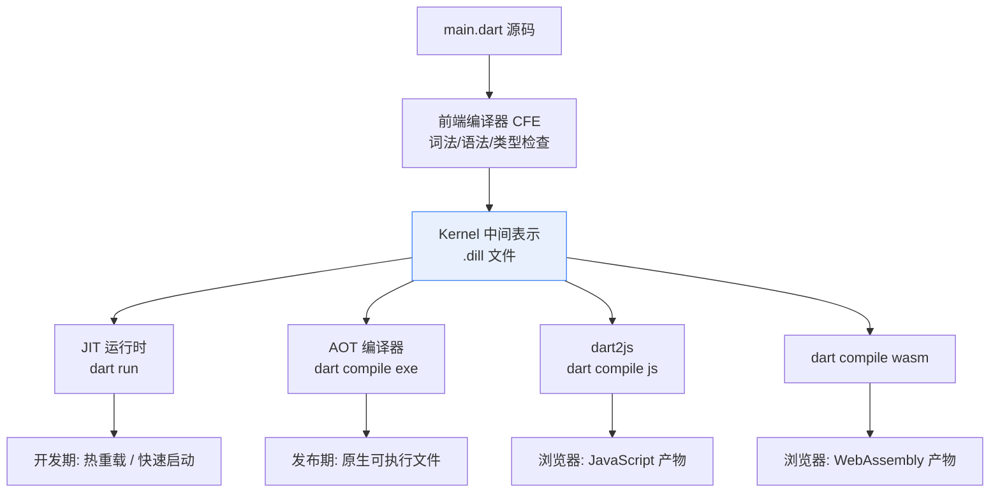
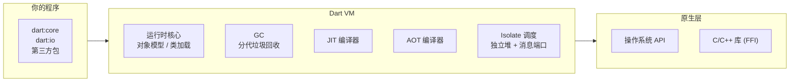
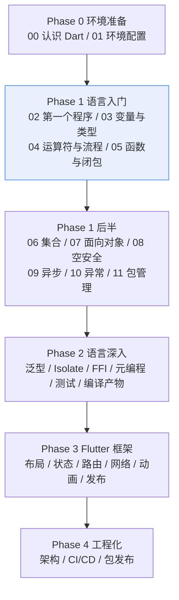

# 00 认识 Dart

> 在写第一行 Dart 代码之前，先回答三个问题：Dart 是什么、它为什么存在、它和 C 有什么根本不同。本章不要求你安装任何工具，目标是在脑中建立一张地图——知道这门语言从哪里来、适合做什么、接下来该怎么学。地图对了，后面的每一章都会落在正确的位置上。

---

## 一、Dart 是什么

### 1.1 一句话定义

Dart 是 Google 于 2011 年发布的一门**面向对象、静态类型、兼具 JIT 与 AOT 两种运行模式**的编程语言。用一句话概括它的现状：

**Dart 是为 UI 而生的语言，也是 Flutter 框架唯一的官方开发语言。**

这句话不是营销口号，而是理解 Dart 全部设计取舍的钥匙：Dart 的每一个语法特性，几乎都能追溯到「让开发者更快地写出跨平台界面」这个目标。

### 1.2 关键事实速览

| 项目 | 内容 |
|------|------|
| 诞生 | 2011 年，Google 发布 |
| 1.0 版本 | 2013 年 11 月 |
| 当前主线 | Dart 3.x（本教程基于 Dart 3.x） |
| 类型系统 | 静态类型 + 健全空安全（sound null safety） |
| 内存管理 | 分代 GC，没有 `free`，也不存在悬垂指针 |
| 运行模式 | JIT（开发期）/ AOT（发布期）/ JavaScript / WebAssembly |
| 包管理 | `pub`，配置文件 `pubspec.yaml`，仓库 pub.dev |
| 主要用途 | Flutter 跨平台 UI、命令行工具、服务端、云函数 |
| 官方站点 | [dart.dev](https://dart.dev/) |

### 1.3 Dart 与 Flutter 的关系

初学者最容易混淆的一对概念。用一张图说清：



- **Dart 是语言**，Flutter 是用 Dart 写的 UI 框架
- 学 Flutter 之前必须先掌握 Dart 语法与异步模型，否则会在 `Future`、`Stream`、状态管理面前寸步难行
- 反过来，不学 Flutter 也能用 Dart 写 CLI 工具和服务端程序——本教程前两个阶段完全不依赖 Flutter

---

## 二、发展史时间线

理解一门语言的「黑历史」与转折点，能解释它今天为什么长这样：



几个转折点值得记住：

| 年份 | 事件 | 意义 |
|------|------|------|
| 2011 | Dart 首次公开 | 目标是替代 JavaScript 写大型 Web 应用，早期反响平平 |
| 2013 | Dart 1.0 | 定位仍是 Web 语言，可选类型是妥协产物 |
| 2017 | Flutter alpha | Dart 找到了真正的杀手级应用场景：移动 UI |
| 2018 | Dart 2.0 | 抛弃可选类型，改为健全静态类型，性能与工具链大幅提升 |
| 2021 | 空安全 | `String` 与 `String?` 成为两种类型，空指针在编译期被拦截 |
| 2023 | Dart 3.0 | 模式匹配、记录、类修饰符，语言表达力追平现代语言 |
| 2024+ | Wasm | 除 JS 之外的第二条 Web 编译路径，性能接近原生 |

一句话总结这段历史：**Dart 没有靠「更好的 JavaScript」成功，而是靠「Flutter 的语言」成功**。

---

## 三、设计目标：为 UI 优化的语言

Dart 的三大设计目标与对应机制：

| 设计目标 | 实现机制 | 开发者得到的收益 |
|----------|----------|------------------|
| 迭代要快 | JIT + 热重载（Hot Reload） | 改一行 UI 代码，毫秒级看到效果，应用状态不丢失 |
| 发布要快 | AOT 编译为原生机器码 | 启动快、运行时无解释器开销，性能接近 C++ |
| 写 UI 要顺 | 声明式、响应式语法 | `Widget` 是普通对象，UI 即状态的函数，无需手动操作控件 |
| 跨平台要一致 | 自带渲染引擎（Skia/Impeller） | 同一套代码在各平台像素级一致，不依赖平台原生控件 |
| 大型项目要稳 | 静态类型 + 空安全 + 静态分析 | 大量错误在 `dart analyze` 阶段暴露，而不是上线后 |

其中「热重载」是 Flutter 开发体验的核心竞争力。与 C 的编译流程对比：

| 环节 | C | Dart + Flutter |
|------|---|----------------|
| 修改代码后 | `make` 重新编译链接 | 保存文件，热重载自动注入 |
| 等待时间 | 秒级到分钟级 | 通常小于 1 秒 |
| 应用状态 | 进程重启，状态清零 | 保持当前页面与数据，只替换代码 |
| 底层原理 | 无 | JIT 保留类型信息，增量编译并替换函数入口 |

---

## 四、JIT 与 AOT：两种运行模式

### 4.1 概念对照

- **JIT（Just-In-Time，即时编译）**：程序运行时把热点代码编译成机器码，可以边跑边优化。开发期用它，因为有类型信息和运行时反馈，编译快、支持热重载
- **AOT（Ahead-Of-Time，提前编译）**：构建时一次性编译成目标平台的原生机器码，运行时不带编译器。发布期用它，启动快、体积可控

### 4.2 与 C 对比

| 维度 | C | Dart JIT | Dart AOT |
|------|---|----------|----------|
| 编译时机 | 全部提前（本质是 AOT） | 运行时增量编译 | 构建时全量编译 |
| 开发迭代 | 每次改代码都要重新编译链接 | 热重载，毫秒级 | 不用于开发 |
| 运行性能 | 高 | 中高，热点可优化 | 高，接近 C |
| 启动速度 | 快 | 需要加载 VM 与内核快照 | 快 |
| 典型命令 | `gcc main.c -o main` | `dart run main.dart` | `dart compile exe main.dart` |
| 调试体验 | gdb | 完整调试、热重载 | 可调试但无热重载 |

### 4.3 编译流程全景



关键点：**无论 JIT、AOT 还是 Web，Dart 都先编译到统一的 Kernel 中间表示**。这就是为什么同一条 `dart analyze` 能在所有目标上给出相同诊断，也是 Flutter 热重载能做到毫秒级的架构基础。

### 4.4 两种模式的实际命令

```bash
# 开发：JIT 运行，支持热重载（Flutter 场景）
dart run bin/main.dart

# 发布：AOT 编译为原生可执行文件，无运行时依赖
dart compile exe bin/main.dart -o myapp
./myapp

# 发布：编译为 JavaScript（Web 场景）
dart compile js bin/main.dart -o main.js
```

---

## 五、Dart 能做什么

| 领域 | 代表技术 | 入门方式 | 与 C 的关系 |
|------|----------|----------|-------------|
| 移动应用 | Flutter | `flutter create` | 完全不同的技术栈，但性能目标一致 |
| 桌面应用 | Flutter Desktop | `flutter create --platforms=windows,macos,linux` | 对应 Qt/GTK 的位置 |
| Web 应用 | Flutter Web、Jaspr | `dart compile js` / `dart compile wasm` | 对应 Emscripten 的位置 |
| 服务端 | shelf、dart_frog | `dart create -t server-shelf` | 对应 nginx 模块 / CGI 的位置 |
| 命令行工具 | dart:io、args 包 | `dart create -t console` | 直接对标 C 的 CLI 程序 |
| 云函数 | Google Cloud Functions 等 | 编译为 exe 或部署源码 | 免运维的部署形态 |
| 游戏 | Flame 引擎 | `flutter pub add flame` | 对标 SDL 的位置 |
| 嵌入式/无屏设备 | Dart 嵌入式运行时 | 定制编译 | 对标精简版 libc 程序 |
| 跨语言调用 | dart:ffi | `DynamicLibrary.open` | 反过来调用已有的 C 库 |

结论：**Dart 不是「Flutter 专用语言」，而是「UI 优先的通用语言」**。本教程入门与深入阶段全部使用命令行程序，Flutter 从第三阶段才开始。

---

## 六、Dart VM 运行时架构概览

先建立粗粒度认知，具体机制在「2 深入」阶段展开：



| 组件 | 职责 | 与 C 的对应物 |
|------|------|----------------|
| 运行时核心 | 对象模型、类型检查、类加载 | C 运行时启动代码 crt0 |
| GC | 自动回收不可达对象 | 无，C 靠 `free` 手动管理 |
| JIT 编译器 | 运行时编译与优化 | 无 |
| AOT 编译器 | 生成原生机器码 | gcc/clang 的角色 |
| Isolate | 并发执行单元，堆内存相互隔离 | 类似多进程，不是 pthread |
| FFI | 调用 C 函数、操作原生内存 | 反向的「C 调 Dart」 |

---

## 七、与 C/Java/TypeScript/Kotlin 对比

| 维度 | C | Dart | Java | TypeScript | Kotlin |
|------|---|------|------|------------|--------|
| 类型系统 | 静态、弱类型检查 | 静态、健全空安全 | 静态、可空标注 | 静态、结构化类型 | 静态、健全空安全 |
| 内存管理 | 手动 `malloc/free` | GC | GC + JVM | GC + JS 引擎 | GC + JVM/原生 |
| 编译目标 | 原生机器码 | 原生/JIT/JS/Wasm | 字节码 | JavaScript | 字节码/原生 |
| 启动速度 | 极快 | AOT 快 | JVM 较慢 | 依赖 JS 引擎 | JVM 较慢 |
| 并发模型 | pthread 共享内存 | Isolate 消息传递 | 线程共享内存 | 单线程事件循环 | 协程 + 线程 |
| 空指针风险 | 运行时崩溃 | 编译期拦截 | 运行时 NPE | strict 模式下编译期 | 编译期拦截 |
| 字符串 | `char*` + 终止符 | UTF-16 不可变 `String` | UTF-16 `String` | UTF-16 `string` | UTF-16 `String` |
| 包管理 | 无官方方案 | pub | Maven/Gradle | npm | Gradle |
| 主要场景 | 系统/嵌入式 | 跨平台 UI/CLI | 企业后端/安卓 | Web 前后端 | 安卓/后端 |

选型建议：

- 已有 C 代码资产、要对接硬件或追求极致性能：继续用 C
- 要一套代码覆盖移动 + 桌面 + Web 的界面：Dart + Flutter
- 企业 Java 生态、后端为主：Java/Kotlin
- 纯 Web 前端且团队是 JS 背景：TypeScript

---

## 八、与 C 的哲学差异

### 8.1 内存：malloc/free 与 GC

```c
/* C: 谁申请谁释放，忘记 free 就泄漏，free 两次就崩溃 */
int *p = malloc(sizeof(int) * 100);
if (p == NULL) return -1;
p[0] = 42;
free(p);
p = NULL;
```

```dart
// Dart: 只管 new，回收交给 GC，不存在 free 与悬垂指针
void main() {
  final list = List<int>.filled(100, 0);
  list[0] = 42;
  print(list[0]);   // 42
  // 离开作用域后，list 不可达时由 GC 自动回收
}
```

| 维度 | C | Dart |
|------|---|------|
| 申请 | `malloc` | `List()`、`Map()`、构造函数 |
| 释放 | `free`（必须，且只能一次） | GC 自动，无需干预 |
| 悬垂指针 | 可能，未定义行为 | 不可能，GC 保证对象存活 |
| 内存泄漏 | 忘记 free 必然泄漏 | 只可能因「逻辑上仍被引用」而泄漏 |
| 代价 | 无运行时开销 | 有 GC 暂停与额外内存开销 |

### 8.2 空值：NULL 与可空类型

```c
/* C: 编译器不检查 NULL，运行时才崩溃 */
char *name = get_name();
printf("%zu\n", strlen(name));  /* name 为 NULL 时直接段错误 */
```

```dart
// Dart: 可空性写进类型，编译器强制你处理
String? getName() => null;

void main() {
  final name = getName();
  // print(name.length);      // 编译错误：name 可能为 null
  print(name?.length ?? 0);   // 正确：空感知访问 + 默认值，输出 0
}
```

| 维度 | C | Dart |
|------|---|------|
| 空值表示 | `NULL` 宏，本质是 0 | `null` 关键字 |
| 类型标记 | 无，任何指针都能为 NULL | `String?` 显式标记可空 |
| 检查时机 | 运行时（崩溃时） | 编译期（分析器直接报错） |
| 强制处理 | 无 | 必须 `?.`、`??` 或判空后才能用 |

### 8.3 其他哲学差异总表

| 主题 | C 的哲学 | Dart 的哲学 |
|------|----------|-------------|
| 错误处理 | 返回错误码，调用者自觉检查 | 异常机制，未捕获就崩溃并给栈 |
| 类型转换 | 强制转换即信任程序员 | `as` 转换失败会抛异常，`is` 先检查 |
| 代码组织 | 头文件 + 源文件 + 链接 | 库 + `import`，无头文件 |
| 并发 | 线程共享内存，锁保护 | Isolate 隔离内存，消息通信 |
| 宏 | 预处理器文本替换 | 无宏，用 `const` 与代码生成替代 |

---

## 九、本教程学习路线图



你当前的位置：**Phase 0 第 0 章**。接下来依次是：

| 序号 | 章节 | 内容 |
|:----:|------|------|
| 1 | [[dart/1入门/01_环境配置\|01 环境配置]] | 装 SDK、配镜像、跑通 `flutter doctor` |
| 2 | [[dart/1入门/02_第一个程序与命令行\|02 第一个程序与命令行]] | `main`、`print`、`dart run`、项目结构 |
| 3 | [[dart/1入门/03_变量与类型\|03 变量与类型]] | `var/final/const/late`、数值、字符串 |
| 4 | [[dart/1入门/04_运算符与流程控制\|04 运算符与流程控制]] | 运算符、分支、循环、模式匹配 |
| 5 | [[dart/1入门/05_函数与闭包\|05 函数与闭包]] | 参数、箭头函数、闭包、高阶函数 |

---

## 十、如何学习本教程

1. **对照式阅读**：每章都配「与 C 对比」表格。读的时候主动问自己两个问题——这个概念在 C 里对应什么？Dart 为什么改掉它？
2. **代码必须亲手敲**：`dart analyze` 会在你写错时立刻指出问题，报错信息本身就是最好的教材。把示例改坏、读报错、再修好，比复制粘贴有效十倍。
3. **用 DartPad 当草稿纸**：[dartpad.dev](https://dartpad.dev/) 是在线 Playground，任何「如果这样写会怎样」的疑问，先去那里花三十秒验证，不要靠猜。
4. **练习不要跳过**：每章末尾一道题，难度不高但覆盖本章知识点。做完再进入下一章。
5. **建立差异清单**：准备一个持续追加的笔记文件，每学完一章往里加一行 C 与 Dart 的差异，期末回看会非常有价值。
6. **不要提前碰 Flutter**：语法地基不牢时学 Flutter，会在状态管理与异步面前反复受挫。前两阶段老老实实写命令行程序。

---

## 常见坑：认知层面的误区

| 误区 | 事实 |
|------|------|
| 「Dart 只能写 Flutter」 | CLI、服务端、游戏、嵌入式都能写，`dart compile exe` 产物无运行时依赖 |
| 「Dart 是解释型语言，所以很慢」 | AOT 产物是原生机器码，性能与 Java/Kotlin 同级，部分场景接近 C++ |
| 「Dart 和 JavaScript 差不多」 | 语法有相似处，但 Dart 是健全静态类型 + 空安全，心智模型更接近 Java/Kotlin |
| 「学了 C 就不用学 Dart 的类型系统」 | Dart 的空安全与 C 的 NULL 检查是两套完全不同的机制，必须重新建立直觉 |
| 「GC 语言不用管内存」 | 不需要 `free`，但仍要避免长生命周期引用导致的逻辑泄漏 |
| 「热重载等于热重启」 | 热重载保留状态只换代码；热重启会重置状态，二者适用场景不同 |

---

## 本章小结

- Dart 是 Google 2011 年发布、2013 年发布 1.0 的静态类型语言，是 Flutter 的官方语言
- 发展史的关键转折：2018 年强类型化、2021 年空安全、2023 年 Dart 3 模式匹配、2024 年 Wasm
- 三大设计目标：开发快（JIT 热重载）、发布快（AOT 原生码）、写 UI 顺（声明式响应式）
- 所有目标平台共享 Kernel 中间表示，这是统一工具链的架构基础
- 与 C 的两大哲学差异：GC 替代手动内存管理；可空类型替代运行时的 NULL 检查
- 学习路线四阶段：入门 → 深入 → 框架 → 工程化，本教程不依赖 Flutter 即可完成前两阶段

---

## 练习

| 题号 | 题目 | 链接 | 知识点 |
|------|------|------|--------|
| P1000 | 超级玛丽游戏 | https://www.luogu.com.cn/problem/P1000 | 输出、字符串 |

题目要求按给定图案逐行输出一幅字符画。这是感受「程序输出由字符串与换行组成」的最直接练习：把每一行图案当作一个字符串，依次输出即可。在 Dart 中可以用多次 `print`，也可以用多行字符串 `'''` 一次输出。

- 返回目录：[[dart/dart目录|Dart 教程目录]]
