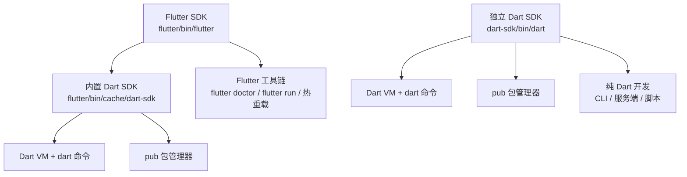

# 01 环境配置

> 工欲善其事，必先利其器。本章把 Dart 与 Flutter 的开发环境一次性配好：装哪个 SDK、三平台怎么装、国内网络怎么配镜像、编辑器装什么插件、`flutter doctor` 的每一项怎么看。配置是唯一「做一次、受益全程」的投入，请务必跟着自检清单逐条验证，不要带病进入下一章。

---

## 一、Dart SDK 与 Flutter SDK 的关系

初学者最常见的错误是「先装 Dart，再装 Flutter，结果两个版本打架」。先看关系图：



| 你的目标 | 需要安装 | 说明 |
|----------|----------|------|
| 只学 Dart 语言、写 CLI/服务端 | 独立 Dart SDK | 体积小，`dart` 命令开箱即用 |
| 做 Flutter 开发 | 只装 Flutter SDK | **Flutter 自带 Dart SDK，不要重复安装** |
| 两者都做 | 只装 Flutter SDK | Flutter 自带的 `dart` 命令功能完整，够用 |

核心原则：

1. Flutter SDK 内置的 Dart 版本与 Flutter 框架严格匹配，手动替换会破坏兼容性
2. 如果两个都装了，注意 `PATH` 中谁在前——`which -a dart` 可以查看所有命中项
3. 用 `flutter --version` 会同时显示 Flutter 与内置 Dart 的版本号

---

## 二、三平台安装总览

| 平台 | 独立 Dart SDK | Flutter SDK |
|------|---------------|-------------|
| Windows | `winget install Google.DartSDK` 或下载 ZIP 解压后加 PATH | 下载压缩包解压到无空格路径，将 `flutter\bin` 加入 PATH |
| Debian/Ubuntu | 添加官方 APT 仓库后 `sudo apt install dart` | `sudo snap install flutter --classic` 或 git clone stable |
| Arch Linux | `sudo pacman -S dart` | `sudo pacman -S flutter` 或 AUR |
| Fedora | `sudo dnf install dart` | 手动下载或 snap |
| macOS | `brew tap dart-lang/dart && brew install dart` | `brew install --cask flutter` 或下载压缩包 |

下面按平台展开。

---

## 三、Windows 安装

### 3.1 独立 Dart SDK

方式一，用 winget（推荐）：

```powershell
winget install Google.DartSDK
```

方式二，手动安装：到 [dart.dev/get-dart](https://dart.dev/get-dart) 下载 ZIP，解压到 `C:\src\dart-sdk`，然后把 `C:\src\dart-sdk\bin` 加入系统环境变量 `Path`。**解压路径不要含中文和空格**，否则部分工具会报奇怪的路径错误。

验证（新开一个终端）：

```powershell
dart --version
# Dart SDK version: 3.x.x (stable) ...
```

### 3.2 Flutter SDK

1. 到 [flutter.dev](https://flutter.dev/) 下载稳定版压缩包
2. 解压到 `C:\src\flutter`（不要放 `Program Files`，避免权限问题）
3. 将 `C:\src\flutter\bin` 加入系统 `Path`
4. 新开终端执行：

```powershell
flutter --version
flutter doctor
```

---

## 四、Linux 安装

### 4.1 独立 Dart SDK

Debian/Ubuntu 官方仓库方式：

```bash
sudo apt-get update
sudo apt-get install apt-transport-https
wget -qO- https://dl-ssl.google.com/linux/linux_signing_key.pub \
  | sudo gpg --dearmor -o /usr/share/keyrings/dart.gpg
echo 'deb [signed-by=/usr/share/keyrings/dart.gpg arch=amd64] https://storage.googleapis.com/download.dartlang.org/linux/debian stable main' \
  | sudo tee /etc/apt/sources.list.d/dart_stable.list
sudo apt-get update
sudo apt-get install dart
```

其他发行版：

```bash
# Arch Linux
sudo pacman -S dart

# Fedora
sudo dnf install dart

# 通用 snap（注意 --classic）
sudo snap install dart --classic
```

### 4.2 Flutter SDK

snap 方式最省事：

```bash
sudo snap install flutter --classic
```

或者用 git 克隆（方便切换版本）：

```bash
git clone https://github.com/flutter/flutter.git -b stable --depth 1 ~/flutter
echo 'export PATH="$PATH:$HOME/flutter/bin"' >> ~/.bashrc
source ~/.bashrc
flutter doctor
```

---

## 五、macOS 安装

```bash
# 独立 Dart SDK
brew tap dart-lang/dart
brew install dart

# Flutter SDK
brew install --cask flutter
```

如果不用 Homebrew，也可以下载 Flutter 压缩包解压到 `~/development/flutter`，再把 `~/development/flutter/bin` 加入 `~/.zshrc` 的 `PATH`。

macOS 上做 iOS 开发还需要 Xcode，见第八节。

---

## 六、国内镜像配置

pub.dev 与 Flutter 的部分资源在国内访问较慢，配置两个环境变量即可：

```bash
export PUB_HOSTED_URL=https://pub.flutter-io.cn
export FLUTTER_STORAGE_BASE_URL=https://storage.flutter-io.cn
```

让配置永久生效：

```bash
# Linux / macOS（bash 用户写 ~/.bashrc，zsh 用户写 ~/.zshrc）
echo 'export PUB_HOSTED_URL=https://pub.flutter-io.cn' >> ~/.bashrc
echo 'export FLUTTER_STORAGE_BASE_URL=https://storage.flutter-io.cn' >> ~/.bashrc
source ~/.bashrc
```

```powershell
# Windows PowerShell
setx PUB_HOSTED_URL "https://pub.flutter-io.cn"
setx FLUTTER_STORAGE_BASE_URL "https://storage.flutter-io.cn"
```

注意事项：

| 事项 | 说明 |
|------|------|
| 镜像只影响 pub 与存储下载 | `git clone` Flutter 仓库的流量不走这两个变量 |
| 验证是否生效 | `dart pub get -v` 的输出中能看到镜像域名 |
| 备选镜像 | `PUB_HOSTED_URL` 可换成清华源 `https://mirrors.tuna.tsinghua.edu.cn/dart-pub` |
| 代理冲突 | 如果同时设了 HTTP 代理，注意代理规则是否放行镜像域名 |
| 恢复官方源 | 删除对应环境变量并重开终端即可 |

---

## 七、编辑器与插件

### 7.1 编辑器选择对比

| 编辑器 | 平台 | 优点 | 适合人群 |
|--------|------|------|----------|
| VS Code | 全平台 | 轻量、启动快、Dart/Flutter 官方插件功能完整 | 绝大多数人，本教程首选 |
| Android Studio | 全平台 | 安卓模拟器与 SDK 管理最顺、Flutter 官方支持 | 移动端为主、需要重度调试 |
| IntelliJ IDEA | 全平台 | 与 Android Studio 同源，Java/Kotlin 用户顺手 | 已有 IDEA 工作流 |
| Neovim | 终端 | 键盘流、资源占用低 | 终端党，需要自行配置 LSP |

### 7.2 VS Code 必装插件

| 插件 | 扩展 ID | 作用 |
|------|---------|------|
| Dart | `Dart-Code.dart-code` | 语法高亮、补全、调试、`dart analyze` 集成 |
| Flutter | `Dart-Code.flutter` | 热重载、Widget 树、设备选择、运行调试 |
| Error Lens（可选） | `usernamehw.errorlens` | 错误直接显示在代码行尾 |

安装方式：扩展面板搜索名字安装，或命令行：

```bash
code --install-extension Dart-Code.dart-code
code --install-extension Dart-Code.flutter
```

> 重要：VS Code 要用「打开文件夹」的方式打开**包含 `pubspec.yaml` 的项目根目录**，插件才会激活。直接打开单个 `.dart` 文件时，部分功能不可用。

### 7.3 Android Studio / IntelliJ

在 `Settings > Plugins` 中搜索安装 Flutter 插件（会连带安装 Dart 插件），重启 IDE。Android Studio 同时提供 Android SDK 与模拟器管理界面。

---

## 八、Flutter 附加工具链

### 8.1 Android SDK 与模拟器

1. 安装 Android Studio，首次启动时按向导安装 Android SDK
2. 在 `SDK Manager` 中确认勾选：Android SDK Platform、Android SDK Command-line Tools、Android SDK Build-Tools、Android Emulator
3. 接受许可证：

```bash
flutter doctor --android-licenses
```

4. 在 `Device Manager` 中创建虚拟设备（AVD），或命令行操作：

```bash
flutter emulators                      # 列出所有模拟器
flutter emulators --launch Pixel_8_API_35   # 启动指定模拟器
flutter devices                        # 查看当前可用设备
```

### 8.2 macOS 的 Xcode 与 iOS 工具链

```bash
xcode-select --install                 # 安装命令行工具
sudo xcode-select --switch /Applications/Xcode.app/Contents/Developer
sudo xcodebuild -runFirstLaunch        # 接受 Xcode 许可
sudo gem install cocoapods             # 或 brew install cocoapods
pod setup
```

| 目标 | 需要 | 备注 |
|------|------|------|
| iOS 模拟器 | Xcode | 无需付费开发者账号 |
| 真机调试 | Xcode + Apple ID | 免费账号可做 7 天有效的临时签名 |
| 上架 App Store | 付费开发者账号 | 每年 99 美元 |

---

## 九、flutter doctor 输出逐项解读

`flutter doctor` 是环境体检工具，每一行都对应一类依赖。状态有三种：通过、警告（不影响当前目标时可忽略）、失败（必须处理）。

| 检查项 | 含义 | 不通过时的处理 |
|--------|------|----------------|
| Flutter | Flutter SDK 本身与频道 | 升级或切换 stable 频道 |
| Android toolchain | Android SDK、构建工具、许可证 | 装 SDK、接受许可证 |
| Chrome | Web 目标所需的浏览器 | 安装 Chrome 或 Edge |
| Android Studio | IDE 与 Android 插件 | 安装 Android Studio |
| VS Code | 编辑器与插件 | 安装 VS Code 与 Flutter 插件 |
| Connected device | 可用设备（模拟器或真机） | 启动模拟器或连接手机 |
| Network resources | 网络能否访问包仓库与镜像 | 配置代理或镜像 |
| Xcode（仅 macOS） | iOS/macOS 构建链 | 安装 Xcode 并切换路径 |
| CocoaPods（仅 macOS） | iOS 依赖管理 | `gem install cocoapods` |

查看更详细的信息与修复建议：

```bash
flutter doctor -v          # 详细输出
flutter doctor --android-licenses   # 专门处理 Android 许可证
```

---

## 十、环境自检清单

全部通过后再进入下一章：

```bash
# 1. Dart 可用
dart --version
# 期望: Dart SDK version: 3.x.x (stable) ...

# 2. 能创建项目
dart create -t console hello
cd hello

# 3. 能运行
dart run
# 期望: Hello world!

# 4. 静态分析通过
dart analyze
# 期望: No issues found!

# 5. 测试通过
dart test
# 期望: All tests passed!

# 6. Flutter 用户额外检查
flutter --version          # 期望: Flutter 3.x.x • channel stable
flutter doctor             # 逐项检查工具链
```

---

## 十一、常见报错排查表

| 现象 | 原因 | 解决 |
|------|------|------|
| `dart: command not found` | PATH 未配置 | 把 `dart-sdk/bin` 加入 PATH，重开终端 |
| `flutter: command not found` | PATH 未配置 | 把 `flutter/bin` 加入 PATH |
| `Waiting for another flutter command to release the startup lock` | 上次命令异常退出残留锁文件 | 删除 `flutter/bin/cache/lockfile` 后重试 |
| `SocketException: ... timed out` | 无法访问 pub.dev | 配置第六节的镜像变量 |
| `Android license status unknown` | 许可证未接受 | `flutter doctor --android-licenses` |
| `cmdline-tools component is missing` | 缺 Android 命令行工具 | SDK Manager 勾选安装后重试 |
| `Xcode ... not installed` | 未安装 Xcode | App Store 安装，再执行 `xcode-select --switch` |
| `CocoaPods not installed` | 缺 iOS 依赖管理器 | `sudo gem install cocoapods` |
| `permission denied: flutter` | 可执行位丢失 | `chmod +x ~/flutter/bin/flutter` |
| `Because ... requires SDK version >=3.x` | Dart SDK 版本过低 | 升级 SDK，或调整 `pubspec.yaml` 的 `environment.sdk` |
| VS Code 提示 `The Dart SDK is not configured` | 没有打开项目根目录 | 用「打开文件夹」打开含 `pubspec.yaml` 的目录 |
| `Failed to connect to the VM service` | 防火墙拦截调试端口 | 放行 dart 进程或关闭临时防护软件 |

---

## 常见坑

1. **Flutter 项目用错包管理命令**：Flutter 项目统一用 `flutter pub get`，不要用 `dart pub get`，前者会额外处理插件与平台工程
2. **PATH 里存在多个 Dart**：`which -a dart` 检查，确保命中的是期望的那个；Flutter 项目应使用 Flutter 自带的 Dart
3. **Windows 路径含空格或中文**：SDK 尽量装到 `C:\src\` 下，否则构建工具链容易报错
4. **snap 安装后权限问题**：snap 版 Flutter 无法访问 `/tmp` 之外的部分路径，工程目录建议放用户主目录
5. **镜像没生效**：环境变量要写进 shell 配置文件并 `source`，或者重开终端；`setx` 后也必须重开终端
6. **模拟器启动失败**：确认 BIOS 中开启了虚拟化（VT-x/AMD-V），Linux 用户确认已安装 KVM 并在 `kvm` 用户组
7. **许可证接受了但 doctor 仍报错**：检查是否安装了 `cmdline-tools`，且 Android SDK 路径在 `ANDROID_HOME` 或 `local.properties` 中正确指向

---

## 本章小结

- 只做 Flutter 开发时，装 Flutter SDK 即可，它自带匹配版本的 Dart SDK
- 三平台都有官方或包管理器渠道：winget/apt/pacman/dnf/snap/brew
- 国内网络配置两个变量：`PUB_HOSTED_URL` 与 `FLUTTER_STORAGE_BASE_URL`，写进 shell 配置并重启终端
- VS Code 装 `Dart-Code.dart-code` 与 `Dart-Code.flutter` 两个插件即可获得完整开发体验
- Android 需要 SDK、命令行工具与许可证；iOS 需要 Xcode 与 CocoaPods
- 自检六条命令：`dart --version`、`dart create`、`dart run`、`dart analyze`、`dart test`、`flutter doctor`
- 所有报错优先看 `flutter doctor -v`，它给出的修复建议通常比搜索引擎更准

---

## 练习

| 题号 | 题目 | 链接 | 知识点 |
|------|------|------|--------|
| P1001 | A+B Problem | https://www.luogu.com.cn/problem/P1001 | 输入输出、环境验证 |

题目要求读入两个整数，输出它们的和。这道题用来做「端到端环境验证」：从创建项目、编写代码、读取标准输入到运行输出，把整条工具链跑通。读取输入使用 `dart:io` 的 `stdin`，具体用法在 [[dart/1入门/02_第一个程序与命令行|02 第一个程序与命令行]] 会详细讲解，本章先照着示例跑通即可。

```dart
import 'dart:io';

void main() {
  // 读取一整行，按空白切分，解析出两个整数
  final parts = stdin.readLineSync()!.trim().split(RegExp(r'\s+'));
  final a = int.parse(parts[0]);
  final b = int.parse(parts[1]);
  print(a + b);
}
```

验证方式：

```bash
echo "3 5" | dart run bin/main.dart
# 期望输出: 8
```

- 返回目录：[[dart/dart目录|Dart 教程目录]]
