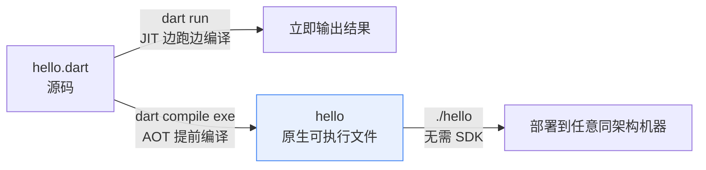
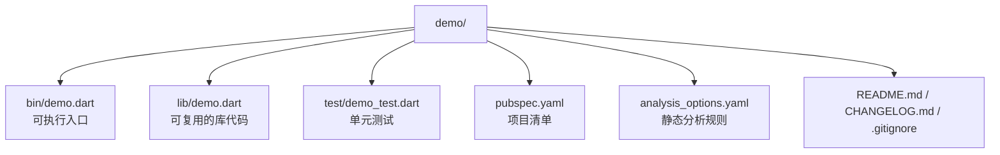

# 02 第一个程序与命令行

> 环境就绪，正式写代码。本章把最简单的 Hello World 拆开揉碎——它的每一部分都藏着 Dart 与 C 的重要差异；然后讲清 `dart run` 与 `dart compile exe` 的分工、`dart create` 生成的工程结构、命名规范与三件套工具；最后用命令行参数与标准输入输出完成从「能打印」到「能交互」的跨越。

---

## 一、Hello World：C 与 Dart 第一次对照

先看 C 版本：

```c
#include <stdio.h>

int main(void) {
    printf("Hello, World!\n");
    return 0;
}
```

再看 Dart 版本（新建 `hello.dart`）：

```dart
void main() {
  print('Hello, World!');
}
```

第一印象：Dart 更短。逐处对照：

| 组成部分 | C | Dart |
|----------|---|------|
| 引入标准库 | `#include <stdio.h>` | 不需要，`print` 由 `dart:core` 自动导入 |
| 入口函数 | `int main(void)` | `void main()` |
| 打印 | `printf("Hello, World!\n")` | `print('Hello, World!')`，自动换行 |
| 返回值 | `return 0` 表示成功 | 默认无返回值，需要非零退出码时用 `exit()` |
| 引号 | 双引号字符串与单引号字符严格区分 | 单双引号等价，都表示字符串 |

```bash
dart run hello.dart   # 也支持 dart hello.dart 简写
```

---

## 二、main 函数签名

Dart 的完整入口签名是：

```dart
void main(List<String> args) {
  // args 是命令行参数
}
```

与 C 对照：

| 维度 | C | Dart |
|------|---|------|
| 写法 | `int main(int argc, char** argv)` | `void main(List<String> args)` |
| 参数个数 | `argc` 单独给出 | 列表自带 `length` |
| 程序名 | `argv[0]` 是程序路径 | `args[0]` 是第一个真实参数，**不含程序名** |
| 返回值 | `int`，作为退出码 | `void`；要设置退出码用 `exit(1)` |
| 省略参数 | 必须写 `void` | 可以只写 `void main()` |

三个细节：

1. **`main` 的参数可以省略**，不读命令行参数时写 `void main()` 即可
2. **没有 argc**，`args.length` 就是参数个数
3. **异步入口是 `Future<void> main() async`**，在 [[dart/1入门/09_异步编程|09 异步编程]] 展开

---

## 三、print 与 printf

### 3.1 输出方式对照

| 需求 | C | Dart |
|------|---|------|
| 输出并换行 | `printf("hi\n")` | `print('hi')` |
| 输出不换行 | `printf("hi")` | `stdout.write('hi')` |
| 输出到错误流 | `fprintf(stderr, ...)` | `stderr.writeln(...)` |
| 格式化 | `printf("%d %.2f", n, x)` | 字符串插值 + `toStringAsFixed` |
| 拼接字符串 | `strcat` / `snprintf` | `+` 或插值 |

Dart 没有 `printf` 那样的格式串（`%d`、`%f` 在 Dart 中不存在），取而代之的是**字符串插值**：把表达式直接写进字符串。

### 3.2 字符串插值示例

```dart
void main() {
  final name = 'RootStack';
  final age = 5;
  final score = 91.567;

  // $变量 适用于简单标识符；${表达式} 适用于任意表达式
  print('我叫 $name，今年 $age 岁');
  print('明年我 ${age + 1} 岁');
  print('姓名大写：${name.toUpperCase()}');

  // 小数位数用 toStringAsFixed，对应 C 的 %.2f
  print('得分：${score.toStringAsFixed(2)}');   // 91.57

  // 补零对齐对应 C 的 %05d
  final id = 42;
  print('编号：${id.toString().padLeft(5, '0')}');  // 00042
}
```

`print` 只接收一个参数，多个值先拼成字符串；不换行输出用 `stdout.write`：

```dart
import 'dart:io';

void main() {
  final a = 3, b = 5;
  print('$a + $b = ${a + b}');   // 等价 C 的 printf("%d + %d = %d\n", a, b, a + b)
  stdout.write('请输入：');       // 不换行，常用于提示
}
```

> 性能提示：循环中大量拼接用 `StringBuffer`，不要用 `+` 反复创建字符串，对应 C 中避免循环里反复 `strcat` 的直觉。

---

## 四、dart run 与 dart compile exe

| 维度 | `dart run`（JIT） | `dart compile exe`（AOT） |
|------|-------------------|---------------------------|
| 使用场景 | 开发、调试、刷题 | 发布、分发、部署 |
| 是否需要 Dart SDK | 需要 | 不需要，产物独立运行 |
| 启动速度 | 需要加载 VM | 快 |
| 运行性能 | 中高（热点优化） | 高 |
| 产物 | 无（或 `.dart_tool` 缓存） | 单个原生可执行文件 |
| 修改代码后 | 直接重跑 | 必须重新编译 |



```bash
# 开发期：JIT 直接运行
dart run bin/main.dart

# 发布期：编译为原生可执行文件（对应 gcc main.c -o main）
dart compile exe bin/main.dart -o hello
./hello

# 其他编译目标
dart compile js bin/main.dart -o main.js        # JavaScript
dart compile wasm bin/main.dart -o main.wasm    # WebAssembly
dart compile kernel bin/main.dart -o main.dill  # 内核快照
```

---

## 五、dart create 模板项目结构

```bash
dart create -t console demo
cd demo
```



| 路径 | 职责 | 对应 C 工程 |
|------|------|-------------|
| `bin/` | 可执行入口，每个文件一个命令 | `main.c` |
| `lib/` | 可被复用、被测试的库代码 | 静态库 `.a` 的源码 |
| `test/` | 单元测试，文件名以 `_test.dart` 结尾 | 手写的测试程序 |
| `pubspec.yaml` | 项目名、版本、依赖、SDK 约束 | Makefile + 依赖清单 |
| `analysis_options.yaml` | lint 规则配置 | 编译警告选项 `-Wall -Wextra` |

`pubspec.yaml` 逐行解读：

```yaml
name: demo                     # 包名，必须是小写下划线风格
description: A sample command-line application.
version: 1.0.0                 # 语义化版本
environment:
  sdk: ^3.13.2                 # 允许的 SDK 范围，由 dart create 按本机版本生成
dependencies:                  # 运行时依赖
  path: ^1.9.0
dev_dependencies:              # 仅开发/测试期依赖
  lints: ^6.0.0
  test: ^1.25.6
```

`bin/` 通过包名引用 `lib/`，这是 Dart 项目最重要的组织约定：

```dart
// bin/demo.dart
import 'package:demo/demo.dart' as demo;   // 包内引用统一用 package:包名/路径

void main(List<String> arguments) {
  print('Hello world: ${demo.calculate()}!');
}
```

```dart
// lib/demo.dart
int calculate() => 6 * 7;   // 测试文件 import 'package:demo/demo.dart' 后即可调用
```

---

## 六、注释三种形式

| 形式 | Dart 写法 | 用途 | C 对应 |
|------|-----------|------|--------|
| 行注释 | `// 说明` | 单行说明 | `//`（C99 起） |
| 块注释 | `/* 说明 */` | 多行或行内说明，**可嵌套** | `/* */`，不可嵌套 |
| 文档注释 | `/// 说明` | 生成 API 文档，可引用符号 | 无，类似 doxygen 的 `/** */` |

```dart
/// 计算矩形面积。参数 [width] 与 [height] 必须为非负数。
double area(double width, double height) {
  // 行注释
  /* 块注释，可以跨多行 */
  return width * height;
}

void main() {
  print(area(3, 4));   // 12.0
}
```

`///` 中的 `[符号名]` 会被 `dart doc` 生成超链接，并输出 HTML 文档到 `doc/api/`。

---

## 七、命名规范

| 对象 | Dart 规范 | 示例 | C 常见写法 |
|------|-----------|------|------------|
| 类 / 枚举 / typedef | 大驼峰 UpperCamelCase | `StringBuilder`、`Point` | `struct point` |
| 变量 / 函数 / 参数 | 小驼峰 lowerCamelCase | `maxCount`、`readLine` | `max_count` |
| 常量（含 `const`） | 小驼峰 | `pi`、`defaultTimeout` | `MAX_SIZE` |
| 私有成员 | 下划线前缀 | `_cache`、`_internal` | 文件内 `static` |
| 文件名 | 小写下划线 snake_case | `user_repository.dart` | `user_repository.c` |
| 缩进 | 2 空格 | — | 常见 4 空格 |

关键差异：**Dart 的常量不用全大写**。私有性靠 `_` 前缀实现，库外不可见，既能修饰顶层函数也能修饰类成员，比 C 的 `static` 更细粒度。

---

## 八、dart format / dart analyze / dart fix

| 命令 | 作用 | 对应 C 工具 |
|------|------|-------------|
| `dart format .` | 按官方风格自动格式化，没有配置项 | clang-format |
| `dart analyze` | 静态分析，输出 error/warning/info | `gcc -Wall -Wextra` + 静态检查器 |
| `dart fix --apply` | 自动修复分析器能修的问题 | 无直接对应 |

```bash
dart format .                                        # 格式化
dart format --output=none --set-exit-if-changed .    # CI 中只检查不改写
dart analyze                                         # 分析
dart fix --dry-run                                   # 预览可自动修复项
dart fix --apply                                     # 应用修复
```

`dart analyze` 的输出每行包含级别、位置、消息与诊断码：

```text
  error - bin/main.dart:2:11 - A value of type 'String' can't be assigned to a variable of type 'int'. ... - invalid_assignment
warning - bin/main.dart:2:7 - The value of the local variable 'x' isn't used. ... - unused_local_variable

2 issues found.
```

---

## 九、命令行参数 args

```dart
void main(List<String> args) {
  if (args.isEmpty) {
    print('用法: dart run greet.dart <名字> [更多名字...]');
    return;   // 顶层 main 中 return 直接结束程序
  }

  // 注意：args[0] 是第一个真实参数，不像 C 的 argv[0] 是程序名
  for (var i = 0; i < args.length; i++) {
    print('[$i] 你好，${args[i]}！');
  }
}
```

```bash
dart run greet.dart Alice Bob
# [0] 你好，Alice！
# [1] 你好，Bob！
```

与 C 的 off-by-one 陷阱对照：

| 场景 | C | Dart |
|------|---|------|
| 程序名 | `argv[0]` | 无对应项 |
| 第一个参数 | `argv[1]` | `args[0]` |
| 参数个数 | `argc`（含程序名） | `args.length`（不含程序名） |

---

## 十、标准输入输出交互

`dart:io` 提供 `stdin`、`stdout`、`stderr`，与 C 的 `<stdio.h>` 对应：

```dart
import 'dart:io';

void main() {
  stdout.write('请输入两个整数（空格分隔）：');   // 不换行提示

  final line = stdin.readLineSync();   // 读取一行，遇到 EOF 返回 null
  if (line == null) {
    stderr.writeln('错误：没有读到输入');
    return;
  }

  final parts = line.trim().split(RegExp(r'\s+'));   // 按空白切分
  final a = int.parse(parts[0]);
  final b = int.parse(parts[1]);
  print('$a + $b = ${a + b}');
}
```

```bash
echo "3 5" | dart run bin/main.dart
# 请输入两个整数（空格分隔）：3 + 5 = 8
```

| 需求 | C | Dart |
|------|---|------|
| 读一行 | `fgets(buf, n, stdin)` | `stdin.readLineSync()` |
| 读一个整数 | `scanf("%d", &x)` | `int.parse(stdin.readLineSync()!)` |
| 按空白切分 | `strtok` | `String.split(RegExp(r'\s+'))` |
| EOF 表示 | `NULL` / `EOF` | `null` |
| 输出到错误流 | `fprintf(stderr, ...)` | `stderr.writeln(...)` |

注意：Dart 没有 `scanf` 那种「按类型直接读取」的函数，标准做法是**读整行、自己切分、自己解析**，从而避免 C 中格式串与参数类型不匹配的未定义行为。

---

## 常见坑

1. **`print` 与 `printf` 混淆**：Dart 没有 `%d` 格式串，必须用插值 `'$n'`
2. **忘记分号**：语句结尾必须分号，`=>` 箭头函数体是表达式，不能带分号
3. **`args[0]` 当成程序名**：Dart 参数列表不含程序名，从 C 迁移最容易 off-by-one
4. **`readLineSync` 返回值未判空**：管道输入结束时返回 `null`，直接 `!` 强解会抛异常
5. **单双引号混用**：两者完全等价，团队内应统一（推荐单引号）
6. **在错误目录执行 `dart run`**：项目根目录会运行 `bin/` 下的入口；否则必须给文件路径
7. **修改代码后忘了重新编译 exe**：`dart compile exe` 的产物不会自动更新，调试阶段用 `dart run`

---

## 本章小结

- Hello World 只需三行，无需 include，`print` 自动换行
- `main` 签名 `void main(List<String> args)`，参数可省略，`args[0]` 是第一个真实参数
- Dart 没有 `printf` 格式串，用字符串插值配合 `toStringAsFixed`、`padLeft`
- 开发用 `dart run`（JIT），发布用 `dart compile exe`（AOT 原生可执行文件）
- `dart create -t console` 生成 `bin/lib/test/pubspec.yaml/analysis_options.yaml` 标准结构
- `///` 文档注释支持 `[符号]` 引用并可生成 HTML 文档
- 命名规范与 C 差异最大的一点：常量用小驼峰，不用全大写
- 日常三件套：`dart format` 管格式、`dart analyze` 查问题、`dart fix` 自动修
- 输入输出靠 `stdin.readLineSync` + 手动解析，输出靠 `print` / `stdout.write`

---

## 练习

| 题号 | 题目 | 链接 | 知识点 |
|------|------|------|--------|
| P5703 | 苹果采购 | https://www.luogu.com.cn/problem/P5703 | 输入输出、变量 |

题目要求读入两个整数（人数与每人分到的数量），输出需要采购的总数，本质是两个变量的乘法。用本章学到的 `stdin.readLineSync` 读入、`split` 切分、`int.parse` 解析、`print` 输出即可完成。

```dart
import 'dart:io';

void main() {
  final parts = stdin.readLineSync()!.trim().split(RegExp(r'\s+'));
  print(int.parse(parts[0]) * int.parse(parts[1]));
}
```

- 返回目录：[[dart/dart目录|Dart 教程目录]]
