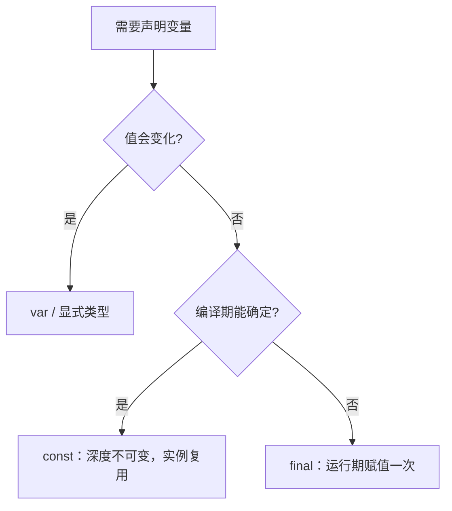

# 03 变量与类型

> 变量是程序的容器，类型是容器的形状。Dart 的类型系统与 C 同属静态类型阵营，但多了三样 C 没有的东西：类型推断、健全空安全、运行期类型信息。本章从声明变量的四种方式讲起，覆盖数值、字符串、布尔与类型转换，最后把 `final` 与 `const` 的区别彻底讲透——这是 Dart 面试与日常编码都绕不开的分水岭。

---

## 一、变量声明四件套：var / final / const / late

```dart
void main() {
  var count = 10;          // 类型推断为 int，之后不能再赋别的类型
  final now = DateTime.now();   // 运行期赋值一次，之后只读
  const pi = 3.14159;      // 编译期常量，编译时就必须确定值
  late String description; // 延迟初始化：先声明，用之前再赋值

  count = 20;              // 可以重新赋值
  // now = DateTime.now(); // 编译错误：final 变量只能赋值一次
  // pi = 3.14;            // 编译错误：const 变量不可修改

  description = '延迟初始化完成';
  print('$count $now $pi $description');
}
```

与 C 对照：

| Dart | C 对应 | 本质区别 |
|------|--------|----------|
| `var x = 1;` | `auto x = 1;`（C23 起） | Dart 推断一次即固定类型，之后不可改类型 |
| `final x = f();` | `const int x = f();` 不可行 | 运行期一次赋值，可来自函数调用 |
| `const x = 42;` | `#define X 42` 或 `const int x = 42;` | 有类型、有作用域、可调试，编译期内联 |
| `late int x;` | 先声明后赋值 | 显式允许延迟初始化，使用时未赋值会抛错 |
| 无 | `static int x;` | Dart 顶层变量天然文件级可见，私有靠 `_` |

选择原则：值会变化用 `var`；运行期确定一次用 `final`；编译期字面量用 `const`；初始化成本高用 `late`。

---

## 二、类型系统总览

Dart 中**一切皆对象**，没有 C 的「基本类型」概念——`int`、`double`、`bool` 都是类，都继承自 `Object`。

| 类型 | 说明 | C 对应 |
|------|------|--------|
| `int` | 64 位有符号整数（VM 上），无平台差异 | `long long`（更稳定） |
| `double` | IEEE 754 双精度浮点 | `double` |
| `num` | `int` 与 `double` 的公共父类型 | 无 |
| `bool` | `true` / `false` | `_Bool`（C99） |
| `String` | UTF-16 不可变字符串 | `char*` / `char[]` |
| `List<T>` | 有序可重复集合 | 数组 + 长度 |
| `Set<T>` | 无序不重复集合 | 无 |
| `Map<K, V>` | 键值对 | 手写哈希表 |
| `Runes` | 字符串的 Unicode 码点序列 | `uint32_t[]` |
| `dynamic` | 关闭静态检查，运行期决定 | `void*` |
| `Object?` | 所有类型的根 | `void*` |
| `Null` | 空类型，唯一值 `null` | `NULL` |

类型信息可以在运行期查询：

```dart
void main() {
  print(42.runtimeType);        // int
  print('hi'.runtimeType);      // String
  print([1, 2].runtimeType);    // List<int>
  print(42 is num);             // true，int 是 num 的子类型
}
```

---

## 三、var vs dynamic vs Object

这三个是初学者最易混淆的一组：

| 写法 | 静态类型 | 编译期检查 | 运行期行为 | 适用场景 |
|------|----------|------------|------------|----------|
| `var x = 1;` | 推断为 `int` | 完整检查 | 按 `int` 处理 | 绝大多数情况 |
| `dynamic x = 1;` | `dynamic` | 关闭 | 运行期解析，调错方法运行时抛错 | 动态 JSON、临时脚本 |
| `Object? x = 1;` | `Object?` | 完整检查 | 使用前必须转换 | 需要接收任意类型 |

```dart
void main() {
  var a = 1;
  // a = 'hello';              // 编译错误：a 已被推断为 int

  dynamic b = 1;
  b = 'hello';                 // 允许：类型不固定
  // print(b + 1);             // 编译通过，运行期抛 NoSuchMethodError

  Object? c = 1;
  c = 'hello';                 // 允许：所有类型都是 Object 的子类型
  if (c is String) {
    print(c.length);           // 类型提升后可用
  }
}
```

结论：**优先 `var` 或显式类型，其次 `Object?`，最后才 `dynamic`**。`dynamic` 把类型错误从编译期推迟到运行期，等价于 C 中到处用 `void*` 再做强制转换。

---

## 四、数值类型细节

### 4.1 int、double 与 num

- `int` 在 VM 上是 64 位有符号整数，溢出按补码回绕（与 C 的无符号语义类似，但 Dart 的 `int` 是有符号的）
- `double` 是 IEEE 754 双精度，精度与 C 的 `double` 一致
- `num` 是二者的公共父类型，声明为 `num` 的变量可以持有整数或小数

```dart
void main() {
  final max = 9223372036854775807;   // int 最大值 2^63-1
  print(max + 1);                     // -9223372036854775808，回绕
  print('${7 / 2} ${7 ~/ 2} ${7 % 3} ${7.5 % 2}');   // 3.5 3 1 1.5
  print('${1 / 0} ${0 / 0}');         // Infinity NaN，浮点除零不崩溃
  // print(1 ~/ 0);                   // 抛 IntegerDivisionByZeroException
}
```

| 运算 | C | Dart |
|------|---|------|
| 整数除法 | `7 / 2` 得 `3` | `7 / 2` 得 `3.5`，整数除法必须用 `7 ~/ 2` |
| 浮点取余 | `fmod(7.5, 2)` | `7.5 % 2` 直接支持 |
| 整数除零 | 未定义行为（通常崩溃） | 抛 `IntegerDivisionByZeroException` |
| 浮点除零 | 得 `inf` / `nan`（IEEE 754） | 同样得 `Infinity` / `NaN` |
| NaN 比较 | `x != x` 判断 | 同样 `NaN != NaN` 为 `true` |
| 溢出 | 有符号溢出是未定义行为 | 定义明确：按 64 位补码回绕 |

> Web 平台的差异：编译到 JavaScript 时，`int` 实际是 JS 的 Number，只有 53 位安全整数范围。涉及大整数计算时，服务端与 Web 行为可能不同，需要 `BigInt` 的场景在深入篇讨论。

### 4.2 数值字面量与常用方法

```dart
void main() {
  final a = 0xFF;          // 十六进制，同 C
  final c = 1_000_000;     // 下划线分隔，提高可读性（C 没有）
  final d = 3.14;

  print('$a $c');                                  // 255 1000000
  print('${d.round()} ${d.floor()} ${d.ceil()}');  // 3 3 4
  print('${255.toRadixString(16)} ${int.parse('ff', radix: 16)}');   // ff 255
}
```

---

## 五、字符串

### 5.1 字符串字面量

```dart
void main() {
  // 多行字符串：三个引号，保留换行
  final multi = '''
第一行
第二行
''';

  // raw 字符串：r 前缀，反斜杠不转义，适合正则与 Windows 路径
  final path = r'C:\Users\root\new';

  // 相邻字符串字面量自动拼接
  final joined = 'Hello, ' 'Dart!';

  print(multi);
  print(path);
  print(joined);
}
```

### 5.2 插值与常用方法

```dart
void main() {
  final s = '  RootStack  ';

  print(s.trim());                       // RootStack，去掉两端空白
  print(s.trim().toUpperCase());         // ROOTSTACK
  print('a,b,c'.split(','));             // [a, b, c]
  print('abc'.indexOf('c'));             // 2，找不到返回 -1
  print('abc'.replaceAll('b', 'X'));     // aXc
  print('ab'.padLeft(5, '0'));           // 000ab
  print(''.isEmpty);                     // true
  print('a-b-c'.split('-').join('+'));   // a+b+c
}
```

与 C 对照：

| 维度 | C | Dart |
|------|---|------|
| 类型 | `char*` / `char[]` | `String`，不可变 |
| 长度 | `strlen`，遇 `\0` 结束 | `length` 属性，UTF-16 码元数 |
| 拼接 | `strcat` / `snprintf` | `+`、插值、相邻字面量 |
| 比较 | `strcmp` 返回差值 | `==` 直接比较内容，返回 `bool` |
| 转大写 | `toupper` 逐字符 | `toUpperCase()` 返回新字符串 |
| 查找 | `strstr` 返回指针 | `indexOf` 返回下标或 -1 |
| 不可变性 | 可原地修改字符 | 不可变，所有修改都返回新串 |

### 5.3 UTF-16 与 Runes

`length` 返回的是 UTF-16 码元数量，不是「字符数」。增补平面字符（码点大于 U+FFFF）会占两个码元：

```dart
void main() {
  final s = 'a𝄞';             // 𝄞 是增补平面字符，UTF-16 下占两个码元
  print(s.length);            // 3：a 占 1，𝄞 占 2 个码元
  print(s.runes.length);      // 2：Unicode 码点数量
  print(s.runes.toList());    // [97, 119070]
  print(String.fromCharCodes(s.runes));  // a𝄞
}
```

### 5.4 StringBuffer

循环拼接大量字符串时，用 `StringBuffer` 避免反复分配：

```dart
void main() {
  final buffer = StringBuffer();
  for (var i = 0; i < 5; i++) {
    buffer.write('第 $i 项;');
  }
  print(buffer.toString());   // 第 0 项;第 1 项;第 2 项;第 3 项;第 4 项;
}
```

这对应 C 中「循环里别反复 `strcat`，先算总长度再一次性拷贝」的优化直觉。

---

## 六、布尔与真值

Dart 的 `bool` 只有 `true` 和 `false` 两个值，**没有 truthy/falsy 概念**：数字、字符串、指针都不能隐式转换为布尔。条件表达式必须是 `bool` 类型。

| 写法 | C | Dart |
|------|---|------|
| `if (x)` | 非 0 即真 | 编译错误，`x` 必须是 `bool` |
| `if (p)` | 指针非 NULL 即真 | 必须 `if (p != null)` |
| `if (s)` | 非空字符串即真 | 必须 `if (s.isNotEmpty)` |
| `while (1)` | 无限循环 | 必须 `while (true)` |

```dart
void main() {
  final count = 3;
  // if (count) { }        // 编译错误
  if (count != 0) print('非零');

  String? name;
  if (name == null) print('未命名');
}
```

这条规则看似麻烦，实际上消灭了 C 中最常见的一类 bug：把 `=` 写成 `==` 的赋值误判。

---

## 七、类型转换

| 需求 | C | Dart |
|------|---|------|
| 字符串转整数 | `atoi` / `strtol` | `int.parse` / `int.tryParse` |
| 字符串转浮点 | `atof` / `strtod` | `double.parse` / `double.tryParse` |
| 数字转字符串 | `sprintf` / `itoa` | `toString()` / 插值 |
| 向上转型 | 隐式，丢失类型信息 | `as` 或赋给父类型变量 |
| 向下转型 | 强制转换 `(T*)p` | `as T`，失败抛 `TypeError` |
| 类型判断 | 无法判断 | `is` / `is!` |

```dart
void main() {
  // 解析：失败会抛 FormatException，tryParse 失败返回 null
  print('${int.parse('42')} ${int.tryParse('12a')} ${int.parse('ff', radix: 16)}');   // 42 null 255

  // 数字转字符串
  print(42.toString());              // 42
  print(3.14159.toStringAsFixed(2)); // 3.14
  print(3.7.toInt());                // 3，截断而非四舍五入

  // 类型测试与转换
  Object value = 'hello';
  if (value is String) {
    print(value.length);             // 类型提升：此分支内 value 是 String
  }
  final s = value as String;         // 显式转换
  print(s.toUpperCase());

  // num 与 int/double 的互转
  num n = 7;
  print('${n.toInt()} ${n.toDouble()}');   // 7 7.0
}
```

---

## 八、const 与 final 的本质区别

这是本章最重要的一节。二者都表示「不可修改」，但约束的时机完全不同：

| 维度 | `final` | `const` |
|------|---------|---------|
| 赋值时机 | 运行期，第一次使用时 | 编译期，编译时就必须确定 |
| 值来源 | 任意表达式、函数调用、网络请求 | 只能是编译期常量表达式 |
| 是否内联 | 否 | 是，编译器可能直接替换 |
| 对象深度 | 引用不可变，对象内容仍可变 | 对象深度不可变 |
| 类成员 | 可以修饰实例字段 | 只能修饰静态字段 |
| C 对应 | 运行期只读变量 | `#define` 或 `static const` |



```dart
void main() {
  final now = DateTime.now();     // 合法：运行期调用
  // const now2 = DateTime.now(); // 编译错误：不是编译期常量

  // 深度不可变的差别
  final list1 = [1, 2, 3];
  list1[0] = 100;                 // 合法：final 只锁引用
  list1.add(4);                   // 合法

  const list2 = [1, 2, 3];
  // list2[0] = 100;              // 编译错误：const 列表完全不可变
}
```

`const` 的核心价值：**同一个 const 表达式在程序中只会有一个实例**，可以用于编译期优化与 `switch` 常量匹配。

```dart
class Point {
  final int x;
  final int y;
  const Point(this.x, this.y);   // const 构造器，要求所有字段都是 final
}

void main() {
  const p1 = Point(1, 2);
  const p2 = Point(1, 2);
  print(identical(p1, p2));      // true：常量对象被规范化，是同一个实例

  final p3 = Point(1, 2);
  final p4 = Point(1, 2);
  print(identical(p3, p4));      // false：final 每次都创建新对象
}
```

---

## 常见坑

1. **`num` 与 `int` 混用**：`num` 上的 `~/` 可用，但把 `num` 传给只接收 `int` 的函数会编译失败，需要 `toInt()` 或类型判断
2. **整数除法用错运算符**：`7 / 2` 是 `3.5`，想要 C 的整数除法必须写 `7 ~/ 2`
3. **整数除零不是未定义行为**：`1 ~/ 0` 抛异常，写代码时要么先判零要么接受异常
4. **`const` 构造器要求全部字段 `final`**：类里有可变字段时无法声明 `const` 构造器
5. **`const` 列表不可修改**：`const [1, 2].add(3)` 在编译期就被拒绝，不要与 `final` 列表混淆
6. **`int.parse` 不做范围检查的直觉错误**：超出 64 位会抛 `FormatException`，不是截断
7. **字符串 `length` 不等于字符数**：含增补平面字符或组合字符时用 `runes.length`
8. **`dynamic` 上调用不存在的方法能编译通过**：错误被推迟到运行期，能用具体类型就别用 `dynamic`

---

## 本章小结

- 声明四件套：`var` 推断类型、`final` 运行期一次赋值、`const` 编译期常量、`late` 延迟初始化
- Dart 一切皆对象，`int/double/bool` 都是类，没有 C 的基本类型
- `var` 静态推断、`dynamic` 关闭检查、`Object?` 保留检查，优先用前两者
- `int` 是 64 位且溢出回绕；`/` 永远返回 `double`，整数除法用 `~/`
- 字符串不可变、UTF-16 编码，`==` 比较内容；大量拼接用 `StringBuffer`
- Dart 没有 truthy/falsy，条件必须是 `bool`
- 类型转换用 `parse`/`tryParse`/`toString`，类型测试用 `is`，向下转换用 `as`
- `final` 锁引用（运行期），`const` 锁值（编译期）且深度不可变；const 对象会被规范化复用

---

## 练习

| 题号 | 题目 | 链接 | 知识点 |
|------|------|------|--------|
| P5706 | 再分肥宅水 | https://www.luogu.com.cn/problem/P5706 | 浮点数、类型转换 |

题目要求把 `t` 毫升饮料平均分给 `n` 名同学：第一行输出每人分到的毫升数（精确到小数点后 3 位），第二行输出一共需要的杯子数（每人 2 个）。要点是 `t / n` 在 Dart 中天然就是浮点除法，再用 `toStringAsFixed(3)` 控制小数位；`n * 2` 保持整数输出。

```dart
import 'dart:io';

void main() {
  final parts = stdin.readLineSync()!.trim().split(RegExp(r'\s+'));
  final t = double.parse(parts[0]);
  final n = int.parse(parts[1]);
  print((t / n).toStringAsFixed(3));
  print(n * 2);
}
```

- 返回目录：[[dart/dart目录|Dart 教程目录]]
