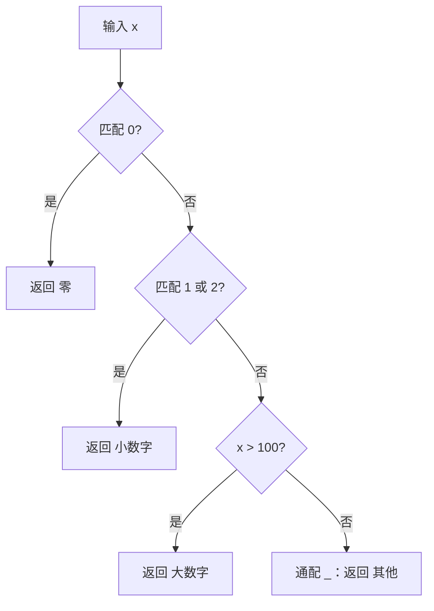

# 04 运算符与流程控制

> 有了变量与类型，下一步是让程序「会判断、会重复」。本章把 Dart 的运算符与 C 逐一对齐，标出必须重新记忆的差异；然后讲分支与循环，重点放在 Dart 3 的 switch 表达式与模式匹配——这是 Dart 从「类 Java 语言」进化为现代语言的关键一步。断言 `assert` 也在本章收尾，它是开发期最便宜的自检手段。

---

## 一、运算符总览

### 1.1 算术与关系

| 运算符 | 含义 | 与 C 的差异 |
|--------|------|-------------|
| `+` `-` `*` | 加减乘 | 相同 |
| `/` | 除法 | `7 / 2` 得 `3.5`，永远返回 `double` |
| `~/` | 整数除法 | C 没有，对应 C 的 `7 / 2` |
| `%` | 取余 | `double` 也能取余，C 需要 `fmod` |
| `==` `!=` | 相等 / 不等 | 字符串比较内容，不是指针 |
| `>` `<` `>=` `<=` | 大小比较 | 可用于 `num`、`String`、`DateTime` |

### 1.2 逻辑、位与类型测试

| 运算符 | 含义 | 与 C 的差异 |
|--------|------|-------------|
| `&&` `\|\|` `!` | 逻辑与 / 或 / 非 | 操作数必须是 `bool`，有短路求值 |
| `&` `\|` `^` `~` | 按位与 / 或 / 异或 / 取反 | `^` 对 `bool` 也表示逻辑异或 |
| `<<` `>>` | 左移 / 算术右移 | 相同 |
| `>>>` | 无符号右移 | C 没有独立运算符，靠无符号类型 |
| `is` / `is!` | 类型测试 | C 无对应，返回 `bool` |
| `as` | 类型转换 | 失败抛 `TypeError`，不是未定义行为 |

### 1.3 赋值、条件与级联

| 运算符 | 含义 | 说明 |
|--------|------|------|
| `=` 与复合赋值 | `+=` `-=` `*=` `/=` `~/=` `%=` `<<=` `>>=` `>>>=` `&=` `\|=` `^=` | `/=` 结果可能是 `double` |
| `? :` | 三目条件 | 条件必须是 `bool` |
| `??` | 空合并：左边为 `null` 时取右边 | C 没有 |
| `??=` | 左边为 `null` 时才赋值 | C 没有 |
| `..` | 级联：对同一对象连续操作 | C 没有 |
| `++` `--` | 自增 / 自减 | 有前后缀，建议只作为独立语句 |

---

## 二、与 C 的运算符差异详解

### 2.1 自增自减：能用但别炫技

```dart
void main() {
  var i = 0;
  i++;              // 推荐：独立语句
  print(i);         // 1

  var a = 5;
  print('${a++} ${++a}');   // 5 7：后缀返回旧值，前缀返回新值
  // Dart 求值顺序明确（从左到右），不存在 C 的未定义行为；
  // 但把自增嵌进复杂表达式可读性差，官方风格建议写 i += 1。
}
```

### 2.2 整除、取余与移位

```dart
void main() {
  print('${7 ~/ 2} ${-7 ~/ 2} ${7 % -3}');   // 3 -3 1：整除向零截断，余数跟随被除数
  print('${-8 >>> 1} ${-8 >> 1} ${~5}');     // 9223372036854775804 -4 -6：无符号/算术右移与取反
}
```

### 2.3 字符串比较与空感知

C 用 `strcmp(a, b) == 0` 判断字符串相等，Dart 直接用 `==`：

| 需求 | C | Dart |
|------|---|------|
| 内容相等 | `strcmp(a, b) == 0` | `a == b` |
| 字典序 | `strcmp(a, b)` | `a.compareTo(b)` |
| 指针相等 | `a == b` | `identical(a, b)`（语义不同，慎用） |

```dart
class User {
  String? name;
  void say() => print('我是 $name');
}

void main() {
  final a = 'hello', b = 'hel' 'lo';
  print('${a == b} ${a.compareTo('world') < 0}');   // true true：比内容、比字典序

  User? u;
  print(u?.name);                // null：u 为 null 时不继续访问
  print(u?.name ?? '匿名');       // 匿名：空合并提供默认值

  String? city;
  city ??= '北京';                // 为 null 才赋值
  print(city);                   // 北京

  // 级联运算符：连续操作同一对象，等价 C 中对同一结构体反复赋值
  final user = User()..name = '小明'..say();   // 我是 小明
}
```

空感知运算符的完整语义在 [[dart/1入门/08_空安全|08 空安全]] 展开，本章先会读、会写简单场景。

---

## 三、运算符优先级

从高到低（只列常用项）：

| 级别 | 运算符 | 结合性 |
|------|--------|--------|
| 1 | `()` `[]` `.` `?.` `!`（后缀） | 左 |
| 2 | `-x` `!x` `~x` `++x` `--x` | 右 |
| 3 | `*` `/` `~/` `%` | 左 |
| 4 | `+` `-` | 左 |
| 5 | `<<` `>>` `>>>` `&` `^` `\|` | 左 |
| 6 | `is` `as` | 左 |
| 7 | `==` `!=` `>` `<` `>=` `<=` | 左 |
| 8 | `&&` | 左 |
| 9 | `\|\|` | 左 |
| 10 | `??` | 左 |
| 11 | `? :` | 右 |
| 12 | `..` 级联 | 左 |
| 13 | `=` 及复合赋值 | 右 |

与 C 几乎一致，需要留心的是 `??` 的级别低于 `||`，级联 `..` 的优先级极低。**不确定就加括号**。

---

## 四、if / else

语法与 C 一致，唯一的硬性差异是**条件必须是 `bool`**：

```dart
import 'dart:io';

void main() {
  final score = int.parse(stdin.readLineSync()!.trim());

  if (score >= 90) {
    print('优秀');
  } else if (score >= 60) {
    print('及格');
  } else {
    print('不及格');
  }

  print(score >= 60 ? '通过' : '未通过');   // 三目运算符，对应 C 的 ?:
}
```

| 维度 | C | Dart |
|------|---|------|
| 条件类型 | 任意标量，非 0 即真 | 必须 `bool` |
| `if (x = 1)` | 合法但通常是 bug | 编译错误（`int` 不是 `bool`） |
| 大括号 | 可选 | 可选，风格建议保留 |
| `else if` | 支持 | 支持 |

---

## 五、switch：从传统写法到 Dart 3 模式匹配

### 5.1 传统 switch：不穿透，break 可省

Dart 的 switch 与 C 有一处根本差异：**非空 case 执行完自动结束，不会像 C 那样穿透**。空 case 则向下合并。

```dart
String gradeOf(int score) {
  switch (score ~/ 10) {
    case 10:
    case 9:
      return '优秀';      // 空 case 合并
    case 8:
      return '良好';
    case 7:
    case 6:
      return '及格';
    default:
      return '不及格';
  }
}

void main() {
  print(gradeOf(95));   // 优秀
  print(gradeOf(72));   // 及格
}
```

| 维度 | C | Dart |
|------|---|------|
| 穿透 | 默认穿透，靠 `break` 阻止 | 默认不穿透，空 case 才合并 |
| `break` | 必须 | 可省略 |
| 匹配类型 | 只能是整数 | 整数、字符串、枚举、对象、模式 |
| 跳转到其他 case | `goto` | 带标签的 `continue` |

### 5.2 Dart 3 switch 表达式

switch 可以直接作为表达式返回值，配合模式匹配大幅简化代码：

```dart
String describe(num x) => switch (x) {
  0 => '零',
  1 || 2 => '小数字',        // 或模式
  > 100 => '大数字',         // 关系模式
  _ => '其他',               // 通配模式，等价 default
};

void main() {
  print('${describe(0)} ${describe(2)} ${describe(200)} ${describe(50)}');
  // 零 小数字 大数字 其他
}
```



switch 表达式必须**穷尽所有情况**：要么覆盖所有可能值，要么有 `_` 兜底。这是模式匹配配合 `sealed class` 做到「编译器保证不漏分支」的基础，详见 [[dart/1入门/07_面向对象|07 面向对象]]。

### 5.3 守卫与解构

```dart
String classify(Object? value) => switch (value) {
  null => '空值',
  int n when n < 0 => '负整数 $n',      // when 守卫
  int n => '整数 $n',
  (int a, int b) => '坐标 ($a, $b)',    // 记录解构（Dart 3）
  List list when list.isEmpty => '空列表',
  _ => '其他类型',
};

void main() {
  print(classify(null));        // 空值
  print(classify(-5));          // 负整数 -5
  print('${classify((1, 2))} / ${classify(<int>[])}');   // 坐标 (1, 2) / 空列表
}
```

---

## 六、循环

### 6.1 四种循环

```dart
void main() {
  // 1. C 风格 for
  for (var i = 0; i < 3; i++) {
    print('for: $i');
  }

  // 2. for-in：遍历可迭代对象
  for (final name in ['A', 'B', 'C']) {
    print('for-in: $name');
  }

  // 3. while：条件先判断
  var n = 3;
  while (n > 0) { print('while: $n'); n--; }

  // 4. do-while：至少执行一次
  var m = 0;
  do { print('do-while: $m'); m++; } while (m < 1);

  // 5. for 的初始化与更新部分支持逗号分隔多个表达式
  //    （注意：Dart 没有通用的逗号运算符）
  for (var i = 0, j = 3; i < 3; i++, j--) {
    print('i=$i j=$j');
  }
}
```

| 循环 | C | Dart |
|------|---|------|
| `for (i=0; i<n; i++)` | 支持 | 支持 |
| 多个初始化变量 | 支持 | 支持 `var i = 0, j = 1` |
| 多个更新表达式 | 逗号运算符 | for 更新部分支持逗号 |
| `for-in` | C 无（C++11 有范围 for） | 支持，遍历 `Iterable` |
| `while` / `do-while` | 支持 | 支持 |

### 6.2 break / continue / 标签

```dart
void main() {
  for (var i = 0; i < 10; i++) {
    if (i == 3) break;        // 终止整个循环
    print('break: $i');       // 0 1 2
  }

  for (var i = 0; i < 5; i++) {
    if (i.isEven) continue;   // 跳过本次迭代
    print('continue: $i');    // 1 3
  }
  // 标签：一次跳出多层循环，C 需要 goto 或标志变量
  outer:
  for (var i = 0; i < 3; i++) {
    for (var j = 0; j < 3; j++) {
      if (i == 1 && j == 1) break outer;
      print('$i,$j');         // 0,0 0,1 0,2 1,0
    }
  }
}
```

| 维度 | C | Dart |
|------|---|------|
| 跳出单层 | `break` | `break` |
| 跳出多层 | `goto` 或标志变量 | `break 标签` |
| 跳到下一次外层迭代 | 标志变量 | `continue 标签` |
| 任意跳转 | `goto` | 不存在，只有循环标签 |

---

## 七、assert 断言

`assert` 用于**开发期**检查「不可能发生」的条件，生产环境默认关闭：

```dart
int divide(int a, int b) {
  assert(b != 0, '除数不能为 0，实际收到 b=$b');
  return a ~/ b;
}

void main() {
  print(divide(10, 2));   // 5
  // divide(1, 0);        // 开启断言时抛出 AssertionError，附带自定义消息
}
```

```bash
dart --enable-asserts run main.dart             # 运行期开启断言
dart compile exe main.dart --enable-asserts     # 编译产物也开启
```

| 维度 | C `assert.h` | Dart `assert` |
|------|--------------|---------------|
| 语法 | `assert(cond)` | `assert(cond, '消息')` |
| 关闭方式 | 定义 `NDEBUG` 宏 | 默认就关闭，需显式开启 |
| 失败行为 | 打印位置后 `abort()` | 抛 `AssertionError`，可被捕获 |
| 自定义消息 | C11 起不支持 | 支持 |
| Flutter | 不适用 | debug 默认开启，release 关闭 |

---

## 常见坑

1. **浮点相等比较**：`0.1 + 0.2 == 0.3` 为 `false`，应比较差值是否小于误差，或先整数化
2. **整数除法写错运算符**：想要整除必须 `~/`，`/` 永远返回 `double`
3. **switch 非空 case 误以为会穿透**：Dart 不穿透；需要合并时把 case 留空
4. **switch 表达式未穷尽**：没有 `_` 兜底且未覆盖全部可能值会编译失败，这是特性不是 bug
5. **`&&` 与 `&` 混用、在普通表达式里用逗号**：前者逻辑与有短路而 `&` 是按位与；Dart 没有通用逗号运算符，只有 for 的特定位置支持
6. **assert 依赖成生产逻辑**：assert 默认关闭，业务校验必须用异常而非断言
7. **标签命名与变量冲突**：标签名不能与作用域内已有标识符重名

---

## 本章小结

- Dart 运算符与 C 高度重合，必须重新记的差异：`~/` 整除、`%` 支持浮点、`>>>` 无符号右移、字符串 `==` 比内容
- Dart 没有通用逗号运算符，但 for 的初始化与更新部分支持逗号分隔
- 条件必须是 `bool`，没有 truthy/falsy，`if (x = 1)` 在编译期就被拒绝
- switch 默认不穿透，`break` 可省略；空 case 自动合并；用标签 `continue` 显式跳转
- Dart 3 的 switch 表达式支持或模式、关系模式、守卫 `when`、记录解构，且必须穷尽
- 循环四种：for、for-in、while、do-while；标签可一次跳出多层
- `assert` 默认关闭，用 `--enable-asserts` 开启，Flutter debug 模式自动开启

---

## 练习

| 题号 | 题目 | 链接 | 知识点 |
|------|------|------|--------|
| P5710 | 数的性质 | https://www.luogu.com.cn/problem/P5710 | 条件判断、逻辑运算 |

题目定义两个性质：性质 1 是偶数，性质 2 是大于 4 且不大于 12。要求输出四行，分别表示「两个性质都满足」「至少满足一个」「恰好满足一个」「两个都不满足」，满足输出 1，否则输出 0。要点是用布尔变量保存两个性质，再用 `&&`、`||`、异或 `^`、`!` 组合判断。

```dart
import 'dart:io';

void main() {
  final x = int.parse(stdin.readLineSync()!.trim());
  final p1 = x.isEven;              // 性质1：偶数
  final p2 = x > 4 && x <= 12;      // 性质2：大于4且不大于12

  print(p1 && p2 ? 1 : 0);          // 同时满足
  print(p1 || p2 ? 1 : 0);          // 至少满足一个
  print(p1 ^ p2 ? 1 : 0);           // 恰好满足一个
  print(!p1 && !p2 ? 1 : 0);        // 都不满足
}
```

- 返回目录：[[dart/dart目录|Dart 教程目录]]
