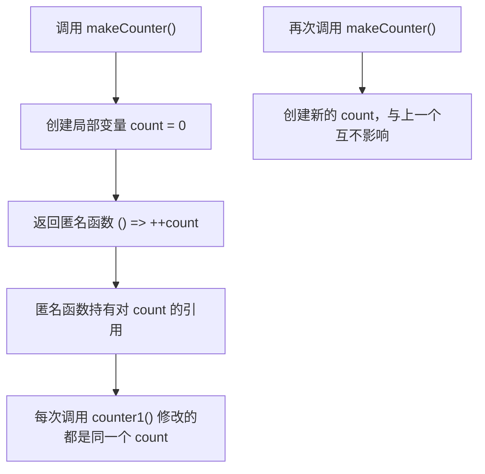

# 05 函数与闭包

> 函数是程序的基本构件，也是 C 程序员最熟悉的东西之一。但 Dart 的函数在 C 的基础上多了三样能力：可选参数与命名参数、函数作为一等公民、闭包捕获词法作用域。这三样合起来，让 Dart 能自然地写出高阶函数与回调——Flutter 的每一个事件处理都在用它们。本章从函数定义讲到闭包，最后用递归收尾。

---

## 一、函数定义：C 与 Dart 对照

```c
/* C：需要先声明原型，定义可以放在后面 */
int add(int a, int b);            /* 原型声明 */
int add(int a, int b) { return a + b; }

int main(void) {
    printf("%d\n", add(2, 3));
    return 0;
}
```

```dart
// Dart：没有头文件，没有原型声明，定义顺序不影响调用
int add(int a, int b) {
  return a + b;
}

void main() {
  print(add(2, 3));   // 5
}
```

| 维度 | C | Dart |
|------|---|------|
| 声明与定义 | 分离，需要原型或头文件 | 合二为一，不需要声明 |
| 定义顺序 | 调用前必须可见 | 任意顺序，编译器全局扫描 |
| 函数嵌套 | 不允许（GCC 扩展除外） | 允许在函数内定义局部函数 |
| 默认参数 | 无 | 可选参数可带默认值 |
| 函数指针 | `int (*f)(int, int)` | `int Function(int, int)` |

**Dart 没有函数重载**，用可选参数与命名参数替代重载的需求。

---

## 二、参数的三种形态

### 2.1 必需位置参数与可选位置参数

```dart
int sub(int a, int b) => a - b;   // 两个必需位置参数

// greeting 可省略，省略时用默认值
String greet(String name, [String greeting = '你好']) => '$greeting，$name';

void main() {
  print(sub(5, 3));               // 2
  print(greet('小明'));           // 你好，小明
  print(greet('小明', '早上好'));  // 早上好，小明
}
```

### 2.2 命名参数

```dart
// required 标记的命名参数必须传，其余可省略
String createUser({required String name, int age = 0, String? city}) {
  return '$name/$age/${city ?? '未填写'}';
}

void main() {
  // 调用时必须写参数名，顺序可以打乱
  print(createUser(name: '小红', city: '北京'));   // 小红/0/北京
  print(createUser(age: 18, name: '小蓝'));        // 小蓝/18/未填写
  // createUser();                                 // 编译错误：缺少 name
}
```

### 2.3 规则与对比

| 规则 | 说明 |
|------|------|
| 位置与命名不能混用 | 一个函数只能选一种可选形式 |
| 默认值必须是编译期常量 | 不能写 `DateTime.now()` 这类运行期表达式 |
| `required` 只能用于命名参数 | 位置参数本来就必需 |
| 命名参数调用必须写 `名字: 值` | Dart 独有语法，不是 C 的指定初始化器 |

| 需求 | C | Dart |
|------|---|------|
| 可选参数 | 无，靠多个函数或变参 | `[int x = 0]` |
| 命名参数 | 无 | `{required int x, int y = 0}` |

---

## 三、箭头函数 `=>`

当函数体只有一个表达式时，可以用箭头简写：

```dart
// 完整写法
int square(int x) {
  return x * x;
}

// 箭头写法，二者完全等价；右边只能是一个表达式
int square2(int x) => x * x;
int abs(int x) => x < 0 ? -x : x;   // 复杂逻辑用三目

void main() {
  print('${square(4)} ${square2(4)} ${abs(-3)}');   // 16 16 3
}
```

`=>` 在 Flutter 中无处不在，例如按钮回调 `onPressed: () => setState(...)`。

---

## 四、函数是一等公民

Dart 的函数可以赋值给变量、作为参数传递、作为返回值——这叫「一等公民」。C 只能通过函数指针部分实现：

| 能力 | C | Dart |
|------|---|------|
| 函数类型写法 | `int (*f)(int, int)` | `int Function(int, int)` |
| 赋值给变量 | `int (*f)(int,int) = add;` | `final f = add;` |
| 作为参数 | `void run(int (*f)(int))` | `void run(int Function(int) f)` |
| 作为返回值 | 返回函数指针 | 直接返回函数或闭包 |
| 匿名函数 | 无 | `(int x) => x * 2` |

```dart
int add(int a, int b) => a + b;

// 参数 op 的类型是「接收两个 int、返回 int 的函数」
int apply(int a, int b, int Function(int, int) op) => op(a, b);

void main() {
  final operation = add;               // 1. 赋值给变量
  print('${operation(2, 3)} ${apply(3, 4, add)}');       // 5 7
  print(apply(3, 4, (a, b) => a * b));                   // 2/3. 匿名函数作参数：12

  int Function(int, int) pick(bool useAdd) => useAdd ? add : (a, b) => a - b;
  print(pick(false)(10, 4));                             // 4. 函数作返回值：6
}
```

C 中对应的函数指针传参写法是 `int apply(int a, int b, int (*op)(int, int))`，但没有闭包，也无法携带状态。

---

## 五、匿名函数与闭包

### 5.1 匿名函数

没有名字的函数，通常作为参数直接传入：

```dart
void main() {
  final nums = [1, 2, 3, 4];
  // (int x) => x * 2 是匿名函数；类型可推断时能省略参数类型与括号
  print(nums.map((int x) => x * 2).toList());    // [2, 4, 6, 8]
  print(nums.where((x) => x.isEven).toList());   // [2, 4]
}
```

### 5.2 闭包：捕获词法作用域

闭包是「能记住并访问其定义位置变量」的函数：

```dart
// 返回一个计数器函数
int Function() makeCounter() {
  var count = 0;            // 局部变量
  return () => ++count;     // 匿名函数捕获了 count
}

void main() {
  final counter1 = makeCounter();
  final counter2 = makeCounter();
  print('${counter1()} ${counter1()} ${counter2()}');   // 1 2 1，各自独立的 count
}
```



与 C 对照：

| 维度 | C | Dart |
|------|---|------|
| 函数内定义函数 | 不允许 | 支持 |
| 捕获外部变量 | 不支持，只能靠参数传递 | 支持，按引用捕获 |
| 模拟闭包 | 结构体 + 函数指针 + 手动传状态 | 语言原生支持 |
| 生命周期 | 栈变量随函数返回销毁 | 被闭包引用的变量由 GC 保活 |

C 中模拟同样的计数器需要把状态显式打包：

```c
/* C：结构体 + 函数指针模拟闭包，状态必须手动传递 */
typedef struct { int count; } Counter;
int next(Counter *c) { return ++c->count; }   /* Counter c1 = {0}; next(&c1); */
```

### 5.3 循环中的闭包捕获

这是最容易踩的坑，Dart 的行为与 C 不同：

```dart
void main() {
  final fns = <int Function()>[];
  for (var i = 0; i < 3; i++) {
    fns.add(() => i);
  }
  print(fns.map((f) => f()).toList());   // [0, 1, 2]
}
```

Dart 的 for 循环**每次迭代都创建新的循环变量绑定**，三个闭包各自捕获不同的 `i`。C 中若用函数指针数组做同样的事，所有函数会共享同一个 `i` 并读到最终值。
---

## 六、高阶函数

接收函数作为参数、或返回函数的函数，称为高阶函数：

```dart
// 接收函数参数
List<int> filter(List<int> list, bool Function(int) keep) {
  return [for (final x in list) if (keep(x)) x];
}

// 返回函数
int Function(int) multiplier(int factor) => (x) => x * factor;

void main() {
  print(filter([1, 2, 3, 4, 5, 6], (x) => x % 2 == 0));   // [2, 4, 6]
  final triple = multiplier(3);
  print(triple(7));                                        // 21
}
```

标准库中 `List` 的 `map`、`where`、`fold`、`reduce`、`sort` 都接收函数参数，在 [[dart/1入门/06_集合与迭代|06 集合与迭代]] 会系统使用。C 的 `qsort` 接收比较函数指针，是最典型的高阶函数。

---

## 七、typedef：给函数类型起名字

复杂函数类型写起来冗长，`typedef` 可以起别名：

```dart
typedef Compare = int Function(int a, int b);
typedef IntUnaryOp = int Function(int x);

int ascending(int a, int b) => a.compareTo(b);
int descending(int a, int b) => b.compareTo(a);

void sortWith(List<int> list, Compare compare) => list.sort(compare);

void main() {
  final list = [3, 1, 4, 1, 5];
  sortWith(list, ascending);
  print(list);               // [1, 1, 3, 4, 5]
  sortWith(list, descending);
  print(list);               // [5, 4, 3, 1, 1]
  IntUnaryOp square = (x) => x * x;
  print(square(6));          // 36
}
```

| 维度 | C | Dart |
|------|---|------|
| 语法 | `typedef int (*Compare)(int, int);` | `typedef Compare = int Function(int, int);` |
| 别名本质 | 函数指针类型 | 函数类型（可带命名参数信息） |
| 可读性 | 星号与括号易写错 | 接近自然语言 |

---

## 八、递归

递归函数就是调用自身的函数：

```dart
// 阶乘
int factorial(int n) {
  if (n <= 1) return 1;      // 收敛条件
  return n * factorial(n - 1);
}

void main() {
  print(factorial(5));   // 120
}
```

| 维度 | C | Dart |
|------|---|------|
| 递归写法 | 相同 | 相同 |
| 尾调用优化 | 编译器可能做（不保证） | **不做**，纯 Dart 无尾调用消除 |
| 栈溢出 | 段错误（Segmentation fault） | 抛 `StackOverflowError`，可被捕获 |

```dart
int deep(int n) => n == 0 ? 0 : deep(n - 1) + 1;

void main() {
  try {
    deep(1000000);            // 递归过深
  } catch (e) {
    print(e.runtimeType);     // StackOverflowError
  }
}
```
栈溢出在 Dart 中是**可捕获的异常**而不是进程崩溃，但捕获后栈已接近耗尽，正确做法是改写为循环。

---

## 九、顶层函数与方法

```dart
// 1. 顶层函数：直接定义在库的顶层，main 就是顶层函数
int topLevel(int x) => x + 1;

class Calculator {
  static int add(int a, int b) => a + b;   // 2. 静态方法：不需要实例
  int value = 0;                           // 3. 实例方法：需要对象
  void accumulate(int x) => value += x;
}

void main() {
  print('${topLevel(1)} ${Calculator.add(2, 3)}');   // 2 5
  final c = Calculator()..accumulate(10)..accumulate(5);
  print(c.value);                                    // 15
}
```

| 形式 | 定义位置 | 调用方式 | C 对应 |
|------|----------|----------|--------|
| 顶层函数 | 文件顶层 | 直接调用 | 普通全局函数 |
| 静态方法 | 类内，带 `static` | `类名.方法()` | 无（类似库函数命名空间） |
| 实例方法 | 类内 | `对象.方法()` | 接收结构体指针的函数 |
| 局部函数 | 另一个函数内部 | 作用域内直接调用 | 无（GCC 嵌套函数除外） |
| 匿名函数 | 表达式位置 | 变量或直接调用 | 无 |

类与方法的完整机制在 [[dart/1入门/07_面向对象|07 面向对象]] 展开。

---

## 常见坑

1. **命名参数调用忘写参数名**：`createUser('小红')` 是语法错误，必须 `createUser(name: '小红')`
2. **参数形式或默认值写错**：默认值必须是编译期常量；一个函数不能同时使用 `[]` 与 `{}`
3. **箭头函数塞入语句**：`=>` 右边只能是表达式，赋值、`if`、循环都必须用块体
4. **误以为闭包捕获的是值的拷贝、循环闭包行为与 C 相同**：Dart 按引用捕获且 for 每次迭代新建绑定，输出 `[0,1,2]`
5. **深递归不设终止条件或深度过大**：会抛 `StackOverflowError`，递归必须有明确的收敛条件
6. **`typedef` 与变量名混淆**：类型别名用大驼峰，且不能与已有类型同名

---

## 本章小结

- Dart 函数无需原型声明，定义顺序无关；没有函数重载，用可选参数替代
- 参数三形态：必需位置参数、可选位置参数 `[]`、命名参数 `{}`，`required` 标记必填
- 默认值必须是编译期常量；位置参数与命名参数不能混用
- `=>` 是单表达式简写，等价于 `{ return 表达式; }`
- 函数是一等公民，类型写法 `int Function(int, int)`，对应 C 的函数指针但支持闭包
- 闭包捕获词法作用域中的变量，生命周期由 GC 保证；for 循环每次迭代创建新绑定
- `typedef` 给函数类型起别名，语法比 C 的函数指针 typedef 更清晰；函数有顶层、静态、实例、局部、匿名五种存在形式
- Dart 不做尾调用优化，深递归抛 `StackOverflowError`（可捕获），应优先改迭代

---

## 练习

| 题号 | 题目 | 链接 | 知识点 |
|------|------|------|--------|
| P5735 | 距离函数 | https://www.luogu.com.cn/problem/P5735 | 函数定义、参数 |

题目给出平面上两点的坐标 `x1 y1 x2 y2`，要求输出两点间的距离，保留 4 位小数。要点是定义一个接收四个 `double` 参数的函数，用勾股定理计算，再在主函数中读入参数并调用。`sqrt` 来自 `dart:math`，输出用 `toStringAsFixed(4)`。

```dart
import 'dart:io';
import 'dart:math';

// 距离函数：四个位置参数，返回 double
double distance(double x1, double y1, double x2, double y2) {
  final dx = x1 - x2;
  final dy = y1 - y2;
  return sqrt(dx * dx + dy * dy);
}

void main() {
  final parts = stdin.readLineSync()!.trim().split(RegExp(r'\s+'));
  final x1 = double.parse(parts[0]);
  final y1 = double.parse(parts[1]);
  final x2 = double.parse(parts[2]);
  final y2 = double.parse(parts[3]);
  print(distance(x1, y1, x2, y2).toStringAsFixed(4));
}
```

- 返回目录：[[dart/dart目录|Dart 教程目录]]
