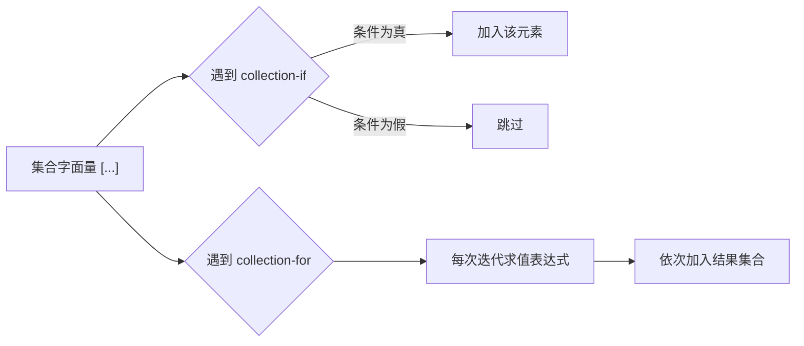

# 06 集合与迭代

> 在 C 里，批量数据只有两个选择：定长数组和手写链表，扩容、去重、查找都要自己实现。Dart 内置三大集合——List、Set、Map，把动态扩容、哈希查找、去重这些脏活全部接管；再配合 Iterable 的惰性求值与 Records 元组，处理数据的代码量能压到 C 的几分之一。本章从 List 与 C 数组的差异讲起，覆盖集合字面量、展开语法、collection-if/for、惰性迭代方法，最后落到 Dart 3 的 Records。

---

## 一、List 与 C 数组对比

C 数组是「一块固定内存 + 下标访问」，长度编译期确定或由 `malloc` 手工管理；Dart 的 List 是对象，长度可变，越界访问抛异常而不是踩到未定义行为。

```c
/* C：长度固定，越界不检查，扩容要手动 realloc */
int arr[3] = {1, 2, 3};
printf("%d\n", arr[3]);                 /* 未定义行为：读到别的内存 */
int *big = malloc(10 * sizeof(int));    /* 想变长？自己 realloc */
```

```dart
// Dart：长度可变，越界立刻抛 RangeError
void main() {
  final list = [1, 2, 3];
  list.add(4);                          // 自动扩容
  print(list);                          // [1, 2, 3, 4]
  print(list[1]);                       // 2
  try {
    print(list[10]);                    // 越界
  } on RangeError catch (e) {
    print('越界: ${e.message}');        // 越界: Invalid value
  }
}
```

| 维度 | C 数组 | Dart List |
|------|--------|-----------|
| 长度 | 编译期固定，或 malloc 手工管理 | 动态，add/remove 自动调整 |
| 越界访问 | 未定义行为，可能读到垃圾或崩溃 | 抛 `RangeError`，进程安全 |
| 内存管理 | `malloc/free` 手工配对 | GC 自动回收 |
| 存放类型 | 元素类型相同（编译器检查） | 泛型 `List<T>`，运行期也检查 |
| 扩容 | `realloc` 手动复制 | 内部自动扩容（近似翻倍策略） |
| 多维 | `int arr[3][4]` 连续内存 | `List<List<int>>`，行是独立对象 |

---

## 二、List 的常用操作

```dart
void main() {
  final nums = [3, 1, 4, 1, 5];        // 类型推断为 List<int>

  nums.add(9);                         // 尾部追加
  nums.insert(0, 2);                   // 在下标 0 处插入
  print(nums);                         // [2, 3, 1, 4, 1, 5, 9]

  nums.remove(1);                      // 删除第一个值为 1 的元素
  nums.removeAt(0);                    // 删除下标 0 的元素
  nums.removeLast();                   // 删除末尾
  print(nums);                         // [3, 4, 1, 5]

  nums.sort();                         // 原地升序，默认 compareTo
  nums.sort((a, b) => b - a);          // 自定义降序
  print(nums);                         // [5, 4, 3, 1]

  final part = nums.sublist(1, 3);     // [1, 3)，左闭右开，返回新 List
  print('$part ${nums.length} ${nums.first} ${nums.last}');   // [4, 3] 4 5 1
  print('${nums.contains(4)} ${nums.indexOf(3)}');            // true 2
  nums.clear();                        // 清空
  print(nums.isEmpty);                 // true
}
```

| 成员 | 作用 | 复杂度 |
|------|------|--------|
| `length` / `isEmpty` | 元素个数 / 判空 | O(1) |
| `first` / `last` | 首尾元素，空 List 抛 `StateError` | O(1) |
| `contains(x)` / `indexOf(x)` | 是否包含 / 首次下标（无则 -1） | O(n) |
| `add` / `addAll` | 尾部追加 | 摊还 O(1) |
| `insert(i, x)` | 下标处插入 | O(n) |
| `remove` / `removeAt` | 按值 / 按下标删除 | O(n) |
| `sort` | 原地排序 | O(n log n) |
| `sublist(a, b)` | 切片，返回新 List | O(b-a) |

---

## 三、固定长度 List

`List.filled` 与 `List.generate` 可创建定长 List，`growable: false` 后禁止增删，只能改元素——这最接近 C 数组的语义。

```dart
void main() {
  // 定长 List：长度 3，初始值都是 0，不可 add/remove
  final fixed = List<int>.filled(3, 0, growable: false);
  fixed[0] = 10;
  fixed[1] = 20;
  fixed[2] = 30;
  print(fixed);                 // [10, 20, 30]
  // fixed.add(40);             // 运行时报错：Cannot add to a fixed-length list

  // 生成式：下标 i 映射为 i*i
  final squares = List<int>.generate(5, (i) => i * i, growable: false);
  print(squares);               // [0, 1, 4, 9, 16]

  // 二维：不能用 List.filled 共享同一行对象
  final wrong = List<List<int>>.filled(3, <int>[]);
  wrong[0].add(1);
  print(wrong);                 // [[1], [1], [1]] 三个行是同一个对象

  final matrix = List.generate(3, (_) => List<int>.filled(3, 0));
  matrix[1][2] = 7;             // 每个行独立
  print(matrix);                // [[0,0,0],[0,0,7],[0,0,0]]
}
```

| 构造方式 | 长度 | 可增删 | 典型场景 |
|----------|------|--------|----------|
| `[1, 2, 3]` | 动态 | 是 | 日常列表 |
| `List<int>.filled(n, v)` | 固定（默认） | 否 | 定长缓冲、二维表 |
| `List<int>.filled(n, v, growable: true)` | 动态 | 是 | 需要可变长度 |
| `List<int>.generate(n, f)` | 固定 | 否 | 按下标生成 |
| `List<int>.empty(growable: true)` | 动态 | 是 | 空列表起步 |

---

## 四、Set：自动去重

Set 是无序、元素唯一的集合，底层是哈希表，查找是 O(1)（对比 List 的 O(n)）。

```dart
void main() {
  final a = {1, 2, 3, 4};          // Set 字面量（注意与 Map 的 {} 区分）
  final b = <int>{3, 4, 5, 6};

  a.add(2);                        // 已存在，无效果
  print(a);                        // {1, 2, 3, 4}
  print(a.union(b));               // 并集 {1, 2, 3, 4, 5, 6}
  print(a.intersection(b));        // 交集 {3, 4}
  print(a.difference(b));          // 差集 {1, 2}
  print(a.contains(3));            // true，O(1)

  // 去重的最常用写法；Set 默认实现保持插入顺序
  final raw = [1, 2, 2, 3, 3, 3];
  print(raw.toSet().toList());     // [1, 2, 3]
  print({...raw}.toList());        // [1, 2, 3]
}
```

| 操作 | 语法 | 复杂度 |
|------|------|--------|
| 添加 / 删除 / 包含 | `add(x)` / `remove(x)` / `contains(x)` | O(1) |
| 并 / 交 / 差 | `union` / `intersection` / `difference` | O(n) |
| 去重 | `list.toSet()` | O(n) |

---

## 五、Map：键值对

C 没有内置哈希表，要么手写开放寻址/链地址法，要么引入第三方库。Dart 的 Map 就是开箱即用的哈希表。

```dart
void main() {
  final ages = <String, int>{'小明': 18, '小红': 20};
  ages['小蓝'] = 22;                 // 新增
  ages['小明'] = 19;                 // 覆盖
  print(ages);                       // {小明: 19, 小红: 20, 小蓝: 22}

  print(ages['小红']);               // 20
  print(ages['不存在']);             // null，键不存在返回 null
  print(ages.containsKey('小明'));   // true
  print(ages.length);                // 3

  ages.remove('小蓝');
  for (final entry in ages.entries) {
    print('${entry.key} -> ${entry.value}');
  }
  // 只遍历键：ages.keys；只遍历值：ages.values
  print(ages.values.reduce((a, b) => a + b));   // 39
}
```

```c
/* C：手写哈希表要处理哈希函数、冲突、扩容、释放，上百行起步 */
typedef struct { char key[32]; int value; int used; } Slot;
Slot table[100];
unsigned hash(const char *s) { unsigned h = 0; while (*s) h = h * 31 + *s++; return h; }
```

| 维度 | C 手写哈希表 | Dart Map |
|------|--------------|----------|
| 实现成本 | 哈希函数、冲突、扩容全手写 | 语言内置 |
| 查找复杂度 | O(1) 期望 | O(1) 期望 |
| 键类型 | 通常限定字符串/整数 | 任意重写了 `==` 与 `hashCode` 的类型 |
| 内存管理 | 手动 malloc/free | GC |
| 遍历 | 手动扫桶 | `entries` / `keys` / `values` |

---

## 六、展开运算符与 collection-if/for

```dart
void main() {
  final a = [1, 2];
  print([0, ...a, 3]);               // [0, 1, 2, 3]，... 展开

  List<int>? maybe = null;
  print([0, ...?maybe, 3]);          // [0, 3]，...? 遇 null 直接跳过

  final map1 = {'a': 1};
  print({'b': 2, ...map1});          // {b: 2, a: 1}，后者覆盖同名键
  print({0, ...{1, 2}});             // {0, 1, 2}，Set 同样支持展开

  // collection-if：只保留及格的
  final scores = [88, 45, 92, 60];
  final passed = [for (final s in scores) if (s >= 60) s];
  print(passed);                     // [88, 92, 60]

  // collection-for + 索引
  final labels = [for (var i = 0; i < scores.length; i++) '第${i + 1}题:${scores[i]}'];
  print(labels);                     // [第1题:88, 第2题:45, 第3题:92, 第4题:60]

  final debug = true;
  final config = {
    'name': 'app',
    if (debug) 'logLevel': 'verbose',      // 条件键值对
    for (var i = 0; i < 2; i++) 'k$i': i,  // 循环生成键值对
  };
  print(config);                     // {name: app, logLevel: verbose, k0: 0, k1: 1}
}
```



---

## 七、Iterable 与惰性求值

`map`、`where` 返回的不是 List，而是 **Iterable**——它们不立即计算，只在被遍历时才逐个产生元素，这叫惰性求值。C 中若想模拟，需要手写回调驱动的迭代器，语言层面没有对应物。

```dart
void main() {
  final nums = [1, 2, 3, 4, 5];

  // map 是惰性的：此时什么都不会打印
  final lazy = nums.map((x) {
    print('计算 $x');           // 直到 toList/for 遍历时才执行
    return x * x;
  });
  print('还没开始');             // 先打印这句
  print(lazy.toList());          // 逐个触发上面的 print，输出 [1, 4, 9, 16, 25]

  // 惰性链：where 之后再 map，元素一个个流过，不产生中间列表
  final evenSquares = nums.where((x) => x.isEven).map((x) => x * x);
  print(evenSquares.toList());   // [4, 16]
}
```

| 维度 | C | Dart Iterable |
|------|---|---------------|
| 迭代抽象 | 下标 + 长度，或回调函数 | `Iterator<T>` + `moveNext()` |
| 惰性 | 无（循环总是立即执行） | map/where 等返回惰性序列 |
| 链式组合 | 手写多趟循环 | `where().map().take()` 链式 |
| 重复遍历 | 每次重跑循环 | 惰性 Iterable 每次遍历重新计算，需 `toList()` 固化 |

---

## 八、常用迭代方法

```dart
void main() {
  final nums = [1, 2, 3, 4, 5];

  print(nums.map((x) => x * 2).toList());        // [2, 4, 6, 8, 10]
  print(nums.where((x) => x.isOdd).toList());    // [1, 3, 5]
  print(nums.fold<int>(0, (acc, x) => acc + x)); // 15，带初始值
  print(nums.reduce((a, b) => a + b));           // 15，无初始值，空集合抛错
  print('${nums.any((x) => x > 4)} ${nums.every((x) => x > 0)}');   // true true
  print(nums.take(2).toList());                  // [1, 2]
  print(nums.skip(3).toList());                  // [4, 5]
  print(nums.takeWhile((x) => x < 3).toList());  // [1, 2]
  print(nums.skipWhile((x) => x < 3).toList());  // [3, 4, 5]

  // firstWhere 可带 orElse，找不到时避免抛 StateError
  print(nums.firstWhere((x) => x > 9, orElse: () => -1));   // -1
  // expand：把每个元素映射成多个，再拉平
  print([[1, 2], [3, 4]].expand((e) => e).toList());        // [1, 2, 3, 4]
}
```

| 方法 | 语义 | 返回 | 空集合行为 |
|------|------|------|-----------|
| `map` / `where` | 变换 / 过滤 | 惰性 Iterable | 空 |
| `fold` / `reduce` | 带 / 不带初始值归约 | 累加结果 | 返回初始值 / 抛 `StateError` |
| `any` / `every` | 存在 / 全部 | bool | false / true |
| `take(n)` / `skip(n)` | 取前 n / 跳过前 n | 惰性 Iterable | 空 |
| `firstWhere` | 首个满足者 | 元素 | `orElse` 或抛错 |

---

## 九、Records：Dart 3 的轻量元组

C 中函数要多返回值，只能通过输出参数指针或返回结构体。Dart 3 的 Records 用一对括号直接表达「多个值的组合」，且支持解构。

```dart
// 位置字段记录：(int, int) 表示两个 int
(int, int) divmod(int a, int b) => (a ~/ b, a % b);

// 命名字段记录：类型里写明字段名，可读性更好
({int quotient, int remainder}) divmodNamed(int a, int b) =>
    (quotient: a ~/ b, remainder: a % b);

void main() {
  final (q, r) = divmod(17, 5);          // 位置字段解构
  print('$q $r');                        // 3 2

  final (:quotient, :remainder) = divmodNamed(17, 5);   // 命名字段解构
  print('$quotient $remainder');         // 3 2

  final record = (name: '小明', age: 18);
  print('${record.name} ${record.age}'); // 小明 18
  print((1, 2) == (1, 2));               // true，按字段比较相等
}
```

| 维度 | C | Dart Records |
|------|---|--------------|
| 多返回值 | 输出参数指针 / 结构体 | `(int, int)` / `({int q, int r})` |
| 类型声明 | 需先定义 struct | 类型即字面形状，无需声明 |
| 解构 | 无 | `final (a, b) = ...` |
| 相等性 | 手动逐字段比较 | 自动按字段比较 |
| 适用场景 | 任何组合 | 临时组合 2-5 个值；长期建模仍用 class |

---

## 常见坑

1. **`List.filled` 填可变对象会共享引用**：`List.filled(3, <int>[])` 的三个元素是同一个 List，用 `List.generate(3, (_) => <int>[])` 才对
2. **修改集合的同时遍历它**：`for (final x in list) { list.remove(x); }` 抛 `ConcurrentModificationError`，应先 `toList()` 拷贝或收集后再删
3. **误以为 `map`/`where` 立即执行**：它们返回惰性 Iterable，不遍历就不执行，且每次遍历会重新计算，需要结果时用 `toList()`
4. **`reduce` 用于空集合**：抛 `StateError: No element`，空集合用 `fold` 给初始值
5. **可变对象作 Map 的键**：若对象作为键之后被修改，`hashCode` 变化会导致再也找不到它；键应使用不可变类型（String/int/const 对象）
6. **Set 字面量与 Map 字面量混淆**：`{}` 是空的 Map，空 Set 必须写 `<int>{}` 或 `Set<int>()`
7. **`sublist(a, b)` 右开区间**：`sublist(1, 3)` 取的是下标 1、2 两个元素，与 C 的循环边界习惯一致但常被忽略

---

## 本章小结

- List 动态扩容、越界抛 `RangeError`，彻底告别 C 数组的未定义行为与手工 `realloc`
- `List.filled` / `List.generate` 创建定长表，`growable: false` 时语义最接近 C 数组
- Set 基于哈希，自动去重，支持并、交、差；Map 是内置哈希表，键值对查找 O(1)
- 展开运算符 `...` 拼接集合，`...?` 在源为 null 时安全跳过
- collection-if / collection-for 让条件与循环直接写在字面量里，替代大量临时变量
- `map`/`where` 返回惰性 Iterable，链式组合不产生中间集合，需要具体结果时 `toList()` 固化
- `fold`/`reduce`/`any`/`every`/`take`/`skip` 覆盖绝大多数聚合需求
- Records 是匿名值组合，支持位置与命名字段、解构与自动相等比较，替代 C 的输出参数

---

## 练习

| 题号 | 题目 | 链接 | 知识点 |
|------|------|------|--------|
| P5728 | 旗鼓相当的对手 | https://www.luogu.com.cn/problem/P5728 | 二维数组、条件统计 |

题目给出 n 名学生的语文、数学、英语成绩，两名学生「旗鼓相当」的定义是：各科成绩差都不超过 5，且总分差不超过 10。要求统计这样的学生对数。要点是用循环建立二维成绩表，用双重循环枚举所有学生对，内层用 `every` 或逐个绝对值判断。

```dart
import 'dart:io';

void main() {
  final lines = stdin.readAsLinesSync().where((l) => l.trim().isNotEmpty).toList();
  final n = int.parse(lines[0].trim());
  // scores[i] = [语文, 数学, 英语]
  final scores = <List<int>>[
    for (var i = 1; i <= n; i++)
      lines[i].trim().split(RegExp(r'\s+')).map(int.parse).toList(),
  ];
  final totals = [for (final s in scores) s.reduce((a, b) => a + b)];

  var count = 0;
  for (var i = 0; i < n; i++) {
    for (var j = i + 1; j < n; j++) {
      // 三科差值绝对值都不超过 5
      final close = List.generate(3, (k) => (scores[i][k] - scores[j][k]).abs())
          .every((d) => d <= 5);
      if (close && (totals[i] - totals[j]).abs() <= 10) count++;
    }
  }
  print(count);
}
```

- 返回目录：[[dart/dart目录|Dart 教程目录]]
