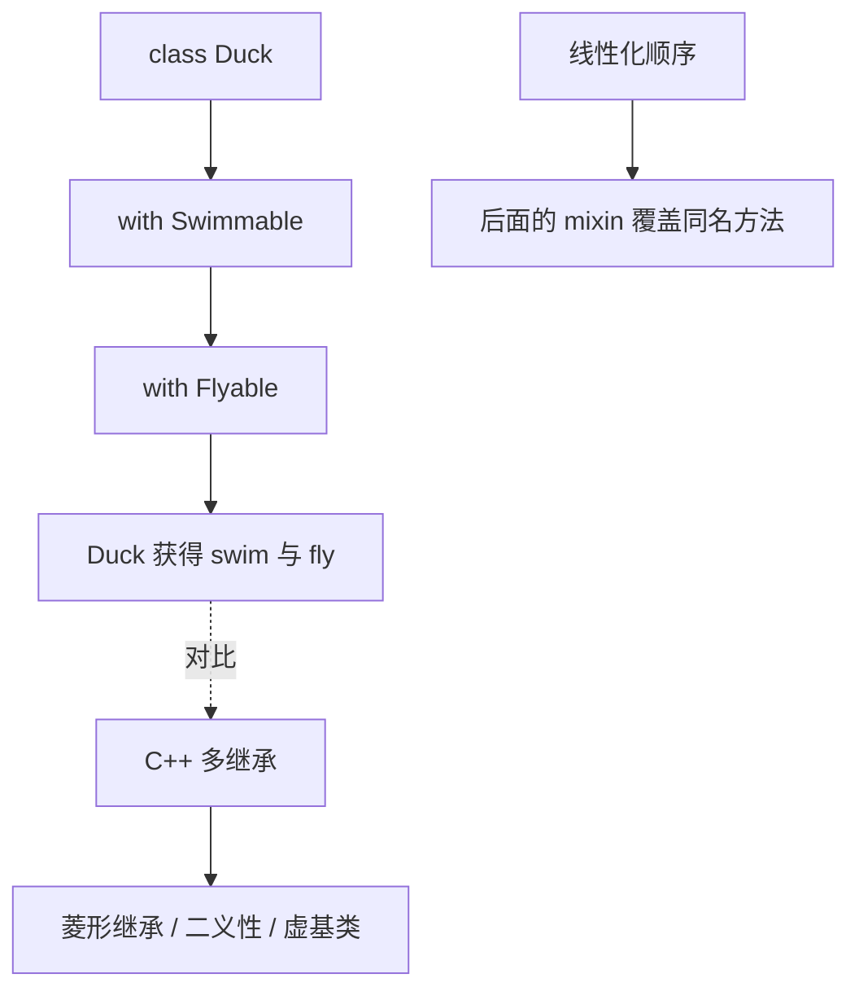

# 07 面向对象

> 在 C 里，一个「学生」要用 struct 存数据、用一组自由函数操作它，函数与数据的关联只存在于命名约定和注释里。Dart 的 class 把数据、行为与访问控制封装成一个整体，再通过构造器、继承、接口、mixin 与扩展方法形成完整的对象模型。本章从 struct 的局限讲起，覆盖构造器的多种形态、继承与重写、抽象类与接口、mixin 复用、extension 扩展，以及 Dart 3 的类修饰符与增强枚举。

---

## 一、从 struct 到 class

C 的 struct 只有数据，函数与数据的关联靠约定；Dart 的 class 把两者封装在一起，并让调用者不必知道内部结构：

```dart
class Student {
  String name;
  int chinese;
  int math;
  int english;

  Student(this.name, this.chinese, this.math, this.english);

  int get total => chinese + math + english;   // getter，像属性一样访问
  bool get isPass => total >= 180;
}

void main() {
  final s = Student('小明', 70, 80, 90);
  print('${s.total} ${s.isPass}');   // 240 true
}
```

| 维度 | C struct | Dart class |
|------|----------|------------|
| 成员 | 只有数据字段 | 字段、方法、getter/setter |
| 访问控制 | 无，靠头文件暴露约定 | `_` 前缀库私有，public 默认 |
| 行为绑定 | 自由函数 + 指针 | 实例方法，`this` 隐式可用 |
| 继承 | 无（嵌套 struct 只是组合） | `extends` 单继承 + 接口 + mixin |
| 多态 | 函数指针模拟 | 虚方法表原生支持 |

---

## 二、字段、方法与访问器

```dart
class Circle {
  double radius;                      // 实例字段
  static const double pi = 3.1415926; // 静态常量，全类共享

  Circle(this.radius);

  double get area => pi * radius * radius;   // getter
  double get diameter => radius * 2;
  set diameter(double d) => radius = d / 2;  // setter，赋值时触发

  @override
  String toString() => 'Circle(r=$radius)';
}

void main() {
  final c = Circle(2);
  c.diameter = 10;                            // 触发 setter，radius 变为 5
  print('${c.area} ${c.diameter} $c');        // 78.539816 10.0 Circle(r=5.0)
}
```

- 字段可加 `final`，只能通过构造器赋值一次；getter/setter 让「计算属性」和普通字段用法一致
- `static` 成员属于类本身，通过 `类名.成员` 访问，对应 C 的文件级全局变量/函数

---

## 三、构造器的多种形态

```dart
class Point {
  final double x;
  final double y;

  Point(this.x, this.y);                          // 默认构造：赋给同名字段
  Point.origin() : x = 0, y = 0;                  // 命名构造 + 初始化列表
  const Point.unit() : x = 1, y = 1;              // const 构造：编译期常量对象

  @override
  String toString() => '($x, $y)';
}

void main() {
  print('${Point(1, 2)} ${Point.origin()} ${Point.unit()}');
  // (1.0, 2.0) (0.0, 0.0) (1.0, 1.0)；identical(常量, 常量) 为 true
}
```

```dart
class Logger {
  final String tag;
  Logger._(this.tag);                  // 私有构造，外部不能直接实例化
  static final Map<String, Logger> _cache = {};
  // factory 工厂构造：同 tag 复用同一个实例，也可返回子类或缓存对象
  factory Logger(String tag) => _cache.putIfAbsent(tag, () => Logger._(tag));
}

void main() => print(identical(Logger('net'), Logger('net')));   // true，来自缓存
```

| 构造器形态 | 语法 | 用途 |
|-----------|------|------|
| 默认构造 | `Point(this.x, this.y)` | 常规初始化 |
| 命名构造 | `Point.origin()` | 多种初始化路径 |
| 初始化列表 | `Point.origin() : x = 0, y = 0` | final 字段、断言、预处理 |
| const 构造 | `const Point.unit()` | 编译期常量对象 |
| factory 构造 | `factory Logger(tag)` | 缓存、返回子类、非构造逻辑 |

---

## 四、this 与 super

```dart
class Animal {
  String name;
  Animal(this.name);
  String speak() => '$name 发出声音';
}

class Dog extends Animal {
  Dog(super.name);                    // super 参数：直接转发给父类构造

  @override
  String speak() => '${super.speak()}：汪汪';   // super 调用父类实现
}

void main() => print(Dog('旺财').speak());   // 旺财 发出声音：汪汪
```

| 关键字 | 含义 | C 对应 |
|--------|------|--------|
| `this` | 当前实例，字段与参数同名时区分 | 函数里的 `self` 指针 |
| `super.name` | 转发参数给父类构造器 | 无（C 无继承） |
| `super.method()` | 调用父类实现 | 无 |

---

## 五、继承、抽象类与接口

```dart
abstract class Shape {
  double get area;                    // 抽象 getter，子类必须实现
  String describe() => '面积是 ${area.toStringAsFixed(2)}';
}

class Square extends Shape {
  final double side;
  Square(this.side);
  @override
  double get area => side * side;
}

void main() {
  print(Square(3).describe());   // 面积是 9.00，多态：父类方法调用子类实现
}
```

`abstract` 类不能实例化，用于定义必须被继承的基类；`@override` 标注重写，写错方法名分析器会报错。Dart 没有独立的 `interface` 关键字，**任何类的隐式接口**都能被 `implements`，且必须重写全部公开成员：

```dart
class JsonSerializable {
  String toJson() => '{}';
}

class User implements JsonSerializable {
  final String name;
  User(this.name);
  @override
  String toJson() => '{"name":"$name"}';   // 必须实现，不继承任何实现
}

void main() => print(User('小明').toJson());   // {"name":"小明"}
```

| 方式 | 语法 | 继承实现 | 继承类型 | 数量限制 |
|------|------|----------|----------|----------|
| 继承 | `extends` | 是 | 是 | 只能一个父类 |
| 接口 | `implements` | 否，全部重写 | 是 | 可多个 |
| 混入 | `with` | 是 | 否（仅是能力） | 可多个 |

### mixin：绕开单继承的能力复用

C++ 的多继承会带来菱形继承与二义性；Dart 用 mixin 给类附加可复用实现，冲突按 `with` 顺序后者覆盖前者：

```dart
mixin Swimmable {
  void swim() => print('$runtimeType 在游泳');
}

mixin Flyable {
  void fly() => print('$runtimeType 在飞');
}
class Duck with Swimmable, Flyable {}    // 鸭子既会游又会飞，输出见上方 mixin 实现
class Plane with Flyable {}              // 飞机只会飞
void main() => Duck().swim();            // Duck 在游泳
```



`mixin` 可 `on` 限定宿主：`mixin Walker on Animal { ... }` 只能混入 Animal 及其子类。

### extension：给已有类型加方法

extension 不改原类就能添加方法，调用风格与实例方法一致：

```dart
extension StringExt on String {
  bool get isPalindrome => this == split('').reversed.join();
  String repeat(int n) => List.filled(n, this).join();
}

void main() {
  print('Level'.isPalindrome);   // true
  print('ab'.repeat(3));         // ababab
}
```

与 C 对比：C 只能写自由函数 `str_repeat(s, n)`，无法以 `'ab'.repeat(3)` 的形式调用；多个同名 extension 冲突时需显式写 `StringExt(s).repeat(3)`。

---

## 六、Dart 3 类修饰符

| 修饰符 | 允许 extends | 允许 implements | 允许 with | 允许实例化 | 典型用途 |
|--------|:---:|:---:|:---:|:---:|----------|
| `abstract` | 是 | 是 | 是 | 否 | 基类契约 |
| `final` | 否 | 是 | 否 | 是 | 禁止外部继承 |
| `base` | 是 | 否 | 是 | 是 | 强制子类也是 base |
| `interface` | 否 | 是 | 否 | 是 | 只当接口用 |
| `sealed` | 是（同库） | 否 | 否 | 否 | 穷尽匹配的封闭族 |

```dart
sealed class Result {}
final class Ok extends Result {
  Ok(this.value);
  final int value;
}
final class Fail extends Result {
  Fail(this.reason);
  final String reason;
}

String describe(Result r) => switch (r) {
      Ok(:final value) => '成功: $value',      // sealed 保证子类穷尽
      Fail(:final reason) => '失败: $reason',  // 无需 default 分支
    };

void main() {
  print(describe(Ok(42)));         // 成功: 42
  print(describe(Fail('超时')));   // 失败: 超时
}
```

---

## 七、枚举

普通枚举适合状态集合；Dart 2.17+ 的增强枚举可带字段、方法与构造器：

```dart
enum Status {
  pending('待处理', 1),
  running('进行中', 2),
  done('已完成', 3);

  const Status(this.label, this.code);   // 增强枚举的 const 构造
  final String label;
  final int code;
  static Status fromCode(int code) => values.firstWhere((s) => s.code == code);
}

void main() {
  print('${Status.running.label} ${Status.fromCode(3)}');   // 进行中 Status.done
  print(Status.values.map((s) => s.name).toList());         // [pending, running, done]
}
```

| 维度 | C 的 enum | Dart enum |
|------|-----------|-----------|
| 本质 | int 常量集合 | 完整类型，有自己的方法与字段 |
| 携带数据 | 不能 | 增强枚举可带字段 |
| 遍历 / 名称 | 手动维护数组 / 无 | `values` / `name` 内置 |
| 类型安全 | 可与 int 混用 | 强类型，不能当 int 用 |

---

## 八、静态成员与可见性

```dart
class Counter {
  static int created = 0;          // 静态字段：全类共享
  int _value = 0;                  // _ 前缀：库私有

  Counter() => created++;          // 每构造一个实例计数加一

  void increment() => _value++;    // 同类内可访问私有成员
  static Counter create() => Counter();   // 静态工厂方法
}

void main() {
  Counter.create();
  Counter.create();
  print(Counter.created);   // 2；访问 _value 会编译错误（跨库私有）
}
```

| 维度 | C | Dart |
|------|---|------|
| 文件内私有 | `static` 修饰全局函数/变量 | `_` 前缀（库级私有） |
| 静态成员 | 无「类」概念 | `static` 字段与方法 |
| 跨文件可见 | 头文件声明即公开 | 无 `_` 即公开，库是边界 |
| 常量 | `#define` / `const` | `static const`，有类型有作用域 |

---

## 九、与 C++/Java 的 OOP 对比总表

| 特性 | C++ | Java | Dart |
|------|-----|------|------|
| 继承 | 多继承 | 单继承 | 单继承 |
| 多实现 | 多继承/虚基类 | 多接口 | 多接口 + mixin |
| 接口关键字 | 纯虚类 | `interface` | 无，任何类可 `implements` |
| 访问控制 | public/protected/private | 同左 | `_` 库私有，其余公开 |
| 构造器重载 | 支持 | 支持 | 命名构造替代 |
| 析构器 | `~T()` | finalize（不推荐） | 无，GC 负责 |
| 空安全 | 无（指针可为 null） | 无（Optional 库） | 类型系统内置 |

---

## 常见坑

1. **构造器不会被继承**：子类必须显式 `super(...)` 或用 `super.name` 参数转发
2. **mixin 顺序决定覆盖关系**：`with A, B` 时 B 的同名方法生效
3. **`implements` 不继承任何实现**：接口方法全部要重写，别指望复用代码
4. **final 字段必须在初始化列表或构造器参数中赋值**：构造体内赋值编译不过；const 构造还要求值可编译期求值
5. **扩展方法不能访问私有成员**：跨库时只能使用公开 API；`sealed` 的子类也必须在同一库
6. **枚举的 `index` 与自定义 `code` 是两回事**：业务编号应自己加字段，不要依赖 `index`

---

## 本章小结

- class 把数据、行为与访问控制封装在一起；`_` 前缀库私有对应 C 的 `static` 文件私有
- 构造器有默认、命名、重定向、初始化列表、const、factory 等形态，命名构造替代构造器重载
- `final` 字段只能构造期赋值；初始化列表还适合写 `assert` 前置校验
- `extends` 单继承、`implements` 多接口、`with` 多 mixin；mixin 按线性化顺序解决冲突
- `extension` 不修改原类即可添加方法；sealed 配合 switch 实现穷尽检查
- 增强枚举可携带字段与方法；`static` 成员属于类，`values`/`name` 是内置能力

---

## 练习

| 题号 | 题目 | 链接 | 知识点 |
|------|------|------|--------|
| P1093 | 奖学金 | https://www.luogu.com.cn/problem/P1093 | 类、排序、结构体思维 |

题目给出 n 名学生的语文、数学、英语成绩，按总分降序、总分相同按语文降序、再相同按学号升序，输出前 5 名的学号与总分。要点是把学生建模成类，自定义比较函数排序，体会 struct 思维迁移到 class 的过程。

```dart
import 'dart:io';

class Student {
  final int id;
  final int chinese;
  final int math;
  final int english;
  Student(this.id, this.chinese, this.math, this.english);
  int get total => chinese + math + english;
  @override
  String toString() => '$id $total';
}

void main() {
  final lines = stdin.readAsLinesSync().where((l) => l.trim().isNotEmpty).toList();
  final n = int.parse(lines[0].trim());
  final students = <Student>[];
  for (var i = 1; i <= n; i++) {
    final p = lines[i].trim().split(RegExp(r'\s+')).map(int.parse).toList();
    students.add(Student(i, p[0], p[1], p[2]));
  }
  students.sort((a, b) {
    if (a.total != b.total) return b.total - a.total;         // 总分降序
    if (a.chinese != b.chinese) return b.chinese - a.chinese; // 语文降序
    return a.id - b.id;                                       // 学号升序
  });
  for (final s in students.take(5)) print(s);
}
```

- 返回目录：[[dart/dart目录|Dart 教程目录]]
