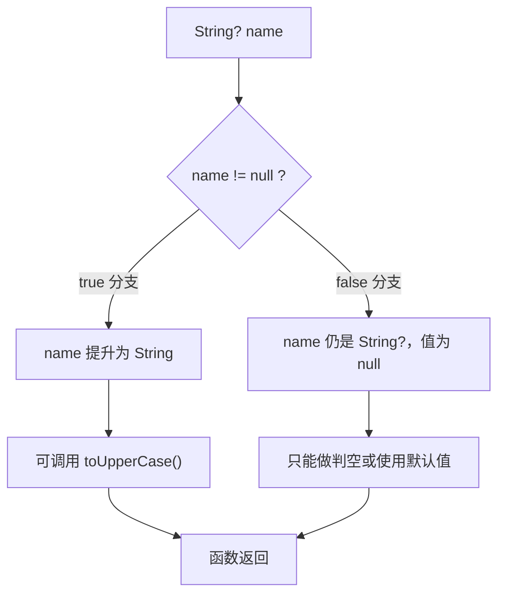

# 08 空安全

> C 程序员对 `NULL` 一定又爱又恨：它是「没有值」的通用表达，也是段错误的头号来源。Dart 的做法是把可空性写进类型系统——`String` 一定不是 null，`String?` 才可能为 null，编译器强制你在使用前处理空值。本章从 C 的 NULL 崩溃与 Java 的 NPE 历史讲起，覆盖可空类型、类型提升、空感知运算符、`late`，以及那些会让类型提升失效的陷阱。

---

## 一、为什么需要空安全

C 的指针可以为 NULL，任何一次解引用前都必须人工检查；漏掉一次，运行期就是崩溃：

```c
/* C：NULL 检查靠人，漏检就是段错误 */
char *find_user(int id);            /* 可能返回 NULL */
int name_len(int id) {
    char *name = find_user(id);
    return strlen(name);            /* 忘记判空：find_user 返回 NULL 时直接崩溃 */
}

int name_len_safe(int id) {
    char *name = find_user(id);
    return name ? (int)strlen(name) : 0;   /* 正确写法：每次都要记得写 */
}
```

Java 的 `NullPointerException`（NPE）同样是历史顽疾，Tony Hoare 把 null 引用称为「十亿美元错误」。Kotlin、Swift、Dart 陆续把可空性提升为类型系统的一部分。Dart 2.12 起默认开启健全空安全（sound null safety）：

```dart
// Dart：findUser 的返回类型写明可空，调用方必须处理
String? findUser(int id) => id == 1 ? '小明' : null;

int nameLen(int id) {
  final name = findUser(id);
  // return name.length;     // 编译错误：String? 上不能直接访问 length
  return name?.length ?? 0;  // 正确：编译期强制处理
}

void main() {
  print(nameLen(1));    // 2
  print(nameLen(2));    // 0
}
```

| 维度 | C | Java | Dart |
|------|---|------|------|
| 空值表达 | `NULL` 指针 | `null` 引用 | `null`，类型上区分 |
| 检查时机 | 运行期崩溃 | 运行期 NPE | 编译期报错 |
| 类型区分 | 无 | 无（注解可选） | `T` 与 `T?` 严格区分 |
| 漏检后果 | 段错误 | NPE | 编译不通过 |
| 默认值 | 未初始化指针是垃圾值 | 引用默认 null | 非空类型必须初始化 |

---

## 二、可空类型与非空类型

Dart 默认**所有类型非空**：`String` 只能装字符串，`int` 只能装整数。要表达「可能没有值」，必须显式写 `?`。

```dart
void main() {
  String name = '小明';       // 非空，永远不可能是 null
  // name = null;             // 编译错误：不能把 null 赋给 String

  String? nickname;            // 可空，未初始化默认就是 null
  print(nickname == null);     // true
  nickname = '明明';
  nickname = null;             // 合法

  int? age;
  print(age ?? '未填写');      // 未填写
}
```

| 类型写法 | 含义 | 能赋 null | 使用限制 |
|----------|------|:---:|----------|
| `String` | 非空字符串 | 否 | 直接调用成员 |
| `String?` | 可能为 null | 是 | 需 `?.`、`!` 或类型提升后才能用 |
| `List<int>` | 非空列表 | 否 | 元素也遵循各自类型 |
| `List<int>?` | 列表本身可能为 null | 是 | 先判空再访问元素 |
| `List<int?>` | 列表非空，元素可能为 null | 元素是 | 遍历时元素需要判空 |

**设计哲学**：让「可能为空」成为需要显式声明的少数派。C 里所有指针都可能是 NULL，代码里必须到处防御；Dart 里只有标了 `?` 的地方才需要防御，其余地方编译器替你保证。

---

## 三、类型提升（flow analysis）

Dart 的流分析会在 `if (x != null)` 之后自动把 `String?` 提升为 `String`，无需强制转换：

```dart
String greet(String? name) {
  if (name != null) {
    return '你好，${name.toUpperCase()}';   // 此分支内 name 被提升为 String
  }
  return '你好，陌生人';
}

String describe(int? n) {
  // 提前返回同样触发提升
  if (n == null) return '无';
  return n.isEven ? '偶数' : '奇数';        // n 已提升为 int
}

void main() {
  print(greet('ming'));    // 你好，MING
  print(describe(4));      // 偶数
}
```

流分析能理解的模式包括：

- `if (x != null)` / `if (x == null) return;` 之后
- `x ?? fallback` 之后右值
- `x is String` 之后的类型提升（从 `Object` 提升为 `String`）
- `if (x case final v?)` 模式匹配



---

## 四、空感知运算符

```dart
class User {
  final String name;
  User(this.name);
}

void main() {
  User? u = null;

  // ?. 安全访问：左边为 null 时整个表达式为 null，不抛异常
  print(u?.name);                 // null
  u = User('小明');
  print(u?.name);                 // 小明

  // ?? 提供默认值：左边为 null 时用右边
  String? input;
  print(input ?? '默认值');        // 默认值
  print(input ??= '补上');         // ??= 为 null 时赋值
  print(input);                   // 补上

  // 链式安全调用
  String? city;
  print(city?.toUpperCase()?.substring(0, 1));   // null，全程不崩

  // ! 断言非空：为 null 时抛 TypeError（不是返回 null）
  String? maybe = 'hello';
  print(maybe!.length);           // 5
  // String? nothing;
  // print(nothing!.length);      // 运行期抛 Null check operator used on a null value
}
```

| 运算符 | 写法 | 左边为 null 时 | 使用建议 |
|--------|------|----------------|----------|
| 安全访问 | `a?.b` | 返回 null | 首选，无风险 |
| 默认值 | `a ?? b` | 取 b | 明确兜底逻辑 |
| 空时赋值 | `a ??= b` | 把 b 赋给 a | 缓存、懒加载 |
| 非空断言 | `a!` | 抛异常 | 仅在逻辑上不可能为 null 时用 |
| 条件调用 | `a?.call()` | 不调用 | 回调可空场景 |

---

## 五、late：延迟初始化

`late` 告诉编译器「这个非空变量稍后一定会被赋值」，把初始化推迟到首次使用前，同时保留非空类型。典型场景：字段依赖构造参数计算、需要访问 `this`、或者初始化成本高想懒执行。

```dart
class Config {
  late final String host;          // 稍后赋值，类型仍是非空 String
  late final int port = _readPort();   // 声明时即可带表达式，首次访问才求值

  Config(this.host);

  int _readPort() {
    print('读取端口配置');
    return 8080;
  }
}

class LazyDemo {
  late String cached;              // 可以晚于构造器赋值
}

void main() {
  final c = Config('localhost');
  print(c.host);                   // localhost，构造器已赋值
  print(c.port);                   // 首次访问触发 _readPort，打印「读取端口配置」后输出 8080
  print(c.port);                   // 第二次访问不再求值

  final d = LazyDemo();
  d.cached = 'ok';
  print(d.cached);                 // ok
  // LazyDemo().cached;            // 未赋值就读取：抛 LateInitializationError
}
```

| 场景 | 不用 late | 用 late |
|------|-----------|---------|
| 字段依赖 `this` 初始化 | 改成 `String?`，处处判空 | `late final String host`，干净 |
| 高成本懒加载 | 手动判空 + 缓存 | `late final x = expensive()` |
| 构造后由 setter 赋值 | 可空字段 | `late`，读取前保证已赋值 |
| 风险 | 无 | 忘记赋值则运行期抛 `LateInitializationError` |

---

## 六、局部变量与字段的提升差异

类型提升对**局部变量**很激进，对**实例字段**很保守——因为字段可能被方法调用或并发修改。

```dart
class Box {
  String? value;

  // 字段：即使判了非空，也不能提升（方法可能改它）
  int badLength() {
    if (value != null) {
      // return value.length;      // 编译错误：value 未被提升
    }
    return 0;
  }

  // 正确做法一：提升到局部变量
  int lengthByLocal() {
    final v = value;
    return v == null ? 0 : v.length;
  }

  // 正确做法二：用 ! 断言
  int lengthByBang() => value!.length;
}

void main() {
  final b = Box()..value = 'hello';
  print('${b.badLength()} ${b.lengthByLocal()} ${b.lengthByBang()}');   // 0 5 5
}
```

让提升失效的常见情况：

| 情况 | 示例 | 原因 |
|------|------|------|
| 实例字段 | `if (field != null) field.x` | 其他代码可能在判空后修改字段 |
| 被闭包捕获的变量 | `if (x != null) { f(() => x); }` | 闭包可能在提升后修改它 |
| getter | `if (obj.value != null)` | 每次访问可能返回不同结果 |
| 非 final 局部变量在提升后被赋值 | `if (x != null) { x = null; x.length; }` | 赋值使提升失效 |

---

## 七、集合中的空安全

```dart
void main() {
  // 元素可空：遍历时必须处理
  final scores = <int?>[90, null, 75];
  var sum = 0;
  for (final s in scores) {
    sum += s ?? 0;               // 空值按 0 计
  }
  print(sum);                    // 165

  // 过滤掉空值后得到非空列表
  final valid = scores.whereType<int>().toList();
  print(valid);                  // [90, 75]

  // 列表本身可空
  List<String>? tags;
  print(tags?.length ?? 0);      // 0

  // Map 的取值天然可空：键不存在返回 null
  final ages = <String, int>{'小明': 18};
  print(ages['小红'] ?? -1);      // -1

  // 空集合 vs null 集合：前者 isEmpty 为 true，后者需要先判空
  final empty = <int>[];
  print(empty.isEmpty);          // true
}
```

| 需求 | 写法 | 结果 |
|------|------|------|
| 过滤 null 元素 | `list.whereType<int>()` | 非空元素的新 Iterable |
| 元素空值兜底 | `s ?? 0` | 替换 null |
| 集合本身判空 | `list?.isEmpty ?? true` | 安全判断 |
| Map 取值兜底 | `map[key] ?? v` | 键不存在时用默认值 |
| 收集非空值 | `[for (final x in list) if (x != null) x]` | 类型仍为 `List<int?>`，需 whereType 或强转 |

---

## 八、与 C/Java/Kotlin 对比

| 能力 | C | Java | Kotlin | Dart |
|------|---|------|--------|------|
| 空值类型 | 所有指针可为 NULL | 所有引用可为 null | `T?` 显式可空 | `T?` 显式可空 |
| 编译期检查 | 无 | 无（`@Nullable` 注解靠工具） | 有 | 有，健全 |
| 安全访问 | `p ? p->x : 0` | 手写判空 | `p?.x` | `p?.x` |
| 默认值 | 三目运算符 | `Optional.orElse` | `?:` | `??` |
| 断言非空 | 无 | `Objects.requireNonNull` | `!!` | `!` |
| 延迟初始化 | 无 | 无 | `lateinit` / `lazy` | `late` |
| 容器空值 | 指针判空 | `Optional` 包装 | `?.` + `?:` | `?.` + `??` |

Kotlin 与 Dart 的语法几乎一一对应：`?.`、`!!`、`?:` 分别对应 Dart 的 `?.`、`!`、`??`。区别在 Dart 的流分析提升更彻底，`if (x != null)` 之后直接可用。

---

## 常见坑

1. **滥用 `!`**：`!` 是「我保证非空」，猜错就是运行期崩溃。能用 `?.`、`??` 或局部变量提升解决时不要用 `!`
2. **以为字段判空后会自动提升**：实例字段永远不提升，先 `final v = field;` 拷到局部变量
3. **闭包捕获导致提升失效**：变量被闭包引用后，流分析不敢提升它，需在闭包外先取非空值
4. **`late` 字段忘记赋值**：读取未赋值的 `late` 变量抛 `LateInitializationError`，且报错点在使用处而非声明处
5. **`List<int?>` 与 `List<int>?` 混淆**：前者元素可空，后者列表可空；`<int?>[]` 不能赋给 `List<int>`
6. **`?.` 链太长导致 null 被静默吞掉**：`a?.b?.c` 中任何一环为 null 结果都是 null，调试时先拆开逐步检查
7. **`??=` 误当 `==` 使用**：`a ??= b` 是赋值语句，不是比较
8. **`firstWhere` 等集合方法在空集合上抛错**：用 `orElse` 提供兜底值

---

## 本章小结

- Dart 默认非空，可空必须显式写 `T?`，把空指针风险从运行期前移到编译期
- 流分析会在判空、提前返回、`is` 判断、模式匹配之后自动做类型提升，局部变量提升最可靠
- 空感知运算符：`?.` 安全访问、`??` 默认值、`??=` 空时赋值、`!` 断言非空（有运行期风险）
- `late` 用于「稍后必定赋值」的非空字段与懒加载，误用会在运行期抛 `LateInitializationError`
- 实例字段、getter、被闭包捕获的变量不会自动提升，需先拷贝到局部变量
- 集合空安全要区分「集合可空」与「元素可空」，`whereType<T>()` 是过滤空元素的利器
- 与 Kotlin 的 `?.`/`!!`/`?:` 几乎一一对应；比 Java Optional 更轻量、比 C 的手工判空更可靠

---

## 练习

| 题号 | 题目 | 链接 | 知识点 |
|------|------|------|--------|
| P5015 | 标题统计 | https://www.luogu.com.cn/problem/P5015 | 字符串、空值处理 |

题目给出一行标题，统计其中可见字符（不含空格与换行）的个数。要点是用 `readLineSync()` 读取可能为空的行，对返回值 `String?` 做空安全处理，再逐字符过滤。

```dart
import 'dart:io';

void main() {
  // readLineSync 返回 String?，EOF 时为 null
  final line = stdin.readLineSync() ?? '';

  // 逐字符统计：非空格字符计入
  var count = 0;
  for (final ch in line.split('')) {
    if (ch != ' ') count++;
  }
  print(count);

  // 等价写法：先去掉所有空白字符再取长度
  // print(line.replaceAll(RegExp(r'\s'), '').length);
}
```

- 返回目录：[[dart/dart目录|Dart 教程目录]]
