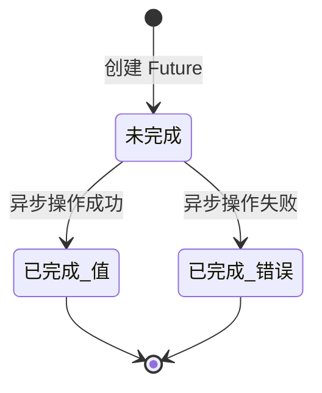

# 09 异步编程

> C 处理 I/O 的两种方式——阻塞 read 与 epoll 事件循环——在 Dart 里被统一成一套模型：单线程事件循环 + Future/Stream 抽象。你写的 `await` 代码看起来是同步的，编译后其实是注册回调；没有线程、没有锁、没有数据竞争，但「什么时候执行」需要精确理解。本章从阻塞与非阻塞讲起，覆盖 Future、async/await、Stream、事件循环与微任务，最后预告 Isolate。

---

## 一、同步、异步、阻塞、非阻塞

在 C 中，读一个 socket 可以阻塞当前线程，也可以交给 epoll 统一调度：

```c
/* C 方式一：阻塞 read，线程停在原地等数据 */
ssize_t n = read(fd, buf, sizeof(buf));   /* 数据没来，整个线程休眠 */

/* C 方式二：epoll 事件循环，一个线程管理成千上万个 fd */
int ep = epoll_create1(0);
epoll_ctl(ep, EPOLL_CTL_ADD, fd, &(struct epoll_event){.events = EPOLLIN});
int m = epoll_wait(ep, events, 64, -1);   /* 只返回就绪的事件 */
```

Dart 只有一个主线程（Isolate），所有异步 I/O 都由运行时底层的事件循环管理，语言层用 Future 表达「未来的结果」：

```dart
import 'dart:async';

Future<String> fetchData() async {
  await Future<void>.delayed(const Duration(milliseconds: 100));   // 模拟 I/O
  return '数据到达';
}

void main() async {
  print('开始请求');
  print(await fetchData());           // 看起来同步，实际让出线程
  print('结束');
}
// 输出：开始请求 / (等待 100ms) / 数据到达 / 结束
```

| 维度 | C 阻塞 I/O | C epoll | Dart Future |
|------|-----------|---------|-------------|
| 等待方式 | 线程挂起 | 事件循环统一等待 | 注册回调 + 事件循环 |
| 并发单元 | 线程 | 单线程多路复用 | 单 Isolate 事件循环 |
| 代码形态 | 顺序，可读但阻塞 | 状态机 + 回调，复杂 | `async/await` 顺序写法 |
| 数据竞争 | 需加锁 | 单线程无竞争 | 单线程无竞争 |
| 超时处理 | `setsockopt` / `alarm` | `epoll_wait` 超时参数 | `Future.timeout` |

---

## 二、Future 的三种状态

Future 表示一个「现在还没有、将来会有」的值，只有三种状态：



```dart
Future<int> divide(int a, int b) {
  return Future(() {
    if (b == 0) throw ArgumentError('除数不能为 0');
    return a ~/ b;
  });
}

void main() {
  // 用 then/catchError 处理两种结局
  divide(10, 2)
      .then((v) => print('结果: $v'))          // 结果: 5
      .catchError((e) => print('错误: $e'));

  divide(1, 0)
      .then((v) => print('结果: $v'))
      .catchError((e) => print('错误: $e'));   // 错误: Invalid argument(s): 除数不能为 0

  // 也可以直接 await，失败会抛出异常
  Future<void> run() async {
    try {
      print('await 结果: ${await divide(9, 3)}');   // await 结果: 3
    } catch (e) {
      print('await 错误: $e');
    }
  }
  run();
}
```

---

## 三、async/await：语法糖

`async` 标记函数为异步函数（返回类型必须是 `Future<T>` 或 `void`），`await` 等待一个 Future 完成并取出值。

```dart
import 'dart:async';

Future<int> step(String name, int ms, int value) async {
  print('$name 开始');
  await Future<void>.delayed(Duration(milliseconds: ms));
  print('$name 结束');
  return value;
}

Future<void> main() async {
  // 顺序等待：总耗时 100 + 200 = 300ms
  final a = await step('A', 100, 1);
  final b = await step('B', 200, 2);
  print('顺序结果: ${a + b}');       // 顺序结果: 3

  // 并行等待：两个 Future 同时开始，总耗时约 200ms
  final results = await Future.wait([step('C', 100, 10), step('D', 200, 20)]);
  print('并行结果: $results');        // 并行结果: [10, 20]
}
```

关键规则：

| 规则 | 说明 |
|------|------|
| `async` 函数总是返回 Future | 即使函数体同步返回，调用方拿到的也是 Future |
| 函数体在第一个 `await` 前同步执行 | 直到遇到 await 才让出控制权 |
| `await` 只能出现在 `async` 函数内 | 顶层 main 也需要 `async` 标记 |
| 未 await 的 Future 异常会变成「未处理异常」 | 可能直接导致程序退出 |

---

## 四、Future 的组合与工具

```dart
import 'dart:async';

Future<String> delayValue(String v, int ms) async {
  await Future<void>.delayed(Duration(milliseconds: ms));
  return v;
}

Future<void> main() async {
  // whenComplete：无论成功失败都执行，类似 finally
  await delayValue('done', 50)
      .then((v) => print('then: $v'))
      .whenComplete(() => print('whenComplete'));

  // Future.wait：全部成功才成功，任一失败则整体失败
  final all = await Future.wait([delayValue('x', 30), delayValue('y', 10)]);
  print('wait: $all');                          // wait: [x, y]

  // Future.any：第一个完成的结果（无论成败）
  final first = await Future.any([delayValue('slow', 100), delayValue('fast', 10)]);
  print('any: $first');                         // any: fast

  // timeout：超时抛 TimeoutException
  try {
    await delayValue('late', 500).timeout(const Duration(milliseconds: 50));
  } on TimeoutException {
    print('超时了');                             // 超时了
  }
}
```

| 工具 | 语义 | 失败行为 |
|------|------|----------|
| `then` | 链式处理成功值 | 传给后续 `catchError` |
| `catchError` | 捕获链上异常 | 处理后可继续链 |
| `whenComplete` | 收尾，总是执行 | 不影响结果 |
| `Future.wait` | 等全部完成 | 任一失败立即失败（可 `eagerError`） |
| `Future.any` | 等第一个完成 | 第一个失败也算完成 |
| `timeout` | 限时等待 | 超时抛 `TimeoutException` |

---

## 五、Stream：异步事件序列

Future 是一次性结果，Stream 是「多次到达的异步事件」。文件读取、WebSocket 消息、UI 事件都适合 Stream。

### 5.1 单订阅与广播

```dart
import 'dart:async';

Stream<int> countdown(int from) async* {
  for (var i = from; i > 0; i--) {
    await Future<void>.delayed(const Duration(milliseconds: 50));
    yield i;                    // 每次 yield 产生一个事件
  }
}

Future<void> main() async {
  // await for：像遍历集合一样消费 Stream
  await for (final n in countdown(3)) {
    print('倒计时 $n');          // 3 / 2 / 1
  }

  // 广播流：允许多个监听者，各自独立收到事件
  final controller = StreamController<int>.broadcast();
  controller.stream.listen((v) => print('监听者1: $v'));
  controller.stream.listen((v) => print('监听者2: $v'));
  controller.add(1);
  controller.add(2);
  await controller.close();
}
```

| 维度 | 单订阅 Stream | 广播 Stream |
|------|---------------|-------------|
| 监听者数量 | 只能一个 | 多个 |
| 创建方式 | `StreamController()` / `async*` | `StreamController.broadcast()` |
| 事件缓存 | 未监听前的事件会缓存 | 无监听者时事件丢弃 |
| 典型场景 | 文件流、HTTP 响应体 | UI 事件、WebSocket 推送 |

### 5.2 listen 与 StreamController

```dart
import 'dart:async';

void main() {
  final controller = StreamController<String>();
  final sub = controller.stream.listen(
    (data) => print('收到: $data'),
    onError: (e) => print('出错: $e'),
    onDone: () => print('结束'),
  );

  controller.add('hello');
  controller.addError('something wrong');
  controller.add('world');
  controller.close();
  // 输出：收到: hello / 出错: something wrong / 收到: world / 结束
}
```

`listen` 返回 `StreamSubscription`，可用 `pause`/`resume`/`cancel` 控制订阅，这是 C 的回调注册机制所没有的细粒度能力。

---

## 六、事件循环：event queue 与 microtask queue

Dart 单线程执行，靠两个队列调度：**微任务队列优先级更高**，每个事件处理完后会清空所有微任务，才取下一个事件。

```mermaid
sequenceDiagram
    participant Main as 主流程
    participant Micro as 微任务队列
    participant Event as 事件队列
    participant Loop as 事件循环
    Main->>Main: 同步代码执行
    Main->>Micro: scheduleMicrotask(回调A)
    Main->>Event: Timer(回调B) / Future(回调C)
    Main->>Loop: 同步代码结束，进入循环
    Loop->>Micro: 清空微任务：执行回调A
    Loop->>Event: 取下一个事件：执行回调C
    Loop->>Micro: 清空微任务
    Loop->>Event: 取下一个事件：执行回调B
```

```dart
import 'dart:async';

void main() {
  print('1 同步开始');

  scheduleMicrotask(() => print('4 微任务'));
  Future(() => print('5 事件队列'));               // Future 回调进事件队列
  Future.microtask(() => print('3 微任务'));       // 显式微任务
  Timer(Duration.zero, () => print('6 定时器'));

  print('2 同步结束');
}
// 输出顺序：1 2 3 4 5 6
```

| 队列 | 加入方式 | 优先级 | 典型用途 |
|------|----------|:---:|----------|
| 微任务 | `scheduleMicrotask` / `Future.microtask` | 高，事件之间清空 | 状态更新、必须尽快执行的小逻辑 |
| 事件 | `Future()` / `Timer` / I/O 回调 | 低 | I/O 完成、定时器、普通异步任务 |

**实践含义**：微任务不能阻塞太久，否则事件队列永远轮不到；`await` 之后的代码本质上是以微任务形式继续执行的。

---

## 七、Timer 与 scheduleMicrotask

```dart
import 'dart:async';

void main() {
  Timer(const Duration(milliseconds: 100), () => print('100ms 后'));   // 一次性定时器

  // 周期定时器
  var ticks = 0;
  final periodic = Timer.periodic(const Duration(milliseconds: 50), (t) {
    ticks++;
    print('第 $ticks 次');
    if (ticks >= 3) t.cancel();          // 必须手动取消，否则一直跑
  });

  // 微任务：在当前同步代码结束后、事件之前执行
  scheduleMicrotask(() => print('微任务先执行'));

  print('同步代码');
}
```

| 维度 | C | Dart |
|------|---|------|
| 定时 | `alarm` / `timerfd` / `sleep` | `Timer` / `Future.delayed` |
| 周期 | 自己重置 | `Timer.periodic` |
| 取消 | 信号屏蔽或标志位 | `Timer.cancel()` |
| 立即排队 | 无 | `scheduleMicrotask` |

---

## 八、与 C 的线程/回调对比

| 维度 | C pthread | Dart Future/Stream |
|------|-----------|--------------------|
| 并发单位 | 线程，共享内存 | 单 Isolate，事件循环 |
| 数据竞争 | 需要 mutex/atomic | 不存在，单线程执行 |
| 通信 | 共享变量 + 锁 | Future 返回值 / Stream 事件 |
| 上下文切换 | 内核调度，开销大 | 回调切换，开销小 |
| 阻塞调用 | `pthread_join` | `await` |
| 错误传递 | 返回值 / errno | Future 的失败状态 |
| 并行计算 | 天然多核 | 需 Isolate（见深入篇） |

**重要澄清**：Dart 的异步是「并发」不是「并行」。事件循环同时管理多个任务，但任一时刻只有一个任务在执行；要利用多核做 CPU 密集计算，必须用 Isolate。这个主题在 [[dart/2深入/02_Isolate与并发|02 Isolate 与并发]] 展开。

---

## 常见坑

1. **忘记 `await`**：`fetchData();` 只是创建了 Future，函数体不会等你，后续代码先执行；未处理的异常还会变成「未捕获异常」直接终止程序
2. **以为 async 函数返回的是值**：`async` 函数总是返回 Future，调用方必须 await 或 then，否则拿到的是 Future 对象本身
3. **在非 async 函数里用 await**：编译错误；要么给函数加 `async`，要么用 `then`
4. **吞掉异常**：只写 `then` 不写 `catchError`，或者 `try { await f(); } catch (_) {}` 什么都不做，问题会静默消失
5. **`Future.wait` 中某个失败导致其余结果丢失**：需要 `eagerError: false` 收集全部结果或逐个 try
6. **在微任务里做重活**：微任务优先级高，会饿死事件队列，长任务应放到事件或 Isolate
7. **忘记取消 `Timer.periodic`**：程序无法退出或资源泄漏，务必在适当时机 `cancel()`
8. **单订阅 Stream 被监听两次**：抛 `StateError: Stream has already been listened to`，需要多监听时用 `broadcast`

---

## 本章小结

- Dart 是单线程事件循环模型，异步 I/O 由运行时统一调度，避免 C 多线程的锁与数据竞争
- Future 表示一次性异步结果，三态：未完成、成功、失败；`async` 函数永远返回 Future
- `await` 让异步代码保持顺序书写，且只在第一个 await 处让出控制权
- `then`/`catchError`/`whenComplete` 是回调风格；`Future.wait` 并行等待、`Future.any` 取最快、`timeout` 限时
- Stream 是异步事件序列，分单订阅与广播；`await for` 消费、`listen` 精细控制、`StreamController` 手动生产
- `async*` + `yield` 生成 Stream；事件循环先清空微任务再取事件，所以输出顺序常是「同步 → 微任务 → 事件」
- `Timer` 处理定时任务，`scheduleMicrotask` 插入高优先级任务；异步是并发不是并行，CPU 密集任务用 Isolate

---

## 练习

| 题号 | 题目 | 链接 | 知识点 |
|------|------|------|--------|
| P1089 | 津津的储蓄计划 | https://www.luogu.com.cn/problem/P1089 | 循环、状态累积 |

题目按月给出津津的预算，每月初拿到 300 元，预算之外的整百部分存入储蓄（年利率 20% 不参与模拟），若某月钱不够则输出负的月份，否则输出年末总资产。要点是用循环逐月累积状态，体会「状态机式」的异步思维基础。

```dart
import 'dart:io';

void main() {
  final budgets = stdin
      .readAsLinesSync()
      .where((l) => l.trim().isNotEmpty)
      .map((l) => int.parse(l.trim()))
      .toList();

  var cash = 0;        // 手头现金
  var saved = 0;       // 已存入储蓄的总额
  var failedMonth = 0;

  for (var month = 0; month < 12; month++) {
    cash += 300;                       // 月初拿到 300
    final spend = budgets[month];
    if (cash < spend) {                // 本月不够花
      failedMonth = month + 1;
      break;
    }
    cash -= spend;
    final toSave = (cash ~/ 100) * 100;   // 整百存入
    saved += toSave;
    cash -= toSave;
  }

  if (failedMonth != 0) {
    print(-failedMonth);
  } else {
    print(cash + (saved * 1.2).floor());
  }
}
```

- 返回目录：[[dart/dart目录|Dart 教程目录]]
