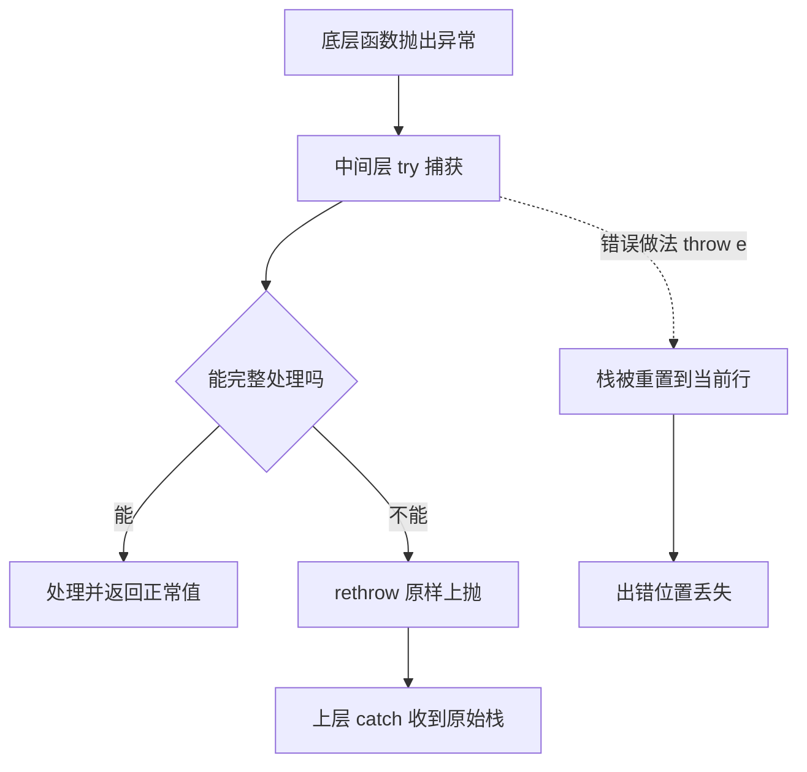

# 10 异常处理

> C 报告错误靠返回值与 errno：调用方必须逐个检查，忘记检查就让错误静默传播；`setjmp/longjmp` 想模拟异常又容易破坏资源状态。Dart 用结构化的 try/catch/finally 把「正常路径」与「错误路径」分开，异常携带类型、对象与完整栈追踪。本章讲清 Exception 与 Error 的分工、捕获语法、自定义异常、栈追踪，以及异常与返回码之间的取舍。

---

## 一、Exception 与 Error

Dart 的异常对象分两大家族，语义完全不同：

| 家族 | 含义 | 典型成员 | 是否应该捕获 |
|------|------|----------|--------------|
| `Exception` | 可预期的业务/环境错误 | `FormatException`、`IOException`、`TimeoutException` | 应该捕获并处理 |
| `Error` | 程序 bug，逻辑写错 | `ArgumentError`、`StateError`、`TypeError`、`RangeError` | 通常不捕获，应该修复代码 |

```dart
void main() {
  // FormatException：输入格式错误，属于可恢复的异常
  try {
    print(int.parse('abc'));
  } on FormatException catch (e) {
    print('格式错误: ${e.message}');    // 格式错误: Invalid radix-10 number (at character 1)
  }

  // RangeError：下标越界，属于 Error，通常意味着代码有 bug
  try {
    print([1, 2, 3][10]);
  } on RangeError catch (e) {
    print('越界: ${e.message}');        // 越界: Invalid value
  }
}
```

| 维度 | C errno | Dart Exception | Dart Error |
|------|---------|----------------|------------|
| 携带信息 | 全局整数 + 字符串 | 类型 + 对象 + 栈 | 类型 + 对象 + 栈 |
| 传递方式 | 返回值手工检查 | 自动沿调用栈上抛 | 同左 |
| 可忽略性 | 极易被忽略 | 不捕获就终止（有日志） | 同左 |
| 语义 | 所有错误一视同仁 | 预期内的失败 | 程序缺陷 |
| 处理建议 | 立即检查 | 按类型捕获恢复 | 修复代码，不兜底 |

---

## 二、try / catch / on / finally

### 2.1 基本语法

```dart
void main() {
  // on 指定类型，只捕获匹配的异常
  try {
    final n = int.parse('42x');
    print(n);
  } on FormatException {
    print('捕获到格式异常');           // 捕获到格式异常
  } catch (e) {
    print('兜底捕获: $e');             // 其他类型异常走这里
  } finally {
    print('无论如何都执行');           // 无论如何都执行
  }
}
```

### 2.2 catch 的对象与栈

```dart
void main() {
  try {
    throw StateError('状态不对');
  } catch (e, st) {                   // e 是异常对象，st 是栈追踪
    print('类型: ${e.runtimeType}');  // 类型: StateError
    print('消息: $e');                // 消息: Bad state: 状态不对
    print('栈的第一帧: ${st.toString().split('\n')[1]}');
  }
}
```

### 2.3 多类型与组合

```dart
void main() {
  for (final input in ['12', 'abc', '0']) {
    try {
      final n = int.parse(input);
      print(100 ~/ n);
    } on FormatException catch (e) {
      print('$input 不是数字: ${e.message}');
    } on UnsupportedError {
      print('$input 不支持该运算');
    } on Object catch (e) {          // 等价于 catch (e)，捕获一切
      print('其他: ${e.runtimeType}');
    } finally {
      print('--- $input 处理完毕');
    }
  }
}
```

| 子句 | 作用 | 匹配范围 |
|------|------|----------|
| `on Type` | 按类型捕获 | 该类型及其子类 |
| `on Type catch (e)` | 按类型捕获并拿对象 | 该类型及其子类 |
| `catch (e, st)` | 捕获一切，拿对象与栈 | 所有异常 |
| `on Object catch (e)` | 显式「捕获一切」 | 所有异常（含 Error） |
| `finally` | 收尾清理，总是执行 | 不参与匹配 |

---

## 三、rethrow：重新抛出

捕获后如果无法真正处理，应该用 `rethrow` 原样抛回，保留原始栈信息；用 `throw e` 会重置栈，丢失出错位置。

```dart
void loadConfig(String path) {
  try {
    throw FormatException('配置格式错误: $path');
  } on FormatException {
    print('记录日志: 配置读取失败');
    rethrow;                        // 栈信息保留，交给上层处理
  }
}

void main() {
  try {
    loadConfig('app.yaml');
  } on FormatException catch (e, st) {
    print('上层收到: ${e.message}');
    print('原始位置仍在栈中: ${st.toString().contains('loadConfig')}');   // true
  }
}
```



---

## 四、自定义异常

业务错误应该定义专属异常类型，让上层能精确捕获，而不是靠解析字符串消息：

```dart
// 1. 简单实现：implements Exception，提供 toString
class InsufficientBalanceException implements Exception {
  final int required;
  final int available;

  InsufficientBalanceException(this.required, this.available);

  @override
  String toString() =>
      'InsufficientBalanceException: 需要 $required 元，仅有 $available 元';
}

class Account {
  int balance;

  Account(this.balance);

  void withdraw(int amount) {
    if (amount > balance) {
      throw InsufficientBalanceException(amount, balance);
    }
    balance -= amount;
  }
}

void main() {
  final account = Account(100);
  try {
    account.withdraw(250);
  } on InsufficientBalanceException catch (e) {
    print(e);                          // 完整信息
    print('缺口: ${e.required - e.available} 元');   // 缺口: 150 元
  }
}
```

也可以继承已有的 Exception 类（如 `FormatException`）复用消息字段。约定：自定义异常类名以 `Exception` 结尾，且实现 `Exception` 接口。

---

## 五、栈追踪 StackTrace

栈追踪是定位问题的第一手资料，Dart 会自动附加到未捕获异常的输出里：

```dart
void a() => b();
void b() => c();
void c() => throw Exception('出错了');

void main() {
  try {
    a();
  } catch (e, st) {
    print('异常: $e');
    // 打印完整栈，每行一个调用帧
    print(st);
    // 也可以格式化输出前几帧
    final frames = st.toString().trim().split('\n').take(3).join('\n');
    print('关键帧:\n$frames');
  }
}
```

| 维度 | C | Dart |
|------|---|------|
| 出错位置 | `__FILE__`/`__LINE__` 手工打印 | 栈追踪自动携带 |
| 调用链 | 靠 backtrace 库或调试器 | 异常对象自带 StackTrace |
| 日志记录 | 手写 | `catch (e, st)` 一起落盘 |
| 符号化 | 需编译选项 | 开发期直接可读，AOT 产物可用 `--obfuscate` 混淆 |

---

## 六、与 C 的错误处理对比

```c
/* C：返回值 + errno，调用方逐层检查，忘记检查就静默失败 */
int read_config(const char *path, Config *out) {
    FILE *f = fopen(path, "r");
    if (!f) return -1;                    /* 调用方必须检查 */
    if (parse(f, out) != 0) { fclose(f); return -2; }
    fclose(f);
    return 0;
}

/* C：setjmp/longjmp 模拟异常，但跳过清理逻辑，极易泄漏资源 */
jmp_buf env;
if (setjmp(env) == 0) {
    risky_operation();                    /* 内部 longjmp(env, 1) */
} else {
    /* 跳到这里，中间的资源谁释放？ */
}
```

| 维度 | C 返回码 | C setjmp/longjmp | Dart 异常 |
|------|----------|------------------|-----------|
| 错误传递 | 手工逐层检查 | 非局部跳转 | 自动上抛 |
| 忘记处理 | 静默继续 | 未定义行为 | 程序终止并打印栈 |
| 清理逻辑 | 每个错误分支手写 | 常被跳过，易泄漏 | `finally` 保证执行 |
| 类型信息 | errno 整数 | 无 | 异常类型层次 |
| 携带数据 | 全局 errno | 无 | 任意对象 |
| 性能 | 几乎为零 | 低 | 抛出时较贵，正常路径近乎零成本 |

**结论**：C 的返回码适合「高频、可预期」的错误（如 `read` 返回 -1）；Dart 中高频路径也可以用返回码（如 `int.parse` 之外的 `tryParse`），真正的失败才用异常。

---

## 七、Zone 错误处理概览

`Zone` 是 Dart 的「错误处理域」：可以为一段代码指定统一的未捕获异常处理器，适合全局日志与兜底。异步代码中未被捕获的异常会交给所在 Zone 的处理器，而不是立刻崩溃。

```dart
import 'dart:async';

void main() {
  // 在自定义 Zone 中运行，统一拦截未捕获异常
  runZonedGuarded(
    () {
      // 这个异常没有任何 try/catch，会被 Zone 捕获
      Timer.run(() => throw StateError('异步中的未捕获异常'));
      print('主流程继续执行');
    },
    (error, stack) {
      print('Zone 捕获: $error');
      // 实际项目中在这里写日志、上报崩溃平台
    },
  );
}
```

Flutter 框架的 `runApp` 与 `FlutterError.onError` 就是基于 Zone 的机制。异常类型与 Zone 的配合在 [[dart/3框架/01_Flutter入门|01 Flutter 入门]] 会再次出现。

---

## 八、异常 vs 返回错误：如何取舍

| 场景 | 推荐方式 | 理由 |
|------|----------|------|
| 可预期的输入解析失败 | `tryParse` 返回 null | 高频、调用方本来就要校验 |
| 业务规则失败（余额不足） | 抛自定义异常 | 正常路径不应携带错误分支 |
| 编程错误（参数非法） | 抛 `ArgumentError`/`StateError` | 尽早暴露 bug |
| 资源获取失败（文件、网络） | 抛异常 | 调用栈深层，返回码难以逐层传递 |
| 批量操作中部分失败 | 返回结果对象（如 `(int, List<String>)`） | 部分成功需要继续 |

```dart
// 返回错误对象：适合「失败是常态」的场景
({bool ok, int? value, String? error}) parseIntSafe(String s) {
  final v = int.tryParse(s);
  return v != null ? (ok: true, value: v, error: null) : (ok: false, value: null, error: '不是数字');
}

void main() {
  final r = parseIntSafe('42');
  print(r.ok ? r.value : r.error);     // 42
}
```

---

## 常见坑

1. **`catch (e)` 捕获一切**：连 `Error`（程序 bug）也吞掉，问题被掩盖；优先用 `on 具体类型`，兜底再考虑 `catch`
2. **吞异常**：`try { ... } catch (_) {}` 什么都不做，排查时毫无线索；至少记录日志或 `rethrow`
3. **用 `throw e` 代替 `rethrow`**：栈被重置到当前行，丢失原始出错位置
4. **`finally` 中写 `return`**：会覆盖 try/catch 的返回值，甚至吞掉异常，分析器会给出 `control_flow_in_finally` 警告
5. **在 `finally` 中抛新异常**：原始异常被替换，排查方向被带偏；finally 只做清理
6. **异步异常没有 await 导致未捕获**：`fetch();` 不 await，Future 里的异常无人处理，会触发 Zone 的未捕获处理
7. **把 `Error` 当业务异常处理**：`RangeError` 说明下标算错了，应该修代码而不是 try/catch 兜底
8. **自定义异常不实现 `Exception`**：Dart 不强制，但约定上应 `implements Exception` 并重写 `toString`

---

## 本章小结

- `Exception` 是可预期的失败，应该捕获；`Error` 是程序缺陷，应该修复而不是兜底
- `try/on/catch/finally` 结构化处理错误：`on` 按类型匹配、`catch (e, st)` 拿对象与栈、`finally` 保证清理
- 无法处理时用 `rethrow` 保留原始栈；`throw e` 会重置栈，慎用
- 自定义异常实现 `Exception` 接口，携带业务字段，让上层按类型精确捕获
- StackTrace 自动携带调用链，日志中应连同异常对象一起记录
- 对比 C：异常替代 errno 的逐层检查，`finally` 替代 goto cleanup 的清理逻辑
- Zone 提供全局未捕获异常兜底，是 Flutter 框架错误处理的基础
- 高频、可预期的失败用返回值（`tryParse`、结果 Record），真正的异常状况才 throw

---

## 练习

| 题号 | 题目 | 链接 | 知识点 |
|------|------|------|--------|
| P5726 | 打分 | https://www.luogu.com.cn/problem/P5726 | 数组、去极值、异常边界 |

题目有 n 个评委打分，去掉一个最高分和一个最低分后求平均，保留 2 位小数。要点是用集合排序去极值，并练习对「空输入、元素不足」等边界做防御：这正是异常处理里「先判断前置条件」的思维。

```dart
import 'dart:io';

class EmptyScoreException implements Exception {
  @override
  String toString() => 'EmptyScoreException: 没有有效的打分';
}

double averageScore(List<int> scores) {
  if (scores.length < 3) {
    throw EmptyScoreException();          // 元素不足以去极值
  }
  final sorted = [...scores]..sort();     // 拷贝后排序，不改原数据
  final middle = sorted.sublist(1, sorted.length - 1);
  return middle.reduce((a, b) => a + b) / middle.length;
}

void main() {
  final lines = stdin.readAsLinesSync().where((l) => l.trim().isNotEmpty).toList();
  final n = int.parse(lines[0].trim());
  final scores = [
    for (var i = 1; i <= n; i++)
      ...lines[i].trim().split(RegExp(r'\s+')).map(int.parse),
  ];

  try {
    print(averageScore(scores).toStringAsFixed(2));
  } on EmptyScoreException catch (e) {
    print(e);
  }
}
```

- 返回目录：[[dart/dart目录|Dart 教程目录]]
