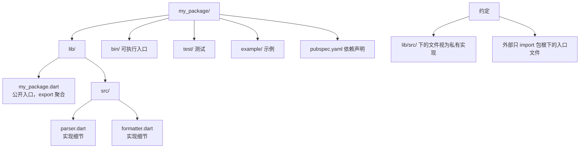
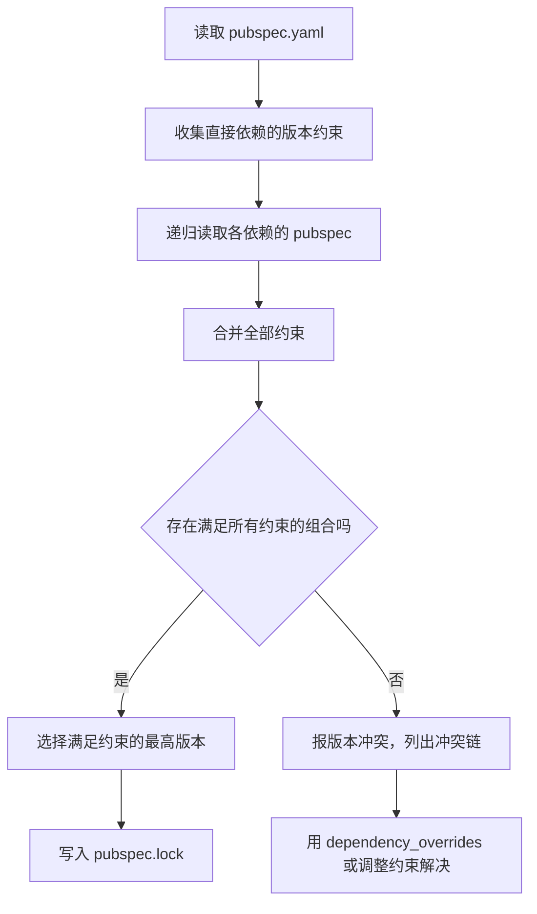

# 11 包管理与模块

> C 的模块化靠头文件与链接器：`.h` 声明接口、`.c` 提供实现、Makefile 描述依赖，第三方库要么 vendoring 源码，要么系统装 dev 包再 `pkg-config`。Dart 把这套流程收进 `pub`：一个 `pubspec.yaml` 声明依赖，`dart pub get` 自动下载并解析版本，`import` 直接按库名引用。本章覆盖 import/export/part 指令、pubspec 逐字段解读、语义化版本、依赖来源、条件导入，以及 package 与 application 的区别。

---

## 一、import：模块的第一入口

Dart 中每个 `.dart` 文件是一个库（library），`import` 引入其他库：

```dart
// 1. dart: 前缀：SDK 内置库
import 'dart:io';          // 文件、进程、网络（服务端/桌面）
import 'dart:math' as math; // 起别名，避免命名冲突

// 2. package: 前缀：pub 依赖
import 'package:path/path.dart' as p;

// 3. 相对路径：同一项目内的文件
import 'models/student.dart';

void main() {
  print(math.sqrt(16));                    // 4.0
  print(p.join('a', 'b', 'c.dart'));       // a/b/c.dart
  print(Platform.operatingSystem);         // linux / windows / macos
}
```

| import 形式 | 写法 | 用途 |
|-------------|------|------|
| SDK 库 | `import 'dart:async';` | 语言内置能力 |
| 包依赖 | `import 'package:http/http.dart';` | pub 生态的第三方包 |
| 相对路径 | `import '../utils/log.dart';` | 项目内跨目录引用 |
| 别名 | `import 'dart:math' as math;` | 解决重名，或强调来源 |
| 部分导入 | `import 'dart:math' show max;` | 只导入指定成员 |
| 排除导入 | `import 'dart:math' hide min;` | 排除指定成员 |

```dart
import 'dart:math' show max;
import 'dart:math' hide min;

void main() {
  print(max(1, 2));     // 2
  // print(min(1, 2));  // 编译错误：min 被 hide 了
}
```

---

## 二、export、part 与 library 指令

### 2.1 export：转发库

`export` 不导入任何符号到当前文件，而是让「导入当前库的人」也看到被导出的库。包的入口文件常用它聚合 API：

```dart
// lib/my_package.dart —— 包的门面文件
export 'src/parser.dart';              // 使用者 import 'package:my_package/my_package.dart'
export 'src/formatter.dart' show format;   // 只导出部分成员
```

### 2.2 part / part of：把一个库拆成多文件

`part` 让多个文件共享同一个库的私有作用域（`_` 成员互相可见），适合代码生成文件：

```dart
// lib/model.dart
library;

part 'model.g.dart';        // 声明该文件属于本库

class User {
  final String name;
  User(this.name);
}
```

```dart
// lib/model.g.dart —— 生成代码，不要手改
part of 'model.dart';       // 声明自己的宿主

// 可以访问宿主库的私有成员，因为属于同一个库
```

| 指令 | 作用 | 私有成员可见性 |
|------|------|----------------|
| `import` | 引入另一个库 | 不可见 |
| `export` | 转发给下游使用者 | 不可见 |
| `part` | 把文件并入当前库 | 互相可见 |
| `part of` | 声明属于哪个库 | 同左 |
| `library` | 给库命名/挂注解（Dart 3 中命名已可选） | — |

### 2.3 库的组织约定



`lib/src/` 是社区约定：放在这里的文件外部不应直接 import（分析器会给出 `implementation_imports` 提示），修改它们不算破坏性变更。

---

## 三、pubspec.yaml 逐字段解读

```yaml
name: student_tools            # 包名：小写 + 下划线，不能与已有包重名
description: 一个学生成绩处理工具库。   # 一句话描述，发布时必填
version: 1.2.3                 # 语义化版本，发布后不可修改
repository: https://github.com/example/student_tools   # 源码地址
environment:
  sdk: '>=3.0.0 <4.0.0'        # 支持的 Dart SDK 范围
dependencies:
  path: ^1.9.0                 # 运行期依赖
  collection: '>=1.17.0 <2.0.0'
dev_dependencies:
  test: ^1.24.0                # 仅开发/测试用
  lints: ^3.0.0
```

| 字段 | 是否必填 | 作用 |
|------|:---:|------|
| `name` | 是 | 包名，import 时使用；全小写、下划线分隔 |
| `description` | 发布必填 | 一句话描述，显示在 pub.dev |
| `version` | 发布必填 | 语义化版本 `主.次.补丁` |
| `environment.sdk` | 是 | 兼容的 Dart SDK 范围，约束解析结果 |
| `dependencies` | 否 | 运行期依赖，会被使用者一并安装 |
| `dev_dependencies` | 否 | 开发期依赖，不会传递给使用者 |
| `dependency_overrides` | 否 | 强制覆盖版本，临时排查冲突用 |
| `repository` / `homepage` | 发布建议 | 源码与主页地址 |

`pubspec.lock` 是解析结果的锁定文件：**application 应该提交它**，保证团队与 CI 安装完全一致的版本；**package 不应提交它**，以免限制使用者的解析空间。

---

## 四、语义化版本与 pub 解析规则

版本号形如 `1.2.3`，含义是：主版本（不兼容变更）、次版本（向后兼容的新功能）、补丁（向后兼容的修复）。

| 约束写法 | 含义 | 允许升级到 |
|----------|------|------------|
| `1.2.3` | 精确版本 | 只能 1.2.3 |
| `^1.2.3` | 兼容约束，等价 `>=1.2.3 <2.0.0` | 1.x 的最高版 |
| `^0.2.3` | 0.x 特殊：等价 `>=0.2.3 <0.3.0` | 0.2.x（0.x 视为不稳定） |
| `>=1.2.3 <2.0.0` | 显式区间 | 区间内任意版本 |
| `any` | 任意版本 | 最新版（不推荐，易被破坏） |
| `>=1.2.3` | 只有下界 | 未来主版本也可能被选中（危险） |

解析流程：pub 收集所有依赖的约束，求一个**同时满足所有约束**的版本组合，优先选最新版本：



```bash
# 常用命令
dart pub get          # 按 pubspec.yaml 解析并下载依赖（改完依赖必跑）
dart pub upgrade      # 在约束范围内升级到最新版本
dart pub upgrade --major-versions   # 突破约束升级主版本（会改 pubspec）
dart pub outdated     # 列出可升级的依赖与当前版本
dart pub add http     # 添加依赖并自动写入 pubspec.yaml
dart pub add dev:test # 添加开发依赖
dart pub remove http  # 移除依赖
dart pub deps         # 打印依赖树
```

| 命令 | 修改 pubspec.yaml | 修改 lock | 用途 |
|------|:---:|:---:|------|
| `pub get` | 否 | 可能 | 安装/同步依赖 |
| `pub upgrade` | 否 | 是 | 约束内升级 |
| `pub upgrade --major-versions` | 是 | 是 | 升级并放开约束 |
| `pub outdated` | 否 | 否 | 查看可升级项 |
| `pub add` | 是 | 是 | 添加依赖 |

---

## 五、pub.dev 生态与评分

[pub.dev](https://pub.dev/) 是官方包仓库，每个包页面有三维评分：

| 维度 | 检查内容 | 提高方式 |
|------|----------|----------|
| 约定（Convention） | 命名、`lib/src` 组织、文档注释、CHANGELOG | 遵循官方布局，公开成员写 `///` 文档 |
| 文档（Documentation） | 是否有 example、README 是否完整 | 提供 `example/` 与清晰 README |
| 平台支持 | 声明支持哪些平台 | `pubspec.yaml` 中 `platforms` 字段 |
| 流行度（Popularity） | 下载量与使用者比例 | 长期积累 |
| 评分（Points） | 静态分析与依赖健康度 | 零 analyze 警告、依赖最新 |

选包时的检查清单：

1. 最近更新时间与维护活跃度
2. Dart 3 兼容性（SDK 约束是否含 `>=3.0.0`）
3. 是否支持空安全
4. 测试覆盖率与 issue 响应速度
5. 许可证（MIT/BSD/Apache 更宽松）

---

## 六、依赖来源：托管、git、path

```yaml
dependencies:
  # 1. 默认：pub.dev 托管
  http: ^1.2.0

  # 2. path：本地路径依赖，适合 monorepo 内部包
  shared_models:
    path: ../shared_models

  # 3. git：直接依赖仓库
  my_fork:
    git:
      url: https://github.com/example/my_fork.git
      ref: v1.0.0          # 可以是 tag、分支或 commit hash
      path: packages/my_fork   # 若包在仓库子目录

  # 4. 私有 pub 服务（企业内网）
  internal_sdk:
    hosted:
      name: internal_sdk
      url: https://pub.example.com
    version: ^0.5.0
```

| 来源 | 写法 | 适用场景 | 注意事项 |
|------|------|----------|----------|
| 托管 | `pkg: ^1.0.0` | 公开第三方包 | 版本约束必须写 |
| path | `path: ../pkg` | 本地多包仓库 | 发布到 pub.dev 前必须移除 |
| git | `git: {url, ref}` | 临时用 fork 或未发布包 | 解析慢，无版本语义 |
| 私有托管 | `hosted: {name, url}` | 企业内部包 | 需配置认证 token |

---

## 七、条件导入：跨平台兼容

同一个包要同时支持服务端（`dart:io`）与 Web（`dart:html`/`package:web`）时，用条件导入在编译期选择实现：

```dart
// lib/platform_info.dart —— 统一接口
export 'platform_stub.dart'
    if (dart.library.io) 'platform_io.dart'      // 有 dart:io 时选它
    if (dart.library.js_interop) 'platform_web.dart';   // Web 平台选它
```

```dart
// lib/platform_stub.dart
String platformName() => 'unknown';

// lib/platform_io.dart
import 'dart:io';
String platformName() => Platform.operatingSystem;

// lib/platform_web.dart
String platformName() => 'web';
```

```dart
import 'platform_info.dart';

void main() {
  print(platformName());   // 服务端输出 linux/windows/macos，Web 输出 web
}
```

条件导入在 `dart compile js` 与 `dart compile exe` 时分别裁剪，不会把 `dart:io` 代码带进 Web 产物。

---

## 八、package 与 application

| 维度 | package（库） | application（应用） |
|------|---------------|---------------------|
| 入口 | 无 `main`，供他人 import | 有 `bin/` 或 Flutter 的 `lib/main.dart` |
| 发布 | `dart pub publish` 到 pub.dev | 不发布到 pub.dev |
| 依赖 | 声明为 `dependencies` 供下游使用 | 只服务自身 |
| pubspec.lock | 不提交（避免限制下游） | 提交（保证构建一致） |
| 版本 | 每次发布必须递增 | 无强制语义 |
| 私有代码 | 放 `lib/src/` | 随意组织 |
| 创建命令 | `dart create -t package my_lib` | `dart create -t console my_app` |

发布包的基本流程（工程化篇展开）：

```bash
dart pub publish --dry-run   # 检查将上传哪些文件、是否有警告
dart pub publish             # 真正发布，版本号必须未使用过
```

发布前必须：README 完整、CHANGELOG 更新、`dart analyze` 无警告、`dart test` 全绿、`example/` 可运行。详见 [[dart/4工程化/03_包发布与私有仓库|03 包发布与私有仓库]]。

---

## 常见坑

1. **改完 `pubspec.yaml` 忘记 `dart pub get`**：编辑器报「Target of URI doesn't exist」，先跑一次 `pub get` 再排查
2. **把测试依赖放进 `dependencies`**：会传染给所有使用者；测试、lint、构建工具一律放 `dev_dependencies`
3. **依赖冲突**：两个包要求同一个库的不兼容版本，用 `dart pub deps` 看依赖树，用 `dart pub outdated` 找升级空间；`dependency_overrides` 只能临时用
4. **package 提交了 `pubspec.lock`**：下游解析被锁死，升级困难；application 才需要提交 lock
5. **相对导入跨 package**：`import '../../other_package/lib/x.dart'` 会让依赖关系断裂，跨包必须用 `package:` 前缀
6. **`any` 版本约束**：任何破坏性升级都会被自动拉入，生产项目应使用 `^` 约束
7. **path 依赖随包发布**：`dart pub publish --dry-run` 会直接拒绝含 path 依赖的包
8. **直接 import `lib/src/` 下的文件**：分析器警告 `implementation_imports`，升级依赖时这些文件随时可能重构
9. **`part` 文件手写修改**：代码生成产物重跑会覆盖，应改生成源（注解 + build_runner）

---

## 本章小结

- 每个 `.dart` 文件是一个库；`import` 引入、`export` 转发、`part` 合并共享私有作用域
- `as` 别名、`show`/`hide` 精确控制导入范围；SDK 库用 `dart:` 前缀，第三方用 `package:` 前缀
- `pubspec.yaml` 声明包元信息与依赖；`environment.sdk` 约束 SDK 版本，`dependencies` 与 `dev_dependencies` 严格分工
- 语义化版本：`^1.2.3` 是最常用的兼容约束；`^0.x` 按 0.x 不稳定规则解析；pub 求解同时满足所有约束的最新组合
- `pub get/upgrade/outdated/add/deps` 覆盖日常依赖管理；application 提交 lock，package 不提交
- 依赖来源支持托管、path、git、私有托管；条件导入实现 `dart:io` 与 Web 的编译期分平台
- package 与 application 的组织、发布要求不同；发布前必须 dry-run、更新 CHANGELOG、保证 analyze/test 通过
- 模块系统的对比：C 的头文件 + 链接器 + pkg-config，对应 Dart 的 import + pub 解析 + pubspec 声明

---

## 练习

| 题号 | 题目 | 链接 | 知识点 |
|------|------|------|--------|
| P1598 | 垂直柱状图 | https://www.luogu.com.cn/problem/P1598 | 字符串统计、Map |

题目给出 4 行大写字母文本，要求统计每个字母出现次数，并画出垂直柱状图（先输出最高频次数那一行，逐行递减，最后一行是 A 到 Z）。要点是用 Map 统计词频，再按行扫描输出，体会「声明式统计 + 格式化输出」的组合。

```dart
import 'dart:io';

void main() {
  // 读入 4 行，拼接后只保留大写字母
  final text = stdin.readAsLinesSync().take(4).join();

  // 用 Map 统计每个字母出现次数
  final counts = <String, int>{};
  for (final ch in text.split('')) {
    if (ch.codeUnitAt(0) >= 65 && ch.codeUnitAt(0) <= 90) {
      counts[ch] = (counts[ch] ?? 0) + 1;
    }
  }

  // 字母表 A-Z，未出现的按 0 处理
  const letters = 'ABCDEFGHIJKLMNOPQRSTUVWXYZ';
  final freq = [for (final c in letters.split('')) counts[c] ?? 0];
  final maxCount = freq.reduce((a, b) => a > b ? a : b);

  // 从最高行往下画
  final buffer = StringBuffer();
  for (var level = maxCount; level >= 1; level--) {
    final row = [
      for (final f in freq) f >= level ? '*' : ' ',
    ].join(' ');
    buffer.writeln(row.trimRight());
  }
  buffer.writeln(letters.split('').join(' '));
  stdout.write(buffer);
}
```

- 返回目录：[[dart/dart目录|Dart 教程目录]]
